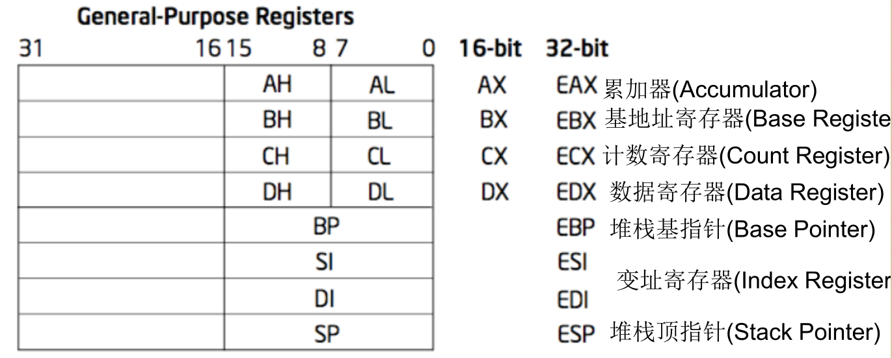
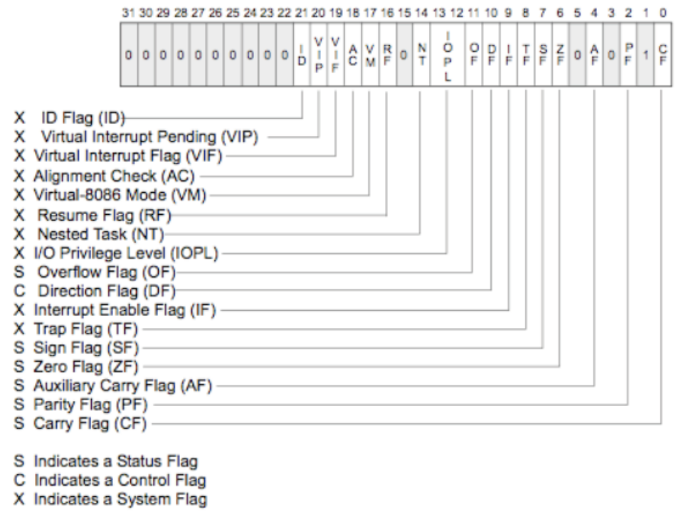
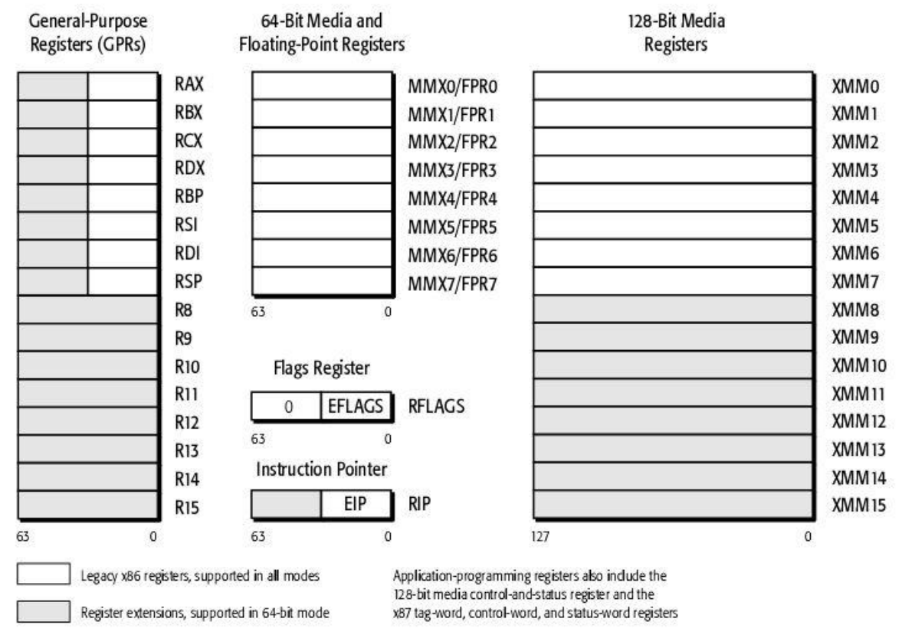
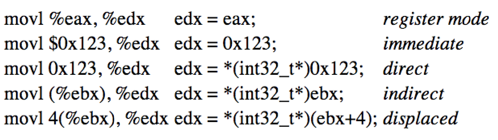
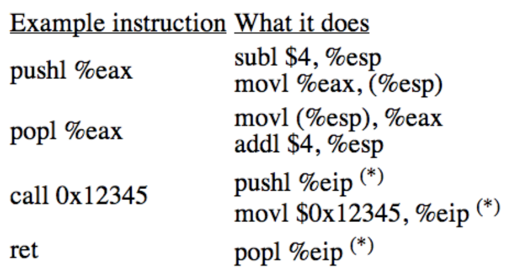

<!-- @import "[TOC]" {cmd="toc" depthFrom=1 depthTo=6 orderedList=false} -->

<!-- code_chunk_output -->

- [1. X86 CPU 的寄存器](#1-x86-cpu-的寄存器)
- [2. X86 汇编指令](#2-x86-汇编指令)
- [3. 练习](#3-练习)
- [4. 参考资料](#4-参考资料)

<!-- /code_chunk_output -->

## 1. X86 CPU 的寄存器

一个 32 位**通用寄存**器如下所示:



- 8, 16, and 32 bit versions: 低八位作为 8 位寄存器, 低 16 位作为 16 位寄存器. 16 位寄存器叫 AX、BP 等, 32 叫 EAX、EBP 等, 我们关注 32 位
- By convention some registers for special purposes
- Example: ADD EAX, 10
- Other instructions: SUB, AND, etc.

通用寄存器还有一些是段寄存器:

- CS——代码段寄存器(Code Segment Register), 其值为
代码段的段值;
- DS——数据段寄存器(Data Segment Register), 其值为
数据段的段值;
- ES——附加段寄存器(Extra Segment Register), 其值为
附加数据段的段值;
- SS——堆栈段寄存器(Stack Segment Register), 其值为
堆栈段的段值;
- FS——附加段寄存器(Extra Segment Register), 其值为
附加数据段的段值;
- GS——附加段寄存器(Extra Segment Register), 其值为
附加数据段的段值.

其中 CS 和 SS 使用最多. 指令是存储在 CS 的, CPU 在实际取指令时根据 CS:EIP 来准确定位一个指令; 每个进程有自己的堆栈.

**标志寄存器**



X86_64 寄存器与 32 位寄存器在核心机制上差别不大.



- **通用寄存器**扩展为 64 位, 以 R 开头
- 增加了一些 64 位 Media 和浮点寄存器
- **标志寄存器**EFLAGS 叫 RFLAGS
- **指令寄存器**EIP 叫 RIP
- 增加了 128 位 Media 寄存器

## 2. X86 汇编指令



- Memory instructions: MOV, PUSH, POP, etc
- Most instructions can take a memory address. 多数指令能够直接读取一个内存地址.
- b,w,l,q 分别代表 8 位, 16 位,32 位和 64 位

寄存器对内存的操作方法

- **寄存器模式寻址**. %开头的表示是寄存器标识符. movl %eax, %edx(edx=eax)表示将寄存器 eax 的内容放到 edx 中. 操作寄存器, 不与内存打交道.
- **立即寻址**. movl $0x123, %edx(edx=0x123), $表示一个立即数. 将数值 0x123 放到寄存器 edx 中. 和内存没有关系.
- **直接寻址**. 直接访问一个指定的内存地址的数据. movl 0x123, %edx(edx=\*(int32_t\*)0x123), 没有$符号表示一个地址. 将地址 0x123 的内容放到寄存器 edx 中.
- **间接寻址**. movl (%ebx), %edx(edx=\*(int32_t\*)ebx). (%ebx)是两部分: %寄存器 ebx 是取内容, 括号表示该内容(是一个内存地址)对应的值
- **变址寻址(displaced)**. movl 4(%ebx), %edx(edx=\*(int32_t\*)(ebx+4)). 在间接寻址之时改变寄存器的数值.

AT&T 汇编格式与 Intel 汇编格式略有不同, Linux 内核使用的是 AT&T 汇编格式

还有几个重要的指令

push、pop、call、ret



- pushl %eax: pushl 表示 32 位, 把 eax 这个寄存器的内容压栈到栈顶. 实际上两个动作: [subl $4, %esp], ebp 表示栈底(堆栈由高地址向低地址增长), esp 指向栈顶, 堆栈向下增长, 将 esp(栈顶)减 4(32 位, 4 字节); [movl %eax, (%esp)]]

- popl %eax: 取栈顶 32 位的内容放到寄存器 eax 中. 两个动作, [movl (%esp), %eax], [addl $4, %esp]

- call 0x12345: 调用这个地址(比如函数调用), 两个动作, [pushl %eip], 将当前的 eip 压栈; [movl $0x12345, %eip], 将 12345 十六进制立即数放到寄存器 eip 中.

- ret: return. 相当于 popl %eip, 将之前保存的 eip 还原到寄存器 eip 中继续执行.

上面对 eip 的操作实际上程序员无法操作, eip 寄存器不能被直接修改, 只能通过特殊指令间接修改(比如 call、ret); 上面(%esp)等操作以及高地址向低生成堆栈说明使用了存储器堆栈, 寄存器 esp 中存放的是内存地址.

## 3. 练习

分析一段汇编代码

```
···
pushl $8
movl %esp,%ebp
subl $4,%esp
movl $8,(%esp)
···
```

pushl $8: 将 esp(内容是内存地址)减 4, 然后将立即数 8 放到栈顶的位置.

movl %esp,%ebp: 将 esp 的内容放到 ebp, 即 ebp 和 esp 指向同一个位置.

subl $4,%esp: 将 esp 减去 4(立即数)

movl $8,(%esp): 将 8 放到 esp.

再看一段

```
···
pushl $8
movl %esp, %ebp
pushl $8
···
```

pushl $8: 将 esp(内容是内存地址)减 4, 然后将立即数 8 放到栈顶的位置.

movl %esp,%ebp: 将 esp 的内容放到 ebp, 即 ebp 和 esp 指向同一个位置.

再

```
pushl $8
movl %esp,%ebp
pushl %esp
pushl $8
addl $4,%esp
popl %esp
```

## 4. 参考资料
```
Assembly 目录下的《Linux 汇编入门》
//在 64 位环境下编译成 32 位的汇编
gcc -S -o ccode32.s ccode.c -m32
//链接时会缺少构建 32 位可执行程序缺少的包, 使用以下指令安装:
sudo apt-get install libc6-dev-i386
//编译链接成 32 位的可执行文件
gcc -o ccode32 ccode.c -m32
```