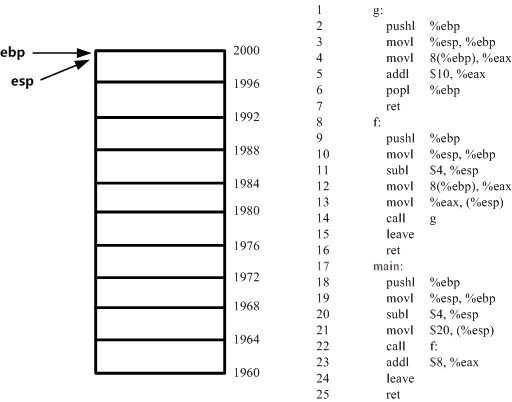

<!-- @import "[TOC]" {cmd="toc" depthFrom=1 depthTo=6 orderedList=false} -->

<!-- code_chunk_output -->

- [1. 反汇编一个简单的 C 程序](#1-反汇编一个简单的-c-程序)
- [2. C 程序和对应的汇编指令](#2-c-程序和对应的汇编指令)
- [3. 完整的汇编程序执行过程分析](#3-完整的汇编程序执行过程分析)

<!-- /code_chunk_output -->

## 1. 反汇编一个简单的 C 程序

指令 enter: 由两条指令组成: pushl %ebp; movl %esp,%ebp. 作用是将栈置空.

指令 leave: 由两条指令组成: movl %ebp,%esp; popl %ebp.

函数调用堆栈是由逻辑上多个堆栈叠加起来的

eip 指令从 main 开始, 会不断自加 1

函数的返回值默认使用 eax 寄存器存储返回给上一级函数

## 2. C 程序和对应的汇编指令

见学习总结 ——》 Jobs ——》 1. How Does a Computer Work

## 3. 完整的汇编程序执行过程分析

动图如下:

