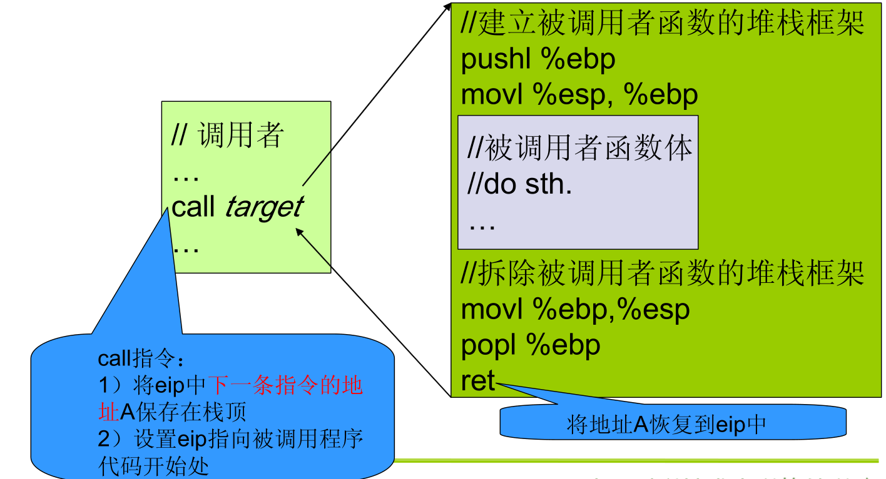
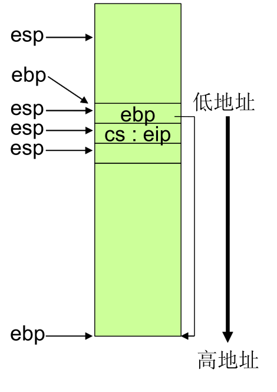

<!-- @import "[TOC]" {cmd="toc" depthFrom=1 depthTo=6 orderedList=false} -->

<!-- code_chunk_output -->

- [1. 三个法宝](#1-三个法宝)
  - [1.1 堆栈](#11-堆栈)
- [2. 深入理解函数调用堆栈](#2-深入理解函数调用堆栈)
  - [2.1 堆栈相关的寄存器](#21-堆栈相关的寄存器)
  - [2.2 堆栈操作](#22-堆栈操作)
  - [2.3 ebp 作用](#23-ebp-作用)
  - [2.4 其他关键寄存器](#24-其他关键寄存器)
  - [2.5 深入理解函数调用堆栈的工作机制](#25-深入理解函数调用堆栈的工作机制)
    - [2.5.1 函数的堆栈框架](#251-函数的堆栈框架)
    - [2.5.2 函数堆栈框架的形成](#252-函数堆栈框架的形成)
- [3. 参数传递与局部变量](#3-参数传递与局部变量)

<!-- /code_chunk_output -->

## 1. 三个法宝

- 存储程序计算机

- 函数调用堆栈

- 中断机制

### 1.1 堆栈

堆栈式 C 语言程序运行时必须的一个记录调用路径和参数的空间

- 函数调用框架

- 传递参数: 32 位 x86 是通过堆栈来传递参数, 64 位有点不同

- 保存返回地址: 默认使用 eax

- 提供局部变量空间

- 等等

C 语言编译器对堆栈的使用有一套规则

了解堆栈存在的目的和编译器对堆栈使用的规则是理解操作系统一些关键性代码的基础

## 2. 深入理解函数调用堆栈

### 2.1 堆栈相关的寄存器

- esp, 堆栈指针(stack pointer)

- ebp, 基址指针(base pointer)

### 2.2 堆栈操作

- push

栈顶地址减少 4 个字节(32 位)

- pop

栈顶地址增加 4 个字节

注: 上面约定在不同 CPU 上可能不同

### 2.3 ebp 作用

在 C 语言中用作记录当前函数调用基址. 在嵌套的函数调用中, ebp 值不一样.

### 2.4 其他关键寄存器

- CS:eip: 总是指向下一条的指令地址

    - 顺序执行: 总是指向地址连续的下一条指令
    - 跳转/分支: 执行这样的指令的时候, cs:eip 的值会根据程序需要被修改
    - call: 把当前 cs:eip 的值压入栈顶, cs:eip 指向被调用函数的入口地址
    - ret: 从栈顶弹出原来保存在这里的 cd:eip 的值, 放入 cs:eip 中
    - 发生中断时候?(中断机制是如何工作的)

### 2.5 深入理解函数调用堆栈的工作机制

#### 2.5.1 函数的堆栈框架

#### 2.5.2 函数堆栈框架的形成

- call xxx

    - 执行 call 之前
    - 执行 call 时, cs:eip 原来的值指向 call 下一条指令, 该值被保存到栈顶, 然后 cs:eip 的值指向 xxx 的入口地址

- 进入 xxx

    - 第一条指令:  pushl %ebp

    - 第二条指令:  movl %esp, %ebp

    - 函数体中的常规操作, 可能会压栈、出栈

- 退出 xxx
    - movl %ebp,%esp
    - popl %ebp
    - ret

## 3. 参数传递与局部变量
