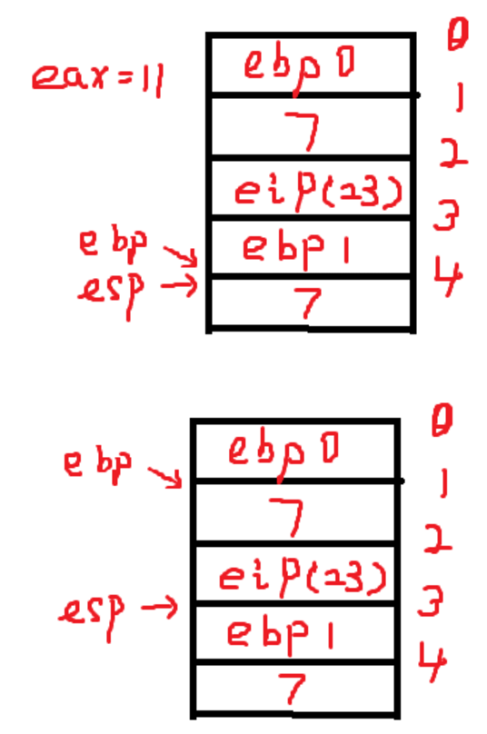

通过反汇编一个简单的 C 程序, 分析汇编代码理解计算机是如何工作的

```
int g(int x)
{
	return x+7;
}

int f(int x)
{
	return g(x);
}

int main(void)
{
	return f(9) + 1;
}
```

编译到汇编语言, -m32 是将 main.c 编译成一个 32 位的汇编代码.

```
gcc -S -o main.s main.c -m32
```

汇编代码:

```
	.file	"main.c"
	.text
	.globl	g
	.type	g, @function
g:
.LFB0:
	.cfi_startproc
	pushl	%ebp
	.cfi_def_cfa_offset 8
	.cfi_offset 5, -8
	movl	%esp, %ebp
	.cfi_def_cfa_register 5
	movl	8(%ebp), %eax
	addl	$7, %eax
	popl	%ebp
	.cfi_restore 5
	.cfi_def_cfa 4, 4
	ret
	.cfi_endproc
.LFE0:
	.size	g, .-g
	.globl	f
	.type	f, @function
f:
.LFB1:
	.cfi_startproc
	pushl	%ebp
	.cfi_def_cfa_offset 8
	.cfi_offset 5, -8
	movl	%esp, %ebp
	.cfi_def_cfa_register 5
	subl	$4, %esp
	movl	8(%ebp), %eax
	movl	%eax, (%esp)
	call	g
	leave
	.cfi_restore 5
	.cfi_def_cfa 4, 4
	ret
	.cfi_endproc
.LFE1:
	.size	f, .-f
	.globl	main
	.type	main, @function
main:
.LFB2:
	.cfi_startproc
	pushl	%ebp
	.cfi_def_cfa_offset 8
	.cfi_offset 5, -8
	movl	%esp, %ebp
	.cfi_def_cfa_register 5
	subl	$4, %esp
	movl	$9, (%esp)
	call	f
	addl	$1, %eax
	leave
	.cfi_restore 5
	.cfi_def_cfa 4, 4
	ret
	.cfi_endproc
.LFE2:
	.size	main, .-main
	.ident	"GCC: (GNU) 4.8.5 20150623 (Red Hat 4.8.5-4)"
	.section	.note.GNU-stack,"",@progbits
```

其中以点开头的是用于链接时的辅助信息, 不会在实际中执行, 删除这些以点开头的内容, 留下纯汇编代码

```
1 g:
2         pushl   %ebp
3         movl    %esp, %ebp
4         movl    8(%ebp), %eax
5         addl    $7, %eax
6         popl    %ebp
7         ret
8 f:
9         pushl   %ebp
10         movl    %esp, %ebp
11         subl    $4, %esp
12         movl    8(%ebp), %eax
13         movl    %eax, (%esp)
14         call    g
15         leave
16         ret
17 main:
18         pushl   %ebp
19         movl    %esp, %ebp
20         subl    $4, %esp
21         movl    $9, (%esp)
22         call    f
23         addl    $1, %eax
24         leave
25         ret
```

与代码对比下:


ebp 指向堆栈的栈底, esp 指向堆栈的栈顶. 函数调用堆栈是由逻辑上多个堆栈叠加起来的, 栈底是相对的栈底. 当前函数有它自己的堆栈和相对的栈底. 跳出当前函数之后另一个函数还有自己的堆栈和栈底.

eax 用于暂存一些数据. 函数的返回值默认使用 eax 寄存器存储返回给上一级函数.

执行过程:

为方便, 将地址设为标号, 初地址为标号 0, 压一次栈为 1, 两个标号之间相差 4 个字节, 低标号是高地址, 高标号是低地址. 起初 ebp 和 esp 为 0(相对的). 程序是从 man 函数开始, 所以刚开始 eip 指向 main 标号的位置, 行号为 17:


标号的第一条指令就是 18 pushl %ebp, 将 ebp 的值压栈, 栈顶位置(esp)移动(减 4), 指向 1 的位置(esp 里面存的是内存地址, 值是 1):


19 movl %esp,%ebp: 将 esp 赋给 ebp(两个寄存器里面都是内存地址, 目前这个值是 1), ebp 也指向了 esp 现在的位置, 栈顶和栈底同一个位置:


20 subl $4,%esp: esp 减去立即数 4(寄存器 esp 中存的是内存地址), 即向下移动一个标号(esp 值是 2):


21 movl $7,(%esp): (%esp)指的是 esp 寄存器的内容是一个内存地址, 该内存地址的值. 将立即数 7 放到该 esp(内存地址)指向的内存:


22 call f: call f 相当于 pushl %eip, 然后 movl f,%eip. 当执行这个 call 动作时候, 实际上 eip 指向的是 call 的下一条指令 23 行. 所以 push 进栈的是 23. esp=3, eip 跳转到 f: 标号的位置第 8 行:


9 pushl %ebp: 此时 ebp=1, 将 1 压栈, esp 到下一个位置, esp=4:


10 movl %esp,%ebp: esp=4, 赋值, ebp=4:


11 subl $4, %esp: esp=4, 将 esp 减去立即数 4, esp 向下移动, esp=5:


12 movl 8(%ebp),%eax: ebp 变址寻址加 8, 向上取 2 个位置, 内容是 7, eax=7

13 movl %eax,(%esp): 将 eax 中的值放到寄存器 esp 内容(地址)所指向的内存:


14 call g: 相当于 push %eip, 然后 movl g,%eip. eip 指向的是 call 下面的一条指令 15 行, 所以压入 15. eip 跳向 g: 标号位置的第 1 行. esp=6:


2 pushl %ebp: ebp=4, 将 4 压栈, esp=7:


3 movl %esp, %ebp: esp=7, 赋值, ebp=7:


4 movl 8(%ebp), %eax: ebp 变址寻址加 8, 向上加两个标号的位置, 它的内容是 7, eax=7

5 addl $4, %eax: 把立即数 4 加到 eax, eax=7+4=11, eax=11

6 popl %ebp: 把 esp 里的内容放到 ebp 里, 然后 esp 向上移动 4, 即 1 个标号, esp=6. 效果是 ebp 又指向了原来标号 4 的位置, ebp=4:


7 ret: ret 就是 popl %eip, 执行之后 eip 指向了第 15 行, 即 call g 的下一行, esp=5:


15 leave: leave 是先 movl %ebp,%esp 然后 popl %ebp, ebp=4, 赋值后 esp=4, pop 后 ebp=1, esp=3:



16 ret: 即 popl %eip, esp 向上移动一位 esp=2, 同时 eip 指向了 23, 程序跳转到执行第 23 行, 即 call f 的下一条指令:


23 addl $2, %eax: eax=11+2=13, eax 存储了默认的返回值.

24 leave: 先 movl %ebp,%esp 再 popl %ebp:


这个时候, 栈回到了 main 函数最初的状态.

25  ret: return 到了 main 函数之前的堆栈了, 可能再 main 函数之前还有一个 eip, 这些由操作系统管理.

整个过程堆栈先是向下增长, 然后向上还原, 堆栈增增减减, 把程序变成了指令流, 从 cpu 上流了一遍.

### 总结

计算机的工作就是 cpu 就是不断的通过 ip 从内存当中取出指令, 解释并执行的. C 语言中的 if else、函数调用、return 等, 对应着汇编当中的 conditional JMP、CALL、RET 等. 通过这些指令来控制程序的流程, ip 指针的跳转. 函数调用时, 会把先前的堆栈(包括信息、状态)保存下来, 然后再在其上叠加一个新的堆栈. 当被调用的函数执行完后, 这个新的堆栈将会弹出, 返回到上一层的函数堆栈, 还可以得到之前堆栈当中保存的信息、状态. 在这个过程当中, eip、ebp、esp、eax 等寄存器不断的变化, 堆栈不断的增减, 整个程序变成指令流, 从 cpu 上流过.

