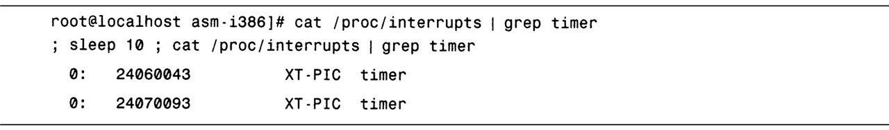

<!-- @import "[TOC]" {cmd="toc" depthFrom=1 depthTo=6 orderedList=false} -->

<!-- code_chunk_output -->

- [1. 不同工具不同方式相似结果](#1-不同工具不同方式相似结果)
- [2. 运行队列统计](#2-运行队列统计)
  - [2.1. 可运行/阻塞进程和运行队列](#21-可运行阻塞进程和运行队列)
  - [2.2. 性能工具: 可运行/阻塞进程个数和平均负载](#22-性能工具-可运行阻塞进程个数和平均负载)
- [3. 上下文切换](#3-上下文切换)
  - [3.1. 上下文切换的定义](#31-上下文切换的定义)
  - [3.2. 上下文切换的发生](#32-上下文切换的发生)
- [4. 中断](#4-中断)
- [5. CPU 使用率](#5-cpu-使用率)
  - [5.1. CPU 的运行状态](#51-cpu-的运行状态)
  - [5.2. CPU 时间百分比](#52-cpu-时间百分比)

<!-- /code_chunk_output -->

# 1. 不同工具不同方式相似结果

**每一种系统级 Linux 性能工具**都提供了**不同的方式**来提取**相似的统计结果**.

虽然没有工具能显示全部的信息, 但是有些工具显示的是**相同的统计信息**.

为了**不多次(每种工具一次**)解释统计信息的含义, 我们在描述所有工具之前对这些信息进行**一次性说明**.

# 2. 运行队列统计

## 2.1. 可运行/阻塞进程和运行队列

在 Linux 中, 一个进程要么是**可运行的**, 要么是**阻塞的**:

* 阻塞进程是正在**等待一个事件的完成！！！**. 可能在**等待**的是从**I/O 设备**来的**数据**, 或者是**系统调用的结果**.
* 如果进程是**可运行**的, 那就意味着它要和其他也是可运行的进程竞争 CPU 时间.

注: **一个进程被调度出去也是可运行态！！！**

一个**可运行**的进程**不一定会使用 CPU！！！**, 但是当 Linux 调度器决定**下一个要运行的进程**时, 它会从**可运行进程队列**中挑选.

如果**进程**是**可运行**的, 同时又在**等待使用处理器**, 这些进程就构成了**运行队列**. 运行队列越长, 处于等待状态的进程就越多.

## 2.2. 性能工具: 可运行/阻塞进程个数和平均负载

**性能工具**通常会给出**可运行的进程个数**和**等待 I/O 的阻塞进程个数**.

另一种常见的系统统计是**平均负载**.

**系统的负载**是指**正在运行**和**可运行的进程总数**. 比如, 如果正在运行的进程为两个, 而可运行的进程为三个, 那么**系统负载就是 5**.

注: **系统的负载不包含阻塞进程！！！**

**平均负载**是**给定时间**内的**负载量**. 一般情况下, 取平均负载的时间为**1 分钟**、**5 分钟**和**15 分钟**. 这能让你观察到负载是如何随时间变化的.

# 3. 上下文切换

## 3.1. 上下文切换的定义

大部分现代处理器一次只能运行一个进程或线程. 虽然有些处理器(比如**超线程处理器**)实际上可以**同时**运行**多个进程**, 但是 Linux 会把它们看作**多个单线程处理器**. 如果要制造出**给定单处理器同时运行多个任务**的假象, Linux 内核就要不断地在不同的进程间切换. 这种不同进程间的切换称为**上下文切换**, 因为当其发生时, CPU 要保存旧进程的所有上下文信息, 并取出新进程的所有上下文信息.

上下文中包含了 Linux 跟踪新进程的**大量信息**, 其中包括: 进程正在执行的指令, 分配给进程的内存, 进程打开的文件等. 这些上下文切换涉及大量信息的移动, 因此, 上下文切换的**开销**可以是**相当大**的.

尽量**减少上下文切换的次数**是个好主意.

## 3.2. 上下文切换的发生

要避免上下文切换, 重要的一点是了解它们是**如何发生**的.

首先, 上下文切换可以是**内核调度**的结果. 为了保证公平地给每个进程分配处理器时间, 内核**周期性**地**中断**正在运行的进程, 在适当的情况下, 内核调度器会决定开始另一个进程, 而不是让当前进程继续执行. 每次这种周期性中断或定时发生时, 你的系统都可能进行上下文切换. **每秒定时中断的次数**与**架构**和**内核版本**有关.

一个检查**中断频率**的简单方法是用/**proc/interrupts 文件**, 它可以确定已知时长内发生的中断次数. 如图所示.

如图, 我们要求内核给出**定时器启动的次数**, 等待 10 秒后, 再次请求. 这就是说, 在这台机器上定时器启动频率为(24070093-24060043)中断/(10 秒)或者约 1000 次中断/秒.

如果你的**上下文切换**明显**多于定时器中断！！！**, 那么这些切换极有可能是由**I/O 请求**或其他**长时间运行的系统调用(如休眠**)造成的. 当应用请求的**操作不能立即完成**时, 内核启动该操作, 保存请求进程, 并**尝试切换**到另一个已就绪进程. 这能**让处理器尽量保持忙状态**.

# 4. 中断

此外, 处理器还**周期性**地**从硬件设备接收中断**. 当设备有事件需要内核处理时, 它通常就会触发这些中断.

比如, 如果磁盘控制器刚刚完成从驱动器取数据块的操作, 并准备好提供给内核, 那么磁盘控制器就会触发一个中断. 对内核收到的每个中断, 如果已经有**相应的**已注册的**中断处理程序**, 就运行该程序, 否则将忽略这个中断. 这些**中断处理程序**在系统中具有**很高的运行优先级**, 并且通常执行速度也很快. 有时, 中断处理程序有工作要做, 但是又不需要高优先级, 因此它可以启动"下半部"(bottom half), 也就是所谓的软中断处理程序. 如果有很多中断, 内核会花大量的时间服务这些中断.

查看/**proc/interrupts**文件可以显示出**哪些 CPU**上触发了**哪些中断**.

# 5. CPU 使用率

CPU 使用率是个简单的概念.

## 5.1. CPU 的运行状态

在**任何给定的时间**, CPU 可以执行以下七件事情中的一个:

(1)CPU 可以是**空闲**的, 这意味着处理器实际上没有做任何工作, 并且等待有任务可以执行.

(2)CPU 可以运行**用户代码**, 即指定的"**用户"时间**.

(3)CPU 可以执行 Linux**内核**中的应用程序代码, 这就是"**系统"时间**.

(4)CPU 可以执行"比较友好"的或者**优先级**被设置为**低于一般进程**的**用户代码**.

(5)CPU 可以处于**iowait**状态, 即系统正在**等待 I/O(如磁盘或网络)完成**.

(6)CPU 可以处于**irq 状态**, 即它正在用**高优先级**代码处理**硬件中断**.

(7)CPU 可以处于**softirq 模式**, 即系统正在执行同样由**中断触发**的**内核代码**, 只不过其运行于**较低优先级**(**下半部代码**).

此情景出现的条件为: 发生**设备中断**时, 而**内核**在将其**移交给用户空间之前**必须对其进行一些处理(比如, **处理网络包**).

## 5.2. CPU 时间百分比

大多数性能工具将这些数值表示为占 CPU 总时间的百分比. 这些时间的范围从 0%到 100%, 但全部三项加起来等于 100%.

一个具有**高"系统"百分比**的系统表明其大部分时间都消耗在了**内核**上.

像**oprofile**一样的工具可以帮助确定时间都消耗在了哪里.

具有**高"用户"时间**的系统则将其大部分时间都用来运行**应用程序**.

如果系统在应该工作的时候花费了大量的时间处于**iowait 状态**, 那它很**可能**在等待来自**设备的 I/O**. 导致**速度变慢**的**原因**可能是**磁盘**、**网卡**或**其他设备**.