<!-- @import "[TOC]" {cmd="toc" depthFrom=1 depthTo=6 orderedList=false} -->

<!-- code_chunk_output -->

- [1. vmstat(虚拟内存统计)](#1-vmstat虚拟内存统计)
  - [1.1. CPU 性能相关的选项](#11-cpu-性能相关的选项)
  - [1.2. 用法示例](#12-用法示例)
- [2. top(2.0.x 版本)](#2-top20x-版本)
  - [2.1. CPU 性能相关的选项](#21-cpu-性能相关的选项)
  - [2.2. 用法示例](#22-用法示例)
- [3. top(3.x.x 版本)](#3-top3xx-版本)
  - [3.1. CPU 性能相关的选项](#31-cpu-性能相关的选项)
  - [3.2. 用法示例](#32-用法示例)
- [4. procinfo(从/proc 文件系统显示信息)](#4-procinfo从proc-文件系统显示信息)
  - [4.1. CPU 性能相关的选项](#41-cpu-性能相关的选项)
  - [4.2. 用法示例](#42-用法示例)
- [5. gnome-system-monitor](#5-gnome-system-monitor)
  - [5.1. CPU 性能相关的选项](#51-cpu-性能相关的选项)
  - [5.2. 用法示例](#52-用法示例)
- [6. mpstat(多处理器统计)](#6-mpstat多处理器统计)
  - [6.1. CPU 性能相关的选项](#61-cpu-性能相关的选项)
  - [6.2. 用法示例](#62-用法示例)
- [7. sar(系统活动报告)](#7-sar系统活动报告)
  - [7.1. CPU 性能相关的选项](#71-cpu-性能相关的选项)
  - [7.2. 用法示例](#72-用法示例)
- [8. oprofile](#8-oprofile)
  - [8.1. CPU 性能相关的选项](#81-cpu-性能相关的选项)
  - [8.2. 用法示例](#82-用法示例)

<!-- /code_chunk_output -->

# 1. vmstat(虚拟内存统计)

vmstat 是指**虚拟内存统计**, 这个名称表明它能告诉你系统的**虚拟内存性能信息**.

实际上远不止于此.

vmstat 是一个很有用的命令, 它能获取整个系统性能的粗略信息, 包括:

* **正在运行**的**进程个数**.
* **CPU**的**使用情况**.
* CPU 接收的**中断个数**.
* 调度器执行的**上下文切换次数**.

它是用于获取系统性能大致信息的极好工具.

## 1.1. CPU 性能相关的选项

vmstat 可以被如下命令行调用:

```
vmstat [-n] [-s] [delay [count]]
```

vmstat 运行于两种模式: **采样模式**和**平均模式**. 如果不指定参数, 则 vmstat 统计运行于平均模式下, vmstat 显示从系统启动以来所有统计数据的均值. 但是, 如果指定了延迟, 那么第一个采样仍然是系统启动以来的均值, 但之后 vmstat 按延迟秒数采样系统并显示统计数据. 表 2-1 解释了 vmstat 的选项.

表 2-1 vmstat 命令行选项:

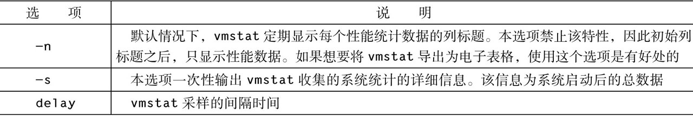

vmstat 提供的各种统计输出信息, 使你能跟踪系统性能的不同方面. 表 2-2 解释了与 CPU 性能相关的输出. 下一章说明与内存性能相关的输出.

表 2-2 与 CPU 相关的 vmstat 输出:

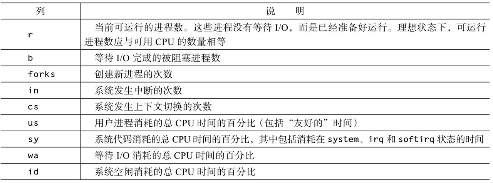

vmstat 提供了一个低开销的良好系统性能视图. 由于所有的性能统计数据都以文本形式呈现, 并打印到标准输出, 因此, 捕捉测试中生成的数据, 以及之后对其进行处理和绘图就会很方便. 由于 vmstat 的开销如此之低, 因此当你需要一目了然地监控系统健康状况时, 让它在控制台上或窗口中持续运行, 甚至是在负载非常重的服务器上是很实用的.

## 1.2. 用法示例

如清单 2.2 所示, 如果 vmstat 运行时没有使用命令行参数, 显示的将是自系统启动后它记录下的统计信息的均值. 根据"CPU 使用率"列下面的 us、sy、wa 和 id, 本例显示出系统从启动开始, 基本上处于空闲状态. 从启动开始, CPU 有 5%的时间用于执行用户应用程序代码, 1%的时间用于执行系统代码, 而其余 94%的时间处于空闲状态.

清单 2.2:

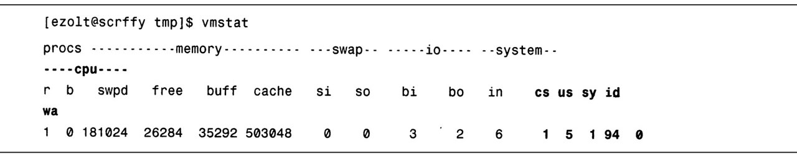

尽管 vmstat 从系统启动时开始统计有助于确定系统的负载情况, 但是, vmstat 最有用的是运行于采样模式下, 如清单 2.3 所示. 在采样模式下, vmstat 间隔 delay 参数指定的秒数输出系统统计数据, 而采样次数由 count 给出. 清单 2.3 第一行的统计数据和之前一样, 是系统启动以来的均值, 但之后就是定期采样. 本例展示出系统的活动非常少. 通过查看 b 列下面的 0, 我们可以知道在运行时没有阻塞进程. 通过查看 r 列, 我们还可以看到在 vmstat 采样数据时, 正在运行的进程数量少于 1.

清单 2.3:

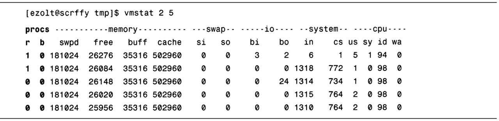

vmstat 是一种记录系统在一定负载或测试条件下行为的好方法. 可以用 vmstat 显示系统的行为, 同时利用 Linux 的 tee 命令将结果输出到文件. (第 8 章详细描述了 tee 命令. )如果你只传递了参数 delay, vmstat 就会无限采样. 在测试开始前启动 vmstat, 测试结束后终止 vmstat. 输出文件的形式可以是电子表格, 并能够用于查看系统对负载和各种系统事件是如何反应的. 清单 2.4 给出了按照这个方法得到的输出. 在这个例子中, 我们可以查看到系统发生的中断和上下文切换. 在 in 列和 cs 列能分别查看到中断和上下文切换的总数.

上下文切换的数量小于中断的数量. 调度器切换进程的次数少于定时器中断触发的次数. 这很可能是因为系统基本上是空闲的, 在定时器中断触发的大多数时候, 调度器没有任何工作要做, 因此它也不需要从空闲进程切换出去.

(注意: 生成如下输出的 vmstat 版本有错误. 它会导致系统输出的平均线显示不正确的数值. 该错误已经报告给了 vmstat 的维护者, 希望能尽快修复. )

清单 2.4:

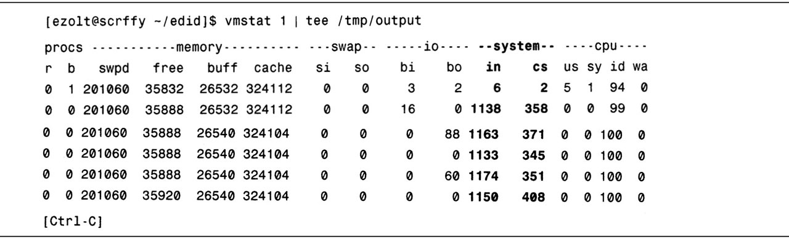

最新版本的 vmstat 甚至可以抽取各种系统统计数据更详细的信息, 如清单 2.5 所示.

下一章讨论内存统计数据, 但是, 现在我们来查看 CPU 的统计信息. 第一组数据, 即"CPU ticks", 显示的是自系统启动的 CPU 时间, 这里的"tick"是一个时间单位. 虽然精简的 vmstat 输出仅显示四个 CPU 状态——us、sy、id 和 wa, 这里则显示了全部 CPU ticks 的分布情况. 此外, 我们还可以看到中断和上下文切换的总数. 一个新添加的内容是 forks, 它大体上表示的是从系统启动开始, 已经创建的新进程的数量.

清单 2.5:

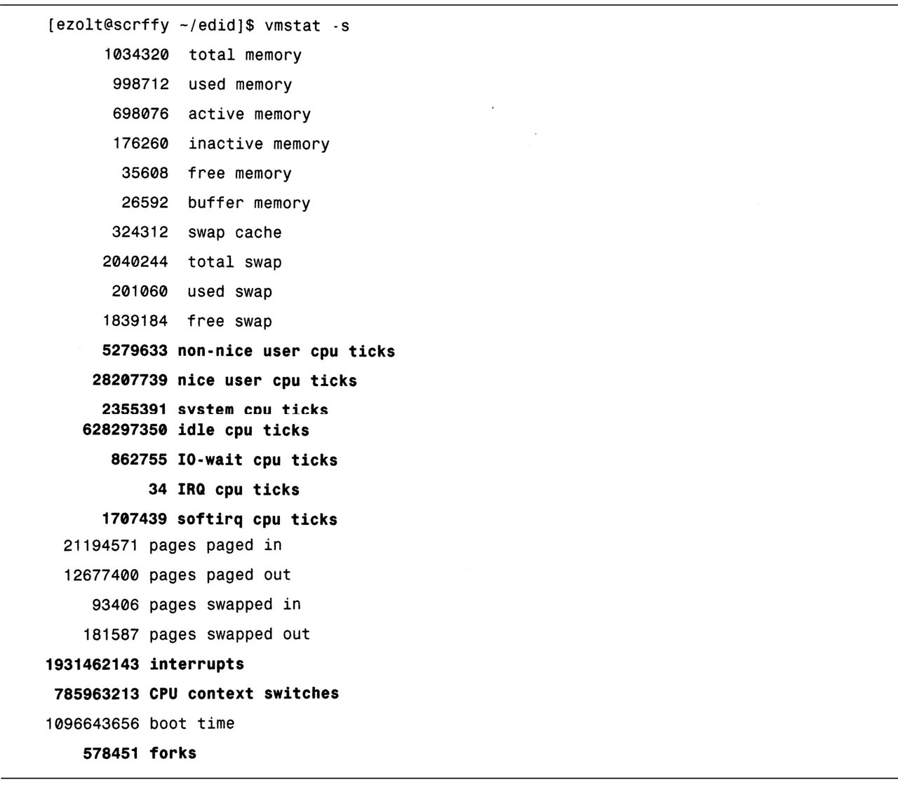

vmstat 提供了关于 Linux 系统性能的众多信息. 在调查系统问题时, 它是核心工具之一.

# 2. top(2.0.x 版本)

top 是 Linux 系统监控工具中的瑞士军刀. 它善于将相当多的系统整体性能信息放在一个屏幕上. 显示内容还能以交互的方式进行改变, 因此, 在系统运行时, 如果一个特定的问题不断突显, 你可以修改 top 显示的信息.

默认情况下, top 表现为一个将占用 CPU 最多的进程按降序排列的列表. 这使得你能够迅速找出是哪个程序独占了 CPU. top 根据指定的延迟定期更新这个列表(其初始值为 3 秒).

## 2.1. CPU 性能相关的选项

top 用如下命令行调用:

```
top [d delay] [C] [H] [i] [n iter] [b]
```

top 实际上有两种模式的选项: 命令行选项和运行时选项. 命令行选项决定 top 如何显示其信息. 表 2-3 给出的命令行选项会影响 top 显示的性能统计信息的类型和频率.

表 2-3 top 命令行选项:

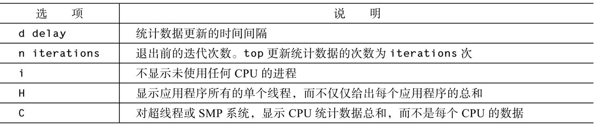

在你运行 top 时, 为了调查特定问题, 你可能想要对你的观察略作调整. top 输出的可定制性很高. 表 2-4 给出的选项可以在 top 运行期间修改显示的统计信息:

表 2-4 top 运行时统计信息显示选项:

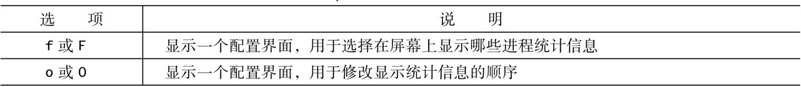

表 2-5 给出的选项打开或关闭各种系统级信息的显示. 关闭不需要的统计信息有助于在屏幕上显示更多进程.

表 2-5 top 运行时输出切换选项:

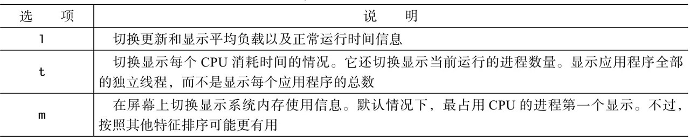

表 2-6 对 top 支持的不同排序模式进行了说明. 按内存消耗量排序尤其有用, 它能找出哪个进程消耗了最多的内存.

表 2-6 top 输出排序/显示选项:

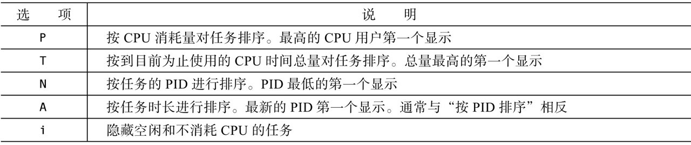

top 除了提供特定进程的信息之外, 还提供系统整体信息. 表 2-7 给出了这些统计信息.

表 2-7 top 性能统计信息:

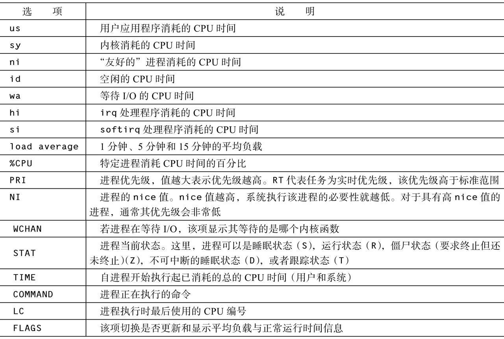

top 提供了不同的正在运行进程的大量信息, 是找出资源消耗大户的极好方法.

## 2.2. 用法示例

清单 2.6 是运行 top 的一个例子. 当它启动后, 将会周期性地更新屏幕直到退出. 该例展示了 top 能生成的一些系统整体统计信息. 首先. 我们能看到 1 分钟、5 分钟和 15 分钟的系统平均负载. 可以看出, 系统已经开始忙碌起来(因为 doom-3.x86). 一个 CPU 在用户代码上花费了 90%的时间. 另一个则只在用户代码上花费了约 13%的时间. 最后, 我们看到 73 个进程处于睡眠状态, 只有 3 个进程正在运行.

清单 2.6:

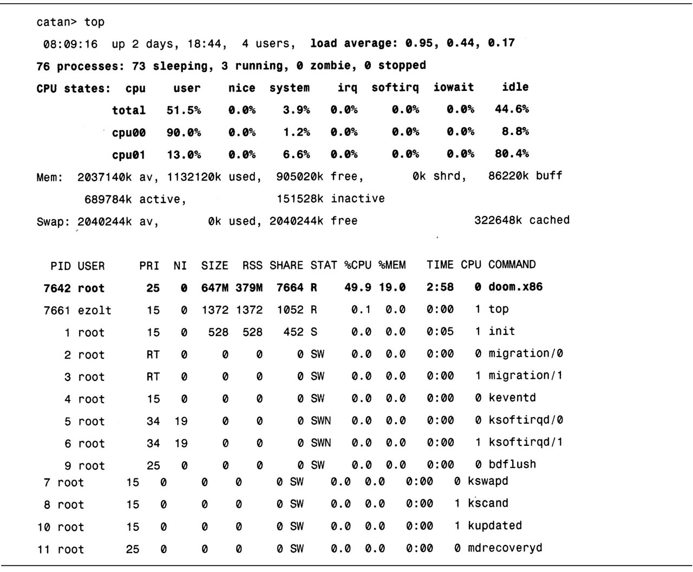

现在, 在 top 运行时按下 F 键弹出配置界面, 如清单 2.7 所示. 当你按下代表键(A 代表 PID, B 代表 PPID, 等等)时, top 将切换这些统计信息在屏幕上的显示. 选择好需要的全部统计信息后, 按下 Enter 键返回 top 的初始界面, 现在它显示的是选出的统计信息的当前值. 在配置统计信息时, 所有当前选择的字段将会以大写形式显示在 Current Field Order 行, 并在其名称旁出现一个星号(\*).

清单 2.7:

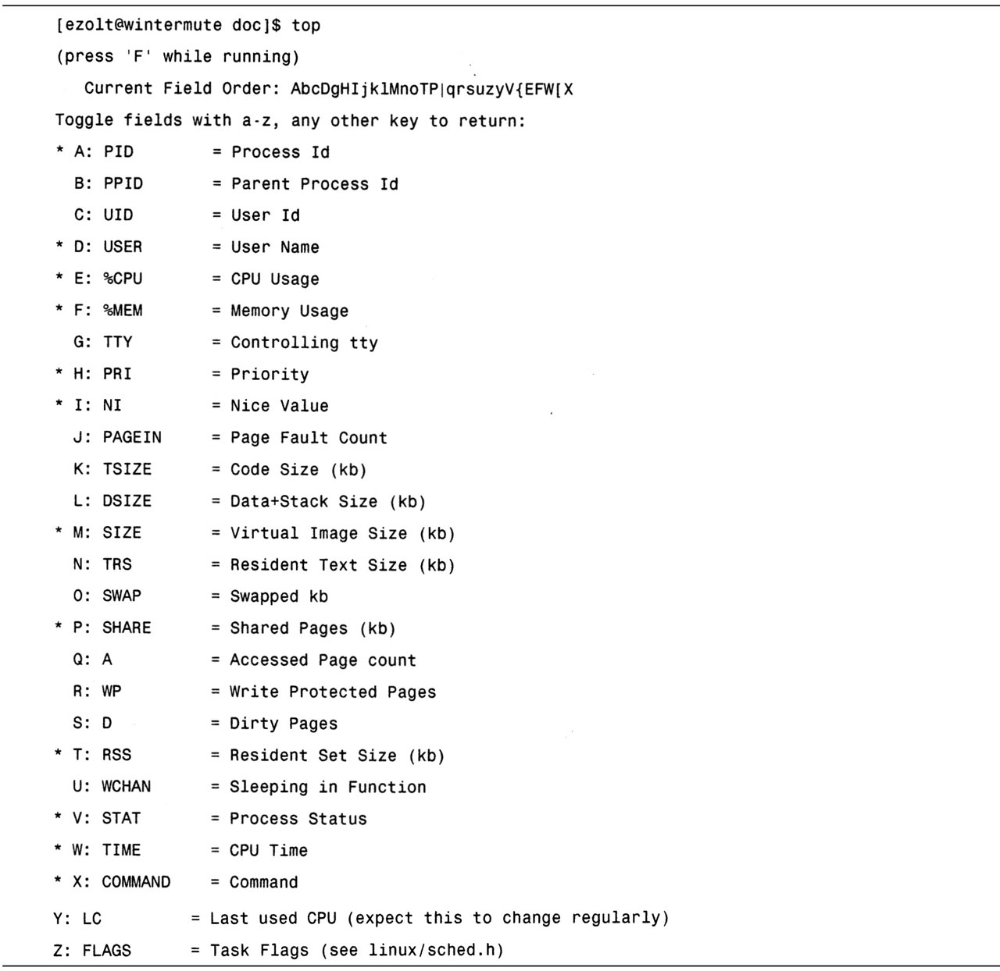

为了展示 top 的可定制性, 清单 2.8 给出了一个高度配置的输出界面, 其中只显示了与 CPU 使用率相关的 top 选项:

清单 2.8:

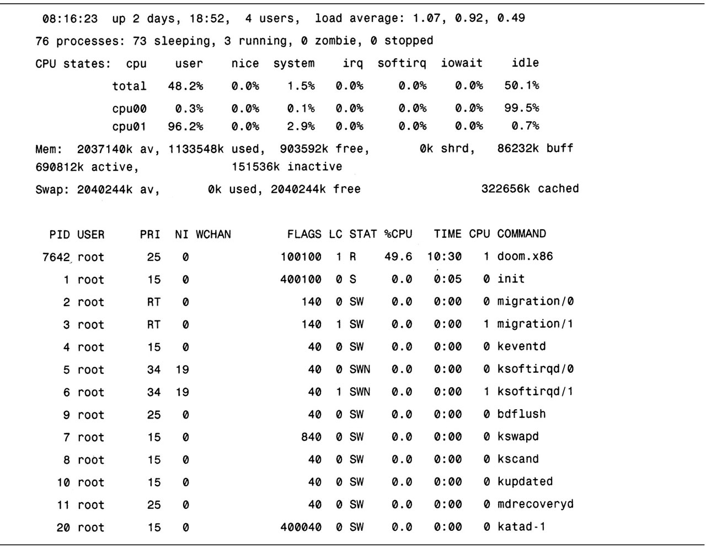

top 提供了一个系统资源使用率的总览, 其重点信息在于各种进程是如何消耗这些资源的. 由于其输出格式对用户是友好的, 而对工具是不友好的, 因此最好是在与系统直接交互时使用.

# 3. top(3.x.x 版本)

近来, 最新版本中提供的 top 已经有了彻底的改变, 其结果就是很多命令行和交互选项发生了变化. 虽然基本思路是相似的, 但对 top 进行了精简, 并添加了几个不同的显示模式.
同样的, top 呈现为一个降序列表, 排在最前面的是最占用 CPU 的进程.

## 3.1. CPU 性能相关的选项

用如下命令行调用 top:

```
top [-d delay] [-n iter] [-i] [-b]
```

top 实际有两种模式的选项: 命令行选项和运行时选项. 命令行选项决定 top 如何显示其信息. 表 2-8 给出的命令行选项会影响 top 显示的性能统计信息的类型和频率.

表 2-8 top 命令行选项:

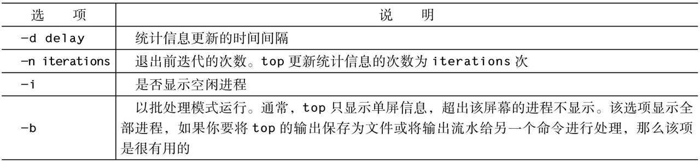

运行 top 时, 为了调查特定问题, 你可能想要对你的观察略作调整. 和 top 2.x 版本一样, 其输出的可定制性很高. 表 2-9 给出的选项可以在 top 运行期间修改显示的统计信息.

表 2-9 top 运行时选项:

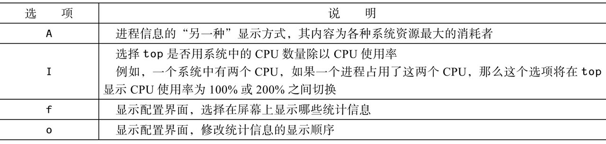

表 2-10 给出的选项打开或关闭各种系统级信息的显示. 关闭不需要的统计信息有助于在屏幕上显示更多进程.

表 2-10 top 运行时输出切换选项:

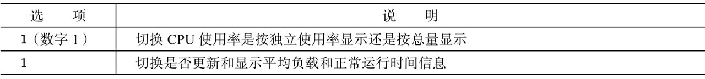

与 top v2.x 相同, top v3.x 除了提供特定进程的信息之外, 还提供系统整体信息. 表 2-11 给出了这些统计信息.

表 2-11 top 性能统计信息:

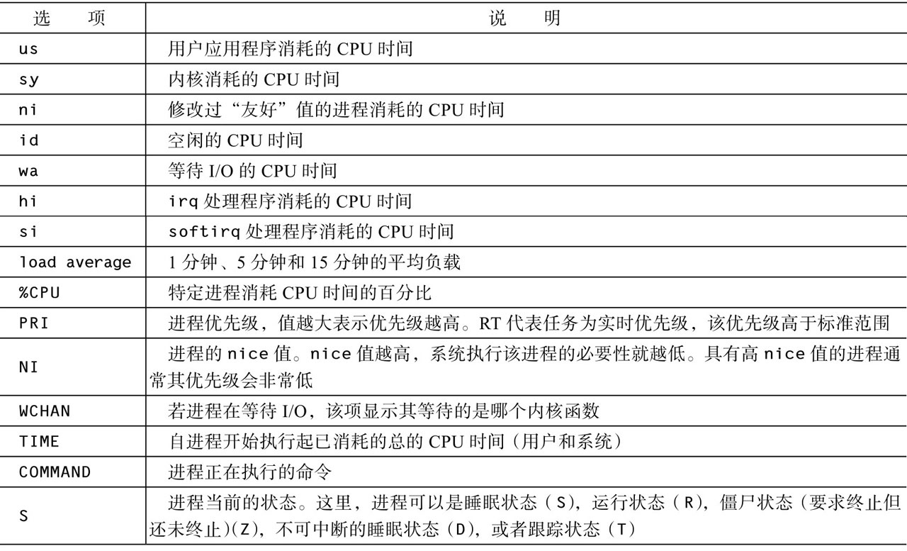

top 提供了不同的正在运行进程的大量信息, 是找出资源消耗大户的极好方法. top v.3 版对 top 进行了精简, 并增加了一些对相同数据的不同视图.

## 3.2. 用法示例

清单 2.9 是运行 top v3.0 的一个例子. 同样的, 它会周期性地更新屏幕直到退出. 其统计信息与 top v2.x 相同, 但名称略有改变.

清单 2.9:


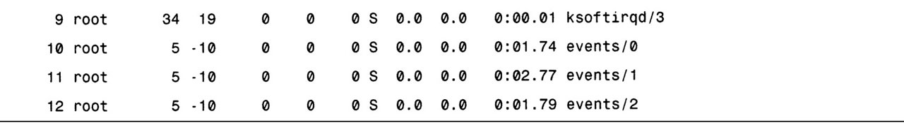

现在, 在 top 运行时按下 f 键调出配置界面, 如清单 2.10 所示. 当你按下代表键(A 代表 PID, B 代表 PPID 等)时, top 将切换这些统计信息在屏幕上的显示. 选择好需要的全部统计信息后, 按下 Enter 键返回 top 的初始界面, 现在它显示的是被选出的统计信息的当前值. 在配置统计信息时, 所有当前被选择的字段将会以大写形式显示在 Current Field Order 行, 并在其名称旁出现一个星号(*). 请注意, 大多数统计信息都是相同的, 但名称略有变化.

清单 2.10:

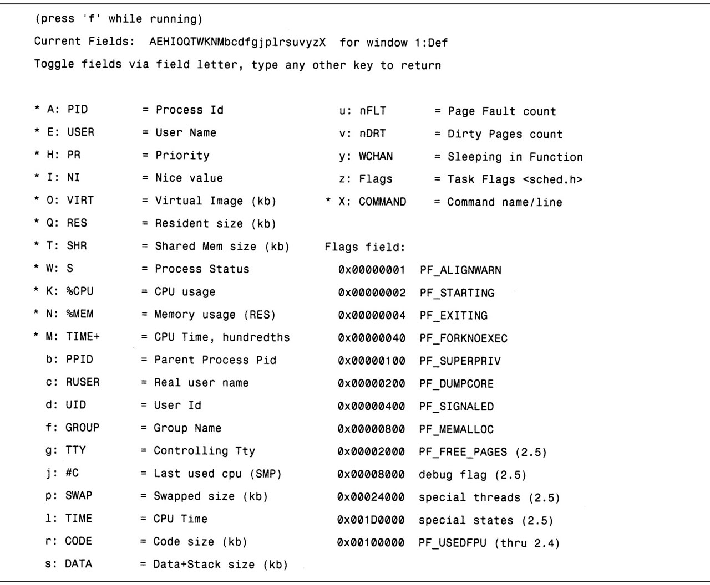

清单 2.11 展示了新的 top 输出模式, 许多不同的统计信息进行了分类并显示在同一屏幕上.

清单 2.11:

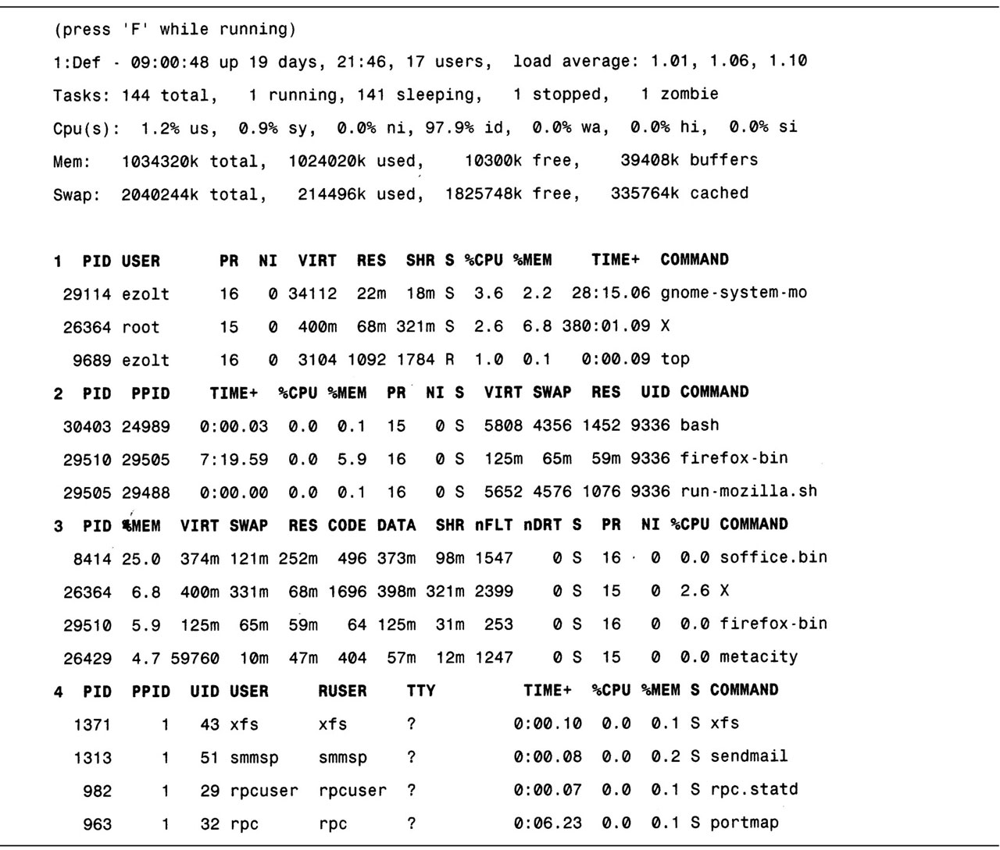

top v3.x 为 top 提供了稍简洁的界面. 它简化了 top 的某些方面, 并提供了一个很好的"总结"信息屏, 显示了系统中的许多资源消费者.

# 4. procinfo(从/proc 文件系统显示信息)

就像 vmstat 一样, procinfo 也为系统整体信息特性提供总览. 尽管它提供的有些信息与 vmstat 相同, 但它还会给出 CPU 从每个设备接收的中断数量. 其输出格式的易读性比 vmstat 稍微强一点, 但却会占用更多的屏幕空间.

## 4.1. CPU 性能相关的选项

procinfo 的调用命令行如下:

```
procinfo [-f] [-d] [-D] [-n sec] [-f file]
```

表 2-12 描述了不同的选项, 用于修改 procinfo 显示样本的输出和频率.

表 2-12 procinfo 命令行选项:

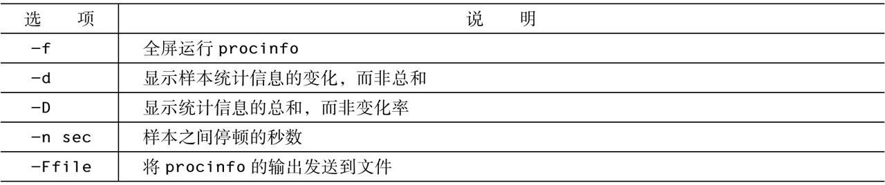

表 2-13 给出了 procinfo 收集的 CPU 统计信息.

表 2-13 procinfo CPU 统计信息:

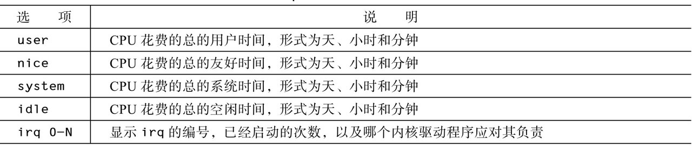

与 vmstat 以及 top 一样, procinfo 是一个低开销的命令, 适合于让其自行在控制台或屏幕窗口运行. 它能够很好地反映系统的健康和性能.

## 4.2. 用法示例

调用 procinfo 时不带任何命令选项将产生如清单 2.12 所示的输出. 无参数, 则 procinfo 仅显示一屏状态信息并退出. 使用-n second 选项让 procinfo 周期性地更新, 其作用会更大. 这能使你查看到系统性能的实时变化.

清单 2.12:

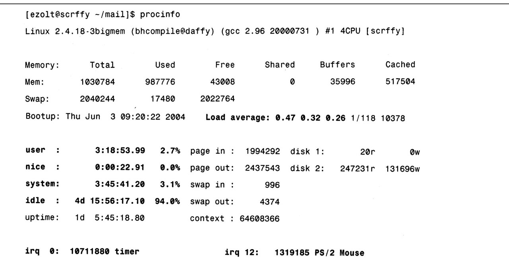

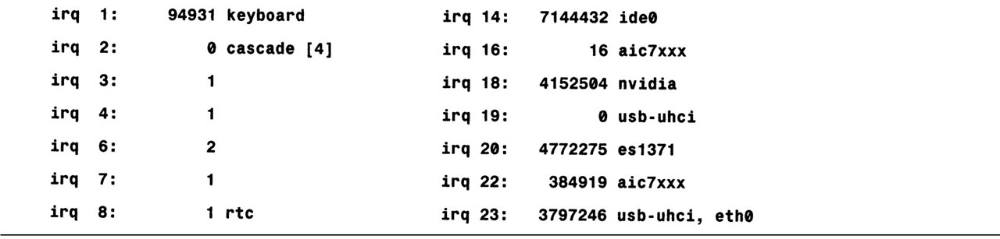

如同你在清单 2.12 中所见, procinfo 为系统提供了不错的总览. 从用户、nice、系统和空闲时间, 我们再次发现, 系统不是很忙. 一个值得注意的有趣现象是, procinfo 表明系统空闲时间比其运行时间(用 uptime 表示)还要多. 这是因为系统实际上有 4 个 CPU, 因此, 对于一天的墙钟时间而言, CPU 时间已经过去了四天. 平均负载证明系统近期相对没有多少工作. 在过去的时间里, 平均而言, 系统准备运行的进程还不到一个; 平均负载为 0.47 意味着单个进程准备运行的时间只有 47%. 对于有四个 CPU 的系统来说, 将会浪费大量的 CPU 能力.

procinfo 还给我们提供了很好的视图来说明系统中的哪个设备导致了中断. 可以看到显卡(nvidia)、硬盘控制器(ide0)、以太网设备(eth0)以及声卡(es1371)的中断数量相对较高. 这些情况一般出现在台式工作站上.

procinfo 的优势是将许多系统级性能统计信息放在一个屏幕里, 让你能了解系统整体执行情况. 它缺乏网络和磁盘性能的详细信息, 但能为 CPU 和内存性能的统计信息提供良好的细节. 一个可能很重要的限制是, CPU 处于 iowait、irq 或 softirq 模式时 procinfo 不会进行报告.

# 5. gnome-system-monitor

gnome-system-monitor 在很多方面都可以说是 top 的图形化. 它使你能以图形方式监控各个进程, 并在显示图表的基础上观察系统负载.

## 5.1. CPU 性能相关的选项

gnome-system-monitor 可以从 Gnome 菜单调用. (Red Hat 9 及其以上版本中, 选择菜单 System Tools -> System Monitor. )不过, 它也可以用如下命令调用:

```
gnome-system-monitor
```

gnome-system-monitor 没有相关命令行选项来影响 CPU 性能测量. 但是, 有些显示的统计信息可以通过选择 gnome-system-monitor 的 Edit -> Preferences 菜单项进行修改.

## 5.2. 用法示例

当你启动 gnome-system-monitor 时, 它会创建与图 2-1 相似的窗口. 该窗口显示了特定进程使用的 CPU 和内存总量信息. 它还显示了进程之间父/子关系的信息.

图 2-1

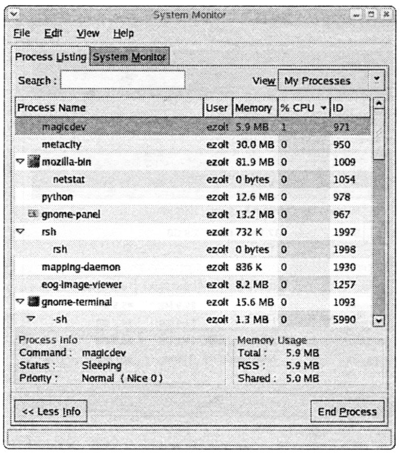

图 2-2 显示了系统负载和内存使用率的图形视图. 从这一点可以真正区分 gnome-system-monitor 与 top. 你可以很容易地查看系统当前状态, 以及与之前状态的对比.

图 2-2

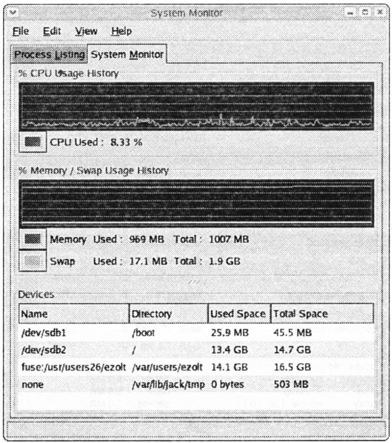

gnome-system-monitor 提供的数据图形视图能够更容易更迅速地确定系统状态及其行为随时间的变化. 它还能更轻松地浏览系统级进程信息.

# 6. mpstat(多处理器统计)

mpstat 是一个相当简单的命令, 向你展示随着时间变化的 CPU 行为. mpstat 最大的优点是在统计信息的旁边显示时间, 由此, 你可以找出 CPU 使用率与时间的关系.
如果你有多个 CPU 或超线程 CPU, mpstat 还能够把 CPU 使用率按处理器进行区分, 因此你可以发现与其他处理器相比, 是否某个处理器做了更多的工作. 你可以选择想要监控的单个处理器, 也可以要求 mpstat 对所有的处理器都进行监控.

## 6.1. CPU 性能相关的选项

mpstat 可以用如下命令行调用:

```
mpstat [ -P { cpu | ALL } [ delay [count]] ]
```

和之前一样, delay 指定了采样间隔, count 指定了采样次数. 表 2-14 解释了 mpstat 命令行选项的含义.

表 2-14 mpstat 命令行选项:

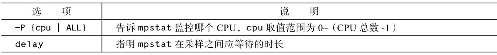

mpstat 提供与其他 CPU 性能工具相似的信息, 但是, 它允许将信息按照特定系统中的单个处理器进行分类. 表 2-15 给出了 mpstat 支持的选项.

表 2-15 mpstat CPU 统计信息:

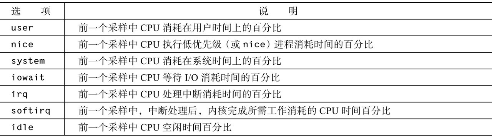

mpstat 是一种很好的工具, 可以分类提供每个处理器的执行情况. 由于 mpstat 给出了每个 CPU 的明细, 因此你可以识别是否有哪个处理器正逐渐出现超负载情况.

## 6.2. 用法示例

首先, 我们要求 mpstat 显示处理器编号为 0 的 CPU 的统计信息, 如清单 2.13 所示.

清单 2.13

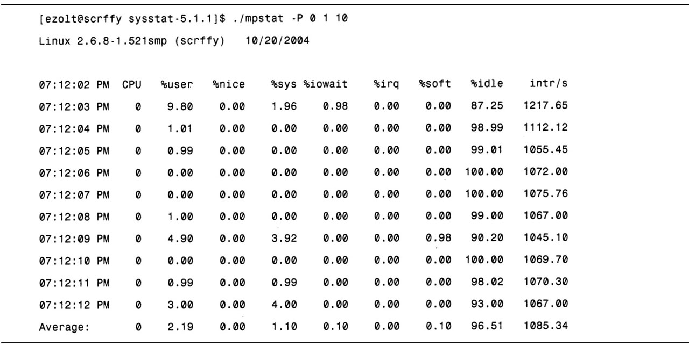

清单 2.14 显示了对典型无负载超线程 CPU 使用相同命令产生的结果. 你可以看到所有显示出来的 CPU 统计数据. 输出中有个有趣的现象, 即其中一个 CPU 似乎处理了所有的中断. 如果系统有很重的 I/O 负载, 而全部中断又都是由一个处理器处理, 那么这可能就是瓶颈, 因为一个 CPU 超负荷, 而其他 CPU 则在等待. 如果一个 CPU 忙于处理所有的中断以至于没有空闲时间, 而与此同时, 其他处理器则处于空闲状态, 那么你可以用 mpstat 发现这种情况.

清单 2.14

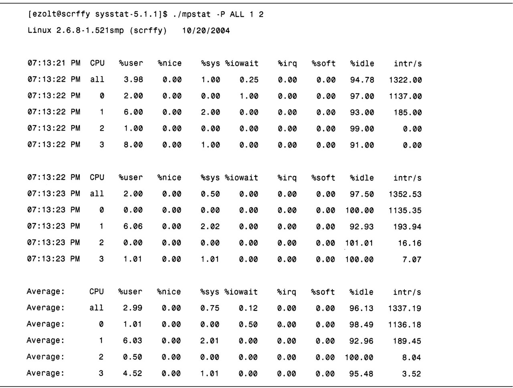

mpstat 可以用来确定 CPU 是否得到充分利用, 以及使用情况是否相对均衡. 通过观察每个 CPU 处理的中断数, 有可能发现其中的不均衡. 如何控制中断路由的详细信息参见`Documentation/IRQ-affinity.txt`下的内核源码.

# 7. sar(系统活动报告)

sar 用另一种方法来收集系统数据. sar 能有效地将收集到的系统性能数据记录到二进制文件, 之后, 可以重播这些文件. sar 是一种低开销的、记录系统执行情况信息的方法.

sar 命令可以用于记录性能信息, 回放之前的记录信息, 以及显示当前系统的实时信息. sar 命令的输出可以进行格式化, 使之易于导入数据库, 或是输送给其他 Linux 命令进行处理.

## 7.1. CPU 性能相关的选项

sar 可以使用如下命令行调用:

```
sar [options] [ delay [count] ]
```

尽管 sar 的报告涉及 Linux 多个不同领域, 其统计数据有两种不同的形式. 一组统计数据是采样时的瞬时值. 另一组则是自上一次采样后的变化值. 表 2-16 解释了 sar 的命令行选项.

表 2-16 sar 命令行选项:

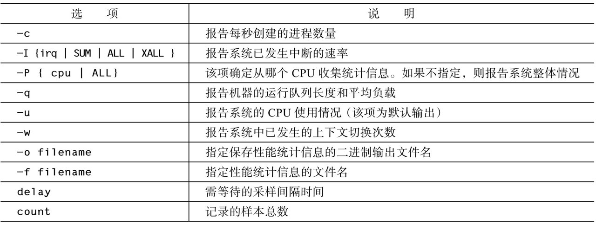

sar 提供的系统级 CPU 性能统计数据集与我们在进程工具中看到的类似(名字不同). 如表 2-17 所示.

表 2-17 sar CPU 统计信息:

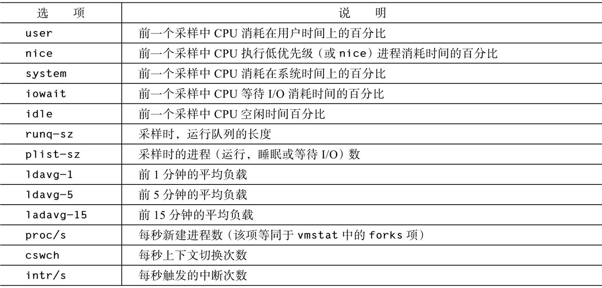

sar 最显著的优势之一是, 它使你能把不同类型时间戳系统数据保存到日志文件, 以便日后检索和审查. 当试图找出特定机器在特定时间出现故障的原因时, 这个特性被证明是非常便利的.

## 7.2. 用法示例

清单 2.15 显示的第一个命令要求每秒有三个 CPU 采样, 其结果保存到二进制文件/tmp/apache_test. 该命令没有任何可视化输出, 完成即返回.

清单 2.15

```
sar -O /tmp/apache_test 1 3
```

信息保存到/tmp/apache_test 文件后, 我们就能以各种格式显示它. 默认格式为人类可读, 如清单 2.16 所示. 该清单显示与其他系统监控命令类似的信息, 我们可以看出处理器在特定时间是如何消耗其时间的.

清单 2.16

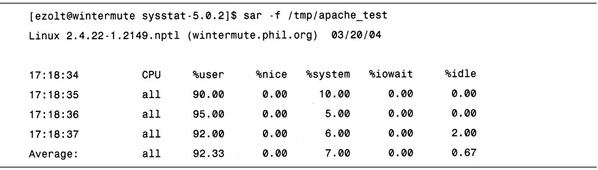

不过, sar 还可以将统计数据输出为一种能轻松导入关系数据库的格式, 如清单 2.17 所示. 这有助于保存大量的性能数据. 一旦将其导入到关系数据库, 就可以用所有的关系数据库工具对这些性能数据进行分析.

清单 2.17

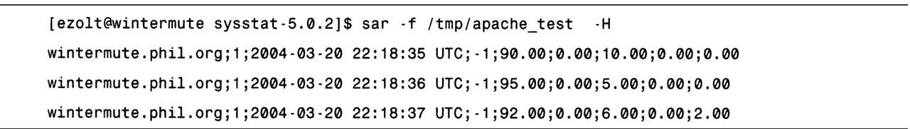

最后, sar 还有一种易于被标准 Linux 工具, 如 awk, perl, python 或 grep, 解析的统计数据输出格式. 如清单 2.18 所示, 这种输出可以被送入脚本, 该脚本会引发有趣的事件, 甚至有可能分析出数据的不同趋势.

清单 2.18

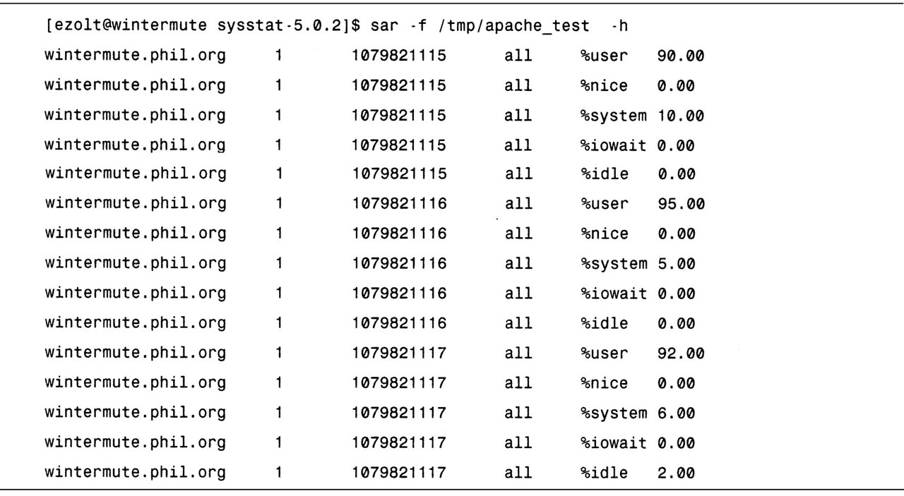

除了将信息记录到文件之外, sar 还可以用于实时系统观察. 在清单 2.19 所示的例子中, CPU 状态被采样了三次, 采样间隔时间为一秒.

清单 2.19

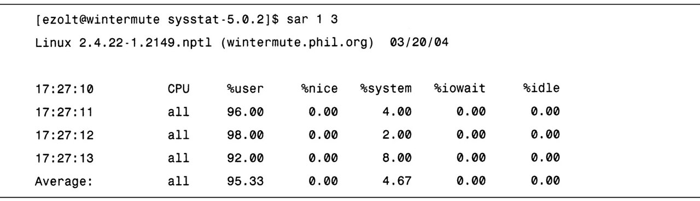

默认显示的目的是展示 CPU 的信息, 但是也可以显示其他信息. 比如, sar 可以显示每秒的上下文切换次数, 以及交换的内存页面数. 在清单 2.20 中, sar 采样了两次信息, 间隔时间为一秒. 这次, 我们要求 sar 显示每秒上下文切换的数量以及创建的进程数. 我们还要求 sar 给出平均负载的信息. 可以看出来, 本例中的机器有 163 个进程在内存中, 但都没有运行. 过去的一分钟平均有 1.12 个进程等待运行.

清单 2.20

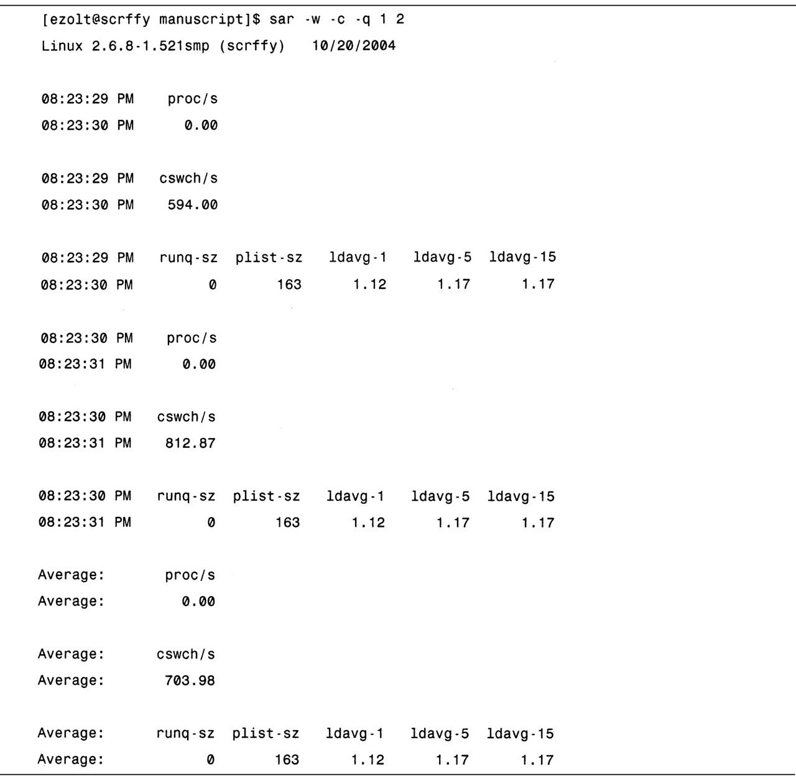

如你所见, sar 是一个强大的工具, 能够记录多种不同的性能统计信息. 它提供了 Linux 友好界面, 使你可以轻松地提取和分析性能数据.

# 8. oprofile

oprofile 是性能工具包, 它利用几乎所有现代处理器都有的性能计数器来跟踪系统整体以及单个进程中 CPU 时间的消耗情况. 除了测量 CPU 周期消耗在哪里之外, oprofile 还可以测量关于 CPU 执行的非常底层的信息. 根据由底层处理器支持的事件, 它可以测量的内容包括: cache 缺失、分支预测错误和内存引用, 以及浮点操作.

oprofile 不会记录发生的每个事件, 相反, 它与处理器性能硬件一起工作, 每 count 个事件采样一次, 这里的 count 是一个数值, 由用户在启动 oprofile 时指定. count 的值越低, 结果的准确度越高, 而 oprofile 的开销越大. 若 count 保持在一个合理的数值, 那么, oprofile 不仅运行开销非常低, 并且还能以令人惊讶的准确性描述系统性能.

采样是非常强大的, 但使用时要小心一些不明显的陷阱. 首先, 采样可能会显示你有 90%的时间花在了一个特定的例程上, 但它不会显示原因. 一个特定例程消耗了大量周期有两种可能的原因. 其一, 该例程可能是瓶颈, 其执行需要很多时间. 但是, 也可能例程的执行时间是合理的, 而其被调用的次数非常高. 通常有两种途径可以发现究竟是哪一种情况: 通过查看采样找出特别热门的行, 或是通过编写代码来计算例程被调用次数.

采样的第二个问题是你永远无法十分确定一个函数是从哪里被调用的. 即使你已经搞明白它被调用了很多次, 并且已经跟踪到了所有调用它的函数, 但也不一定清楚其中哪个函数完成了绝大多数的调用.

## 8.1. CPU 性能相关的选项

oprofile 实际上是一组协同工作的组件, 用于收集 CPU 性能统计信息. oprofile 主要有三个部分:

* oprofile 核心模块控制处理器并允许和禁止采样.
* oprofile 后台模块收集采样, 并将它们保存到磁盘.
* oprofile 报告工具获取收集的采样, 并向用户展示它们与在系统上运行的应用程序的关系.

oprofile 工具包将驱动器和后台操作隐藏在 opcontrol 命令中. opcontrol 命令用于选择处理器采样的事件并启动采样.

进行后台控制时, 你可以使用如下命令行调用 opcontrol:

```
opcontrol [--start] [--stop] [--dump]
```

此选项的控制(性能分析后台进程)使你能开始和停止采样, 并将样本从守护进程的内存导入磁盘. 采样时, oprofile 后台模块将大量的采样保存在内部缓冲区. 但是, 它只能分析那些已经写入(或导入)磁盘的样本. 写磁盘的开销可能会很大, 因此, oprofile 只会定期执行这个操作. 其结果就是, 运行测试并用 oprofile 分析后, 可能不会马上得到结果, 你需要等待, 直到后台将缓冲区写入磁盘. 当你想要立即开始分析时, 这点是很让人挠头的, 因此, opcontrol 命令能让你禁止将采样从 oprofile 后台的内部缓冲区导入到磁盘. 这将使你能在测试结束后, 立刻开始性能调查.

表 2-18 介绍了 opcontrol 程序的选项, 它们使你能控制后台操作.

表 2-18 opcontrol 后台控制:


默认情况下, oprofile 按给定频率选择一个事件, 这个频率对于你在运行的处理器和内核来说是合理的. 但是, 比起默认事件来, 还有更多的事件可以监控. 当你列出并选择了一个事件后, opcontrol 将用如下命令行调用:

```
opcontrol [--list-events] [-event=:name:count:unitmask:kernel:user:]
```

事件说明使你可以选择采样哪个事件, 该事件的采样频率, 以及采样发生在内核空间、用户空间或同时在这两个空间. 表 2-19 介绍了 opcontrol 的命令行选项, 它们使你能选择不同的事件进行采样.

表 2-19 opcontrol 事件处理:

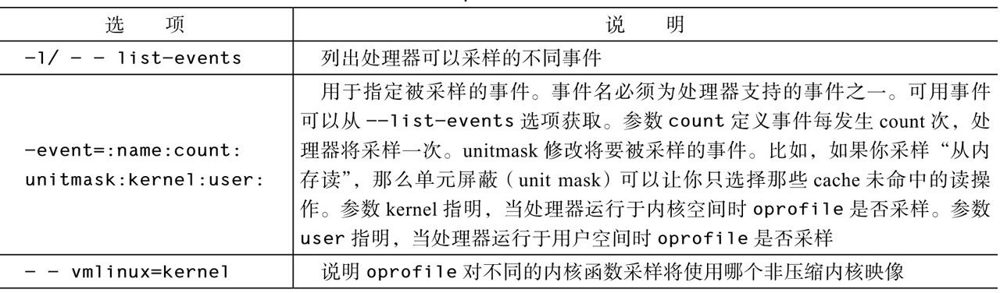

收集并保存样本后, oprofile 提供另一种不同的工具 opreport, 该工具使你能查看已收集的样本.

opreport 的调用命令行如下:

```
opcontrol [-r] [-t]
```

通常, opreport 显示所有系统收集到的样本, 以及哪些可执行程序引起的这些样本(包括内核). 样本数最多的可执行线程排在第一位, 其后为所有有样本的可执行线程. 在一个典型系统中, 排在列表前面的是拥有大多数样本的少数可执行线程, 而大量的可执行线程只贡献了数量很少的样本. 针对这种情况, opreport 允许你设置阈值, 只有样本数量百分比达到或超过阈值的可执行线程才能显示. 同时, opreport 还可以将可执行线程的显示顺序倒过来, 那些拥有最多样本数的将最后显示. 这种方式下, 最重要的数据显示在最后, 那么它就不会滚过屏幕.

表 2-20 说明了 opreport 的命令行选项, 它们使你能定制采样输出的格式.

表 2-20 opreport 报告格式

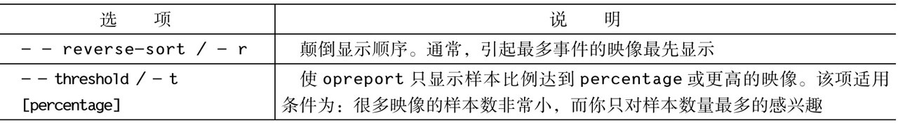

再次说明, oprofile 是一个复杂的工具, 给出的这些选项仅仅是 oprofile 的基础功能. 在后续章节中, 你将学习到 oprofile 更多的功能.

## 8.2. 用法示例

oprofile 是非常强大的工具, 但它的安装有点困难. 附录 B 指导读者如何在几个主要的 Linux 发行版上安装和运行 oprofile.

使用 oprofile 首先要按照分析对其进行设置. 第一条命令如清单 2.21 所示, 用 opcontrol 命令告诉 oprofile 工具包一个非压缩的内核映像在什么位置. oprofile 需要知道这个文件的位置, 以便它将样本分配给内核中的确切函数.

清单 2.21

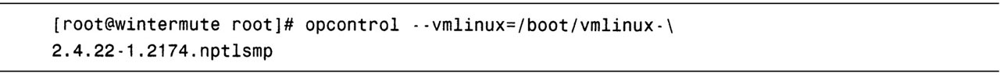

设置了当前内核的路径后, 我们可以开始分析. 清单 2.22 中的命令告诉 oprofile 用默认事件开始采样. 这个事件根据处理器而变化, 对当前处理器而言, 这个事件是`CPU_CLK_UNHALTED`. 只要处理器没有停止, 该事件将会采样全部 CPU 周期. 233869 是指每 233869 个事件会采样处理器正在执行的指令.

清单 2.22

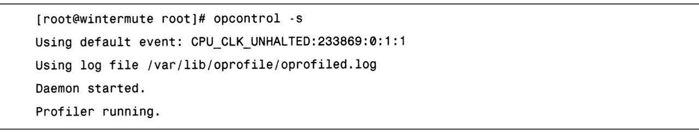

现在已经开始采样后, 我们想要分析采样结果. 在清单 2.23 中, 我们用报告工具来找出系统中发生了什么. opreport 报告了目前为止分析的内容.

清单 2.23

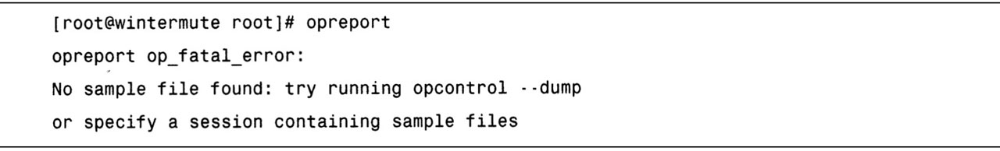

尽管分析已经进行了一小段时间, 但当 opreport 表明它无法找到样本时, 我们就会停止. 发生这种情况的原因是: opreport 命令在磁盘上查找样本, 而 oprofile 后台程序则在内存中存储样本并定期将其转存到磁盘. 当我们向 opreport 请求样本清单时, 它无法在磁盘上找到, 因此就会报告没有发现任何样本. 为了缓解这一问题, 我们可以通过在 opcontrol 中增加 dump 选项来强制后台程序立刻转存样本, 如清单 2.24 所示, 这条命令使我们能查看已收集的样本.

清单 2.24

```
opcontrol --dump
```

将样本转存到磁盘后, 我们再次尝试要求 oprofile 给出报告, 如清单 2.25 所示. 这一次, 我们得到了结果. 报告中包含了收集样本来源处理器的信息, 以及其监控事件的类型信息. 然后, 报告按降序排列事件发生的数量, 并列出它们发生在哪个可执行文件中. 我们可以看到, Linux 内核占据了全部时钟的 50%, emacs 为 14%, libc 为 12%. 可以深入挖掘可执行文件确定哪个函数占据了所有的时间, 我们将在第 4 章讨论这个问题.

清单 2.25

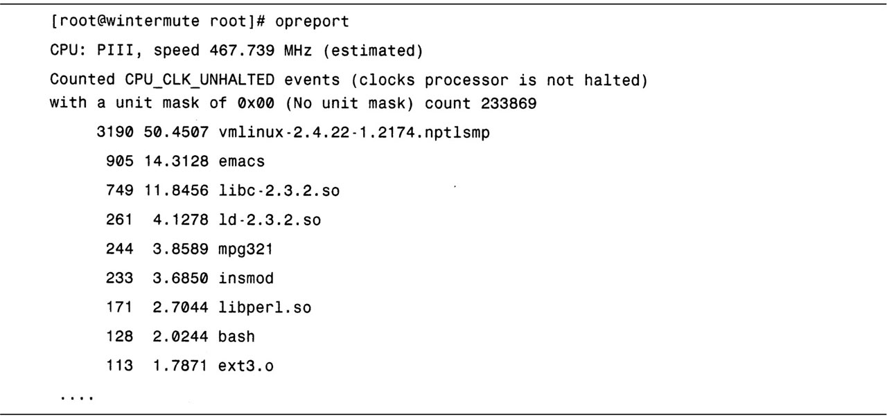

当我们启动 oprofile 时, 我们只使用了 opcontrol 为我们选择的默认事件. 每个处理器都有一个非常丰富的可以被监控的事件集. 在清单 2.26 中, 我们要求 opcontrol 列出特定 CPU 可以获得的全部事件. 这个清单相当长, 但在其中我们可以看到除了 CPU_CLK_UNHALTED 之外, 还可以监控 DATA_MEM_REFS 和 DCU_LINES_IN. 这些是内存子系统导致的存储事件, 我们将在后续章节中讨论它们.

清单 2.26

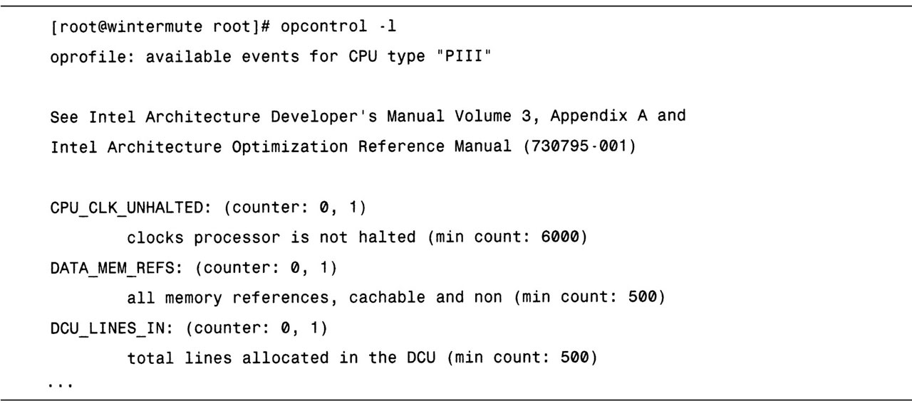

需要指明被监控事件的命令看上去有点麻烦, 幸运的是, 我们还可以利用 oprofile 的图形化命令 oprof_start 以图形方式启动和停止采样. 这使得我们能以图形方式选择想要的事件, 而没有必要搞清楚用准确的方式在命令行中明确说明想要监控的事件.

在图 2-3 所示的 op_control 例子中, 我们告诉 oprofile 想要同时监控`DATA_MEM_REFS`和`L2_LD`事件. `DATA_MEM_REFS`事件可以告诉我们哪些应用程序使用了大量的内存子系统, 哪些使用了 L2 cache. 具体到这个处理器, 其硬件只有两个计数器可用于采样, 因此能同时使用的也只有两个事件.

用 oprofile 的图形界面收集样本后, 我们现在可以分析这些数据了. 如清单 2.27 所示, 我们要求 opreport 显示对其收集样本的分析, 所用形式与监控周期时的类似. 在本例中, 我们可以发现 libmad 库占用了整个系统中数据内存访问的 31%, 成为内存子系统使用量最大的用户.

图 2-3

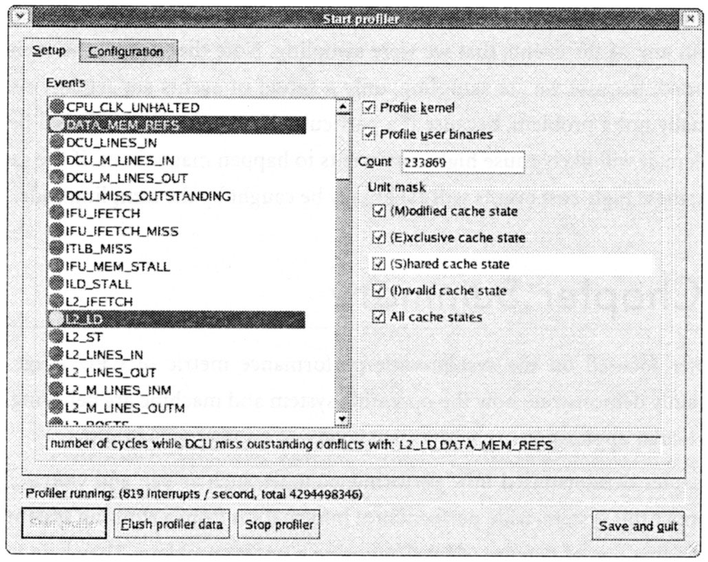

清单 2.27


opreport 提供的输出展示了包含任何被采样事件的所有系统库和可执行程序. 请注意并非所有的事件都被记录下来, 这是因为我们是在采样, 实际上只会记录事件的子集. 通常这不是问题, 因为如果一个特定的库或可执行程序是性能问题, 那么它很可能会导致高成本事件发生许多次. 如果采样是随机的, 这些高成本使事件最终也会被采样代码所捕获.