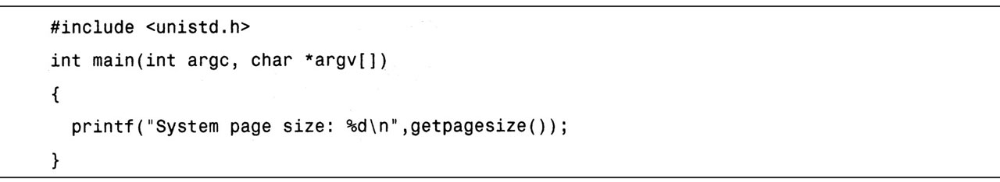

# 不同工具不同方式相似结果

每一种系统级 Linux 性能工具都提供了不同的方式来提取类似的统计结果.

虽然没有工具能显示全部的信息, 但是有些工具显示的统计信息是相同的.

本章开始将对这些统计数据的详细信息进行说明, 之后在介绍工具时会引用这些描述.

# 内存子系统和性能

在现代处理器中, 与 CPU 执行代码或处理信息相比, 向内存子系统保存信息或从中读取信息一般花费的时间更长. 通常, 在 CPU 执行指令或处理数据前, 它会消耗相当多的空闲时间来等待从内存中取出指令和数据. 处理器用不同层次的高速缓存(cache)来弥补这种缓慢的内存性能. 工具, 如 oprofile, 可以显示各种处理器高速缓存缺失所发生的位置.

# 内存子系统(虚拟存储器)

任何给定的 Linux 系统都有一定容量的 RAM 或物理内存. 在这个物理内存中寻址时, Linux 将其分成块或内存"页". 当对内存进分配或传送时, Linux 操作的单位是页, 而不是单个字节. 在报告一些内存统计数据时, Linux 内核报告的是每秒页面的数量, 该值根据其运行的架构可以发生变化. 清单 3.1 创建了一个小的应用程序来显示当前架构中每一页的字节数.

清单 3.1

对 IA32 架构而言, 页面大小为 4KB. 极少数情况下, 这些页面大小的内存块会导致极高的跟踪开销, 所以, 内核用更大的块来操作内存, 这些块被称为 HugePage(大页面). 它们的容量为 2048KB, 而不是 4KB, 这大大降低了管理庞大内存的开销. 某些应用, 如 Oracle, 用这些大页面加载内存中的大量数据, 同时又最小化 Linux 内核的管理开销. 如果 HugePage 不能完全被填满, 就会浪费相当多的内存. 一个半填充的普通页面浪费 2KB 内存, 而一个半填充的 HugePage 就会浪费 1024KB 的内存.

Linux 内核可以分散收集这些物理页面, 向应用程序呈现出一个精心设计的虚拟内存空间.

## 交换(物理内存不足)

所有系统 RAM 芯片的物理内存容量都是固定的. 即使应用程序需要的内存容量大于可用的物理内存, Linux 内核仍然允许这些程序运行. Linux 内核使用硬盘作为临时存储器, 这个硬盘空间被称为交换分区(swap space).

尽管交换是让进程运行的极好的方法, 但它却慢的要命. 与使用物理内存相比, 应用程序使用交换的速度可以慢到一千倍. 如果系统性能不佳, 确定系统使用了多少交换通常是有用的.

## 缓冲区(buffer)和缓存(cache)(物理内存太多)

相反, 如果你的系统物理内存容量超过了应用程序的需求, Linux 就会在物理内存中缓存近期使用过的文件, 这样, 后续访问这些文件时就不用去访问硬盘了. 对要频繁访问硬盘的应用程序来说, 这可以显著加速其速度, 显然, 对经常启动的应用程序而言, 这是特别有用的. 应用程序首次启动时, 它需要从硬盘读取; 但是, 如果应用程序留着缓存中, 那它就需要从更快速的物理内存读取. 这个硬盘缓存不同于前面章节提到的处理器缓存. 除了 oprofile、valgrind 和 kcachegrind 之外, 大多数工具在报告"缓存"的统计信息时实际指的是硬盘缓存.

除了高速缓存, Linux 还使用了额外的存储作为缓冲区. 为了进一步优化应用程序, Linux 为需要被写回硬盘的数据预留了存储空间. 这些预留空间被称为缓冲区. 如果应用程序要将数据写回硬盘, 通常需要花费较长时间, Linux 让应用程序立刻继续执行, 但将文件数据保存到内存缓冲区. 在之后的某个时刻, 缓冲区被刷新到硬盘, 而应用程序可以立即继续.

高速缓存和缓冲区的使用使得系统内空闲的内存很少, 这会让人感到泄气, 但这未必是件坏事. 默认情况下, Linux 试图尽可能多的使用你的内存. 这是好事. 如果 Linux 侦测到有空闲内存, 它就会将应用程序和数据缓存到这些内存以加速未来的访问. 由于访问内存的速度比访问硬盘的速度快了几个数量级, 因此, 这就可以显著地提升整体性能. 如果系统需要缓存空间做更重要的事情, 那么缓存空间将被擦除并交给系统. 之后, 对原来被缓存对象的访问就需要转向硬盘来满足.

## 活跃与非活跃内存

活跃内存是指当前被进程使用的内存. 不活跃内存是指已经被分配了, 但暂时还未使用的内存. 这两种类型的内存没有本质上的区别. 需要时, Linux 找出进程最近最少使用的内存页面, 并将它们从活跃列表移动到不活跃列表. 当要选择把哪个内存页交换到硬盘时, 内核就从不活跃内存列表中进行选择.

## 高端与低端内存

对拥有 1GB 或更多物理内存的 32 位处理器(比如 IA32)来说, Linux 管理内存时必须将其分为高端与低端内存. 高端内存不能直接被 Linux 内核访问, 而是必须在使用前映射到低端内存范围内. 64 位处理器(比如 AMD64/EM6T、Alpha 或 Itanium)没有这个问题, 因为它们可以直接寻址当前系统可用的额外内存.

## 内核的内存使用情况(分片)

除了应用程序需要分配内存外, Linux 内核也会为了记账的目的消耗一定量的内存. 记账包括, 比如跟踪从网络或磁盘 I/O 来的数据, 以及跟踪哪些进程正在运行, 哪些正在休眠. 为了管理记账, 内核有一系列缓存, 包含了一个或多个内存分片. 每个分片为一组对象, 个数可以是一个或多个. 内核消耗的内存分片数量取决于使用的是 Linux 内核的哪些部分, 而且还可以随着机器负载类型的变化而变化.