<!-- @import "[TOC]" {cmd="toc" depthFrom=1 depthTo=6 orderedList=false} -->

<!-- code_chunk_output -->

- [1. vmstat(II)](#1-vmstatii)
  - [1.1. 系统范围内与内存相关的系统级选项](#11-系统范围内与内存相关的系统级选项)
  - [1.2. 用法示例](#12-用法示例)
- [2. top(2.x 和 3.x)](#2-top2x-和-3x)
  - [2.1. 内存性能相关的选项](#21-内存性能相关的选项)
  - [2.2. 用法示例](#22-用法示例)
- [3. procinfo(II)](#3-procinfoii)
  - [3.1. 内存性能相关的选项](#31-内存性能相关的选项)
  - [3.2. 用法示例](#32-用法示例)
- [4. gnome-system-monitor(II)](#4-gnome-system-monitorii)
  - [4.1. 内存性能相关的选项](#41-内存性能相关的选项)
  - [4.2. 用法示例](#42-用法示例)
- [5. free](#5-free)
  - [5.1. 内存性能相关的选项](#51-内存性能相关的选项)
  - [5.2. 用法示例](#52-用法示例)
- [6. slabtop](#6-slabtop)
  - [6.1. 内存性能相关的选项](#61-内存性能相关的选项)
  - [6.2. 用法示例](#62-用法示例)
- [7. sar(II)](#7-sarii)
  - [7.1. 内存性能相关的选项](#71-内存性能相关的选项)
  - [7.2. 用法示例](#72-用法示例)
- [8. /proc/meminfo](#8-procmeminfo)
  - [8.1. 内存性能相关的选项](#81-内存性能相关的选项)
  - [8.2. 用法示例](#82-用法示例)

<!-- /code_chunk_output -->

# 1. vmstat(II)

如前所见, vmstat 能提供多个不同方面的系统性能信息——尽管它的主要目的(如同下面展示的一样)是提供虚拟内存系统信息. 除了前一章描述的 CPU 性能统计信息外, 它还可以告诉你下述信息:

* 使用了多少交换分区.
* 物理内存是如何被使用的.
* 有多少空闲内存.

你可以看到, vmstat(通过其显示的统计数据)在一行文本中就提供了关于系统运行状况与性能的丰富信息.

## 1.1. 系统范围内与内存相关的系统级选项

vmstat 除了提供 CPU 统计信息外, 你还可以通过如下命令行调用 vmstat 来调查内存统计信息:

```
vmstat [-a] [-s] [-m]
```

和前面一样, 你可以在两种模式下运行 vmstat: 采样模式和平均模式. 添加命令行选项能让你获得 Linux 内核使用内存的性能统计信息. 表 3-1 给出了 vmstat 可接受的选项.

表 3-1 vmstat 命令行选项

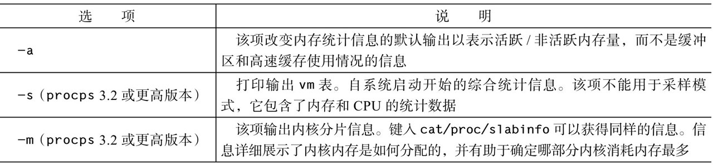

表 3-2 所示列表为 vmstat 可以提供的内存统计信息. 与 CPU 统计信息一样, 当运行于普通模式时, vmstat 提供的第一行信息为所有速率统计信息(so 和 si)的均值以及所有数字统计信息的瞬时值(swpd、free、buff、cache、active 和 inactive).

表 3-2 与内存相关的 vmstat 输出统计信息:

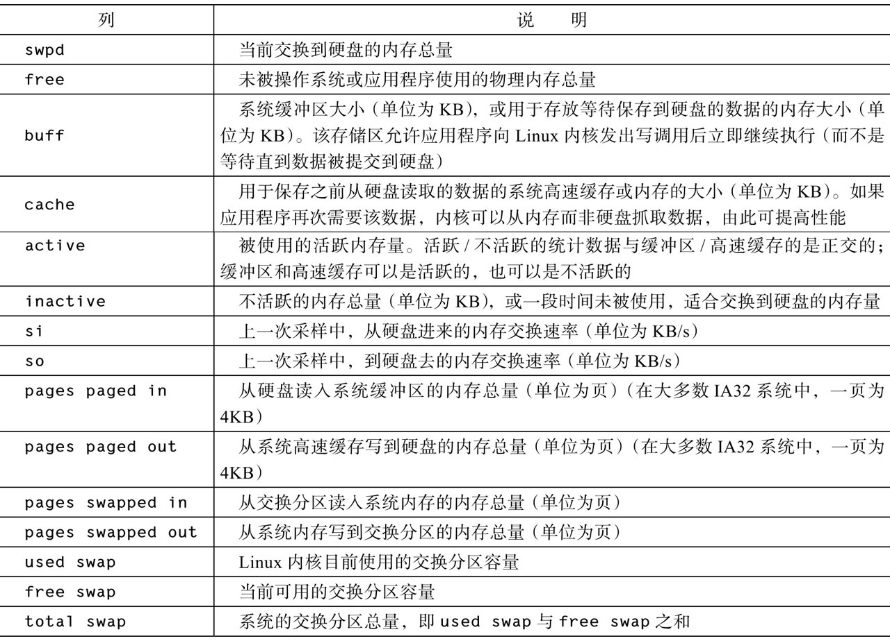

对给定机器而言, vmstat 能提供其虚拟存储系统当前状态的良好概览. 虽然它不会为每个可用的 Linux 每次性能统计数据提供一个完整且详细的列表, 但它给出的简洁输出可以表明系统内存整体上是如何被使用的.

## 1.2. 用法示例

如前面章节所见, 清单 3.2 中, 如果 vmstat 调用时没有使用任何命令行选项, 它显示的是从系统启动开始的性能统计数据的均值(si 和 so), 以及其他统计信息的瞬时值(swpd、free、buff 和 cache). 本例中, 我们可以看到系统已经有大约 500MB 的内存交换到了硬盘. 约 14MB 系统内存是空闲的. 约 4MB 用于缓冲区, 以保存还未刷新到硬盘的数据. 约 627MB 用于硬盘缓存, 以保存过去从硬盘读取的数据.

清单 3.2

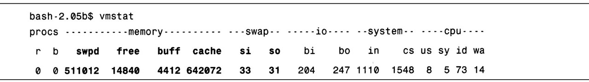

在清单 3.3 中, 我们要求 vmstat 显示活跃与非活跃页面的数量信息. 非活跃页面的数量表明了有多少内存可以交换到硬盘, 有多少内存是当前可用的. 本例中, 我们可以看到活跃内存有 1310MB, 只有 78MB 被认为是不活跃的. 该机拥有大量内存, 且大部分都被使用, 处于活跃状态.

清单 3.3

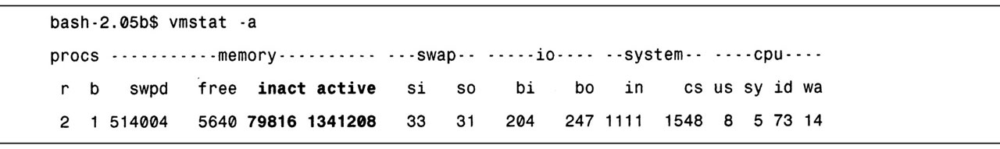

接下来, 在清单 3.4 中, 我们看到的是一个不同的系统, 其内存数据交换频繁. si 列显示在每个采样期间, 数据的读交换率分别为 480KB、832KB、764KB、344KB 和 512KB. so 列显示在每个采样期间, 内存数据写交换率分别为 9KB、0KB、916KB、0KB、1068KB、444KB 和 792KB. 这些结果可以说明该系统没有足够的内存来处理所有的运行进程. 当一个进程的内存被保存下来, 以便为之前已经交换到硬盘的应用程序腾位置时, 就会出现高频率的换入和换出. 如果有两个运行程序需要的内存量都超过了系统可提供的量, 后果就会很糟糕. 比如, 两个进程都在使用大量内存, 且它们都试图同时运行, 而每个进程都可以导致另一个的内存被写交换. 当一个程序需要一块内存时, 它就会把另一个程序需要的一块内存踢出去. 而当另一个应用程序开始运行时, 它又会把第一个程序正在使用的一块内存踢出去, 并等待自己的内存块从交换分区加载进来. 这可能会导致两个应用程序出现停顿, 以等待它们的内存从交换分区取回, 然后才能继续执行. 只要一个程序进步一点点, 它就会将另一个进程使用的内存交换出去, 从而导致这个程序慢下来. 这种情况被称为颠簸. 发生颠簸时, 系统会花大量的时间将内存读出或写入交换分区, 系统性能就会急剧下降.

具体到这个例子, 交换最终停止了, 最有可能的原因是交换到硬盘的内存不是第一个进程立即需要的. 这就意味着交换是有效的, 不是正在使用的内存内容被写入到硬盘, 然后内存就会分配给需要它的进程.

清单 3.4

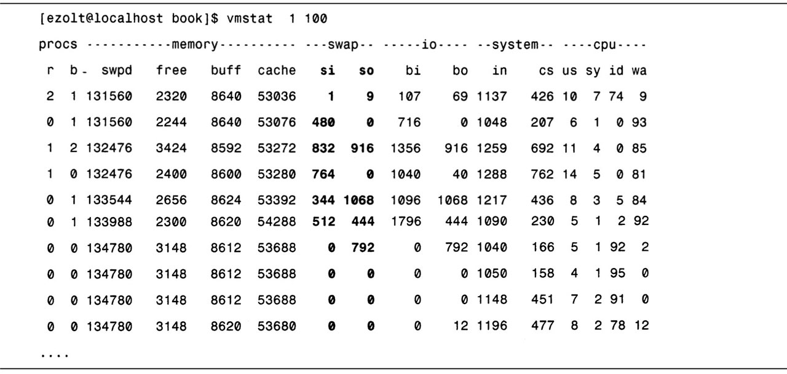

清单 3.5 在前面的章节已经给出了, 如其所示, vmstat 可以展示很多种不同的系统统计信息. 现在当我们查看它时, 我们可以看到一些相同的统计数据以不同的输出模式呈现, 比如 active、inactive、buffer、cache 和 used swap. 但是也出现了一些新的统计信息, 如 total memory, 该数据表示系统总共有 1516MB 内存; total swap, 该数据表示系统总共有 2048MB 的交换分区. 当试图确定交换分区和当前使用内存的百分比时, 了解系统总量是有帮助的. 另一个有趣的统计信息是 pages paged in, 它表示从硬盘读入的页面总数. 这个统计信息包括启动应用程序读取的页面, 以及该应用程序本身可以使用的页面.

清单 3.5

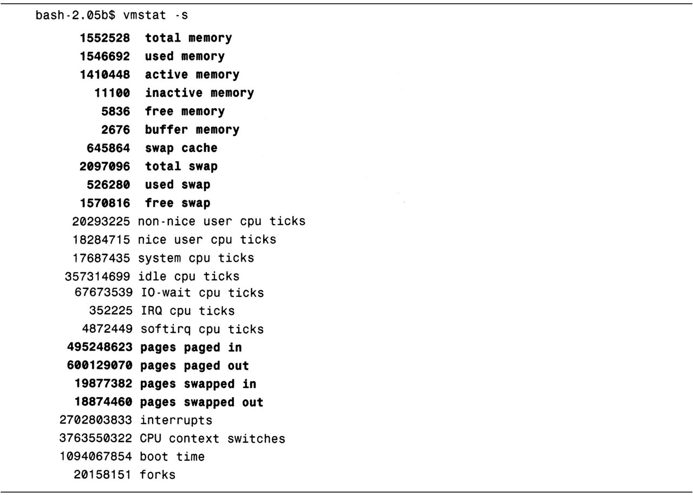

最后, 在清单 3.6 中, 我们看到 vmstat 可以提供关于 Linux 内核如何分配其内存的信息. 如前所述, Linux 内核有一系列"分片"来保存其动态数据结构. vmstat 显示每一个分片(Cache), 展示使用了多少元素(Num), 分配了多少(Total), 每个元素的大小(Size), 整个分片使用了多少内存页(Pages). 这些信息有助于跟踪内核究竟是怎样使用其内存的.

清单 3.6

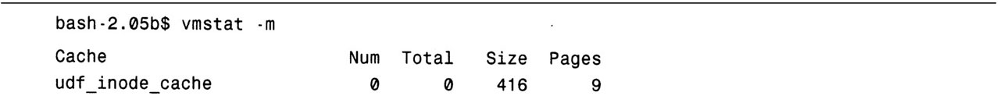

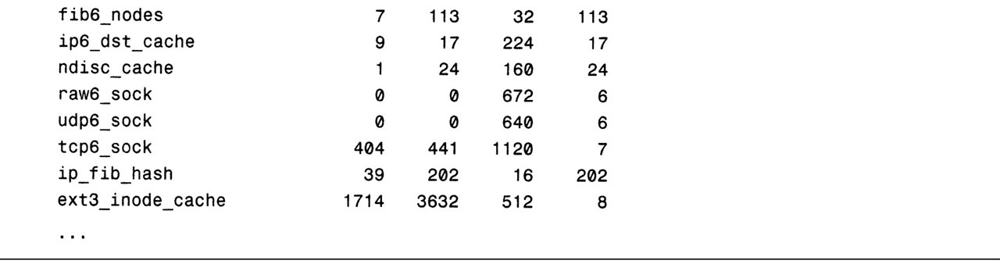

vmstat 提供了一种简便的方法来抽取大量的 Linux 内存子系统的信息. 与默认输出界面上的其他信息结合起来, 它就展示出了一个关于系统运行状况和资源使用情况的图象.

# 2. top(2.x 和 3.x)

前面章节已经讨论过, top 能同时给出系统级或特定进程的性能统计信息. 默认情况下, top 展示的是对进程的 CPU 消耗量进行降序排列的列表, 但它也可以调整为按内存使用总量排序, 以便你能跟踪到哪个进程使用的内存最多.

## 2.1. 内存性能相关的选项

top 不用任何特定命令行选项来控制其显示内存统计信息. 它的调用命令行如下:

```
top
```

不过, 一旦开始运行, top 允许你选择显示系统级内存信息, 还是显示按内存使用量排序的进程. 按内存消耗量排序被证明对确定哪个进程消耗了最多内存是非常有帮助的. 表 3-3 说明了不同的与内存相关的切换项.

表 3-3 top 运行时切换项

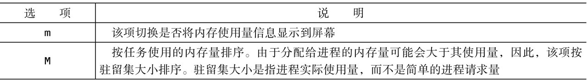

表 3-4 给出了 top 能提供的整个系统以及单个进程的内存性能统计数据. top 有两个不同的版本 2.x 和 3.x, 它们在输出统计数据的名称上有些微差异. 表 3-4 对两个版本的名称都进行了说明.

表 3-4 top 内存性能统计信息

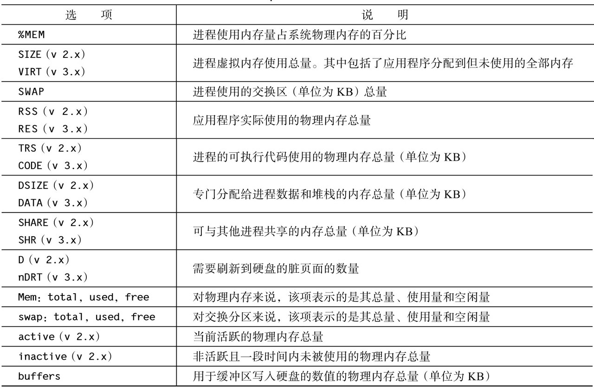

top 提供了不同运行进程的大量的内存信息. 如同后续章节将会讨论的, 你可以使用这些信息来确定应用程序究竟是如何分配和使用内存的.

## 2.2. 用法示例

清单 3.7 与前面章节给出的 top 运行示例相似. 不过这个例子中, 请注意在缓冲区中有大约 84MB 是空闲的, 而总的物理内存容量为 1024MB.

清单 3.7

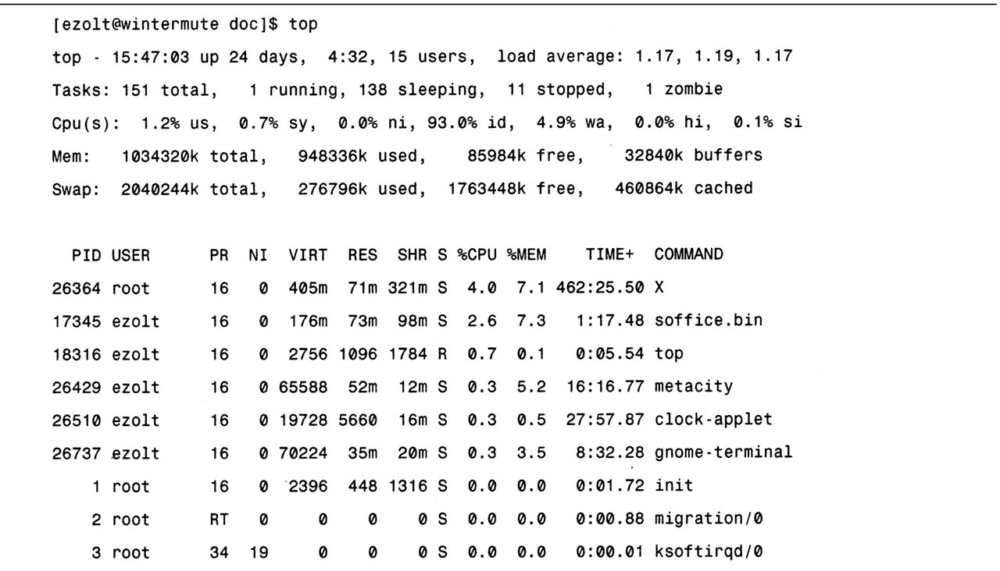

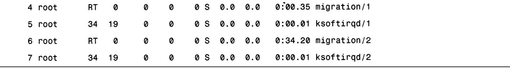

和前面一样, top 可以被定制为只显示观察过程中你感兴趣的内容. 清单 3.8 给出的高度配置界面只显示了内存性能统计信息.

清单 3.8

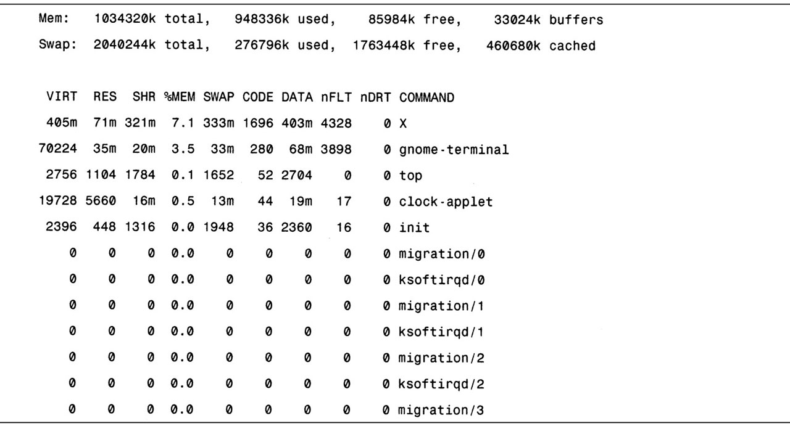

top 提供了对内存统计数据的实时更新, 并显示了哪个进程正在使用哪种类型的内存. 当我们调查应用程序内存使用情况时, 这些信息就变得有用了.

# 3. procinfo(II)

正如我们在前面看到的, procinfo 提供的是系统级性能特性的概览. 除了前面章节描述过的统计数据外, procinfo 还提供了一些内存统计数据, 与 vmstat 和 top 类似, 这些数据表明了当前内存是如何被使用的.

## 3.1. 内存性能相关的选项

procinfo 没有任何选项来修改其内存统计信息的显示输出, 因此其调用命令如下:

```
procinfo
```

procinfo 显示的是基本内存系统的内存统计信息, 与 top 和 vmstat 类似, 如表 3-5 所示.

表 3-5 procinfo 内存统计信息

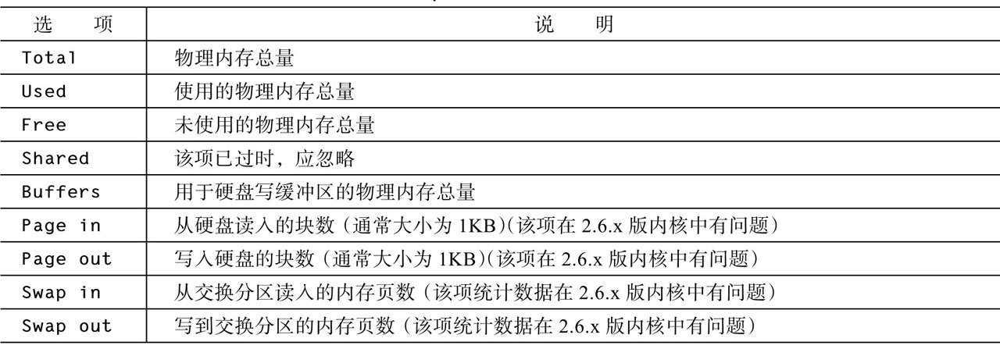

与 vmstat 和 top 非常相似, procinfo 是一种低开销的命令, 它适于长时间在控制台或屏幕窗口中运行. 它为系统运行状况和性能提供了良好的指示.

## 3.2. 用法示例

清单 3.9 是 procinfo 的典型输出. 如同你所看到的, 它报告了系统使用虚拟内存的总体信息. 在这个例子中, 系统总共有 312MB 内存, 其中有 301MB 被内核和应用程序使用, 11MB 为系统缓冲区, 还有 11MB 完全没有被使用.

清单 3.9

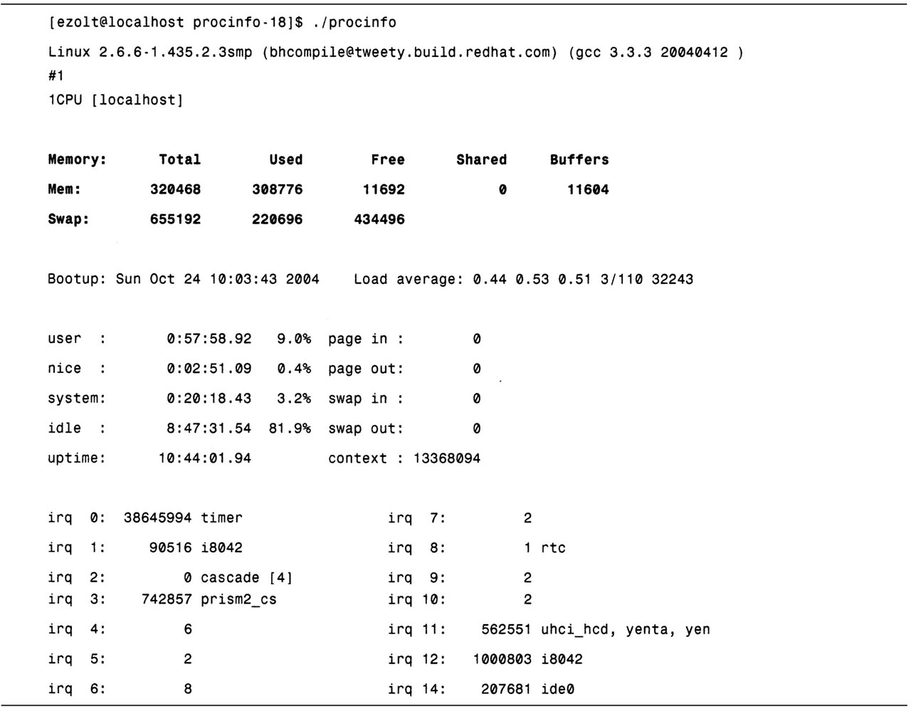

procinfo 在单一信息屏中提供系统性能信息. 虽然它给出了一些重要的内存统计数据, 但 vmstat 或 top 更适合于调查系统级的内存使用情况.

# 4. gnome-system-monitor(II)

gnome-system-monitor 在许多方面就是 top 的图形表示. 它使你能监控单个进程, 并从它显示的图形上来观察系统负载. 同时, 它还提供了 CPU 和内存使用情况的基本图形.

## 4.1. 内存性能相关的选项

gnome-system-monitor 可以从 Gnome 菜单调用. (Red Hat 9 及更高版本中, 在 System Tools -> System Monitor 选项下. )不过, 它也可以用下面的命令行来调用:

```
gnome-system-monitor
```

gnome-system-monitor 没有相关的命令行选项能影响内存性能测量.

## 4.2. 用法示例

当你启动 gnome-system-monitor, 并选择 System Monitor 标签后, 你可以看到如图 3-1 所示的窗口. 这个窗口使你能浏览图形, 看看当前已经使用了多少物理内存和交换分区, 以及使用情况随时间发生的变化. 在这个例子中, 我们看到 1007MB 的总量中已经使用了 969MB, 且内存使用量在一段时间内是比较平稳的.

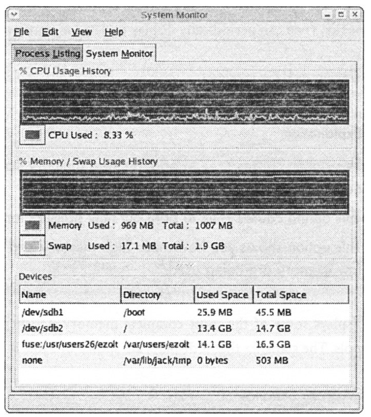

gnome-system-monitor 提供的数据图形视图使得对系统的观察更容易也更迅速, 但是, 却缺少了大部分的细节, 比如内存是如何使用的.

# 5. free

free 提供的是系统使用内存的总体情况, 包括空闲内存量. 虽然 free 命令可能会显示一个特定系统没有多少空闲内存, 但这不一定是坏事. Linux 内核不会让空闲内存一直闲着, 而是会将它作为高速缓存用于硬盘读, 或是作为缓冲区用于硬盘写. 这可以显著提升系统性能. 由于这些高速缓存和缓冲区总是可以被丢弃的, 所以, 当应用程序需要时这些内存还是可以使用的, free 显示的是空闲内存容量加上或减去这些缓冲区的容量.

## 5.1. 内存性能相关的选项

用下面的命令行可以调用 free:

```
free [-l] [-t] [-s delay] [-c count]
```

表 3-6 说明的参数可以修改 free 显示的统计信息类型. 与 vmstat 非常相似, free 可以周期性地显示更新内存统计数据.

表 3-6 free 命令行选项

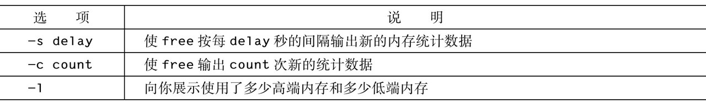

free 实际上显示了一些所有内存统计工具的最完整的内存统计信息. 这些统计信息如表 3-7 所示.

表 3-7 free 内存统计信息

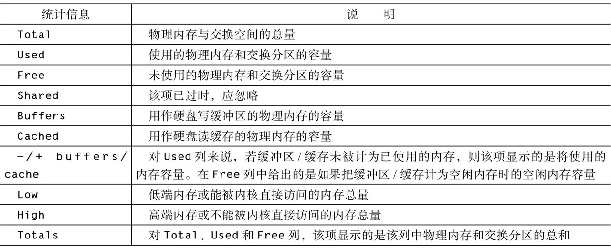

free 提供的是 Linux 中系统级内存使用情况信息. 它给出了相当完整的内存统计数据.

## 5.2. 用法示例

不使用任何命令选项来调用 free, 能让你获得内存子系统的整体信息.

如前所述, 如果可能的话, Linux 会使用所有可用的内存来缓存数据和应用程序. 在清单 3.10 中, free 告诉我们现在已经使用了 234720 字节的内存, 但是, 如果忽略缓冲区和缓存, 那么就只使用了 122772 字节的内存. 与之相反的是 free 列, 当前我们有 150428 字节内存是空闲的, 同样的, 如果已经将缓冲区和缓存计算在内(这是可以的, 因为在 Linux 需要使用这部分内存时, 它会丢弃这些缓冲区), 那么, 我们有 262376 字节的空闲内存.

清单 3.10

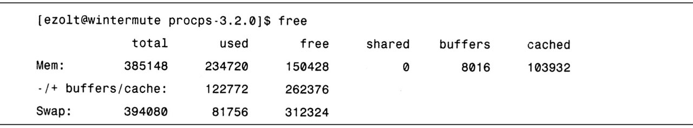

尽管你可以自己合计这些列, 但是清单 3.11 所示的-t 标志可以告诉你加上交换分区和实际内存的总数. 在这个例子中, 系统有 376MB 的物理内存和 384MB 的交换分区. 系统可获得的内存总量为 376MB 加上 384MB, 即大约 760MB. 总的空闲内存计算方法为 134MB 的物理内存加上 259MB 的交换分区, 产生总共 393MB 的空闲内存.

清单 3.11

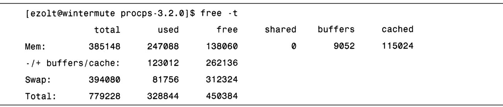

最后, free 还能告诉你系统使用的高端和低端内存量. 这主要用于具有 1GB 或更多物理内存的 32 位机器(如 IA32). (32 位机器是唯一有高端内存的机器. )清单 3.12 展示了一个系统, 该系统的空闲内存非常小, 总共只有 6MB. 它显示出系统有 876MB 的低端内存和 640MB 的高端内存. 同时, 这个系统的缓存内存容量比缓冲内存容量大很多, 这表明它可能更加积极地将数据写入硬盘, 而不是长时间将其留在缓冲区里.

清单 3.12

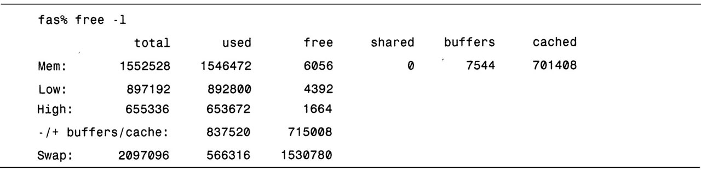

free 很好地体现了系统内存是如何被使用的. 虽然可能需要点时间来适应其输出格式, 但是它包含了所有重要的内存统计信息.

# 6. slabtop

slabtop 与 top 相似, 但是它并不显示系统中进程的 CPU 和内存使用情况的信息, slabtop 实时显示内核是如何分配其各种缓存的, 以及这些缓存的被占用情况. 在内部, 内核有一系列的缓存, 它们由一个或多个分片(slab)构成. 每个分片包括一组对象, 对象个数为一个或多个. 这些对象可以是活跃的(使用的)或非活跃的(未使用的). slabtop 向你展示的是不同分片的状况. 它显示了这些分片的被占用情况, 以及它们使用了多少内存.

## 6.1. 内存性能相关的选项

slabtop 用如下命令行调用:

```
slabtop [--delay n -sort={a | b | c | l | v | n | o | p | s | u}]
```

表 3-8 对 slabtop 的命令行选项进行了说明.

表 3-8 slabtop 命令行选项

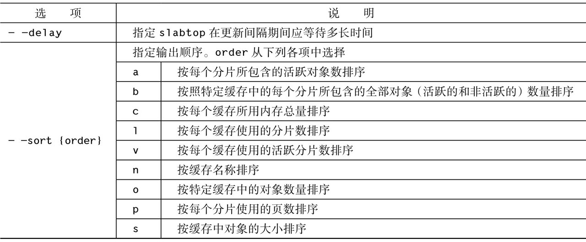

slabtop 可以一窥 Linux 内核的数据结构. 每一种分片类型都与 Linux 内核紧密相关, 不过, 对这些分片的描述已经超出了本书的范围. 如果某个特定分片使用了大量的内核内存, 那么阅读 Linux 内核源代码和搜索互联网是找出这些分片用在哪里的最好的两种方法.

## 6.2. 用法示例

如清单 3.13 所示, 默认情况下, slabtop 会填满整个控制台, 且每 3 秒就更新一次统计数据. 在这个例子中, 你可以看见 size-64 分片的对象数最多, 但其中只有一半是活跃的.

清单 3.13

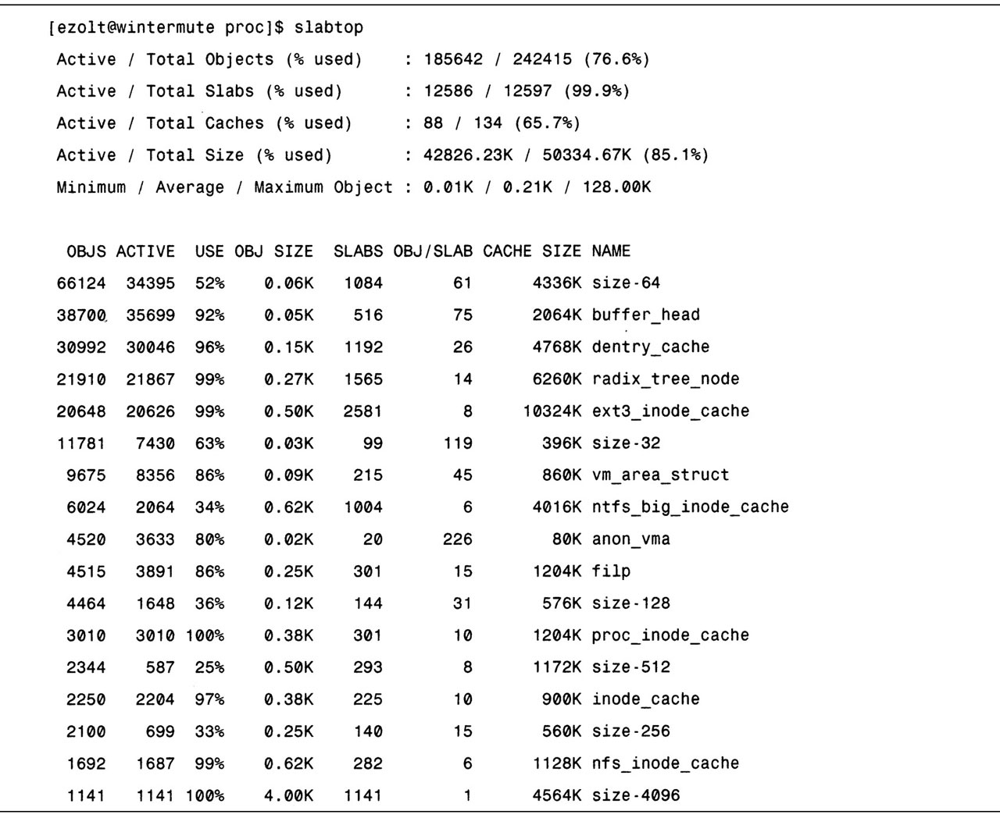

由于 slabtop 提供的信息是周期性更新的, 因此它是观察 Linux 内核的内存使用情况随工作负载变化而变化的极好的方法.

# 7. sar(II)

在对内存统计信息进行监控时, sar 作为 CPU 性能工具的所有优势仍然存在, 比如简单记录样本、提取多种输出格式、对样本加时间戳等. sar 提供的信息与其他内存统计工具类似, 比如空闲内存、缓冲区、高速缓存和交换分区总量的当前值. 但是, 它还会提供这些数值的变化率, 以及当前消耗的物理内存和交换分区的百分比信息.

## 7.1. 内存性能相关的选项

sar 使用如下命令行进行调用:

```
sar [-B] [-r] [-R]
```

默认情况下, sar 只显示 CPU 性能统计数据; 因此, 如果想要检索任何内存子系统的统计信息, 你就需要使用表 3-9 给出的选项.

表 3-9 sar 命令行选项

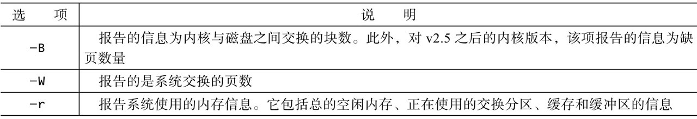

sar 给出的 Linux 内存子系统的信息相当完整. sar 强过其他工具的一点就是, 除了绝对值之外, 它还提供一些重要数值的变化率. 你可以通过这些数值查看内存使用情况究竟是如何随时间变化的, 而不用去找出这些值在样本之间的差异. 表 3-10 给出了 sar 提供的内存统计信息.

表 3-10 sar 内存统计信息

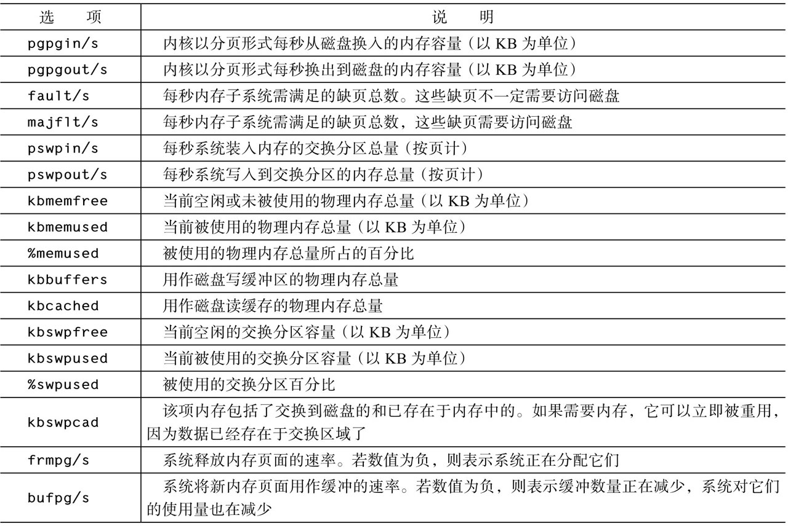

尽管 sar 没有高端和低端内存统计数据, 但是它几乎提供了其他所有的内存统计信息. 事实上, sar 还能记录网络 CPU 和磁盘 I/O 的统计数据, 这使得它非常强大.

## 7.2. 用法示例

清单 3.14 展示了 sar 提供的关于当前内存子系统状态的信息. 从这些结果我们可以看到系统使用的内存量占整个内存容量的比例变化范围为 98.87%到 99.25%. 在观察期间, 空闲内存量从 11MB 下降到 7MB. 被使用的交换分区百分比徘徊在 11%左右. 系统的数据缓存容量约为 266MB, 且大约有 12MB 的缓冲可以写到磁盘.

清单 3.14

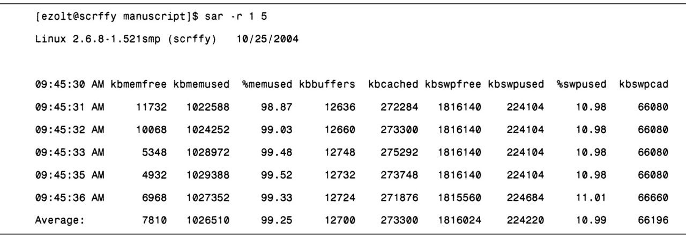

清单 3.15 显示在第一个样本期间, 系统使用空闲内存的速率约为每秒 82 个页面. 然后系统释放了约 16 个页面, 接着又使用了大约 20 个页面. 观察期间只有一次缓冲页面数是增加的, 速率为每秒 2.02 个页面. 最后, 缓存页面数减少了 2.02, 不过最终, 它们增加的速率为每秒 64.36 个页面.

清单 3.15

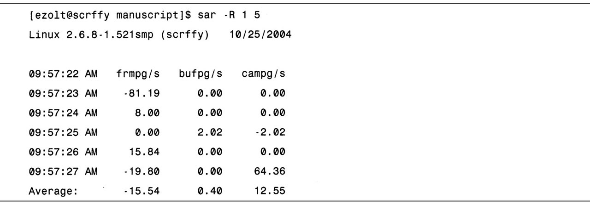

清单 3.16 显示, 在第三个样本期间, 系统从内存写了大约 53 个页面到磁盘. 该系统的缺页数相对较高, 这就意味着内存页面在被分配和使用. 幸运的是, 这些都不是主缺页, 系统不必为了解决它们而去访问磁盘.

清单 3.16

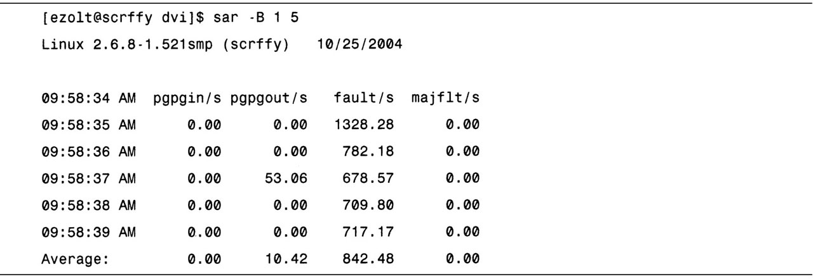

如你所见, sar 是一个强大的工具, 通过增加存档、时间戳和同步收集多种不同类型统计信息的能力, 它增强了其他系统内存性能工具的功能.

# 8. /proc/meminfo

Linux 内核提供用户可读文本文件/proc/meminfo 来显示当前系统范围内的内存性能统计信息, 它提供了系统范围内内存统计数据的超集, 包括了 vmstat、top、free 和 procinfo 的信息, 但是使用起来有一定的难度. 如果你想定期更新, 就需要自己写一个脚本或一些代码来实现这个功能. 如果你想保存内存性能信息或是将其与 CPU 统计信息相协调, 就必须创建一个新的工具或是写一个脚本. 尽管如此, /proc/meminfo 提供的却是最完整的系统内存使用情况的信息.

## 8.1. 内存性能相关的选项

/proc/meminfo 中的信息可以用如下命令行来检索:

```
cat /proc/meminfo
```

这个命令显示的统计信息如表 3-11 所示.

表 3-11 /proc/meminfo 内存统计信息(均以 KB 为单位)

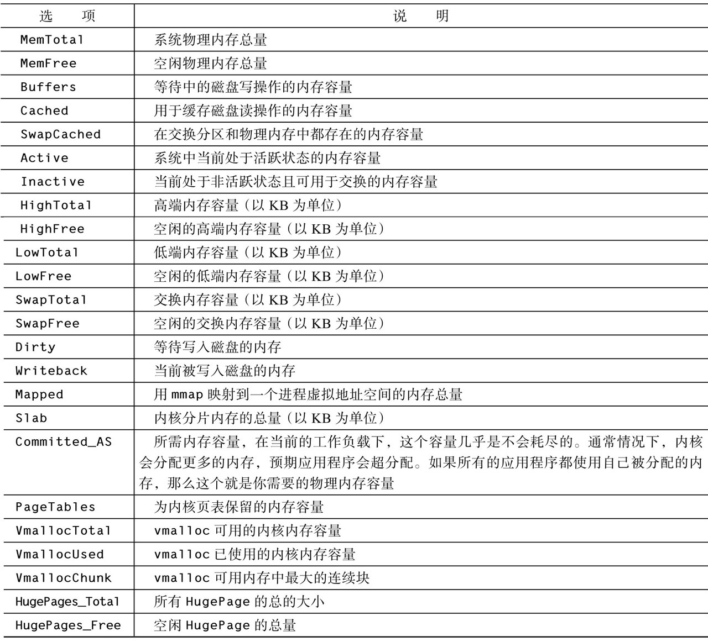

/proc/meminfo 提供了大量的关于 Linux 内存子系统当前状态的信息.

## 8.2. 用法示例

清单 3.17 是一个输出/proc/meminfo 的例子. 它给出的一些内存统计信息与我们在其他工具中看到的信息是相同的. 但是有些统计数据则给出了新的信息. 首先, Dirty 项显示系统当前有 24KB 的数据等待写入磁盘. 其次, Committed_AS 项显示我们还需要更多一点的内存(需要的量为 1068MB, 而总量为 1024MB), 以避免出现可能的内存耗尽的情况.

清单 3.17

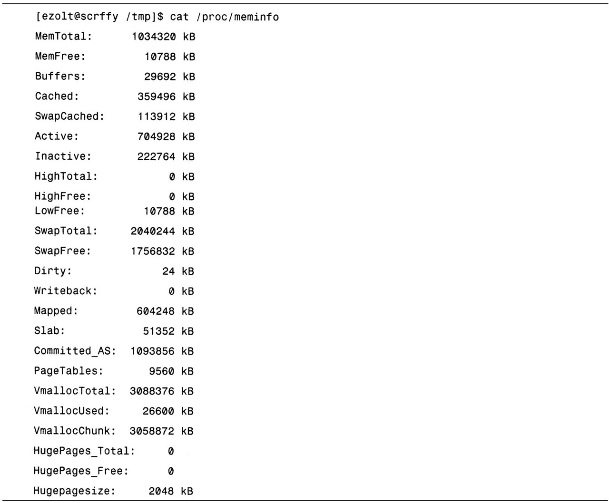

/proc/meminfo 收集的系统级 Linux 内存统计信息是最完整的. 由于可以把它当作是一个文本文件, 因此, 任何自定义的脚本或程序都可以很容易地提取这些统计数据.