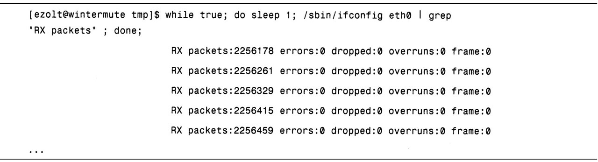
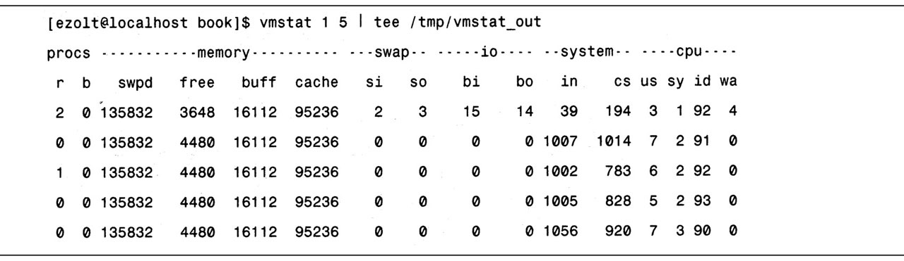
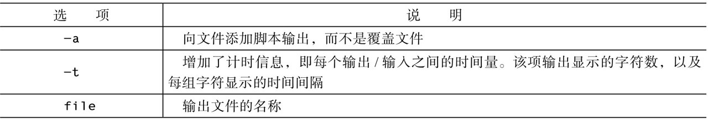
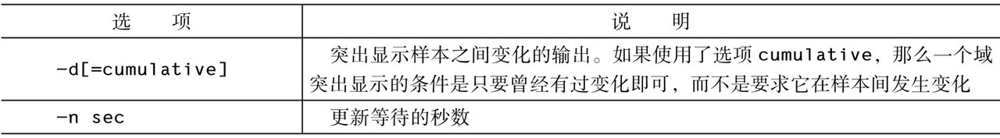
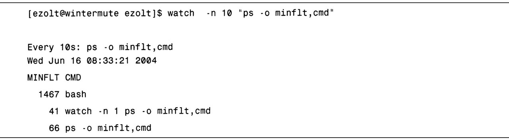

<!-- @import "[TOC]" {cmd="toc" depthFrom=1 depthTo=6 orderedList=false} -->

<!-- code_chunk_output -->

- [1. bash](#1-bash)
  - [1.1. 性能相关的选项](#11-性能相关的选项)
  - [1.2. 用法示例](#12-用法示例)
- [2. tee](#2-tee)
  - [2.1. 性能相关的选项](#21-性能相关的选项)
  - [2.2. 用法示例](#22-用法示例)
- [3. script](#3-script)
  - [3.1. 性能相关的选项](#31-性能相关的选项)
  - [3.2. 用法示例](#32-用法示例)
- [4. watch](#4-watch)
  - [4.1. 性能相关的选项](#41-性能相关的选项)
  - [4.2. 用法示例](#42-用法示例)
- [5. gnumeric](#5-gnumeric)
  - [5.1. 性能相关的选项](#51-性能相关的选项)
  - [5.2. 用法示例](#52-用法示例)

<!-- /code_chunk_output -->

# 1. bash

bash 是默认的 Linux 命令行 shell.

## 1.1. 性能相关的选项

大多数 Linux 用户都把**bash**作为**默认的 shell**. 如果你没有使用 bash, 也可以**键入 bash 来调用它**.

使用特定命令周期性提取性能统计数据, 下面给出了脚本选项.

表 8-1 bash 运行时脚本选项


## 1.2. 用法示例

虽然有些性能工具, 如**vmstat**和**sar**, 能**周期性**地**更新性能统计信息**, 但是其他的命令, 比如**ps**和**ifconfig**则不能. **bash**可以调用诸如 ps 或 ifconfig 命令来**周期性**地**显示它们的统计数据**.

例如, 在清单 8.1 中, 我们**只关心接收数据包**, 该循环将一直执行直到用组合键`<Ctrl-C>`终止它.

清单 8.1

```
while true; do sleep 1; /sbin/ifconfig ens33 | grep "RX packets"; done;
```



利用上面脚本, 可查看**按秒更新**的**网络性能统计信息**.

# 2. tee

tee 是一个简单的命令, 可以将命令的标准输出**保存为文件**并**同时进行显示**.

## 2.1. 性能相关的选项

tee 的调用命令行如下:

```
<command> | tee [-a] [file]
```

tee 获取由`<command>`提供的**输出**, 在将其**保存到指定文件**的**同时也显示**到标准输出设备.

如果特别指定了`-a`选项, 则 tee 会将输出**添加到文件**上, 而**不是覆盖文件**.

## 2.2. 用法示例

清单 8.2 展示了用 tee 来记录 vmstat 的输出.

清单 8.2



# 3. script

script 命令用于将一个**shell 会话过程中**产生的**全部输入**和**输出**保存为**文本文件**.

## 3.1. 性能相关的选项

在执行的时候, 它会**启动一个新的 shell**, 并记录下这个 shell 存续期间**所有的键盘动作**和**输入**, 以及**生成的输出**, 并将它们**保存到文本文件**.

```
script [-a] [-t] [file]
```

**默认情况**下, script 把**所有的输出**都放到名为**typescript**的文件中, 除非你特别指定其他的文件.

表 8-2 script 命令行选项



提醒: script 字面上的意思是捕捉发送到屏幕的每一种类型的输出. 但是, 如果有**彩色**或**加粗的输出**, 就会在输出文件中**显示为 esc 字符**. 这些字符会明显让输出变得混乱, 因此一般不怎么有用. 不过, 如果将**TERM 环境变量**设置为**dumb**(在基于**csh**的 shell 中用`setenv TERM dumb`, 在基于**sh**的 shell 中用`export TERM=dumb`), 应用程序就不会输出转义字符. 这就使得输出具有更好的可读性.

此外, **script**提供的**计时信息**也会**扰乱输出**. 虽然自动生成计时信息是有用的, 但是更方便的做法**不是使用 script 的计时**, 而是直接用前面章节介绍的**time 命令**来对重要命令进行计时.

## 3.2. 用法示例

如前所述, 如果将终端设置为 dumb, 会得到可读性更好的 script 输出. 其实现方法是使用如下命令行:

```
export TERM=dumb
```

然后, 正式**启动 script 命令**. 清单 8.3 显示的是用输出文件`ps_output`启动的 script. script 会持续记录会话, 直到用**exit 命令**或按下`<Ctrl-D>`组合键退出该 shell.

清单 8.3

```
[root@lihaiwei ~]# script ps_output
Script started, file is ps_output
[root@lihaiwei ~]# ps
   PID TTY          TIME CMD
 67932 pts/4    00:00:00 bash
 67965 pts/4    00:00:00 ps
[root@lihaiwei ~]# exit
Script done, file is ps_output
```

查看由 script 记录下的输出. 如你所见, 其中包含了**所有的命令**以及**生成的全部输出**.

清单 8.4

```
[root@lihaiwei ~]# cat ps_output
Script started on Tue 10 Dec 2019 09:39:08 AM CST
[root@lihaiwei ~]# ps
   PID TTY          TIME CMD
 67932 pts/4    00:00:00 bash
 67965 pts/4    00:00:00 ps
[root@lihaiwei ~]# exit

Script done on Tue 10 Dec 2019 09:39:22 AM CST
```

恢复

```
export TERM=xterm-256color
```

# 4. watch

**默认**情况下, watch 命令会**每秒运行一条命令**并将其**输出显示到屏幕上**. 与那些**不能周期性地显示更新结果的性能工具**一起工作时, watch 能发挥其作用.

比如, 有些工具, 如**ifconfig**和**ps**, 显示的是当前性能统计数据, 然后退出. 由于 watch 能周期性的执行命令并显示其输出, 因此, 通过观看屏幕就可以发现哪些统计数据发生了变化, 以及它们的变化速率.

## 4.1. 性能相关的选项

watch 用如下命令行调用:

```
watch [-d[=cumulative]] [-n sec] <command>
```

如果调用的时候**不带参数**, watch 只会**按秒显示**给定命令的输出, 直到你中断这个过程.

**默认输出**通常很难发现一屏信息与另一屏信息的**差异**, 因此, watch 提供了选项来突出显示**每个输出之间的不同**. 这样更容易发现**每个采样之间的输出差异**. 表 8-3 对 watch 可接受命令行选项进行了说明.

表 8-3 watch 命令行选项



## 4.2. 用法示例

清单 8.5 中的第一个例子展示了与 ps 命令一起使用的 watch.

我们要求 ps 给出**每个进程产生的一般故障的数量**. watch**每 10 秒清除屏幕**, 并**更新该信息**. 请注意, 可能需要为你要求**执行的命令加上引号**, 这样, watch 就不会将你想要执行的命令的选项与它自身的选项搞混.

清单 8.5

```
watch -n 10 "ps -o minflt,cmd"
```



# 5. gnumeric

**梳理数据**并从中找出能够表明**系统运行情况的趋势与模式**就成了一个问题.

通常电子表格, 尤其是**gnumeric**, 能够从三个不同的方面使得这个任务变得容易实现.

首先, gnumeric 提供了**内置函数**, 比如求**最大值**、**最小值**、**平均值**和**标准偏差**, 这就使你能对性能数据进行**数值分析**.

其次, gnumeric 提供了灵活的方式来**导入**许多性能工具常用输出的表格文本数据.

最后, gnumeric 还有一个强大的**绘图工具**, 可以将性能工具生成的**性能数据可视化**.

其他的电子表格, 如 OpenOffice 的**oocalc**, 也可以使用, 不过 gnumeric 强大的文本导入器和绘图工具使得它成为最容易被使用的工具.

## 5.1. 性能相关的选项

使用电子表格帮助实现性能分析, 只需完成以下步骤:

1. 将**性能数据保存**到文本文件.
2. 将**文本文件导入**到 gnumeric.
3. 分析数据或用数据绘图.

gnumeric 可以生成**多种不同类型的图形**, 并且提供了**多种不同的函数**实现数据分析.

## 5.2. 用法示例

要展示 gnumeric 的实用性, 首先必须**生成**用于绘图和分析的**性能数据**.

清单 8.6 要求**vmstat 生成 100 秒的输出**, 并将该信息保存到文本文件`vmstat_output`中. 数据将会被加载到 gnumeric. `-n`选项表示 vmstat**只显示头信息一次**(而**不是每屏信息都显示**).

清单 8.6

```
vmstat -n 1 100 > vmstat_output
```

接下来, 用如下命令**启动 gnumeric**:

```
gnumeric &
```

这会打开一个空白电子表格用于导入 vmstat 数据.
在 gnumeric 中选择 File>Open, 弹出一个对话框(图中未显示)用于选择打开的文件及该文件的类型. 我们选择 Text Import(Configurable)作为文件类型, 然后通过一系列的向导对话框来选择将 vmstat_output 文件的哪一列映射到电子表格的哪一列. 对 vmstat 而言, 最好从第二行文本开始导入, 因为第二行包含了列名称以及每一列适合的大小. 此外, 为导入数据选择 Fixed-Width 也是很有用的, 其原因是 vmstat 就是这样输出数据的. 在成功导入数据后, 我们就会看到如图 8-1 所示的电子表格.

图 8-1
接下来, 利用导入的数据绘图. 在图 8-2 中, 我们用不同的 CPU 使用情况(us、sys、id、wa)创建了一个叠式图. 由于这些数据的总和始终为 100%(或接近该值), 因此, 每次都能看出哪种状态处于主导地位. 本例中, 系统在大部分时间都是空闲的, 不过在图中 1/4 的部分出现了大量的等待时间.

图 8-2
图形是查看一个测试单次运行时, 其性能统计数据随时间变化情况的有力手段. 同时, 对于发现不同运行的对比差异也是很有帮助的. 用不同运行得到的数据绘图时, 要确保每个图使用的比例是相同的, 这能让数据的比较对照更加容易.
gnumeric 是一种轻量级的应用程序, 它使你能快速简便地导入、绘图/分析大量的性能数据. 它是一种很棒的工具, 通过处理性能数据来探寻是否出现了任何有趣的特性.
8.2.6 ldd
ldd 可以被用来显示特定的二进制文件依赖的是哪个库. ldd 有助于跟踪一个应用程序可能使用的库函数的位置. 通过给出应用程序正在使用的所有库, 就可以对它们进行搜索, 找出包含给定函数的库.
8.2.6.1 性能相关的选项
ldd 用如下命令行调用:

接着 ldd 会列出该二进制文件需要的所有库, 以及系统中有哪些文件能实现这些需求.
8.2.6.2 用法示例

清单 8.7 展示的是 ldd 用在二进制文件 ls 上. 在这个特定的例子中, 我们可以发现 ls 使用了如下这些库: linux-gate.so.1, librt.so.1, libacl.so.1, libselinux.so.1, libc.so.6, libpthread.so.0, ld-linux.so.2 和 libattr.so.1.
清单 8.7

ldd 是一个相对简单的工具, 但对于试图追踪应用程序使用了哪些库以及这些库在系统中的位置来说, 它具有极大的价值.
8.2.7 objdump
对于分析二进制文件和库的各个方面来说, objdump 是一种复杂而强大的工具. 尽管它有许多其他的功能, 它可以被用来确定给定的库提供了哪些函数.
8.2.7.1 性能相关的选项
objdump 用如下命令行调用:

如果调用的时候使用了-T 选项, 则它将显示该库/二进制文件所依赖或提供的全部符号. 这些符号可以是数据结构, 也可以是函数. 包含. text 的每一行 objdump 输出都是该二进制文件提供的一个函数.
8.2.7.2 用法示例
清单 8.8 展示的是 objdump 用于分析库 gtk. 因为我们感兴趣的只有 libgtk.so 提供的符号, 所以用 fgrep 对输出进行选择, 仅输出那些包含. text 的行. 本例中, 我们可以看到 libgtk.so 提供的一些函数, 包括 gtk_arg_values_equal、gtk_tooltips_set_colors 和 gtk_viewport_set_hadjustment.
清单 8.8

在使用性能工具时, 它们会显示一个应用程序调用的库函数(而不是库本身), objdump 能帮助找到每个函数所在的共享库.
8.2.8 GNU 调试器(gdb)
gdb 是一个很棒的应用程序调试器, 它可以帮助调查一个正在运行的应用程序的多个不同方面. gdb 具备三个特性使得它对诊断性能问题来说非常有价值. 第一, gdb 可以附加到当前正在运行的进程. 第二, gdb 可以展示该进程的回溯, 即显示当前源代码行和调用树. 附加到进程并抽取其回溯可以迅速找出一些比较明显的性能问题. 但是, 如果应用程序不是卡在单点上, 那么使用 gdb 就难以进行问题诊断, 此时, 系统级的分析器, 如 oprofile, 将会是一个更好的选择. 第三, gdb 可以将虚拟地址映射回特定的函数. 与性能工具相比, gdb 更擅长计算虚拟地址的位置. 例如, 如果 oprofile 给出了事件发生的虚拟地址而非函数名, 那么 gdb 就可以计算出该地址的函数.
8.2.8.1 性能相关的选项
gdb 用如下命令行调用, 其中, pid 是指 gdb 将要附加的进程:

gdb 附加到该进程后, 它就进入到交互模式, 这时就可以检查给定进程的当前执行位置和运行时变量. 表 8-4 对其中的一条命令进行了说明, 可用其检查正在运行的进程.
表 8-4 gdb 运行时选项

gdb 还有很多命令行选项和运行时控件, 它们更适合于调试而不是性能调查. 获取更多信息请参见 gdb 手册页或在 gdb 提示中键入 help.
8.2.8.2 用法示例
想要研究 gdb 是如何工作的, 可以先在一个简单的测试应用程序上演示它. 清单 8.9 中的程序在 main 中只调用了函数 a(), 并陷入了一个无限循环. 这个程序不会结束, 因此当我们将 gdb 附加上去后, 它将会一直执行函数 a()的无限循环.
清单 8.9

清单 8.10 启动应用程序并用 gdb 附加到它的 pid. 我们要求 gdb 产生一个回溯, 以便展示当前正在执行的究竟是哪条代码, 以及哪组函数调用会导致当前的位置. 如同预期的, gdb 显示出正在执行的是无限循环 a(), 它是由 main()调用的.
清单 8.10

最后, 在清单 8.11 中, 我们要求 gdb 给出虚拟地址 0x0804832F 的位置, 而 gdb 显示该地址是函数 main 的一部分.
清单 8.11

gdb 是一个极其强大的调试器, 可以帮助调查性能问题. 如果你想要知道特定代码路径发生的确切原因, 那么 gdb 甚至在性能问题已经确定之后也能够发挥作用.
8.2.9 gcc(GNU 编译器套件)
gcc 是 Linux 系统中最流行的编译器. 与所有的编译器一样, gcc 需要源代码(如 C、C++或 Objective-C)生成二进制代码. 它提供了多个选项不仅可以对得到的二进制代码进行优化, 还能让应用程序的性能跟踪变得更容易. 本书不涉及 gcc 性能优化的详细内容, 但是如果想要提高应用程序的性能, 你就应该研究一下这些内容. gcc 提供的性能优化选项通过多种优化来调整已编译的二进制文件的性能, 这些优化包括: 架构通用优化(使用-01、-02、-03), 特定架构优化(-march 和-mcpu), 以及基于反馈的优化(使用-fprofile-arcs 和-fbranch -probabilities). 更多的优化选项详情请参阅 gcc 手册页.
8.2.9.1 性能相关的选项
gcc 最基本的调用格式如下所示:

gcc 有数量庞大的选项来影响它对应用程序的编译. 如果你有勇气的话, 可以到 gcc 手册页上查阅它们. 表 8-5 给出了有助于性能调查的具体选项.
表 8-5 gcc 命令行选项

许多性能调查工具, 如 oprofile, 需要用调试信息编译应用程序, 以便将性能信息映射回特定的应用程序源代码行. 如果没有调试信息, 它们一般也还是可以工作, 但是如果启动调试, 那么它们将会提供更丰富的信息. 应用程序分析的更多信息参见前面的章节.
8.2.9.2 用法示例
理解 gcc 可以提供的调试信息类型的最好方法可能就是看一个简单的例子. 清单 8.12 中有一个 C 应用程序的源代码 deep.c, 该程序仅调用了一组函数, 然后根据传递的数字输出一定数量的字符串"hi". 程序的 main 函数调用函数 a(), 函数 a()调用函数 b(), 然后输出"hi".
清单 8.12

首先, 如清单 8.13 所示, 编译该程序时不带任何调试信息. 在调试器中启动该程序, 在函数 b()上添加一个断点. 当程序运行时, 它会在函数 b()处暂停, 并请求回溯. gdb 可以弄清楚回溯, 但是它并不知道函数之间传递了什么样的值或者函数存在于原始源代码文件中的什么位置.
清单 8.13

清单 8.14 启动调试信息对同样的应用程序进行编译. 现在, 当运行 gdb 并产生回溯时, 我们可以看到每个函数调用传递的数值, 以及特定代码行所驻留的准确的源代码行.
清单 8.14

调试信息会显著增加 gcc 最终生成的可执行文件的大小. 但是, 在追踪性能问题时, 由其提供的信息却是无价的.