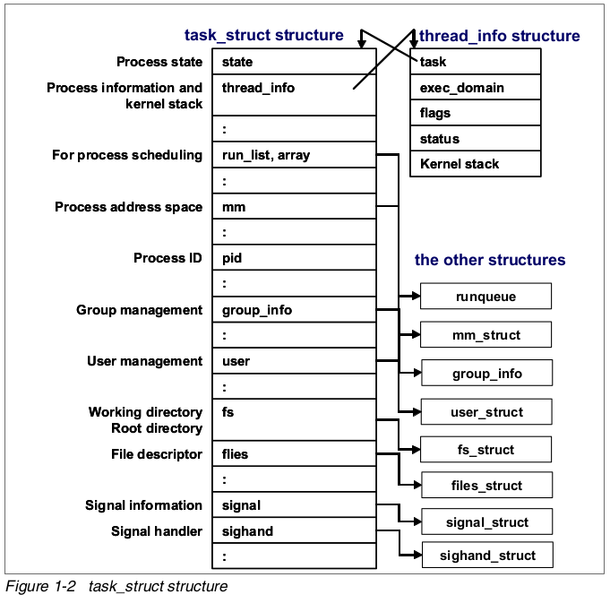
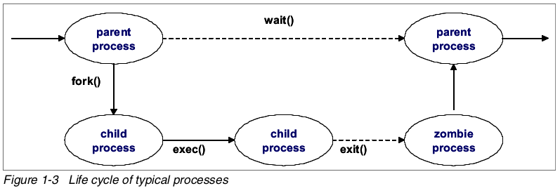
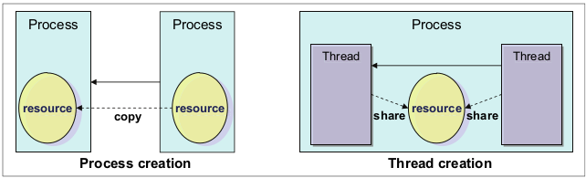

<!-- @import "[TOC]" {cmd="toc" depthFrom=1 depthTo=6 orderedList=false} -->

<!-- code_chunk_output -->

- [什么是进程](#什么是进程)
- [进程的生命周期](#进程的生命周期)
- [线程](#线程)
  - [LinuxThreads](#linuxthreads)
  - [Native POSIX Thread Library(NPTL)](#native-posix-thread-librarynptl)
  - [Next Generation POSIX Thread(NGPT)](#next-generation-posix-threadngpt)
- [进程优先级和 nice 级别](#进程优先级和-nice-级别)
- [切换上下文](#切换上下文)
- [中断处理](#中断处理)
- [进程状态](#进程状态)
  - [TASK_RUNNING](#task_running)
  - [TASK_STOPPED](#task_stopped)
  - [TASK_INTERRUPTIBLE](#task_interruptible)
  - [TASK_UNINTERRUPTIBLE](#task_uninterruptible)
  - [TASK_ZOMBIE](#task_zombie)
  - [僵尸进程](#僵尸进程)
- [进程内存段](#进程内存段)
- [Linux 的 CPU 调度](#linux-的-cpu-调度)

<!-- /code_chunk_output -->

# 什么是进程

进程是在处理器中执行的实例, 内核调度各类资源来满足进程的需求.

所有运行在 Linux 操作系统的进程都被 `task_struct` 这个结构体管理, `task_struct` 也被称为进程描述符. 进程描述符包含一个进程运行所需的所有信息, 比如进程的 id、进程的属性以及构建进程的资源.

# 进程的生命周期

下图展示了一般进程的生命周期

当一个进程**创建一个新的进程**, 创建进程的进程(父进程)使用名为**fork**()的系统调用. 当 fork()被调用的时候, 它会为**新创建的进程(子进程**)获得一个**进程描述符**, 并且设置**新的进程 ID**. 复制父进程的进程描述符给子进程. 这时候, **不会复制父进程的地址空间**, 而是父子进程使用同样的地址空间.

**exec**()系统调用**把新程序复制到子进程的地址空间**. 由于共享同样的地址空间, **写入新进程的数据**会引发**页错误的异常**. 此时, 内核给子进程分配**新的物理页**.

这个延迟的操作叫做 Copy On Write. 子进程和父进程执行的程序通常不一样, 它执行自己的程序. 这个操作避免了不必要的开销, 因为, **复制整个地址空间**是很慢且低效率的, 还会**消耗很多的处理器时间和资源**.

当程序**执行完成**, 子进程使用**exit**()系统调用**终止**. exit()会**释放进程的大部分数据结构**, 并且把这个**终止的消息通知给父进程**. 这时候, **子进程**被称为**zombie process(僵尸进程**).

直到**父进程**通过**wait**()系统调用**知悉子进程终止之前**, 子进程都**不会被完全的清除(！！！**). 一旦父进程知道子进程终止, 它会清除子进程的所有数据结构和进程描述符.

# 线程

线程是单个进程中生成的执行单元. **多个线程**在**同一个进程**中**并发**运行. 它们**共享内存**、地址空间、打开文件等等资源. 还能访问**同样的应用数据集**. 线程也被称为轻量级进程(Light Weight Process). 由于**线程间共享资源**, 线程**不能同时**改变它们**共享的资源**. **互斥**、**锁**、**序列化**等等都是由**用户应用程序**来实现.

从**性能**的角度看, 创建**线程**比创建**进程**更加**低消耗**, 因为创建线程不需要复制资源. 另一方面, 从进程和线程在调度上看, 他们拥有相似的行为. 内核用类似的方法来处理他们.

在当前的**Linux 实现**中, 线程由**POSIX**(Portable Operating System Interface for UNIX, **可移植操作系统接口**)的兼容库(pthread)提供. Linux 支持多线程. 如下是已经被广泛使用的.

## LinuxThreads

从 Linux Kernel2.0 以后, LinuxThreads 就是 Linux 上的默认线程实现方法. LinuxThreads 和 POSIX 标准有一些不兼容的地方. **本地 POSIX 线程库(Native POSIX Thread Library, NPTL**)正在**取代 LinuxThreads(！！！**). LinuxThreads 将会被未来的 Linux 企业发行版所抛弃.

## Native POSIX Thread Library(NPTL)

NPTL 最开始是由**红帽公司**开发的, 它**和 POSIX 标准更加兼容**. 由于它在 kernel2.6 中具备**增强的 clone**()新系统调用、**信号处理**实现等, 它比 LinuxThreads 具备**更好的性能和可扩展性**.

NPTL 与 LinuxThreads 有一些不兼容, 依赖于 LinuxThreads 的应用可能没法在用 NPTL 实现的平台上工作.

## Next Generation POSIX Thread(NGPT)

NGPT 是 IBM 开发的 POSIX 线程库, 它目前处于维护中, 没有更多的开发计划.

使用**LD_ASSUME_KERNEL 环境变量**, 你可以为你的应用程序选择使用**哪一种线程库**.

# 进程优先级和 nice 级别

**进程优先级**由**动态优先级**和**静态优先级**决定, 它是决定进程在 CPU 中执行顺序的数字. **优先级越高**的进程被处理器执行的机会越大.

根据进程的行为, 内核使用**启发式算法(！！！**)决定**开启或关闭动态优先级**. 可以通过**nice 级别**直接修改进程的静态优先级, 拥有越高静态优先级的进程会获得更长的时间片(时间片是进程在处理器中的执行时间).

Linux 支持的**nice 级别**从**19(最低优先级**)到\-**20(最高优先级**), 默认值是 0. 只有**root 身份**的用户才能把进程的**nice 级别调整为负数**(让其具备较高优先级).

# 切换上下文

在**进程执行过程**中, 进程的**信息**存放在**处理器的寄存器和缓存**中. 这部分执行中**进程**存放在**寄存器**中的数据就叫做**context**, 上下文. 在切换进程中, 正在处理的进程上下文被保存起来, 把下一个要执行的进程的上下文恢复到寄存器. **上下文**通常存储在**进程描述符**和**内核态栈**中. 进程切换就叫做上下文切换(context switching). 因为处理器每次上下文切换都要为新进程**刷新寄存器和缓存**, 可能引发**性能**上的问题, 所以应该尽量**避免太多的上下文切换**.

下图 1\-5 描述上下文切换是如何工作的.

# 中断处理

**中断处理**是最高优先级别的任务之一. 中断通常由**I/O 设备**产生, 譬如**网络接口**、**键盘**、**磁盘控制器**. 中断处理器把键盘输入、网络帧到达这类事件通知给内核, 它告诉内核尽快中断进程执行, 因为某些设备需要快速的回应. 这对系统稳定性是一个挑战. 当**中断信号**到达内核, 内核必须切换当前执行中的进程到新的进程, 处理中断. 这就意味着会发生上下文切换, 同时也意味着大量的的中断会导致系统性能下降.

在 Linux 中有**两类中断**, **硬中断**是由设备产生的需要做出响应的中断, 例如磁盘 I/O 中断, 网卡中断, 键盘和鼠标中断. **软中断**用于任务处理, 可以推迟, 例如 TCP/IP 操作、SCSI 协议操作. 可以在/**proc/interrupts**中看到相关的**硬中断信息**.

在**多处理器**环境中, 中断由**各个处理器**自行解决. 把中断**绑定到单个物理处理器**上可以**增强系统性能**. 更多细节, 参考 4.4.2, CPU affinity for interrupt handling.

# 进程状态

每个进程都有自己的状态, 显示进程中当前发生的事情, 进程执行时进程状态发生改变. 可能的状态列表如下:

## TASK_RUNNING

在这个状态中, 进程**正在 CPU**中执行, 或者在**运行队列(run queue**)中等待运行.

## TASK_STOPPED

进程由于**特定的信号(如 SIGINT、SIGSTOP！！！**)而挂起就会处于这个状态, 等待恢复信号, 比如 SINCONT.

## TASK_INTERRUPTIBLE

在此状态中, 进程挂起并且等待一个特定的条件. 假如进程处于 TASK_INTERRUPTIBLE 状态并且收到一个停止信号, 进程状态会发生改变, 操作会中断. TASK_INTERRUPTIBLE 的典型例子是**等待键盘中断**.

## TASK_UNINTERRUPTIBLE

类似于 TASK_INTERRUPTIBLE. 当进程处于**TASK_INTERRUPTIBLE 状态**可以被中断, 发送一个**信号**给**TASK_UNINTERRUPTIBLE**却**不会有任何反应**. TASK_UNINTERRUPTIBLE 最典型的例子是进程**等待磁盘 I/O 操作**.

## TASK_ZOMBIE

进程在**使用 exit()系统调用**退出以后, 父进程应该知道进程终结. 在 TASK_ZOMBIE 状态中, 进程在**等待父进程收到通知并释放所有的数据结构(！！！**).

## 僵尸进程

当进程已经**收到信号而终止**, 正常情况下, **完全结束之前**, 它有一些时间来**完成所有的任务(例如关闭打开的文件！！！**). 在这个**很短的的正常的时间片**里, 这个进程是**僵尸**.

当进程完成了**所有的关闭操作**,  它向父进程报告它即将终结. 有时候, 僵尸进程不能够结束它自己, 这个状态下, 它就**显示状态为 Z(zombie**).

因为它**已经死了**, 所以**不可能使用 kill 命令杀死这种进程**. 如果**无法摆脱僵尸进程**, 可以**杀死僵尸进程的父进程**, 这样僵尸进程也会消失. 然后, 如果僵尸进程的父进程是 init, 你就别这么做了, init 是非常重要的进程, 你可能要重启才能摆脱僵尸进程了.

# 进程内存段

进程使用**自己的内存区域**处理任务, 任务种类由场景和进程用途决定. 进程有不同的工作特性和不同数据大小要求, 进程必须处理各种大小的数据. 为满足这一要求, Linux 内核给各个进程使用动态内存分配机制. 进程内存分配结构如下图 1\-7.

进程内存区域包含如下段:

- 文本

存储可执行代码的区域

- 数据

数据段由如下三个区域构成

    - Data: 存储初始化数据, 比如静态变量
    - BSS: 存储初始化 0 数据, 数据初始化为 0
    - Heap(堆): 根据需要使用 malloc()分配动态内存. 堆向高地址空间增长.

- 栈

该区域存储局部变量、函数参数和函数的返回地址. 栈向低地址空间增长.

用户进程的地址空间分配可以使用 pmap 命令显示出来. 你可以使用 ps 命令显示总的段大小. 参考 2.3.10, "pmap"和 2.3.10, "ps 和 pstree".

# Linux 的 CPU 调度

