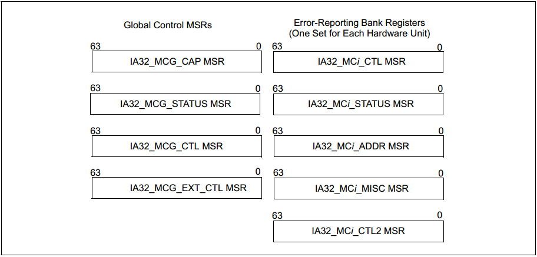
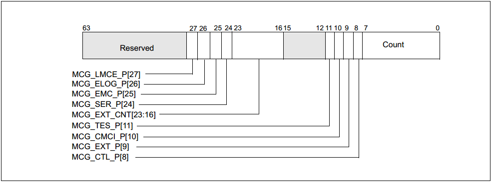
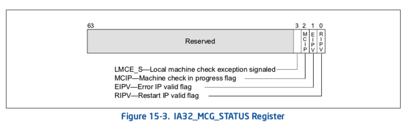
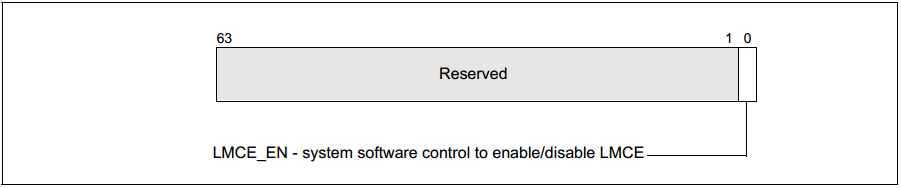
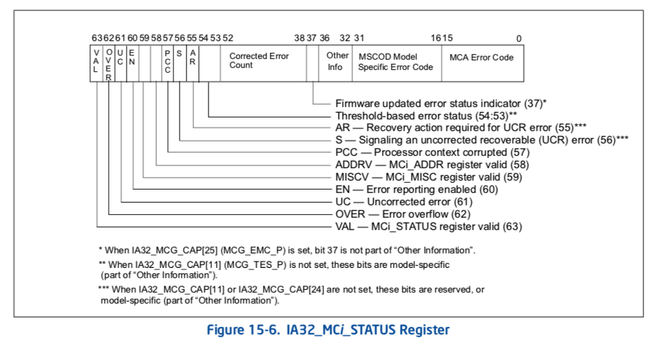
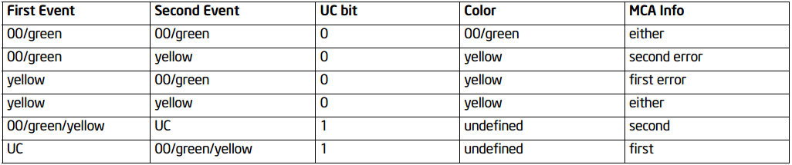
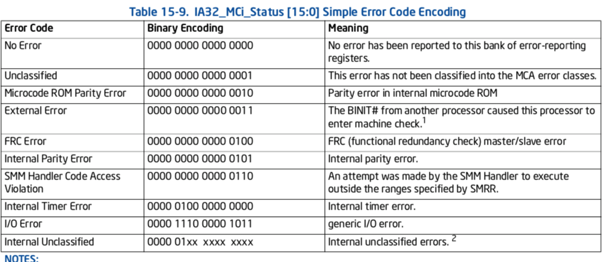
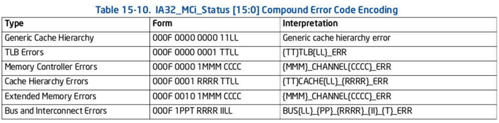
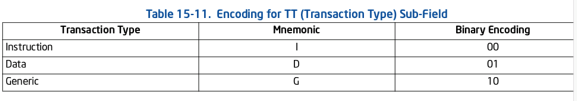
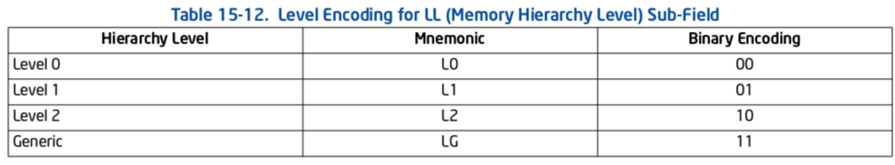

<!-- @import "[TOC]" {cmd="toc" depthFrom=1 depthTo=6 orderedList=false} -->

<!-- code_chunk_output -->

- [1. 概述](#1-概述)
- [2. Machine Check MSR](#2-machine-check-msr)
  - [2.1. IA32_MCG_CAP MSR](#21-ia32_mcg_cap-msr)
  - [2.2. IA32_MCG_STATUS MSR](#22-ia32_mcg_status-msr)
  - [2.3. IA32_MCG_CTL MSR](#23-ia32_mcg_ctl-msr)
  - [2.4. IA32_MCG_EXT_CTL MSR](#24-ia32_mcg_ext_ctl-msr)
  - [2.5. IA32_MCi_CTL MSRs](#25-ia32_mci_ctl-msrs)
  - [2.6. IA32_MCi_STATUS MSRS](#26-ia32_mci_status-msrs)
- [3. 参考](#3-参考)

<!-- /code_chunk_output -->

# 1. 概述

Intel 从奔腾 4 开始的 CPU 中增加了一种机制, 称为 MCA——Machine Check Architecture, 它用来检测硬件(这里的 Machine 表示的就是硬件)错误, 比如系统总线错误、ECC 错误等等.

这套系统通过**一定数量的 MSR**(Model Specific Register)来实现, 这些 MSR 分为两个部分, 一部分用来**进行设置**, 另一部分用来**描述**发生的**硬件错误**.

当 CPU 检测到**不可纠正的 MCE**(Machine Check Error)时, 就会触发`#MC`(Machine Check Exception), 通常软件会**注册相关的函数**来处理`#MC`, 在这个函数中会通过**读取 MSR**来**收集 MCE 的错误信息**, 然后**重启系统**. 当然由于**发生的 MCE 可能是非常致命**的, **CPU 直接重启**了, **没有办法完成 MCE 处理函数**; 甚至有可能在 MCE 处理函数中又触发了**不可纠正的 MCE**, 也会导致系统直接重启.

当然 CPU 还会检测到**可纠正的 MCE**, 当可纠正的 MCE 数量**超过一定的阈值**时, 会触发**CMCI**(`Corrected Machine Check Error Interrupt`), 此时软件可以捕捉到**该中断**并进行相应的处理. CMCI 是在 MCA 之后才加入的, 算是对 MCA 的一个增强, 在此**之前**软件只能通过**轮询可纠正 MCE 相关的 MSR**才能实现相关的操作.

# 2. Machine Check MSR

MCA 是通过一系列的 MSR 来实现, 这里介绍下这些 MSR 寄存器, 首先看下面的图:



上图基本包含了 MCA 相关的所有 MSR.

它分为左右两个部分, 左边的是全局的寄存器, 右边表示的是多组寄存器.

i 表示的是各个组的 Index. 这里的组有一个称呼是 Error Reporting Register Bank.

MCA 通过若干 Bank 的 MSR 寄存器来表示各种类型的 MCE.

下面简单介绍一下这些寄存器.

## 2.1. IA32_MCG_CAP MSR

这个 MSR 描述了当前 CPU 处理 MCA 的能力, 具体每个位的作用如下所示:



* BIT0-7: 表示的是 CPU 支持的 Bank 的个数;

* BIT8: 1 表示 IA32_MCG_CTL 有效, 如果是 0 的话表示无效, 读取该 IA32_MCG_CTL 这个 MSR 可能发生 Exception(至少在 UEFI 下是这样);

* BIT9: 1 表示 IA32_MCG_EXT_CTL 有效, 反之无效, 这个与 BIT8 的作用类似;

* BIT10: 1 表示支持 CMCI, 但是 CMCI 是否能用还需要通过 IA32_MCi_CTL2 这个 MSR 的 BIT30 来使能;

* BIT11: 1 表示 IA32_MCi_STATUS 这个 MSR 的 BIT56-55 是保留的, BIT54-53 是用来上报 Threshold-based Error 状态的;

* BIT16-23: 表示存在的 Extended Machine Check State 寄存器的个数;

* BIT24: 1 表示 CPU 支持 Software Error Recovery;

* BIT25: 1 表示 CPU 支持增强版的 MCA;

* BIT26: 1 表示支持更多的错误记录(需要 UEFI、ACPI 的支持);

* BIT27: 1 表示支持 Local Machine Check Exception;

## 2.2. IA32_MCG_STATUS MSR

该 MSR 记录了**MCE 发生时 CPU 的状态**, 主要的 BIT 位介绍如下:



- 这里的 IP 指的是 Instruction Pointer, 指向当前的 CPU 指令;

- EIPV 为 1 时表示当前的指令与导致 MCE 的原因相关;

- RIPV 为 1 表示当前 CPU 从当前指令继续执行并不会有什么问题;

- bit 0: 设置后说明在生成机器检查异常时, 可以在堆栈上按下的指令指针指向的指令处可靠地**重新启动程序执行**.  清零时, 程序无法在推送的指令指针处可靠地重新启动.
- bit 1: 设置后说明生成机器检查异常时指令指针指向的指令与错误直接关联.  清除此标志时, 指向的指令可能与错误无关.
- bit 2: 设置后说明生成机器检查异常.  软件可以设置或清除此标志.  设置 MCIP 时发生第二次机器检查事件将导致处理器进入关闭状态.
- bit 3: 设置后说明生成本地`machine-check exception`. 这表示当前的机器检查事件仅传递给此逻辑处理器.

## 2.3. IA32_MCG_CTL MSR

这个寄存器的存在依赖于`IA32_MCG_CAP`这个 MSR 的`BIT8`.

这个寄存器主要用来 Disable(写 1)或者 Enable(写全 0)**MCA 功能**.

## 2.4. IA32_MCG_EXT_CTL MSR

这个寄存器同样依赖于 IA32_MCA_CAP 这个 MSR, 这次依赖的是 BIT9. 该 MSR 的 BIT 位说明如下图所示:



目前有就 BIT0 有用, 用来 Disable(写 1)或者 Enable(写 0)LMCE, 这个 LMCE 的功能就是使硬件能够将某些 MCE 发送给单个的逻辑处理器, 为什么要这样做目前还不是很 清楚.

以上都是全局的 MSR, 下面介绍**每个 Bank 对应的 MSR**,

这些寄存器的第一个是 IA32_MC0_CTL, 它的地址一般都是 400H. 之后接着的是 IA32_MC0_STATUS, IA32_MC0_ADDR, IA32_MC0_MISC, 但是在之后并不是 IA32_MC0_CTL2, 而是 IA32_MC1_CTL; 对于 IA32_MCi_CTL2 来说, 它的地址跟上面的这些不在一起, 第一个 IA32_MC0_CTL2 是在 280H, 之后是 IA32_MC1_CTL2 在 281H, 以此类推.

## 2.5. IA32_MCi_CTL MSRs

每个 Bank 的 CTL 的作用是用来控制在发生哪些 MCA 的时候来触发#MC:


这里的 64 个 BIT 位, 设置某个 BIT 位就会使对应 BIT 位的 MCA 类型在发生时触发#MC.

## 2.6. IA32_MCi_STATUS MSRS

这类 MSR 的作用就是显示 MCE 信息:



注意只有当 VAL 这个 BIT 位(BIT63)为 1 时才表示发生了对应这个 Bank 的 MCE. 当 MCE 发生了, 软件需要给这个 VAL 位写 0 来清零(如果有可能的话, 因为对于不可纠正的 MCE 可能软件会 来不及写), 不能往这位写 1, 会出现 Exception.

BIT0-15, BIT16-31: 这个两个部分都表示 MCE 的错误类型, 前者是通用的, 后者是跟 CPU 有关的;

BIT58: 1 表示 IA32_MCi_ADDR 这个 MSR 是有效的, 反之无效;

BIT59: 1 表示 IA32_MCi_MISC 这个 MSR 是有效的, 反之无效; 这两个 BIT 是因为不同 MCE 错误并不是都需要 ADDR 和 MSIC 这样的 MSR;

BIT60: 这个位于 IA32_MCi_CTL 中的位是对应的, 那边使能了, 这里就是 1;

BIT61: 表示 MCE 是不可纠正的;

BIT62: 表示发生了二次的 MCE, 这个时候到底这个 Bank 表示的是哪一次的 MCE 信息, 需要根据一定的规则来确定:



这个可以先不关注.

另外还有一些寄存器在这里不介绍, 具体还是看手册.

IA32_MCi_ADDR MSRs
这个 MSR 并没有特别好介绍的:

bd80000000100134 的二进制如下:

```
1011 1101 1000 0000 0000 0000 0000 0000
0000 0000 0001 0000 0000 0001 0011 0100
```

Bit 63: VAL. 表示本寄存器中包含有效的错误码
Bit 61: UC. 表示是无法纠正的 MCE
Bit 60: EN. 表示处于允许报告错误的状态
Bit 59: MISCV. 表示 MCi_MISC 寄存器中含有对该错误的补充信息
Bit 58: ADDRV. 表示 MCi_ADDR 寄存器含有发生错误的内存地址
Bit 56: 发出未校正的可恢复(UCR)错误信号
Bit 55: UCR 错误所需的恢复操作
`Bit[16: 31]`: 特定 CPU 型号相关的扩展错误码. 本例中是 0x0010.
`Bit[0: 15]`: MCE 错误码, 该错误码是所有 CPU 型号通用的, 分为两类: simple error codes(简单错误码) 和 compound error codes(复合错误码), 本例中 0x0134 表示 Memory errors in the cache hierarchy(缓存层次结构中的内存错误):

- Simple Error Codes:



- Compound Error Codes:




Bit 12: 0 代表正常过滤

2 位 TT 子字段(表 15-11)表示事务的类型(数据, 指令或通用).  子字段适用于 TLB, 高速缓存和互连错误条件.  请注意, 互连错误条件主要与 P6 系列和奔腾处理器相关, 后者使用独立于系统总线的外部 APIC 总线.  当处理器无法确定事务类型时, 将报告泛型类型. 这里是 Data.



2 位 LL 子字段(参见表 15-12)指示发生错误的存储器层次结构中的级别(级别 0, 级别 1, 级别 2 或通用).  LL 子字段也适用于 TLB, 高速缓存和互连错误条件.  Pentium 4, Intel Xeon, Intel Atom 和 P6 系列处理器支持缓存层次结构中的两个级别和 TLB 中的一个级别.  同样, 当处理器无法确定层次结构级别时, 将报告泛型类型.




```
[root@SH-IDC1-10-5-8-61 yanbaoyue]# mcelog
Hardware event. This is not a software error.
MCE 0
CPU 19 BANK 14 TSC f3086e49d7de
RIP !INEXACT! 10:ffffffff816ab6a5
MISC 900010080000086 ADDR 5f14903680
TIME 1556364329 Sat Apr 27 19:25:29 2019
MCG status:RIPV MCIP
MCi status:
Error overflow
Uncorrected error
Error enabled
MCi_MISC register valid
MCi_ADDR register valid
SRAO
MCA: MEMORY CONTROLLER MS_CHANNEL1_ERR
Transaction: Memory scrubbing error
MemCtrl: Uncorrected patrol scrub error
STATUS fd001dc0001000c1 MCGSTATUS 5
MCGCAP f000814 APICID 60 SOCKETID 1
PPIN fd003dc0001000c1
CPUID Vendor Intel Family 6 Model 85
Hardware event. This is not a software error.
MCE 1
CPU 19 BANK 14 TSC f308a56e97a8
RIP !INEXACT! 10:ffffffff816ab6a5
MISC 900001001000086 ADDR 5f149ab080
TIME 1556364329 Sat Apr 27 19:25:29 2019
MCG status:RIPV MCIP
MCi status:
Error overflow
Uncorrected error
Error enabled
MCi_MISC register valid
MCi_ADDR register valid
SRAO
MCA: MEMORY CONTROLLER MS_CHANNEL1_ERR
Transaction: Memory scrubbing error
MemCtrl: Uncorrected patrol scrub error
STATUS fd003dc0001000c1 MCGSTATUS 5
MCGCAP f000814 APICID 60 SOCKETID 1
PPIN fd003a40001000c1
CPUID Vendor Intel Family 6 Model 85
Hardware event. This is not a software error.
MCE 2
CPU 43 BANK 14 TSC f308d5268140
RIP !INEXACT! 10:ffffffff816ab6a5
MISC 900100000000086 ADDR 5f14a5b480
TIME 1556364329 Sat Apr 27 19:25:29 2019
MCG status:RIPV MCIP
MCi status:
Error overflow
Uncorrected error
Error enabled
MCi_MISC register valid
MCi_ADDR register valid
SRAO
MCA: MEMORY CONTROLLER MS_CHANNEL1_ERR
Transaction: Memory scrubbing error
MemCtrl: Uncorrected patrol scrub error
STATUS fd003a40001000c1 MCGSTATUS 5
MCGCAP f000814 APICID 61 SOCKETID 1
CPUID Vendor Intel Family 6 Model 85

-----------------------
[166492.496342] mce: [Hardware Error]: CPU 19: Machine Check Exception: f Bank 1: bd80000000100134
[166492.496424] mce: [Hardware Error]: RIP 10:<ffffffffc1003eaa> {vvp_page_own+0xa/0xc0 [lustre]}
[166492.496541] mce: [Hardware Error]: TSC 1e4ee3d9dafdc ADDR 3b14a3c880 MISC 86
[166492.496609] mce: [Hardware Error]: PROCESSOR 0:50654 TIME 1556280681 SOCKET 1 APIC 60 microcode 2000057
[166492.496692] mce: [Hardware Error]: Machine check events logged
[166492.496767] mce: [Hardware Error]: Run the above through 'mcelog --ascii'
[166492.498942] Kernel panic - not syncing: Machine check from unknown source
```

# 3. 参考

- x86 架构——MCA: https://blog.csdn.net/jiangwei0512/article/details/62456226 (未完)
