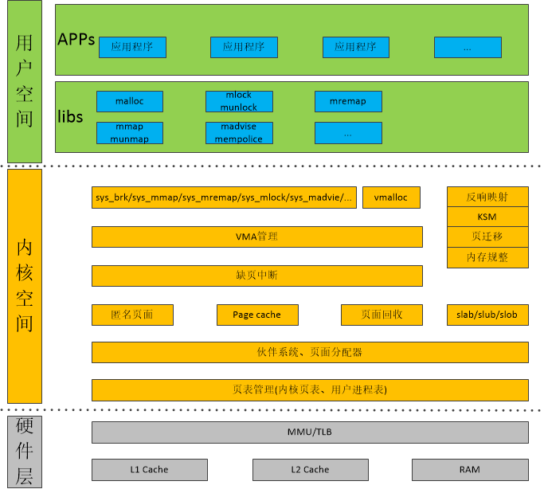

Linux 的内存管理涉及到的内容非常庞杂, 而且与内核的方方面面耦合在一起, 想要理解透彻非常困难.

在开始学习之前进行了一些准备工作《如何展开 Linux Memory Management 学习?》

# 1. 参考资料

遂决定以如下资料作为参考, 进行 Linux 内存管理的研究:

《[奔跑吧 Linux 内核](http://www.epubit.com.cn/book/details/4835)》: 以第 2 章为蓝本展开, 这是目前能获取的紧跟当前内核发展(Linux 4.0), 并且讲的比较全面的一本资料.

《[Understanding the Linux Virtual Memory Manager](https://www.kernel.org/doc/gorman/)》: 简单说就是虽老但经典, 基于(Linux 2.4/2.6). 作者是目前仍然活跃在 Linux 社区 MM 专家.

《[wowotech Memory Management](http://www.wowotech.net/sort/memory_management)》: 没有其他系列经典, 也没有条理系列的介绍 MM, 但是仍然值得按考.

《[tolimit Linux 内存源码分析](http://www.cnblogs.com/tolimit/)》: 相对零散的介绍了内存相关分析文档

《[Linux Kernel v4.0](http://elixir.free-electrons.com/linux/v4.0/source)》: 当然必不可少的, 是源码了.

当逐渐深入看到 MMU 相关代码时, 读一下 ARM 架构关于 MMU 的规格书有助于理解.

不然对于虚拟地址到物理地址的映射就会很虚无, 这些资料包括《ARM Architecture Reference Manual ARMv7-A and ARMv7-R edition》的《Virtual Memory System Architecture》, 以及相关 MMU TRM.

# 2. Linux Memory Management 框架图

整个内存管理从宏观上可以分为三大部分: 用户空间、内核空间和相关硬件.

用户空间主要是 libc 对相关系统调用进行封装, 对用户程序提供 API, 常用的有 malloc、mmap、munmap、remap、madvise、mempolicy 等等.

相关硬件包括 MMU/TLB、L1/L2 Cache 以及 DDR RAM, 具体到 ARM 架构需要对照 MMU/L2 Cache 以及 RAM 规格书. **(这里对于 x86 和 ARM 的存储指令结构可以参照《奔跑吧 Linux 内核》第 1 章处理器体系结构)**

内核空间就复杂多了, 首先介绍初始化及初始化后的布局.

[2.1 物理内存初始化](http://www.cnblogs.com/arnoldlu/p/8060121.html)从获取内存大小、初始化页表, 再进行 zone 初始化, 然后在 zone 中使用伙伴系统进行物理内存初始化;

[2.2 页表的映射过程](http://www.cnblogs.com/arnoldlu/p/8087022.html)讲述了 ARM32 和 ARM64 两种架构下的页表映射, 如何从虚拟地址由 MMU 转化成物理页面地址的;

[2.3 内核内存的布局图](http://www.cnblogs.com/arnoldlu/p/8068286.html)在内存被初始化之后, 内核的内存布局基本上就确定了, ARM32 和 ARM64 下布局有很大区别. 在 malloc 一节 brk 中介绍了用户空间的布局.

---

2.1\~2.3 是内存的一个静态状态, 在有了这些基础之后, 2.4\~2.9 按照从低层到上层的逐个介绍了.

[2.4 分配物理页面](http://www.cnblogs.com/arnoldlu/p/8250734.html)介绍了基于伙伴系统的页分配和释放;

[2.5 slab 分配器](http://www.cnblogs.com/arnoldlu/p/8215414.html)基于伙伴系统, slab 分配更小内存块; 以及基于 slab 的 kmalloc;

[2.6 vmalloc](http://www.cnblogs.com/arnoldlu/p/8251333.html)和 kmalloc 区别在于 v, 即在 VMALLOC 区域分配;

[2.7 VMA](http://www.cnblogs.com/arnoldlu/p/8329279.html)即 Virtual Memory Area, 是进程内存管理的核心;

[2.8 malloc](http://www.cnblogs.com/arnoldlu/p/8329283.html)和[2.9 mmap](http://www.cnblogs.com/arnoldlu/p/8330785.html)都基于 VMA, malloc/free 用于分配/释放一块内存; mmap/munmap 用于匿名/文件映射到用户空间.

由于 malloc/mmap 分配内存并不是立即分配, 只是在用到的时候才会触发[2.10 缺页中断处理](http://www.cnblogs.com/arnoldlu/p/8335475.html).

---

在缺页但页不足的情况下, 就需要进行一些操作调整内存, 这些操作的基础是[2.11 page 引用计数](http://www.cnblogs.com/arnoldlu/p/8335481.html), 还有页面的[2.12 反向映射 RMAP](http://www.cnblogs.com/arnoldlu/p/8335483.html)技术.

在内存不足情况下触发 kswapd[2.13 回收页面](http://www.cnblogs.com/arnoldlu/p/8335487.html), 其中匿名页面有着特殊的[2.14 匿名页面生命周期](http://www.cnblogs.com/arnoldlu/p/8335508.html).

在 kswapd 回收依然无法满足内存分配, 就需要对内存进行[2.16 内存规整](http://www.cnblogs.com/arnoldlu/p/8335532.html), 它依赖的技术是[2.15 页面迁移](http://www.cnblogs.com/arnoldlu/p/8335524.html).

由于内存中存在一些内容完全一样的页面, 使用[2.17 KSM 技术](http://www.cnblogs.com/arnoldlu/p/8335541.html)进行合并, 同时利用 COW 技术, 在需要时重新分配.

还介绍了[2.18 Dirty COW](http://www.cnblogs.com/arnoldlu/p/8335546.html)内存漏洞, 然后对内存管理数据结构和 API 进行了总结[2.19 总结内存管理数据结构和 API](http://www.cnblogs.com/arnoldlu/p/8335568.html).

最后[2.20 最新更新和展望](http://www.cnblogs.com/arnoldlu/p/8335587.html)对新技术进行了介绍.

除了以上技术, 还有如下内存技术:

- swap 计数把匿名页面写入 SWAP 分区从而释放出空闲页面
- 内存压缩技术 zram(a compressed RAM based swap device)
- zswap 技术是 zram 和 swap 的一个综合, 首先将待换出页面进行压缩, 存储到系统 RAM 动态分配的内存池中; 达到一定阈值后再写入实际交换设备.
- 在内存极端不足情况下使用 OOM(Out-Of-Memory)来杀死不重要进程获取更多内存的技术
- 基于 cgroup 的 Memory 资源控制
- 解决多媒体对大量连续内存需求的 CMA(Contiguous Memory Allocator)技术
- slub 分配器
- memory hotplug 内存热插拔支持动态更换内存物理设备

---

在对内存相关技术了解过后, 就是如何运用的问题了?

一方面是对内存问题进行定位; 另一方面是对内存行为施加影响, 进行优化.

[内存检测技术](http://www.cnblogs.com/arnoldlu/p/8568090.html)对 Linux 内存常见问题及其定位方法和工具(slub_debug/kmemleak/kasan)进行了讲解.

[内存 sysfs 节点和工具](http://www.cnblogs.com/arnoldlu/p/8568330.html)介绍了 linux 内存管理相关 sysfs 节点, 以及工具; 借助这些可以对内存进行优化.

扩展阅读:

- 关于 zram、zswap、zcache 的区别与各自优缺点《[zram vs zswap vs zcache Ultimate guide: when to use which one](https://askubuntu.com/questions/471912/zram-vs-zswap-vs-zcache-ultimate-guide-when-to-use-which-one)》

Linux 内存管理框图:



# 3. 代码和测试环境搭建

## 3.1 QEMU

安装 QEMU 以及相关编译工具

```
sudo apt-get install qemu libncurses5-dev gcc-arm-linux-gnueabi build-essential
```

## 3.2 Busybox 1.24

下载 Busybox 1.24 代码:

```
git clone https://github.com/arnoldlu/busybox.git -b 1_24_stable
```

编译 Busybox:

```
export ARCH=arm
export CROSS_COMPILE=arm-linux-gnueabi-
#make menuconfig #P684, 进行配置
make -j4 install
```

配置 initramfs:

```
sudo cp -r running_kernel_initramfs/* _install/
sudo chmod +x _install/etc/init.d/rcS
cd _install
mkdir mnt
mkdir dev
cd dev
sudo mknod console c 5 1
sudo mknod null c 1 3
```

## 3.3 Kernel 4.0

下载 Linux Kernel 4.0 代码:

```
git clone https://github.com/arnoldlu/linux.git -b running_kernel_4.0
```

编译 Linux Kernel:

```
export ARCH=arm
export CROSS_COMPILE=arm-linux-gnueabi-
make vexpress_defconfig #P685 进行配置
make bzImage -j4 ARCH=arm CROSS_COMPILE=arm-linux-gnueabi-
make dtbs
```

## 3.4 运行内核

```
#Run Kernel+Busybox in QEMU
qemu-system-arm -M vexpress-a9 -smp 4 -m 1024M -kernel arch/arm/boot/zImage -append "rdinit=/linuxrc console=ttyAMA0 loglevel=8" -dtb arch/arm/boot/dts/vexpress-v2p-ca9.dtb -nographic
```

至此, 已经有一个完整的环境, 提供 shell 命令.
