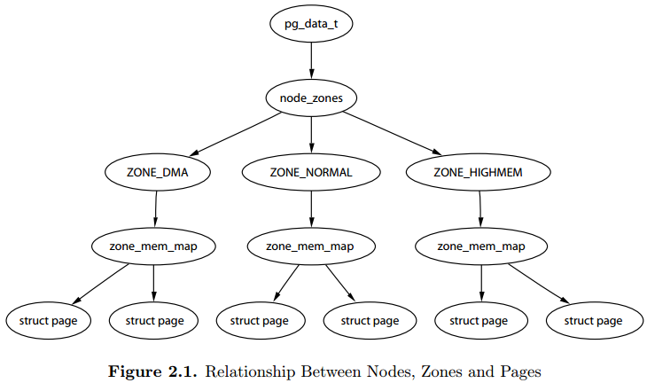

关键词: 用户内核空间划分、Node/Zone/Page、memblock、PGD/PUD/PMD/PTE、lowmem/highmem、`ZONE_DMA`/`ZONE_NORMAL`/`ZONE_HIGHMEM`、Watermark、`MIGRATE_TYPES`.

物理内存初始化是随着 Linux 内核初始化进行的, 同时内存管理也是其他很多其他功能的基础. 和内核中各种模块耦合在一起.

在进行初始化之前, 了解 Linux 内存管理框架图有助于对内存管理有个大概的映像.

首先, 需要知道整个用户和内核空间是如何划分的(3:1、2:2), 然后从 Node -> Zone -> Page 的层级进行初始化, 直到内存达到可用状态.

关于 Nodes、Zones、Pages 三者之间的关系, 《ULVMM》 Figure 2.1 介绍, 虽然 `zone_mem_map` 一层已经被替代, 但是仍然反映了他们之间的层级树形关系.

`pg_data_t` 对应一个 Node, `node_zones` 包含了不同 Zone; Zone 下又定义了 `per_cpu_pageset`, 将 page 和 cpu 绑定.



```cpp
start_kernel-->
    page_address_init
    setup_arch-->setup_machine_fdt-->early_init_dt_scan_nodes-->early_init_dt_scan_memory-->early_init_dt_add_memory_arch-->memblock_add
        init_mm
        early_paging_init
        setup_dma_zone
        sanity_check_meminfo
        arm_memblock_init
        paging_init
    mm_init_cpumask
    build_all_zonelists-------------------------
    page_alloc_init
    vfs_caches_init_early
    mm_init
    kmem_cache_init_late
    debug_objects_mem_init
    kmemleak_init
    setup_per_cpu_pageset
    numa_policy_init
    anon_vma_init
    page_writeback_init
```

# 1. 用户空间和内核空间划分

32 位 Linux 中, 虚拟地址空间共 4GB. 将整个虚拟地址空间划分为用户空间+内核空间, 有三种:

```
choice
    prompt "Memory split"
    depends on MMU
    default VMSPLIT_3G
    help
      Select the desired split between kernel and user memory.

      If you are not absolutely sure what you are doing, leave this
      option alone!

    config VMSPLIT_3G
        bool "3G/1G user/kernel split"
    config VMSPLIT_2G
        bool "2G/2G user/kernel split"
    config VMSPLIT_1G
        bool "1G/3G user/kernel split"
endchoice

config PAGE_OFFSET
    hex
    default PHYS_OFFSET if !MMU
    default 0x40000000 if VMSPLIT_1G
    default 0x80000000 if VMSPLIT_2G
    default 0xC0000000
```

这样配置的结果就是生成的 autoconf.h 定义了#define `CONFIG_PAGE_OFFSET` 0xC0000000.

在 `arch/arm/include/asm/memory.h` 中, 可以看出 PAGE_OFFSET 是用户空间和内核空间的分水岭. 也是用内核空间的起始点.

```cpp
/* PAGE_OFFSET - the virtual address of the start of the kernel image */
#define PAGE_OFFSET        UL(CONFIG_PAGE_OFFSET)

static inline phys_addr_t __virt_to_phys(unsigned long x)
{
    return (phys_addr_t)x - PAGE_OFFSET + PHYS_OFFSET;
}

static inline unsigned long __phys_to_virt(phys_addr_t x)
{
    return x - PHYS_OFFSET + PAGE_OFFSET;
}
```

# 2. 获取物理内存大小

后面的一切初始化以及内存管理都是基于物理内存, 所以首先要获取物理内存的物理地址和大小.

通过 DTS 获取物理内存属性, 然后解析并添加到 memblock 子系统中.

```cpp
// arch/arm/boot/dts/vexpress-v2p-ca9.dts:

    memory@60000000 {
        device_type = "memory";
        reg = <0x60000000 0x40000000>;
    };
```

根据上面的 dts, 在 `start_kernel` --> `setup_arch` --> `setup_machine_fdt` --> `early_init_dt_scan_nodes` --> `of_scan_flat_dt`(遍历 Nodes) --> `early_init_dt_scan_memory`(初始化单个内存 Node).

结果是从 DTS 解析出 base size 分别是 0x60000000 0x40000000.

```cpp
int __init early_init_dt_scan_memory(unsigned long node, const char *uname,
                     int depth, void *data)
{
    const char *type = of_get_flat_dt_prop(node, "device_type", NULL); # device_type = "memory"
...
    reg = of_get_flat_dt_prop(node, "linux,usable-memory", &l);
    if (reg == NULL)
        reg = of_get_flat_dt_prop(node, "reg", &l); # reg = <0x60000000 0x40000000>
    if (reg == NULL)
        return 0;

    endp = reg + (l / sizeof(__be32));

    pr_debug("memory scan node %s, reg size %d, data: %x %x %x %x,\n",
        uname, l, reg[0], reg[1], reg[2], reg[3]);

    while ((endp - reg) >= (dt_root_addr_cells + dt_root_size_cells)) {
        u64 base, size;

        base = dt_mem_next_cell(dt_root_addr_cells, &reg); # 0x60000000
        size = dt_mem_next_cell(dt_root_size_cells, &reg); # 0x40000000
...
        early_init_dt_add_memory_arch(base, size); # 进行 base, size 有效性检查
    }

    return 0;
}
```

然后根据解析出的 base/size, 调用 `early_init_dt_add_memory_arch` --> `memblock_add` --> `memblock_add_range` 将解析出的**物理内存**加入到 memblock 子系统中.

```cpp
struct memblock {
    bool bottom_up;  /* is bottom up direction? */
    phys_addr_t current_limit;
    struct memblock_type memory;-------------------添加物理内存区域
    struct memblock_type reserved;-----------------添加预留内存区域
#ifdef CONFIG_HAVE_MEMBLOCK_PHYS_MAP
    struct memblock_type physmem;
#endif
};
```

**memblock_add** 用于添加 region 到 **memblock.memory** 中; 在内核初始化阶段很多地方(比如哈 `arm_memblock_init`)使用 **memblock_reserve** 将 region 添加到 **memblock.reserved**.

**memblock_remove** 用于将一个 region 从**memblock.memory** 中移除, **memblock_free** 等用于将一个 region 从 **memblock.reserved** 中移除.

这里面的地址都是**物理地址**(**!!!**), 所有的信息都在 memblock 这个**全局变量**中.

```cpp
int __init_memblock memblock_add_range(struct memblock_type *type,
                phys_addr_t base, phys_addr_t size,
                int nid, unsigned long flags)
{
    bool insert = false;
    phys_addr_t obase = base;
    phys_addr_t end = base + memblock_cap_size(base, &size);
    int i, nr_new;

    if (!size)
        return 0;

    /* special case for empty array */
    if (type->regions[0].size == 0) {
        WARN_ON(type->cnt != 1 || type->total_size);
        type->regions[0].base = base;
        type->regions[0].size = size;
        type->regions[0].flags = flags;
        memblock_set_region_node(&type->regions[0], nid);
        type->total_size = size;
        return 0;
    }
repeat:
    /*
     * The following is executed twice.  Once with %false @insert and
     * then with %true.  The first counts the number of regions needed
     * to accomodate the new area.  The second actually inserts them.
     */
...
}
```

#### memblock

在**内核启动阶段**, 也有内存管理的需求, 但是此时**伙伴系统并没有完成初始化**. 在早期内核中使用**bootmem 机制**, 作为内核初始化阶段的**内存分配器**.

后来使用 memblock 作为内核初始化阶段内存分配器, 用于内存分配和释放.

**CONFIG_NO_BOOTMEM** 用于决定是否使用 bootmem, Vexpress 使能, 所以使用 memblock 作为初始化阶段的内存分配器.

因为 bootmem 和 memblock 两者**API 兼容**, 所以使用者无感. 使用**memblock**的时候编译**mm/nobootmem.c**, 调用 memblock.c 中的分配器接口.

# 3. 物理内存映射

由于没有打开 `CONFIG_ARM_LPAE`, Linux 页表采用两层映射. 所以 `PGD->PUD->PMD->PTE` 中间的 PUD/PMD 被省略的, `pmd_off_k` 的返回值实际就是 `pgd_offset_k`.

```cpp
// arch\arm\mm\mm.h:

static inline pmd_t *pmd_off_k(unsigned long virt)
{
    return pmd_offset(pud_offset(pgd_offset_k(virt), virt), virt);
}


arch\arm\include\asm\pgtable.h:

#define pgd_index(addr)        ((addr) >> PGDIR_SHIFT)

#define pgd_offset(mm, addr)    ((mm)->pgd + pgd_index(addr))

/* to find an entry in a kernel page-table-directory */
#define pgd_offset_k(addr)    pgd_offset(&init_mm, addr)--------实际就是 addr 右移 PGDIR_SHIFT 位, 然后相对于 init_mm.pgd 即 swapper_pg_dir 的偏移. swapper_pg_dir 是存放内核页表的地方.
```

`prepare_page_table` 用于清空页表项, 其实清空了三段地址页表项, `0 ~ MODULES_VADDR`、`MODULES_VADDR ~ PAGE_OFFSET`、`0xef800000 ~ VMALLOC_START`.

```cpp
static inline void prepare_page_table(void)
{
    unsigned long addr;
    phys_addr_t end;

    /*
     * Clear out all the mappings below the kernel image.
     */
    for (addr = 0; addr < MODULES_VADDR; addr += PMD_SIZE)------------------------清除 0~MODULES_VADDR 地址段一级页表.
        pmd_clear(pmd_off_k(addr));

#ifdef CONFIG_XIP_KERNEL
    /* The XIP kernel is mapped in the module area -- skip over it */
    addr = ((unsigned long)_etext + PMD_SIZE - 1) & PMD_MASK;
#endif
    for ( ; addr < PAGE_OFFSET; addr += PMD_SIZE)--------------------------------清除 MODULES_VADDR~PAGE_OFFSET 地址段一级页表.
        pmd_clear(pmd_off_k(addr));

    /*
     * Find the end of the first block of lowmem.
     */
    end = memblock.memory.regions[0].base + memblock.memory.regions[0].size;
    if (end >= arm_lowmem_limit)-------------------------------------------------end=0x60000000+0x40000000, arm_lowmem_limit=0x8f800000
        end = arm_lowmem_limit;

    /*
     * Clear out all the kernel space mappings, except for the first
     * memory bank, up to the vmalloc region.
     */
    for (addr = __phys_to_virt(end);
         addr < VMALLOC_START; addr += PMD_SIZE)---------------------------------此处 end 取 0x8f800000, 转成虚拟地址 0xef800000. 清除 0xef800000~VMALLOC_START 地址段一级页表.
        pmd_clear(pmd_off_k(addr));
}
```

真正创建页表是在 `map_lowmem` 创建了两块区间映射区间一 `0x60000000 ~ 0x60800000`(`0xc0000000 ~ 0xc0800000`)和区间二 `0x60800000 ~ 0x8f800000`(`0xc0800000 ~ 0xef800000`).

区间一: 具有读写执行权限, 主要用于存放 Kernel 代码数据段, 还包括 `swapper_pg_dir` 内容.

区间二: 具有读写, 不允许执行, 是 Normal Memory 部分.

可以看出这两个区间虚拟到物理地址映射是线性映射, 但是存在在末尾存在特殊两页不是线性映射.

```cpp
static void __init map_lowmem(void)
{
    struct memblock_region *reg;
    phys_addr_t kernel_x_start = round_down(__pa(_stext), SECTION_SIZE);
    phys_addr_t kernel_x_end = round_up(__pa(__init_end), SECTION_SIZE);--------------kernel_x_start=0x60000000, kernel_x_end=60800000

    /* Map all the lowmem memory banks. */
    for_each_memblock(memory, reg) {
        phys_addr_t start = reg->base;
        phys_addr_t end = start + reg->size;----------------------start=0x60000000, end=0x8f800000
        struct map_desc map;

        if (end > arm_lowmem_limit)
            end = arm_lowmem_limit;-------------------------------因为 arm_lowmem_limit=0x8f800000, 所以 end=0x8f800000
        if (start >= end)
            break;

        if (end < kernel_x_start) {
            map.pfn = __phys_to_pfn(start);
            map.virtual = __phys_to_virt(start);
            map.length = end - start;
            map.type = MT_MEMORY_RWX;

            create_mapping(&map);
        } else if (start >= kernel_x_end) {
            map.pfn = __phys_to_pfn(start);
            map.virtual = __phys_to_virt(start);
            map.length = end - start;
            map.type = MT_MEMORY_RW;

            create_mapping(&map);
        } else {
            /* This better cover the entire kernel */
            if (start < kernel_x_start) {
                map.pfn = __phys_to_pfn(start);
                map.virtual = __phys_to_virt(start);
                map.length = kernel_x_start - start;
                map.type = MT_MEMORY_RW;

                create_mapping(&map);
            }

            map.pfn = __phys_to_pfn(kernel_x_start);
            map.virtual = __phys_to_virt(kernel_x_start);
            map.length = kernel_x_end - kernel_x_start;
            map.type = MT_MEMORY_RWX;

            create_mapping(&map);--------------创建虚拟地址 0xc0000000 - 0xc0800000 到物理地址 0x60000000 - 0x60800000 的映射关系, 属性为 MT_MEMORY_RWX.

            if (kernel_x_end < end) {
                map.pfn = __phys_to_pfn(kernel_x_end);
                map.virtual = __phys_to_virt(kernel_x_end);
                map.length = end - kernel_x_end;
                map.type = MT_MEMORY_RW;

                create_mapping(&map);----------创建虚拟地址 0xc0800000 - 0xef800000 到物理地址 0x60800000 - 0x8f800000 的映射关系, 属性为 MT_MEMORY_RW.
            }
        }
    }
}
```

还有一部分内存映射在 devicemaps_init 中进行, 对 vectors 进行映射:

`MT_HIGH_VECTORS`: 虚拟地址-0xffff0000\~0xffff1000, 对应物理地址是 0x8f7fe000\~0x8f7ff000.

`MT_LOW_VECTORS`: 虚拟地址-0xffff1000\~0xffff2000, 对应的物理地址是 0x8f7ff000\~0x8f800000.

```cpp
static void __init devicemaps_init(const struct machine_desc *mdesc)
{
    struct map_desc map;
    unsigned long addr;
    void *vectors;
    printk("%s\n", __func__);

    /*
     * Allocate the vector page early.
     */
    vectors = early_alloc(PAGE_SIZE * 2);

    early_trap_init(vectors);

    for (addr = VMALLOC_START; addr; addr += PMD_SIZE)
        pmd_clear(pmd_off_k(addr));

    /*
     * Map the kernel if it is XIP.
     * It is always first in the modulearea.
     */
#ifdef CONFIG_XIP_KERNEL
    map.pfn = __phys_to_pfn(CONFIG_XIP_PHYS_ADDR & SECTION_MASK);
    map.virtual = MODULES_VADDR;
    map.length = ((unsigned long)_etext - map.virtual + ~SECTION_MASK) & SECTION_MASK;
    map.type = MT_ROM;
    create_mapping(&map);
#endif

    /*
     * Map the cache flushing regions.
     */
#ifdef FLUSH_BASE
    map.pfn = __phys_to_pfn(FLUSH_BASE_PHYS);
    map.virtual = FLUSH_BASE;
    map.length = SZ_1M;
    map.type = MT_CACHECLEAN;
    create_mapping(&map);
#endif
#ifdef FLUSH_BASE_MINICACHE
    map.pfn = __phys_to_pfn(FLUSH_BASE_PHYS + SZ_1M);
    map.virtual = FLUSH_BASE_MINICACHE;
    map.length = SZ_1M;
    map.type = MT_MINICLEAN;
    create_mapping(&map);
#endif

    /*
     * Create a mapping for the machine vectors at the high-vectors
     * location (0xffff0000).  If we aren't using high-vectors, also
     * create a mapping at the low-vectors virtual address.
     */
    map.pfn = __phys_to_pfn(virt_to_phys(vectors));
    map.virtual = 0xffff0000;
    map.length = PAGE_SIZE;
#ifdef CONFIG_KUSER_HELPERS
    map.type = MT_HIGH_VECTORS;
#else
    map.type = MT_LOW_VECTORS;
#endif
    create_mapping(&map);----------将虚拟地址 0xffff0000 - 0xffff1000 映射到 0x8f7fe000 - 0x8f7ff000, 属性为 MT_HIGH_VECTORS.

    if (!vectors_high()) {
        map.virtual = 0;
        map.length = PAGE_SIZE * 2;
        map.type = MT_LOW_VECTORS;
        create_mapping(&map);------将虚拟地址 0xffff1000 - 0xffff2000 映射到 0x8f7ff000 - 0x8f800000, 属性为 MT_LOW_VECTORS.
    }

    /* Now create a kernel read-only mapping */
    map.pfn += 1;
    map.virtual = 0xffff0000 + PAGE_SIZE;
    map.length = PAGE_SIZE;
    map.type = MT_LOW_VECTORS;
    create_mapping(&map);

    /*
     * Ask the machine support to map in the statically mapped devices.
     */
    if (mdesc->map_io)
        mdesc->map_io();
    else
        debug_ll_io_init();
    fill_pmd_gaps();

    /* Reserve fixed i/o space in VMALLOC region */
    pci_reserve_io();

    /*
     * Finally flush the caches and tlb to ensure that we're in a
     * consistent state wrt the writebuffer.  This also ensures that
     * any write-allocated cache lines in the vector page are written
     * back.  After this point, we can start to touch devices again.
     */
    local_flush_tlb_all();
    flush_cache_all();
}
```

void __init sanity_check_meminfo(void)

**?????这些页如何保证不会别另作他用?????**

# 4. zone 初始化

内存管理将一个内存 Node 分成若干个 zone 进行管理, 定义 zone 类型在 enum zone_type 中.

Vexpress 之定义了 NORMAL 和 HIGHMEM 两种, zone 的初始化在 bootmem_init 中进行. 通过 find_limits 找出物理内存开始帧号 min_low_pfn、结束帧号 max_pfn、NORMAL 区域的结束帧号 max_low_pfn.

```cpp
void __init bootmem_init(void)
{
    unsigned long min, max_low, max_high;

    memblock_allow_resize();
    max_low = max_high = 0;

    find_limits(&min, &max_low, &max_high);----------------------min_now_pfn=0x60000 max_low_pfn=0x8f800 max_pfn=0xa0000, 通过全局变量 memblock 获取信息
...
    zone_sizes_init(min, max_low, max_high);---------------------从 min_low_pfn 到 max_low_pfn 是 ZONE_NORMAL, max_low_pfn 到 max_pfn 是 ZONE_HIGHMEM.

    /*
     * This doesn't seem to be used by the Linux memory manager any
     * more, but is used by ll_rw_block.  If we can get rid of it, we
     * also get rid of some of the stuff above as well.
     */
    min_low_pfn = min;
    max_low_pfn = max_low;
    max_pfn = max_high;
}
```

`zone_sizes_init` 中计算出每个 zone 大小以及 zone 之间的 hole, 然后调用 `free_area_init_node` 创建内存节点的 zone.

```cpp
void __paginginit free_area_init_node(int nid, unsigned long *zones_size,
        unsigned long node_start_pfn, unsigned long *zholes_size)
{
    pg_data_t *pgdat = NODE_DATA(nid);--------------------------------------------获取 nid 对应的 Node 数据结构
    unsigned long start_pfn = 0;
    unsigned long end_pfn = 0;

    /* pg_data_t should be reset to zero when it's allocated */
    WARN_ON(pgdat->nr_zones || pgdat->classzone_idx);

    pgdat->node_id = nid;
    pgdat->node_start_pfn = node_start_pfn;
...
    calculate_node_totalpages(pgdat, start_pfn, end_pfn,
                  zones_size, zholes_size);---------------------------------------计算 Node 的 page 数目, 1GB/4KB=262144
    alloc_node_mem_map(pgdat);
#ifdef CONFIG_FLAT_NODE_MEM_MAP
    printk(KERN_DEBUG "free_area_init_node: node %d, pgdat %08lx, node_mem_map %08lx\n",
        nid, (unsigned long)pgdat,
        (unsigned long)pgdat->node_mem_map);
#endif

    free_area_init_core(pgdat, start_pfn, end_pfn,
                zones_size, zholes_size);----------------------------------------逐个初始化 Node 中的 Zone
}

static void __paginginit free_area_init_core(struct pglist_data *pgdat,
        unsigned long node_start_pfn, unsigned long node_end_pfn,
        unsigned long *zones_size, unsigned long *zholes_size)
{
    enum zone_type j;
    int nid = pgdat->node_id;
    unsigned long zone_start_pfn = pgdat->node_start_pfn;
    int ret;

    pgdat_resize_init(pgdat);
#ifdef CONFIG_NUMA_BALANCING
    spin_lock_init(&pgdat->numabalancing_migrate_lock);
    pgdat->numabalancing_migrate_nr_pages = 0;
    pgdat->numabalancing_migrate_next_window = jiffies;
#endif
    init_waitqueue_head(&pgdat->kswapd_wait);
    init_waitqueue_head(&pgdat->pfmemalloc_wait);
    pgdat_page_ext_init(pgdat);

    for (j = 0; j < MAX_NR_ZONES; j++) {
        struct zone *zone = pgdat->node_zones + j;
        unsigned long size, realsize, freesize, memmap_pages;

        size = zone_spanned_pages_in_node(nid, j, node_start_pfn,
                          node_end_pfn, zones_size);
        realsize = freesize = size - zone_absent_pages_in_node(nid, j,
                                node_start_pfn,
                                node_end_pfn,
                                zholes_size);

        /*
         * Adjust freesize so that it accounts for how much memory
         * is used by this zone for memmap. This affects the watermark
         * and per-cpu initialisations
         */
        memmap_pages = calc_memmap_size(size, realsize);--------------------------------计算 struct page 本省需要耗费的空间大小.
        if (!is_highmem_idx(j)) {-------------------------------------------------------HIGHMEM 不计算映射耗费 page 数目.
            if (freesize >= memmap_pages) {
                freesize -= memmap_pages;
                if (memmap_pages)
                    printk(KERN_DEBUG
                           "  %s zone: %lu pages used for memmap\n",
                           zone_names[j], memmap_pages);
            } else
                printk(KERN_WARNING
                    "  %s zone: %lu pages exceeds freesize %lu\n",
                    zone_names[j], memmap_pages, freesize);
        }

        /* Account for reserved pages */
        if (j == 0 && freesize > dma_reserve) {
            freesize -= dma_reserve;
            printk(KERN_DEBUG "  %s zone: %lu pages reserved\n",
                    zone_names[0], dma_reserve);
        }

        if (!is_highmem_idx(j))
            nr_kernel_pages += freesize;
        /* Charge for highmem memmap if there are enough kernel pages */
        else if (nr_kernel_pages > memmap_pages * 2)
            nr_kernel_pages -= memmap_pages;
        nr_all_pages += freesize;

        zone->spanned_pages = size;
        zone->present_pages = realsize;
        /*
         * Set an approximate value for lowmem here, it will be adjusted
         * when the bootmem allocator frees pages into the buddy system.
         * And all highmem pages will be managed by the buddy system.
         */
        zone->managed_pages = is_highmem_idx(j) ? realsize : freesize;
#ifdef CONFIG_NUMA
        zone->node = nid;
        zone->min_unmapped_pages = (freesize*sysctl_min_unmapped_ratio)
                        / 100;
        zone->min_slab_pages = (freesize * sysctl_min_slab_ratio) / 100;
#endif
        zone->name = zone_names[j];
        spin_lock_init(&zone->lock);
        spin_lock_init(&zone->lru_lock);
        zone_seqlock_init(zone);
        zone->zone_pgdat = pgdat;
        zone_pcp_init(zone);

        /* For bootup, initialized properly in watermark setup */
        mod_zone_page_state(zone, NR_ALLOC_BATCH, zone->managed_pages);

        lruvec_init(&zone->lruvec);
        if (!size)
            continue;

        set_pageblock_order();
        setup_usemap(pgdat, zone, zone_start_pfn, size);
        ret = init_currently_empty_zone(zone, zone_start_pfn,
                        size, MEMMAP_EARLY);
        BUG_ON(ret);
        memmap_init(size, nid, j, zone_start_pfn);---------------------------------------
        zone_start_pfn += size;
    }
}
```

上面函数运行结果如下:

```
On node 0 totalpages: 262144------------------------------------------------262144*4KB=1GB
free_area_init_node: node 0, pgdat c0782480, node_mem_map eeffa000
  Normal zone: 1520 pages used for memmap-----------------------------------struct page 大小 32Byte, 194560*32B/4KB=1520Page
  Normal zone: 0 pages reserved
  Normal zone: 194560 pages, LIFO batch:31----------------------------------194560*4KB=760MB
  HighMem zone: 67584 pages, LIFO batch:15----------------------------------67584*4KB=264MB
```

所以 ZONE_NORMAL 对应的物理地址是 0x60000000 - 0x8f800000, ZONE_HIGHMEM 对应的物理地址是 0x8f800000 - 0xa0000000.

build_all_zonelists_init

ZONE_PADDING()

## watermark

每个 zone 在系统初始化的时候会计算水位值: WMARK_MIN、WMARK_LOW、WMARK_HIGH. 这些参数在 kswapd 回收页面内存的时候会用到.

```cpp
enum zone_watermarks {
    WMARK_MIN,
    WMARK_LOW,
    WMARK_HIGH,
    NR_WMARK
};

#define min_wmark_pages(z) (z->watermark[WMARK_MIN])
#define low_wmark_pages(z) (z->watermark[WMARK_LOW])
#define high_wmark_pages(z) (z->watermark[WMARK_HIGH])


struct zone {
    /* Read-mostly fields */

    /* zone watermarks, access with *_wmark_pages(zone) macros */
    unsigned long watermark[NR_WMARK];
...
}
```

计算水位的一个重要参数 min_free_kbytes 是在 init_per_zone_wmark_min 中进行的:

```cpp
// mm/page_alloc.c:
module_init(init_per_zone_wmark_min)------------------------------------------计算 min_free_kbytes=3489
    setup_per_zone_wmarks-->
        __setup_per_zone_wmarks-->--------------------------------------------计算 WMARK_HIGH/WMARK_LOW

/*
 * Initialise min_free_kbytes.
 *
 * For small machines we want it small (128k min).  For large machines
 * we want it large (64MB max).  But it is not linear, because network
 * bandwidth does not increase linearly with machine size.  We use
 *
 *    min_free_kbytes = 4 * sqrt(lowmem_kbytes), for better accuracy:
 *    min_free_kbytes = sqrt(lowmem_kbytes * 16)
 *
 * which yields
 *
 * 16MB:    512k
 * 32MB:    724k
 * 64MB:    1024k
 * 128MB:    1448k
 * 256MB:    2048k
 * 512MB:    2896k
 * 1024MB:    4096k
 * 2048MB:    5792k
 * 4096MB:    8192k
 * 8192MB:    11584k
 * 16384MB:    16384k
 */
int __meminit init_per_zone_wmark_min(void)
{
    unsigned long lowmem_kbytes;
    int new_min_free_kbytes;

    lowmem_kbytes = nr_free_buffer_pages() * (PAGE_SIZE >> 10);--------等于 lowmem_kbytes=761100
    new_min_free_kbytes = int_sqrt(lowmem_kbytes * 16);----------------761100*16 开根号=3489.

    if (new_min_free_kbytes > user_min_free_kbytes) {------------------user_min_free_kbytes=-1, 所以 min_free_kbytes=3489. 符合[128B, 64MB]
        min_free_kbytes = new_min_free_kbytes;
        if (min_free_kbytes < 128)
            min_free_kbytes = 128;
        if (min_free_kbytes > 65536)
            min_free_kbytes = 65536;
    } else {
        pr_warn("min_free_kbytes is not updated to %d because user defined value %d is preferred\n",
                new_min_free_kbytes, user_min_free_kbytes);
    }
    setup_per_zone_wmarks();
    refresh_zone_stat_thresholds();
    setup_per_zone_lowmem_reserve();
    setup_per_zone_inactive_ratio();
    return 0;
}
```

计算水位值是由__setup_per_zone_wmarks 完成的:

```
static void __setup_per_zone_wmarks(void)
{
    unsigned long pages_min = min_free_kbytes >> (PAGE_SHIFT - 10);------------min_free_kbytes=3489, 所以 pages_min=3489/2=872
    unsigned long lowmem_pages = 0;
    struct zone *zone;
    unsigned long flags;

    /* Calculate total number of !ZONE_HIGHMEM pages */
    for_each_zone(zone) {
        if (!is_highmem(zone))
            lowmem_pages += zone->managed_pages;-----------------------------只计算 lowmem, 所以 lowmem_pages=190273
    }

    for_each_zone(zone) {
        u64 tmp;

        spin_lock_irqsave(&zone->lock, flags);
        tmp = (u64)pages_min * zone->managed_pages;
        do_div(tmp, lowmem_pages);------------------------------------------Normal: tmp=872*190273/190273=872; Highmem: tmp=872*67584/190273=309
        if (is_highmem(zone)) {
            /*
             * __GFP_HIGH and PF_MEMALLOC allocations usually don't
             * need highmem pages, so cap pages_min to a small
             * value here.
             *
             * The WMARK_HIGH-WMARK_LOW and (WMARK_LOW-WMARK_MIN)
             * deltas controls asynch page reclaim, and so should
             * not be capped for highmem.
             */
            unsigned long min_pages;

            min_pages = zone->managed_pages / 1024;
            min_pages = clamp(min_pages, SWAP_CLUSTER_MAX, 128UL);
            zone->watermark[WMARK_MIN] = min_pages;-------------------------Highmen: min_pages=67584/1024=66
        } else {
            /*
             * If it's a lowmem zone, reserve a number of pages
             * proportionate to the zone's size.
             */
            zone->watermark[WMARK_MIN] = tmp;--------------------------------Normal:872
        }

        zone->watermark[WMARK_LOW]  = min_wmark_pages(zone) + (tmp >> 2);----Normal:872+872/4=1090; Highmem: 66+309/4=143
        zone->watermark[WMARK_HIGH] = min_wmark_pages(zone) + (tmp >> 1);----Normal: 872+872/2=1308; Highmem: 66+309/2=220

        __mod_zone_page_state(zone, NR_ALLOC_BATCH,
            high_wmark_pages(zone) - low_wmark_pages(zone) -
            atomic_long_read(&zone->vm_stat[NR_ALLOC_BATCH]));

        setup_zone_migrate_reserve(zone);
        spin_unlock_irqrestore(&zone->lock, flags);
    }

    /* update totalreserve_pages */
    calculate_totalreserve_pages();
}
```

打印每个 zone 信息如下:

```
Normal min=872 low=1090 high=1308 zone_start_pfn=393216 managed_pages=190273 spanned_pages=194560 present_pages=194560----大小: 0x2f800*4KB=760MB, 可用: 190273 Page
HighMem min=66 low=143 high=220 zone_start_pfn=587776 managed_pages=67584 spanned_pages=67584 present_pages=67584---------大小: 0x10800*4KB=264MB, 可用: 67584 Pagepresent_pages=67584Movable min=32 low=32 high=32 zone_start_pfn=0 managed_pages=0 spanned_pages=0 present_pages=0
```

# 5. 物理内存初始化

物理内存页面需要加入到伙伴系统中, 伙伴系统是一种动态存储管理方法. 在用户提出申请时, 分配一块大小合适的内存块, 反之在释放时回收内存块.

伙伴系统分配对空闲页面的管理是根据两个属性: 页的大小, 2 的 order 次幂个页; 和页的迁移类型.

```cpp
struct zone {
...
#ifndef CONFIG_SPARSEMEM
    /*
     * Flags for a pageblock_nr_pages block. See pageblock-flags.h.
     * In SPARSEMEM, this map is stored in struct mem_section
     */
    unsigned long        *pageblock_flags;-----------------------------zone 中 pageblock 对应的 MIGRATE_TYPE
#endif /* CONFIG_SPARSEMEM */...
    /* free areas of different sizes */
    struct free_area    free_area[MAX_ORDER];---------------------------按照 order 区分的空闲页块链表
...
}
```

## MIGRATE_TYPES

```cpp
enum {
    MIGRATE_UNMOVABLE,--------------------页框内容不可移动, 在内存中位置必须固定, 无法移动到其它地方, 核心内核分配的大部分页面都属于这一类.
    MIGRATE_RECLAIMABLE,------------------页框内容可回收, 不能直接移动. 因为还可以从某些源重建页面, 比如映射文件的数据属于这种类别, kswapd 会按照一定的规则, 周期性回收这类页面.
    MIGRATE_MOVABLE,----------------------页框内容可移动, 属于用户空间应用程序的页属于此类页面, 他们是通过页表映射的, 因此只需要更新页表项, 并把数据复制到新位置就可以了. 当然要注意, 一个页面可能被多个进程共享, 对应着多个页表项.
    MIGRATE_PCPTYPES,    /* the number of types on the pcp lists */-----用来表示每 CPU 页框高速缓存的数据结构中的链表的迁移类型数目.
    MIGRATE_RESERVE = MIGRATE_PCPTYPES,
#ifdef CONFIG_CMA
    /*
     * MIGRATE_CMA migration type is designed to mimic the way
     * ZONE_MOVABLE works.  Only movable pages can be allocated
     * from MIGRATE_CMA pageblocks and page allocator never
     * implicitly change migration type of MIGRATE_CMA pageblock.
     *
     * The way to use it is to change migratetype of a range of
     * pageblocks to MIGRATE_CMA which can be done by
     * __free_pageblock_cma() function.  What is important though
     * is that a range of pageblocks must be aligned to
     * MAX_ORDER_NR_PAGES should biggest page be bigger then
     * a single pageblock.
     */
    MIGRATE_CMA,------------------------预留一段内存给驱动使用, 但当驱动不用的时候, 伙伴系统可以分配给用户进程用作匿名内存或者页缓存. 而当驱动需要使用时, 就将进程占用的内存通过回收或者迁移的方式将之前占用的预留内存腾出来, 供驱动使用.
#endif
#ifdef CONFIG_MEMORY_ISOLATION
    MIGRATE_ISOLATE,    /* can't allocate from here */-----------------不能从这个链表分配页框, 因为这个链表专门用于 NUMA 节点移动物理内存页, 将物理内存也内容移动到使用这个页最频繁的 CPU.
#endif
    MIGRATE_TYPES
}
```

## pageblock

```
#ifdef CONFIG_HUGETLB_PAGE
...
#else /* CONFIG_HUGETLB_PAGE */

/* If huge pages are not used, group by MAX_ORDER_NR_PAGES */
#define pageblock_order        (MAX_ORDER-1)

#endif /* CONFIG_HUGETLB_PAGE */

#define pageblock_nr_pages    (1UL << pageblock_order)
```

## CONFIG_NO_BOOTMEM

usemap_size

memmap_init