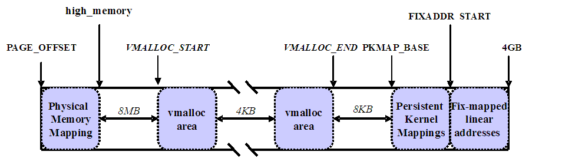

Linux 启动并建立一套完整的页表机制要经过以下几个步骤:

1. 临时内核页表的初始化(setup\_32.s)

2. 启动分页机制(head\_32.s)

3. 建立低端内存和高端内存固定映射区的页表(init\_memory\_mapping())

4. 建立高端内存永久映射区的页表并获取固定映射区的临时映射区页表(paging\_init())

linux**页表映射机制**的建立分为两个阶段, 第一个阶段是内核进入**保护模式之前**要先建立一个**临时内核页表**并**开启分页**功能, 因为在进入**保护模式后**, 内核继续初始化直到建立**完整的内存映射机制之前**, 仍然需要用到**页表来映射相应的内存地址**. 对 x86 32 位内核, 这个工作在保护模式下的内核入口函数 arch/x86/kernel/head\_32.S:startup\_32()中完成. 第二阶段是建立完整的内存映射机制, 在在 setup\_arch()--->arch/x86/mm/init.c:init\_memory\_mapping()中完成.

# 1 临时页表的初始化

arch/x86/kernel/head\_32.S 中的 startup_32()相关汇编代码如下:

```
__HEAD
ENTRY(startup_32)
	/* test KEEP_SEGMENTS flag to see if the bootloader is asking
		us to not reload segments */
	testb $(1<<6), BP_loadflags(%esi)
	jnz 2f

	/* ...... */
/*
 * 初始化页表. 这会创建一个 PDE 和一个页表集, 存放在__brk_base 的上面.
 * 变量_brk_end 会被设置成指向第一个"安全"的区域. 在虚拟地址 0(为标识映射)
 * 和 PAGE_OFFSET 处会创建映射. 注意在这里栈还没有被设置
 */
default_entry:
#ifdef CONFIG_X86_PAE
	/*
	 * 在 PAE 模式下 swapper_pg_dir 被静态定义包括足够多的条目以包含 VMSPLIT 选项(即最高的 1,
	 * 2 或 3 的条目). 标识映射通过把两个 PGD 条目指向第一个内核 PMD 条目来实现
	 * 注意在这一阶段, 每个 PMD 或 PTE 的上半部分总是为 0
	 */
#define KPMDS (((-__PAGE_OFFSET) >> 30) & 3) /* 内核 PMD 的数量 */
	xorl %ebx,%ebx				/* %ebx 保持为 0 */
	movl $pa(__brk_base), %edi
	movl $pa(swapper_pg_pmd), %edx
	movl $PTE_IDENT_ATTR, %eax
10:
	leal PDE_IDENT_ATTR(%edi),%ecx		/* 创建 PMD 条目 */
	movl %ecx,(%edx)			/* 保存 PMD 条目 */
						/* 上半部分已经为 0 */
	addl $8,%edx
	movl $512,%ecx
11:
	stosl
	xchgl %eax,%ebx
	stosl
	xchgl %eax,%ebx
	addl $0x1000,%eax
	loop 11b
	/*
	 * 终止条件: 我们必须映射到 end + MAPPING_BEYOND_END.
	 */
	movl $pa(_end) + MAPPING_BEYOND_END + PTE_IDENT_ATTR, %ebp
	cmpl %ebp,%eax
	jb 10b
1:
	addl $__PAGE_OFFSET, %edi
	movl %edi, pa(_brk_end)
	shrl $12, %eax
	movl %eax, pa(max_pfn_mapped)
	/* 对 fixmap 区域做初期的初始化 */
	movl $pa(swapper_pg_fixmap)+PDE_IDENT_ATTR,%eax
	movl %eax,pa(swapper_pg_pmd+0x1000*KPMDS-8)
#else	/* 非 PAE */
/* 得到开始目录项的索引 */
page_pde_offset = (__PAGE_OFFSET >> 20);
	/* 将基地址__brk_base 转换成物理地址, 传给 edi */
	movl $pa(__brk_base), %edi
	/* 将全局页目录表地址传给 edx */
	movl $pa(swapper_pg_dir), %edx
	movl $PTE_IDENT_ATTR, %eax
10:
	leal PDE_IDENT_ATTR(%edi),%ecx		/* 创建 PDE 条目 */
	movl %ecx,(%edx)			/* 保存标识 PDE 条目 */
	movl %ecx,page_pde_offset(%edx)		/* 保存内核 PDE 条目 */
	addl $4,%edx
	movl $1024, %ecx
11:
	stosl
	addl $0x1000,%eax
	loop 11b
	/*
	 * 终止条件: 我们必须映射到 end + MAPPING_BEYOND_END.
	 */
	movl $pa(_end) + MAPPING_BEYOND_END + PTE_IDENT_ATTR, %ebp
	cmpl %ebp,%eax
	jb 10b
	addl $__PAGE_OFFSET, %edi
	movl %edi, pa(_brk_end)
	shrl $12, %eax
	movl %eax, pa(max_pfn_mapped)
	/* 对 fixmap 区域做初期的初始化 */
	movl $pa(swapper_pg_fixmap)+PDE_IDENT_ATTR,%eax
	movl %eax,pa(swapper_pg_dir+0xffc)
#endif
	jmp 3f
/*
 * Non-boot CPU entry point; entered from trampoline.S
 * We can't lgdt here, because lgdt itself uses a data segment, but
 * we know the trampoline has already loaded the boot_gdt for us.
 *
 * If cpu hotplug is not supported then this code can go in init section
 * which will be freed later
 */
__CPUINIT
#ifdef CONFIG_SMP
ENTRY(startup_32_smp)
	cld
	movl $(__BOOT_DS),%eax
	movl %eax,%ds
	movl %eax,%es
	movl %eax,%fs
	movl %eax,%gs
#endif /* CONFIG_SMP */
3:
/*
 *	New page tables may be in 4Mbyte page mode and may
 *	be using the global pages.
 *
 *	NOTE! If we are on a 486 we may have no cr4 at all!
 *	So we do not try to touch it unless we really have
 *	some bits in it to set.  This won't work if the BSP
 *	implements cr4 but this AP does not -- very unlikely
 *	but be warned!  The same applies to the pse feature
 *	if not equally supported. --macro
 *
 *	NOTE! We have to correct for the fact that we're
 *	not yet offset PAGE_OFFSET..
 */
#define cr4_bits pa(mmu_cr4_features)
	movl cr4_bits,%edx
	andl %edx,%edx
	jz 6f
	movl %cr4,%eax		# 打开分页选项(PSE,PAE,...)
	orl %edx,%eax
	movl %eax,%cr4
	btl $5, %eax		# 检查 PAE 是否开启
	jnc 6f
	/* 检查扩展函数功能是否实现 */
	movl $0x80000000, %eax
	cpuid
	cmpl $0x80000000, %eax
	jbe 6f
	mov $0x80000001, %eax
	cpuid
	/* Execute Disable bit supported? */
	btl $20, %edx
	jnc 6f
	/* 设置 EFER (Extended Feature Enable Register) */
	movl $0xc0000080, %ecx
	rdmsr
	btsl $11, %eax
	/* 使更改生效 */
	wrmsr
6:
/*
 * 开启分页功能
 */
	movl pa(initial_page_table), %eax
	movl %eax,%cr3		/* 设置页表指针: cr3 控制寄存器保存的是目录表地址 */
	movl %cr0,%eax
	orl  $X86_CR0_PG,%eax
	movl %eax,%cr0		/* ..同时设置分页(PG)标识位 */
	ljmp $__BOOT_CS,$1f	/* 清除预读取和规格化%eip */
1:
	/* 设置栈指针 */
	lss stack_start,%esp
/*
 * Initialize eflags.  Some BIOS's leave bits like NT set.  This would
 * confuse the debugger if this code is traced.
 * XXX - best to initialize before switching to protected mode.
 */
	pushl $0
	popfl
#ifdef CONFIG_SMP
	cmpb $0, ready
	jz  1f				/* 初始的 CPU 要清除 BSS */
	jmp checkCPUtype
1:
#endif /* CONFIG_SMP */
```

其中 PTE\_IDENT\_ATTR 等常量定义在 arch/x86/include/asm/pgtable\_types.h 中, 如下:

```
/*
 * 初期标识映射的 pte 属性宏
 */
#ifdef CONFIG_X86_64
#define __PAGE_KERNEL_IDENT_LARGE_EXEC	__PAGE_KERNEL_LARGE_EXEC
#else
/*
 * For PDE_IDENT_ATTR include USER bit. As the PDE and PTE protection
 * bits are combined, this will alow user to access the high address mapped
 * VDSO in the presence of CONFIG_COMPAT_VDSO
 */
#define PTE_IDENT_ATTR	 0x003		/* PRESENT+RW */
#define PDE_IDENT_ATTR	 0x067		/* PRESENT+RW+USER+DIRTY+ACCESSED */
#define PGD_IDENT_ATTR	 0x001		/* PRESENT (no other attributes) */
#endif
```

分析(其中的非 PAE 模式):

(1)swapper\_pg\_dir 是临时全局页目录表起址, 它是在内核**编译过程中静态初始化的**. 首先 page\_pde\_offset 得到开始目录项的索引. 从这可以看出内核是在 swapper\_pg\_dir 的第**768 个表项**开始建立页表. 其**对应线性地址**就是\_\_brk_base(内核编译时指定其值, 默认为**0xc0000000**)以上的地址, 即**3GB 以上的高端地址**(3GB-4GB), 再次强调这高端的 1GB 线性空间是内核占据的虚拟空间, 在进行实际内存映射时, 映射到**物理内存**却总是从最低地址(**0x00000000**)开始.

(2)将目录表的地址 swapper\_pg\_dir 传给 edx, 表明内核也要从\_\_brk\_base 开始建立页表, 这样可以保证从以物理地址取指令到以线性地址在系统空间取指令的平稳过渡.

(3)创建并保存 PDE 条目.

(4)终止条件 end \+ MAPPING\_BEYOND\_END 决定了内核到底要建立多少页表, 也就是要映射多少内存空间. 在内核初始化程中内核只要保证能映射到包括内核的代码段, 数据段, 初始页表和用于存放动态数据结构的 128k 大小的空间就行. 在这段代码中, 内核为什么要把用户空间和内核空间的前几个目录项映射到相同的页表中去呢?虽然在 head\_32.S 中内核已经进入保护模式, 但是内核现在是处于保护模式的段式寻址方式下, 因为内核还没有启用分页映射机制, 现在都是以物理地址来取指令, 如果代码中遇到了符号地址, 只能减去 0xc0000000 才行, 当开启了映射机制后就不用了. 现在 cpu 中的取指令指针 eip 仍指向低区, 如果只建立内核空间中的映射, 那么当内核开启映射机制后, 低区中的地址就没办法寻址了, 因为没有对应的页表, 除非遇到某个符号地址作为绝对转移或调用子程序为止. 因此要尽快开启 CPU 的页式映射机制.

(5)**开启 CPU 页式映射机制**: initial\_page\_table 表示目录表起址, 传到 eax 中, 然后保存到**cr3 控制寄存器**中(从而前面"内存模型"介绍中可知 cr3 保存页目录表起址). 把 cr0 的最高位置成 1 来开启映射机制(即设置 PG 位).

通过 ljmp $\_\_BOOT\_CS,$1f 这条指令使**CPU 进入了系统空间继续执行**, 因为\_\_BOOT\_CS 是个符号地址, 地址在 0xc0000000 以上. 在 head\_32.S 完成了内核临时页表的建立后, 它继续进行初始化, 包括**初始化 INIT\_TASK**, 也就是系统开启后的**第一个进程**; 建立**完整的中断处理程序**, 然后**重新加载 GDT 描述符**, 最后**跳转到 init/main.c 中的 start\_kernel()函数继续初始化**.

# 2 内存映射机制的完整建立初始化

前面已经分析过了 Intel 的内存映射和 linux 的基本使用情况, 已知**head\_32.S**仅是建立**临时页表**,内核还是要建立**内核页表**, 做到**全面映射**的.

在**Linux**中, **物理内存**被分为**低端内存区和高端内存区**(如果**内核编译时配置了高端内存标志的话**), 为了建立物理内存到虚拟地址空间的映射, 需要先计算出**物理内存**总共有多少**页面数**, 即找出**最大可用页框号**, 这包含了整个低端和高端内存区. 还要计算出**低端内存区**总共占**多少页面**.

下面就基于 RAM 大于 896MB, 而小于 4GB, 并且**CONFIG\_HIGHMEM(必须配置！！！**)配置了高端内存的环境情况进行分析.

## 2.1 关键变量(max\_pfn 和 max\_low\_pfn)

建立内核页表前奏, 了解两个很关键的变量:

- max\_pfn: **最大物理内存页面帧号**;

- max\_low\_pfn: **低端内存区(直接映射空间区的内存)的最大可用页帧号**;

#### max\_pfn

max\_pfn 的值来自**setup\_arch**()中, setup\_arch()函数中有:

**max\_pfn = e820\_end\_of\_ram\_pfn**();

那么接下来看一下 e820\_end\_of\_ram\_pfn()的实现:

```
# /arch/x86/kernel/e820.c

unsigned long __init e820_end_of_ram_pfn(void)
{
    return e820_end_pfn(MAX_ARCH_PFN, E820_RAM);
}
```

e820\_end\_of\_ram\_pfn()直接封装调用 e820\_end\_pfn(), 而其入参为 MAX\_ARCH\_PFN 和 E820\_RAM, 其中 MAX\_ARCH\_PFN 的定义(**x86 的 32bit 环境且非 PAE**)为:

```cpp
// arch/x86/kernel/e820.c

#ifdef CONFIG_X86_32
# ifdef CONFIG_X86_PAE
#  define MAX_ARCH_PFN		(1ULL<<(36-PAGE_SHIFT))
# else
//x86 的 32bit 环境且非 PAE
#  define MAX_ARCH_PFN		(1ULL<<(32-PAGE_SHIFT))
# endif
#else /* CONFIG_X86_32 */
# define MAX_ARCH_PFN MAXMEM>>PAGE_SHIFT
#endif
```

这里可以看到如果定义了 CONFIG\_X86\_32, 那么在**没使用 PAE**的情况下, **MAX\_ARCH\_PFN**的值就为**物理 4GB 内存对应的页框号(32 位没有 PAE 最大支持的物理内存是 4GB！！！PAE 扩展就是 64GB！！！**), 而如果不是则 MAX\_ARCH\_PFN 的值为 MAXMEM 对应的页框号, 我们来看 MAXMEM 的定义:

```
// arch/x86/include/asm/pgtable_32_types.h
#define MAXMEM  (VMALLOC_END - PAGE_OFFSET - __VMALLOC_RESERVE)

// arch/x86/include/asm/pgtable_64_types.h
#define MAXMEM  (1UL << MAX_PHYSMEM_BITS)
```
这里面的宏都和线性地址的最后 1GB 有关, 其中\_\_VANALLOC\_RESERVE 为 128M, 下图说明了第 4GB 的内存划分



结合这个图我们可以得出**MAXMEM 为一个略小于 896M 的值**(**896M\-8K\-4M\-4M**), 即**略小于低端内存的上限**, 高端内存的起始地址, 这样是为了避免某些情况下产生的 OOPS.

**MAX\_ARCH\_PFN**最终值为 0x100000(2\^20=2\^32/2^12(4K 一个页面)), 它表示的是**4G 内存的最大页面帧号**; 而 E820\_RAM 代表可用内存:

```
#define E820_RAM  1
```

接下来看一下 e820\_end\_pfn()函数实现:

```
# /arch/x86/kernel/e820.c

/*
 * Find the highest page frame number we have available
 */
static unsigned long __init e820_end_pfn(unsigned long limit_pfn, unsigned type)
{
    int i;
    unsigned long last_pfn = 0;
    /* 4G 地址空间对应的页面数 */
    unsigned long max_arch_pfn = MAX_ARCH_PFN;

    /*循环遍历内存布局数组*/
    /* 对 e820 中所有的内存块,其中 e820 为从 bios 中探测到的页面数存放处 */
    for (i = 0; i < e820.nr_map; i++) {
        struct e820entry *ei = &e820.map[i];
        unsigned long start_pfn;
        unsigned long end_pfn;
        /* 与要找的类型不匹配 */
        if (ei->type != type)
            continue;

        start_pfn = ei->addr >> PAGE_SHIFT;
        end_pfn = (ei->addr + ei->size) >> PAGE_SHIFT;

        if (start_pfn >= limit_pfn)
            continue;
        if (end_pfn > limit_pfn) {
            last_pfn = limit_pfn;
            break;
        }
        if (end_pfn > last_pfn)
            last_pfn = end_pfn;
    }

    if (last_pfn > max_arch_pfn)
        last_pfn = max_arch_pfn;

    printk(KERN_INFO "e820: last_pfn = %#lx max_arch_pfn = %#lx\n",
             last_pfn, max_arch_pfn);
    return last_pfn;
}
```
这里 MAX\_ARCH\_PFN 为通常可寻址的 4GB 空间, 如果启用了 PAE 扩展, 则为 64GB 空间.

这个函数用来**查找最大物理的页面帧号**, 通过遍历 e820.map 数组中存放的所有物理页面块, 找出其中最大的页面帧号, 这就是我们当前需要的 max\_pfn 值. 将**起始地址**右移 PAGE\_SHIFT(12), 算出其**起始地址**对应的**页面帧号**, 如果足够大, 超出了 limit\_pfn 则设置最大页面帧号为 limit\_pfn, 否则则设置为遍历中找到的最大的 last\_pfn.

e820\_end\_of\_ram\_pfn()函数的调用位置:

```
start_kernel()                      #/init/main.c
|
└─>setup_arch()                     #/arch/x86/kernel/setup.c
   |
   └─>e820_end_of_ram_pfn()         #/arch/x86/kernel/e820.c
   |
   └─>find_low_pfn_range()          #/arch/x86/kernel/e820.c
```

然后, setup\_arch()会调用 arch/x86/mm/init\_32.c:find\_low\_pfn\_range()找出低端内存区的最大可用页帧号, 保存在**全局变量 max\_low\_pfn**中.

其中 find\_low\_pfn\_range()用于**查找低端内存的最大页面数**, max\_low\_pfn 则在这里面初始化.

#### max\_low\_pfn

find\_low\_pfn\_range()代码实现:

```
# /arch/x86/mm/init_32.c

/*
 * Determine low and high memory ranges:
 */
void __init find_low_pfn_range(void)
{
    /* it could update max_pfn */

     /*实际物理内存小于等于低端内存 896M*/
    if (max_pfn <= MAXMEM_PFN)
        lowmem_pfn_init();
    else
        /*实际的物理内存大于 896M*/
        highmem_pfn_init();
}
```

函数实现很简单, **根据 max\_pfn 是否大于 MAXMEM\_PFN, 从而判断是否初始化高端内存, 也可以认为是启用**. 那么来看一下 MAXMEM\_PFN 的宏定义:

```
# /arch/x86/include/asm/setup.h

#define MAXMEM_PFN   PFN_DOWN(MAXMEM)
```

其中 PFN_DOWN(x)的定义为:

```
# /include/linux/pfn.h

#define PFN_DOWN(x)   ((x) >> PAGE_SHIFT)
#define PFN_UP(x)	  (((x) + PAGE_SIZE-1) >> PAGE_SHIFT)
```

**PFN\_DOWN(x)是用来返回地址值 x 对应的最后一个页框号**, 对应的还有个**PFN\_UP(x)是用来返回地址值对应的页框的下一个页框号**, 此外还有个**PFN\_PHYS(x)返回的是 x 的物理页面号**. 接着看 MAXMEM 的定义:

```
# arch/x86/include/asm/pgtable_32_types.h

#define MAXMEM  (VMALLOC_END - PAGE_OFFSET - __VMALLOC_RESERVE)
```

**64 位**在文件 arch/x86/include/asm/pgtable\_64\_types.h 中

那么 VMALLOC\_END 的定义则为:

```
# arch/x86/include/asm/pgtable_32_types.h

#define VMALLOC_END              (PKMAP_BASE - 2 * PAGE_SIZE)

#define PKMAP_BASE               ((FIXADDR_BOOT_START - PAGE_SIZE * (LAST_PKMAP + 1)) & PMD_MASK)
```

其中**PKMAP\_BASE 是永久映射空间的起始地址**, **LAST\_PKMAP 则是永久映射空间的映射页面数**, 定义为:

```
# arch/x86/include/asm/pgtable_32_types.h

#define LAST_PKMAP 1024
```

另外 PAGE\_SHIFT 和 PAGE\_SIZE 的定义为:

```
#define PAGE_SHIFT               12

#define PAGE_SIZE                (_AC(1,UL) << PAGE_SHIFT)
```

而**FIXADDR\_BOOT\_START 是临时固定映射空间起始地址**, 其的相关宏定义:

```
#define FIXADDR_BOOT_SIZE        (__end_of_fixed_addresses << PAGE_SHIFT)

#define FIXADDR_BOOT_START       (FIXADDR_TOP - FIXADDR_BOOT_SIZE)

unsigned long __FIXADDR_TOP = 0xfffff000;

extern unsigned long __FIXADDR_TOP;

#define FIXADDR_TOP              ((unsigned long)__FIXADDR_TOP)
```

这里其中的\_\_end\_of\_fixed\_addresses 是来自 fixed\_addresses 枚举值, 是固定映射的一个标志. 此外这里的 FIXADDR\_TOP 是固定映射区末尾, 而另外还有一个这里未列出的 FIXADDR\_START, 是固定映射区起始地址.

既然到此, 顺便介绍一下内核空间映射情况.


内核空间(**在 x86 结构中, Linux 内核虚拟地址空间划分 0\~3G 为用户空间, 3\~4G 为内核空间, 也就是说内核能使用的线性地址空间只有 1G**), 如上图, 分为直接内存映射区和高端内存映射区. 其中

- 直接内存映射区是指**3G 到 3G+896M 的线性空间**, 直接**对应物理地址就是 0 到 896M**(前提是有超过 896M 的物理内存), 其中 896M 是 high\_memory 值, 使用 kmalloc()/kfree()接口操作申请释放; 该区域的线性地址和物理地址存在线性转换关系: 线性地址=3G+物理地址.

- 而高端内存映射区则是至超多 896M 物理内存的空间, 它又分为动态映射区、永久映射区和固定映射区.

    - 动态内存映射区, 又称之为 vmalloc 映射区或非连续映射区(noncontiguous memory allocation), 是指 VMALLOC\_START 到 VMALLOC\_END 的地址空间, 申请释放操作接口是 vmalloc()/vfree(), 通常用于将**非连续的物理内存映射为连续的线性地址内存空间**; 特点是: **线性空间连续, 但是对应的物理空间不一定连续**. vmalloc 分配的线性地址所对应的物理页可能处于低端内存, 也可能处于高端内存.

    - 永久映射区, 又称之为 KMAP 区或持久映射区(permanent kernel mapping), 是指自 PKMAP\_BASE 开始共 LAST\_PKMAP 个页面大小的空间, 操作接口是 kmap()/kunmap(), 用于**将高端内存长久映射到内存虚拟地址空间中**; 该区域可访问高端内存. 访问方法是使用 alloc\_page(\_GFP\_HIGHMEM)分配高端内存页或者使用 kmap 函数将分配到的高端内存映射到该区域.

    - 固定映射区, 也称之为**临时内核映射区(temporary kernel mapping)**, 是指 FIXADDR\_START 到 FIXADDR\_TOP 的地址空间, 操作接口是 kmap\_atomic()/kummap\_atomic(), 用于解决**持久映射不能用于中断处理程序而增加的临时内核映射**. 该区域和 4G 的顶端只有 4k 的隔离带, 其每个地址项都服务于特定的用途, 如 ACPI\_BASE 等.

关于**内核空间映射**情况图.


PMD\_MASK 涉及的宏定义:

```
# /include/asm-generic/pgtable-nopmd.h

#define PMD_SHIFT                PUD_SHIFT

#define PMD_SIZE                 (1UL << PMD_SHIFT)

#define PMD_MASK                 (~(PMD_SIZE-1))

# /include/asm-generic/pgtable-nopud.h

#define PUD_SHIFT                PGDIR_SHIFT

# arch/x86/include/asm/Pgtable-2level_types.h

#define PGDIR_SHIFT              22
```

PMD_MASK 计算结果是: **0xFFC00000**, 其实是用于数据对齐而已.

已知 PAGE\_OFFSET 默认的为 0xC0000000(3G), 而\_\_VMALLOC_RESERVE 为:

```
unsigned int __VMALLOC_RESERVE = 128 << 20;
```

最后在个人的实验环境上, 得出**MAXMEM_PFN 的值为 0x377fe**.

Linux 是一个支持多硬件平台的操作系统, 各种硬件芯片的分页并非固定的 2 级(页全局目录和页表), 仅仅 Intel 处理器而言, 就存在 3 级的情况(页全局目录、页中间目录和页表), 而到了 64 位系统的时候就成了 4 级分页. 所以 Linux 为了保持良好的兼容性和移植性, 系统设计成了以下的**4 级分页模型**, 根据平台环境和配置的情况, **通过将页上级目录和页中间目录的索引位设置为 0, 从而隐藏了页三级目录和页中间目录的存在**. 也就是为什么存在 PMD\_SHIFT、PUD\_SHIFT 和 PGDIR\_SHIFT, 还有 pgtable-nopmd.h、pgtable-nopud.h 和 Pgtable-2level\_types.h 的原因了.


由此管中窥豹, 看到了 Linux 内存分页映射模型的存在和相关设计, 暂且也就先了解这么多.

分析宏是一件很乏味的事情, 不过以小见大却是一件很有意思的事情.

当**实际的物理内存大于 896M**, 由**highmem\_pfn\_init**()进行分配

```
# /arch/x86/mm/init_32.c

/*

 * 物理内存超出低端空间区: 把它们放在高端地址空间中, 或者通过启动时的 highmem=x 启动参数进行配置;
 * 如果不配置, 在这里进行设置大小
 */
static void __init highmem_pfn_init(void)
{
    /*设定高端内存和低端内存的分界线*/
    /* MAXMEM_PFN 为最大物理地址-(4M+4M+8K+128M);
    所以低端空间的大小其实比我们说的 896M 低一些 */
    max_low_pfn = MAXMEM_PFN;

    /*高端内存页面数如果在开机没有设置*/
    if (highmem_pages == -1)

        /*默认为最大页框数减去 MAXMEM_PFN*/
        /* 总页面数减去低端页面数 */
        highmem_pages = max_pfn - MAXMEM_PFN;

    /*高端内存页框数加上 MAXMEM_PFN 小于最大页框数*/
    /* 如果 highmem_pages 变量在启动项设置了, 那么在这里就要进行这样的判断,
	因为可能出现不一致的情况 */
    if (highmem_pages + MAXMEM_PFN < max_pfn)
        /*将最大页框数下调到前两者的和*/
        max_pfn = MAXMEM_PFN + highmem_pages;

    /*申请的高端内存超过范围则不分配*/
    if (highmem_pages + MAXMEM_PFN > max_pfn) {
        printk(KERN_WARNING MSG_HIGHMEM_TOO_SMALL,
            pages_to_mb(max_pfn - MAXMEM_PFN),
            pages_to_mb(highmem_pages));
        highmem_pages = 0;
    }
#ifndef CONFIG_HIGHMEM
    /* 最大可用内存是可直接寻址的 */
    /* Maximum memory usable is what is directly addressable */
    printk(KERN_WARNING "Warning only %ldMB will be used.\n", MAXMEM>>20);
    if (max_pfn > MAX_NONPAE_PFN)
        printk(KERN_WARNING "Use a HIGHMEM64G enabled kernel.\n");
    else
        printk(KERN_WARNING "Use a HIGHMEM enabled kernel.\n");
    max_pfn = MAXMEM_PFN;
#else /* !CONFIG_HIGHMEM */
#ifndef CONFIG_HIGHMEM64G
    /* 在没有配置 64G 的情况下, 内存的大小不能超过 4G */
    if (max_pfn > MAX_NONPAE_PFN) {
        max_pfn = MAX_NONPAE_PFN;
        printk(KERN_WARNING MSG_HIGHMEM_TRIMMED);
    }
#endif /* !CONFIG_HIGHMEM64G */
#endif /* !CONFIG_HIGHMEM */
}
```

highmem\_pfn\_init()看起来很长, 貌似很复杂, 实际上仅仅是把**max\_low\_pfn**设置为**MAXMEM\_PFN**, 而**highmem\_pages**设置为**max\_pfn - MAXMEM\_PFN**, 至于后面的几乎都是为了防止某些数据过大过小引起翻转而做的保障性工作.

分析:

(1)init\_32.c 中定义了一个**静态全局变量 highmem_pages**, 用来保存用户指定的**高端空间的大小**(即**总页面数**).

(2)在 find\_low\_pfn\_range()中, 如果物理内存总页面数 max\_pfn 不大于低端页面数上限 MAXMEM\_PFN(即**物理内存大小没有超出低端空间范围**), 则直接没有高端地址映射, 调用 lowmem\_pfn\_init(), 将 max\_low\_pfn 设成 max\_pfn. 注意若内核编译时通过**CONFIG\_HIGHMEM(不配置就不映射！！！**)指定必须有高端映射, 则 max\_low\_pfn 的值需要减去高端页面数**highmem\_pages**, 以表示低端页面数.

(3)如果物理内存总页面数大于低端页面数上限, 则表明有高端映射, 因为需要把超出的部分放在高端空间区, 这是一般 PC 机的运行流程. 调用 highmem\_pfn\_init(), 如果启动时用户没有指定高端页面数, 则显然 max_low_pfn=MAXMEM_PFN, highmem_pages = max\_pfn \- MAXMEM\_PFN; 如果启动时用户通过 highmem=x 启动参数指定了高端页面数 highmem\_pages, 则仍然有 max\_low\_pfn=MAXMEM\_PFN, 但 max\_pfn 可能出现不一致的情况, 需要更新为 MAXMEM\_PFN \+ highmem\_pages, 如果出现越界(高端空间区太小), 则要做相应越界处理.

当实际的**物理内存小于等于低端内存**时, 由 lowmem\_pfn\_init()进行分配

```
void __init lowmem_pfn_init(void)
{
    /* max_low_pfn is 0, we already have early_res support */
    /*将分界线初始化为实际物理内存的最大页框号, 由于系统的内存小于 896M,
    所以全部内存为低端内存, 如需要高端内存, 则从中分一部分出来进行分配*/
    max_low_pfn = max_pfn;

    if (highmem_pages == -1)
        highmem_pages = 0;
#ifdef CONFIG_HIGHMEM  /*如果用户定义了 HIGHMEM, 即需要分配高端内存*/
    if (highmem_pages >= max_pfn) {       /*如果高端内存的页起始地址>=最大页框号, 则无法分配*/
        printk(KERN_ERR MSG_HIGHMEM_TOO_BIG,
            pages_to_mb(highmem_pages), pages_to_mb(max_pfn));
        highmem_pages = 0;
    }
    if (highmem_pages) {
        /*这个条件保证低端内存不能小于 64M*/
        if (max_low_pfn - highmem_pages < 64*1024*1024/PAGE_SIZE) {
            printk(KERN_ERR MSG_LOWMEM_TOO_SMALL,
                pages_to_mb(highmem_pages));
            highmem_pages = 0;
        }
        max_low_pfn -= highmem_pages; /*设定好低、高端内存的分界线*/
    }
#else
    if (highmem_pages)
        printk(KERN_ERR "ignoring highmem size on non-highmem kernel!\n");
#endif
}
```

需要说明的是这里的**max\_low\_pfn 作为直接映射空间区的内存最大可用页帧号, 并不是 896M 大小内存的页面数**. 896M 只是**定义高端内存的一个界限**, 至于直接映射内存大小只定义了不超过 896M 而已.

# 2 页表缓冲区申请

此外还有一个**准备操作**, 在**setup\_arch**()函数中调用的**页表缓冲区申请**操作 early\_alloc\_pgt\_buf():

```
# /arch/x86/mm/init.c

void __init early_alloc_pgt_buf(void)
{
    unsigned long tables = INIT_PGT_BUF_SIZE;
    phys_addr_t base;

    base = __pa(extend_brk(tables, PAGE_SIZE));

    pgt_buf_start = base >> PAGE_SHIFT;
    pgt_buf_end = pgt_buf_start;
    pgt_buf_top = pgt_buf_start + (tables >> PAGE_SHIFT);
}
```

理解该函数前先看一下里面调用的 extend\_brk():

```
# /arch/x86/kernel/setup.c

void * __init extend_brk(size_t size, size_t align)
{
    size_t mask = align - 1;
    void *ret;

    BUG_ON(_brk_start == 0);
    BUG_ON(align & mask);

    _brk_end = (_brk_end + mask) & ~mask;
    BUG_ON((char *)(_brk_end + size) > __brk_limit);

    ret = (void *)_brk_end;
    _brk_end += size;

    memset(ret, 0, size);

    return ret;
}
```

可以看到是从系统**开启分页管理(head\_32.s 代码**)中使用到的\_\_**brk\_base 保留空间申请一块内存**出来, 申请的空间大小为:

```
#define INIT_PGT_BUF_SIZE        (6 * PAGE_SIZE)
```

也就是**24Kbyte**, 同时将\_brk\_end 标识的位置后移. 里面涉及的几个全局变量作用:

- pgt\_buf\_start: 标识**该缓冲空间的起始页框号**;

- pgt\_buf\_end: 当前和 pgt\_buf\_start 等值, 但是它用于表示该空间**未被申请使用的空间起始页框号**;

- pgt\_buf\_top: 则是用来表示**缓冲空间的末尾**, 存放的是该末尾的**页框号**.

在 setup\_arch()中, 紧接着 early\_alloc\_pgt\_buf()还有 reserve\_brk():

```
# /arch/x86/kernel/setup.c

static void __init reserve_brk(void)
{
    if (_brk_end > _brk_start)
        memblock_reserve(__pa_symbol(_brk_start),
                 _brk_end - _brk_start);

    /* Mark brk area as locked down and no longer taking any
       new allocations */
    _brk_start = 0;
}
```

其主要是用来将**early\_alloc\_pgt\_buf**()申请的空间在 memblock 算法中做**reserved 保留操作**, 避免被其他地方申请使用引发异常.

# 3 链接

Linux 内存管理(4): 内存映射机制: https://blog.csdn.net/zhoudaxia/article/details/7909106

Linux 页表机制初始化: https://blog.csdn.net/vanbreaker/article/details/7549681

