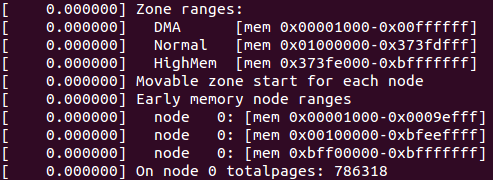

前面构建内存管理框架, 已经将内存管理 node 节点设置完毕, 接下来将是管理区和页面管理的构建. 此处代码实现主要在于 setup\_arch()下的一处钩子: x86\_init.paging.pagetable\_init(). 据前面分析可知 x86\_init 结构体内该钩子实际上挂接的是 native\_pagetable\_init()函数.

native\_pagetable\_init():

```cpp
# /arch/x86/mm/init_32.c

void __init native_pagetable_init(void)
{
    unsigned long pfn, va;
    pgd_t *pgd, *base = swapper_pg_dir;
    pud_t *pud;
    pmd_t *pmd;
    pte_t *pte;

    /*
     * Remove any mappings which extend past the end of physical
     * memory from the boot time page table.
     * In virtual address space, we should have at least two pages
     * from VMALLOC_END to pkmap or fixmap according to VMALLOC_END
     * definition. And max_low_pfn is set to VMALLOC_END physical
     * address. If initial memory mapping is doing right job, we
     * should have pte used near max_low_pfn or one pmd is not present.
     */
    for (pfn = max_low_pfn; pfn < 1<<(32-PAGE_SHIFT); pfn++) {
        va = PAGE_OFFSET + (pfn<<PAGE_SHIFT);
        pgd = base + pgd_index(va);
        if (!pgd_present(*pgd))
            break;

        pud = pud_offset(pgd, va);
        pmd = pmd_offset(pud, va);
        if (!pmd_present(*pmd))
            break;

        /* should not be large page here */
        if (pmd_large(*pmd)) {
            pr_warn("try to clear pte for ram above max_low_pfn: pfn: %lx pmd: %p pmd phys: %lx, but pmd is big page and is not using pte !\n",
                pfn, pmd, __pa(pmd));
            BUG_ON(1);
        }

        pte = pte_offset_kernel(pmd, va);
        if (!pte_present(*pte))
            break;

        printk(KERN_DEBUG "clearing pte for ram above max_low_pfn: pfn: %lx pmd: %p pmd phys: %lx pte: %p pte phys: %lx\n",
                pfn, pmd, __pa(pmd), pte, __pa(pte));
        pte_clear(NULL, va, pte);
    }
    paravirt_alloc_pmd(&init_mm, __pa(base) >> PAGE_SHIFT);
    paging_init();
}
```

该函数的 for 循环主要是用于检测 max\_low\_pfn 直接映射空间后面的物理内存是否存在系统启动引导时创建的页表, 如果存在, 则使用 pte\_clear()将其清除.

接下来的 paravirt\_alloc\_pmd()主要是用于准虚拟化, 主要是使用钩子函数的方式替换 x86 环境中多种多样的指令实现.

再往下的 paging\_init():

```
# /arch/x86/mm/init_32.c

/*
 * paging_init() sets up the page tables - note that the first 8MB are
 * already mapped by head.S.
 *
 * This routines also unmaps the page at virtual kernel address 0, so
 * that we can trap those pesky NULL-reference errors in the kernel.
 */
void __init paging_init(void)
{
    pagetable_init();

    __flush_tlb_all();

    kmap_init();

    /*
     * NOTE: at this point the bootmem allocator is fully available.
     */
    olpc_dt_build_devicetree();
    sparse_memory_present_with_active_regions(MAX_NUMNODES);
    sparse_init();
    zone_sizes_init();
}
```

paging\_init()主要都是函数调用, 现在逐一分析各个函数功能, 先看 pagetable\_init():

```
# /arch/x86/mm/init_32.c

static void __init pagetable_init(void)
{
    pgd_t *pgd_base = swapper_pg_dir;

    permanent_kmaps_init(pgd_base);
}
```

这里再次看到页全局目录 swapper\_pg\_dir 变量, 它作为参数接着调用 permanent\_kmaps\_init():

```
# /arch/x86/mm/init_32.c

static void __init permanent_kmaps_init(pgd_t *pgd_base)
{
    unsigned long vaddr;
    pgd_t *pgd;
    pud_t *pud;
    pmd_t *pmd;
    pte_t *pte;

    vaddr = PKMAP_BASE;
    page_table_range_init(vaddr, vaddr + PAGE_SIZE*LAST_PKMAP, pgd_base);

    pgd = swapper_pg_dir + pgd_index(vaddr);
    pud = pud_offset(pgd, vaddr);
    pmd = pmd_offset(pud, vaddr);
    pte = pte_offset_kernel(pmd, vaddr);
    pkmap_page_table = pte;
}
```

这里可以看到前面分析过的建立页表函数 page\_table\_range\_init(), 此处建立页表范围为 PKMAP\_BASE 到 PKMAP\_BASE + PAGE\_SIZE*LAST\_PKMAP, 这是 KMAP 区(永久映射区)的范围. 继而也就是说当前是在建立永久映射区的页表, 建好页表后将页表地址给永久映射区页表变量 pkmap\_page\_table 置值.

完了接着看 paging\_init()里面调用的下一个函数 kmap\_init():

```
# /arch/x86/mm/init_32.c

static void __init kmap_init(void)
{
    unsigned long kmap_vstart;

    /*
     * Cache the first kmap pte:
     */
    kmap_vstart = __fix_to_virt(FIX_KMAP_BEGIN);
    kmap_pte = kmap_get_fixmap_pte(kmap_vstart);

    kmap_prot = PAGE_KERNEL;
}
```

其中 kmap\_get\_fixmap\_pte():

```
# /arch/x86/mm/init_32.c
static inline pte_t *kmap_get_fixmap_pte(unsigned long vaddr)
{
    return pte_offset_kernel(pmd_offset(pud_offset(pgd_offset_k(vaddr),
            vaddr), vaddr), vaddr);
}
```

可以很容易看到 kmap\_init()主要是获取到临时映射区间的起始页表并往临时映射页表变量 kmap\_pte 置值, 并置页表属性 kmap\_prot 为 PAGE\_KERNEL.

paging\_init()中, 由于没有开启 CONFIG\_OLPC 配置, 故 olpc\_dt\_build\_devicetree()为空函数, 暂不分析. 同样, 前面提及的 sparse\_memory\_present\_with\_active\_regions()和 sparse\_init()也暂不分析.

最后看一下 zone\_sizes\_init():

```
# /arch/x86/mm/init.c

void __init zone_sizes_init(void)
{
    unsigned long max_zone_pfns[MAX_NR_ZONES];

    memset(max_zone_pfns, 0, sizeof(max_zone_pfns));

#ifdef CONFIG_ZONE_DMA
    max_zone_pfns[ZONE_DMA] = MAX_DMA_PFN;
#endif
#ifdef CONFIG_ZONE_DMA32
    max_zone_pfns[ZONE_DMA32] = MAX_DMA32_PFN;
#endif
    max_zone_pfns[ZONE_NORMAL] = max_low_pfn;
#ifdef CONFIG_HIGHMEM
    max_zone_pfns[ZONE_HIGHMEM] = max_pfn;
#endif

    free_area_init_nodes(max_zone_pfns);
}
```

通过 max\_zone\_pfns 获取各个管理区的最大页面数, 并作为参数调用 free\_area\_init\_nodes(),其中 free\_area\_init\_nodes()函数实现:

```
# /mm/page_alloc.c

/**
 * free_area_init_nodes - Initialise all pg_data_t and zone data
 * @max_zone_pfn: an array of max PFNs for each zone
 *
 * This will call free_area_init_node() for each active node in the system.
 * Using the page ranges provided by add_active_range(), the size of each
 * zone in each node and their holes is calculated. If the maximum PFN
 * between two adjacent zones match, it is assumed that the zone is empty.
 * For example, if arch_max_dma_pfn == arch_max_dma32_pfn, it is assumed
 * that arch_max_dma32_pfn has no pages. It is also assumed that a zone
 * starts where the previous one ended. For example, ZONE_DMA32 starts
 * at arch_max_dma_pfn.
 */
void __init free_area_init_nodes(unsigned long *max_zone_pfn)
{
    unsigned long start_pfn, end_pfn;
    int i, nid;

    /* Record where the zone boundaries are */
    memset(arch_zone_lowest_possible_pfn, 0,
                sizeof(arch_zone_lowest_possible_pfn));
    memset(arch_zone_highest_possible_pfn, 0,
                sizeof(arch_zone_highest_possible_pfn));
    arch_zone_lowest_possible_pfn[0] = find_min_pfn_with_active_regions();
    arch_zone_highest_possible_pfn[0] = max_zone_pfn[0];
    for (i = 1; i < MAX_NR_ZONES; i++) {
        if (i == ZONE_MOVABLE)
            continue;
        arch_zone_lowest_possible_pfn[i] =
            arch_zone_highest_possible_pfn[i-1];
        arch_zone_highest_possible_pfn[i] =
            max(max_zone_pfn[i], arch_zone_lowest_possible_pfn[i]);
    }
    arch_zone_lowest_possible_pfn[ZONE_MOVABLE] = 0;
    arch_zone_highest_possible_pfn[ZONE_MOVABLE] = 0;

    /* Find the PFNs that ZONE_MOVABLE begins at in each node */
    memset(zone_movable_pfn, 0, sizeof(zone_movable_pfn));
    find_zone_movable_pfns_for_nodes();

    /* Print out the zone ranges */
    printk("Zone ranges:\n");
    for (i = 0; i < MAX_NR_ZONES; i++) {
        if (i == ZONE_MOVABLE)
            continue;
        printk(KERN_CONT " %-8s ", zone_names[i]);
        if (arch_zone_lowest_possible_pfn[i] ==
                arch_zone_highest_possible_pfn[i])
            printk(KERN_CONT "empty\n");
        else
            printk(KERN_CONT "[mem %0#10lx-%0#10lx]\n",
                arch_zone_lowest_possible_pfn[i] << PAGE_SHIFT,
                (arch_zone_highest_possible_pfn[i]
                    << PAGE_SHIFT) - 1);
    }

    /* Print out the PFNs ZONE_MOVABLE begins at in each node */
    printk("Movable zone start for each node\n");
    for (i = 0; i < MAX_NUMNODES; i++) {
        if (zone_movable_pfn[i])
            printk(" Node %d: %#010lx\n", i,
                   zone_movable_pfn[i] << PAGE_SHIFT);
    }

    /* Print out the early node map */
    printk("Early memory node ranges\n");
    for_each_mem_pfn_range(i, MAX_NUMNODES, &start_pfn, &end_pfn, &nid)
        printk(" node %3d: [mem %#010lx-%#010lx]\n", nid,
               start_pfn << PAGE_SHIFT, (end_pfn << PAGE_SHIFT) - 1);

    /* Initialise every node */
    mminit_verify_pageflags_layout();
    setup_nr_node_ids();
    for_each_online_node(nid) {
        pg_data_t *pgdat = NODE_DATA(nid);
        free_area_init_node(nid, NULL,
                find_min_pfn_for_node(nid), NULL);

        /* Any memory on that node */
        if (pgdat->node_present_pages)
            node_set_state(nid, N_MEMORY);
        check_for_memory(pgdat, nid);
    }
}
```

该函数中, arch\_zone\_lowest\_possible\_pfn 用于存储各内存管理区可使用的最小内存页框号, 而 arch\_zone\_highest\_possible\_pfn 则是用来存储各内存管理区可使用的最大内存页框号. 于是 find\_min\_pfn\_with\_active\_regions()函数主要是实现用于获取最小内存页框号, 而获取最大内存页框号则是紧随的 for 循环:

```
    for (i = 1; i < MAX_NR_ZONES; i++) {

        if (i == ZONE_MOVABLE)

            continue;

        arch_zone_lowest_possible_pfn[i] =

            arch_zone_highest_possible_pfn[i-1];

        arch_zone_highest_possible_pfn[i] =

            max(max_zone_pfn[i], arch_zone_lowest_possible_pfn[i]);

    }
```

该循环里面除了确定各内存管理区最大内存页框号, 同时也确定了各管理区的最小内存页框号,实际上就是确定各个管理区的上下边界. 此外, 还有一个全局数组 zone\_movable\_pfn, 用于记录各个 node 节点的 Movable 管理区的起始页框号, 而查找该页框号的相应函数为 find\_zone\_movable\_pfns\_for\_nodes().

具体实现:

```
# /mm/page_alloc.c

/*
 * Find the PFN the Movable zone begins in each node. Kernel memory
 * is spread evenly between nodes as long as the nodes have enough
 * memory. When they don't, some nodes will have more kernelcore than
 * others
 */
static void __init find_zone_movable_pfns_for_nodes(void)
{
    int i, nid;
    unsigned long usable_startpfn;
    unsigned long kernelcore_node, kernelcore_remaining;
    /* save the state before borrow the nodemask */
    nodemask_t saved_node_state = node_states[N_MEMORY];
    unsigned long totalpages = early_calculate_totalpages();
    int usable_nodes = nodes_weight(node_states[N_MEMORY]);
    struct memblock_type *type = &memblock.memory;

    /* Need to find movable_zone earlier when movable_node is specified. */
    find_usable_zone_for_movable();

    /*
     * If movable_node is specified, ignore kernelcore and movablecore
     * options.
     */
    if (movable_node_is_enabled()) {
        for (i = 0; i < type->cnt; i++) {
            if (!memblock_is_hotpluggable(&type->regions[i]))
                continue;

            nid = type->regions[i].nid;

            usable_startpfn = PFN_DOWN(type->regions[i].base);
            zone_movable_pfn[nid] = zone_movable_pfn[nid] ?
                min(usable_startpfn, zone_movable_pfn[nid]) :
                usable_startpfn;
        }

        goto out2;
    }

    /*
     * If movablecore=nn[KMG] was specified, calculate what size of
     * kernelcore that corresponds so that memory usable for
     * any allocation type is evenly spread. If both kernelcore
     * and movablecore are specified, then the value of kernelcore
     * will be used for required_kernelcore if it's greater than
     * what movablecore would have allowed.
     */
    if (required_movablecore) {
        unsigned long corepages;

        /*
         * Round-up so that ZONE_MOVABLE is at least as large as what
         * was requested by the user
         */
        required_movablecore =
            roundup(required_movablecore, MAX_ORDER_NR_PAGES);
        corepages = totalpages - required_movablecore;

        required_kernelcore = max(required_kernelcore, corepages);
    }

    /* If kernelcore was not specified, there is no ZONE_MOVABLE */
    if (!required_kernelcore)
        goto out;

    /* usable_startpfn is the lowest possible pfn ZONE_MOVABLE can be at */
    usable_startpfn = arch_zone_lowest_possible_pfn[movable_zone];

restart:
    /* Spread kernelcore memory as evenly as possible throughout nodes */
    kernelcore_node = required_kernelcore / usable_nodes;
    for_each_node_state(nid, N_MEMORY) {
        unsigned long start_pfn, end_pfn;

        /*
         * Recalculate kernelcore_node if the division per node
         * now exceeds what is necessary to satisfy the requested
         * amount of memory for the kernel
         */
        if (required_kernelcore < kernelcore_node)
            kernelcore_node = required_kernelcore / usable_nodes;

        /*
         * As the map is walked, we track how much memory is usable
         * by the kernel using kernelcore_remaining. When it is
         * 0, the rest of the node is usable by ZONE_MOVABLE
         */
        kernelcore_remaining = kernelcore_node;

        /* Go through each range of PFNs within this node */
        for_each_mem_pfn_range(i, nid, &start_pfn, &end_pfn, NULL) {
            unsigned long size_pages;

            start_pfn = max(start_pfn, zone_movable_pfn[nid]);
            if (start_pfn >= end_pfn)
                continue;

            /* Account for what is only usable for kernelcore */
            if (start_pfn < usable_startpfn) {
                unsigned long kernel_pages;
                kernel_pages = min(end_pfn, usable_startpfn)
                                - start_pfn;

                kernelcore_remaining -= min(kernel_pages,
                            kernelcore_remaining);
                required_kernelcore -= min(kernel_pages,
                            required_kernelcore);

                /* Continue if range is now fully accounted */
                if (end_pfn <= usable_startpfn) {

                    /*
                     * Push zone_movable_pfn to the end so
                     * that if we have to rebalance
                     * kernelcore across nodes, we will
                     * not double account here
                     */
                    zone_movable_pfn[nid] = end_pfn;
                    continue;
                }
                start_pfn = usable_startpfn;
            }

            /*
             * The usable PFN range for ZONE_MOVABLE is from
             * start_pfn->end_pfn. Calculate size_pages as the
             * number of pages used as kernelcore
             */
            size_pages = end_pfn - start_pfn;
            if (size_pages > kernelcore_remaining)
                size_pages = kernelcore_remaining;
            zone_movable_pfn[nid] = start_pfn + size_pages;

            /*
             * Some kernelcore has been met, update counts and
             * break if the kernelcore for this node has been
             * satisfied
             */
            required_kernelcore -= min(required_kernelcore,
                                size_pages);
            kernelcore_remaining -= size_pages;
            if (!kernelcore_remaining)
                break;
        }
    }

    /*
     * If there is still required_kernelcore, we do another pass with one
     * less node in the count. This will push zone_movable_pfn[nid] further
     * along on the nodes that still have memory until kernelcore is
     * satisfied
     */
    usable_nodes--;
    if (usable_nodes && required_kernelcore > usable_nodes)
        goto restart;

out2:
    /* Align start of ZONE_MOVABLE on all nids to MAX_ORDER_NR_PAGES */
    for (nid = 0; nid < MAX_NUMNODES; nid++)
        zone_movable_pfn[nid] =
            roundup(zone_movable_pfn[nid], MAX_ORDER_NR_PAGES);

out:
    /* restore the node_state */
    node_states[N_MEMORY] = saved_node_state;
}
```

该函数中 early\_calculate\_totalpages()主要用于统计系统页面总数, 而 nodes\_weight()则是将当前系统的节点数统计返回, 其入参 node\_states[N\_MEMORY]的定义在 page\_alloc.c 中:

```
nodemask_t node_states[NR_NODE_STATES] __read_mostly = {

    [N_POSSIBLE] = NODE_MASK_ALL,

    [N_ONLINE] = { { [0] = 1UL } },

#ifndef CONFIG_NUMA

    [N_NORMAL_MEMORY] = { { [0] = 1UL } },

#ifdef CONFIG_HIGHMEM

    [N_HIGH_MEMORY] = { { [0] = 1UL } },

#endif

#ifdef CONFIG_MOVABLE_NODE

    [N_MEMORY] = { { [0] = 1UL } },

#endif

    [N_CPU] = { { [0] = 1UL } },

#endif  /* NUMA */

};

EXPORT_SYMBOL(node_states);
```

接着往下的 find\_usable\_zone\_for\_movable():

```
【file: /mm/page_alloc.c】
/*
 * This finds a zone that can be used for ZONE_MOVABLE pages. The
 * assumption is made that zones within a node are ordered in monotonic
 * increasing memory addresses so that the "highest" populated zone is used
 */
static void __init find_usable_zone_for_movable(void)
{
    int zone_index;
    for (zone_index = MAX_NR_ZONES - 1; zone_index >= 0; zone_index--) {
        if (zone_index == ZONE_MOVABLE)
            continue;

        if (arch_zone_highest_possible_pfn[zone_index] >
                arch_zone_lowest_possible_pfn[zone_index])
            break;
    }

    VM_BUG_ON(zone_index == -1);
    movable_zone = zone_index;
}
```

其主要实现查找一个可用于 ZONE\_MOVABLE 页面的内存管理区, 该区低于 ZONE\_MOVABLE 且页面数不为 0. 通常最高内存管理区被找到, 然后管理区索引记录在全局变量 movable\_zone 中.

接下来的 if 分支:

```
    if (movable_node_is_enabled()) {

        for (i = 0; i < type->cnt; i++) {

            if (!memblock_is_hotpluggable(&type->regions[i]))

                continue;

            nid = type->regions[i].nid;

            usable_startpfn = PFN_DOWN(type->regions[i].base);

            zone_movable_pfn[nid] = zone_movable_pfn[nid] ?

                min(usable_startpfn, zone_movable_pfn[nid]) :

                usable_startpfn;

        }

        goto out2;

    }
```

该分支主要是当 movable\_node 已经设置的情况下, 忽略 kernelcore 和 movablecore 的设置, 找到最高内存管理区的起始页 usable\_startpfn 和 Movable 管理区的页框号.

再往下的 if 分支:

```
    if (required_movablecore) {

        unsigned long corepages;

        required_movablecore =

            roundup(required_movablecore, MAX_ORDER_NR_PAGES);

        corepages = totalpages - required_movablecore;


        required_kernelcore = max(required_kernelcore, corepages);

    }
```

该分支是当 movablecore 设置时, 尽可能满足 movablecore 的设置情况下计算 kernelcore 的剩余空间大小, 但如果 kernelcore 也设置时, 则优先满足 kernelcore 的设置.

接着的:

```
    if (!required_kernelcore)

        goto out;
```

如果至此 kernelcore 仍未设置时, 则表示其实 movable 管理区是不存在的.

最后在 restart 的标签内的代码, 其主要实现的是将 kernelcore 的内存平均分配到各个 node 上面. 其中局部变量 kernelcore\_node 表示各个 nodes 平均分摊到的内存页面数, usable\_startpfn 表示 movable 管理区的最低内存页框号, 主要通过遍历 node\_states[N\_MEMORY]中标志可用的 node 节点并遍历节点内的各个内存块信息, 将均摊的内存页面数分到各个 node 当中, 如果无法均摊时, 通过判断:

```
    if (usable_nodes && required_kernelcore > usable_nodes)

        goto restart;
```

重新再次平均分摊, 基于优先满足 kernelcore 的设置前提, 直至无法满足条件为止.

而在 out2 的标签内的代码则是用于将 movable 管理区的起始地址做 MAX\_ORDER\_NR\_PAGES 对齐操作.

末尾 out 的标签则仅是恢复 node\_states[]而已.

find\_zone\_movable\_pfns\_for\_nodes()函数虽然分析了这么多, 但个人实验环境由于 required\_movablecore 和 required\_kernelcore 为 0, 故仅分析这么多了.

下面回到 free\_area\_init\_nodes()函数中. 跟随在 find\_zone\_movable\_pfns\_for\_nodes()后面是一段日志信息内容打印, 分别打印管理区范围信息(dmesg 命令可以查看), 个人实验环境上的信息为:



再往下的 mminit\_verify\_pageflags\_layout()函数主要用于内存初始化调测使用的, 由于未开启 CONFIG\_DEBUG\_MEMORY\_INIT 配置项, 此函数为空. 而 setup\_nr\_node\_ids()是用于设置内存节点总数的, 此处如果最大节点数 MAX\_NUMNODES 不超过 1, 则是空函数.

free\_area\_init\_nodes()函数末了还有一个遍历各个节点做初始化的操作, 暂且留待后面再分析.