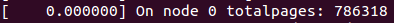
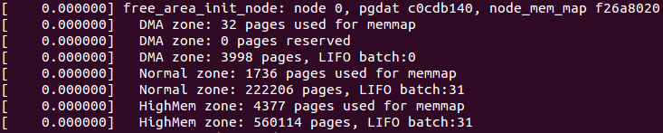

此处接前文, 分析 free\_area\_init\_nodes()函数最后部分, 分析其末尾的循环:

```
    for_each_online_node(nid) {

        pg_data_t *pgdat = NODE_DATA(nid);

        free_area_init_node(nid, NULL,

                find_min_pfn_for_node(nid), NULL);

        /* Any memory on that node */

        if (pgdat->node_present_pages)

            node_set_state(nid, N_MEMORY);

        check_for_memory(pgdat, nid);

    }
```

这里面的关键函数是 free\_area\_init\_node(), 其入参 find\_min\_pfn\_for\_node()用于获取 node 节点中最低的内存页框号.

而 free\_area\_init\_node()其实现:

```
# /mm/page_alloc.c

void __paginginit free_area_init_node(int nid, unsigned long *zones_size,
        unsigned long node_start_pfn, unsigned long *zholes_size)
{
    pg_data_t *pgdat = NODE_DATA(nid);
    unsigned long start_pfn = 0;
    unsigned long end_pfn = 0;

    /* pg_data_t should be reset to zero when it's allocated */
    WARN_ON(pgdat->nr_zones || pgdat->classzone_idx);

    pgdat->node_id = nid;
    pgdat->node_start_pfn = node_start_pfn;
    init_zone_allows_reclaim(nid);
#ifdef CONFIG_HAVE_MEMBLOCK_NODE_MAP
    get_pfn_range_for_nid(nid, &start_pfn, &end_pfn);
#endif
    calculate_node_totalpages(pgdat, start_pfn, end_pfn,
                  zones_size, zholes_size);

    alloc_node_mem_map(pgdat);
#ifdef CONFIG_FLAT_NODE_MEM_MAP
    printk(KERN_DEBUG "free_area_init_node: node %d, pgdat %08lx, node_mem_map %08lx\n",
        nid, (unsigned long)pgdat,
        (unsigned long)pgdat->node_mem_map);
#endif

    free_area_init_core(pgdat, start_pfn, end_pfn,
                zones_size, zholes_size);
}
```

该函数中, 其中 init\_zone\_allows\_reclaim()用于计算评估内存管理区是否可回收以及合适的 node 节点数, 如果非 NUMA 环境, 则该函数为空. 而基于 CONFIG\_HAVE\_MEMBLOCK\_NODE\_MAP 的配置下, 接下来将是 get\_pfn\_range\_for\_nid():

```
# /mm/page_alloc.c

/**
 * get_pfn_range_for_nid - Return the start and end page frames for a node
 * @nid: The nid to return the range for. If MAX_NUMNODES, the min and max PFN are returned.
 * @start_pfn: Passed by reference. On return, it will have the node start_pfn.
 * @end_pfn: Passed by reference. On return, it will have the node end_pfn.
 *
 * It returns the start and end page frame of a node based on information
 * provided by an arch calling add_active_range(). If called for a node
 * with no available memory, a warning is printed and the start and end
 * PFNs will be 0.
 */
void __meminit get_pfn_range_for_nid(unsigned int nid,
            unsigned long *start_pfn, unsigned long *end_pfn)
{
    unsigned long this_start_pfn, this_end_pfn;
    int i;

    *start_pfn = -1UL;
    *end_pfn = 0;

    for_each_mem_pfn_range(i, nid, &this_start_pfn, &this_end_pfn, NULL) {
        *start_pfn = min(*start_pfn, this_start_pfn);
        *end_pfn = max(*end_pfn, this_end_pfn);
    }

    if (*start_pfn == -1UL)
        *start_pfn = 0;
}
```

此函数主要是将内存 node 节点的起始和末尾页框号返回给接下来的 calculate\_node\_totalpages()来使用.

calculate\_node\_totalpages()实现:

```
# /mm/page_alloc.c

static void __meminit calculate_node_totalpages(struct pglist_data *pgdat,
                        unsigned long node_start_pfn,
                        unsigned long node_end_pfn,
                        unsigned long *zones_size,
                        unsigned long *zholes_size)
{
    unsigned long realtotalpages, totalpages = 0;
    enum zone_type i;

    for (i = 0; i < MAX_NR_ZONES; i++)
        totalpages += zone_spanned_pages_in_node(pgdat->node_id, i,
                             node_start_pfn,
                             node_end_pfn,
                             zones_size);
    pgdat->node_spanned_pages = totalpages;

    realtotalpages = totalpages;
    for (i = 0; i < MAX_NR_ZONES; i++)
        realtotalpages -=
            zone_absent_pages_in_node(pgdat->node_id, i,
                          node_start_pfn, node_end_pfn,
                          zholes_size);
    pgdat->node_present_pages = realtotalpages;
    printk(KERN_DEBUG "On node %d totalpages: %lu\n", pgdat->node_id,
                            realtotalpages);
}
```

其中 zone\_spanned\_pages\_in\_node():

```
# /mm/page_alloc.c

/*
 * Return the number of pages a zone spans in a node, including holes
 * present_pages = zone_spanned_pages_in_node() - zone_absent_pages_in_node()
 */
static unsigned long __meminit zone_spanned_pages_in_node(int nid,
                    unsigned long zone_type,
                    unsigned long node_start_pfn,
                    unsigned long node_end_pfn,
                    unsigned long *ignored)
{
    unsigned long zone_start_pfn, zone_end_pfn;

    /* Get the start and end of the zone */
    zone_start_pfn = arch_zone_lowest_possible_pfn[zone_type];
    zone_end_pfn = arch_zone_highest_possible_pfn[zone_type];
    adjust_zone_range_for_zone_movable(nid, zone_type,
                node_start_pfn, node_end_pfn,
                &zone_start_pfn, &zone_end_pfn);

    /* Check that this node has pages within the zone's required range */
    if (zone_end_pfn < node_start_pfn || zone_start_pfn > node_end_pfn)
        return 0;

    /* Move the zone boundaries inside the node if necessary */
    zone_end_pfn = min(zone_end_pfn, node_end_pfn);
    zone_start_pfn = max(zone_start_pfn, node_start_pfn);

    /* Return the spanned pages */
    return zone_end_pfn - zone_start_pfn;
}
```

其主要是统计 node 管理节点的内存跨度, 该跨度不包括 movable 管理区的, 里面调用的 adjust\_zone\_range\_for\_zone\_movable()则是用于剔除 movable 管理区的部分.

另外的 zone\_absent\_pages\_in\_node():

```
# /mm/page_alloc.c

/* Return the number of page frames in holes in a zone on a node */
static unsigned long __meminit zone_absent_pages_in_node(int nid,
                    unsigned long zone_type,
                    unsigned long node_start_pfn,
                    unsigned long node_end_pfn,
                    unsigned long *ignored)
{
    unsigned long zone_low = arch_zone_lowest_possible_pfn[zone_type];
    unsigned long zone_high = arch_zone_highest_possible_pfn[zone_type];
    unsigned long zone_start_pfn, zone_end_pfn;

    zone_start_pfn = clamp(node_start_pfn, zone_low, zone_high);
    zone_end_pfn = clamp(node_end_pfn, zone_low, zone_high);

    adjust_zone_range_for_zone_movable(nid, zone_type,
            node_start_pfn, node_end_pfn,
            &zone_start_pfn, &zone_end_pfn);
    return __absent_pages_in_range(nid, zone_start_pfn, zone_end_pfn);
}
```

该函数主要用于计算内存空洞页面数的. 完了将会得到物理页面总数并在 calculate\_node\_totalpages()中将页面总数打印出来:



紧接着在 free\_area\_init\_node()调用的是 alloc\_node\_mem\_map():

```
# /mm/page_alloc.c

static void __init_refok alloc_node_mem_map(struct pglist_data *pgdat)
{
    /* Skip empty nodes */
    if (!pgdat->node_spanned_pages)
        return;

#ifdef CONFIG_FLAT_NODE_MEM_MAP
    /* ia64 gets its own node_mem_map, before this, without bootmem */
    if (!pgdat->node_mem_map) {
        unsigned long size, start, end;
        struct page *map;

        /*
         * The zone's endpoints aren't required to be MAX_ORDER
         * aligned but the node_mem_map endpoints must be in order
         * for the buddy allocator to function correctly.
         */
        start = pgdat->node_start_pfn & ~(MAX_ORDER_NR_PAGES - 1);
        end = pgdat_end_pfn(pgdat);
        end = ALIGN(end, MAX_ORDER_NR_PAGES);
        size = (end - start) * sizeof(struct page);
        map = alloc_remap(pgdat->node_id, size);
        if (!map)
            map = memblock_virt_alloc_node_nopanic(size,
                                   pgdat->node_id);
        pgdat->node_mem_map = map + (pgdat->node_start_pfn - start);
    }
#ifndef CONFIG_NEED_MULTIPLE_NODES
    /*
     * With no DISCONTIG, the global mem_map is just set as node 0's
     */
    if (pgdat == NODE_DATA(0)) {
        mem_map = NODE_DATA(0)->node_mem_map;
#ifdef CONFIG_HAVE_MEMBLOCK_NODE_MAP
        if (page_to_pfn(mem_map) != pgdat->node_start_pfn)
            mem_map -= (pgdat->node_start_pfn - ARCH_PFN_OFFSET);
#endif /* CONFIG_HAVE_MEMBLOCK_NODE_MAP */
    }
#endif
#endif /* CONFIG_FLAT_NODE_MEM_MAP */
}
```

其主要将 calculate\_node\_totalpages()统计所得的内存页面信息进行内存空间申请.

得到内存空间后, 初始化工作将交由 free\_area\_init\_core():

```
# /mm/page_alloc.c

/*
 * Set up the zone data structures:
 * - mark all pages reserved
 * - mark all memory queues empty
 * - clear the memory bitmaps
 *
 * NOTE: pgdat should get zeroed by caller.
 */
static void __paginginit free_area_init_core(struct pglist_data *pgdat,
        unsigned long node_start_pfn, unsigned long node_end_pfn,
        unsigned long *zones_size, unsigned long *zholes_size)
{
    enum zone_type j;
    int nid = pgdat->node_id;
    unsigned long zone_start_pfn = pgdat->node_start_pfn;
    int ret;

    pgdat_resize_init(pgdat);
#ifdef CONFIG_NUMA_BALANCING
    spin_lock_init(&pgdat->numabalancing_migrate_lock);
    pgdat->numabalancing_migrate_nr_pages = 0;
    pgdat->numabalancing_migrate_next_window = jiffies;
#endif
    init_waitqueue_head(&pgdat->kswapd_wait);
    init_waitqueue_head(&pgdat->pfmemalloc_wait);
    pgdat_page_cgroup_init(pgdat);

    for (j = 0; j < MAX_NR_ZONES; j++) {
        struct zone *zone = pgdat->node_zones + j;
        unsigned long size, realsize, freesize, memmap_pages;

        size = zone_spanned_pages_in_node(nid, j, node_start_pfn,
                          node_end_pfn, zones_size);
        realsize = freesize = size - zone_absent_pages_in_node(nid, j,
                                node_start_pfn,
                                node_end_pfn,
                                zholes_size);

        /*
         * Adjust freesize so that it accounts for how much memory
         * is used by this zone for memmap. This affects the watermark
         * and per-cpu initialisations
         */
        memmap_pages = calc_memmap_size(size, realsize);
        if (freesize >= memmap_pages) {
            freesize -= memmap_pages;
            if (memmap_pages)
                printk(KERN_DEBUG
                       " %s zone: %lu pages used for memmap\n",
                       zone_names[j], memmap_pages);
        } else
            printk(KERN_WARNING
                " %s zone: %lu pages exceeds freesize %lu\n",
                zone_names[j], memmap_pages, freesize);

        /* Account for reserved pages */
        if (j == 0 && freesize > dma_reserve) {
            freesize -= dma_reserve;
            printk(KERN_DEBUG " %s zone: %lu pages reserved\n",
                    zone_names[0], dma_reserve);
        }

        if (!is_highmem_idx(j))
            nr_kernel_pages += freesize;
        /* Charge for highmem memmap if there are enough kernel pages */
        else if (nr_kernel_pages > memmap_pages * 2)
            nr_kernel_pages -= memmap_pages;
        nr_all_pages += freesize;

        zone->spanned_pages = size;
        zone->present_pages = realsize;
        /*
         * Set an approximate value for lowmem here, it will be adjusted
         * when the bootmem allocator frees pages into the buddy system.
         * And all highmem pages will be managed by the buddy system.
         */
        zone->managed_pages = is_highmem_idx(j) ? realsize : freesize;
#ifdef CONFIG_NUMA
        zone->node = nid;
        zone->min_unmapped_pages = (freesize*sysctl_min_unmapped_ratio)
                        / 100;
        zone->min_slab_pages = (freesize * sysctl_min_slab_ratio) / 100;
#endif
        zone->name = zone_names[j];
        spin_lock_init(&zone->lock);
        spin_lock_init(&zone->lru_lock);
        zone_seqlock_init(zone);
        zone->zone_pgdat = pgdat;
        zone_pcp_init(zone);

        /* For bootup, initialized properly in watermark setup */
        mod_zone_page_state(zone, NR_ALLOC_BATCH, zone->managed_pages);

        lruvec_init(&zone->lruvec);
        if (!size)
            continue;

        set_pageblock_order();
        setup_usemap(pgdat, zone, zone_start_pfn, size);
        ret = init_currently_empty_zone(zone, zone_start_pfn,
                        size, MEMMAP_EARLY);
        BUG_ON(ret);
        memmap_init(size, nid, j, zone_start_pfn);
        zone_start_pfn += size;
    }
}
```

该函数主要用于设置了内存管理节点的管理结构体, 包括 pgdat\_resize\_init()初始化锁资源、init\_waitqueue\_head()初始内存队列、pgdat\_page\_cgroup\_init()控制组群初始化.

而在 for 循环内, 循环遍历统计各个管理区最大跨度间相差的页面数 size 以及除去内存"空洞"后的实际页面数 realsize,然后通过 calc\_memmap\_size()计算出该管理区所需的页面管理结构占用的页面数 memmap\_pages, 最后可以计算得除高端内存外的系统内存共有的内存页面数 nr\_kernel\_pages(用于统计所有一致映射的页); 此外循环体内的操作则是初始化内存管理区的管理结构, 例如各类锁的初始化、队列初始化. 值得注意的是 zone\_pcp\_init()是初始化冷热页分配器的, mod\_zone\_page\_state()用于计算更新管理区的状态统计, lruvec\_init()则是初始化 LRU 算法使用的链表和保护锁, 而 set\_pageblock\_order()用于在 CONFIG\_HUGETLB\_PAGE\_SIZE\_VARIABLE 配置下设置 pageblock\_order 值的; 此外 setup\_usemap()函数则是主要是为了给 zone 管理结构体中的 pageblock\_flags 申请内存空间, pageblock\_flags 与伙伴系统的碎片迁移算法有关. 而 init\_currently\_empty\_zone()则主要初始化管理区的等待队列哈希表和等待队列, 同时还初始化了与伙伴系统相关的 free\_aera 列表.

中间有部分日志记录可以通过 dmesg 查看到:



在 free\_area\_init\_core()的最后, 着重分析一下 memmap\_init():

```
# /mm/page_alloc.c

#define memmap_init(size, nid, zone, start_pfn) \
    memmap_init_zone((size), (nid), (zone), (start_pfn), MEMMAP_EARLY)
```

其对应的是 memmap\_init\_zone():

```
# /mm/page_alloc.c

/*
 * Initially all pages are reserved - free ones are freed
 * up by free_all_bootmem() once the early boot process is
 * done. Non-atomic initialization, single-pass.
 */
void __meminit memmap_init_zone(unsigned long size, int nid, unsigned long zone,
        unsigned long start_pfn, enum memmap_context context)
{
    struct page *page;
    unsigned long end_pfn = start_pfn + size;
    unsigned long pfn;
    struct zone *z;

    if (highest_memmap_pfn < end_pfn - 1)
        highest_memmap_pfn = end_pfn - 1;

    z = &NODE_DATA(nid)->node_zones[zone];
    for (pfn = start_pfn; pfn < end_pfn; pfn++) {
        /*
         * There can be holes in boot-time mem_map[]s
         * handed to this function. They do not
         * exist on hotplugged memory.
         */
        if (context == MEMMAP_EARLY) {
            if (!early_pfn_valid(pfn))
                continue;
            if (!early_pfn_in_nid(pfn, nid))
                continue;
        }
        page = pfn_to_page(pfn);
        set_page_links(page, zone, nid, pfn);
        mminit_verify_page_links(page, zone, nid, pfn);
        init_page_count(page);
        page_mapcount_reset(page);
        page_cpupid_reset_last(page);
        SetPageReserved(page);
        /*
         * Mark the block movable so that blocks are reserved for
         * movable at startup. This will force kernel allocations
         * to reserve their blocks rather than leaking throughout
         * the address space during boot when many long-lived
         * kernel allocations are made. Later some blocks near
         * the start are marked MIGRATE_RESERVE by
         * setup_zone_migrate_reserve()
         *
         * bitmap is created for zone's valid pfn range. but memmap
         * can be created for invalid pages (for alignment)
         * check here not to call set_pageblock_migratetype() against
         * pfn out of zone.
         */
        if ((z->zone_start_pfn <= pfn)
            && (pfn < zone_end_pfn(z))
            && !(pfn & (pageblock_nr_pages - 1)))
            set_pageblock_migratetype(page, MIGRATE_MOVABLE);

        INIT_LIST_HEAD(&page->lru);
#ifdef WANT_PAGE_VIRTUAL
        /* The shift won't overflow because ZONE_NORMAL is below 4G. */
        if (!is_highmem_idx(zone))
            set_page_address(page, __va(pfn << PAGE_SHIFT));
#endif
    }
}
```

该函数主要根据页框号 pfn 通过 pfn\_to\_page()查找到页面管理结构 page, 而后面的操作则是对该页面的管理结构 page 进行初始化.

至此, free\_area\_init\_node()的初始化操作执行完毕, 据前面分析可以知道其主要是将整个 linux 物理内存管理框架进行初始化, 包括管理节点 node、管理区 zone 以及页面管理 page 等数据的初始化.

回到本文主题, 循环体内最后的两个函数 node\_set\_state()和 check\_for\_memory(). node\_set\_state()主要是对 node 节点进行状态设置, 而 check\_for\_memory()则是做内存检查.

至此, 内存管理框架构建完毕.