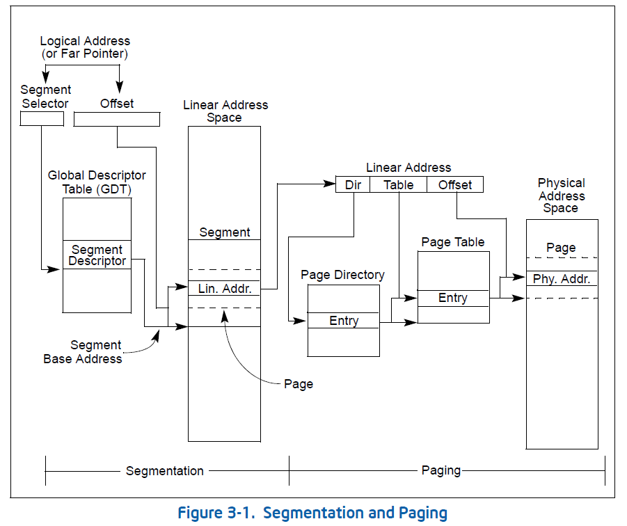

本文主要总结一下 Intel 的 x86 架构处理器所支持各式内存映射情况.

### 实模式

实模式下, 没有什么内存映射的概念, 逻辑地址简单地转换一下就是物理地址.

实模式下的逻辑地址表现形式为[Base: Offset](即[基地址: 偏移量], 虽然 Base 类似于保护模式下的段选择符, 但是实模式下, 它仅表示基地址, 无任何的段选择作用), 逻辑地址转换物理地址的方式为:

> (Base << 4) + Offset = Linear Address = Physical Address

由于实模式下无任何分页映射, 线性地址即为物理地址.

即如下图:

基地址和偏移量都是 16bit 的数据, 按照计算公式转换, 应该可以访问内存范围为: 0x0–0x10ffef. 但是在最初的 8086 仅有 20 条地址总线, 也就是意味着寻址能力只有 0x0-0xfffff(即 1M 地址空间). 那么 0x100000-0x10ffef 的内存则是被迂回到对应 0x0-0xffef 这段物理内存, 也有的地方称之为 wrap-around. 如下图所示:

随着处理器的更新换代地址总线早已超过了 20 条(其实 80286 就已经 24 条地址总线了), 如今已到了 64 条甚至更多. 但是在 80286 引入的时候, 其 24 条地址总线已经扩展到可以使用 16M 的内存了, 完全超出 1M 的空间范围了, 但是为了保持系统表现行为和 8086 一致, 于是乎引入了 A20 总线, 称之为 A20 Gate, **通过控制 A20 总线来达到控制处理器兼容 8086**. 当 A20 Gate 打开时, 操作 100000H-10FFEFH 之间的地址的时候, 系统将真正访问这块内存区域; 如果 A20 Gate 禁止时, 则操作 100000H-10FFEFH 之间的地址的时候, 系统仍然使用 8086/8088 的方式.

这也就是实模式下在内存访问操作中仅有的差异之处.

### 保护模式

已知 x86 内存映射, 分为段式映射和段页式映射. 页式映射是基于段式映射上实现的.

#### 段式映射

仅使能段式映射的时候, 逻辑地址为[段选择符: 偏移量], 仅需要经过段式映射即可等到物理地址. 过程如图:

如果开启分页机制, 那么线性地址经过页全局目录和页表成物理地址; 如果无分页机制, 那么线性地址就直接是物理地址了. 所以只需要通过段选择符查描述符表找到基地址再加上偏移量, 即可得到目标物理地址.

使能段式映射仅需要使能保护模式即可, 即设置 CR0 寄存器的 PE 位(Protection Enable). 这也是保护模式和实模式之间切换的标志位, 进入保护模式后, 段式映射是默认使能的.

#### 段页式映射

段页式映射则是段式映射转换后得到的线性地址再进行页式映射即可. 如图:

而控制页式映射和相关特性使能都在于以下相关寄存器的相关标志位中:

- 控制寄存器 CR0 的 WP(bit 16)和 PG(bit 31)标志位;
- 控制寄存器 CR4 的 PSE(bit 4)、PAE(bit 5)、PGE(bit 7)、PCIDE(bit 17)和 SMEP(bit 20)标志位;
- IA32_EFER 特别模块寄存器(MSR, Model specific registers)的 LME(bit 8)和 NXE(bit 11)标志位;

(以上信息是来自 2014 年的 Intel 手册)

标志位具体如下图所示:

基于保护模式的情况下(即 CR0.PE 置位时), 开启页式映射, 仅需要设置 CR0.PG 标志位即可开启分页模式. 而一旦 CR0.PG 该标志位置位后, 将会启用三种分页映射模式中的一种, 具体的模式还取决于 CR4.PAE 和 IA32_EFER.LME 的设置. 根据不同的标志位设置, 可以其中可以分为以下三种:

- 32-bit 分页模式: CR0.PG 置位, CR4.PAE 清零的情况;

- PAE 分页模式: CR0.PG 和 CR4.PAE 置位, 而 IA32_EFER.LME 清零的情况;

- IA-32e 分页模式: CR0.PG、CR4.PAE、IA32_EFER.LME 一同置位的情况.

以上三种模式的差异具体说明如图:

而三种分页模式的分页结构如图:

可以看到仅 IA-32e 分页模式是采用了四级分页映射模型, 而 32-bit 和 PAE 均采用了三级分页映射模型. 具体模型差异, 后面再细述.

最后附上以上三种模式相互间的转换图:

模式间的转换细节这里就不详述了, 具体可以参考 Intel 手册

回顾前面归纳的分页模式相关的寄存器标志位, 除了 CR0.PG、CR4.PAE、IA32\_EFER.LME 之外, 其他标志位的作用如下:

- CR0.WP: allows pages to be protected from supervisor-mode writes.写保护标志位, 允许页面从超级用户模式转为保护模式. 当 CR0.WP 为 0 时, 数据可以通过映射转换写到任何线性地址中; 当 CR0.WP 为 1 时, 数据仅可以写入标志为可读写的页面.
- CR4.PSE: enables 4-MByte pages for 32-bit paging.页大小扩展标志位(Page Size Extension), 使能 32-bit 分页使用 4MByte 大小页面. 当 CR4.PSE 为 0 时, 32-bit 分页仅能使用 4Kbyte 大小页面; 当 CR4.PSE 为 1 时,32-bit 分页既可以使用 4Kbyte 大小页面, 也可以使用 4MByte 大小页面. (注: PAE 分页模式和 IA-32e 分页模式无需 CR4.PSE 的情况下可以使用多种页面大小).
- CR4.PGE: enables global pages.用于启用全局页面. 当 CR4.PGE 为 0 时, 功能未开启; 当 CR4.PGE 为 1 时, 功能开启, 设置在转换页表项中的全局位(G Flag), 标记也是全局的, TLB 更新的时候, 将会忽略该转换项使之得到保留.
- CR4:PCIDE: enables process-context identifiers (PCIDs) for IA-32e paging (CR4.PCIDE can be 1 only when IA-32e
paging is in use).进程上下文标识位(process-context identifiers), 用于在 IA-32e 分页模式下. 其允许逻辑处理器缓存多线性地址空间的的信息.
- CR4.SMEP: allows pages to be protected from supervisor-mode instruction fetches.超级用户保护模式, 用于保护页面不被超级模式下的指令取操作. 当 CR4.SMEP 为 1 时, 超级用户模式下的软件操作不可以从用户模式可访问的线性地址空间中取指令.
- IA32\_EFER.NXE: enables execute-disable access rights for PAE paging and IA-32e paging.用于使能 PAE 和 IA-32e 分页模式下禁止执行访问权限. 当 IA32_EFER.NXE 为 1 时, 指定的线性地址将会得到预取指令的保护, 但不影响同地址的数据读取. 该设置仅在 PAE 和 IA-32e 分页模式下有效, 对 32-bit 分页模式无效.
- CR4.SMAP allows pages to be protected from supervisor-mode data accesses.
- CR4.PKE allows each linear address to be associated with a protection key.
- PAE: physical-address extension.
- PAT: page-attribute table.
- PSE-36: page-size extensions with 40-bit physical-address extension.
- PKU: protection keys.
- NX: execute disable.
- Page1GB: 1-GByte pages.
- LM: IA-32e mode support.

回归分页模式, 往下细分, 分析一下各分页模式的细节:

#### 32-bit 分页模式

基于 CR0.PG 为 1, 而 CR4.PAE、IA32_EFER.LME 为 0 的情况下.

**4-KByte**大小页面地址转换模式:

当 CR4.PSE 为 0 或者 PDE(Page Directory Entry, 页目录项中)中的 PS(Page Size)标志位为 0 时, 则是该线性地址的映射模式了.

**4-MByte**大小页面地址转换模式:

该映射模式需要 CR4.PSE 和 PDE 中的 PS 标志位同时为 1 的时候.

仔细看一下 4-MByte 大小页面映射模式, 其**物理地址可以达到 40bit, 意味着可访问内存达到了 1TByte**, 不过**其线性地址仍然是 32bit**, 也就表示其在同一时刻只能最大只能够访问 4GByte 的内存空间. 也就是说即便内存被扩展为 1TByte, 所有内存也都可以被使用, 但是某个程序其只能够使用 4GByte 而已(**因为进程使用的只是虚拟地址, 也就是这里的线性地址, 不直接使用物理地址！！！**), 作用很明显, 就是**为了满足 IA32 多进程环境, 每个进程都可以使用 4GByte 的内存而已**.

附 32-bit 分页模式下的 CR3 及各级页映射结构概要图:

#### PAE 分页模式

基于 CR0.PG、CR4.PAE 为 1, 而 IA32_EFER.LME 为 0 的情况下.

4-KByte 大小页面地址转换模式:

当 PDE 的 PS 标志位为 0 的时候, 为 4-Kbyte 大小页面.

2-MByte 大小页面地址转换模式:

当 PDE 的 PS 标志位为 1 的时候, 启用 2-MByte 大小页面.

**PAE 分页模式下, 物理地址都为 52bit, 表示可访问内存空间为 4PBytes**, 但是类似 32-bit 分页模式, **其线性地址为 32bit, 所以注定在同一时刻最大仅能够访问 4GByte 的内存**.

附 PAE 分页模式下的 CR3 及各级页映射结构概要图:

#### IA-32e 分页模式

基于 CR0.PG、CR4.PAE、IA32_EFER.LME 同时为 1 的情况下.

4-KByte 大小页面地址转换模式:

当 PDE 的 PS 标志位为 0 时, 使用该模式.

2-MByte 大小页面地址转换模式:

当 PDE 的 PS 标志位为 1 时, 则为 2-MByte 大小页面模式.

1-GByte 大小页面地址转换模式:

当 PDPTE 的 PS 标志位为 1 时, 则采用的是 1-GByte 大小页面模式.

注: **IA-32e 分页模式实际上就是 x86-64 环境的页面线性地址映射的称呼方式. 值得注意的是 x86-64 的线性地址不是 64bit, 而是 48bit, 物理地址也不是, 物理地址是 52bit. 不过由于线性地址是 48bit, 也就注定该模式下, 同一时刻最大可访问内存空间是 256 TBytes**.

附 IA-32e 分页模式下的 CR3 及各级页映射结构概要图:

更多详细信息建议阅读 Intel 手册.