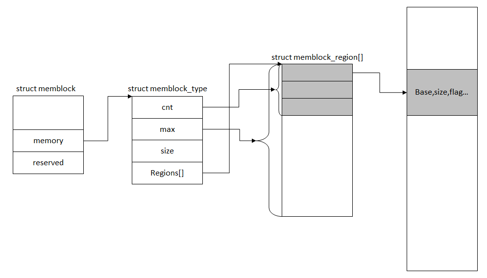

结束完 memblock 算法初始化前的准备工作, 回到 memblock 算法初始化及其算法实现上面. memblock 是一个很简单的算法.

memblock 算法的实现是, **它将所有状态都保存在一个全局变量\_\_initdata\_memblock 中, 算法的初始化以及内存的申请释放都是在将内存块的状态做变更. 那么从数据结构入手, \_\_initdata\_memblock 是一个 memblock 结构体**. 其结构体定义:

```
# /include/linux/memblock.h

struct memblock {
    bool bottom_up; /* is bottom up direction? */
    phys_addr_t current_limit;
    struct memblock_type memory;
    struct memblock_type reserved;
};
```

结构体内各成员的意思:

bottom_up: 用来表示分配器分配内存是自低地址(低地址指的是内核映像尾部, 下同)向高地址还是自高地址向低地址来分配的;

current\_limit: 用来表示用来限制 memblock\_alloc()和 memblock\_alloc\_base(..., MEMBLOCK\_ALLOC\_ACCESSIBLE)的内存申请;

memory: 表示可用可分配的内存;

reserved: 表示已经分配出去了的内存;

memory 和 reserved 是很关键的一个数据结构, memblock 算法的内存初始化和申请释放都是围绕着它们转.

往下看看 memory 和 reserved 的结构体 memblock\_type 定义:

```
# /include/linux/memblock.h

struct memblock_type {
    unsigned long cnt; /* number of regions */
    unsigned long max; /* size of the allocated array */
    phys_addr_t total_size; /* size of all regions */
    struct memblock_region *regions;
};
```

cnt 和 max 分别表示当前状态(memory/reserved)的内存块可用数和可支持的最大数, total\_size 则表示当前状态(memory/reserved)的空间大小(也就是可用的内存块信息大小总和), 而 regions 则是用于保存内存块信息的结构(包括基址、大小和标记等):

```
# /include/linux/memblock.h

struct memblock_region {
    phys_addr_t base;
    phys_addr_t size;
    unsigned long flags;
#ifdef CONFIG_HAVE_MEMBLOCK_NODE_MAP
    int nid;
#endif
};
```

memblock 算法的主要结构体也就这么多了, 总的关系如图:



回去看看\_\_initdata\_memblock 的定义:

```
# /mm/memblock.c

static struct memblock_region memblock_memory_init_regions[INIT_MEMBLOCK_REGIONS] __initdata_memblock;
static struct memblock_region memblock_reserved_init_regions[INIT_MEMBLOCK_REGIONS] __initdata_memblock;

struct memblock memblock __initdata_memblock = {
    .memory.regions = memblock_memory_init_regions,
    .memory.cnt = 1, /* empty dummy entry */
    .memory.max = INIT_MEMBLOCK_REGIONS,

    .reserved.regions = memblock_reserved_init_regions,
    .reserved.cnt = 1, /* empty dummy entry */
    .reserved.max = INIT_MEMBLOCK_REGIONS,

    .bottom_up = false,
    .current_limit = MEMBLOCK_ALLOC_ANYWHERE,
};
```

它初始化了部分成员, 表示内存申请自高地址向低地址, 且 current_limit 设为\~0, 即 0xFFFFFFFF, 同时通过全局变量定义为 memblock 的算法管理中的 memory 和 reserved 准备了内存空间.

接下来分析一下 memblock 算法初始化, 其初始化函数为 memblock\_x86\_fill(), 初始化调用栈位置:

```
start_kernel()                         #/init/main.c

└->setup_arch()                        #/arch/x86/kernel/setup.c

└->memblock_x86_fill()                 #/arch/x86/kernel/e820.c
```

函数实现:

```
# /arch/x86/kernel/e820.c

void __init memblock_x86_fill(void)
{
    int i;
    u64 end;

    /*
     * EFI may have more than 128 entries
     * We are safe to enable resizing, beause memblock_x86_fill()
     * is rather later for x86
     */
    memblock_allow_resize();

    for (i = 0; i < e820.nr_map; i++) {
        struct e820entry *ei = &e820.map[i];

        end = ei->addr + ei->size;
        if (end != (resource_size_t)end)
            continue;

        if (ei->type != E820_RAM && ei->type != E820_RESERVED_KERN)
            continue;

        memblock_add(ei->addr, ei->size);
    }

    /* throw away partial pages */
    memblock_trim_memory(PAGE_SIZE);

    memblock_dump_all();
}
```

该函数的实现中, 调用了 memblock\_allow\_resize() 仅是用于置 memblock\_can\_resize 的值(等于 1); 里面的 for 则是用于循环遍历 e820 的内存布局信息, 将信息做 memblock\_add 的操作; 最后循环退出后, 将调用 memblock\_trim\_memory()和 memblock\_dump\_all()做后处理. 这里首先看一下 memblock\_add()的函数实现:

```cpp
// /mm/memblock.c

int __init_memblock memblock_add(phys_addr_t base, phys_addr_t size)
{
    return memblock_add_region(&memblock.memory, base, size,
                   MAX_NUMNODES, 0);
}

// include/linux/numa.h
#ifdef CONFIG_NODES_SHIFT
#define NODES_SHIFT     CONFIG_NODES_SHIFT
#else
#define NODES_SHIFT     0
#endif

#define MAX_NUMNODES    (1 << NODES_SHIFT)
```

memblock\_add()主要封装了 memblock\_add\_region(), 特别需要留意它操作对象是 memblock.memory(可用可分配的内存), 可以推测其意图是将 e820 的内存信息往这里添加, nid 使用的是**MAX\_NUMNODES(最大节点数<0 如果 CONFIG\_NODES\_SHIFT 没有在配置文件中设置, 不然就是 2^CONFIG\_NODES\_SHIFT**>)

**所以 e820 信息添加到 memblock 阶段是不涉及区分 node 的！！！**

```
// arch/x86/Kconfig

config NODES_SHIFT
    int "Maximum NUMA Nodes (as a power of 2)" if !MAXSMP
    range 1 10
    default "10" if MAXSMP
    default "6" if X86_64
    default "3"
    depends on NEED_MULTIPLE_NODES
    ---help---
      Specify the maximum number of NUMA Nodes available on the target
      system.  Increases memory reserved to accommodate various tables.
```

这样配置的结果就是生成的 autoconf.h(**include/generated/autoconf.h**)定义了#define CONFIG\_NODES\_SHIFT 10 等值, 所以**所有的调用 memblock\_add 函数的都是属于 node: 2^CONFIG\_NODES\_SHIFT(还有一个函数叫 memblock\_add\_node,会传入 nid！！！不过不是这儿使用！！**！)

接着往下看 memblock\_add\_region()的实现:

```
# /mm/memblock.c

/**
 * memblock_add_region - add new memblock region
 * @type: memblock type to add new region into
 * @base: base address of the new region
 * @size: size of the new region
 * @nid: nid of the new region
 * @flags: flags of the new region
 *
 * Add new memblock region [@base,@base+@size) into @type. The new region
 * is allowed to overlap with existing ones - overlaps don't affect already
 * existing regions. @type is guaranteed to be minimal (all neighbouring
 * compatible regions are merged) after the addition.
 *
 * RETURNS:
 * 0 on success, -errno on failure.
 */
static int __init_memblock memblock_add_region(struct memblock_type *type,
                phys_addr_t base, phys_addr_t size,
                int nid, unsigned long flags)
{
    bool insert = false;
    phys_addr_t obase = base;
    phys_addr_t end = base + memblock_cap_size(base, &size);
    int i, nr_new;

    if (!size)
        return 0;

    /* special case for empty array */
    if (type->regions[0].size == 0) {
        WARN_ON(type->cnt != 1 || type->total_size);
        type->regions[0].base = base;
        type->regions[0].size = size;
        type->regions[0].flags = flags;
        memblock_set_region_node(&type->regions[0], nid);
        type->total_size = size;
        return 0;
    }
repeat:
    /*
     * The following is executed twice. Once with %false @insert and
     * then with %true. The first counts the number of regions needed
     * to accomodate the new area. The second actually inserts them.
     */
    base = obase;
    nr_new = 0;

    for (i = 0; i < type->cnt; i++) {
        struct memblock_region *rgn = &type->regions[i];
        phys_addr_t rbase = rgn->base;
        phys_addr_t rend = rbase + rgn->size;

        if (rbase >= end)
            break;
        if (rend <= base)
            continue;
        /*
         * @rgn overlaps. If it separates the lower part of new
         * area, insert that portion.
         */
        if (rbase > base) {
            nr_new++;
            if (insert)
                memblock_insert_region(type, i++, base,
                               rbase - base, nid,
                               flags);
        }
        /* area below @rend is dealt with, forget about it */
        base = min(rend, end);
    }

    /* insert the remaining portion */
    if (base < end) {
        nr_new++;
        if (insert)
            memblock_insert_region(type, i, base, end - base,
                           nid, flags);
    }

    /*
     * If this was the first round, resize array and repeat for actual
     * insertions; otherwise, merge and return.
     */
    if (!insert) {
        while (type->cnt + nr_new > type->max)
            if (memblock_double_array(type, obase, size) < 0)
                return -ENOMEM;
        insert = true;
        goto repeat;
    } else {
        memblock_merge_regions(type);
        return 0;
    }
}
```

分析一下 memblock\_add\_region()函数的行为流程:

1、 如果 memblock 算法管理内存为空的时候, 则将当前空间添加进去;

2、 不为空的情况下, 则先检查是否存在内存重叠的情况, 如果有的话, 则剔除重叠部分, 然后将其余非重叠的部分添加进去;

3、 如果出现 region[]数组空间不够的情况, 则通过 memblock\_double\_array()添加新的 region[]空间;

4、 最后通过 memblock\_merge\_regions()把紧挨着的内存合并了.

现在很明了, 可以看到其功能作用是把 e820 图里面的内存布局转换到 memblock 管理算法当中的 memblock.memory 进行管理, 表示该内存可用.

接着回到 memblock\_x86\_fill()退出 for 循环的两个后处理函数 memblock\_trim\_memory()和 memblock\_dump\_all(), 其中 memblock\_trim\_memory()的实现:

```
# /mm/memblock.c

void __init_memblock memblock_trim_memory(phys_addr_t align)
{
    int i;
    phys_addr_t start, end, orig_start, orig_end;
    struct memblock_type *mem = &memblock.memory;

    for (i = 0; i < mem->cnt; i++) {
        orig_start = mem->regions[i].base;
        orig_end = mem->regions[i].base + mem->regions[i].size;
        start = round_up(orig_start, align);
        end = round_down(orig_end, align);

        if (start == orig_start && end == orig_end)
            continue;

        if (start < end) {
            mem->regions[i].base = start;
            mem->regions[i].size = end - start;
        } else {
            memblock_remove_region(mem, i);
            i--;
        }
    }
}
```

该函数主要用于对 memblock.memory 做修整, 剔除不对齐的部分. 而最后 memblock\_dump\_all 则是将整理的信息做 dump 输出, 这里就不分析了.

至此 memblock 内存管理算是初始化完毕了. 接下来看一下算法的内存申请和释放的, memblock 算法下的内存申请和释放的接口分别为:

memblock\_alloc()和 memblock\_free().

memblock\_alloc()的函数实现(入参为 size 大小和 align 用于字节对齐):

```
# /mm/memblock.c

phys_addr_t __init memblock_alloc(phys_addr_t size, phys_addr_t align)
{
    return memblock_alloc_base(size, align, MEMBLOCK_ALLOC_ACCESSIBLE);
}
```

加上标示 MEMBLOCK\_ALLOC\_ACCESSIBLE 表示申请内存可访问, 封装调用 memblock\_alloc\_base():

```
# /mm/memblock.c

phys_addr_t __init memblock_alloc_base(phys_addr_t size, phys_addr_t align, phys_addr_t max_addr)
{
    phys_addr_t alloc;

    alloc = __memblock_alloc_base(size, align, max_addr);

    if (alloc == 0)
        panic("ERROR: Failed to allocate 0x%llx bytes below 0x%llx.\n",
              (unsigned long long) size, (unsigned long long) max_addr);

    return alloc;
}
```

继续\_\_memblock\_alloc\_base()(封装了 memblock\_alloc\_base\_nid(), **新增 NUMA\_NO\_NODE 入参表示无 NUMA 的节点！！！**, 毕竟当前**还没初始化到那一步**):

```
# /mm/memblock.c

phys_addr_t __init __memblock_alloc_base(phys_addr_t size, phys_addr_t align, phys_addr_t max_addr)
{
    return memblock_alloc_base_nid(size, align, max_addr, NUMA_NO_NODE);
}
```

继续 memblock\_alloc\_base\_nid():

```
# /mm/memblock.c

static phys_addr_t __init memblock_alloc_base_nid(phys_addr_t size,
                    phys_addr_t align, phys_addr_t max_addr,
                    int nid)
{
    phys_addr_t found;

    if (!align)
        align = SMP_CACHE_BYTES;

    found = memblock_find_in_range_node(size, align, 0, max_addr, nid);
    if (found && !memblock_reserve(found, size))
        return found;

    return 0;
}
```

这里主要留意两个关键函数 memblock\_find\_in\_range\_node()和 memblock\_reserve().

先看一下 memblock\_find\_in\_range\_node()的实现:

```
# /mm/memblock.c

/**
 * memblock_find_in_range_node - find free area in given range and node
 * @size: size of free area to find
 * @align: alignment of free area to find
 * @start: start of candidate range
 * @end: end of candidate range, can be %MEMBLOCK_ALLOC_{ANYWHERE|ACCESSIBLE}
 * @nid: nid of the free area to find, %NUMA_NO_NODE for any node
 *
 * Find @size free area aligned to @align in the specified range and node.
 *
 * When allocation direction is bottom-up, the @start should be greater
 * than the end of the kernel image. Otherwise, it will be trimmed. The
 * reason is that we want the bottom-up allocation just near the kernel
 * image so it is highly likely that the allocated memory and the kernel
 * will reside in the same node.
 *
 * If bottom-up allocation failed, will try to allocate memory top-down.
 *
 * RETURNS:
 * Found address on success, 0 on failure.
 */
phys_addr_t __init_memblock memblock_find_in_range_node(phys_addr_t size,
                    phys_addr_t align, phys_addr_t start,
                    phys_addr_t end, int nid)
{
    int ret;
    phys_addr_t kernel_end;

    /* pump up @end */
    if (end == MEMBLOCK_ALLOC_ACCESSIBLE)
        end = memblock.current_limit;

    /* avoid allocating the first page */
    start = max_t(phys_addr_t, start, PAGE_SIZE);
    end = max(start, end);
    kernel_end = __pa_symbol(_end);

    /*
     * try bottom-up allocation only when bottom-up mode
     * is set and @end is above the kernel image.
     */
    if (memblock_bottom_up() && end > kernel_end) {
        phys_addr_t bottom_up_start;

        /* make sure we will allocate above the kernel */
        bottom_up_start = max(start, kernel_end);

        /* ok, try bottom-up allocation first */
        ret = __memblock_find_range_bottom_up(bottom_up_start, end,
                              size, align, nid);
        if (ret)
            return ret;

        /*
         * we always limit bottom-up allocation above the kernel,
         * but top-down allocation doesn't have the limit, so
         * retrying top-down allocation may succeed when bottom-up
         * allocation failed.
         *
         * bottom-up allocation is expected to be fail very rarely,
         * so we use WARN_ONCE() here to see the stack trace if
         * fail happens.
         */
        WARN_ONCE(1, "memblock: bottom-up allocation failed, "
                 "memory hotunplug may be affected\n");
    }

    return __memblock_find_range_top_down(start, end, size, align, nid);
}
```

粗略讲解一下, 判断 end 的范围, 从前面调用关系跟下来, end 其实就是 MEMBLOCK\_ALLOC\_ACCESSIBLE, 由此一来, 将会设置为 memblock.current\_limit. 紧接着对 start 做调整, 为的是避免申请到第一个页面. memblock\_bottom\_up()返回的是 memblock.bottom\_up, 前面初始化的时候也知道这个值是 false(这不是一定的, 在 numa 初始化时会设置为 true), 所以最后应该调用的是\_\_memblock\_find\_range\_top\_down()去查找内存. 看一下\_\_memblock\_find\_range\_top\_down()的实现:

```
# /mm/memblock.c

/**
 * __memblock_find_range_top_down - find free area utility, in top-down
 * @start: start of candidate range
 * @end: end of candidate range, can be %MEMBLOCK_ALLOC_{ANYWHERE|ACCESSIBLE}
 * @size: size of free area to find
 * @align: alignment of free area to find
 * @nid: nid of the free area to find, %NUMA_NO_NODE for any node
 *
 * Utility called from memblock_find_in_range_node(), find free area top-down.
 *
 * RETURNS:
 * Found address on success, 0 on failure.
 */
static phys_addr_t __init_memblock
__memblock_find_range_top_down(phys_addr_t start, phys_addr_t end,
                   phys_addr_t size, phys_addr_t align, int nid)
{
    phys_addr_t this_start, this_end, cand;
    u64 i;

    for_each_free_mem_range_reverse(i, nid, &this_start, &this_end, NULL) {
        this_start = clamp(this_start, start, end);
        this_end = clamp(this_end, start, end);

        if (this_end < size)
            continue;

        cand = round_down(this_end - size, align);
        if (cand >= this_start)
            return cand;
    }

    return 0;
}
```

\_\_memblock\_find\_range\_top\_down()通过使用 for\_each\_free\_mem\_range\_reverse 宏封装调用\_\_next\_free\_mem\_range\_rev()函数, 此函数逐一将 memblock.memory 里面的内存块信息提取出来与 memblock.reserved 的各项信息进行检验, 确保返回的 this\_start 和 this\_end 不会与 reserved 的内存存在交叉重叠的情况. 然后通过 clamp 取中间值, 判断大小是否满足, 满足的情况下, 将自末端向前(因为这是 top-down 申请方式)的 size 大小的空间的起始地址(前提该地址不会超出 this\_start)返回回去. 至此满足要求的内存块算是找到了.

多说一些, 其实\_\_memblock\_find\_range\_bottom\_up()和\_\_memblock\_find\_range\_top\_down()的查找内存实现是完全类似的, 仅在 down-top 和 top-down 上面存在差异罢了.

既然满足条件的内存块找到了, 那么回到 memblock\_alloc\_base\_nid()调用的另一个关键函数 memblock\_reserve():

```
# /mm/memblock.c

int __init_memblock memblock_reserve(phys_addr_t base, phys_addr_t size)
{
    return memblock_reserve_region(base, size, MAX_NUMNODES, 0);
}
```

接着看一下 memblock\_reserve\_region():

```
# /mm/memblock.c

static int __init_memblock memblock_reserve_region(phys_addr_t base,
                           phys_addr_t size,
                           int nid,
                           unsigned long flags)
{
    struct memblock_type *_rgn = &memblock.reserved;

    memblock_dbg("memblock_reserve: [%#016llx-%#016llx] flags %#02lx %pF\n",
             (unsigned long long)base,
             (unsigned long long)base + size - 1,
             flags, (void *)_RET_IP_);

    return memblock_add_region(_rgn, base, size, nid, flags);
}
```

可以看到 memblock\_reserve\_region()是通过 memblock\_add\_region()函数往 memblock.reserved 里面添加内存块信息.

最后看看 memblock 算法的 memblock\_free()实现:

```
# /mm/memblock.c

int __init_memblock memblock_free(phys_addr_t base, phys_addr_t size)
{
    memblock_dbg(" memblock_free: [%#016llx-%#016llx] %pF\n",
             (unsigned long long)base,
             (unsigned long long)base + size - 1,
             (void *)_RET_IP_);

    return __memblock_remove(&memblock.reserved, base, size);
}
```

该函数主要封装了\_\_memblock\_remove()用于对 memblock.reserved 的操作.

接着看\_\_memblock\_remove():

```
# /mm/memblock.c

static int __init_memblock __memblock_remove(struct memblock_type *type,
                         phys_addr_t base, phys_addr_t size)
{
    int start_rgn, end_rgn;
    int i, ret;

    ret = memblock_isolate_range(type, base, size, &start_rgn, &end_rgn);
    if (ret)
        return ret;

    for (i = end_rgn - 1; i >= start_rgn; i--)
        memblock_remove_region(type, i);
    return 0;
}
```

该函数主要调用两个关键函数 memblock\_isolate\_range()和 memblock\_remove\_region(). 先看一下 memblock\_isolate\_range():

```
# /mm/memblock.c

/**
 * memblock_isolate_range - isolate given range into disjoint memblocks
 * @type: memblock type to isolate range for
 * @base: base of range to isolate
 * @size: size of range to isolate
 * @start_rgn: out parameter for the start of isolated region
 * @end_rgn: out parameter for the end of isolated region
 *
 * Walk @type and ensure that regions don't cross the boundaries defined by
 * [@base,@base+@size). Crossing regions are split at the boundaries,
 * which may create at most two more regions. The index of the first
 * region inside the range is returned in *@start_rgn and end in *@end_rgn.
 *
 * RETURNS:
 * 0 on success, -errno on failure.
 */
static int __init_memblock memblock_isolate_range(struct memblock_type *type,
                    phys_addr_t base, phys_addr_t size,
                    int *start_rgn, int *end_rgn)
{
    phys_addr_t end = base + memblock_cap_size(base, &size);
    int i;

    *start_rgn = *end_rgn = 0;

    if (!size)
        return 0;

    /* we'll create at most two more regions */
    while (type->cnt + 2 > type->max)
        if (memblock_double_array(type, base, size) < 0)
            return -ENOMEM;

    for (i = 0; i < type->cnt; i++) {
        struct memblock_region *rgn = &type->regions[i];
        phys_addr_t rbase = rgn->base;
        phys_addr_t rend = rbase + rgn->size;

        if (rbase >= end)
            break;
        if (rend <= base)
            continue;

        if (rbase < base) {
            /*
             * @rgn intersects from below. Split and continue
             * to process the next region - the new top half.
             */
            rgn->base = base;
            rgn->size -= base - rbase;
            type->total_size -= base - rbase;
            memblock_insert_region(type, i, rbase, base - rbase,
                           memblock_get_region_node(rgn),
                           rgn->flags);
        } else if (rend > end) {
            /*
             * @rgn intersects from above. Split and redo the
             * current region - the new bottom half.
             */
            rgn->base = end;
            rgn->size -= end - rbase;
            type->total_size -= end - rbase;
            memblock_insert_region(type, i--, rbase, end - rbase,
                           memblock_get_region_node(rgn),
                           rgn->flags);
        } else {
            /* @rgn is fully contained, record it */
            if (!*end_rgn)
                *start_rgn = i;
            *end_rgn = i + 1;
        }
    }

    return 0;
}
```

可以看到 memblock\_isolate\_range()主要是找到覆盖了指定的内存块的内存项的下标索引给找到并以出参返回回去. 接着看 memblock\_remove\_region 的实现:

```
# /mm/memblock.c

static void __init_memblock memblock_remove_region(struct memblock_type *type, unsigned long r)
{
    type->total_size -= type->regions[r].size;
    memmove(&type->regions[r], &type->regions[r + 1],
        (type->cnt - (r + 1)) * sizeof(type->regions[r]));
    type->cnt--;

    /* Special case for empty arrays */
    if (type->cnt == 0) {
        WARN_ON(type->total_size != 0);
        type->cnt = 1;
        type->regions[0].base = 0;
        type->regions[0].size = 0;
        type->regions[0].flags = 0;
        memblock_set_region_node(&type->regions[0], MAX_NUMNODES);
    }
}
```

其主要功能是将指定下标索引的内存项从 memblock.reserved 管理结构中移除.

两者结合起来, 更容易理解. 在\_\_memblock\_remove()里面, memblock\_isolate\_range()主要作用是基于被释放的内存信息将 memblock.reserved 划分为两段, 将 memblock.reserved 覆盖了被释放的内存项自开始项到结束项的下标索引以 start\_rgn 和 end\_rgn 返回回去. memblock\_isolate\_range()返回后, 接着 memblock\_remove\_region()则借助于 start\_rgn 和 end\_rgn 把这几项从 memblock.reserved 管理结构中移除. 至此内存释放完毕.

简单点做个小结: **memblock 管理算法将可用可分配的内存在 memblock.memory 进行管理起来, 已分配的内存在 memblock.reserved 进行管理, 只要内存块加入到 memblock.reserved 里面就表示该内存已经被申请占用了. 所以有个关键点需要注意, 内存申请的时候, 仅是把被申请到的内存加入到 memblock.reserved 中, 并不会在 memblock.memory 里面有相关的删除或改动的操作, 这也就是为什么申请和释放的操作都集中在 memblock.reserved 的原因了**. 这个算法效率并不高, 但是这是合理的, 毕竟在初始化阶段没有那么多复杂的内存操作场景, 甚至很多地方都是申请了内存做永久使用的.