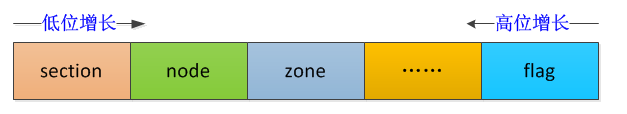

<!-- @import "[TOC]" {cmd="toc" depthFrom=1 depthTo=6 orderedList=false} -->

<!-- code_chunk_output -->

  - [今日内容(页帧 struct page)](#今日内容页帧-struct-page)
- [页帧](#页帧)
  - [2.1 struct page 结构](#21-struct-page-结构)
  - [2.2 mapping & index](#22-mapping--index)
  - [2.3 private 私有数据指针](#23-private-私有数据指针)
  - [2.4 lru 链表头](#24-lru-链表头)
- [3 体系结构无关的页面的状态 flags](#3-体系结构无关的页面的状态-flags)
  - [3.1 页面到管理区和节点的映射](#31-页面到管理区和节点的映射)
  - [3.2 内存页标识 pageflags](#32-内存页标识-pageflags)
- [4 全局页面数组 mem_map](#4-全局页面数组-mem_map)

<!-- /code_chunk_output -->

## 今日内容(页帧 struct page)

分页单元可以实现把线性地址转换为物理地址,为了效率起见, **线性地址**(**页是线性地址的概念！！！**)被分为**固定长度**为单位的**组**, 称为"**页**", **页内部的线性地址**被映射到**连续的物理地址**. 这样内核可以指定**一个页**的**物理地址**和**其存储权限**,而**不用**指定页所包含的全部**线性地址**的**存储权限**.

分页单元把所有**RAM**分为固定长度的页帧(也叫**页框**、**物理页**, 英文`page frame`). 每一个页帧包含一个页(page).也就是说一个页帧的长度与一个页的长度一致. **页框是主存的一部分**, 因此也是一个存储区域.简单来说,**页是一个数据块**(**！！！**), 可以存放在任何**页框**(**物理内存中！！！**)或者磁盘(被交换至**交换分区**)中

我们今天就来详细讲解一下 linux 下物理页帧的描述

# 页帧

内核把**物理页**作为**内存管理的基本单位**.尽管处理器的**最小可寻址单位**通常是**字节**, 但是,内存管理单元 MMU 通常以页为单位进行处理.因此, 从**虚拟内存**的上来看, **页就是最小单位**(**页是虚拟内存！！！**).

**页帧**代表了系统内存的最小单位, 对内存中的**每个页**都会创建**struct page**的一个实例. 内核必须要**保证 page 结构体足够的小**, 否则仅 struct page 就要占用大量的内存.

因为即使在中等程序的内存配置下,系统的内存同样会分解为大量的页.例如,IA-32 系统中标准页长度为 4KB.在内存大小为 384MB 时,大约有 100000 页.就当今的标准而言,这个容量算不上很大, 但页的数目已经非常可观了

因而出于**节省内存**的考虑, 内核要尽力**保持 struct page 尽可能的小**.在典型的系统中, 由于页的数目巨大, 因此对 page 结构的小改动, 也可能导致保存所有 page 实例所需的物理内存暴涨.

页的广泛使用, 增加了保持结构长度的难度: 内存管理的许多部分都使用页, 用于各种不同的用途. 内核的一部分可能完全依赖于 struct page 提供的特定信息, 而这部分信息堆内核的其他部分页可能是完全无用的. 等等.

## 2.1 struct page 结构

 内核用`struct page`(`include/linux/mm_types.h`)结构表示系统中的每个**物理页**(**物理页！！！**).

出于**节省内存**的考虑, struct page 中使用了**大量的联合体 union**.

```cpp
/*
 * Each physical page in the system has a struct page associated with
 * it to keep track of whatever it is we are using the page for at the
 * moment. Note that we have no way to track which tasks are using
 * a page, though if it is a pagecache page, rmap structures can tell us
 * who is mapping it.
 *
 * The objects in struct page are organized in double word blocks in
 * order to allows us to use atomic double word operations on portions
 * of struct page. That is currently only used by slub but the arrangement
 * allows the use of atomic double word operations on the flags/mapping
 * and lru list pointers also.
 */
struct page {
    /* First double word block */
    unsigned long flags;        /* Atomic flags, some possibly updated asynchronously 描述 page 的状态和其他信息  */
    union
    {
        struct address_space *mapping;  /* If low bit clear, points to
                         * inode address_space, or NULL.
                         * If page mapped as anonymous
                         * memory, low bit is set, and
                         * it points to anon_vma object:
                         * see PAGE_MAPPING_ANON below.
                         */
        void *s_mem;            /* slab first object */
        atomic_t compound_mapcount;     /* first tail page */
        /* page_deferred_list().next     -- second tail page */
    };

    /* Second double word */
    struct {
        union {
            pgoff_t index;      /* Our offset within mapping.
            在映射的虚拟空间(vma_area)内的偏移;
            一个文件可能只映射一部分, 假设映射了 1M 的空间,
            index 指的是在 1M 空间内的偏移, 而不是在整个文件内的偏移.  */
            void *freelist;     /* sl[aou]b first free object */
            /* page_deferred_list().prev    -- second tail page */
        };

        union {
#if defined(CONFIG_HAVE_CMPXCHG_DOUBLE) && \
    defined(CONFIG_HAVE_ALIGNED_STRUCT_PAGE)
            /* Used for cmpxchg_double in slub */
            unsigned long counters;
#else
            /*
             * Keep _refcount separate from slub cmpxchg_double
             * data.  As the rest of the double word is protected by
             * slab_lock but _refcount is not.
             */
            unsigned counters;
#endif

            struct {

                union {
                    /*
                     * Count of ptes mapped in mms, to show
                     * when page is mapped & limit reverse
                     * map searches.
                     * 页映射计数器
                     */
                    atomic_t _mapcount;

                    struct { /* SLUB */
                        unsigned inuse:16;
                        unsigned objects:15;
                        unsigned frozen:1;
                    };
                    int units;      /* SLOB */
                };
                /*
                 * Usage count, *USE WRAPPER FUNCTION*
                 * when manual accounting. See page_ref.h
                 * 页引用计数器
                 */
                atomic_t _refcount;
            };
            unsigned int active;    /* SLAB */
        };
    };

    /*
     * Third double word block
     *
     * WARNING: bit 0 of the first word encode PageTail(). That means
     * the rest users of the storage space MUST NOT use the bit to
     * avoid collision and false-positive PageTail().
     */
    union {
        struct list_head lru;   /* Pageout list, eg. active_list
                     * protected by zone->lru_lock !
                     * Can be used as a generic list
                     * by the page owner.
                     */
        struct dev_pagemap *pgmap; /* ZONE_DEVICE pages are never on an
                        * lru or handled by a slab
                        * allocator, this points to the
                        * hosting device page map.
                        */
        struct {        /* slub per cpu partial pages */
            struct page *next;      /* Next partial slab */
#ifdef CONFIG_64BIT
            int pages;      /* Nr of partial slabs left */
            int pobjects;   /* Approximate # of objects */
#else
            short int pages;
            short int pobjects;
#endif
        };

        struct rcu_head rcu_head;       /* Used by SLAB
                         * when destroying via RCU
                         */
        /* Tail pages of compound page */
        struct {
            unsigned long compound_head; /* If bit zero is set */

            /* First tail page only */
#ifdef CONFIG_64BIT
            /*
             * On 64 bit system we have enough space in struct page
             * to encode compound_dtor and compound_order with
             * unsigned int. It can help compiler generate better or
             * smaller code on some archtectures.
             */
            unsigned int compound_dtor;
            unsigned int compound_order;
#else
            unsigned short int compound_dtor;
            unsigned short int compound_order;
#endif
        };

#if defined(CONFIG_TRANSPARENT_HUGEPAGE) && USE_SPLIT_PMD_PTLOCKS
        struct {
            unsigned long __pad;    /* do not overlay pmd_huge_pte
                         * with compound_head to avoid
                         * possible bit 0 collision.
                         */
            pgtable_t pmd_huge_pte; /* protected by page->ptl */
        };
#endif
    };

    /* Remainder is not double word aligned */
    union {
        unsigned long private;      /* Mapping-private opaque data:
                         * usually used for buffer_heads
                         * if PagePrivate set; used for
                         * swp_entry_t if PageSwapCache;
                         * indicates order in the buddy
                         * system if PG_buddy is set.
                         * 私有数据指针, 由应用场景确定其具体的含义
                         */
#if USE_SPLIT_PTE_PTLOCKS
#if ALLOC_SPLIT_PTLOCKS
        spinlock_t *ptl;
#else
        spinlock_t ptl;
#endif
#endif
        struct kmem_cache *slab_cache;  /* SL[AU]B: Pointer to slab */
    };

#ifdef CONFIG_MEMCG
    struct mem_cgroup *mem_cgroup;
#endif

    /*
     * On machines where all RAM is mapped into kernel address space,
     * we can simply calculate the virtual address. On machines with
     * highmem some memory is mapped into kernel virtual memory
     * dynamically, so we need a place to store that address.
     * Note that this field could be 16 bits on x86 ... ;)
     *
     * Architectures with slow multiplication can define
     * WANT_PAGE_VIRTUAL in asm/page.h
     */
#if defined(WANT_PAGE_VIRTUAL)
    void *virtual;          /* Kernel virtual address (NULL if
                       not kmapped, ie. highmem) */
#endif /* WANT_PAGE_VIRTUAL */

#ifdef CONFIG_KMEMCHECK
    /*
     * kmemcheck wants to track the status of each byte in a page; this
     * is a pointer to such a status block. NULL if not tracked.
     */
    void *shadow;
#endif

#ifdef LAST_CPUPID_NOT_IN_PAGE_FLAGS
    int _last_cpupid;
#endif
}
/*
 * The struct page can be forced to be double word aligned so that atomic ops
 * on double words work. The SLUB allocator can make use of such a feature.
 */
#ifdef CONFIG_HAVE_ALIGNED_STRUCT_PAGE
    __aligned(2 * sizeof(unsigned long))
#endif
;
```

| 字段 | 描述 |
|:---:|:----|
| `flag` | 用来存放**页的状态**, **每一位**代表**一种状态**, 所以至少可以**同时表示出 32 中不同的状态**(**同时！！！**),这些状态定义在**linux/page-flags.h**中 |
| `virtual` | 对于如果物理内存可以**直接映射**内核的系统, 我们可以之间映射出虚拟地址与物理地址的管理,但是对于需要使用**高端内存区域的页**(这里指的是**物理页！！！**), 即**无法直接映射**到内核的**虚拟地址空间**, 因此需要用 virtual 保存该**页的虚拟地址** |
|  `_refcount` | 引用计数, 表示内核中**引用**该 page 的**次数**,如果要操作该 page, 引用计数会+1, 操作完成-1.当该值为 0 时,表示没有引用该 page 的位置, 所以该 page 可以**被解除映射**(只要引用数是 0), 这往往在**内存回收**时是有用的 |
| `_mapcount` | **被页表映射的次数**, 也就是说该 page**同时**被多少个**进程共享**. **初始值为-1**, 如果只被**一个进程的页表映射**了, 该**值为 0**.如果该 page 处于**伙伴系统**中, 该值为 PAGE\_BUDDY\_MAPCOUNT\_VALUE(**-128**), 内核通过判断该值是否为**PAGE\_BUDDY\_MAPCOUNT\_VALUE**来确定该 page**是否属于伙伴系统** |
| `index` | 页帧在映射的**虚拟空间**(**vma\_area,不是物理空间!!!**)内的偏移; **一个文件**可能只**映射一部分**, 假设**映射了 1M 的空间**, index 指的是在**1M 空间内的偏移**, 而不是在整个文件内的偏移 |
| `private` | **私有数据指针**, 由**应用场景**确定其具体的含义 |
| `lru` | 链表头, 用于在**各种链表上维护该页**,以便于按页将不同类别分组,主要有 3 个用途: **伙伴算法**,**slab 分配器**,**被用户态使用或被当做页缓存**使用 |
| `mapping` | 指向与该页相关的**address\_space 对象** |

>注意区分`_count`和`_mapcount`, `_mapcount`表示的是**映射次数**, 而`_count`表示的是**使用次数**; **被映射**了**不一定在使用**, 但要**使用**必须**先映射**.

## 2.2 mapping & index

**mapping**指定了**页帧**(**物理页！！！**)所在的**地址空间**,**index**是**页帧**在映射的**虚拟空间内部**的偏移量.**地址空间**是一个非常一般的概念.例如,可以用在**向内存读取文件**时. 地址空间用于将**文件的内容**与装载**数据的内存区关联起来**.

mapping 不仅能够保存一个指针,而且还能包含一些额外的信息,用于判断页是否属于**未关联到地址空间**的**某个匿名内存区**.

page\->mapping 本身是一个**指针**, 指针地址的**低几个 bit**因为**对齐的原因**都是**无用的 bit**, 内核就根据这个特性利用这几个 bit 来让 page->mapping 实现更多的含义. **一个指针多个用途**, 这个也是内核为了**减少 page 结构大小**的办法之一. 目前用到**最低 2 个 bit 位**. 定义在 include/linux/page-flags.h#L390.

```
/*
 * On an anonymous page mapped into a user virtual memory area,
 * page->mapping points to its anon_vma, not to a struct address_space;
 * with the PAGE_MAPPING_ANON bit set to distinguish it.  See rmap.h.
 *
 * On an anonymous page in a VM_MERGEABLE area, if CONFIG_KSM is enabled,
 * the PAGE_MAPPING_MOVABLE bit may be set along with the PAGE_MAPPING_ANON
 * bit; and then page->mapping points, not to an anon_vma, but to a private
 * structure which KSM associates with that merged page.  See ksm.h.
 *
 * PAGE_MAPPING_KSM without PAGE_MAPPING_ANON is used for non-lru movable
 * page and then page->mapping points a struct address_space.
 *
 * Please note that, confusingly, "page_mapping" refers to the inode
 * address_space which maps the page from disk; whereas "page_mapped"
 * refers to user virtual address space into which the page is mapped.
 */
#define PAGE_MAPPING_ANON	0x1
#define PAGE_MAPPING_MOVABLE	0x2
#define PAGE_MAPPING_KSM	(PAGE_MAPPING_ANON | PAGE_MAPPING_MOVABLE)
#define PAGE_MAPPING_FLAGS	(PAGE_MAPPING_ANON | PAGE_MAPPING_MOVABLE)
```

1. 如果 page->mapping == NULL, 说明该**page**属于**交换高速缓存页**(**swap cache**); 当需要使用地址空间时会指定**交换分区的地址空间**swapper\_space.

2. 如果 page->mapping != NULL, 第 0 位 bit[0] = 0, 说明该 page 属于**页缓存**或**文件映射**, mapping 指向**文件的地址空间**address\_space.

3. 如果 page->mapping != NULL, 第 0 位 bit[0] != 0, 说明该 page 为**匿名映射**, mapping 指向**struct anon\_vma 对象**.

通过 mapping 恢复 anon\_vma 的方法:

```
anon\_vma = (struct anon\_vma *)(mapping - PAGE\_MAPPING\_ANON)
```

4. 当 page->mapping != NULL, 并且 bit[1] != 0, 当一个匿名映射处于 VM\_MERGEABLE 区域, 并且 CONFIG\_KSM 功能打开时, bit[1]可能和 bit[0]一起被置起. 此时 page->mapping 不是指向 anon\_vma, 而是指向**KSM 的一个私有结构**.

内核定义了一些 API 来取得 page->mapping 指针的状态, 定义在 include/linux/page-flags.h#L395.

```
static __always_inline int PageMappingFlags(struct page *page)
{
	return ((unsigned long)page->mapping & PAGE_MAPPING_FLAGS) != 0;
}

static __always_inline int PageAnon(struct page *page)
{
	page = compound_head(page);
	return ((unsigned long)page->mapping & PAGE_MAPPING_ANON) != 0;
}

static __always_inline int __PageMovable(struct page *page)
{
	return ((unsigned long)page->mapping & PAGE_MAPPING_FLAGS) ==
				PAGE_MAPPING_MOVABLE;
}

#ifdef CONFIG_KSM
/*
 * A KSM page is one of those write-protected "shared pages" or "merged pages"
 * which KSM maps into multiple mms, wherever identical anonymous page content
 * is found in VM_MERGEABLE vmas.  It's a PageAnon page, pointing not to any
 * anon_vma, but to that page's node of the stable tree.
 */
static __always_inline int PageKsm(struct page *page)
{
	page = compound_head(page);
	return ((unsigned long)page->mapping & PAGE_MAPPING_FLAGS) ==
				PAGE_MAPPING_KSM; //http://elixir.free-electrons.com/linux/v4.12/source/include/linux/page-flags.h#L74
}
#else
TESTPAGEFLAG_FALSE(Ksm)
#endif
```

pgoff\_t index 是该页描述结构在**地址空间 radix 树 page\_tree**中的**对象索引号即页号**,表示该页在**vm\_file**中的**偏移页数**, 其类型 pgoff\_t 被定义为 unsigned long 即一个机器字长.

```cpp
/*
 * The type of an index into the pagecache.
 */
#define pgoff_t unsigned long
```

## 2.3 private 私有数据指针

private 私有数据指针, 由应用场景确定其具体的含义:

1. 如果设置了 PG\_private 标志, 则 private 字段指向 struct buffer_head

2. 如果设置了 PG\_compound, 则指向 struct page

3. 如果设置了 PG\_swapcache 标志, private 存储了该 page 在交换分区中对应的位置信息 swp\_entry\_t.

4.	如果\_mapcount = PAGE\_BUDDY\_MAPCOUNT\_VALUE, 说明该 page 位于伙伴系统, private 存储该伙伴的阶

## 2.4 lru 链表头

最近、最久未使用**struct slab 结构指针**变量

lru: 链表头, 主要有 3 个用途:

1.	则**page 处于伙伴系统**中时, 用于链接**相同阶的伙伴**(只使用伙伴中的**第一个 page 的 lru**即可达到目的).

2.	**设置 PG\_slab**, 则**page 属于 slab**, page\->lru.next 指向 page 驻留的的缓存的管理结构, page->lru.prec 指向保存该 page 的 slab 的管理结构.

3.	page 被**用户态使用**或被当做**页缓存使用**时, 用于将该**page**连入 zone 中**相应的 lru 链表**, 供**内存回收**时使用.

# 3 体系结构无关的页面的状态 flags

flag 的各个 bit 位描述了一系列页标志.

```cpp
struct page {
    /* First double word block */
    unsigned long flags;        /* Atomic flags,
    some possibly updated asynchronously, 描述 page 的状态和其他信息  */
```

这些标识是独立于体系结构的, 因而无法获得特定于 CPU 或计算机的信息(该信息保存在页表中)

## 3.1 页面到管理区和节点的映射

在**早期的 linux-2.4.18 的内核**中, [struct page 存储有一个指向对应管理区的指针 page->zone](http://lxr.linux.no/linux-old+v2.4.18/include/linux/mm.h#L167), 但如果有成千上万的这样的 struct page 存在, 那么即使是很小的指针也会消耗大量的内存空间.

因此在**后来 linux-2.4.x 的更新**中, 删除了这个字段, 取而代之的是**page->flags**的最高[ZONE\_SHIFT 位](http://lxr.free-electrons.com/source/include/linux/mm.h?v=2.4.37#L340)和**NODE\_SHIFT 位**, 存储了其所在**zone**和**node**在内存区域表**zone\_table 的编号索引**.

那么内核在初始化内存管理区时, **首先**建立管理区表**zone\_table**. 参见[mm/page_alloc.c?v=2.4.37, line 38](http://lxr.free-electrons.com/source/mm/page_alloc.c?v=2.4.37#L38)

```cpp
/*
 *
 * The zone_table array is used to look up the address of the
 * struct zone corresponding to a given zone number (ZONE_DMA,
 * ZONE_NORMAL, or ZONE_HIGHMEM).
 */
zone_t *zone_table[MAX_NR_ZONES*MAX_NR_NODES];
EXPORT_SYMBOL(zone_table);
```

MAX\_NR\_ZONES 是**一个节点**中所能包容纳的**管理区的最大数**, 如 3 个, 定义在[include/linux/mmzone.h?v=2.4.37, line 25](http://lxr.free-electrons.com/source/include/linux/mmzone.h?v=2.4.37#L25), 与 zone 区域的类型(ZONE\_DMA, ZONE\_NORMAL, ZONE\_HIGHMEM)定义在一起. 当然这时候我们这些标识都是通过宏的方式来实现的, 而不是如今的枚举类型

MAX\_NR\_NODES 是可以存在的**节点的最大数**.

函数 EXPORT_SYMBOL 使得内核的变量或者函数可以被载入的模块(比如我们的驱动模块)所访问.

该表处理起来就像一个**多维数组**, 在函数**free\_area\_init\_core**中, **一个节点的所有页面都会被初始化**.

内核提供了**page\_zone**通过**页面**查找其对应的内存区域**zone\_t**, 页提供了 set\_page\_zone 接口, 而查找到了**zone**后, 可以通过 其`struct pglist_data *zone_pgdat`直接获取其**所在 node 信息**

```cpp
/*
 * The zone field is never updated after free_area_init_core()
 * sets it, so none of the operations on it need to be atomic.
 */
#define NODE_SHIFT 4
#define ZONE_SHIFT (BITS_PER_LONG - 8)

struct zone_struct;
extern struct zone_struct *zone_table[];

static inline zone_t *page_zone(struct page *page)
{
        return zone_table[page->flags >> ZONE_SHIFT];
}

static inline void set_page_zone(struct page *page, unsigned long zone_num)
{
        page->flags &= ~(~0UL << ZONE_SHIFT);
        page->flags |= zone_num << ZONE_SHIFT;
}
```

而**后来的内核(至今 linux-4.7)**中, 这些必要的标识(ZONE\_DMA 等)都是通过枚举类型实现的(ZONE\_DMA 等用 enum zone\_type 定义), 然后**zone\_table 也被移除**, 参照[[PATCH] zone table removal miss merge](https://lkml.org/lkml/2006/9/27/112)

因此内核提供了新的思路, 参见[include/linux/mm.h?v4.7, line 907](http://lxr.free-electrons.com/source/include/linux/mm.h?v4.7#L907)


```cpp
static inline struct zone *page_zone(const struct page *page)
{
	return &NODE_DATA(page_to_nid(page))->node_zones[page_zonenum(page)];
}

static inline void set_page_zone(struct page *page, enum zone_type zone)
{
	page->flags &= ~(ZONES_MASK << ZONES_PGSHIFT);
    page->flags |= (zone & ZONES_MASK) << ZONES_PGSHIFT;
}

static inline void set_page_node(struct page *page, unsigned long node)
{
	page->flags &= ~(NODES_MASK << NODES_PGSHIFT);
	page->flags |= (node & NODES_MASK) << NODES_PGSHIFT;
}
```

其中**NODE\_DATA**使用了**全局的 node 表**进行索引.

在**UMA 结构**的机器中, 只有一个 node 结点即 contig\_page\_data, 此时 NODE\_DATA 直接指向了全局的 contig\_page\_data, 而与 node 的编号 nid 无关, 参照[include/linux/mmzone.h?v=4.7, line 858](http://lxr.free-electrons.com/source/include/linux/mmzone.h?v=4.7#L858), 其中全局唯一的 node 结点 contig\_page\_data 定义在[mm/nobootmem.c?v=4.7, line 27](http://lxr.free-electrons.com/source/mm/nobootmem.c?v=4.7#L27)

```cpp
#ifndef CONFIG_NEED_MULTIPLE_NODES
extern struct pglist_data contig_page_data;
#define NODE_DATA(nid)          (&contig_page_data)
#define NODE_MEM_MAP(nid)       mem_map
else
/*  ......  */
#endif
```

而对于**NUMA 结构**的系统中, 所有的 node 都存储在**node\_data 数组**中,
NODE\_DATA 直接通过**node 编号索引**即可, 参见[NODE\_DATA 的定义](http://lxr.free-electrons.com/ident?v=4.7;i=NODE_DATA)

```cpp
extern struct pglist_data *node_data[];
#define NODE_DATA(nid)          (node_data[(nid)])
```

那么 page 的**flags 标识**主要分为**4 部分**, 其中**标志位 flag 向高位增长**, 其余位字段**向低位增长**, 中间存在空闲位

| 字段 | 描述 |
|:----|:---|
| section | 主要用于**稀疏内存模型 SPARSEMEM**, 可忽略 |
| node | **NUMA 节点号**, 标识该 page 属于**哪一个节点** |
| zone | **内存域标志**, 标识该 page 属于哪一个 zone |
| flag | page 的**状态标识** |

如下图所示



## 3.2 内存页标识 pageflags

其中最后一个 flag 用于标识 page 的状态, 这些状态由枚举常量[`enum pageflags`](http://lxr.free-electrons.com/source/include/linux/page-flags.h?v=4.7#L74)定义, 定义在[include/linux/page-flags.h?v=4.7, line 74](http://lxr.free-electrons.com/source/include/linux/page-flags.h?v=4.7#L74). 常用的有如下状态

```cpp

enum pageflags {
	PG_locked,		/* Page is locked. Don't touch. 页被锁住时, 内核其他部分不允许访问该页*/
	PG_error,		/* 例如设计该页的 IO 操作期间发生错误, 需置起本 bit 位*/
	PG_referenced,		/* 页被引用标志*/
	PG_uptodate,		/* 该页的数据已经从块设备读取*/
	PG_dirty,		/* 和硬盘数据相比, 页的内容已经改变, 需置起本 bit 位, 稍后需回写页内容到硬盘*/
	PG_lru,			/* 内核使用两个 lru 链表来标识活动页和不活动页. 如果页在链表中, 需置起本 bit 位*/
	PG_active,		/* 和 PG_referenced 一起表示页的活跃程度*/
	PG_waiters,		/* Page has waiters, check its waitqueue. Must be bit #7 and in the same byte as "PG_locked" */
	PG_slab,		/* 属于 slab 分配器的页*/
	PG_owner_priv_1,	/* Owner use. If pagecache, fs may use*/
	PG_arch_1,
	PG_reserved,
	PG_private,		/* If pagecache, has fs-private data */
	PG_private_2,		/* If pagecache, has fs aux data */
	PG_writeback,		/* Page is under writeback 页正在执行写回硬盘操作*/
	PG_head,		/* A head page */
	PG_mappedtodisk,	/* Has blocks allocated on-disk */
	PG_reclaim,		/* To be reclaimed asap 页需要执行回收操作*/
	PG_swapbacked,		/* Page is backed by RAM/swap */
	PG_unevictable,		/* Page is "unevictable"  */
#ifdef CONFIG_MMU
	PG_mlocked,		/* Page is vma mlocked */
#endif
#ifdef CONFIG_ARCH_USES_PG_UNCACHED
	PG_uncached,		/* Page has been mapped as uncached */
#endif
#ifdef CONFIG_MEMORY_FAILURE
	PG_hwpoison,		/* hardware poisoned page. Don't touch */
#endif
#if defined(CONFIG_IDLE_PAGE_TRACKING) && defined(CONFIG_64BIT)
	PG_young,
	PG_idle,
#endif
	__NR_PAGEFLAGS,

	/* Filesystems */
	PG_checked = PG_owner_priv_1,

	/* SwapBacked */
	PG_swapcache = PG_owner_priv_1,	/* Swap page: swp_entry_t in private */

	/* Two page bits are conscripted by FS-Cache to maintain local caching
	 * state.  These bits are set on pages belonging to the netfs's inodes
	 * when those inodes are being locally cached.
	 */
	PG_fscache = PG_private_2,	/* page backed by cache */

	/* XEN */
	/* Pinned in Xen as a read-only pagetable page. */
	PG_pinned = PG_owner_priv_1,
	/* Pinned as part of domain save (see xen_mm_pin_all()). */
	PG_savepinned = PG_dirty,
	/* Has a grant mapping of another (foreign) domain's page. */
	PG_foreign = PG_owner_priv_1,

	/* SLOB */
	PG_slob_free = PG_private,

	/* Compound pages. Stored in first tail page's flags */
	PG_double_map = PG_private_2,

	/* non-lru isolated movable page */
	PG_isolated = PG_reclaim,
};
```

| 页面状态 | 描述 |
|:-------:|:----|
| PG\_locked | 指定了页**是否被锁定**,如果该比特未被置位,说明有使用者正在操作该 page,则内核的其他部分不允许访问该页,  这可以防止内存管理出现竞态条件 |
| PG\_error | 如果涉及该 page 的**I/O 操作发生了错误**, 则该位被设置 |
| PG\_referenced | 表示 page**刚刚被访问过** |
| PG\_uptodate | 表示 page 的数据已经**与后备存储器是同步的**,即页的数据已经**从块设备读取**, 且**没有出错**,**数据是最新的** |
| PG\_dirty | 与后备存储器中的数据相比, 该 page 的内容**已经被修改**.出于**性能的考虑**, 页并**不**在每次改变后**立即回写**, 因此内核需要使用该标识来表明页面中的数据已经改变, 应该在**稍后刷出** |
| PG\_lru | 表示该**page 处于 LRU 链表**上,  这有助于实现页面的回收和切换. 内核使用**两个**最近最少使用(least recently used-LRU)**链表**来区别**活动**和**不活动页**. 如果页在**其中一个链表**中, 则该位被设置 |
| PG\_active | page 处于 inactive LRU 链表,PG\_active 和**PG\_referenced**一起**控制该 page 的活跃程度**, 这在**内存回收**时将会非常有用<br>当位于 LRU active\_list 链表上的页面该位被设置, 并在页面移除时清除该位, 它标记了页面是否处于活动状态 |
| PG\_slab | 该 page 属于**slab 分配器** |
| PG\_onwer\_priv\_1 | |
| PG\_arch\_1	      | 直接从代码中引用, PG\_arch\_1 是一个**体系结构相关**的页面状态位, 一般的代码保证了在第一次禁图页面高速缓存时, 该位被清除. 这使得体系结构可以延迟到页面被某个进程映射后,  才可以 D-Cache 刷盘 |
| PG\_reserved | 设置该标志, 防止该 page 被**交换到 swap**  |
| PG\_private | 如果 page 中的**private 成员非空**, 则需要设置该标志, 用于 I/O 的页可使用该字段将页细分为多核缓冲区 |
| PG\_private\_2 | |
| PG\_writeback | page 中的数据**正在被回写**到后备存储器 |
| PG\_head | |
| PG\_swapcache | 表示该 page 处于**swap cache**中 |
| PG\_mappedtodisk | 表示 page 中的数据**在后备存储器中有对应** |
| PG\_reclaim | 表示该 page 要被回收. 当 PFRA 决定要**回收某个 page**后, 需要设置该标志 |
| PG\_swapbacked | 该 page 的后备存储器是**swap** |
| PG\_unevictable | 该 page**被锁住**, 不能交换, 并会出现在 LRU\_UNEVICTABLE 链表中, 它包括的几种 page: **ramdisk**或**ramfs**使用的**页**, shm\_locked、mlock 锁定的页 |
| PG\_mlocked | 该 page 在**vma 中被锁定**, 一般是通过系统调用 mlock()锁定了一段内存 |
| PG\_uncached | |
| PG\_hwpoison | |
| PG\_young | |
| PG\_idle  | |

内核中提供了一些标准宏, 用来检查、操作某些特定的比特位, 这些宏定义在[include/linux/page-flags.h?v=4.7, line 183](http://lxr.free-electrons.com/source/include/linux/page-flags.h?v=4.7#L183)

```c
#define TESTPAGEFLAG(uname, lname, policy)
#define SETPAGEFLAG(uname, lname, policy)
#define CLEARPAGEFLAG(uname, lname, policy)
```

**关于 page flags 的早期实现**

- linux-2.6 以后的内核中, 很少出现直接用宏定义的标识,这些标识大多通过 enum 枚举常量来定义,然后\_\_NR\_XXXX 的形式结束, 正好可以标记出宏参数的个数, 但是在早期的实现中, 这些变量都通过宏来标识

例如我们的 page->flags 用 enum pageflags 来定义, 内存管理区类型通过 zone\_type 来定义, 但是这些内容在早期的内核中都是通过宏定义来实现的.

- 其次标识的函数接口也变了, 早期的内核中, 针对每个宏标识都设置了一组 test/set/clear, 参见[/include/linux/mm.h?v=2.4.37, line 324](http://lxr.free-electrons.com/source/include/linux/mm.h?v=2.4.37#L324)

形式如下

```cpp
PageXXX(page): 检查 page 是否设置了 PG_XXX 位
SetPageXXX(page): 设置 page 的 PG_XXX 位
ClearPageXXX(page): 清除 page 的 PG_XXX 位
TestSetPageXXX(page): 设置 page 的 PG_XXX 位, 并返回原值
TestClearPageXXX(page): 清除 page 的 PG_XXX 位, 并返回原值
```

很多情况下, 需要等待页的状态改变, 然后才能恢复工作. 因此内核提供了两个辅助函数

```cpp
http://lxr.free-electrons.com/source/include/linux/pagemap.h?v=4.7#L495
/*
 * Wait for a page to be unlocked.
 *
 * This must be called with the caller "holding" the page,
 * ie with increased "page->count" so that the page won't
 * go away during the wait..
 */
static inline void wait_on_page_locked(struct page *page)

// http://lxr.free-electrons.com/source/include/linux/pagemap.h?v=4.7#L504
/*
 * Wait for a page to complete writeback
 */
static inline void wait_on_page_writeback(struct page *page)
```

假定内核的一部分在等待一个被锁定的页面, 直至页面被解锁. wait\_on\_page\_locked 提供了该功能. 在页面被锁定的情况下, 调用该函数, 内核将进入睡眠. 而在页面解锁后, 睡眠进程会被自动唤醒并继续工作

wait\_on\_page\_writeback 的工作方式类似, 该函数会等待与页面相关的所有待决回写操作结束, 将页面包含的数据同步到块设备为止.

# 4 全局页面数组 mem_map

mem\_map 是一个**struct page 的数组**, 管理着系统中**所有的物理内存页面**. 在系统启动的过程中, 创建和分配 mem\_map 的内存区域, mem\_map 定义在 mm/memory.c

```cpp
#ifndef CONFIG_NEED_MULTIPLE_NODES
/* use the per-pgdat data instead for discontigmem - mbligh */
unsigned long max_mapnr;
struct page *mem_map;

EXPORT_SYMBOL(max_mapnr);
EXPORT_SYMBOL(mem_map);
#endif
```
UMA 体系结构中, free\_area\_init 函数在系统唯一的 struct node 对象**contig\_page\_data**中**node\_mem\_map**成员赋值给全局的 mem\_map 变量

```
#ifndef CONFIG_NEED_MULTIPLE_NODES
    /*
     * With no DISCONTIG, the global mem_map is just set as node 0's
     */
    if (pgdat == NODE_DATA(0)) {
        mem_map = NODE_DATA(0)->node_mem_map;
```

**NUMA 系统中, 全局变量 mem\_map 中总是保存系统的是第 0 个结点的 node\_mem\_map**.