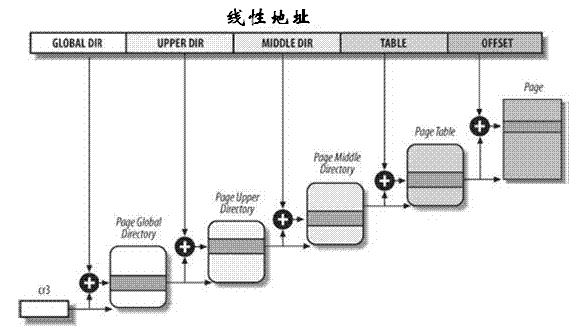

<!-- @import "[TOC]" {cmd="toc" depthFrom=1 depthTo=6 orderedList=false} -->

<!-- code_chunk_output -->

- [分页机制](#分页机制)
  - [为什么使用多级页表来完成映射](#为什么使用多级页表来完成映射)
  - [32 位系统中 2 级页表](#32-位系统中-2-级页表)
  - [64 位系统中的分页](#64-位系统中的分页)
  - [Linux 中的分页](#linux-中的分页)
- [页表](#页表)
- [Linux 分页机制的演变](#linux-分页机制的演变)
  - [Linux 的页表实现](#linux-的页表实现)
  - [Linux 最初的二级页表](#linux-最初的二级页表)
  - [Linux 的三级页表](#linux-的三级页表)
  - [Linux 的四级页表](#linux-的四级页表)
- [链接](#链接)

<!-- /code_chunk_output -->

# 分页机制

在**虚拟内存**中, **页表**是个**映射表**的概念,即从进程能理解的**线性地址(进程使用线性地址, 不管物理地址！！！**)(linear address)映射到存储器上的**物理地址**(phisical address).

也就是说, **进程**使用的是**线性地址**, 进程使用的**空间大小**取决于**线性地址**, 不关心物理地址, 页表的目的是为了将**线性地址**映射到**物理地址**, 所以**页表大小取决于线性地址空间**, 而且映射之前先是在线性空间分配空间, 然后建立页表来映射相应大小的物理地址, 即使用多少线性空间映射多少, 不是一次性映射所有！！！

很显然, 这个**页表**是需要**常驻内存**的东西,以应对频繁的查询映射需要(实际上, 现代支持 VM 的处理器都有**TLB 的硬件级页表缓存部件**, 本文不讨论).

## 为什么使用多级页表来完成映射

**但是为什么要使用多级页表来完成映射呢**?

用来将虚拟地址映射到物理地址的数据结构称为**页表**,实现两个地址空间的关联**最容易的方式是使用数组**,对虚拟地址空间中的**每一页**,都分配一个数组项. 该数组指向与之关联的**页帧(虚拟空间分配多大, 对应就要有多大的页帧**), 但这会引发一个问题, 例如, IA-32 体系结构使用 4KB 大小的页, 在虚拟地址空间为 4GB 的前提下, 则需要包含 100 万项的页表. 这个问题在 64 位体系结构下, 情况会更加糟糕. 而每个进程都需要自身的页表, 这回导致系统中**大量的内存**都用来**保存页表**.

设想一个典型的 32 位的 X86 系统, 它的**虚拟内存用户空间**(user space)大小为 3G, 并且典型的一个**页表项**(page table entry,pte)大小为 4bytes, 每一个页(page)大小为 4k bytes. 那么这 3G 空间一共有(3G/4k=)786432 个页面, 每个页面需要一个 pte 来保存映射信息, 这样一共需要 786432 个 pte(**page table entry**)!

如何存储这些信息呢?一个直观的做法是用数组来存储, 这样每个页能存储(4k/4byte=)1K 个, 这样一共需要(786432/1k=)768 个连续的物理页面(phsical page). 而且, 这只是一个进程, 如果要存放所有 N 个进程, 这个数目还要乘上 N! 这是个巨大的数目, 哪怕内存能提供这样数量的空间, 要找到连续 768 个连续的物理页面在系统运行一段时间后碎片化的情况下, 也是不现实的.

为减少页表的大小并容许忽略不需要的区域, 计算机体系结构的涉及会将虚拟地址分成多个部分. 同时虚拟地址空间的大部分们区域都没有使用, 因而页没有关联到页帧, 那么就可以使用功能相同但内存用量少的多的模型: **多级页表**

但是新的问题来了, 到底**采用几级页表**合适呢?

## 32 位系统中 2 级页表

从 80386 开始, intel 处理器的分页单元是 4KB 的页, 32 位的地址空间被分为 3 部分

| 单元 | 描述 |
|:---|:----|
| 页目录表 Directory | 最高 10 位 |
| 页中间表 Table 	| 中间 10 位 |
| 页内偏移  		| 最低 12 位 |

即页表被划分为页目录表 Directory 和页中间表 Tabl 两个部分

此种情况下, 线性地址的转换分为两步完成.

- 第一步, 基于两级转换表(页目录表和页中间表), 最终查找到地址所在的**页帧**
- 第二步, 基于**偏移**, 在所在的页帧中查找到**对应偏移的物理地址**

使用这种二级页表可以有效的减少每个进程页表所需的 RAM 的数量.如果使用简单的一级页表, 那将需要高达 2\^20 个页表,假设每项 4Byte(32 位),则共需要占用 2\^20 \* 4Byte = 4MB 的 RAM 来表示每个进程的页表.当然我们并**不需要映射所有的线性地址空间(！！！**)(32 位机器上线性地址空间为 4GB),内核通常只为进程**实际使用的那些虚拟内存区请求页表**来减少内存使用量.

## 64 位系统中的分页

正常来说, 对于 32 位的系统两级页表已经足够了, 但是对于 64 位系统的计算机, 这远远不够.

首先假设一个大小为 4KB 的标准页.因为 1KB 覆盖 2\^10 个地址的范围,**4KB**覆盖**2\^12**个地址, 所以**offset**字段需要**12 位**.

这样**线性地址**空间就剩下 64-12=**52 位**分配给**页中间表 Table**和**页目录表 Directory**. 如果我们现在决定**仅仅使用 64 位中的 48 位来寻址**(**线性地址还是 64 位, 但是有效寻址位是 48 位！！！**这个限制其实已经足够了,2^48=256TB,即可达到 256TB 的寻址空间).剩下的 48-12=**36 位**被分配给**Table**和**Directory**字段. 即使我们现在决定位两个字段各预留 18 位,那么每个进程的页目录和页表都包含 2\^18 个项, 即超过 256000 个项.

基于这个原因, 所有 64 位处理器的硬件分页系统都使用了额外的分页级别. 使用的**级别**取决于**处理器的类型**

| 平台名称 | 页大小 | 寻址所使用的位数 | 分页级别数 | 线性地址分级 |
|:-----:|:-----:|:-----:|:-----:|:-------:|
| alpha  | 8KB | 43 | 3 | 10 + 10 + 10 + 13  |
| ia64   | 4KB | 39 | 3 |  9 +  9 +  9 + 12  |
| ppc64  | 4KB | 41 | 3 | 10 + 10 +  9 + 12  |
| sh64   | 4KB | 41 | 3 | 10 + 10 +  9 + 12  |
| x86\_64 | 4KB | 48 | 4 | 9 + 9 + 9 + 9 + 12 |

## Linux 中的分页

层次话的页表用于支持对大地址空间快速,高效的管理.因此 linux 内核对页表进行了分级.

前面我们提到过, 对于**32 位系统**中,**两级页表**已经足够了.但是**64 位**需要更多数量的**分页级别**.

为了同时支持适用于 32 位和 64 位的系统,Linux 采用了通用的分页模型.在**Linux-2.6.10**版本中, Linux 采用了**三级分页模型**.而从 2.6.11 开始普遍采用了**四级分页**模型.

目前的内核的内存管理总是**固定使用四级页表**, 而不管底层处理器是否如此.

| 单元 | 描述 |
|:---:|:----:|
| 页全局目录 | Page GlobalDirectory  |
| 页上级目录	| Page Upper Directory  |
| 页中间目录	| Page Middle Directory |
| 页表	        | Page Table 			|
| 页内偏移      | Page Offset		    |

**Linux**不同于其他的操作系统,它把计算机分成**独立层(体系结构无关**)/**依赖层(体系结构相关**)两个层次.对于页面的映射和管理也是如此.

**Linux 页表管理**分为两个部分,第一个部分**依赖于体系结构**,第二个部分是**体系结构无关的**.

所有**数据结构**几乎都定义在**特定体系结构的文件**中.这些数据结构的定义可以在**头文件 arch/对应体系/include/asm/page.h**和**arch/对应体系/include/asm/pgtable.h**中找到. 但是对于**AMD64**和**IA\-32**已经统一为**一个体系结构**.但是在处理页表方面仍然有很多的区别,因为相关的定义分为**两个不同的文件**arch/x86/include/asm/page\_32.h 和 arch/x86/include/asm/page\_64.h, 类似的也有 pgtable\_xx.h.

# 页表

Linux 内核通过**四级页表**将**虚拟内存空间**分为**5 个部分**(4 个页表项用于选择页, 1 个索引用来表示页内的偏移).各个体系结构不仅**地址长度不同**,而且**地址字拆分的方式也不一定相同**. 因此内核使用了**宏**用于将**地址分解**为各个分量.

页表其他内容请参照两篇博客

[深入理解计算机系统-之-内存寻址(五)--页式存储管理](http://blog.csdn.net/gatieme/article/details/50651561), 详细讲解了传统的页式存储管理机制

[深入理解计算机系统-之-内存寻址(六)--linux 中的分页机制](http://blog.csdn.net/gatieme/article/details/50756050), 详细的讲解了 Linux 内核分页机制的实现机制

# Linux 分页机制的演变

## Linux 的页表实现

由于程序存在**局部化特征**,这意味着在**特定的时间内**只有**部分内存会被频繁访问**, 具体点, **进程空间**中的 text 段(即程序代码),堆, 共享库, 栈都是**固定在进程空间的某个特定部分**, 这样导致**进程空间**其实是**非常稀疏**的,于是, 从硬件层面开始, 页表的实现就是采用分级页表的方式, Linux 内核当然也这么做. 所谓分级简单说就是, 把整个进程空间分成区块, 区块下面可以再细分, 这样在内存中只要**常驻某个区块**的**页表**即可, 这样可以大量节省内存.

## Linux 最初的二级页表

Linux 最初是在一台 i386 机器上开发的, 这种机器是典型的 32 位 X86 架构, 支持两级页表

一个 32 位虚拟地址如上图划分. 当在进行地址转换时,

- 结合在**CR3 寄存器**中存放的页目录(page directory, PGD)的这一页的物理地址, 再加上从虚拟地址中抽出高 10 位叫做页目录表项(内核也称这为 pgd)的部分作为偏移, 即定位到可以描述该地址的 pgd;

- 从该 pgd 中可以获取可以描述该地址的**页表的物理地址**, 再加上从虚拟地址中抽取中间 10 位作为偏移, 即定位到可以描述该地址的 pte;

- 在这个 pte 中即可获取该地址**对应的页的物理地址**,加上从虚拟地址中抽取的最后 12 位, 即形成该页的页内偏移, 即可最终完成从虚拟地址到物理地址的转换.

从上述过程中, 可以看出, 对虚拟地址的分级解析过程, 实际上就是不断**深入页表层次**, 逐渐定位到**最终地址**的过程, 所以这一过程被叫做**page talbe walk**.

至于这种做法为什么能**节省内存**, 举个更简单的例子更容易明白. 比如要记录 16 个球场的使用情况, 每张纸能记录 4 个场地的情况. 采用 4+4+4+4, 共 4 张纸即可记录, 但问题是球场使用得很少, 有时候一整张纸记录的 4 个球场都没人使用. 于是, 采用 4 x 4 方案, 即把 16 个球场分为 4 组, 同样每张纸刚好能记录 4 组情况. 这样, 使用一张纸 A 来记录 4 个分组球场情况, 当某个球场在使用时, 只要额外使用多一张纸 B 来记录该球场, 同时, 在 A 上记录"某球场由纸 B 在记录"即可. 这样在大部分球场使用很少的情况下, 只要很少的纸即困记录, 当有球场被使用, 有需要再用额外的纸来记录, 当不用就擦除. 这里一个很重要的前提就是:**局部性**.

## Linux 的三级页表

当 x86 引入**物理地址扩展**(Pisycal Addrress Extension, PAE)后, 可以支持大于 4G 的**物理内存**(**36 位,64GB！！！**), 但**虚拟地址**依然是**32 位**, 原先的**页表项不适用**, 它实际**4bytes**被扩充到**8bytes**, 这意味着, **每一页**现在能存放的**pte 数目**从 1024 变成 512 了(4k/8). 相应地, 页表层级发生了变化, **Linux**新增加了一个层级, 叫做**页中间目录**(page middle directory, PMD), 变成:

| 字段 | 描述 | 位数 |
|:---:|:---:|:---:|:---:|
| cr3 | 指向一个 PDPT | cr3 寄存器存储                |
| PGD | 指向 PDPT 中**4 个项**中的一个 | 位 31\~30    |
| PMD | 指向页目录中**512 项**中的一个 | 位 29\~21  |
| PTE | 指向页表中**512 项**中的一个 | 位 20\~12      |
| page offset  | 4KB 页中的偏移 | 位 11\~0          |

2\+9\+9\+12=32 位, 线性地址还是 32 位

实际的 page table walk 依然类似, 只不过多了一级.

现在就同时存在 2 级页表和 3 级页表, 在代码管理上肯定不方便. 巧妙的是, Linux 采取了一种抽象方法: **所有架构全部使用 3 级页表**: 即 PGD -> PMD -> PTE. 那只使用 2 级页表(如**非 PAE 的 X86**)怎么办?

办法是针对使用 2 级页表的架构, 把 PMD 抽象掉, 即虚设一个 PMD 表项. 这样在 page table walk 过程中, PGD 本直接指向 PTE 的, 现在不了, 指向一个**虚拟的 PMD**, 然后再由 PMD 指向 PTE. 这种抽象保持了代码结构的统一.

## Linux 的四级页表

硬件在发展, 3 级页表很快又捉襟见肘了, 原因是**64 位 CPU**出现了, 比如 X86\_64,  它的硬件是实实在在支持 4 级页表的. 它支持**48 位的虚拟地址空间**(不过 Linux 内核最开始只使用 47 位). 如下:

| 字段 | 描述 | 位数 |
|:---:|:---:|:---:|:---:|
| **PML4**| 指向一个 PDPT | 位 47\~39 |
| PGD | 指向 PDPT 中 4 个项中的一个 | 位 38\~30 |
| PMD | 指向页目录中 512 项中的一个 | 位 29\~21 |
| PTE | 指向页表中 512 项中的一个 | 位 20\~12 |
| page offset  | 4KB 页中的偏移 | 位 11\~0

9\+9\+9\+9\+12=48 位, 共 48 位线性地址

Linux 内核针为使用**原来的 3 级列表**(`PGD->PMD->PTE`), 做了折衷. 即**采用一个唯一的, 共享的顶级层次, 叫 PML4**. 这个**PML4 没有编码在地址**中, 这样就能套用原来的 3 级列表方案了. 不过代价就是, 由于只有唯一的 PML4, 寻址空间被局限在(239=)512G, 而本来 PML4 段有 9 位, 可以支持 512 个 PML4 表项的. 现在为了使用 3 级列表方案, 只能限制使用一个, 512G 的空间很快就又不够用了, 解决方案呼之欲出.

在 2004 年 10 月, 当时的 `X86_64` 架构代码的维护者 Andi Kleen 提交了一个叫做 4level page tables for Linux 的 PATCH 系列, 为 Linux 内核带来了 4 级页表的支持. 在他的解决方案中, 不出意料地, 按照 X86\_64 规范, 新增了一个 PML4 的层级,在这种解决方案中, X86\_64 拥一个有 512 条目的 PML4,512 条目的 PGD,512 条目的 PMD,512 条目的 PTE. 对于仍使用 3 级目录的架构来说, 它们依然拥有一个虚拟的 PML4,相关的代码会在编译时被优化掉. 这样, 就把 Linux 内核的 3 级列表扩充为 4 级列表. 这系列 PATCH 工作得不错, 不久被纳入 Andrew Morton 的-mm 树接受测试.

不出意外的话, 它将在 v2.6.11 版本中释出. 但是, 另一个知名开发者 Nick Piggin 提出了一些看法, 他认为 Andi 的 Patch 很不错, 不过他认为最好还是把 PGD 作为第一级目录, 把新增加的层次放在中间, 并给出了他自己的**Patch:alternate 4-level page tables patches**. Andi 更想保持自己的 PATCH,他认为 Nick 不过是玩了改名的游戏, 而且他的 PATCH 经过测试很稳定, 快被合并到主线了, 不宜再折腾.

不过 Linus 却表达了对 Nick Piggin 的支持, 理由是 Nick 的做法 conceptually least intrusive. 毕竟作为 Linux 的扛把子, 稳定对于 Linus 来说意义重大.

最终, 不意外地, 最后 Nick Piggin 的 PATCH 在 v2.6.11 版本中被合并入主线. 在这种方案中, 4 级页表分别是: PGD -> PUD -> PMD -> PTE.

# 链接

[我对 linux 内核四级分页理解](http://bbs.csdn.net/topics/390831818)

[Linux 内核 4 级页表的演进](http://blog.csdn.net/hmsiwtv/article/details/39956981)

[Linux 内存 之 页表](http://biancheng.dnbcw.info/linux/335152.html)

[内存管理(四) 页表数据结构 ](http://blog.chinaunix.net/uid-21718047-id-3140041.html)

[Linux 内存管理之我见(二)-页表、页式内存管理机制](http://www.360doc.com/content/11/0804/10/7204565_137844381.shtml)