# 前景回顾

前面我们讲解了操作系统段式存储管理的主要内容.

- 32 位, 在保护方式下, 其能够访问的线性地址空间可达 4GB, 而且允许几乎不受存储空间限制的虚拟存储器程序. **虚拟存储器地址空间能够可达 64TB**. 它还提供了复杂的存储管理和硬件辅助的保护机构和增加了支持多任务操作系统的特别优化的指令. 实际上, 64TB 的虚拟地址空间是有磁盘等外部存储器的支持下实现的. 在编写程序是可以放在磁盘存储器上, 但在执行时, 必须把程序加载到物理存储器中. 而存储器管理就是要将 46 位虚拟地址变换成 32 位物理地址.

- 将程序分成不同的段进行管理, 我们编程访问内存地址时, 访问的其实是操作系统抽象给我们的虚拟地址, 通过段基址: 段偏移的方式访问内存虚拟地址, 极大了简化了程序员的编程结构.

- 通过硬件和操作系统的段式管理机制, 实模式下通过段基址左移四位+段内偏移, 保护模式下通过段选择子 select 从段描述符 GDT/LDT 表中获取到段描述符, 然后对基地址和段偏移处理, 将虚拟地址转换为线性地址.

如果没有采用存储器分页管理机制, 那么我们得到的线性地址就直接对应与物理地址, 否则, 则需要将线性地址转换为物理地址.

从 80386 开始, 所有的 80x86 处理器都支持分页, 它通过设置**CR0 寄存器**的 PG 标志启用分页. 当 PG=0 时, 线性地址就被解释成物理地址.

>具体请参见深入[理解计算机系统-之-内存管理(三)--(分段管理机制--段描述符, 段选择子, 描述符表)](http://blog.csdn.net/gatieme/article/details/50647000)
>
>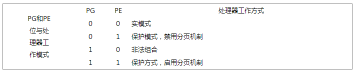

# 2 页式管理

## 2.1 分段机制存在的问题

分段, 是指将程序所需要的内存空间大小的虚拟空间, 通过映射机制映射到某个物理地址空间(映射的操作由硬件完成). 分段映射机制解决了之前操作系统存在的两个问题:

(1)地址空间没有隔离.

(2)程序运行的地址不确定.

不过分段方法存在一个严重的问题: **内存的使用效率低**.

**分段**的**内存映射单位**是**整个程序(LDT 表**); **如果内存不足**, 被换入换出到磁盘的空间都是**整个程序的所需空间**, 这会造成大量的磁盘访问操作, 并且严重降低了运行速度.

事实上, 很多时候程序运行所需要的数据只是很小的一部分, 加入到内存的数据大小可能会很小, 并**没有必要整体的写入和写出**.

分页机制解决了上面分段方法所存在的一个内存使用效率问题; 其核心思想是系统为程序执行文件中的**第 x 页**分配了**内存中的第 y 页**, 同时 y 页会添加到进程虚拟空间地址的**映射表中(页表**), 这样程序就可以通过映射访问到内存页 y 了.

## 2.2 分页存储的基本内容

分页的基本方法是将**地址空间**人为地等分成**某一个固定大小的页**; 每一**页大小**由**硬件来决定**, 或者是由**操作系统来决定**(如果**硬件支持多种大小的页**). 目前, 以大小为 4KB 的分页是绝大多数 PC 操作系统的选择.

- **逻辑空间(线性空间！！！**)等分为页; 并从 0 开始编号
- **内存空间(物理空间！！！**)等分为块, **与页面大小相同**; 从 0 开始编号
- **分配内存**时, 以块为单位将进程中的若干个页分别装入

关于进程分页. 当我们把进程的**虚拟地址空间按页**来分割, **常用的数据和代码**会被装在到**内存**; **暂时没用到的是数据和代码**则保存在**磁盘**中, 需要用到的时候, 再从磁盘中加载到内存中即可.

这里需要了解三个概念:

1. **虚拟页**(VP, Virtual Page),虚拟空间中的页;

2. **物理页**(PP, Physical Page),物理内存中的页;

3. **磁盘页**(DP, Disk Page),磁盘中的页.

**虚拟内存**的实现需要硬件的支持, 从 Virtual Address 到 Physical Address 的映射, 通过一个叫**MMU**(**Memory Mangement Unit**)的部件来完成

# 3 分页机制支持

## 3.1 硬件分页支持

**分页单元(paging unit**)把**线性地址**转换成**物理地址**. 其中的一个关键任务就是把**所请求的访问类型**与**线性地址的访问权限相比较**, 如果这次内存访问是**无效**的, 就产生一个**缺页异常**.

- **页**: 为了更高效和更经济的管理内存, **线性地址**被分为以固定长度为单位的组, 成为**页**. 页内部**连续的线性地址空间(页是连续的！！！**)被映射到**连续的物理地址**中. 这样, 内核可以指定**一个页(！！！**)的物理地址和对应的**存取权限**, 而不用指定全部线性地址的存取权限. 这里说**页**, 同时指**一组线性地址**以及这组地址**包含的数据**

- **页框**: 分页单元把所有的**RAM**分成固定长度的**页框**(page frame)(有时叫做**物理页**). 每一个页框包含一个页(page), 也就是说一个页框的长度与一个页的长度一致. 页框是主存的一部分, 因此也是一个存储区域. 区分**一页**和**一个页框**是很重要的, 前者只是**一个数据块**, 可以存放在**任何页框**或**磁盘(！！！线性空间的数据在物理页帧或磁盘可以是任何位置！！！**)中.

- **页表**: 把**线性地址**映射到**物理地址**的数据结构称为**页表**(page table). 页表存放在**主存**中, 并在启用分页单元之前必须由内核对页表进行适当的初始化.

# 3.2 常规的 32bit 分页

常规**4KB 分页**, 32 位的线性地址被分成 3 个域

| Directory(目录) | Table(页表) |  Offset(偏移量) |
| :-------------: |:-------------:| :-------------:|
| 最高 10 位 | 中间 10 位 | 最低 12 位 |

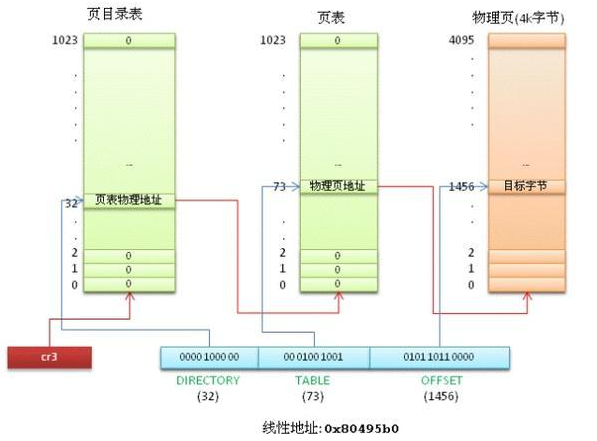

>线性地址的转换分为两步完成, 每一步都基于一种转换表, 第一种转换表称为**页目录表**(page directory), 第二种转换表称为**页表**(page table).
>
>为什么需要两级呢?
>目的在于减少每个进程页表所需的 RAM 的数量. 如果使用简单的一级页表, 将需要高达 2\^{20}个表项来表示每个进程的页表, 即时一个进程并不使用所有的地址, 二级模式通过只为进程**实际使用的那些虚拟内存区请求页表(根据需要请求页表项！！！**)来**减少内存容量**.

每个**活动的进程**必须有**一个页目录**, 但是却**没有必要**马上为**所有进程**的**所有页表**都分配 RAM, 只有在**实际需要一个页表时(一个页表对应一个页, 所以根据这个页的数据是不是需要才给分配物理内存！！！**)候才给该页表分配 RAM.

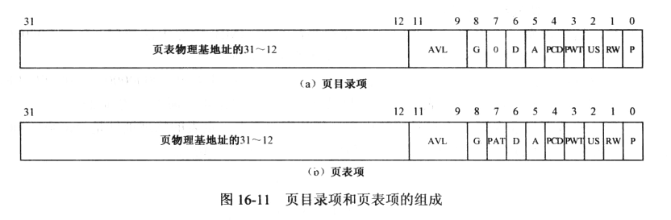

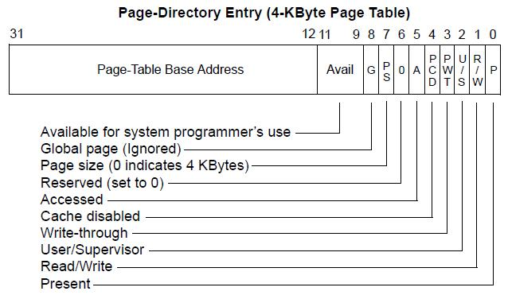

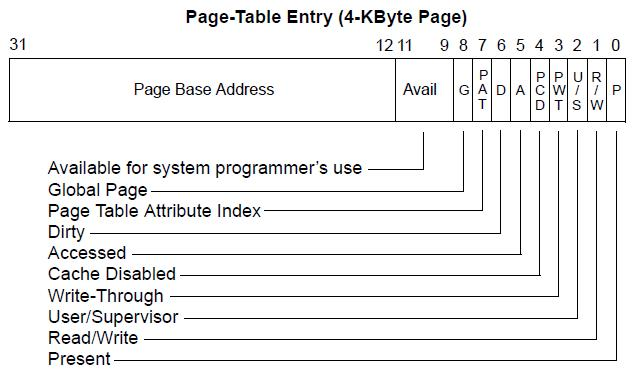

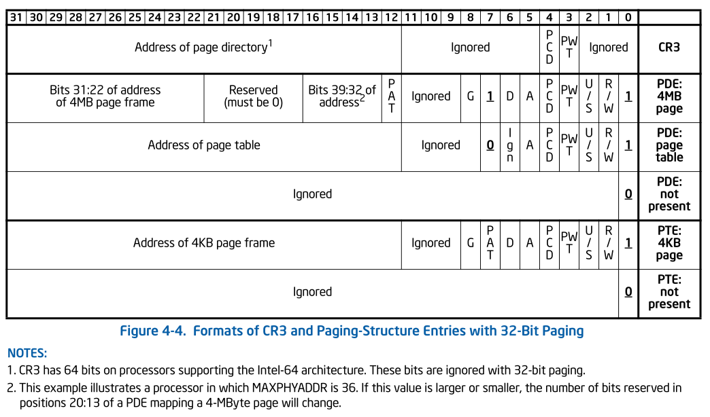

页目录项和页表项有同样的结构, 每项都包含下面的字段:

| 字段 | 描述 |
|:----:|:----|
| **Present**标志 | 如果被**置为 1**, 所指的页(或页表)就在**主存**中; 如果该标志为 0, 则这一页不在主存中, 此时这个表项剩余的位可由操作系统用于自己的目的. 如果执行一个地址转换所需的页表项或页目录项中 Present 标志被清 0, 那么分页单元就把该线性地址转换所需的页表项或页目录项中 Present 标志被清 0, 那么分页单元就把该**线性地址**存放在**控制寄存器 cr2**中, 并产生**14 号异常: 缺页异常**.  |
| bit[31:12] | 包含**页框物理地址(！！！物理地址, 不用转换)最高 20 位的字段**. 由于每一个**页框有 4KB**的容量, 它的**物理地址**必须是**4096 的倍数**, 因此**页框物理地址的最低 12 位总为 0(页框物理地址！！！**).如果**这个字段**指向一个**页目录**, 相应的页框就含有一个**页表**; 如果它指向一个页表, 相应的页框就含有一页数据 |
| **Accessed**标志 | 每当分页单元对相应页框进行寻址时就设置这个标志. 当选中的页被交换出去时, 这一标志就可以由操作系统使用. **分页单元(硬件**)从来**不重置这个标志**, 而是必须由**操作系统**去做 |
| **Dirty**标志 | 只应用于**页表项**中. 每当对一个页框进行写操作时就设置这个标志. 与 Accessed 标志一样, 当选中的页被交换出去时, 这一标志就可以由**操作系统使用**. 分页单元从来不重置这个标志, 而是必须由操作系统去做. |
| **Read/Write**标志 | 含有页或页表的**存取权限**(Read/Write 或 Read). |
| **User/Supervisor**标志 | 含有访问页或页表所需的**特权级**. |
| **PCD 和 PWT**标志 | 控制**硬件高速缓存**处理页或页表的方式. |
| **Page Size**标志 | 只应用于**页目录项**. 如果设置为 1, 则页目录项指的是 2MB 或 4MB 页框. |
| **Global**标志 | 只应用于**页表项**. 这个标志是在 Pentium Pro 中引入的, 用来**防止常用页从 TLB 高速缓存中刷新**出去. 只有在**cr4 寄存器**的**页全局启用**(Page Global Enable, PGE)标志置位时这个标志才起作用. |

**正在使用**的**页目录的物理地址(不是线性地址, 不用转换！！！**)存放在控制寄存器**CR3**中.

了解了以上结构之后, 我们看看如何从线性地址转换到物理地址的 :

- 线性地址中的 Directory 字段决定页目录中的目录项, 目录项指向适当的页表

- 线性地址中的 Table 字段又决定页表的页表项, 页表项含有页所在页框的物理地址

- 线性地址中的 Offset 地段决定了页框内的相对位置, 由**于 offset 为 12 页**, 所以一页含有 4096 字节的数据

> Directory 字段和 Table 字段都是 10 位长, 因此页目录和页表都可以多达 1024 项. 那么一个页目录可以寻址到高达 1024\*1024\*4096=232 个存储单元, 这和 32 位地址所期望的一样.

## 3.3 物理地址扩展(PAE)分页机制和扩展分页(PSE)

参见 x86 内存映射小结

### 3.3.1 PAE

处理器所支持的**RAM 大小**容易受到连接到**地址总线**上的**地址管脚树限制**.早期 Intel 处理器从 80386 到 Pentium 使用 32 位物理地址.

从理论上讲, 这样的系统可以使用高达 2\^32=4GB 的 RAM,而实际上,由于用户进程现行地址空间的需要, 4GB 的虚拟地址按照 1:3 的比例划分给内核虚拟地址空间和进程虚拟地址空间. 则内核只能直接对 1GB 的线性地址空间进行寻址.

然而, 大型服务器需要**大于 4GB 的 RAM**来同时运行数以千计的进程,所以必须扩展 32 位 80x86 架构所支持的 RAM 容量.

Intel 通过在它的处理器上把**管脚数从 32 增加到 36**满足这样的需要, 从 Pentinum Pro 开始, Intel 所有处理器的寻址能力可达到 2\^36=64GB,但是只有**引入一种新的分页机制**才能把**32 位线性地址**转换为**36 位物理地址**才能使用所增加的物理地址.

从 Pentinum Pro 处理器开始, Intel 引入一种叫做**物理地址扩展(Physical Address Extension,  PAE**)的机制.

Intel 为了**支持 PAE 改变了分页机制**

- **页表项**大小扩展到**64 位**. **64GB 的 RAM(36 位物理总线**)被分成了**2\^24 个页框(一个页 4MB**), **页表项**的**物理地址字段从 20 位扩展到了 24 位(由于页框有 2\^24 个！！**).因为 PAE**页表项**必须包含**12 个标志位**和**24 个物理地址位**,总数之和为**36**,**页表项**大小从 32 位扩展到了**64 位**,结果,**一个 4KB**的页表包含 512 个表项而不是 1024 个表项.

- 引入一个**页目录指针表**(Page Directory Pointer Table, **PDPT**)的页表新级别,它由**4 个 64 位表项(64 位！！！**)组成.

- cr3 控制寄存器包含一个**27 位**的**页目录指针表**(PDPT)**基地址字段**.因为 PDPT 存放在**RAM 的前 4GB**中,并在 32 字节(2\^5)的倍数上对齐,因此 27 位足以表示这种表的基地址

当把线性地址映射到**4KB 的页**时(**页目录项**中的**PS 标志位清 0**),32 位线性地址将按照如下方式解释

| 字段 | 描述 | 位数 |
|:---:|:---:|:---:|
| cr3 | 指向一个 PDPT | cr3 寄存器存储 |
| PGD | 指向 PDPT 中 4 个项中的一个 | 位 31\~30 |
| PMD | 指向页目录中**512 项**中的一个 | 位 29\~21 |
| PTE | 指向页表中**512 项**中的一个 | 位 20\~12 |
| page offset | 4KB 页中的偏移 | 位 11\~0 |

`2 + 9 + 9 + 12 = 32`位线性地址空间

当把现行地址映射到**2MB 的页**时(**页目录项**中的**PS 标志置为 1**),32 位线性地址按照如下方式解释

| 字段 | 描述 | 位数 |
|:---:|:---:|:---:|
| cr3 | 指向一个 PDPT | cr3 寄存器存储 |
| PGD | 指向 PDPT 中 4 个项中的一个 | 位 31\~30 |
| PMD | 指向页目录中 512 项中的一个 | 位 29\~21 |
| page offset| 2MB 页中的偏移 | 位 20\~0 |

`2 + 9 + 21 = 32 位`

总之, 一旦 cr3 被设置, 就可能寻址高达 4GB RAM, 如果我们期望对更多的 RAM 进行寻址, 就必须在 cr3 中放置一个新值, 或改变 PDPT 的内容.

但是 PAE 的主要问题是**线性地址仍然是 32 位**长,　这就需要内核黑客用同一线性地址映射不同的 RAM 区. 很显然,PAE 并没有扩大进程的线性地址空间,因为它只处理物理地址. 此外, 只有**内核能够修改进程的页表**,所以在**用户态**下运行的程序**不可能**使用**大于 4GB 的物理地址**空间.另一方面,PAE 允许内核使用容量高达 64GB 的 RAM,从而显著的**增加系统中的进程数目**

### 3.3.2 PSE

这儿**常规 32 位分页**提出的, Linux 没有使用

`10 + 22`

从 Pentium 模型开始, 80x86 微处理器引入了**扩展分页(externded paging)**, 也叫**页大小扩展[Page Size Extension]**, 它允许**页框大小为 4MB 而不是 4KB(增加页框大小！！！**). 扩展分页用于把大段连续的线性地址转换成相应的物理地址, 在这种情况下, 内核可以不用中间页表进行地址转换, 从而节省内存并保留 TLB 项.

CR4.PSE: enables 4-MByte pages for 32-bit paging.**页大小扩展**标志位(**Page Size Extension**), 使能**32-bit 分页**使用**4MByte 大小页面**. 当 CR4.PSE 为 0 时, 32-bit 分页仅能使用 4Kbyte 大小页面; 当 CR4.PSE 为 1 时,32-bit 分页既可以使用 4Kbyte 大小页面, 也可以使用 4MByte 大小页面. (注: PAE 分页模式和 IA-32e 分页模式无需 CR4.PSE 的情况下可以使用多种页面大小).

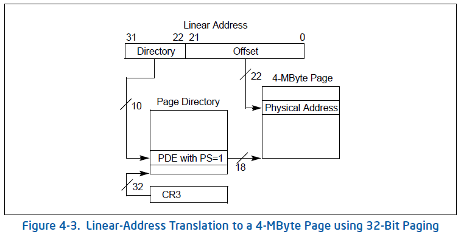

>但是**Linux 并没有采用 32\-bit 的 PSE 这种机制, PAE 的 4KB、2MB<PAE 的 PSE>和 IA-32e 的 4KB、2MB<IA-32e 的 PSE>、1GB 分页都还是支持的！！！实现查看内存管理系列《Linux3.14.12 内存管理》中《建立内核页表》**

正如前面所述, 通过设置页目录项的 Page Size 标志启用扩展分页功能. 在这种情况下, 分页单元把 32 位线性地址分成两个字段:

- **Directory**: 最高**10 位**.
- **Offfset**: 其余**22 位**.

扩展分页和正常分页的页目录项基本相同, 除了

- PDE 中的 Page Size 标志必须被设置(为 1).
- CR4.PSE 必须设置为 1.
- 20 位物理地址字段只有最高 10 位是有意义的. 这是因为每一个物理地址都是在以 4MB 为边界的地方开始的, 故**这个地址的最低 22 位为 0(页框地址的低 22 位为 0**).

通过设置**cr4 处理器寄存器的 PSE 标志**能使**扩展分页与常规分页共存**

## 3.4 64 位系统中的分页

32 位处理器普遍采用两级分页. 然而两级分页并不适用于采用 64 位系统的计算机.

原因如下 :

首先假设**一个大小为 4KB 的标准页**, 4KB 覆盖**2\^12 个地址**, 所以**offset 字段是 12 位**. 如果我们现在决定仅仅使用 64 位中的 48 位来寻址(这个限制仍然能是我们自在地拥有 256TB 的寻址空间！), 剩下的 48-12=36 位被分配给 Table 和 Directory 字段. 如果我们决定为两个字段个预留 18 位, 那么每个进程的页目录和页表都含有 2^18 个项, 即超过 256000 个项.

由于这个原因, 所有 64 位处理器的硬件分页系统都使用了额外的分页级别. 使用的级别数量取决于处理器的类型.

| 平台名称 | 页大小 | 寻址使用位数 | 分页级别 | 线性地址分级|
| --- |:----:| :-----:|:----:|:-----:|
| alpha   |   8KB   |  43   |    3   |  10+10+10+13 |
| ia64    |   4KB   |  39   |    3   |  9+9+9+12    |
| ppc64   |   4KB   |  41   |    3   |  10+10+9+12  |
| x86_64  |   4KB   |  48   |    4   |  9+9+9+9+12 |

注: ia64 是 intel 的一门高端技术, 不与 x86_64 系统兼容
IA-32e Paging 机制下线性地址映射到 4KB 的页

## 3.5 硬件保护方案

与页和页表相关的**特权级只有两个**, 因为特权由前面"常规分页"一节中所提到的 User/Supervisor 标志所控制. 若这个标志为 0, 只有当 CPL 小于 3(这意味着对于 Linux 而言, 处理器处于内核态)时才能对页寻址; 若该标志为 1, 则总能对页寻址.

此外, 与**段的 3 种存取权限**(读, 写, 执行)不同的是, **页的存取权限只有两种**(读, 写). 如果页目录项或页表项的 Read/Write 标志等于 0, 说明相应的页表或页是只读的, 否则是可读写的.

# 4 总结

80386 使用 4K 字节大小的页. 每一页都有 4K 字节长, 并在 4K 字节的边界上对齐, 即每一页的起始地址都能被 4K 整除. 因此, 80386 把**4G 字节的线性地址空间**, 划分为**1G 个页面, 每页有 4K 字节大小**. 分页机制通过把**线性地址空间中的页**, 重新定位到**物理地址空间**来进行管理, 因为**每个页面的整个 4K 字节**作为一个单位进行映射, 并且**每个页面都对齐 4K 字节的边界**, 因此, **线性地址的低 12 位**经过分页机制直接地作为**物理地址的低 12 位使用**.

## 4.1 为什么使用多级页表

假设每个进程都占用了 4G 的线性地址空间, 页表共含 1M 个表项, 每个表项占 4 个字节, 那么每个进程的页表要占据 4M 的内存空间. 为了节省页表占用的空间, 我们使用两级页表. **每个进程**都会被分配**一个页目录**, 但是只有被**实际使用页表**才会被**分配到内存**里面. 一级页表需要一次分配所有页表空间, 两级页表则可以在需要的时候再分配页表空间.

## 4.2 x86_32 两级页表结构

两级表结构的第一级称为**页目录**, 存储在一个 4K 字节的页面中. 页目录表共有 1K 个表项, 每个表项为**4 个字节**, 并指向第二级表. 线性地址的最高 10 位(即位 31\~位 32)用来产生第一级的索引, 由索引得到的表项中, 指定并选择了 1K 个二级表中的一个表.

两级表结构的第二级称为页表, 也刚好存储在一个 4K 字节的页面中, 包含 1K 个字节的表项, 每个表项包含一个页的物理基地址. 第二级页表由线性地址的中间 10 位(即位 21\~位 12)进行索引, 以获得包含页的物理地址的页表项, 这个物理地址的高 20 位与线性地址的低 12 位形成了最后的物理地址, 也就是页转化过程输出的物理地址.

两级页表结构:

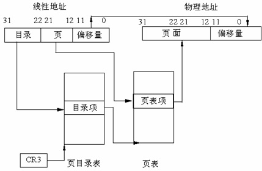

**页目录项**结构:

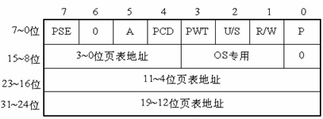

**页表项**结构:

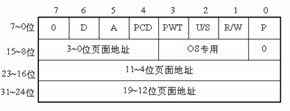

- 第 31\~12 位是 20 位页表地址, 由于页表地址的低 12 位总为 0, 所以用高 20 位指出 32 位页表地址就可以了. 因此, 一个页目录最多包含 1024 个页表地址.

- 第 0 位是存在位, 如果 P=1, 表示页表地址指向的该页在内存中, 如果 P=0, 表示不在内存中.

- 第 1 位是读/写位, 第 2 位是用户/管理员位, 这两位为页目录项提供硬件保护. 当特权级为 3 的进程要想访问页面时, 需要通过页保护检查, 而特权级为 0 的进程就可以绕过页保护.

- 第 3 位是 PWT(Page Write-Through)位, 表示**是否采用写透方式**, 写透方式就是**既写内存(RAM)也写高速缓存**,该位为 1 表示采用写透方式

- 第 4 位是 PCD(Page Cache Disable)位, 表示是否启用高速缓存,该位为 1 表示启用高速缓存.

- 第 5 位是访问位, 当对页目录项进行访问时, A 位=1.

- 第 7 位是 Page Size 标志, **只适用于页目录项**. 如果置为 1, 页目录项指的是**4MB 的页面**, 请看后面的扩展分页.

- 第 9\~11 位由操作系统专用, Linux 也没有做特殊之用.

80386 的每个页目录项指向一个页表, 页表最多含有 1024 个页面项, 每项 4 个字节, 包含页面的起始地址和有关该页面的信息. 页面的起始地址也是 4K 的整数倍, 所以页面的低 12 位也留作它用.

第 31\~12 位是 20 位物理页面地址, 除第 6 位外第 0\~5 位及 9\~11 位的用途和页目录项一样, 第 6 位是页面项独有的, 当对涉及的页面进行写操作时, D 位被置 1.

4GB 的内存只有一个页目录, 它最多有 1024 个页目录项, 每个页目录项又含有 1024 个页面项, 因此, 内存一共可以分成 1024×1024=1M 个页面. 由于每个页面为 4K 个字节, 所以, 存储器的大小正好最多为 4GB.

## 4.3 线性地址到物理地址的转换

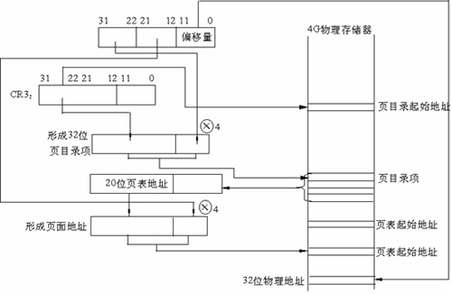

- 第一步, CR3 包含着**页目录的起始地址**, 用 32 位线性地址的**最高 10 位**A31\~A22 作为页目录的页目录项的索引, 将它**乘以 4**, 与 CR3 中的页目录的起始地址**相加**, 形成相应**页表的地址(第一个！！！**).

- 第二步, 从指定的地址中取出 32 位**页目录项**, 它的低 12 位为 0, 这 32 位是**页表的起始地址**. 用 32 位线性地址中的 A21\~A12 位作为页表中的**页面的索引**, 将它**乘以 4**, 与页表的起始地址**相加**, 形成 32 位**页面地址(第二个！！！**).

- 第三步, 将 A11~A0 作为相对于页面地址的**偏移量**, 与 32 位**页面地址相加**, 形成 32 位**物理地址(第三个！！！**).

## 4.4 扩展分页

从奔腾处理器开始, Intel 微处理器引进了扩展分页, 它允许**页的大小为 4MB**.

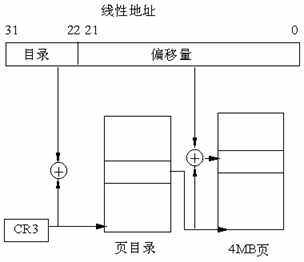

在扩展分页的情况下,分页机制把 32 位线性地址分成两个域: 最高 10 位的**目录域**和其余 22 位的**偏移量**.

## 4.5 页面高速缓存

由于在分页情况下, 每次存储器访问都要存取两级页表, 这就大大降低了访问速度. 所以, 为了提高速度, 在 386 中设置一个**最近存取页面的高速缓存硬件机制**, 它自动保持**32 项处理器最近使用的页面地址(！！！**), 因此, 可以覆盖**128K 字节的存储器地址**. 当进行存储器访问时, 先检查要访问的页面是否在高速缓存中, 如果在,  就不必经过两级访问了, 如果不在, 再进行两级访问. 平均来说, 页面高速缓存大约有 98%的命中率, 也就是说每次访问存储器时, 只有 2%的情况必须访问两级分页机构. 这就大大加快了速度.