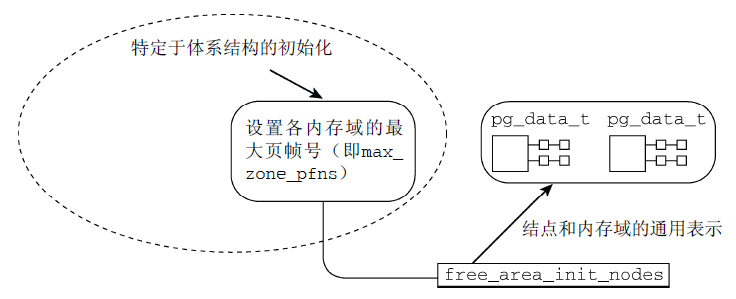

<!-- @import "[TOC]" {cmd="toc" depthFrom=1 depthTo=6 orderedList=false} -->

<!-- code_chunk_output -->

- [前景回顾](#前景回顾)
  - [启动过程中的内存初始化](#启动过程中的内存初始化)
  - [start_kernel 系统启动阶段的内存初始化过程](#start_kernel-系统启动阶段的内存初始化过程)
  - [1.3 arm64 下 setup\_arch 函数初始化内存流程](#13-arm64-下-setup_arch-函数初始化内存流程)
  - [1.4 (第一阶段)启动过程中的内存分配器](#14-第一阶段启动过程中的内存分配器)
  - [1.5 第二阶段(一)初始化内存管理数据结构](#15-第二阶段一初始化内存管理数据结构)
    - [1.5.1 特定于体系结构的设置](#151-特定于体系结构的设置)
    - [1.5.2 建立内存管理的数据结构](#152-建立内存管理的数据结构)
    - [1.5.3 移交早期的分配器到内存管理器](#153-移交早期的分配器到内存管理器)
- [2 buddy 系统初始化前的准备工作](#2-buddy-系统初始化前的准备工作)
  - [2.1 回到 setup_arch 函数(当前已经完成的工作)](#21-回到-setup_arch-函数当前已经完成的工作)
  - [2.2 bootmem_init 函数初始化内存结点和管理域](#22-bootmem_init-函数初始化内存结点和管理域)
  - [2.3 zone\_sizes\_init 函数](#23-zone_sizes_init-函数)
- [3 free\_area\_init\_nodes 初始化 NUMA 管理数据结构](#3-free_area_init_nodes-初始化-numa-管理数据结构)
  - [3.1 代码注释](#31-代码注释)
  - [3.2 设置可使用的页帧编号](#32-设置可使用的页帧编号)
  - [3.3 构建其他内存域的页帧区间](#33-构建其他内存域的页帧区间)
  - [3.4 建立结点数据结构](#34-建立结点数据结构)
- [4 free\_area\_init\_node 初始化 UMA 内存结点](#4-free_area_init_node-初始化-uma-内存结点)
  - [4.1 free\_area\_init\_node 函数注释](#41-free_area_init_node-函数注释)
  - [4.2 流程分析](#42-流程分析)
  - [4.3 alloc\_node\_mem\_map 函数](#43-alloc_node_mem_map-函数)
- [5 free\_area\_init\_core 初始化内存域 zone](#5-free_area_init_core-初始化内存域-zone)
  - [5.1 free\_area\_init\_core 函数代码注释](#51-free_area_init_core-函数代码注释)
  - [5.2 流程讲解](#52-流程讲解)
- [6 memmap\_init 初始化 page 页面](#6-memmap_init-初始化-page-页面)
- [7 总结](#7-总结)
  - [7.1 start\_kernel 启动流程](#71-start_kernel-启动流程)
  - [7.2 pidhash\_init 配置高端内存](#72-pidhash_init-配置高端内存)
  - [7.3 build\_all\_zonelists 初始化每个内存节点的 zonelists](#73-build_all_zonelists-初始化每个内存节点的-zonelists)
  - [8 链接](#8-链接)

<!-- /code_chunk_output -->

# 前景回顾

## 启动过程中的内存初始化

在初始化过程中, 还必须建立内存管理的数据结构,以及很多事务.因为内核在内存管理完全初始化之前就需要使用内存.在系统启动过程期间,使用了额外的简化的**内存管理模块**,然后在初始化完成后,将**旧的模块丢弃**掉.

因此我们可以把 linux 内核的**内存管理分三个阶段**.

| 阶段 | 起点 | 终点 | 描述 |
|:-----|:-----|:-----|:-----|
| **第一阶段** | **系统启动** | bootmem 或者 memblock**初始化完成** | 此阶段只能使用**memblock\_reserve 函数**分配内存, **早期内核**中使用 init\_bootmem\_done = 1 标识此阶段结束 |
| **第二阶段** | **bootmem 或者 memblock 初始化完** | **buddy 完成前** | **引导内存分配器 bootmem**或者**memblock**接受内存的管理工作, **早期内核**中使用 mem\_init\_done = 1 标记此阶段的结束 |
| 第三阶段 | buddy 初始化完成 | 系统停止运行 | 可以用**cache 和 buddy 分配**内存 |

## start_kernel 系统启动阶段的内存初始化过程

首先我们来看看 start\_kernel 是如何初始化系统的,start\_kernel 定义在[init/main.c?v=4.7, line 479](http://lxr.free-electrons.com/source/init/main.c?v=4.7#L479)

其代码很复杂, 我们只截取出其中与内存管理初始化相关的部分, 如下所示


```cpp
asmlinkage __visible void __init start_kernel(void)
{

    /*  设置特定架构的信息
     *	同时初始化 memblock  */
    setup_arch(&command_line);
    mm_init_cpumask(&init_mm);

    setup_per_cpu_areas();

	/*  初始化内存结点和内段区域  */
    build_all_zonelists(NULL, NULL);
    page_alloc_init();


    /*
     * These use large bootmem allocations and must precede
     * mem_init();
     * kmem_cache_init();
     */
    mm_init();

    kmem_cache_init_late();

	kmemleak_init();
    setup_per_cpu_pageset();

    rest_init();
}
```

```cpp
start_kernel()
    |---->page_address_init()
    |     考虑支持高端内存
    |     业务: 初始化 page_address_pool 链表;
    |          将 page_address_maps 数组元素按索引降序插入
    |          page_address_pool 链表;
    |          初始化 page_address_htable 数组.
    |
    |---->setup_arch(&command_line);
    |     初始化特定体系结构的内容
    	  |
    	  |---->arm64_memblock_init( );
          |     初始化引导阶段的内存分配器 memblock
          |
          |---->paging_init();
          |     分页机制初始化
          |
          |---->bootmem_init();   [当前位置]
          |     始化内存数据结构包括内存节点, 内存域和页帧 page
                |
                |---->arm64_numa_init();
                |     支持 numa 架构
                |
                |---->zone_sizes_init(min, max);
                    来初始化节点和管理区的一些数据项
                    |
                    |---->free_area_init_node
                    |   初始化内存节点
                    |
                        |---->free_area_init_core
                            |	初始化 zone
                            |
                            |---->memmap_init
                            |	初始化 page 页面
                |
                |---->memblock_dump_all();
                |   初始化完成, 显示 memblock 的保留的所有内存信息
         	   |
    |---->build_all_zonelist()
    |     为系统中的 zone 建立后备 zone 的列表.
    |     所有 zone 的后备列表都在
    |     pglist_data->node_zonelists[0]中;
    |
    |     期间也对 per-CPU 变量 boot_pageset 做了初始化.
    |
```

| 函数  | 功能 |
|:----|:----|
| [setup\_arch](http://lxr.free-electrons.com/ident?v=4.7;i=setup_arch) | 是一个特定于体系结构的设置函数, 其中一项任务是负责**初始化自举分配器** |
| [mm\_init\_cpumask](http://lxr.free-electrons.com/source/include/linux/mm_types.h?v=4.7#L522) | 初始化**CPU 屏蔽字** |
| [setup\_per\_cpu\_areas](http://lxr.free-electrons.com/ident?v=4.7;i=setup_per_cpu_areas) | 函数[(查看定义)](http://lxr.free-electrons.com/source/mm/percpu.c?v4.7#L2205])给每个 CPU 分配内存, 并拷贝.data.percpu 段的数据.为系统中的**每个 CPU 的 per\_cpu 变量申请空**间.<br>在 SMP 系统中,setup\_per\_cpu\_areas 初始化源代码中(使用[per_cpu 宏](http://lxr.free-electrons.com/source/include/linux/percpu-defs.h#L256))定义的静态 per-cpu 变量,这种变量对系统中每个 CPU 都有一个独立的副本. <br>此类变量保存在内核二进制影像的一个独立的段中,setup\_per\_cpu\_areas 的目的就是为系统中各个 CPU 分别创建一份这些数据的副本<br>在**非 SMP 系统**中这是一个**空操作** |
| [build\_all\_zonelists](http://lxr.free-electrons.com/source/mm/page_alloc.c?v4.7#L5029) | 建立并初始化**结点**和**内存域**的数据结构 |
| [mm\_init](http://lxr.free-electrons.com/source/init/main.c?v4.7#L464) | 建立了内核的**内存分配器**,<br>其中通过[**mem\_init**](http://lxr.free-electrons.com/ident?v=4.7&i=mem_init)**停用 bootmem**分配器并迁移到实际的内存管理器(比如伙伴系统)<br>然后调用**kmem\_cache\_init**函数初始化内核内部**用于小块内存区的分配器** |
| [kmem\_cache\_init\_late](http://lxr.free-electrons.com/source/mm/slab.c?v4.7#L1378) | 在**kmem\_cache\_init**之后,完善分配器的**缓存机制**,　当前 3 个可用的内核内存分配器[slab](http://lxr.free-electrons.com/source/mm/slab.c?v4.7#L1378), [slob](http://lxr.free-electrons.com/source/mm/slob.c?v4.7#L655), [slub](http://lxr.free-electrons.com/source/mm/slub.c?v=4.7#L3960)都会定义此函数　|
| [kmemleak\_init](http://lxr.free-electrons.com/source/mm/kmemleak.c?v=4.7#L1857) | Kmemleak 工作于内核态, Kmemleak 提供了一种**可选的内核泄漏检测**, 其方法类似于**跟踪内存收集器**. 当独立的对象没有被释放时, 其报告记录在 [/sys/kernel/debug/kmemleak](http://lxr.free-electrons.com/source/mm/kmemleak.c?v=4.7#L1467)中, Kmemcheck 能够帮助定位大多数内存错误的上下文 |
| [setup\_per\_cpu\_pageset](http://lxr.free-electrons.com/source/mm/page_alloc.c?v=4.7#L5392) | **初始化 CPU 高速缓存行**, 为 pagesets 的第一个数组元素分配内存, 换句话说, 其实就是第一个系统处理器分配<br>由于在分页情况下, **每次存储器访问都要存取多级页表**, 这就大大降低了访问速度. 所以, 为了提高速度, 在 CPU 中设置一个最近存取页面的**高速缓存硬件机制**, 当进行存储器访问时, 先检查要访问的页面是否在高速缓存中. |

## 1.3 arm64 下 setup\_arch 函数初始化内存流程

前面我们的内核从 start\_kernel 开始,进入 setup\_arch(),并完成了早期内存分配器的初始化和设置工作.

```cpp
void __init setup_arch(char **cmdline_p)
{
	/*  初始化 memblock  */
	arm64_memblock_init( );

	/*  分页机制初始化  */
	paging_init();

	bootmem_init();
}
```

| 流程 | 描述 |
|:---:|:----:|
| [arm64_memblock_init](http://lxr.free-electrons.com/source/arch/arm64/kernel/setup.c?v=4.7#L229) | 初始化 memblock 内存分配器 |
| [paging_init](http://lxr.free-electrons.com/source/arch/arm64/mm/mmu.c?v=4.7#L538) | 初始化分页机制 |
| [bootmem_init](http://lxr.free-electrons.com/source/arch/arm64/mm/init.c?v=4.7#L306) | 初始化内存管理 |

其中 arm64\_memblock\_init 就完成了 arm64 架构下的 memblock 的初始化

与 arm 架构类似, arm64 的 memblock 初始化没有意外,只是初始化函数成为[arm64\_memblock\_init()](http://lxr.free-electrons.com/source/arch/arm64/kernel/setup.c?v=4.7#L261), 该函数定义在[arch/arm64/mm/init.c?v=4.7, line 192](http://lxr.free-electrons.com/source/arch/arm64/mm/init.c?v=4.7#L192)

该函数主要执行了如下操作

1. 使用 arm64\_memblock\_init 来完成**memblock 机制的初始化**工作,至此 memblock 分配器接受系统中系统中内存的分配工作

2. 调用 paging\_init 来完成**系统分页机制的初始化**工作,建立页表,从而内核可以完成虚拟内存的映射和转换工作

3. 最后调用 bootmem\_init 来完成实现**buddy 内存管理所需要的**工作

## 1.4 (第一阶段)启动过程中的内存分配器

因为**bootmem 或 memblock 没有初始化**, 所以**只是使用 memblock\_reserve 函数分配内存**, 终点是**bootmem 或者 memblock 初始化完成后, 进入第二阶段, bootmem 或 memblock 开始接管**.

早期的内核中内存分配器使用的**bootmem 引导分配器**,它基于一个内存位图 bitmap, 使用最优适配算法来查找内存,但是这个分配器有很大的缺陷,最严重的就是**内存碎片**的问题, 因此在后来的内核中将其舍弃《而使用了**新的 memblock 机制**.**memblock 机制的初始化**在 arm64 上是通过[**arm64\_memblock\_init**](http://lxr.free-electrons.com/source/arch/arm64/kernel/setup.c?v=4.7#L229)函数来实现的.

## 1.5 第二阶段(一)初始化内存管理数据结构

我们之前讲了在**memblock 完成**之后,内存初始化开始进入**第二阶段**,第二阶段是一个漫长的过程,**使用 bootmem 或 memblock 管理内存**,它执行了一系列复杂的操作,从体系结构相关信息的初始化慢慢向上层展开, 其**主要执行了如下操作**

### 1.5.1 特定于体系结构的设置

在完成了基础的内存结点和内存域的初始化工作以后,我们必须克服一些**硬件的特殊设置**

- 在初始化内存的**结点和内存区域之前**,内核先通过**paging\_init 初始化了内核的分页机制**, 这样我们的**虚拟运行空间就初步建立**,并可以完成**物理地址**到**虚拟地址空间**的映射工作.

在 arm64 架构下, 内核在 start\_kernel()->setup\_arch()中通过 arm64\_memblock\_init()完成了 memblock 的初始化之后,接着通过 setup\_arch()->paging\_init()开始初始化分页机制

paging\_init 负责建立**只能**用于**内核的页表**,**用户空间**是**无法访问**的.这对管理普通应用程序和内核访问内存的方式, 有深远的影响

- 在分页机制完成后,内核通过 setup\_arch()->**bootmem\_init**开始进行**内存基本数据结构**(**内存结点 pg\_data\_t,内存域 zone 和页帧**)的初始化工作,就是在这个函数中,内核开始从**体系结构相关**的部分逐渐展开到**体系结构无关**的部分,在**zone\_sizes\_init**->**free\_area\_init\_node**中开始,内核开始进行**内存基本数据结构的初始化**,也不再依赖于**特定体系结构无关**的层次

```cpp
bootmem_init()
始化内存数据结构包括内存节点, 内存域和页帧 page
|
|---->arm64_numa_init();
|     支持 numa 架构
|
|---->zone_sizes_init(min, max);
    来初始化节点和管理区的一些数据项
    |
    |---->free_area_init_node
    |   初始化内存节点
    |
    |---->free_area_init_core
            |   初始化 zone
            |
            |---->memmap_init
            |   初始化 page 页面
|
|---->memblock_dump_all();
|   初始化完成, 显示 memblock 的保留的所有内存信息
```

### 1.5.2 建立内存管理的数据结构

对**相关数据结构的初始化**是从全局启动函数**start\_kernel**中开始的,该函数在加载内核并激活各个子系统之后执行.由于内存管理是内核一个**非常重要**的部分,因此在特定体系结构的设置步骤中**检测并确定**系统中**内存**的**分配情况**后, 会立即执行**内存管理的初始化**.

### 1.5.3 移交早期的分配器到内存管理器

最后我们的内存管理器已经初始化并设置完成,可以投入运行了,因此内核将内存管理的工作从早期的内存分配器(bootmem 或者 memblock)移交到我们的 buddy 伙伴系统.

# 2 buddy 系统初始化前的准备工作

## 2.1 回到 setup_arch 函数(当前已经完成的工作)

现在我们回到 start\_kernel()->setup\_arch()函数


```cpp
void __init setup_arch(char **cmdline_p)
{
	/*  初始化 memblock  */
	arm64_memblock_init( );

	/*  分页机制初始化  */
	paging_init();

	bootmem_init();
}
```

到目前为止我们已经完成了如下工作

- memblock 已经通过 arm64\_memblock\_init 完成了初始化,至此系统中的**内存可以通过 memblock 分配**了

- paging\_init 完成了**分页机制**的初始化,至此内核已经**布局了一套完整的虚拟内存空间**

通过 pagging\_init 创建了页表,为内核提供了一套可供内核和进程运行的虚拟运行空间,我们可以安全的**进行内存的分配**了

因此该是时候初始化我们强大的 buddy 系统了.

内核接着 setup\_arch()->bootmem\_init()函数开始执行

体系结构相关的代码需要在启动期间建立如下信息

- 系统中**各个内存域的页帧边界**, 保存在**max\_zone\_pfn 数组(不是全局变量, 所有内存域！！！**)

- **早期的内核**还需记录**各结点(！！！)页帧的分配情况**, 保存在**全局变量 early\_node\_map**中

zone\_sizes\_init 函数:



内核提供了一个**通用的框架**,用于将上述信息转换为伙伴系统预期的**节点**和**内存域数据结构**,但是在此之前各个体系结构必须自行建立相关结构.

## 2.2 bootmem_init 函数初始化内存结点和管理域

arm64 架构下, 在 setup\_arch 中通过 paging\_init 函数初始化内核分页机制之后,内核通过`bootmem_init()`开始完成**内存结点和内存区域的初始化**工作,该函数定义在[arch/arm64/mm/init.c, line 306](http://lxr.free-electrons.com/source/arch/arm64/mm/init.c?v=4.7#L306)

```cpp
void __init bootmem_init(void)
{
    unsigned long min, max;

    min = PFN_UP(memblock_start_of_DRAM());
    max = PFN_DOWN(memblock_end_of_DRAM());

    early_memtest(min << PAGE_SHIFT, max << PAGE_SHIFT);
    /* max_low_pfn 也是这么大！！！*/
    max_pfn = max_low_pfn = max;

    arm64_numa_init();
    /*
     * Sparsemem tries to allocate bootmem in memory_present(), so must be
     * done after the fixed reservations.
     */
    arm64_memory_present();

    sparse_init();
    zone_sizes_init(min, max);

    high_memory = __va((max << PAGE_SHIFT) - 1) + 1;
    memblock_dump_all();
}
```

```cpp
// mm/memblock.c
phys_addr_t __init_memblock memblock_start_of_DRAM(void)
{
	return memblock.memory.regions[0].base;
}

phys_addr_t __init_memblock memblock_end_of_DRAM(void)
{
	int idx = memblock.memory.cnt - 1;

	return (memblock.memory.regions[idx].base + memblock.memory.regions[idx].size);
}
```

**因为是 64 位, 所以 max\_low\_pfn=max！！！**

**min、max 是所有内存信息中最小、最大页帧号**.

## 2.3 zone\_sizes\_init 函数

在初始化**内存结点**和**内存域**之前,内核首先通过**setup\_arch**()-->**bootmem\_init**()-->**zone\_sizes\_init**()来**初始化节点和管理区**的一些数据项,其中关键的是**初始化**了系统中**各个内存域的页帧边界**, 保存在**max\_zone\_pfn 数组(非全局变量！！！**).

[zone\_sizes\_init](http://lxr.free-electrons.com/source/arch/arm64/mm/init.c?v=4.7#L92)函数定义在[**arch/arm64/mm/init.c**?v=4.7, line 92](http://lxr.free-electrons.com/source/arch/arm64/mm/init.c?v=4.7#L92),由于**arm64 支持 NUMA 和 UMA 两种存储器架构**,因此该函数**依照 NUMA 和 UMA**, 有**两种不同的实现**.

```cpp
#ifdef CONFIG_NUMA

static void __init zone_sizes_init(unsigned long min, unsigned long max)
{
    // min、max 是所有内存信息中最小、最大页帧号
    // MAX_NR_ZONES 是一个节点能容纳的 zone 的最大个数(5), 静态定义的宏, 不是 enum zone_type 的__MAX_NR_ZONES
    // 每个 zone 的 pfn 都初始化为 0
    unsigned long max_zone_pfns[MAX_NR_ZONES]  = {0};

    if (IS_ENABLED(CONFIG_ZONE_DMA32))
        max_zone_pfns[ZONE_DMA32] = PFN_DOWN(max_zone_dma_phys());
    max_zone_pfns[ZONE_NORMAL] = max;

    free_area_init_nodes(max_zone_pfns);
}

#else

static void __init zone_sizes_init(unsigned long min, unsigned long max)
{
    struct memblock_region *reg;
    unsigned long zone_size[MAX_NR_ZONES], zhole_size[MAX_NR_ZONES];
    unsigned long max_dma = min;

    memset(zone_size, 0, sizeof(zone_size));

    /* 4GB maximum for 32-bit only capable devices */
#ifdef CONFIG_ZONE_DMA32
    max_dma = PFN_DOWN(arm64_dma_phys_limit);
    zone_size[ZONE_DMA32] = max_dma - min;
#endif
    zone_size[ZONE_NORMAL] = max - max_dma;

    memcpy(zhole_size, zone_size, sizeof(zhole_size));

    for_each_memblock(memory, reg) {
        unsigned long start = memblock_region_memory_base_pfn(reg);
        unsigned long end = memblock_region_memory_end_pfn(reg);

        if (start >= max)
            continue;

#ifdef CONFIG_ZONE_DMA32
        if (start < max_dma) {
            unsigned long dma_end = min(end, max_dma);
            zhole_size[ZONE_DMA32] -= dma_end - start;
        }
#endif
        if (end > max_dma) {
            unsigned long normal_end = min(end, max);
            unsigned long normal_start = max(start, max_dma);
            zhole_size[ZONE_NORMAL] -= normal_end - normal_start;
        }
    }

    free_area_init_node(0, zone_size, min, zhole_size);
}

#endif /* CONFIG_NUMA */
```

在获取了**三个管理区(DMA32、NORMAL、MOVABLE 这三个, ARM64 的不存在 highmem 管理域！！！)的页面数**后,**NUMA 架构**下通过**free\_area\_init\_nodes**()来完成后续工作,其中核心函数为**free\_area\_init\_node**(),用来针对**特定的节点**进行初始化,由于**UMA 架构**下只有一个内存结点,因此直接通过**free\_area\_init\_node**来完成内存结点的初始化

截至到目前为止, 体系结构相关的部分已经结束了,各个体系结构已经自行建立了自己所需的一些底层数据结构,这些结构建立好以后,内核将繁重的**内存数据结构创建和初始化**的工作交给 free\_area\_init\_node(s)函数来完成

# 3 free\_area\_init\_nodes 初始化 NUMA 管理数据结构

>注意
>
>此部分内容参照
>
>[Linux 内存管理伙伴算法](http://www.linuxidc.com/Linux/2012-09/70711p3.htm)
>
>[linux 内存管理 - paging_init 函数](http://blog.csdn.net/decload/article/details/8080126)

[free\_area\_init\_nodes](http://lxr.free-electrons.com/source/mm/page_alloc.c?v=4.7#L6460)初始化了**NUMA 系统**中**所有结点**的**pg\_data\_t 和 zone、page 的数据**,并打印了管理区信息,该函数定义在[**mm/page_alloc.c**?v=4.7, line 6460](http://lxr.free-electrons.com/source/mm/page_alloc.c?v=4.7#L6460)

## 3.1 代码注释

```cpp
// mm/page_alloc.c

//  初始化各个节点的所有 pg_data_t 和 zone、page 的数据
void __init free_area_init_nodes(unsigned long *max_zone_pfn)
{
    unsigned long start_pfn, end_pfn;
    int i, nid;

    /* Record where the zone boundaries are
     * 全局数组 arch_zone_lowest_possible_pfn
     * 用来存储各个内存域可使用的最低内存页帧编号   */
    memset(arch_zone_lowest_possible_pfn, 0,
                sizeof(arch_zone_lowest_possible_pfn));

    /* 全局数组 arch_zone_highest_possible_pfn
     * 用来存储各个内存域可使用的最高内存页帧编号   */
	memset(arch_zone_highest_possible_pfn, 0,
                sizeof(arch_zone_highest_possible_pfn));

	/* 辅助函数 find_min_pfn_with_active_regions
     * 用于找到注册的最低内存域中可用的编号最小的页帧 */
    arch_zone_lowest_possible_pfn[0] = find_min_pfn_with_active_regions();

    /*  max_zone_pfn 记录了各个内存域包含的最大页帧号  */
    arch_zone_highest_possible_pfn[0] = max_zone_pfn[0];

    /*  依次遍历, 确定各个内存域的边界    */
    // MAX_NR_ZONES 是一个节点能容纳的 zone 的最大个数(5), 静态定义的宏
    for (i = 1; i < MAX_NR_ZONES; i++) {

    	/*  由于 ZONE_MOVABLE 是一个虚拟内存域
         *  不与真正的硬件内存域关联
         *  该内存域的边界总是设置为 0 */
        if (i == ZONE_MOVABLE)
            continue;

        /*  第 n 个内存域的最小页帧
         *  即前一个(第 n-1 个)内存域的最大页帧  */
        arch_zone_lowest_possible_pfn[i] =
            arch_zone_highest_possible_pfn[i-1];
        /*  不出意外, 当前内存域的最大页帧
         *  由 max_zone_pfn 给出  */
        arch_zone_highest_possible_pfn[i] =
            max(max_zone_pfn[i], arch_zone_lowest_possible_pfn[i]);
    }
    arch_zone_lowest_possible_pfn[ZONE_MOVABLE] = 0;
    arch_zone_highest_possible_pfn[ZONE_MOVABLE] = 0;

    /* Find the PFNs that ZONE_MOVABLE begins at in each node */
    memset(zone_movable_pfn, 0, sizeof(zone_movable_pfn));
    /*  用于计算进入 ZONE_MOVABLE 的内存数量  */
    find_zone_movable_pfns_for_nodes();

    /* Print out the zone ranges
     * 将各个内存域的最大、最小页帧号显示出来  */
    pr_info("Zone ranges:\n");
    for (i = 0; i < MAX_NR_ZONES; i++) {
        if (i == ZONE_MOVABLE)
            continue;
        pr_info("  %-8s ", zone_names[i]);
        if (arch_zone_lowest_possible_pfn[i] ==
                arch_zone_highest_possible_pfn[i])
            pr_cont("empty\n");
        else
            pr_cont("[mem %#018Lx-%#018Lx]\n",
                (u64)arch_zone_lowest_possible_pfn[i]
                    << PAGE_SHIFT,
                ((u64)arch_zone_highest_possible_pfn[i]
                    << PAGE_SHIFT) - 1);
    }

    /* Print out the PFNs ZONE_MOVABLE begins at in each node */
    pr_info("Movable zone start for each node\n");
    for (i = 0; i < MAX_NUMNODES; i++) {
    	/*  对每个结点来说, zone_movable_pfn[node_id]
         *  表示 ZONE_MOVABLE 在 movable_zone 内存域中所取得内存的起始地址
         *  内核确保这些页将用于满足符合 ZONE_MOVABLE 职责的内存分配 */
        if (zone_movable_pfn[i])
        {
        	/*  显示各个内存域的分配情况  */
            pr_info("  Node %d: %#018Lx\n", i,
                   (u64)zone_movable_pfn[i] << PAGE_SHIFT);
        }
    }

    /* Print out the early node map */
    pr_info("Early memory node ranges\n");
    for_each_mem_pfn_range(i, MAX_NUMNODES, &start_pfn, &end_pfn, &nid)
        pr_info("  node %3d: [mem %#018Lx-%#018Lx]\n", nid,
            (u64)start_pfn << PAGE_SHIFT,
            ((u64)end_pfn << PAGE_SHIFT) - 1);

    /* Initialise every node */
    mminit_verify_pageflags_layout();
    setup_nr_node_ids();

    /*  代码遍历所有的活动结点,
     *  并分别对各个结点调用 free_area_init_node 建立数据结构,
     *  该函数需要结点第一个可用的页帧作为一个参数,
     *  而 find_min_pfn_for_node 则从 early_node_map 数组提取该信息   */
    for_each_online_node(nid) {
        pg_data_t *pgdat = NODE_DATA(nid);
        free_area_init_node(nid, NULL,
                find_min_pfn_for_node(nid), NULL);

        /* Any memory on that node
         * 根据 node_present_pages 字段判断结点具有内存
         * 则在结点位图中设置 N_HIGH_MEMORY 标志
         * 该标志只表示结点上存在普通或高端内存
         * 因此 check_for_regular_memory
         * 进一步检查低于 ZONE_HIGHMEM 的内存域中是否有内存
         * 并据此在结点位图中相应地设置 N_NORMAL_MEMORY   */
        if (pgdat->node_present_pages)
            node_set_state(nid, N_MEMORY);
        check_for_memory(pgdat, nid);
    }
}
```

free\_area\_init\_nodes 函数中通过**循环遍历各个节点**, 循环中调用了**free\_area\_init\_node**函数初始化**该节点对应的 pg\_data\_t 和 zone、page**的数据.

## 3.2 设置可使用的页帧编号

free\_area\_init\_nodes 首先必须分析并改写特定于**体系结构**的代码提供的信息. 其中, 需要对照在**zone\_max\_pfn 和 zone\_min\_pfn**中指定的**内存域的边界**, 计算**各个内存域**可使用的**最低和最高的页帧编号**. 使用了**两个全局数组来存储这些信息**:

参见[**mm/page_alloc.c**?v=4.7, line 259)](http://lxr.free-electrons.com/source/mm/page_alloc.c?v=4.7#L259)

```cpp
static unsigned long __meminitdata arch_zone_lowest_possible_pfn[MAX_NR_ZONES];

static unsigned long __meminitdata arch_zone_highest_possible_pfn[MAX_NR_ZONES];
```

- **全局数组 arch\_zone\_lowest\_possible\_pfn**用来存储**各个内存域**可使用的**最低内存页帧编号**

- **全局数组 arch\_zone\_highest\_possible\_pfn**用来存储**各个内存域**可使用的**最高内存页帧编号**

```cpp
// include/generated/bounds.h
#define MAX_NR_ZONES 5
```

**MAX\_NR\_ZONES 和这两个值都是静态编译产生的！！！**

通过**max\_zone\_pfn**传递给 free\_area\_init\_nodes 的信息记录了**各个内存域**包含的**最大页帧号**.

free\_area\_init\_nodes 将该信息转换为一种更方便的表示形式, 即以［**low,high**］形式描述**各个内存域的页帧区间**, 存储在前述的**全局变量**中(我省去了对这些变量填充字节 0 的初始化过程):

```cpp
/* 辅助函数 find_min_pfn_with_active_regions
* 用于找到注册的最低内存域中可用的编号最小的页帧 */
arch_zone_lowest_possible_pfn[0] = find_min_pfn_with_active_regions();

/*  max_zone_pfn 记录了各个内存域包含的最大页帧号  */
arch_zone_highest_possible_pfn[0] = max_zone_pfn[0];

/*  从 1 开始依次遍历, 确定各个内存域的边界    */
for (i = 1; i < MAX_NR_ZONES; i++) {
    /*  由于 ZONE_MOVABLE 是一个虚拟内存域
     *  不与真正的硬件内存域关联
     *  该内存域的边界总是设置为 0 */
    if (i == ZONE_MOVABLE)
        continue;
    /*  第 n 个内存域的最小页帧
     *  即前一个(第 n-1 个)内存域的最大页帧  */
    arch_zone_lowest_possible_pfn[i] =
        arch_zone_highest_possible_pfn[i-1];
    /*  不出意外, 当前内存域的最大页帧
     *  由 max_zone_pfn 给出  */
    arch_zone_highest_possible_pfn[i] =
        max(max_zone_pfn[i], arch_zone_lowest_possible_pfn[i]);
}
```

辅助函数**find\_min\_pfn\_with\_active\_regions**用于找到注册的**最低内存域中可用的编号最小的页帧**. 该内存域**不一定是 ZONE\_DMA**, 例如, 在计算机不需要 DMA 内存的情况下也可以是 ZONE\_NORMAL. **最低内存域**的**最大页帧号**可以从 max\_zone\_pfn 提供的信息直接获得.

接下来构建**其他内存域**的页帧区间, 方法很直接: 第 n 个内存域的最小页帧, 即前一个(第 n-1 个)内存域的最大页帧. 当前内存域的最大页帧由 max\_zone\_pfn 给出

## 3.3 构建其他内存域的页帧区间

```cpp
void __init free_area_init_nodes(unsigned long *max_zone_pfn)
{
	/*  ......  */

    arch_zone_lowest_possible_pfn[ZONE_MOVABLE] = 0;
    arch_zone_highest_possible_pfn[ZONE_MOVABLE] = 0;

    /* Find the PFNs that ZONE_MOVABLE begins at in each node */
    memset(zone_movable_pfn, 0, sizeof(zone_movable_pfn));
    /*  用于计算进入 ZONE_MOVABLE 的内存数量  */
    find_zone_movable_pfns_for_nodes();

    /*  ......  */
}
```
由于**ZONE\_MOVABLE**是一个**虚拟内存域, 不与真正的硬件内存域**关联, 该内存域的边界总是设置为 0. 回忆前文, 可知只有在指定了**内核命令行参数 kernelcore 或 movablecore**之一
时, 该**内存域才会存在**.

该内存域一般开始于**各个结点**的**某个特定内存域**的**某一页帧号**. 相应的编号在**find\_zone\_movable\_pfns\_for\_nodes**里计算.

现在可以向用户提供一些有关已确定的页帧区间的信息. 举例来说, 其中可能包括下列内容(输出取自 AMD64 系统, 有 4GiB 物理内存):

```cpp
> dmesg

Zone PFN ranges:
DMA 0 0 -> 4096
DMA32 4096 -> 1048576
Normal 1048576 -> 1245184
```

x86\_64 系统, 16GB 物理内存:

```
[root@tsinghua-pcm ~]# free -h
              total        used        free      shared  buff/cache   available
Mem:            15G        912M         11G         28M        3.7G         14G
Swap:          2.0G          0B        2.0G
```

```
[root@tsinghua-pcm ~]#dmesg
···
BIOS-provided physical RAM map:
BIOS-e820: [mem 0x0000000000000000-0x000000000009ebff] usable
BIOS-e820: [mem 0x000000000009ec00-0x000000000009ffff] reserved
BIOS-e820: [mem 0x00000000000dc000-0x00000000000fffff] reserved
BIOS-e820: [mem 0x0000000000100000-0x00000000bfecffff] usable
BIOS-e820: [mem 0x00000000bfed0000-0x00000000bfefefff] ACPI data
BIOS-e820: [mem 0x00000000bfeff000-0x00000000bfefffff] ACPI NVS
BIOS-e820: [mem 0x00000000bff00000-0x00000000bfffffff] usable
BIOS-e820: [mem 0x00000000f0000000-0x00000000f7ffffff] reserved
BIOS-e820: [mem 0x00000000fec00000-0x00000000fec0ffff] reserved
BIOS-e820: [mem 0x00000000fee00000-0x00000000fee00fff] reserved
BIOS-e820: [mem 0x00000000fffe0000-0x00000000ffffffff] reserved
BIOS-e820: [mem 0x0000000100000000-0x000000043fffffff] usable
···
NUMA: Node 0 [mem 0x00000000-0x0009ffff] + [mem 0x00100000-0xbfffffff] -> [mem 0x00000000-0xbfffffff]
NUMA: Node 0 [mem 0x00000000-0xbfffffff] + [mem 0x100000000-0x43fffffff] -> [mem 0x00000000-0x43fffffff]
NODE_DATA(0) allocated [mem 0x43ffd5000-0x43fffffff]
crashkernel: memory value expected
···
Zone ranges:
   DMA      [mem 0x0000000000001000-0x0000000000ffffff]
   DMA32    [mem 0x0000000001000000-0x00000000ffffffff]
   Normal   [mem 0x0000000100000000-0x000000043fffffff]
   Device   empty
Movable zone start for each node
Early memory node ranges
   node   0: [mem 0x0000000000001000-0x000000000009dfff]
   node   0: [mem 0x0000000000100000-0x00000000bfecffff]
   node   0: [mem 0x00000000bff00000-0x00000000bfffffff]
   node   0: [mem 0x0000000100000000-0x000000043fffffff]
```

注: **0x000000043fffffff 即 16GB, BIOS 全部已经识别到了！！！**

## 3.4 建立结点数据结构

free\_area\_init\_nodes 剩余的部分**遍历所有结点**, 分别建立其数据结构

```cpp
// mm/page_alloc.c

void __init free_area_init_nodes(unsigned long *max_zone_pfn)
{
	/*  输出有关内存域的信息  */
	/*  ......  */

    /*  代码遍历所有的活动结点,
     *  并分别对各个结点调用 free_area_init_node 建立数据结构,
     *  该函数需要结点第一个可用的页帧作为一个参数,
     *  而 find_min_pfn_for_node 则从 early_node_map 数组提取该信息   */
    for_each_online_node(nid) {
        pg_data_t *pgdat = NODE_DATA(nid);
        free_area_init_node(nid, NULL,
                find_min_pfn_for_node(nid), NULL);

        /* Any memory on that node
         * 根据 node_present_pages 字段判断结点具有内存
         * 则在结点位图中设置 N_HIGH_MEMORY 标志
         * 该标志只表示结点上存在普通或高端内存
         * 因此 check_for_regular_memory
         * 进一步检查低于 ZONE_HIGHMEM 的内存域中是否有内存
         * 并据此在结点位图中相应地设置 N_NORMAL_MEMORY   */
        if (pgdat->node_present_pages)
            node_set_state(nid, N_MEMORY);
        check_for_memory(pgdat, nid);
    }

    /*  ......  */
}
```

代码遍历**所有活动结点**, 并分别对**各个结点**调用**free\_area\_init\_node**建立数据结构. 该函数需要**结点第一个可用的页帧**作为一个参数, 而 find\_min\_pfn\_for\_node 则从**early\_node\_map 数组**提取该信息.

如果根据**node\_present\_pages**字段判断**结点具有内存**, 则在结点位图中设置 N\_HIGH\_MEMORY 标志. 我们知道该标志**只表示**结点上存在**普通或高端内存**, 因此**check\_for\_regular\_memory**进一步检查**低于 ZONE\_HIGHMEM**的内存域中是否有内存, 并据此在结点位图中相应地**设置 N\_NORMAL\_MEMORY 标志**

# 4 free\_area\_init\_node 初始化 UMA 内存结点

## 4.1 free\_area\_init\_node 函数注释

该函数定义在[mm/page_alloc.c?v=4.7, line 6076](http://lxr.free-electrons.com/source/mm/page_alloc.c?v=4.7#L6076)

```cpp
void __paginginit free_area_init_node(int nid, unsigned long *zones_size,
        unsigned long node_start_pfn, unsigned long *zholes_size)
{
    pg_data_t *pgdat = NODE_DATA(nid);
    unsigned long start_pfn = 0;
    unsigned long end_pfn = 0;

    /* pg_data_t should be reset to zero when it's allocated */
    WARN_ON(pgdat->nr_zones || pgdat->classzone_idx);

    reset_deferred_meminit(pgdat);
    pgdat->node_id = nid;
    pgdat->node_start_pfn = node_start_pfn;
#ifdef CONFIG_HAVE_MEMBLOCK_NODE_MAP
    get_pfn_range_for_nid(nid, &start_pfn, &end_pfn);
    pr_info("Initmem setup node %d [mem %#018Lx-%#018Lx]\n", nid,
        (u64)start_pfn << PAGE_SHIFT,
        end_pfn ? ((u64)end_pfn << PAGE_SHIFT) - 1 : 0);
#else
    start_pfn = node_start_pfn;
#endif
	/*  首先累计各个内存域的页数
     *	计算结点中页的总数
     *	对连续内存模型而言
     *	这可以通过 zone_sizes_init 完成
     *	但 calculate_node_totalpages 还考虑了内存空洞 */
    calculate_node_totalpages(pgdat, start_pfn, end_pfn,
                  zones_size, zholes_size);
	/*  分配了该节点的页面描述符数组
     *  [pgdat->node_mem_map 数组的内存分配  */
    alloc_node_mem_map(pgdat);
#ifdef CONFIG_FLAT_NODE_MEM_MAP
    printk(KERN_DEBUG "free_area_init_node: node %d, pgdat %08lx, node_mem_map %08lx\n",
        nid, (unsigned long)pgdat,
        (unsigned long)pgdat->node_mem_map);
#endif

    /*  对该节点的每个区[DMA,NORMAL,HIGH]的的结构进行初始化  */
    free_area_init_core(pgdat);
}
```
## 4.2 流程分析

- [calculate\_node\_totalpages](http://lxr.free-electrons.com/source/mm/page_alloc.c?v=4.7#L5789)函数累计各个内存域的页数, 计算结点中页的总数. 对**连续内存模型**而言, 这可以通过**zone\_sizes\_init 完成**, 但 calculate\_node\_totalpages 还考虑了内存空洞,该函数定义在[**mm/page_alloc.c**, line 5789](http://lxr.free-electrons.com/source/mm/page_alloc.c?v=4.7#L5789)

以下例子取自一个 UMA 系统, 具有 512 MiB 物理内存.

```cpp
> dmesg
...
On node 0 totalpages: 131056
```

UMA 系统, x86\_64 系统, 16GB 内存

```
On node 0 totalpages: 4194157
    DMA zone: 64 pages used for memmap
    DMA zone: 21 pages reserved
    DMA zone: 3997 pages, LIFO batch:0
    DMA32 zone: 12224 pages used for memmap
    DMA32 zone: 782288 pages, LIFO batch:31
    Normal zone: 53248 pages used for memmap
    Normal zone: 3407872 pages, LIFO batch:31
```

4194157 个页面, 一个页面 4KB, 一共 15GB 内存大小

- [alloc\_node\_mem\_map(pgdat)](http://lxr.free-electrons.com/source/mm/page_alloc.c?v=4.7#L6030)函数分配了**该节点的页面描述符数组**[pgdat->node\_mem\_map 数组的内存分配.

- 继续调用[free\_area\_init\_core](http://lxr.free-electrons.com/source/mm/page_alloc.c?v=4.7#L5932)函数, 继续初始化**该节点的 pg\_data\_t 结构**, **初始化 zone 以及 page 结构** , ##2.6	**free\_area\_init\_core 函数是初始化 zone 的核心**

## 4.3 alloc\_node\_mem\_map 函数

alloc\_node\_mem\_map 负责初始化一个简单但非常重要的数据结构. 如上所述, 系统中的**各个物理内存页**, 都对应着一个**struct page 实例**. 该结构的初始化由 alloc\_node\_mem\_map 执行


```cpp
static void __init_refok alloc_node_mem_map(struct pglist_data *pgdat)
{
    unsigned long __maybe_unused start = 0;
    unsigned long __maybe_unused offset = 0;

    /* Skip empty nodes */
    if (!pgdat->node_spanned_pages)
        return;

#ifdef CONFIG_FLAT_NODE_MEM_MAP
    start = pgdat->node_start_pfn & ~(MAX_ORDER_NR_PAGES - 1);
    offset = pgdat->node_start_pfn - start;
    /* ia64 gets its own node_mem_map, before this, without bootmem */
    if (!pgdat->node_mem_map) {
        unsigned long size, end;
        struct page *map;

        /*
         * The zone's endpoints aren't required to be MAX_ORDER
         * aligned but the node_mem_map endpoints must be in order
         * for the buddy allocator to function correctly.
         */
        end = pgdat_end_pfn(pgdat);
        end = ALIGN(end, MAX_ORDER_NR_PAGES);
        size =  (end - start) * sizeof(struct page);
        map = alloc_remap(pgdat->node_id, size);
        if (!map)
            map = memblock_virt_alloc_node_nopanic(size,
                                   pgdat->node_id);
        pgdat->node_mem_map = map + offset;
    }
#ifndef CONFIG_NEED_MULTIPLE_NODES
    /*
     * With no DISCONTIG, the global mem_map is just set as node 0's
     */
    if (pgdat == NODE_DATA(0)) {
        mem_map = NODE_DATA(0)->node_mem_map;
#if defined(CONFIG_HAVE_MEMBLOCK_NODE_MAP) || defined(CONFIG_FLATMEM)
        if (page_to_pfn(mem_map) != pgdat->node_start_pfn)
            mem_map -= offset;
#endif /* CONFIG_HAVE_MEMBLOCK_NODE_MAP */
    }
#endif
#endif /* CONFIG_FLAT_NODE_MEM_MAP */
}
```
**没有页的空结点**显然可以**跳过**. 如果特定于体系结构的代码尚未建立内存映射(这是可能的, 例如, 在 IA-64 系统上), 则必须分配与该结点关联的所有 struct page 实例所需的内存. 各个体系结构可以为此提供一个特定的函数. 但目前只有在 IA-32 系统上使用不连续内存配置时是这样. 在所有其他的配置上, 则使用普通的自举内存分配器进行分配. 请注意, 代码将内存映射对齐到伙伴系统的最大分配阶, 因为要使所有的计算都工作正常, 这是必需的.

指向该空间的指针不仅保存在 pglist\_data 实例中, 还保存在全局变量**mem\_map**中, 前提是**当前考察的结点**是系统的**第 0 个结点**(如果系统只有一个内存结点, 则总是这样). **mem\_map 是一个全局数组**, 在讲解内存管理时, 我们会经常遇到, 定义在[mm/memory.c?v=4.7, line 85](http://lxr.free-electrons.com/source/mm/memory.c?v=4.7#L85)

```cpp
struct page *mem_map;
```

然后在 free\_area\_init\_node 函数的最后,通过 free\_area\_init\_core 来完成**内存域 zone 的初始化**

# 5 free\_area\_init\_core 初始化内存域 zone

初始化内存域数据结构涉及的繁重工作由 free\_area\_init\_core 执行, 它会依次遍历结点的所有内存域, 该函数定义在[mm/page_alloc.c?v=4.7, line 5932](http://lxr.free-electrons.com/source/mm/page_alloc.c?v=4.7#L5932)

## 5.1 free\_area\_init\_core 函数代码注释

```cpp
/*
 * Set up the zone data structures:
 *   - mark all pages reserved
 *   - mark all memory queues empty
 *   - clear the memory bitmaps
 *
 * NOTE: pgdat should get zeroed by caller.
 */
static void __paginginit free_area_init_core(struct pglist_data *pgdat)
{
    enum zone_type j;
    int nid = pgdat->node_id;
    int ret;

    /*  初始化 pgdat->node_size_lock 自旋锁  */
    pgdat_resize_init(pgdat);
#ifdef CONFIG_NUMA_BALANCING
    spin_lock_init(&pgdat->numabalancing_migrate_lock);
    pgdat->numabalancing_migrate_nr_pages = 0;
    pgdat->numabalancing_migrate_next_window = jiffies;
#endif
#ifdef CONFIG_TRANSPARENT_HUGEPAGE
    spin_lock_init(&pgdat->split_queue_lock);
    INIT_LIST_HEAD(&pgdat->split_queue);
    pgdat->split_queue_len = 0;
#endif

    /*  初始化 pgdat->kswapd_wait 等待队列  */
    init_waitqueue_head(&pgdat->kswapd_wait);
    /*  初始化页换出守护进程创建空闲块的大小
     *  为 2^kswapd_max_order  */
    init_waitqueue_head(&pgdat->pfmemalloc_wait);
#ifdef CONFIG_COMPACTION
    init_waitqueue_head(&pgdat->kcompactd_wait);
#endif
    pgdat_page_ext_init(pgdat);

	/* 遍历每个管理区 */
    for (j = 0; j < MAX_NR_ZONES; j++) {
        struct zone *zone = pgdat->node_zones + j;
        unsigned long size, realsize, freesize, memmap_pages;
        unsigned long zone_start_pfn = zone->zone_start_pfn;

        /*  size 为该管理区中的页框数, 包括洞 */
        size = zone->spanned_pages;
         /* realsize 为管理区中的页框数, 不包括洞  /
        realsize = freesize = zone->present_pages;

        /*
         * Adjust freesize so that it accounts for how much memory
         * is used by this zone for memmap. This affects the watermark
         * and per-cpu initialisations
         * 调整 realsize 的大小, 即减去 page 结构体占用的内存大小  */
        /*  memmap_pags 为包括洞的所有页框的 page 结构体所占的大小  */
        memmap_pages = calc_memmap_size(size, realsize);
        if (!is_highmem_idx(j)) {
            if (freesize >= memmap_pages) {
                freesize -= memmap_pages;
                if (memmap_pages)
                    printk(KERN_DEBUG
                           "  %s zone: %lu pages used for memmap\n",
                           zone_names[j], memmap_pages);
            } else  /*  内存不够存放 page 结构体  */
                pr_warn("  %s zone: %lu pages exceeds freesize %lu\n",
                    zone_names[j], memmap_pages, freesize);
        }

        /* Account for reserved pages
         * 调整 realsize 的大小, 即减去 DMA 保留页的大小  */
        if (j == 0 && freesize > dma_reserve) {
            freesize -= dma_reserve;
            printk(KERN_DEBUG "  %s zone: %lu pages reserved\n",
                    zone_names[0], dma_reserve);
        }

        if (!is_highmem_idx(j))
            nr_kernel_pages += freesize;
        /* Charge for highmem memmap if there are enough kernel pages */
        else if (nr_kernel_pages > memmap_pages * 2)
            nr_kernel_pages -= memmap_pages;
        nr_all_pages += freesize;

        /*
         * Set an approximate value for lowmem here, it will be adjusted
         * when the bootmem allocator frees pages into the buddy system.
         * And all highmem pages will be managed by the buddy system.
         */
        /* 设置 zone->spanned_pages 为包括洞的页框数  */
        zone->managed_pages = is_highmem_idx(j) ? realsize : freesize;
#ifdef CONFIG_NUMA
		/* 设置 zone 中的节点标识符 */
        zone->node = nid;
        /* 设置可回收页面比率 */
        zone->min_unmapped_pages = (freesize*sysctl_min_unmapped_ratio)
                        / 100;
        /* 设置 slab 回收缓存页的比率 */
        zone->min_slab_pages = (freesize * sysctl_min_slab_ratio) / 100;
#endif
		/*  设置 zone 的名称  */
        zone->name = zone_names[j];

        /* 初始化各种锁 */
		spin_lock_init(&zone->lock);
        spin_lock_init(&zone->lru_lock);
        zone_seqlock_init(zone);
        /* 设置管理区属于的节点对应的 pg_data_t 结构 */
        zone->zone_pgdat = pgdat;
        /* 初始化 cpu 的页面缓存 */
        zone_pcp_init(zone);

        /* For bootup, initialized properly in watermark setup */
        mod_zone_page_state(zone, NR_ALLOC_BATCH, zone->managed_pages);

        /* 初始化 lru 相关成员 */
        lruvec_init(&zone->lruvec);
        if (!size)
            continue;

        set_pageblock_order();
        /* 定义了 CONFIG_SPARSEMEM 该函数为空 */
        setup_usemap(pgdat, zone, zone_start_pfn, size);
		/* 设置 pgdat->nr_zones 和 zone->zone_start_pfn 成员
         * 初始化 zone->free_area 成员
         * 初始化 zone->wait_table 相关成员
         */
         ret = init_currently_empty_zone(zone, zone_start_pfn, size);
        BUG_ON(ret);
        /* 初始化该 zone 对应的 page 结构 */
        memmap_init(size, nid, j, zone_start_pfn);
    }
	/*  ......  */
}
```

## 5.2 流程讲解

初始化内存域数据结构涉及的繁重工作由 free\_area\_init\_core 执行, 它会依次**遍历结点**的**所有内存域**

```cpp
static void __paginginit free_area_init_core(struct pglist_data *pgdat)
{
    enum zone_type j;
    int nid = pgdat->node_id;
    int ret;

	/*  ......  */
	/* 遍历每个管理区 */
    for (j = 0; j < MAX_NR_ZONES; j++) {
        struct zone *zone = pgdat->node_zones + j;
        unsigned long size, realsize, freesize, memmap_pages;
        unsigned long zone_start_pfn = zone->zone_start_pfn;

        /*  size 为该管理区中的页框数, 包括洞 */
        size = zone->spanned_pages;
         /* realsize 为管理区中的页框数, 不包括洞  /
        realsize = freesize = zone->present_pages;

		/*  ......  */
}
```

内存域的**真实长度**, 可通过跨越的**页数**减去**空洞覆盖的页数**而得到. 这两个值是通过两个辅助函数计算的, 我不会更详细地讨论了. 其复杂性实质上取决于**内存模型**和**所选定的配置**选项, 但所有变体最终都没有什么意外之处

```cpp
static void __paginginit free_area_init_core(struct pglist_data *pgdat)
{
		/*  ......  */
        if (!is_highmem_idx(j))
            nr_kernel_pages += freesize;
        /* Charge for highmem memmap if there are enough kernel pages */
        else if (nr_kernel_pages > memmap_pages * 2)
            nr_kernel_pages -= memmap_pages;
        nr_all_pages += freesize;

        /*
         * Set an approximate value for lowmem here, it will be adjusted
         * when the bootmem allocator frees pages into the buddy system.
         * And all highmem pages will be managed by the buddy system.
         */
        /* 设置 zone->spanned_pages 为包括洞的页框数  */
        zone->managed_pages = is_highmem_idx(j) ? realsize : freesize;
#ifdef CONFIG_NUMA
		/* 设置 zone 中的节点标识符 */
        zone->node = nid;
        /* 设置可回收页面比率 */
        zone->min_unmapped_pages = (freesize*sysctl_min_unmapped_ratio)
                        / 100;
        /* 设置 slab 回收缓存页的比率 */
        zone->min_slab_pages = (freesize * sysctl_min_slab_ratio) / 100;
#endif
		/*  设置 zone 的名称  */
        zone->name = zone_names[j];

        /* 初始化各种锁 */
		spin_lock_init(&zone->lock);
        spin_lock_init(&zone->lru_lock);
        zone_seqlock_init(zone);
        /* 设置管理区属于的节点对应的 pg_data_t 结构 */
        zone->zone_pgdat = pgdat;
		/*  ......  */
}
```

内核使用**两个全局变量**跟踪系统中的**页数**. **nr\_kernel\_pages**统计**所有一致映射的页**, 而**nr\_all\_pages**还包括**高端内存页**在内 free\_area\_init\_core 始化为 0

我们比较感兴趣的是调用的两个辅助函数

- **zone\_pcp\_init**尝试初始化**该内存域的 per\-CPU 缓存**, 定义在[mm/page_alloc.c?v=4.7, line 5443](http://lxr.free-electrons.com/source/mm/page_alloc.c?v=4.7#L5443)

- **init\_currently\_empty\_zone**初始化 free\_area 列表, 并将属于该**内存域**的**所有 page 实例**都设置为初始默认值. 正如前文的讨论, 调用了 memmap\_init\_zone 来初始化内存域的页, 定义在[mm/page_alloc.c?v=4.7, line 5458](http://lxr.free-electrons.com/source/mm/page_alloc.c?v=4.7#L5458)

我们还可以回想前文提到的, 所有**页属性**起初都设置 MIGRATE\_MOVABLE. 此外, **空闲列表**是在 zone\_init\_free\_lists 中初始化的

```cpp
static void __paginginit free_area_init_core(struct pglist_data *pgdat)
{
	/*  ......  */
	{
		/* 初始化 cpu 的页面缓存 */
        zone_pcp_init(zone);

		/* 设置 pgdat->nr_zones 和 zone->zone_start_pfn 成员
         * 初始化 zone->free_area 成员
         * 初始化 zone->wait_table 相关成员
         */
         ret = init_currently_empty_zone(zone, zone_start_pfn, size);
        BUG_ON(ret);
        /* 初始化该 zone 对应的 page 结构 */
        memmap_init(size, nid, j, zone_start_pfn);
    }
    /*  ......  */
}
```

# 6 memmap\_init 初始化 page 页面

在**free\_area\_init\_core**初始化内存**管理区 zone**的过程中,通过 memmap\_init 函数对**每个内存管理区 zone**的**page**内存进行了初始化.

memmap\_init 函数定义在[mm/page_alloc.c?v=4.7, line ](http://lxr.free-electrons.com/source/mm/page_alloc.c?v=4.7#L5241)

```cpp
#ifndef __HAVE_ARCH_MEMMAP_INIT
#define memmap_init(size, nid, zone, start_pfn) \
	memmap_init_zone((size), (nid), (zone), (start_pfn), MEMMAP_EARLY)
#endif
```
memmap\_init\_zone 函数完成了 page 的初始化工作, 该函数定义在[mm/page_alloc.c?v=4.7, line 5139](http://lxr.free-electrons.com/source/mm/page_alloc.c?v=4.7#L5139)

至此, **节点**和**管理区**的**关键数据**已完成**初始化**, 内核在后面为内存管理做得一个准备工作就是将**所有节点**的**管理区**都**链入到 zonelist**中, 便于后面内存分配工作的进行

内核在 start\_kernel()-->build\_all\_zonelist()中完成 zonelist 的初始化

# 7 总结

## 7.1 start\_kernel 启动流程

```cpp
start_kernel()
    |---->page_address_init()
    |     考虑支持高端内存
    |     业务: 初始化 page_address_pool 链表;
    |          将 page_address_maps 数组元素按索引降序插入
    |          page_address_pool 链表;
    |          初始化 page_address_htable 数组.
    |
    |---->setup_arch(&command_line);
    |
    |---->setup_per_cpu_areas();
    |     为 per-CPU 变量分配空间
    |
    |---->build_all_zonelist()
    |     为系统中的 zone 建立后备 zone 的列表.
    |     所有 zone 的后备列表都在
    |     pglist_data->node_zonelists[0]中;
    |
    |     期间也对 per-CPU 变量 boot_pageset 做了初始化.
    |
    |---->page_alloc_init()
         |---->hotcpu_notifier(page_alloc_cpu_notifier, 0);
         |     不考虑热插拔 CPU
         |
    |---->pidhash_init()
    |     详见下文.
    |     根据低端内存页数和散列度, 分配 hash 空间, 并赋予 pid_hash
    |
    |---->vfs_caches_init_early()
          |---->dcache_init_early()
          |     dentry_hashtable 空间, d_hash_shift, h_hash_mask 赋值;
          |     同 pidhash_init();
          |     区别:
          |         散列度变化了(13 - PAGE_SHIFT);
          |         传入 alloc_large_system_hash 的最后参数值为 0;
          |
          |---->inode_init_early()
          |     inode_hashtable 空间, i_hash_shift, i_hash_mask 赋值;
          |     同 pidhash_init();
          |     区别:
          |         散列度变化了(14 - PAGE_SHIFT);
          |         传入 alloc_large_system_hash 的最后参数值为 0;
          |
```

## 7.2 pidhash\_init 配置高端内存

```cpp
void pidhash_init(void)
    |---->pid_hash = alloc_large_system_hash("PID", sizeof(*pid_hash),
    |         0, 18, HASH_EARLY|HASH_SMALL, &pidhash_shift, NULL, 4096);
    |     根据 nr_kernel_pages(低端内存的页数), 分配哈希数组, 以及各个哈希
    |     数组元素下的哈希链表的空间, 原理如下:
    |     number = nr_kernel_pages;
    |     number >= (18 - PAGE_SHIFT) 根据散列度获得数组元素个数
    |     number = roundup_pow_of_two(number);
    |     pidhash_shift = max{x | 2**x <= number}
    |     size = number * sizeof(*pid_hash);
    |     使用位图分配器分配 size 空间, 将返回值付给 pid_hash;
    |
    |---->pidhash_size = 1 << pidhash_shift;
    |
    |---->for(i = 0; i < pidhash_size; i++)
    |         INIT_HLIST_HEAD(&pid_hash[i]);
```

## 7.3 build\_all\_zonelists 初始化每个内存节点的 zonelists

```cpp
void build_all_zonelists(void)
    |---->set_zonelist_order()
         |---->current_zonelist_order = ZONELIST_ORDER_ZONE;
    |
    |---->__build_all_zonelists(NULL);
    |    Memory 不支持热插拔, 为每个 zone 建立后备的 zone,
    |    每个 zone 及自己后备的 zone, 形成 zonelist
    	|
        |---->pg_data_t *pgdat = NULL;
        |     pgdat = &contig_page_data;(单 node)
        |
        |---->build_zonelists(pgdat);
        |     为每个 zone 建立后备 zone 的列表
            |
            |---->struct zonelist *zonelist = NULL;
            |     enum zone_type j;
            |     zonelist = &pgdat->node_zonelists[0];
            |
            |---->j = build_zonelists_node(pddat, zonelist, 0, MAX_NR_ZONES - 1);
            |     为 pgdat->node_zones[0]建立后备的 zone, node_zones[0]后备的 zone
            |     存储在 node_zonelist[0]内, 对于 node_zone[0]的后备 zone, 其后备的 zone
            |     链表如下(只考虑 UMA 体系, 而且不考虑 ZONE_DMA):
            |     node_zonelist[0]._zonerefs[0].zone = &node_zones[2];
            |     node_zonelist[0]._zonerefs[0].zone_idx = 2;
            |     node_zonelist[0]._zonerefs[1].zone = &node_zones[1];
            |     node_zonelist[0]._zonerefs[1].zone_idx = 1;
            |     node_zonelist[0]._zonerefs[2].zone = &node_zones[0];
            |     node_zonelist[0]._zonerefs[2].zone_idx = 0;
            |
            |     zonelist->_zonerefs[3].zone = NULL;
            |     zonelist->_zonerefs[3].zone_idx = 0;
        |
        |---->build_zonelist_cache(pgdat);
              |---->pdat->node_zonelists[0].zlcache_ptr = NULL;
              |     UMA 体系结构
              |
        |---->for_each_possible_cpu(cpu)
        |     setup_pageset(&per_cpu(boot_pageset, cpu), 0);
              |详见下文
    |---->vm_total_pages = nr_free_pagecache_pages();
    |    业务: 获得所有 zone 中的 present_pages 总和.
    |
    |---->page_group_by_mobility_disabled = 0;
    |     对于代码中的判断条件一般不会成立, 因为页数会最够多(内存较大)
```

## 8 链接

>
>[Linux 内存管理伙伴算法](http://www.linuxidc.com/Linux/2012-09/70711p3.htm)
>
>[linux 内存管理 - paging_init 函数](http://blog.csdn.net/decload/article/details/8080126)