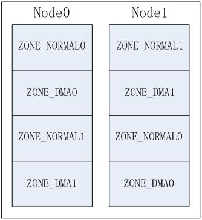
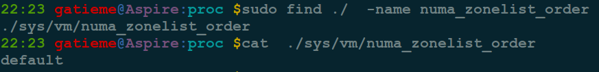
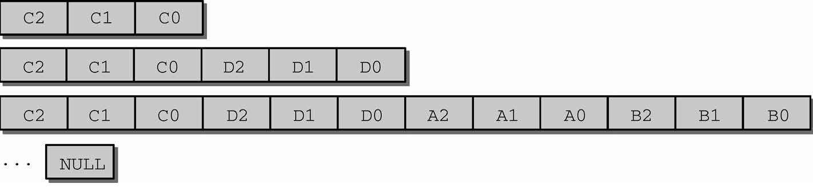
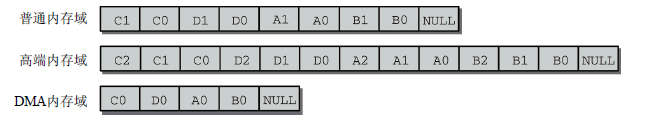

# 1 今日内容(第二阶段(二)–初始化备用内存域列表 zonelists)

```cpp
start_kernel()
    |---->page_address_init()
    |     考虑支持高端内存
    |     业务: 初始化 page_address_pool 链表;
    |          将 page_address_maps 数组元素按索引降序插入
    |          page_address_pool 链表;
    |          初始化 page_address_htable 数组.
    |
    |---->setup_arch(&command_line);
    |     初始化特定体系结构的内容
    	  |
    	  |---->arm64_memblock_init( );
          |     初始化引导阶段的内存分配器 memblock
          |
          |---->paging_init();
          |     分页机制初始化
          |
          |---->bootmem_init();
          |     始化内存数据结构包括内存节点, 内存域和页帧 page
                |
                |---->arm64_numa_init();
                |     支持 numa 架构
                |
                |---->zone_sizes_init(min, max);
                    来初始化节点和管理区的一些数据项
                    |
                    |---->free_area_init_node
                    |   初始化内存节点
                    |
                        |---->free_area_init_core
                            |	初始化 zone
                            |
                            |---->memmap_init
                            |	初始化 page 页面
                |
                |---->memblock_dump_all();
                |   初始化完成, 显示 memblock 的保留的所有内存信息
         	   |
    |---->build_all_zonelist()      [当前位置]
    |     为系统中的 zone 建立后备 zone 的列表.
    |     所有 zone 的后备列表都在
    |     pglist_data->node_zonelists[0]中;
    |
    |     期间也对 per-CPU 变量 boot_pageset 做了初始化.
    |
```

bootmem_init 已经完成了节点和管理区的关键数据已完成初始化, 内核在后面为内存管理做得一个准备工作就是将所有节点的管理区都链入到 zonelist 中, 便于后面内存分配工作的进行.

内核在 start\_kernel()-->build\_all\_zonelist()中完成 zonelist 的初始化

# 2 后备内存域列表 zonelists

内核 setup\_arch 的最后通过**bootmem\_init**中完成了内存数据结构的初始化(包括**内存结点 pg\_data\_t**,**内存管理域 zone**和**页面信息 page**),数据结构已经基本准备好了,在后面为内存管理做得一个准备工作就是将所有节点的管理区都链入到 zonelist 中, 便于后面内存分配工作的进行.

## 2.1 回到 start\_kernel 函数(已经完成的工作)

前面我们分析了 start\_kernel()->setup\_arch()函数,已经完成了 memblock 内存分配器的创建和初始化工作,然后 paging\_init 也完成分页机制的初始化, 然后 bootmem\_init 也完成了内存结点和内存管理域的初始化工作.setup\_arch 函数已经执行完了, 现在我们回到 start\_kernel

```cpp
asmlinkage __visible void __init start_kernel(void)
{

    setup_arch(&command_line);


    build_all_zonelists(NULL, NULL);
    page_alloc_init();


    /*
     * These use large bootmem allocations and must precede
     * mem_init();
     * kmem_cache_init();
     */
    mm_init();

    kmem_cache_init_late();

	kmemleak_init();
    setup_per_cpu_pageset();

    rest_init();
}
```

下面内核开始通过 start\_kernel()->build\_all\_zonelists 来设计内存的组织形式

## 2.2 后备内存域列表 zonelist

内存节点 pg\_data\_t 中将内存节点中的内存区域 zone 按照某种组织层次存储在一个 zonelist 中, 即 pglist\_data->node\_zonelists 成员信息

```cpp
//  http://lxr.free-electrons.com/source/include/linux/mmzone.h?v=4.7#L626
typedef struct pglist_data
{
	struct zone node_zones[MAX_NR_ZONES];
	struct zonelist node_zonelists[MAX_ZONELISTS];
}
```

内核定义了**内存的一个层次结构关系**,首先试图分配廉价的内存, 如果失败, 则根据访问速度和容量, 逐渐尝试分配更昂贵的内存.

高端内存最廉价, 因为内核没有任何部分依赖于从该内存域分配的内存, 如果高端内存用尽, 对内核没有副作用, 所以优先分配高端内存

普通内存域的情况有所不同, 许多内核数据结构必须保存在该内存域, 而不能放置到高端内存域, 因此如果普通内存域用尽, 那么内核会面临内存紧张的情况

DMA 内存域最昂贵, 因为它用于外设和系统之间的数据传输.
举例来讲, 如果内核指定想要分配高端内存域. 它首先在当前结点的高端内存域寻找适当的空闲内存段, 如果失败, 则查看该结点的普通内存域, 如果还失败, 则试图在该结点的 DMA 内存域分配. 如果在 3 个本地内存域都无法找到空闲内存, 则查看其他结点. 这种情况下, 备选结点应该尽可能靠近主结点, 以最小化访问非本地内存引起的性能损失.

## 2.3 build\_all\_zonelists 初始化 zonelists

内核在 start\_kernel 中通过 build\_all\_zonelists 完成了内存结点及其管理内存域的初始化工作, 调用如下

```cpp
  build_all_zonelists(NULL, NULL);
```

[build_all_zonelists](http://lxr.free-electrons.com/source/mm/page_alloc.c?v4.7#L5029)建立**内存管理结点**及**其内存域**的组织形式,将描述内存的数据结构(结点,管理域,页帧)通过一定的算法组织在一起,方便以后内存管理工作的进行. 该函数定义在[mm/page_alloc.c?v4.7, line 5029](http://lxr.free-electrons.com/source/mm/page_alloc.c?v4.7#L5029)

## 2.4 build\_all\_zonelists 函数

```cpp
/*
 * Called with zonelists_mutex held always
 * unless system_state == SYSTEM_BOOTING.
 *
 * __ref due to (1) call of __meminit annotated setup_zone_pageset
 * [we're only called with non-NULL zone through __meminit paths] and
 * (2) call of __init annotated helper build_all_zonelists_init
 * [protected by SYSTEM_BOOTING].
 */
void __ref build_all_zonelists(pg_data_t *pgdat, struct zone *zone)
{
	/*  设置 zonelist 中节点和内存域的组织形式
     *  current_zonelist_order 变量标识了当前系统的内存组织形式
     *	zonelist_order_name 以字符串存储了系统中内存组织形式的名称  */
    set_zonelist_order();

    if (system_state == SYSTEM_BOOTING) {
        build_all_zonelists_init();
    } else {
#ifdef CONFIG_MEMORY_HOTPLUG
        if (zone)
            setup_zone_pageset(zone);
#endif
        /* we have to stop all cpus to guarantee there is no user
           of zonelist */
        stop_machine(__build_all_zonelists, pgdat, NULL);
        /* cpuset refresh routine should be here */
    }
    vm_total_pages = nr_free_pagecache_pages();
    /*
     * Disable grouping by mobility if the number of pages in the
     * system is too low to allow the mechanism to work. It would be
     * more accurate, but expensive to check per-zone. This check is
     * made on memory-hotadd so a system can start with mobility
     * disabled and enable it later
     */
    if (vm_total_pages < (pageblock_nr_pages * MIGRATE_TYPES))
        page_group_by_mobility_disabled = 1;
    else
        page_group_by_mobility_disabled = 0;

    pr_info("Built %i zonelists in %s order, mobility grouping %s.  Total pages: %ld\n",
        nr_online_nodes,
        zonelist_order_name[current_zonelist_order],
        page_group_by_mobility_disabled ? "off" : "on",
        vm_total_pages);
#ifdef CONFIG_NUMA
    pr_info("Policy zone: %s\n", zone_names[policy_zone]);
#endif
}
```

# 3 设置结点初始化顺序

在 build\_all\_zonelists 开始,首先内核通过 set\_zonelist\_order 函数设置了`zonelist_order`,如下所示, 参见[mm/page_alloc.c?v=4.7, line 5031](http://lxr.free-electrons.com/source/mm/page_alloc.c?v=4.7#L5031)

```cpp
void __ref build_all_zonelists(pg_data_t *pgdat, struct zone *zone)
{
	set_zonelist_order();
	/* .......  */
}
```

## 3.1 zonelist

新的内核已经去掉了

前面我们讲解内存管理域时候讲解到,系统中的**所有管理域**都存储在一个**多维的数组 zone\_table**.内核在初始化内存管理区时,必须要建立管理区表 zone\_table. 参见[mm/page_alloc.c?v=2.4.37, line 38](http://lxr.free-electrons.com/source/mm/page_alloc.c?v=2.4.37#L38)


```cpp
/*
 *
 * The zone_table array is used to look up the address of the
 * struct zone corresponding to a given zone number (ZONE_DMA,
 * ZONE_NORMAL, or ZONE_HIGHMEM).
 */
zone_t *zone_table[MAX_NR_ZONES*MAX_NR_NODES];
EXPORT_SYMBOL(zone_table);
```

- **MAX\_NR\_NODES**为系统中**内存结点**的数目

- **MAX\_NR\_ZONES**为系统中**单个内存结点**所拥有的**最大内存区域**数目

## 3.2 内存域初始化顺序 zonelist\_order

NUMA 系统中存在多个节点, 每个节点对应一个`struct pglist_data`结构, 每个结点中可以包含多个 zone,如:ZONE\_DMA,ZONE\_NORMAL,这样就产生几种排列顺序, 以 2 个节点 2 个 zone 为例(zone 从高到低排列,ZONE\_DMA0 表示节点 0 的 ZONE\_DMA, 其它类似).

- Legacy 方式, 每个节点只排列自己的 zone;


- Node 方式, 按节点顺序依次排列, 先排列本地节点的所有 zone, 再排列其它节点的所有 zone.



- Zone 方式, 按 zone 类型从高到低依次排列各节点的同相类型 zone


可通过启动参数"**numa\_zonelist\_order**"来配置 zonelist order, 内核定义了 3 种配置, 这些顺序定义在[mm/page_alloc.c?v=4.7, line 4551](http://lxr.free-electrons.com/source/mm/page_alloc.c?v=4.7#L4551)

```cpp
// http://lxr.free-electrons.com/source/mm/page_alloc.c?v=4.7#L4551
/*
 *  zonelist_order:
 *  0 = automatic detection of better ordering.
 *  1 = order by ([node] distance, -zonetype)
 *  2 = order by (-zonetype, [node] distance)
 *
 *  If not NUMA, ZONELIST_ORDER_ZONE and ZONELIST_ORDER_NODE will create
 *  the same zonelist. So only NUMA can configure this param.
 */
#define ZONELIST_ORDER_DEFAULT  0 /* 智能选择 Node 或 Zone 方式 */

#define ZONELIST_ORDER_NODE     1 /* 对应 Node 方式 */

#define ZONELIST_ORDER_ZONE     2 /* 对应 Zone 方式 */
```

>注意
>
>在非 NUMA 系统中(比如 UMA),由于只有一个内存结点,因此 ZONELIST\_ORDER\_ZONE 和 ZONELIST\_ORDER\_NODE 选项会配置相同的内存域排列方式, 因此, 只有 NUMA 可以配置这几个参数

全局的 current\_zonelist\_order 变量标识了系统中的当前使用的内存域排列方式, 默认配置为 ZONELIST\_ORDER\_DEFAULT,参见[mm/page_alloc.c?v=4.7, line 4564](http://lxr.free-electrons.com/source/mm/page_alloc.c?v=4.7#L4564)

```cpp
//  http://lxr.free-electrons.com/source/mm/page_alloc.c?v=4.7#L4564
/* zonelist order in the kernel.
 * set_zonelist_order() will set this to NODE or ZONE.
 */
static int current_zonelist_order = ZONELIST_ORDER_DEFAULT;
static char zonelist_order_name[3][8] = {"Default", "Node", "Zone"};
```

而 zonelist\_order\_name 方式分别对应了 Legacy 方式, Node 方式和 Zone 方式. 其 zonelist\_order\_name[current\_zonelist\_order]就标识了当前系统中所使用的内存域排列方式的名称"Default", "Node", "Zone".

| 宏 | zonelist\_order\_name[宏](排列名称) | 排列方式 | 描述 |
|:--:|:-------------------:|:------:|:----|
| ZONELIST\_ORDER\_DEFAULT | Default |  | 由系统智能选择 Node 或 Zone 方式 |
| ZONELIST\_ORDER\_NODE | Node | Node 方式 | 按节点顺序依次排列, 先排列本地节点的所有 zone, 再排列其它节点的所有 zone |
| ZONELIST\_ORDER\_ZONE | Zone | Zone 方式 | 按 zone 类型从高到低依次排列各节点的同相类型 zone |

## 3.3 set\_zonelist\_order 设置排列方式

内核就通过通过 set\_zonelist\_order 函数设置当前系统的内存域排列方式 current\_zonelist\_order,其定义依据系统的 NUMA 结构还是 UMA 结构有很大的不同.

```cpp
// http://lxr.free-electrons.com/source/mm/page_alloc.c?v=4.7#L4571
#ifdef CONFIG_NUMA
/* The value user specified ....changed by config */
static int user_zonelist_order = ZONELIST_ORDER_DEFAULT;
/* string for sysctl */
#define NUMA_ZONELIST_ORDER_LEN 16
char numa_zonelist_order[16] = "default";


//  http://lxr.free-electrons.com/source/mm/page_alloc.c#L4571
static void set_zonelist_order(void)
{
    if (user_zonelist_order == ZONELIST_ORDER_DEFAULT)
        current_zonelist_order = default_zonelist_order();
    else
        current_zonelist_order = user_zonelist_order;
}


#else   /* CONFIG_NUMA */

//  http://lxr.free-electrons.com/source/mm/page_alloc.c?v=4.7#L4892
static void set_zonelist_order(void)
{
	current_zonelist_order = ZONELIST_ORDER_ZONE;
}
```

其设置的基本流程如下

- 如果系统当前系统是非 NUMA 结构的,则系统中只有一个结点,配置 ZONELIST\_ORDER\_NODE 和 ZONELIST\_ORDER\_ZONE 结果相同.那么 set\_zonelist\_order 函数被定义为直接配置当前系统的内存域排列方式`current_zonelist_order`为 ZONE 方式(与 NODE 效果相同)

- 如果系统是 NUMA 结构, 则设置为系统指定的方式即可

1. 当前的排列方式为 ZONELIST\_ORDER\_DEFAULT, 即系统默认方式,则 current\_zonelist\_order 则由内核交给 default\_zonelist\_order 采用一定的算法选择一个最优的分配策略,目前的系统中如果是**32 位则配置为 ZONE 方式**, 而如果是**64 位系统**则设置为**NODE 方式**

2. 当前的排列方式不是默认方式,则设置为 user\_zonelist\_order 指定的内存域排列方式

## 3.4 default\_zonelist\_order 函数选择最优的配置

在 UMA 结构下, 内存域使用 NODE 和 ZONE 两个排列方式会产生相同的效果,因此系统不用特殊指定, 直接通过 set\_zonelist\_order 函数,将当前系统的内存域排列方式`current_zonelist_order`配置为为 ZONE 方式(与 NODE 效果相同)即可

但是 NUMA 结构下, 默认情况下(当配置了 ZONELIST\_ORDER\_DEFAULT), 系统需要根据系统自身的环境信息选择一个最优的配置(NODE 或者 ZONE 方式), 这个工作就由**default_zonelist_order 函数**了来完成. 其定义在[mm/page_alloc.c?v=4.7, line 4789](http://lxr.free-electrons.com/source/mm/page_alloc.c?v=4.7#L4789)

```cpp
#if defined(CONFIG_64BIT)
/*
 * Devices that require DMA32/DMA are relatively rare and do not justify a
 * penalty to every machine in case the specialised case applies. Default
 * to Node-ordering on 64-bit NUMA machines
 */
static int default_zonelist_order(void)
{
    return ZONELIST_ORDER_NODE;
}
#else
/*
 * On 32-bit, the Normal zone needs to be preserved for allocations accessible
 * by the kernel. If processes running on node 0 deplete the low memory zone
 * then reclaim will occur more frequency increasing stalls and potentially
 * be easier to OOM if a large percentage of the zone is under writeback or
 * dirty. The problem is significantly worse if CONFIG_HIGHPTE is not set.
 * Hence, default to zone ordering on 32-bit.
 */
static int default_zonelist_order(void)
{
    return ZONELIST_ORDER_ZONE;
}
#endif /* CONFIG_64BIT */
```

### 3.5 user\_zonelist\_order 用户指定排列方式

在 NUMA 结构下, 系统支持用户指定内存域的排列方式,用户以字符串的形式操作 numa\_zonelist\_order(default,node 和 zone),最终被内核转换为 user\_zonelist\_order, 这个变量被指定为字符串 numa\_zonelist\_order 指定的排列方式, 他们定义在[mm/page_alloc.c?v4.7, line 4573](http://lxr.free-electrons.com/source/mm/page_alloc.c?v4.7#L4573), 注意只有在 NUMA 结构中才需要这个配置信息.

```cpp
#ifdef CONFIG_NUMA
/* The value user specified ....changed by config */
static int user_zonelist_order = ZONELIST_ORDER_DEFAULT;
/* string for sysctl */
#define NUMA_ZONELIST_ORDER_LEN 16
char numa_zonelist_order[16] = "default";

#else
/* ......*/
#endif
```

而接受和处理用户配置的工作,自然是交给我们强大的 proc 文件系统来完成的, 可以通过/proc/sys/vm/numa\_zonelist\_order 动态改变 zonelist order 的分配方式.



内核通过 setup\_numa\_zonelist\_order 读取并处理用户写入的配置信息

- 接收到用户的信息后用\_\_parse\_numa\_zonelist\_order 处理接收的参数

- 如果前面用\_\_parse\_numa\_zonelist\_order 处理的信息串成功,则将对用的设置信息写入到字符串 numa\_zonelist\_order 中

参见[mm/page_alloc.c?v=4.7, line 4578](http://lxr.free-electrons.com/source/mm/page_alloc.c?v=4.7#L4578)

```cpp
/*
 * interface for configure zonelist ordering.
 * command line option "numa_zonelist_order"
 *      = "[dD]efault   - default, automatic configuration.
 *      = "[nN]ode      - order by node locality, then by zone within node
 *      = "[zZ]one      - order by zone, then by locality within zone
 */

static int __parse_numa_zonelist_order(char *s)
{
    if (*s == 'd' || *s == 'D') {
        user_zonelist_order = ZONELIST_ORDER_DEFAULT;
    } else if (*s == 'n' || *s == 'N') {
        user_zonelist_order = ZONELIST_ORDER_NODE;
    } else if (*s == 'z' || *s == 'Z') {
        user_zonelist_order = ZONELIST_ORDER_ZONE;
    } else {
        pr_warn("Ignoring invalid numa_zonelist_order value:  %s\n", s);
        return -EINVAL;
    }
    return 0;
}

static __init int setup_numa_zonelist_order(char *s)
{
    int ret;

    if (!s)
        return 0;

    ret = __parse_numa_zonelist_order(s);
    if (ret == 0)
        strlcpy(numa_zonelist_order, s, NUMA_ZONELIST_ORDER_LEN);

    return ret;
}
early_param("numa_zonelist_order", setup_numa_zonelist_order);
```

# 4 build\_all\_zonelists 完成内存域 zonelists 的初始化

build\_all\_zonelists 函数在通过 set\_zonelist\_order**设置**了 zonelists 中**结点的组织顺序后**,首先**检查**了**sytem\_state 标识**.如果当前系统处于 boot 阶段(SYSTEM\_BOOTING),就开始通过 build\_all\_zonelists\_init 函数初始化 zonelist

```cpp
void __ref build_all_zonelists(pg_data_t *pgdat, struct zone *zone)
{
	/*  设置 zonelist 中节点和内存域的组织形式
     *  current_zonelist_order 变量标识了当前系统的内存组织形式
     *	zonelist_order_name 以字符串存储了系统中内存组织形式的名称  */
    set_zonelist_order();

    if (system_state == SYSTEM_BOOTING) {
        build_all_zonelists_init();
```

## 4.1 system\_state 系统状态标识

其中**system\_state**变量是一个**系统全局定义**的用来表示**系统当前运行状态**的枚举变量, 其定义在[include/linux/kernel.h?v=4.7, line 487](http://lxr.free-electrons.com/source/include/linux/kernel.h?v=4.7#L487)

```cpp
/* Values used for system_state */
extern enum system_states
{
	SYSTEM_BOOTING,
	SYSTEM_RUNNING,
	SYSTEM_HALT,
	SYSTEM_POWER_OFF,
	SYSTEM_RESTART,
} system_state;
```
- 如果系统 system\_state 是 SYSTEM\_BOOTING, 则调用 build\_all\_zonelists\_init 初始化所有的内存结点

- 否则的话如果定义了**冷热页 CONFIG\_MEMORY\_HOTPLUG**且参数 zone(待初始化的内存管理域 zone)不为 NULL, 则调用 setup\_zone\_pageset 设置冷热页

```cpp
if (system_state == SYSTEM_BOOTING)
{
	build_all_zonelists_init();
}
else
{
#ifdef CONFIG_MEMORY_HOTPLUG
	if (zone)
    	setup_zone_pageset(zone);
#endif
```

如果系统状态 system\_state 为 SYSTEM\_BOOTING, 系统状态只有在 start\_kernel 执行到最后一个函数 rest\_init 后, 才会进入 SYSTEM\_RUNNING

## 4.2 build\_all\_zonelists\_init 函数

build\_all\_zonelists 函数在如果当前系统处于 boot 阶段(system\_state == SYSTEM\_BOOTING),就开始通过 build\_all\_zonelists\_init 函数初始化 zonelist

build\_all\_zonelists\_init 函数定义在[mm/page_alloc.c?v=4.7, line 5013](http://lxr.free-electrons.com/source/mm/page_alloc.c?v=4.7#L5013)

```cpp
static noinline void __init
build_all_zonelists_init(void)
{
    __build_all_zonelists(NULL);
    mminit_verify_zonelist();
    cpuset_init_current_mems_allowed();
}
```
build\_all\_zonelists\_init 将将所有工作都委托给\_\_build\_all\_zonelists 完成了 zonelists 的**初始化工作**,**后者里面**又对系统中的**各个 NUMA 结点**分别调用**build\_zonelists**.

函数\_\_build\_all\_zonelists 定义在[mm/page_alloc.c?v=4.7, line 4959](http://lxr.free-electrons.com/source/mm/page_alloc.c?v=4.7#L4959)

```cpp
/* return values int ....just for stop_machine() */
static int __build_all_zonelists(void *data)
{
    int nid;
    int cpu;
    pg_data_t *self = data;

	/*  ......  */

    for_each_online_node(nid) {
        pg_data_t *pgdat = NODE_DATA(nid);

        build_zonelists(pgdat);
    }
	/*  ......  */
}
```

for\_each\_online\_node 遍历了系统中**所有的活动结点**.

由于**UMA 系统**只有一个结点, build\_zonelists 只调用了一次,就对所有的内存创建了内存域列表.

**NUMA 系统**调用该函数的次数等同于结点的数目. **每次调用**对**一个不同结点**生成**内存域数据**

## 4.3 build\_zonelists 初始化每个内存结点的 zonelists

build\_zonelists(pg\_data\_t \*pgdat)完成了节点 pgdat 上 zonelists 的初始化工作,它建立了备用层次结构 zonelists. 由于**UMA 和 NUMA 架构**下**结点的层次结构有很大的区别**,因此内核分别提供了**两套不同的接口**.

如下所示

```cpp
// http://lxr.free-electrons.com/source/mm/page_alloc.c?v=4.7
#ifdef CONFIG_NUMA

static int __parse_numa_zonelist_order(char *s)

static __init int setup_numa_zonelist_order(char *s)

int numa_zonelist_order_handler(struct ctl_table *table, int write,
             void __user *buffer, size_t *length,

static int find_next_best_node(int node, nodemask_t *used_node_mask)

static void build_zonelists_in_node_order(pg_data_t *pgdat, int node)

static void build_thisnode_zonelists(pg_data_t *pgdat)

static void build_zonelists_in_zone_order(pg_data_t *pgdat, int nr_nodes)

#if defined(CONFIG_64BIT)

static int default_zonelist_order(void)

#else

static int default_zonelist_order(void)

#endif /* CONFIG_64BIT */

static void build_zonelists(pg_data_t *pgdat)

#ifdef CONFIG_HAVE_MEMORYLESS_NODES

int local_memory_node(int node)

#endif

#else   /* CONFIG_NUMA */

static void build_zonelists(pg_data_t *pgdat)

static void set_zonelist_order(void)

#endif  /* CONFIG_NUMA */
```

| 函数 | NUMA | UMA |
|:------:|:--------|:-----|
| build\_zonelists | [build\_zonelists -=> mm/page\_alloc.c?v=4.7, line 4822](http://lxr.free-electrons.com/source/mm/page_alloc.c?v=4.7#L4822) | [build\_zonelists -=> mm/page\_alloc.c?v=4.7, line 4897](http://lxr.free-electrons.com/source/mm/page_alloc.c?v=4.7#L4897)<br><br>[build\_zonelists\_node -=> mm/page\_alloc.c?v=4.7, line 4531](http://lxr.free-electrons.com/source/mm/page_alloc.c?v=4.7#L4531) |

我们以 UMA 结构下的 build\_zonelists 为例,来讲讲内核是怎么初始化备用内存域层次结构的, UMA 结构下的 build\_zonelists 函数定义在[mm/page_alloc.c?v=4.7, line 4897](http://lxr.free-electrons.com/source/mm/page_alloc.c?v=4.7#L4897), 如下所示

```c
static void build_zonelists(pg_data_t *pgdat)
{
	int node, local_node;
	enum zone_type j;
	struct zonelist *zonelist;

	local_node = pgdat->node_id;

	zonelist = &pgdat->node_zonelists[0];
	j = build_zonelists_node(pgdat, zonelist, 0);

	/*
	 * Now we build the zonelist so that it contains the zones
	 * of all the other nodes.
	 * We don't want to pressure a particular node, so when
	 * building the zones for node N, we make sure that the
	 * zones coming right after the local ones are those from
	 * node N+1 (modulo N)
	 */
	for (node = local_node + 1; node < MAX_NUMNODES; node++) {
		if (!node_online(node))
			continue;
		j = build_zonelists_node(NODE_DATA(node), zonelist, j);
	}
	for (node = 0; node < local_node; node++) {
		if (!node_online(node))
			continue;
		j = build_zonelists_node(NODE_DATA(node), zonelist, j);
	}

	zonelist->_zonerefs[j].zone = NULL;
	zonelist->_zonerefs[j].zone_idx = 0;
}
```

node\_zonelists 的数组元素通过指针操作寻址,这在 C 语言中是完全合法的惯例. 实际工作则委托给 build\_zonelist\_node. 在调用时, 它首先生成**本地结点**内分配内存时的备用层次

内核在 build\_zonelists 中按分配代价**从昂贵到低廉的次序**,迭代了结点中**所有的内存域**.而在 build\_zonelists\_node 中,则按照分配代价**从低廉到昂贵的次序**,迭代了分配代价**不低于当前内存域的内存域(！！！**).

首先我们来看看 build\_zonelists\_node 函数,该函数定义在[mm/page_alloc.c?v=4.7, line 4531](http://lxr.free-electrons.com/source/mm/page_alloc.c?v=4.7#L4531)

```cpp
/*
 * Builds allocation fallback zone lists.
 *
 * Add all populated zones of a node to the zonelist.
 */
static int build_zonelists_node(pg_data_t *pgdat, struct zonelist *zonelist, int nr_zones)
{
    struct zone *zone;
    enum zone_type zone_type = MAX_NR_ZONES;

    do {
        zone_type--;
        zone = pgdat->node_zones + zone_type;
        if (populated_zone(zone)) {
            zoneref_set_zone(zone,
                &zonelist->_zonerefs[nr_zones++]);
            check_highest_zone(zone_type);
        }
    } while (zone_type);

    return nr_zones;
}
```

**备用列表 zonelists**的各项是借助于**zone\_type 参数排序**的,该参数指定了最优先选择哪个内存域, 该参数的初始值是外层循环的控制变量 i.

我们知道其值可能是 ZONE\_HIGHMEM、ZONE\_NORMAL、ZONE\_DMA 或 ZONE\_DMA32 之一.

nr\_zones 表示从备用列表中的哪个位置开始填充新项. 由于列表中尚没有项, 因此调用者传递了 0.

内核在 build\_zonelists 中按分配代价从昂贵到低廉的次序,迭代了结点中所有的内存域.而在 build\_zonelists\_node 中,则按照分配代价从低廉到昂贵的次序,迭代了分配代价不低于当前内存域的内存域.

在 build\_zonelists\_node 的每一步中,都对所选的**内存域**调用 populated\_zone,确认**zone->present\_pages**大于 0,即**确认内存域中确实有页存在**.倘若如此,则将指向**zone 实例的指针**添加到**zonelist\->zones 中的当前位置**. 后备列表的当前位置保存在 nr\_zones.

在每一步结束时, 都将**内存域类型 zone\_type 减 1**.换句话说,设置为一个更昂贵的内存域类型. 例如,如果开始的内存域是 ZONE\_HIGHMEM,减 1 后下一个内存域类型是 ZONE\_NORMAL.

考虑一个系统, 有内存域 ZONE\_HIGHMEM、ZONE\_NORMAL、ZONE\_DMA. 在第一次运行 build\_zonelists\_node 时, 实际上会执行下列赋值

```cpp
zonelist->zones[0] = ZONE_HIGHMEM;
zonelist->zones[1] = ZONE_NORMAL;
zonelist->zones[2] = ZONE_DMA;
```

我们以某个系统为例, 图中示范了一个备用列表在多次循环中不断填充的过程. 系统中共有四个结点

连续填充备用列表:



```cpp
其中
A=(NUMA)结点 0 0=DMA 内存域
B=(NUMA)结点 1 1=普通内存域
C=(NUMA)结点 2 2=高端内存域
D=(NUMA)结点 3
```

第一步之后, 列表中的分配目标是高端内存,接下来是第二个结点的普通和 DMA 内存域.

内核接下来必须确立次序,以便将系统中其他结点的内存域按照次序加入到备用列表.

现在我们回到 build\_zonelists 函数,UMA 架构下该函数定义在[mm/page_alloc.c?v=4.7, line 4897](http://lxr.free-electrons.com/source/mm/page_alloc.c?v=4.7#L4897), 如下所示

```cpp
static void build_zonelists(pg_data_t *pgdat)
{
    int node, local_node;
    enum zone_type j;
    struct zonelist *zonelist;

	/*  ......  */

    for (node = local_node + 1; node < MAX_NUMNODES; node++) {
        if (!node_online(node))
            continue;
        j = build_zonelists_node(NODE_DATA(node), zonelist, j);
    }
    for (node = 0; node < local_node; node++) {
        if (!node_online(node))
            continue;
        j = build_zonelists_node(NODE_DATA(node), zonelist, j);
    }

    zonelist->_zonerefs[j].zone = NULL;
    zonelist->_zonerefs[j].zone_idx = 0;
}
```

第一个循环依次迭代大于当前结点编号的所有结点.在我们的例子中, 有 4 个结点编号副本为 0、1、2、3, 此时只剩下结点 3. 新的项通过 build\_zonelists\_node 被加到备用列表. 此时 j 的作用就体现出来了. 在本地结点的备用目标找到之后, 该变量的值是 3. 该值用作新项的起始位置. 如果结点 3 也由 3 个内存域组成, 备用列表在第二个循环之后的情况如图 3-9 的第二步所示

第二个 for 循环接下来对所有编号小于当前结点的结点生成备用列表项. 在我们的例子中, 这些结点的编号为 0 和 1. 如果这些结点也有 3 个内存域, 则循环完毕之后备用列表的情况如下图下半部分所示

完成的备用列表:



备用列表中项的数目一般无法准确知道, 因为系统中不同结点的内存域配置可能并不相同. 因此列表的最后一项赋值为空指针, 显式标记列表结束.

对总数 N 个结点中的结点 m 来说, 内核生成备用列表时, 选择备用结点的顺序总是: m、m+1、m+2、...、N1、0、1、...、m1. 这确保了不过度使用任何结点. 例如, 对照情况是: 使用一个独立于 m、不变的备用列表.

## 4.4 setup\_pageset 初始化 per\_cpu 缓存

前面讲解**内存管理域 zone**的时候,提到了**per\-CPU 缓存**,即**冷热页**.在组织每个节点的 zonelist 的过程中, **setup\_pageset**初始化了**per\-CPU 缓存(冷热页面**)

```cpp
static void setup_pageset(struct per_cpu_pageset *p, unsigned long batch)
{
	pageset_init(p);
	pageset_set_batch(p, batch);
}
```

在此之前**free\_area\_init\_node 初始化内存结点**的时候,内核就输出了**冷热页的一些信息**, 该工作由**zone\_pcp\_init**完成,该函数定义在[mm/page_alloc.c?v=4.7, line 5029](http://lxr.free-electrons.com/source/mm/page_alloc.c?v=4.7#L5029)

```cpp
static __meminit void zone_pcp_init(struct zone *zone)
{
    /*
     * per cpu subsystem is not up at this point. The following code
     * relies on the ability of the linker to provide the
     * offset of a (static) per cpu variable into the per cpu area.
     */
    zone->pageset = &boot_pageset;

    if (populated_zone(zone))
        printk(KERN_DEBUG "  %s zone: %lu pages, LIFO batch:%u\n",
            zone->name, zone->present_pages,
                     zone_batchsize(zone));
}
```

# 5 总结

## 5.1 start\_kernel 启动流程

```cpp
start_kernel()
    |---->page_address_init()
    |     考虑支持高端内存
    |     业务: 初始化 page_address_pool 链表;
    |          将 page_address_maps 数组元素按索引降序插入
    |          page_address_pool 链表;
    |          初始化 page_address_htable 数组.
    |
    |---->setup_arch(&command_line);
    |
    |---->setup_per_cpu_areas();
    |     为 per-CPU 变量分配空间
    |
    |---->build_all_zonelist()
    |     为系统中的 zone 建立后备 zone 的列表.
    |     所有 zone 的后备列表都在
    |     pglist_data->node_zonelists[0]中;
    |
    |     期间也对 per-CPU 变量 boot_pageset 做了初始化.
    |
    |---->page_alloc_init()
         |---->hotcpu_notifier(page_alloc_cpu_notifier, 0);
         |     不考虑热插拔 CPU
         |
    |---->pidhash_init()
    |     详见下文.
    |     根据低端内存页数和散列度, 分配 hash 空间, 并赋予 pid_hash
    |
    |---->vfs_caches_init_early()
          |---->dcache_init_early()
          |     dentry_hashtable 空间, d_hash_shift, h_hash_mask 赋值;
          |     同 pidhash_init();
          |     区别:
          |         散列度变化了(13 - PAGE_SHIFT);
          |         传入 alloc_large_system_hash 的最后参数值为 0;
          |
          |---->inode_init_early()
          |     inode_hashtable 空间, i_hash_shift, i_hash_mask 赋值;
          |     同 pidhash_init();
          |     区别:
          |         散列度变化了(14 - PAGE_SHIFT);
          |         传入 alloc_large_system_hash 的最后参数值为 0;
          |
```

## 5.2 pidhash\_init 配置高端内存

```cpp
void pidhash_init(void)
    |---->pid_hash = alloc_large_system_hash("PID", sizeof(*pid_hash),
    |         0, 18, HASH_EARLY|HASH_SMALL, &pidhash_shift, NULL, 4096);
    |     根据 nr_kernel_pages(低端内存的页数), 分配哈希数组, 以及各个哈希
    |     数组元素下的哈希链表的空间, 原理如下:
    |     number = nr_kernel_pages;
    |     number >= (18 - PAGE_SHIFT) 根据散列度获得数组元素个数
    |     number = roundup_pow_of_two(number);
    |     pidhash_shift = max{x | 2**x <= number}
    |     size = number * sizeof(*pid_hash);
    |     使用位图分配器分配 size 空间, 将返回值付给 pid_hash;
    |
    |---->pidhash_size = 1 << pidhash_shift;
    |
    |---->for(i = 0; i < pidhash_size; i++)
    |         INIT_HLIST_HEAD(&pid_hash[i]);
```

## 5.3 build\_all\_zonelists 初始化每个内存节点的 zonelists

```cpp
void build_all_zonelists(void)
    |---->set_zonelist_order()
         |---->current_zonelist_order = ZONELIST_ORDER_ZONE;
    |
    |---->__build_all_zonelists(NULL);
    |    Memory 不支持热插拔, 为每个 zone 建立后备的 zone,
    |    每个 zone 及自己后备的 zone, 形成 zonelist
    	|
        |---->pg_data_t *pgdat = NULL;
        |     pgdat = &contig_page_data;(单 node)
        |
        |---->build_zonelists(pgdat);
        |     为每个 zone 建立后备 zone 的列表
            |
            |---->struct zonelist *zonelist = NULL;
            |     enum zone_type j;
            |     zonelist = &pgdat->node_zonelists[0];
            |
            |---->j = build_zonelists_node(pddat, zonelist, 0, MAX_NR_ZONES - 1);
            |     为 pgdat->node_zones[0]建立后备的 zone, node_zones[0]后备的 zone
            |     存储在 node_zonelist[0]内, 对于 node_zone[0]的后备 zone, 其后备的 zone
            |     链表如下(只考虑 UMA 体系, 而且不考虑 ZONE_DMA):
            |     node_zonelist[0]._zonerefs[0].zone = &node_zones[2];
            |     node_zonelist[0]._zonerefs[0].zone_idx = 2;
            |     node_zonelist[0]._zonerefs[1].zone = &node_zones[1];
            |     node_zonelist[0]._zonerefs[1].zone_idx = 1;
            |     node_zonelist[0]._zonerefs[2].zone = &node_zones[0];
            |     node_zonelist[0]._zonerefs[2].zone_idx = 0;
            |
            |     zonelist->_zonerefs[3].zone = NULL;
            |     zonelist->_zonerefs[3].zone_idx = 0;
        |
        |---->build_zonelist_cache(pgdat);
              |---->pdat->node_zonelists[0].zlcache_ptr = NULL;
              |     UMA 体系结构
              |
        |---->for_each_possible_cpu(cpu)
        |     setup_pageset(&per_cpu(boot_pageset, cpu), 0);
              |详见下文
    |---->vm_total_pages = nr_free_pagecache_pages();
    |    业务: 获得所有 zone 中的 present_pages 总和.
    |
    |---->page_group_by_mobility_disabled = 0;
    |     对于代码中的判断条件一般不会成立, 因为页数会最够多(内存较大)
```