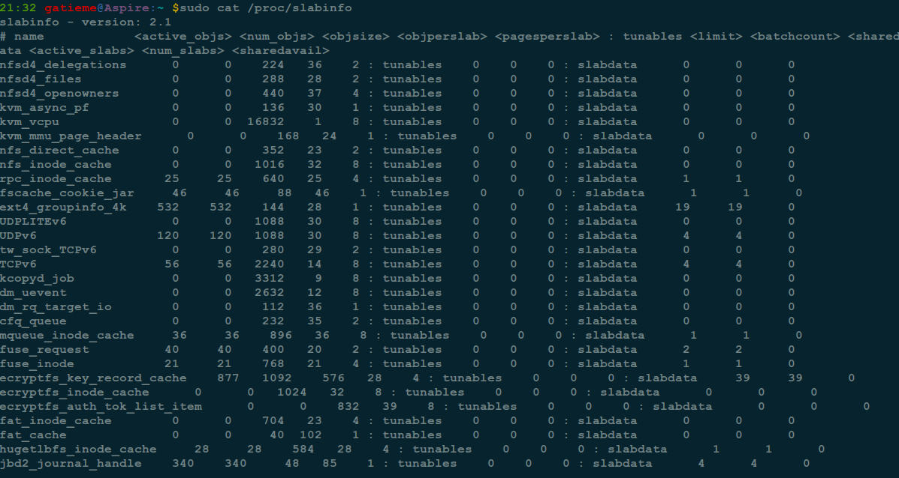
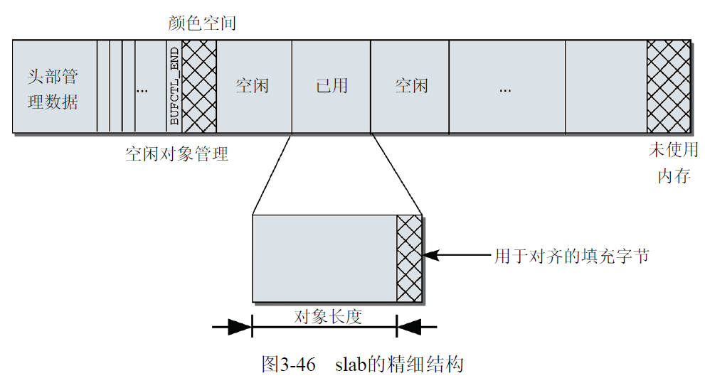

# 1 slab 分配器

## 1.1 slab 分配器

每个 C 程序员都熟悉 malloc,及其在 C 标准库中的相关函数.大多数程序分配若干字节内存时.经常会调用这些函数.

内核也必须经常分配内存,但无法借助于标准库的函数.上面描述的伙伴系统支持按页分配内存,但这个单位太大了.如果需要为一个 10 个字符的字符串分配空间,分配一个 4KiB 或更多空间的完整页面,不仅浪费而且完全不可接受.显然的解决方案是将页拆分为更小的单位, 可以容纳大量的小对象.

为此必须引入新的管理机制,这会给内核带来更大的开销.为最小化这个额外负担对系统性能的影响,该管理层的实现应该尽可能紧凑, 以便不要对处理器的高速缓存和 TLB 带来显著影响.同时,内核还必须保证内存利用的速度和效率.不仅 Linux,而且类似的 UNIX 和所有其他的操作系统,都需要面对这个问题.经过一定的时间,已经提出了一些或好或坏的解决方案,在一般的操作系统文献中都有讲解

此类提议之一, 所谓**slab 分配**, 证明对许多种类工作负荷都非常高效. 它是由 Sun 公司的一个雇员`Jeff Bonwick`, 在`Solaris 2.4`中设计并实现的. 由于他公开了其方法, 因此也可以为 Linux 实现一个版本.

Jeff 发现对内核中**普通对象进行初始化**所需的**时间**超过了对其进行分配和释放所需的时间. 因此他的结论是**不应该将内存释放回一个全局的内存池**, 而是将**内存保持为针对特定目而初始化的状态**. 例如, 如果内存被分配给了一个互斥锁, 那么只需在为互斥锁首次分配内存时执行一次互斥锁初始化函数(mutex_init)即可. 后续的内存分配不需要执行这个初始化函数, 因为从上次释放和调用析构之后, 它已经处于所需的状态中了.

**提供小内存块**不是**slab 分配器**的唯一任务.由于结构上的特点.**它也用作一个缓存**.主要针对**经常分配并释放的对象**. 通过**建立 slab 缓存**, 内核能够**储备一些对象**, 供后续使用, 即使在初始化状态, 也是如此.

举例来说, 为管理与**进程关联**的**文件系统数据**, 内核必须经常生成`struct fs_struct`的新实例.此类型实例占据的**内存块**同样需要**经常回收**(在进程结束时).换句话说,内核趋向于非常有规律地分配并释放大小为`sizeof{fs_struct}`的内存块.**slab 分配器**将**释放的内存块**保存在一个**内部列表**中.并**不马上返回给伙伴系统**.在请求为该类对象分配一个新实例时,会使用最近释放的内存块.这有两个优点.首先,由于内核不必使用伙伴系统算法,处理时间会变短.其次,由于该内存块仍然是"新"的, 因此其仍然**驻留**在**CPU 高速缓存的概率较高**.

slab 分配器还有**两个**更进一步的**好处**

- **调用伙伴系统**的操作对系统的**数据和指令高速缓存**有相当的影响. 内核越浪费这些资源,这些资源对用户空间进程就越不可用.更轻量级的 slab 分配器在可能的情况下**减少了对伙伴系统的调用**,有助于防止不受欢迎的缓存"污染".

- 如果数据存储在**伙伴系统直接提供的页**中, 那么其**地址**总是出现在**2 的幂次的整数倍附近**(许多**将页划分为更小块**的其他分配方法,也有同样的特征).这**对 CPU 高速缓存的利用有负面**影响,由于这种地址分布,使得**某些缓存行过度使用**,而**其他的则几乎为空**.多处理器系统可能会加剧这种不利情况,因为不同的内存地址可能在不同的总线上传输,上述情况会导致某些总线拥塞,而其他总线则几乎没有使用.

通过**slab 着色(slab coloring**), slab 分配器能够**均匀地分布对象**, 以实现**均匀的缓存利用**

**经常使用的内核对象**保存在**CPU 高速缓存**中, 这是我们想要的效果. 前文的注释提到,从`slab`分配器的角度进行衡量, **伙伴系统的高速缓存和 TLB 占用较大**, 这是一个**负面效应**.

因为这会导致不重要的数据驻留在`CPU`高速缓存中, 而重要的数据则被置换到内存,显然应该防止这种情况出现.

>**着色**这个术语是隐喻性的. 它与颜色无关,只是表示 slab 中的**对象需要移动的特定偏移量**,以便**使对象放置到不同的缓存行**.

`slab`分配器由何得名?各个**缓存管理的对象**, 会合并为**较大的组**, 覆盖**一个或多个连续页帧**.这种**组称作 slab**, **每个缓存**由**几个这种 slab 组成**.

## 1.2 备选 slab 分配器

尽管 slab 分配器对许多可能的工作负荷都工作良好,但也有一些情形,它**无法提供最优性能**.如果某些计算机处于**当前硬件尺度的边界上**,在此类计算机上使用 slab 分配会出现一些问题; **微小的嵌入式系统**,配备有**大量物理内存**的大规模并行系统.在第二种情况下,slab 分配器所需的**大量元数据**可能成为一个问题:开发者称在大型系统上仅 slab 的数据结构就需要很多字节内存.对**嵌入式系统**来说,**slab 分配器代码量和复杂性都太高**.

为处理此类情形, 在内核版本 2.6 开发期间, 增加了**slab 分配器**的**两个替代品**.

- **slob 分配器**进行了特别优化,以便减少代码量.它围绕一个简单的**内存块链表**展开(因此而得名).在分配内存时,使用了同样简单的**最先适配算法**.`slob`分配器只有大约 600 行代码,总的**代码量很小**.事实上,从速度来说,它不是最高效的分配器,也肯定**不是为大型系统设计**的.

- **slub 分配器**通过**将页帧打包为组**, 并通过 struct page 中**未使用的字段来管理这些组**, 试图最小化所需的内存开销. 读者此前已经看到, 这样做不会简化该结构的定义, 但在大型计算机上`slub`比`slab`提供了更好的性能, 说明了这样做是正确的.

由于`slab`分配是大多数内核配置的默认选项, 我不会详细讨论备选的分配器.但有很重要的一点需要强调,内核的其余部分无需关注底层选择使用了哪个分配器.所有分配器的**前端接口都是相同的**.

**每个分配器**都**必须实现**一组特定的函数, 用于**内存分配和缓存**

- kmalloc、\_\_kmalloc 和 kmalloc\_node 是一般的(特定于结点)**内存分配**函数.

- kmem\_cache\_alloc、kmem\_cache\_alloc\_node 提供(特定于结点)**特定类型的内核缓存**.

下文在讨论`slab`分配器时, 会讲解这些函数的行为.使用这些标准函数,内核可以提供更方便的函数,而不涉及内存在内部具体如何管理. 举例来说, kcalloc 为数组分配内存, 而 kzalloc 分配一个填充字节 0 的内存区.

**普通内核代码**只需要包含**slab.h**, 即可使用内存分配的所有标准内核函数. 连编系统会保证使用编译时选择的分配器, 来满足程序的内存分配请求

## 1.3 内核中的内存管理

内核中一般的内存分配和释放函数与 C 标准库中等价函数的名称类似, 用法也几乎相同.

- **kmalloc(size, flags**)分配长度为**size 字节**的一个内存区, 并返回指向该内存区**起始处的一个 void 指针**. 如果没有足够内存(在内核中这种情形不大可能,但却始终要考虑到),则结果为 NULL 指针.**flags 参数**使用之前讨论的**GFP\_常数**, 来**指定**分配内存的**具体内存域**, 例如 GFP\_DMA 指定分配适合于**DMA 的内存区**.

- kfree(\*ptr)释放\*ptr 指向的内存区.

与**用户空间程序**设计相比,内核还包括**percpu\_alloc**和**percpu\_free**函数, 用于为**各个系统 CPU**分配和释放所需**内存区**(不是明确地用于当前活动 CPU).

`kmalloc`在内核源代码中的使用数以千计,但模式都是相同的.用 kmalloc 分配的内存区,首先通过**类型转换**变为正确的类型, 然后赋值到**指针变量**.

>info = (struct cdrom\_info *) kmalloc(sizeof(struct cdrom\_info), GFP\_KERNEL);

从程序员的角度来看, **建立和使用缓存**的任务不是特别困难.必须首先用**kmem\_cache\_create**建立一个**适当的缓存**,接下来即可使用**kmem\_cache\_alloc**和**kmem\_cache\_free**分配和释放**其中包含的对象**. **slab 分配器**负责完成与伙伴系统的交互, 来**分配所需的页**.

所有**活动缓存的列表**保存**在/proc/slabinfo**中(为节省空间, 下文的输出省去了不重要的部分).



我们可以从其中检索到一些**特定的高速缓存的信息**, 比如**task\_struct, mm\_struct**等.


输出的各列除了包含用于标识各个缓存的**字符串名称**(也**确保不会创建相同的缓存**)之外,还包含下列信息.

- 缓存中**活动对象的数量**.

- 缓存中对象的总数(已用和未用).

- 所管理对象的长度, 按**字节计算**.

- 一个 slab 中**对象的数量**.

- 每个 slab 中**页的数量**.

- 活动 slab 的数量.

在内核决定**向缓存分配更多内存**时,所**分配对象的数量**.每次会分配一个**较大的内存块**,以**减少与伙伴系统的交互**.在**缩小缓存**时, 也使用该值作为**释放内存块的大小**.

除了容易识别的缓存名称如 unix\_sock(用于 UNIX 域套接字, 即 struct unix\_sock 类型的对象),还有其他字段名称 kmalloc\-size. 提供 DMA 内存域的计算机还包括用于 DMA 分配的缓存, 在上述的例子中没有. 这些是 kmalloc 函数的基础, 是**内核为不同内存长度提供的 slab 缓存**, 除极少例外, 其长度都是**2 的幂次**, 长度的范围从**2\^5=32B**(用于**页大小为 4KiB 的计算机**)或**64B**(所有其他计算机),到**225B**.上界也可以更小, 是由**KMALLOC\_MAX\_SIZE**设置,后者**根据系统页大小和最大允许的分配阶**计算:

```cpp
<slab.h>
#define KMALLOC_SHIFT_HIGH ((MAX_ORDER + PAGE_SHIFT -1) <= 25 ? \
(MAX_ORDER + PAGE_SHIFT -1) : 25)
#define KMALLOC_MAX_SIZE (1UL << KMALLOC_SHIFT_HIGH)
#define KMALLOC_MAX_ORDER (KMALLOC_SHIFT_HIGH -PAGE_SHIFT)
```

每次**调用 kmalloc**时,内核找到**最适合的缓存**,并从中**分配一个对象**满足请求(如果没有刚好适合的缓存, 则分配稍大的对象, 但不会分配更小的对象).

在实际实现中, 上文中的**slab 分配器**和**缓存**之间的差异迅速消失, 以至于本书后文中将这两个名词用作同义词. 在讨论 slab 分配器的实现之后

# 2 slab 分配的原理

SLAB 为了解决这个**小粒度内存分配**的问题,那么它的策略是什么呢?SLAB 分配器是基于所谓"**面向对象**"的思想, 当然, 这里的"面向对象"跟 C\+\+和 Java 等的"面向对象"是不一样的. 这里的"面向对象"更加确切的说法是"**面向对象类型**", **不同的类型使用不同的 SLAB, 一个 SLAB 只分配一种类型**.

而且,SLAB 为了**提高内核中一些十分频繁进行分配释放的"对象"的分配效率**, SLAB 的做法是: **每次释放掉某个对象**之后, **不是立即将其返回给伙伴系统**(SLAB 分配器是建立在伙伴系统之上的), 而是存放在一个叫 **array\_cache**的结构中, 下次要分配的时候就可以**直接从这里分配**, 从而加快了速度.

这里必须明确几个概念, 说明如下:

- 缓存(cache): 这里的缓存只是一个叫法而已, 其实就是一个**管理结构头**, 它控制了每个 SLAB 的布局, 具体的结构体是**struct kmem_cache**. (注意, 虽然现在几乎所有的书或者博客都将这一个结构称为"缓存", 不过我觉得在这里称为"管理结构头"是更为合适的)

- SLAB: 从**伙伴系统**分配的**2\^order 个物理页**就组成了**一个 SLAB**, 而**后续的操作**就是在这个**SLAB 上在进行细分**的, 具体的结构体是**struct slab**.

- 对象(object): **每一个 SLAB**都只针对**一个数据类型**, 这个**数据类型**就被称为该 SLAB 的"**对象**", 将该对象进行**对齐之后的大小**就是该"**对象"的大小**, 依照**该大小**将上面的**SLAB 进行切分**, 从而实现了我们想要的**细粒度内存分配(！！！**).

- per\-CPU 缓存: 这个就是**array\_cache**, 这个是为了**加快分配**, 预先**从 SLAB 中分配部分对象内存(！！！**)以加快速度. 具体的结构体是 struct array\_cache, 包含在 struct kmem\_cache 中.

`slab`分配器由一个紧密地交织的**数据和内存结构**的网络组成,初看起来不容易理解其运作方式.

因此在考察其实现之前,重要的是获得各个结构之间关系的概观. 基本上,**slab 缓存**由图 3-44 所示的**两部分组成**:

- 保存**管理性数据的缓存对象**
- 保存**被管理对象的各个 slab**


**每个缓存**只负责**一种对象类型**(例如**struct unix\_sock 实例**), 或提供**一般性的缓冲区**. **各个缓存**中**slab 的数目各有不同**, 这与已经使用的**页的数目**、**对象长度**和**被管理对象的数目**有关. 2.6.4 节将更详细地描述缓存长度的计算方式.

另外, 系统中**所有的缓存**都保存在一个**双链表**中. 这使得内核有机会依次遍历所有的缓存. 这是有必要的, 例如在**即将发生内存不足**时, 内核可能需要**缩减分配给缓存的内存数量**.

## 2.1 缓存的精细结构

如果我们更仔细地研究缓存的结构, 就可以注意到一些更重要的细节. 图 3-45 给出了缓存各组成部分的概述.除了**管理性数据**(如**已用和空闲对象**或**标志寄存器的数目**), **缓存结构**包括两个特别重要的成员.

- 指向**一个数组的指针**, 其中保存了**各个 CPU 最后释放的对象**.

- 每个内存结点都对应**3 个表头**, 用于**组织 slab 的链表**. 第 1 个链表包含**完全用尽的 slab**, 第 2 个是**部分空闲的 slab**, 第 3 个是**空闲的 slab**.

slab 缓存的精细结构:


**缓存结构指向一个数组**,其中包含了

- **与系统 CPU 数目相同的数组项**.每个元素都是一个指针, 指向一个进一步的结构称之为**数组缓存(array cache**),其中包含了对应于**特定系统 CPU 的管理数据**.
- 管理性数据之后的内存区包含了**一个指针数组**, 各个数组项指向**slab 中未使用的对象**.

为最好地**利用 CPU 高速缓存**,这些**per\-CPU 指针**是很重要的. 在**分配和释放对象**时, 采用**后进先出原理**(LIFO, last in first out).内核假定**刚释放的对象**仍然**处于 CPU 高速缓存**中, 会尽快**再次分配它**(响应下一个分配请求).**仅当 per\-CPU 缓存为空**时, 才会用**slab 中的空闲对象重新填充**它们.

这样, **对象分配的体系**就形成了一个**三级的层次结构**, **分配成本**和操作对**CPU 高速缓存和 TLB 的负面影响**逐级**升高**.

1. 仍然处于**CPU 高速缓存**中的**per-CPU 对象**

2. 现存**slab**中**未使用的对象**

3. 刚使用伙伴系统分配的**新 slab**中**未使用的对象**

slab 缓存的精细结构:



## 2.2 slab 的精细结构

**对象**在**slab**中**并非连续排列**, 而是按照一个相当复杂的方案分布. 图 3-46 说明了相关细节.

用于**每个对象的长度**并**不反映其确切的大小**.相反,**长度已经进行了舍入**,以满足某些**对齐方式的要求**. 有两种可用的备选**对齐方案**.

- slab 创建时使用标志 SLAB\_HWCACHE\_ALIGN, slab 用户可以要求对象**按硬件缓存行对齐**.那么会按照**cache\_line\_size**的返回值进行**对齐**, 该函数返回特定于处理器的**L1 缓存大小**. 如果**对象小于缓存行长度的一半**, 那么将**多个对象放入一个缓存行**.

- 如果**不要求按硬件缓存行对齐**, 那么内核保证对象按**BYTES\_PER\_WORD 对齐**, 该值是表示 void 指针**所需字节**的数目.

在**32 位处理器**上, **void 指针**需要**4 个字节**. 因此, 对有**6 个字节**的对象, 则需要 8 = 2×4 个字节, 15 个字节的对象需要 16=4×4 个字节. 多余的字节称为**填充字节**.

填充字节可以加速对 slab 中对象的访问. 如果**使用对齐的地址**,那么在几乎所有的体系结构上,**内存访问都会更快**.这弥补了使用填充字节必然导致需要更多内存的不利情况.

**管理结构**位于**每个 slab**的**起始**处, 保存了所有的**管理数据**(和**用于连接缓存链表的链表元素**).

其后面是一个**数组**, **每个(整数)数组项**对应于**slab 中的一个对象**. 只有在**对象没有分配**时, 相应的**数组项才有意义**. 在这种情况下, 它指定了下一个空闲对象的索引. 由于**最低编号的空闲对象的编号**还保存在 slab 起始处的**管理结构**中, 内核无需使用链表或其他复杂的关联机制, 即可轻松找到当前可用的所有对象. 数组的**最后一项**总是一个**结束标记**, 值为**BUFCTL\_END**.

slab 缓存的精细结构:


大多数情况下, **slab 内存区的长度(减去了头部管理数据**)是不能被(可能填补过的)对象长度整除的. 因此, 内核就有了一些**多余的内存**, 可以用来**以偏移量的形式**给**slab"着色**", 如上文所述.

**缓存**的**各个 slab 成员**会指定**不同的偏移量**, 以便将**数据**定位到**不同的缓存行**, 因而**slab 开始**和**结束处的空闲内存**是不同的. 在计算偏移量时, 内核必须考虑其他的对齐因素.

例如, L1 高速缓存中数据的对齐(下文讨论).

**管理数据**可以放置在**slab 自身**, 也可以放置到**使用 kmalloc 分配的不同内存区中**. 内核如何选择, 取决于**slab 的长度**和**已用对象的数量**. 相应的选择标准稍后讨论. **管理数据**和**slab 内存之间的关联**很容易建立, 因为**slab 头包含了一个指针**, 指向 slab 数据区的起始处(无论管理数据**是否在 slab 上**).

slab 缓存的精细结构:


最后, 内核需要一种方法, 通过**对象自身**即可**识别 slab(以及对象驻留的缓存**).

根据对象的**物理内存地址**,可以找到**相关的页**,因此可以在**全局 mem\_map 数组**中找到对应的**page 实例**.

我们已经知道, **page 结构**包括一个**链表元素**, 用于**管理各种链表中的页**. 对于**slab 缓存中的页**而言, 该指针是不必要的, 可用于其他用途.

- page\->lru.next 指向**页驻留的缓存的管理结构**

- page\->lru.prev 指向**保存该页的 slab 的管理结构**

**设置或读取 slab 信息**分别由**set\_page\_slab**和**get\_page\_slab**函数完成, 带有`_cache`后缀的函数则处理缓存信息的设置和读取.

```cpp
mm/slab.c
void page_set_cache(struct page *page, struct kmem_cache *cache)
struct kmem_cache *page_get_cache(struct page *page)
void page_set_slab(struct page *page, struct slab *slab)
struct slab *page_get_slab(struct page *page)
```

此外, 内核还对分配给**slab 分配器**的**每个物理内存页**都设置标志**PG\_SLAB(！！！**).

# 3 实现

为实现如上所述的`slab`分配器,使用了各种数据结构.尽管看上去并不困难, 相关的代码并不总是容易阅读或理解.这是因为许多内存区需要使用指针运算和类型转换进行操作,这些可不是 C 语言中以清晰简明著称的领域. 由于**slab 系统**带有大量**调试选项**, 所以代码中遍布着预处理器语句.

其中一些如下列出.

- 危险区(Red Zoning)

在每个对象的开始和结束处增加一个额外的内存区, 其中填充已知的字节模式. 如果模式被修改, 程序员在分析内核内存时注意到, 可能某些代码访问了不属于它们的内存区.

- 对象毒化(Object Poisoning)

在建立和释放 slab 时, 将对象用预定义的模式填充.如果在对象分配时注意到该模式已经改变, 程序员就知道已经发生了未授权访问.

为简明起见, 我们把注意力集中在整体而不是细节上. 我们在下文不使用上述选项, 只讲解一个"纯粹"的 slab 分配器.

## 3.1 数据结构

在最高层是**cache\_chain**, 这是一个**slab 缓存的链接列表**. 可以用来查找最适合**所需要的分配大小的缓存**(**遍历列表**). cache\_chain 的**每个元素**都是**一个 kmem\_cache 结构的引用**(称为**一个 cache**). 它定义了一个要管理的给定大小的对象池.

slab 分配器的主要结构:


**每个缓存**都包含了一个 **slabs 列表**, 这是一段**连续的内存块(通常都是页面！！！**). 存在 **3 种 slab**:

- slabs\_full: **完全分配的 slab**
- slabs\_partial: 部分分配的 slab
- slabs\_empty: **空 slab**, 或者没有对象被分配

**slabs\_empty 列表中的 slab**是进行**回收(reaping**)的**主要备选对象**. 正是通过此过程, **slab 所使用的内存**被**返回给操作系统**供其他用户使用.

slab 列表中的**每个 slab**都是一个**连续的内存块**(一个或多个**连续页**), 它们被划分成一个个**对象**. 这些对象是从特定缓存中进行分配和释放的基本元素. 注意**slab 是 slab 分配器进行操作的最小分配单位**, 因此如果需要对 slab 进行扩展, 这也就是所扩展的最小值. 通常来说, **每个 slab**被分配为**多个对象**.

由于**对象是从 slab 中进行分配和释放**的, 因此**单个 slab**可以**在 slab 列表之间进行移动**. 例如, 当一个 slab 中的**所有对象**都被**使用完**时, 就从**slabs\_partial 列表**中移动到**slabs\_full 列表**中. 当一个 slab**完全被分配**并且有**对象被释放**后, 就从 slabs\_full 列表中移动到 slabs\_partial 列表中. 当所有对象都被释放之后, 就从**slabs\_partial 列表**移动到**slabs\_empty**列表中.

**每个缓存**由**kmem\_cache**结构的一个实例表示, 将 slab 缓存视为通过一组标准函数来高效地创建和释放特定类型对象的机制

该结构定义在[mm/slab.h?v=4.7, line 19](http://lxr.free-electrons.com/source/mm/slab.h?v=4.7#L19), 内容如下

| kmem\_cache | slab | slob | slub |
|:--------------:|:-----:|:-----:|:-----:|
| [ident?i=kmem_cache](http://lxr.free-electrons.com/ident?v=4.7;i=kmem_cache) | [include/linux/slab_def.h?v=4.7, line 10](http://lxr.free-electrons.com/source/include/linux/slab_def.h?v=4.7#L10) | [mm/slab.h?v=4.7, line 19](http://lxr.free-electrons.com/source/mm/slab.h?v=4.7#L19) | [include/linux/slub_def.h?v=4.7, line 62](http://lxr.free-electrons.com/source/include/linux/slub_def.h?v=4.7#L62) |

```cpp
/*
 * Definitions unique to the original Linux SLAB allocator.
 */

struct kmem_cache {
    //  per-CPU 数据, 在每次分配/释放期间都会访问
    struct array_cache __percpu *cpu_cache;

/* 1) Cache tunables. Protected by slab_mutex
 *    可调整的缓存参数. 由 cache_chain_mutex 保护  */
    //  要转移本地高速缓存的大批对象的数量
    unsigned int batchcount;
    unsigned int limit;
    //  本地高速缓存中空闲对象的最大数目
    unsigned int shared;
    //  高速缓存的大小
    unsigned int size;
    struct reciprocal_value reciprocal_buffer_size;

/* 2) touched by every alloc & free from the backend
 *    后端每次分配和释放内存时都会访问 */
    //  描述高速缓存永久属性的一组标志
    unsigned int flags;         /* constant flags */
    //  封装在一个单独 slab 中的对象个数
    unsigned int num;           /* # of objs per slab */

/* 3) cache_grow/shrink
 *    缓存的增长/缩减  */
    /* order of pgs per slab (2^n) 一个单独 slab 中包含的连续页框数目的对数*/
    unsigned int gfporder;

    /* force GFP flags, e.g. GFP_DMA   强制的 GFP 标志, 例如 GFP_DMA  */
    gfp_t allocflags;

    size_t colour;          /* cache colouring range 缓存着色范围  */
    unsigned int colour_off;    /* colour offset slab 中的着色偏移 */
    struct kmem_cache *freelist_cache;
    unsigned int freelist_size;

    /* constructor func 构造函数  */
    void (*ctor)(void *obj);

/* 4) cache creation/removal
 *    缓存创建/删除 */
    const char *name;   //  存放高速缓存名字的字符数组
    struct list_head list;  //  高速缓存描述符双向链表使用的指针
    int refcount;
    int object_size;
    int align;

/* 5) statistics
 *    统计量 */
#ifdef CONFIG_DEBUG_SLAB
    unsigned long num_active;
    unsigned long num_allocations;
    unsigned long high_mark;
    unsigned long grown;
    unsigned long reaped;
    unsigned long errors;
    unsigned long max_freeable;
    unsigned long node_allocs;
    unsigned long node_frees;
    unsigned long node_overflow;
    atomic_t allochit;
    atomic_t allocmiss;
    atomic_t freehit;
    atomic_t freemiss;
#ifdef CONFIG_DEBUG_SLAB_LEAK
    atomic_t store_user_clean;
#endif

    /*
     * If debugging is enabled, then the allocator can add additional
     * fields and/or padding to every object. size contains the total
     * object size including these internal fields, the following two
     * variables contain the offset to the user object and its size.
     */
    int obj_offset;
#endif /* CONFIG_DEBUG_SLAB */

#ifdef CONFIG_MEMCG
    struct memcg_cache_params memcg_params;
#endif
#ifdef CONFIG_KASAN
    struct kasan_cache kasan_info;
#endif

#ifdef CONFIG_SLAB_FREELIST_RANDOM
    void *random_seq;
#endif

    struct kmem_cache_node *node[MAX_NUMNODES];
};
```

**kmem\_cache**是 Linux 内核提供的**快速内存缓冲接口**,这些**内存块要求是大小相同**的, 因为分配出的内存在接口释放时并不真正释放, 而是作为缓存保留, 下一次请求分配时就可以直接使用, 省去了各种内存块初始化或释放的操作, 因此分配速度很快, 通常用于大数量的内存块分配的情况, 如`inode`节点, `skbuff`头, `netfilter`的连接等, 其实**kmalloc**也是从**kmem\_cache 中分配**的, 可通过/proc/slabinfo 文件直接读取 cache 分配情况.

| 字段 | 说明 |
|:-----:|:-----|
| cpu\_cache | 是一个**指向数组的指针**, 每个**数组项**都**对应于**系统中的**一个 CPU**, 每个**数组项**都包含了**另一个指针**, **指向**下文讨论的**array\_cache**结构的实例 |
| batchcount | 指定了在**per\-CPU 列表为空**的情况下, 从**缓存的 slab**中**获取对象的数目**, 它还表示**在缓存增长时分配的对象数目** |
| limit | 指定了**per\-CPU 列表**中**保存的对象的最大数目**. 如果超出了这个值, 内核会**将 batchcount 个对象返回到 slab** |
| size | 指定了缓存中**管理的对象的长度**1 |
| gfporder | 指定了**slab 包含的页数目**以 2 为底的对数, 简而言之, **slab 包含 2\^gfporder 页** |
| colorur | 指定了**颜色的最大数目** |
| colour\_off | **基本偏移量乘以颜色值获得的绝对偏移量** |
| dflags | 另一标志集合, 描述**slab 的动态性质** |
| ctor | 一个指针, 指向在对象创建时**调用的构造函数** |
| name | 一个字符串, 表示**缓存的名称** |
| list | 是一个**标准链表元素** |

这个冗长的结构分为多个部分, 如源代码中的注释所示.

### 3.1.1 per\-cpu 数据(第 0~1 部分)

开始的几个成员涉及**每次分配期间内核对特定于 CPU 数据的访问**, 在本节稍后讨论.

- cpu\_cache 是一个指向数组的指针, 每个数组项都对应于系统中的一个 CPU. 每个数组项都包含了另一个指针, 指向下文讨论的 array\_cache 结构的实例.

- batchcount 指定了在**per\-CPU 列表为空**的情况下, 从**缓存的 slab 中获取对象的数目**. 它还表示在**缓存增长时分配的对象数目**.

- limit 指定了**per\-CPU 列表**中保存的**对象的最大数目**. 如果超出该值, 内核会将**batchcount 个对象**返回到**slab**(如果接下来**内核缩减缓存**, 则释放的内存从 slab**返回到伙伴系统**)

内核对**每个系统处理器**都提供了**一个 array\_cache**实例. 该结构定义如下

```cpp
struct array_cache {
    unsigned int avail;
    unsigned int limit;
    unsigned int batchcount;
    unsigned int touched;
    void *entry[];  /*
             * Must have this definition in here for the proper
             * alignment of array_cache. Also simplifies accessing
             * the entries.
             */
};
```

- batchcount 和 limit 的语义已经在上文给出,**kmem\_cache\_s 的值**用作(通常不修改)per\-CPU 值的**默认值**, 用于缓存的重新填充或清空.

- **avail**保存了**当前可用对象**的数目.

- 在从缓存**移除一个对象**时, 将**touched 设置为 1**, 而**缓存收缩**时,则将 touched 设置为 0. 这使得内核能够确认在**缓存上一次收缩之后是否被访问过**, 也是缓存重要性的一个标志.

- 最后一个成员 entry 是一个**伪数组**,其中并**没有数组项**,只是为了便于访问内存中 array\_cache 实例之后缓存中的各个对象而已.

### 3.1.2 基本数据变量

- kmem\_cache 的第 2、第 3 部分包含了**管理 slab 所需的全部变量**, 在填充或清空 per\-CPU 缓存时需要访问这两部分.

- **node[MAX\_NUMNODES**];是一个数组, **每个数组项**对应于系统中**一个可能的内存结点**. **每个数组项**都包含**kmem\_cache\_node 的一个实例**, **该结构**中有**3 个 slab 列表**(完全用尽、空闲、部分空闲)

该成员必须置于结构的末尾,尽管它在形式上总是有**MAX\_NUMNODES 项**,但在 NUMA 计算机上实际可用的结点数目可能会少一些. 因而该数组需要的项数也会变少, 内核在运行时对该结构分配比理论上更少的内存, 就可以缩减该数组的项数. 如果 nodelists 放置在该结构中间, 就无法做到这一点.

在 UMA 计算机上, 这称不上问题, 因为只有一个可用结点.

- flags 是一个标志寄存器, 定义缓存的全局性质. 当前只有一个标志位. 如果**管理结构存储在 slab 外部**, 则置位 CFLGS\_OFF_SLAB

- num 保存了可以放入**slab 的对象的最大数目**

kmem\_cache\_node 定义在[mm/slab.h?v=4.7, line 417](http://lxr.free-electrons.com/source/mm/slab.h?v=4.7#L417)


```cpp
/*
 * The slab lists for all objects.
 */
struct kmem_cache_node {
    spinlock_t list_lock;

#ifdef CONFIG_SLAB
    struct list_head slabs_partial; /* partial list first, better asm code */
    struct list_head slabs_full;
    struct list_head slabs_free;
    unsigned long free_objects;
    unsigned int free_limit;
    unsigned int colour_next;       /* Per-node cache coloring */
    struct array_cache *shared;     /* shared per node */
    struct alien_cache **alien;     /* on other nodes */
    unsigned long next_reap;    /* updated without locking */
    int free_touched;           /* updated without locking */
#endif

#ifdef CONFIG_SLUB
    unsigned long nr_partial;
    struct list_head partial;
#ifdef CONFIG_SLUB_DEBUG
    atomic_long_t nr_slabs;
    atomic_long_t total_objects;
    struct list_head full;
#endif
#endif

};
```

**每个数组项**都包含**kmem\_cache\_node 的一个实例**,该结构中有 3 个 slab 列表(完全用尽 slabs\_full、空闲 slabs\_free、部分空闲 slabs\_partial).

**kmem\_cache\_node**作为早期内核中 slab 描述符**struct slab 结构的替代品**,要么放在 slab 自身开始的地方.如果 slab 很小或者 slab 内部有足够的空间容纳 slab 描述符, 那么描述符就存放在 slab 里面.

slab 分配器可以创建新的 slab, 这是通过 kmem\_getpages

## 3.2 slab 系统初始化

初看起来, `slab`系统的初始化不是特别麻烦, 因为伙伴系统已经完全启用,内核没有受到其他特别的限制. 尽管如此, 由于`slab`分配器的结构所致, 这里有一个鸡与蛋的问题.

为**初始化 slab 数据结构**, 内核需要若干远小于一整页的内存块, 这些最适合由 kmalloc 分配. 这里是关键所在 : 只在**slab 系统已经启用之后**, 才能使用**kmalloc**.

更确切地说, 该问题涉及**kmalloc 的 per\-CPU 缓存的初始化**.在这些缓存能够初始化之前,`kmalloc`必须可以用来分配所需的内存空间, 而`kmalloc`自身也正处于初始化的过程中.换句话说,`kmalloc`只能在`kmalloc`已经初始化之后初始化, 这是个不可能的场景. 因此内核必须借助一些技巧.

### 3.2.1 slab 分配器的初始化过程

我们之前提到过系统是从 start\_kernel 开始的, 完成了分页机制和内存基本数据结构的初始化, 并将内存管理从 bootmem/memblock 慢慢迁移到了 buddy 系统.

```cpp
start_kernel()
    |---->page_address_init()
    |
    |---->setup_arch(&command_line);
    |
    |---->setup_per_cpu_areas();
    |
    |---->build_all_zonelist()
    |
    |---->page_alloc_init()
    |
    |---->pidhash_init()
    |
    |---->vfs_caches_init_early()
    |
    |---->mm_init()
```

在完成后, 内核通过[**mm\_init**](http://lxr.free-electrons.com/source/init/main.c?v=4.7#L464)完成了**buddy 伙伴系统**, 该函数定义在[init/main.c?v=4.7, line 464](http://lxr.free-electrons.com/source/init/main.c?v=4.7#L464)

```cpp
static void __init mm_init(void)
{
    /*
     * page_ext requires contiguous pages,
     * bigger than MAX_ORDER unless SPARSEMEM.
     */
    page_ext_init_flatmem();
    mem_init();
    kmem_cache_init();
    percpu_init_late();
    pgtable_init();
    vmalloc_init();
    ioremap_huge_init();
}
```

内核通过函数**mem\_init**完成了**bootmem/memblock 的释放工作**,从而将内存管理迁移到了 buddy,随后就通过**kmem\_cache\_init**完成了**slab 初始化分配器**.

### 3.2.2 kmem\_cache\_init 函数初始化 slab 分配器

`kmem_cache_init`函数用于初始化`slab`分配器.它在**内核初始化阶段**(start\_kernel)、**伙伴系统启用之后**调用. 但在多处理器系统上, 启动`CPU`此时正在运行, 而其他`CPU`尚未初始化.

`kmem_cache_init`采用了一个多步骤过程, 逐步激活 slab 分配器.

1. **kmem\_cache\_init**创建系统中的**第一个 slab 缓存**,以便为**kmem\_cache 的实例提供内存**.为此,内核使用的主要是**在编译时创建的静态数据**.实际上,一个**静态数据结构(initarray\_cache**)用作**per-CPU 数组**.该**缓存的名称是 cache\_cache(name 属性值**).

2. **kmem\_cache\_init**接下来**初始化一般性的缓存**,用作**kmalloc 内存的来源(！！！**).为此,针对所需的**各个缓存长度**, 分别调用**kmem\_cache\_create**.该函数起初只需要`cache_cache`缓存已经建立.但在**初始化 per\-CPU 缓存**时, 该函数必须借助于**kmalloc(！！！**), 这尚且不可能.

为解决该问题, 内核使用了 g\_cpucache\_up 变量, 可接受以下 4 个值(NONE、PARTIAL\_AC、PARTIAL\_L3、FULL), 以反映 kmalloc 初始化的状态.

最初内核的状态是 NONE. 在**最小的 kmalloc 缓存**(在**4KiB 内存页**的计算机上提供**32 字节内存块**, 在**其他页长度**的情况下提供**64 字节内存块**. 现有各种分配长度的定义请参见 3.6.5 节)**初始化时**, 再次将一个**静态变量用于 per\-CPU 的缓存数据(！！！**). g\_cpucache\_up 中的状态接下来设置为 PARTIAL\_AC, 意味着 array\_cache 实例可以立即分配.

不仅 slab, **每个内核分配器**都应该提供一个**kmem\_cache\_init**函数.

| kmem\_cache\_init | slab | slob | slub |
|:-------------------:|:-----:|:-----:|:-----:|
| 初始化 slab 分配器 | [mm/slab.c?v=4.7, line 1298](http://lxr.free-electrons.com/source/mm/slab.c?v=4.7#L1298) | [mm/slob.c?v=4.7, line 649](http://lxr.free-electrons.com/source/mm/slob.c?v=4.7#L649) | [mm/slub.c?v=4.7, line 3913](http://lxr.free-electrons.com/source/mm/slub.c?v=4.7#L3913) |

```cpp
/*
 * Initialisation.  Called after the page allocator have been initialised and
 * before smp_init().
 */
void __init kmem_cache_init(void)
{
    int i;

    BUILD_BUG_ON(sizeof(((struct page *)NULL)->lru) <
                    sizeof(struct rcu_head));
    kmem_cache = &kmem_cache_boot;

    if (!IS_ENABLED(CONFIG_NUMA) || num_possible_nodes() == 1)
        use_alien_caches = 0;

    for (i = 0; i < NUM_INIT_LISTS; i++)
        kmem_cache_node_init(&init_kmem_cache_node[i]);

    /*
     * Fragmentation resistance on low memory - only use bigger
     * page orders on machines with more than 32MB of memory if
     * not overridden on the command line.
     */
    if (!slab_max_order_set && totalram_pages > (32 << 20) >> PAGE_SHIFT)
        slab_max_order = SLAB_MAX_ORDER_HI;

    /* Bootstrap is tricky, because several objects are allocated
     * from caches that do not exist yet:
     * 1) initialize the kmem_cache cache: it contains the struct
     *    kmem_cache structures of all caches, except kmem_cache itself:
     *    kmem_cache is statically allocated.
     *    Initially an __init data area is used for the head array and the
     *    kmem_cache_node structures, it's replaced with a kmalloc allocated
     *    array at the end of the bootstrap.
     * 2) Create the first kmalloc cache.
     *    The struct kmem_cache for the new cache is allocated normally.
     *    An __init data area is used for the head array.
     * 3) Create the remaining kmalloc caches, with minimally sized
     *    head arrays.
     * 4) Replace the __init data head arrays for kmem_cache and the first
     *    kmalloc cache with kmalloc allocated arrays.
     * 5) Replace the __init data for kmem_cache_node for kmem_cache and
     *    the other cache's with kmalloc allocated memory.
     * 6) Resize the head arrays of the kmalloc caches to their final sizes.
     */

    /* 1) create the kmem_cache */

    /*
     * struct kmem_cache size depends on nr_node_ids & nr_cpu_ids
     */
    create_boot_cache(kmem_cache, "kmem_cache",
        offsetof(struct kmem_cache, node) +
                  nr_node_ids * sizeof(struct kmem_cache_node *),
                  SLAB_HWCACHE_ALIGN);
    list_add(&kmem_cache->list, &slab_caches);
    slab_state = PARTIAL;

    /*
     * Initialize the caches that provide memory for the  kmem_cache_node
     * structures first.  Without this, further allocations will bug.
     */
    kmalloc_caches[INDEX_NODE] = create_kmalloc_cache("kmalloc-node",
                kmalloc_size(INDEX_NODE), ARCH_KMALLOC_FLAGS);
    slab_state = PARTIAL_NODE;
    setup_kmalloc_cache_index_table();

    slab_early_init = 0;

    /* 5) Replace the bootstrap kmem_cache_node */
    {
        int nid;

        for_each_online_node(nid) {
            init_list(kmem_cache, &init_kmem_cache_node[CACHE_CACHE + nid], nid);

            init_list(kmalloc_caches[INDEX_NODE],
                      &init_kmem_cache_node[SIZE_NODE + nid], nid);
        }
    }

    create_kmalloc_caches(ARCH_KMALLOC_FLAGS);
}
```

**kmem\_cache\_init**用来初始化`cache`, 在**初始化阶段使用了全局静态变量**`struct kmem_cache *kmem_cache`

```cpp
//  http://lxr.free-electrons.com/source/mm/slab.c?v=4.7#L1304
kmem_cache = &kmem_cache_boot;
```

这个变量是用来管理**所有 cache 的 kmem\_cache 的**,也就是说,在**初始化阶段**,将会**创建一个 slab**,用来**存放所有 cache 的 kmem\_cache**, 而**创建 kmem\_cache**是通过**kmem\_cache\_create**来创建的.

```cpp
#define BOOT_CPUCACHE_ENTRIES   1
/* internal cache of cache description objs */
static struct kmem_cache kmem_cache_boot = {
    .batchcount = 1,
    .limit = BOOT_CPUCACHE_ENTRIES,
    .shared = 1,
    .size = sizeof(struct kmem_cache),
    .name = "kmem_cache",
};
```

kmem\_cache\_init 可以分为六个阶段

| 阶段 | 描述 |
|:-----:|:-----:|
| 第一个阶段 | 是根据 kmem\_cache 来设置**cache\_cache**的字段值 |
| 第二个阶段 | 首先是创建 arraycache\_init 对应的高速缓存, 同时也是在这个 kmem\_cache\_create 的调用过程中, 创建了用于保存 cache 的 kmem\_cache 的 slab, 并初始化了 slab 中的各个对象 |
| 第三个阶段 | 创建 kmem\_list3 对应的高速缓存, 在这里要注意的一点是, 如果 sizeof(arraycache\_t)和 sizeof(kmem\_list3)的大小一样大, 那么就不再使用 kmem\_cache\_create 来为 kmem_list3 创建 cache 了, 因为如果两者相等的话, 两者就可以使用同一个 cache |
| 第四个阶段 | 创建并初始化所有的通用 cache 和 dma cache |
| 第五个阶段 | 创建两个 arraycache\_init 对象, 分别取代 cache\_cache 中的 array 字段和 malloc\_sizes[INDEX\_AC].cs\_cachep->array 字段 |
| 第六个阶段 | 创建两个 kmem\_list3 对象, 取代 cache\_cache 中的 kmem\_list3 字段和 malloc\_sizes[INDEX\_AC].cs\_cachep->nodelist3 字段.如此一来, 经过上面的六个阶段后, 所有的初始化工作基本完成了 |

>关于 kmem\_cache\_init 函数参见
>
>[Linux 内存管理 Slab 分配器](http://www.uml.org.cn/embeded/201210165.asp)
>
>[linux 内存管理之 kmem_cache_init ](http://blog.chinaunix.net/xmlrpc.php?r=blog/article&uid=20786208&id=4831194)
>
>[Linux 内存管理: Kmem_cache_init](http://blog.jobbole.com/91883/)
>
>[ kmem_cache_init 初始化文字解析](http://blog.chinaunix.net/uid-20729583-id-1884621.html)

## 3.3 创建缓存

创建新的`slab`缓存必须调用**kmem\_cache\_create**. 该函数需要很多参数

```cpp
mm/slab.c
struct kmem_cache *kmem_cache_create(const char *name,
									 size_t size,
                                     size_t align,
                                     unsigned long flags,
                                     void (*ctor)(void *))
```

除了可读的**name**随后会出现在/**proc/slabinfo**以外, 该函数需要被管理对象以字节计的长度, 在对齐数据时使用的偏移量(`align`, 几乎所有的情形下都是 0), flags 中是一组标志, 而 ctor 是构造函数.

该函数定义在[mm/slab_common.c?v=4.7, line 388](http://lxr.free-electrons.com/source/mm/slab_common.c?v=4.7#L388)

| 参数 | 描述 |
|:-----:|:-----:|
| name | 存放着告诉缓存的名字 |
| size | slab 中**每个对象的大小** |
| align | slab 内**第一个对象的偏移**, 用来确保在页内进行特定的对齐, 通常情况下为 0, 即标准对齐 |
| flags |配置项, 用来控制告诉缓存的行为. |
| ctor | 高速缓存的构造函数. 只有在新的页追加到高速缓存时, 构造函数才被调用 |

flags 参数是可选的配置项, 用来控制高速缓存的行为. 它可以为 0, 表示没有特殊的行为, 或者与以下标志中的一个或多个"或"运算.

| flags 标志 | 描述 |
|:----------:|:-----:|
| SLAB\_HWCACHE\_ALIGN | |
| SLAB\_POISON | |
| SLAB\_RED\_ZONE | |
| SLAB\_PANIC | |
| SLAB\_CACHE\_DMA | |

关于最后一个参数 ctor 是告诉缓存的构造函数. 只有在新的页追加到高速缓存时, 构造函数才被调用. 实际上, Linux 内核的高速缓存不使用构造函数. 事实上这里曾经还有过一个析构函数参数, 但是由于内核代码不使用它, 因此已经被抛弃了. 你可以将 ctor 参数赋值为 NULL.

**kmem\_cache\_create**在成功时返回一个指向所构造的**高速缓存的指针**;否则,返回 NULL.注意**该函数可能会睡眠**, 因此**不能在中断上下文中调用**.

## 3.4 分配对象 kmem\_cache\_alloc

**kmem\_cache\_alloc**用于**从特定的缓存获取对象**.类似于所有的**malloc 函数**,其结果可能是指向分配内存区的指针, 也可能分配失败, 返回`NULL`指针.

>void *kmem\_cache\_alloc(struct kmem\_cache *cachep, gfp\_t flags)

该函数从**给定的高速缓存 cachep**中返回一个**指向对象的指针**.如果高速缓存中的**所有 slab**中**没有空闲的对象**,那么 slab 层就必须通过**kmem\_getpages 获取新的页(！！！没有空闲对象要获取新页！！！**),**flags 的值传递给\_\_get\_free\_pages 函数**. 这与我们之前所看到的标志相同.你用到的应该是**GFP\_KERNEL**或**GFP\_ATOMIC**.

该函数需要两个参数 : 用于获取对象的缓存,以及精确描述**分配特征的标志变量**.之前提到的任何 GFP\_值都可以用于指定标志

```cpp
/**
 * kmem_cache_alloc - Allocate an object
 * @cachep: The cache to allocate from.
 * @flags: See kmalloc().
 *
 * Allocate an object from this cache.  The flags are only relevant
 * if the cache has no available objects.
 */
void *kmem_cache_alloc(struct kmem_cache *cachep, gfp_t flags)
{
    void *ret = slab_alloc(cachep, flags, _RET_IP_);

    kasan_slab_alloc(cachep, ret, flags);
    trace_kmem_cache_alloc(_RET_IP_, ret,
                   cachep->object_size, cachep->size, flags);

    return ret;
}
EXPORT_SYMBOL(kmem_cache_alloc);
```

给出了 cache\_grow 的代码流程图

## 3.5 释放对象 kmem\_cache\_free

如果一个分配的对象已经不再需要, 那么必须使用 kmem\_cache\_free 将对象释放, 并**返回给 slab 分配器**. 这样就能把**cachep 中的对象标记为空闲(！！！**).

>void kmem\_cache\_free(struct kmem_cache *cachep, void *objp)

每一个分配器都应该实现一个`kmem_cache_free`函数

| kmem\_cache\_free | slab | slob | slub |
|:--------------------:|:-----:|:-----:|:-----:|
| 释放对象 | [mm/slab.c?v=4.7, line 3800](http://lxr.free-electrons.com/source/mm/slab.c?v=4.7#L3800) | [mm/slob.c?v=4.7, line 598](http://lxr.free-electrons.com/source/mm/slob.c?v=4.7#L598) | [mm/slub.c?v=4.7, line 2814](http://lxr.free-electrons.com/source/mm/slub.c?v=4.7#L2814) |

`slab`分配器的`kmem_cache_free`函数定义在[mm/slab.c?v=4.7#L3800](http://lxr.free-electrons.com/source/mm/slab.c?v=4.7#L3800)

`kmem_cache_free`立即调用了`__cache_free`, 参数直接传递过去. 其原因也是防止 kfree 实现中.

类似于分配, 根据**per\-CPU 缓存的状态不同**, 有**两种可选的操作流程**. 如果**per\-CPU 缓存**中的**对象数目低于允许的限制**, 则在其中**存储一个指向缓存中对象的指针**.

```cpp
/**
 * kmem_cache_free - Deallocate an object
 * @cachep: The cache the allocation was from.
 * @objp: The previously allocated object.
 *
 * Free an object which was previously allocated from this
 * cache.
 */
void kmem_cache_free(struct kmem_cache *cachep, void *objp)
{
    unsigned long flags;
    cachep = cache_from_obj(cachep, objp);
    if (!cachep)
        return;

    local_irq_save(flags);
    debug_check_no_locks_freed(objp, cachep->object_size);
    if (!(cachep->flags & SLAB_DEBUG_OBJECTS))
        debug_check_no_obj_freed(objp, cachep->object_size);
    __cache_free(cachep, objp, _RET_IP_);
    local_irq_restore(flags);

    trace_kmem_cache_free(_RET_IP_, objp);
}
EXPORT_SYMBOL(kmem_cache_free);
```

## 3.6 销毁缓存

如果要销毁**只包含未使用对象**的一个缓存, 则必须调用**kmem\_cache\_destroy**函数.

该函数主要在删除模块时调用, 此时需要将分配的内存都释放.

由于该函数的实现没什么新东西, 下面我们只是概述一下删除缓存的主要步骤.

- 依次扫描**slabs\_free 链表**上的**slab**.首先对**每个 slab**上的**每个对象**调用析构器函数, 然后将**slab 的内存空间返回给伙伴系统**.

- 释放用于**per\-CPU 缓存**的内存空间.

- 从**cache\_cache 链表**移除相关数据.

与**kmem\_cache\_create 类似**,不能在中断上下文中调用这个函数.因为它也**可能睡眠**.调用该函数之前必须确保以下两个条件

- 告诉缓存中**所有 slab 都必须是 NULL**, 其实, 不管哪个 slab 中, 只要还有一个对象被分配出去并正在使用, 那么就不能撤销该告诉缓存

- 在调用 kmem\_cache\_destroy 过程中, **不再访问这个高速缓存**. **调用者**必须确保这种同步.

该函数在成功时返回 0, 否则返回非 0.

slab 分配器中该函数定义在[mm/slab_common.c?v=4.7, line 706](http://lxr.free-electrons.com/source/mm/slab_common.c?v=4.7#L706)

```cpp
void kmem_cache_destroy(struct kmem_cache *s)
{
    LIST_HEAD(release);
    bool need_rcu_barrier = false;
    int err;

    if (unlikely(!s))
        return;

    get_online_cpus();
    get_online_mems();

    kasan_cache_destroy(s);
    mutex_lock(&slab_mutex);

    s->refcount--;
    if (s->refcount)
        goto out_unlock;

    err = shutdown_memcg_caches(s, &release, &need_rcu_barrier);
    if (!err)
        err = shutdown_cache(s, &release, &need_rcu_barrier);

    if (err) {
        pr_err("kmem_cache_destroy %s: Slab cache still has objects\n",
               s->name);
        dump_stack();
    }
out_unlock:
    mutex_unlock(&slab_mutex);

    put_online_mems();
    put_online_cpus();

    release_caches(&release, need_rcu_barrier);
}
EXPORT_SYMBOL(kmem_cache_destroy);
```

## 3.7 slab 分配器的使用实例

我们来讲解一个 slab 分配器使用的鲜活的例子. 这个例子创建了 task\_struct 结构, 取自`kernel/fork.c`

首先, 内核用一个全局变量存放指向`task_struct`高速缓存的指针`task_struct_cachep`. 定义在[`kernel/fork.c, line 1733`](http://lxr.free-electrons.com/source/kernel/fork.c?v=4.7#L1733)

```cpp
#ifndef CONFIG_ARCH_TASK_STRUCT_ALLOCATOR
static struct kmem_cache *task_struct_cachep;

static inline struct task_struct *alloc_task_struct_node(int node)
{
    return kmem_cache_alloc_node(task_struct_cachep, GFP_KERNEL, node);
}

static inline void free_task_struct(struct task_struct *tsk)
{
    kmem_cache_free(task_struct_cachep, tsk);
}
#endif
```

在内核的初始化期间, 在定义`kernel/fork.c`的 fork\_init 中会创建高速缓存, 参见[`kernel/fork.c?v=4.7, line 312·](http://lxr.free-electrons.com/source/kernel/fork.c?v=4.7#L312)

```cpp
void __init fork_init(void)
{
#ifndef CONFIG_ARCH_TASK_STRUCT_ALLOCATOR

#ifndef ARCH_MIN_TASKALIGN
	#define ARCH_MIN_TASKALIGN      L1_CACHE_BYTES
#endif

	/* create a slab on which task_structs can be allocated */
    task_struct_cachep = kmem_cache_create("task_struct",
            arch_task_struct_size, ARCH_MIN_TASKALIGN,
            SLAB_PANIC|SLAB_NOTRACK|SLAB_ACCOUNT, NULL);
#endif
	/*  ......  */
}
```

这样就**创建了一个名为 task\_struct 的高速缓存**, 其中存放的就是类型为`struct task_struct`的对象. 该对象创建后存放在 slab 中偏移量为`ARCH_MIN_TASKALIGN`个字节的地方. `ARCH_MIN_TASKALIGN`的预定值与[体系结构相关](http://lxr.free-electrons.com/ident?i=L1_CACHE_BYTES), 通常将它定义为`L1_CACHE_BYTES`, 即 L1 高速缓存的字节大小. 没有构造函数或析构函数. 注意不同检查返回值是否为失败标记`NULL`. 因为`SLAB_PANIC`已经被设置了. 如果分配失败, `slab`分配器就调用`panic()`函数. 如果没有提供`SLAB_PANIC`标志, 就必须自己检查返回值. `SLAB_PANIC`标志用在这儿是因为这是系统操作必不可少的高速缓存(没有进程描述符, 机器自然不能正常运行).

每当进程调用`fork`函数时,一定会创建一个新的进程描述符.这是在`dup_task_struct`中通过`alloc_task_struct_node`完成的, 而前者则会被\_do\_fork 函数调用, 参见[kernel/fork.c?v=4.7, line 351](http://lxr.free-electrons.com/source/kernel/fork.c?v=4.7#L351)

```cpp
static struct task_struct *dup_task_struct(struct task_struct *orig, int node)
{
    struct task_struct *tsk;
	/*  ......  */
    tsk = alloc_task_struct_node(node);
    if (!tsk)
        return NULL;
	/*  ......  */
}
```

同样进程执行完后, 如果没有子进程在等待的话, 它的进程描述符就会被释放, 并返回个`task_structcachep`的`slab`高速缓存. 这是在`free_task_struct`中通过`kmem_cache_free`完成的.

`alloc_task_struct_node`和`free_task_struct`函数分别用来分配和释放进程描述符

| 函数 | 功能 | 定义 | 调用流程 |
|:-----:|:-----:|:-----:|:---------:|
| alloc_task_struct_node | 从 task_struct_cachep slab 高速缓存中分配一个进程描述符 | [kernel/fork.c?v=4.7, line 140](http://lxr.free-electrons.com/source/kernel/fork.c?v=4.7#L140) |  [_do_fork](http://lxr.free-electrons.com/source/kernel/fork.c?v=4.7#L1762)<br>[copy_process](http://lxr.free-electrons.com/source/kernel/fork.c?v=4.7#L1339)<br>[dup_task_struct](http://lxr.free-electrons.com/source/kernel/fork.c?v=4.7#L355)<br>[alloc_task_struct_node](http://lxr.free-electrons.com/source/kernel/fork.c?v=4.7#L142) |
| free_task_struct | 释放进程描述符, 并返回给从 task_struct_cachep slab 高速缓存 | [kernel/fork.c?v=4.7, line 145](http://lxr.free-electrons.com/source/kernel/fork.c?v=4.7#L145) |  [free_task](http://lxr.free-electrons.com/source/kernel/fork.c?v=4.7#L240)<br>[free_task_struct](http://lxr.free-electrons.com/source/kernel/fork.c?v=4.7#L145)

这两个函数定义在[kernel/fork.c?v=4.7, line 140](http://lxr.free-electrons.com/source/kernel/fork.c?v=4.7#L140)

```cpp
#ifndef CONFIG_ARCH_TASK_STRUCT_ALLOCATOR
static struct kmem_cache *task_struct_cachep;

static inline struct task_struct *alloc_task_struct_node(int node)
{
    return kmem_cache_alloc_node(task_struct_cachep, GFP_KERNEL, node);
}

static inline void free_task_struct(struct task_struct *tsk)
{
    kmem_cache_free(task_struct_cachep, tsk);
}
#endif
```

由于进程描述符是内核的核心组成部分, 时刻都要用到, 因此`task_struct_cachep`高速缓存绝不会被撤销掉. 即使真能撤销, 我们也要通过下列函数阻止其被撤销.

# 4 通用缓存

如果不涉及对象缓存, 而是传统意义上的分配/释放内存, 则必须调用`kmalloc`和`kfree`函数. 这两个函数, 相当于用户空间中 C 标准库`malloc`和`free`函数的内核等价物.

我已经提过几次, `kmalloc`和`kfree`实现为`slab`分配器的前端, 其语义尽可能地模仿 malloc/free.

因此我们只简单讨论一下其实现

## 4.1 kmalloc 函数的实现

`kmalloc`的基础是一个数组, 其中是一些分别用于不同内存长度的`slab`缓存.数组项是`cache_sizes`的实例, 该数据结构定义如下:

# 5 链接

http://guojing.me/linux-kernel-architecture/posts/slab-structure/

http://blog.chinaunix.net/uid-24178783-id-370321.html

http://www.cnblogs.com/openix/p/3351656.html

http://www.cnblogs.com/openix/p/3352652.html

https://www.ibm.com/developerworks/cn/linux/l-linux-slab-allocator/index.html

https://www.ibm.com/developerworks/cn/linux/l-cn-slub/

http://kernel.meizu.com/slab-allocator-and-kmalloc.html