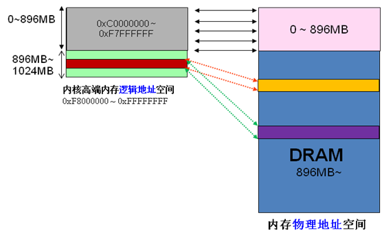
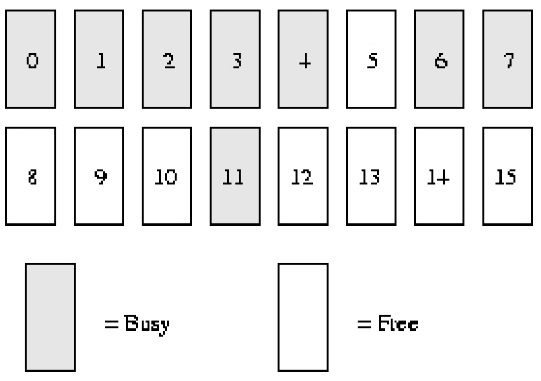
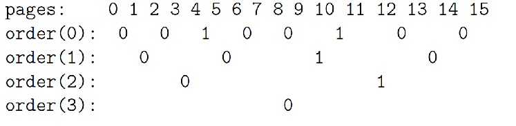

参考:

http://www.cnblogs.com/zhaoyl/p/3695517.html

本文以 32 位机器为准, 串讲一些内存管理的知识点.

## 1. 虚拟地址、物理地址、逻辑地址、线性地址

虚拟地址又叫线性地址. linux 没有采用分段机制, 所以逻辑地址和虚拟地址(线性地址)(在用户态, 内核态逻辑地址专指下文说的线性偏移前的地址)是一个概念. 物理地址自不必提. 内核的虚拟地址和物理地址, 大部分只差一个线性偏移量. 用户空间的虚拟地址和物理地址则采用了多级页表进行映射, 但仍称之为线性地址.

## 2. DMA/HIGH_MEM/NROMAL 分区

Linux 操作系统采用虚拟内存管理技术, 使得每个进程都有各自互不干涉的进程地址空间. 在 x86 结构(32 位)中, 该空间是块大小为 4G 的线性虚拟空间, Linux 内核**虚拟地址空间(！！！)划分** `0 ~ 3G` 为用户空间, `3 ~ 4G` 为内核空间(注意, **内核可以使用的线性地址只有 1G**, **这么说明是因为对于进程来说, 使用的是虚拟地址, 也就是线性地址, 而不直接使用物理地址！！！**). **3G 的用户地址空间访问最大 3G 的物理内存地址, 1G 的内核地址空间可访问全部的物理内存地址**. **内核虚拟空间**(3G\~4G)又划分为三种类型的区:

- `ZONE_DMA` 3G 之后起始的 16MB

- `ZONE_NORMAL` 16MB~896MB

- `ZONE_HIGHMEM` 896MB ~1G

由于内核的虚拟和物理地址只差一个偏移量: **物理地址 = 逻辑地址 – 0xC0000000(3G)**. 所以**如果 1G 内核空间完全用来线性映射, 显然物理内存也只能访问到 1G 区间**, 这显然是不合理的. HIGHMEM 就是为了解决这个问题, 专门开辟的一块不必线性映射, 可以灵活定制映射, 以便访问 1G 以上物理内存的区域. 从网上扣来一图,

高端内存的划分, 又如下图,

内核直接映射空间 `PAGE_OFFSET ~ VMALLOC_START`, kmalloc 和 `__get_free_page()` 分配的是这里的页面. 二者是借助 slab 分配器, 直接分配物理页再转换为逻辑地址(物理地址连续). 适合分配小段内存. 此区域包含了内核镜像、物理页框表 mem_map 等资源.

内核动态映射空间 `VMALLOC_START ~ VMALLOC_END`, 被 vmalloc 用到, 可表示的空间大.

内核永久映射空间 PKMAP_BASE \~ FIXADDR_START, kmap

内核临时映射空间 FIXADDR_START\~FIXADDR_TOP, kmap_atomic

## 3. 伙伴算法和 slab 分配器

伙伴 Buddy 算法解决了外部碎片问题.内核在每个 zone 区管理着可用的页面, 按 2 的幂级(order)大小排成链表队列, 存放在 free_area 数组.

具体 buddy 管理基于位图, 其分配回收页面的算法描述如下,

buddy 算法举例描述:

假设我们的系统内存只有 16 个页面 RAM. 因为 RAM 只有 16 个页面, 我们只需用四个级别(orders)的伙伴位图(因为最大连续内存大小为 16 个页面), 如下图所示.

order(0)bimap 有 8 个 bit 位(页面最多 16 个页面, 所以 16/2)

order(1)bimap 有 4 个 bit 位(order(0)bimap 有 8 个 bit 位, 所以 8/2);

也就是 order(1)第一块由两个页框 page1 与 page2 组成与 order(1)第 2 块由两个页框 page3 与 page4 组成, 这两个块之间有一个 bit 位

order(2)bimap 有 2 个 bit 位(order(1)bimap 有 4 个 bit 位, 所以 4/2)

order(3)bimap 有 1 个 bit 位(order(2)bimap 有 4 个 bit 位, 所以 2/2)

在 order(0), 第一个 bit 表示开始的 2 个页面, 第二个 bit 表示接下来的 2 个页面, 以此类推. 因为页面 4 已分配, 而页面 5 空闲, 故第三个 bit 为 1.

同样在 order(1)中, bit3 是 1 的原因是一个伙伴完全空闲(页面 8 和 9), 和它对应的伙伴(页面 10 和 11)却并非如此, 故以后回收页面时, 可以合并.

