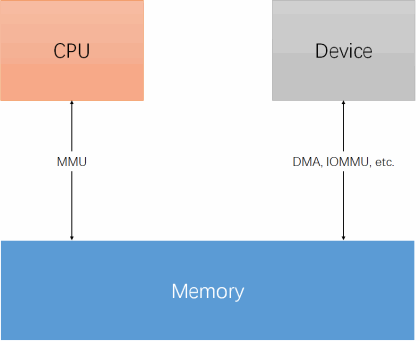
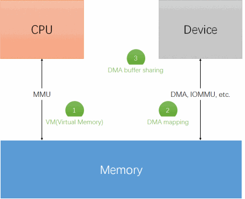
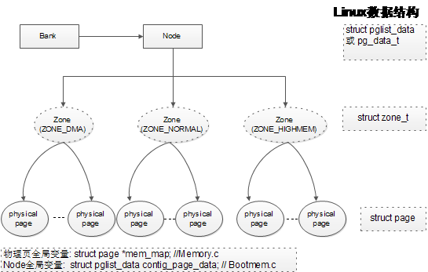
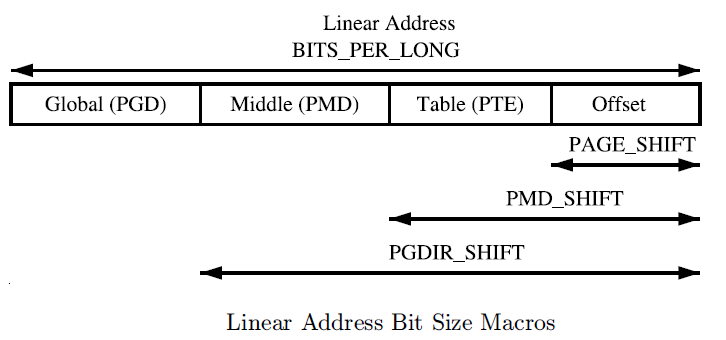
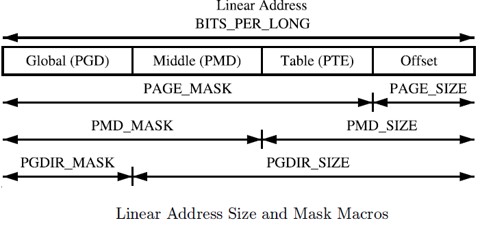
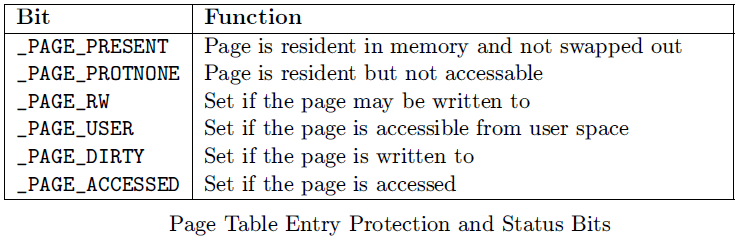

参考:

http://blog.csdn.net/MyArrow/article/details/8624687

http://www.wowotech.net/memory_management/concept.html

## 1. 前言

内存管理(Memory Management, 简称 MM)是 linux kernel 中非常重要又非常复杂的一个子系统.

CPU、Device 和 Memory 的关系:



从整体出发, 理解 Kernel 内存管理所需要面对的软硬件局面、所要解决的问题, 以及各个内存管理子模块的功能和意义. 这就是本文的目的.

## 2. 内存有关的需求总结

在嵌入式系统中, 从需求的角度看内存, 是非常简单的, 可以总结为两大类(参考上面的图片 1):

1) **CPU** 有**访问内存**的需求, 包括从内存中取指、从内存中取数据、向内存中写数据. 相应的数据流为:

```
CPU<-------------->MMU(Optional)<----------->Memory
```

2) 其它**外部设备**有**访问内存**的需求, 包括从内存"读取"数据、向内存"写入"数据. 这里的"读取"和"写入"加了引号, 是因为在大部分情况下, 设备不像 CPU 那样有智能, 不具备直接访问内存的能力. 总结来说, 设备有三种途径访问内存:

```
a) 由 CPU 从中中转, 数据流如下(本质上是 CPU 访问内存):
Device<---------------->CPU<--------------------Memory

b) 由第三方具有智能的模块(如 DMA 控制器)中转, 数据流如下:
Device<----------->DMA Controller<--------->Memory

c) 直接访问内存, 数据流如下:
Device<---------->IOMMU(Optional)--------->Memory
```

那么 Linux kernel 的内存管理模块怎么理解并满足上面的需求呢?接下来我们将一一梳理.

## 3. 软件(Linux kernel 内存管理模块)的角度看内存

### 3.1 CPU 视角

我们先从 CPU 的需求说起(以当前具有 MMU 功能的嵌入式 Linux 平台为例), 看看会向 kernel 的内存管理模块提出哪些需求.

#### 看到内存

关于内存以及内存管理, 最初始的需求是: Linux kernel 的核心代码(主要包括**启动和内存管理**), 要能看到物理内存.

在 MMU 使能之前, 该需求很容易满足.

但 MMU 使能之后、Kernel 的内存管理机制 ready 之前, **Kernel 看到的是虚拟地址**, 此时需要一些简单且有效的机制, 建立虚拟内存到物理内存的映射(可以是部分的映射, 但要能够满足 kenrel 此时的需要).

#### 管理内存

看到内存之后, 下一步就是将它们管理起来. 根据不同的内存形态(在物理地址上是否连续、是否具有 NUMA 内存、是否具有可拔插的内存、等等), 可能有不同的管理模型和管理方法.

#### 向内核线程/用户进程提供服务

将内存管理起来之后, 就可以向其它人(kernel 的其它模块、内核线程、用户空间进程、等等)提供服务了, 主要包括:

- 以虚拟地址(VA)的形式, 为应用程序提供远大于物理内存的虚拟地址空间(Virtual Address Space)
- 每个进程都有独立的虚拟地址空间, 不会相互影响, 进而可提供非常好的内存保护(memory protection)
- 提供内存映射(Memory Mapping)机制, 以便把物理内存、I/O 空间、Kernel Image、文件等对象映射到相应进程的地址空间中, 方便进程的访问
- 提供公平、高效的物理内存分配(Physical Memory Allocation)算法
- 提供进程间内存共享的方法(以虚拟内存的形式), 也称作 Shared Virtual Memory
- 等等

#### 更为高级的内存管理需求

欲望是无止境的, 在内存管理模块提供了基础的内存服务之后, Linux 系统(包括 kernel 线程和用户进程)已经可以正常 work 了, 更为高级的需求也产生了, 例如:

- 内存的热拔插(memory hotplug)
- 内存的 size 超过了虚拟地址可寻址的空间怎么办(high memory)
- 超大页(hugetlbpage)的支持
- 利用磁盘作为交换页以扩大可用内存(各种 swap 机制和算法)
- 在 NUMA 系统中通过移动物理页面位置的方法提升内存的访问效率(Page migration)
- 内存泄漏的检查
- 内存碎片的整理
- 内存不足时的处理(oom kill 机制)
- 等等

### 3.2 Device 视角

正常情况下, 当软件活动只需要 CPU 参与时(例如简单的数学运算、图像处理等), 上面 3.1 所涉及内容已经足够了, 无论是用户空间程序, 还是内核空间程序, 都可以欢快的运行了.

不过, 当软件操作一些特殊的、可以以自己的方式访问 memory 的硬件设备的时候, 麻烦就出现了: 软件通过 CPU 视角获得 memory, 并不能直接被这些硬件设备访问. 于是这些硬件设备就提出了需求:

内存管理模块需要为这些设备提供一些特殊的获取内存的接口, 这些接口可以按照设备所期望的形式组织内存(因而可以被设备访问), 也可以重新映射成 CPU 视角的形式, 以便 CPU 可以访问.

这就是我们在编写设备驱动的时候会经常遇到的 DMA mapping 功能, 其中 DMA 是 Direct Memory Access 的所需, 表示(memory)可以被设备直接访问.

另外, 在某些应用场景下, 内存数据可能会在多个设备间流动, 为了提高效率, 不能为每个设备都提供一份拷贝, 因此内存管理模块需要提供设备间内存共享(以及相互转换)的功能.

## 4. 软件结构

基于上面章节的需求, Linux kernel 从虚拟内存(VM)、DMA mapping 以及 DMA buffer sharing 三个角度, 对内存进行管理, 如下图所示:

VM、DMA mapping 和 DMA buffer sharing:



其中 VM 是内存管理的主要模块, 也是我们通常意义上所讲的狭义"内存管理", 代码主要分布在 mm/以及 arch/xxx/mm/两个目录下, 其中 arch/xxx/mm/\*提供平台相关部分的实现, mm/\*提供平台无关部分的实现.

DMA mapping 是内存管理的辅助模块, 注要提供 dma\_alloc\_xxx(申请可供设备直接访问的内存----dma\_addr)和 dma\_map\_xxx(是在 CPU 视角的虚拟内存和 dma\_addr 之间转换)两类接口. 该模块的具体实现依赖于设备访问内存的方式, 代码主要分别在 drivers/base/\*(通用实现)以及 arch/xxx/mm/(平台相关的实现).

最后是 DMA buffer sharing 的机制, 用于在不同设备之间共享内存, 一般包括两种方法:

- 传统的、利用 CPU 虚拟地址中转的方法, 例如 scatterlist;

- dma buffer sharing framework, 位于 drivers/dma-buf/dma-buf.c 中.

## 5. Linux 物理内存三级架构



对于内存管理, Linux 采用了与具体体系结构不相关的设计模型, 实现了良好的可伸缩性. 它主要由内存节点 node、内存区域 zone 和物理页框 page 三级架构组成.

### 内存节点 node

内存节点 node 是计算机系统中对物理内存的一种描述方法, 一个总线主设备访问位于同一个节点中的任意内存单元所花的代价相同, 而访问任意两个不同节点中的内存单元所花的代价不同. 在一致存储结构(Uniform Memory Architecture, 简称 UMA)计算机系统中只有一个节点, 而在非一致性存储结构(NUMA)计算机系统中有多个节点. Linux 内核中使用数据结构 pg_data_t 来表示内存节点 node. 如常用的 ARM 架构为 UMA 架构.

### 内存区域 zone

内存区域位于同一个内存节点之内, 由于各种原因它们的用途和使用方法并不一样. 如基于 IA32 体系结构的个人计算机系统中, 由于历史原因使得 ISA 设备只能使用最低 16MB 来进行 DMA 传输. 又如, 由于 Linux 内核采用

## 6. Linux 虚拟内存三级页表

Linux 虚拟内存三级管理由以下三级组成:

- PGD: Page Global Directory (页目录)

- PMD: Page Middle Directory (页目录)

- PTE:  Page Table Entry  (页表项)

每一级有以下三个关键描述宏:

- SHIFT

- SIZE

- MASK

如页的对应描述为:

```
/* PAGE_SHIFT determines the page size  asm/page.h */
#define PAGE_SHIFT      12
#define PAGE_SIZE       (_AC(1,UL) << PAGE_SHIFT)
#define PAGE_MASK       (~(PAGE_SIZE-1))
```

数据结构定义如下:

```
/* asm/page.h */
typedef unsigned long pteval_t;

typedef pteval_t pte_t;
typedef unsigned long pmd_t;
typedef unsigned long pgd_t[2];
typedef unsigned long pgprot_t;

#define pte_val(x)      (x)
#define pmd_val(x)      (x)
#define pgd_val(x)  ((x)[0])
#define pgprot_val(x)   (x)

#define __pte(x)        (x)
#define __pmd(x)        (x)
#define __pgprot(x)     (x)
```

### 6.1 Page Directory (PGD and PMD)

每个进程有它自己的 PGD(Page Global Directory), 它是一个物理页, 并包含一个 pgd\_t 数组. 其定义见<asm/page.h>.  进程的 pgd\_t 数据见 task\_struct -> mm\_struct -> pgd\_t * pgd;

ARM 架构的 PGD 和 PMD 的定义如下<arch/arm/include/asm/pgtable.h>:

```
#define PTRS_PER_PTE  512 // PTE 中可包含的指针<u32>数 (21-12=9bit)
#define PTRS_PER_PMD  1
#define PTRS_PER_PGD  2048 // PGD 中可包含的指针<u32>数 (32-21=11bit)

#define PTE_HWTABLE_PTRS (PTRS_PER_PTE)
#define PTE_HWTABLE_OFF  (PTE_HWTABLE_PTRS * sizeof(pte_t))
#define PTE_HWTABLE_SIZE (PTRS_PER_PTE * sizeof(u32))

/*
* PMD_SHIFT determines the size of the area a second-level page table can map PGDIR_SHIFT determines what a third-level page table entry can map
*/
#define PMD_SHIFT  21
#define PGDIR_SHIFT  21
```

虚拟地址 SHIFT 宏图:



虚拟地址 MASK 和 SIZE 宏图:



### 6.2 Page Table Entry

PTEs, PMDs 和 PGDs 分别由 pte\_t, pmd\_t 和 pgd\_t 来描述. 为了存储保护位, pgprot\_t 被定义, 它拥有相关的 flags 并经常被存储在 page table entry 低位(lower bits), 其具体的存储方式依赖于 CPU 架构.

每个 pte\_t 指向一个物理页的地址, 并且所有的地址都是页对齐的. 因此在 32 位地址中有 PAGE\_SHIFT(12)位是空闲的, 它可以为 PTE 的状态位.

PTE 的保护和状态位如下图所示:

