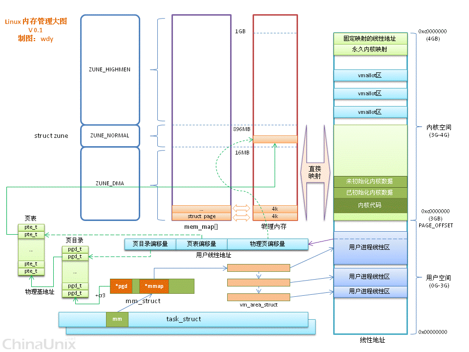
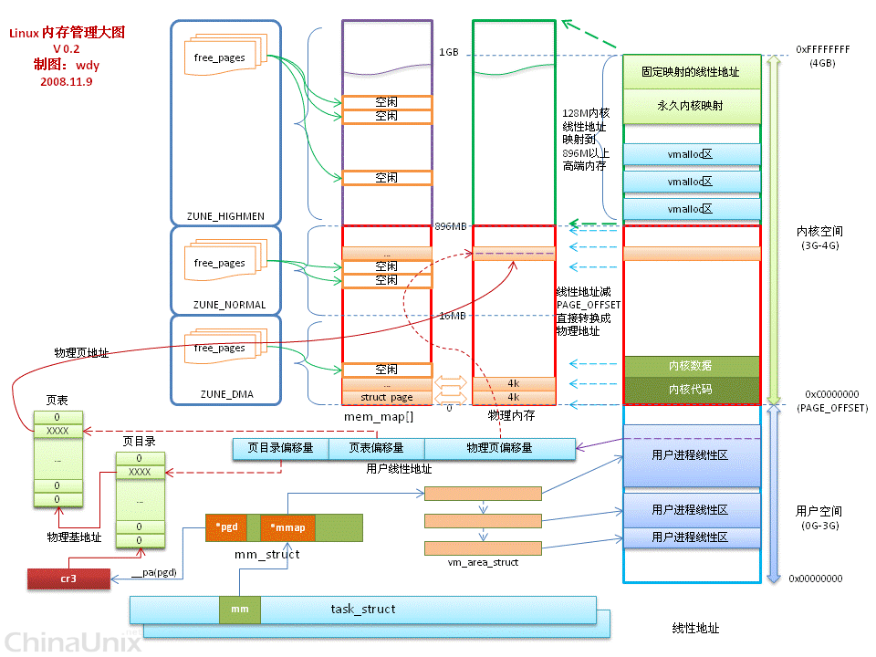
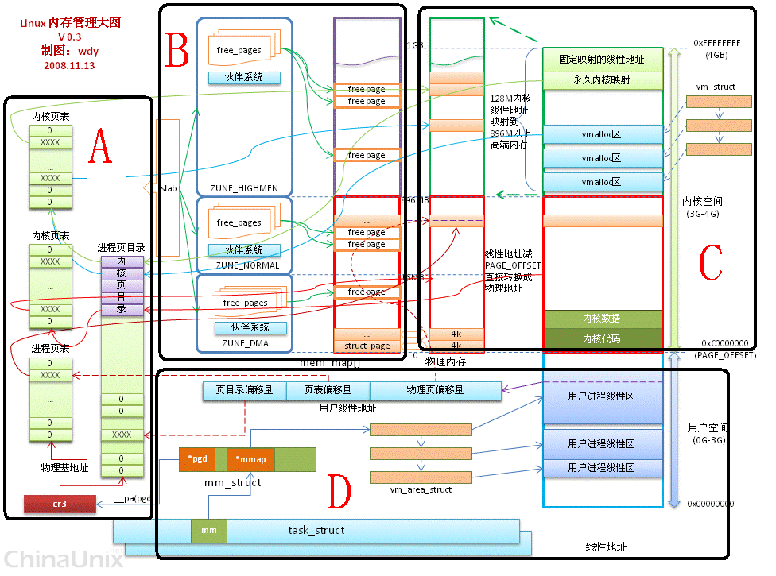

参考:

http://bbs.chinaunix.net/thread-3760371-1-1.html








## 1、处理器硬件辅助的虚实地址转换(参考图中的 A 区)

在 x86 中虚实地址转换分为段式转换和页转换. 段转换过程是由逻辑地址(或称为虚拟地址)转换为线性地址; 页转换过程则是将线性地址转换为物理地址. 在 linux 中只使用了 4 个全局描述符表, 内核空间和用户空间分别两个 gdt, 分别对应各自的代码段和数据段. 也可以认为在 linux 中变相地 disable 了 x86 的段式转换功能.

页转换过程请参考图中 A 区部分.

在 32 位系统中, 处理器能访问的地址空间为 4Gbyte. Linux 系统中把 4G 的空间划分为两部分, 0—3G 为进程的用户空间, 每个进程的用户空间都是独立的, 参见 A 区进程页目录项中的绿色部分; `3G — 4G` 的空间为内核空间, 为所有进程共享, 参见 A 区进程页目录项中的淡紫色部分. 内核区域对应的页表项 U/S(用户/超级用户标志)被设置为 0, 即只有超级用户可以访问, 即只有在内核态才可以访问页表项. 从而防止用户态访问 `3 — 4G` 的空间.

在 linux 中 x86 的 cr3 寄存器(页表基地址寄存器)保存在进程的上下文中, 在进程切换时会保存或恢复该寄存器的内容, 这样每个进程都有自己的转换页表, 从而保证了每个进程有自己的虚拟空间.

## 2. 内存的 zone 分区(见图中 B 区)

内存被分为多个块, 称为 zones, 它表示内存中一段区域. 一个 zone 用 struct zone 结构描述, zone 的类型主要有 ZONE\_DMA、ZONE\_NORMAL 和 ZONE\_HIGHMEM. ZONE\_DMA 位于低端的内存空间, 用于某些旧的 ISA 设备. ZONE\_NORMAL 的内存直接映射到 Linux 内核线性地址空间的部分, 所以称为直接映射区, ZONE\_HIGHMEM 位于物理地址高于 896MB 的区域.

内核空间只有 1GB 线性地址, 如果使用大于 1GB 的物理内存就没法直接映射到内核线性空间了. 实际上, 为了映射高端内存, 从 1GB 中留出了 128MB 空间, 所以当系统中的内存大于 896MB 时, 把内核线性空间分为两部分, 内核中低于 896MB 线性地址空间直接映射到低 896MB 的物理地址空间; 高于 896MB 的 128MB 内核线性空间用于动态映射 ZONE\_HIGHMEM 内存区域(即物理地址高于 896MB 的物理空间).

## 3. Buddy 伙伴系统(见图中 B 区)

每个 zone 区域都采用伙伴系统(buddy system)来管理空闲内存页面. 把所有的**空闲页框**分组为 11 个块链表, 每个块链表分别包含大小为 1, 2, 4, 8, 16, 32, 64, 128, 256, 512 和 1024 个连续的页框. 链表编号分别为 0, 1, 2, 3, ... k... 10, 即连续页面数为 2\^k 个.

从 buddy system 中申请页面过程:

1、根据申请存储区域大小查找对应的编号为 K 的块链表.

2、如果编号 K 的链表为空, 则向编号为 k+1 的链表申请一个存储区域. 如果编号为 k+1 链表不为空, 系统从编号为 k+1 的链表上拆下一个区域, 并将拆下的区域分为两个 2^k 的区域, 一个返还给申请者, 另一个则挂到编号为 k 的链表.

3、如果编号为 k+1 的链表也为空, 编号为 k+2 的链表不为空. 则从 k+2 的链表中拆下一个区域变为两个 2^(k+1)区域, 一个挂到编号为 k+1 的链表上, 把另一个拆为两个 2^k 的区域, 一个返还给申请者, 把另一个挂到编号为 k 的链表上.

4、如果 k+2 的链表也为空, 则一直向上迭代, 直到编号为 10 的链表为止, 如果编号为 10 的链表还为空, 则申请失败.

向 buddy system 中释放页面过程:

在向 buddy system 释放页面时, 总会检测释放的页面和链表中其他页面是否可以组成一个更大一级的页面, 如果可以组成, 则把这两个区域组成一个并挂到更高一级的链表中. 这个过程是迭代的, 释放过程会一层层向上找伙伴, 然后合并成更大的, 再向上找伙伴, 实在找不到了就停止了！

疑问: 按照上面的说法, 是否会出现这种情况, 在释放某个页面导致所有页面都组成了标号为 10 的连续页面了. 等到再需要分配 1 个页面时, 又要一级一级地拆分. 这样的话效率是否很低??

是否在 buddy system 每个链表结构中设一个门限值会更好?释放时标记一下可以组成 buddy 的两个连续区域, 只有该级空闲的区域个数超过门限后才组成 buddy 并挂到上一级链表上. 当然, 这个门限值可以由内核根据目前总的空闲页面数量进行动态调整.

## 4. Slab 系统(见图中 B 区)

引入 buddy 系统是为了减少页外碎片的, 而引入 slab 系统是为了减少页内碎片的.

可以把 slab 看做批发商, slab 从 buddy 中一次批发 n 个页面, 并把每个页面划分成若干小的对象 object. 内核模块以 object 为单位从 slab 中申请或释放小块内存.

在内存初始化过程中会创建一个 slab 的 cache\_chain, 这是一个 slab 缓存的链接列表. 可以用来查找最适合所需要的分配大小的缓存. cache\_chain 的每个元素都是一个 kmem\_cache 结构的引用. 一个 kmem\_cache 中的所有 object 大小都相同.

## 5. 内核空间分类(见图中 C 区)

内核空间分为直接映射区和高端映射区, 其中高端映射区又分为动态映射区、KMAP 区和固定映射区, 如下表所示.

```
直接映射区        动态映射区        KMAP 区        固定映射区
896(max)        120(min)        4M            4M
```

调用 kmalloc()函数可以从直接映射区申请指定大小的内存区域, 对应的释放内存函数为 kfree(). 如果申请的空间较小, 会根据申请空间的大小从 slab 中获取; 如果申请的空间较大, 如超过一个页面, 会直接从 buddy 系统中获取. 调用 kmalloc()成功申请到多个页面的空间时, 这些页面的物理地址是连续的.

调用 vmalloc()函数可以从动态映射区申请指定大小的内存区域, 即其虚拟地址处于动态映射区, 对应的释放内存函数为 vfree(). 另外, 调用 vmalloc()函数通常从高端内存区申请页面, 并且用 vmalloc()申请的内存区域的物理地址可能是不连续的.

用函数 alloc\_pages(\_GFP_HIGHMEM)申请的若干高端内存页面, 再用函数 kmap()映射到内核空间(即分配内核空间虚拟地址), 就会映射到 KMAP 区, KMAP 区只有 4MB, 所以不用时需要及时释放. 用 kmap()函数分配的内核虚拟地址并非一定会落在 KMAP 区, 跟踪 kmap()函数的实现就可以发现, 只用从高端内存区获取的内存才会分配 KMAP 区的虚拟地址, 否则会返回页面对应的直接映射区的虚拟地址.

注意:

1、在调用 alloc\_pages()函数申请页面时, 如果注明\_GFP\_HIGHMEM, 即从高端内存区申请. 则实际是优先从高端内存申请, 顺序为(分配顺序是 HIGH, NORMAL, DMA ).

2、高端映射区是指内核空间的最高 128M 的虚拟地址空间; 高端内存区是指系统中物理地址大于 896MB 的所有物理内存.

## 6. 单个进程的内存管理(见图中 D 区)

每个进程的 task\_struct 中都有一个 active\_mm 成员, 类型为 struct mm\_struct, 内核就是利用该成员管理进程虚拟空间的. 参见数据结构 task\_struct, 为了方便阅读, 删除了该结构中无关的成员变量.

```
struct task_struct{
        struct mm_struct *mm, *active_mm;
        }
```

参考下面的数据结构定义. 数据结构 struct mm\_struct 中的成员 mm\_rb 指向了一棵红黑树的根, 该进程的所有申请的虚拟空间都以起始虚拟地址为红黑树的 key 值挂到了这棵红黑树上. mm\_struct 中的成员 map\_count 指示该进程拥有的虚拟空间的个数, pgd 指向该进程的页转换表.

```
struct mm_struct{
        struct vm_area_struct * mmap; /* list of VMAs 指向若干个 VMA 组成的链表 */
        struct rb_root mm_rb;               指向一棵红黑树
        struct vm_area_struct * mmap_cache;        指向最近找到的虚拟存储区域
        int map_count;                                /* number of VMAs */  虚拟区间的个数
        pgd_t * pgd;             指向页转换表
}
```

数据结构 struct vm\_area\_struct 定义了一个连续的虚拟地址空间, 包括起始地址和结束地址, 以及红黑树节点 vm\_rb. 内核就是以 vm\_start 为 key 值把 vm\_rb 挂到进程内存红黑树上的.

```
struct vm_area_struct{
        struct mm_struct * vm_mm;        /* The address space we belong to. */
        unsigned long vm_start;                /* Our start address within vm_mm. */
        unsigned long vm_end;         /* The first byte after our end address within vm_mm. */
        struct rb_node vm_rb;             这个虚拟区域对应的红黑树的节点
}
```

内核在给进程分配了一块虚拟地址内存块后, 就将该区域挂接到进程的红黑树上, 此时内核尚未给该进程分配实际的内存. 在进程访问该区域时则产生缺页中断, 在中断中检查访问的区域已经分配给进程后, 则分配实际内存页面, 并更新该进程的页转换查找表. 中断返回, 进程重新执行触发中断的指令, 并继续运行.

当进程释放一块内存区域后, 内核会立即收回分配给该区域的物理内存页面.

问题 1、直接映射区域应该是在初始化阶段就配置了相关的页转换表的吗?


问题 2、每个物理页面对应一个 page 结构. (如果问题 1 的答案是肯定的话)在初始化过程中会把所有的直接映射区对应的物理页 page 结构中虚拟地址 virtual 填写为(PAGE_OFFSET + phy_address ), 而高端物理内存页对应 page 中的虚拟地址应该是 null 的. 那么在后续的运行中 page 中的虚拟地址会如何改变?比如, 直接映射区的页面分配给用户空间, page 中的 virtual 会被修改吗?高端内存被分配给内核空间和用户空间时, 其 virtual 会如何修改?如果页面用作多个进程间的共享内存时, 其 virtual 的数值应该如何修改?

