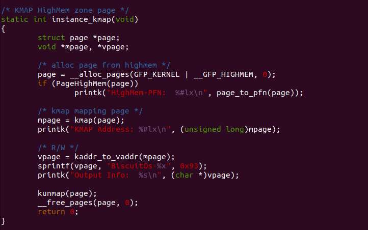
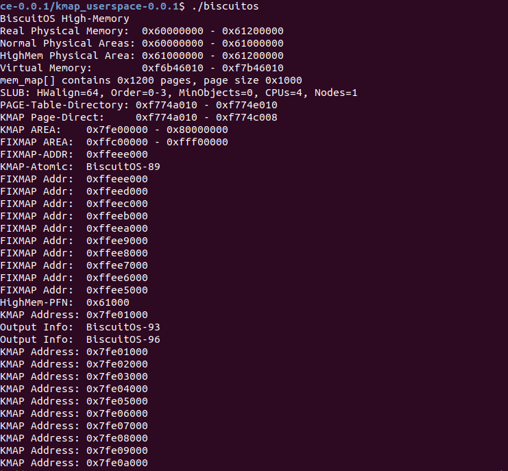

大家好, 今天给大家分享的是我在用户空间实现的 Linux Kmap 内存分配器, 在内核中, kmap 用于将高端物理页映射到系统的虚拟地址上, 可映射的虚拟地址包括两部分, 一部分就是 PAGE_OFFSET 之前的 2M 虚拟地址, 另外一部分是 FIXMAP 虚拟地址区间内. 这次提供了 kmap/kunmap 和 `kmap_atomic`/`kunmap_atomic` 的实现逻辑以及使用实例. kmap() 是将高端页映射到 PAGE_OFFSET 之前的 2M 虚拟地址, 在驱动中经常使用. `kmap_atomic()` 函数则可以将高端页映射到 FIXMAP 区域的虚拟地址上, 有想研究其实现原理的童鞋可以参考 GITHUB: https://github.com/BiscuitOS/HardStack/tree/master/Memory-Allocator/Kmap/kmap_userspace

使用方法:

运行结果:

在做 Kmap 内存分配器的时候, 由于要让程序中包括低端物理页和高端物理页, 因此需要使用 buddy 内存分配器对页进行不同的管理, 这里正好留下一个带高端页和低端页的 buddy 内存分配器, 需要的童鞋可以参考这个项目 https://github.com/BiscuitOS/HardStack/tree/master/Memory-Allocator/HighMEM/highmem_userspace

