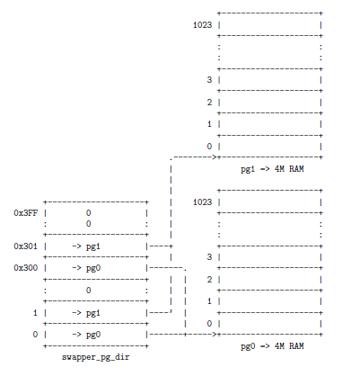
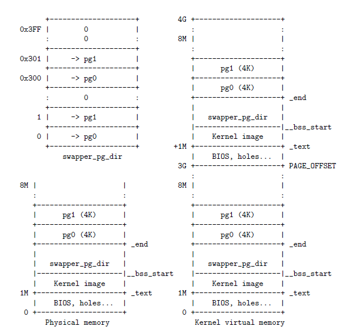

参考:

http://blog.csdn.net/unclerunning/article/details/51917605

http://blog.csdn.net/gatieme/article/details/52403148

## 系统启动之 Linux 内存管理基础

## Keywords

非一致内存访问(NUMA)模型、节点(node)、内存管理区(Zone)、一致内存访问(UMA)模型、内核页表、内存管理区分配器(伙伴系统 Buddy System)、slab 系统、活动页链表、非活动页链表、保留物理页框、TLB 抖动、内存管理的初始化

## 一些概念

- 直接映射: 是指将某一块连续地**虚拟内存区间**固定地映射到一块物理内存区间, 生成相应的映射页表表项, 这些表项生成之后页表表项不会改变, 映射关系保持不变【固定】, 直到操作系统 shutdown.

- 动态映射: 直接映射是将一块虚拟内存区间固定地映射到一块物理内存区间, 映射关系一直保持. 而动态映射正好相反, 它可以先将一块虚拟内存区间映射到某块物理内存区间上, 之后还可以改变这种不固定的映射, 将这块虚拟内存区间映射到另外的物理内存区间上. 为了描述方便, 我假定物理内存区间在物理内存地址空间是连续的, 但实际上并不需要保证连续性【可以是离散的页组成的物理内存区间】.

- 永久映射:  将物理高端内存页帧映射到内核线性地址空间的持久映射区[PKMap 区], 一旦映射建立之后, 在解除映射关系之前, 对应的页表表项都不能更改为其他映射关系.

- 虚拟内存区间连续: 是指一块虚拟内存区间在虚拟地址空间中是连续的, 但不要求与之对应的物理内存区间在物理内存地址空间中连续.

- 物理内存区间连续: 是指一块物理内存区间在物理内存地址空间中连续.

- 虚拟地址: 代码中对地址的引用.

- 线性地址: 虚拟地址经过段机制映射之后的地址[在没有段机制时, 虚拟地址就是线性地址].

- 物理地址: 线性地址经过分页机制映射之后的地址[在没有分页机制时, 线性地址就是物理地址].

- 内核页目录: 内核页目录一般是指内核全局页目录, ilde 和 init 在初始化系统时就使用的这个页目录. 这个页目录只在系统启动早期被这几个内核初始化线程使用, 后面就不会被任何进程用做页目录. 因为调度器选择一个内核线程执行的时候, 内核线程会挪用被调度出去的进程的 mm[地址空间], 所以说内核线程是没有自己的地址空间的【当然, 除了系统启动时的 idle 和 init 线程, 不过, 后面 idle 和 init 以及其他所有内核线程一样, 在进程切换的时候使用被调度走的那个进程的页目录】.

- 进程页目录: 进程拥有自己的地址空间 mm, 所以有自己的页目录 mm->pgd, 在切换到他时, 内核会更新 cr3 寄存器, 使用他的页目录.

## 1. 操作系统启动过程

代码最初在实模式下, BIOS 开机自检后, 初始化 IVT(中断向量表)后, 会读取(用户设定)启动存储设备的第一个扇区. 这个扇区的 512B 字节包含系统引导代码(bootsect.s)以及磁盘分区表, 其中启动代码(boot/bootsect.s)属于 bootloader(boot/bootsect.s+boot/setup.s)的一部分.

注: 现在的 bootloader 已经不是原来的 boot/bootsect.s+boot/setup.s 形式, 而是第三方的 bootloader+boot/setup.s

### 1.1 bootloader 主要任务

```
加载操作系统内核到内存中, 使能段机制, 完成实模式到保护模式的转换.
```

bootloader[boot/bootsect.s]首先将[setup.s]和[内核(包含 boot/compressed/head.s)]加载到内存中, 然后跳转到 setup.s.

接下来 bootloader[boot/setup.s] 建立 system's physical memory map、将内核转移到物理地址 0x1000[4k]【小内核】或者 0x100000[1M]【大内核】.

```
boot/compressed/head.s 位于这个物理地址处.
```

建立临时的 IDT, 然后建立好临时的 GDT【全局描述符表/段描述符表】, 使得:

```
virt addr=linear addr = phy addr. 【虚拟地址与物理地址的对等映射】
```

在建立好 GDT 后使能段机制, 进入保护模式.

这里, 段机制实际上就是实现了一个对等映射, 为什么要这么做呢?必然是为了进入保护模式, 扩展内存寻址空间啊【20 -> 32】！

注意, 这时候还没有建立页表, 也没有使能页机制. 这里的代码是基于物理内存地址进行编写和链接的【编写 bootloader 时就知道它会初始化 GDT, 实现一个虚拟地址与物理地址的对等映射, 然后开启段机制进入保护模式, 扩展寻址空间】.

进入保护模式之后, bootloader[boot/setup.s]使 pc 跳转到 0x1000【小内核】或者 0x100000 【大内核】[boot/compressed/head.s]去执行指令.

```
//boot/setup.s

...

// jump to startup_32 in arch/i386/boot/compressed/head.
// NOTE: For high loaded big kernels we need a
//    jmpi    0x100000,__BOOT_CS
  ...
/*
default:
jump to 0x10:0x1000
For high loaded big kernels:
jump to 0x10:0x100000 (segment number: 0x10; offset: 0x100000.)
*/

...
```

head.s 主要解压缩内核映像(decompress_kernel), 解压后的结果最终都将放在 0x100000[1M]处(不管大内核、小内核). 然后转入内核[kernel/head.s]:

```
//boot/compressed/head.s
startup_32:
...

ljmp $(__KERNEL_CS), $0x100000 //kernel/head.s 中的 startup_32 缺省地址:0x100000, 所以
  //这行代码执行之后, pc 跳到 kernel/head.s 中的 startup_32 处
 /*
 在解压缩的过程中, kernel/head.s 会覆盖原来的 boot/head.s
 */
...
```

通过这些步骤之后, 真正开始了内核初始化过程, 包括:

- 启动分页机制;

- 让操作系统各组成部分(内存管理、进程管理等)分别完成自己的初始化, 如建立各种管理用的数据结构等;

- 完成外部设备的初始化;

- 创建并启动用户进程;

- 启动 Shell 或 GUI, 开始与用户交互

### 1.2 为启用分页机制做准备, 并使能分页机制

```
内核最初的初始化任务由[kernel/head.s]来完成.
```

线性地址空间大小

- 一个页目录大小为一页, 4KB, 每个页目录项为 4 字节, 因此, 一个页目录包含 1024 个页目录项, 即能够描述 1024 个页表.

- 一个页表大小为一页, 4KB, 每个页表项为 4 字节, 因此, 一个页表包含 1024 个页表项, 即能够描述 1024 个页.

线性地址由页目录+页表+偏移量组成, 而系统中只有一个页目录, 那么线性地址空间能表示的最大范围为 1024*1024 个 4KB 页=4GB.

kernel/head.s 开启页机制

注意, 内核【包括 kernel/head.s】的代码被链接到了__PAGE_OFFSET 之上的线性空间中, 实际却被装载在物理地址 0x100000[1M]的位置, 所以要注意代码中符号的引用[线性地址]对应的物理地址是否正确.

```
/*
 *  linux/arch/i386/kernel/head.S -- the 32-bit startup code.
 */

...
ENTRY(startup_32)
...
  //sets up the final GDT
  lgdt boot_gdt_descr - __PAGE_OFFSET
  //__PAGE_OFFSET = 0xC0000000[for 32bit os]
  /*
  boot_gdt_descr 的线性地址位于__PAGE_OFFSET 之上, 但实际位于物理地址:
  boot_gdt_descr - __PAGE_OFFSET 处.
  */

/*
 * builds provisional kernel page tables so that paging can be turned on
 * 建立临时页表 ,代码在后文给出, 带有注释
 */
...

/*
 * Enable paging
 * 使能页机制
 */
  movl $swapper_pg_dir-__PAGE_OFFSET,%eax
  movl %eax,%cr...3       /* set the page table pointer.. */
  movl %cr0,%eax
  orl $0x80000000,%eax
  movl %eax,%cr0      /* ..and set paging (PG) bit */
  ljmp $__BOOT_CS,$1f    /* Clear prefetch and normalize %eip */

     //使能页机制之后, 因为建立了临时的映射关系, 所以往后对符号的引用不再用手动的计算其
     //实际所在的物理地址, MMU 会帮你安装页表给出的映射关系自动完成计算.
...
    lgdt cpu_gdt_descr
...

  call setup_idt

...

/*
 *  setup_idt
 *
 * creates the final interrupt descriptor table
 */
setup_idt:
...


/* This is the default interrupt "handler" :-) */
  ALIGN
ignore_int:
...
  iret
...

//下面的数据段随内核镜像被加载到了物理内存中, 但其符号的线性地址却在链接脚本中被设置为
//相对物理地址偏移 __PAGE_OFFSET, 所以在建立页表映射并使能页机制之前, 对这些符号的使用
//要格外小心, 需要手动地在代码中计算出其实际物理地址. 所以, head.s 需尽快地建立临时页
//表, 使能页机制.

/*
 * BSS section
 */
.section ".bss.page_aligned","w"
ENTRY(swapper_pg_dir)
  .fill 1024,4,0
ENTRY(empty_zero_page)
  .fill 4096,1,0

/*
 * This starts the data section.
 */
.data

ENTRY(stack_start)//kernel stack
  .long init_thread_union+THREAD_SIZE
  .long __BOOT_DS

...

.globl boot_gdt_descr
.globl idt_descr
.globl cpu_gdt_descr

  ALIGN

# early boot GDT descriptor (must use 1:1 address mapping)

  .word 0             # 32 bit align gdt_desc.address
boot_gdt_descr:
  .word __BOOT_DS+7
  .long boot_gdt_table - __PAGE_OFFSET

  .word 0             # 32-bit align idt_desc.address
idt_descr:
  .word IDT_ENTRIES*8-1       # idt contains 256 entries
  .long idt_table


# boot GDT descriptor (later on used by CPU#0):

  .word 0             # 32 bit align gdt_desc.address
cpu_gdt_descr:
  .word GDT_ENTRIES*8-1
  .long cpu_gdt_table

  .fill NR_CPUS-1,8,0     # space for the other GDT descriptors

/*
 * The boot_gdt_table must mirror the equivalent in setup.S and is
 * used only for booting.
 */
  .align L1_CACHE_BYTES
ENTRY(boot_gdt_table)
  .fill GDT_ENTRY_BOOT_CS,8,0
  .quad 0x00cf9a000000ffff    /* kernel 4GB code at 0x00000000 */
  .quad 0x00cf92000000ffff    /* kernel 4GB data at 0x00000000 */

/*
 * The Global Descriptor Table contains 28 quadwords, per-CPU.
 */
  .align PAGE_SIZE_asm
ENTRY(cpu_gdt_table)
  .quad 0x0000000000000000    /* NULL descriptor */
  .quad 0x0000000000000000    /* 0x0b reserved */
     ...
  .quad 0x0000000000000000    /* 0x33 TLS entry 1 */
  .quad 0x0000000000000000    /* 0x3b TLS entry 2 */
  .quad 0x0000000000000000    /* 0x43 TLS entry 3 */
   ...

  .quad 0x00cf9a000000ffff    /* 0x60 kernel 4GB code at 0x00000000 */
  .quad 0x00cf92000000ffff    /* 0x68 kernel 4GB data at 0x00000000 */
  .quad 0x00cffa000000ffff    /* 0x73 user 4GB code at 0x00000000 */
  .quad 0x00cff2000000ffff    /* 0x7b user 4GB data at 0x00000000 */
  ...
```

#### 1.2.1. 建立临时页表

```
/*
 * This is how much memory *in addition to the memory covered up to
 * and including _end* we need mapped initially.  We need one bit for
 * each possible page, but only in low memory, which means
 * 2^32/4096/8 = 128K worst case (4G/4G split.)
 * This should be a multiple of a page.
 */

#define INIT_MAP_BEYOND_END   (128*1024)

//128KB, used as a bitmap covering all pages.
//128k 的内存, 其中 1bit 代表一页物理页帧, 128k 能表示 2^32/4096 个物理页帧, 即 4G 的物理空间

 cld //EFLAGS 中的方向位置 0

/*
 * builds provisional kernel page tables so that paging can be turned on
 * 建立临时页表
 */
page_pde_offset = (__PAGE_OFFSET >> 20);//__PAGE_OFFSET 在 PED 的偏移
/*
__PAGE_OFFSET 是 0xc0000000, page_pde_offset = 3072 = 0xc00, 是页目录中的第
3072/4 = 768 个表项: PDE[768]
*/

//pg0 starts at _end
//swapper_pg_dir starts at the beginning of BSS

  movl $(pg0 - __PAGE_OFFSET), %edi //第 0 个页表所在的物理地址
  movl $(swapper_pg_dir - __PAGE_OFFSET), %edx //页目录所在的物理地址
  movl $0x007, %eax  /* 0x007 = PRESENT+RW+USER 用来设置表项的标记位*/

10://外循环: 填充 PDE

  //将 edi 寄存器中的值+0x007 然后赋给寄存器 ecx, 从后面得知: 下一次执行到这,
  //edi+=page_size.
  leal 0x007(%edi),%ecx           /* Create PDE entry */

    //对等映射空间: 将第 i 个页表的物理地址写入到 PDE 的第 i 项中-->PDE[i]
  movl %ecx,(%edx)            /* Store identity PDE entry */

  //内核线性空间[__PAGE_OFFSET 之上]:将第 i 个页表的物理地址写入到 PDE 的第
  //page_pde_offset+i 项中-->PDE[page_pde_offset+i]
  movl %ecx,page_pde_offset(%edx)     /* Store kernel PDE entry */

  addl $4,%edx //每次外循环, i++
  movl $1024, %ecx //每次内循环 1024 次


11://内循环: 填充 PTE

//stols 指令将 eax 中的值保存到 es:edi 指向的地址中, 若设置了 EFLAGS 中的方向位置位(即在 STOSL
//指令前使用 STD 指令)则 edi 自减 4, 否则(使用 CLD 指令)edi 自增 4
  stosl//%eax 初始值为$0 + $0x007, 其中的$0 表示第 0 个物理页框的起始物理地址

  addl $0x1000,%eax //0x1000=4k, 所以每次循环都将填充下一个物理页的物理地址到当前页
      //的下一个页表项中去

    //执行 LOOP 指令时, CPU 自动将 CX 的值减 1, 直到 CX 为 0 , 循环结束
  loop 11b //因为%ecx=1024, 所以循环 1024 次, 一次循环结束, 一张页表完成映射

    /* End condition: we must map up to and including INIT_MAP_BEYOND_END */
    /*
  bytes beyond the end of our own page tables; the +0x007 is the attribute
  bits
    */

    //ebp = edi 寄存器的数值 + INIT_MAP_BEYOND_END(128K)+ 0x007
  leal (INIT_MAP_BEYOND_END+0x007)(%edi),%ebp
  cmpl %ebp,%eax
      //%eax-0x007 = 下一个待映射的物理页的物理地址
      //%ebp-0x007 = 当前被映射的页表的最后一项的物理地址 + INIT_MAP_BEYOND_END
      /*
      上面的比较要表达的意思是:
      +----------+
      |----------|
--if--+----------+ 8M <———如果当前被映射了的物理空间到了这儿,则可以跳出循环
            ...
      +----------+
      |           |
------+----------+------if condition
      |     128K  |
      +----------+
      |----4b----|<——————最后一个页表项: init_pg_tables_end
      +----------+
            ...
      |----------|
      +----------+ _end <————页表起始位置:pg0
            ...
      +----------+ __bss_start <————页目录起始位置:swapper_pg_dir
            ...
      |----------|
--if--+----------+ 4M <———如果当前被映射了的物理空间到了这儿, 则还需映射, 继续外循环
      |----------|
      +----------+
        ...
   1M +----------+ _text <———内核代码被加载到了这里
        ...
      +----------+

   physical memory layout

      所以就是要保证包括页表所在的物理空间都要映射到, 还要保证至少 128k 的额外空间
      [bitmap]被映射到

      */

  jb 10b
      //%eax<%ebp, 则表示被映射的物理页帧不够, 跳回到外循环.
      //It's certain that no bootable kernel will be greater than 8MB in size,
      //所以只建立了物理内存前 8M 的映射:
      //linear address[0,8M]-->physical address[0,8m]
      //and
      //linear address[3G,3G+8M]-->physical address[0,8m]


    //将临时页表结束位置的物理地址赋值给 init_pg_tables_end
  movl %edi,(init_pg_tables_end - __PAGE_OFFSET)


    /*
    页目录占据一页内存[4k], 共 4k/4=1024 项页目录项, 每一项目录项对应一张页表[4k,共 1024 项
    页表项], 每一项页表项对应一页物理内存[4k], 故完整的页目录共映射了:
    1024*1024*4k=4G 的线性空间

    但是, 这里只映射了 PDE[1~2]和 PDE[page_pde_offset+1~page_pde_offset+2]到物理页区
    间: [0,4M]
    */
```

最后得到的临时页表会是下面的样子:



图示中, swapper_pg_dir 的第 0 项和第 1 中项中的 pg1 和 pg0 指向的页表中的页表项将线性地址映射成对等的物理内存地址【其中 0x300[4Gx3/4]和 0x301 两项后文会做出解释】:

inear addr = phy addr, 使得: virt addr = linear addr = phy addr.  【注意:  linear addr = phy addr 的映射关系对 0x300 和 0x301 两项不成立】

例如: 访问虚拟内存地址 0x00100300, 经过 GDT 段机制映射之后转化为线性地址 0x00100300, 经过页表页机制映射之后转化为物理地址 0x00100300.

现在重点关注 0x300 和 0x301 两项. 你会看到第 0x300 项和第 0 项以及第 0x301 项和第 1 项指向了相同的的页表. 技巧就在这里:

访问虚拟内存地址 0xc0100700, 经过 GDT 段机制映射之后转化为线性地址 0xc00100700, 经过页表页机制映射之后转化为物理地址 0x00100700.

最后的布局就会是这样:

注意: 在 pg1 上面还有一个 128k 的空间[bitmap].



开启分页后, 内核就不用顾忌对符号引用的解析了. 接下来内核让一系列的子系统去完成自己的初始化工作.

kernel/head.s 执行完后跳转到 init/main.c

```
//kernel/head.s

call start_kernel //init/main.c::start_kernel
```

### 1.3 init/main.c::start_kernerl

start_kernel 完成了内核所有的初始化工作.

```
asmlinkage void __init start_kernel(void)
{
   char * command_line;
...
    page_address_init();

  //for i386: arch\i386\kernel\setup.c::setup_arch
  //建立前 896M 的映射页表, 初始化 node、zone、memmap、buddy system、kmap 区等描述物理内存
  //的结构体
    setup_arch(&command_line);

  /*
  进程环境的初始化, 创建系统第一个进程: idle
  */
    sched_init();

    page_alloc_init();

  /* 异常处理调用函数表排序 */
    sort_main_extable();

  /* 重新设置中断向量表 */
    trap_init();
...
   /* 虚拟文件系统的初始化 */
    vfs_caches_init_early();

  /*
  内存初始化, 释放前边标志为保留的所有页面
  initializes the kernel's memory management subsystem. It also prints a tabulation
  of all available memory and the memory occupied by the kernel.
  */
    mem_init();

    kmem_cache_init();//初始化 slab 分配器, 建立在 buddy system 之上

...

    anon_vma_init();//匿名虚拟内存域初始化

    fork_init(num_physpages);  /* 根据物理内存大小计算允许创建进程的数量 */

  /*
  执行 proc_caches_init() , bufer_init(),  unnamed_dev_init() ,vfs_caches_init(),
  signals_init()等函数对各种管理机制建立起专用的 slab 缓冲区队列.
  */
    proc_caches_init();

    buffer_init();

...
    signals_init();

    /* rootfs populating might need page-writeback */
    page_writeback_init();

#ifdef CONFIG_PROC_FS
    proc_root_init();//对虚拟文件系统/proc 进行初始化
#endif

    acpi_early_init();

    /* Do the rest non-__init'ed, we're now alive */
    rest_init();
}
```

### 1.4 PKmap 区

#### 1.4.1 mm\highmem.c::page_address_init

