<!-- @import "[TOC]" {cmd="toc" depthFrom=1 depthTo=6 orderedList=false} -->

<!-- code_chunk_output -->

- [1. 学习路线](#1-学习路线)
- [2. 3 种系统架构与 2 种存储器共享方式](#2-3-种系统架构与-2-种存储器共享方式)
  - [2.1. SMP](#21-smp)
  - [2.2. NUMA](#22-numa)
  - [2.3. MPP](#23-mpp)
- [3. 内存空间分层](#3-内存空间分层)
- [4. Linux 物理内存组织形式](#4-linux-物理内存组织形式)
  - [4.1. Node](#41-node)
    - [4.1.1. 结点的内存管理域](#411-结点的内存管理域)
    - [4.1.2. 结点的内存页面](#412-结点的内存页面)
    - [4.1.3. 交换守护进程](#413-交换守护进程)
    - [4.1.4. 节点状态](#414-节点状态)
    - [4.1.5. 查找内存节点](#415-查找内存节点)
  - [4.2. zone](#42-zone)
    - [4.2.1. 高速缓存行](#421-高速缓存行)
    - [4.2.2. 水位 watermark[NR_WMARK]与 kswapd 内核线程](#422-水位-watermarknr_wmark与-kswapd-内核线程)
    - [4.2.3. 内存域统计信息 vm_stat](#423-内存域统计信息-vm_stat)
    - [4.2.4. zone 等待队列表(zone wait queue table)](#424-zone-等待队列表zone-wait-queue-table)
    - [4.2.5. 冷热页与 Per-CPU 上的页面高速缓存](#425-冷热页与-per-cpu-上的页面高速缓存)
    - [4.2.6. zonelist 内存域存储层次](#426-zonelist-内存域存储层次)
      - [4.2.6.1. 内存域之间的层级结构](#4261-内存域之间的层级结构)
      - [4.2.6.2. 备用节点内存域 zonelist 结构](#4262-备用节点内存域-zonelist-结构)
      - [4.2.6.3. 内存域的排列方式](#4263-内存域的排列方式)
      - [4.2.6.4. build_all_zonelists 初始化内存节点](#4264-build_all_zonelists-初始化内存节点)
  - [4.3. Page](#43-page)
    - [4.3.1. mapping & index](#431-mapping--index)
    - [4.3.2. lru 链表头](#432-lru-链表头)
    - [4.3.3. 内存页标识 pageflags](#433-内存页标识-pageflags)
    - [4.3.4. 全局页面数组 mem_map](#434-全局页面数组-mem_map)
- [5. Linux 分页机制](#5-linux-分页机制)
  - [5.1. Linux 中的分页层次](#51-linux-中的分页层次)
  - [5.2. Linux 中分页相关数据结构](#52-linux-中分页相关数据结构)
    - [5.2.1. PAGE 宏--页表(Page Table)](#521-page-宏-页表page-table)
    - [5.2.2. PMD-Page Middle Directory (页目录)](#522-pmd-page-middle-directory-页目录)
    - [5.2.3. PUD_SHIFT-页上级目录(Page Upper Directory)](#523-pud_shift-页上级目录page-upper-directory)
    - [5.2.4. PGDIR_SHIFT-页全局目录(Page Global Directory)](#524-pgdir_shift-页全局目录page-global-directory)
  - [5.3. 页表处理函数](#53-页表处理函数)
    - [5.3.1. 简化页表项的创建和撤消](#531-简化页表项的创建和撤消)
  - [5.4. 线性地址转换](#54-线性地址转换)
  - [5.5. Linux 中通过 4 级页表访问物理内存](#55-linux-中通过-4-级页表访问物理内存)
  - [5.6. swapper_pg_dir](#56-swapper_pg_dir)
- [6. 内存布局探测](#6-内存布局探测)
- [7. 内存管理的三个阶段](#7-内存管理的三个阶段)
- [8. 系统初始化过程中的内存管理](#8-系统初始化过程中的内存管理)
- [9. 特定于体系结构的内存初始化工作](#9-特定于体系结构的内存初始化工作)
  - [9.1. 建立内存图](#91-建立内存图)
  - [9.2. 页表缓冲区申请](#92-页表缓冲区申请)
  - [9.3. memblock 算法](#93-memblock-算法)
    - [9.3.1. struct memblock 结构](#931-struct-memblock-结构)
    - [9.3.2. 内存块类型 struct memblock_type](#932-内存块类型-struct-memblock_type)
    - [9.3.3. 内存区域 struct memblock_region](#933-内存区域-struct-memblock_region)
    - [9.3.4. 内存区域标识](#934-内存区域标识)
    - [9.3.5. 结构总体布局](#935-结构总体布局)
    - [9.3.6. memblock 初始化](#936-memblock-初始化)
      - [9.3.6.1. 初始化 memblock 静态变量](#9361-初始化-memblock-静态变量)
      - [9.3.6.2. 宏__initdata_memblock 指定了存储位置](#9362-宏__initdata_memblock-指定了存储位置)
      - [9.3.6.3. x86 架构下的 memblock 初始化](#9363-x86-架构下的-memblock-初始化)
    - [9.3.7. memblock 操作总结](#937-memblock-操作总结)
  - [9.4. 建立内核页表](#94-建立内核页表)
    - [9.4.1. 临时页表的初始化](#941-临时页表的初始化)
    - [9.4.2. 内存映射机制的完整建立初始化](#942-内存映射机制的完整建立初始化)
      - [9.4.2.1. 相关变量与宏的定义](#9421-相关变量与宏的定义)
      - [9.4.2.2. 低端内存页表和高端内存固定映射区页表的建立 init_mem_mapping()](#9422-低端内存页表和高端内存固定映射区页表的建立-init_mem_mapping)
  - [9.5. 内存管理 node 节点设置 initmem_init()](#95-内存管理-node-节点设置-initmem_init)
    - [9.5.1. 将 numa 信息保存到 numa_meminfo](#951-将-numa-信息保存到-numa_meminfo)
    - [9.5.2. 将 numa_meminfo 映射到 memblock 结构](#952-将-numa_meminfo-映射到-memblock-结构)
    - [9.5.3. 观察 memblock 的变化](#953-观察-memblock-的变化)
  - [9.6. 管理区和页面管理的构建 x86_init.paging.pagetable_init()](#96-管理区和页面管理的构建-x86_initpagingpagetable_init)
    - [9.6.1. paging_init()](#961-paging_init)
      - [9.6.1.1. free_area_init_nodes()](#9611-free_area_init_nodes)
- [10. build_all_zonelists 初始化每个 node 的备用管理区链表 zonelists](#10-build_all_zonelists-初始化每个-node-的备用管理区链表-zonelists)
  - [10.1. 设置结点初始化顺序 set_zonelist_order()](#101-设置结点初始化顺序-set_zonelist_order)
  - [10.2. system_state 系统状态标识](#102-system_state-系统状态标识)
  - [10.3. build_all_zonelists_init 函数](#103-build_all_zonelists_init-函数)
    - [10.3.1. build_zonelists 初始化每个内存结点的 zonelists](#1031-build_zonelists-初始化每个内存结点的-zonelists)
    - [10.3.2. setup_pageset 初始化 per_cpu 缓存](#1032-setup_pageset-初始化-per_cpu-缓存)
      - [10.3.2.1. pageset_init()初始化 struct per_cpu_pages 结构](#10321-pageset_init初始化-struct-per_cpu_pages-结构)
      - [10.3.2.2. pageset_set_batch 设置 struct per_cpu_pages 结构](#10322-pageset_set_batch-设置-struct-per_cpu_pages-结构)
- [11. Buddy 伙伴算法](#11-buddy-伙伴算法)
  - [11.1. 伙伴初始化 mem_init()](#111-伙伴初始化-mem_init)
    - [11.1.1. pci_iommu_alloc()初始化 iommu table 表项](#1111-pci_iommu_alloc初始化-iommu-table-表项)
    - [11.1.2. register_page_bootmem_info()](#1112-register_page_bootmem_info)
    - [11.1.3. free_all_bootmem()](#1113-free_all_bootmem)
  - [11.2. Buddy 算法](#112-buddy-算法)
    - [11.2.1. 伙伴系统的结构](#1121-伙伴系统的结构)
      - [11.2.1.1. 数据结构](#11211-数据结构)
      - [11.2.1.2. 最大阶 MAX_ORDER 与 FORCE_MAX_ZONEORDER 配置选项](#11212-最大阶-max_order-与-force_max_zoneorder-配置选项)
      - [11.2.1.3. 内存区是如何连接的](#11213-内存区是如何连接的)
      - [11.2.1.4. 传统伙伴系统算法](#11214-传统伙伴系统算法)
    - [11.2.2. 伙伴算法释放过程](#1122-伙伴算法释放过程)
    - [11.2.3. 伙伴算法申请过程](#1123-伙伴算法申请过程)
    - [11.2.4. 碎片化问题](#1124-碎片化问题)
      - [11.2.4.1. 依据可移动性组织页(页面迁移)](#11241-依据可移动性组织页页面迁移)
        - [11.2.4.1.1. 反碎片的工作原理](#112411-反碎片的工作原理)
        - [11.2.4.1.2. 迁移类型](#112412-迁移类型)
        - [11.2.4.1.3. 可移动性组织页的 buddy 组织](#112413-可移动性组织页的-buddy-组织)
        - [11.2.4.1.4. 迁移备用列表 fallbacks](#112414-迁移备用列表-fallbacks)
        - [11.2.4.1.5. 全局 pageblock_order 变量](#112415-全局-pageblock_order-变量)
        - [11.2.4.1.6. gfpflags_to_migratetype 转换分配标识到迁移类型](#112416-gfpflags_to_migratetype-转换分配标识到迁移类型)
        - [11.2.4.1.7. 内存域 zone 提供跟踪内存区的属性](#112417-内存域-zone-提供跟踪内存区的属性)
        - [11.2.4.1.8. /proc/pagetypeinfo 获取页面分配状态](#112418-procpagetypeinfo-获取页面分配状态)
        - [11.2.4.1.9. 可移动性的分组的初始化](#112419-可移动性的分组的初始化)
      - [11.2.4.2. 虚拟可移动内存域](#11242-虚拟可移动内存域)
        - [11.2.4.2.1. 数据结构](#112421-数据结构)
        - [11.2.4.2.2. 实现与应用](#112422-实现与应用)
  - [11.3. 分配掩码(gfp_mask 标志)](#113-分配掩码gfp_mask-标志)
    - [11.3.1. 掩码分类](#1131-掩码分类)
    - [11.3.2. 内核中掩码的定义](#1132-内核中掩码的定义)
      - [11.3.2.1. 内核中的定义方式](#11321-内核中的定义方式)
      - [11.3.2.2. 定义掩码位](#11322-定义掩码位)
      - [11.3.2.3. 定义掩码位](#11323-定义掩码位)
  - [11.4. alloc_pages 分配内存空间](#114-alloc_pages-分配内存空间)
    - [11.4.1. 页面选择](#1141-页面选择)
      - [11.4.1.1. 内存水位标志](#11411-内存水位标志)
      - [11.4.1.2. zone_watermark_ok 函数检查标志](#11412-zone_watermark_ok-函数检查标志)
      - [11.4.1.3. get_page_from_freelist 实际分配](#11413-get_page_from_freelist-实际分配)
    - [11.4.2. 伙伴系统核心__alloc_pages_nodemask 实质性的内存分配](#1142-伙伴系统核心__alloc_pages_nodemask-实质性的内存分配)
  - [11.5. 释放内存空间](#115-释放内存空间)
    - [11.5.1. free_hot_cold_page()释放至 per-cpu 缓存(冷热页)](#1151-free_hot_cold_page释放至-per-cpu-缓存冷热页)
      - [11.5.1.1. free_pcppages_bulk()释放至伙伴管理算法](#11511-free_pcppages_bulk释放至伙伴管理算法)
        - [11.5.1.1.1. __free_one_page()释放页面](#115111-__free_one_page释放页面)
    - [11.5.2. __free_pages_ok 释放至伙伴管理算法](#1152-__free_pages_ok-释放至伙伴管理算法)
- [12. 连续内存分配器(CMA)](#12-连续内存分配器cma)
- [13. 内存溢出保护机制(OOM)](#13-内存溢出保护机制oom)
  - [13.1. __alloc_pages_may_oom()触发 OOM killer 机制](#131-__alloc_pages_may_oom触发-oom-killer-机制)
    - [13.1.1. out_of_memory()](#1311-out_of_memory)
      - [13.1.1.1. select_bad_process()选择进程](#13111-select_bad_process选择进程)
      - [13.1.1.2. oom_kill_process()进行 kill 操作](#13112-oom_kill_process进行-kill-操作)
- [14. slab slob slub 分配器](#14-slab-slob-slub-分配器)
  - [14.1. 操作接口](#141-操作接口)
  - [14.2. 内核中的内存管理](#142-内核中的内存管理)
- [15. slab 原理](#15-slab-原理)
  - [15.1. slab 分配的原理](#151-slab-分配的原理)
  - [15.2. 缓存的结构](#152-缓存的结构)
  - [15.3. slab 的结构](#153-slab-的结构)
  - [15.4. 数据结构](#154-数据结构)
    - [15.4.1. per-cpu 数据(第 0~1 部分)](#1541-per-cpu-数据第-01-部分)
    - [15.4.2. 基本数据变量](#1542-基本数据变量)
    - [15.4.3. slab 小结](#1543-slab-小结)
  - [15.5. slab 系统初始化](#155-slab-系统初始化)
    - [15.5.1. slab 分配器的初始化过程](#1551-slab-分配器的初始化过程)
    - [15.5.2. kmem_cache_init 函数初始化 slab 分配器](#1552-kmem_cache_init-函数初始化-slab-分配器)
  - [15.6. 创建缓存 kmem_cache_create](#156-创建缓存-kmem_cache_create)
  - [15.7. 分配对象 kmem_cache_alloc](#157-分配对象-kmem_cache_alloc)
  - [15.8. 释放对象 kmem_cache_free](#158-释放对象-kmem_cache_free)
  - [15.9. 销毁缓存 kmem_cache_destroy](#159-销毁缓存-kmem_cache_destroy)
- [16. slub 原理](#16-slub-原理)
  - [16.1. slub 数据结构](#161-slub-数据结构)
  - [16.2. slub 初始化](#162-slub-初始化)
  - [16.3. 创建缓存 kmem_cache_create()](#163-创建缓存-kmem_cache_create)
    - [16.3.1. __kmem_cache_alias()检查是否与已创建的 slab 匹配](#1631-__kmem_cache_alias检查是否与已创建的-slab-匹配)
    - [16.3.2. do_kmem_cache_create()](#1632-do_kmem_cache_create)
      - [16.3.2.1. __kmem_cache_create()初始化 slub 结构(即 kmem_cache)](#16321-__kmem_cache_create初始化-slub-结构即-kmem_cache)
        - [16.3.2.1.1. kmem_cache_open()](#163211-kmem_cache_open)
  - [16.4. kmem_cache_alloc()申请 slab 对象](#164-kmem_cache_alloc申请-slab-对象)
    - [16.4.1. __slab_alloc()实现](#1641-__slab_alloc实现)
  - [16.5. kmem_cache_free()对象释放](#165-kmem_cache_free对象释放)
    - [16.5.1. cache_from_obj()获取回收对象的缓存结构 kmem_cache](#1651-cache_from_obj获取回收对象的缓存结构-kmem_cache)
    - [16.5.2. slab_free()将对象回收](#1652-slab_free将对象回收)
      - [16.5.2.1. __slab_free()](#16521-__slab_free)
  - [16.6. kmem_cache_destroy()缓存区的销毁](#166-kmem_cache_destroy缓存区的销毁)
- [17. kmalloc 和 kfree 实现](#17-kmalloc-和-kfree-实现)
  - [17.1. 基础原理](#171-基础原理)
  - [17.2. kmalloc 的实现](#172-kmalloc-的实现)
  - [17.3. kfree()的实现](#173-kfree的实现)
- [18. 内存破坏检测 kmemcheck 分析](#18-内存破坏检测-kmemcheck-分析)
  - [18.1. 分配内存](#181-分配内存)
  - [18.2. 访问内存](#182-访问内存)
  - [18.3. 释放内存](#183-释放内存)
  - [18.4. 错误处理](#184-错误处理)
- [19. 内存泄漏检测 kmemleak 分析](#19-内存泄漏检测-kmemleak-分析)
- [20. vmalloc 不连续内存管理](#20-vmalloc-不连续内存管理)
  - [20.1. kmalloc, vmalloc 和 malloc 之间的区别和实现上的差异](#201-kmalloc-vmalloc-和-malloc-之间的区别和实现上的差异)
  - [20.2. vmalloc 原理](#202-vmalloc-原理)
  - [20.3. vmalloc 初始化](#203-vmalloc-初始化)
  - [20.4. 内存申请 vmalloc()](#204-内存申请-vmalloc)
    - [20.4.1. __get_vm_area_node()请求虚拟地址空间](#2041-__get_vm_area_node请求虚拟地址空间)
      - [20.4.1.1. 申请不连续物理内存页面 alloc_vmap_area()](#20411-申请不连续物理内存页面-alloc_vmap_area)
    - [20.4.2. __vmalloc_area_node()](#2042-__vmalloc_area_node)
- [21. VMA](#21-vma)
  - [21.1. 数据结构](#211-数据结构)
  - [21.2. 查找 VMA](#212-查找-vma)
  - [21.3. 插入 VMA](#213-插入-vma)
  - [21.4. 合并 VMA](#214-合并-vma)
  - [21.5. 小结](#215-小结)
- [22. malloc](#22-malloc)
- [23. mmap](#23-mmap)
  - [23.1. 概述](#231-概述)
    - [23.1.1. 私有匿名映射](#2311-私有匿名映射)
    - [23.1.2. 共享匿名映射](#2312-共享匿名映射)
    - [23.1.3. 私有文件映射](#2313-私有文件映射)
    - [23.1.4. 共享文件映射](#2314-共享文件映射)
  - [23.2. 小结](#232-小结)
- [24. 缺页异常处理](#24-缺页异常处理)
  - [24.1. 缺页异常初始化](#241-缺页异常初始化)
  - [24.2. do_page_fault()](#242-do_page_fault)
  - [24.3. 内核空间异常处理](#243-内核空间异常处理)
  - [24.4. 用户空间异常处理](#244-用户空间异常处理)
  - [24.5. 小结](#245-小结)
- [25. Page 引用计数](#25-page-引用计数)
  - [25.1. struct page 数据结构](#251-struct-page-数据结构)
  - [25.2. _count 和_mapcount 的区别](#252-_count-和_mapcount-的区别)
    - [25.2.1. _count](#2521-_count)
    - [25.2.2. _mapcount](#2522-_mapcount)
- [26. 反向映射 RMAP](#26-反向映射-rmap)
  - [26.1. 父进程分配匿名页面](#261-父进程分配匿名页面)
  - [26.2. 父进程创建子进程](#262-父进程创建子进程)
  - [26.3. 子进程发生 COW](#263-子进程发生-cow)
  - [26.4. RMAP 应用](#264-rmap-应用)
  - [26.5. 小结](#265-小结)
- [27. 回收页面](#27-回收页面)
  - [27.1. 页面交换算法](#271-页面交换算法)
    - [27.1.1. LRU 链表法](#2711-lru-链表法)
    - [27.1.2. 第二次机会法](#2712-第二次机会法)
      - [27.1.2.1. 示例](#27121-示例)
  - [27.2. kswapd 内核线程](#272-kswapd-内核线程)
  - [27.3. balance_pgdat()函数](#273-balance_pgdat函数)
  - [27.4. 小结](#274-小结)
- [28. 匿名页面生命周期](#28-匿名页面生命周期)
  - [28.1. 匿名页面的产生](#281-匿名页面的产生)
  - [28.2. 匿名页面的使用](#282-匿名页面的使用)
  - [28.3. 匿名页面的换出](#283-匿名页面的换出)
  - [28.4. 匿名页面的换入](#284-匿名页面的换入)
  - [28.5. 匿名页面的销毁](#285-匿名页面的销毁)
- [29. 页面迁移](#29-页面迁移)
- [30. 内存规整(memory compaction)](#30-内存规整memory-compaction)
  - [30.1. 内存规整实现](#301-内存规整实现)
  - [30.2. 小结](#302-小结)
- [31. KSM](#31-ksm)
  - [31.1. KSM 实现](#311-ksm-实现)
  - [31.2. 匿名页面和 KSM 页面的区别](#312-匿名页面和-ksm-页面的区别)
  - [31.3. 小结](#313-小结)
- [32. Linux Cache 机制](#32-linux-cache-机制)
  - [32.1. 内存管理基础](#321-内存管理基础)
  - [32.2. Linux Cache 的体系](#322-linux-cache-的体系)
  - [32.3. Linux Cache 的结构](#323-linux-cache-的结构)
- [33. Dirty COW 内存漏洞](#33-dirty-cow-内存漏洞)
- [34. 总结内存管理数据结构和 API](#34-总结内存管理数据结构和-api)
  - [34.1. 内存管理数据结构的关系图](#341-内存管理数据结构的关系图)
  - [34.2. 内存管理中常用 API](#342-内存管理中常用-api)
    - [34.2.1. 页表相关](#3421-页表相关)
    - [34.2.2. 内存分配](#3422-内存分配)
    - [34.2.3. VMA 操作相关](#3423-vma-操作相关)
    - [34.2.4. 页面相关](#3424-页面相关)

<!-- /code_chunk_output -->

# 1. 学习路线

很多 Linux 内存管理从**malloc**()这个 C 函数开始, 从而知道**虚拟内存**.

**虚拟内存是什么, 怎么虚拟**?早期系统没有虚拟内存概念, **为什么**现代 OS 都有?要搞清楚虚拟内存, 可能需要了解**MMU、页表、物理内存、物理页面、建立映射关系、按需分配、缺页中断和写时复制**等机制.

MMU, 除了 MMU 工作原理, 还会接触到 Linux 内核**如何建立页表映射**, 其中也包括**用户空间页表的建立**和**内核空间页表**的建立, 以及内核是如何**查询页表和修改页表**的.

当了解**物理内存**和**物理页面**时, 会接触到**struct pg_data_t、struct zone 和 struct page**等数据结构, 这 3 个数据结构描述了系统中**物理内存的组织架构**. `struct page`数据结构除了描述一个 4KB 大小(或者其他大小)的物理页面外, 还包含很多复杂而有趣的成员.

当了解**怎么分配物理页面**时, 会接触到**伙伴系统机制**和**页面分配器**(**page allocator**),页面分配器是内存管理中最复杂的代码之一.

有了**物理内存**, 那**怎么和虚拟内存建立映射关系**呢?在 Linux 内核中, 描述**进程的虚拟内存**用 `struct vm_area_struct` 数据结构. **虚拟内存**和**物理内存**采用**建立页表**的方法来**完成建立映射关系**. 为什么**和进程地址空间建立映射的页面**有的叫**匿名页面**, 而有的叫 **page cache 页面**呢?

当了解 **malloc()怎么分配出物理内存**时, 会接触到**缺页中断**, 缺页中断也是内存管理中最复杂的代码之一.

这时, **虚拟内存和物理内存己经建立了映射关系**, 这是**以页为基础**的, 可是有时内核需要**小于一个页面**大小的内存, 那么**slab 机制**就诞生了.

上面己经建立起虚拟内存和物理内存的基本框图, 但是如果用户**持续分配和使用内存**导致**物理内存不足**了怎么办?此时**页面回收机制**和**反向映射机制**就应运而生了.

虚拟内存和物理内存的映射关系经常是**建立后又被解除**了, 时间长了, 系统**物理页面布局变得凌乱**不堪, 碎片化严重, 这时内核如果需要**分配大块连续内存**就会变得很困难, 那么**内存规整机制**(Memory Compaction) 就诞生了.

# 2. 3 种系统架构与 2 种存储器共享方式

从**系统架构**来看, 目前的商用服务器大体可以分为三类

- 对称多处理器结构(SMP: `Symmetric Multi-Processor`)

- 非一致存储访问结构(NUMA: `Non-Uniform Memory Access`)

- 海量并行处理结构(MPP: `Massive Parallel Processing`)

**共享存储型**多处理机有两种模型

- 均匀存储器存取(Uniform-Memory-Access, 简称 UMA)模型

- 非均匀存储器存取(Nonuniform-Memory-Access, 简称 NUMA)模型

## 2.1. SMP

服务器中**多个 CPU 对称工作**, **无主次或从属关系**.

**各 CPU**共享**相同的物理内存**, **每个 CPU**访问**内存中的任何地址**所需**时间是相同的**, 因此 SMP 也被称为**一致存储器访问结构(UMA: Uniform Memory Access)**

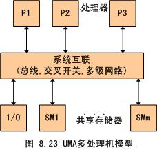

**每个 CPU**必须通过**相同的内存总线**访问**相同的内存资源**.

## 2.2. NUMA

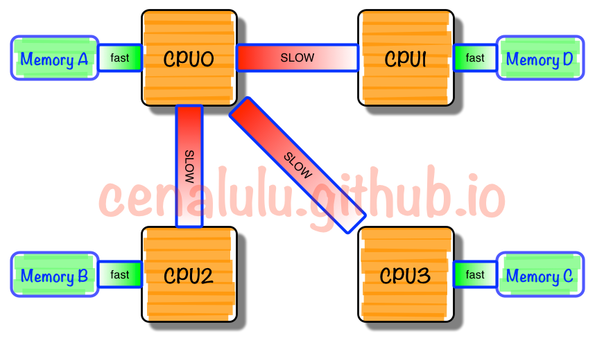

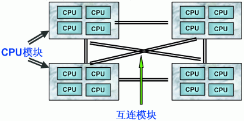

NUMA 服务器的基本特征是具有**多个 CPU 模块**, **每个 CPU 模块由多个 CPU(如 4 个)组成**, 并且具有独立的**本地内存、I/O 槽口等**(这些**资源都是以 CPU 模式划分本地的, 一个 CPU 模块可能有多个 CPU！！！**).

其**共享存储器**物理上是分布在**所有处理机的本地存储器上**. **所有本地存储器**的集合组成了**全局地址空间**, 可被所有的处理机访问. **处理机**访问**本地存储器是比较快**的, 但访问属于**另一台处理机的远程存储器**则比较**慢**, 因为通过互连网络会产生附加时延.

## 2.3. MPP

其基本特征是由多个 SMP 服务器(**每个 SMP 服务器称节点**)通过**节点互联网络**连接而成, **每个节点只访问自己的本地资源**(内存、存储等), 是一种完全**无共享(Share Nothing)结构**, 协同工作, **完成相同的任务**. **在 MPP 系统中, 每个 SMP 节点也可以运行自己的操作系统、数据库等**. **每个节点内的 CPU 不能访问另一个节点的内存**.

目前业界对**节点互联网络暂无标准**

# 3. 内存空间分层

内存空间分三层

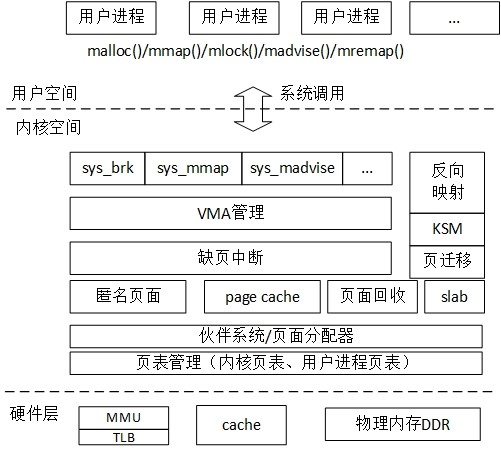


| 层次 | 描述 |
|:---:|:----|
| **用户空间层** |可以理解为 Linux 内核内存管理**为用户空间暴露的系统调用接口**. 例如**brk**(), **mmap**()等**系统调用**. 通常**libc 库**会将系统调用封装成大家常见的 C 库函数, 比如`malloc()`, `mmap()`等. |
| **内核空间层** | 包含的模块相当丰富, 用户空间和内核空间的接口是**系统调用**, 因此内核空间层首先需要处理这些内存管理相关的系统调用, 例如`sys_brk`, `sys_mmap`, `sys_madvise`等. 接下来就包括**VMA 管理**, **缺页中断管理**, **匿名页面**, **page cache**, **页面回收**, **反向映射**, **slab 分配器**, **页面管理**等模块. |
| **硬件层** | 包含**处理器**的**MMU**, **TLB**和**cache**部件, 以及板载的**物理内存**, 例如 LPDDR 或者 DDR |

# 4. Linux 物理内存组织形式

Linux 把**物理内存**划分为**三个层次**来管理

| 层次 | 描述 |
|:----|:----|
| **存储节点(Node**) |  CPU 被划分为**多个节点(node**), **内存则被分簇**, **每个 CPU**对应一个**本地物理内存**, 即**一个 CPU-node**对应一个**内存簇 bank**, 即**每个内存簇**被认为是**一个节点** |
| **管理区(Zone**)   | **每个物理内存节点 node**被划分为**多个内存管理区域**, 用于表示**不同范围的内存**, 内核可以使用**不同的映射方式(！！！**)映射物理内存 |
| **页面(Page**) | 内存被细分为**多个页面帧**, **页面**是**最基本的页面分配的单位**　｜

`pg_data_t`对应一个 node, `node_zones`包含了不同 zone; **zone**下又**定义了 per_cpu_pageset**, 将**page 和 cpu 绑定**.

## 4.1. Node

为了支持**NUMA 模型**, 也即 CPU 对不同内存单元的访问时间可能不同, 此时系统的物理内存被划分为几个节点(node), 一个 node 对应一个内存簇 bank, 即每个内存簇被认为是一个节点

CPU 被划分为**结点**, **内存**则被**分簇**, 每个 CPU 对应一个本地物理内存, 即一个 CPU-node 对应一个内存簇 bank, 即每个内存簇被认为是一个节点.

在**分配一个页面**时, Linux 采用节点**局部分配的策略**,从最靠近运行中的 CPU 的节点分配内存,由于**进程往往是在同一个 CPU 上运行**, 因此**从当前节点**得到的内存很可能被用到.

Linux 使用**struct pglist_data**描述一个**node**(typedef pglist_data pg_data_t)

### 4.1.1. 结点的内存管理域

```cpp
typedef struct pglist_data {
	/*  包含了结点中各内存域的数据结构 , 可能的区域类型用 zone_type 表示*/
    struct zone node_zones[MAX_NR_ZONES];
    /*  指点了备用结点及其内存域的列表, 以便在当前结点没有可用空间时, 在备用结点分配内存   */
    struct zonelist node_zonelists[MAX_ZONELISTS];
    /*  保存结点中不同内存域的数目    */
    int nr_zones;
} pg_data_t;
```

注意, **当前节点内存域和备用节点内存域用的数据结构不同！！！**

### 4.1.2. 结点的内存页面

```cpp
typedef struct pglist_data
{
		/*  指向 page 实例数组的指针, 用于描述结点的所有物理内存页, 它包含了结点中所有内存域的页.     */
		struct page *node_mem_map;

		/* 起始页面帧号, 指出该节点在全局 mem_map 中的偏移
		系统中所有的页帧是依次编号的, 每个页帧的号码都是全局唯一的(不只是结点内唯一)  */
		unsigned long node_start_pfn;
		/* total number of physical pages 结点中页帧的数目 */
		unsigned long node_present_pages;
		/*  该结点以页帧为单位计算的长度, 包含内存空洞 */
		unsigned long node_spanned_pages; /* total size of physical page range, including holes  */
		/*  全局结点 ID, 系统中的 NUMA 结点都从 0 开始编号  */
		int node_id;
} pg_data_t;
```

《Linux/Memory/1. Introduce/Linux 内存模型》

### 4.1.3. 交换守护进程

```cpp
typedef struct pglist_data
{
    /*  交换守护进程的等待队列 */
    wait_queue_head_t kswapd_wait;
    wait_queue_head_t pfmemalloc_wait;
    /* 指向负责该结点的交换守护进程的 task_struct, 在将页帧换出结点时会唤醒该进程 */
    struct task_struct *kswapd;     /* Protected by  mem_hotplug_begin/end() */
};
```

### 4.1.4. 节点状态

| 状态 | 描述 |
|:-----:|:-----:|
| `N_POSSIBLE` | 结点在某个时候可能变成联机 |
| `N_ONLINE` | 节点是联机的 |
| `N_NORMAL_MEMORY` | 结点是普通内存域 |
| `N_HIGH_MEMORY` | 结点是普通或者高端内存域 |
| `N_MEMORY` | 结点是普通, 高端内存或者 MOVEABLE 域 |
| `N_CPU` | 结点有一个或多个 CPU |

其中**N_POSSIBLE, N_ONLINE 和 N_CPU 用于 CPU 和内存的热插拔**.

对内存管理有必要的标志是`N_HIGH_MEMORY`和`N_NORMAL_MEMORY`

- 如果结点有**普通或高端内存**(**或者！！！**)则使用**N_HIGH_MEMORY**
- 仅当结点**没有高端内存**时才设置**N_NORMAL_MEMORY**

### 4.1.5. 查找内存节点

node_id 作为**全局节点 id**. 系统中的 NUMA 结点都是**从 0 开始编号**的

NUMA 系统, 定义了一个**大小为 MAX_NUMNODES 类型为 pg_data_t**的**指针数组 node_data**,数组的大小根据**CONFIG_NODES_SHIFT**的配置决定.

对于 UMA 来说, NODES_SHIFT 为 0, 所以 MAX_NUMNODES 的值为 1.  只使用了 struct pglist_data **contig_page_data**.

可以使用 NODE_DATA(node_id)来查找系统中编号为 node_id 的结点

```c
[[arch/x86/include/asm/mmzone_64.h]]
extern struct pglist_data *node_data[];
#define NODE_DATA(nid)          (node_data[(nid)])
```

UMA 结构下由于只有一个结点, 因此该宏总是返回**全局的 contig_page_data**.

## 4.2. zone

因为实际的**计算机体系结构**有**硬件的诸多限制**, 这限制了页框可以使用的方式. 尤其是, Linux 内核必须处理**80x86 体系结构**的**两种硬件约束**.

- **ISA 总线的直接内存存储 DMA**(**DMA 操作！！！**)处理器有一个严格的限制 : 他们**只能对 RAM 的前 16MB 进行寻址**

- 在具有大容量 RAM 的现代**32 位计算机(32 位才有这个问题！！！**)中, CPU**不能**直接访问**所有的物理地址**, 因为**线性地址空间太小**, 内核不可能直接映射**所有物理内存**到**线性地址空间**.

因此对于内核来说, **不同范围的物理内存**采用**不同的管理方式和映射方式**

Linux 使用`enum zone_type`来标记内核所支持的所有内存区域

```cpp
enum zone_type
{
#ifdef CONFIG_ZONE_DMA
    ZONE_DMA,
#endif
#ifdef CONFIG_ZONE_DMA32
    ZONE_DMA32,
#endif
    ZONE_NORMAL,
#ifdef CONFIG_HIGHMEM
    ZONE_HIGHMEM,
#endif
    ZONE_MOVABLE,
#ifdef CONFIG_ZONE_DEVICE
    ZONE_DEVICE,
#endif
    __MAX_NR_ZONES
};
```

| 管理内存域 | 描述 |
|:---------|:-------|
| `ZONE_DMA` | 标记了适合 DMA 的内存域.该区域的**长度依赖于处理器类型**.这是由于古老的 ISA 设备强加的边界. 但是为了兼容性,现代的计算机也可能受此影响 |
| `ZONE_DMA32` | 标记了**使用 32 位地址字可寻址,适合 DMA 的内存域**(**4GB???**).显然,只有在**53 位系统中 ZONE_DMA32 才和 ZONE_DMA 有区别**,在**32 位系统中,本区域是空的**, 即长度为 0MB,在 Alpha 和 AMD64 系统上,该内存的长度可能是从 0 到 4GB |
| `ZONE_NORMAL` | 标记了可**直接映射到内存段的普通内存域**.这是在**所有体系结构上保证会存在的唯一内存区域**(**任何体系结构中都会有 ZONE_NORMAL,但是可能是空的!!!**),但**无法保证该地址范围对应了实际的物理地址**(**!!!**). 例如,如果**AMD64 系统只有两 2G 内存**,那么**所有的内存都属于 ZONE_DMA32 范围**,而**ZONE_NORMAL 则为空** |
| `ZONE_HIGHMEM` | 标记了**超出内核虚拟地址空间**的**物理内存段**,因此这段地址**不能被内核直接映射** |
| `ZONE_MOVABLE` | 内核定义了一个伪内存域 ZONE_MOVABLE,在**防止物理内存碎片的机制 memory migration 中需要使用**该内存域.供防止**物理内存碎片的极致使用** |
| `ZONE_DEVICE` | 为支持**热插拔设备**而分配的 Non Volatile Memory 非易失性内存 |
| `MAX_NR_ZONES` | 充当结束标记, 在内核中想要迭代系统中所有内存域, 会用到该常量 |

根据编译时候的配置, 可能无需考虑某些内存域. 例如**在 64 位系统**中, 并**不需要高端内存**, ZONE_HIGHMEM 区域总是空的, 可以参见**Documentation/x86/x86_64/mm.txt**.

一个管理区(zone)由 struct zone 结构体来描述, 通过 typedef 被重定义为 zone_t 类型

### 4.2.1. 高速缓存行

zone 数据结构**不需要**像 struct page 一样**关心数据结构的大小**.

`ZONE_PADDING()`让两个**自旋锁**`zone->lock`和`zone_lru_lock`这两个很热门的锁可以分布在**不同的 Cahe Line**中, 用空间换取时间.

内核还对**整个 zone**结构用了`____cacheline_internodealigned_in_smp`, 来实现**最优的高速缓存行对齐方式**.

### 4.2.2. 水位 watermark[NR_WMARK]与 kswapd 内核线程

```cpp
struct zone{
    unsigned long watermark[NR_WMARK];
}

enum zone_watermarks
{
        WMARK_MIN,
        WMARK_LOW,
        WMARK_HIGH,
        NR_WMARK
};

#define min_wmark_pages(z) (z->watermark[WMARK_MIN])
#define low_wmark_pages(z) (z->watermark[WMARK_LOW])
#define high_wmark_pages(z) (z->watermark[WMARK_HIGH])
```

| 标准 | 描述 |
|:----:|:---|
| `watermark[WMARK_MIN]` | 当空闲页面的数量达到 page_min 所标定的数量的时候,  说明页面数非常紧张, **分配页面的动作**和**kswapd 线程同步运行**.<br> WMARK_MIN 所表示的**page 的数量值**, 是在**内存初始化**的过程中调用**free_area_init_core**中计算的. 这个数值是根据 zone 中的 page 的数量除以一个大于 1 的系数来确定的. 通常是这样初始化的**ZoneSizeInPages/12** |
| `watermark[WMARK_LOW]` | 当空闲页面的数量达到 WMARK_LOW 所标定的数量的时候, 说明页面刚开始紧张, 则**kswapd 线程将被唤醒**, 并开始释放回收页面 |
| `watermark[WMARK_HIGH]` | 当空闲页面的数量达到 page_high 所标定的数量的时候,  说明内存页面数充足, 不需要回收, kswapd 线程将重新休眠, **通常这个数值是 page_min 的 3 倍** |

kswapd 和这 3 个参数的互动关系如下图:

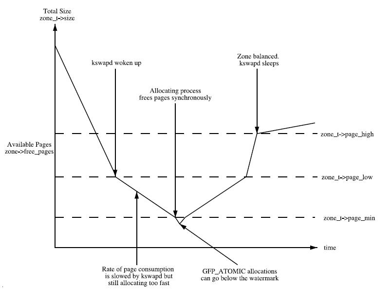

### 4.2.3. 内存域统计信息 vm_stat

```cpp
[include/linux/mmzone.h]
struct zone
{
	  atomic_long_t vm_stat[NR_VM_ZONE_STAT_ITEMS];
}
```

由`enum zone_stat_item`枚举变量标识

### 4.2.4. zone 等待队列表(zone wait queue table)

struct zone 中实现了一个**等待队列**,可用于**等待某一页的进程**,内核**将进程排成一个列队**,等待某些条件. 在**条件变成真**时, 内核会**通知进程恢复工作**.

```cpp
struct zone
{
	wait_queue_head_t *wait_table;
	unsigned long      wait_table_hash_nr_entries;
	unsigned long      wait_table_bits;
}
```

| 字段 | 描述 |
|:-----:|:-----:|
| `wait_table` | **待一个 page 释放**的**等待队列哈希表**. 它会被 wait_on_page(), unlock_page()函数使用. 用**哈希表**, 而**不用一个等待队列**的原因, 防止进程长期等待资源 |
| wait_table_hash_nr_entries | **哈希表**中的**等待队列的数量** |
| wait_table_bits | **等待队列散列表数组大小**, wait_table_size == (1 << wait_table_bits)  |

当对**一个 page 做 I/O 操作**的时候, I/O 操作需要**被锁住**, 防止不正确的数据被访问.

**进程在访问 page 前**, **wait_on_page_locked 函数**, 使进程**加入一个等待队列**

访问完成后, **unlock_page 函数解锁**其他进程对 page 的访问. 其他正在**等待队列**中的进程**被唤醒**.

- **每个 page**都**可以有一个等待队列**, 但是太多的**分离的等待队列**使得花费**太多的内存访问周期**. 替代的解决方法, 就是将**所有的队列**放在**struct zone 数据结构**中

- 也可以有一种可能, 就是**struct zone 中只有一个队列**, 但是这就意味着, 当**一个 page unlock**的时候, 访问这个 zone 里**内存 page 的所有休眠的进程**(**所有的, 而不管是不是访问这个 page 的进程！！！**)将都**被唤醒**, 这样就会出现拥堵(`thundering herd`)的问题. 建立**一个哈希表**管理**多个等待队列**, 能解决这个问题, `zone->wait_table`就是这个哈希表. 哈希表的方法**可能**还是会**造成一些进程不必要的唤醒**. 但是这种事情发生的机率不是很频繁的. 下面这个图就是进程及等待队列的运行关系:


**等待队列的哈希表的分配和建立**在**free_area_init_core**函数中进行. 哈希表的表项的数量在 wait_table_size() 函数中计算, 并且保持在**zone->wait_table_size 成员**中. 最大**4096 个等待队列**. 最小是 NoPages / PAGES_PER_WAITQUEUE 的 2 次方, NoPages 是 zone 管理的**page 的数量**, PAGES_PER_WAITQUEUE 被定义**256**

### 4.2.5. 冷热页与 Per-CPU 上的页面高速缓存

内核经常**请求和释放单个页框(！！！**).为了提升性能,**每个内存管理区**(**zone 级别定义！！！**)都定义了一个每 CPU(Per-CPU)的**页面高速缓存**. 所以"**每 CPU 高速缓存**"包含一些**预先分配的页框**

struct zone 的**pageset**成员用于实现**冷热分配器(hot-cold allocator**)

```cpp
struct zone
{
    struct per_cpu_pageset __percpu *pageset;
};
```

**页面是热的**, 意味着**页面**已经**加载到 CPU 的高速缓存**,与在内存中的页相比,其数据**访问速度更快**. 相反,**冷页**则**不在高速缓存**中.在多处理器系统上**每个 CPU**都有**一个或者多个高速缓存**.各个 CPU 的管理必须是独立的.

尽管**内存域**可能属于一个**特定的 NUMA 结点**,因而**关联**到某个**特定的 CPU**. 但**其他 CPU**的**高速缓存**仍然可以包含**该内存域中的页面**(也就是说**CPU 的高速缓存可以包含其他 CPU 的内存域的页！！！**). 最终的效果是, **每个处理器**都可以访问系统中的**所有页**,尽管速度不同.因而,**特定于内存域的数据结构**不仅要考虑到**所属 NUMA 结点相关的 CPU**, 还必须照顾到系统中**其他的 CPU**.

**pageset 是一个指针**, 其容量与系统能够容纳的**CPU 的数目的最大值相同(！！！**).

数组元素类型为**per_cpu_pageset**

```cpp
struct per_cpu_pageset {
       struct per_cpu_pages pcp;
#ifdef CONFIG_NUMA
       s8 expire;
#endif
#ifdef CONFIG_SMP
       s8 stat_threshold;
       s8 vm_stat_diff[NR_VM_ZONE_STAT_ITEMS];
#endif
};
```

该结构由一个**per_cpu_pages pcp 变量**组成, 该数据结构定义如下

```cpp
struct per_cpu_pages {
	int count;              /* number of pages in the list 列表中的页数  */
	int high;               /* high watermark, emptying needed 页数上限水印, 在需要的情况清空列表  */
    int batch;              /* chunk size for buddy add/remove,  添加/删除多页块的时候, 块的大小  */

	/* Lists of pages, one per migrate type stored on the pcp-lists 页的链表*/
       struct list_head lists[MIGRATE_PCPTYPES];
};
```

| 字段 | 描述 |
|:---:|:----:|
| count | 记录了与该列表相关的**页的数目** |
| high  | 是一个**水位**. 如果**count 的值超过了 high**, 则表明列表中的**页太多**了 |
| batch | 如果可能, **CPU 的高速缓存**不是用**单个页**来填充的,而是**多个页组成的块**,batch 作为每次添加/删除页时多个页组成的**块大小**的一个参考值 |
| list | 一个**双链表**, 保存了**当前 CPU**的**冷页或热页**, 可使用内核的标准方法处理 |

在内核中**只有一个子系统**会积极的尝试为任何对象**维护 per-cpu 上的 list 链表**,这个子系统就是**slab 分配器**.

- struct per_cpu_pageset 具有一个字段, 该字段

- struct per_cpu_pages 则维护了链表中目前已有的一系列页面, 高极值和低极值决定了何时填充该集合或者释放一批页面, 变量决定了**一个块**中应该分配**多少个页面**, 并最后决定在页面前的实际链表中分配多少个页面

**per_cpu_pageset 结构**是内核的**各个 zone**用于**每 CPU**的**页面高速缓存管理结构**. 该**高速缓存**包含一些**预先分配的页面**, 以用于满足**本地 CPU**发出的**单一内存页请求**. 而 struct per_cpu_pages 定义的**pcp**是该**管理结构的成员**, 用于**具体页面管理**. 这是**一个队列(其实是 3 个迁移类型每个一个队列**), 统一管理冷热页, **热页面在队列前面**, 而**冷页面则在队列后面**, 这个从释放页面也能看出来.

### 4.2.6. zonelist 内存域存储层次

#### 4.2.6.1. 内存域之间的层级结构

**当前结点**与系统中**其他结点**的**内存域**之间存在一种等级次序

我们考虑一个例子, 其中内核想要**分配高端内存**.

1.	它首先企图在**当前结点的高端内存域**找到一个大小适当的空闲段.如果**失败**,则查看**该结点**的**普通内存域**. 如果还失败, 则试图在**该结点**的**DMA 内存域**执行分配.

2.	如果在**3 个本地内存域**都无法找到空闲内存, 则查看**其他结点**. 在这种情况下, **备选结点**应该**尽可能靠近主结点**, 以最小化由于访问非本地内存引起的性能损失.

内核定义了内存的一个**层次结构**, 首先试图分配"廉价的"内存. 如果失败, 则根据访问速度和容量, 逐渐尝试分配"更昂贵的"内存.

**高端内存是最廉价的**, 因为内核**没有**任何部分**依赖**于从该内存域分配的内存. 如果**高端内存域用尽**, 对内核**没有任何副作用**, 这也是优先分配高端内存的原因.

**其次是普通内存域**, 这种情况有所不同. **许多内核数据结构必须保存在该内存域**, 而不能放置到高端内存域.

因此如果普通内存完全用尽, 那么内核会面临紧急情况. 所以只要高端内存域的内存没有用尽, 都不会从普通内存域分配内存.

**最昂贵的是 DMA 内存域**, 因为它用于外设和系统之间的数据传输. 因此从该内存域分配内存是最后一招.

#### 4.2.6.2. 备用节点内存域 zonelist 结构

内核还针对**当前内存结点**的**备选结点**,定义了一个**等级次序**.这有助于在**当前结点所有内存域**的内存都**用尽**时, 确定一个**备选结点**

内核使用 pg_data_t 中的**zonelist 数组**, 来**表示所描述的层次结构**.

```cpp
typedef struct pglist_data {
	struct zonelist node_zonelists[MAX_ZONELISTS];
	/*  ......  */
}pg_data_t;
```

node_zonelists**数组**对每种可能的**内存域类型**, 都配置了一个**独立的数组项**.

```cpp
enum
{
    ZONELIST_FALLBACK,      /* zonelist with fallback */
#ifdef CONFIG_NUMA
    ZONELIST_NOFALLBACK,
#endif
    MAX_ZONELISTS
};
```

**UMA 结构**下, 数组大小**MAX_ZONELISTS = 1**

NUMA 下需要多余的**ZONELIST_NOFALLBACK**用以表示**当前结点(！！！**)的信息

由于该**备用列表**必须包括**所有结点(！！！包括当前节点！！！**)的**所有内存域(！！！**), 因此**由 MAX_NUMNODES * MAX_NZ_ZONES 项**组成, 外加一个**用于标记列表结束的空指针**

```cpp
struct zonelist {
    struct zoneref _zonerefs[MAX_ZONES_PER_ZONELIST + 1];
};

struct zoneref {
    struct zone *zone;      /* Pointer to actual zone */
    int zone_idx;       /* zone_idx(zoneref->zone) */
};
```

也就是说, **每个节点 node**有一个 zonelist 数组(对于 UMA 只有**一个数组项**, NUMA 有**两个数组项**), 每个数组项是一个 zonelist 的数据结构, 该数据结构由**zone 信息组成的数组**(备用列表包含**所有节点的所有内存域**, 所以**数组大小**是`MAX_NUMNODES * MAX_NZ_ZONES + 1`, 包含一个**标记结束的空指针**), 这个数组项中包含 zone 结构和索引

#### 4.2.6.3. 内存域的排列方式

NUMA 系统中存在**多个节点**, **每个结点**中可以包含**多个 zone**.

- Legacy 方式, **每个节点只排列自己的 zone**;


- Node 方式, 按**节点顺序**依次排列, 先排列本地节点的所有 zone, 再排列其它节点的所有 zone.


- Zone 方式, 按**zone 类型**从高到低依次排列各节点的相同类型 zone


可通过启动参数"`numa_zonelist_order`"来配置**zonelist order**, 内核定义了 3 种配置

```cpp
#define ZONELIST_ORDER_DEFAULT  0 /* 智能选择 Node 或 Zone 方式 */
#define ZONELIST_ORDER_NODE     1 /* 对应 Node 方式 */
#define ZONELIST_ORDER_ZONE     2 /* 对应 Zone 方式 */
```

#### 4.2.6.4. build_all_zonelists 初始化内存节点

内核通过`build_all_zonelists`初始化了内存结点的 zonelists 域

- 首先内核通过 set_zonelist_order 函数设置了 zonelist_order,如下所示, 参见 mm/page_alloc.c?v=4.7, line 5031

- 建立备用层次结构的任务委托给 build_zonelists,该函数为每个 NUMA 结点都创建了相应的数据结构. 它需要指向相关的 pg_data_t 实例的指针作为参数

## 4.3. Page

**页帧(page frame**)代表了系统内存的最小单位, 对内存中的**每个页**都会创建一个 struct page 的一个实例. 内核必须要**保证 page 结构体足够的小**. 每一页物理内存叫页帧, 以页为单位对内存进行编号, 该编号可作为页数组的索引, 又称为页帧号.

struct page 结构体存放的是 metadata. 页帧 page 大小肯定是 4K, struct page 也代表了一个物理页帧 page, 但它也可能关联了多个物理页帧 page, 里面有相关的 order 属性.

### 4.3.1. mapping & index

**mapping**指定了**页帧**(**物理页！！！**)所在的**地址空间**,**index**是**页帧**在映射的**虚拟空间内部**的偏移量.**地址空间**是一个非常一般的概念.例如,可以用在**向内存读取文件**时. 地址空间用于将**文件的内容**与装载**数据的内存区关联起来**.

mapping 不仅能够保存一个指针,而且还能包含一些额外的信息,用于判断页是否属于**未关联到地址空间**的**某个匿名内存区**.

`page->mapping`本身是一个**指针**, 指针地址的**低几个 bit**因为**对齐的原因**都是**无用的 bit**, 内核就根据这个特性利用这几个 bit 来让`page->mapping`实现更多的含义. **一个指针多个用途**, 这个也是内核为了**减少 page 结构大小**的办法之一. 目前用到**最低 2 个 bit 位**.

```cpp
#define PAGE_MAPPING_ANON	0x1
#define PAGE_MAPPING_MOVABLE	0x2
#define PAGE_MAPPING_KSM	(PAGE_MAPPING_ANON | PAGE_MAPPING_MOVABLE)
#define PAGE_MAPPING_FLAGS	(PAGE_MAPPING_ANON | PAGE_MAPPING_MOVABLE)
```

1. 如果`page->mapping == NULL`, 说明该**page**属于**交换高速缓存页**(**swap cache**); 当需要使用地址空间时会指定**交换分区的地址空间**`swapper_space`.

2. 如果`page->mapping != NULL`, 第 0 位`bit[0] = 0`, 说明该 page 属于**页缓存**或**文件映射**, mapping 指向**文件的地址空间**`address_space`.

3. 如果`page->mapping != NULL`, 第 0 位`bit[0] != 0`, 说明该 page 为**匿名映射**, mapping 指向**struct anon_vma 对象**.

### 4.3.2. lru 链表头

最近、最久未使用**struct slab 结构指针**变量

lru: **链表头**, 主要有 3 个用途:

1.	则**page 处于伙伴系统**中时, 用于链接**相同阶的伙伴**(只使用伙伴中的**第一个 page 的 lru**即可达到目的).

2.	**设置 PG_slab**, 则**page 属于 slab**, `page->lru.next`指向 page 驻留的的缓存的管理结构, `page->lru.prec`指向保存该 page 的**slab 的管理结构**.

3.	page 被**用户态使用**或被当做**页缓存使用**时, 用于将该**page**连入 zone 中**相应的 lru 链表**, 供**内存回收**时使用.

### 4.3.3. 内存页标识 pageflags

### 4.3.4. 全局页面数组 mem_map

mem_map 是一个**struct page 的数组**, 管理着系统中**所有的物理内存页面**. 在系统启动的过程中, 创建和分配 mem_map 的内存区域.

UMA 体系结构中, **free_area_init**函数在系统唯一的 struct node 对象**contig_page_data**中**node_mem_map**成员赋值给全局的 mem_map 变量

# 5. Linux 分页机制

分页的基本方法是将**地址空间**人为地等分成**某一个固定大小的页**; 每一**页大小**由**硬件来决定**, 或者是由**操作系统来决定**(如果**硬件支持多种大小的页**). 目前, 以大小为 4KB 的分页是绝大多数 PC 操作系统的选择.

- **逻辑空间(线性空间！！！**)等分为**页**; 并**从 0 开始编号**
- **内存空间(物理空间！！！**)等分为**块**, **与页面大小相同**; **从 0 开始编号**
- **分配内存**时, **以块为单位**将进程中的**若干个页**分别装入内存空间

关于进程分页. 当我们把进程的**虚拟地址空间按页**来分割, **常用的数据和代码**会被装在到**内存**; **暂时没用到的是数据和代码**则保存在**磁盘**中, 需要用到的时候, 再从磁盘中加载到内存中即可.

这里需要了解三个概念:

1. **虚拟页**(VP, Virtual Page), **虚拟空间**中的**页**;

2. **物理页**(PP, Physical Page), **物理内存**中的**页**;

3. **磁盘页**(DP, Disk Page), **磁盘**中的**页**.

**虚拟内存**的实现需要硬件的支持, 从`Virtual Address`到`Physical Address`的映射, 通过一个叫**MMU**(**Memory Mangement Unit**)的部件来完成

**分页单元(paging unit**)把**线性地址**转换成**物理地址**. 其中的一个关键任务就是把**所请求的访问类型**与**线性地址的访问权限相比较**, 如果这次内存访问是**无效**的, 就产生一个**缺页异常**.

- **页**: 为了更高效和更经济的管理内存, **线性地址**被分为以固定长度为单位的组, 成为**页**. **页内部连续的线性地址空间(页内部是连续的！！！**)被映射到**连续的物理地址**中. 这样, 内核可以指定**一个页(！！！**)的物理地址和对应的**存取权限**, 而不用指定全部线性地址的存取权限. 这里说**页**, 同时指**一组线性地址**以及这组地址**包含的数据**

- **页框**: 分页单元把所有的**RAM**分成固定长度的**页框**(page frame)(有时叫做**物理页**). 每一个页框包含一个页(page), 也就是说一个页框的长度与一个页的长度一致. 页框是主存的一部分, 因此也是一个存储区域. 区分**一页**和**一个页框**是很重要的, 前者只是**一个数据块**, 可以存放在**任何页框**或**磁盘(！！！线性空间的数据在物理页帧或磁盘可以是任何位置！！！**)中.

- **页表**: 把**线性地址**映射到**物理地址**的数据结构称为**页表**(page table). 页表存放在**主存**中, 并在启用分页单元之前必须由内核对页表进行适当的初始化.

关于硬件分页机制看其他资料

## 5.1. Linux 中的分页层次

目前的内核的内存管理总是**固定使用四级页表**, 而不管底层处理器是否如此.

| 单元 | 描述 |
|:---:|:----:|
| 页全局目录 | Page Global Directory  |
| 页上级目录	| Page Upper Directory  |
| 页中间目录	| Page Middle Directory |
| 页表	        | Page Table 			|
| 页内偏移      | Page Offset		    |

- **页全局目录**包含若干**页上级目录**的**地址**;
- **页上级目录**又依次包含若干**页中间目录**的**地址**;
- 而**页中间目录**又包含若干****页表****的**地址**;
- 每一个**页表项**指向一个**页框**.

**Linux 页表管理**分为两个部分,第一个部分**依赖于体系结构**,第二个部分是**体系结构无关的**.

所有**数据结构**几乎都定义在**特定体系结构的文件**中.这些数据结构的定义可以在头文件`arch/对应体系/include/asm/page.h`和`arch/对应体系/include/asm/pgtable.h`中找到. 但是对于**AMD64**和**IA-32**已经统一为**一个体系结构**.但是在处理页表方面仍然有很多的区别,因为相关的定义分为**两个不同的文件**`arch/x86/include/asm/page_32.h`和`arch/x86/include/asm/page_64.h`, 类似的也有`pgtable_xx.h`.

对于不同的体系结构, Linux 采用的**四级页表目录**的大小有所不同(**页大小**都是**4KB**情况下):

- 对于**i386**而言, 仅采用**二级页表**, 即**页上层目录**和**页中层目录**长度为 0; `10(PGD)+0(PUD)+0(PMD)+10(PTE)+12(offset)`.
- 对于启用**PAE**的**i386**, 采用了**三级页表**, 即**页上层目录**长度为 0; `2(PGD)+0(PUD)+9(PMD)+9(PTE)+12(offset)`.
- 对于**64 位**体系结构, 可以采用三级或四级页表, 具体选择由**硬件决定**. **x86_64**下, `9(PGD)+9(PUD)+9(PMD)+9(PTE)+12(offset)`.

对于**没有启用物理地址扩展(PAE**)的**32 位系统**, **两级页表**已经足够了. 从本质上说 Linux 通过使"**页上级目录**"位和"**页中间目录**"位**全为 0(！！！**), 彻底取消了页上级目录和页中间目录字段. 不过, 页上级目录和页中间目录在**指针序列中**的位置被**保留**, 以便同样的代码在 32 位系统和 64 位系统下都能使用. 内核为**页上级目录**和**页中间目录**保留了一个位置, 这是通过把它们的**页目录项数**设置为**1**, 并把这**两个目录项**映射到**页全局目录**的一个合适的**目录项**而实现的.

## 5.2. Linux 中分页相关数据结构

Linux 分别采用**pgd_t、pud_t、pmd_t 和 pte_t**四种数据结构来表示**页全局目录项、页上级目录项、页中间目录项和页表项**. 这四种数据结构本质上都是**无符号长整型 unsigned long**, 这些都是**表项！！！不是表本身！！！**

linux 中使用下列宏简化了页表处理, 对于**每一级页表**都使用有以下三个关键描述宏:

| 宏字段| 描述 |
| ------------- |:-------------|
| `XXX_SHIFT`| 指定**一个相应级别页表项(！！！)可以映射的区域大小的位数** |
| `XXX_SIZE`| **一个相应级别页表项(！！！)可以映射的区域大小** |
| `XXX_MASK`| 用以**屏蔽一个相应级别页表项可以映射的区域大小的所有位数**.  |

我们的**四级页表**, 对应的宏前缀分别由**PAGE, PMD, PUD, PGDIR**

### 5.2.1. PAGE 宏--页表(Page Table)

```
#define PAGE_SHIFT      12
#define PAGE_SIZE       (_AC(1,UL) << PAGE_SHIFT)
#define PAGE_MASK       (~(PAGE_SIZE-1))
```

- 当用于 80x86 处理器时, **PAGE_SHIFT**返回的值为**12(这个值是写死的！！！**), **页表项**中存放的是**一个页的基地址**, 所以**页表项能映射的区域大小的位数自然就取决于页的位数！！！**. **一个页表项**可以映射的**区域大小的位数**.

- 由于**页内所有地址都必须放在 offset 字段**, 因此 80x86 系统的页的大小**PAGE_SIZE**是`2^{12}=4096 字节`. 一个页表项可以映射的区域的大小.

- PAGE_MASK 宏产生的值为`0xfffff000`, 用以**屏蔽 Offset 字段的所有位(低 12 位全为 0**). 屏蔽**一个页表项可以映射的区域大小**的**所有位数**.

### 5.2.2. PMD-Page Middle Directory (页目录)

| 字段| 描述 |
| ------------- |:-------------|
| PMD_SHIFT| 指定**线性地址的 Offset 和 Table 字段**的总位数; 换句话说, 是**页中间目录项**可以映射的**区域大小的位数** |
| PMD_SIZE| 用于计算由页中间目录的**一个单独表项**所映射的区域大小, 也就是一个**页表的大小** |
| PMD_MASK| 用于**屏蔽 Offset 字段与 Table 字段的所有位** |

**页中间目录项**存放的是**一个页表的基地址**, 所以**一个页中间目录项所能映射的区域大小位数**自然取决于(**页表项位数) + (页大小位数)！！！**

**当 PAE 被禁用时**, 32-bit 分页的情况下(`10 + 10 +12`)

- PMD_SHIFT 产生的值为**22**(来自**Offset 的 12 位**加上来自**Table<页表>的 10 位**)
- PMD_SIZE 产生的值为`2^{22}`或**4MB**
- PMD_MASK 产生的值为**0xffc00000(低 22 位为 0**).

相反, 当 PAE 被激活时(`2+9+9+12`或 **IA-32e** 的`2+9+9+9+12`),

- PMD_SHIFT 产生的值为**21** (来自**Offset 的 12**位加上来自**Table 的 9**位)
- PMD_SIZE 产生的值为**2^{21}**或**2MB**
- PMD_MASK 产生的值为**0xffe00000**.

**大型页(无论 32-bit 分页的 4MB 页、PAE 分页的 2MB 页, IA-32e 分页的 2MB 页！！！Linux 是支持这个的！！！**)不使用**最后一级页表**, 所以产生大型页尺寸的**LARGE_PAGE_SIZE 宏**等于**PMD_SIZE**(**2^{PMD_SHIFT}**), 而在大型页地址中用于**屏蔽 Offset 字段和 Table 字段的所有位**的**LARGE_PAGE_MASK**宏, 就等于**PMD_MASK**.

### 5.2.3. PUD_SHIFT-页上级目录(Page Upper Directory)

**页上级目录项**存放的是**一个页中间目录的基地址**, 所以**一个页上级目录项所能映射的区域大小自然取决于 2 的(页中间目录项+页表项+页大小)位数的平方！！！**.

对于**i386**而言, 仅采用二级页表, 即**页上层目录**和**页中层目录长度**为**0**, 所以**PUD_SHIFT**总是等价于`PMD_SHIFT`(`22=10<PTE>+12<offset>`), 而**PUD_SIZE**则等于**4MB**.

对于**启用 PAE 的 i386**, 采用了三级页表, 即**页上层目录**长度为**0**,页中层目录长度为 9, 所以**PUD_SHIFT**总是等价于 30(=`9<PMD>+9<PTE>+12<offset>`), 而**PUD_SIZE**则等于**1GB**

### 5.2.4. PGDIR_SHIFT-页全局目录(Page Global Directory)

| 字段| 描述 |
| ------------- |:-------------|
| PGDIR_SHIFT| 确定**一个全局页目录项**能映射的区域大小的位数 |
| PGDIR_SIZE| 用于计算页全局目录中一个单独表项所能映射区域的大小 |
| PGDIR_MASK| 用于屏蔽 Offset, Table, Middle Air 及 Upper Air 的所有位 |

**当 PAE 被禁止时**,

- PGDIR_SHIFT 产生的值为**22**(与 PMD_SHIFT 和 PUD_SHIFT 产生的值相同),
- PGDIR_SIZE 产生的值为 2^22 或 4 MB,
- PGDIR_MASK 产生的值为 0xffc00000.

相反, **当 PAE 被激活时**,

- PGDIR_SHIFT 产生的值为**30** (**12 位 Offset** 加**9 位 Table**再加**9 位 Middle** Air),
- PGDIR_SIZE 产生的值为 2^30 或 1 GB
- PGDIR_MASK 产生的值为 0xc0000000

## 5.3. 页表处理函数

内核还提供了许多宏和函数用于**读或修改页表表项**:

.......

查询页表项中任意一个标志的当前值

### 5.3.1. 简化页表项的创建和撤消

当使用**两级页表**时, 创建或删除一个**页中间目录项**是不重要的. 如本节前部分所述, **页中间目录仅含有一个指向下属页表的目录项**. 所以, **页中间目录项**只是**页全局目录中的一项**而已. 然而当处理页表时, **创建一个页表项**可能很复杂, 因为包含页表项的那个页表可能就不存在. 在这样的情况下, 有必要**分配一个新页框, 把它填写为 0, 并把这个表项加入**.

如果**PAE**被激活, 内核使用**三级页表**. 当内核创建一个新的**页全局目录**时, 同时也**分配四个相应的页中间目录**; 只有当**父页全局目录被释放**时, 这**四个页中间目录才得以释放**. 当使用**两级**或**三级**分页时, **页上级目录项**总是被映射为**页全局目录**中的**一个单独项**. 与以往一样, 下表中列出的函数描述是针对 80x86 构架的.

| 函数名称 | 说明 |
| ------------- |:-------------|
| pgd_alloc(mm) | 分配一个**新的页全局目录**. 如果**PAE 被激活**, 它还分配**三个对应用户态线性地址**的**子页中间目录**. 参数 mm(内存描述符的地址)在 80x86 构架上被忽略 |
| pgd_free( pgd) | 释放页全局目录中地址为 pgd 的项. 如果 PAE 被激活, 它还将释放用户态线性地址对应的三个页中间目录 |
| pud_alloc(mm, pgd, addr) | 在两级或三级分页系统下, 这个函数什么也不做: 它仅仅返回页全局目录项 pgd 的线性地址 |
| pud_free(x) | 在**两级或三级分页系统**下, 这个宏什么也不做 |
| pmd_alloc(mm, pud, addr) | 定义这个函数以使普通三级分页系统可以为线性地址 addr 分配一个新的页中间目录. 如果 PAE 未被激活, 这个函数只是返回输入参数 pud 的值, 也就是说, 返回页全局目录中目录项的地址. 如果 PAE 被激活, 该函数返回线性地址 addr 对应的页中间目录项的线性地址. 参数 mm 被忽略 |
| pmd_free(x) | 该函数什么也不做, 因为页中间目录的分配和释放是随同它们的父全局目录一同进行的 |
| pte_alloc_map(mm, pmd, addr) | 接收页中间目录项的地址 pmd 和线性地址 addr 作为参数, 并返回与 addr 对应的页表项的地址. 如果页中间目录项为空, 该函数通过调用函数 pte_alloc_one( ) 分配一个新页表. 如果分配了一个新页表,  addr 对应的项就被创建, 同时 User/Supervisor 标志被设置为 1 . 如果页表被保存在高端内存, 则内核建立一个临时内核映射, 并用 pte_unmap 对它进行释放 |
| pte_alloc_kernel(mm, pmd, addr) | 如果与地址 addr 相关的页中间目录项 pmd 为空, 该函数分配一个新页表. 然后返回与 addr 相关的页表项的线性地址. 该函数仅被主内核页表使用 |
| pte_free(pte) | 释放与页描述符指针 pte 相关的页表 |
| pte_free_kernel(pte) | 等价于 pte_free( ) , 但由主内核页表使用 |
| clear_page_range(mmu, start,end) | 从线性地址 start 到 end 通过反复释放页表和清除页中间目录项来清除进程页表的内容 |

## 5.4. 线性地址转换

地址转换过程有了上述的基本知识, 就很好理解四级页表模式下如何将虚拟地址转化为逻辑地址了. 基本过程如下:

- 1.从**CR3 寄存器**中读取**页目录所在物理页面的基址**(即所谓的页目录基址), 从线性地址的第一部分获取页目录项的索引, 两者相加得到**页目录项的物理地址(！！！**).

- 2.**第一次读取内存**得到**pgd_t 结构的目录项**, 从中取出物理页基址取出(具体位数与平台相关, 如果是 32 系统, 则为 20 位), 即页上级页目录的物理基地址.

- 3.从线性地址的第二部分中取出页上级目录项的索引, 与页上级目录基地址相加得到**页上级目录项的物理地址(！！！**).

- 4.**第二次读取内存**得到**pud_t 结构的目录项**, 从中取出页中间目录的物理基地址.

- 5.从线性地址的第三部分中取出页中间目录项的索引, 与页中间目录基址相加得到**页中间目录项的物理地址(！！！**).

- 6.**第三次读取内存**得到**pmd_t 结构的目录项**, 从中取出页表的物理基地址.

- 7.从线性地址的第四部分中取出页表项的索引, 与页表基址相加得到**页表项的物理地址(！！！**).

- 8.**第四次读取内存**得到**pte_t 结构的目录项**, 从中取出物理页的基地址.

- 9.从线性地址的第五部分中取出物理页内偏移量, 与物理页基址相加得到**最终的物理地址(！！！**).

- 10.**第五次读取内存**得到最终要访问的数据.

整个过程是比较机械的, 每次转换先获取物理页基地址, 再从线性地址中获取索引, 合成物理地址后再访问内存. 不管是**页表**还是要访问的**数据**都是**以页为单位存放在主存中**的, 因此每次访问内存时都要先获得基址, 再通过索引(或偏移)在页内访问数据, 因此可以将线性地址看作是若干个索引的集合.

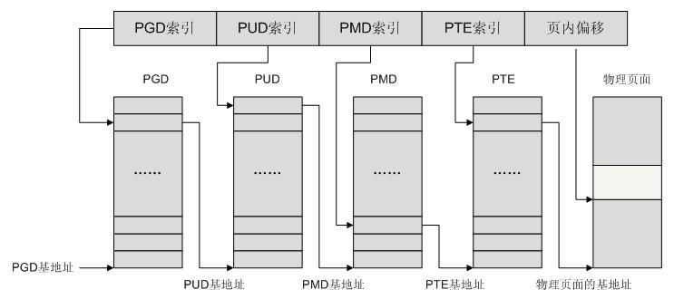

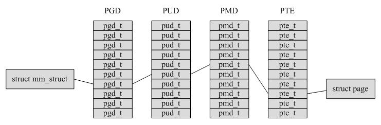

## 5.5. Linux 中通过 4 级页表访问物理内存

linux 中**每个进程**有它自己的**PGD**( Page Global Directory), 它是**一个物理页(一个物理页！！！**), 并包含一个**pgd_t 数组**, pgd_t 是**表项**, 所以这里是**pgd entry 数组, 即表项数组！！！**.

**进程的 pgd_t**数据见`task_struct -> mm_struct -> pgd_t * pgd`;

通过如下如下几个函数, **不断向下索引**, 就可以**从进程的页表**中搜索**特定地址**对应的**页面对象**

| 宏函数| 说明 |
| ------------- |:-------------|
| **pgd_offset**  | 根据**当前虚拟地址**和**当前进程的 mm_struct**获取**pgd 项** |
| **pud_offset** | 参数为指向**页全局目录项的指针 pgd**和**线性地址 addr** . 这个宏产生**页上级目录中目录项 addr 对应的线性地址**. 在两级或三级分页系统中, 该宏产生 pgd , 即一个页全局目录项的地址 |
| pmd_offset | 根据通过**pgd_offset 获取的 pgd 项**和**虚拟地址**, 获取相关的**pmd 项(即 pte 表的起始地址！！!**) |
| **pte_offset** | 根据通过 pmd_offset 获取的**pmd 项**和**虚拟地址**, 获取**相关的 pte 项(即物理页的起始地址！！！**) |

根据**虚拟地址**获取**物理页**的示例代码详见 mm/memory.c 中的函数**follow_page_mask**

## 5.6. swapper_pg_dir

linux 内核页全局目录变量

swapper_pg_dir 用于存放内核 PGD 页表的地方, 赋给 init_mm.pgd.

```c
[mm/init-mm.c]
struct mm_struct init_mm = {
	.mm_rb		= RB_ROOT,
	.pgd		= swapper_pg_dir,
	.mm_users	= ATOMIC_INIT(2),
	.mm_count	= ATOMIC_INIT(1),
	.mmap_sem	= __RWSEM_INITIALIZER(init_mm.mmap_sem),
	.page_table_lock =  __SPIN_LOCK_UNLOCKED(init_mm.page_table_lock),
	.mmlist		= LIST_HEAD_INIT(init_mm.mmlist),
	INIT_MM_CONTEXT(init_mm)
};
```

而 Linux 中第一个进程

```c
[init/init_task.c]
struct task_struct init_task = INIT_TASK(init_task);
EXPORT_SYMBOL(init_task);

#define INIT_TASK(tsk)
{
	.stack      = &init_thread_info,
	.mm	        = NULL,
	.active_mm	= &init_mm,
}
```

# 6. 内存布局探测

**linux**在**被 bootloader 加载到内存**后,  cpu**最初执行**的内核代码是**arch/x86/boot/header.S**汇编文件中的_**start 例程**, 设置好**头部 header**, 其中包括**大量的 bootloader 参数**. 接着是其中的**start_of_setup 例程**, 这个例程在做了一些**准备工作**后会通过**call main**跳转到**arch/x86/boot/main.c:main()函数**处执行, 这就是众所周知的 x86 下的 main 函数, 它们都工作在**实模式**下. 这里面能第一次看到与内存管理相关代码, 这就是调用 detect_memory()检测系统物理内存.

作为**内核的内存布局来源**, BIOS 提供了两套内存布局信息, 第一个是**legacy 启动**时提供的**e820 memory map**, 另一个是**efi 启动**时提供的**efi memory map**.

**下面内容针对 legacy 启动**.

```
main()                      #/arch/x86/boot/main.c

+——> detect_memory()        #/arch/x86/boot/main.c

+——>detect_memory_e820()    #/arch/x86/boot/memory.c
```

**循环调用 BIOS 的 0x15 中断**, ax 赋值为 0xe820,  将会返回被 BIOS 保留内存地址范围以及系统可以使用的内存地址范围. 所有通过中断获取的数据将会填充在 boot_params.e820_map 中.

由于历史原因, 一些**I/O 设备**也会占据一部分**内存物理地址空间**, 因此**系统**可以使用的**物理内存空间**是**不连续**的, 系统内存被分成了**很多段**, **每个段**的**属性也是不一样**的. **BIOS 的 int 0x15 中断**查询物理内存时**每次返回一个内存段的信息**, 因此要想返回系统中所有的物理内存, 我们必须以**迭代的方式**去查询.

detect_memory_e820()函数把 int 0x15 放到一个 do-while 循环里, 每次得到的一个**内存段**放到**struct e820entry**里, 而 struct e820entry 的结构正是 e820 返回结果的结构. 像其它启动时获得的结果一样, 最终都会**被放到 boot_params**里, 探测到的各个内存段情况被放到了 boot_params.e820_map.

这里存放**中断返回值的 e820entry**结构, 以及表示内存图的 e820map 结构均位于 arch/x86/include/asm/e820.h 中, 如下:

```c
struct e820entry {
    __u64 addr; /* 内存段的开始 */
    __u64 size; /* 内存段的大小 */
    __u32 type; /* 内存段的类型 */
} __attribute__((packed));

struct e820map {
	__u32 nr_map;
	struct e820entry map[E820_X_MAX];
};
```

内存探测用于检测出系统有多少个通常不连续的内存区块. 之后要建立一个描述这些内存块的内存图数据结构, 这就是上面的 e820map 结构, 其中 nr_map 为检测到的系统中内存区块数, 不能超过 E820_X_MAX(定义为 128), **map 数组**描述各个内存块的情况, 包括其开始地址、内存块大小、类型.

这是在**实模式**下完成的内存布局探测, 此时**尚未进入保护模式**.

# 7. 内存管理的三个阶段

linux 内核的**内存管理分三个阶段**.

| 阶段 | 起点 | 终点 | 描述 |
|:-----|:-----|:-----|:-----|
| 第一阶段 | 系统启动 | bootmem 或者 memblock 初始化完成 | 此阶段只能使用**memblock_reserve 函数**分配内存, **早期内核**中使用 init_bootmem_done = 1 标识此阶段结束 |
| 第二阶段 | bootmem 或者 memblock 初始化完 | buddy 完成前 | **引导内存分配器 bootmem**或者**memblock**接受内存的管理工作, **早期内核**中使用 mem_init_done = 1 标记此阶段的结束 |
| 第三阶段 | buddy 初始化完成 | 系统停止运行 | 可以用**cache 和 buddy 分配**内存 |

# 8. 系统初始化过程中的内存管理

对于 32 位的系统, 通过调用链 arch/x86/boot/main.c:main()--->arch/x86/boot/pm.c:go_to_protected_mode()--->arch/x86/boot/pmjump.S:protected_mode_jump()--->arch/i386/boot/compressed/head_32.S:startup_32()--->arch/x86/kernel/head_32.S:startup_32()--->arch/x86/kernel/head32.c:i386_start_kernel()--->init/main.c:start_kernel(), 到达众所周知的**Linux 内核启动函数 start_kernel**()

先看 start_kernel 如何**初始化系统**的.

截取与内存管理相关部分.

```c
asmlinkage __visible void __init start_kernel(void)
{

    /*  设置特定架构的信息
     *	同时初始化 memblock  */
    setup_arch(&command_line);
    mm_init_cpumask(&init_mm);
    setup_per_cpu_areas();
	/*  初始化内存结点和内段区域  */
    build_all_zonelists(NULL, NULL);
    page_alloc_init();

    /*
     * These use large bootmem allocations and must precede
     * mem_init();
     * kmem_cache_init();
     */
    mm_init();
    kmem_cache_init_late();
	kmemleak_init();
    setup_per_cpu_pageset();
    rest_init();
}
```

| 函数  | 功能 |
|:----|:----|
| setup_arch | 是一个**特定于体系结构**的设置函数, 其中一项任务是负责**初始化自举分配器** |
| mm_init_cpumask | 初始化**CPU 屏蔽字** |
| **setup_per_cpu_areas** | 函数给**每个 CPU 分配内存**, 并**拷贝.data.percpu 段**的数据.为系统中的**每个 CPU 的 per_cpu 变量申请空间**. 在**SMP 系统**中, setup_per_cpu_areas 初始化源代码中(使用**per_cpu 宏**)定义的**静态 per-cpu 变量**, 这种变量对系统中**每个 CPU 都有一个独立的副本**. 此类变量保存在**内核二进制影像**的一个**独立的段**中, setup_per_cpu_areas 的目的就是为系统中**各个 CPU 分别创建一份这些数据的副本**, 在**非 SMP 系统**中这是一个**空操作** |
| build_all_zonelists | 建立并初始化**结点**和**内存域**的数据结构 |
| **mm_init** | 建立了内核的**内存分配器(！！！**), 其中通过**mem_init 停用 bootmem**分配器并迁移到**实际的内存管理器(比如伙伴系统**), 然后调用**kmem_cache_init**函数初始化内核内部**用于小块内存区的分配器** |
| kmem_cache_init_late | 在**kmem_cache_init**之后,完善分配器的**缓存机制**,　当前 3 个可用的内核内存分配器**slab**, **slob**, **slub**都会定义此函数　|
| kmemleak_init | Kmemleak 工作于内核态, Kmemleak 提供了一种**可选的内核泄漏检测**, 其方法类似于**跟踪内存收集器**. 当独立的对象没有被释放时, 其报告记录在/sys/kernel/debug/kmemleak 中, Kmemcheck 能够帮助定位大多数内存错误的上下文 |
| setup_per_cpu_pageset | **初始化 CPU 高速缓存行**, 为**pagesets**的**第一个数组元素分配内存**, 换句话说, 其实就是**第一个系统处理器分配**. 由于在分页情况下, **每次存储器访问都要存取多级页表**, 这就大大降低了访问速度. 所以, 为了提高速度, 在**CPU 中**设置一个**最近存取页面**的**高速缓存硬件机制**, 当进行**存储器访问**时, **先检查**要访问的**页面是否在高速缓存(！！！**)中. |

# 9. 特定于体系结构的内存初始化工作

setup_arch()完成与体系结构相关的一系列初始化工作, 其中就包括各种内存的初始化工作, 如内存图的建立、管理区的初始化等等. 对 x86 体系结构, setup_arch()函数在 arch/x86/kernel/setup.c 中, 如下:

```cpp
void __init setup_arch(char **cmdline_p)
{
	/* ...... */
	x86_init.oem.arch_setup();
	/* 建立内存图 */
	setup_memory_map();
	parse_setup_data();

    /* 找出最大可用内存页面帧号 */
	max_pfn = e820_end_of_ram_pfn();

	/* update e820 for memory not covered by WB MTRRs */
	mtrr_bp_init();
	if (mtrr_trim_uncached_memory(max_pfn))
		max_pfn = e820_end_of_ram_pfn();

#ifdef CONFIG_X86_32
	/* max_low_pfn get updated here */
	/* max_low_pfn 在这里更新 */
	/* 找出低端内存的最大页帧号 */
	find_low_pfn_range();
#else
	check_x2apic();
    // 非 32 位获取 max_low_pfn
	if (max_pfn > (1UL<<(32 - PAGE_SHIFT)))
		max_low_pfn = e820_end_of_low_ram_pfn();
	else
		max_low_pfn = max_pfn;

	high_memory = (void *)__va(max_pfn * PAGE_SIZE - 1) + 1;
#endif

    // 页表缓冲区申请
	early_alloc_pgt_buf();

	/*
	 * Need to conclude brk, before memblock_x86_fill()
	 *  it could use memblock_find_in_range, could overlap with
	 *  brk area.
	 */
	reserve_brk();

	cleanup_highmap();

	memblock_set_current_limit(ISA_END_ADDRESS);
	// memblock 初始化
	memblock_x86_fill();

	// 建立低端内存和高端内存固定映射区的页表
	init_mem_mapping();
	// 内存管理框架初始化
	initmem_init();
	//
	x86_init.paging.pagetable_init();
}
```

几乎所有的内存初始化工作都是在 setup_arch()中完成的, 主要的工作包括:

(1)**建立内存图**: setup_memory_map();

(2)调用**e820_end_of_ram_pfn**()找出**最大可用页帧号 max_pfn**, 32 位情况下调用**find_low_pfn_range**()找出**低端内存区**的**最大可用页帧号 max_low_pfn**.

(3)初始化**memblock 内存分配器**: memblock_x86_fill();

(4)**初始化低端内存和高端内存固定映射区的页表**: init_mem_mapping();

(5)**内存管理 node 节点设置**: initmem_init()

(6)管理区和页面管理的构建: x86_init.paging.pagetable_init()

## 9.1. 建立内存图

内存探测完之后, 就要建立描述各**内存块情况**的**全局内存图结构**了.

```
start_kernel()
|
└->setup_arch()
   |
   └->setup_memory_map();   //arch/x86/kernel/e820.c
```

如下:

```c
void __init setup_memory_map(void)
{
	char *who;
	/* 调用 x86 体系下的 memory_setup 函数 */
	who = x86_init.resources.memory_setup();
	/* 保存到 e820_saved 中 */
	memcpy(&e820_saved, &e820, sizeof(struct e820map));
	printk(KERN_INFO "BIOS-provided physical RAM map:n");
	/* 打印输出 */
	e820_print_map(who);
}
```

该函数调用`x86_init.resources.memory_setup()`实现对 BIOS e820 内存图的设置和优化, 然后将**全局 e820**中的值保存在**e820_saved**中, 并打印内存图.

Linux 的**内存图**保存在一个**全局的 e820 变量**中, 还有**其备份全局变量 e820_saved**, 这**两个全局的 e820map 结构变量**均定义在`arch/x86/kernel/e820.c`中. **memory_setup**()函数是**建立 e820 内存图**的**核心函数**, x86_init.resources.**memory_setup**()就是 e820.c 中的**default_machine_specific_memory_setup**()函数.

内存图设置函数**memory_setup**()把**从 BIOS 中探测到的内存块**情况(保存在**boot_params.e820_map**中)做重叠检测, 把**重叠的内存块去除**, 然后调用**append_e820_map**()将它们添加到**全局的 e820 变量**中, 具体完成添加工作的函数是`__e820_add_region()`. 到这里, **物理内存**就已经从**BIOS 中读出来**存放到**全局变量 e820**中, e820 是 linux 内核中用于建立内存管理框架的基础. 例如建立初始化页表映射、管理区等都会用到它.

具体过程:

将**boot_params.e820_map**各项的**起始地址**和**结束地址**和**change_point**关联起来, 然后通过**sort 进行排序**. **排序的结果**就是将**各项内存布局信息**所标示的**内存空间起始地址**和**结束地址**由低往高进行排序. 如果**两者地址值相等**, 则以两者的 e820_map 项信息所标示的**内存空间尾做排序依据**, 哪个空间尾**更后**, 则该项排在**等值项后面**.

每个 e820entry 由两个 change_member 表述

```
e820entry                         change_member(变量名字是 change_point)
+-------------------+             +------------------------+
|addr, size         |             |start, e820entry        |
|                   |     ===>    +------------------------+
|type               |             |end,   e820entry        |
+-------------------+             +------------------------+
```

整个表形成了一个 change_member 的数组

```
change_member*[]                               change_member[]
+------------------------+                     +------------------------+
|*start1                 |      ------>        |start1, entry1          |
+------------------------+                     +------------------------+
|*end1                   |      ------>        |end1,   entry1          |
+------------------------+                     +------------------------+
|*start2                 |      ------>        |start2, entry2          |
+------------------------+                     +------------------------+
|*end2                   |      ------>        |end2,   entry2          |
+------------------------+                     +------------------------+
|*start3                 |      ------>        |start3, entry3          |
+------------------------+                     +------------------------+
|*end3                   |      ------>        |end3,   entry3          |
+------------------------+                     +------------------------+
|*start4                 |      ------>        |start4, entry4          |
+------------------------+                     +------------------------+
|*end4                   |      ------>        |end4,   entry4          |
+------------------------+                     +------------------------+
```

对 change_member->addr 排序, 下面是排序后的 change_member* 数组

```
change_member*[]
+------------------------+
|*start1                 |
+------------------------+
|*start2                 |
+------------------------+
|*end2                   |
+------------------------+
|*end1                   |
+------------------------+
|*start3                 |
+------------------------+
|*start4                 |
+------------------------+
|*end4                   |
+------------------------+
|*end3                   |
+------------------------+
```

**把已经排序完了的 change_point**做**整合**, 将**重叠的内存空间根据属性进行筛选**, 并将**同属性的相邻内存空间进行合并处理**.

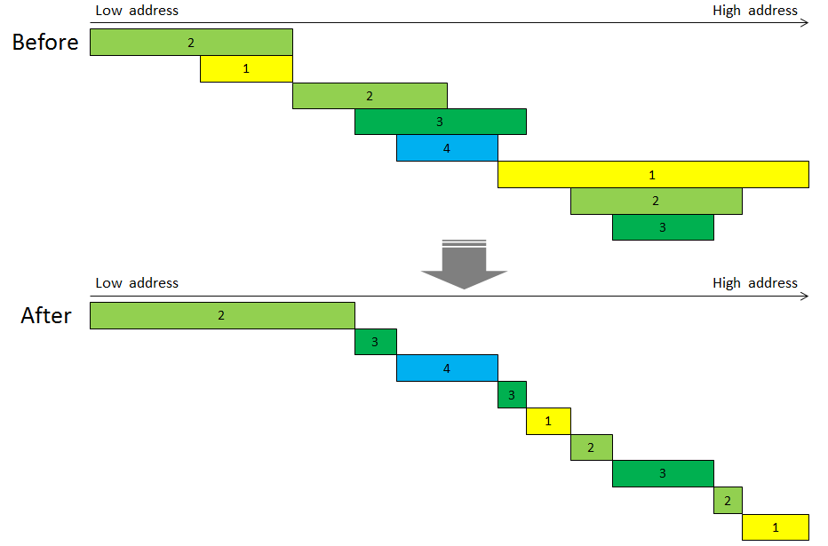

连续的同类型的合并到一块里面, 不同类型的各自为政, 不同类型重叠部分根据类型优先级高低拆分, 依高优先级顺序保证各类型的内存块的完整性.

接下来就是将整理后的**boot_params.e820_map**添加到**全局变量数据 e820**里


## 9.2. 页表缓冲区申请

在**setup_arch**()函数中调用的**页表缓冲区申请**操作**early_alloc_pgt_buf**()

注意该函数执行是在**memory_block 那些之前**

```
# /arch/x86/mm/init.c
void __init early_alloc_pgt_buf(void)
{
    unsigned long tables = INIT_PGT_BUF_SIZE;
    phys_addr_t base;

    base = __pa(extend_brk(tables, PAGE_SIZE));

    pgt_buf_start = base >> PAGE_SHIFT;
    pgt_buf_end = pgt_buf_start;
    pgt_buf_top = pgt_buf_start + (tables >> PAGE_SHIFT);
}
```

从系统**开启分页管理(head_32.s 代码**)中**使用**到的__**brk_base 保留空间申请一块内存**出来, 申请的空间大小为:

```
#define INIT_PGT_BUF_SIZE        (6 * PAGE_SIZE)
```

也就是**24Kbyte**, 同时将_brk_end 标识的位置后移. 里面涉及的几个全局变量作用:

- pgt_buf_start: 标识**该缓冲空间的起始页框号**;

- pgt_buf_end: 当前和 pgt_buf_start 等值, 但是它用于表示该空间**未被申请使用的空间起始页框号**;

- pgt_buf_top: 则是用来表示**缓冲空间的末尾**, 存放的是该末尾的**页框号**.

在 setup_arch()中, 紧接着 early_alloc_pgt_buf()还有 reserve_brk():

```cpp
// arch/x86/kernel/setup.c

static void __init reserve_brk(void)
{
    if (_brk_end > _brk_start)
        memblock_reserve(__pa_symbol(_brk_start),
                 _brk_end - _brk_start);

    /* Mark brk area as locked down and no longer taking any
       new allocations */
    _brk_start = 0;
}
```

其主要是用来将**early_alloc_pgt_buf**()申请的空间在 memblock 算法中做**reserved 保留操作**, 避免被其他地方申请使用引发异常.

## 9.3. memblock 算法

memblock 算法的实现是, **它将所有状态都保存在一个全局变量__initdata_memblock 中, 算法的初始化以及内存的申请释放都是在将内存块的状态做变更**.

### 9.3.1. struct memblock 结构

那么从数据结构入手, __initdata_memblock 是一个 memblock 结构体. 其结构体定义:

```
# /include/linux/memblock.h
struct memblock {
    bool bottom_up;  /* is bottom up direction?
    如果 true, 则允许由下而上地分配内存*/
    phys_addr_t current_limit; /*指出了内存块的大小限制*/
    /*  接下来的三个域描述了内存块的类型, 即内存型, 预留型和物理内存*/
    struct memblock_type memory;
    struct memblock_type reserved;
#ifdef CONFIG_HAVE_MEMBLOCK_PHYS_MAP
    struct memblock_type physmem;
#endif
};
```

该结构体包含五个域.

| 字段 | 描述 |
|:---:|:----|
| bottom_up | 表示分配器分配内存的方式<br>true:从**低地址(内核映像的尾部**)向高地址分配<br>false:也就是 top-down,从高地址向地址分配内存. |
| current_limit | 指出了内存块的大小限制, 用于**限制通过 memblock_alloc 等函数的内存申请** |
| memory | **可用内存的集合(不是说未分配的！！！而是所有的！！！**) |
| reserved | **已分配内存的集合** |
| physmem | **物理内存的集合**(需要配置 CONFIG_HAVE_MEMBLOCK_PHYS_MAP 参数) |


### 9.3.2. 内存块类型 struct memblock_type

往下看看 memory 和 reserved 的结构体**memblock_type**定义:

```
# /include/linux/memblock.h

struct memblock_type {
    unsigned long cnt; /* number of regions */
    unsigned long max; /* size of the allocated array */
    phys_addr_t total_size; /* size of all regions */
    struct memblock_region *regions;
};
```

该结构体存储的是**内存类型信息**

| 字段 | 描述 |
|:---:|:----:|
| cnt | 当前集合(memory 或者 reserved)中记录的**内存区域个数** |
| max | 当前集合(memory 或者 reserved)中可记录的**内存区域的最大个数** |
| total_size | 集合记录**区域信息大小(region 的 size 和, 不是个数**) |
| regions | 内存区域结构指针 |

### 9.3.3. 内存区域 struct memblock_region

```
# /include/linux/memblock.h

struct memblock_region {
    phys_addr_t base;
    phys_addr_t size;
    unsigned long flags;
#ifdef CONFIG_HAVE_MEMBLOCK_NODE_MAP
    int nid;
#endif
};
```

| 字段 | 描述 |
|:---:|:----:|
| base | 内存区域起始地址 |
| size | 内存区域大小 |
| flags | 标记 |
| nid | **node 号** |

### 9.3.4. 内存区域标识

```cpp
// include/linux/memblock.h
/* Definition of memblock flags. */
enum {
    MEMBLOCK_NONE       = 0x0,  /* No special request */
    MEMBLOCK_HOTPLUG    = 0x1,  /* hotpluggable region */
    MEMBLOCK_MIRROR     = 0x2,  /* mirrored region */
    MEMBLOCK_NOMAP      = 0x4,  /* don't add to kernel direct mapping */
};
```

### 9.3.5. 结构总体布局

结构关系图:


一个 memblock 有 3 个 memblock_type, 每个 memblock_type 有一个 memblock_region 指针

Memblock 主要包含三个结构体: memblock,memblock_type 和 memblock_region. 现在我们已了解了 Memblock, 接下来我们将看到 Memblock 的初始化过程.

### 9.3.6. memblock 初始化

#### 9.3.6.1. 初始化 memblock 静态变量

在**编译(编译时确定！！！**)时,会分配好**memblock 结构所需要的内存空间**.

结构体 memblock 的初始化变量名和结构体名相同 memblock:

```
# /mm/memblock.c

static struct memblock_region memblock_memory_init_regions[INIT_MEMBLOCK_REGIONS] __initdata_memblock;
static struct memblock_region memblock_reserved_init_regions[INIT_MEMBLOCK_REGIONS] __initdata_memblock;
#ifdef CONFIG_HAVE_MEMBLOCK_PHYS_MAP
static struct memblock_region memblock_physmem_init_regions[INIT_PHYSMEM_REGIONS] __initdata_memblock;
#endif

struct memblock memblock __initdata_memblock = {
    .memory.regions = memblock_memory_init_regions,
    .memory.cnt = 1, /* empty dummy entry */
    .memory.max = INIT_MEMBLOCK_REGIONS,

    .reserved.regions = memblock_reserved_init_regions,
    .reserved.cnt = 1, /* empty dummy entry */
    .reserved.max = INIT_MEMBLOCK_REGIONS,

#ifdef CONFIG_HAVE_MEMBLOCK_PHYS_MAP
    .physmem.regions    = memblock_physmem_init_regions,
    .physmem.cnt        = 1,    /* empty dummy entry */
    .physmem.max        = INIT_PHYSMEM_REGIONS,
#endif

    .bottom_up = false,
    .current_limit = MEMBLOCK_ALLOC_ANYWHERE,
};
```

它初始化了部分成员, 表示内存申请自高地址向低地址, 且 current_limit 设为~0, 即 0xFFFFFFFF, 同时通过**全局变量定义为 memblock**的算法管理中的 memory 和 reserved**准备了内存空间**.

#### 9.3.6.2. 宏__initdata_memblock 指定了存储位置

```cpp
[include/linux/memblock.h]
#ifdef CONFIG_ARCH_DISCARD_MEMBLOCK
#define __init_memblock __meminit
#define __initdata_memblock __meminitdata
#else
#define __init_memblock
#define __initdata_memblock
#endif
```

启用 CONFIG_ARCH_DISCARD_MEMBLOCK 宏配置选项, memblock 代码会被放**到.init 代码段**,在内核启动完成后 memblock 代码会从.init 代码段释放.

memblock 结构体中 3 个 memblock_type 类型数据 **memory**, **reserved**和**physmem**的初始化

它们的**memblock_type cnt 域**(当前集合中区域个数)被初始化为**1**. **memblock_type max 域**(当前集合中**最大区域个数**)被初始化为`INIT_MEMBLOCK_REGIONS`和`INIT_PHYSMEM_REGIONS`

其中`INIT_MEMBLOCK_REGIONS`为 128, 参见[include/linux/memblock.h?v=4.7, line 20](http://lxr.free-electrons.com/source/include/linux/memblock.h?v=4.7#L20)

```cpp
#define INIT_MEMBLOCK_REGIONS   128
#define INIT_PHYSMEM_REGIONS    4
```

而**memblock_type.regions**域都是通过 memblock_region 数组初始化的,所有的数组定义都带有__initdata_memblock 宏

memblock 结构体中最后两个域**bottom_up**,**内存分配模式(从低地址往高地址！！！)被禁用**(bottom_up = **false**, 因此内存分配方式为 top-down.), 当前 memblock 的大小限制(memblock_alloc 等的)是`MEMBLOCK_ALLOC_ANYWHERE`为~(phys_addr_t)0 即为**0xffffffff(32 个 1**).

```cpp
/* Flags for memblock_alloc_base() amd __memblock_alloc_base() */
#define MEMBLOCK_ALLOC_ANYWHERE (~(phys_addr_t)0)
#define MEMBLOCK_ALLOC_ACCESSIBLE       0
```

#### 9.3.6.3. x86 架构下的 memblock 初始化

在物理内存探测并且整理保存到全局变量 e820 后, memblock 初始化发生在这个之后

```cpp
void __init setup_arch(char **cmdline_p)
{
    /*
     * Need to conclude brk, before memblock_x86_fill()
     *  it could use memblock_find_in_range, could overlap with
     *  brk area.
     */
    reserve_brk();

    cleanup_highmap();

    memblock_set_current_limit(ISA_END_ADDRESS);
    memblock_x86_fill();
}
```

```c
static void __init reserve_brk(void)
{
    if (_brk_end > _brk_start)
        memblock_reserve(__pa_symbol(_brk_start),
                 _brk_end - _brk_start);

    /* Mark brk area as locked down and no longer taking any
       new allocations */
    _brk_start = 0;
}
```

首先**内核建立内核页表**需要**扩展__brk**,而**扩展后的 brk**就立即**被声明为已分配**. 这项工作是由**reserve_brk**通过调用**memblock_reserve(这也就是第一阶段的使用**)完成的, 而其实**并不是真正通过 memblock 分配**的,因为此时**memblock 还没有完成初始化**

此时 memblock 还没有初始化,只能通过 memblock_reserve 来完成内存的分配

函数实现:

```
# /arch/x86/kernel/e820.c

void __init memblock_x86_fill(void)
{
    int i;
    u64 end;
    memblock_allow_resize();
    for (i = 0; i < e820.nr_map; i++) {
        struct e820entry *ei = &e820.map[i];
        end = ei->addr + ei->size;
        if (end != (resource_size_t)end)
            continue;
        if (ei->type != E820_RAM && ei->type != E820_RESERVED_KERN)
            continue;
        memblock_add(ei->addr, ei->size);
    }
    /* throw away partial pages */
    memblock_trim_memory(PAGE_SIZE);
    memblock_dump_all();
}
```

遍历之前的**全局变量 e820**的内存布局信息, 只对**E820_RAM**和**E820_RESERVED_KERN**类型的进行添加到系统变量 memblock 中的**memory**中(**这儿参见上面 memblock_add, 其实现中使用 nid 是 2^CONFIG_NODES_SHIFT！！！初始化这儿是不区分 node 的！！！**), 当做可分配内存, 添加时候如果 memory 不为空, 需要检查内存重叠情况并剔除, 然后通过**memblock_merge_regions**()把紧挨着的内存合并.

**后两个函数**主要是修剪内存**使之对齐和输出信息**.

### 9.3.7. memblock 操作总结

memblock 内存管理是将**所有的物理内存**放到**memblock.memory**中作为可用内存来管理, **分配过**的内存**只加入**到**memblock.reserved**中, 并**不从 memory 中移出**, 最后都通过 memblock_merge_regions()把紧挨着的内存合并了.

同理**释放内存**仅仅从**reserved**中移除.也就是说,**memory**在**fill 过后**基本就是**不动**的了. **申请和分配内存**仅仅修改**reserved**就达到目的.

**memory 链表**维护系统的**内存信息**(在初始化阶段**通过 bios 获取**的),对于任何**内存分配**,先去**查找 memory 链表**,然后**在 reserve 链表上记录**(新增一个节点, 或者合并)

- 可以分配**小于一页的内存**;

- 从高往低找, **就近查找可用的内存**

## 9.4. 建立内核页表

**32 位**情况下, **每个进程**一般都能寻址**4G 的内存空间**. 但如果**物理内存没这么大**的话, 进程怎么能获得 4G 的内存空间呢?这就是使用了**虚拟地址**的好处. 我们经常在程序的反汇编代码中看到一些类似 0x32118965 这样的地址, **操作系统**中称为**线性地址**, 或**虚拟地址**. 通常我们使用一种叫做**虚拟内存的技术**来实现, 因为可以**使用硬盘中的一部分来当作内存**使用. 另外, 现在操作系统都划分为**系统空间**和**用户空间**, 使用**虚拟地址**可以很好的**保护内核空间不被用户空间破坏**. Linux 2.6 内核使用了许多技术来改进对大量虚拟内存空间的使用, 以及对内存映射的优化, 使得 Linux 比以往任何时候都更适用于企业. 包括**反向映射(reverse mapping**)、使用**更大的内存页**、**页表条目存储在高端内存**中, 以及更稳定的管理器. 对于**虚拟地址**如何**转为物理地址**,这个**转换过程**有**操作系统**和**CPU**共同完成. **操作系统**为 CPU**设置好页表**. **CPU**通过**MMU 单元**进行**地址转换**. **CPU**做出**映射**的**前提**是**操作系统**要为其**准备好内核页表**, 而对于**页表的设置**, 内核在**系统启动的初期(！！！**)和**系统初始化完成后(！！！**)都分别进行了设置.

Linux 简化了分段机制, 使得虚拟地址与线性地址总是一致, 因此 Linux 的虚拟地址空间也为 0~4G. Linux 内核将这 4G 字节的空间分为两部分. 将最高的 1G 字节(从虚拟地址 0xC0000000 到 0xFFFFFFFF)供内核使用, 称为"内核空间". 而将较低的 3G 字节(从虚拟地址 0x00000000 到 0xBFFFFFFF)供各个进程使用, 称为"用户空间". 因为每个进程可以通过系统调用进入内核, 因此**Linux 内核**由**系统内的所有进程共享**. 于是, 从具体进程的角度来看, 每个进程可以拥有 4G 字节的虚拟空间.

Linux 使用两级保护机制: **0 级供内核**使用, **3 级供用户程序**使用. **每个进程**有各自的**私有用户空间(0~3G**), 这个空间对系统中的**其他进程是不可见**的. **最高的 1GB 字节虚拟内核空间**则为**所有进程以及内核所共享**. **内核空间(！！！**)中存放的是**内核代码和数据(！！！**), 而**进程的用户空间**中存放的是**用户程序的代码和数据**. 不管是内核空间还是用户空间, 它们都处于虚拟空间中. 虽然**内核空间**占据了**每个虚拟空间**中的**最高 1GB 字节(！！！**), 但映射到**物理内存**却总是**从最低地址(0x00000000)开始**. 对**内核空间**来说, 其**地址映射是很简单的线性映射**, **0xC0000000**就是**物理地址与线性地址之间的位移量**, 在 Linux 代码中就叫做**PAGE_OFFSET**.

Linux 启动并建立一套**完整的页表机制**要经过以下几个步骤:

1. **临时内核页表的初始化**(setup_32.s)

2. 启动**分页机制(head_32.s**)

3. 建立**低端内存**和**高端内存固定映射区**的**页表**(**init_memory_mapping**())

4. 建立**高端内存永久映射区**的**页表**并获取**固定映射区的临时映射区页表**(paging_init())

linux**页表映射机制**的建立分为**两个阶段**,

第一个阶段是**内核进入保护模式之前**要先建立一个**临时内核页表**并**开启分页**功能, 因为在**进入保护模式后**, 内核**继续初始化**直到建立**完整的内存映射机制之前**, 仍然需要用到**页表**来映射相应的内存地址. 对**x86 32**位内核, 这个工作在保护模式下的内核入口函数 arch/x86/kernel/head_32.S:startup_32()中完成.

第二阶段是**建立完整的内存映射机制**, 在在 setup_arch()--->arch/x86/mm/init.c:**init_memory_mapping**()中完成. 注意对于**物理地址扩展(PAE)分页机制**, Intel 通过在她得处理器上把管脚数从 32 增加到 36 已经满足了这些需求, **寻址能力**可以达到**64GB**. 不过, 只有引入一种新的分页机制把 32 位线性地址转换为 36 位物理地址才能使用所增加的物理地址. linux 为对多种体系的支持, 选择了一套简单的通用实现机制. 在这里只分析 x86 32 位下的实现.

### 9.4.1. 临时页表的初始化

**swapper_pg_dir**是**临时全局页目录表起址**, 它是在**内核编译过程**中**静态初始化**的. 内核是在 swapper_pg_dir 的第**768 个表项**开始建立页表. 其**对应线性地址**就是__**brk_base**(内核编译时指定其值, 默认为**0xc0000000**)以上的地址, 即**3GB 以上的高端地址**(3GB-4GB), 再次强调这高端的 1GB 线性空间是内核占据的虚拟空间, 在进行实际内存映射时, 映射到**物理内存**却总是从最低地址(**0x00000000**)开始.

内核从__**brk_base 开始建立页表**, 然后创建页表相关结构, **开启 CPU 映射机制**, 继续初始化(包括 INIT_TASK<即第一个进程>, 建立完整中断处理程序, 中心加载 GDT 描述符), 最后**跳转到 init/main.c 中的 start_kernel()函数继续初始化**.

### 9.4.2. 内存映射机制的完整建立初始化

这一阶段在 start_kernel()--->**setup_arch**()中完成. 在 Linux 中, **物理内存**被分为**低端内存区**和**高端内存区**(如果内核编译时**配置了高端内存标志**的话), 为了**建立物理内存到虚拟地址空间的映射**, 需要先计算出**物理内存总共有多少页面数**, 即找出**最大可用页框号**, 这**包含了整个低端和高端内存区**. 还要计算出**低端内存区总共占多少页面**.

下面就基于 RAM 大于 896MB, 而小于 4GB, 并且**CONFIG_HIGHMEM(必须配置！！！**)配置了高端内存的环境情况进行分析.

#### 9.4.2.1. 相关变量与宏的定义

- max_pfn: **最大物理内存页面帧号**;

- max_low_pfn: **低端内存区(直接映射空间区的内存)的最大可用页帧号**;

在**setup_arch**(), 首先调用 arch/x86/kernel/e820.c:**e820_end_of_ram_pfn**()找出**最大可用页帧号(即总页面数**), 并保存在**全局变量 max_pfn**中, 这个变量定义可以在 mm/bootmem.c 中找到. 它直接调用 e820.c 中的 e820_end_pfn()完成工作.

**e820_end_of_ram_pfn**()直接调用 e820_end_pfn()找出**最大可用页面帧号**, 它会**遍历 e820.map 数组**中存放的**所有物理页面块**, 找出其中**最大的页面帧号**, 这就是我们当前需要的**max_pfn 值**.

setup_arch()会调用 arch/x86/mm/init_32.c:**find_low_pfn_range**()找出**低端内存区**的**最大可用页帧号**, 保存在**全局变量 max_low_pfn**中(也定义在 mm/bootmem.c 中).

```
start_kernel()                      #/init/main.c
|
└─>setup_arch()                     #/arch/x86/kernel/setup.c
   |
   └─>e820_end_of_ram_pfn()         #/arch/x86/kernel/e820.c
   |
   └─>find_low_pfn_range()          #/arch/x86/kernel/e820.c
```

```c
/*
 * Determine low and high memory ranges:
 */
void __init find_low_pfn_range(void)
{
    /* it could update max_pfn */

    if (max_pfn <= MAXMEM_PFN)
        lowmem_pfn_init();
    else
        highmem_pfn_init();
}
```

根据**max_pfn**是否大于**MAXMEM_PFN**, 从而判断**是否初始化高端内存**

Linux 支持 4 级页表, 根据上面讲过的 PAGE_SIZE 等会逐步推出诸如 FIXADDR_BOOT_START, PKMAP_BASE 等数值

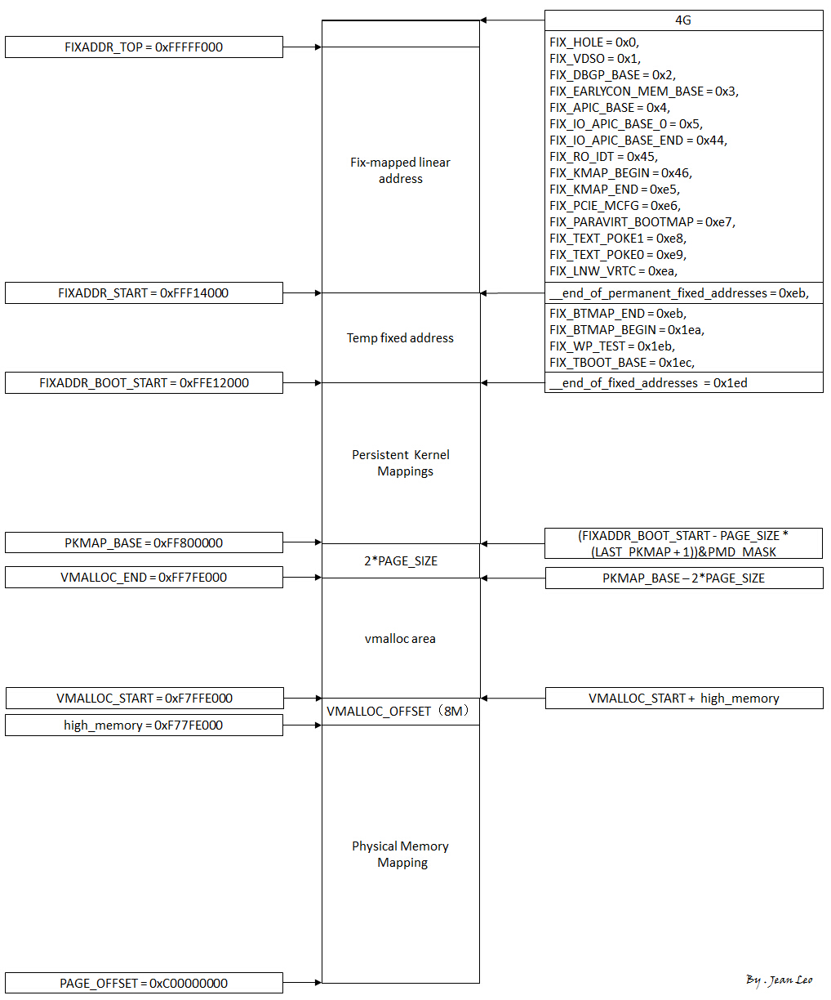


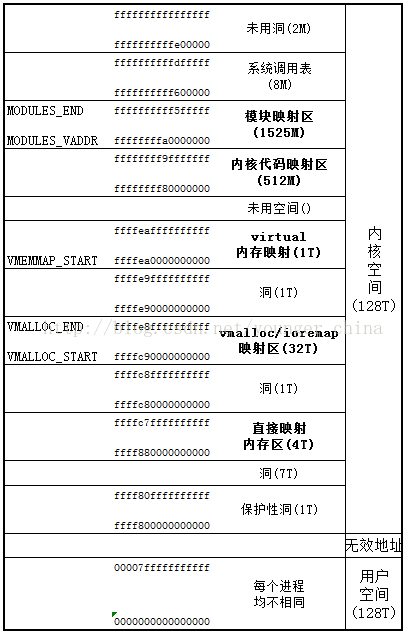


#### 9.4.2.2. 低端内存页表和高端内存固定映射区页表的建立 init_mem_mapping()

有了**总页面数**、**低端页面数**、**高端页面数**这些信息, setup_arch()接着调用 arch/x86/mm/init.c:**init_mem_mapping**()函数**建立低端内存页表和高端内存固定映射区的页表**.

该函数**在 PAGE_OFFSET 处(！！！**)建立**物理内存的直接映射**, 即**把物理内存中 0~max_low_pfn<<12**地址范围的**低端空间区直接映射**到**内核虚拟空间**(它是从**PAGE_OFFSET**即**0xc0000000**开始的**1GB 线性地址**). 这在**bootmem/memblock 初始化之前运行**, 并且**直接从物理内存获取页面**, 这些页面在前面已经被**临时映射**了. 注意高端映射区并没有映射到实际的物理页面, 只是这种机制的初步建立, 页表存储的空间保留.

调用关系如下:

```cpp
setup_arch()
|
|-->init_mem_mapping()  //低端内存页表和高端内存固定映射区的页表
    |
    |-->probe_page_size_mask() //
    |
    |-->init_memory_mapping(0, ISA_END_ADDRESS);
    |
    |-->early_ioremap_page_table_range_init()  // 高端内存的固定映射区
    |
    |-->load_cr3(swapper_pg_dir);  //将内核 PGD 地址加载到 cr3 寄存器
```

## 9.5. 内存管理 node 节点设置 initmem_init()

```c
[arch/x86/mm/init_64.c]
#ifndef CONFIG_NUMA
void __init initmem_init(void)
{
	memblock_set_node(0, (phys_addr_t)ULLONG_MAX, &memblock.memory, 0);
}
#endif

[arch/x86/mm/numa_64.c]
void __init initmem_init(void)
{
	x86_numa_init();
}
```

上面是针对非 NUMA 情况, 下面是 numa 的初始化

`memblock_set_node`, 该函数用于给早前建立的 memblock 算法**设置 node 节点信息**. 这里传参数是**全的 memblock.memory 信息**.

linux 内核中是如何获得 NUMA 信息的

在 x86 平台, 这个工作分成两步

- 将 numa 信息(ACPI 得到的)保存到 numa_meminfo
- 将 numa_meminfo 映射到 memblock 结构

着重关注第一次获取到 numa 信息的过程, 对 node 和 zone 的数据结构暂时不在本文中体现.

整体调用结构

```c
setup_arch()
  initmem_init()
    x86_numa_init()
        numa_init()
            x86_acpi_numa_init()
            numa_cleanup_meminfo()
            numa_register_memblks()
                memblock_set_node()
                alloc_node_data()
                memblock_dump_all()
```

### 9.5.1. 将 numa 信息保存到 numa_meminfo

在 x86 架构上, **numa 信息第一次获取**是通过**acpi**或者是**读取北桥上的信息**. 具体的函数是**numa_init**(). 不管是哪种方式, **numa 相关的信息**都最后保存在了**numa_meminfo 这个数据结构**中.

这个数据结构和 memblock 长得很像, 展开看就是一个数组, **每个元素**记录了**一段内存的起止地址和 node 信息**.

```
numa_meminfo
    +------------------------------+
    |nr_blks                       |
    |    (int)                     |
    +------------------------------+
    |blk[NR_NODE_MEMBLKS]          |
    |    (struct numa_memblk)      |
    |    +-------------------------+
    |    |start                    |
    |    |end                      |
    |    |   (u64)                 |
    |    |nid                      |
    |    |   (int)                 |
    +----+-------------------------+
```

在这个过程中使用的就是 numa_add_memblk()函数添加的 numa_meminfo 数据结构.

### 9.5.2. 将 numa_meminfo 映射到 memblock 结构

内核获取了**numa_meminfo**之后并没有如我们想象一般直接拿来用了. 虽然此时**给每个 numa 节点**生成了我们以后会看到的**node_data 数据结构**, 但此时并没有直接使能它.

memblock 是内核初期内存分配器, 所以当内核获取了**numa 信息**首先是**把相关的信息映射到了 memblock 结构**中, 使其具有 numa 的 knowledge. 这样在**内核初期分配内存**时, 也可以分配到更近的内存了.

在这个过程中有两个比较重要的函数

- `numa_cleanup_meminfo()`
- `numa_register_memblks()`

前者主要用来**过滤 numa_meminfo 结构**, **合并同一个 node 上的内存**.

后者就是**把 numa 信息映射到 memblock**了. 除此之外, 顺便还把之后需要的**node_data 给分配(alloc_node_data**)了, 为后续的页分配器做好了准备.

```cpp
static int __init numa_register_memblks(struct numa_meminfo *mi)
{
    for (i = 0; i < mi->nr_blks; i++) {
		struct numa_memblk *mb = &mi->blk[i];
		memblock_set_node(mb->start, mb->end - mb->start,
				  &memblock.memory, mb->nid);
	}

	/* Finally register nodes. */
	for_each_node_mask(nid, node_possible_map) {
		u64 start = PFN_PHYS(max_pfn);
		u64 end = 0;

		for (i = 0; i < mi->nr_blks; i++) {
			if (nid != mi->blk[i].nid)
				continue;
			start = min(mi->blk[i].start, start);
			end = max(mi->blk[i].end, end);
		}

		if (start >= end)
			continue;

		/*
		 * Don't confuse VM with a node that doesn't have the
		 * minimum amount of memory:
		 */
		if (end && (end - start) < NODE_MIN_SIZE)
			continue;

		alloc_node_data(nid);
	}
	/* Dump memblock with node info and return. */
	memblock_dump_all();
	return 0;
}
```

memblock_set_node 主要调用了三个函数做相关操作: memblock_isolate_range、memblock_set_region_node 和 memblock_merge_regions.

```cpp
【file: /mm/memblock.c】
/**
 * memblock_set_node - set node ID on memblock regions
 * @base: base of area to set node ID for
 * @size: size of area to set node ID for
 * @type: memblock type to set node ID for
 * @nid: node ID to set
 *
 * Set the nid of memblock @type regions in [@base,@base+@size) to @nid.
 * Regions which cross the area boundaries are split as necessary.
 *
 * RETURNS:
 * 0 on success, -errno on failure.
 */
int __init_memblock memblock_set_node(phys_addr_t base, phys_addr_t size,
                      struct memblock_type *type, int nid)
{
    int start_rgn, end_rgn;
    int i, ret;

    ret = memblock_isolate_range(type, base, size, &start_rgn, &end_rgn);
    if (ret)
        return ret;

    for (i = start_rgn; i < end_rgn; i++)
        memblock_set_region_node(&type->regions[i], nid);

    memblock_merge_regions(type);
    return 0;
}
```

**memblock_isolate_range**主要做**分割操作**, 在**memblock 算法建立时**, 只是**判断了 flags 是否相同**, 然后将**连续内存做合并**操作, 而**此时建立 node 节点**, 则根据**入参 base 和 size 标记节点内存范围**将**内存划分开来**.

如果**memblock 中的 region**恰好以**该节点内存范围末尾划分开来**的话, 那么则将 region 的索引记录至 start_rgn, 索引加 1 记录至 end_rgn 返回回去;

如果**memblock 中的 region**跨越了**该节点内存末尾分界**, 那么将会把**当前的 region 边界调整为 node 节点内存范围边界**, 另一部分通过**memblock_insert_region**()函数**插入到 memblock 管理 regions 当中**, 以完成拆分.

memblock_set_region_node 是获取 node 节点号, 而 memblock_merge_regions()则是用于将 region 合并的.

### 9.5.3. 观察 memblock 的变化

memblock 的调试信息默认没有打开, 所以要观察的话需要传入内核启动参数"memblock=debug".

进入系统后, 输入命令"`dmesg | grep -A 9 MEMBLOCK`"可以看到

## 9.6. 管理区和页面管理的构建 x86_init.paging.pagetable_init()

x86_init.paging.pagetable_init(), 该钩子实际上挂接的是 native_pagetable_init()函数.

[arch/x86/mm/init_32.c]

(1) 循环检测**max_low_pfn 直接映射空间后面**的**物理内存**是否存在**系统启动引导时创建的页表**, 如果存在, 则使用 pte_clear()将其清除.

(2) 接下来的 paravirt_alloc_pmd()主要是用于准虚拟化, 主要是使用钩子函数的方式替换 x86 环境中多种多样的指令实现.

(3) 再往下的 paging_init()

### 9.6.1. paging_init()

```c
[arch/x86/mm/init_64.c]
void __init paging_init(void)
{
	sparse_memory_present_with_active_regions(MAX_NUMNODES);
	sparse_init();

	/*
	 * clear the default setting with node 0
	 * note: don't use nodes_clear here, that is really clearing when
	 *	 numa support is not compiled in, and later node_set_state
	 *	 will not set it back.
	 */
	node_clear_state(0, N_MEMORY);
	if (N_MEMORY != N_NORMAL_MEMORY)
		node_clear_state(0, N_NORMAL_MEMORY);

	zone_sizes_init();
}
```

这里**sparse memory**涉及到 linux 的一个**内存模型概念**. linux 内核有**三种内存模型**: **Flat memory**、**Discontiguous memory**和**Sparse memory**. 其分别表示:

**Flat memory**: 顾名思义, **物理内存是平坦连续的**, 整个系统只有**一个 node**节点.

**Discontiguous memory**: **物理内存不连续**, 内存中**存在空洞**, 也因而系统**将物理内存分为多个节点**, 但是**每个节点的内部内存是平坦连续**的. 值得注意的是, 该模型不仅是对于*NUMA 环境*而言, **UMA**环境上同样可能存在**多个节点**的情况.

**Sparse memory**: **物理内存是不连续**的, **节点的内部内存也可能是不连续**的, 系统也因而可能会有**一个或多个节点**. 此外, 该模型是**内存热插拔**的基础.

**4.4**的内核仍然是有 3 内存模型可以选择. (Processor type and features ---> Memory model, 但是**4.18**已经不可选, 只有 sparse memory)


........


**zone_size_init**

```c
void __init zone_sizes_init(void)
{
	unsigned long max_zone_pfns[MAX_NR_ZONES];

	memset(max_zone_pfns, 0, sizeof(max_zone_pfns));

#ifdef CONFIG_ZONE_DMA
	max_zone_pfns[ZONE_DMA]		= min(MAX_DMA_PFN, max_low_pfn);
#endif
#ifdef CONFIG_ZONE_DMA32
	max_zone_pfns[ZONE_DMA32]	= min(MAX_DMA32_PFN, max_low_pfn);
#endif
	max_zone_pfns[ZONE_NORMAL]	= max_low_pfn;
#ifdef CONFIG_HIGHMEM
	max_zone_pfns[ZONE_HIGHMEM]	= max_pfn;
#endif

	free_area_init_nodes(max_zone_pfns);
}
```

通过 max_zone_pfns 获取各个管理区的最大页面数, 并作为参数调用 free_area_init_nodes()

#### 9.6.1.1. free_area_init_nodes()

`[/mm/page_alloc.c]`

该函数中, **arch_zone_lowest_possible_pfn**用于存储**各内存管理区**可使用的**最小内存页框号**, 而**arch_zone_highest_possible_pfn**则是用来存储**各内存管理区**可使用的**最大内存页框号**. 也就是说**确定了各管理区的上下边界**. 此外, 还有一个**全局数组 zone_movable_pfn**, 用于记录**各个 node**节点的**Movable 管理区的起始页框号**

打印管理区范围信息(dmesg 可看到)

setup_nr_node_ids()设置内存节点总数

最后有一个**遍历各个节点**做初始化

```c
for_each_online_node(nid) {
    pg_data_t *pgdat = NODE_DATA(nid);
    free_area_init_node(nid, NULL,
            find_min_pfn_for_node(nid), NULL);

    /* Any memory on that node */
    if (pgdat->node_present_pages)
        node_set_state(nid, N_MEMORY);
    check_for_memory(pgdat, nid);
}
```

node_set_state()主要是对 node 节点进行状态设置, 而 check_for_memory()则是做内存检查.

关键函数是**free_area_init_node**(), 其入参 find_min_pfn_for_node()用于**获取 node**节点中**最低的内存页框号**.

```cpp
【file: /mm/page_alloc.c】
void __paginginit free_area_init_node(int nid, unsigned long *zones_size,
        unsigned long node_start_pfn, unsigned long *zholes_size)
{
    pg_data_t *pgdat = NODE_DATA(nid);
    unsigned long start_pfn = 0;
    unsigned long end_pfn = 0;

    /* pg_data_t should be reset to zero when it's allocated */
    WARN_ON(pgdat->nr_zones || pgdat->classzone_idx);

    pgdat->node_id = nid;
    pgdat->node_start_pfn = node_start_pfn;
    init_zone_allows_reclaim(nid);
#ifdef CONFIG_HAVE_MEMBLOCK_NODE_MAP
    get_pfn_range_for_nid(nid, &start_pfn, &end_pfn);
#endif
    calculate_node_totalpages(pgdat, start_pfn, end_pfn,
                  zones_size, zholes_size);

    alloc_node_mem_map(pgdat);
#ifdef CONFIG_FLAT_NODE_MEM_MAP
    printk(KERN_DEBUG "free_area_init_node: node %d, pgdat %08lx, node_mem_map %08lxn",
        nid, (unsigned long)pgdat,
        (unsigned long)pgdat->node_mem_map);
#endif

    free_area_init_core(pgdat, start_pfn, end_pfn,
                zones_size, zholes_size);
}
```

- init_zone_allows_reclaim()评估内存管理区是否可回收以及合适的 node 节点数
- get_pfn_range_for_nid 获取内存 node 节点的起始和末尾页框号
- calculate_node_totalpages(): 遍历 node 的 zone, 得到所有 zone 的所有页面数(node_spanned_pages), 不包括 movable 管理区; 计算内存空洞页面数; 从而得到物理页面总数(node_present_pages); 打印节点信息和 node_present_pages
- alloc_node_mem_map(): 给**当前节点的内存页面**信息**申请内存空间**, 并赋值给 pgdat->node_mem_map; 如果当前节点是 0 号节点, 设置**全局变量 mem_map**为当前节点的 node_mem_map
- free_area_init_core: 初始化工作

设置了内存管理节点的管理结构体, 包括 pgdat_resize_init()初始化**锁**资源、init_waitqueue_head()初始**内存队列**、pgdat_page_cgroup_init()**控制组群初始化**.

循环遍历统计**各个管理区**最大跨度间相差的**页面数 size**以及**除去内存"空洞**"**后的实际页面数 realsize**,然后通过**calc_memmap_size**()计算出**该管理区**所需的**页面管理结构**占用的**页面数 memmap_pages**, 最后可以计算得除高端内存外的系统内存共有的**内存页面数 nr_kernel_pages(用于统计所有一致映射的页**); 此外循环体内的操作则是**初始化内存管理区的管理结构(zone 的初始化**), 例如各类锁的初始化、队列初始化. 值得注意的是**zone_pcp_init**()是初始化**冷热页分配器**的, mod_zone_page_state()用于**计算更新管理区的状态统计**, lruvec_init()则是**初始化 LRU 算法使用的链表和保护锁**, 而 set_pageblock_order()用于在 CONFIG_HUGETLB_PAGE_SIZE_VARIABLE 配置下设置 pageblock_order 值的; 此外**setup_usemap**()函数则是主要是为了给 zone 管理结构体中的**pageblock_flags**申请**内存空间**, pageblock_flags 与**伙伴系统的碎片迁移算法有关**. 而 init_currently_empty_zone()则主要初始化管理区的**等待队列哈希表**和**等待队列**, 同时还初始化了**与伙伴系统相关的 free_aera 列表**; memmap_init: 根据页框号 pfn 通过 pfn_to_page()查找到页面管理结构 page, 然后对其进行初始化.

中间有部分记录可以通过 demesg 查到

至此, 内存管理框架构建完毕.

# 10. build_all_zonelists 初始化每个 node 的备用管理区链表 zonelists

注: 该备用列表必须包括**所有结点(！！！包括当前节点！！！**)的**所有内存域(！！！**)

为内存管理做得一个准备工作就是将所有节点的管理区(所有的节点 pg_data_t 的 zone！！！)都链入到 zonelist 中, 便于后面内存分配工作的进行.

内存节点 pg_data_t 中将内存节点中的内存区域 zone 按照某种组织层次(可配置！！！)存储在一个 zonelist 中, 即**pglist_data->node_zonelists 成员信息**

```cpp
//  http://lxr.free-electrons.com/source/include/linux/mmzone.h?v=4.7#L626
typedef struct pglist_data
{
	struct zone node_zones[MAX_NR_ZONES];
	struct zonelist node_zonelists[MAX_ZONELISTS];
}
```

内核定义了内存的一个层次结构关系, 首先试图分配廉价的内存, 如果失败, 则根据访问速度和容量, 逐渐尝试分配更昂贵的内存.

高端内存最廉价, 因为内核没有任何部分依赖于从该内存域分配的内存,如果高端内存用尽,对内核没有副作用, 所以优先分配高端内存

普通内存域的情况有所不同, 许多内核数据结构必须保存在该内存域, 而不能放置到高端内存域, 因此如果普通内存域用尽, 那么内核会面临内存紧张的情况

DMA 内存域最昂贵, 因为它用于外设和系统之间的数据传输.

举例来讲, 如果内核指定想要分配高端内存域. 它首先在当前结点的高端内存域寻找适当的空闲内存段, 如果失败, 则查看该结点的普通内存域, 如果还失败, 则试图在该结点的 DMA 内存域分配. 如果在 3 个本地内存域都无法找到空闲内存, 则查看其他结点. 这种情况下, 备选结点应该尽可能靠近主结点, 以最小化访问非本地内存引起的性能损失.

start_kernel()接下来的初始化则是 linux**通用的内存管理算法框架**了.

之前已经完成了节点和管理区的关键数据的初始化.

build_all_zonelists()用来初始化**内存分配器**使用的**存储节点**中的**管理区链表 node_zonelists**, 是为**内存管理算法(伙伴管理算法**)做准备工作的.

```c
build_all_zonelists(NULL, NULL);
```

函数实现

```cpp
void __ref build_all_zonelists(pg_data_t *pgdat, struct zone *zone)
{
	/*  设置 zonelist 中节点和内存域的组织形式
     *  current_zonelist_order 变量标识了当前系统的内存组织形式
     *	zonelist_order_name 以字符串存储了系统中内存组织形式的名称  */
    set_zonelist_order();

    if (system_state == SYSTEM_BOOTING) {
        build_all_zonelists_init();
    } else {
#ifdef CONFIG_MEMORY_HOTPLUG
        if (zone)
            setup_zone_pageset(zone);
#endif
        stop_machine(__build_all_zonelists, pgdat, NULL);
    }
    vm_total_pages = nr_free_pagecache_pages();
    if (vm_total_pages < (pageblock_nr_pages * MIGRATE_TYPES))
        page_group_by_mobility_disabled = 1;
    else
        page_group_by_mobility_disabled = 0;

    pr_info("Built %i zonelists in %s order, mobility grouping %s.  Total pages: %ldn",
        nr_online_nodes,
        zonelist_order_name[current_zonelist_order],
        page_group_by_mobility_disabled ? "off" : "on",
        vm_total_pages);
#ifdef CONFIG_NUMA
    pr_info("Policy zone: %sn", zone_names[policy_zone]);
#endif
}
```

## 10.1. 设置结点初始化顺序 set_zonelist_order()

可以通过**启动参数**"**numa_zonelist_order**"来配置 zonelist order, 内核定义了 3 种配置

```cpp
// http://lxr.free-electrons.com/source/mm/page_alloc.c?v=4.7#L4551
#define ZONELIST_ORDER_DEFAULT  0 /* 智能选择 Node 或 Zone 方式 */
#define ZONELIST_ORDER_NODE     1 /* 对应 Node 方式 */
#define ZONELIST_ORDER_ZONE     2 /* 对应 Zone 方式 */
```

非 NUMA 系统中, 这两个排序方式都是一样的, 也就是 legacy 方式.

**全局的 current_zonelist_order 变量**标识了系统中的**当前使用的内存域排列方式**, 默认配置为 ZONELIST_ORDER_DEFAULT

```cpp
static int current_zonelist_order = ZONELIST_ORDER_DEFAULT;
static char zonelist_order_name[3][8] = {"Default", "Node", "Zone"};
```

流程:

1. 非 NUMA 系统, current_zonelist_order 为 ZONE 方式(与 NODE 方式相同)

2. NUMA 系统, 根据设置

- 如果是 ZONELIST_ORDER_DEFAULT, 则内核选择, 目前是 32 位系统 ZONE 方式, 64 位系统 NODE 方式

可以通过/proc/sys/vm/numa_zonelist_order 动态改变 zonelist order 的分配方式

## 10.2. system_state 系统状态标识

其中**system_state**变量是一个**系统全局定义**的用来表示**系统当前运行状态**的枚举变量

```cpp
[include/linux/kernel.h]
extern enum system_states
{
	SYSTEM_BOOTING,
	SYSTEM_RUNNING,
	SYSTEM_HALT,
	SYSTEM_POWER_OFF,
	SYSTEM_RESTART,
} system_state;
```

系统状态 system_state 为 SYSTEM_BOOTING, 系统状态只有在**start_kernel**执行到最后一个函数**rest_init**后, 才会进入**SYSTEM_RUNNING**

## 10.3. build_all_zonelists_init 函数

```cpp
[mm/page_alloc.c]
static noinline void __init
build_all_zonelists_init(void)
{
    __build_all_zonelists(NULL);
    mminit_verify_zonelist();
    cpuset_init_current_mems_allowed();
}
```

build_all_zonelists_init 将将所有工作都委托给__build_all_zonelists 完成了 zonelists 的初始化工作, 传入的参数为 NULL.

```cpp
static int __build_all_zonelists(void *data)
{
    int nid;
    int cpu;
    pg_data_t *self = data;

	/*  ......  */

    for_each_online_node(nid) {
        pg_data_t *pgdat = NODE_DATA(nid);

        build_zonelists(pgdat);
    }

    for_each_possible_cpu(cpu) {
		setup_pageset(&per_cpu(boot_pageset, cpu), 0);
	/*  ......  */
}
```

**遍历**了系统中**所有的活动结点(所有的, 不仅仅是其他节点**), **每次调用**对**一个不同结点**生成**内存域数据**

### 10.3.1. build_zonelists 初始化每个内存结点的 zonelists

**遍历每个 node**, build_zonelists(pg_data_t *pgdat)完成了**节点 pgdat**上**zonelists 的初始化**工作,它建立了**备用层次结构 zonelists**.

由于 UMA 和 NUMA 架构下结点的层次结构有很大的区别,因此内核分别提供了两套不同的接口.

```cpp
[mm/page_alloc.c]
#ifdef CONFIG_NUMA

static int __parse_numa_zonelist_order(char *s)

static __init int setup_numa_zonelist_order(char *s)

int numa_zonelist_order_handler(struct ctl_table *table, int write,
             void __user *buffer, size_t *length,

static int find_next_best_node(int node, nodemask_t *used_node_mask)

static void build_zonelists_in_node_order(pg_data_t *pgdat, int node)

static void build_thisnode_zonelists(pg_data_t *pgdat)

static void build_zonelists_in_zone_order(pg_data_t *pgdat, int nr_nodes)

#if defined(CONFIG_64BIT)

static int default_zonelist_order(void)

#else

static int default_zonelist_order(void)

#endif /* CONFIG_64BIT */

static void build_zonelists(pg_data_t *pgdat)

#ifdef CONFIG_HAVE_MEMORYLESS_NODES

int local_memory_node(int node)

#endif

#else   /* CONFIG_NUMA */

static void build_zonelists(pg_data_t *pgdat)

static void set_zonelist_order(void)

#endif  /* CONFIG_NUMA */
```

以**UMA 结构**下的 build_zonelists 为例, 来讲讲内核是怎么初始化**备用内存域层次结构**的

```cpp
static void build_zonelists(pg_data_t *pgdat)
{
	int node, local_node;
	enum zone_type j;
	struct zonelist *zonelist;

	local_node = pgdat->node_id;

	zonelist = &pgdat->node_zonelists[0];
	j = build_zonelists_node(pgdat, zonelist, 0);

	/*
	 * Now we build the zonelist so that it contains the zones
	 * of all the other nodes.
	 * We don't want to pressure a particular node, so when
	 * building the zones for node N, we make sure that the
	 * zones coming right after the local ones are those from
	 * node N+1 (modulo N)
	 */
	for (node = local_node + 1; node < MAX_NUMNODES; node++) {
		if (!node_online(node))
			continue;
		j = build_zonelists_node(NODE_DATA(node), zonelist, j);
	}
	for (node = 0; node < local_node; node++) {
		if (!node_online(node))
			continue;
		j = build_zonelists_node(NODE_DATA(node), zonelist, j);
	}

	zonelist->_zonerefs[j].zone = NULL;
	zonelist->_zonerefs[j].zone_idx = 0;
}
```

node_zonelists 的数组元素通过指针操作寻址. 实际工作则委托给 build_zonelist_node.

UMA 结构下, 数组大小 MAX_ZONELISTS = 1, 所以使用**zonelist = &pgdat->node_zonelists[0**], 也就是说节点的**备用节点内存域**也是**包含当前节点内存域**的

内核在**build_zonelists**中按**分配代价**从**昂贵**到**低廉**的次序, **迭代**了**结点中所有的内存域**.

而在 build_zonelists_node 中,则按照分配代价**从低廉到昂贵的次序**, **迭代**了分配**代价不低于当前内存域的内存域(！！！**).

build_zonelists_node 函数:

```cpp
/*
 * Builds allocation fallback zone lists.
 *
 * Add all populated zones of a node to the zonelist.
 */
static int build_zonelists_node(pg_data_t *pgdat, struct zonelist *zonelist, int nr_zones)
{
    struct zone *zone;
    enum zone_type zone_type = MAX_NR_ZONES;

    do {
        zone_type--;
        zone = pgdat->node_zones + zone_type;
        if (populated_zone(zone)) {
            zoneref_set_zone(zone,
                &zonelist->_zonerefs[nr_zones++]);
            check_highest_zone(zone_type);
        }
    } while (zone_type);

    return nr_zones;
}
```

nr_zones 表示从备用列表中的**哪个位置开始填充新项**.

从**低廉**到**昂贵**的次序**迭代所有内存域**

第一次执行 build_zonelists_node, 由于列表中尚没有项, 因此调用者传递了 nr_zones 为 0.

考虑一个系统, 有内存域 ZONE_HIGHMEM、ZONE_NORMAL、ZONE_DMA. 在第一次运行 build_zonelists_node 时, 实际上会执行下列赋值

```cpp
zonelist->zones[0] = ZONE_HIGHMEM;
zonelist->zones[1] = ZONE_NORMAL;
zonelist->zones[2] = ZONE_DMA;
```

这里实际上是&pgdat->node_zonelists[0]->_zonerefs[0, 1, 2]的 zone 设置为这几个

第一个循环依次迭代大于当前结点编号的所有结点

第二个 for 循环接下来对所有编号小于当前结点的结点生成备用列表项.

### 10.3.2. setup_pageset 初始化 per_cpu 缓存

```c
	for_each_possible_cpu(cpu) {
		setup_pageset(&per_cpu(boot_pageset, cpu), 0);
```

最后**遍历每个 cpu**, 对每个 CPU 设置 per-CPU 缓存, 即冷热页.

```cpp
struct zone
{
    struct per_cpu_pageset __percpu *pageset;
};
```

前面讲解**内存管理域 zone**的时候,提到了**per-CPU 缓存**,即**冷热页**. **pageset 是一个指针**, 其容量与系统能够容纳的**CPU 的数目的最大值相同(！！！**).

在组织每个节点的 zonelist 的过程中, **setup_pageset**初始化了**per-CPU 缓存(冷热页面**)

```cpp
static void setup_pageset(struct per_cpu_pageset *p, unsigned long batch)
{
	pageset_init(p);
	pageset_set_batch(p, batch);
}
```

setup_pageset()函数入参**p**是一个**struct per_cpu_pageset 结构体**的指针, **per_cpu_pageset 结构**是内核的**各个 zone**用于**每 CPU**的**页面高速缓存管理结构**. 该**高速缓存**包含一些**预先分配的页面**, 以用于满足**本地 CPU**发出的**单一内存页请求**. 而 struct per_cpu_pages 定义的**pcp**是该**管理结构的成员**, 用于**具体页面管理**. 这是一个队列, 统一管理冷热页, 热页面在队列前面, 而冷页面则在队列后面.

在此之前**free_area_init_node 初始化内存结点**的时候,内核就**输出了冷热页的一些信息**, 该工作由**zone_pcp_init**完成

#### 10.3.2.1. pageset_init()初始化 struct per_cpu_pages 结构

```cpp
【file: /mm/page_alloc.c】
static void pageset_init(struct per_cpu_pageset *p)
{
    struct per_cpu_pages *pcp;
    int migratetype;

    memset(p, 0, sizeof(*p));

    pcp = &p->pcp;
    pcp->count = 0;
    for (migratetype = 0; migratetype < MIGRATE_PCPTYPES; migratetype++)
        INIT_LIST_HEAD(&pcp->lists[migratetype]);
}
```

里面针对**三种迁移类型**初始化了链表. 也就是说**每个内存域**有一个**冷热页数组**(一个 CPU 一个 per_cpu_pageset), **每个 per_cpu_pageset 项**有**三个链表**, 每个链表对应一个**迁移类型**.

#### 10.3.2.2. pageset_set_batch 设置 struct per_cpu_pages 结构

```cpp
static void pageset_update(struct per_cpu_pages *pcp, unsigned long high,
        unsigned long batch)
{
       /* start with a fail safe value for batch */
    pcp->batch = 1;
    smp_wmb();

       /* Update high, then batch, in order */
    pcp->high = high;
    smp_wmb();

    pcp->batch = batch;
}

/* a companion to pageset_set_high() */
static void pageset_set_batch(struct per_cpu_pageset *p, unsigned long batch)
{
    pageset_update(&p->pcp, 6 * batch, max(1UL, 1 * batch));
}
```

```cpp
void build_all_zonelists(void)
    |---->set_zonelist_order()
         |---->current_zonelist_order = ZONELIST_ORDER_ZONE;
    |
    |---->__build_all_zonelists(NULL);
    |    Memory 不支持热插拔, 为每个 zone 建立后备的 zone,
    |    每个 zone 及自己后备的 zone, 形成 zonelist
    	|
        |---->pg_data_t *pgdat = NULL;
        |     pgdat = &contig_page_data;(单 node)
        |
        |---->build_zonelists(pgdat);
        |     为每个 zone 建立后备 zone 的列表
            |
            |---->struct zonelist *zonelist = NULL;
            |     enum zone_type j;
            |     zonelist = &pgdat->node_zonelists[0];
            |
            |---->j = build_zonelists_node(pddat, zonelist, 0, MAX_NR_ZONES - 1);
            |     为 pgdat->node_zones[0]建立后备的 zone, node_zones[0]后备的 zone
            |     存储在 node_zonelist[0]内, 对于 node_zone[0]的后备 zone, 其后备的 zone
            |     链表如下(只考虑 UMA 体系, 而且不考虑 ZONE_DMA):
            |     node_zonelist[0]._zonerefs[0].zone = &node_zones[2];
            |     node_zonelist[0]._zonerefs[0].zone_idx = 2;
            |     node_zonelist[0]._zonerefs[1].zone = &node_zones[1];
            |     node_zonelist[0]._zonerefs[1].zone_idx = 1;
            |     node_zonelist[0]._zonerefs[2].zone = &node_zones[0];
            |     node_zonelist[0]._zonerefs[2].zone_idx = 0;
            |
            |     zonelist->_zonerefs[3].zone = NULL;
            |     zonelist->_zonerefs[3].zone_idx = 0;
        |
        |---->build_zonelist_cache(pgdat);
              |---->pdat->node_zonelists[0].zlcache_ptr = NULL;
              |     UMA 体系结构
              |
        |---->for_each_possible_cpu(cpu)
        |     setup_pageset(&per_cpu(boot_pageset, cpu), 0);
              |详见下文
    |---->vm_total_pages = nr_free_pagecache_pages();
    |    业务: 获得所有 zone 中的 present_pages 总和.
    |
    |---->page_group_by_mobility_disabled = 0;
    |     对于代码中的判断条件一般不会成立, 因为页数会最够多(内存较大)
```

至此, 内存管理框架算法基本准备完毕.

# 11. Buddy 伙伴算法

start_kernel()函数接着往下走, 下一个函数是 mm_init():

```cpp
[init/main.c]
static void __init mm_init(void)
{
	/*
	 * page_ext requires contiguous pages,
	 * bigger than MAX_ORDER unless SPARSEMEM.
	 */
	page_ext_init_flatmem();
	mem_init();
	kmem_cache_init();
	percpu_init_late();
	pgtable_init();
	vmalloc_init();
	ioremap_huge_init();
}
```

**mem_init**()则是管理**伙伴管理算法的初始化**,

此外**kmem_cache_init**()是用于**内核 slub 内存分配体系的初始化**,

而**vmalloc_init**()则是用于**vmalloc 的初始化**.

## 11.1. 伙伴初始化 mem_init()

前面已经分析了 linux 内存管理算法(伙伴管理算法)的准备工作.

具体的算法初始化是 mm_init():

```cpp
[arch/x86/mm/init_64.c]
void __init mem_init(void)
{
	pci_iommu_alloc();

	/* clear_bss() already clear the empty_zero_page */

	register_page_bootmem_info();

	/* this will put all memory onto the freelists */
	free_all_bootmem();
	after_bootmem = 1;

	/* Register memory areas for /proc/kcore */
	kclist_add(&kcore_vsyscall, (void *)VSYSCALL_ADDR,
			 PAGE_SIZE, KCORE_OTHER);

	mem_init_print_info(NULL);
}
```

### 11.1.1. pci_iommu_alloc()初始化 iommu table 表项

pci_iommu_alloc()函数主要是将**iommu table 先行排序检查**, 然后调用**各个表项注册的函数进行初始化**.

### 11.1.2. register_page_bootmem_info()

```c
static void __init register_page_bootmem_info(void)
{
#ifdef CONFIG_NUMA
	int i;

	for_each_online_node(i)
		register_page_bootmem_info_node(NODE_DATA(i));
#endif
}
```

```c
void __init register_page_bootmem_info_node(struct pglist_data *pgdat)
{
	unsigned long i, pfn, end_pfn, nr_pages;
	int node = pgdat->node_id;
	struct page *page;
	struct zone *zone;

	nr_pages = PAGE_ALIGN(sizeof(struct pglist_data)) >> PAGE_SHIFT;
	page = virt_to_page(pgdat);

	for (i = 0; i < nr_pages; i++, page++)
		get_page_bootmem(node, page, NODE_INFO);

	zone = &pgdat->node_zones[0];
	for (; zone < pgdat->node_zones + MAX_NR_ZONES - 1; zone++) {
		if (zone_is_initialized(zone)) {
			nr_pages = zone->wait_table_hash_nr_entries
				* sizeof(wait_queue_head_t);
			nr_pages = PAGE_ALIGN(nr_pages) >> PAGE_SHIFT;
			page = virt_to_page(zone->wait_table);

			for (i = 0; i < nr_pages; i++, page++)
				get_page_bootmem(node, page, NODE_INFO);
		}
	}

	pfn = pgdat->node_start_pfn;
	end_pfn = pgdat_end_pfn(pgdat);

	/* register section info */
	for (; pfn < end_pfn; pfn += PAGES_PER_SECTION) {
		/*
		 * Some platforms can assign the same pfn to multiple nodes - on
		 * node0 as well as nodeN.  To avoid registering a pfn against
		 * multiple nodes we check that this pfn does not already
		 * reside in some other nodes.
		 */
		if (pfn_valid(pfn) && (early_pfn_to_nid(pfn) == node))
			register_page_bootmem_info_section(pfn);
	}
}
```

遍历所有在线节点


### 11.1.3. free_all_bootmem()

```c
unsigned long __init free_all_bootmem(void)
{
	unsigned long pages;

	reset_all_zones_managed_pages();

	/*
	 * We need to use NUMA_NO_NODE instead of NODE_DATA(0)->node_id
	 *  because in some case like Node0 doesn't have RAM installed
	 *  low ram will be on Node1
	 */
	pages = free_low_memory_core_early();
	totalram_pages += pages;

	return pages;
}
```

其中 reset_all_zones_managed_pages()是用于**重置管理区 zone 结构中的 managed_pages 成员数据(zone->managed_pages**)

free_low_memory_core_early()用于**释放 memlock 中的空闲以及 alloc 分配出去的页面并计数**, 对于**系统定义(这个是静态定义的**)的 memblock_**reserved**_init_regions 和 memblock_**memory**_init_regions 则仍保留不予以释放.

其中**totalram_pages**用于记录**内存的总页面数**

free_low_memory_core_early()实现:

```c
static unsigned long __init free_low_memory_core_early(void)
{
	unsigned long count = 0;
	phys_addr_t start, end;
	u64 i;

	memblock_clear_hotplug(0, -1);

	for_each_reserved_mem_region(i, &start, &end)
		reserve_bootmem_region(start, end);

	for_each_free_mem_range(i, NUMA_NO_NODE, MEMBLOCK_NONE, &start, &end,
				NULL)
		count += __free_memory_core(start, end);

#ifdef CONFIG_ARCH_DISCARD_MEMBLOCK
	{
		phys_addr_t size;

		/* Free memblock.reserved array if it was allocated */
		size = get_allocated_memblock_reserved_regions_info(&start);
		if (size)
			count += __free_memory_core(start, start + size);

		/* Free memblock.memory array if it was allocated */
		size = get_allocated_memblock_memory_regions_info(&start);
		if (size)
			count += __free_memory_core(start, start + size);
	}
#endif

	return count;
}
```

该函数通过 for_each_free_mem_range()**遍历 memblock 算法中的空闲内存空间(！！！**), 并调用__**free_memory_core**()来释放;

而后面的 get_allocated_memblock_reserved_regions_info()和 get_allocated_memblock_memory_regions_info()用于获取**通过申请(alloc 而得的 memblock 管理算法空间**, 然后**释放**, 其中如果其算法管理空间是**系统定义**的 memblock_reserved_init_regions 和 memblock_memory_init_regions 则仍**保留不予以释放**.

最终调用的还是__free_pages()将**页面予以释放**.

将 after_bootmem 设为 1.

这样就得到**totalram_pages**是**内存的总页面数**

## 11.2. Buddy 算法

伙伴系统是一个结合了**2 的方幂个分配器**和**空闲缓冲区合并技术**的内存分配方案, 其基本思想很简单. **内存**被分成**含有很多页面的大块**,**每一块**都是**2 的方幂个页面大小**.如果**找不到**想要的块,一个**大块会被分成两部分**,这两部分彼此就成为**伙伴**.其中**一半被用来分配**,而**另一半则空闲**.这些块在以后分配的过程中会继续被二分直至产生一个所需大小的块.当一个块被最终释放时,其伙伴将被检测出来,如果**伙伴也空闲则合并两者**.

- 内核如何记住哪些**内存块是空闲**的

- **分配空闲页面**的方法

- 影响分配器行为的众多标识位

- **内存碎片**的问题和分配器如何处理碎片

### 11.2.1. 伙伴系统的结构

#### 11.2.1.1. 数据结构

系统内存中的**每个物理内存页(页帧**), 都对应于一个**struct page 实例**, **每个内存域**都关联了一个 struct zone 的实例, 其中保存了用于**管理伙伴数据的主要数组**

```cpp
//  http://lxr.free-electrons.com/source/include/linux/mmzone.h?v=4.7#L324
struct zone
{
	 /* free areas of different sizes */
	struct free_area        free_area[MAX_ORDER];
};
```

**struct free_area**是一个伙伴系统的**辅助数据结构**

```cpp
struct free_area {
	struct list_head        free_list[MIGRATE_TYPES];
    unsigned long           nr_free;
};
```

| 字段 | 描述 |
|:-----:|:-----|
| free_list | 是用于连接**空闲页()的链表**. 页链表包含**大小相同的连续内存区** |
| nr_free | 指定了当前内存区中**空闲页块的数目**(对**0 阶**内存区的块**逐页计算**, 对**1 阶内存区**的块**计算 2 页的数目**, 对**2 阶内存区**计算**4 页集合的数目**, 依次类推 |

**每个 zone**有一个**MAX_ORDER(11)大小的数组**, **每个数组项**是**一个数据结构**, 数据结构由**一个空闲页面块链表(每种迁移类型一个**)和**整型数**构成, **链表项**是**连续内存区**, 这个**整型数**表明了这个**链表项数目(空闲块的数目**).

**伙伴系统的分配器**维护**空闲页面(！！！)所组成的块(即内存区**), 这里**每一块都是 2 的方幂个页面**, 方幂的指数称为**阶**.

**内存块的长度是 2^order**,其中**order**的范围从**0 到 MAX_ORDER**

zone->free_area[MAX_ORDER]数组中**阶**作为各个元素的索引,用于指定**对应链表**中的**连续内存区**包含多少个**页帧**.

- 数组中第 0 个元素的阶为 0, 它的 free_list 链表域指向具有包含区为单页(2^0=1)的内存页面链表

- 数组中第 1 个元素的 free_list 域管理的内存区为两页(2^1=2)

- 第 2 个管理的内存区为 4 页, 依次类推.

- 直到**2^{MAX_ORDER-1}个页面大小的块**


基于 MAX_ORDER 为 11 的情况, 伙伴管理算法**每个页面块链表项**分别包含了: 1、2、4、8、16、32、64、128、256、512、1024 个连续的页面, **每个页面块**的**第一个页面的物理地址**是**该块大小的整数倍**. 假设连续的物理内存, 各页面块左右的页面, 要么是等同大小, 要么就是整数倍, 而且还是偶数, 形同伙伴.

#### 11.2.1.2. 最大阶 MAX_ORDER 与 FORCE_MAX_ZONEORDER 配置选项

一般来说**MAX_ORDER 默认定义为 11**, 这意味着**一次分配**可以请求的**页数最大是 2^11=2048**个页面

```cpp
[include/linux/mmzone.h]
/* Free memory management - zoned buddy allocator.  */
#ifndef CONFIG_FORCE_MAX_ZONEORDER
#define MAX_ORDER 11
#else
#define MAX_ORDER CONFIG_FORCE_MAX_ZONEORDER
#endif
#define MAX_ORDER_NR_PAGES (1 << (MAX_ORDER - 1))
```

但如果特定于体系结构的代码设置了**FORCE_MAX_ZONEORDER**配置选项, 该值也可以手工改变

#### 11.2.1.3. 内存区是如何连接的

**每个内存区(每个块)**中**第 1 页(！！！)内的链表元素**,可用于**将内存区维持在链表**中. 因此, 也**不必引入新的数据结构(！！！**)来管理**物理上连续的页**, 否则这些页不可能在同一内存区中. 如下图所示

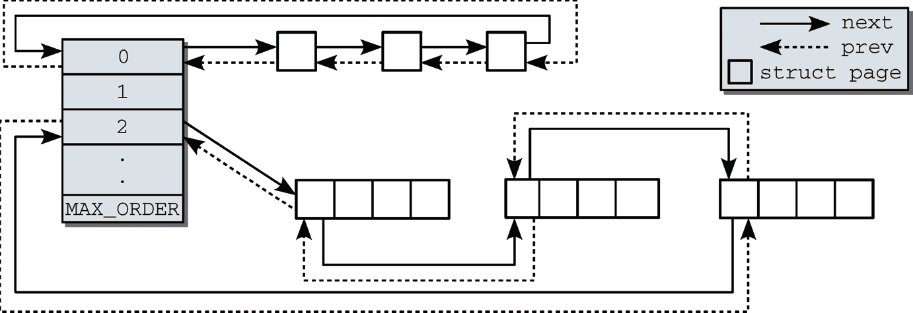

伙伴不必是彼此连接的. 如果**一个内存区**在分配**其间分解为两半**,内核会**自动将未用的一半**加入到**对应的链表**中.

由于内存释放的缘故,**两个内存区都处于空闲状态**,可通过**其地址判断其是否为伙伴**.管理工作较少, 是伙伴系统的一个主要优点.

基于**伙伴系统**的内存管理**专注于某个结点的某个内存域(！！！某个节点的某个内存域！！！**), **但所有内存域和结点的伙伴系统**都通过**备用分配列表**连接起来.

伙伴系统和内存域／结点之间的关系:

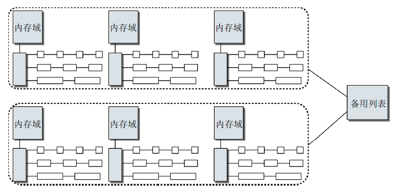

最后要注意, 有关**伙伴系统**和**当前状态的信息**可以在/**proc/buddyinfo**中获取

x86_64 的 16GB 系统:

```
[root@tsinghua-pcm ~]# cat /proc/buddyinfo
Node 0, zone      DMA      0      0      0      0      2      1      1      0      1      1      3
Node 0, zone    DMA32      1      1      1      3      4      3      3      5      0      2    745
Node 0, zone   Normal    166    157    202    437    122    187     77     60     60      8   2003
```

#### 11.2.1.4. 传统伙伴系统算法

在**内核分配内存**时,必须记录**页帧的已分配或空闲状态**,以免**两个进程使用同样的内存区域**.由于内存分配和释放非常频繁, 内核还必须保证相关操作尽快完成.内核可以**只分配完整的页帧**.将内存划分为更小的部分的工作, 则委托给**用户空间中的标准库**.标准库将来源于内核的**页帧拆分为小的区域**,并为进程分配内存.

内核中很多时候**要求分配连续页**. 为快速检测内存中的连续区域, 内核采用了一种古老而历经检验的技术: **伙伴系统**

系统中的**空闲内存块(！！！空闲的块**)总是**两两分组**,每组中的**两个内存块称作伙伴**.伙伴的分配可以是彼此独立的. 但如果**两个伙伴都是空闲的**,内核会将其**合并为一个更大的内存块**,作为**下一层次上某个内存块的伙伴**.

如果下一个请求**只需要 2 个连续页帧**,则由**8 页组成的块**会分裂成**2 个伙伴**,每个包含**4 个页帧**.其中**一块放置回伙伴列表**中, 而**另一个**再次分裂成**2 个伙伴**,每个包含**2 页**. 其中**一个回到伙伴系统**, 另一个则**传递给应用程序(分配时候会从伙伴系统去掉！！！**).

在应用程序**释放内存**时,内核可以**直接检查地址**,来判断**是否能够创建一组伙伴**,并合并为一个更大的内存块放回到伙伴列表中,这刚好是**内存块分裂的逆过程(释放内存可能会将内存块放回伙伴列表！！！**). 这提高了较大内存块可用的可能性.

长期运行会导致碎片化问题

### 11.2.2. 伙伴算法释放过程

伙伴管理算法的释放过程是, 满足条件的**两个页面块**称之为**伙伴**: **两个页面块的大小相同(！！！**)且**两者的物理地址连续(！！！**). 当**某块页面被释放**时, 且其**存在空闲的伙伴页面块**, 则算法会将其两者**合并为一个大的页面块**, 合并后的页面块如果**还可以找到伙伴页面块**, 则将会继续**与相邻的块进行合并**, 直至到大小为 2^MAX_ORDER 个页面为止.

### 11.2.3. 伙伴算法申请过程

伙伴管理算法的申请过程则相反, 如果**申请指定大小的页面**在其**页面块链表中不存在**, 则会**往高阶的页面块链表进行查找**, 如果依旧没找到, 则继续往高阶进行查找, **直到找到**为止, 否则就是**申请失败**了. 如果在**高阶的页面块链表**找到**空闲的页面块**, 则会将其**拆分为两块**, 如果**拆分后仍比需要的大**, 那么**继续拆分**, 直至到**大小刚好**为止, 这样避免了资源浪费.

### 11.2.4. 碎片化问题

在存储管理中

- **内碎片**是指**分配给作业的存储空间**中**未被利用**的部分
- **外碎片**是指系统中无法利用的小存储块.

Linux 伙伴系统**分配内存**的大小要求**2 的幂指数页**, 这也会产生严重的**内部碎片**.

**伙伴系统**中存的都是**空闲内存块**. 系统长期运行后, 会发生称为**碎片的内存管理问题**. **频繁的分配和释放页帧**可能导致一种情况: 系统中有**若干页帧是空闲**的, 但却**散布在物理地址空间的各处**. 换句话说, 系统中**缺乏连续页帧组成的较大的内存块**.

暂且假设内存页面数为 60, 则长期运行后, 其页面的使用情况可能将会如下图(灰色为已分配).

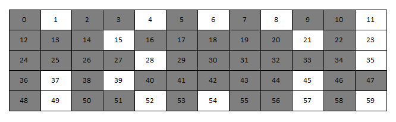

虽然其未被分配的页面仍有 25%, 但能够申请到的最大页面仅为一页.

不过这对**用户空间**是没有影响的, 主要是由于用户态的内存是通过页面映射而得到的. 所以不在乎具体的物理页面分布, 其仍是可以将其映射为连续的一块内存提供给用户态程序使用. 于是用户态可以感知的内存则如下.

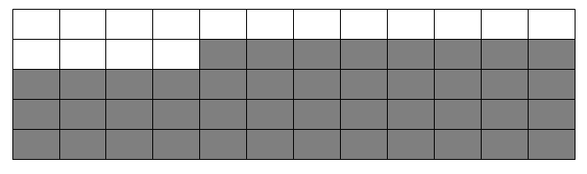

但是对于**内核态**, 碎片则是个严肃的问题, 因为**大部分物理内存**都**直接映射到内核的永久映射区**里面. 如果真的存在碎片, 将真的如第一张图所示, 无法映射到比一页更大的内存, 这长期是 linux 的短板之一. 于是为了解决该问题, 则引入了反碎片.

目前 Linux 内核为**解决内存碎片**的方案提供了两类解决方案

- 依据**可移动性组织页**避免内存碎片

- **虚拟可移动内存域**避免内存碎片

#### 11.2.4.1. 依据可移动性组织页(页面迁移)

**文件系统也有碎片**, 该领域的碎片问题主要通过**碎片合并工具**解决. 它们分析文件系统, **重新排序已分配存储块**, 从而建立较大的连续存储区.理论上, 该方法对物理内存也是可能的, 但由于**许多物理内存页不能移动到任意位置**, 阻碍了该方法的实施.

因此, 内核的方法是**反碎片(anti-fragmentation**), 即试图**从最初开始尽可能防止碎片(！！！**).

##### 11.2.4.1.1. 反碎片的工作原理

内核将**已分配页**划分为下面 3 种不同类型.

| 页面类型 | 描述 | 举例 |
|:---------:|:-----|:-----|
| **不可移动页** | 在内存中有**固定位置**, **不能移动**到其他地方. | 核心**内核**分配的**大多数内存**属于该类别 |
| **可移动页** | **可以随意地移动**. | 属于**用户空间应用程序的页**属于该类别. 它们是通过页表映射的<br>如果它们复制到新位置, **页表项可以相应地更新**, 应用程序不会注意到任何事 |
| **可回收页** | **不能直接移动, 但可以删除, 其内容可以从某些源重新生成**. | 例如, **映射自文件的数据**属于该类别<br>**kswapd 守护进程**会根据可回收页访问的**频繁程度**, 周期性释放此类内存.页面回收本身就是一个复杂的过程.内核会在可回收页占据了太多内存时进行回收,在内存短缺(即分配失败)时也可以发起页面回收. |

页的可移动性, 依赖该页属于 3 种类别的哪一种.内核使用的**反碎片技术**,即基于将具有**相同可移动性的页**分组的思想.

为什么这种方法**有助于减少碎片**?

由于**页无法移动**, 导致在原本**几乎全空的内存区**中无法进行**连续分配**. 根据**页的可移动性**, 将其分配到**不同的列表**中, 即可防止这种情形. 例如, **不可移动的页**不能位于**可移动内存区**的中间, 否则就无法从该内存区分配较大的连续内存块.

但要注意, 从**最初开始**,内存**并未划分**为**可移动性不同的区**.这些是在**运行时形成(！！！**)的.

##### 11.2.4.1.2. 迁移类型

```cpp
enum {
        MIGRATE_UNMOVABLE,
        MIGRATE_MOVABLE,
        MIGRATE_RECLAIMABLE,
        MIGRATE_PCPTYPES,       /* the number of types on the pcp lists */
        MIGRATE_HIGHATOMIC = MIGRATE_PCPTYPES,
#ifdef CONFIG_CMA
        MIGRATE_CMA,
#endif
#ifdef CONFIG_MEMORY_ISOLATION
        MIGRATE_ISOLATE,        /* can't allocate from here */
#endif
        MIGRATE_TYPES
};
```

|  宏  | 类型 |
|:----:|:-----|
| MIGRATE_UNMOVABLE | 不可移动页. 在内存当中有固定的位置, 不能移动. 内核的核心分配的内存大多属于这种类型;  |
| MIGRATE_MOVABLE | 可移动页. 可以随意移动, 用户空间应用程序所用到的页属于该类别. 它们通过页表来映射, 如果他们复制到新的位置, 页表项也会相应的更新, 应用程序不会注意到任何改变;  |
| MIGRATE_RECLAIMABLE | 可回收页. 不能直接移动, 但可以删除, 其内容页可以从其他地方重新生成, 例如, 映射自文件的数据属于这种类型, 针对这种页, 内核有专门的页面回收处理;  |
| MIGRATE_PCPTYPES | 是 per_cpu_pageset,即用来表示**每 CPU 页框高速缓存**的数据结构中的链表的迁移类型数目 |
| MIGRATE_HIGHATOMIC |  =MIGRATE_PCPTYPES,在罕见的情况下, 内核需要分配一个高阶的页面块而不能休眠.如果向具有特定可移动性的列表请求分配内存失败, 这种紧急情况下可从 MIGRATE_HIGHATOMIC 中分配内存 |
| MIGRATE_CMA | Linux 内核最新的**连续内存分配器**(CMA), 用于**避免预留大块内存**. 连续内存分配, 用于避免预留大块内存导致系统可用内存减少而实现的, 即当驱动不使用内存时, 将其分配给用户使用, 而需要时则通过回收或者迁移的方式将内存腾出来.  |
| MIGRATE_ISOLATE | 是一个特殊的虚拟区域,用于**跨越 NUMA 结点移动物理内存页**.在大型系统上,它有益于将**物理内存页**移动到接近于**使用该页最频繁的 CPU**. |
| MIGRATE_TYPES | 只是表示迁移类型的数目, 也不代表具体的区域 |

对于 MIGRATE_CMA 类型, 需要**预留大量连续内存**, 这部分内存**平时不用**, 但是一般的做法又必须**先预留着**. CMA 机制可以做到**不预留内存**, 这些内存**平时是可用的**, 只有当**需要的时候才被分配**

##### 11.2.4.1.3. 可移动性组织页的 buddy 组织

至于**迁移类型的页面管理**实际上采用的还是**伙伴管理算法的管理方式**, 内存管理区 zone 的结构里面的 free_area 是用于管理各阶内存页面, 而其里面的**free_list 则是对各迁移类型进行区分的链表**.

```c
struct zone
{
	 /* free areas of different sizes */
	struct free_area        free_area[MAX_ORDER];
};

struct free_area {
	struct list_head        free_list[MIGRATE_TYPES];
    unsigned long           nr_free;
};
```

**每个 zone**有一个**MAX_ORDER(11)大小的数组**, **每个数组项**是**一个数据结构**, 数据结构由**一个空闲页面块链表(每种迁移类型一个**)和**整型数**构成, **链表项**是**连续内存区**, 这个**整型数**表明了这个**链表项数目(空闲块的数目**).

**每种迁移类型**都对应一个**空闲列表**, 内存框图如下

依据可移动性组织页:


宏 for_each_migratetype_order(order, type)可用于**迭代指定迁移类型的所有分配阶**

```cpp
#define for_each_migratetype_order(order, type)
        for (order = 0; order < MAX_ORDER; order++)
                for (type = 0; type < MIGRATE_TYPES; type++)
```

##### 11.2.4.1.4. 迁移备用列表 fallbacks

内核无法满足针对某一**给定迁移类型**的**分配请求**, 会怎么样?

类似于 NUMA 的备用内存域列表 zonelists. 内存迁移提供了备用列表 fallbacks.

```cpp
// [mm/page_alloc.c]
/*
 * This array describes the order lists are fallen back to when
 * the free lists for the desirable migrate type are depleted
 * 该数组描述了指定迁移类型的空闲列表耗尽时
 * 其他空闲列表在备用列表中的次序
 */
static int fallbacks[MIGRATE_TYPES][4] = {
	//  分配不可移动页失败的备用列表
    [MIGRATE_UNMOVABLE]   = { MIGRATE_RECLAIMABLE, MIGRATE_MOVABLE,   MIGRATE_TYPES },
    //  分配可回收页失败时的备用列表
    [MIGRATE_RECLAIMABLE] = { MIGRATE_UNMOVABLE,   MIGRATE_MOVABLE,   MIGRATE_TYPES },
    //  分配可移动页失败时的备用列表
    [MIGRATE_MOVABLE]     = { MIGRATE_RECLAIMABLE, MIGRATE_UNMOVABLE, MIGRATE_TYPES },
#ifdef CONFIG_CMA
    [MIGRATE_CMA]     = { MIGRATE_TYPES }, /* Never used */
#endif
#ifdef CONFIG_MEMORY_ISOLATION
    [MIGRATE_ISOLATE]     = { MIGRATE_TYPES }, /* Never used */
#endif
};
```

##### 11.2.4.1.5. 全局 pageblock_order 变量

**页可移动性分组特性**的**全局变量**和**辅助函数**总是**编译到内核**中, 但只有在系统中**有足够内存可以分配到多个迁移类型对应的链表(！！！**)时, 才是有意义的.

**每个迁移链表(！！！**)都应该有**适当数量的内存(！！！**), 这是通过两个全局变量**pageblock_order**和**pageblock_nr_pages**提供的.

pageblock_order 是一个**大**的分配阶, **pageblock_nr_pages**则表示**该分配阶对应的页数**. 如果体系结构提供了**巨型页机制**,则**pageblock_order**通常定义为**巨型页对应的分配阶**.

```cpp
#ifdef CONFIG_HUGETLB_PAGE

    #ifdef CONFIG_HUGETLB_PAGE_SIZE_VARIABLE

        /* Huge page sizes are variable */
        extern unsigned int pageblock_order;

    #else /* CONFIG_HUGETLB_PAGE_SIZE_VARIABLE */

    /* Huge pages are a constant size */
        #define pageblock_order         HUGETLB_PAGE_ORDER

    #endif /* CONFIG_HUGETLB_PAGE_SIZE_VARIABLE */

#else /* CONFIG_HUGETLB_PAGE */

    /* If huge pages are not used, group by MAX_ORDER_NR_PAGES */
    #define pageblock_order         (MAX_ORDER-1)

#endif /* CONFIG_HUGETLB_PAGE */

#define pageblock_nr_pages      (1UL << pageblock_order)
```

如果体系结构**不支持巨型页**, 则将其定义为**第二高的分配阶**, 即 MAX_ORDER - 1

如果**各迁移类型的链表**中**没有**一块**较大的连续内存**, 那么**页面迁移不会提供任何好处**, 因此在**可用内存太少时内核会关闭该特性**. 这是在**build_all_zonelists**函数中检查的, 该函数用于初始化内存域列表.如果**没有足够的内存可用**, 则**全局变量**[**page_group_by_mobility_disabled**]设置为**0**, 否则设置为 1.

内核如何知道**给定的分配内存**属于**何种迁移类型**? 有关**各个内存分配的细节**都通过**分配掩码指定**.

内核提供了两个标志, 分别用于表示分配的内存是**可移动**的(**__GFP_MOVABLE**)或**可回收**的(**__GFP_RECLAIMABLE**).

##### 11.2.4.1.6. gfpflags_to_migratetype 转换分配标识到迁移类型

如果标志**都没有设置**,则**分配的内存假定为不可移动的**.

gfpflags_to_migratetype 函数可用于**转换分配标志及对应的迁移类型**.

```cpp
static inline int gfpflags_to_migratetype(const gfp_t gfp_flags)
{
    VM_WARN_ON((gfp_flags & GFP_MOVABLE_MASK) == GFP_MOVABLE_MASK);
    BUILD_BUG_ON((1UL << GFP_MOVABLE_SHIFT) != ___GFP_MOVABLE);
    BUILD_BUG_ON((___GFP_MOVABLE >> GFP_MOVABLE_SHIFT) != MIGRATE_MOVABLE);

    if (unlikely(page_group_by_mobility_disabled))
        return MIGRATE_UNMOVABLE;

    /* Group based on mobility */
    return (gfp_flags & GFP_MOVABLE_MASK) >> GFP_MOVABLE_SHIFT;
}
```

如果**停用了页面迁移**特性,则**所有的页都是不可移动**的.否则.该函数的**返回值**可以直接用作 free_area.free_list 的**数组索引**.

##### 11.2.4.1.7. 内存域 zone 提供跟踪内存区的属性

**每个内存域**都提供了一个特殊的字段,可以**跟踪包含 pageblock_nr_pages 个页的内存区的属性**. 即`zone->pageblock_flags`字段, 当前只有与**页可移动性相关**的代码使用

在**初始化期间**, 内核自动确保对**内存域中**的**每个不同的迁移类型分组**, 在**pageblock_flags**中都分配了足**够存储 NR_PAGEBLOCK_BITS 个比特位**的空间. 当前, 表示**一个连续内存区的迁移类型需要 3 个比特位**

```cpp
enum pageblock_bits {
    PB_migrate,
    PB_migrate_end = PB_migrate + 3 - 1,
            /* 3 bits required for migrate types */
    PB_migrate_skip,/* If set the block is skipped by compaction */
    NR_PAGEBLOCK_BITS
};
```

内核提供**set_pageblock_migratetype**负责设置**以 page 为首的一个内存区的迁移类型**

```cpp
void set_pageblock_migratetype(struct page *page, int migratetype)
{
    if (unlikely(page_group_by_mobility_disabled &&
             migratetype < MIGRATE_PCPTYPES))
        migratetype = MIGRATE_UNMOVABLE;

    set_pageblock_flags_group(page, (unsigned long)migratetype,
                    PB_migrate, PB_migrate_end);
}
```

**migratetype 参数**可以通过上文介绍的**gfpflags_to_migratetype 辅助函数构建**. 请注意很重要的一点, **页的迁移类型**是**预先分配**好的,对应的比特位总是可用,与**页是否由伙伴系统管理无关**.

在**释放内存**时, 页必须返回到**正确的迁移链表**. 这之所以可行, 是因为能够从**get_pageblock_migratetype**获得所需的信息.

```cpp
#define get_pageblock_migratetype(page)
        get_pfnblock_flags_mask(page, page_to_pfn(page),
                        PB_migrate_end, MIGRATETYPE_MASK)
```

##### 11.2.4.1.8. /proc/pagetypeinfo 获取页面分配状态

当前的页面分配状态可以从/proc/pagetypeinfo 获取

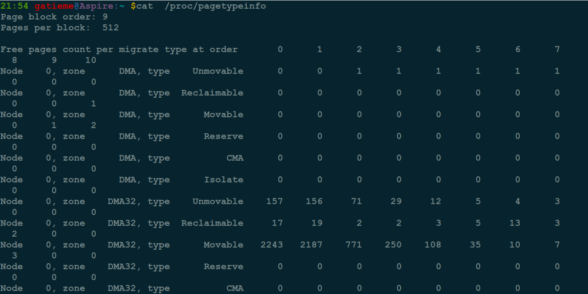

##### 11.2.4.1.9. 可移动性的分组的初始化

在内存子系统初始化期间, **memmap_init_zone**负责处理**内存域的 page 实例**. 其中会将**所有的页**最初都标记为**可移动**的.

在**内核分配不可移动的内存区**时, 则必须"盗取".

**启动阶段**分配**可移动区**的情况较少, 那么从可移动分区分配内存区, 并将其从可移动列表转换到不可移动列表.

这样避免了**启动期间内核分配的内存**(经常系统**整个运行期间不释放**)散布到物理内存各处, 从而使其他类型的内存分配免受碎片干扰.

#### 11.2.4.2. 虚拟可移动内存域

防止物理内存碎片的另一个方法: **虚拟内存域 ZONE_MOVABLE**.

这比可移动性分组更早加入内核. 与可移动性分组相反, ZONE_MOVABLE 特性**必须由管理员显式激活**.

基本思想很简单: **可用的物理内存**划分为**两个内存域**,一个用于**可移动分配**,一个用于**不可移动分配**.这会自动防止不可移动页向可移动内存域引入碎片.

**内核如何在两个竞争的内存域之间分配可用的内存**? 这个问题没办法解决, 所以系统管理员需要抉择.

##### 11.2.4.2.1. 数据结构

**kernelcore 参数**用来指定用于**不可移动分配的内存数量**,即用于**既不能回收也不能迁移**的内存数量. **剩余的内存用于可移动分配**. 在分析该参数之后, 结果保存在**全局变量 required_kernelcore**中.

还可以使用参数**movablecore**控制用于**可移动内存分配的内存数量**. **required_kernelcore**的大小将会据此计算.

同时指定, 分别计算出来 required_kernelcore 然后取较大值.

都没有指定, 则该机制无效

```cpp
static unsigned long __initdata required_kernelcore;
static unsigned long __initdata required_movablecore;
```

取决于**体系结构和内核配置**, **ZONE_MOVABLE 内存域**可能位于**高端或普通内存域**, 见

```cpp
enum zone_type {
#ifdef CONFIG_ZONE_DMA
    ZONE_DMA,
#endif
#ifdef CONFIG_ZONE_DMA32
    ZONE_DMA32,
#endif
    ZONE_NORMAL,
#ifdef CONFIG_HIGHMEM
    ZONE_HIGHMEM,
#endif
    ZONE_MOVABLE,
#ifdef CONFIG_ZONE_DEVICE
    ZONE_DEVICE,
#endif
    __MAX_NR_ZONES
};
```

**ZONE_MOVABLE**并**不关联到任何硬件**上**有意义的内存范围**. 该**内存域中的内存**取自**高端内存域**或**普通内存域**, 因此我们在下文中称 ZONE_MOVABLE 是一个虚拟内存域.

辅助函数[**find_zone_movable_pfns_for_nodes**]用于**计算进入 ZONE_MOVABLE 的内存数量**.

**从物理内存域**提取多少内存用于**ZONE_MOVABLE**, 必须考虑下面两种情况

- 用于**不可移动分配的内存**会平均地分布到**所有内存结点**上

- **只使用来自最高内存域的内存(！！！**). 在内存较多的**32 位系统**上,这**通常会是 ZONE_HIGHMEM**,但是对于**64 位系统**, 将使用**ZONE_NORMAL 或 ZONE_DMA32**.

计算过程很复杂, 结果是

- 用于为虚拟内存域 ZONE_MOVABLE 提取内存页的**物理内存域(先提取内存域**), 保存在全局变量**movable_zone**中

- 对**每个结点**来说, zone_movable_pfn[node_id]表示 ZONE_MOVABLE 在**movable_zone 内存域**中所取得**内存的起始地址**.

##### 11.2.4.2.2. 实现与应用

类似于页面迁移方法, 分配标志在此扮演了关键角色. 目前只要知道**所有可移动分配**都必须指定__GFP_HIGHMEM 和__GFP_MOVABLE 即可.

由于内核依据分配标志确定进行内存分配的内存域,在**设置了上述的标志**时,可以选择**ZONE_MOVABLE 内存域**.

## 11.3. 分配掩码(gfp_mask 标志)

Linux 将内存划分为内存域.内核提供了所谓的**内存域修饰符(zone modifier**)(在**掩码的最低 4 个比特位定义**),来指定从**哪个内存域分配所需的页**.

内核使用宏的方式定义了这些掩码,一个掩码的定义被划分为 3 个部分进行定义, 共计 26 个掩码信息, 因此后面__GFP_BITS_SHIFT =  26.

### 11.3.1. 掩码分类

Linux 中这些**掩码标志 gfp_mask**分为 3 种类型 :

| 类型 | 描述 |
|:-----:|:-----|
| **区描述符(zone modifier**) | 内核把物理内存分为多个区,每个区用于不同的目的,区描述符指明到底从这些区中的**哪一区进行分配** |
| **行为修饰符(action modifier**) | 表示内核应该**如何分配所需的内存**.在某些特定情况下,只能使用某些特定的方法分配内存 |
| 类型标志 | **组合**了**行为修饰符**和**区描述符**,将这些可能用到的组合归纳为**不同类型** |

### 11.3.2. 内核中掩码的定义

#### 11.3.2.1. 内核中的定义方式

```cpp
//  include/linux/gfp.h

/*  line 12 ~ line 44  第一部分
 *  定义可掩码所在位的信息, 每个掩码对应一位为 1
 *  定义形式为  #define	___GFP_XXX		0x01u
 */
/* Plain integer GFP bitmasks. Do not use this directly. */
#define ___GFP_DMA              0x01u
#define ___GFP_HIGHMEM          0x02u
#define ___GFP_DMA32            0x04u
#define ___GFP_MOVABLE          0x08u
/*  ......  */

/*  line 46 ~ line 192  第二部分
 *  定义掩码和 MASK 信息, 第二部分的某些宏可能是第一部分一个或者几个的组合
 *  定义形式为  #define	__GFP_XXX		 ((__force gfp_t)___GFP_XXX)
 */
#define __GFP_DMA       ((__force gfp_t)___GFP_DMA)
#define __GFP_HIGHMEM   ((__force gfp_t)___GFP_HIGHMEM)
#define __GFP_DMA32     ((__force gfp_t)___GFP_DMA32)
#define __GFP_MOVABLE   ((__force gfp_t)___GFP_MOVABLE)  /* ZONE_MOVABLE allowed */
#define GFP_ZONEMASK    (__GFP_DMA|__GFP_HIGHMEM|__GFP_DMA32|__GFP_MOVABLE)

/*  line 194 ~ line 260  第三部分
 *  定义掩码
 *  定义形式为  #define	GFP_XXX		 __GFP_XXX
 */
#define GFP_DMA         __GFP_DMA
#define GFP_DMA32       __GFP_DMA32
```

其中**GFP**缩写的意思为**获取空闲页(get free page**), __GFP_MOVABLE 不表示物理内存域, 但通知内核应在特殊的虚拟内存域 ZONE_MOVABLE 进行相应的分配.

#### 11.3.2.2. 定义掩码位

看第一部分, 一共**26 个掩码信息**

```cpp
/* Plain integer GFP bitmasks. Do not use this directly. */
//  区域修饰符
#define ___GFP_DMA              0x01u
#define ___GFP_HIGHMEM          0x02u
#define ___GFP_DMA32            0x04u

//  行为修饰符
#define ___GFP_MOVABLE          0x08u	    /* 页是可移动的 */
#define ___GFP_RECLAIMABLE      0x10u	    /* 页是可回收的 */
#define ___GFP_HIGH             0x20u		/* 应该访问紧急分配池? */
#define ___GFP_IO               0x40u		/* 可以启动物理 IO? */
#define ___GFP_FS               0x80u		/* 可以调用底层文件系统? */
#define ___GFP_COLD             0x100u	   /* 需要非缓存的冷页 */
#define ___GFP_NOWARN           0x200u	   /* 禁止分配失败警告 */
#define ___GFP_REPEAT           0x400u	   /* 重试分配, 可能失败 */
#define ___GFP_NOFAIL           0x800u	   /* 一直重试, 不会失败 */
#define ___GFP_NORETRY          0x1000u	  /* 不重试, 可能失败 */
#define ___GFP_MEMALLOC         0x2000u  	/* 使用紧急分配链表 */
#define ___GFP_COMP             0x4000u	  /* 增加复合页元数据 */
#define ___GFP_ZERO             0x8000u	  /* 成功则返回填充字节 0 的页 */
//  类型修饰符
#define ___GFP_NOMEMALLOC       0x10000u	 /* 不使用紧急分配链表 */
#define ___GFP_HARDWALL         0x20000u	 /* 只允许在进程允许运行的 CPU 所关联的结点分配内存 */
#define ___GFP_THISNODE         0x40000u	 /* 没有备用结点, 没有策略 */
#define ___GFP_ATOMIC           0x80000u 	/* 用于原子分配, 在任何情况下都不能中断  */
#define ___GFP_ACCOUNT          0x100000u
#define ___GFP_NOTRACK          0x200000u
#define ___GFP_DIRECT_RECLAIM   0x400000u
#define ___GFP_OTHER_NODE       0x800000u
#define ___GFP_WRITE            0x1000000u
#define ___GFP_KSWAPD_RECLAIM   0x2000000u
```

#### 11.3.2.3. 定义掩码位

..............

## 11.4. alloc_pages 分配内存空间

总结:

1. `get_page_from_freelist`: 遍历内存域(会涉及到**备用内存域**),

* 申请的内存页面处于伙伴算法中的 0 阶, 即只申请一个内存页面, 则首先尝试从冷热页中申请, 申请失败继而调用`rmqueue_bulk()`申请页面至冷热页管理列表(也就是申请一个页面并将其加入冷热页管理列表)中, 继而再从冷热页列表(**以 zone 为单位**存在的)中获取;
* 大于 0 阶则调用`__rmqueue()`从伙伴系统分配, 根据**迁移类型**(默认**可移动类型**), 从**相应阶 order 链表**中获取空闲页, 如果相应阶没有, 向更高阶的链表查找, 直到链表不为空, 如果能找到则调用 list_del()从链表摘除而获取空闲页面, 然后通过`expand()`将其**对等拆分开**, 并将拆分出来的一半空闲部分挂接至低一阶的链表中, 否则失败; 从**备用迁移列表**获取内存, 备用迁移列表是从最高阶开始查找; 还是失败的话, __alloc_pages_slowpath(), 用于慢速页面分配

2. 慢速页面分配, 调用者**是否禁止唤醒 kswapd 线程**(每个 node 有一个), 若**不禁止**则**唤醒线程**进行**内存回收**工作, 再走上面 get_page_from_freelist 流程, 分配到则退出;

3. 如果设置了`ALLOC_NO_WATERMARKS`标识, 则将**忽略 watermark**, __GFP_NOFAIL 则循环调用 get_page_from_freelist()

4. 上面也没有获取, 若设置了__GFP_WAIT 标识, 表示**内存分配运行休眠**, 否则直接以分配内存失败而退出.

5. 调用`__alloc_pages_direct_compact()`和`__alloc_pages_direct_reclaim()`尝试**回收内存**并尝试分配

6. 调用`__alloc_pages_may_oom()`触发**OOM killer 机制**. 遍历所有进程, 计算进程的 RSS、页表以及 SWAP 空间的使用量占 RAM 的比重, 将分值最高的返回.

7. 遍历该进程的子进程信息, 如果某个子进程拥有不同的 mm 且合适被 kill 掉, 将会优先考虑将该子进程替代父进程 kill 掉, 通过 for_each_process()查找与当前被 kill 进程使用到了同样的共享内存的进程进行一起 kill 掉, kill 之前将对应的进程添加标识`TIF_MEMDIE`, 而 kill 的动作则是通过发送 SICKILL 信号给对应进程, 被 kill 进程从内核态返回用户态时进行处理.

前面只是大概描述了伙伴系统分配页面过程, 下面详细看

伙伴管理算法内存申请和释放的入口一样, 其实并没有很清楚的界限表示这个函数是入口, 而那个不是. 所有函数有一个共同点: **只能分配 2 的整数幂个连续的页**.


所有函数最终会统一到 alloc_pages()宏定义入口, 另外所有体系结构都必须实现 clear_page, 可帮助 alloc_pages 对页填充字节 0

```cpp
// [include/linux/gfp.h]
#define alloc_pages(gfp_mask, order)
        alloc_pages_node(numa_node_id(), gfp_mask, order)
```

```cpp
// [/include/linux/gfp.h]
static inline struct page *alloc_pages_node(int nid, gfp_t gfp_mask,
                        unsigned int order)
{
    /* Unknown node is current node */
    if (nid < 0)
        nid = numa_node_id();

    return __alloc_pages(gfp_mask, order, node_zonelist(nid, gfp_mask));
}

static inline struct zonelist *node_zonelist(int nid, gfp_t flags)
{
	return NODE_DATA(nid)->node_zonelists + gfp_zonelist(flags);
}

static inline int gfp_zonelist(gfp_t flags)
{
#ifdef CONFIG_NUMA
	if (unlikely(flags & __GFP_THISNODE))
		return ZONELIST_NOFALLBACK;
#endif
	return ZONELIST_FALLBACK;
}
```

**没有**明确内存申请的**node 节点**时, 则**默认**会选择**当前的 node**节点作为申请节点.

调用__**alloc_pages**()来申请具体内存, 其中**入参 node_zonelist**()是用于获取**node 节点的 zone 管理区列表(备用节点列表**).

```c
[/include/linux/gfp.h]
static inline struct page *
__alloc_pages(gfp_t gfp_mask, unsigned int order,
        struct zonelist *zonelist)
{
    return __alloc_pages_nodemask(gfp_mask, order, zonelist, NULL);
}
```

内核源代码将__**alloc_pages_nodemask**称之为"伙伴系统的心脏", 因为它处理的是**实质性的内存分配**.

我们先转向页面选择是如何工作的

### 11.4.1. 页面选择

#### 11.4.1.1. 内存水位标志

```c
enum zone_watermarks {
        WMARK_MIN,
        WMARK_LOW,
        WMARK_HIGH,
        NR_WMARK
};

#define min_wmark_pages(z) (z->watermark[WMARK_MIN])
#define low_wmark_pages(z) (z->watermark[WMARK_LOW])
#define high_wmark_pages(z) (z->watermark[WMARK_HIGH])
```

内核需要定义一些**函数使用**的**标志**, 用于控制到达**各个水位**指定的临界状态时的**行为**, 这些标志用宏来定义

```c
/* The ALLOC_WMARK bits are used as an index to zone->watermark */
#define ALLOC_WMARK_MIN         WMARK_MIN	/*  1 = 0x01, 使用 pages_min 水印  */
#define ALLOC_WMARK_LOW         WMARK_LOW	/*  2 = 0x02, 使用 pages_low 水印  */
#define ALLOC_WMARK_HIGH        WMARK_HIGH   /*  3 = 0x03, 使用 pages_high 水印  */
#define ALLOC_NO_WATERMARKS     0x04 /* don't check watermarks at all  完全不检查水印 */

/* Mask to get the watermark bits */
#define ALLOC_WMARK_MASK        (ALLOC_NO_WATERMARKS-1)

#define ALLOC_HARDER            0x10 /* try to alloc harder, 试图更努力地分配, 即放宽限制  */
#define ALLOC_HIGH              0x20 /* __GFP_HIGH set, 设置了__GFP_HIGH */
#define ALLOC_CPUSET            0x40 /* check for correct cpuset, 检查内存结点是否对应着指定的 CPU 集合 */
#define ALLOC_CMA               0x80 /* allow allocations from CMA areas */
#define ALLOC_FAIR              0x100 /* fair zone allocation */
```

前几个标志(**ALLOC_WMARK_MIN**, ALLOC_WMARK_**LOW**, ALLOC_WMARK_**HIGH**, ALLOC_**NO**_WATERMARKS)表示在**判断页是否可分配时**, 需要考虑**哪些水印**. **默认**情况下(即没有因其他因素带来的压力而需要更多的内存), 只有**内存域包含页的数目**至少为**zone->pages_high**时, **才能分配页**.这对应于 ALLOC_WMARK_**HIGH**标志. 如果要使用较低(zone->pages_**low**)或最低(zone->pages_**min**)设置, 则必须**相应地设置**ALLOC_WMARK_MIN 或 ALLOC_WMARK_LOW. 而 ALLOC_**NO**_WATERMARKS 则通知内核在**进行内存分配**时**不要考虑内存水印**.

ALLOC_HARDER 通知伙伴系统在急需内存时**放宽分配规则**. 在分配高端内存域的内存时, ALLOC_HIGH 进一步放宽限制.

ALLOC_CPUSET 告知内核, 内存只能从当前进程允许运行的**CPU 相关联的内存结点分配**, 当然该选项**只对 NUMA 系统有意义**.

ALLOC_CMA 通知伙伴系统从**CMA 区域**中**分配内存**

最后, ALLOC_FAIR 则希望内核公平(均匀)的从内存域 zone 中进行内存分配

#### 11.4.1.2. zone_watermark_ok 函数检查标志

设置的标志在 zone_watermark_ok 函数中检查, 该函数根据**设置的标志**判断是否能从**给定的内存域(！！！**)中**分配内存**.

```c
bool zone_watermark_ok(struct zone *z, unsigned int order, unsigned long mark,
              int classzone_idx, unsigned int alloc_flags)
{
    return __zone_watermark_ok(z, order, mark, classzone_idx, alloc_flags,
                    zone_page_state(z, NR_FREE_PAGES));
}
```

- zone_page_state 访问每个内存域的统计量, 然后得到**空闲页的数目**

- 根据**标志**设置**最小值标记值**

- 检查**空闲页数目**是否小于等于**最小值**与`lowmem_reserve(zone->lowmem_reserve[zone]`. 这个是为**各种内存域指定的若干页**, 用于一些**无论如何不能失败的关键性内存访问**)中指定的**紧急分配值 min**之和, 是的话返回 false

- 如果**不小于**, 遍历所有**大于等于当前阶的分配阶**, 其中`z->free_area[阶数]->nr_free`是**当前分配阶**的**空闲块的数目**, `struct free_area *area = &z->free_area[阶数]`, **遍历**这个 area 的**MIGRATE_UNMOVABLE(不可移动页), MIGRATE_MOVABLE(可移动页), MIGRATE_RECLAIMABLE(可回收页**)看这**三个链表**是否为空, 都为空, 则不进行内存分配.

- 不符合要求返回 false

#### 11.4.1.3. get_page_from_freelist 实际分配

通过**标志集和分配阶来判断是否能进行分配**. 如果可以, 则发起**实际的分配操作**.

该函数随着不断演变, 支持的特性很多, 参数很复杂, 所以后面讲那些相关联的参数封装成一个结构

```c
static struct page *
get_page_from_freelist(gfp_t gfp_mask, unsigned int order, int alloc_flags, const struct alloc_context *ac)
```

这个结构是 struct alloc_context

```c
struct alloc_context {
        struct zonelist *zonelist;
        nodemask_t *nodemask;
        struct zoneref *preferred_zoneref;
        int migratetype;
        enum zone_type high_zoneidx;
        bool spread_dirty_pages;
};
```

| 字段 | 描述 |
|:-----:|:-----|
| zonelist | 当**perferred_zone**上**没有合适的页**可以分配时, 就要**按 zonelist 中的顺序**扫描该 zonelist 中**备用 zone 列表**, 一个个的**试用** |
| nodemask | 表示**节点的 mask**, 就是**是否能在该节点上分配内存**, 这是个**bit 位数组** |
| **preferred_zoneref** | 表示从**high_zoneidx**后找到的**合适的 zone**, 一般会从**该 zone 分配**; **分配失败**的话, 就会在**zonelist**再找一个**preferred_zone = 合适的 zone** |
| migratetype | **迁移类型**, 在**zone->free_area.free_list[XXX**] 作为**分配下标**使用, 这个是用来**反碎片化**的, 修改了以前的 free_area 结构体, 在该结构体中再添加了一个数组, 该数组以迁移类型为下标, 每个数组元素都挂了对应迁移类型的页链表 |
| **high_zoneidx** | 是表示该分配时, **所能分配的最高 zone**, 一般从 high-->normal-->dma 内存越来越昂贵, 所以一般从 high 到 dma 分配依次分配 |
| spread_dirty_pages | |

**zonelist 是指向备用列表的指针**. 在**预期内存域(！！！)没有空闲空间**的情况下, 该列表确定了**扫描系统其他内存域(和结点)的顺序**.

随后 for 循环**遍历备用列表的所有内存域(！！！**), 用最简单的方式查找**一个适当的空闲内存块**

- 首先, 解释 ALLOC_*标志(__cpuset_zone_allowed_softwall 是另一个辅助函数, 用于**检查给定内存域是否属于该进程允许运行的 CPU**).

- zone_watermark_ok 接下来**检查所遍历到的内存域是否有足够的空闲页**, 并**试图分配一个连续内存块**. 如果**两个条件之一**不能满足, 即或者**没有足够的空闲页**, 或者**没有连续内存块**可满足分配请求, 则循环进行到**备用列表中的下一个内存域**, 作同样的检查. 直到找到一个合适的页面, 去**try_this_zone(一个标记)进行内存分配**

- 如果**内存域适用于当前的分配请求**, 那么**buffered_rmqueue**试图从中**分配所需数目的页**

```c
static inline
struct page *buffered_rmqueue(struct zone *preferred_zone,
            struct zone *zone, int order, gfp_t gfp_flags,
            int migratetype)
```

**buffered_rmqueue**是真正的用于分配内存页面的函数

```c
	if (likely(order == 0)) {
		struct per_cpu_pages *pcp;
		struct list_head *list;

		local_irq_save(flags);
		do {
			pcp = &this_cpu_ptr(zone->pageset)->pcp;
			list = &pcp->lists[migratetype];
			if (list_empty(list)) {
				pcp->count += rmqueue_bulk(zone, 0,
						pcp->batch, list,
						migratetype, cold);
				if (unlikely(list_empty(list)))
					goto failed;
			}

			if (cold)
				page = list_last_entry(list, struct page, lru);
			else
				page = list_first_entry(list, struct page, lru);

			__dec_zone_state(zone, NR_ALLOC_BATCH);
			list_del(&page->lru);
			pcp->count--;

		} while (check_new_pcp(page));
	}
```

- 如果**申请的内存页面**处于伙伴算法中的**0 阶**, 即**只申请一个内存页面**, 则首先尝试从**冷热页**中**申请**, **申请失败**继而调用**rmqueue_bulk**()**申请页面**至**冷热页管理列表(也就是申请一个页面并将其加入冷热页管理列表**)中, 继而再从**冷热页列表中获取**; 如果申请**多个页面**则通过__rmqueue()直接从**伙伴管理**中申请.
- __rmqueue()直接从**伙伴管理**中申请

```c
[mm/page_alloc.c]
/*
 * Do the hard work of removing an element from the buddy allocator.
 * Call me with the zone->lock already held.
 */
static struct page *__rmqueue(struct zone *zone, unsigned int order,
                        int migratetype)
{
	struct page *page;

	page = __rmqueue_smallest(zone, order, migratetype);
	if (unlikely(!page)) {
		if (migratetype == MIGRATE_MOVABLE)
			page = __rmqueue_cma_fallback(zone, order);

		if (!page)
			page = __rmqueue_fallback(zone, order, migratetype);
	}

	trace_mm_page_alloc_zone_locked(page, order, migratetype);
	return page;
}

static inline
struct page *__rmqueue_smallest(struct zone *zone, unsigned int order,
						int migratetype)
{
	unsigned int current_order;
	struct free_area *area;
	struct page *page;

	/* Find a page of the appropriate size in the preferred list */
	for (current_order = order; current_order < MAX_ORDER; ++current_order) {
		area = &(zone->free_area[current_order]);
		page = list_first_entry_or_null(&area->free_list[migratetype],
							struct page, lru);
		if (!page)
			continue;
		list_del(&page->lru);
		rmv_page_order(page);
		area->nr_free--;
		expand(zone, page, order, current_order, area, migratetype);
		set_pcppage_migratetype(page, migratetype);
		return page;
	}

	return NULL;
}
```

- __rmqueue_smallest: 分配算法的核心功能. 从指定的 order 阶开始循环, 如果**该阶的链表不为空**, 则直接通过**list_del**()从**该链表**中**获取空闲页面**以满足申请需要; 如果**该阶的链表为空**, 则往**更高一阶的链表查找**, 直到找到链表不为空的一阶, 至于若找到了**最高阶仍为空链表**, 则**申请失败**; 否则将在找到**链表不为空的一阶**后, 将**空闲页面块通过 list_del**()从**链表中摘除**出来, 然后通过**expand**()将其**对等拆分开**, 并将**拆分出来的一半空闲**部分**挂接至低一阶的链表**中, 直到**拆分至恰好满足申请需要的 order 阶**, 最后将得到的满足要求的页面返回回去. 至此, 页面已经分配到了.
- __rmqueue_fallback: 其主要是向**其他迁移类型中获取内存**. 较正常的伙伴算法不同, 其向迁移类型的内存申请内存页面时, 是从**最高阶开始查找**的, 主要是从大块内存中申请可以避免更少的碎片.


### 11.4.2. 伙伴系统核心__alloc_pages_nodemask 实质性的内存分配

__alloc_pages_nodemask 是伙伴系统的心脏

```cpp
struct page *
__alloc_pages_nodemask(gfp_t gfp_mask, unsigned int order,
			struct zonelist *zonelist, nodemask_t *nodemask)
{
	struct page *page;
	unsigned int cpuset_mems_cookie;
	unsigned int alloc_flags = ALLOC_WMARK_LOW|ALLOC_FAIR;
	gfp_t alloc_mask = gfp_mask; /* The gfp_t that was actually used for allocation */
	struct alloc_context ac = {
		.high_zoneidx = gfp_zone(gfp_mask),
		.zonelist = zonelist,
		.nodemask = nodemask,
		.migratetype = gfpflags_to_migratetype(gfp_mask),
	};

	if (cpusets_enabled()) {
		alloc_mask |= __GFP_HARDWALL;
		alloc_flags |= ALLOC_CPUSET;
		if (!ac.nodemask)
			ac.nodemask = &cpuset_current_mems_allowed;
	}

	gfp_mask &= gfp_allowed_mask;

	lockdep_trace_alloc(gfp_mask);

	might_sleep_if(gfp_mask & __GFP_DIRECT_RECLAIM);

	if (should_fail_alloc_page(gfp_mask, order))
		return NULL;

	if (unlikely(!zonelist->_zonerefs->zone))
		return NULL;

	if (IS_ENABLED(CONFIG_CMA) && ac.migratetype == MIGRATE_MOVABLE)
		alloc_flags |= ALLOC_CMA;

retry_cpuset:
	cpuset_mems_cookie = read_mems_allowed_begin();

	/* Dirty zone balancing only done in the fast path */
	ac.spread_dirty_pages = (gfp_mask & __GFP_WRITE);

	ac.preferred_zoneref = first_zones_zonelist(ac.zonelist,
					ac.high_zoneidx, ac.nodemask);
	if (!ac.preferred_zoneref) {
		page = NULL;
		goto no_zone;
	}

	/* First allocation attempt */
	page = get_page_from_freelist(alloc_mask, order, alloc_flags, &ac);
	if (likely(page))
		goto out;

	alloc_mask = memalloc_noio_flags(gfp_mask);
	ac.spread_dirty_pages = false;

	if (cpusets_enabled())
		ac.nodemask = nodemask;
	page = __alloc_pages_slowpath(alloc_mask, order, &ac);

no_zone:
	if (unlikely(!page && read_mems_allowed_retry(cpuset_mems_cookie))) {
		alloc_mask = gfp_mask;
		goto retry_cpuset;
	}

out:
	if (kmemcheck_enabled && page)
		kmemcheck_pagealloc_alloc(page, order, gfp_mask);

	trace_mm_page_alloc(page, order, alloc_mask, ac.migratetype);

	return page;
}
EXPORT_SYMBOL(__alloc_pages_nodemask);
```

gfpflags_to_migratetype(gfp_mask)转换申请页面的类型为**迁移类型**.

如果申请页面传入的**gfp_mask 掩码**携带__GFP_DIRECT_RECLAIM 标识, 表示允许页面申请时休眠, 则会进入 might_sleep_if()检查是否需要休眠等待以及重新调度

if (unlikely(!zonelist->_zonerefs->zone))用于检查**当前申请页面的内存管理区 zone 是否为空**;

read_mems_allowed_begin()用于获得当前对被顺序计数保护的共享资源进行读访问的顺序号, 用于避免并发的情况下引起的失败

**first_zones_zonelist**()则是用于根据**nodemask**, 找到合适的**不大于 high_zoneidx**的**内存管理区 preferred_zone**;

最后分配内存页面的关键函数**get_page_from_freelist**()和__**alloc_pages_slowpath**()

**get_page_from_freelist**()最先尝试页面分配, 如果分配失败, 则进一步调用__**alloc_pages_slowpath**(), 用于**慢速页面分配**, 允许等待和内存回收. __**alloc_pages_slowpath**()涉及其他内存机制(**内存溢出保护机制 OOM**), 后续说明.

## 11.5. 释放内存空间

有 4 个函数用于释放不再使用的页, 与所述函数稍有不同

| 内存释放函数 | 描述 |
|:--------------|:-----|
| [free_page(struct page *)](http://lxr.free-electrons.com/source/include/linux/gfp.h?v=4.7#L520)<br>[free_pages(struct page *, order)](http://lxr.free-electrons.com/source/mm/page_alloc.c?v=4.7#L3918) | 用于将**一个**或**2^order**页返回给内存管理子系统. 内存区的**起始地址**由指向该内存区的**第一个 page 实例的指针表示** |
| [__free_page(addr)](http://lxr.free-electrons.com/source/include/linux/gfp.h?v=4.7#L519)<br>[__free_pages(addr, order)](http://lxr.free-electrons.com/source/mm/page_alloc.c?v=4.7#L3906) | 类似于前两个函数, 但在表示需要释放的内存区时, 使用了**虚拟内存地址**而不是 page 实例 |

free_pages 是通过__free_pages 来完成内存释放的

```c
void free_pages(unsigned long addr, unsigned int order)
{
    if (addr != 0) {
        VM_BUG_ON(!virt_addr_valid((void *)addr));
        __free_pages(virt_to_page((void *)addr), order);
    }
}
```

首先必须将虚拟地址转换为指向 struct page 的指针

virt_to_page 将虚拟内存地址转换为指向 page 实例的指针. 基本上, 这是讲解内存分配函数时介绍的 page_address 辅助函数的逆过程.

各个内存释放函数之间的关系


```cpp
void __free_pages(struct page *page, unsigned int order)
{
    if (put_page_testzero(page)) {
        if (order == 0)
            free_hot_cold_page(page, 0);
        else
            __free_pages_ok(page, order);
    }
}
```

__free_pages()函数会分两种情况, 对于 order 等于 0 的情况, 做特殊处理; 对于 order 大于 0 的情况, 属于正常处理流程.

put_page_testzero()是对 page 结构的_count 引用计数做**原子减及测试**, 用于**检查内存页面是否仍被使用**, 如果不再使用, 则进行释放.

其中**order**表示**页面数量**, 如果释放的是单页, 则会调用 free_hot_cold_page()将**页面释放**至**per-cpu page 缓存**中, 而**不是伙伴管理算法**; 真正的**释放至伙伴管理算法**的是__free_pages_ok(), 同时也是用于多个页面释放的情况.

### 11.5.1. free_hot_cold_page()释放至 per-cpu 缓存(冷热页)

检查页面是否允许释放

get_pfnblock_migratetype()和 set_freepage_migratetype()分别是获取和设置**页面的迁移类型**, 即设置到 page->index;

**local_irq_save**()和末尾的**local_irq_restore**()则用于**保存恢复中断请求标识**.

如果**某个页面类型大于 MIGRATE_PCPTYPES**则表示其可挂到**可移动列表**中, 如果**迁移类型**是**MIGRATE_ISOLATE**则直接将该其**释放到伙伴管理算法**中, 结束.

pcp = &this_cpu_ptr(zone->pageset)->pcp;得到内存管理区(zone)的 Per-CPU 管理结构(即冷热页), **冷页**就将其(&page->lru)挂接到**对应迁移类型**的**链表尾**, 而若是**热页**则挂接到**对应迁移类型的链表头**.

如果**Per-CPU 缓存的页面数目**超过了**Per-CPU 缓存的最大页面数水位 high**时, 则将**其批量释放至伙伴管理算法**中(**free_pcppages_bulk**(zone, batch, pcp);), 其中**批量数为 pcp->batch**.

#### 11.5.1.1. free_pcppages_bulk()释放至伙伴管理算法

```cpp
static void free_pcppages_bulk(struct zone *zone, int count,
					struct per_cpu_pages *pcp)
{
	int migratetype = 0;
	int batch_free = 0;
	unsigned long nr_scanned;
	bool isolated_pageblocks;

	spin_lock(&zone->lock);
	isolated_pageblocks = has_isolate_pageblock(zone);
	nr_scanned = zone_page_state(zone, NR_PAGES_SCANNED);
	if (nr_scanned)
		__mod_zone_page_state(zone, NR_PAGES_SCANNED, -nr_scanned);

	while (count) {
		struct page *page;
		struct list_head *list;

		/*
		 * Remove pages from lists in a round-robin fashion. A
		 * batch_free count is maintained that is incremented when an
		 * empty list is encountered.  This is so more pages are freed
		 * off fuller lists instead of spinning excessively around empty
		 * lists
		 */
		do {
			batch_free++;
			if (++migratetype == MIGRATE_PCPTYPES)
				migratetype = 0;
			list = &pcp->lists[migratetype];
		} while (list_empty(list));

		/* This is the only non-empty list. Free them all. */
		if (batch_free == MIGRATE_PCPTYPES)
			batch_free = count;

		do {
			int mt;	/* migratetype of the to-be-freed page */

			page = list_last_entry(list, struct page, lru);
			/* must delete as __free_one_page list manipulates */
			list_del(&page->lru);

			mt = get_pcppage_migratetype(page);
			/* MIGRATE_ISOLATE page should not go to pcplists */
			VM_BUG_ON_PAGE(is_migrate_isolate(mt), page);
			/* Pageblock could have been isolated meanwhile */
			if (unlikely(isolated_pageblocks))
				mt = get_pageblock_migratetype(page);

			if (bulkfree_pcp_prepare(page))
				continue;

			__free_one_page(page, page_to_pfn(page), zone, 0, mt);
			trace_mm_page_pcpu_drain(page, 0, mt);
		} while (--count && --batch_free && !list_empty(list));
	}
	spin_unlock(&zone->lock);
}
```

while 大循环用于计数释放**指定批量数**的**页面**. 其中释放方式是先自**MIGRATE_UNMOVABLE**迁移类型起(**止于 MIGRATE_PCPTYPES 迁移类型**), 遍历各个链表统计其链表中页面数

```c
        do {
            batch_free++;
            if (++migratetype == MIGRATE_PCPTYPES)
                migratetype = 0;
            list = &pcp->lists[migratetype];
        } while (list_empty(list));
```

如果**只有 MIGRATE_PCPTYPES 迁移类型**的链表**为非空链表**, 则**全部页面**将从**该链表中释放**.

后面的 do{}while()里面, 其先**将页面从 lru 链表中去除**, 然后**获取页面的迁移类型**, 通过__**free_one_page()释放页面**.

##### 11.5.1.1.1. __free_one_page()释放页面

对释放的页面进行检查校验操作.

while (order < MAX_ORDER-1)循环, 通过__find_buddy_index()获取**与当前释放的页面**处于**同一阶的伙伴页面索引值**, 同时藉此**索引值**计算出**伙伴页面地址**, 并做**伙伴页面检查**以确定其**是否可以合并**, 若否则退出; 接着 if (page_is_guard(buddy))用于对页面的 debug_flags 成员做检查, 由于未配置 CONFIG_DEBUG_PAGEALLOC, page_is_guard()固定返回 false; 则剩下的操作主要就是**将页面**从**分配链中摘除**, 同时**将页面合并**并**将其处于的阶提升一级**.

退出 while 循环后, 通过**set_page_order**()设置页面**最终可合并成为的管理阶**. 最后判断**当前合并的页面**是否为**最大阶**, **否则**将**页面**放至**伙伴管理链表的末尾**, **避免其过早被分配**, 得以机会进一步**与高阶页面进行合并**. 末了, 将最后的**挂入的阶的空闲计数加 1**.

至此伙伴管理算法的页面释放完毕.

### 11.5.2. __free_pages_ok 释放至伙伴管理算法

调用栈是:

```c
__free_pages_ok()

—>free_one_page()

—>__free_one_page()
```

殊途同归, 最终还是__free_one_page()来释放

# 12. 连续内存分配器(CMA)

CMA(**Contiguous Memory Allocator**, 连续内存分配器)是在内核 3.5 的版本引入, 由三星的工程师开发实现的, 用于**DMA 映射框架**下提升**连续大块内存的申请**.

其实现主要是在**系统引导时获取内存**, 并将内存设置为**MIGRATE_CMA 迁移类型**, 然后再**将内存归还给系统**. 内核分配内存时, 在**CMA 管理内存**中**仅允许**申请**可移动类型内存页面(movable pages**), 例如**DMA 映射时不使用的页面缓存**. 而通过 dma_alloc_from_contiguous()申请**大块连续内存**时, 将会把这些**可移动页面从 CMA 管理区中迁移出去**, 以便腾出足够的连续内存空间满足申请需要. 由此, 实现了**任何时刻**只要系统中有**足够的内存空间**, 便可以申请得到大块连续内存.

# 13. 内存溢出保护机制(OOM)

Linux 系统内存管理中存在着一个称之为 OOM killer(Out-Of-Memory killer)的机制, 该机制主要用于**内存监控**, 监控**进程的内存使用量**, 当**系统的内存耗尽**时, 其将根据算法**选择性地 kill 了部分进程**. 本文分析的内存溢出保护机制, 也就是 OOM killer 机制了.

伙伴管理算法中涉及的一函数`__alloc_pages_nodemask()`, 其里面调用的__alloc_pages_slowpath()并未展开深入, 而**内存溢出保护机制**则在此函数中.

首先判断**调用者是否禁止唤醒 kswapd 线程(每个 node 有一个**), 若**不做禁止**则**唤醒线程**进行**内存回收**工作

通过**gfp_to_alloc_flags**()得到**内存分配标识**

调用**get_page_from_freelist**()尝试**分配**, 如果**分配到则退出**.

判断是否设置了**ALLOC_NO_WATERMARKS 标识**, 如果**设置**了, 则将**忽略 watermark**, 调用__**alloc_pages_high_priority**()进行分配. 其中 do{}while 循环(前提是如果**分配标识有__GFP_NOFAIL**)不断调用**get_page_from_freelist**()**尝试去获得内存**, 直到分配成功然后退出.

判断是否设置了__**GFP_WAIT**标识, 如果设置则表示**内存分配运行休眠**, 否则直接**以分配内存失败而退出**.

调用__**alloc_pages_direct_compact**()和__**alloc_pages_direct_reclaim**()尝试**主动回收内存并尝试分配**.

基于上面的**多种尝试内存分配仍然失败**的情况, 将会调用__**alloc_pages_may_oom**()触发**OOM killer 机制(！！！**). OOM killer 将**进程 kill 后**会重新**再次尝试内存分配**, 最后则是**分配失败**或**分配成功**的收尾处理.

## 13.1. __alloc_pages_may_oom()触发 OOM killer 机制

首先通过**try_set_zonelist_oom**()判断 OOM killer 是否已经在**其他核进行 killing 操作**, 如果**没有**的情况下将会在**try_set_zonelist_oom**()内部进行**锁操作**, 确保**只有一个核执行 killing 的操作**.

调用**get_page_from_freelist**()在**高 watermark**的情况下尝试**再次获取内存**, 不过这里**注定会失败**.

调用到**关键函数 out_of_memory**().

最后函数退出时将会调用**clear_zonelist_oom**()**清除**掉 try_set_zonelist_oom()里面的**锁操作**.

### 13.1.1. out_of_memory()

首先调用**blocking_notifier_call_chain**()进行**OOM 的内核通知链回调处理**;

接着的 if (fatal_signal_pending(current) || current->flags & PF_EXITING)判断则是用于检查**是否有 SIGKILL 信号挂起或者正在信号处理**中, 如果有则退出;

再接着通过**constrained_alloc**()检查**内存分配限制**以及 check_panic_on_oom()检查**是否报 linux 内核 panic**;

继而判断**sysctl_oom_kill_allocating_task**变量及进程检查, 如果符合条件判断, 则**将当前分配的进程 kill 掉**; 否则最后, 将通过**select_bad_process**()选出**最佳的进程**, 进而调用**oom_kill_process**()对其**进行 kill 操作**.

#### 13.1.1.1. select_bad_process()选择进程

通过 `for_each_process_thread()` 宏**遍历所有进程**, 进而借用**oom_scan_process_thread**()获得**进程扫描类型**然后通过**switch-case 作特殊化**处理, 例如存在**某进程退出中则中断扫描**、**某进程占用内存过多且被标识为优先 kill 掉则优选**等特殊处理. 而**正常情况**则会通过**oom_badness**()计算出**进程的分值**, 然后根据**最高分值将进程控制块返回**回去.

**oom_badness**()计算出**进程的分值**:

计算进程分值的函数中, 首先**排除了不可 OOM kill 的进程**以及**oom_score_adj 值((long)task->signal->oom_score_adj**)为**OOM_SCORE_ADJ_MIN(即-1000)的进程**, 其中**oom_score_adj 取值范围**是-**1000 到 1000**;

接着就是**计算进程的 RSS**、**页表**以及**SWAP 空间**的**使用量**占 RAM 的**比重**, 如果该进程是**超级进程**, 则**去除 3%的权重**;

最后将 oom_score_adj 和 points 归一后, 但凡**小于 0 值的都返回 1**, 其他的则返回原值.

由此可知, **分值越低**的则**越不会被 kill**, 而且该值可以通过**修改 oom_score_adj 进行调整**.

#### 13.1.1.2. oom_kill_process()进行 kill 操作

判断**当前被 kill 的进程情况**, 如果该进程处于**退出状态**, 则设置**TIF_MEMDIE 标志**, 不做 kill 操作;

接着会通过**list_for_each_entry**()遍历该**进程的子进程信息**, 如果**某个子进程**拥有**不同的 mm**且**合适被 kill 掉**, 将会**优先考虑**将该**子进程替代父进程 kill 掉**, 这样可以避免 kill 掉父进程带来的接管子进程的工作开销;

再往下通过 find_lock_task_mm()找到**持有 mm 锁的进程**, 如果进程处于**退出状态**, 则 return, 否则继续处理, 若此时的进程与传入的不是同一个时则更新 victim;

继而接着通过**for_each_process**()查找与**当前被 kill 进程**使用到了**同样的共享内存的进程**进行**一起 kill 掉**, **kill 之前**将**对应的进程**添加**标识 TIF_MEMDIE**, 而 kill 的动作则是通过**发送 SICKILL 信号给对应进程(！！！**), 由被 kill 进程从**内核态返回用户态时进行处理(！！！**).

至此, OOM kill 处理分析完毕.

# 14. slab slob slub 分配器

明显**每次分配小于一个页面**的都统一**分配一个页面的空间**是过于**浪费**且不切实际的, 因此必须**充分利用未被使用的空闲空间**, 同时也要**避免过多地访问操作页面分配**. 基于该问题的考虑, 内核需要**一个缓冲池**对小块内存进行有效的管理起来, 于是就有了 slab 内存分配算法.

每次**小块内存**的分配**优先来自于该内存分配器**, **小块内存的释放**也是**先缓存至该内存分配器**, 留作下次申请时进行分配, 避免了频繁分配和释放小块内存所带来的额外负载. 而这些**被管理的小块内存**在管理算法中被视之为"**对象**".

**提供小内存块**不是**slab 分配器**的唯一任务.由于结构上的特点.**它也用作一个缓存**.主要针对**经常分配并释放的对象**. 通过**建立 slab 缓存**, 内核能够**储备一些对象**, 供后续使用, 即使在**初始化状态**, 也是如此.

**slab 分配器**将**释放的内存块**保存在一个**内部列表**中.并**不马上返回给伙伴系统**.在**请求**为**该类对象**分配一个**新实例**时,会使用**最近释放的内存块**.这有两个优点.首先,由于内核**不必使用伙伴系统算法**,处理时间会变短.其次,由于该**内存块仍然是"新**"的, 因此其仍然**驻留**在**CPU 高速缓存的概率较高**.

slab 分配器还有**两个**更进一步的**好处**

- **调用伙伴系统**的操作对系统的**数据和指令高速缓存**有相当的影响. slab 分配器在可能的情况下**减少了对伙伴系统的调用**,有助于防止不受欢迎的缓存"污染".

- 如果**数据存储**在**伙伴系统直接提供的页**中, 那么其**地址**总是出现在**2 的幂次的整数倍附近**(许多**将页划分为更小块**的其他分配方法,也有同样的特征).这**对 CPU 高速缓存的利用有负面**影响,由于这种地址分布,使得**某些缓存行过度使用**,而**其他的则几乎为空**.多处理器系统可能会加剧这种不利情况,因为不同的内存地址可能在不同的总线上传输,上述情况会导致某些总线拥塞,而其他总线则几乎没有使用.

通过**slab 着色(slab coloring**), slab 分配器能够**均匀地分布对象**, 以实现**均匀的缓存利用**

**着色**这个术语是隐喻性的. 它与颜色无关,只是表示 slab 中的**对象需要移动的特定偏移量**,以便**使对象放置到不同的缓存行(！！！**).

**slab 分配器**由何得名?各个**缓存管理的对象**, 会合并为**较大的组**, 覆盖**一个或多个连续页帧(！！！连续的！！！**).这种**组称作 slab**, **每个缓存**由**几个这种 slab 组成**.

- 操作系统分配内存是以页为单位进行, 也可以称为内存块或堆. 内核对象远小于页的大小, 而这些对象在操作系统的生命周期中会被频繁的申请和释放, 并且实验发现, 这些**对象初始化**的时间超过了**分配内存和释放内存的总时间**, 所以需要一种更细粒度的针对内核对象的分配算法, 于是 SLAB 诞生. **SLAB 缓存**已经释放的**内核对象**, 以便**下次申请**时不需要再次**初始化和分配空间**, 类似对象池的概念. 并且没有修改通用的内存分配算法, 以保证不影响大内存块分配时的性能. 由于**SLAB**按照**对象的大小**进行了**分组**, 在分配的时候**不会产生堆分配方式的碎片**, 也**不会产生 Buddy 分配算法中的空间浪费**, 并且支持**硬件缓存对齐**来提高**TLB 的性能**, 堪称完美.


- 后来被改进适用于**嵌入式设备**, 以满足**内存较少的情况**下的使用, 它围绕一个简单的**内存块链表**展开(因此而得名).在分配内存时,使用了同样简单的**最先适配算法**. 其被称之为**slob 内存分配算法**;

- SLUB 不包含 SLAB 这么复杂的结构.
	* **SLAB**不但有**队列**, 而且**每个 SLAB**开头保存了该 SLAB 对象的**metadata**.
	* **SLUB**只将**相近大小的对象对齐**填入**页面**, 并且保存了**未分配的 SLAB 对象的链表**, 访问的时候**容易快速定位**, 省去了**队列遍历**和**头部 metadata 的偏移计算**. 该链表虽然和 SLAB 一样是**每 CPU 节点单独维护**, 但使用了**一个独立的线程**来维护**全局的 SLAB 对象**, **一个 CPU 不使用的对象**会被放到**全局的 partial 队列**, 供其他 CPU 使用, 平衡了个节点的 SLAB 对象. **回收页面**时, SLUB 的 SLAB 对象是**全局失效**的, 不会引起对象共享问题. 另外, SLUB 采用了合并相似 SLAB 对象的方法,  进一步减少内存的占用. **slub 分配器**通过**将页帧打包为组**, 并通过 struct page 中**未使用的字段来管理这些组**, 试图最小化所需的内存开销. 而该简化改进的算法称之为**slub 内存分配算法**.

当前**linux 内核**中对**该三种算法是都提供**的, 但是在**编译内核**的时候**仅可以选择其一进行编译(！！！**), 鉴于 slub 比 slab 分配算法更为简洁和便于调试, 在 linux 2.6.22 版本中, **slub 分配算法替代了 slab 内存管理算法**的代码.

## 14.1. 操作接口

虽然该三种算法的实现存在差异, 但是其**对外提供的 API 接口都是一样**的

**创建一个 slab**的 API 为:

```c
struct kmem_cache *kmem_cache_create(const char *name, size_t size, size_t align, unsigned long flags, void (*ctor)(void *))
```

其中**name**为**slab 的名称**, size 为**slab**中**每个对象的大小**, **align**为**内存对齐基值**, **flags**为使用的**标志(即分配掩码**), 而**ctor**为**构造函数**;

**销毁 slab**的 API 为:

```c
void kmem_cache_destroy(struct kmem_cache *s)
```

从**分配算法**中**分配一个对象**:

```c
void *kmem_cache_alloc(struct kmem_cache *cachep, gfp_t flags)
```

将**对象释放到分配算法**中:

```c
void kmem_cache_free(struct kmem_cache *cachep, void *objp)
```

除此之外, 该分配算法还内建了一些 slab(2^KMALLOC_SHIFT_LOW – 2^KMALLOC_SHIFT_HIGH)用于**不需要特殊处理的对象分配**.

除了上面列举的分配和释放对象的接口, 实际上对用户可见的接口为**kmalloc**及**kfree**.

一个**大量使用 slab 机制**的是**kmallc()函数**接口. **kmalloc**()函数用于**创建通用的缓存**, kfree()用于释放缓存, 类似于**用户空间中 C 标准库 malloc**()函数.

- kmalloc、__kmalloc 和 kmalloc_node 是**一般的**(特定于结点)**内存分配**函数.

- kmem_cache_alloc、kmem_cache_alloc_node 提供(特定于结点)**特定类型的内核缓存**.

## 14.2. 内核中的内存管理

- **kmalloc(size, flags**)分配长度为**size 字节**的一个内存区, 并返回指向该内存区**起始处的一个 void 指针**. 如果没有足够内存(在内核中这种情形不大可能,但却始终要考虑到),则结果为 NULL 指针.**flags 参数**使用之前讨论的**GFP_常数**, 来**指定**分配内存的**具体内存域**, 例如 GFP_DMA 指定分配适合于**DMA 的内存区**.

- `kfree(*ptr)`释放`*ptr`指向的内存区.

与**用户空间程序**设计相比,内核还包括**percpu_alloc**和**percpu_free**函数, 用于为**各个系统 CPU**分配和释放所需**内存区**(不是明确地用于当前活动 CPU).

用 kmalloc 分配的内存区,首先通过**类型转换**变为正确的类型, 然后赋值到**指针变量**.

```c
info = (struct cdrom_info *) kmalloc(sizeof(struct cdrom_info), GFP_KERNEL);
```

下面看一个例子, 创建一个名为"fig_object"的**slab 描述符**, 大小为**20 Byte**, align 为**8 Byte**, flags 为 0, 假设**L1 Cache line 大小为 16 Byte**, 那么可以编写一个简单内核模块实现需求.

必须首先用**kmem_cache_create**建立一个**适当的缓存**,接下来即可使用**kmem_cache_alloc**和**kmem_cache_free**分配和释放**其中包含的对象**. **slab 分配器**负责完成与伙伴系统的交互, 来**分配所需的页**.

```c
static struct kmem_cache *fcache
static void *buf;
// 举例: 创建名为"figo_object"的 slab 描述符, 大小为 20Byte, 8 字节 Byte
static int —init fcache_init(void)
{
    fcache = kmem_cache_create("figo_object", 20, 8, 0, NULL) ;
    if (!fcache) {
        kmem_cache_destroy (fcache);
        return -ENOMEM;
    }
    buf = kmem_cache_alloc(fcache, GFP_KERNEL);
    return 0;
}
static void _exit fcache_exit(void)
{
    kmem_cache_free(fcache, buf);
    kmem_cache_destroy(fcache);
}
module_init(fcache_init);
module_exit(fcache_exit);
```

所有**活动缓存的分配情况列表**保存**在/proc/slabinfo**中(为节省空间, 下文的输出省去了不重要的部分).


我们可以从其中检索到一些**特定的高速缓存的信息**, 比如**task_struct, mm_struct**等.


输出的各列除了包含用于标识各个缓存的**字符串名称**(也**确保不会创建相同的缓存！！！**)之外,还包含下列信息.

- 缓存中**活动对象的数量**.

- 缓存中**对象的总数(已用和未用**).

- 所管理**对象的长度**, 按**字节计算**.

- 一个 slab 中**对象的数量**.

- 每个 slab 中**页的数量**.

- **活动 slab 的数量**.

在内核决定**向缓存分配更多内存**时,所**分配对象的数量**.每次会分配一个**较大的内存块**,以**减少与伙伴系统的交互**.在**缩小缓存**时, 也使用该值作为**释放内存块的大小**.

# 15. slab 原理

## 15.1. slab 分配的原理

SLAB 为了解决这个**小粒度内存分配**的问题, 基于"面向对象类型"的思想, 不同的类型使用不同的 SLAB, 一个 SLAB 只分配一种类型

SLAB 为提高内核中一些**十分频繁进行分配释放的"对象**"的分配效率, SLAB: **每次释放掉某个对象**之后, **不是立即将其返回给伙伴系统**(SLAB 分配器是建立在伙伴系统之上的), 而是存放在一个叫 **array_cache**的结构中, 下次要分配的时候就可以**直接从这里分配**

- **缓存(cache**): 其实就是一个**管理结构头**, 它控制了**每个 SLAB 的布局**, 具体的结构体是**struct kmem_cache**.
- **SLAB**: 从**伙伴系统**分配的**2^order 个物理页**就组成了**一个 SLAB**, 而**后续的操作**就是在这个**SLAB 上在进行细分**的, 具体的结构体是**struct slab**.
- **对象(object**): **每一个 SLAB**都只针对**一个数据类型**, 这个**数据类型**就被称为该 SLAB 的"**对象**", 将该对象进行**对齐之后的大小**就是该"**对象"的大小**, 依照**该大小**将上面的**SLAB 进行切分**, 从而实现了我们想要的**细粒度内存分配(！！！**).
- **per-CPU 缓存**: 这个就是**array_cache**, 这个是为了**加快分配**, 预先**从 SLAB 中分配部分对象内存(！！！**)以加快速度. 具体的结构体是**struct array_cache**, 包含在**struct kmem_cache**中.

基本上 SLAB 缓存由下图两部分组成

- 保存**管理性数据**的**缓存对象**
- 保存**被管理对象**的各个**slab**

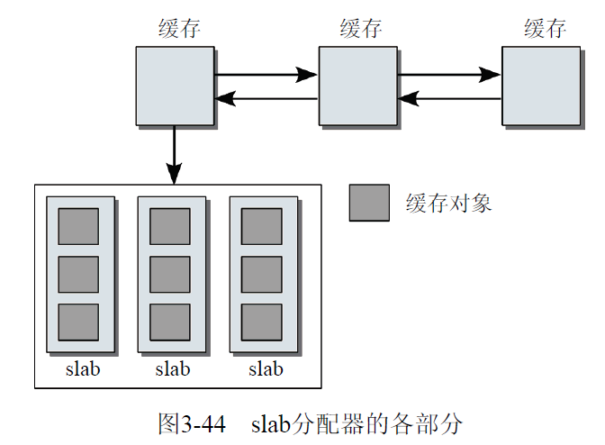

**每个缓存(！！！**)只负责**一种对象类型**(例如**struct unix_sock 实例**), 或提供**一般性的缓冲区**. **各个缓存(！！！**)中**slab 的数目(！！！)各有不同**, 这与已经使用的**页的数目**、**对象长度**和**被管理对象的数目**有关.

另外, 系统中**所有的缓存**都保存在一个**双链表**中. 这使得内核有机会依次**遍历所有的缓存**. 这是有必要的, 例如在**即将发生内存不足**时, 内核可能需要**缩减分配给缓存的内存数量**.

## 15.2. 缓存的结构

**缓存结构**包括两个特别重要的成员.

- 指向**一个数组的指针**, 其中保存了**各个 CPU(！！！)最后释放的对象**.

- **每个内存结点(！！！**)都对应**3 个表头**, 用于**组织 slab 的链表**. 第 1 个链表包含**完全用尽的 slab**, 第 2 个是**部分空闲的 slab**, 第 3 个是**空闲的 slab**.

缓存的精细结构:

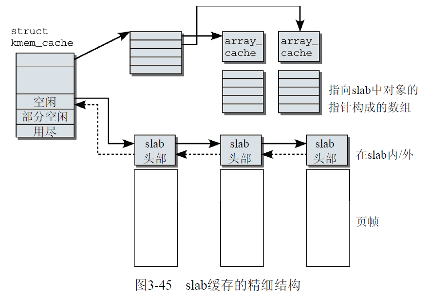

**缓存结构指向一个数组**,其中包含了

- **与系统 CPU 数目相同的数组项(！！！**).每个元素都是一个**指针**, 指向一个接一步的结构称之为**数组缓存(array cache**),其中包含了对应于**特定系统 CPU 的管理数据**.
- 管理性数据之后的内存区包含了**一个指针数组**, 各个数组项指向**slab 中未使用的对象**.

为最好地**利用 CPU 高速缓存**,这些**per-CPU 指针**是很重要的. 在**分配和释放对象**时, 采用**后进先出原理**(LIFO, last in first out). 内核假定**刚释放的对象**仍然**处于 CPU 高速缓存**中, 会尽快**再次分配它**(响应下一个分配请求). **仅当 per-CPU 缓存为空**时, 才会用**slab 中的空闲对象重新填充**它们.

这样, **对象分配的体系**就形成了一个**三级的层次结构**, **分配成本**和操作对**CPU 高速缓存和 TLB 的负面影响**逐级**升高**.

1. 仍然处于**CPU 高速缓存**中的**per-CPU 对象**

2. 现存**slab**中**未使用的对象**

3. 刚**使用伙伴系统分配**的**新 slab**中**未使用的对象**

缓存的精细结构:


## 15.3. slab 的结构

**对象**在**slab**中**并非连续排列**, 而是按照一个相当复杂的方案分布. 图 3-46 说明了相关细节.

用于**每个对象的长度(！！！**)并**不反映其确切的大小**.相反,**长度已经进行了舍入**,以满足某些**对齐方式的要求**. 有两种可用的备选**对齐方案**.

- slab 创建时使用标志**SLAB_HWCACHE_ALIGN**, slab 用户可以要求对象**按硬件缓存行对齐**.那么会按照**cache_line_size**的返回值进行**对齐**, 该函数返回特定于处理器的**L1 缓存大小**. 如果**对象小于缓存行长度的一半(！！！**), 那么将**多个对象放入一个缓存行(！！！**).

- 如果**不要求按硬件缓存行对齐**, 那么内核保证对象按**BYTES_PER_WORD 对齐**, 该值是表示 void 指针**所需字节**的数目.

在**32 位处理器**上, **void 指针**需要**4 个字节**. 因此, 对有**6 个字节**的**对象**, 则需要**8 = 2×4 个字节**, **15 个字节的对象**需要 16=4×4 个字节. 多余的字节称为**填充字节**.

**管理结构**位于**每个 slab**的**起始**处, 保存了所有的**管理数据**(和**用于连接缓存链表的链表元素**).

其后面是一个**数组**, **每个(整数)数组项**对应于**slab 中的一个对象**. 只有在**对象没有分配**时, 相应的**数组项才有意义**. 在这种情况下, 它指定了下一个空闲对象的索引. 由于**最低编号的空闲对象的编号**还保存在 slab 起始处的**管理结构**中, 内核无需使用链表或其他复杂的关联机制, 即可轻松找到当前可用的所有对象. 数组的**最后一项**总是一个**结束标记**, 值为**BUFCTL_END**.

slab 缓存的精细结构:

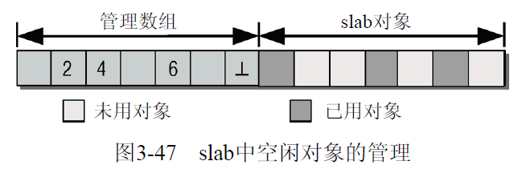

大多数情况下, **slab 内存区的长度(减去了头部管理数据**)是不能被(可能填补过的)**对象长度整除(！！！**)的. 因此, 内核就有了一些**多余的内存**, 可以用来**以偏移量的形式**给**slab"着色**", 如上文所述.

**缓存**的**各个 slab 成员**会指定**不同的偏移量**, 以便将**数据**定位到**不同的缓存行**, 因而**slab 开始**和**结束处的空闲内存**是不同的. 在计算偏移量时, 内核必须考虑其他的对齐因素.

例如, L1 高速缓存中数据的对齐(下文讨论).

**管理数据**可以放置在**slab 自身**, 也可以放置到**使用 kmalloc 分配的不同内存区中**. 内核如何选择, 取决于**slab 的长度**和**已用对象的数量**. 相应的选择标准稍后讨论. **管理数据**和**slab 内存之间的关联**很容易建立, 因为**slab 头包含了一个指针**, 指向 slab 数据区的起始处(无论管理数据**是否在 slab 上**).

slab 缓存的精细结构:

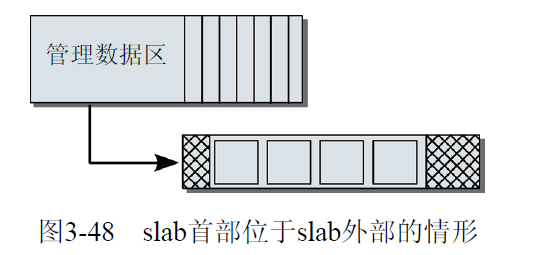

最后, 内核需要一种方法, 通过**对象自身**即可**识别 slab(以及对象驻留的缓存**).

根据对象的**物理内存地址**,可以找到**相关的页**,因此可以在**全局 mem_map 数组**中找到对应的**page 实例**.

我们已经知道, **page 结构**包括一个**链表元素**, 用于**管理各种链表中的页**. 对于**slab 缓存中的页**而言, 该指针是不必要的, 可用于其他用途.

- page->lru.next 指向**页驻留的缓存的管理结构**

- page->lru.prev 指向**保存该页的 slab 的管理结构**

**设置或读取 slab 信息**分别由**set_page_slab**和**get_page_slab**函数完成, 带有`_cache`后缀的函数则处理缓存信息的设置和读取.

```cpp
mm/slab.c
void page_set_cache(struct page *page, struct kmem_cache *cache)
struct kmem_cache *page_get_cache(struct page *page)
void page_set_slab(struct page *page, struct slab *slab)
struct slab *page_get_slab(struct page *page)
```

此外, 内核还对分配给**slab 分配器**的**每个物理内存页**都设置标志**PG_SLAB(！！！**).

## 15.4. 数据结构

在最高层是**cache_chain**, 这是一个**slab 缓存的链接列表**. 可以用来查找最适合**所需要的分配大小的缓存**(**遍历列表**). cache_chain 的**每个元素**都是**一个 kmem_cache 结构的引用**(称为**一个 cache**). 它定义了一个要管理的给定大小的对象池.

slab 分配器的主要结构:


**每个缓存**都包含了一个**slabs 列表**, 这是一段**连续的内存块(通常都是页面！！！**). 存在**3 种 slab**:

- slabs_full: **完全分配的 slab**
- slabs_partial: 部分分配的 slab
- slabs_empty: **空 slab**, 或者没有对象被分配

**slabs_empty 列表中的 slab**是进行**回收(reaping**)的**主要备选对象**. 正是通过此过程, **slab 所使用的内存**被**返回给操作系统**供其他用户使用.

slab 列表中的**每个 slab**都是一个**连续的内存块**(一个或多个**连续页**), 它们被划分成一个个**对象**. 这些对象是从特定缓存中进行分配和释放的基本元素. 注意**slab 是 slab 分配器进行操作的最小分配单位**, 因此如果需要对 slab 进行扩展, 这也就是所扩展的最小值. 通常来说, **每个 slab**被分配为**多个对象**.

由于**对象是从 slab 中进行分配和释放**的, 因此**单个 slab**可以**在 slab 列表之间进行移动**. 例如, 当一个 slab 中的**所有对象**都被**使用完**时, 就从**slabs_partial 列表**中移动到**slabs_full 列表**中. 当一个 slab**完全被分配**并且有**对象被释放**后, 就从 slabs_full 列表中移动到 slabs_partial 列表中. 当所有对象都被释放之后, 就从**slabs_partial 列表**移动到**slabs_empty**列表中.

**每个缓存**由**kmem_cache**结构的一个实例表示, 将 slab 缓存视为通过一组标准函数来高效地创建和释放特定类型对象的机制

| kmem_cache | slab | slob | slub |
|:--------------:|:-----:|:-----:|:-----:|
| kmem_cache | include/linux/slab_def.h | [mm/slab.h] | [include/linux/slub_def.h] |

```cpp
struct kmem_cache {
    //  per-CPU 数据, 在每次分配/释放期间都会访问
    struct array_cache __percpu *cpu_cache;

/* 1) Cache tunables. Protected by slab_mutex
 *    可调整的缓存参数. 由 cache_chain_mutex 保护  */
    //  要转移本地高速缓存的大批对象的数量
    unsigned int batchcount;
    unsigned int limit;
    //  本地高速缓存中空闲对象的最大数目
    unsigned int shared;
    //  高速缓存的大小
    unsigned int size;
    struct reciprocal_value reciprocal_buffer_size;

/* 2) touched by every alloc & free from the backend
 *    后端每次分配和释放内存时都会访问 */
    //  描述高速缓存永久属性的一组标志
    unsigned int flags;         /* constant flags */
    //  封装在一个单独 slab 中的对象个数
    unsigned int num;           /* # of objs per slab */

/* 3) cache_grow/shrink
 *    缓存的增长/缩减  */
    /* order of pgs per slab (2^n) 一个单独 slab 中包含的连续页框数目的对数*/
    unsigned int gfporder;

    /* force GFP flags, e.g. GFP_DMA   强制的 GFP 标志, 例如 GFP_DMA  */
    gfp_t allocflags;

    size_t colour;          /* cache colouring range 缓存着色范围  */
    unsigned int colour_off;    /* colour offset slab 中的着色偏移 */
    struct kmem_cache *freelist_cache;
    unsigned int freelist_size;

    /* constructor func 构造函数  */
    void (*ctor)(void *obj);

/* 4) cache creation/removal
 *    缓存创建/删除 */
    const char *name;   //  存放高速缓存名字的字符数组
    struct list_head list;  //  高速缓存描述符双向链表使用的指针
    int refcount;
    int object_size;
    int align;

/* 5) statistics
 *    统计量 */
#ifdef CONFIG_DEBUG_SLAB
    unsigned long num_active;
    unsigned long num_allocations;
    unsigned long high_mark;
    unsigned long grown;
    unsigned long reaped;
    unsigned long errors;
    unsigned long max_freeable;
    unsigned long node_allocs;
    unsigned long node_frees;
    unsigned long node_overflow;
    atomic_t allochit;
    atomic_t allocmiss;
    atomic_t freehit;
    atomic_t freemiss;
#ifdef CONFIG_DEBUG_SLAB_LEAK
    atomic_t store_user_clean;
#endif

    int obj_offset;
#endif /* CONFIG_DEBUG_SLAB */

#ifdef CONFIG_MEMCG
    struct memcg_cache_params memcg_params;
#endif
#ifdef CONFIG_KASAN
    struct kasan_cache kasan_info;
#endif

#ifdef CONFIG_SLAB_FREELIST_RANDOM
    void *random_seq;
#endif

    struct kmem_cache_node *node[MAX_NUMNODES];
};
```

| 字段 | 说明 |
|:-----:|:-----|
| cpu_cache | 是一个**指向数组的指针**, 每个**数组项**都**对应于**系统中的**一个 CPU**, 每个**数组项**都包含了**另一个指针**, **指向**下文讨论的**array_cache**结构的实例 |
| batchcount | 指定了在**per-CPU 列表为空**的情况下, 从**缓存的 slab**中**获取对象的数目**, 它还表示**在缓存增长时分配的对象数目** |
| limit | 指定了**per-CPU 列表**中**保存的对象的最大数目**. 如果超出了这个值, 内核会**将 batchcount 个对象返回到 slab** |
| size | 指定了缓存中**管理的对象的长度**1 |
| gfporder | 指定了**slab 包含的页数目**以 2 为底的对数, 简而言之, **slab 包含 2^gfporder 页** |
| colorur | 指定了**颜色的最大数目** |
| colour_off | **基本偏移量乘以颜色值获得的绝对偏移量** |
| dflags | 另一标志集合, 描述**slab 的动态性质** |
| ctor | 一个指针, 指向在对象创建时**调用的构造函数** |
| name | 一个字符串, 表示**缓存的名称** |
| list | 是一个**标准链表元素** |

### 15.4.1. per-cpu 数据(第 0~1 部分)

**每次分配期间内核对特定于 CPU 数据的访问**

- cpu_cache 是一个**指向数组的指针**, **每个数组项**都对应于系统中的**一个 CPU**. **每个数组项**都包含了**另一个指针**, 指向下文讨论的**array_cache 结构**的实例.

- batchcount 指定了在**per-CPU 列表为空**的情况下, 从**缓存的 slab 中获取对象的数目**. 它还表示在**缓存增长时分配的对象数目**.

- limit 指定了**per-CPU 列表**中保存的**对象的最大数目**. 如果超出该值, 内核会将**batchcount 个对象**返回到**slab**(如果接下来**内核缩减缓存**, 则释放的内存从 slab**返回到伙伴系统**)

内核对**每个系统处理器**都提供了**一个 array_cache**实例. 该结构定义如下

```cpp
struct array_cache {
    unsigned int avail;
    unsigned int limit;
    unsigned int batchcount;
    unsigned int touched;
    void *entry[];  /*
             * Must have this definition in here for the proper
             * alignment of array_cache. Also simplifies accessing
             * the entries.
             */
};
```

- batchcount 和 limit 的语义已经在上文给出,**kmem_cache_s 的值**用作(通常不修改)per-CPU 值的**默认值**, 用于缓存的重新填充或清空.

- **avail**保存了**当前可用对象**的数目.

- 在从缓存**移除一个对象**时, 将**touched 设置为 1**, 而**缓存收缩**时,则将 touched 设置为 0. 这使得内核能够确认在**缓存上一次收缩之后是否被访问过**, 也是缓存重要性的一个标志.

- 最后一个成员 entry 是一个**伪数组**,其中并**没有数组项**,只是为了便于访问内存中 array_cache 实例之后缓存中的各个对象而已.

### 15.4.2. 基本数据变量

- kmem_cache 的第 2、第 3 部分包含了**管理 slab 所需的全部变量**, 在填充或清空 per-CPU 缓存时需要访问这两部分.

- **node[MAX_NUMNODES**];是一个数组, **每个数组项**对应于系统中**一个可能的内存结点**. **每个数组项**都包含**kmem_cache_node 的一个实例**, **该结构**中有**3 个 slab 列表**(完全用尽、空闲、部分空闲)

- flags 是一个标志寄存器, 定义缓存的全局性质. 当前只有一个标志位. 如果**管理结构存储在 slab 外部**, 则置位 CFLGS_OFF_SLAB

- num 保存了可以放入**slab 的对象的最大数目**

kmem_cache_node 定义在 mm/slab.h

```cpp
struct kmem_cache_node {
    spinlock_t list_lock;

#ifdef CONFIG_SLAB
    struct list_head slabs_partial; /* partial list first, better asm code */
    struct list_head slabs_full;
    struct list_head slabs_free;
    unsigned long free_objects;
    unsigned int free_limit;
    unsigned int colour_next;       /* Per-node cache coloring */
    struct array_cache *shared;     /* shared per node */
    struct alien_cache **alien;     /* on other nodes */
    unsigned long next_reap;    /* updated without locking */
    int free_touched;           /* updated without locking */
#endif

#ifdef CONFIG_SLUB
    unsigned long nr_partial;
    struct list_head partial;
#ifdef CONFIG_SLUB_DEBUG
    atomic_long_t nr_slabs;
    atomic_long_t total_objects;
    struct list_head full;
#endif
#endif

};
```

**每个数组项**都包含**kmem_cache_node 的一个实例**,该结构中有 3 个 slab 列表(完全用尽 slabs_full、空闲 slabs_free、部分空闲 slabs_partial).

**kmem_cache_node**作为早期内核中 slab 描述符**struct slab 结构的替代品**,要么放在 slab 自身开始的地方.如果 slab 很小或者 slab 内部有足够的空间容纳 slab 描述符, 那么描述符就存放在 slab 里面.

slab 分配器可以创建新的 slab, 这是通过 kmem_getpages

### 15.4.3. slab 小结

slab 系统由 slab 描述符、slab 节点、本地对象缓冲池、共享对象缓冲池、3 个 slab 链表、n 个 slab, 以及众多 slab 缓存对象组成, 如图

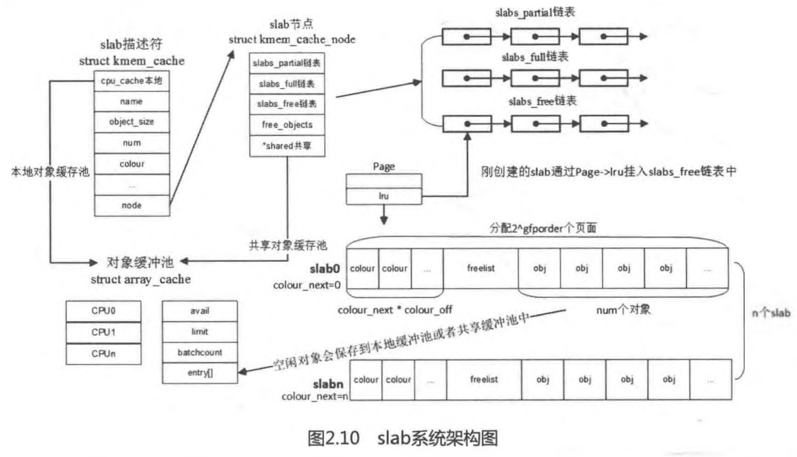

那么**每个 slab**由**多少个页面组成**呢?每个 slab 由一个或者 n 个 page 连续页面组成, 是**一个连续的物理空间**. 创建 slab 描述符时会计算一个 slab 究竟需要占用多少个 page 页面, 即`2^gfporder`, 一个 slab 里可以有多少个 slab 对象, 以及有多少个 cache 着色, slab 结构图见图

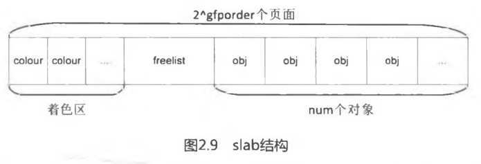

slab 需要的物理内存在什么时候分配呢?在创建 slab 描述符时, 不会立即分配 2^gfporder 个页面, 要等到分配 slab 对象时, 发现本地缓冲池和共享缓冲池都是空的, 然后查询 3 大链表中也没有空闲对象, 那么只好分配一个 slab 了. 这时才会分配 2^gfporder 个页面, 并且把这个 slab 挂入 slabs_free 链表中.

如果一个 slab 描述符中有很多空闲对象, 那么系统是否要回收一些空闲的缓存对象从而释放内存归还系统呢?这个是必须要考虑的问题, 否则系统有大量的 slab 描述符, 每个 slab 描述符还有大量不用的、空闲的 slab 对象, 这怎么行呢?

slab 系统有两种方式来回收内存.

(1) 使用 kmem_cache_free 释放一个对象, 当发现本地和共享对象缓冲池中的空闲对象数目 ac->avail 大于缓冲池的极限值 ac->limit 时, 系统会主动释放 bacthcount 个对象. 当系统所有空闲对象数目大于系统空闲对象数目极限值, 并且这个 slab 没有活跃对象时, 那么系统就会销毁这个 slab ,从而回收内存.

(2) slab 系统还注册了一个定时器, 定时去扫描所有的 slab 描述符, 回收一部分空闲对象, 达到条件的 slab 也会被销毁, 实现函数在 cache_reap()

为什么 slab 要有一个 cache colour 着色区? cache colour 着色区让每一个 slab 对应大小不同的 cache 行, 着色区大小的计算为 colour_next*colour_off, 其中 colour_next 从 0 到这个 slab 描述符中计算出来的 colour 最大值, colour_off 为 L1 cache 的 cache 行大小. 这样可以使不同 slab 上同一个相对位置 slab 对象的起始地址在高速缓存中相互错开, 有利于改善高速缓存的效率.

另外一个利用 cache 的场景是 Per-CPU 类型的本地对象缓冲池. slab 分配器的一个重要目的是提升硬件和 cache 的使用效率. 使用 Per-CPU 类型的本地对象缓冲池有如下两个好处

- 让一个对象尽可能地运行在同一个 CPU 上, 可以让对象尽可能地使用同一个 CPU 的 cache, 有助于提高性能.
- 访问 Per-CPU 类型的本地对象缓冲池不需要获取额外的自旋锁, 因为不会有另外的 CPU 来访问这些 Per-CPU 类型的对象缓存池, 避免自旋锁的争用.

## 15.5. slab 系统初始化

只在**slab 系统已经启用之后**, 才能使用**kmalloc**.

### 15.5.1. slab 分配器的初始化过程

```cpp
start_kernel()
    |---->page_address_init()
    |
    |---->setup_arch(&command_line);
    |
    |---->setup_per_cpu_areas();
    |
    |---->build_all_zonelist()
    |
    |---->page_alloc_init()
    |
    |---->pidhash_init()
    |
    |---->vfs_caches_init_early()
    |
    |---->mm_init()
```

内核通过**mm_init**完成了**buddy 伙伴系统**

```cpp
static void __init mm_init(void)
{
    /*
     * page_ext requires contiguous pages,
     * bigger than MAX_ORDER unless SPARSEMEM.
     */
    page_ext_init_flatmem();
    mem_init();
    kmem_cache_init();
    percpu_init_late();
    pgtable_init();
    vmalloc_init();
    ioremap_huge_init();
}
```

内核通过函数**mem_init**完成了**bootmem/memblock 的释放工作**,从而将内存管理迁移到了 buddy,随后就通过**kmem_cache_init**完成了**slab 初始化分配器**.

### 15.5.2. kmem_cache_init 函数初始化 slab 分配器

不仅 slab, **每个内核分配器**都应该提供一个**kmem_cache_init**函数.

1. **kmem_cache_init**创建系统中的**第一个 slab 缓存**,以便为**kmem_cache 的实例提供内存**.为此,内核使用的主要是**在编译时创建的静态数据**.实际上,一个**静态数据结构(initarray_cache**)用作**per-CPU 数组**.该**缓存的名称是 cache_cache(name 属性值**).

2. **kmem_cache_init**接下来**初始化一般性的缓存**,用作**kmalloc 内存的来源(！！！**).为此,针对所需的**各个缓存长度**, 分别调用**kmem_cache_create**.该函数起初只需要`cache_cache`缓存已经建立.但在**初始化 per-CPU 缓存**时, 该函数必须借助于**kmalloc(！！！**), 这尚且不可能.

......

kmem_cache_init 可以分为六个阶段

| 阶段 | 描述 |
|:-----:|:-----:|
| 第一个阶段 | 是根据 kmem_cache 来设置**cache_cache**的字段值 |
| 第二个阶段 | 首先是创建 arraycache_init 对应的高速缓存, 同时也是在这个 kmem_cache_create 的调用过程中, 创建了用于保存 cache 的 kmem_cache 的 slab, 并初始化了 slab 中的各个对象 |
| 第三个阶段 | 创建 kmem_list3 对应的高速缓存, 在这里要注意的一点是, 如果 sizeof(arraycache_t)和 sizeof(kmem_list3)的大小一样大, 那么就不再使用 kmem_cache_create 来为 kmem_list3 创建 cache 了, 因为如果两者相等的话, 两者就可以使用同一个 cache |
| 第四个阶段 | 创建并初始化所有的通用 cache 和 dma cache |
| 第五个阶段 | 创建两个 arraycache_init 对象, 分别取代 cache_cache 中的 array 字段和 malloc_sizes[INDEX_AC].cs_cachep->array 字段 |
| 第六个阶段 | 创建两个 kmem_list3 对象, 取代 cache_cache 中的 kmem_list3 字段和 malloc_sizes[INDEX_AC].cs_cachep->nodelist3 字段.如此一来, 经过上面的六个阶段后, 所有的初始化工作基本完成了 |

## 15.6. 创建缓存 kmem_cache_create

## 15.7. 分配对象 kmem_cache_alloc

**kmem_cache_alloc**用于**从特定的缓存获取对象**.类似于所有的**malloc 函数**

该函数从**给定的高速缓存 cachep**中返回一个**指向对象的指针**.如果高速缓存中的**所有 slab**中**没有空闲的对象**,那么 slab 层就必须通过**kmem_getpages 获取新的页(！！！没有空闲对象要获取新页！！！**),**flags 的值传递给__get_free_pages 函数**. 这与我们之前所看到的标志相同.你用到的应该是**GFP_KERNEL**或**GFP_ATOMIC**.

## 15.8. 释放对象 kmem_cache_free

如果一个分配的对象已经不再需要, 那么必须使用 kmem_cache_free 将对象释放, 并**返回给 slab 分配器**. 这样就能把**cachep 中的对象标记为空闲(！！！**).

## 15.9. 销毁缓存 kmem_cache_destroy

如果要销毁**只包含未使用对象**的一个缓存, 则必须调用**kmem_cache_destroy**函数.

- 依次扫描**slabs_free 链表**上的**slab**.首先对**每个 slab**上的**每个对象**调用析构器函数, 然后将**slab 的内存空间返回给伙伴系统**.

- 释放用于**per-CPU 缓存**的内存空间.

- 从**cache_cache 链表**移除相关数据.

与**kmem_cache_create 类似**,不能在中断上下文中调用这个函数.因为它也**可能睡眠**.调用该函数之前必须确保以下两个条件

- 告诉缓存中**所有 slab 都必须是 NULL**, 其实, 不管哪个 slab 中, 只要还有一个对象被分配出去并正在使用, 那么就不能撤销该告诉缓存

- 在调用 kmem_cache_destroy 过程中, **不再访问这个高速缓存**. **调用者**必须确保这种同步.

# 16. slub 原理

## 16.1. slub 数据结构

首先鸟瞰全局, 由下图进行入手分析 slub 内存分配算法的管理框架:

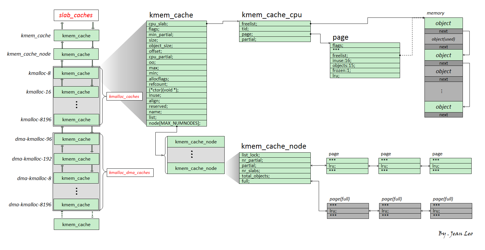

沿用 slab 算法对**对象**及**对象缓冲区**的称呼, **一个 slab**表示**某个特定大小空间的缓冲片区**, 而**片区里面**的**一个特定大小的空间**则称之为**对象**.

Slub 内存分配算法中, **每种 slab 的类型**都是由**kmem_cache**类型的数据结构来描述的. 该结构的定义为:

```cpp
// include/linux/slub_def.h
struct kmem_cache {
    /*每 CPU 的结构, 用于各个 CPU 的缓存管理*/
	struct kmem_cache_cpu __percpu *cpu_slab;
	/* Used for retriving partial slabs etc */
	/*描述标识, 描述缓冲区属性的标识*/
	unsigned long flags;
	unsigned long min_partial;
	/*对象大小, 包括元数据大小*/
	int size;		/* The size of an object including meta data */
	/*slab 对象纯大小*/
	int object_size;	/* The size of an object without meta data */
	/*空闲对象的指针偏移*/
	int offset;		/* Free pointer offset. */
	/*每 CPU 持有量*/
	int cpu_partial;	/* Number of per cpu partial objects to keep around */
	/*存放分配给 slab 的页框的阶数(高 16 位)和 slab 中的对象数量(低 16 位)*/
	struct kmem_cache_order_objects oo;

	/* Allocation and freeing of slabs */
	/*存储单对象所需的页框阶数及该阶数下可容纳的对象数*/
	struct kmem_cache_order_objects max;
	struct kmem_cache_order_objects min;
	/*申请页面时使用的 GFP 标识*/
	gfp_t allocflags;	/* gfp flags to use on each alloc */
	/*缓冲区计数器, 当用户请求创建新的缓冲区时, SLUB 分配器重用已创建的相似大小的缓冲区, 从而减少缓冲区个数*/
	int refcount;		/* Refcount for slab cache destroy */
	/*创建对象的回调函数*/
	void (*ctor)(void *);
	/*元数据偏移量*/
	int inuse;		/* Offset to metadata */
	/*对齐值*/
	int align;		/* Alignment */
	int reserved;		/* Reserved bytes at the end of slabs */
	/*slab 缓存名称*/
	const char *name;	/* Name (only for display!) */
	/*用于 slab cache 管理的链表*/
	struct list_head list;	/* List of slab caches */
	int red_left_pad;	/* Left redzone padding size */
#ifdef CONFIG_SYSFS
	struct kobject kobj;	/* For sysfs */
#endif
#ifdef CONFIG_MEMCG
	struct memcg_cache_params memcg_params;
	int max_attr_size; /* for propagation, maximum size of a stored attr */
#ifdef CONFIG_SYSFS
	struct kset *memcg_kset;
#endif
#endif

#ifdef CONFIG_NUMA
	/*
	 * Defragmentation by allocating from a remote node.
	 */
	/*远端节点的反碎片率, 值越小则越倾向从本节点中分配对象*/
	int remote_node_defrag_ratio;
#endif
    /*各个内存管理节点的 slub 信息*/
	struct kmem_cache_node *node[MAX_NUMNODES];
};
```

这里主要关注的是 cpu_slab 和 node 成员.

其中 cpu_slab 的结构类型是**kmem_cache_cpu**, 是**Per-CPU 类型**数据, **各个 CPU**都有**自己独立的一个结构**, 用于**管理本地的对象缓存**. 具体的结构定义如下:

```c
[include/linux/slub_def.h]
struct kmem_cache_cpu {
    /* 空闲对象队列的指针 */
    void **freelist; /* Pointer to next available object */
    /* 用于保证 cmpxchg_double 计算发生在正确的 CPU 上, 并且可作为一个锁保证不会同时申请这个 kmem_cache_cpu 的对象 */
    unsigned long tid; /* Globally unique transaction id */
    /* 指向 slab 对象来源的内存页面 */
    struct page *page; /* The slab from which we are allocating */
    /* 指向曾分配完所有的对象, 但当前已回收至少一个对象的 page */
    struct page *partial; /* Partially allocated frozen slabs */
#ifdef CONFIG_SLUB_STATS
    unsigned stat[NR_SLUB_STAT_ITEMS];
#endif
};
```

kmem_cache_node 结构:

```cpp
// mm/slab.h
struct kmem_cache_node {
    /*保护结构内数据的自旋锁*/
    spinlock_t list_lock;

#ifdef CONFIG_SLAB
    struct list_head slabs_partial; /* partial list first, better asm code */
    struct list_head slabs_full;
    struct list_head slabs_free;
    unsigned long free_objects;
    unsigned int free_limit;
    unsigned int colour_next; /* Per-node cache coloring */
    struct array_cache *shared; /* shared per node */
    struct array_cache **alien; /* on other nodes */
    unsigned long next_reap; /* updated without locking */
    int free_touched; /* updated without locking */
#endif

#ifdef CONFIG_SLUB
    /*本节点的 Partial slab 的数目*/
    unsigned long nr_partial;
    /*Partial slab 的双向循环队列*/
    struct list_head partial;
#ifdef CONFIG_SLUB_DEBUG
    atomic_long_t nr_slabs;
    atomic_long_t total_objects;
    struct list_head full;
#endif
#endif

};
```

该结构是**每个 node 节点**都会有的一个结构, 主要是用于**管理 node 节点**的**slab 缓存区**.

Slub 分配管理中, **每个 CPU 都有自己的缓存管理**, 也就是**kmem_cache_cpu 数据结构管理**; 而**每个 node 节点**也有**自己的缓存管理**, 也就是**kmem_cache_node 数据结构**管理.

**对象分配**时:

1、**当前 CPU 缓存**有**满足申请要求的对象**时, 将会首先从**kmem_cache_cpu 的空闲链表 freelist**将对象分配出去;

2、如果**对象不够**时, 将会向**伙伴管理算法中申请内存页面**, 申请来的页面将会**先填充到 node 节点**中, 然后从**node 节点**取出对象到**CPU 的缓存空闲链表**中;

3、如果**原来申请的 node 节点 A**的对象, 现在改为**申请 node 节点 B**的, 那么将会把**node 节点 A 的对象释放后再申请**.

**对象释放**时:

1、会先**将对象释放到 CPU 上**面, 如果**释放的对象**恰好与**CPU 的缓存**来自**相同的页面**, 则**直接添加到列表**中;

2、如果释放的对象**不是当前 CPU 缓存的页面**, 则会把**当前的 CPU 的缓存对象**放到**node 上**面, 然后再**把该对象释放到本地的 cache**中.

为了避免**过多的空闲对象缓存在管理框架**中, slub 设置了**阀值**, 如果**空闲对象个数**达到了**一个峰值**, 将会**把当前缓存释放到 node 节点**中, 当 node 节点也过了阀值, 将会把 node 节点的对象释放到伙伴管理算法中.

## 16.2. slub 初始化

在调用 mem_init()初始化伙伴管理算法后, 紧接着调用的 kmem_cache_init()便是 slub 分配算法的入口. 其中该函数在/mm 目录下有三处实现 slab.c、slob.c 和 slub.c, 表示不同算法下其初始化各异, 分析 slub 分配算法则主要分析 slub.c 的实现.

```cpp
void __init kmem_cache_init(void)
{
	static __initdata struct kmem_cache boot_kmem_cache,
		boot_kmem_cache_node;

	if (debug_guardpage_minorder())
		slub_max_order = 0;

	kmem_cache_node = &boot_kmem_cache_node;
	kmem_cache = &boot_kmem_cache;

	create_boot_cache(kmem_cache_node, "kmem_cache_node",
		sizeof(struct kmem_cache_node), SLAB_HWCACHE_ALIGN);

	register_hotmemory_notifier(&slab_memory_callback_nb);

	/* Able to allocate the per node structures */
	slab_state = PARTIAL;

	create_boot_cache(kmem_cache, "kmem_cache",
			offsetof(struct kmem_cache, node) +
				nr_node_ids * sizeof(struct kmem_cache_node *),
		       SLAB_HWCACHE_ALIGN);

	kmem_cache = bootstrap(&boot_kmem_cache);

	kmem_cache_node = bootstrap(&boot_kmem_cache_node);

	/* Now we can use the kmem_cache to allocate kmalloc slabs */
	setup_kmalloc_cache_index_table();
	create_kmalloc_caches(0);

#ifdef CONFIG_SMP
	register_cpu_notifier(&slab_notifier);
#endif

	pr_info("SLUB: HWalign=%d, Order=%d-%d, MinObjects=%d, CPUs=%d, Nodes=%dn",
		cache_line_size(),
		slub_min_order, slub_max_order, slub_min_objects,
		nr_cpu_ids, nr_node_ids);
}
```

register_hotmemory_notifier()和 register_cpu_notifier()主要是用于注册内核通知链回调的;

create_boot_cache()用于创建分配算法缓存, 主要是把**boot_kmem_cache_node 结构初始化**了. 其内部的 calculate_alignment()主要用于**计算内存对齐值**, 而__**kmem_cache_create**()则是创建缓存的核心函数, 其主要是把**kmem_cache 结构初始化**了. 具体的__kmem_cache_create()实现将在后面的 slab 创建部分进行详细分析.

至此, create_boot_cache()函数创建**kmem_cache_node 对象缓冲区**完毕, 往下**register_hotmemory_notifier**()注册**内核通知链回调**之后, 同样是通过 create_boot_cache()创建 kmem_cache 对象缓冲区. 接续往下走, 可以看到 bootstrap()函数调用, bootstrap(&boot_kmem_cache)及 bootstrap(&boot_kmem_cache_node).

bootstrap()函数主要是将临时 kmem_cache 向最终 kmem_cache 迁移, 并修正相关指针, 使其指向最终的 kmem_cache.

..........

至此, Slub 分配框架初始化完毕. 稍微总结一下 kmem_cache_init()函数流程, 该函数首先是**create_boot_cache**()创建**kmem_cache_node 对象**的 slub 管理框架, 然后 register_hotmemory_notifier()注册热插拔内存内核通知链回调函数用于热插拔内存处理; 值得关注的是此时 slab_state 设置为 PARTIAL, 表示将**分配算法状态改为 PARTIAL**, 意味着已经可以分配 kmem_cache_node 对象了; 再往下则是**create_boot_cache**()创建**kmem_cache 对象的 slub 管理框架**, 至此整个 slub 分配算法所需的管理结构对象的 slab 已经初始化完毕; 不过由于前期的管理很多都是借用临时变量空间的, 所以将会通过 bootstrap()将 kmem_cache_node 和 kmem_cache 的管理结构迁入到 slub 管理框架的对象空间中, 实现自管理; 最后就是通过**create_kmalloc_caches**()初始化一批后期内存分配中需要使用到的**不同大小的 slab 缓存**.

## 16.3. 创建缓存 kmem_cache_create()

Slub 分配算法**创建 slab 类型**, 其函数入口为 kmem_cache_create()

```cpp
// mm/slab_common.c
struct kmem_cache *
kmem_cache_create(const char *name, size_t size, size_t align,
		  unsigned long flags, void (*ctor)(void *))
{
	struct kmem_cache *s;
	const char *cache_name;
	int err;

	get_online_cpus();
	get_online_mems();
	memcg_get_cache_ids();

	mutex_lock(&slab_mutex);

	err = kmem_cache_sanity_check(name, size);
	if (err) {
		s = NULL;	/* suppress uninit var warning */
		goto out_unlock;
	}

	flags &= CACHE_CREATE_MASK;

	s = __kmem_cache_alias(name, size, align, flags, ctor);
	if (s)
		goto out_unlock;

	cache_name = kstrdup_const(name, GFP_KERNEL);
	if (!cache_name) {
		err = -ENOMEM;
		goto out_unlock;
	}

	s = do_kmem_cache_create(cache_name, size, size,
				 calculate_alignment(flags, align, size),
				 flags, ctor, NULL, NULL);
	if (IS_ERR(s)) {
		err = PTR_ERR(s);
		kfree_const(cache_name);
	}

out_unlock:
	mutex_unlock(&slab_mutex);

	memcg_put_cache_ids();
	put_online_mems();
	put_online_cpus();

	if (err) {
		if (flags & SLAB_PANIC)
			panic("kmem_cache_create: Failed to create slab '%s'. Error %dn",
				name, err);
		else {
			printk(KERN_WARNING "kmem_cache_create(%s) failed with error %d",
				name, err);
			dump_stack();
		}
		return NULL;
	}
	return s;
}
EXPORT_SYMBOL(kmem_cache_create);
```

**name**表示要**创建的 slab 类型名称**, **size**为该**slab 每个对象的大小**, **align**则是其**内存对齐的标准**,  flags 则表示申请内存的标识, 而 ctor 则是**初始化每个对象的构造函数**.

1. 合法性检查, 检查指令名称的 slab 是否已经创建

2. 调用__**kmem_cache_alias**()检查**已创建的 slab**是否存在与当前**想要创建的 slab 的对象大小**相匹配的, 如果有则通过**别名合并到一个缓存中**进行访问, 该函数在不同的文件 mm/slab.c 或 mm/slub.c

3. slab 的名称通过**kstrdup_const**()**申请空间并拷贝存储至空间**中

4. 没找到可合并的 slab, 则创建新的 slab, 将通过**do_kmem_cache_create**()申请一个**kmem_cache 结构对象**并初始化

5. **out_unlock 标签**主要是用于处理 slab 创建的**收尾工作**, 如果**创建失败**, 将会进入**err 分支**进行失败处理; 最后的**out_free_cache 标签**主要是用于初始化 kmem_cache 失败时将申请的空间进行释放, 然后跳转至 out_unlock 进行失败后处理.

### 16.3.1. __kmem_cache_alias()检查是否与已创建的 slab 匹配

__**kmem_cache_alias**()的实现:

通过**find_mergeable**()查找**可合并 slab 的 kmem_cache 结构**, 该函数本身是一个通用函数, 在 mm/slab_common.c 中. 如果**找到**的情况下:

- 将**kmem_cache 的引用计数作自增(kmem_cache->refcount**++),

- 同时更新 kmem_cache 的**对象大小(kmem_cache->object_size= max(s->object_size, (int)size**)及**元数据偏移量(kmem_cache->inuse = max_t(int, s->inuse, ALIGN(size, sizeof(void** *))),

- 最后调用 sysfs_slab_alias()在 sysfs 中添加别号.

**find_mergeable**()的实现:

- 获取将要创建的 slab 的内存对齐值及创建 slab 的内存标识

- 经由 list_for_each_entry()遍历整个 slab_caches 链表; 通过**slab_unmergeable**()判断**遍历的 kmem_cache 是否允许合并**, 主要依据主要是**缓冲区属性的标识**及**slab 的对象**是否有**特定的初始化构造函数**, 如果不允许合并则跳过; 判断**当前的 kmem_cache 的对象大小**是否**小于(！！！不是非得相等！！！**)要查找的, 是则跳过; 再接着 if ((flags & SLUB_MERGE_SAME) != (s->flags & SLUB_MERGE_SAME))  判断**当前的 kmem_cache**与查找的**标识类型是否一致**, 不是则跳过; 往下就是 if ((s->size & ~(align - 1)) != s->size)判断**对齐量是否匹配**, if (s->size - size >= sizeof(void *))判断大小相差是否超过指针类型大小, if (!cache_match_memcg(s, memcg))判断 memcg 是否匹配. 经由多层判断检验, 如果找到**可合并的 slab**, 则返回回去, 否则返回 NULL.

### 16.3.2. do_kmem_cache_create()

do_kmem_cache_create()的实现:

调用**kmem_cache_zalloc**申请一个**kmem_cache 结构对象**(注意和**kmem_cache_alloc 区分**), 然后初始化该结构的**对象大小(包括 slab 对象纯大小以及包括元数据大小**)、**对齐值**及**对象的初始化构造函数**等数据成员信息;

接着的**init_memcg_params**()主要是申请**kmem_cache**的**memcg_params**成员结构空间并初始化;

__**kmem_cache_create**()则主要是**申请并创建 slub 的管理结构**及 kmem_cache**其他数据的初始化**;

最后通过**list_add**(&s->list, &slab_caches)将 kmem_cache 添加到**slab_caches 链表**.

#### 16.3.2.1. __kmem_cache_create()初始化 slub 结构(即 kmem_cache)

不同分配器不同实现, 对应不同文件

__**kmem_cache_create**()的实现:

```c
[mm/slub.c]
int __kmem_cache_create(struct kmem_cache *s, unsigned long flags)
{
    int err;

    err = kmem_cache_open(s, flags);
    if (err)
        return err;

    /* Mutex is not taken during early boot */
    if (slab_state <= UP)
        return 0;

    memcg_propagate_slab_attrs(s);
    mutex_unlock(&slab_mutex);
    err = sysfs_slab_add(s);
    mutex_lock(&slab_mutex);

    if (err)
        kmem_cache_close(s);

    return err;
}
```

kmem_cache_open()主要是**初始化 slub 结构**.

而后在调用**sysfs_slab_add**()前会**先解锁 slab_mutex**, 这主要是因为 sysfs 函数会做大量的事情, 为了避免调用 sysfs 函数中持有该锁从而导致阻塞等情况;

而 sysfs_slab_add()主要是**将 kmem_cache 添加到 sysfs**. 如果出错, 将会通过 kmem_cache_close()将 slub 销毁.

##### 16.3.2.1.1. kmem_cache_open()

kmem_cache_open()的实现:

- 获取设置**缓存描述的标识**
- 调用 calculate_sizes()计算并初始化 kmem_cache 结构的各项数据: 将 slab 对象的大小舍入对与 sizeof(void *)指针大小对齐, 其为了能够将空闲指针存放至对象的边界中; 根据 size 做对齐操作并更新到 kmem_cache 结构中, 根据入参 forced_order 为-1, 其将通过**calculate_order**()计算**单 slab**的**页框阶数**, 同时得出 kmem_cache 结构的 oo、min、max 等相关信息.
- set_min_partial()是用于设置 partial 链表的最小值, 主要是由于对象的大小越大, 则需挂入的 partial 链表的页面则容易越多, 设置最小值是为了避免过度使用页面分配器造成冲击.
- 根据对象的大小以及配置的情况, 对 cpu_partial 进行设置; **cpu_partial**表示的是**每个 CPU**在**partial 链表**中的**最多对象个数**, 该数据决定了: 1)当**使用到了极限**时, **每个 CPU 的 partial slab**释放到**每个管理节点链表的个数**; 2)当**使用完每个 CPU 的对象数**时, **CPU 的 partial slab**来自**每个管理节点的对象数**.
- **init_kmem_cache_nodes**(): **for_each_node_state**遍历**每个管理节点**, 并向**kmem_cache_node 全局管理控制块**为所遍历的节点**申请一个 kmem_cache_node 结构空间对象(！！！struct kmem_cache->struct kmem_cache_node *node[MAX_NUMNODES]！！！**), 并将**kmem_cache 的成员 node 初始化**.
- **alloc_kmem_cache_cpus**(): 通过__alloc_percpu()为**每个 CPU 申请空间**, 然后通过 init_kmem_cache_cpus()将**申请空间初始化至每个 CPU**上(**！！！struct kmem_cache->struct kmem_cache_cpu __percpu *cpu_slab！！！**).

## 16.4. kmem_cache_alloc()申请 slab 对象

不同分配器不同实现, 对应不同文件

```c
[mm/slub.c]
void *kmem_cache_alloc(struct kmem_cache *s, gfp_t gfpflags)
{
	void *ret = slab_alloc(s, gfpflags, _RET_IP_);

	trace_kmem_cache_alloc(_RET_IP_, ret, s->object_size,
				s->size, gfpflags);
	return ret;
}
EXPORT_SYMBOL(kmem_cache_alloc);

static __always_inline void *slab_alloc(struct kmem_cache *s,
		gfp_t gfpflags, unsigned long addr)
{
	return slab_alloc_node(s, gfpflags, NUMA_NO_NODE, addr);
}
```

该函数主要是通过 slab_alloc()来分配对象, 而 trace_kmem_cache_alloc()则是用于记录 slab 分配轨迹.

1. 如果开启了 CONFIG_SLUB_DEBUG 配置的情况下, 将会经由 slab_pre_alloc_hook()对 slub 分配进行预处理, 确保申请 OK

2. 循环: 通过__this_cpu_read(kmem_cache->cpu_slab->tid)获取当前 CPU 的 kmem_cache_cpu 结构的 tid 值, 随后通过 raw_cpu_ptr(s->cpu_slab)取得**当前 CPU 的 kmem_cache_cpu 结构**

3. `if (unlikely(!object || !node_match(page, node)))`判断**当前 CPU 的 slab 空闲列表(kmem_cache_cpu->freelist**)是否为**空**或者**当前 slab 使用内存页面与管理节点是否不匹配**. 如果其中某一条件为否定, 则将通过__slab_alloc()进行 slab 分配; 否则将进入**else 分支**进行**分配操作**.

4. __slab_alloc()进行 slab 分配, 后续详细

5. else 分支: 先经**get_freepointer_safe**()取得**slab 中空闲对象地址**, 接着使用 this_cpu_cmpxchg_double()原子指令操作**取得该空闲对象**, 如果获取成功将**使用 prefetch_freepointer()刷新数据**, 否则将经 note_cmpxchg_failure()记录日志后重回步骤 2 再次尝试分配. 这里面的关键是**this_cpu_cmpxchg_double**()原子指令操作. 该原子操作主要做了三件事情: 1)**重定向首指针指向当前 CPU 的空间**; 2)**判断 tid 和 freelist 未被修改**; 3)如果**未被修改**, 也就是相等, 确信**此次 slab 分配未被 CPU 迁移**, 接着将**新的 tid**和**freelist 数据覆盖过去以更新**.

6. 完了分配到对象后, 将会根据申请标志__GFP_ZERO 将该对象进行格式化操作, 然后经由 slab_post_alloc_hook()进行对象分配后处理.

### 16.4.1. __slab_alloc()实现

__slab_alloc()是 slab 申请的慢路径, 这是由于**freelist 是空**的或者**需要执行调试任务**.

1. 先行**local_irq_save**()**禁止本地处理器的中断**并且**记住它们之前的状态**.

2. 如果**配置 CONFIG_PREEMPT**了, 为了**避免因调度切换到不同的 CPU**, 该函数会**重新(！！！)通过 this_cpu_ptr**(kmem_cache->cpu_slab)获取当前缓存的**CPU 域指针 kmem_cache_cpu**;

3. 如果**kmem_cache_cpu->page 页面为空**, 也就是**cpu local slab 不存在**就跳转到**new_slab 标签**分支新**分配一个 slab**.

4. 如果**kmem_cache_cpu->page 页面不为空**, 会经**node_match**()判断**页面与节点是否匹配**, 如果**节点不匹配**就通过**deactivate_slab**(kmem_cache, page, kmem_cache_cpu->freelist)去**激活 cpu 本地 slab**, 设置 kmem_cache_cpu->page 为 NULL, 设置 kmem_cache_cpu->freelist 为 NULL, 跳转到**new_slab 标签**分支新**分配一个 slab**;

5. 再然后通过**pfmemalloc_match**()判断**当前页面属性是否为 pfmemalloc**, 如果**不是**则同样去激活, 设置 kmem_cache_cpu->page 为 NULL, 设置 kmem_cache_cpu->freelist 为 NULL, 跳转到**new_slab 标签**分支新**分配一个 slab**

6. 再次检查**空闲对象指针 freelist**是否**为空**, **避免**在**禁止本地处理器中断前**因发生了**CPU 迁移或者中断**, 导致**本地的空闲对象指针不为空**. 如果不为空的情况下, 将会跳转至**load_freelist**, 这里将会把**对象从空闲队列中取出**, 并**更新数据信息**, 然后**恢复中断使能**, 返回**对象地址**. 如果为空, 将会**更新慢路径申请对象的统计信息**, 并通过**get_freelist**()从**页面**中获取**空闲队列**. if (!freelist)表示获取空闲队列失败, 此时则需要**创建新的 slab**, 否则**更新统计信息进入 load_freelist 分支取得对象并返回**.

7. new_slab 标签: 首先会**if(c->partial**)判断**partial 是否为空**, 不为空则从 partial 中取出, 然后跳转回步骤 4 重试分配. 如果**partial 为空**, 意味着**当前所有的 slab 都已经满负荷使用**, 那么则需使用**new_slab_objects**()创建**新的 slab**. 如果创建失败, 那么将 if (!(gfpflags & __GFP_NOWARN) && printk_ratelimit())判断申请页面是否配置为无告警, 并且送往控制台的消息数量在临界值内, 则调用 slab_out_of_memory()记录日志后使能中断并返回 NULL 表示申请失败. 否则将会 if (likely(!kmem_cache_debug(s) && pfmemalloc_match(page, gfpflags)))判断是否未开启调试且页面属性匹配 pfmemalloc, 是则跳转至**load_freelist**分支进行**slab 对象分配**; 否则将会经 if (kmem_cache_debug(s) && !alloc_debug_processing(s, page, freelist, addr)) 判断, 若开启调试并且调试初始化失败, 则返回创建新的 slab. 如果未开启调试或 page 调试初始化失败, 都将会 deactivate_slab()去激活该 page, 使能中断并返回.

new_slab_objects()函数实现:

```cpp
static inline void *new_slab_objects(struct kmem_cache *s, gfp_t flags,
			int node, struct kmem_cache_cpu **pc)
{
	void *freelist;
	struct kmem_cache_cpu *c = *pc;
	struct page *page;

	freelist = get_partial(s, flags, node, c);

	if (freelist)
		return freelist;

	page = new_slab(s, flags, node);
	if (page) {
		c = raw_cpu_ptr(s->cpu_slab);
		if (c->page)
			flush_slab(s, c);

		/*
		 * No other reference to the page yet so we can
		 * muck around with it freely without cmpxchg
		 */
		freelist = page->freelist;
		page->freelist = NULL;

		stat(s, ALLOC_SLAB);
		c->page = page;
		*pc = c;
	} else
		freelist = NULL;

	return freelist;
}
```

该函数在尝试创建新的 slab 前, 将先通过**get_partial**()获取存在**空闲对象的 slab**并将对象返回; 否则继而通过**new_slab()创建 slab**, 如果创建好 slab 后, 将**空闲对象链表摘下并返回**.

## 16.5. kmem_cache_free()对象释放

不同分配器不同实现, 对应不同文件

```c
void kmem_cache_free(struct kmem_cache *s, void *x)
{
	s = cache_from_obj(s, x);
	if (!s)
		return;
	slab_free(s, virt_to_head_page(x), x, _RET_IP_);
	trace_kmem_cache_free(_RET_IP_, x);
}
EXPORT_SYMBOL(kmem_cache_free);
```

该函数中, **cache_from_obj**()主要是用于**获取回收对象的 kmem_cache**, 而**slab_free**()主要是用于**将对象回收**, 至于**trace_kmem_cache_free**()则是对对象的回收做**轨迹跟踪**的.

### 16.5.1. cache_from_obj()获取回收对象的缓存结构 kmem_cache

```c
static inline struct kmem_cache *cache_from_obj(struct kmem_cache *s, void *x)
{
	struct kmem_cache *cachep;
	struct page *page;

	if (!memcg_kmem_enabled() && !unlikely(s->flags & SLAB_DEBUG_FREE))
		return s;

	page = virt_to_head_page(x);
	cachep = page->slab_cache;
	if (slab_equal_or_root(cachep, s))
		return cachep;

	pr_err("%s: Wrong slab cache. %s but object is from %sn",
	       __func__, cachep->name, s->name);
	WARN_ON_ONCE(1);
	return s;
}
```

**kmem_cache**在 kmem_cache_free()的**入参已经传入**了, 但是这里仍然要去**重新判断获取该结构**, 主要是由于当**内核将各缓冲区链起来**的时候, 其通过**对象地址**经**virt_to_head_page**()转换后**获取的 page 页面结构**远比用户传入的值得可信. 所以在该函数中则先会 if (!memcg_kmem_enabled() && !unlikely(s->flags & SLAB_DEBUG_FREE))判断是否 memcg 未开启且 kmem_cache 未设置 SLAB_DEBUG_FREE, 如果是的话, 接着通过 virt_to_head_page()经由对象地址获得其页面 page 管理结构; 再经由**slab_equal_or_root**()判断调用者传入的 kmem_cache 是否与释放的对象所属的 cache 相匹配, 如果匹配, 则将由对象得到 kmem_cache 返回; 否则最后只好将调用者传入的 kmem_cache 返回.

### 16.5.2. slab_free()将对象回收

```cpp
static __always_inline void slab_free(struct kmem_cache *s,
			struct page *page, void *x, unsigned long addr)
{
	void **object = (void *)x;
	struct kmem_cache_cpu *c;
	unsigned long tid;

	slab_free_hook(s, x);

redo:
	do {
		tid = this_cpu_read(s->cpu_slab->tid);
		c = raw_cpu_ptr(s->cpu_slab);
	} while (IS_ENABLED(CONFIG_PREEMPT) &&
		 unlikely(tid != READ_ONCE(c->tid)));

	/* Same with comment on barrier() in slab_alloc_node() */
	barrier();

	if (likely(page == c->page)) {
		set_freepointer(s, object, c->freelist);

		if (unlikely(!this_cpu_cmpxchg_double(
				s->cpu_slab->freelist, s->cpu_slab->tid,
				c->freelist, tid,
				object, next_tid(tid)))) {

			note_cmpxchg_failure("slab_free", s, tid);
			goto redo;
		}
		stat(s, FREE_FASTPATH);
	} else
		__slab_free(s, page, x, addr);

}
```

函数最先的是 slab_free_hook()对象释放处理钩子调用处理, 主要是用于去注册 kmemleak 中的对象; 接着是 redo 的标签, 该标签主要是用于释放过程中出现因抢占而发生 CPU 迁移的时候, 跳转重新处理的点; 在 redo 里面, 将先通过 preempt_disable()禁止抢占, 然后__this_cpu_ptr()获取本地 CPU 的 kmem_cache_cpu 管理结构以及其中的事务 ID(tid), 然后 preempt_enable()恢复抢占; if(likely(page == c->page))如果当前释放的对象与本地 CPU 的缓存区相匹配, 将会 set_freepointer()设置该对象尾随的空闲对象指针数据, 然后类似分配时, 经由 this_cpu_cmpxchg_double()原子操作, 将对象归还回去; 但是如果当前释放的对象与本地 CPU 的缓存区不匹配, 意味着不可以快速释放对象, 此时将会通过__slab_free()慢通道将对象释放.

#### 16.5.2.1. __slab_free()


## 16.6. kmem_cache_destroy()缓存区的销毁

```c
void kmem_cache_destroy(struct kmem_cache *s)
{
	struct kmem_cache *c, *c2;
	LIST_HEAD(release);
	bool need_rcu_barrier = false;
	bool busy = false;

	BUG_ON(!is_root_cache(s));

	get_online_cpus();
	get_online_mems();

	mutex_lock(&slab_mutex);

	s->refcount--;
	if (s->refcount)
		goto out_unlock;

	for_each_memcg_cache_safe(c, c2, s) {
		if (do_kmem_cache_shutdown(c, &release, &need_rcu_barrier))
			busy = true;
	}
	if (!busy)
		do_kmem_cache_shutdown(s, &release, &need_rcu_barrier);
out_unlock:
	mutex_unlock(&slab_mutex);
	put_online_mems();
	put_online_cpus();
	do_kmem_cache_release(&release, need_rcu_barrier);
}
EXPORT_SYMBOL(kmem_cache_destroy);
```

get_online_cpus()是对 cpu_online_map 的加锁, 其与末尾的 put_online_cpus()是配对使用的.

mutex_lock()用于获取 slab_mutex 互斥锁, 该锁主要用于全局资源保护.

对 kmem_cache 的引用计数 refcount 自减操作, 如果自减后 if (s->refcount)为 false, 即**引用计数为 0**, 表示**该缓冲区不存在 slab 别名挂靠**的情况, 那么**其 kmem_cache 结构可以删除**, 否则表示**有其他缓冲区别名挂靠**, 仍有依赖, 那么将会**解锁 slab_mutex**并**put_online_cpus()释放 cpu_online_map 锁**, 然后退出.

if(s->refcount)为 false 的分支中,

, 然后__kmem_cache_shutdown()**删除 kmem_cache 结构信息**.

由此 slab 销毁完毕.

# 17. kmalloc 和 kfree 实现

## 17.1. 基础原理

缓存名称是`kmalloc-*size*`是 kmalloc 函数的基础, 是**内核为不同内存长度提供的 slab 缓存**. `/proc/slabinfo`

类似伙伴系统机制, 按照**内存块的 2^order**来创建多个 slab 描述符, 例如`16B`、32B 、64B 、128B 、...、`32MB`等大小, 系统会分别创建名为 kmalloc-16、kmalloc-32、kmalloc-64...的 slab 描述符, 这在**系统启动**时在**create_kmalloc_caches()函数**中完成.

```cpp
// mm/slab_common.c
void __init create_kmalloc_caches(unsigned long flags)
{
	int i;

	for (i = KMALLOC_SHIFT_LOW; i <= KMALLOC_SHIFT_HIGH; i++) {
		if (!kmalloc_caches[i])
			new_kmalloc_cache(i, flags);

		if (KMALLOC_MIN_SIZE <= 32 && !kmalloc_caches[1] && i == 6)
			new_kmalloc_cache(1, flags);
		if (KMALLOC_MIN_SIZE <= 64 && !kmalloc_caches[2] && i == 7)
			new_kmalloc_cache(2, flags);
	}

	/* Kmalloc array is now usable */
	slab_state = UP;

#ifdef CONFIG_ZONE_DMA
	for (i = 0; i <= KMALLOC_SHIFT_HIGH; i++) {
		struct kmem_cache *s = kmalloc_caches[i];

		if (s) {
			int size = kmalloc_size(i);
			char *n = kasprintf(GFP_NOWAIT,
				 "dma-kmalloc-%d", size);

			BUG_ON(!n);
			kmalloc_dma_caches[i] = create_kmalloc_cache(n,
				size, SLAB_CACHE_DMA | flags);
		}
	}
#endif
}
```

例如**分配 30Byte**的一个**小内存块**, 可以用"kmalloc(30, GFP_KERNEL)", 那么系统会从**名为"kmalloc-32**"的**slab 描述符**中**分配一个对象**出来.

除极少例外, 其长度都是**2 的幂次**, 长度的范围从**2^5=32B**(用于**页大小为 4KiB 的计算机**)或**64B**(所有其他计算机),到**225B**. 上界也可以更小, 是由**KMALLOC_MAX_SIZE**设置,后者**根据系统页大小和最大允许的分配阶**计算:

```cpp
[include/asm-generic/page.h]
#define PAGE_SHIFT	12

[include/linux/mmzone.h]
#ifndef CONFIG_FORCE_MAX_ZONEORDER
#define MAX_ORDER 11
#else
#define MAX_ORDER CONFIG_FORCE_MAX_ZONEORDER
#endif
#define MAX_ORDER_NR_PAGES (1 << (MAX_ORDER - 1))

[slab.h]
#define KMALLOC_SHIFT_HIGH	((MAX_ORDER + PAGE_SHIFT - 1) <= 25 ?
				(MAX_ORDER + PAGE_SHIFT - 1) : 25)
#define KMALLOC_SHIFT_MAX	KMALLOC_SHIFT_HIGH // 23 25
#ifndef KMALLOC_SHIFT_LOW
#define KMALLOC_SHIFT_LOW	5
#endif
#endif

#ifdef CONFIG_SLUB
#define KMALLOC_SHIFT_HIGH	(PAGE_SHIFT + 1)
#define KMALLOC_SHIFT_MAX	(MAX_ORDER + PAGE_SHIFT) //23
#ifndef KMALLOC_SHIFT_LOW
#define KMALLOC_SHIFT_LOW	3
#endif
#endif

#ifdef CONFIG_SLOB
#define KMALLOC_SHIFT_HIGH	PAGE_SHIFT
#define KMALLOC_SHIFT_MAX	30
#ifndef KMALLOC_SHIFT_LOW
#define KMALLOC_SHIFT_LOW	3
#endif
#endif

/* Maximum allocatable size */
#define KMALLOC_MAX_SIZE	(1UL << KMALLOC_SHIFT_MAX)
/* Maximum size for which we actually use a slab cache */
#define KMALLOC_MAX_CACHE_SIZE	(1UL << KMALLOC_SHIFT_HIGH)
/* Maximum order allocatable via the slab allocagtor */
#define KMALLOC_MAX_ORDER	(KMALLOC_SHIFT_MAX - PAGE_SHIFT)

#ifndef KMALLOC_MIN_SIZE
#define KMALLOC_MIN_SIZE (1 << KMALLOC_SHIFT_LOW)
#endif
```

每次**调用 kmalloc**时,内核找到**最适合的缓存**,并从中**分配一个对象**满足请求(如果没有刚好适合的缓存, 则分配稍大的对象, 但不会分配更小的对象).

## 17.2. kmalloc 的实现

kmalloc()是基于`slab/slob/slub`分配分配算法上实现的, 不少地方将其作为`slab/slob/slub`分配算法的入口, 实际上是略有区别的.

```c
[include/linux/slab.h]
static __always_inline void *kmalloc(size_t size, gfp_t flags)
{
    if (__builtin_constant_p(size)) {
        if (size > KMALLOC_MAX_CACHE_SIZE)
            return kmalloc_large(size, flags);
#ifndef CONFIG_SLOB
        if (!(flags & GFP_DMA)) {
            int index = kmalloc_index(size);

            if (!index)
                return ZERO_SIZE_PTR;

            return kmem_cache_alloc_trace(kmalloc_caches[index],
                    flags, size);
        }
#endif
    }
    return __kmalloc(size, flags);
}
```

kmalloc()的参数**size**表示**申请的空间大小**, 而**flags**则表示**分配标志**. kamlloc 的分配标志众多, 各标志都分配标识特定的 bit 位, 藉此可以多样组合.

GFP_USER: 用于表示为用户空间分配内存, 可能会引起休眠;

GFP_KERNEL: 内核内存的常规分配, 可能会引起休眠;

GFP_ATOMIC: 该分配不会引起休眠, 但可能会使用应急内存资源, 通常用于中断处理中;

GFP_HIGHUSER: 使用高端内存进行分配;

GFP_NOIO: 分配内存时, 禁止任何 IO 操作;

GFP_NOFS: 分配内存时, 禁止任何文件系统操作;

GFP_NOWAIT: 分配内存时禁止休眠;

__GFP_THISNODE: 分配内存时, 仅从本地节点内存中分配;

GFP_DMA: 从 DMA 内存中分配合适的内存, 应仅使用于 kmalloc 的 cache 分配;

__GFP_COLD: 用于请求分配冷热页中的冷页;

__GFP_HIGH: 用于表示该分配优先级较高并可能会使用应急内存资源;

__GFP_NOFAIL: 用于指示该分配不允许分配失败, 该标志需要慎用;

__GFP_NORETRY: 如果分配内存未能够直接获取到, 则不再尝试分配, 直接放弃;

__GFP_NOWARN: 如果分配过程中失败, 不上报任何告警;

__GFP_REPEAT: 如果分配过程中失败, 则尝试再次申请;

函数入口 if 判断内的__builtin_constant_p 是**Gcc 内建函数**, 用于判断一个值是否为**编译时常量**, 是则返回 true, 否则返回 false. 也就意味着如果调用 kmalloc()传入**常量**且该值**大于 KMALLOC_MAX_CACHE_SIZE**(即申请空间超过 kmalloc()所能分配**最大 cache 的大小**), 那么将会通过**kmalloc_large**()进行分配; 否则都将通过__**kmalloc**()进行分配.

如果通过**kmalloc_large**()进行内存分配, 将会经`kmalloc_large()->kmalloc_order()->__get_free_pages()`, 最终通过**Buddy 伙伴算法**申请所需内存.

看__kmalloc()的实现

```c
[mm/slub.c]
void *__kmalloc(size_t size, gfp_t flags)
{
    struct kmem_cache *s;
    void *ret;
    if (unlikely(size > KMALLOC_MAX_CACHE_SIZE))
        return kmalloc_large(size, flags);
    s = kmalloc_slab(size, flags);
    if (unlikely(ZERO_OR_NULL_PTR(s)))
        return s;
    ret = slab_alloc(s, flags, _RET_IP_);
    trace_kmalloc(_RET_IP_, ret, size, s->size, flags);
    return ret;
}
```

判断申请**是否超过最大 cache 大小**, 如果是则通过**kmalloc_large**()进行分配;

接着通过**申请大小**及**申请标志**调用**kmalloc_slab**()查找**适用的 kmem_cache**;

最后通过**slab_alloc**()进行**slab 分配**.

看一下 kmalloc_slab()的实现:

```cpp
// mm/slab_commmon.c
struct kmem_cache *kmalloc_slab(size_t size, gfp_t flags)
{
    int index;
    if (unlikely(size > KMALLOC_MAX_SIZE)) {
        WARN_ON_ONCE(!(flags & __GFP_NOWARN));
        return NULL;
    }
    if (size <= 192) {
        if (!size)
            return ZERO_SIZE_PTR;
        index = size_index[size_index_elem(size)];
    } else
        index = fls(size - 1);
#ifdef CONFIG_ZONE_DMA
    if (unlikely((flags & GFP_DMA)))
        return kmalloc_dma_caches[index];
#endif
    return kmalloc_caches[index];
}

static inline int size_index_elem(size_t bytes)
{
	return (bytes - 1) / 8;
}

static s8 size_index[24] = {
	3,	/* 8 */
	4,	/* 16 */
	5,	/* 24 */
	5,	/* 32 */
	6,	/* 40 */
	6,	/* 48 */
	6,	/* 56 */
	6,	/* 64 */
	1,	/* 72 */
	1,	/* 80 */
	1,	/* 88 */
	1,	/* 96 */
	7,	/* 104 */
	7,	/* 112 */
	7,	/* 120 */
	7,	/* 128 */
	2,	/* 136 */
	2,	/* 144 */
	2,	/* 152 */
	2,	/* 160 */
	2,	/* 168 */
	2,	/* 176 */
	2,	/* 184 */
	2	/* 192 */
};
```

申请的大小超过 KMALLOC_MAX_SIZE 最大值, 则返回 NULL 表示失败; 如果**申请大小小于 192,且不为 0**, 将通过**size_index_elem 宏**转换为**下标**后, 经**size_index 全局数组**取得索引值, 否则将**直接通过 fls()取得索引值**; 最后如果**开启了 DMA 内存配置**且设置了**GFP_DMA 标志**, 将**结合索引值**通过**kmalloc_dma_caches**返回**kmem_cache 管理结构信息**, 否则将通过**kmalloc_caches**[]返回该结构.

由此可以看出 kmalloc()实现较为简单, 其分配所得的**内存**不仅是**虚拟地址上的连续**存储空间, 同时也是**物理地址上的连续**存储空间. 这是有别于后面将会分析到的 vmalloc()申请所得的内存.

## 17.3. kfree()的实现

主要是在`slab.c`/`slob.c`/`slub.c`中

```cpp
// mm/slub.c
void kfree(const void *x)
{
    struct page *page;
    void *object = (void *)x;

    trace_kfree(_RET_IP_, x);

    if (unlikely(ZERO_OR_NULL_PTR(x)))
        return;

    page = virt_to_head_page(x);
    if (unlikely(!PageSlab(page))) {
        BUG_ON(!PageCompound(page));
        kfree_hook(x);
        __free_memcg_kmem_pages(page, compound_order(page));
        return;
    }
    slab_free(page->slab_cache, page, object, _RET_IP_);
}
```

经过 trace_kfree()记录 kfree 轨迹, 然后 if (unlikely(ZERO_OR_NULL_PTR(x)))对**地址做非零判断**,

接着 virt_to_head_page(x)将**虚拟地址转换到页面**;

再是判断 if (unlikely(!PageSlab(page)))**判断该页面是否作为 slab 分配管理**, 如果是的话则转为通过**slab_free()进行释放**, 否则将进入 if 分支中;

在 if 分支中, 将会 kfree_hook()做释放前 kmemleak 处理(该函数主要是封装了 kmemleak_free()), 完了之后将会__free_memcg_kmem_pages()将页面释放, 同时该函数内也将 cgroup 释放处理.

# 18. 内存破坏检测 kmemcheck 分析

`kmemcheck`和`kmemleak`是 linux 在 2.6.31 版本开始对外提供的内核内存管理方面的两个检测工具. 其中
* **kmemcheck**主要是用于**内核内存破坏检测**,
* **kmemleak**则是用于**内核内存泄露检测**.

kmemcheck 的设计思路是**分配内存页面**的同时**分配等量的影子内存**, 所有对**分配出来的内存的操作**, 都将**被影子内存所"替代**", 也就是该操作都会**先通过影子内存**, 经检测内存操作的"**合法性**"后, 最终才会落入到**实际的内存页面**中, 对于所有检测出来的"**非法"操作**, 都将会被**记录下来**.

其具体工作原理可以通过**分配内存**、**访问内存**、**释放内存**以及**错误处理**四个方面进行了解:

## 18.1. 分配内存

对分配到的**内存数据页面**(分配标志中不包含 `__GFP_NOTRACK`, `__GFP_HIGHMEM`, 对于**slab cache 的内存**, cache 创建时标志中不包含`SLAB_NOTRACK`), **kmemcheck**会为其**分配相同数量的影子页面**(在分配影子页面时, 置位了`__GFP_NOTRACK`标志位, 所以它自己不会被 kmemcheck 跟踪), **数据页面！！！**通过其**page**结构体中的**shadow 指针**和**影子页面联系**起来. 然后**影子页面**中的**每个字节**会标志为**未初始化状态**, 同时将**数据页面**对应的**页表项！！！中_PAGE_PRESENT 标志位清零**(这样访问该数据页面时会引发**页面异常**), 并置位_**PAGE_HIDDEN 标志位**来表明**该页面是被 kmemcheck 跟踪**的.

## 18.2. 访问内存

由于在分配过程中将**数据页面**对应的**页表项中的_PAGE_PRESENT 清零**了, 因此对该数据页面的访问会引发一次**页面异常**, 在**do_page_fault**函数处理过程中, 如果它发现**页表项属性中的_PAGE_HIDDEN 置位**了, 那么说明**该页面是被 Kmemcheck 跟踪**的, 接下来就会**进入 kmemcheck 的处理流程**, 其中会根据**该次内存访问地址**所对应的**影子页面中的内容**来检查这次访问**是否是合法**的, 如果是**非法**的那么它就会**将预先设置好的一个 tasklet(该 tasklet 负责错误处理)插入到当前 CPU 的 tasklet 队列**中, 然后去**触发一个软中断**, 这样在中断的下半部分就会**执行这个 tasklet**.

接下来 kmemcheck 会将**影子页面**中**对应本次内存访问地址的内存区域**标识为**初始化状态(防止同一个地址警告两次**), 同时将**数据页面页表项中的 _PAGE_PRESENT 置位**, 并将 **CPU 标志寄存器 TF 置位开启单步调试功能**, 这样**当页面异常处理返回**后, CPU 会**重新执行触发异常的指令**, 而这次是**可以正确执行**的. 但是**执行该指令完毕后**, 由于 **TF 标志位置位**了, 所以在**执行下一条指令之前！！！**, 系统会进入**调试陷阱(debug trap**), 在其处理函数 **do_trap** 中, **kmemcheck** 又会**清零该数据页面页表项中的 _PAGE_PRESENT 属性标志位**(并且**清零标志寄存器中的 TF 位**), 从而当**下次再访问到这个页面**时, 又会**引发一次页面异常**.

## 18.3. 释放内存

**影子页面**会随着**数据页面的释放而被释放**, 因此当**数据页面被释放**之后, 如果再去访问该页面, 不会出现 kmemcheck 报警.

## 18.4. 错误处理

**kmemcheck** 用了一个**循环缓冲区**(包含了 **CONFIG_KMEMCHECK_QUEUE_SIZE 个元素**)来记录**每次的警告信息**, 包括**警告类型**, 引发警告的**内存地址**及其**访问长度**, **各寄存器的值**和 **stack trace**, 同时还将访问地址附近(起始地址: 以 2 的 CONFIG_KMEMCHECK_SHADOW_COPY_SHIFT 次幂大小对该地址进行圆整后的值; 大小: 2 的 CONFIG_KMEMCHECK_SHADOW_COPY_SHIFT 次幂)的数据页面和其对应影子页面中的内容保存在记录中(由同一指令地址引发的相邻的两次警告不会被重复记录). 当前文中注册的 tasklet 被调度执行时, 会将循环缓冲区中所有的记录都打印出来.

................

# 19. 内存泄漏检测 kmemleak 分析

kmemleak 的工作原理很简单, 主要是对**kmalloc**()、**vmalloc**()、**kmem_cache_alloc**()等接口**分配的内存地址空间进行跟踪**, 通过对**其地址**、**空间大小**、**分配调用栈**等信息添加到**PRIO 搜索树**中进行管理. 当有**匹配的内存释放操作**时, 将会把跟踪的信息**从 kmemleak 管理中移除**.

通过**内存扫描**(包括对保存的**寄存器值**), 如果发现**某块内存在没有任何一个指针指向其起始地址或者其空间范围**, 那么该内存将会被判定为**孤立块**. 因为这意味着, 该**内存的地址无任何途径被传递到内存释放函数**中, 由此可以判定**该内存存在泄漏行为**.

内存扫描的算法实现也很简单:

1、 将**所有跟踪的内存对象标识为白色**, 如果经过**内存扫描**后, **内存对象管理树**中仍标志为**白色**的则会被判定为**孤立**的;

2、 自**数据段**以及**调用栈空间**开始扫描内存, 检测**是否内存空间数据**, 判断是否**存在数值**与 kmemleak 的**PRIO 搜索树**所记录的**内存地址相邻近**. 如果查找到存在指针值指向被标记为白色的跟踪对象, 那么该跟踪对象将会被添加到**灰色链表**中(标记为**灰色**);

3、 扫描完**灰色链表中的对象**, 检查是否存在与 kmemleak 的**PRIO 搜索树**管理的**跟踪内存地址匹配**的, 因为某些标记为**白色的对象**可能变成了灰色的并被添加到链表的末端;

4、 经过以上步骤后, **仍标记为白色的对象**将会被认定为**孤立的**, 将会上报记录到/**sys/kernel/debug/kmemleak 文件**中.

..............

# 20. vmalloc 不连续内存管理

## 20.1. kmalloc, vmalloc 和 malloc 之间的区别和实现上的差异

kmalloc、vmalloc 和 malloc 这 3 个常用的 API 函数具有相当的分量, 三者看上去很相似, 但在实现上可大有讲究. **kmalloc 基于 slab 分配器**, **slab 缓冲区**建立在**一个连续物理地址的大块内存之上**, 所以其**缓存对象也是物理地址连续**的.

如果在内核中**不需要连续的物理地址**, 而**仅仅需要内核空间里连续虚拟地址**的内存块, 该如何处理呢?这时 vmalloc()就派上用场了.

## 20.2. vmalloc 原理

**伙伴管理算法**初衷是**解决外部碎片**问题, 而**slab 算法**则是用于**解决内部碎片**问题, 但是内存使用的得不合理终究会产生碎片. 碎片问题产生后, 申请大块连续内存将可能持续失败, 但是实际上内存的空闲空间却是足够的.

这时候就引入了**不连续页面管理算法**, 即我们常用的**vmalloc**申请分配的内存空间, 它主要是用于将**不连续的物理页面**, 通过内存映射到**连续的虚拟地址空间**中, 提供给申请者使用, 由此实现内存的高利用.

## 20.3. vmalloc 初始化

vmalloc_init()为 vmalloc 不连续内存管理初始化函数.

```c
[mm/vmalloc.c]
static struct vm_struct *vmlist __initdata;
// 该函数先于 vmalloc_init 执行
void __init vm_area_add_early(struct vm_struct *vm)
{
	struct vm_struct *tmp, **p;

	BUG_ON(vmap_initialized);
	for (p = &vmlist; (tmp = *p) != NULL; p = &tmp->next) {
		if (tmp->addr >= vm->addr) {
			BUG_ON(tmp->addr < vm->addr + vm->size);
			break;
		} else
			BUG_ON(tmp->addr + tmp->size > vm->addr);
	}
	vm->next = *p;
	*p = vm;
}
// 该函数先于 vmalloc_init 执行
void __init vm_area_register_early(struct vm_struct *vm, size_t align)
{
	static size_t vm_init_off __initdata;
	unsigned long addr;

	addr = ALIGN(VMALLOC_START + vm_init_off, align);
	vm_init_off = PFN_ALIGN(addr + vm->size) - VMALLOC_START;

	vm->addr = (void *)addr;

	vm_area_add_early(vm);
}

void __init vmalloc_init(void)
{
	struct vmap_area *va;
	struct vm_struct *tmp;
	int i;
	for_each_possible_cpu(i) {
		struct vmap_block_queue *vbq;
		struct vfree_deferred *p;

		vbq = &per_cpu(vmap_block_queue, i);
		spin_lock_init(&vbq->lock);
		INIT_LIST_HEAD(&vbq->free);
		p = &per_cpu(vfree_deferred, i);
		init_llist_head(&p->list);
		INIT_WORK(&p->wq, free_work);
	}
	/* Import existing vmlist entries. */
	for (tmp = vmlist; tmp; tmp = tmp->next) {
		va = kzalloc(sizeof(struct vmap_area), GFP_NOWAIT);
		va->flags = VM_VM_AREA;
		va->va_start = (unsigned long)tmp->addr;
		va->va_end = va->va_start + tmp->size;
		va->vm = tmp;
		__insert_vmap_area(va);
	}
	vmap_area_pcpu_hole = VMALLOC_END;
	vmap_initialized = true;
}
```

先是**遍历每 CPU 的 vmap_block_queue**和**vfree_deferred**变量并进行**初始化**.

- 其中**vmap_block_queue**是**非连续内存块队列管理结构**, 主要是**队列**以及**对应的保护锁**;

- 而**vfree_deferred**是**vmalloc**的**内存延迟释放管理**, 除了**队列初始**外, 还创建了一个**free_work**()工作队列用于**异步释放内存**.

接着将挂接在**vmlist 链表的各项**__insert_vmap_area()输入到**非连续内存块的管理**中.

__insert_vmap_area()的实现

```cpp
// mm/vmalloc.c
static void __insert_vmap_area(struct vmap_area *va)
{
    struct rb_node **p = &vmap_area_root.rb_node;
    struct rb_node *parent = NULL;
    struct rb_node *tmp;

    while (*p) {
        struct vmap_area *tmp_va;

        parent = *p;
        tmp_va = rb_entry(parent, struct vmap_area, rb_node);
        if (va->va_start < tmp_va->va_end)
            p = &(*p)->rb_left;
        else if (va->va_end > tmp_va->va_start)
            p = &(*p)->rb_right;
        else
            BUG();
    }

    rb_link_node(&va->rb_node, parent, p);
    rb_insert_color(&va->rb_node, &vmap_area_root);

    /* address-sort this list */
    tmp = rb_prev(&va->rb_node);
    if (tmp) {
        struct vmap_area *prev;
        prev = rb_entry(tmp, struct vmap_area, rb_node);
        list_add_rcu(&va->list, &prev->list);
    } else
        list_add_rcu(&va->list, &vmap_area_list);
}
```

主要动作先是**遍历 vmap_area_root 红黑树**(这是一棵根据**非连续内存地址**排序的**红黑树**), **查找合适的节点**位置, 然后 rb_insert_color()**插入到红黑树**中, 最后则是查找插入的内存块管理树的**父节点**, 有则**插入到该节点链表的后面**位置, 否则**作为链表头**插入到**vmap_area_list 链表**中(该链表同样是根据地址排序的).

## 20.4. 内存申请 vmalloc()

```c
[mm/vmalloc.c]
void *vmalloc(unsigned long size)
{
	return __vmalloc_node_flags(size, NUMA_NO_NODE,
				    GFP_KERNEL | __GFP_HIGHMEM);
}
EXPORT_SYMBOL(vmalloc);
```

使用分配掩码 GFP_KERNEL | __GFP_HIGHMEM, 说明优先使用高端内存 High Memory.

__vmalloc_node_flags()的存在, 主要是用于**指定申请不连续内存页面所来源的 node 结点**.

```cpp
// mm/vmalloc.c]
static inline void *__vmalloc_node_flags(unsigned long size,
					int node, gfp_t flags)
{
	return __vmalloc_node(size, 1, flags, PAGE_KERNEL,
					node, __builtin_return_address(0));
}
```

__vmalloc_node_flags()从**结点**请求分配**连续虚拟内存(！！！**), 而__vmalloc_node_flags()则是封装__vmalloc_node().

```cpp
// mm/vmalloc.c]
static void *__vmalloc_node(unsigned long size, unsigned long align,
			    gfp_t gfp_mask, pgprot_t prot,
			    int node, const void *caller)
{
	return __vmalloc_node_range(size, align, VMALLOC_START, VMALLOC_END,
				gfp_mask, prot, 0, node, caller);
}

[arch/x86/include/asm/pgtable_64_types.h]
#define VMALLOC_START    _AC(0xffffc90000000000, UL)
#define VMALLOC_END      _AC(0xffffe8ffffffffff, UL)

[arch/x86/include/asm/pgtable_32_types.h]
#define VMALLOC_OFFSET	(8 * 1024 * 1024)
#define VMALLOC_START	((unsigned long)high_memory + VMALLOC_OFFSET)

#ifdef CONFIG_HIGHMEM
# define VMALLOC_END	(PKMAP_BASE - 2 * PAGE_SIZE)
#else
# define VMALLOC_END	(FIXADDR_START - 2 * PAGE_SIZE)
#endif
```

这里的 VMALLOC_START 和 VMALLOC_END 是 vmalloc 中很重要的宏, 这两个宏定义在 arch/x86/include/asm/pgtable_64_types.h 头文件中. VMALLOC_START 是 vmalloc 区域的开始地址, 它是在 High memory 指定的高端内存开始地址再加上 8MB 大小的安全区域(VMALLOC_OFFSET).

调用`__vmalloc_node_range()`

```cpp
void *__vmalloc_node_range(unsigned long size, unsigned long align,
			unsigned long start, unsigned long end, gfp_t gfp_mask,
			pgprot_t prot, unsigned long vm_flags, int node,
			const void *caller)
{
	struct vm_struct *area;
	void *addr;
	unsigned long real_size = size;

	size = PAGE_ALIGN(size);
	if (!size || (size >> PAGE_SHIFT) > totalram_pages)
		goto fail;

	area = __get_vm_area_node(size, align, VM_ALLOC | VM_UNINITIALIZED |
				vm_flags, start, end, node, gfp_mask, caller);
	if (!area)
		goto fail;

	addr = __vmalloc_area_node(area, gfp_mask, prot, node);
	if (!addr)
		return NULL;

	clear_vm_uninitialized_flag(area);

	kmemleak_alloc(addr, real_size, 2, gfp_mask);

	return addr;

fail:
	warn_alloc_failed(gfp_mask, 0,
			  "vmalloc: allocation failure: %lu bytesn",
			  real_size);
	return NULL;
}
```

首先对**申请内存的大小做对齐**后, 如果大小为 0 或者大于总内存, 则返回失败;

继而调用__**get_vm_area_node**()向内核请求一个**空间大小相匹配**的**虚拟地址空间(！！！**), 返回**管理信息结构 vm_struct**;

而调用__**vmalloc_area_node**()将根据**vm_struct 的信息**进行**内存空间申请**;

接着通过**clear_vm_uninitialized_flag**()标示**内存空间初始化**;

最后调用**kmemleak_alloc**()进行**内存分配泄漏调测**.

### 20.4.1. __get_vm_area_node()请求虚拟地址空间

```cpp
static struct vm_struct *__get_vm_area_node(unsigned long size,
		unsigned long align, unsigned long flags, unsigned long start,
		unsigned long end, int node, gfp_t gfp_mask, const void *caller)
{
	struct vmap_area *va;
	struct vm_struct *area;

	BUG_ON(in_interrupt());
	if (flags & VM_IOREMAP)
		align = 1ul << clamp(fls(size), PAGE_SHIFT, IOREMAP_MAX_ORDER);

	size = PAGE_ALIGN(size);
	if (unlikely(!size))
		return NULL;

	area = kzalloc_node(sizeof(*area), gfp_mask & GFP_RECLAIM_MASK, node);
	if (unlikely(!area))
		return NULL;

	if (!(flags & VM_NO_GUARD))
		size += PAGE_SIZE;

	va = alloc_vmap_area(size, align, start, end, node, gfp_mask);
	if (IS_ERR(va)) {
		kfree(area);
		return NULL;
	}

	setup_vmalloc_vm(area, va, flags, caller);

	return area;
}
```

如果标记为**VM_IOREMAP**, 表示它是用于**特殊架构修正内存对齐**;

通过 PAGE_ALIGN 对**内存进行对齐操作**, 如果**申请的内存空间大小小于内存页面大小**, 那么将返回 NULL;

接着通过**kzalloc_node**()申请**vmap_area 数据结构空间**;

**不连续内存页面**的**申请**, 将会**新增一页内存作为保护页(！！！**)

继而调用**alloc_vmap_area**()申请**指定的虚拟地址范围**内的未映射空间, 说白了就是**申请不连续的物理内存(！！！**);

最后**setup_vmalloc_vm**()设置**vm_struct**和**vmap_area**收尾, 用于将**分配的虚拟地址空间信息返回**出去.

#### 20.4.1.1. 申请不连续物理内存页面 alloc_vmap_area()

```c
[mm/vmalloc.c]
static struct vmap_area *alloc_vmap_area(unsigned long size,
				unsigned long align,
				unsigned long vstart, unsigned long vend,
				int node, gfp_t gfp_mask)
```

通过 kmalloc_node()申请**vmap_area 空间**, 仅使用 GFP_RECLAIM_MASK 标识;

接着调用 kmemleak_scan_area()将**该内存空间添加扫描区域内的内存块**中;

**加锁 vmap_area_lock**之后紧接着的条件判断中, 如果**free_vmap_cache**为**空**, 意味着是**首次进行 vmalloc 内存分配**, 而**cached_hole_size**记录**最大空洞空间大小**, 如果 size 小于最大空洞那么表示存在着可以复用的空洞, 其余的则是 cached_vstart 起始位置和 cached_align 对齐大小的比较, 只要最终条件判断结果为 true 的情况下, 那么都将会**自 vmalloc 空间起始**去查找**合适的内存空间进行分配**;

往下记录 cached_vstart 和 cached_align 的最小合适的参数.

继而判断 free_vmap_cache 是否为空, **free_vmap_cache**记录着**最近释放的**或**最近注册使用**的**不连续内存页面空间**, 是用以**加快空间的搜索速度**的. 如果**free_vmap_cache 不为空**的情况下, 将**对申请的空间进行检查**, 当**申请的内存空间**超出范围将**不使用 cache**, 而当空间溢出时将直接跳转至**overflow 退出申请**. 如果 free_vmap_cache 为空的情况下, 将先做溢出检验, 接着**循环查找 vmap_area_root 红黑树**, 尝试找到 vstart 附件已经分配出去的虚拟地址空间. 若能找到的话, first 将不为空, 否则在 first 为空的情况下, 表示 vstart 为起始的虚拟地址空间未被使用过, 将会直接对该虚拟地址空间进行分配; 若 first 不为空, 意味着该空间曾经分配过, 那么将会进入**while 分支**进行处理, 该循环是**从 first 为起点遍历 vmap_area_list 链表**管理的**虚拟地址空间链表**进行查找, 如果**找合适的未使用的虚拟地址空间**或者遍历到了**链表末尾**, 除非空间溢出, 否则都表示找到了该空间.

找到了**合适的虚拟地址空间**后, 对**地址空间进行分配**, 并将**分配信息**记录到**vmap_area 结构**中, 最后将**该管理结构**通过__insert_vmap_area()插入到**vmap_area_root 红黑树**中, 以及**vmap_area_list 链表**中.

至此虚拟地址空间分配完毕.

红黑树管理:

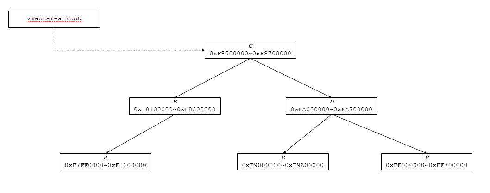

相对应红黑树的管理结构, 其链表串联的情况则是下面这样的.

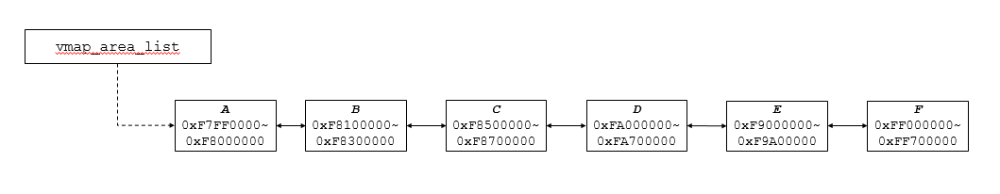

### 20.4.2. __vmalloc_area_node()

```cpp
static void *__vmalloc_area_node(struct vm_struct *area, gfp_t gfp_mask,
				 pgprot_t prot, int node)
{
	const int order = 0;
	struct page **pages;
	unsigned int nr_pages, array_size, i;
	const gfp_t nested_gfp = (gfp_mask & GFP_RECLAIM_MASK) | __GFP_ZERO;
	const gfp_t alloc_mask = gfp_mask | __GFP_NOWARN;

	nr_pages = get_vm_area_size(area) >> PAGE_SHIFT;
	array_size = (nr_pages * sizeof(struct page *));

	area->nr_pages = nr_pages;
	/* Please note that the recursion is strictly bounded. */
	if (array_size > PAGE_SIZE) {
		pages = __vmalloc_node(array_size, 1, nested_gfp|__GFP_HIGHMEM,
				PAGE_KERNEL, node, area->caller);
	} else {
		pages = kmalloc_node(array_size, nested_gfp, node);
	}
	area->pages = pages;
	if (!area->pages) {
		remove_vm_area(area->addr);
		kfree(area);
		return NULL;
	}

	for (i = 0; i < area->nr_pages; i++) {
		struct page *page;

		if (node == NUMA_NO_NODE)
			page = alloc_kmem_pages(alloc_mask, order);
		else
			page = alloc_kmem_pages_node(node, alloc_mask, order);

		if (unlikely(!page)) {
			/* Successfully allocated i pages, free them in __vunmap() */
			area->nr_pages = i;
			goto fail;
		}
		area->pages[i] = page;
		if (gfpflags_allow_blocking(gfp_mask))
			cond_resched();
	}

	if (map_vm_area(area, prot, pages))
		goto fail;
	return area->addr;

fail:
	warn_alloc_failed(gfp_mask, order,
			  "vmalloc: allocation failure, allocated %ld of %ld bytesn",
			  (area->nr_pages*PAGE_SIZE), area->size);
	vfree(area->addr);
	return NULL;
}
```

该函数首先计算需要申请的**内存空间页面数量 nr_pages**以及需要**存储等量页面指针的数组空间大小**, 如果**该数组所需内存空间超过单个页面**的时候, 将通过__**vmalloc_node()申请**, 否则使用**kmalloc_node()进行申请**.

如果**存放页面管理的数组空间申请失败**, 则**内存申请失败**并对前面申请的**虚拟空间！！！**还回.

接着**for 循环**主要是根据**页面数量**, 循环**申请内存页面空间**, 这是一个页面一个页面申请分配.

**物理内存空间申请成功**后, 将通过**map_vm_area**()进行**内存映射处理**.

vmalloc 不连续内存页面空间的申请分析完毕.

# 21. VMA

在 32 位系统中, **每个用户进程**可以拥有**3GB 大小的虚拟地址空间**, 通常要远大于物理内存, 那么如何管理这些虚拟地址空间呢?

**用户进程**通常会多次调用**malloc**()或使用**mmap**()接口**映射文件**到**用户空间**来进行**读写等操作**, 这些操作都会要求在**虚拟地址空间(！！！**)中**分配内存块**, 这些内存块基本上都是**离散的(！！！**).

- **malloc**()是**用户态**常用的**分配内存的接口 API**函数, 后面详细介绍其内核实现机制;

- **mmap**()是**用户态**常用的用于**建立文件映射**或**匿名映射**的函数, 后面详细介绍其内核实现机制.

这些**进程地址空间(！！！**)在**内核**中使用**struct vm_area_struct 数据结构**来描述, 简称**VMA**, 也被称为**进程地址空间**或**进程线性区**.

```cpp
struct task_struct{
    struct mm_struct *mm, *active_mm;
}

struct mm_struct {
    // vma 链表
	struct vm_area_struct *mmap;		/* list of VMAs */
	struct rb_root mm_rb;
}
```

由于**这些地址空间**归属于**各个用户进程**, 所以在**用户进程**的**struct mm_struct 数据结构**中也有**相应的成员**, 用于对这些 VMA 进行管理.

## 21.1. 数据结构

VMA 数据结构定义在 mm_types.h 文件中.

```cpp
// include/linux/mm_types.h
struct vm_area_struct {
	unsigned long vm_start;
	unsigned long vm_end;
	struct vm_area_struct *vm_next, *vm_prev;
	struct rb_node vm_rb;
	unsigned long rb_subtree_gap;

	/* Second cache line starts here. */

	struct mm_struct *vm_mm;	/* The address space we belong to. */
	pgprot_t vm_page_prot;		/* Access permissions of this VMA. */
	unsigned long vm_flags;		/* Flags, see mm.h. */
	struct {
		struct rb_node rb;
		unsigned long rb_subtree_last;
	} shared;
	struct list_head anon_vma_chain;
	struct anon_vma *anon_vma;
	const struct vm_operations_struct *vm_ops;
	unsigned long vm_pgoff;
	struct file * vm_file;
	void * vm_private_data;

#ifndef CONFIG_MMU
	struct vm_region *vm_region;	/* NOMMU mapping region */
#endif
#ifdef CONFIG_NUMA
	struct mempolicy *vm_policy;	/* NUMA policy for the VMA */
#endif
};
```

- vm_start 和 vm_end: 指定 VMA 在**进程地址空间**的**起始地址**和**结束地址**.
- vm_next 和 vm_prev: **进程的 VMA**都连接成一个**链表(！！！**).
- vm_rb: **VMA 作为一个节点**加入**红黑树**中, **每个进程的 struct mm_struct**数据结构中都有这样一棵红黑树**mm->mm_rb(！！！**).
- vm_mm: 指向该 VMA 所属的**进程 struct mm_struct 数据结构**.
- vm_page_prot: VMA 的**访问权限**.
- vm_flags: 描述该 VMA 的一组**标志位**.
- anon_vma_chain 和 anon_vma: 用于管理**RMAP 反向映射(！！！**).
- vm_ops: 指向许多方法的集合, 这些方法用于在**VMA**中执行**各种操作**, 通常用于**文件映射**.
- vm_pgoff: 指定**文件映射的偏移量**, 这个变量的**单位不是 Byte**, 而是**页面的大小(PAGE_SIZE**).
- vm_file: 指向 file 的实例, 描述**一个被映射的文件**.

**struct mm_struct**数据结构是描述**进程内存管理的核心数据结构**, 该数据结构也提供了管理 VMA 所需要的信息, 这些信息概况如下:

```c
[include/linux/mm_types.h]
struct mm_struct {
	struct vm_area_struct *mmap;		/* list of VMAs */
	struct rb_root mm_rb;
```

**每个 VMA(！！！**)都要连接到**mm_struct**中的**链表**和**红黑树**中, 以方便查找.

- **mmap**形成一个**单链表**, **进程**中**所有的 VMA(！！！**)都链接到这个**链表**中, **链表头**是**mm_struct->mmap**.
- **mm_rb**是**红黑树的根节点**, **每个进程**有一棵**VMA 的红黑树**.

VMA 按照**起始地址**以**递增的方式**插入**mm_struct->mmap 链表**中. 当**进程**拥有**大量的 VMA**时, **扫描链表**和**查找特定的 VMA**是非常**低效**的操作, 例如在云计算的机器中, 所以内核中通常要靠**红黑树**来协助, 以便提高查找速度.

## 21.2. 查找 VMA

通过**虚拟地址 addr**来**查找 VMA**是内核中常用的操作, 内核提供一个 API 函数来实现这个查找操作. **find_vma**()函数根据**给定地址 addr**查找满足如下条件之一的 VMA, 如图所示.

- **addr 在 VMA 空间范围**内, 即 vma->vm_start <= addr < vma->vm_end.
- **距离 addr 最近**并且 VMA 的结束地址大于 addr 的一个 VMA.

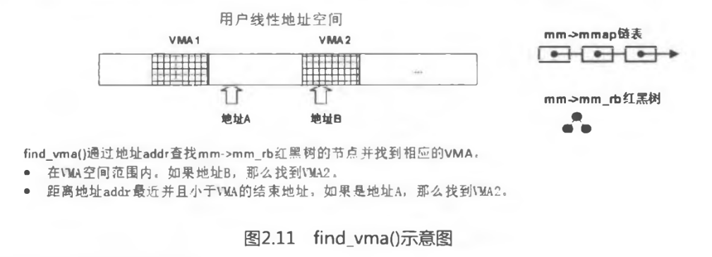

## 21.3. 插入 VMA

insert_vm_struct()是内核提供的**插入 VMA**的核心 API 函数.

```c
[mm/mmap.c]
int insert_vm_struct(struct mm_struct *mm, struct vm_area_struct *vma)
{
	struct vm_area_struct *prev;
	struct rb_node **rb_link, *rb_parent;

	if (!vma->vm_file) {
		BUG_ON(vma->anon_vma);
		vma->vm_pgoff = vma->vm_start >> PAGE_SHIFT;
	}
	if (find_vma_links(mm, vma->vm_start, vma->vm_end,
			   &prev, &rb_link, &rb_parent))
		return -ENOMEM;
	if ((vma->vm_flags & VM_ACCOUNT) &&
	     security_vm_enough_memory_mm(mm, vma_pages(vma)))
		return -ENOMEM;

	vma_link(mm, vma, prev, rb_link, rb_parent);
	return 0;
}
```

insert_vm_struct()函数向**VMA 链表**和**红黑树**插入一个**新的 VMA**. 参数**mm 是进程的内存描述符**, **vma**是要插入的**线性区 VMA**.

## 21.4. 合并 VMA

在**新的 VMA**被加入到**进程的地址空间**时, **内核**会检查它是否可以**与一个或多个现存的 VMA 进行合并**.

vma_merge()函数实现将一个**新的 VMA**和**附近的 VMA 合并**功能.

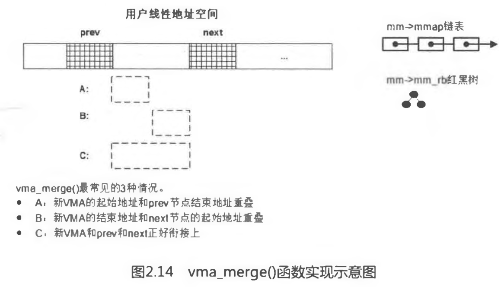

## 21.5. 小结

**进程地址空间**在**内核**中用**VMA 来抽象描述**, VMA 离散分布在 3GB 的用户空间中(32 位系统), 内核中提供相应的 API 来管理 VMA, 简单总结如下.

(1) 查找 VMA

```cpp
struct vm_area_struct *find_vma(struct mm_struct *mm, unsigned long addr)

struct vm_area_struct *
find_vma_prev(struct mm_struct *mm, unsigned long addr,
			struct vm_area_struct **pprev)

static inline struct vm_area_struct * find_vma_intersection(struct mm_struct * mm, unsigned long start_addr, unsigned long end_addr)
```

(2) 插入 VMA

```c
int insert_vm_struct(struct mm_struct *mm, struct vm_area_struct *vma)
```

(3) 合并 VMA

```c
struct vm_area_struct *vma_merge(struct mm_struct *mm,
			struct vm_area_struct *prev, unsigned long addr,
			unsigned long end, unsigned long vm_flags,
			struct anon_vma *anon_vma, struct file *file,
			pgoff_t pgoff, struct mempolicy *policy)
```

# 22. malloc

malloc()函数是 C 语言中内存分配函数

# 23. mmap

## 23.1. 概述

**mmap/munmap** 接口是**用户空间最常用的一个系统调用接口**, 无论是在**用户程序**中**分配内存**、**读写大文件**、**链接动态库文件**, 还是**多进程间共享内存**, 都可以看到 mmap/munmap 的身影.

mmap/munmap 函数声明如下:

```cpp
#include <sys/mman.h>
void *mmap(void *addr, size_t length, int prot, int flags,
            int fd, off_t offset);
int munmap(void *addr, size_t length);
```

- addr: 用于指定映射到**进程地址空间的起始地址**, 为了应用程序的可移植性, 一般设置为**NULL**,让内核来选择一个**合适的地址**.
- length: 表示映射到进程**地址空间的大小**.
- prot: 用于设置内存映射区域的**读写属性**等.
- flags: 用于设置**内存映射的属性**, 例如共享映射、私有映射等.
- fd: 表示这个是一个**文件映射**, fd 是打开**文件的句柄**.
- offset: 在**文件映射**时, 表示**文件的偏移量**.

**prot 参数**通常表示**映射页面的读写权限**, 可以有如下参数组合.

- PROT_EXEC: 表示映射的页面是可以**执行**的.
- PROT_READ: 表示映射的页面是可以**读取**的.
- PROT_WRITE: 表示映射的页面是可以**写入**的.
- PROT_NONE: 表示映射的页面是**不可访问**的.

**flags 参数**也是一个很重要的参数, 有如下常见参数.

- MAP_SHARED: 创建一个**共享映射的区域**. **多个进程**可以通过**共享映射方式**来**映射一个文件**, 这样**其他进程**也可以看到**映射内容的改变**, 修改后的内容会**同步到磁盘文件**中.
- MAP_PRIVATE: 创建一个**私有的写时复制的映射**. **多个进程**可以通过**私有映射的方式来映射一个文件**, 这样**其他进程不会看到映射内容的改变**, 修改后的内容也**不会同步到磁盘文件**中.
- MAP_ANONYMOUS: 创建一个**匿名映射**, 即**没有关联到文件的映射**.
- MAP_FIXED: 使用参数 addr 创建映射, 如果在内核中**无法映射**指定的地址 addr, 那 mmap 会返回失败, 参数 addr 要求**按页对齐**. 如果 addr 和 length 指定的进程地址空间和己有的 VMA 区域重叠, 那么内核会调用 do_munmap()函数把这段重叠区域销毁, 然后重新映射新的内容.
- MAP_POPULATE: 对于**文件映射**来说, 会**提前预读文件内容到映射区域**, 该特性**只支持私用映射**.

参数 fd 可以看出 mmap 映射是否和文件相关联, 因此在 Linux 内核中**映射**可以分成**匿名映射**和**文件映射**.

- **匿名映射**: **没有映射对应的相关文件**, 这种映射的**内存区域的内容会被初始化为 0**.

- **文件映射**: 映射和实际文件相关联, 通常是把**文件的内容**映射到**进程地址空间**, 这样**应用程序**就可以像**操作进程地址空间**一样**读写文件**.

可以看得出来, **匿名映射** **文件映射**都指的是**虚拟地址空间**

最后根据文件关联性和映射区域是否共享等属性, 又可以分成如下 4 种情况, 见表

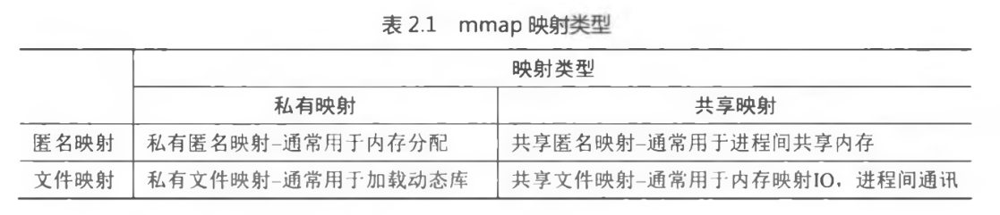

### 23.1.1. 私有匿名映射

当使用参数 **fd=-1** 且 `flags=MAP_ANONYMOUS | MAP_PRIVATE` 时, 创建的 mmap 映射是**私有匿名映射**.

私有匿名映射**最常见的用途**是在**glibc 分配大块的内存**中, 当需要分配的**内存大于 MMAP_THREASHOLD(128KB**)时, glibc 会默认使用**mmap 代替 brk 来分配内存**.

### 23.1.2. 共享匿名映射

当使用参数 fd=-1 且 flags=MAP_ANONYMOUS | MAP_SHARED 时, 创建的 mmap 映射是共享匿名映射. **共享匿名映射**让相关进程**共享一块内存区域**, 通常用于**父子进程之间通信**.

创建**共享匿名映射**有如下**两种方式**.

(1) `fd=-1` 且 flags=MAP_ANONYMOUS | MAP_SHARED. 在这种情况下, do_mmap_pgoff()->mmap_region()函数最终会调用 shmem_zero_setup()来打开一个 "`/dev/zero`" 特殊的设备文件.

(2) 另外一种是**直接打开"/dev/zero"设备文件**, 然后使用这个文件句柄来创建 mmap.

上述两种方式最终都是调用到**shmem 模块**来创建共享匿名映射.

### 23.1.3. 私有文件映射

创建**文件映射**时 flags 的标志位被设置为**MAP_PRIVATE**, 那么就会创建私有文件映射. 私有文件映射最常用的场景是**加载动态共享库**.

### 23.1.4. 共享文件映射

创建**文件映射**时 flags 的标志位被设置为**MAP_SHARED**,那么就会创建共享文件映射. 如果 prot 参数指定了 PROT_WRITE,那么打开文件时需要指定 O_RDWR 标志位. **共享文件映射**通常有如下两个场景.

(1) **读写文件**. 把**文件内容**映射到**进程地址空间**, 同时对映射的内容做了修改, 内核的**回写机制(writeback**) 最终会把修改的内容同步到磁盘中.

(2) **进程间通信**. 进程之间的进程地址空间相互隔离, 一个进程不能访问到另外一个进程的地址空间. 如果多个进程都同时映射到一个相同文件时, 就实现了多进程间的共享内存通信. 如果一个进程对映射内容做了修改, 那么另外的进程是可以看到的.

## 23.2. 小结

mmap 机制在 Linux 内核中实现的代码框架和**brk 机制**非常类似, 其中有很多关于 VMA 的操作. mmap 机制和缺页中断机制结合在一起会变得复杂很多.

mmap 机制在 Linux 内核中的代码流程如图所示.

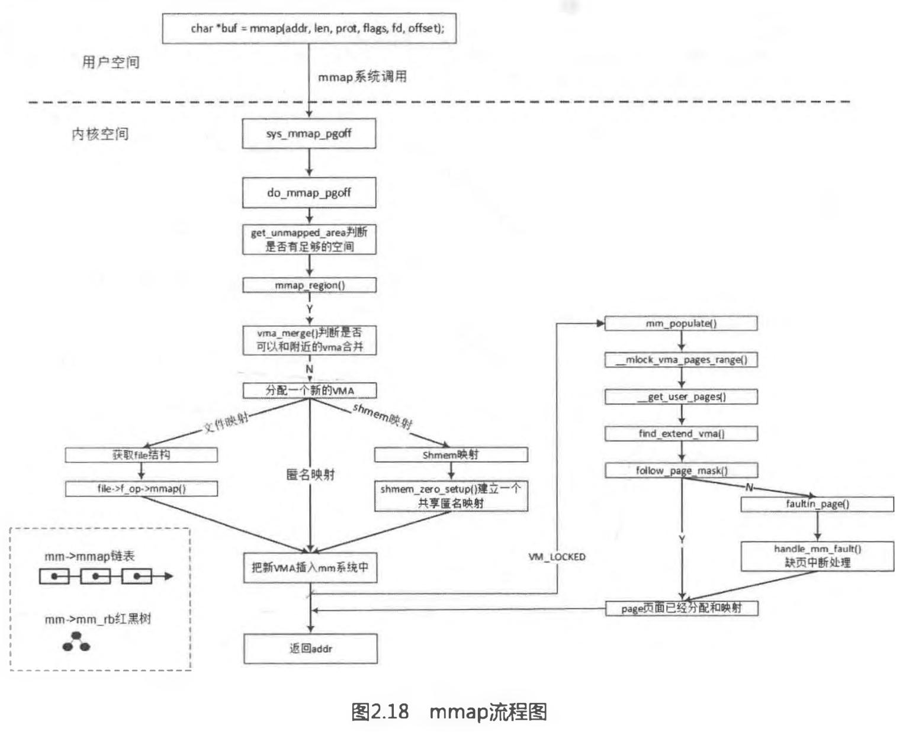

# 24. 缺页异常处理

在之前介绍**malloc**()和 **mmap**()两个用户态 API 函数的内核实现时, 它们**只建立了进程地址空间**, 在**用户空间**里可以看到**虚拟内存**, 但**没有建立虚拟内存**和**物理内存之间的映射关系(！！！**).

当**进程访问**这些**还没有建立映射关系的虚拟内存**时, 处理器自动触发一个**缺页异常(即缺页中断**), Linux 内核必须处理此异常. 缺页异常是内存管理中最复杂和重要的一部分, 需要考虑很多细节, 包括**匿名页面**, **KSM 页面**, **page cache 页面**, **写时复制**, **私有映射**和**共享映射**等.

缺页异常被触发通常有两种情况

1. 程序设计的不当导致访问了**非法的地址**

2. 访问的**地址是合法**的, 但是该地址还**未分配物理页框**

下面解释一下第二种情况, 这是虚拟内存管理的一个特性. 尽管**每个进程**独立拥有**3GB 的私有可访问地址空间**, 但是这些资源都是内核开出的空头支票, 也就是说**进程**手握着和自己相关的**一个个虚拟内存区域(vma**), 但是这些虚拟内存区域并**不会在创建的时候就和物理页框挂钩(！！！**), 由于程序的局部性原理, 程序在一定时间内所访问的内存往往是有限的, 因此内核**只会在进程确确实实需要访问物理内存**时才会将**相应的虚拟内存区域**与**物理内存**进行**关联**(为相应的地址**分配页表项！！！**, 并**将页表项映射到物理内存！！！**), 也就是说这种缺页异常是正常的, 而第一种缺页异常是不正常的, 内核要采取各种可行的手段将这种异常带来的破坏减到最小.

**32 位系统**中, 缺页异常的来源可分为两种, 一种是**内核空间**(访问线性地址空间的第 4 个 GB), 一种是**用户空间**(访问线性地址空间的 0~3GB)

**用户空间**的**缺页异常**可以分为两种情况

1. 触发异常的**线性地址**处于**用户空间的 vma**中, 但**还未分配物理页**, 如果**访问权限 OK**的话内核就**给进程分配相应的物理页**了

2. 触发异常的**线性地址不处于用户空间的 vma**中, 这种情况得**判断**是不是因为**用户进程**的**栈空间消耗完**而触发的**缺页异常**, 如果是的话则**在用户空间对栈区域进行扩展**, 并且分配相应的**物理页**, 如果**不是**则作为一次**非法地址**访问来处理, 内核将**终结进程**

缺页异常处理依赖于处理器的体系结构.

## 24.1. 缺页异常初始化

缺页异常初始化的地方. 缺页异常初始化函数为 `early_trap_init()` 或 `early_trap_pf_init()`, 在**setup_arch()中调用**.

```c
[arch/x86/kernel/traps.c]
void __init early_trap_init(void)
{
	set_intr_gate_notrace(X86_TRAP_DB, debug);
	/* int3 can be called from all */
	set_system_intr_gate(X86_TRAP_BP, &int3);
#ifdef CONFIG_X86_32
	set_intr_gate(X86_TRAP_PF, page_fault);
#endif
	load_idt(&idt_descr);
}

void __init early_trap_pf_init(void)
{
#ifdef CONFIG_X86_64
	set_intr_gate(X86_TRAP_PF, page_fault);
#endif
}
```

**set_intr_gate_notrace**()和**set_system_intr_gate**()分别设置了**调试**和**断点的中断处理**, set_intr_gate()正好设置了**缺页异常处理**, 最后通过**load_idt**()**刷新中断向量表**.

set_intr_gate()是一个宏定义.

```c
#define set_intr_gate(n, addr)
	do {
		set_intr_gate_notrace(n, addr);
		_trace_set_gate(n, GATE_INTERRUPT, (void *)trace_##addr,
				0, 0, __KERNEL_CS);
	} while (0)
```

它包含了两个动作, _set_gate()是用于设置中断向量, _trace_set_gate()的实现和_set_gate()一致, 也是写中断向量, 但是它写的是一个**中断跟踪向量表 trace_idt_table**, 写入处理函数为**trace_page_fault**(), 用于**中断向量跟踪**用的.

异常处理函数是 do_page_fault()

## 24.2. do_page_fault()

**缺页中断处理**的核心函数是**do_page_fault**(),该函数的实现和**具体的体系结构**相关.

```cpp
// arch/x86/mm/fault.c
dotraplinkage void notrace
do_page_fault(struct pt_regs *regs, unsigned long error_code)
{
    //读取 CR2 寄存器获取触发异常的访问地址
	unsigned long address = read_cr2(); /* Get the faulting address */
	enum ctx_state prev_state;

	prev_state = exception_enter();
	__do_page_fault(regs, error_code, address);
	exception_exit(prev_state);
}
NOKPROBE_SYMBOL(do_page_fault);
```

该函数传递两个参数

- regs 包含了各个寄存器的值
- error_code 是触发异常的错误类型

错误类型含义如下:

```c
[arch/x86/mm/fault.c]
/*
 * Page fault error code bits:
 *
 *   bit 0 ==	 0: no page found	1: protection fault
 *   bit 1 ==	 0: read access		1: write access
 *   bit 2 ==	 0: kernel-mode access	1: user-mode access
 *   bit 3 ==				1: use of reserved bit detected
 *   bit 4 ==				1: fault was an instruction fetch
 *   bit 5 ==				1: protection keys block access
 */
enum x86_pf_error_code {

	PF_PROT		=		1 << 0,
	PF_WRITE	=		1 << 1,
	PF_USER		=		1 << 2,
	PF_RSVD		=		1 << 3,
	PF_INSTR	=		1 << 4,
	PF_PK		=		1 << 5,
};
```

从 CR2 寄存器获取发生 page fault 的线性地址.

__do_page_fault()实现:

```cpp
// arch/x86/mm/fault.c
static noinline void
__do_page_fault(struct pt_regs *regs, unsigned long error_code,
		unsigned long address)
{
	struct vm_area_struct *vma;
	struct task_struct *tsk;
	struct mm_struct *mm;
	int fault, major = 0;
	unsigned int flags = FAULT_FLAG_ALLOW_RETRY | FAULT_FLAG_KILLABLE;
    // 获取当前进程
	tsk = current;
	// 获取当前进程的地址空间
	mm = tsk->mm;

	if (kmemcheck_active(regs))
		kmemcheck_hide(regs);
	prefetchw(&mm->mmap_sem);

	if (unlikely(kmmio_fault(regs, address)))
		return;
	// 判断 address 是否处于内核线性地址空间
	if (unlikely(fault_in_kernel_space(address))) {
	    // 判断是否处于内核态
		if (!(error_code & (PF_RSVD | PF_USER | PF_PROT))) {
			// 处理 vmalloc 异常
			if (vmalloc_fault(address) >= 0)
				return;

			if (kmemcheck_fault(regs, address, error_code))
				return;
		}

		/* Can handle a stale RO->RW TLB: */
		/*异常发生在内核地址空间但不属于上面的情况或上面的方式无法修正,
          则检查相应的页表项是否存在, 权限是否足够*/
		if (spurious_fault(error_code, address))
			return;

		/* kprobes don't want to hook the spurious faults: */
		if (kprobes_fault(regs))
			return;

		bad_area_nosemaphore(regs, error_code, address);

		return;
	}

	/* kprobes don't want to hook the spurious faults: */
	if (unlikely(kprobes_fault(regs)))
		return;

	if (unlikely(error_code & PF_RSVD))
		pgtable_bad(regs, error_code, address);

	if (unlikely(smap_violation(error_code, regs))) {
		bad_area_nosemaphore(regs, error_code, address);
		return;
	}

	if (unlikely(in_atomic() || !mm)) {
		bad_area_nosemaphore(regs, error_code, address);
		return;
	}

	if (user_mode_vm(regs)) {
		local_irq_enable();
		error_code |= PF_USER;
		flags |= FAULT_FLAG_USER;
	} else {
		if (regs->flags & X86_EFLAGS_IF)
			local_irq_enable();
	}

	perf_sw_event(PERF_COUNT_SW_PAGE_FAULTS, 1, regs, address);

	if (error_code & PF_WRITE)
		flags |= FAULT_FLAG_WRITE;

	if (unlikely(!down_read_trylock(&mm->mmap_sem))) {
		if ((error_code & PF_USER) == 0 &&
		    !search_exception_tables(regs->ip)) {
			bad_area_nosemaphore(regs, error_code, address);
			return;
		}
retry:
		down_read(&mm->mmap_sem);
	} else {
		/*
		 * The above down_read_trylock() might have succeeded in
		 * which case we'll have missed the might_sleep() from
		 * down_read():
		 */
		might_sleep();
	}
    // 试图寻找到一个离 address 最近的 vma, vma 包含 address 或在 address 之后
	vma = find_vma(mm, address);
	/*没有找到这样的 vma 则说明 address 之后没有虚拟内存区域, 因此该 address 肯定是无效的,
    通过 bad_area()路径来处理,bad_area()的主体就是__bad_area()-->bad_area_nosemaphore()*/
	if (unlikely(!vma)) {
		bad_area(regs, error_code, address);
		return;
	}
	/*如果该地址包含在 vma 之中, 则跳转到 good_area 处进行处理*/
	if (likely(vma->vm_start <= address))
		goto good_area;
	/*不是前面两种情况的话, 则判断是不是由于用户堆栈所占的页框已经使用完, 而一个 PUSH 指令
    引用了一个尚未和页框绑定的虚拟内存区域导致的一个异常, 属于堆栈的虚拟内存区, 其 VM_GROWSDOWN 位被置位*/
	if (unlikely(!(vma->vm_flags & VM_GROWSDOWN))) {
	    //不是堆栈区域, 则用 bad_area()来处理
		bad_area(regs, error_code, address);
		return;
	}
	//必须处于用户空间
	if (error_code & PF_USER) {
		/*这里检查 address, 只有该地址足够高(和堆栈指针的差不大于 65536+32*sizeof(unsigned long)),
        才能允许用户进程扩展它的堆栈地址空间, 否则 bad_area()处理*/
		if (unlikely(address + 65536 + 32 * sizeof(unsigned long) < regs->sp)) {
			bad_area(regs, error_code, address);
			return;
		}
	}
	//堆栈扩展不成功同样由 bad_area()处理
	if (unlikely(expand_stack(vma, address))) {
		bad_area(regs, error_code, address);
		return;
	}

good_area:
    /*访问权限不够则通过 bad_area_access_error()处理, 该函数是对__bad_area()的封装,
    只不过发送给用户进程的信号为 SEGV_ACCERR*/
	if (unlikely(access_error(error_code, vma))) {
		bad_area_access_error(regs, error_code, address);
		return;
	}
    /*分配新的页表和页框*/
	fault = handle_mm_fault(mm, vma, address, flags);
	major |= fault & VM_FAULT_MAJOR;

	if (unlikely(fault & VM_FAULT_RETRY)) {
		/* Retry at most once */
		if (flags & FAULT_FLAG_ALLOW_RETRY) {
			flags &= ~FAULT_FLAG_ALLOW_RETRY;
			flags |= FAULT_FLAG_TRIED;
			if (!fatal_signal_pending(tsk))
				goto retry;
		}

		/* User mode? Just return to handle the fatal exception */
		if (flags & FAULT_FLAG_USER)
			return;

		/* Not returning to user mode? Handle exceptions or die: */
		no_context(regs, error_code, address, SIGBUS, BUS_ADRERR);
		return;
	}

	up_read(&mm->mmap_sem);
	if (unlikely(fault & VM_FAULT_ERROR)) {
		mm_fault_error(regs, error_code, address, fault);
		return;
	}

	if (major) {
		tsk->maj_flt++;
		perf_sw_event(PERF_COUNT_SW_PAGE_FAULTS_MAJ, 1, regs, address);
	} else {
		tsk->min_flt++;
		perf_sw_event(PERF_COUNT_SW_PAGE_FAULTS_MIN, 1, regs, address);
	}

	check_v8086_mode(regs, address, tsk);
}
NOKPROBE_SYMBOL(__do_page_fault);
```

## 24.3. 内核空间异常处理

```c
[arch/x86/mm/fault.c]
static noinline void
__do_page_fault(struct pt_regs *regs, unsigned long error_code,
		unsigned long address)
{
	struct vm_area_struct *vma;
	struct task_struct *tsk;
	struct mm_struct *mm;
	int fault, major = 0;
	unsigned int flags = FAULT_FLAG_ALLOW_RETRY | FAULT_FLAG_KILLABLE;
    // 获取当前进程
	tsk = current;
	// 获取当前进程的地址空间
	mm = tsk->mm;

	if (kmemcheck_active(regs))
		kmemcheck_hide(regs);
	prefetchw(&mm->mmap_sem);

	if (unlikely(kmmio_fault(regs, address)))
		return;
    // 判断 address 是否处于内核线性地址空间
	if (unlikely(fault_in_kernel_space(address))) {
	    // 判断是否处于内核态
		if (!(error_code & (PF_RSVD | PF_USER | PF_PROT))) {
			// 处理 vmalloc 异常
			if (vmalloc_fault(address) >= 0)
				return;

			if (kmemcheck_fault(regs, address, error_code))
				return;
		}

		/* Can handle a stale RO->RW TLB: */
		/*异常发生在内核地址空间但不属于上面的情况或上面的方式无法修正,
          则检查相应的页表项是否存在, 权限是否足够*/
		if (spurious_fault(error_code, address))
			return;

		/* kprobes don't want to hook the spurious faults: */
		if (kprobes_fault(regs))
			return;

		bad_area_nosemaphore(regs, error_code, address);

		return;
	}
```

首先要检查该**异常的触发地址**是不是位于**内核地址空间**, 也就是**address>=TASK_SIZE_MAX**. 然后要检查**触发异常时是否处于内核态**, 满足**这两个条件**就尝试通过**vmalloc_fault**()来**解决这个异常**

```c
struct mm_struct init_mm = {
	.mm_rb		= RB_ROOT,
	.pgd		= swapper_pg_dir,
	.mm_users	= ATOMIC_INIT(2),
	.mm_count	= ATOMIC_INIT(1),
	.mmap_sem	= __RWSEM_INITIALIZER(init_mm.mmap_sem),
	.page_table_lock =  __SPIN_LOCK_UNLOCKED(init_mm.page_table_lock),
	.mmlist		= LIST_HEAD_INIT(init_mm.mmlist),
	INIT_MM_CONTEXT(init_mm)
};

#define pgd_offset(mm, address) ((mm)->pgd + pgd_index((address)))
#define pgd_offset_k(address) pgd_offset(&init_mm, (address))

static noinline int vmalloc_fault(unsigned long address)
{
	pgd_t *pgd, *pgd_ref;
	pud_t *pud, *pud_ref;
	pmd_t *pmd, *pmd_ref;
	pte_t *pte, *pte_ref;

	/* 确定触发异常的地址是否处于 VMALLOC 区域*/
	if (!(address >= VMALLOC_START && address < VMALLOC_END))
		return -1;

	WARN_ON_ONCE(in_nmi());
	// 对于内核线程, 仍然需要 page table 来访问 kernel 自己的空间.
	// 对于任何用户进程来说, 他们的内核空间都是 100%相同的
	// 可使用上一个被调用的用户进程的 mm 中的页表来访问内核地址
	// current->active_mm 就是上一个用户进程的 mm

    // 记录当前页表 pgd 对应 address 的偏移
	pgd = pgd_offset(current->active_mm, address);
	// 记录内核页表对应 address 的偏移
	pgd_ref = pgd_offset_k(address);
	if (pgd_none(*pgd_ref))
		return -1;
    // 当前 pgd 项为空, 则设置其与内核页表的 pgd_ref 相同
	if (pgd_none(*pgd)) {
		set_pgd(pgd, *pgd_ref);
		arch_flush_lazy_mmu_mode();
	} else {
		BUG_ON(pgd_page_vaddr(*pgd) != pgd_page_vaddr(*pgd_ref));
	}

	pud = pud_offset(pgd, address);
	pud_ref = pud_offset(pgd_ref, address);
	if (pud_none(*pud_ref))
		return -1;

	if (pud_none(*pud) || pud_page_vaddr(*pud) != pud_page_vaddr(*pud_ref))
		BUG();

	pmd = pmd_offset(pud, address);
	pmd_ref = pmd_offset(pud_ref, address);
	if (pmd_none(*pmd_ref))
		return -1;

	if (pmd_none(*pmd) || pmd_page(*pmd) != pmd_page(*pmd_ref))
		BUG();
    //获取 pmd_ref 对应 address 的 pte 项
	pte_ref = pte_offset_kernel(pmd_ref, address);
	// 判断 pte 项是否存在, 不存在则失败
	if (!pte_present(*pte_ref))
		return -1;

	pte = pte_offset_kernel(pmd, address);

	if (!pte_present(*pte) || pte_pfn(*pte) != pte_pfn(*pte_ref))
		BUG();

	return 0;
}
NOKPROBE_SYMBOL(vmalloc_fault);
```

执行到了 bad_area_nosemaphore(), 那么就表明这次异常是由于对非法的地址访问造成的. 在内核中产生这样的结果的情况一般有两种:

1.内核通过用户空间传递的系统调用参数, 访问了无效的地址

2.内核的程序设计缺陷

第一种情况内核尚且能通过异常修正机制来进行修复, 而第二种情况就会导致 OOPS 错误了, 内核将强制用 SIGKILL 结束当前进程.

内核态的 bad_area_nosemaphore()的实际处理函数为 bad_area_nosemaphore()-->__bad_area_nosemaphore()-->no_context()

## 24.4. 用户空间异常处理

**用户空间**的**缺页异常**可以分为两种情况

1. 触发异常的**线性地址**处于**用户空间的 vma**中, 但**还未分配物理页**, 如果**访问权限 OK**的话内核就**给进程分配相应的物理页**了

2. 触发异常的**线性地址不处于用户空间的 vma**中, 这种情况得**判断**是不是因为**用户进程**的**栈空间消耗完**而触发的**缺页异常**, 如果是的话则**在用户空间对栈区域进行扩展**, 并且分配相应的**物理页**, 如果**不是**则作为一次**非法地址**访问来处理, 内核将**终结进程**

```c
[arch/x86/mm/fault.c]
static noinline void
__do_page_fault(struct pt_regs *regs, unsigned long error_code,
		unsigned long address)
{
	struct vm_area_struct *vma;
	struct task_struct *tsk;
	struct mm_struct *mm;
	int fault, major = 0;
	unsigned int flags = FAULT_FLAG_ALLOW_RETRY | FAULT_FLAG_KILLABLE;
    // 获取当前进程
	tsk = current;
	// 获取当前进程的地址空间
	mm = tsk->mm;

    // 试图寻找到一个离 address 最近的 vma, vma 包含 address 或在 address 之后
	vma = find_vma(mm, address);
	/*没有找到这样的 vma 则说明 address 之后没有虚拟内存区域, 因此该 address 肯定是无效的,
    通过 bad_area()路径来处理,bad_area()的主体就是__bad_area()-->bad_area_nosemaphore()*/
	if (unlikely(!vma)) {
		bad_area(regs, error_code, address);
		return;
	}
	/*如果该地址包含在 vma 之中, 则跳转到 good_area 处进行处理*/
	if (likely(vma->vm_start <= address))
		goto good_area;
	/*不是前面两种情况的话, 则判断是不是由于用户堆栈所占的页框已经使用完, 而一个 PUSH 指令
    引用了一个尚未和页框绑定的虚拟内存区域导致的一个异常, 属于堆栈的虚拟内存区, 其 VM_GROWSDOWN 位被置位*/
	if (unlikely(!(vma->vm_flags & VM_GROWSDOWN))) {
	    //不是堆栈区域, 则用 bad_area()来处理
		bad_area(regs, error_code, address);
		return;
	}
	//必须处于用户空间
	if (error_code & PF_USER) {
		/*这里检查 address, 只有该地址足够高(和堆栈指针的差不大于 65536+32*sizeof(unsigned long)),
        才能允许用户进程扩展它的堆栈地址空间, 否则 bad_area()处理*/
		if (unlikely(address + 65536 + 32 * sizeof(unsigned long) < regs->sp)) {
			bad_area(regs, error_code, address);
			return;
		}
	}
	//堆栈扩展不成功同样由 bad_area()处理
	if (unlikely(expand_stack(vma, address))) {
		bad_area(regs, error_code, address);
		return;
	}

good_area:
    /*访问权限不够则通过 bad_area_access_error()处理, 该函数是对__bad_area()的封装,
    只不过发送给用户进程的信号为 SEGV_ACCERR*/
	if (unlikely(access_error(error_code, vma))) {
		bad_area_access_error(regs, error_code, address);
		return;
	}
    /*分配新的页表和页框*/
	fault = handle_mm_fault(mm, vma, address, flags);
	major |= fault & VM_FAULT_MAJOR;

	if (unlikely(fault & VM_FAULT_RETRY)) {
		/* Retry at most once */
		if (flags & FAULT_FLAG_ALLOW_RETRY) {
			flags &= ~FAULT_FLAG_ALLOW_RETRY;
			flags |= FAULT_FLAG_TRIED;
			if (!fatal_signal_pending(tsk))
				goto retry;
		}

		/* User mode? Just return to handle the fatal exception */
		if (flags & FAULT_FLAG_USER)
			return;

		/* Not returning to user mode? Handle exceptions or die: */
		no_context(regs, error_code, address, SIGBUS, BUS_ADRERR);
		return;
	}

	up_read(&mm->mmap_sem);
	if (unlikely(fault & VM_FAULT_ERROR)) {
		mm_fault_error(regs, error_code, address, fault);
		return;
	}

	if (major) {
		tsk->maj_flt++;
		perf_sw_event(PERF_COUNT_SW_PAGE_FAULTS_MAJ, 1, regs, address);
	} else {
		tsk->min_flt++;
		perf_sw_event(PERF_COUNT_SW_PAGE_FAULTS_MIN, 1, regs, address);
	}

	check_v8086_mode(regs, address, tsk);
}
```

bad_area()函数的主体函数为__bad_area()-->__bad_area_nosemaphore(): 错误发生在用户态, 则向用户进程发送一个 SIGSEG 信号

确定了这次异常是因**为物理页没分配而导致**后, 就通过 good_area 路径来处理, 可想而知, 该路径在确定了访问权限足够后, 将完成页表和物理页的分配, 这个任务有 handle_mm_fault()函数来完成

```c
int handle_mm_fault(struct mm_struct *mm, struct vm_area_struct *vma,
		    unsigned long address, unsigned int flags)
{
	int ret;

	__set_current_state(TASK_RUNNING);

	count_vm_event(PGFAULT);
	mem_cgroup_count_vm_event(mm, PGFAULT);

	/* do counter updates before entering really critical section. */
	check_sync_rss_stat(current);

	if (flags & FAULT_FLAG_USER)
		mem_cgroup_oom_enable();

	ret = __handle_mm_fault(mm, vma, address, flags);

	if (flags & FAULT_FLAG_USER) {
		mem_cgroup_oom_disable();
                if (task_in_memcg_oom(current) && !(ret & VM_FAULT_OOM))
                        mem_cgroup_oom_synchronize(false);
	}

	return ret;
}
EXPORT_SYMBOL_GPL(handle_mm_fault);
```

handle_pte_fault()函数的处理比较复杂, 因为它要根据 pte 页表项对应的物理页的不同状态来做各种不同的处理

## 24.5. 小结

整个缺页异常的处理过程非常复杂, 我们这里只简单介绍一下缺页涉及到的函数.

当 CPU 产生一个**异常**时, 将会跳转到异常处理的整个处理流程中. 对于缺页异常, CPU 将跳转到 page_fault 异常处理程序中, 该异常处理程序会调用 do_page_fault()函数, 该函数通过读取 CR2 寄存器获得引起缺页的线性地址, 通过**各种条件**判断以便确定一个**合适的方案**来处理这个异常.

do_page_fault()该函数通过**各种条件**来检测当前发生异常的情况, 但至少 do_page_fault()会区分出**引发缺页的两种情况**:

- 由**编程错误**引发异常
- 由**进程地址空间**中还**未分配物理内存**的**线性地址**引发

对于**后一种情况**, 通常还分为**用户空间所引发的缺页异常**和**内核空间引发的缺页异常**.

**内核**引发的异常是由**vmalloc**()产生的, 它**只用于内核空间内存的分配**.

我们这里需要关注的是**用户空间所引发的异常**情况. 这部分工作从 do_page_fault()中的**good_area 标号**处开始执行, 主要通过**handle_mm_fault**()完成.

**handle_mm_fault**()该函数的主要功能是**为引发缺页的进程**分配**一个物理页框**, 它先确定与**引发缺页的线性地址**对应的**各级页目录项是否存在**, 如果**不存在则进行分配**. 具体如何分配这个页框是通过调用**handle_pte_fault**()完成的.

**handle_pte_fault**()该函数根据**页表项 pte**所描述的**物理页框**是否在**物理内存**中, 分为**两大类**:

- **请求调页**: **被访问的页框不在主存**中, 那么此时**必须分配一个页框**.
- **写时复制**: 被访问的**页存在**, 但是该**页是只读**的, 内核**需要对该页进行写**操作, 此时内核将这个**已存在的只读页中的数据**复制到一个**新的页框**中.

用户进程访问由**malloc**()分配的内存空间属于第一种情况.

对于**请求调页**, handle_pte_fault()仍然将其细分为三种情况:

1.如果**页表项确实为空(pte_none(entry**)), 那么**必须分配页框**. 如果**当前进程**实现了 vma 操作函数集合中的**fault 钩子**函数, 那么这种情况属于**基于文件的内存映射**, 它调用**do_linear_fault**()进行**分配物理页框**. 否则, 内核将调用针对**匿名映射分配物理页框**的函数**do_anonymous_page**().

2.如果检测出该**页表项为非线性映射(pte_file(entry**)), 则调用**do_nonlinear_fault**()分配**物理页**.

3.如果**页框事先被分配**, 但是此刻已经由**主存**换出到了**外存**, 则调用**do_swap_page**()完成**页框分配**.

在以上三个函数中缺页异常处理函数通过 alloc_zeroed_user_highpage_movable()来完成**物理页的分配**过程. alloc_zeroed_user_highpage_movable()函数最终调用了**alloc_pages**().  经过这样一个复杂的过程, 用户进程所访问的**线性地址**终于对应到了一块**物理内存**.

缺页异常在 linux 内核处理中占有非常重要的位置, 很多 linux 特性, 如写时复制, 页框延迟分配, 内存回收中的磁盘和内存交换, 都需要借助缺页异常来进行, 缺页异常处理程序主要处理以下四种情形:

1. 请求调页: 当进程调用 malloc()之类的函数调用时, 并未实际上分配物理内存, 而是仅仅分配了一段线性地址空间, 在实际访问该页框时才实际去分配物理页框, 这样可以节省物理内存的开销, 还有一种情况是在内存回收时, 该物理页面的内容被写到了磁盘上, 被系统回收了, 这时候需要再分配页框, 并且读取其保存的内容.
2. 写时复制:当 fork()一个进程时, 子进程并未完整的复制父进程的地址空间, 而是共享相关的资源, 父进程的页表被设为只读的, 当子进程进行写操作时, 会触发缺页异常, 从而为子进程分配页框.
3. 地址范围外的错误:内核访问无效地址, 用户态进程访问无效地址等.
4. 内核访问非连续性地址: 用于内核的高端内存映射, 高端内存映射仅仅修改了主内核页表的内容, 当进程访问内核态时需要将该部分的页表内容复制到自己的进程页表里面.

缺页异常处理程序有可能发生在用户态或者内核态的代码中, 在这两种形态下, 有可能访问的是内核空间或者用户态空间的内存地址, 因此, 按照排列组合, 需要考虑下列的四种情形, 如图所示:

缺页异常发生在内核态:

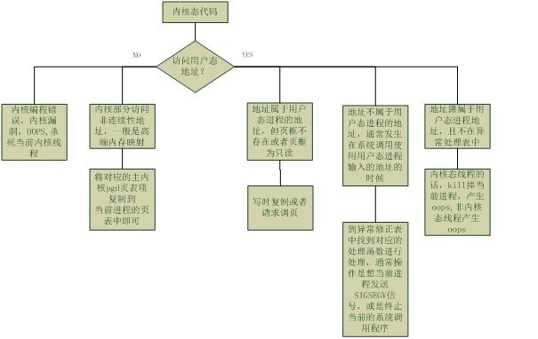

缺页异常发生在用户态:


缺页中断流程图

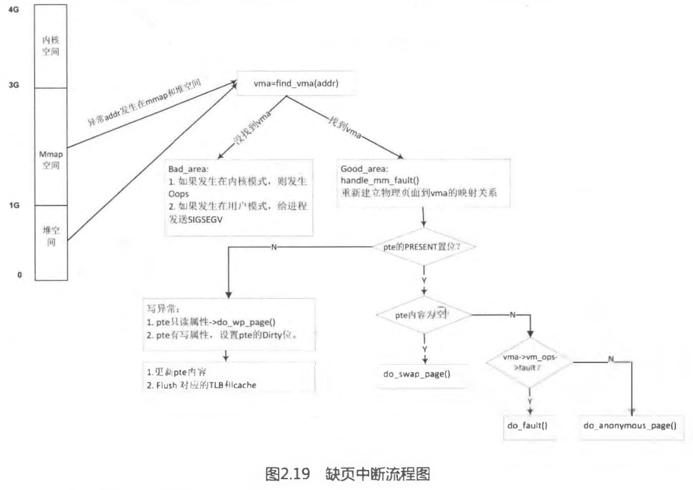

缺页中断发生后, 根据 pte 页表项中的 PRESENT 位、pte 内容是否为空(pte_none()宏)以及是否文件映射等条件, 相应的处理函数如下.

1. 匿名页面缺页中断 do_anonymous_page()

(1)判断条件: pte 页表项中 PRESENT 没有置位、pte 内容为空且没有指定 vma->vm_ops->fault()函数指针.

(2)应用场合: malloc()分配内存.

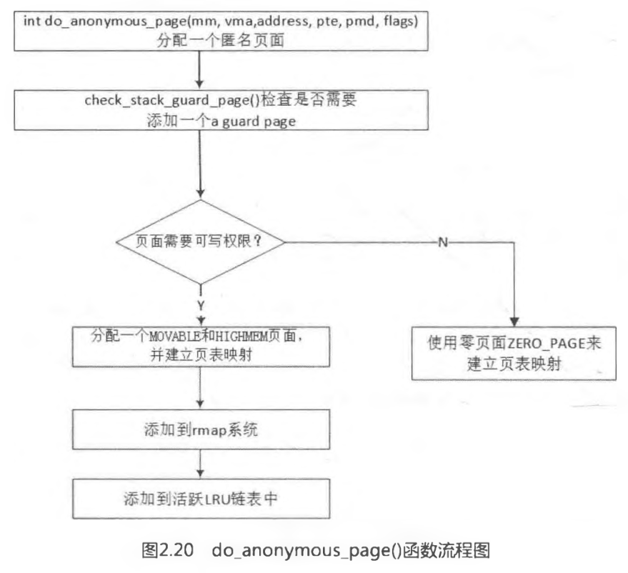

2. 文件映射缺页中断 do_fault()

(1) 判断条件: pte 页表项中的 PRESENT 没有置位、pte 内容为空且指定了 vma->vm_
ops->fault〇函数指针. do_fault()属于在文件映射中发生的缺页中断的情况.

- 如果仅发生读错误, 那么调用 do_read_fault()函数去读取这个页面.
- 如果在私有映射 VMA 中发生写保护错误, 那么发生写时复制, 新分配一个页面 new_page, 旧页面的内容要复制到新页面中, 利用新页面生成一个 PTE entry 并设置到硬件页表项中, 这就是所谓的写时复制 COW .
- 如果写保护错误发生在共享映射 VMA 中, 那么就产生了脏页, 调用系统的回写机制来回写这个脏页.

(2) 应用场合:

- 使用 mmap 读文件内容, 例如驱动中使用 mmap 映射设备内存到用户空间等.
- 动态库映射 , 例如不同的进程可以通过文件映射来共享同一个动态库.

3. swap 缺页中断 do_swap_page()

判断条件: pte 页表项中的 PRESENT 没有置位且 pte 页表项内容不为空.

4. 写时复制 COW 缺页中断 do_wp_page()

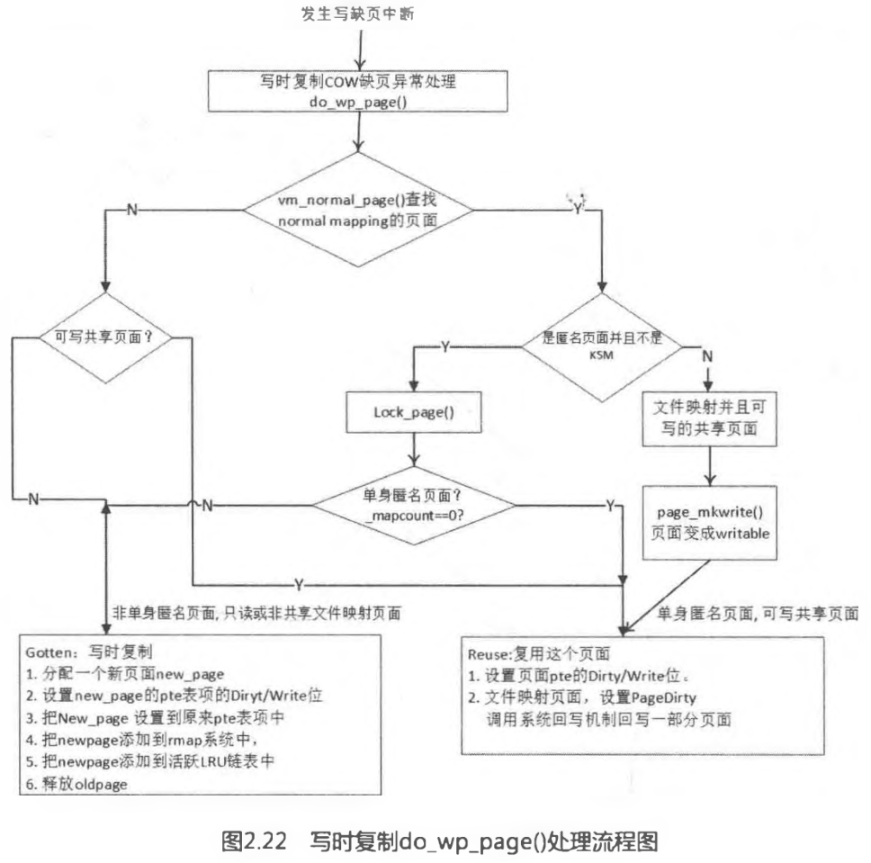

(1) do_wp_page 最终有两种处理情况.

- reuse 复用 old_page: 单身匿名页面和可写的共享页面.

- gotten 写时复制: 非单身匿名页面、只读或者非共享的文件映射页面.

(2) 判断条件: pte 页表项中的 PRESENT 置位了且发生写错误缺页中断.

(3)  应用场景: fork. 父进程 fork 子进程, 父子进程都共享父进程的匿名页面, 当其中一方需要修改内容时, COW 便会发生.

总之, 缺页中断是内存管理中非常重要的一种机制, 它和内存管理中大部分的模块都有联系, 例如 brk、mmap、反向映射等. 学习和理解缺页中断是理解内存管理的基石, 其中 Dirty C O W 是学习和理解缺页中断的最好的例子之一

# 25. Page 引用计数

```
struct page 数据结构中的_count 和_mapcount 有什么区别?
匿名页面和 page cache 页面有什么区别?
struct page 数据结构中有一个锁, 请问 trylock_page()和 lock_page()有什么区别?
```

## 25.1. struct page 数据结构

大量使用了 C 语言的联合体 Union 来优化其数据结构的大小, 因为每个物理页面都需要一个 struct page 数据结构, 因此管理成本很高.

page 数据结构的主要成员如下:

## 25.2. _count 和_mapcount 的区别

_**count**和_**mapcount**是 struct **page 数据结构**中非常的两个引用计数, 且都是**atomic_t 类型**的变量.

### 25.2.1. _count

_**count**表示**内核引用该页面的次数**. 当_count 的值是**0**时, 表示该页面为**空闲**或即**将被释放**的页面. 当_count 的值**大于 0**时, 表示该 page 页面己经**被分配**且内核**正在使用**, 暂时不会被释放.

内核中常用的**加减_count 引用计数**的 API 为 get_page()和 put_page().

```c
[include/linux/mm.h]
static inline void get_page(struct page *page)
{
	VM_BUG_ON_PAGE(atomic_read(&page->_count) <= 0, page);
	atomic_inc(&page->_count);
}

[mm/swap.c]
static void __put_single_page(struct page *page)
{
	__page_cache_release(page);
	free_hot_cold_page(page, false);
}
void put_page(struct page *page)
{
	if (put_page_testzero(page))
		__put_single_page(page);
}
EXPORT_SYMBOL(put_page);
```

get_page()首先利用 VM_BUG_ON_PAGE()来判断页面的_count 的值不能小于等于 0,这是因为页面伙伴分配系统分配好的页面初始值为 1, 然后直接使用 atomic_inc()函数原子地增加引用计数.

put_page()首先也会使用 VM_BUG_ON_PAGE()判断_count 计数不能为 0, 如果为 0,说明这页面己经被释放了. 如果_**count 计数减 1 之后等于 0**, 就会调用__**put_single_page()来释放这个页面(！！！**).

内核还有一对常用的变种宏, 如下:

```c
#define page_cache_get(page)		get_page(page)
#define page_cache_release(page)	put_page(page)
```

..............


### 25.2.2. _mapcount

_mapcount 引用计数表示**这个页面**被**进程映射的个数**, 即己经映射了**多少个用户 pte 页表**. 在 32 位 Linux 内核中, **每个用户进程**都拥有**3GB 的虚拟空间**和**一份独立的页表**, 所以有可能出现**多个用户进程地址空间**同时映射到**一个物理页面**的情况, **RMAP 反向映射系统**就是利用这个特性来实现的. _mapcount 引用计数主要用于 RMAP 反向映射系统中.

- _mapcount==-1, 表示**没有 pte 映射到页面**中.
- _mapcount= 0 , 表示**只有父进程映射了页面**. 匿名页面刚分配时, _mapcount 引用计数**初始化为 0**. 例如 do_anonymous_page()产生的匿名页面通过 page_add_new_anon_rmap()添加到反向映射 rmap 系统中时, 会设置_mapcount 为 0, 表明匿名页面当前只有父进程的 pte 映射了页面.

```c
[发生缺页中断->handle_mm_fault()->handle_pte_fault()->do_anonymous_page()->page_add_new_anon_rmap()]

void page_add_new_anon_rmap(struct page *page,
	struct vm_area_struct *vma, unsigned long address)
{
	VM_BUG_ON_VMA(address < vma->vm_start || address >= vma->vm_end, vma);
	SetPageSwapBacked(page);
	atomic_set(&page->_mapcount, 0); /* increment count (starts at -1) */
	...
}
```

- _mapcount>0, 表示除了**父进程**外还有**其他进程映射了这个页面**. 同样以子进程被创建时共享父进程地址空间为例, 设置父进程的 pte 页表项内容到子进程中并增加该页面的_mapcount 计数, 见 do_fork()->copy_process()->copy_mm()>dup_mmap()->copy_pte_range()->copy_one_pte()函数.

```c
static inline unsigned long
copy_one_pte(struct mm_struct *dst_mm, struct mm_struct *src_mm,
		pte_t *dst_pte, pte_t *src_pte, struct vm_area_struct *vma,
		unsigned long addr, int *rss)
{
    ...
	page = vm_normal_page(vma, addr, pte);
	if (page) {
	    // 增加_count 计数
		get_page(page);
		// 增加_mapcount 计数
		page_dup_rmap(page);
		if (PageAnon(page))
			rss[MM_ANONPAGES]++;
		else
			rss[MM_FILEPAGES]++;
	}
    ...
}
```

# 26. 反向映射 RMAP

**用户进程**在使用**虚拟内存**过程中, 从**虚拟内存页面**映射到**物理内存页面**, PTE 页表项保留着这个记录, **page 数据结构**中的_**mapcount**成员记录有**多少个用户 PTE 页表项映射了物理页面**.

**用户 PTE 页表项**是指**用户进程地址空间**和**物理页面**建立映射的**PTE 页表项**, **不包括内核地址空间映射物理页面产生的 PTE 页表项**.

有的**页面**需要**被迁移**, 有的页面长时间不使用需要**被交换到磁盘**. 在交换之前, 必须找出**哪些进程使用这个页面**, 然后**断开这些映射的 PTE**.

**一个物理页面**可以同时被**多个进程的虚拟内存映射**, **一个虚拟页面**同时**只能有一个物理页面与之映射**.

之前, 为确定**某一个页面**是否被**某个进程映射**, 必须**遍历每个进程的页表**, 工作量相当大, 效率很低. 后续提出**反向映射(the object-based
reverse-mapping VM, RMAP**), 资料: https://lwn.net/Articles/23732/

## 26.1. 父进程分配匿名页面

**父进程**为自己的**进程地址空间 VMA**分配**物理内存**时, 通常会产生**匿名页面**.

例如**do_anonymous_page**()会分配**匿名页面**, **do_wp_page**()发生**写时复制 COW(！！！**)时也会产生一个**新的匿名页面**.

以 do_anonymous_page()分配一个**新的匿名页面**为例:

```c
[用户态 malloc()分配内存 -> 写入该内存 -> 内核缺页中断 -> do_anonymous_page()]
[mm/memory.c]
static int do_anonymous_page(struct mm_struct *mm, struct vm_area_struct *vma,
		unsigned long address, pte_t *page_table, pmd_t *pmd,
		unsigned int flags)
{
    ......
    // 位置 1
    if (unlikely(anon_vma_prepare(vma)))
		goto oom;
	// 位置 2
	page = alloc_zeroed_user_highpage_movable(vma, address);
	if (!page)
		goto oom;
	....
	// 位置 3
	page_add_new_anon_rmap(page, vma, address, false);
	......
}
```

在**分配匿名页面**时, 调用**RMAP 反向映射系统**的**两个 API 接口**来完成**初始化**, 一个是**anon_vma_prepare**()函数, 另一个**page_add_new_anon_rmap**()函数.

**anon_vma_prepare**()函数实现:

```c
[do_anonymous_page() -> anon_vma_prepare()]
[mm/rmap.c]
int anon_vma_prepare(struct vm_area_struct *vma)
{
    // VMA 数据结构中有一个成员 anon_vma 用于指向 anon_vma 数据结构,
    // 如果 VMA 还没有分配过匿名页面, 那么 vma->anon_vma 为 NULL.
	struct anon_vma *anon_vma = vma->anon_vma;
	struct anon_vma_chain *avc;

	might_sleep();
	if (unlikely(!anon_vma)) {
		struct mm_struct *mm = vma->vm_mm;
		struct anon_vma *allocated;
        // 分配一个 struct anon_vma_chain 数据结构 ac
		avc = anon_vma_chain_alloc(GFP_KERNEL);
		if (!avc)
			goto out_enomem;
        // 位置 1
		anon_vma = find_mergeable_anon_vma(vma);
		allocated = NULL;
		if (!anon_vma) {
			anon_vma = anon_vma_alloc();
			if (unlikely(!anon_vma))
				goto out_enomem_free_avc;
			allocated = anon_vma;
		}

		anon_vma_lock_write(anon_vma);
		/* page_table_lock to protect against threads */
		spin_lock(&mm->page_table_lock);
		if (likely(!vma->anon_vma)) {
			vma->anon_vma = anon_vma;
			// 位置 1
			anon_vma_chain_link(vma, avc, anon_vma);
			/* vma reference or self-parent link for new root */
			anon_vma->degree++;
			allocated = NULL;
			avc = NULL;
		}
		spin_unlock(&mm->page_table_lock);
		anon_vma_unlock_write(anon_vma);

		if (unlikely(allocated))
			put_anon_vma(allocated);
		if (unlikely(avc))
			anon_vma_chain_free(avc);
	}
	return 0;

 out_enomem_free_avc:
	anon_vma_chain_free(avc);
 out_enomem:
	return -ENOMEM;
}
```

**anon_vma_prepare**()函数主要**为进程地址空间 VMA**准备**struct anon_vma 数据结构**和一些管理用的**链表**.

分配一个 struct anon_vma_chain 数据结构 avc;

检查是否可以复用当前 vma 的前继和后继者的 anon_vma. 如果相邻 VMA 无法复用, 从新分配一个 anon_vma 数据结构;

将 vma->anon_vma 指向刚分配的 anon_vma, 将刚分配的 avc 添加到 vma 的 anon_vma_chain 链表中, 另外把 avc 添加到 anon_vma->rb_root 红黑树中.

**RMAP 反向映射系统**中有两个重要的**数据结构**,

- 一个是**anon_vma**, 简称**AV**;
- 另一个是**anon_vma_chain**, 简称**AVC**.

struct anon_vma 数据结构定义如下:

```c
[include/linux/rmap.h]
struct anon_vma {
	struct anon_vma *root;		/* Root of this anon_vma tree */
	struct rw_semaphore rwsem;	/* W: modification, R: walking the list */
	atomic_t refcount;
	unsigned degree;
	struct anon_vma *parent;	/* Parent of this anon_vma */
	struct rb_root rb_root;	/* Interval tree of private "related" vmas */
};
```

- root: 指向 anon_vma 数据结构中的**根节点**.
- rwsem: 保护 anon_vma 中链表的**读写信号量**.
- refcount: **引用计数**.
- parent: 指向**父 anon_vma 数据结构**.
- rb_root: **红黑树根节点**. **anon_vma**内部有一棵**红黑树(！！！**).

struct **anon_vma_chain**数据结构是**连接父子进程中的枢纽**.

```c
[include/linux/rmap.h]
struct anon_vma_chain {
	struct vm_area_struct *vma;
	struct anon_vma *anon_vma;
	struct list_head same_vma;   /* locked by mmap_sem & page_table_lock */
	struct rb_node rb;			/* locked by anon_vma->rwsem */
	unsigned long rb_subtree_last;
};
```

- vma: **指向 VMA**, 可以指向**父进程**的 VMA, 也可以指向**子进程**的 VMA, 具体情况需要具体分析.
- anon_vma: 指向**anon_vma**数据结构, 可以指向**父进程**的 anon_vma 数据结构, 也可以指向**子进程**的 anon_vma 数据结构, 具体情况需要具体分
- same_vma: **链表节点**, 通常把 **anon_vma_chain** 添加到 **vma-> anon_vma_chain 链表**中.
- rb: **红黑树节点**, 通常把 anon_vma_chain 添加到**anon_vma->rb_root 的红黑树**中.


父进程分配匿名页面的状态如图, 归纳:

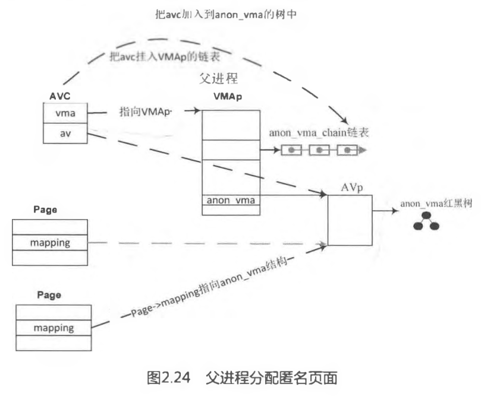

- **父进程**的**每个 VMA**中有一个**anon_vma**数据结构(下文用**AVp 来表示**), vma->anon_vma 指向 AVp.
- 和 VMAp 相关的**物理页面 page->mapping 都指向 AVp**.
- 有一个**anon_vma_chain 数据结构 AVC**, 其中**avc->vma 指向 VMA**, **avc->av 指向 AVp**.
- AVC 添加到 VMAp->anon_vma_chain 链表中.
- AVC 添加到 AVp->anon_vma 红黑树中.

## 26.2. 父进程创建子进程

**父进程**通过**fork 系统调用**创建**子进程**时, **子进程**会**复制父进程的进程地址空间 VMA 数据结构的内容**作为自己的**进程地址空间**, 并且会**复制父进程的 pte 页表项内容**到**子进程的页表**中, 实现**父子进程共享页表**. 多个**不同子进程**中的**虚拟页面**会同时映射到**同一个物理页面**, 另外多个**不相干的进程**的**虚拟页面**也可以通过**KSM 机制**映射到**同一个物理页面**中, 这里暂时只讨论前者.

为了实现**RMAP 反向映射系统**, 在**子进程复制父进程的 VMA**时, 需要添加**hook 钩子**.

**fork 系统调用**实现在 kernel/fork.c 文件中, 在**dup_mmap**()中**复制父进程的进程地址空间**函数

## 26.3. 子进程发生 COW

如果**子进程的 VMA**发生**COW**, 那么会使用**子进程 VMA 创建的 anon_vma 数据结构**, 即**page->mmaping**指针指向**子进程 VMA 对应的 anon_vma 数据结构**. 在 do_wp_page()函数中处理 COW 场景的情况.

```c
子进程和父进程共享的匿名页面, 子进程的 VMA 发生 COW

->缺页中断发生
    ->handle_pte_fault
        ->do_wp_page
        ->分配一个新的匿名页面
            -> __page_set_anon_rmap 使用子进程的 anon_vma 来设置 page->mapping
```

## 26.4. RMAP 应用

内核中经常有**通过 struc page 数据结构**找到**所有映射这个 page 的 VMA**的需求. 早期的 Linux 内核的实现通过**扫描所有进程的 VMA**,这种方法相当耗时. 在 Linux2.5 开发期间,反向映射的概念已经形成, 经过多年的优化形成现在的版本.

反向映射的典型应用场景如下.

- **kswapd 内核线程回收页面**需要**断开所有映射**了该**匿名页面**的**用户 PTE 页表项**.
- **页面迁移**时, 需要**断开所有映射**到**匿名页面**的**用户 PTE 页表项**.

反向映射的核心函数是 try_to_unmap(),内核中的其他模块会调用此函数来断开一个页面的所有映射.

```c
[mm/rmap.c]
int try_to_unmap(struct page *page, enum ttu_flags flags)
{
	int ret;
	struct rmap_walk_control rwc = {
		.rmap_one = try_to_unmap_one,
		.arg = (void *)flags,
		.done = page_not_mapped,
		.anon_lock = page_lock_anon_vma_read,
	};
	ret = rmap_walk(page, &rwc);

	if (ret != SWAP_MLOCK && !page_mapped(page))
		ret = SWAP_SUCCESS;
	return ret;
}
```

try_to_unmap()函数返回值如下.

- SWAP_SUCCESS: 成功解除了所有映射的 pte.
- SWAP_AGAIN: 可能错过了一个映射的 pte, 需要重新来一次.
- SWAP_FAIL: 失败.
- SWAP_MLOCK: 页面被锁住了.

内核中有**3 种页面需要 unmap**操作, 即**KSM 页面**、**匿名页面**和**文件映射页面**, 因此定义一个**rmap_walk_control**控制数据结构来统一管理**unmap 操作**.

```c
struct rmap_walk_control {
	void *arg;
	int (*rmap_one)(struct page *page, struct vm_area_struct *vma,
					unsigned long addr, void *arg);
	int (*done)(struct page *page);
	struct anon_vma *(*anon_lock)(struct page *page);
	bool (*invalid_vma)(struct vm_area_struct *vma, void *arg);
};
```
struct rmap_walk_control 数据结构定义了一些函数指针, 其中, rmap_one 表示具体断开某个 VMA 上映射的 pte, done 表示判断一个页面是否断开成功的条件, anon_lock 实现一个锁机制, invalid_vma 表示跳过无效的 VMA.

```c
// [try_to_unmap() ->rmap_walk() ->rmap_walk_anon()]
static int rmap_walk_anon(struct page *page, struct rmap_walk_control *rwc)
{
	struct anon_vma *anon_vma;
	pgoff_t pgoff;
	struct anon_vma_chain *avc;
	int ret = SWAP_AGAIN;

	anon_vma = rmap_walk_anon_lock(page, rwc);
	if (!anon_vma)
		return ret;

	pgoff = page_to_pgoff(page);
	anon_vma_interval_tree_foreach(avc, &anon_vma->rb_root, pgoff, pgoff) {
		struct vm_area_struct *vma = avc->vma;
		unsigned long address = vma_address(page, vma);

		if (rwc->invalid_vma && rwc->invalid_vma(vma, rwc->arg))
			continue;

		ret = rwc->rmap_one(page, vma, address, rwc->arg);
		if (ret != SWAP_AGAIN)
			break;
		if (rwc->done && rwc->done(page))
			break;
	}
	anon_vma_unlock_read(anon_vma);
	return ret;
}
```

rmap_walk_anon_lock()获取页面 page->mapping 指向的 anon_vma 数据结
构, 并申请一个读者锁.

遍历 anon_vma->rb_root 红黑树中的 avc, 从 avc 中可以得到相应的 VMA, 然后调用 rmap_one()来完成断开用户 PTE 页表项.

## 26.5. 小结

早期的 Linux 2.6 的 RMAP 实现如图 2.25 所示, 父进程的 VMA 中有一个 struct anon_vma 数据结构(简称 AVp), page->mapping 指向 AVp 数据结构, 另外父进程和子进程所有映射了页面的 VMAs 都挂入到父进程的 AVp 的一个链表中. 当需要从物理页面找出所有映射页面的 VMA 时, 只需要从物理页面的 page->mapping 找到 AVp, 再遍历 AVp 链表即可. 当子进程的虚拟内存发生写时复制 COW 时, 新分配的页面 COW_Page->mapping 依然指向父进程的 AVp 数据结构. 这个模型非常简洁, 而且通俗易懂, 但也有致命的弱点, 特别是在负载重的服务器中, 例如父进程有 1000 个子进程, 每个子进程都有一个 VMA , 这个 VMA 中有 1000 个匿名页面, 当所有的子进程的 VMA 中的所有匿名页面都同时发生写时复制时, 情况会很糟糕. 因为在父进程的 AVp 队列中会有 100 万个匿名页面, 扫描这个队列要耗费很长的时间.

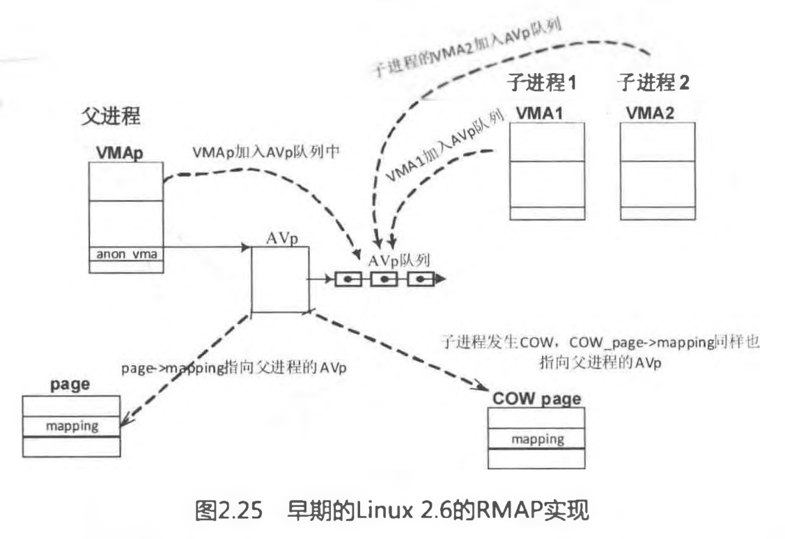

Linux 2.6.34 内核对 RMAP 反向映射系统进行了优化, 模型和现在 Linux 4.0 内核中的模型相似, 如图 2.26 所示, 新增加了 AVC 数据结构(struct anon_vma_chain),父进程和子进程都有各自的 AV 数据结构且都有一棵红黑树(简称 AV 红黑树), 此外, 父进程和子进程都有各自的 AVC 挂入进程的 AV 红黑树中. 还有一个 AVC 作为纽带来联系父进程和子进程, 我们暂且称它为 AVC 枢纽. AVC 枢纽挂入父进程的 AV 红黑树中, 因此所有子进程都有一个 AVC 枢纽用于挂入父进程的 AV 红黑树. 需要反向映射遍历时, 只需要扫描父进程中的 AV 红黑树即可. 当子进程 VMA 发生 COW 时, 新分配的匿名页面 cow_page->mapping 指向子进程自己的 AV 数据结构, 而不是指向父进程的 AV 数据结构, 因此在反向映射遍历时不需要扫描所有的子进程.

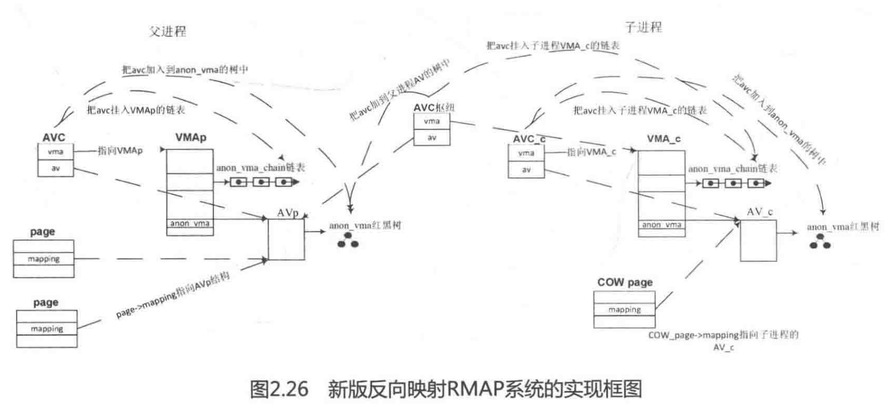

# 27. 回收页面

在 Linux 系统中, 当**内存有盈余**时, 内核会**尽量多**地使用内存作为**文件缓存(page cache**), 从而提高**系统的性能**. **文件缓存页面**会加入到**文件类型的 LRU 链表**中, 当系统**内存紧张**时, **文件缓存页面会被丢弃**, 或者**被修改的文件缓存会被回写到存储设备**中, **与块设备同步**之后便可**释放出物理内存**.

现在的**应用程序**越来越转向**内存密集型**, 无论系统中有**多少物理内存都是不够用**的, 因此 Linux 系统会使用**存储设备**当作**交换分区**, 内核将**很少使用的内存**换出到**交换分区**, 以便**释放出物理内存**, 这个机制称为**页交换(swapping**), 这些**处理机制**统称为**页面回收(page reclaim**).

## 27.1. 页面交换算法

有很多**页面交换算法**, 其中每个算法都有各自的优点和缺点. Linux 内核中采用的**页交换算法**主要是**LRU 算法**和**第二次机会法(second chance**).

### 27.1.1. LRU 链表法

**LRU 是 least recently used(最近最少使用**)的缩写, LRU 假定**最近不使用的页**在较短的时间内也**不会频繁使用**.

在**内存不足**时, 这些页面将成为被换出的候选者. 内核使用**双向链表**来定义 LRU 链表, 并且根据**页面的类型**分为**LRU_AN0N**和**LRU_FILE**. **每种类型**根据**页面的活跃性**分为**活跃 LRU**和**不活跃 LRU**, 所以内核中一共有如下**5 个 LRU 链表**.

- **不活跃匿名页面链表**LRU_INACTIVE_ANON.

- **活跃匿名页面链表**LRU_ACTIVE_ANON.

- **不活跃文件映射页面链表**LRU_INACTIVE_FILE.

- **活跃文件映射页面链表**LRU_ACTIVE_FILE.

- **不可回收页面链表**LRU_UNEVTCTABLE.

LRU 链表之所以要**分成这样**, 是因为当**内存紧缺**时总是**优先换出 page cache 页面**, 而**不是匿名页面**. 因为**大多数**情况**page cache 页面**下**不需要回写磁盘**, 除非**页面内容被修改**了, 而**匿名页面**总是要被**写入交换分区**才能**被换出**.

LRU 链表按照**zone**来配置也就是**每个 zone**中都有一整套**LRU 链表**, 因此 zone 数据结构中有一个成员**lruvec**指向这些链表. **枚举类型变量 lru_list**列举出**上述各种 LRU 链表的类型**, struct lruvec 数据结构中定义了上述各种 LRU 类型的链表.

```c
[include/linux/mmzone.h]
#define LRU_BASE 0
#define LRU_ACTIVE 1
#define LRU_FILE 2

enum lru_list {
	LRU_INACTIVE_ANON = LRU_BASE,
	LRU_ACTIVE_ANON = LRU_BASE + LRU_ACTIVE,
	LRU_INACTIVE_FILE = LRU_BASE + LRU_FILE,
	LRU_ACTIVE_FILE = LRU_BASE + LRU_FILE + LRU_ACTIVE,
	LRU_UNEVICTABLE,
	NR_LRU_LISTS
};

struct lruvec {
	struct list_head		lists[NR_LRU_LISTS];
	struct zone_reclaim_stat	reclaim_stat;
};

struct zone{
    struct lruvec lruvec;
}
```

LRU 链表是如何实现页面老化的?

LRU 链表实现先进先出(FIFO)算法. 最先进入 LRU 链表的页面, 在 LRU 中时间会越长, 老化时间也越长.

在**系统运行**过程中, **页面**总是在**活跃 LRU 链表**和**不活跃 LRU 链表**之间**转移**, **不是每次访问内存页面**都会发生这种**转移**. 而是**发生的时间间隔比较长**, 随着时间的推移, 导致一种**热平衡**, **最不常用的页面**将慢慢移动到**不活跃 LRU 链表的末尾**, 这些页面正是**页面回收**中最合适的候选者.

经典 LRU 链表算法如图

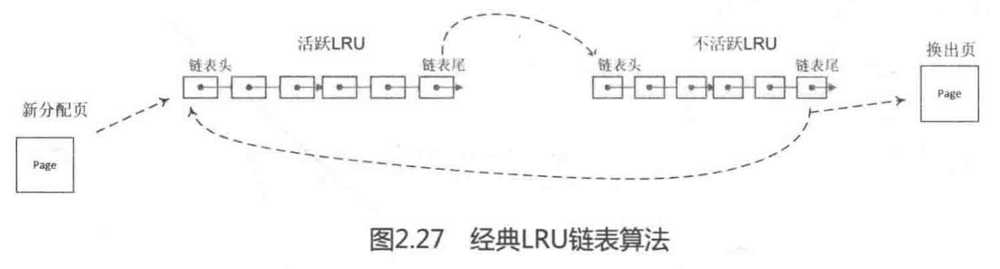

### 27.1.2. 第二次机会法

**第二次机会法(second chance**) 在经典 LRU 算法基础上做了一些改进. 在**经典 LRU 链表(FIFO**)中, **新产生的页面**加入到**LRU 链表的开头**, 将 LRU 链表中**现存的页面向后移动了一个位置**. 当**系统内存短缺**时, **LRU 链表尾部的页面**将会**离开并被换出**. 当系统**再需要这些页面**时, 这些页面会重新置于**LRU 链表的开头**.

但是, 在**换出页面**时, 没有考虑该页面的使用情况是**频繁使用**, 还是**很少使用**. 也就是说, **频繁使用的页面**依然会因为在**LRU 链表末尾**而被**换出**.

第二次机会算法的改进是为了避免把经常使用的页面置换出去. 当**选择置换页面**时, 依然和 LRU 算法一样, 选择最早置入链表的页面, 即在**链表末尾的页面**.

**二次机会法**设置了一个**访问状态位(硬件控制的比特位**),所以要**检查页面的访问位**. 如果**访问位是 0**, 就**淘汰**这页面; 如果**访问位是 1**, 就给它**第二次机会**, 并**选择下一个页面来换出**. 当该页面得到**第二次机会**时, 它的**访问位被清 0**, 如果**该页**在此期间**再次被访问**过, 则访问位**置为 1**. 这样给了第二次机会的页面将不会被淘汰, 直至所有其他页面被淘汰过(或者也给了第二次机会). 因此, 如果**一个页面经常被使用**, 其访问位总保持为 1, 它一直不会被淘汰出去.

Linux 内核使用**PG_active**和**PG_referenced**这两个标志位来实现**第二次机会法**.

对于 Linux 内核来说, **PTE_YOUNG**标志位是**硬件的比特位**, **PG_active**和**PG_referenced**是**软件比特位**.

**PG_active**表示该**页是否活跃**, **PG_referenced**表示该**页是否被引用过**, 主要函数如下.

- mark_page_accessed()
- page_referenced()
- page_check_referenced()

#### 27.1.2.1. 示例

以用户进程读文件为例来说明第二次机会法. 从用户空间的读函数到内核 VFS 层的 vfs_read(), 透过文件系统之后, 调用**read 方法**的**通用**函数**do_generic_file_read**(), 第一次读和第二次读的情况如下.

**第一次读**:

- do_generic_file_read() -> page_cache_sync_readahead() -> _do_page_cache_readahead () -> read_pages() -> add_to_page_cache_lru()把该页清 PG_active 且添加到**不活跃链表**中, **PG_active=0**

- do_generic_file_read() -> **mark_page_accessed**()因为 PG_referenced == 0, 设置**PG_referenced = 1**

第二次读:

- do_geieric_file_read() -> **mark_page_accessed**()因为(PG_referenced==l && PG_active =0),

置**PG_active=1**, **PG_referenced=0**, 把该页**从不活跃链表加入活跃链表**.

从上述读文件的例子可以看到, **page cache**从**不活跃链表**加入到**活跃链表**, 需要**mark_page_accessed()两次**.

下面以另外一个常见的**读取文件内容的方式 mmap**为例, 来看**page cache**在**LRU 链表**中的表现, 假设文件系统是 ext4.

(1) 第一次读, 即建立 mmap 映射时:

mmap 文件 -> ext4_file_mmap() -> filemap_fault() -> do_sync_mmap_readahead() -> ra_submit() -> read_pages() -> ext4_readpages() -> mpage_readpages() -> add_to_page_cache_lru()

把**页面**加入到**不活跃文件 LRU 链表**中, 然后**PG_active = 0** && **PG_referenced = 0**

(2) 后续的读写**和直接读写内存一样**, **没有**设置 PG_active 和 PG_referenced 标志位

(3) **kswapd 第一次扫描**:

当 kswapd 内核线程第一次扫描不活跃文件 LRU 链表时, shrink_inactive_list() -> shrink_page_list() -> page_check_references()

检查到这个 page cache 页面有映射 PTE 且 PG_referenced = 0, 然后设置 PG_referenced =1, 并且继续保留在不活跃链表中.

(4) **kswapd 第二次扫描**:

当 kswapd 内核线程第二次扫描不活跃文件 LRU 链表时, page_check_references()检查到 page cache 页面有映射 PTE 且 PG_referenced = 1, 则将其迁移到活跃链表中.

下面来看从 LRU 链表换出页面的情况.

(1) 第一次扫描**活跃链表**: shrink_active_list() -> page_referenced()

这里基本上会把有访问引用 pte 的和没有访问引用 pte 的页都加入到不活跃链表中.

(2) 第二次扫描**不活跃链表**: shrink_inactive_list() -> page_check_references()读取该页的 PG_referenced 并且清 PG_referenced .

= > 如果该页没有访问引用 pte, 回收的最佳候选者.

= > 如果该页有访问引用 pte 的情况, 需要具体问题具体分析 .

## 27.2. kswapd 内核线程

Linux 内核中有一个非常重要的内核线程 kswapd, 负责在**内存不足**的情况下**回收页面**.

kswapd 内核线程**初始化**时会为系统中**每个 NUMA 内存节点**创建一个名为"**kswapd%d"的内核线程**.

```cpp
// mm/vmscan.c
static int __init kswapd_init(void)
{
	int nid;

	swap_setup();
	for_each_node_state(nid, N_MEMORY)
 		kswapd_run(nid);
	hotcpu_notifier(cpu_callback, 0);
	return 0;
}
module_init(kswapd_init)

int kswapd_run(int nid)
{
	pg_data_t *pgdat = NODE_DATA(nid);
	int ret = 0;

	pgdat->kswapd = kthread_run(kswapd, pgdat, "kswapd%d", nid);
	if (IS_ERR(pgdat->kswapd)) {
		...
	}
	return ret;
}
```

```cpp
// include/linux/mmzone.h
typedef struct pglist_data
{
    /* 交换守护进程的等待队列 */
    wait_queue_head_t kswapd_wait;
    /* 指向负责该结点的交换守护进程的 task_struct, 在将页帧换出结点时会唤醒该进程 */
    struct task_struct *kswapd; /* Protected by mem_hotplug_begin/end() */
    int kswapd_max_order;
    enum zone_type classzone_idx;
}pg_data_t;
```

**kswapd_wait**是一个**等待队列**, 每个 pg_data_t 数据结构都有这样一个等待队列, 它是在`free_area_init_core()`函数中初始化的. 页面分配路径上的**唤醒函数**`wakeup_kswapd()`把 `kswapd_max_order`和 `classzone_idx`作为参数传递给**kswapd 内核线程**.

在分配内存路径上, 如果在**低水位(ALLOC_WMARK_LOW**)的情况下无法成功分配内存, 那么会通过**wakeup_kswapd**()函数**唤醒 kswapd 内核线程**来回收页面, 以便释放一些内存.

kswapd 内核线程的执行函数是`kswapd()`. 系统启动时会在`kswapd_try_to_sleep()`函数中睡眠并且让出 CPU 控制权, **唤醒点**在`kswapd_try_to_sleep()`函数中. kswapd 内核线程被唤醒之后, 调用**balance_pgdat**()来**回收页面**. 调用逻辑如下:

```cpp
alloc_pages :
    __alloc_pages_nodemask()
        ->If fail on ALLOC_WMARK_LOW
            ->_alloc_pages_slowpath()
                ->wakeup_kswapd()
                    -> wake_up(kswapd_wait)

kswapd 内核线程被唤醒 kswapd():
    ->balancejpgdat()
```

## 27.3. balance_pgdat()函数

balance_pgdat()函数是回收页面的主函数

页面分配路径 page allocator 和页面回收路径 kswapd 之间有很多交互的地方, 如图所示, 总结如下.

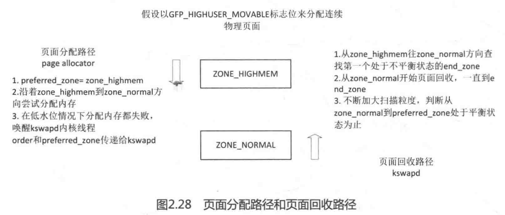

- 当页面分配路径 page allocator 在低水位中分配内存失败时, 会**唤醒 kswapd 内核线程**, 把 order 和 preferred_zone 传递给 kswapd, 这两个参数是它们之间联系的纽带.
- 页面**分配路径 page allocator**和页面**回收路径 kswapd**在**扫描 zone**时的**方向是相反**的, 页面**分配路径 page allocator**从**ZONE_HIGHMEM**往**ZONE_NORMAL**方向扫描 zone, kswapd 则相反.
- 如何判断 kswapd 应该**停止页面回收**呢? 一个重要的条件是从**zone_normal**到**preferred_zone**处于平衡状态时, 那么就认为这个内存节点处于平衡状态, 可以停止页面回收.
- 页面分配路径 page allocator 和页面回收路径 kswapd 采用**zone 的水位标不同**, page allocator 采用**低水位**, 即在低水位中无法分配内存, 就唤醒 kswapd; 而 kswapd 判断是否停止页面回收釆用的**高水位**.

........

## 27.4. 小结

Linux 内核页面回收的示意图如图所示, 可以看到一个页面是如何添加到 LRU 链表的, 如何在活跃 LRU 链表和不活跃 LRU 链表中移动的, 以及如何让一个页面真正回收并被释放的过程.

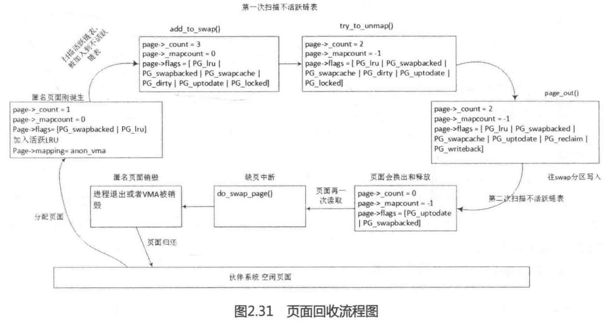

- kswapd 内核线程何时会被唤醒?

答: 分配内存时, 当在 zone 的 WMARK_LOW 水位分配失败时, 会去唤醒 kswapd 内
核线程来回收页面.

- LRU 链表如何知道 page 的活动频繁程度?

答: LRU 链表按照先进先出的逻辑, 页面首先进入 LRU 链表头, 然后慢慢挪动到链表尾, 这有一个老化的过程. 另外, page 中有 PG_reference/PG_active 标志位和页表的 PTE_YOUNG 位来实现第二次机会法.

- kswapd 按照什么原则来换出觅面?

答: 页面在活跃 LRU 链表, 需要从链表头到链表尾的一个老化过程才能迁移到不活跃 LRU 链表. 在不活跃 LRU 链表中又经过一个老化过程后, 首先剔除那些脏页面或者正在回写的页面, 然后那些在不活跃 LRU 链表老化过程中没有被访问引用的页面是最佳的被换出的候选者, 具体请看 shrink_page_list()函数.

- kswapd 按照什么方向来扫描 zone?

答: 从低 zone 到高 zone, 和分配页面的方向相反.

- kswapd 以什么标准来退出扫描 L R U ?

答: 判断当前内存节点是否处于"生态平衡", 详见 pgdat_balanced 函数. 另外也考虑扫描优先级 priority, 需要注意 classzone_idx 变量.

- 手持设备(例如 Android 系统)没有 swap 分区, kswapd 会扫描匿名页面 LRU 吗?

答: 没有 swap 分区不会扫描匿名页面 LRU 链表, 详见 get_scan_count()函数.

- swappiness 的含义是什么? kswapd 如何计算匿名页面和 page cache 之间的扫描比重?

答: swappiness 用于设置向 swap 分区写页面的活跃程度, 详见 get_scan_count()函数.

- 当系统中充斥着大量只访问一次的文件访问(use-one streaming IO) 时, kswapd 如何来规避这种风暴?

答: page_check_reference()函数设计了一个简易的过滤那些短时间只访问一次的 page cache 的过滤器, 详见 page_check_references()函数.

- 在回收 page cache 时, 对于 dirty 的 page cache, iswapd 会马上回写吗?

答: 不会, 详见 shrink_page_list()函数.

- 内核中有哪些觅面会被 kswapd 写到交换分区?

答: 匿名页面, 还有一种特殊情况, 是利用 shmem 机制建立的文件映射, 其实也是使用的匿名页面, 在内存紧张时, 这种页面也会被 swap 到交换分区.

# 28. 匿名页面生命周期

**匿名页面(anonymous page**), 简称 anon_page

## 28.1. 匿名页面的产生

从内核的角度来看, 在如下情况下会出现匿名页面.

1. **用户空间**通过**malloc/mmap**接口函数来分配内存, 在**内核空间**中发生**缺页中断**时, **do_anonymous_page**()会产生**匿名页面**.
2. 发生**写时复制**. 当缺页中断出现**写保护错误**时, 新分配的页面是**匿名页面**, 下面又分两种情况.

(1) do_wp_page()

- 只读的 special 映射的页, 例如映射到 zero page 的页面.
- 非单身匿名页面(有多个映射的匿名页面, 即 page->_mapcount>0).
- 只读的私用映射的 page cache.
- KSM 页面.

(2) do_cow_page()

- 共享的匿名页面(shared anonymous mapping, shmm)

上述这些情况在发生**写时复制**时会新分配匿名页面.

3. do_swap_page(), 从 **swap 分区读回数据**时会新分配匿名页面.
4. 迁移页面.

以 do_anonymous_page()分配一个匿名页面 anon_page 为例, anon_page 刚分配时的状态如下:

- page->_count = l
- page->_mapcount = 0 .
- 设置 PG_swapbacked 标志位.
- 加入 LRU_ACTIVE_ANON 链表中, 并设置 PG_lru 标志位.
- page->mapping 指向 VMA 中的 anon_vma 数据结构.

## 28.2. 匿名页面的使用

**匿名页面**在**缺页中断中分配完成**之后, 就建立了**进程虚拟地址空间 VMA** 和**物理页面的映射**关系, **用户进程**访问**虚拟地址**即访问到**匿名页面**的内容.

## 28.3. 匿名页面的换出

假设现在系统内存紧张, 需要回收一些页面来释放内存. **anon_page 刚分配时**会**加入活跃 LRU 链表(LRU_ACTIVE_ANON)的头部**, 在经历了**活跃 LRU 链表的一段时间的移动**, 该**anon_page**到达**活跃 LRU 链表的尾部**, **shrink_active_list**()函数**把该页加入不活跃 LRU 链表(LRU_INACTIVE_ANON**).

**shrink_inactive_list**()函数**扫描不活跃链表**.

(1) **第一扫描不活跃链表**时, shrink_page_list()->add_to_swap()函数会为该页**分配 swap 分区空间**

(2) shrink_page_list()->try_to_unmap()会通过 RMAP 反向映射系统去寻找映射该页的所有的 VMA 和相应的 pte, 并将这些 pte 解除映射.

(3) shrink_page_list()->pageout()函数把该页写回交换分区

pageout()函数的作用如下.

- 检查该页面是否可以释放, 见 is_page_cache_freeable()函数.
- 清 PG_dirty 标志位.
- 设置 PG_reclaim 标志位.
- swap_writepage()设置 PG_writeback 标志位, 清 PG_locked, 向 swap 分区写内容.

在向 swap 分区写内容时, kswapd 不会一直等到该页面写完成的, 所以该页将继续返回到**不活跃 LRU 链表的头部**.

(4)第二次扫描不活跃链表.

经历一次**不活跃 LRU 链表的移动**过程, 从**链表头**移动到**链表尾**. 如果这时**该页还没有写入完成**, 即 PG_writeback 标志位还在, 那么**该页**会继续被**放回到不活跃 LRU 链表头**, kswapd 会继续扫描其他页, 从而继续等待写完成.

假设**第二次扫描不活跃链表**时, 该页**写入 swap 分区己经完成**. Block layer 层的回调函数 end_swap_bio_write()-〉end_page_writeback()会完成如下动作.

- 清 PG_writeback 标志位.
- 唤醒等待在该页 PG_writeback 的线程, 见 wake_up_page(page, PG_writeback)函数.

shrink_page_list()->__remove_mapping()函数的作用如下.

- page_freeze_refs(page, 2)判断当前 page->_count 是否为 2, 并且将该计数设置为 0.
- 清 PG_swapcache 标志位.
- 清 PG_locked 标志位.

最后把**page**加入**free_page 链表**中, 释放该页. 因此该**anon_page 页**的状态是**页面内容已经写入 swap 分区**, 实际**物理页面己经释放**.

## 28.4. 匿名页面的换入

匿名页面被换出到 swap 分区后, 如果应用程序需要读写这个页面, 缺页中断发生, 因为 pte 中的 present 比特位显示该页不在内存中, 但 pte 表项不为空, 说明该页在 swap 分区中, 因此调用 do_swap_page()函数重新读入该页的内容.

## 28.5. 匿名页面的销毁

当用户进程关闭或者退出时, 会扫描这个用户进程所有的 VMAs, 并会清除这些 VMA 上所有的映射, 如果符合释放标准, 相关页面会被释放. 本例中的 amm_page 只映射了父进程的 VMA, 所以这个页面也会被释放. 如图所示是匿名页面的生命周期图.

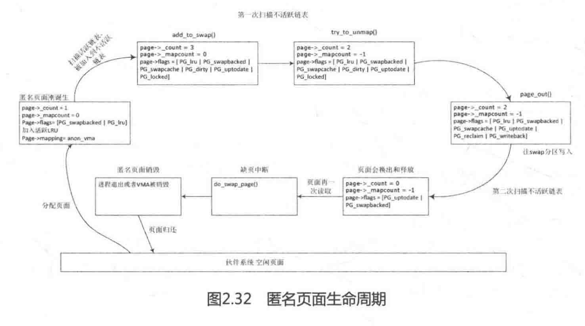

# 29. 页面迁移

Linux 为页面迁移提供了一个系统调用 migrate_pages, 可以**迁移一个进程的所有页面**到指定**内存节点**上. 该系统调用在**用户空间**的函数接口如下:

```c
#include<numaif.h>
long migrate_pages (int pid, unsigned long maxnode,
                        const unsigned long *old_nodes,
                        const unsigned long *new_nodes);
```

该系统调用最早是为了在 NUMA 系统上提供一种能迁移进程到任意内存节点的能力. 现在内核除了为 NUMA 系统提供页迁移能力外, 其他的一些模块也可以利用页迁移功能做一些事情, 例如内存规整和内存热插拔等.

内核中有多处使用到页的迁移的功能, 列出如下.

- 内存规整(memory compaction)
- 内存热插拔(memory hotplug).
- NUMA 系统, 系统有一个 sys_migrate_pages 的系统调用.

# 30. 内存规整(memory compaction)

**伙伴系统**以**页为单位**来管理内存, **内存碎片**也是**基于页面**的, 即由**大量离散且不连续的页面导致**的. 从内核角度来看, 内存碎片不是好事情, 有些情况下物理设备需要**大段的连续的物理内存**, 如果内核无法满足, 则会发生**内核 panic**. 这里称为**内存规整**, 也叫**内存紧凑**, 它是为了**解决内核碎片化**而出现的一个功能.

内核中去碎片化的基本原理是**按照页的可移动性将页面分组**. 迁移内核本身使用的物理内存的实现难度和复杂度都很大, 因此目前的内核是不迁移内核本身使用的物理页面. 对于应用户进程使用的页面, 实际上通过用户页表的映射来访问. 用户页表可以移动和修改映射关系, 不会影响用户进程, 因此内存规整是基于页面迁移实现的.

## 30.1. 内存规整实现

内存规整的一个重要的应用场景是在**分配大块内存时(order>l**), 在**WMARK_LOW 低水位**情况下**分配失败**, **唤醒 kswapd 内核线程**后**依然无法分配出内存**, 这时调用__**alloc_pages_direct_compact**()来**压缩内存尝试分配出所需要的内存**.

适合被内存规整迁移的页面总结如下.

- 必须在**LRU 链表**中的页面, 还在**伙伴系统中的页面不适合**.
- **正在回写中的页面不适合**, 即标记有 PG_writeback 的页面.
- 标记有**PG_unevictable 的页面不适合**.
- 没有定义 mapping->a_ops->migratepage()方法的**脏页面不合适**.

## 30.2. 小结

核心思想是把**内存页面**按照**可移动**、**可回收**、**不可移动**等特性进行分类. **可移动的页面**通常是指**用户态程序分配的内存**, **移动这些页面**仅仅是**修改页表映射关系**, 代价很低; **可回收的页面**是指**不可以移动**但**可以释放的页面**. 按照这些类型来分类页面后, 就容易释放出大块的连续物理内存.

内存规整机制归纳起来也比较简单, 如图所示. 有**两个方向的扫描者**, 一个是**从 zone 头部向 zone 尾部方向扫描**, 查找**哪些页面是可以迁移的**; 另一个是**从 zone 尾部**向**zone 头部方面扫描**, 查找**哪些页面是空闲页面**. 当**这两个扫描者在 zone 中间碰头**时, 或者**己经满足分配大块内存的需求**时(能**分配出所需要的大块内存**并且**满足最低的水位要求**), 就可以**退出扫描**了.

内存规整机制除了**人为地主动触发**以外, 一般是在**分配大块内存失败时**, 首先**尝试内存规整机制**去尝试整理出大块连续的物理内存, 然后才**调用直接内存回收机制(Direct Reclaim**).

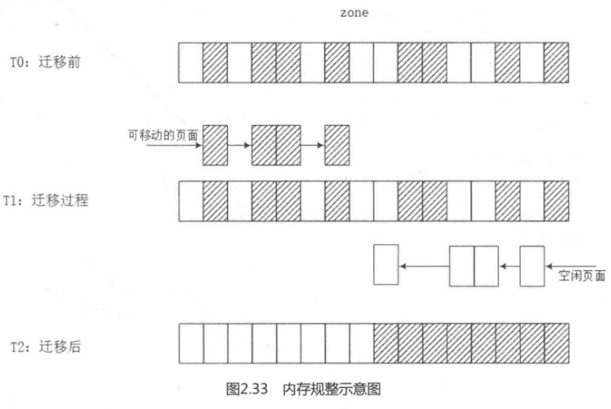

# 31. KSM

有一些内存页面在它们生命周期里某个瞬间页面内容完全一致呢?

KSM 全称**Kernel SamePage Merging**, 用于**合并内容相同的页面**. KSM 的出现是为了**优化虚拟化中产生的冗余页面**, 因为虚拟化的实际应用中在**同一台宿主机上**会有许多**相同的操作系统和应用程序**, 那么**许多内存页面的内容**有可能都是**相同**的, 因此它们可以被合并, 从而释放内存供其他应用程序使用.

KSM 允许合并**同一个进程**或**不同进程**之间**内容相同的匿名页面**, 这对应用程序来说是**不可见**的. 把这些**相同的页面**被合并成一个**只读的页面**, 从而释放出来物理页面, 当应用程序需要**改变页面内容**时, 会发生**写时复制(copy-on-write, COW**).

## 31.1. KSM 实现

初始化时候会创建一个"ksmd"的内核线程

```cpp
// mm/ksm.c
static int __init ksm_init(void)
{
	struct task_struct *ksm_thread;
	int err;

	err = ksm_slab_init();
	if (err)
		goto out;

	ksm_thread = kthread_run(ksm_scan_thread, NULL, "ksmd");
	err = sysfs_create_group(mm_kobj, &ksm_attr_group);
	if (err) {
		pr_err("ksm: register sysfs failedn");
		kthread_stop(ksm_thread);
		goto out_free;
	}
	return 0;
}
subsys_initcall(ksm_init);
```

**KSM**只会处理通过**madvise 系统调用显式**指定的用户进程空间内存, 因此用户程序想使用这个功能就必须在**分配内存时显式地调用**"**madvise(addr, length, MADV_MERGEABLE**)", 如果用户想在**KSM 中取消某一个用户进程地址空间的合并功能**, 也需要显式地调用"madvise(addr, length, MADV_UNMERGEABLE)".

## 31.2. 匿名页面和 KSM 页面的区别

如果**多个 VMA 的虚拟页面**同时映射了**同一个匿名页面**, 那么 page->index 应该等于多少?

虽然**匿名页面**和**KSM 页面**可以通过**PageAnon**()和**PageKsm**()宏来区分, 但是这两种页面究竟有什么区别呢?是不是**多个 VMA 的虚拟页面**共享**同一个匿名页面**的情况就**一定是 KSM 页面呢?**这是一个非常好的问题, 可以从中窥探出匿名页面和 KSM 页面的区别. 这个问题要分**两种情况**, 一是**父子进程的 VMA**共享**同一个匿名页面**, 二是**不相干的进程**的 VMA 共享**同一个匿名页面**.

第一种情况, **父进程**在**VMA 映射匿名页面**时会创建**属于这个 VMA 的 RMAP 反向映射的设施**, 在__**page_set_anon_rmap**()里会设置**page->index 值**为**虚拟地址在 VMA 中的 offset**.

**子进程 fork**时, 复制了**父进程的 VMA 内容到子进程的 VMA**中, 并且**复制父进程的页表到子进程**中, 因此对于**父子进程**来说, **page->index 值是一致**的.

当需要从**page**找到**所有映射 page 的虚拟地址**时, 在**rmap_walk_anon**()函数中, **父子进程**都使用**page->index**值来计算**在 VMA 中的虚拟地址**, 详见 rmap_walk_anon()->vma_address()函数.

第二种情况是**KSM 页面**. KSM 页面由**内容相同**的**两个匿名页面合并**而成, 它们可以是**不相干的进程**的**VMA**, 也可以是**父子进程的 VMA**, 那么它的 page->index 值应该等于多少呢?

```c
[mm/rmap.c]
void do_page_add_anon_rmap(struct page *page,
	struct vm_area_struct *vma, unsigned long address, int exclusive)
{
    // 重点
    int first = atomic_inc_and_test(&page->_mapcount);
    ...
    if (first)
		__page_set_anon_rmap(page, vma, address, exclusive);
	else
		__page_check_anon_rmap(page, vma, address);
}
```

在 do_page_add_anon_rmap()函数中有这样一个判断, 只有**当_mapcount 等于- 1 时**才会调用__page_set_anon_rmap()去**设置 page->index 值**, 那就是**第一次映射该页面的用户 pte**才会去**设置 page->index 值**.

当需要**从 page**中找到**所有映射 page 的虚拟地址**时, 因为 page 是 **KSM 页面**, 所以使用 rmap_walk_ksm()函数,

```c
[mm/ksm.c]
int rmap_walk_ksm(struct page *page, struct rmap_walk_control *rwc)
{
    ...
    hlist_for_each_entry(rmap_item, &stable_node->hlist, hlist) {
		struct anon_vma *anon_vma = rmap_item->anon_vma;
		anon_vma_interval_tree_foreach(vmac, &anon_vma->rb_root,
					       0, ULONG_MAX) {
			vma = vmac->vma;
			// 这里使用 rmap_item->address 来获取虚拟地址
			ret = rwc->rmap_one(page, vma,
					rmap_item->address, rwc->arg);
		}
    ...
}
```

这里使用**rmap_item->address**来**获取每个 VMA 对应的虚拟地址**, 而**不是像父子进程共享的匿名页面**那样使用**page->index 来计算虚拟地址**. 因此对于**KSM 页面**来说, page->index 等于**第一次映射该页的 VMA 中的 offset**.

## 31.3. 小结

KSM 的实现流程如图. 核心设计思想是基于**写时复制机制 COW**, 也就是**内容相同的页面**可以**合并**成一个**只读页面**, 从而**释放出来空闲页面**. 首先要思考**怎么去查找**, 以及**合并什么样类型的页面**?哪些应用场景会有比较丰富的冗余的页面?

KSM 最早是为了**KVM 虚拟机**而设计的, **KVM 虚拟机**在**宿主机**上使用的内存**大部分是匿名页面**, 并且它们在宿主机中存在大量的冗余内存. 对于**典型的应用程序**, KSM 只考虑**进程分配使用的匿名页面**, 暂时不考虑 page cache 的情况.

一个典型的**应用程序**可以由以下**5 个内存部分**组成.

- **可执行文件的内存映射(page cache**).
- 程序分配使用的**匿名页面**.
- 进程打开的**文件映射**(包括常用或者不常用, 甚至只用一次 page cache).
- 进程**访问文件系统产生的 cache**.
- 进程访问内核产生的内核 buffer (如 slab) 等.

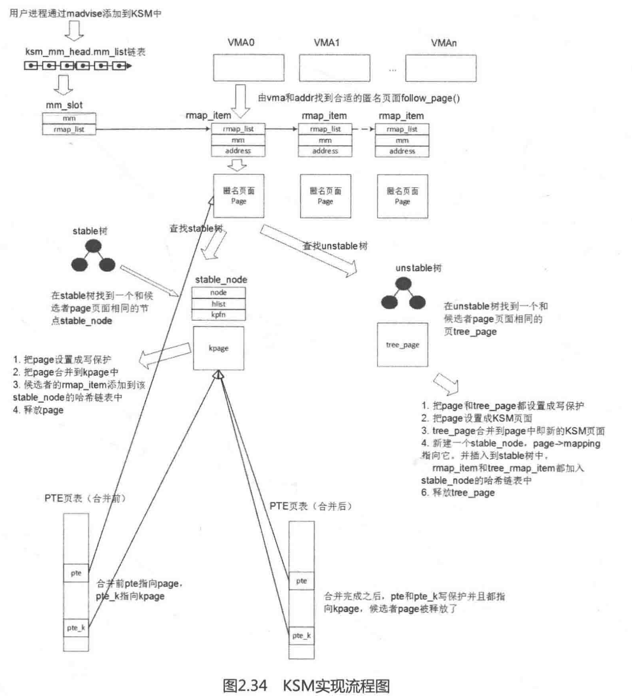

设计的关键是**如何寻找**和**比较两个相同的页面**, 如何让这个过程变得高效而且占用系统资源最少, 这就是一个好的设计人员应该思考的问题.

首先要**规避用哈希算法**来**比较两个页面**的**专利问题**. KSM 虽然使用了**memcmp**来比较, **最糟糕的情况**是**两个页面**在**最后的 4Byte 不一样**, 但是**KSM**使用**红黑树**来设计了**两棵树**, 分别是**stable 树**和**unstable 树**, 可以**有效地减少最糟糕**的情况. 另外 KSM 也巧妙地利用**页面的校验值**来比较**unstable 树的页面最近是否被修改**过, 从而避开了该专利的"魔咒".

**页面**分为**物理页面**和**虚拟页面**, **多个虚拟页面**可以同时映射到**一个物理页面**, 因此需要**把映射到该页的所有的 pte 都解除**后, 才是算**真正释放**(这里说的**pte**是指**用户进程地址空间 VMA**的**虚拟地址映射到该页的 pte**, 简称**用户 pte**, 因此**page->_mapcount**成员里描述的 pte 数量**不包含内核线性映射的 pte！！！**).

目前有**两种做法**,

一种做法是**扫描每个进程中 VMA**, 由**VMA 的虚拟地址**查询**MMU 页表**找到**对应的 page 数据结构**, 这样就找到了**用户 pte**. 然后对比**KSM**中的**stable 树**和**unstable 树**, 如果找到**页面内容相同**的, 就**把该 pte 设置成 COW**, 映射到**KSM 页面**中, 从而**释放出一个 pte**, 注意这里是**释放出一个用户 pte**,而**不是一个物理页面！！！(如果该物理页面只有一个 pte 映射, 那就是释放该页**).

另外一种做法是**直接扫描系统中的物理页面**, 然后通过**反向映射**来**解除该页所有的用户 pte**, 从而**一次性地释放出物理页面**.

显然, 目前 kernel 的**KSM 是基于第一种做法**.

在实际项目中, 有很多人抱怨 KSM 的效率低, 在很多项目上是关闭该特性的. 也有很多人在思考如何提高 KSM 的效率, 包括新的软件算法或者利用硬件机制.

# 32. Linux Cache 机制

## 32.1. 内存管理基础

创建进程 fork()、程序载入 execve()、映射文件 mmap()、动态内存分配 malloc()/brk()等进程相关操作都需要**分配内存**给进程. 不过这时进程申请和获得的还**不是实际内存**, 而是**虚拟内存**, 准确的说是"内存区域". **Linux 除了内核以外**, App 都**不能直接使用内存**, 因为 Linux 采用 Memory Map 的管理方式, App 拿到的**全部是内核映射自物理内存的一块虚拟内存**. malloc 分配很少会失败, 因为 malloc 只是通知内存 App 需要内存, 在没有正式使用之前, 这段内存其实只在真正开始使用的时候才分配, 所以 malloc 成功了并不代表使用的时候就真的可以拿到这么多内存.

进程对内存区域的分配最终多会归结到 do_mmap()函数上来(brk 调用被单独以系统调用实现, 不用 do_mmap()). 内核使用 do_mmap()函数创建一个新的线性地址区间, 如果创建的地址区间和一个已经存在的地址区间相邻, 并且它们具有相同的访问权限的话, 那么两个区间将合并为一个. 如果不能合并, 那么就确实需要创建一个新的 VMA 了. 但无论哪种情况,  do_mmap()函数都会将一个地址区间加入到进程的地址空间中, 无论是扩展已存在的内存区域还是创建一个新的区域. 同样释放一个内存区域使用函数 do_ummap(), 它会销毁对应的内存区域.

另一个重要的部分是 SLAB 分配器. 在 Linux 中以页为最小单位分配内存对于内核管理系统物理内存来说是比较方便的, 但内核自身最常使用的内存却往往是很小(远远小于一页)的内存块, 因为大都是一些描述符. 一个整页中可以聚集多个这种这些小块内存, 如果一样按页分配, 那么会被频繁的创建/销毁, 开始是非常大的.

为了满足内核对这种小内存块的需要, Linux 系统采用了 SLAB 分配器. Slab 分配器的实现相当复杂, 但原理不难, 其核心思想就是 Memory Pool. 内存片段(小块内存)被看作对象, 当被使用完后, 并不直接释放而是被缓存到 Memory Pool 里, 留做下次使用, 这就避免了频繁创建与销毁对象所带来的额外负载.

Slab 技术不但避免了内存内部分片带来的不便, 而且可以很好利用硬件缓存提高访问速度. 但 Slab 仍然是建立在页面基础之上, Slab 将页面分成众多小内存块以供分配, Slab 中的对象分配和销毁使用 kmem_cache_alloc 与 kmem_cache_free.

## 32.2. Linux Cache 的体系

在 Linux 中, 当 App 需要**读取 Disk 文件中的数据**时, Linux 先**分配一些内存**, 将**数据**从**Disk 读入到这些内存**中, 然后再将**数据传给 App**. 当需要往**文件中写数据**时, Linux**先分配内存接收用户数据**, 然后再将**数据从内存写到 Disk**上. **Linux Cache 管理**指的就是对这些由 Linux 分配, 并用来存储文件数据的内存的管理.

下图描述了 Linux 中文件 Cache 管理与内存管理以及文件系统的关系. 从图中可以看到, 在 Linux 中, **具体的文件系统**, 如 **ext2/ext3/ext4** 等, 负责在**文件 Cache**和**存储设备**之间**交换数据**, 位于具体文件系统之上的**虚拟文件系统 VFS**负责在**应用程序**和**文件 Cache** 之间通过 **read/write 等接口交换数据**, 而**内存管理系统**负责**文件 Cache 的分配和回收**, 同时**虚拟内存管理系统(VMM)**则允许应用程序和文件 Cache 之间通过 memory map 的方式交换数据, FS Cache 底层通过 SLAB 管理器来管理内存.


下图则非常清晰的描述了 Cache 所在的位置, 磁盘与 VFS 之间的纽带.

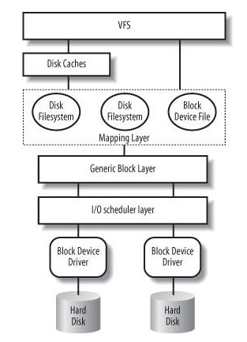

## 32.3. Linux Cache 的结构

在 Linux 中, **文件 Cache** 分为**两层**, 一是 **Page Cache**, 另一个 **Buffer Cache**, **每一个 Page Cache** 包含**若干 Buffer Cache**.

**内存管理系统**和 **VFS** 只与 **Page Cache 交互**,

- **内存管理系统**负责维护**每项 Page Cache** 的**分配**和**回收**, 同时在使用 **memory map 方式**访问时负责**建立映射**;
- **VFS** 负责 **Page Cache** 与**用户空间**的**数据交换**.

而**具体文件系统**则一般只与 **Buffer Cache 交互**, 它们负责在**外围存储设备**和 **Buffer Cache 之间交换数据**. **读缓存**以**Page Cache 为单位**, 每次读取若干个 Page Cache, **回写磁盘**以**Buffer Cache**为单位, 每次回写若干个 Buffer Cache.

Page Cache、Buffer Cache、文件以及磁盘之间的关系如下图所示.

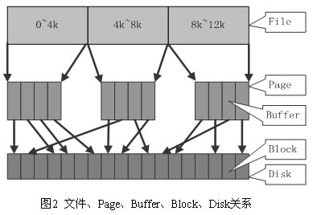

**Page 结构**和 **buffer_head 数据结构**的关系如下图所示. **Page**指向**一组 Buffer 的头指针**, Buffer 的头指针指向**磁盘块**. 在这两个图中, 假定了 Page 的大小是 4K, 磁盘块的大小是 1K.


在 Linux 内核中, **文件的每个数据块**最多只能对应**一个 Page Cache 项**, 它通过**两个数据结构**来管理这些 Cache 项, 一个是 **Radix Tree**, 另一个是**双向链表**. Radix Tree 是一种**搜索树**, Linux 内核利用这个数据结构来**通过文件内偏移快速定位 Cache 项**, 图 4 是 radix tree 的一个示意图, 该 radix tree 的分叉为 4(22), 树高为 4, 用来快速定位 8 位文件内偏移. Linux(2.6.7) 内核中的分叉为 64(26), 树高为 6(64 位系统)或者 11(32 位系统), 用来快速定位 32 位或者 64 位偏移, Radix tree 中的**每一个到叶子节点的路径**上的**Key**所拼接起来的**字串都是一个地址**, 指向文件内相应偏移所对应的 Cache 项.

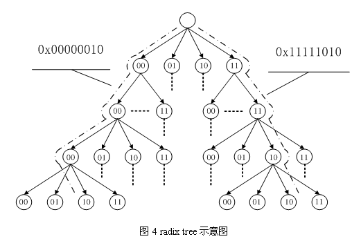

查看**Page Cache**的核心数据结构**struct address_space**就可以看到上述结构

```c
[include/linux/fs.h]
struct address_space  {
    struct inode *host;              /* owner: inode, block_device */
    struct radix_tree_root page_tree;   /* radix tree of all pages */
    unsigned long nrpages;  /* number of total pages */
    struct address_space *assoc_mapping;      /* ditto */
    ......
} __attribute__((aligned(sizeof(long))));
```


# 33. Dirty COW 内存漏洞

# 34. 总结内存管理数据结构和 API

## 34.1. 内存管理数据结构的关系图

在大部分 Linux 系统中, 内存设备的初始化一般是在 BIOS 或 bootloader 中, 然后把 DDR 的大小传递给 Linux 内核, 因此从 Linux 内核角度来看 DDR , 其实就是一段物理内存空间. 在 Linux 内核中, 和内存硬件物理特性相关的一些数据结构主要集中在 MMU  (处理器中内存管理单元)中, 例如页表、 cache/TLB 操作等. 因此大部分的 Linux 内核中关于内存管理的相关数据结构都是软件的概念中, 例如 mm、vma、zone、page、pg_data 等.  Linux 内核中的内存管理中的数据结构错综复杂, 归纳总结如图

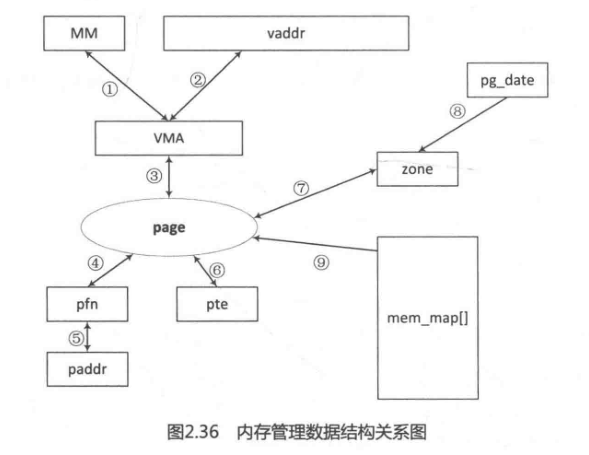

(1) 由 mm 数据结构和虚拟地址 vaddr 找到对应的 VMA.

内核提供相当多的 API 来查找 VMA.

```c

```

由 VMA 得出 MM 数据结构, struct vm_area_struct 数据结构有一个指针指向 struct mm_struct

```c

```

(2) 由 page 和 VMA 找到虚拟地址 vaddr.

```c

```

(3) 由 page 找到所有映射的 VMA.

```c

```

由 VMA 和虚拟地址 vaddr, 找出相应的 page 数据结构.

```c

```

(4) page 和 pfh 之间的互换

```c

```

(5)  pfn 和 paddr 之间的互换

```c

```

(6) page 和 pte 之间的互换

```c

```

(7) zone 和 page 之间的互换

```c

```

(8) zone 和 pg_data 之间的互换

```c

```

## 34.2. 内存管理中常用 API

### 34.2.1. 页表相关

页表相关的 API 可以概括为如下 4 类

- 查询页表
- 判断页表项的状态位
- 修改页表
- page 和 pfn 的关系

```c

```

### 34.2.2. 内存分配

常用内存分配 API 如下:

```c

```

### 34.2.3. VMA 操作相关

```c

```

### 34.2.4. 页面相关

- PG_XXX 标志位操作.
- page 引用计数操作.
- 匿名页面和 KSM 页面.
- 页面操作.
- 页面映射.
- 缺页中断.
- LRU 和页面回收.

```c
//PG__xxx 标志位操作
PageXXX()
SetPageXXX()
ClearPageXXXO
TestSetPageXXXO
TestClearPageXXX()
void lock_page(struct page *page)
int trylock_page(struct page *page)
void wait_on_page_bit(struct page *page, int bit_nr ) ;
void wake_up_page(struct page *page, int bit)
static inline void wait_on_page_locked(struct page *page)
static inline void wait_on_page_writeback(struct page *page)

//page 引用计数操作
void get_page(struct page *page)
void put_page(struct page *page);
#define page_cache_get(page)
#define page_cache_release(page)
static inline int page_count(struct page *page)
static inline int page_mapcount(struct page *page)
static inline int page_mapped(struct page *page)
static inline int put_page_testzero(struct page *page)
get_page(page)
put_page(page)

//匿名页面和 KSM 页面
static inline int PageAnon(struct page *page)
static inline int PageKsm(struct page *page)
struct address_space *page_mapping(struct page *page)
void page_add_new_anon_rmap(struct page *page,
    struct vm_area_struct *vma, unsigned long address)

//页面操作
struct page *follow_page(struct vm_area_struct *vma,
		unsigned long address, unsigned int foll_flags)
struct page *vm_normal_page(struct vm_area_struct *vma, unsigned long addr,
		pte_t pte);
long get_user_pages(struct task_struct *tsk, struct mm_struct *mm,
		    unsigned long start, unsigned long nr_pages,
		    int write, int force, struct page **pages,
		    struct vm_area_struct **vmas);

// 页面映射


// 缺页中断


// LRU 和页面回收

```