<!-- @import "[TOC]" {cmd="toc" depthFrom=1 depthTo=6 orderedList=false} -->

<!-- code_chunk_output -->

- [1. 背景](#1-背景)
- [2. 共享内存方式综述](#2-共享内存方式综述)
- [3. SYS V共享内存](#3-sys-v共享内存)
- [4. POSIX 共享内存](#4-posix-共享内存)
- [5. memfd_create](#5-memfd_create)
  - [跨进程 FD](#跨进程-fd)
  - [5.1. 小结](#51-小结)
- [6. dma_buf](#6-dma_buf)
- [7. 小结](#7-小结)
- [8. reference](#8-reference)

<!-- /code_chunk_output -->

# 1. 背景

早期的共享内存, 着重于强调把**同一片内存**, **map** 到**多个进程**的**虚拟地址空间**(在**相应进程**找到一个 **VMA 区域**), 以便于 CPU 可以在各个进程访问到这片内存.

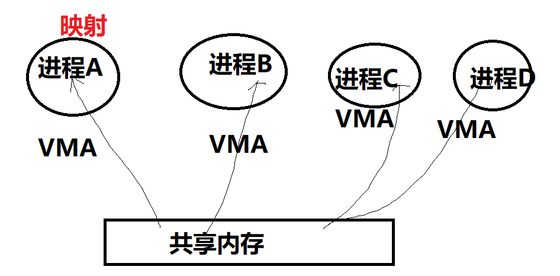

**现阶段**广泛应用于多媒体、Graphics 领域的**共享内存方式**, 某种意义上**不再强调**映射到**进程虚拟地址空间**的概念(那无非是**为了让 CPU 访问**), 而更强调以某种 "**句柄**" 的形式, 让大家**知道**某一片视频、图形图像数据的**存在**并可以**借助**此 "句柄" 来**跨进程引用**这片内存, 让视频 encoder、decoder、GPU 等可以跨进程访问内存. 所以不同进程用的加速硬件其实是不同的, 他们更在乎的是可以通过一个 handle 拿到这片内存, 而不再特别在乎 CPU 访问它的虚拟地址(当然仍然可以映射到进程的虚拟地址空间供 CPU 访问).

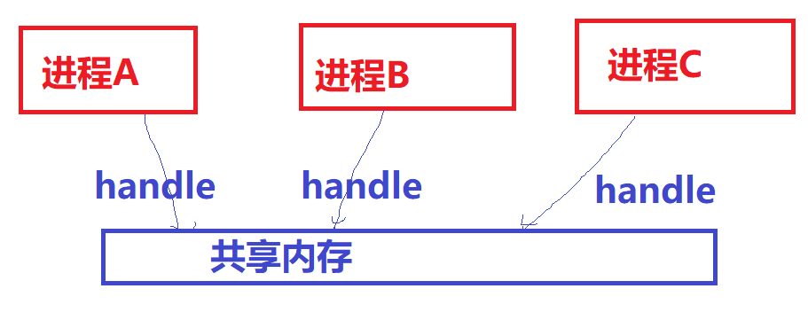

只要**内存的拷贝**(memcpy)仍然是一个**占据内存带宽**、**CPU 利用率的消耗大户**存在, 共享内存作为 Linux 进程间通信、计算机系统里各个不同硬件组件通信的最高效方法, 都将持续繁荣. 关于内存拷贝会大多程度地占据 CPU 利用率, 这个可以最简单地尝试拷贝 1080P, 帧率每秒 60 的电影画面, 我保证你的系统的 CPU, 蛋会疼地不行.

# 2. 共享内存方式综述

综述 Linux 里面各种共享内存方式, 共享内存的方式有很多种, 目前主流的方式仍然有:

共享内存的方式

1. 基于传统 SYS V 的共享内存;

2. 基于 POSIX mmap 文件映射实现共享内存;

3. 通过 memfd_create() 和 fd 跨进程共享实现共享内存;

4. 多媒体、图形领域广泛使用的基于 dma-buf 的共享内存.

前两种方式比较符合传统的用法, 共享内存做为进程间通信的媒介.

第三种方式更像是通过传递内存"句柄"进行数据传输.

第四种方式是为设备间传递数据设计, 避免内存拷贝, 直接传递内存"句柄".

# 3. SYS V共享内存

历史悠久、年代久远、API怪异, 对应内核代码 `linux/ipc/shm.c`, 当你编译内核的时候**不选择** `CONFIG_SYSVIPC`, 则不再具备此能力.

你在 Linux 敲 ipcs 命令看到的 **Shared Memory Segments** 就是这种共享内存:

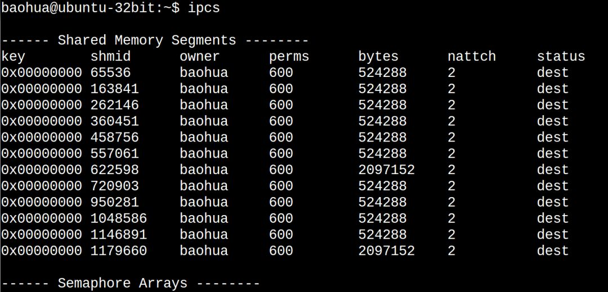

下面写一个最简单的程序来看共享内存的**写端** `sw.c`:

```cpp
#include <sys/shm.h>
#include <unistd.h>
#include <string.h>

int main(int argc, char **argv)
{
    key_t key = ftok("/dev/shm/myshm2", 0);
    int shm_id = shmget(key, 0x400000, IPC_CREAT | 0666);
    char *p = (char *)shmat(shm_id, NULL, 0);

    memset(p, 'A', 0x400000);
    shmdt(p);

    return 0;
}
```

以及共享内存的**读端** `sr.c`:

```cpp
#include <sys/shm.h>
#include <unistd.h>
#include <stdio.h>

int main(int argc, char **argv)
{
    key_t key = ftok("/dev/shm/myshm2", 0);
    int shm_id = shmget(key, 0x400000, 0666);
    char *p = (char *)shmat(shm_id, NULL, 0);

    printf("%c %c %c %c\n", p[0], p[1], p[2], p[3]);
    shmdt(p);

    return 0;
}
```

编译和准备运行:

```
gcc sw.c -o sw
gcc sr.c -o sr
touch /dev/shm/myshm2
```

在此之前我们看一下系统的 free:

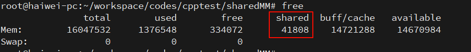

下面运行sw和sr:

```
# ./sw
# ./sr
A A A A
```

我们再看下 free:


可以看到 **used** 显著增大了(1376548 -> 1380552), **shared** 显著地增大了(41808 -> 45904), 而 cached这一列也显著地增大(14721288 -> 14725436).

我们都知道 cached 这一列统计的是 `file-backed` 的文件的 **page cache** 的大小. 理论上, **共享内存**属于**匿名页**, 但是由于这里面有个非常特殊的 `tmpfs`(`/run/shm` 指向 `/dev/shm`, `/dev/shm` 则 mount 为 **tmpfs**):

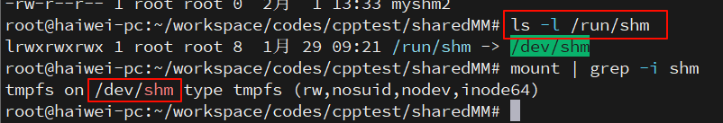

所以可以看出 tmpfs 的东西其实真的是有点含混: 我们可以理解它为 **file-backed** 的**匿名页**(`anonymous page`). 前面我们反复强调, **匿名页**是**没有文件背景**的, 这样当进行**内存交换**的时候, 是与 swap 分区交换. **磁盘文件系统**里面的东西在内存的副本是 file-backed 的页面, 所以不存在与 swap 分区交换的问题. 但是 tmpfs 里面的东西, 真的是在统计意义上统计到 **page cache** 了, 但是它**并没有真实的磁盘背景**, 这又和你访问磁盘文件系统里面的文件产生的 page cache 有本质的区别. 所以, 它是真地有那么一点 misc 的感觉, 凡事都没有绝对, 唯有变化本身是不变的.

也可以通过 ipcs 找到新创建的 SYS V 共享内存:

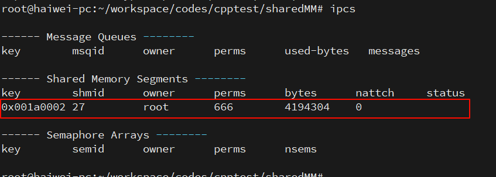

`4194304 bytes` = `0x400000 bytes`

# 4. POSIX 共享内存

我对 POSIX `shm_open()`、`mmap()` API系列的共享内存的喜爱, 远远超过SYS V 100倍. 原谅我就是一个懒惰的人, 我就是讨厌 ftok、shmget、shmat、shmdt这样的API.

这套 API 应该是最普遍的 —— `shm_open + mmap`, 本质上来说 Aeron 也是用的这种方式(关于 Aeron 可以参考 [剖析 Aeron IPC 实现](https://www.jianshu.com/p/abb8286a5b3c)).

上面的程序如果用 POSIX 的写法, 可以简化成**写端** `psw.c`:

```cpp
#include <sys/mman.h>
#include <sys/stat.h>   /* For mode constants */
#include <fcntl.h>      /* For O_* constants */
#include <stdlib.h>
#include <string.h>

#define SIZE 0x400000
int main(int argc, char **argv)
{
    int fd = shm_open("posixsm", O_CREAT | O_RDWR, 0666);
    ftruncate(fd, SIZE);

    char *p = mmap(NULL, SIZE, PROT_READ | PROT_WRITE, MAP_SHARED, fd, 0);
    memset(p, 'A', SIZE);
    munmap(p, SIZE);

    return 0;
}
```

**读端** `psr.c`

```cpp
#include <sys/mman.h>
#include <sys/stat.h>   /* For mode constants */
#include <fcntl.h>      /* For O_* constants */
#include <stdlib.h>
#include <stdio.h>

#define SIZE 0x400000
int main(int argc, char **argv)
{
        int fd = shm_open("posixsm", O_CREAT | O_RDWR, 0666);
        ftruncate(fd, SIZE);

        char *p = mmap(NULL, SIZE, PROT_READ, MAP_SHARED, fd, 0);

        printf("%c %c %c %c\n", p[0], p[1], p[2], p[3]);

        munmap(0, SIZE);

        return 0;
}
```

编译和执行:

```
# gcc psr.c -o psr -lrt
# gcc psw.c -o psw -lrt
# ./psw
# ./psr
A A A A
```

这样我们会在 `/dev/shm/`、`/run/shm` 下面看到一个文件:

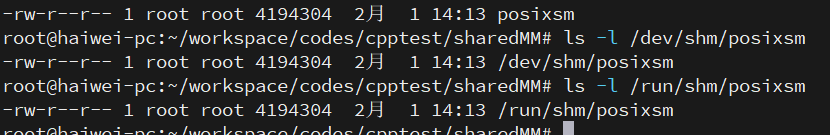

当然, 如果你不喜欢 `shm_open()` 这个 API, 你也可以用常规的 open 来打开文件, 然后进行 mmap. 关键的是 mmap.

POSIX 的共享内存, 仍然符合我们前面说的 tmpfs 的特点, 在运行了 sw, sr 后, 再运行 psw 和 psr, 我们发现 free 命令再次戏剧性变化:

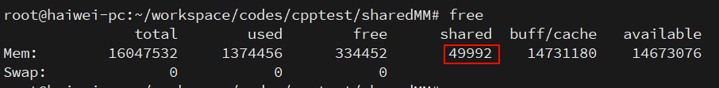

看一下 glibc 中 shm_open 函数的实现就一清二楚了:

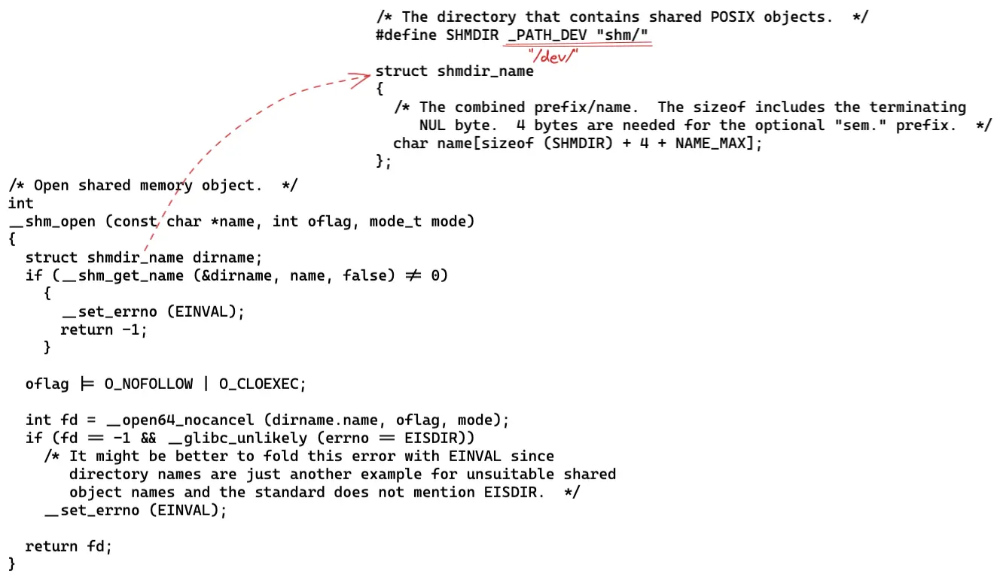

`shm_open` **函数**就是在 `/dev/shm` 目录下建文件, 该目录挂载为 tmpfs, 至于 **tmpfs** 可以简单理解为**存储介质是内存**的一种文件系统, 更准确的理解可以参考官方文档 `tmpfs.txt`.

然后通过 mmap 函数将 tmpfs 文件**映射到用户空间**就可以随意操作了.

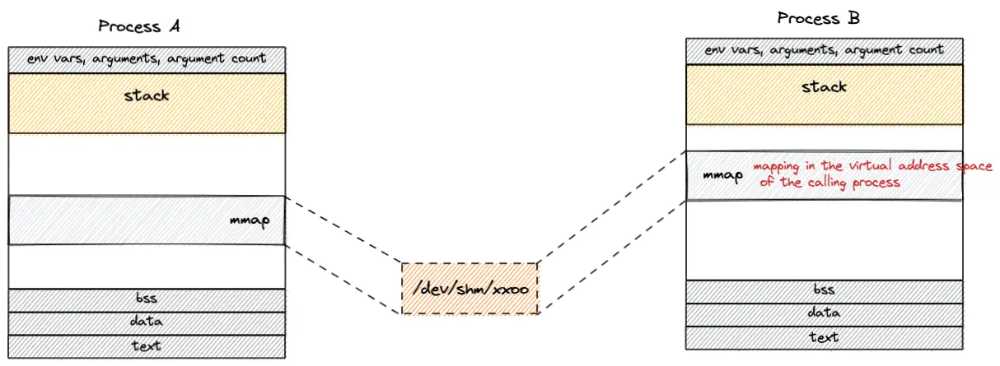

优点:

这种方式最大的优势在于**共享的内存**是有"**实体**"(也就是 **tmpfs** 中的**文件**)的, 所以多个进程可以很容易通过**文件名**这个信息构建共享内存结构, 特别适合把共享内存做为通信媒介的场景(例如 Aeron).

缺点:

如果非要找一个缺点的话, 可能是, 文件本身独立于进程的生命周期, 在使用完毕后需要注意删除文件(仅仅 close 是不行的), 否则会一直占用内存资源.

# 5. memfd_create

如果说 POSIX 的 mmap 让我找到回家的感觉, 那么 `memfd_create()` 则是万般惊艳.

## 跨进程 FD

在所有的所有开始之前, 我们要先提一下**跨进程分享 fd**(文件描述符, 对应我们很多时候说的 "**句柄**")这个重要的概念.

众所周知, Linux 的 **fd** 属于一个**进程级别**的东西. 进入每个进程的 `/proc/pid/fd` 可以看到它的 **fd 列表**:


A 进程的 0, 1, 2 和 B 进程的 0, 1, 2 不是一回事.

某年某月的某一天, 人们发现, **一个进程其实想访问另外一个进程的 fd**. 当然, 这只是目的不是手段. 比如进程 A 有 2 个 fd 指向 2 片内存, 如果进程 B 可以拿到这 2 个fd, 其实就可以透过这 2 个 fd 访问到这 2 片内存. 这个 fd 某种意义上充当了一个中间媒介的作用. 有人说, 那还不简单吗, 如果进程 A:

`fd = open();`

`open()` 如果返回 100, 把这个 100 告诉进程 B 不就可以了吗, 进程 B 访问这个 100 就可以了. 这说明你还是没搞明白 **fd** 是一个**进程内部**的东西, 是不能跨进程的概念. 你的 100 和我的 100, 不是一个东西. 这些基本的东西你搞不明白, 你搞别的都是白搭.

Linux 提供一个特殊的方法, 可以把一个进程的 fd 分享给另外一个进程.

那么如何 (**分享**) fd呢?

Linux 里面的分享需要借助 **cmsg**, 用于在 **socket** 上传递控制消息(也称 Ancillary data), 使用 **SCM_RIGHTS**, 进程可以通过 **UNIX Socket** 把一个或者多个 fd(file descriptor) 传递给另外一个进程.

比如下面的这个函数, 可以透过 socket 把 fds 指向的 n 个 fd 发送给另外一个进程:

```cpp
static void send_fd(int socket, int *fds, int n)
{
    struct msghdr msg = {0};
    struct cmsghdr *cmsg;
    char buf[CMSG_SPACE(n * sizeof(int))], data;
    memset(buf, '\0', sizeof(buf));
    struct iovec io = { .iov_base = &data, .iov_len = 1 };

    msg.msg_iov = &io;
    msg.msg_iovlen = 1;
    msg.msg_control = buf;
    msg.msg_controllen = sizeof(buf);

    cmsg = CMSG_FIRSTHDR(&msg);
    cmsg->cmsg_level = SOL_SOCKET;
    cmsg->cmsg_type = SCM_RIGHTS;
    cmsg->cmsg_len = CMSG_LEN(n * sizeof(int));

    memcpy((int *)CMSG_DATA(cmsg), fds, n * sizeof(int));

    if (sendmsg(socket, &msg, 0) < 0)
        handle_error("Failed to send message");
}
```

而另外一个进程, 则可以透过如下函数接受这个 fd:

```cpp
static int * recv_fd(int socket, int *fds, int n)
{
    int *fds = malloc(n * sizeof(int));
    struct msghdr msg = {0};
    struct cmsghdr *cmsg;
    char buf[CMSG_SPACE(n * sizeof(int))], data;
    memset(buf, '\0', sizeof(buf));
    struct iovec io = { .iov_base = &data, .iov_len = 1 };

    msg.msg_iov = &io;
    msg.msg_iovlen = 1;
    msg.msg_control = buf;
    msg.msg_controllen = sizeof(buf);

    if (recvmsg(socket, &msg, 0) < 0)
        handle_error("Failed to receive message");

    cmsg = CMSG_FIRSTHDR(&msg);

    memcpy(fds, (int *)CMSG_DATA(cmsg), n * sizeof(int));

    return fds;
}
```

那么问题来了, 如果在进程 A 中有一个文件的 fd 是 100, 发送给进程 B 后, 它还是 100 吗? 不能这么简单地理解, fd 本身是一个进程级别的概念, 每个进程有自己的 fd的列表, 比如进程 B 收到进程 A 的 fd 的时候, 进程 B 自身 fd 空间里面自己的前面 200 个 fd 都已经被占用了, 那么进程 B 接受到的 fd 就可能是 201. 数字本身在 Linux 的 fd 里面真地是一点都不重要, 除了几个特殊的 0, 1, 2 这样的数字外. 同样的, 如果你把 `cat /proc/interrupts` 显示出的中断号就看成是硬件里面的中断偏移号码(比如ARM GIC里某号硬件中断), 你会发现, 这个关系整个是一个瞎扯.

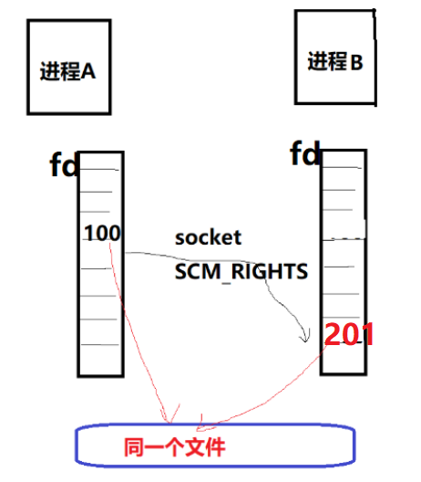

知道了甩锅 API, 那么重要的是, 当它与 `memfd_create()` 结合的时候, 我们准备甩出去的 fd 是怎么来? 它是 `memfd_create()` 的返回值.

`memfd_create()` 这个函数的玄妙之处在于它会**返回一个"匿名"内存"文件"的 fd**, 而它本身并没有实体的文件系统路径, 其典型用法如下:

```cpp
int fd = memfd_create("shma", 0);
ftruncate(fd, size);

void *ptr = mmap(NULL, size, PROT_READ | PROT_WRITE, MAP_SHARED, fd, 0);
strcpy(ptr, "hello A");
munmap(ptr, size);
```

我们透过 `memfd_create()` 创建了一个"文件", 但是它**实际映射到一片内存**, 而且在 `/xxx/yyy/zzz` 这样的**文件系统下没有路径**！没有路径！没有路径！

所以, 当你在Linux里面编程的时候, 碰到这样的场景: 需要一个 fd, **当成文件一样操作**, 但是又不需要真实地位于文件系统, 那么, 就请立即使用 `memfd_create()`.

那么, 它和前面我们说的透过 UNIX Socket 甩锅 fd 又有什么关系呢? `memfd_create()` 得到了 fd, 它在行为上类似规则的 fd, 所以也可以透过 socket 来进行甩锅, 这样 A 进程相当于把一片与 fd 对应的内存, 分享给了进程 B.

下面的代码进程 A 通过 `memfd_create()` 创建了 **2 片 4MB 的内存**, 并且透过 socket(路径 `/tmp/fd-pass.socket`)发送给进程 B 这 2 片内存对应的 fd:

```cpp
// sw.c
#define _GNU_SOURCE
#include <sys/mman.h>
#include <sys/socket.h>
#include <sys/un.h> //sockaddr_un头文件
#include <error.h>
#include <stdlib.h>
#include <stdio.h>
#include <string.h>

#define handle_error(msg) do { perror(msg); exit(EXIT_FAILURE); } while(0)

// //发送fd给接收函数
static void send_fd(int socket, int *fds, int n)  // send fd by socket
{
    struct msghdr msg = {0};
    struct cmsghdr *cmsg;
    char buf[CMSG_SPACE(n * sizeof(int))], dup[256];
    memset(buf, '\0', sizeof(buf));
    struct iovec io = { .iov_base = &dup, .iov_len = sizeof(dup) };

    msg.msg_iov = &io;
    msg.msg_iovlen = 1;
    msg.msg_control = buf;
    msg.msg_controllen = sizeof(buf);

    cmsg = CMSG_FIRSTHDR(&msg);
    cmsg->cmsg_level = SOL_SOCKET;
    cmsg->cmsg_type = SCM_RIGHTS;
    cmsg->cmsg_len = CMSG_LEN(n * sizeof(int));

    memcpy((int *)CMSG_DATA(cmsg), fds, n * sizeof (int));

    if (sendmsg (socket, &msg, 0) < 0)
        handle_error("Failed to send message");
}

int main(int argc, char *argv[])
{
    int sfd, fds[2];
    struct sockaddr_un addr;
    //获取套接字
    sfd = socket(AF_UNIX, SOCK_STREAM, 0);
    if (sfd == -1)
        handle_error("Failed to create socket");

    memset(&addr, 0, sizeof(struct sockaddr_un));
    addr.sun_family = AF_UNIX;
    strncpy(addr.sun_path, "/tmp/fd-pass.socket", sizeof(addr.sun_path) - 1);

#define SIZE 0x400000
    //获取文件描述符
    fds[0] = memfd_create("shma", 0);
    if (fds[0] < 0)
        handle_error("Failed to open file 0 for reading");
    else
        fprintf(stdout, "Opened fd %d in parent\n", fds[0]);
    //将文件扩大
    ftruncate(fds[0], SIZE);
    //初始化内存空间
    void *ptr0 = mmap(NULL, SIZE, PROT_READ | PROT_WRITE, MAP_SHARED, fds[0], 0);
    memset(ptr0, 'A', SIZE);
    munmap(ptr0, SIZE);

    //获取文件描述符
    fds[1] = memfd_create("shmb", 0);
    if (fds[1] < 0)
        handle_error("Failed to open file 1 for reading");
    else
        fprintf(stdout, "Opened fd %d in parent\n", fds[1]);
    //将文件扩大
    ftruncate(fds[1], SIZE);
    //初始化内存空间
    void *ptr1 = mmap(NULL, SIZE, PROT_READ | PROT_WRITE, MAP_SHARED, fds[1], 0);
    memset(ptr1, 'B', SIZE);
    munmap(ptr1, SIZE);

    fprintf(stdout, "Sender two fds are %d and %d\n", fds[0], fds[1]);

    if (connect(sfd, (struct sockaddr *)&addr, sizeof(struct sockaddr_un)) == -1)
        handle_error("Failed to connect to socket");

    send_fd(sfd, fds, 2);

    exit(EXIT_SUCCESS);
}
```

下面的代码**进程 B** 透过相同的 socket 接受这 2 片内存对应的 fd, 之后通过 `read()` 读取每个文件的前 256 个字节并打印:

> 这里作为 socket 的 server 端

```cpp
// sr.c
#define _GNU_SOURCE
#include <sys/mman.h>
#include <sys/socket.h>
#include <sys/types.h>
#include <sys/un.h>
#include <sys/wait.h>
#include <fcntl.h>
#include <errno.h>
#include <stdlib.h>
#include <stdio.h>
#include <string.h>
#include <unistd.h>

#define handle_error(msg) do { perror(msg); exit(EXIT_FAILURE); } while(0)

static
int * recv_fd(int socket, int n) {
    int *fds = malloc (n * sizeof(int));
    struct msghdr msg = {0};
    struct cmsghdr *cmsg;
    char buf[CMSG_SPACE(n * sizeof(int))], dup[256];
    memset(buf, '\0', sizeof(buf));
    struct iovec io = { .iov_base = &dup, .iov_len = sizeof(dup) };

    msg.msg_iov = &io;
    msg.msg_iovlen = 1;
    msg.msg_control = buf;
    msg.msg_controllen = sizeof(buf);

    if (recvmsg (socket, &msg, 0) < 0)
        handle_error ("Failed to receive message");

    cmsg = CMSG_FIRSTHDR(&msg);

    memcpy(fds, (int *)CMSG_DATA(cmsg), n * sizeof(int));

    return fds;
}

int main(int argc, char *argv[])
{
    ssize_t nbytes;
    char buffer[256];
    int sfd, cfd, *fds;
    struct sockaddr_un addr;

    sfd = socket(AF_UNIX, SOCK_STREAM, 0);
    if (sfd == -1)
        handle_error("Failed to create socket");

    if (unlink("/tmp/fd-pass.socket") == -1 && errno != ENOENT)
        handle_error("Removing socket file failed");

    memset(&addr, 0, sizeof(struct sockaddr_un));
    addr.sun_family = AF_UNIX;
    strncpy(addr.sun_path, "/tmp/fd-pass.socket", sizeof(addr.sun_path) - 1);

    if (bind(sfd, (struct sockaddr *)&addr, sizeof(struct sockaddr_un)) == -1)
        handle_error("Failed to bind to socket");
    if (listen(sfd, 5) == -1)
        handle_error("Failed to listen on socket");

    cfd = accept(sfd, NULL, NULL);
    if (cfd == -1)
        handle_error("Failed to accept incoming connection");

    fds = recv_fd(cfd, 2);
    fprintf(stdout, "Receiver two fds are %d and %d\n", fds[0], fds[1]);

    for (int i=0; i<2; i++) {
        fprintf(stdout, "Reading from passed fd %d\n", fds[i]);
        while ((nbytes = read(fds[i], buffer, sizeof(buffer))) > 0)
            write(1, buffer, nbytes);
        *buffer = '\0';
    }

    if(close(cfd) == -1)
        handle_error("Failed to close client socket");

    exit(EXIT_SUCCESS);
}
```

先执行 server 端

```
# touch /tmp/fd-pass.socket
# ./sr
Receiver two fds are 5 and 6
Reading from passed fd 5
AAAAAAAAAAAAAA.......AAAAAAAAAAAAReading from passed fd 6
BBBBBBBBBBBB....BBBBBB
```

再执行 client 端

```
# ./sw
Opened fd 4 in parent
Opened fd 5 in parent
Sender two fds are 4 and 5
```

上述代码参考了:

https://openforums.wordpress.com/2016/08/07/open-file-descriptor-passing-over-unix-domain-sockets/

上述的代码中, **进程 B** 是在进行 `read(fds[i], buffer, sizeof(buffer))`, 这体现了基于 fd 进行操作的regular特点. 当然, **如果是共享内存**, 现实的代码肯定还是多半会是 **mmap**:

`mmap(NULL, SIZE, PROT_READ, MAP_SHARED, fd, 0);`

那么, 透过 socket 发送 `memfd_create()` fd来进行进程间共享内存这种方法, 它究竟**惊艳在哪里**?

我认为首要的惊艳之处在于**编程模型**的惊艳. API 简单、灵活、通用. **进程之间**想共享**几片内存**共享几片内存, 想怎么共享怎么共享, 想共享给谁共享给谁, 无非是多了几个 fd 和 socket 的传递过程. 比如, 我从互联网上面收到了 jpeg 的视频码流, 一帧帧的画面, **进程 A** 可以创建**多片 buffer** 来缓存画面, 然后就可以透过把**每片 buffer 对应的 fd**, 递交给**另外的进程去解码**等. Avenue to Jane(大道至简), 简单的才是最好的！

`memfd_create()` 的另外一个惊艳之处在于支持 "**封印**"(sealing, 就是你玩游戏的时候的封印). 采用 `memfd_create()` 的场景下, 我们同样可以来**控制共享内存**的 shrink、grow 和 write. 最初的设想可以详见 `File Sealing & memfd_create()` 这篇文章:

`https://lwn.net/Articles/591108/`

我们如果在共享内存上施加了这样的封印, 则可以限制对此片区域的 ftruncate、write 等动作, 并建立某种意义上进程之间的相互信任

封印

* `SEAL_SHRINK`: If set, the inode size cannot be reduced

* `SEAL_GROW`: If set, the inode size cannot be increased

* `SEAL_WRITE`: If set, the file content cannot be modified

`File Sealing & memfd_create()` 文中举到的一个典型使用场景是, 如果 graphics client 把它与 graphics compoistor 共享的内存交给 compoistor 去 render, compoistor 必须保证可以拿到这片内存. 这里面的风险是 client 可能透过 ftruncate() 把这个 memory shrink 小, 这样 compositor 就拿不到完整的buffer, 会造成 crash. 所以 compositor 只愿意接受含有 `SEAL_SHRINK` 封印的fd, 如果没有, 对不起, 我们不能一起去西天取经.

在支持 `memfd_create()` 后, 我们应尽可能地使用这种方式来替代传统的 POSIX 和 SYS V, 基本它也是一个趋势, 比如我们在 wayland 相关项目中能看到这样的 patch:

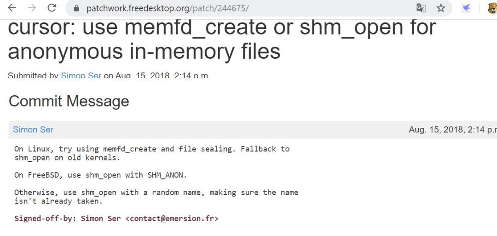

## 5.1. 小结

`memfd_create` 函数的作用是创建一个匿名的文件, 返回对应的 fd, 这个文件当然不普通, 它存活在内存中. 更准确的理解可以参考官方文档 memfd_create(2).

直观理解, memfd_create 与 shm_open 的作用是一样的, 都是创建共享内存实体, 只是 memfd_create 创建的实体是匿名的, 这就带了一个问题: 如何让其它进程获取到匿名的实体? `shm_open` 方式有具体的文件名, 所以可以通过**打开文件的方式**获取, 那么对于匿名的文件怎么处理呢?

答案是: 通过 Unix Domain Socket 传递 fd.

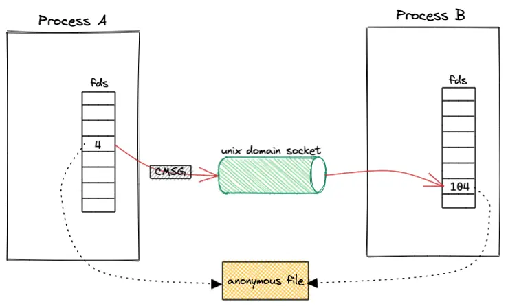

rust 的 UDS 实现:

rust 在 std 中已经提供了 UDS 的实现, 但是关于传递 fd 的 send_vectored_with_ancillary 函数还属于 nightly-only experimental API 阶段. 所以这里使用了一个三方 crate —— sendfd, 坦白说可以自己实现一下, 使用 libc 构建好 SCM_RIGHTS 数据, sendmsg 出去即可, 不过细节还是挺多, 我这里就放弃了.

这套 API 设计更灵活, 直接拓展了我的思路, 本来还是受限于 Aeron 的用法, 如果在这套 API 的加持下, 是否可以通过传递数据包内存块(fd)真正实现零拷贝呢?

优点: 灵活.

缺点: 无

# 6. dma_buf

`dma_buf` 定义

The DMABUF framework provides a generic method for sharing buffers between multiple devices. Device drivers that support DMABUF can export a DMA buffer to userspace as a file descriptor (known as the exporter role), import a DMA buffer from userspace using a file descriptor previously exported for a different or the same device (known as the importer role), or both.

简单地来说, `dma_buf` 可以实现 **buffer** 在**多个设备的共享**, 应用可以把一片**底层驱动 A 的 buffer 导出到用户空间**成为一个 **fd**, 也可以把 fd **导入到底层驱动 B**. 当然, 如果进行 `mmap()` 得到**虚拟地址**, **CPU** 也是可以**在用户空间**访问到已经获得用户空间虚拟地址的**底层 buffer** 的.

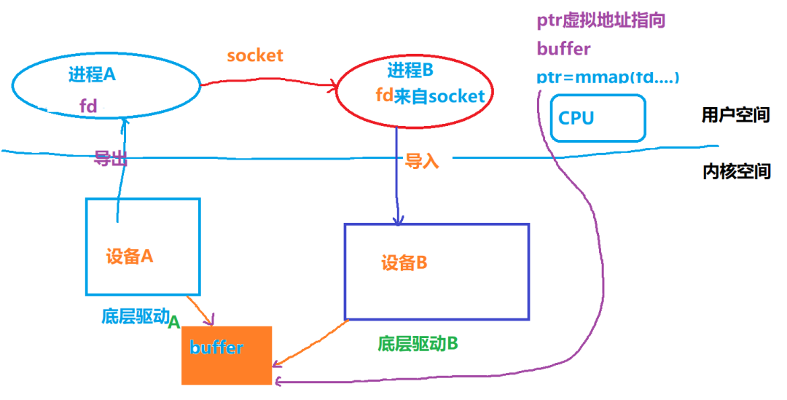

上图中, 进程A访问设备A并获得其使用的buffer的fd, 之后通过socket把fd发送给进程B, 而后进程 B 导入fd到设备B, B获得对设备A中的buffer的共享访问. 如果CPU也需要在用户态访问这片buffer, 则进行了 `mmap()` 动作.

为什么我们要共享 DMA buffer? 想象一个场景: 你要把你的屏幕framebuffer的内容透过gstreamer多媒体组件的服务, 变成h264的视频码流, 广播到网络上面, 变成流媒体播放. 在这个场景中, 我们就想尽一切可能的避免内存拷贝.

技术上, 管理 framebuffer 的驱动可以把这片buffer在底层实现为 dma_buf, 然后 graphics compositor 给这片 buffer 映射出来一个fd, 之后透过socket发送fd 把这篇内存交给gstreamer相关的进程, 如果gstreamer相关的"color space硬件转换"组件、"H264编码硬件组件"可以透过收到的fd还原出这些dma_buf的地址, 则可以进行直接的加速操作了. 比如color space透过接收到的fd1还原出framebuffer的地址, 然后把转化的结果放到另外一片dma_buf, 之后fd2对应这片YUV buffer被共享给h264编码器, h264编码器又透过fd2还原出 YUV buffer 的地址.

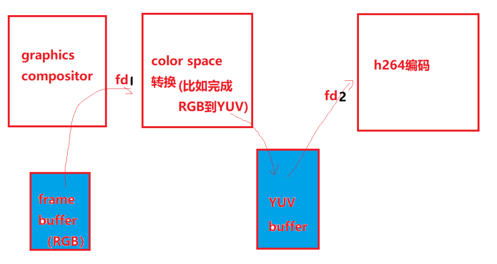

这里面的核心点就是fd只是充当了一个"句柄", 用户进程和设备驱动透过fd最终寻找到底层的dma_buf, 实现buffer在进程和硬件加速组件之间的zero-copy, 这里面唯一进行了exchange的就是fd.

再比如, 如果把方向反过来, gstreamer从网络上收到了视频流, 把它透过一系列动作转换为一片RGB的buffer, 那么这片RGB的buffer最终还要在graphics compositor里面渲染到屏幕上, 我们也需要透过dma_buf实现内存在video的decoder相关组件与GPU组件的共享.

Linux内核的V4L2驱动(encoder、decoder多采用此种驱动)、DRM(Direct Rendering Manager, framebuffer/GPU相关)等都支持dma_buf. 比如在DRM之上, 进程可以透过

```cpp
int drmPrimeHandleToFD(int fd,
uint32_t handle,
uint32_t flags,
int * prime_fd
)
```

获得底层 framebuffer 对应的 fd. 如果这个 fd 被分享给gstreamer 相关进程的 video 的 color space 转换, 而color space 转换硬件组件又被实现为一个 V4L2 驱动, 则我们可以透过 V4L2 提供的如下接口, 将这片 buffer 提供给V4L2驱动供其导入:

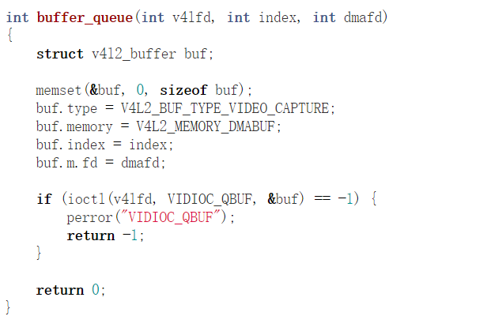

如果是multi plane的话, 则需要导入多个fd:

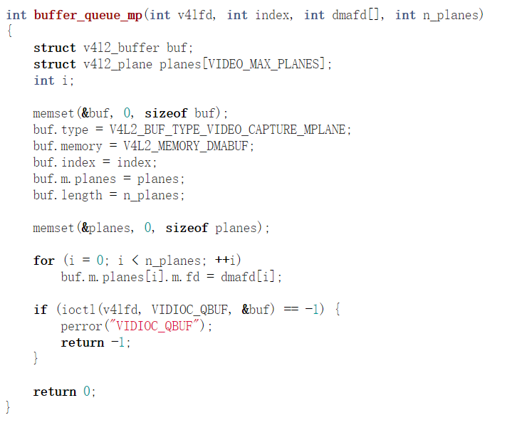

相关细节可以参考这个文档:

https://linuxtv.org/downloads/v4l-dvb-apis/uapi/v4l/dmabuf.html

一切都是文件！不是文件创造条件也要把它变成文件！这就是Linux的世界观. 是不是文件不重要, 关键是你得觉得它是个文件. 在dma_buf的场景下, fd这个东西, 纯粹就是个"句柄", 方便大家通过这么一个fd能够对应到最终硬件需要访问的buffer. 所以, 透过fd的分享和传递, 实际实现跨进程、跨设备(包括CPU)的内存共享.

如果说前面的SYS V、POSIX、memfd_create()更加强调内存在进程间的共享, 那么dma_buf则更加强调内存在设备间的共享, 它未必需要跨进程. 比如:

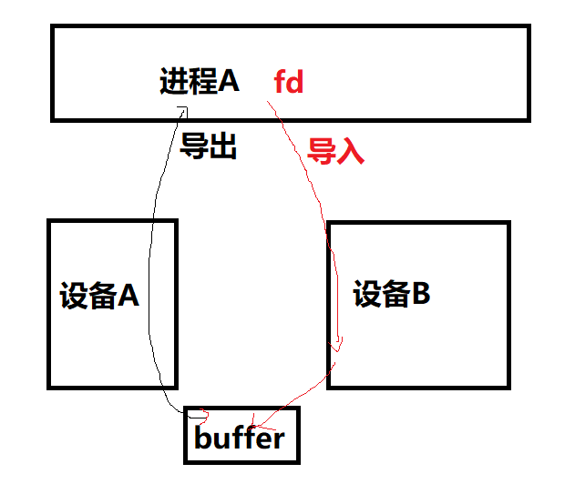

有的童鞋说, 为嘛在一个进程里面设备A和B共享内存还需要fd来倒腾一遍呢? 我直接设备A驱动弄个全局变量存buffer的物理地址, 设备B的驱动访问这个全局变量不就好了吗? 我只能说, 你对Linux内核的只提供机制不提供策略, 以及软件工程每个模块各司其责, 高内聚和低耦合的理解, 还停留在裸奔的阶段. 在没有dma_buf等类似机制的情况下, 如果用户空间仍然负责构建策略并连接设备A和B, 人们为了追求代码的干净, 往往要进行这样的内存拷贝:

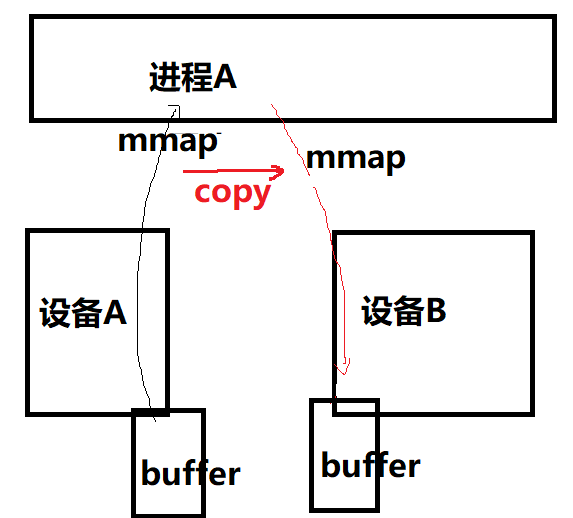

dma_buf的支持依赖于驱动层是否实现了相关的callbacks. 比如在v4l2驱动中, v4l2驱动支持把dma_buf导出(前面讲了v4l2也支持dma_buf的导入, 关键看数据方向), 它的代码体现在:

drivers/media/common/videobuf2/videobuf2-dma-contig.c中的:

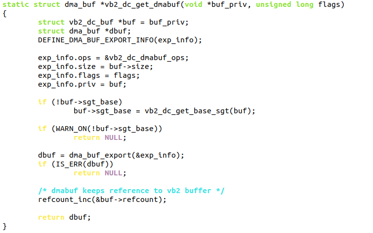

其中的vb2_dc_dmabuf_ops是一个struct dma_buf_ops, 它含有多个成员函数:

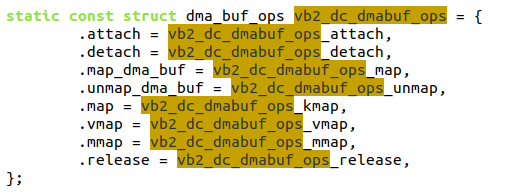

当用户call VIDIOC_EXPBUF这个IOCTL的时候, 可以把dma_buf转化为fd:

`int ioctl(int fd, VIDIOC_EXPBUF, struct v4l2_exportbuffer *argp);`

对应着驱动层的代码则会调用dma_buf_fd():

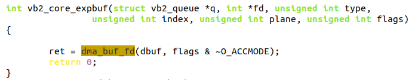

应用程序可以通过如下方式拿到底层的dma_buf的fd:

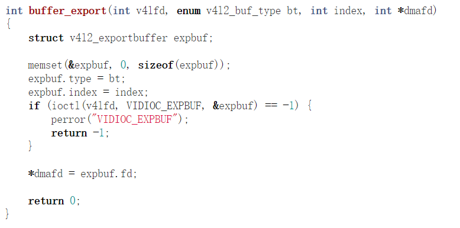

dma_buf的导入侧设备驱动, 则会用到如下这些API:

```cpp
dma_buf_attach()
dma_buf_map_attachment()
dma_buf_unmap_attachment()
dma_buf_detach()
```

# 7. 小结

下面这张表, 是笔者对这几种共享内存方式总的归纳:

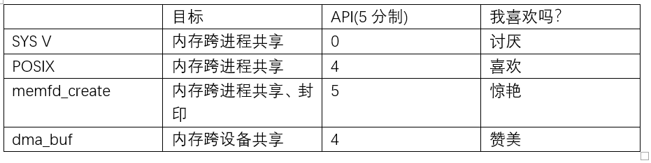

# 8. reference

来自 宋宝华: https://cloud.tencent.com/developer/article/1551288

https://www.jianshu.com/p/8a2103f974bd