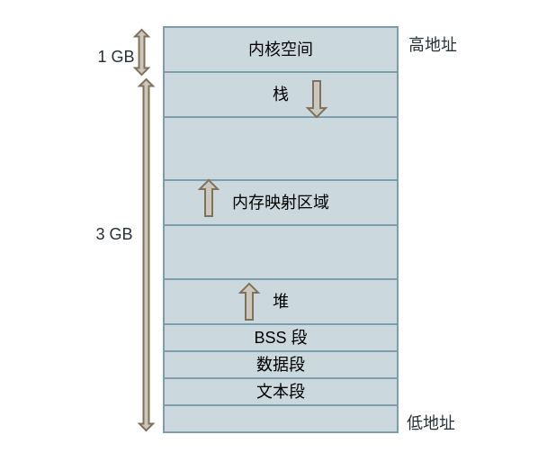
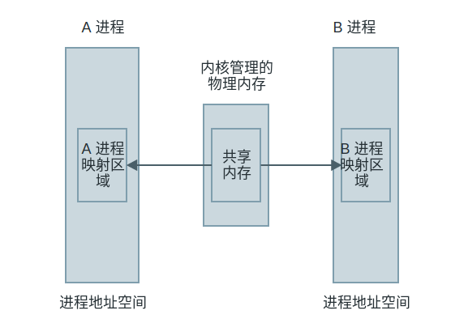
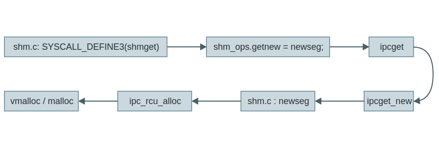

<!-- @import "[TOC]" {cmd="toc" depthFrom=1 depthTo=6 orderedList=false} -->

<!-- code_chunk_output -->

- [1. 共享内存 Shared Memory](#1-共享内存-shared-memory)
- [2. 共享内存属性](#2-共享内存属性)
- [3. 共享内存在哪里?](#3-共享内存在哪里)
- [4. 共享内存的操作](#4-共享内存的操作)
  - [4.1. 创建: shmget](#41-创建-shmget)
  - [4.2. 映射: shmat](#42-映射-shmat)
  - [4.3. 关闭映射: shmdt](#43-关闭映射-shmdt)
- [5. 例子: write_shm.c, read_shm.c](#5-例子-write_shmc-read_shmc)
- [6. 共享内存的内核机制](#6-共享内存的内核机制)
- [7. 结语](#7-结语)
- [8. reference](#8-reference)

<!-- /code_chunk_output -->

# 1. 共享内存 Shared Memory

Linux 中最快的一种 IPC 方式: 共享内存 Shared Memory, 它的基本原理是: 内核开辟一片内存区域, 然后多个用户进程可以将这片区域映射到它们自己的地址空间中进行读写. 为什么这种方式最快? 因为数据不需要在进程之间复制, 只要一个进程写入数据, 另一个进程就能马上读取数据了, 但是读取和写入必须同步.

# 2. 共享内存属性

我们可以在终端中使用 ipcs -m 查看系统当前开辟的共享内存:

```
# ipcs -m

------ Shared Memory Segments --------
key        shmid      owner      perms      bytes      nattch     status
0x00000000 104529920  orange     600        2097152    2          dest
0x00000000 688129     orange     600        524288     2          dest
0x00000000 113672194  orange     600        524288     2          dest
...
```

可以看到列出了共享内存的一些属性: 地址, id, 拥有者等等.

# 3. 共享内存在哪里? 

进程可以将共享内存映射到自己的地址空间中, 如下:



可以看到中间有一个**内存映射区域**(在**用户态虚拟地址空间**), 进程把**内核的共享内存**映射到这个地方, 模型如下:



进程可以通过共享内存的 API 获得内核所管理的共享内存的一份映射, 例如直接同步读写自己的映射文件就可以实现进程 A 和 B 之间的通信了, 非常简单.

# 4. 共享内存的操作

共享内存使用起来比较简单, 但是需要注意必须保持不同进程的读写同步, 可以使用信号量或者互斥锁等, 但是本篇文章主要介绍共享内存, 不会涉及同步相关的操作, 下面的例子主要介绍共享内存相关的 API 操作, 当你熟悉了基本的用法, 在以后学习同步时可以加上同步机制来保证读写正确.

共享内存(SHM)的操作主要分为下面 4 个步骤:

1. 创建或获取 SHM

2. 映射 SHM 到进程地址空间

3. 操作映射后的区域, 即读写

4. 关闭进程地址空间的映射区域

分别来了解这些操作的 API.

## 4.1. 创建: shmget

创建 SHM 调用 shmget:

```cpp
#include <sys/ipc.h>
#include <sys/shm.h>

/*
 * key: SHM 标识
 * size: SHM 大小
 * shmflg: 创建或得到的属性, 例如 IPC_CREAT
 * return: 成功返回 shmid, 失败返回 -1, 并设置 erron
 */
int shmget(key_t key, size_t size, int shmflg);
```

## 4.2. 映射: shmat

shmat 将由 shmget 返回的 shmid 标识的 SHM 映射到进程的地址空间:

```cpp
#include <sys/types.h>
#include <sys/shm.h>

/*
 * shmid: SHM ID
 * shmaddr: SHM 内存地址
 * shmflg: SHM 权限
 * return: 成功返回 SHM 的地址, 失败返回 (void *) -1, 并设置 erron
 */
void *shmat(int shmid, const void *shmaddr, int shmflg);
```

其中 shmaddr 参数主要有 2 种情况:

1. shmaddr = NULL: 系统选择一块合适的内存地址作为映射的起始地址

2. shmaddr != NULL: 用户自己地址, 但是该地址需要符合一定的条件, 详情参考 man shmat

## 4.3. 关闭映射: shmdt

shmdt 解除当前进程映射的 SHM:

```cpp
#include <sys/types.h>
#include <sys/shm.h>

/*
 * shmaddr: 已经映射的 SHM 地址
 * return: 成功返回 0, 失败返回 -1, 并设置 erron
 */
int shmdt(const void *shmaddr);
```

# 5. 例子: write_shm.c, read_shm.c

我们先创建一个片 SHM, 然后写入内容:

```cpp
#include <sys/ipc.h>
#include <sys/shm.h>
#include <sys/types.h>
#include <string.h>
#include <stdio.h>
#include <stdlib.h>

int main() {
    // 1. 创建 SHM
    int shm_id = shmget(13, 2048, IPC_CREAT | 0666);
    if (shm_id != -1) {
        // 2. 映射 SHM
        void *shm = shmat(shm_id, NULL, 0);
        if (shm != (void*)-1) {
            char str[] = "This is share memory";
            // 3. 写 SHM
            memcpy(shm, str, strlen(str) + 1);
            // 4. 关闭 SHM
            shmdt(shm);
        } else {
            perror("shmat:");
        }
    } else {
        perror("shmget:");
    }
    return 0;
}
```

再写一个程序来映射 SHM 并读取其中的内容:

```cpp
#include <sys/ipc.h>
#include <sys/shm.h>
#include <sys/types.h>
#include <string.h>
#include <stdio.h>
#include <stdlib.h>

int main() {
    // 1. 获取 SHM
    int shm_id = shmget(13, 2048, IPC_CREAT | 0666);

    if (shm_id != -1) {
        // 2. 映射 SHM
        void* shm = shmat(shm_id, NULL, 0);
        if (shm != (void*)-1) {
            // 3. 读取 SHM
            char str[50] = { 0 };
            memcpy(str, shm, strlen("This is share memory"));
            printf("shm = %s\n", (char *)shm);
            // 4. 关闭 SHM
            shmdt(shm);
        } else {
            perror("shmat:");
        }
    } else {
        perror("shmget:");
    }
    if (0 == shmctl(shm_id, IPC_RMID, NULL))
        printf("delete shm success.\n");
    return 0;
}
```

编译:

```
gcc write_shm.c -o write_shm
gcc read_shm.c -o read_shm
```

先运行写入 SHM:

```
./write_shm
```

再运行读取 SHM:

```
# ./read_shm
shm = This is share memory
delete shm success.
```

成功读取了写进程的写入的数据, 虽然不是同步的, 但是至少能够获取数据. 最后再来分析分析内核中的 SHM 调用过程吧.

# 6. 共享内存的内核机制

由于 SHM 的操作函数比较多, 我这里只分析 shmget 函数, 其他的函数都是类似的, 先从 glibc 的库函数开始: linux/shmget.c

```cpp
int shmget (key, size, shmflg)
	key_t key;
	size_t size;
	int shmflg;
{
	return INLINE_SYSCALL (ipc, 5, IPCOP_shmget, key, size, shmflg, NULL);
}
```

这个函数直接进行了系统调用, 来继续分析 Linux 3.4 内核大体的执行过程: 陷入内核后调用由 SYSCALL_DEFINE3 定义的系统调用 shmget, 之后对 shm_ops 中的回调函数赋值, 然后调用 ipcget, 在这个函数中先进行预处理, 然后调用 shm_ops 中设置的 newseg 回调函数, 这个回调函数在内核中开辟一段 SHM 内存空间, 至此就完成共享内存的创建.

其中 shm_ops 结构非常重要:

```cpp
// ipc/shm.c
/*
 * Structure that holds some ipc operations. This structure is used to unify
 * the calls to sys_msgget(), sys_semget(), sys_shmget()
 *      . routine to call to create a new ipc object. Can be one of newque,
 *        newary, newseg
 *      . routine to call to check permissions for a new ipc object.
 *        Can be one of security_msg_associate, security_sem_associate,
 *        security_shm_associate
 *      . routine to call for an extra check if needed
 */
struct ipc_ops {
	int (*getnew) (struct ipc_namespace *, struct ipc_params *);
	int (*associate) (struct kern_ipc_perm *, int);
	int (*more_checks) (struct kern_ipc_perm *, struct ipc_params *);
};
```

从这个结构的注释可以看到这个结构被「消息队列」, 「信号量」, 「共享内存」3 种 IPC 所使用, 所以这个结构非常的关键, 其中的函数指针基本都指向某一个 IPC 的实现函数, 之后被底层回调使用.

整个过程如下:



因为 shmget 会创建或者获取一个 SHM, 所以最后会涉及内核内存的分配 vmalloc 和 kmalloc, 详细的过程可以继续跟踪 ipc/shm.c

# 7. 结语

简单了解速度最快的 IPC 机制: 共享内存(Shared Memory), IPC 的 API 操作比较多这里不可能全部介绍, 但是一定要善于使用 man 手册. 我们也在内核中了解了 shmget 的基本调用过程, 其他的函数也是类似的, 都可以通过 `SYSCALL_DEFINE` 这个宏开始跟踪, 这个内核系统调用的关键地方. 希望你能多多实践, 也欢迎交流.

# 8. reference

https://dlonng.com/posts/smemory