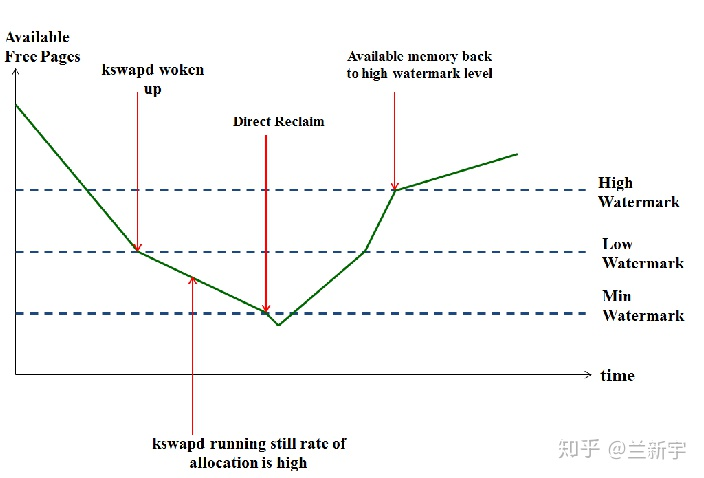
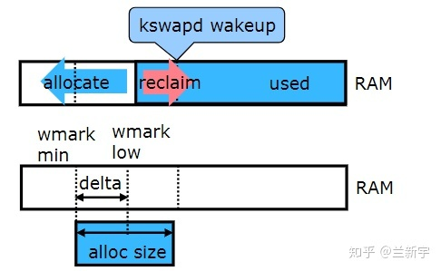
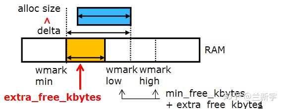

[前面的文章](https://zhuanlan.zhihu.com/p/72998605)提到"什么情况下触发 direct reclaim, 什么情况下又会触发 kswapd, 是由内存的 watermark 决定的", 那这个"watermark"到底是如何发挥作用的呢?

# kswapd 与 watermark

Linux 中物理内存的每个 zone 都有自己独立的 min, low 和 high 三个档位的 watermark 值, 在代码中以 struct zone 中的`_watermark[NR_WMARK]`来表示.

在进行内存分配的时候, 如果**分配器**(比如 `buddy allocator`)发现当前**空余内存的值低于**"`low`"但**高于**"`min`", 说明现在内存面临一定的压力, 那么在此次内存分配完成后, kswapd 将被唤醒, 以执行内存回收操作. 在这种情况下, 内存分配虽然会触发内存回收, 但**不存在被内存回收所阻塞**的问题, 两者的执行关系是异步的.

这里所说的"空余内存"其实是一个 zone 总的空余内存减去其 [lowmem_reserve](https://zhuanlan.zhihu.com/p/81961211) 的值. 对于 kswapd 来说, 要回收多少内存才算完成任务呢?只要把**空余内存的大小**恢复到"`high`"对应的**watermark 值**就可以了, 当然, 这取决于当前空余内存和"high"值之间的差距, 差距越大, 需要回收的内存也就越多. "`low`"可以被认为是一个**警戒水位线**, 而"high"则是一个安全的水位线.



如果内存分配器发现**空余内存**的值**低于**了"`min`", 说明现在**内存严重不足**. 这里要分两种情况来讨论, 一种是**默认的操作**, 此时分配器将**同步等待内存回收完成**, 再进行内存分配, 也就是`direct reclaim`. 还有一种特殊情况, 如果内存分配的请求是带了 `PF_MEMALLOC` 标志位的, 并且现在空余内存的大小可以满足本次内存分配的需求, 那么也将是先分配, 再回收.

使用`PF_MEMALLOC`("PF"表示 per-process flag)相当于是忽略了 watermark, 因此它对应的内存分配的标志是`ALLOC_NO_WATERMARK`. 能够获取"min"值以下的内存, 也意味着该 process 有动用几乎所有内存的权利, 因此它也对应 GFP 的标志`__GFP_MEMALLOC`.

```cpp
if (gfp_mask & __GFP_MEMALLOC)
	return ALLOC_NO_WATERMARKS;

if (alloc_flags & ALLOC_NO_WATERMARKS)
        set_page_pfmemalloc(page);
```

那谁有这样的权利, 可以在**内存严重短缺**的时候, 不等待回收而强行分配内存呢?其中的一个人物就是 kswapd 啦, 因为 kswapd 本身就是负责回收内存的, 它只需要占用一小部分内存支撑其正常运行(就像启动资金一样), 就可以去回收更多的内存(赚更多的钱回来).

虽然 kswapd 是在"`low`"到"`min`"的这段**区间**被唤醒加入调度队列的, 但当它**真正执行**的时候, 空余内存的值**可能**已经掉到"`min`"以下了. 可见, "min"值存在的一个意义是保证像 kswapd 这样的特殊任务能够在需要的时候立刻获得所需内存.

# watermark 的取值

那么这三个 watermark 值的大小又是如何确定的呢?`ZONE_HIGHMEM`的 watermark 值比较特殊, 但因为现在**64 位系统**已经不再使用 ZONE_HIGHMEM 了, 为了简化讨论, 以下将以不含 ZONE_HIGHMEM, 且只有一个[node](https://zhuanlan.zhihu.com/p/68473428)的 64 位系统为例进行讲解.

在这种系统中, **总的 "min_free" 值**约等于**所有 zones 可用内存的总和乘以 16 再开平方的大小**, 可通过`"/proc/sys/vm/min_free_kbytes"`**查看**和**修改**.

假设可用内存的大小是 4GiB, 那么其对应的 "min_free" 值就是 8MiB.


>根据注释, "min_free" 不是线性的, 因为网络带宽不会随机器尺寸线性增加. 所以计算方式是`min_free_kbytes = sqrt(lowmem_kbytes * 16)`

```cpp
// mm/page_alloc.c
int __meminit init_per_zone_wmark_min(void)
{
        unsigned long lowmem_kbytes;
        int new_min_free_kbytes;

        lowmem_kbytes = nr_free_buffer_pages() * (PAGE_SIZE >> 10);
        new_min_free_kbytes = int_sqrt(lowmem_kbytes * 16);

        if (new_min_free_kbytes > user_min_free_kbytes) {
                min_free_kbytes = new_min_free_kbytes;
                if (min_free_kbytes < 128)
                        min_free_kbytes = 128;
                if (min_free_kbytes > 262144)
                        min_free_kbytes = 262144;
        } else {
                pr_warn("min_free_kbytes is not updated to %d because user defined value %d is preferred\n",
                                new_min_free_kbytes, user_min_free_kbytes);
        }
```

这里的"min"值有个下限和上限, 就是最小不能低于`128KiB`, 最大不能超过`262144KiB`(256MB). 在实际应用中, 通常建议为不低于 1024KiB.

得到总的 "`min_free`" 值后, 我们就可以根据**各个 zone 在总内存中的占比**, 通过`do_div()`计算出它们**各自的"min"值**. 假设总的"min"值是 8MiB, 有`ZONE_DMA`和`ZONE_NORMAL`两个 zones, 大小分别是`128MiB`和`896MiB`, 那么`ZONE_DMA`和`ZONE_NORMAL`的"min"值就分别是`1MiB`和`7MiB`.

```cpp
// mm/page_alloc.c
static void __setup_per_zone_wmarks(void)
{
        // 将 min_free 字节大小转换成页面数目
        unsigned long pages_min = min_free_kbytes >> (PAGE_SHIFT - 10);
        unsigned long lowmem_pages = 0;
        struct zone *zone;
        unsigned long flags;

        /* Calculate total number of !ZONE_HIGHMEM pages */
        // 计算整个 非 zone_highmem 的页面数目
        for_each_zone(zone) {
                if (!is_highmem(zone))
                        lowmem_pages += zone_managed_pages(zone);
        }

        for_each_zone(zone) {
                u64 tmp;

                spin_lock_irqsave(&zone->lock, flags);
                // 这个 min_free 页面数 * zone 管理的页面数
                tmp = (u64)pages_min * zone_managed_pages(zone);
                // tmp = tmp 除以所有 zone 的页面数, 就是根据占比计算当前 zone 的 min_free
                do_div(tmp, lowmem_pages);
                if (is_highmem(zone)) {
                        /*
                         * __GFP_HIGH and PF_MEMALLOC allocations usually don't
                         * need highmem pages, so cap pages_min to a small
                         * value here.
                         *
                         * The WMARK_HIGH-WMARK_LOW and (WMARK_LOW-WMARK_MIN)
                         * deltas control async page reclaim, and so should
                         * not be capped for highmem.
                         */
                        unsigned long min_pages;

                        min_pages = zone_managed_pages(zone) / 1024;
                        min_pages = clamp(min_pages, SWAP_CLUSTER_MAX, 128UL);
                        zone->_watermark[WMARK_MIN] = min_pages;
                } else {
                        /*
                         * If it's a lowmem zone, reserve a number of pages
                         * proportionate to the zone's size.
                         */
                        // 水位的 min 设置
                        zone->_watermark[WMARK_MIN] = tmp;
                }

                /*
                 * Set the kswapd watermarks distance according to the
                 * scale factor in proportion to available memory, but
                 * ensure a minimum size on small systems.
                 */
                // 根据比例因子(与可用内存成比例)设置 kswapd 水印距离, 但是在小型系统上确保一个最小 size
                tmp = max_t(u64, tmp >> 2,
                            mult_frac(zone_managed_pages(zone),
                                      watermark_scale_factor, 10000));

                zone->watermark_boost = 0;
                zone->_watermark[WMARK_LOW]  = min_wmark_pages(zone) + tmp;
                zone->_watermark[WMARK_HIGH] = min_wmark_pages(zone) + tmp * 2;

                spin_unlock_irqrestore(&zone->lock, flags);
        }

        /* update totalreserve_pages */
        calculate_totalreserve_pages();
}
```

一个 zone 的"low"和"high"的值都是根据它的"min"值算出来的, "low"比"min"的值大 1/4 左右, "high"比"min"的值大 1/2 左右, 三者的比例关系大致是`4:5:6`.

使用"`cat /proc/zoneinfo`"可以查看这三个值的大小(注意这里是以 page 为单位的):

```
# cat /proc/zoneinfo | grep -A 15 Node
Node 0, zone   Normal
  pages free     97813814
        min      13987
        low      112271
        high     210555
        spanned  99876864
        present  99876864
        managed  98284939
        protection: (0, 0, 0, 0)
      nr_free_pages 97813814
      nr_zone_inactive_anon 69287
      nr_zone_active_anon 661
      nr_zone_inactive_file 53373
      nr_zone_active_file 44471
      nr_zone_unevictable 0
      nr_zone_write_pending 28
```

你可以把"`/proc/zoneinfo`"中所有 zones 的"min"值加起来乘以 4(如果 page size 是 4KiB 的话), 看一下是不是基本等于"`/proc/sys/vm`"中的"`min_free_kbytes`"的值.

```
# cat /proc/zoneinfo | grep min
        min      0
        min      48
        min      13987
        min      0
        min      0
        min      0
        min      14068
        min      0

# cat /proc/sys/vm/min_free_kbytes
112423
```

# watermark 的调节

为了**尽量避免出现 direct reclaim**, 我们需要**空余内存的大小**一直保持在"`min`"值之上. 在**网络收发**的时候, **数据量可能突然增大**, 需要临时申请大量的内存, 这种场景被称为"`burst allocation`". 此时 kswapd 回收内存的速度可能赶不上内存分配的速度, 造成 direct reclaim 被触发, 影响系统性能.



在内存分配时, 只有"`low`"与"`min`"之间之间的这段区域才是**kswapd 的活动空间**, **低于**了"`min`"会**触发 direct reclaim**, **高于**了"`low`"又**不会唤醒 kswapd**, 而 Linux 中默认的"low"与"min"之间的**差值确实显得小了点**.

为此, **Android**的设计者在 Linux 的内存 watermark 的基础上, 增加了一个"`extra_free_kbytes`"的变量, 这个"`extra`"是额外加在"`low`"与"`min`"**之间**的, 它在保持"`min`"值**不变**的情况下, 让"`low`"值有所**增大**. 假设你的"`burst allocation`"需要**100MiB**(`100*1024KiB`)的空间, 那么你就可以把"`extra_free_kbytes`"的值设为`102400`.



于是, 设置各个 zone 的 watermark 的代码变成了这样:

```cpp
static void __setup_per_zone_wmarks(void)
{
        unsigned long pages_min = min_free_kbytes >> (PAGE_SHIFT - 10);
        unsigned long pages_low = extra_free_kbytes >> (PAGE_SHIFT - 10);
        unsigned long lowmem_pages = 0;
        struct zone *zone;
        unsigned long flags;

        /* Calculate total number of !ZONE_HIGHMEM pages */
        for_each_zone(zone) {
                if (!is_highmem(zone))
                        lowmem_pages += zone_managed_pages(zone);
        }

        for_each_zone(zone) {
                u64 tmp, low;

                spin_lock_irqsave(&zone->lock, flags);
                tmp = (u64)pages_min * zone_managed_pages(zone);
                do_div(tmp, lowmem_pages);
                low = (u64)pages_low * zone_managed_pages(zone);
                do_div(low, nr_free_zone_pages(gfp_zone(GFP_HIGHUSER_MOVABLE)));
                if (is_highmem(zone)) {
                        /*
                         * __GFP_HIGH and PF_MEMALLOC allocations usually don't
                         * need highmem pages, so cap pages_min to a small
                         * value here.
                         *
                         * The WMARK_HIGH-WMARK_LOW and (WMARK_LOW-WMARK_MIN)
                         * deltas control async page reclaim, and so should
                         * not be capped for highmem.
                         */
                        unsigned long min_pages;

                        min_pages = zone_managed_pages(zone) / 1024;
                        min_pages = clamp(min_pages, SWAP_CLUSTER_MAX, 128UL);
                        zone->_watermark[WMARK_MIN] = min_pages;
                } else {
                        /*
                         * If it's a lowmem zone, reserve a number of pages
                         * proportionate to the zone's size.
                         */
                        zone->_watermark[WMARK_MIN] = tmp;
                }

                /*
                 * Set the kswapd watermarks distance according to the
                 * scale factor in proportion to available memory, but
                 * ensure a minimum size on small systems.
                 */
                tmp = max_t(u64, tmp >> 2,
                            mult_frac(zone_managed_pages(zone),
                                      watermark_scale_factor, 10000));

                zone->watermark_boost = 0;
                zone->_watermark[WMARK_LOW]  = min_wmark_pages(zone) + low + tmp;
                zone->_watermark[WMARK_HIGH] = min_wmark_pages(zone) + low + tmp * 2;

                spin_unlock_irqrestore(&zone->lock, flags);
        }

        /* update totalreserve_pages */
        calculate_totalreserve_pages();
}
```


https://lkml.org/lkml/2013/2/17/210


# 参考

Linux 内存调节之 zone watermark - 兰新宇的文章 - 知乎
https://zhuanlan.zhihu.com/p/73539328