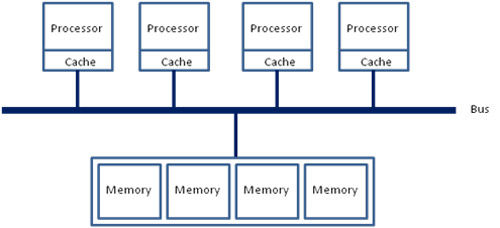
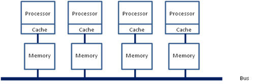
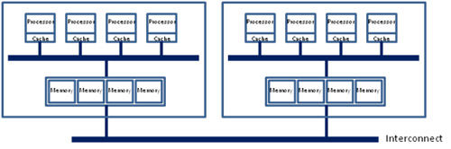
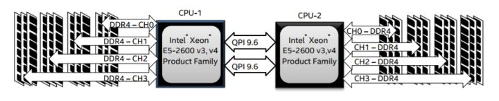
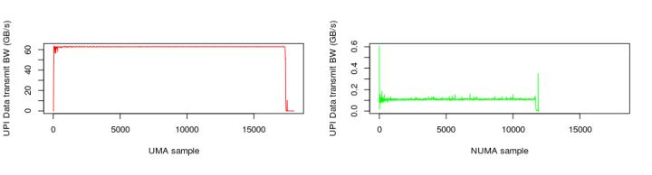

<!-- @import "[TOC]" {cmd="toc" depthFrom=1 depthTo=6 orderedList=false} -->

<!-- code_chunk_output -->

- [1 相关内容](#1-相关内容)
- [2 Intel 处理器变化历史](#2-intel-处理器变化历史)
  - [2.1 UMA](#21-uma)
  - [2.2 NUMA](#22-numa)
    - [2.2.1 一个 Socket 一个 Core(无 core 时代, Socket 间 NUMA)](#221-一个-socket-一个-core无-core-时代-socket-间-numa)
    - [2.2.2 一个 Socket 少量 Core(Socket 内 UMA, Socket 间 NUMA)](#222-一个-socket-少量-coresocket-内-uma-socket-间-numa)
    - [2.2.3 一个 Socket 多 Core(Socket 内 NUMA, Socket 间 NUMA)](#223-一个-socket-多-coresocket-内-numa-socket-间-numa)
- [3 Linux](#3-linux)
- [4 参考](#4-参考)

<!-- /code_chunk_output -->

# 1 相关内容

- [Linux 的 NUMA 机制](https://link.zhihu.com/?target=http%3A//www.litrin.net/2014/06/18/linux%25e7%259a%2584numa%25e6%259c%25ba%25e5%2588%25b6/)
- [NUMA 对性能的影响](https://link.zhihu.com/?target=http%3A//www.litrin.net/2017/08/03/numa%25e5%25af%25b9%25e6%2580%25a7%25e8%2583%25bd%25e7%259a%2584%25e5%25bd%25b1%25e5%2593%258d/)
- [cgroup 的 cpuset 问题](https://link.zhihu.com/?target=http%3A//www.litrin.net/2016/05/18/cgroup%25e7%259a%2584cpuset%25e9%2597%25ae%25e9%25a2%2598/)

# 2 Intel 处理器变化历史

## 2.1 UMA

在若干年前, 对于 x86 架构的计算机, 那时的**内存控制器还没有整合进 CPU**, 所有**内存的访问**都需要通过**北桥芯片**来完成. 此时的内存访问如下图所示, 被称为**UMA(uniform memory access, 一致性内存访问**). 这样的访问对于**软件层面**来说非常**容易**实现: **总线模型**保证了**所有的内存访问是一致的**, 不必考虑由不同内存地址之前的差异.



## 2.2 NUMA

之后的 x86 平台经历了一场从"**拼频率**"到"**拼核心数**"的转变, 越来越多的**核心**被尽可能地塞进了**同一块芯片**上, **各个核心！！！** 对于 **内存带宽的争抢！！！** 访问成为了瓶颈;

此时软件、OS 方面对于 SMP 多核心 CPU 的支持也愈发成熟;

再加上各种商业上的考量, x86 平台也顺水推舟的搞了**NUMA(Non-uniform memory access, 非一致性内存访问**).

### 2.2.1 一个 Socket 一个 Core(无 core 时代, Socket 间 NUMA)

在这种架构之下, **每个 Socket**都会有一个**独立的内存控制器 IMC(integrated memory controllers, 集成内存控制器**), 分属于**不同的 socket**之内的**IMC 之间**通过**QPI link**通讯.



### 2.2.2 一个 Socket 少量 Core(Socket 内 UMA, Socket 间 NUMA)

然后就是进一步的架构演进, 由于**每个 socket**上都会有**多个 core**进行内存访问, 这就会在 **每个 core(每个 socket 内部???！！！**) 的 **内部** 出现一个**类似最早 SMP 架构**相似的**内存访问总**线, 这个总线被称为**IMC bus**. 即, 每个 socket 内部是 SMP 的, 不同 socket 是 NUMA 的



于是, 很明显的, 在这种架构之下, **两个 socket**各自管理**1/2 的内存插槽**, 如果要访问**不属于本 socket 的内存**则必须通过**QPI link**. 也就是说**内存的访问**出现了**本地/远程(local/remote**)的概念, **内存的延时**是会有**显著的区别**的. 这也就是之前那篇文章中提到的为什么 NUMA 的设置能够明显的影响到 JVM 的性能.

### 2.2.3 一个 Socket 多 Core(Socket 内 NUMA, Socket 间 NUMA)

回到当前世面上的 CPU, 工程上的实现其实更加复杂了. 以[Xeon 2699 v4 系列 CPU 的标准](https://ark.intel.com/content/www/us/en/ark/products/96899/intel-xeon-processor-e5-2699a-v4-55m-cache-2-40-ghz.html)来看, **两个 Socket**之之间通过各自的一条**9.6GT/s 的 QPI link 互访**. 而**每个 Socket 里面！！！** 事实上有 **2 个内存控制器！！！**. **双通道**的缘故, **每个控制器**又有**两个内存通道(channel**), **每个通道**最多支持**3 根内存条(DIMM**). 理论上最大**单 socket**支持**76.8GB/s 的内存带宽**, 而**两个 QPI link**, 每个**QPI link**有**9.6GT/s**的速率(\~57.6GB/s)事实上 QPI link 已经出现瓶颈了. 所以出现了 UPI 总线.



嗯, 事情变得好玩起来了.

**核心数**还是源源不断的**增加**, Skylake 桌面版本的 i7 EE 已经有了**18 个 core**, 下一代的 Skylake Xeon 妥妥的 28 个 Core. 为了塞进更多的 core, 原本核心之间类似环网的设计变成了复杂的路由. 由于这种架构上的变化, 导致内存的访问变得更加复杂. **两个 IMC(也就是同一个 socket 里面！！！**)也有了**local/remote**的区别, 在保证兼容性的前提和性能导向的纠结中, 系统允许用户进行更为灵活的**内存访问架构划分**. 于是就有了"**NUMA 之上的 NUMA**"这种妖异的设定(**SNC**).

# 3 Linux

回到 Linux, 内核 mm/mmzone.c, include/linux/mmzone.h 文件定义了 NUMA 的数据结构和操作方式.

Linux Kernel 中**NUMA 的调度**位于**kernel/sched/core.c**函数**int sysctl\_numa\_balancing**

1. 在一个**启用了 NUMA 支持**的 Linux 中, Kernel**不会将**任务内存从一个 NUMA node 搬迁到另一个 NUMA node.
2. 一个进程一旦被启用, 它所在的 NUMA node 就不会被迁移, 为了尽可能的优化性能, 在正常的调度之中, CPU 的 core 也会尽可能的使用可以 local 访问的本地 core, 在进程的整个生命周期之中, NUMA node 保持不变.
3. 一旦当某个 NUMA node 的负载超出了另一个 node 一个阈值(默认 25%), 则认为需要在此 node 上减少负载, 不同的 NUMA 结构和不同的负载状况, 系统见给予一个延时任务的迁移——类似于漏杯算法. 在这种情况下将会产生内存的 remote 访问.
4. NUMA node 之间有不同的拓扑结构, 各个 node 之间的访问会有一个**距离**(node distances)的概念, 如**numactl \-H**命令的结果有这样的描述:

```
node distances:
node  0  1  2  3
  0: 10 11 21 21
  1: 11 10 21 21
  2: 21 21 10 11
  3: 21 21 11 10
```
可以看出: 0 node 到 0 node 之间距离为 10, 这肯定的最近的距离, 不提. 0-1 之间的距离远小于 2 或 3 的距离. 这种距离方便系统在较复杂的情况下选择最合适的 NUMA 设定.



上图记录了某个 Benchmark 工具, 在**开启/关闭 NUMA**功能时**UPI 带宽消耗**的情况. 很明显的是, 在**开启了 NUMA 支持**以后, **UPI 的带宽消耗**有了**两个数量级以上的下降**, **性能**也有了显著的**提升**！

通常情况下, 用户可以通过 numactl 来进行 NUMA 访问策略的手工配置, cgroup 中 cpuset.mems 也可以达到指定 NUMA node 的作用. 以 numactl 命令为例, 它有如下策略:

- –interleave=nodes //允许进程在多个 node 之间交替访问
- –membind=nodes //将内存固定在某个 node 上, CPU 则选择对应的 core.
- –cpunodebind=nodes //与 membind 相反, 将 CPU 固定在某(几)个 core 上, 内存则限制在对应的 NUMA node 之上.
- –physcpubind=cpus //与 cpunodebind 类似, 不同的是物理 core.
- –localalloc //本地配置
- –preferred=node //按照推荐配置

对于某些大内存访问的应用, 比如 Mongodb, 将 NUMA 的访问策略制定为 interleave=all 则意味着整个进程的内存是均匀分布在所有的 node 之上, 进程可以以最快的方式访问本地内存.

讲到这里似乎已经差不多了, 但事实上还没完. 如果你一直按照这个"**北桥去哪儿了**?"的思路理下来的话, 就有了另一个问题, 那就是之前的**北桥**还有一个功能就是**PCI/PCIe 控制器**, 当然**原来的南桥**, 现在的**PCH**一样也整合了**PCIe 控制器**. 事实上, 在**PCIe channel 上**也是有**NUMA 亲和性**的.

比如: 查看网卡 enp0s20f0u5 的 NUMA, 用到了 netdev:\<设备名称\>这种方式.

```
[root@local ~]# numactl --prefer netdev:enp0s20f0u5 --show
policy: preferred
preferred node: 0
physcpubind: 0
cpubind: 0
nodebind: 0
membind: 0 1 2 3
```

或者一个 PCI address 为 00:17 的 SATA 控制器, 用到了 pci:\<PCI address\>

```
[root@local~]# numactl --prefer pci:00:17 --show
policy: preferred
preferred node: 0
physcpubind: 0
cpubind: 0
nodebind: 0
membind: 0 1 2 3
```

还有 block/ip/file 的方式查看 NUMA affinity, 这里也就不再累述了.

综上, 感觉上现在的服务器, 特别是多 socket 的服务器架构更像是通过 NUMA 共享了内存; 进而通过共享内存从而共享外设的多台主机.

最后还是那句: 那种一个业务就能跑满整台 server 的时代是再也回不来了！

# 4 参考

- 本文来自于知乎专栏, 链接: https://zhuanlan.zhihu.com/p/33621500?utm_source=wechat_session&utm_medium=social&utm_oi=50718148919296
- Xeon 2699 v4 系列 CPU 的标准: https://ark.intel.com/content/www/us/en/ark/products/96899/intel-xeon-processor-e5-2699a-v4-55m-cache-2-40-ghz.html
- Linux 的 NUMA 机制: http://www.litrin.net/2014/06/18/linux%E7%9A%84numa%E6%9C%BA%E5%88%B6/