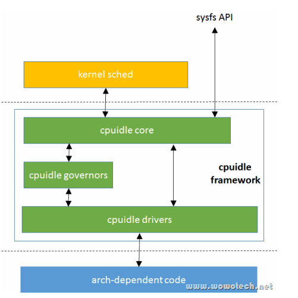

cpu idle 相关的指令有 HLT/PAUSE/MWAIT/UMWAT/TPAUSE.

Linux 内核中由 Scheduler 来判断 CPU 的工作量, 从而决定是否让 CPU idle. CPU 层面的手段很多, 但是 OS 层面只有一个抽象的概念即 idle.

那么, Scheduler 到底是如何判断当前工作量不饱满呢?

# 1. 调度器中 idle 触发条件

Linux Scheduler 为每个 CPU 都维护有一个 RunQueue, 可以认为是一个任务列表, 当且仅当所有任务都不是 runnable 状态时, Scheduler 才会切换到 idle process. 同时可以通过 nohz/nohz_full 启动参数减少 tick 中断对 idle cpu 的干扰.

## 1.1. idle 进程

首个 idle 进程是 0 号进程转换的.

kernel 中所有进程都来自一个静态结构体 `struct task_struct init_task`, init_task 会转化成 idle 进程.

`rest_init()` -> `cpu_startup_entry()` -> `while(1) do_idle()`

在 smp 系统中 core0 以外的其它 core 也会通过 `start_secondary` 函数最终产生 0 号进程且调用 `cpu_startup_entry` 来进入 idle loop 之中.

# 2. CPU 的各种手段

## 2.1. X86

### 2.1.1. HLT

这是初代的 idle 指令, 于 486DX 时代引入. 首先只有在 ring0 的特权级别才能执行 HLT 指令, 同时执行的效果是 CPU 进入了 C1/C1E state(参考 ACPI 标准), 属于CPU睡眠状态中的最低级别, 即最浅的睡眠. `APIC/BUS/CACHE` 都是照常运转, 只要**中断发生**, CPU 立即就要回到产线继续工作. C1E 稍微又优待 CPU, 停止内部时钟又降了压.

对于有超线程的CPU环境来说, HLT指令只会使逻辑CPU进入HALT状态, 而且对应的物理CPU保持Active, 除非对该物理CPU对应的所有的逻辑CPU都执行HLT指令. 

那CPU进入HALT状态后, 如何Resume呢? 谁来将其唤醒? 

答案是: **中断**(包括NMI和SMI), `debug exception`, `BINIT# signal`, `INIT# signal`, 或者 `RESET# signal`. 

Linux中, 通常在执行HLT指令进入HALT状态之前, 都会执行STI指令开中断, 所以, 对于Linux来说, 进入HALT状态后, 通常是通过中断唤醒的, 最可能的就是时钟中断了.

Linux idle相关流程

```cpp
start_kernel
  rest_init
    cpu_startup_entry
      cpu_idle_loop
        arch_cpu_idle
          x86_idle
            default_idle
              safe_halt
                raw_safe_halt
                  arch_safe_halt
                    native_safe_halt
```

### 2.1.2. PAUSE

也是非常早期的指令(Pentium 4), 让 CPU 休息, 大概从几个到几十个 cycles(各代 CPU 有差异). 为什么要打盹呢? 其实主要是要降低 CPU 在特定情况下(spin-lock)给**内存控制器**带来的压力, 与其让 CPU 阻塞了内存控制器, 不如让它休息. 在最近的几代 Xeon 之上还附带了降低功耗的 buff.

PAUSE指令提升了自旋等待循环(spin-wait loop)的性能. 当执行一个循环等待时, Intel P4或Intel Xeon处理器会因为检测到一个可能的内存顺序违规(memory order violation)而在退出循环时使性能大幅下降. PAUSE指令给处理器提了个醒: 这段代码序列是个循环等待. 处理器利用这个提示可以避免在大多数情况下的内存顺序违规, 这将大幅提升性能. 因为这个原因, 所以推荐在循环等待中使用PAUSE指令. 

PAUSE的另一个功能就是降低Intel P4在执行循环等待时的耗电量. Intel P4处理器在循环等待时会执行得非常快, 这将导致处理器消耗大量的电力, 而在循环中插入一个PAUSE指令会大幅降低处理器的电力消耗. 

PAUSE指令虽然是在Intel P4处理器开始出现的, 但是它可以向后与所有的IA32处理器兼容. 在早期的IA32 CPU中, PAUSE就像NOP指令. Intel P4和Intel Xeon处理器将PAUSE实现成一个预定义的延迟(pre-defined delay). 这种延迟是有限的, 而且一些处理器可以为0. PAUSE指令不改变处理器的架构状态(也就是说, 它实际上只是执行了一个延迟——并不做任何其他事情——的操作). 

这个指令的操作在64位和非64位模式下是一致的. 

### 2.1.3. MWAIT/MONITOR

新一代 CPU 架构师回顾了前辈的设计, 觉得 CPU 的权力完全没有得到充分的照顾, 应该给予更进一步的休息机会乃至真正的躺平! 而且唤醒的条件又多了一个, 除了**中断这种强唤醒模式**以外, 又加了内存的 CacheLine Invalidate 唤醒. 首先这两条指令也只能在 ring0 级别执行, 首先是调用 MONITOR 地址范围, 其次是 MWAIT 进入休眠, 一旦**该地址的内存**被任何其它的主体修改, 则唤醒 CPU 起来继续工作. 同时这次最大的改进是可以通过 MWAIT 进入各种不同的 Cstate. 其中 C6 是真正的躺平: CPU 电压可以归 0 同时 cache 也停.

最常见的 C State 状态详细描述

<table style="width:100%">
  <tr>
    <th>
    Cstate
    </th>
    <th>
    Name
    </th>
    <th>
    Description
    </th>
  </tr>
  <tr>
    <td>
    C0
    </td>
    <td>
    Operating State
    </td>
    <td>
    CPU fully turned on
    </td>
  </tr>
  <tr>
    <td>
    C1E
    </td>
    <td>
    Enhanced Halt
    </td>
    <td>
    Stops CPU main internal clocks via software and reduces CPU voltage; bus interface unit and APIC are kept running at full speed
    </td>
  </tr>
  <tr>
    <td>
    C3
    </td>
    <td>
    Deep Sleep
    </td>
    <td>
    Stops all CPU internal and external clocks
    </td>
  </tr>
  <tr>
    <td>
    C6
    </td>
    <td>
    Deep Power Down
    </td>
    <td>
    Reduces the CPU internal voltage to any value, including 0 Volts
    </td>
  </tr>
</table>

### 2.1.4. UMWAIT/UMONITOR

MWAIT 虽好, 但是奈何必须在 ring0 特权级下执行, 如果是一些特定的用户级应用例如 DPDK, Linux 的 idle driver 是很难得到执行的机会, 所以 CPU 架构师又生怜悯之心, 允许 CPU 在用户级也能进入躺平的模式, 不过作为妥协连 C1 state 都不行, 只能进入 C0.1/C0.2 等神秘模式. 效果还有待观察, 不过话说回来 SPR 这代 Xeon 才开始支持.

### 2.1.5. TPAUSE

UMWAIT 指令的升级加强版, 附带了一个 timer. TPAUSE 可以让 CPU 根据规定好的时间进行休息, 时间一到, 立刻继续搬砖. 当然这也是一个簇新簇新的指令, 在 SPR 上可用.

## 2.2. ARM

ARM 的 Idle-state 级别情况比较复杂一些, 更多的是和具体的芯片实现相关. 但是总体上也是把握几个大的类别:

* 只是停止 CPU 内部时钟
* CPU 降频
* 停止给 Cache 供电
* 停止给 CPU 供电

和 X86 相比 Arm 的唤醒机制没有和 MESI 协议连接有些遗憾(也就是没有实现通过 MEM 地址监控的方式达成唤醒).

### 2.2.1. YEILD

这条颇为类似 PAUSE 基本功能接近,使用场景也接近(spin lock).

### 2.2.2. WFE/WFI

这两条指令顾名思义 wait for event/ wait for interrupt, 中断这条大家都可以理解类似 HLT,那么 event 这条就值得看看了. ARM 架构可以从一个 CPU 向所有其它 CPU 发送 event(sev 指令), 我的理解类似 IPI 广播, 收到了此 event 的 CPU 如果处于 idle 状态, 则需要立即唤醒. (注:和宋老师讨论以后发现 event 和 IPI 的一个区别是不需要 ISR 来响应, 同时 event 并不能唤醒由于 WFI 指令进入的 idle, 这个有点囧, 反过来中断可以唤醒由于 WFE 进入的 idle. 这两个躺平姿势水很深啊)

# 3. 软件实现

除了硬件的各种花式躺平技术之外还有两类"伪躺平"技术.

## 3.1. idle polling

通过**启动参数**, 我们可以指定 cpu 的 **idle 进程**并**不调用**硬件提供的 idle 功能而仅仅是 **polling**, 这种情况主要用于需要极低的 CPU 从 idle 状态返回时延的场景. 那么如果压根没有进入实际的 idle 状态, 当然时延是极低的, 同时也能融入到 idle 整体的框架, 不至于破坏规矩开特例.

相关细节参考内核文档

Documentation/admin-guide/pm/cpuidle.rst:

## 3.2. halt-polling

在打开虚拟化的场景下, 事情就变得更加有趣了. 大多数情况下, qemu 会缺省的只对 guest 提供 HLT 指令作为 idle 的唯一机制, 但是 HLT 指令毫无悬念的会触发 VMEXIT. 虽然说大多数情况下 kvm 看到 exit reason 是 HLT 也只是执行 poll 而已, 但是 VMEXIT/VM_RESUME 还是如此的痛, 毕竟几千个 cycles 已经无谓流逝, 追求极致的我们怎么能放任资源浪费. 于是 Redhat 在 Guest 端引入了 halt poll 机制, 也就是说如果 matrix 中的 CPU 首先开始假摸鱼(poll), 如果假摸鱼时间超过了阈值才真的去触发 HLT 指令. 如果很快就被从假模鱼状态拉回去搬砖, 则省去了出入 matrix 的费用.

相关细节参考内核文档:

Documentation/virt/guest-halt-polling.rst

Documentation/translations/zh_CN/virt/guest-halt-polling.rst

# 4. CPU idle driver/governor

最后软件硬件各种方式很多, 内核无奈又祭出了抽象大法把 idle 的时长与返回时延的选择与具体执行 idle 的机制分离开来.

* idle governor 就负责做时长与时延的选择, 也可以称为 idle -select.

* idle driver 则是负责通过我们上面描述的各种软硬件机制来实现 governor 指定的目标. 同时向 governor menu 经理提供各种不同机制的性能参数, 以供 menu 经理选择,  就是所谓的 idle-enter.



idle governor 缺省的算法只有一个就是 menu, 还有 3 个候选的 ladder/TEO/haltpoll 算法但是一般需要重新编译内核来激活.

* ladder 算法故名意思, 是首先从能耗较高/返回时延较小的状态开始, 当系统 idle 超过了阈值再进入更深的节能状态, 从而逐步升级节能状态. 俗称添油战术也可以美其名曰"快速迭代".

* menu 算法单从名字看则有点让人摸不到头脑,其内部机制也确实颇为复杂, menu 算法主要是要在节能状态的停留时间与系统能容忍的返回时延之间做权衡以达到最佳效果.

请原谅我非常不精确地描述一下 menu. menu 仿佛一个非常敬业的经理凡事都要精算做出最优选择, CPU 工人一旦休息再想打起精神干活这个转换是有一个代价的, 往往需要口头鼓励(画饼)+物质鼓励(肉夹馍). 那么经理就要考虑如果工人休息时间太短,休息的好处远低于让 CPU 工人重新振作的代价,那么这个休息就是不合理的(无情啊). 而且休息也有好些种类, 从假休息到完全躺平, 到底哪一种休息状态才是收益比最佳的? menu 会无情的选择那个休息带来好处大于重新振作代价的方案. 同时 menu 经理还会受到来自客户的压力, 时延也是要满足的. 客户的耐心大抵上都是不好的, menu 经理会疯狂试探客户的底线. 它选择的方案是满足客户耐心上限的情况下 CPU 工人消耗能耗最少的方案. 同时做到以上两点 menu 经理大约才能有希望完成 OKR/KPI.

# 5. 参考文献

https://www.51cto.com/article/665543.html

[1] https://www.kernel.org/doc/Documentation/devicetree/bindings/arm/idle-states.txt

[2] https://www.dell.com/support/kbdoc/en-ie/000060621/what-is-the-c-state

[3] Intel SDM latest version

[4] https://www.kernel.org/doc/html/latest/virt/guest-halt-polling.html

[5] https://www.kernel.org/doc/html/latest/admin-guide/pm/cpuidle.html

[6] https://www.programmersought.com/article/13982556297/
