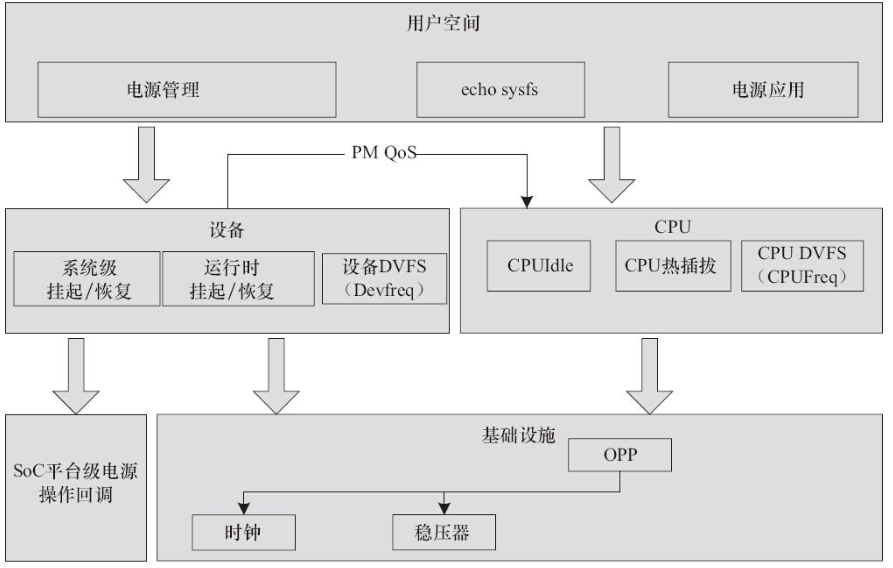
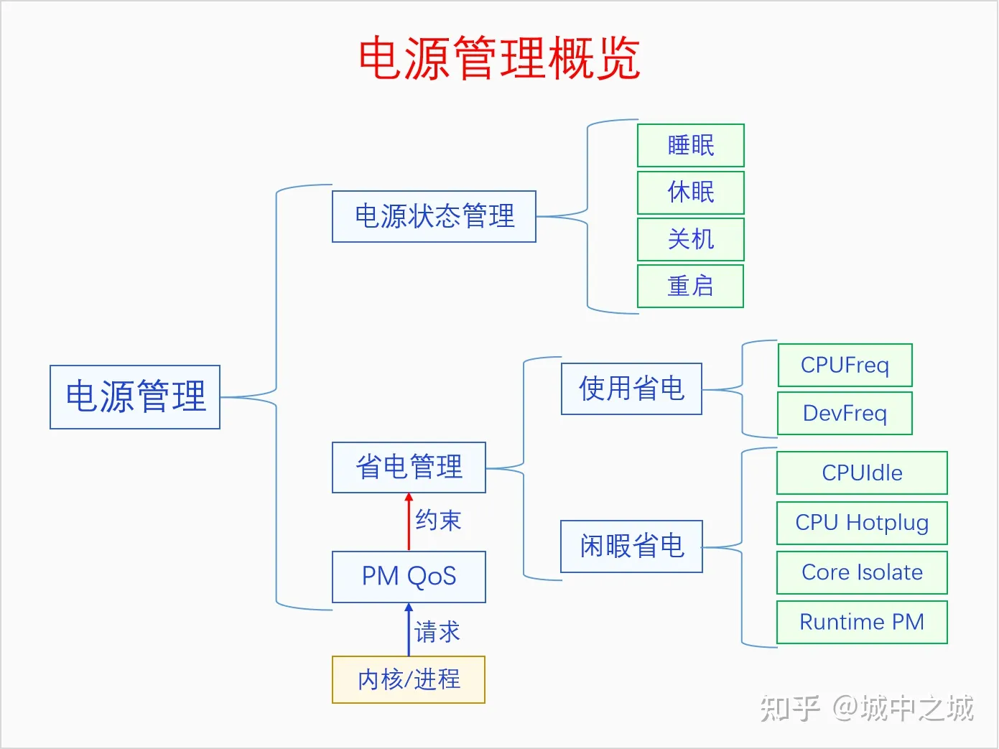
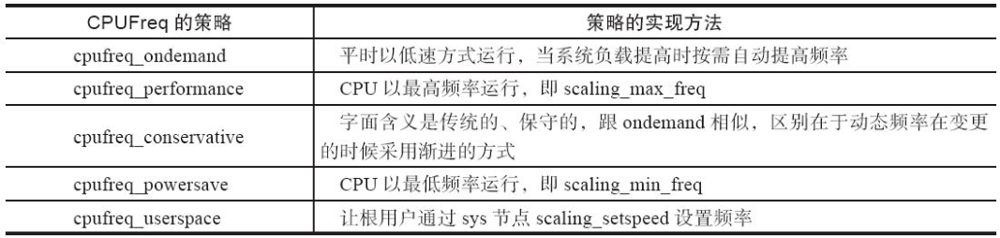
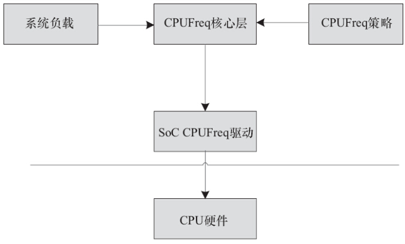
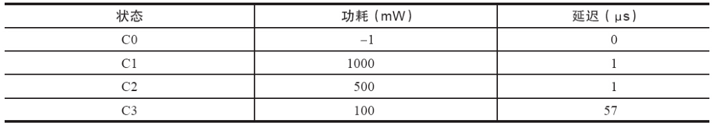
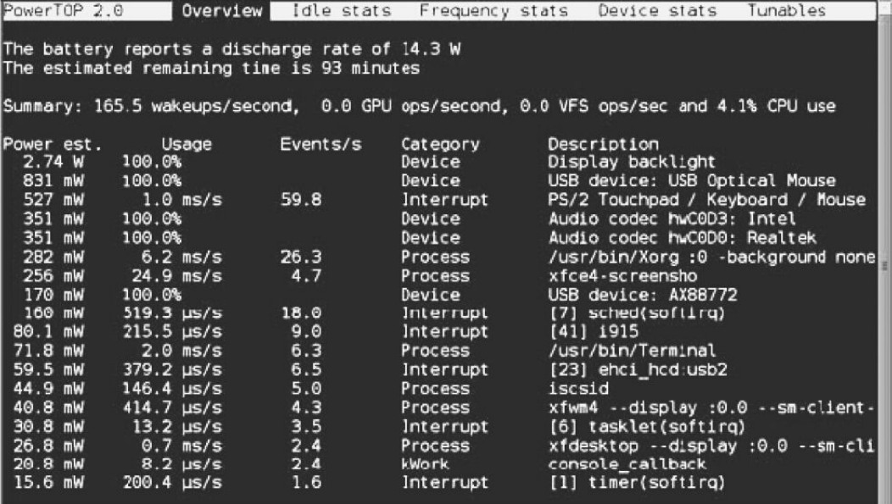
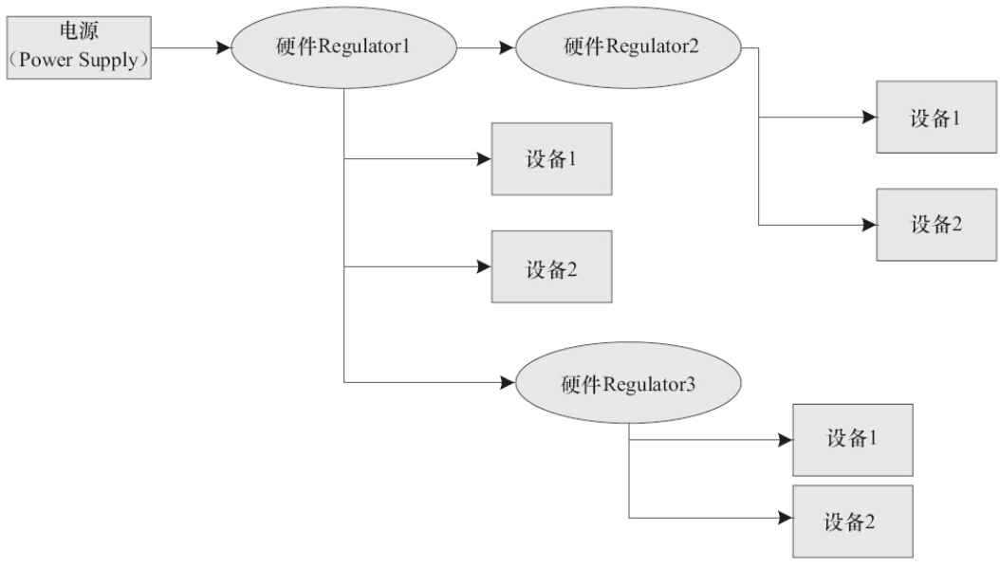
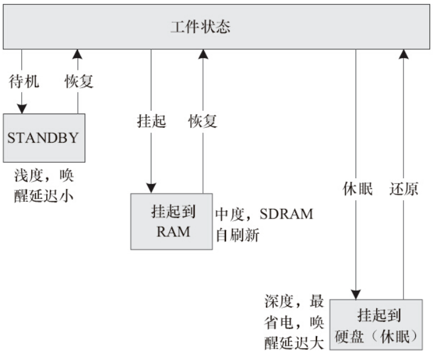
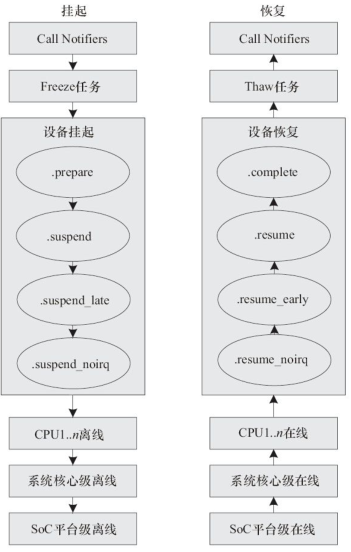

<!-- @import "[TOC]" {cmd="toc" depthFrom=1 depthTo=6 orderedList=false} -->

<!-- code_chunk_output -->

- [1. 介绍](#1-介绍)
- [2. 架构](#2-架构)
- [3. CPUFreq 驱动](#3-cpufreq-驱动)
- [4. CPUFreq 的策略](#4-cpufreq-的策略)
- [5. CPUFreq 的性能测试和调优](#5-cpufreq-的性能测试和调优)
- [6. CPUIdle 驱动](#6-cpuidle-驱动)
- [7. PowerTop](#7-powertop)
- [8. Regulator 驱动](#8-regulator-驱动)
- [9. OPP](#9-opp)
- [10. PM QoS](#10-pm-qos)
- [11. CPU 热插拔](#11-cpu-热插拔)
- [12. 挂起到 RAM](#12-挂起到-ram)
- [13. 运行时的 PM](#13-运行时的-pm)

<!-- /code_chunk_output -->

# 1. 介绍

Linux 电源管理非常复杂, 牵扯到**系统级的待机**、**频率电压变换**、**系统空闲时的处理**以及**每个设备驱动**对系统**待机**的支持和**每个设备的运行时**(`Runtime`)**电源管理**, 可以说它和系统中的每个设备驱动都息息相关.

linux提供了多种电源管理方式. 为了解决系统不工作时的功耗消耗, linux提供了休眠(suspend to ram or disk)、关机(power off)、复位(reboot). 为了解决运行时不必要的功耗消耗, linux提供了 `runtime pm`、`cpu/device dvfs`、`cpu hotplug`、`cpu idle`、`clock gate`、`power gate`、`reset` 等电源管理的机制. 为了解决运行时电源管理对性能的影响, linux 提供了 pm qos 的功能, 用于平衡性能与功耗, 这样既能降低功耗, 又不影响性能.

# 2. 架构

下图呈现了 Linux 内核电源管理的整体架构.



大体可以归纳为如下几类:

1) CPU 在**运行时**根据系统负载进行**动态电压和频率变换**的 `CPUFreq`.

2) CPU 在**系统空闲时**根据空闲的情况进行**低功耗模式**的 `CPUIdle`.

3) 多核系统下 **CPU 的热插拔**支持.

4) **系统和设备**针对延迟的特别需求而提出申请的 **PM QoS**, 它会作用于 **CPUIdle** 的具体策略.

5) **设备驱动**针对系统挂起到 RAM/硬盘 的一系列入口函数.

6) SoC 进入挂起状态、SDRAM 自刷新的入口.

7) **设备**的**运行时动态电源管理**, 根据使用情况动态开关设备.

8) **底层**的**时钟**、**稳压器**、**频率/电压表**(OPP 模块完成)支撑, **各驱动子系统**都可能用到.

计算机运行在物理世界中, 物理世界中的一切活动都需要消耗能量. 能量的形式有很多种, 如热能、核能、化学能等. 计算机消耗的是电能, 其来源是电池或者外电源. 计算机内部有一个部件叫做电源管理芯片(PMIC), 它接收外部的电能, 然后转化为不同电压的电流, 向系统的各个硬件供电. 什么硬件需要多少伏的电压, 都是由相应的电气标准规定好了的, 各个硬件厂商按照标准生成硬件就可以了. 上电的过程是由硬件自动完成的, 不需要软件的参与. 因为硬件不上电的话, 软件也没法运行啊. 但是当硬件运行起来之后, 软件就可以对硬件的电源状态进行管理了. 电源管理的内容包括电源状态管理和省电管理. 电源状态管理是对整个系统的供电状态进行管理, 内容包括睡眠、休眠、关机、重启等操作. 省电管理是因为电能不是免费的, 我们应该尽量地节省能源, 尤其是对于一些手持设备来说, 电能虽然并不昂贵但是却非常珍贵, 因为电池的容量非常有限. 不过省电管理也不能一味地省电, 还要考虑性能问题, 在性能与功耗之间达到平衡.



# 3. CPUFreq 驱动

CPUFreq 子系统位于 `drivers/cpufreq` 目录下, 负责进行运行过程中 **CPU 频率**和**电压**的**动态调整**, 即 DVFS(`Dynamic Voltage Frequency Scaling`, **动态电压频率调整**). 运行时进行 CPU 电压和频率调整的原因是: **CMOS** 电路中的功耗与电压的平方成正比、与频率成正比, 因此降低电压和频率可降低功耗.

CPUFreq 的核心层位于 `drivers/cpufreq/cpufreq.c` 下, 它为各个 SoC 的 CPUFreq 驱动的实现提供了一套统一的接口, 并实现了一套 **notifier** 机制, 可以在 CPUFreq 的策略和频率改变的时候**向其他模块发出通知**.

# 4. CPUFreq 的策略

SoC CPUFreq 驱动只是设定了 CPU 的频率参数, 以及提供了设置频率的途径, 但是它并不会管 CPU 自身究竟应该运行在哪种频率上. 究竟频率依据的是哪种标准, 进行何种变化, 而这些完全由 CPUFreq 的**策略**(policy)决定, 这些策略如表所示.



Android 系统中, 则增加了 1 个交互策略, 该策略适合于对延迟敏感的 UI 交互任务, 当有 UI 交互任务的时候, 该策略会更加激进并及时地调整 CPU 频率.

总而言之, 系统的状态以及 CPUFreq 的策略共同决定了 CPU 频率跳变的目标, CPUFreq 核心层并将目标频率传递给底层具体 SoC 的 CPUFreq 驱动, 该驱动修改硬件, 完成频率的变换, 如图所示.



用户空间一般可通过 `/sys/devices/system/cpu/cpux/cpufreq` 节点来设置 CPUFreq. 譬如, 我们要设置 CPUFreq 到 700MHz, 采用 userspace 策略, 则运行如下命令:

```
# echo userspace > /sys/devices/system/cpu/cpu0/cpufreq/scaling_governor
# echo 700000 > /sys/devices/system/cpu/cpu0/cpufreq/scaling_setspeed
```

# 5. CPUFreq 的性能测试和调优

Linux 3.1 以后的内核已经将 `cpupower-utils` 工具集放入内核的`tools/power/cpupower` 目录中, 该工具集当中的 `cpufreq-bench` 工具可以帮助工程师分析采用 CPUFreq 后对系统性能的影响.

`cpufreq-bench` 工具的**工作原理**是**模拟系统**运行时候的 "空闲  ->  忙  ->  空闲  ->  忙" 场景, 从而触发**系统的动态频率变化**, 然后在使用 ondemand、conservative、interactive 等策略的情况下, 计算在做与 performance 高频模式下同样的运算完成任务的时间比例.

交叉编译该工具后, 可放入目标电路板文件系统的 /usr/sbin/ 等目录下, 运行该工具:

```
# cpufreq-bench -l 50000 -s 100000 -x 50000 -y 100000 -g ondemand -r 5 -n 5 -v
```

会输出一系列的结果, 我们提取其中的 Round n 这样的行, 它表明了-g ondemand 选项中设定的 ondemand 策略相对于 performance 策略的性能比例, 假设值为:

```
Round 1 - 39.74%
Round 2 - 36.35%
Round 3 - 47.91%
Round 4 - 54.22%
Round 5 - 58.64%
```

这显然不太理想, 我们在同样的平台下采用 Android 的交互策略, 得到新的测试结果:

```
Round 1 - 72.95%
Round 2 - 87.20%
Round 3 - 91.21%
Round 4 - 94.10%
Round 5 - 94.93%
```

一般的目标是在采用 CPUFreq 动态调整频率和电压后, 性能应该为 performance 这个高性能策略下的 90%左右, 这样才比较理想.

# 6. CPUIdle 驱动

目前的 ARM SoC 大多支持几个不同的 Idle 级别, CPUIdle 驱动子系统存在的目的就是对这些 Idle 状态进行管理, 并根据系统的运行情况进入不同的 Idle 级别. 具体 SoC 的底层 CPUIdle 驱动实现则提供一个类似于 CPUFreq 驱动频率表的 Idle 级别表, 并实现各种不同 Idle 状态的进入和退出流程.

对于 Intel 系列笔记本计算机而言, 支持 ACPI(Advanced Configuration and Power Interface, 高级配置和电源接口), 一般有 4 个不同的 C 状态 (其中 C0 为操作状态, C1 是 Halt 状态, C2 是 Stop-Clock 状态, C3 是 Sleep 状态), 如表所示.



# 7. PowerTop

PowerTop 是一款开源的用于进行电量消耗分析和电源管理诊断的工具, 其主页位于 Intel 开源技术中心的 https://01.org/powertop/, 维护者是 Arjan van de Ven 和 Kristen Accardi. PowerTop 可分析系统中软件的功耗, 以便找到功耗大户, 也可显示系统中不同的 C 状态(与 CPUIdle 驱动对应)和 P 状态(与 CPUFreq 驱动对应)的时间比例, 并采用了基于 TAB 的界面风格, 如图所示.



# 8. Regulator 驱动

Regulator 是 Linux 系统中电源管理的基础设施之一, 用于**稳压电源**的管理, 是各种驱动子系统中设置电压的标准接口. 前面介绍的 CPUFreq 驱动就经常使用它来设定电压.

而 Regulator 则可以管理系统中的供电单元, 即稳压器(Low Dropout Regulator, LDO, 即低压差线性稳压器), 并提供获取和设置这些供电单元电压的接口. 一般在 ARM 电路板上, 各个稳压器和设备会形成一个 Regulator 树形结构, 如图所示.

Linux 的 Regulator 子系统提供如下 API 以用于注册/注销一个稳压器:

```cpp
structregulator_dev * regulator_register(conststructregulator_desc *regulator_desc, conststructregulator_config *config);

void regulator_unregister(structregulator_dev *rdev);
```



# 9. OPP

现今的 SoC 一般包含很多集成组件, 在系统运行过程中, 并不需要所有的模块都运行于最高频率和最高性能. 在 SoC 内, 某些 domain 可以运行在较低的频率和电压下, 而其他 domain 可以运行在较高的频率和电压下, 某个 domain 所支持的 <频率, 电压> 对的集合被称为 Operating Performance Point, 缩写为 OPP.

```cpp
int opp_add(struct device *dev, unsigned long freq, unsigned long u_volt);
```

目前, TI OMAP CPUFreq 驱动的底层就使用了 OPP 这种机制来获取 CPU 所支持的频率和电压列表. 在开机的过程中, TI OMAP4 芯片会注册针对 CPU 设备的 OPP 表(代码位于 arch/arm/mach-omap2/中)

# 10. PM QoS

Linux 内核的 PM QoS 系统针对内核和应用程序提供了一套接口, 通过这个接口, 用户可以设定自身对性能的期望. 一类是系统级的需求, 通过 `cpu_dma_latency``、network_latency` 和 `network_throughput` 这些参数来设定; 另一类是单个设备可以根据自身的性能需求发起 `per-device` 的 PM QoS 请求.

# 11. CPU 热插拔

Linux CPU 热插拔的功能已经存在相当长的时间了, Linux 3.8 之后的内核里一个小小的改进就是 CPU0 也可以热插拔.

一般来讲, 在用户空间可以通过 `/sys/devices/system/cpu/cpun/online` 节点来操作一个 CPU 的在线和离线:

```
# echo 0>/sys/devices/system/cpu/cpu3/online
CPU 3 is now offline

# echo 1 >/sys/devices/system/cpu/cpu3/online
```

通过 `echo 0 >/sys/devices/system/cpu/cpu3/online` 关闭 CPU3 的时候, CPU3 上的进程都会被迁移到其他的 CPU 上, 以保证这个拔除 CPU3 的过程中, 系统仍然能正常运行. 一旦通过 `echo 1 >/sys/devices/system/cpu/cpu3/online` 再次开 启 CPU3, CPU3 又可以参与系统的负载均衡, 分担系统中的任务.

在嵌入式系统中, CPU 热插拔可以作为一种省电的方式, 在系统负载小的时候, 动态关闭 CPU, 在系统负载增大的时候, 再开启之前离线的 CPU. 目前各个芯片公司可能会根据自身 SoC 的特点, 对内核进行调整, 来实现运行时"热插拔".

# 12. 挂起到 RAM

Linux 支持 **STANDBY**、**挂起到 RAM**、**挂起到硬盘**等形式的待机, 如图所示.

一般的嵌入式产品仅仅只实现了**挂起到 RAM**(也简称为 **s2ram**, 或常简称为 `STR`), 即将**系统的状态**保存于**内存**中, 并将 `SDRAM` 置于**自刷新状态**, 待**用户按键**等操作后再**重新恢复系统**.

少数嵌入式 Linux 系统会实现**挂起到硬盘**(简称 STD), 它与挂起到 RAM 的不同是 s2ram 并不关机, **STD** 则把**系统的状态保持于磁盘**, 然后**关闭整个系统**.



Linux 下, 这些行为通常是由**用户空间触发**的, 通过向 `/sys/power/state` 写入 mem 可开始挂起到 RAM 的流程.

当然, 许多 Linux 产品会有**一个按键**, 一按就进入挂起到 RAM. 这通常是由于与**这个按键**对应的**输入设备驱动**汇报了一个和**电源相关**的 `input_event`, **用户空间**的**电源管理 daemon 进程**收到这个事件后, 再触发 s2ram 的. 当然, **内核**也有一个 `INPUT_APMPOWER` 驱动, 位于 `drivers/input/apm-power.c` 下, 它可以在内核级别侦听 `EV_PWR` 类事件, 并通过 `apm_queue_event(APM_USER_SUSPEND)`自动引发 s2ram.



# 13. 运行时的 PM

`dev_pm_ops` 结构体中, 有 3 个以 runtime 开头的成员函数: `runtime_suspend()`、`runtime_resume()` 和 `runtime_idle()`, 它们辅助设备完成运行时的电源管理:

运行时 PM 与前文描述的系统级挂起到 RAM 时候的 PM 不太一样, 它是针对单个设备, 指系统在非睡眠状态的情况下, 某个设备在空闲时可以进入运行时挂起状态, 而在不是空闲时执行运行时恢复使得设备进入正常工作状态, 如此, 这个设备在运行时会省电. Linux 运行时 PM 最早是在 Linux2.6.32 内核中被合并的.
