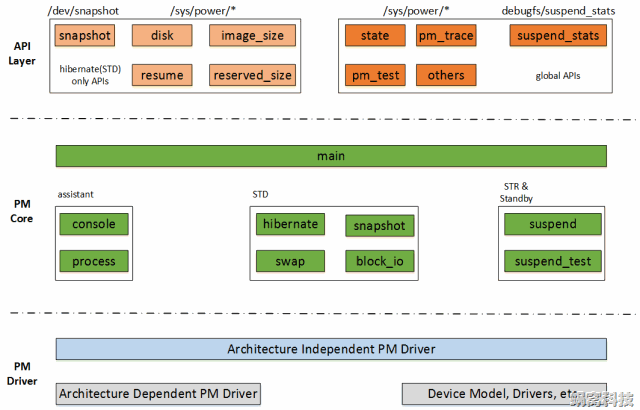

<!-- @import "[TOC]" {cmd="toc" depthFrom=1 depthTo=6 orderedList=false} -->

<!-- code_chunk_output -->

- [1. 概述](#1-概述)
- [2. 相关的术语梳理](#2-相关的术语梳理)
  - [2.1. Hibernate 和 Sleep](#21-hibernate-和-sleep)
  - [2.2. Suspend](#22-suspend)
  - [2.3. Standby](#23-standby)
  - [2.4. Wakeup](#24-wakeup)
  - [2.5. 对应关系](#25-对应关系)
- [3. 软件架构](#3-软件架构)
- [4. 用户空间接口](#4-用户空间接口)
  - [4.1. /sys/power/state](#41-syspowerstate)
  - [4.2. /sys/power/pm_async](#42-syspowerpm_async)
  - [4.3. /sys/power/pm_trace](#43-syspowerpm_trace)
  - [4.4. /sys/power/pm_test](#44-syspowerpm_test)
  - [4.5. /sys/power/wakeup_count](#45-syspowerwakeup_count)
  - [4.6. /sys/power/disk](#46-syspowerdisk)
  - [4.7. /sys/power/image_size](#47-syspowerimage_size)
  - [4.8. /sys/power/reserverd_size](#48-syspowerreserverd_size)
  - [4.9. /sys/power/resume](#49-syspowerresume)
  - [4.10. debugfs/suspend_status](#410-debugfssuspend_status)
  - [4.11. /dev/snapshot](#411-devsnapshot)
- [5. Linux 支持](#5-linux-支持)

<!-- /code_chunk_output -->

# 1. 概述

Hibernate 和 Sleep 两个功能是 Linux Generic PM 的核心功能, 它们的目的是类似的: 暂停使用——>保存上下文——>关闭系统以节电········>恢复系统——>恢复上下文——>继续使用.

本文以内核向用户空间提供的接口为突破口, 从整体上对这两个功能进行介绍, 并会在后续的文章中, 分析它们的实现逻辑和执行动作.

虽然这些机制在 Linux 系统中存在很久了(类似的概念也存在于 Windows 系统中), 但它们被使用的频率并不是很高, 特别是在 **PC** 上, 大多数人在大多数时候选择直接关闭系统. 阴错阳差的是, 在很多**嵌入式设备**中, 设计者会利用 Sleep 机制实现**热关机**功能, 以此**减少开机的时间**.

# 2. 相关的术语梳理

## 2.1. Hibernate 和 Sleep

Hibernate(冬眠) 和 Sleep(睡眠)

是Linux电源管理在用户角度的抽象, 是用户可以看到的实实在在的东西. 它们的共同点, 是保存系统运行的上下文后挂起(suspend)系统, 并在系统恢复后接着运行, 就像什么事情都没有发生一样. 它们的不同点, 是上下文保存的位置、系统恢复的触发方式以及具体的实现机制.

## 2.2. Suspend

有两个层次的含义. 一是 Hibernate 和 Sleep 功能在底层实现上的统称, 都是指挂起(Suspend)系统, 根据上下文的保存位置, 可以分为 Suspend to Disk(STD, 即 Hibernate, 上下文保存在硬盘/磁盘中)和 Suspend to RAM(STR, 为 Sleep 的一种, 上下文保存在 RAM 中); 二是 Sleep 功能在代码级的实现, 表现为 "`kernel/power/suspend.c`" 文件.

## 2.3. Standby

是 Sleep 功能的一个特例, 可以翻译为"打盹".

正常的 Sleep(STR), 会在处理完上下文后, 由 arch-dependent 代码将 CPU 置为低功耗状态(通常为Sleep). 而现实中, 根据对功耗和睡眠唤醒时间的不同需求, CPU 可能会提供多种低功耗状态, 如除 Sleep 之外, 会提供 Standby 状态, 该状态下, CPU 处于浅睡眠模式, 有任何的风吹草动, 就会立即醒来.

## 2.4. Wakeup

这是我们第一次正式的提出 Wakeup 的概念. 我们多次提到恢复系统, 其实在内核中称为 Wakeup. 表面上, wakeup 很简单, 无论是冬眠、睡眠还是打盹, 总得有一个刺激让我们回到正常状态. 但复杂的就是, 什么样的刺激才能让我们醒来? 

动物界, 温度回升可能是唯一可以让动物从冬眠状态醒来的刺激. 而踢一脚、闹钟响等刺激, 则可以让我们从睡眠状态唤醒. 对于打盹来说, 则任何的风吹草动, 都可以唤醒.

而在计算机界, 冬眠(Hibernate)时, 会关闭整个系统的供电, 因此想醒来, 唯有 Power 按钮可用. 而睡眠时, 为了缩短 Wakeup 时间, 并不会关闭所有的供电, 另外, 为了较好的用户体验, 通常会保留某些重要设备的供电(如键盘), 那样这些设备就可以唤醒系统.

这些刻意保留下来的、可以唤醒系统的设备, 统称为唤醒源(Wakeup source). 而 Wakeup source 的选择, 则是PM设计工作(特别是 Sleep、Standby 等功能)的重点.

## 2.5. 对应关系

用户角度(Hibernate 和 Sleep)对应的是底层实现上(STD、STR 和 Standby).

# 3. 软件架构

内核中该部分的软件架构大概可以分为三个层次, 如下图:



1. API Layer, 描述用户空间 API 的一个抽象层.

这里的 API 有两类, 一类涉及 Hibernate 和 Sleep 两个功能(global APIs), 包括实际功能、测试用功能、Debug 用功能等, 通过 sysfs 和 debugfs 两种形式提供; 另一类是 Hibernate 特有的(STD APIs), 通过 sysfs 和字符设备两种形式提供.

2. PM Core, 电源管理的核心逻辑层, 位于 `kernel/power/` 目录下, 包括主功能(main)、STD、STR&Standby 以及辅助功能(assistant)等多个子模块.

主功能, 主要负责实现 global APIs 相关的逻辑, 为用户空间提供相应的 API;

STD, 包括 hibernate、snapshot、swap、block_io 等子模块, 负责实现 STD 功能和硬件无关的逻辑;

STR&Stanby, 包括 suspend 和 suspend_test 两个子模块, 负责实现 STR、Standby 等功能和硬件无关的逻辑.

3. PM Driver, 电源管理驱动层, 涉及体系结构无关驱动、体系结构有关驱动、设备模型以及各个设备驱动等多个软件模块.

# 4. 用户空间接口

## 4.1. /sys/power/state

state 是 sysfs 中一个文件, 为 Generic PM 的核心接口, 在 "`kernel/power/main.c`" 中实现, 用于将系统置于指定的 Power State(如 freeze, standby, mem 和 disk 等). 不同的电源管理功能, 在底层的实现, 就是在不同 Power State 之间切换.

```
# cat /sys/power/state
freeze mem disk
```

* freeze: **冻结 I/O 设备**, 将它们置于低功耗状态, 使**处理器**进入**空闲**状态, 唤醒最快, 耗电比其它 standby, mem, disk 方式高, 还是在 S0

* standby: 除了**冻结 I/O 设备**外, 还会**暂停系统**, 唤醒较快, 耗电比其它 mem, disk 方式高, 对应 S1

* mem: 所有的设备进入低功耗状态, 仅保留RAM自刷新. 将**所有的设备和系统状态数据**保存到**内存**, 并关闭外设, 进入等待模式, 唤醒较慢, 耗电比 disk 方式高. 对应 S3

* disk: 将**运行状态数据**存到**硬盘**, 然后关机, 唤醒最慢, resume 的时候读回到 RAM, 然后在进行系统和设备状态恢复工作. 对应 S4

写入特定的 Power State 字符串, 将会把系统置为该模式.

## 4.2. /sys/power/pm_async

`/sys/power/pm_async`, 使用 async(默认)/sync 的方式执行 suspend/resume 流程

`echo 0 > /sys/power/pm_async`, 使用 **同步** 方式, 跟 async 异步方式相比, 同步是需要等到上一个 device 的 suspend/resume 流程结束返回后, 才能去执行下一个 device 的 suspend/resume 操作

```
# LSPCI -S 0000:01:00.0
0000:01:00.0 Network controller: Realtek Semiconductor Co., Ltd. RTL8821CE 802.11ac PCIe Wireless Network Adapter
# CAT /SYS/BUS/PCI/DEVICES/0000\:01\:00.0/POWER/ASYNC
enabled
```

```
// 异步
[31801.620916] rtc_cmos 00:05: PM: calling pnp_bus_suspend+0x0/0x20 @ 1053, parent: pnp0
[31801.620923] scsi host0: PM: calling scsi_bus_suspend+0x0/0xc0 @ 1028, parent: ata1
[31801.620939] scsi host0: PM: scsi_bus_suspend+0x0/0xc0 returned 0 after 0 usecs
[31801.620998]  ata1: PM: calling ata_port_pm_suspend+0x0/0x50 @ 1054, parent: 0000:00:01.1
[31801.621154]  ata1: PM: ata_port_pm_suspend+0x0/0x50 returned 0 after 146 usecs
[31801.621163] rtc_cmos 00:05: PM: pnp_bus_suspend+0x0/0x20 returned 0 after 239 usecs

// echo 0 > /sys/power/pm_async, 同步
[32504.407072] scsi host0: PM: calling scsi_bus_suspend+0x0/0xc0 @ 1067, parent: ata1
[32504.407078] scsi host0: PM: scsi_bus_suspend+0x0/0xc0 returned 0 after 0 usecs
[32504.407364]  ata1: PM: calling ata_port_pm_suspend+0x0/0x50 @ 1067, parent: 0000:00:01.1
[32504.407473]  ata1: PM: ata_port_pm_suspend+0x0/0x50 returned 0 after 103 usecs
[32504.407647] rtc_cmos 00:05: PM: calling pnp_bus_suspend+0x0/0x20 @ 1067, parent: pnp0
[32504.407869] rtc_cmos 00:05: PM: pnp_bus_suspend+0x0/0x20 returned 0 after 215 usecs
```

```cpp
// kernel/power/main.c
/* If set, devices may be suspended and resumed asynchronously. */
int pm_async_enabled = 1;
// /sys/power/pm_async 节点
static ssize_t pm_async_store(struct kobject *kobj, struct kobj_attribute *attr,
                  const char *buf, size_t n)
{
    unsigned long val;

    if (kstrtoul(buf, 10, &val))
        return -EINVAL;

    if (val > 1)
        return -EINVAL;

    pm_async_enabled = val;
    return n;
}
power_attr(pm_async);
```

```cpp
// drivers/base/power/power.h
// 基本要求
#IFDEF CONFIG_PM_SLEEP
extern int pm_async_enabled;

// drivers/base/power/main.c
static bool is_async(struct device *dev)
{
    // 三个要求
    // 1. 设备支持 async
    // 2. 系统 async 属性必须设置
    // 3. pm_trace 没有 enable, 见下面
    return dev->power.async_suspend && pm_async_enabled
        && !pm_trace_is_enabled();
}
```

## 4.3. /sys/power/pm_trace

"PM trace" 机制, 在重新启动后会在 RTC 内存中保存最后一次 suspend 或 resume 的 event point.  它有助于更有效地调试由于系统 suspend 或 resume(更常见)期间发生的设备驱动进程故障而导致的硬锁定或重新启动.

如果是 "1", 则每个 suspend/resume event point 将依次存储在 RTC 内存中(覆盖实际的 RTC 信息), 因此如果在存储后立即发生系统崩溃,它将在系统崩溃中幸存下来,并且可以在以后用于识别导致崩溃发生的驱动进程.

原理: 覆写了 rtc 寄存器(年月日时分秒), 所以 `rtc suspend&resume` 不能再使用

要使用此调试功能, 必须打开 `CONFIG_PM_TRACE`和 `CONFIG_PM_TRACE_RTC` 宏定义(kernel/power/Kconfig)

```
echo 1 > /sys/power/pm_trace
```

这样 `TRACE_DEVICE();`, `TRACE_SUSPEND()` 和 `TRACE_RESUME();` 便会生效.

先 suspend, 然后 reboot, 运行

```
dmesg -s 1000000 Avail grep 'hash matches'
```

注意: 此选项将导致机器的 **rtc** 在恢复后设置为无效时间.

```
# DMESG | GREP -I MAGIC -A 10
[   13.298421] PM:   Magic number: 0:636:969
[   13.299536] PM:   hash matches drivers/base/power/main.c:615
[   13.300853] hidraw hidraw0: hash matches
[   13.301786] pci 0000:00:15.0: hash matches
[   13.303180] printk: console [netcon0] enabled
[   13.304250] netconsole: network logging started
[   13.306034] ALSA device list:
[   13.306878]   No soundcards found.
[   13.379379] EXT4-fs (sda2): recovery complete
[   13.381143] EXT4-fs (sda2): mounted filesystem with ordered data mode. Opts: (null). Quota mode: none.
[   13.382491] VFS: Mounted root (ext4 filesystem) on device 8:2.
```

```cpp
// kernel/power/main.c
#IFDEF CONFIG_PM_TRACE
// 默认为 0
int pm_trace_enabled;
static ssize_t
pm_trace_store(struct kobject *kobj, struct kobj_attribute *attr,
           const char *buf, size_t n)
{
    int val;

    if (sscanf(buf, "%d", &val) == 1) {
        pm_trace_enabled = !!val;
        if (pm_trace_enabled) {
            pr_warn("PM: Enabling pm_trace changes system date and time during resume.\n"
                "PM: Correct system time has to be restored manually after resume.\n");
        }
        return n;
    }
    return -EINVAL;
}

power_attr(pm_trace);
#ENDIF /* CONFIG_PM_TRACE */

// include/linux/pm-trace.h
extern int pm_trace_enabled;
// async 使用
static inline int pm_trace_is_enabled(void)
{
       return pm_trace_enabled;
}
```

## 4.4. /sys/power/pm_test

PM test 用于对电源管理功能的测试, 由 `CONFIG_PM_DEBUG` 和 `CONFIG_PM_SLEEP_DEBUG` 宏定义(`kernel/power/Kconfig`)控制是否编译进内核. 其核心思想是:

* 将电源管理过程按照先后顺序, 划分为多个步骤, 如 core、platform、devices 等. 这些步骤称作 PM Test Level.

* 系统通过一个全局变量(`pm_test_level`), 保存系统当前的PM Test Level. 该变量的值可以通过 "`/sys/power/pm_test`" 文件获取及修改.

* 在每一个电源管理步骤结束后, 插入 PM test 代码, 该代码以当前执行步骤为参数, 会判断当前的 PM Test Level 和执行步骤是否一致, 如果一致, 则说明该步骤执行成功. 出于 Test 考量, 执行成功后, 系统会打印 Test 信息, 并在等待一段时间后, 退出 PM 过程.

* 开发人员可以通过修改全局的 Test Level, 有目的测试所关心的步骤是否执行成功.

上面已经讲了, 该文件用于获取及修改 PM Test Level, 具体的 Level 信息在 "`kernel/power/main.c`" 中定义, 格式如下(具体的意义, 比较简单, 对着相关的代码看, 非常清晰, 这里就不啰嗦了):

```cpp
// kernel/power/main.c
static const char * const pm_tests[__TEST_AFTER_LAST] = {
    [TEST_NONE] = "none",
    [TEST_CORE] = "core",
    [TEST_CPUS] = "processors",
    [TEST_PLATFORM] = "platform",
    [TEST_DEVICES] = "devices",
    [TEST_FREEZER] = "freezer",
};
```

查看支持的

```
# cat /sys/power/pm_test
[none] core processors platform devices freezer
```

```
echo devices > /sys/power/pm_test
dmesg > dmesg_b; echo mem > /sys/power/state; dmesg > dmesg_af
```

对应的代码是 `pm_test_level`

```cpp
#IFDEF CONFIG_PM_SLEEP_DEBUG
int pm_test_level = TEST_NONE;
```

然后在 `suspend_enter`(`kernel/power/suspend.c`) 会根据相应条件判断,比如

```cpp
static int suspend_enter(suspend_state_t state, bool *wakeup)
{
    platform_suspend_prepare(state);

    dpm_suspend_late(PMSG_SUSPEND);

    platform_suspend_prepare_late(state);

    dpm_suspend_noirq(PMSG_SUSPEND);

    platform_suspend_prepare_noirq(state);

    // 上面的内容都是针对 pm_test 是 platform 的,下面的就不包含了,所以直接跳转到 Platform_wake 进行唤醒,结束 platform 的 pm test
    if (suspend_test(TEST_PLATFORM))
        goto Platform_wake;

 Platform_wake:
    platform_resume_noirq(state);
    dpm_resume_noirq(PMSG_RESUME);

 Platform_early_resume:
    platform_resume_early(state);

 Devices_early_resume:
    dpm_resume_early(PMSG_RESUME);

 Platform_finish:
    platform_resume_finish(state);
    return error;
}

static int suspend_test(int level)
{
    // 如果不支持 pm debug 的话,该函数直接返回 0
#IFDEF CONFIG_PM_DEBUG
    if (pm_test_level == level) {
        pr_info("suspend debug: Waiting for %d second(s).\n",
                pm_test_delay);
        mdelay(pm_test_delay * 1000);
        return 1;
    }
#ENDIF /* !CONFIG_PM_DEBUG */
    return 0;
}
```

## 4.5. /sys/power/wakeup_count

该接口只和 Sleep 功能有关, 因此由 "`CONFIG_PM_SLEEP`" 宏定义(`kernel/power/Kconfig`)控制. 它的存在, 是为了解决 Sleep 和 Wakeup 之间的同步问题.

我们知道, 系统睡眠后, 可以通过保留的 Wakeup source 唤醒系统. 而在当今的 CPU 体系中, 唤醒系统就是唤醒 CPU, 而唤醒 CPU 的唯一途径, 就是 Wakeup source 产生中断(内核称作 Wakeup event). 而内核要保证在多种状态下, Sleep/Wakeup 的行为都能正常, 如下:

* 系统处于 sleep 状态时, 产生了 Wakeup event. 此时应该直接唤醒系统. 这一点没有问题.

* 系统在进入 sleep 的过程中, 产生了 Wakeup event. 此时应该放弃进入 sleep.

这一点就不那么容易做到了. 例如, 当 Wakeup event 发生在 "`/sys/power/state`" 被写之后、内核执行 freeze 操作之前. 此时用户空间程序依旧可以处理 Wakeup event, 或者只是部分处理. 而内核却以为该 Event 已经被处理, 因此并不会放弃此次 sleep 动作.

这就会造成, Wakeup event发生后, 用户空间程序已经后悔了, 不想睡了, 但最终还是睡下去了. 直到下一个 Wakeup event 到来.

为了解决上面的问题, 内核提供 `wakeup_count` 机制, 配合 "`/sys/power/state`", 以实现 Sleep 过程中的同步. 该机制的操作行为如下:

* `wakeup_count` 是内核用来保存当前 wakeup event 发生的计数.

* 用户空间程序在写入 state 切换状态之前, 应先读取 `wakeup_count` 并把获得的 count 写回给 `wakeup_count`.

* 内核会比对写回的 count 和当前的 count 是否一致, 如果不一致, 说明在读取/写回操作之间, 产生了新的的 wakeup event, 内核就会返回错误.

* 用户空间程序检测到写入错误之后, 不能继续后的动作, 需要处理响应的event并伺机再次读取/写回 `wakeup_count`.

* 如果内核比对一致, 会记录 write wakeup_count 成功时的 event 快照, 后面继续 suspend 动作时, 会检查是否和快照相符, 如果不符, 会终止 suspend.

* 用户空间程序检测到写入正确后, 可以继续对 state 的写入, 以便发起一次状态切换. 而此时是安全的.

在后续的文章中, 详细描述该机制在内核中的实现逻辑.

## 4.6. /sys/power/disk

该接口是 STD 特有的. 用于设置或获取 STD 的类型. 当前内核支持的 STD 类型包括:

```cpp
// kernel/power/hibernate.c
static const char * const hibernation_modes[] = {
    [HIBERNATION_PLATFORM]	= "platform",
    [HIBERNATION_SHUTDOWN]	= "shutdown",
    [HIBERNATION_REBOOT]	= "reboot",
#ifdef CONFIG_SUSPEND
    [HIBERNATION_SUSPEND]	= "suspend",
#endif
    [HIBERNATION_TEST_RESUME]	= "test_resume",
};
```

* platform, 表示使用平台特有的机制, 处理 STD 操作, 如使用 `hibernation_ops` 等.

* shutdown, 通过关闭系统实现 STD, 内核会调用 `kernel_power_off` 接口.

* reboot, 通过重启系统实现 STD, 内核会调用 `kernel_restart` 接口.

【注: 以上两个 `kernel_xxx` 接口的实现, 可参考 "常规PM的Reboot". 】

* suspend, 利用 STR 功能, 实现 STD. 该类型下, STD 和 STR 底层的处理逻辑类似.

## 4.7. /sys/power/image_size

该接口也是 STD 特有的. 我们知道, STD 的原理是将当前的运行上下文保存在系统的 disk(如 NAND Flash, 如硬盘), 然后选择合适的方式关闭或重启系统. 保存上下文是需要存储空间的, 不光是 disk 中的存储空间, 也包括位于内存的用于交换或缓冲的空间.

而该接口, 就是设置或者获取当前内存中需要分配多少空间, 用于缓冲需要写入到 disk 的数据. 单位为 byte.

## 4.8. /sys/power/reserverd_size

`reserverd_size` 用于指示预留多少内存空间, 用于在 `->freeze()` 和  `->freeze_noirq()` 过程中保存设备驱动分配的空间. 以免在 STD 的过程中丢失.

## 4.9. /sys/power/resume

该接口也是 STD 特有的. 正常情况下, 在重新开机后, 内核会在后期的初始化过程中, 读取保存在 disk 中的 image, 并恢复系统. 而该接口, 提供了一种在用户空间手动的读取 image 并恢复系统的方法.

通常情况下, 该操作出现在系统正常运行的过程中, 需要加载并执行另外的 image.

## 4.10. debugfs/suspend_status

该接口是以 debugfs 的形式, 向用户空间提供 suspend 过程的统计信息, 包括: 成功的次数、失败的次数、freeze 失败的次数等等.

## 4.11. /dev/snapshot

该接口也是 STD 特有的. 它通过字符设备的形式, 向用户空间提供 software 的 STD 操作. 我们会在后续的文章中详细描述.

# 5. Linux 支持

<table style="width:100%">
  <tr>
    <th>
    Linux 中的 state
    </th>
    <th>
    Label
    </th>
    <th>
    state
    </th>
    <th>
    ACPI state
    </th>
    <th>
    description
    </th>
    <th>
    requirements
    </th>
  </tr>
  <tr>
    <td>
    PM_SUSPEND_ON, 0
    </td>
    <td>
    None
    </td>
    <td>
    None
    </td>
    <td>
    S0
    </td>
    <td>
    工作态, 一切正常
    </td>
    <td>
    None
    </td>
  </tr>
  <tr>
    <td>
    PM_SUSPEND_TO_IDLE(PM_SUSPEND_MIN), 1
    </td>
    <td>
    freeze
    </td>
    <td>
    suspend-to-idle
    </td>
    <td>
    None, 相当于S0
    </td>
    <td>
    冻结进程+挂起设备+cpu idle, 目前实现 cpu idle 时候也会 suspend timekeeping
    </td>
    <td>
    软件方案, 只要CONFIG_SUSPEND被设置, 不需要平台支持.
    </td>
  </tr>
  <tr>
    <td>
    PM_SUSPEND_STANDBY, 2
    </td>
    <td>
    standby
    </td>
    <td>
    standby/power-on suspend
    </td>
    <td>
    S1
    </td>
    <td>
    冻结进程+挂起timekeeping+挂起设备+关闭non-boot CPUs+挂起所有low-level功能
    </td>
    <td>
    CONFIG_SUSPEND, 并且平台支持. ACPI对应S1
    </td>
  </tr>
  <tr>
    <td>
    PM_SUSPEND_MEM, 3
    </td>
    <td>
    mem
    </td>
    <td>
    suspend-to-ram/
    </td>
    <td>
    S3
    </td>
    <td>
    仅保留RAM自刷新, 和standby类似, 冻结进程+挂起timekeeping+挂起设备+关闭non-boot CPUs+挂起所有low-level功能
    </td>
    <td>
    CONFIG_SUSPEND, 并且平台支持, ACPI对应S3
    </td>
  </tr>
  <tr>
    <td>
    PM_SUSPEND_DISK, None
    </td>
    <td>
    disk
    </td>
    <td>
    suspend-to-disk
    </td>
    <td>
    S4
    </td>
    <td>
    也被称为Hibernate. 内核会停止所有系统活动, 创建内存快照写入磁盘, 最后系统进入目标低功耗状态, 除了可唤醒设备, 几乎其他硬件全部断电(包括内存).<br><br>
    系统可能进入ACPI S4或者直接断电. S4的话还可以使用其他唤醒方式(比如, 键盘按键或打开电脑盖).<br><br>
    在resume的时候读回到RAM, 然后再进行系统和设备状态恢复工作
    </td>
    <td>
    这个宏定义已经移除, 但可通过echo "disk" > /sys/power/state使用.<br><br>
    即使平台不支持也可以使用, 但是需要有恢复系统的相关底层代码.
    </td>
  </tr>
  <tr>
    <td>
    PM_SUSPEND_MAX, 4
    </td>
    <td>
    disk
    </td>
    <td>
    suspend-to-disk
    </td>
    <td>
    S4
    </td>
    <td>
    同上
    </td>
    <td>
    CONFIG_HIBERNATION, 可以没有平台支持, 只要有系统恢复的底层代码.<br><br>
    尽管acpi_suspend_states中对应S5,但是其实并没有使用,而是直接进入hibernate(),对应S4
    </td>
  </tr>
</table>

有些系统的平台不支持任何特殊的睡眠状态, 因此挂起至空闲 (`PM_SUSPEND_TO_IDLE`) 是唯一可用的系统睡眠状态.

ACPI S2 目前在 Linux 没有使用.

