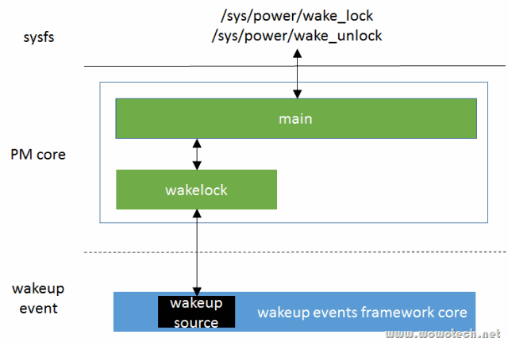

# 概述

wakelocks 是一个有故事的功能.

wakelocks 最初出现在 Android 为 linux kernel 打的一个补丁集上, 该补丁集**实现**了一个名称为 "**wakelocks**" 的**系统调用**, 该系统调用允许调用者**阻止**系统进入**低功耗模式**(如 idle、suspend 等). 同时, 该补丁集更改了 Linux kernel 原生的电源管理执行过程(`kernel/power/main.c` 中的 `state_show` 和 `state_store`), 转而执行自定义的 state_show、state_store.

这种做法是相当不规范的, 它是典型的只求实现功能, 不择手段. 就像国内很多的 Linux 开发团队, 要实现某个功能, 都不去弄清楚 kernel 现有的机制、框架, 牛逼哄哄的猛干一番. 最后功能是实现了, 可都不知道重复造了多少轮子, 浪费了多少资源. 到此打住, Android 的开发者不会这么草率, 他们推出 wakelocks 机制一定有一些苦衷, 我们就不评论了.

但是, 虽然有苦衷, kernel 的开发者可是有原则的, 死活不让这种机制合并到 kernel 分支(换谁也不让啊), 直到 kernel 自身的 wakeup events framework 成熟后, 这种僵局才被打破. 因为 Android 开发者想到了一个坏点子: 不让合并就不让合并呗, 我用你的机制(**wakeup source**), 再实现一个就是了. 至此, 全新的 wakelocks 出现了.

所以 wakelocks 有两个, 早期 Android 版本的 wakelocks 几乎已经销声匿迹了, 不仔细找还真找不到它的 source code(这里有一个链接, 但愿读者看到时还有效, `drivers/android/power.c`). 本文不打算翻那本旧黄历, 所以就 focus 在新的 wakelocks 上(`kernel/power/wakelock.c`, 较新的kernel 都支持).

# Android wakelocks

提一下 Android wakelocks 的功能, 这样才能知道 kernel wakelocks 要做什么. 总的来说, Android wakelocks 提供的功能包括:

1. 一个 sysfs 文件: `/sys/power/wake_lock`, 用户程序向文件写入一个字符串, 即可**创建一个 wakelock**, 该字符串就是 wakelock 的名字. 该 wakelock 可以**阻止系统进入低功耗模式**.

2. 一个 sysfs 文件: `/sys/power/wake_unlock`, 用户程序向文件写入相同的字符串, 即可**注销一个wakelock**.

3. 当系统中所有的 wakelock 都**注销**后, 系统可以**自动进入低功耗状态**.

4. 向内核其它 driver 也提供了 wakelock 的**创建和注销接口**, 允许 driver 创建 wakelock 以阻止睡眠、注销 wakelock 以允许睡眠.

有关Android wakelocks更为详细的描述, 可以参考下面的一个链接:

http://elinux.org/Android_Power_Management

# Kernel wakelocks

## Kernel wakelocks 的功能

对比 Android wakelocks 要实现的功能, Linux kernel 的方案是:

1. 允许 driver 创建 wakelock 以**阻止睡眠**、注销 wakelock 以**允许睡眠**: 已经由 "Wakeup events framework" 所描述的 **wakeup source** 取代.

2. 当系统中所有的 wakelock 都注销后, 系统可以**自动进入低功耗状态**: 由 **autosleep** 实现(下一篇文章会分析).

3. `wake_lock` 和 `wake_unlock` 功能: 由本文所描述的 kernel wakelocks 实现, 其本质就是将 **wakeup source** 开发到**用户空间访问**.

## Kernel wakelocks 在电源管理中的位置

相比 Android wakelocks, Kernel wakelocks 的实现非常简单(简单的才是最好的), 就是在 PM core 中增加一个 wakelock 模块(`kernel/power/wakelock.c`), 该模块依赖 wakeup events framework 提供的 wakeup source 机制, 实现**用户空间的 wakeup source**(就是 wakelocks), 并通过 PM core main 模块, 向用户空间提供两个同名的 sysfs 文件, `wake_lock` 和 `wake_unlock`.



## /sys/power/wake_lock & /sys/power/wake_unlock

从字面意思上, 新版的 `wake_lock` 和 `wake_unlock` 和旧版的一样, 都是用于创建和注销 wakelock. 从应用开发者的角度, 确实可以这样理解. 但从底层实现的角度, 却完全不是一回事.

**Android** 的 wakelock, 真是一个 lock, 用户程序创建一个 wakelock, 就是在系统 suspend 的路径上**加了一把锁**, 注销就是解开这把锁. 直到 suspend 路径上所有的锁都解开时, 系统才可以 suspend.

而 **Kernel** 的 wakelock, 是基于 **wakeup source** 实现的, 因此创建 wakelock 的本质是在**指定的 wakeup source** 上 activate 一个 wakeup event, 注销 wakelock 的本质是 deactivate wakeup event. 因此, /sys/power/wake_lock 和 /sys/power/wake_unlock两个sysfs文件的的功能就是:

* 写 `wake_lock`(以 wakelock name 和 timeout 时间<可选>为参数), 相当于以 wakeup source 为参数调用 `__pm_stay_awake`(或者 `__pm_wakeup_event`), 即 activate wakeup event;

* 写 `wake_unlock`(以 wakelock name 为参数), 相当于以 wakeup source为参数, 调用 `__pm_relax`;

* 读 `wake_lock`, 获取系统中所有的处于 active 状态的 wakelock 列表(也即 **wakeup source 列表**)

* 读 `wake_unlock`, 返回系统中所有的处于非 active 状态的 wakelock 信息(也即 wakeup source 列表).

注1: 上面有关wakeup source的操作接口, 可参考"Linux电源管理(7)_Wakeup events framework".

这两个 sysfs 文件在 kernel/power/main.c 中实现, 如下:

```cpp
// kernel/power/main.c
#ifdef CONFIG_PM_SLEEP
#ifdef CONFIG_PM_WAKELOCKS
static ssize_t wake_lock_show(struct kobject *kobj,
                  struct kobj_attribute *attr,
                  char *buf)
{
    return pm_show_wakelocks(buf, true);
}

static ssize_t wake_lock_store(struct kobject *kobj,
                   struct kobj_attribute *attr,
                   const char *buf, size_t n)
{
    int error = pm_wake_lock(buf);
    return error ? error : n;
}

power_attr(wake_lock);

static ssize_t wake_unlock_show(struct kobject *kobj,
                struct kobj_attribute *attr,
                char *buf)
{
    return pm_show_wakelocks(buf, false);
}

static ssize_t wake_unlock_store(struct kobject *kobj,
                 struct kobj_attribute *attr,
                 const char *buf, size_t n)
{
    int error = pm_wake_unlock(buf);
    return error ? error : n;
}

power_attr(wake_unlock);

#endif /* CONFIG_PM_WAKELOCKS */
#endif /* CONFIG_PM_SLEEP */
```

1. wakelocks 功能不是 linux kernel 的必选功能, 可以通过 `CONFIG_PM_WAKELOCKS` 开关.

2. `wake_lock` 的写接口, 直接调用 `pm_wake_lock`; `wake_unlock` 的写接口, 直接调用 `pm_wake_unlock`; 它们的读接口, 直接调用 `pm_show_wakelocks` 接口(参数不同). 这三个接口均在 `kernel/power/wakelock.c` 中实现.

# pm_wake_lock

`pm_wake_lock` 位于 `kernel/power/wakelock.c` 中, 用于上报一个wakeup event(从另一个角度, 就是阻止系统suspend), 代码如下:

```cpp
// kernel/power/wakelock.c
int pm_wake_lock(const char *buf)
{
    const char *str = buf;
    struct wakelock *wl;
    u64 timeout_ns = 0;
    size_t len;
    int ret = 0;
    // 第二
    if (!capable(CAP_BLOCK_SUSPEND))
        return -EPERM;

    // 第三
    while (*str && !isspace(*str))
        str++;

    len = str - buf;
    if (!len)
        return -EINVAL;
    // 第三
    if (*str && *str != '\n') {
        /* Find out if there's a valid timeout string appended. */
        ret = kstrtou64(skip_spaces(str), 10, &timeout_ns);
        if (ret)
            return -EINVAL;
    }

    mutex_lock(&wakelocks_lock);
    // 第四
    wl = wakelock_lookup_add(buf, len, true);
    if (IS_ERR(wl)) {
        ret = PTR_ERR(wl);
        goto out;
    }
    // 第五
    if (timeout_ns) {
        u64 timeout_ms = timeout_ns + NSEC_PER_MSEC - 1;

        do_div(timeout_ms, NSEC_PER_MSEC);
        __pm_wakeup_event(wl->ws, timeout_ms);
    } else {
        __pm_stay_awake(wl->ws);
    }

    wakelocks_lru_most_recent(wl);

 out:
    mutex_unlock(&wakelocks_lock);
    return ret;
}
```

第一. 输入参数为一个字符串, 如 "`wake_lock_test 1000`", 该字符串指定上报 wakeup event 的 wakelock name, 可以在 name 后用空格隔开, 添加**一个时间值**(单位为 **ns**), 表示该 event 的 timeout值.

第二. 调用 capable, 检查当前进程是否具备阻止系统 suspend 的权限.

注2: capable 是 Linux security 子系统提供的一个接口, 用于权限判断. 我们说过, power 是系统的核心资源, 理应由OS全权管理, 但 wakelock 违反了这一原则, 将阻止系统睡眠的权利给了用户空间. 这样一来, 用户空间程序将可以随心所欲的占用 power 资源, 特别是用户态的程序员, 天生对资源占用不敏感(这是对的), 就导致该接口有被滥用的风险. 不过还好, 通过系统的权限管理机制, 可以改善这种状态(其实不是改善, 而是矛盾转移, 很有可能把最终的裁决权交给用户, 太糟糕了！).

第三. 解析字符串, 将 timeout 值(有的话)保存在 `timeout_ns` 中, 解析 name 长度(len), 并将 name 保存在原来的buf中.

第四. 调用 `wakelock_lookup_add` 接口, 查找是否有**相同 name 的 wakelock**. 如果有, 直接返回 wakelock 的指针; 如果没有, 分配一个 wakelock, 同时调用 wakeup events framework 提供的接口, **创建**该 wakelock 对应的 **wakeup source** 结构. wakeup source 的名字就是 wakelock 的名字.

第五. 如果指定 timeout 值, 以 wakelock 的 wakeup source 指针为参数, 调用 `__pm_wakeup_event` 接口, 上报一个具有时限的 wakeup events; 否则, 调用 `__pm_stay_awake`, 上报一个没有时限的 wakeup event. 有关这两个接口的详细说明, 可参考文章 "Wakeup events framework".

`wakelock_lookup_add` 是内部接口, 代码如下

```cpp
// kernel/power/wakelock.c
static struct wakelock *wakelock_lookup_add(const char *name, size_t len,
                        bool add_if_not_found)
{
    struct rb_node **node = &wakelocks_tree.rb_node;
    struct rb_node *parent = *node;
    struct wakelock *wl;
    // 第一
    while (*node) {
        int diff;

        parent = *node;
        wl = rb_entry(*node, struct wakelock, node);
        diff = strncmp(name, wl->name, len);
        if (diff == 0) {
            if (wl->name[len])
                diff = -1;
            else
                return wl;
        }
        if (diff < 0)
            node = &(*node)->rb_left;
        else
            node = &(*node)->rb_right;
    }
    if (!add_if_not_found)
        return ERR_PTR(-EINVAL);

    if (wakelocks_limit_exceeded())
        return ERR_PTR(-ENOSPC);

    // 第三
    wl = kzalloc(sizeof(*wl), GFP_KERNEL);
    if (!wl)
        return ERR_PTR(-ENOMEM);

    wl->name = kstrndup(name, len, GFP_KERNEL);
    if (!wl->name) {
        kfree(wl);
        return ERR_PTR(-ENOMEM);
    }

    wl->ws = wakeup_source_register(NULL, wl->name);
    if (!wl->ws) {
        kfree(wl->name);
        kfree(wl);
        return ERR_PTR(-ENOMEM);
    }
    wl->ws->last_time = ktime_get();

    rb_link_node(&wl->node, parent, node);
    // 第四
    rb_insert_color(&wl->node, &wakelocks_tree);
    // 第五
    wakelocks_lru_add(wl);
    increment_wakelocks_number();
    return wl;
}
```

在 wakelock.c 中, 维护一个名称为 `wakelocks_tree` 的红黑树(红黑树都用上了, 可以想象 wakelocks 曾经使用多么频繁！), 所有的 wakelock 都保存在该 tree 上. 因此该接口的动作是:

第一. 查找红黑树, 如果找到 name 相同的 wakelock, **返回 wakelock 指针**.

第二. 如果没找到, 且 `add_if_not_found` 为 false, 返回错误.

第三. 如果 `add_if_not_found` 为 true, 分配一个 struct wakelock 变量, 并初始化它的名称、它的 wakeup source 的名称. 调用 `wakeup_source_add` 接口, 将 wakeup source 添加到 wakeup events framework中.

第四. 将该 wakelock 添加到红黑树.

第五. 最后调用 `wakelocks_lru_add` 接口, 将新分配的 wakeup 添加到一个名称为 `wakelocks_lru_list` 的**链表前端**(该功能和 wakelock 的垃圾回收机制有关, 后面会单独描述).

再看一下 struct wakelock 结构:

```cpp
// kernel/power/wakelock.c
struct wakelock {
    char			*name;
    struct rb_node		node;
    struct wakeup_source	*ws;
#ifdef CONFIG_PM_WAKELOCKS_GC
    struct list_head	lru;
#endif
};
```

非常简单:

* 一个 name 指针, 保存 wakelock 的名称;
* 一个 rb node 节点, 用于组成红黑树;
* 一个 wakeup source 变量;
* 如果开启了 wakelocks 垃圾回收功能, 一个用于 GC 的 list head.

## pm_wake_unlock

pm_wake_unlock 和 pm_wake_lock 类似, 如下:

```cpp
// kernel/power/wakelock.c
int pm_wake_unlock(const char *buf)
{
    struct wakelock *wl;
    size_t len;
    int ret = 0;

    if (!capable(CAP_BLOCK_SUSPEND))
        return -EPERM;

    len = strlen(buf);
    if (!len)
        return -EINVAL;

    if (buf[len-1] == '\n')
        len--;

    if (!len)
        return -EINVAL;

    mutex_lock(&wakelocks_lock);

    wl = wakelock_lookup_add(buf, len, false);
    if (IS_ERR(wl)) {
        ret = PTR_ERR(wl);
        goto out;
    }
    __pm_relax(wl->ws);

    wakelocks_lru_most_recent(wl);
    wakelocks_gc();

 out:
    mutex_unlock(&wakelocks_lock);
    return ret;
}
```

a) 输入参数为一个字符串, 如 "`wake_lock_test`", 该字符串指定一个wakelock name.

b) 调用capable, 检查当前进程是否具备阻止系统suspend的权限.

c) 解析字符串

d) 调用 `wakelock_lookup_add` 接口, 查找是否有相同 name 的 wakelock. 如果有, 直接返回 wakelock 的指针; 如果没有, 退出.

e) 调用 `__pm_relax` 接口, deactive wakelock 对应的 wakeup source.

f) 调用 `wakelocks_lru_most_recent` 接口, 将盖 wakelock 移到 `wakelocks_lru_list` 链表的前端(表示它是最近一个被访问到的, 和GC有关, 后面重点描述).

g) 调用 `wakelocks_gc`, 执行 wakelock 的垃圾回收动作.

## pm_show_wakelocks

该接口很简单, 查询红黑树, 返回处于acvtive或者deactive状态的wakelock, 如下:

```cpp
ssize_t pm_show_wakelocks(char *buf, bool show_active)
{
    struct rb_node *node;
    struct wakelock *wl;
    int len = 0;

    mutex_lock(&wakelocks_lock);

    for (node = rb_first(&wakelocks_tree); node; node = rb_next(node)) {
        wl = rb_entry(node, struct wakelock, node);
        if (wl->ws->active == show_active)
            len += sysfs_emit_at(buf, len, "%s ", wl->name);
    }

    len += sysfs_emit_at(buf, len, "\n");

    mutex_unlock(&wakelocks_lock);
    return len;
}
```

1) 遍历红黑树, 拿到 wakelock 指针, 判断其中的 wakeup source 的 active 变量, 如果和输入变量(`show_active`)相符, 将该 wakelock 的名字添加在 buf 中.

2) 调整buf的长度和结束符, 返回长度值.

## wakelocks的垃圾回收机制

由上面的逻辑可知, 一个 wakelock 的生命周期, 应只存在于 wakeup event 的 avtive 时期内, 因此如果它的 wakeup source 状态为 deactive, 应该销毁该 wakelock. 但销毁后, 如果又产生 wakeup events, 就得重新建立. 如果这种建立->销毁->建立的过程太频繁, 效率就会降低.

因此, 最好不销毁, 保留系统所有的 wakelocks(同时可以完整的保留 wakelock 信息), 但如果 wakelocks 太多(特别是不活动的), 将会占用很多内存, 也不合理.

折衷方案, 保留一些非 active 状态的 wakelock, 到一定的时机时, 再销毁, 这就是 wakelocks 的垃圾回收(GC)机制.

wakelocks GC 功能可以开关(由 `CONFIG_PM_WAKELOCKS_GC` 控制), 如果关闭, 系统会保留所有的 wakelocks, 如果打开, 它的处理逻辑也很简单:

1) 定义一个 list head, 保存所有的 wakelock 指针, 如下:

```cpp
// kernel/power/wakelock.c
static LIST_HEAD(wakelocks_lru_list);
static unsigned int wakelocks_gc_count;
```

2) 在 wakelock 结构中, 嵌入一个 list head(lru), 用于挂入 `wakelocks_lru_list`. 可参考3.4小节的描述.

3) `wakelocks_lru_list` 中的 wakelock 是按访问顺序排列的, 最近访问的, 靠近 head 位置. 这是由3种操作保证的:

* wakelock 创建时(见3.4小节), 调用 `wakelocks_lru_add` 接口, 将改 wakelock 挂到  `wakelocks_lru_list` 的 head 处(利用 list_add 接口), 表示它是最近被访问的.

* pm_wake_lock 或者 `pm_wake_unlock` 时, 调用 `wakelocks_lru_most_recent` 接口, 将该 wakelcok 移到链表的 head 处, 表示最近访问.

* 每当 `pm_wake_unlock` 时, 调用 `wakelocks_gc`, 执行wakelock的垃圾回收动作. `wakelocks_gc` 的实现如下:

```cpp
// kernel/power/wakelock.c
static void __wakelocks_gc(struct work_struct *work)
{
    struct wakelock *wl, *aux;
    ktime_t now;

    mutex_lock(&wakelocks_lock);

    now = ktime_get();
    list_for_each_entry_safe_reverse(wl, aux, &wakelocks_lru_list, lru) {
        u64 idle_time_ns;
        bool active;

        spin_lock_irq(&wl->ws->lock);
        idle_time_ns = ktime_to_ns(ktime_sub(now, wl->ws->last_time));
        active = wl->ws->active;
        spin_unlock_irq(&wl->ws->lock);

        if (idle_time_ns < ((u64)WL_GC_TIME_SEC * NSEC_PER_SEC))
            break;

        if (!active) {
            wakeup_source_unregister(wl->ws);
            rb_erase(&wl->node, &wakelocks_tree);
            list_del(&wl->lru);
            kfree(wl->name);
            kfree(wl);
            decrement_wakelocks_number();
        }
    }
    wakelocks_gc_count = 0;

    mutex_unlock(&wakelocks_lock);
}

static DECLARE_WORK(wakelock_work, __wakelocks_gc);

static void wakelocks_gc(void)
{
    if (++wakelocks_gc_count <= WL_GC_COUNT_MAX)
        return;

    schedule_work(&wakelock_work);
}
```

1. 如果当前 wakelocks 的数目小于最大值(由 `WL_GC_COUNT_MAX` 配置, 当前代码为 100), 不回收, 直接返回.

> "wakelocks_gc_count" 不是当前 wakelocks 的数量, 而是自从上次回收内存之后调用 pm_wake_unlock 的数量. 当前 wakelocks 的数量包括 active, 和 deactive(这又分为两部分, 上次回收之前 unlock 的当时没有被回收, 以及上次回收之后 unlock 的)

2. 否则, 从 `wakelocks_lru_most_recent` 的尾部(最不活跃的), 依次取出 wakelock, 判断它的 idle 时间(通过 wakeup source lst_time 和当前时间计算)是否超出预设值(由 `WL_GC_TIME_SEC` 指定, 当前为 300s, 好长), 如果超出且处于 deactive 状态, 调用 `wakeup_source_remove`, 注销 wakeup source, 同时把它从红黑树、GC list 中去掉, 并释放 memory 资源.

