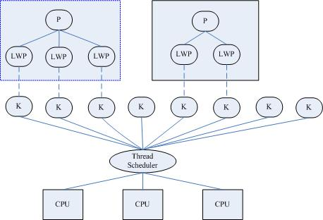

<!-- @import "[TOC]" {cmd="toc" depthFrom=1 depthTo=6 orderedList=false} -->

<!-- code_chunk_output -->

- [1 线程与进程概念](#1-线程与进程概念)
- [2 线程概念的产生](#2-线程概念的产生)
  - [2.1 传统单线程进程的缺点](#21-传统单线程进程的缺点)
  - [2.2 多线程的优缺点](#22-多线程的优缺点)
  - [2.3 线程的设计过程演变](#23-线程的设计过程演变)
  - [2.4 SMP 机器上多线程的并行性](#24-smp-机器上多线程的并行性)
  - [2.5 线程模型–核心级线程和用户级线程](#25-线程模型核心级线程和用户级线程)
  - [2.6 目前的实现策略](#26-目前的实现策略)
- [3 三种线程概念——内核线程、轻量级进程、用户线程](#3-三种线程概念内核线程-轻量级进程-用户线程)
  - [3.1 内核线程](#31-内核线程)
  - [3.2 轻量级进程](#32-轻量级进程)
  - [3.3 用户线程](#33-用户线程)
  - [3.4 加强版的用户线程——用户线程\+LWP](#34-加强版的用户线程用户线程lwp)
- [4 Linux 使用的线程库](#4-linux-使用的线程库)
- [5 小结](#5-小结)
- [6 参考](#6-参考)

<!-- /code_chunk_output -->

# 1 线程与进程概念

在现代操作系统中, 进程支持多线程.

- **进程**是**资源管理**的最小单元;

- **线程**是**程序执行**的最小单元.

即**线程**作为**调度和分配**的基本单位, **进程**作为**资源分配**的基本单位

一个**进程的组成实体**可以分为两大部分: **线程集**和**资源集**.

- 进程中的**线程是动态的对象**,代表了进程**指令的执行**,线程会被放到 CPU 上执行

- 资源, 包括**地址空间**、**打开的文件**、**用户信息**等等, 由**进程内的线程共享**.

# 2 线程概念的产生

## 2.1 传统单线程进程的缺点

1. 现实中有很多需要**并发处理的任务**, 如数据库的服务器端、网络服务器、大容量计算等.

2. 传统的 UNIX 进程是单线程的, 单线程意味着程序必须是顺序执行, 不能并发; 既在一个时刻只能运行在一个处理器上, 因此不能充分利用多处理器框架的计算机.

3. 如果采用**多进程**的方法, 则有**如下问题**:

- **fork**一个子进程的消耗是很大的, fork 是一个昂贵的系统调用, 即使使用现代的写时复制(copy-on-write)技术.
- 各个**进程**拥有自己**独立的地址空间**, **进程间的协作**需要复杂的**IPC 技术**, 如消息传递和共享内存等.

## 2.2 多线程的优缺点

**多线程**的优点和缺点实际上是对立统一的.

支持多线程的程序(进程)可以取得真正的并行(parallelism), 且由于**共享进程的代码和全局数据**, 故**线程间的通信是方便的**. 它的缺点也是由于线程共享进程的地址空间, 因此**可能会导致竞争**, 因此对某一块有**多个线程**要**访问的数据**需要一些**同步技术**.

## 2.3 线程的设计过程演变

在操作系统设计上, 从进程演化出线程, 最主要的目的就是更好的**支持 SMP**以及**减小(进程/线程)上下文切换开销**.

## 2.4 SMP 机器上多线程的并行性

**无论按照怎样的分法**, **一个进程**至少需要**一个线程**作为它的**指令执行体(！！！**), **进程**管理着**资源**(比如 cpu、内存、文件等等), 而将**线程**分配到**某个 cpu 上**执行.

**一个进程**当然可以拥有**多个线程**, 此时, 如果**进程**运行在**SMP 机器**上, 它就可以同时使用**多个 cpu**来执行**各个线程**, 达到最大程度的并行, 以提高效率; 同时, 即使是在**单 cpu 的机器**上, 采用多线程模型来设计程序, 正如当年采用多进程模型代替单进程模型一样, 使设计更简洁、功能更完备, 程序的执行效率也更高, 例如采用多个线程响应多个输入, 而此时多线程模型所实现的功能实际上也可以用多进程模型来实现, 而与后者相比, 线程的**上下文切换开销就比进程要小**多了, 从语义上来说, 同时响应多个输入这样的功能, 实际上就是共享了除 cpu 以外的所有资源的.

## 2.5 线程模型–核心级线程和用户级线程

针对线程模型的两大意义, 分别开发出了**核心级线程**和**用户级线程两种线程模型**, 分类的标准主要是**线程的调度者在核内还是在核外**. 前者更利于**并发使用多处理器的资源(核心级线程**), 而后者则更多考虑的是**上下文切换开销(用户级线程**).

关于线程的实现模型,可以参见[线程的 3 种实现方式–内核级线程,用户级线程和混合型线程](http://blog.csdn.net/gatieme/article/details/51892437)

## 2.6 目前的实现策略

在目前的商用系统中, 通常都将**两者结合起来使用**, 既提供**核心线程以满足 smp 系统**的需要, 也支持**用线程库的方式在用户态实现另一套线程机制**, 此时**一个核心线程**同时成为**多个用户态线程**的调度者.

正如很多技术一样, "混合"通常都能带来更高的效率, 但同时也带来更大的实现难度, 出于"简单"的设计思路, **Linux**从一开始就**没有实现混合模型**的计划, 但它在实现上采用了**另一种思路的"混合**".

在**线程机制的具体实现**上, 可以在**操作系统内核上实现线程**, 也可以**在核外实现**, 核外实现线程显然**要求核内至少实现了进程**, 而前者则一般要求在**核内**同时也**支持进程**. 核心级线程模型显然要求前者的支持, 而**用户级线程**模型则**不一定基于后者**实现. 这种差异, 正如前所述, 是两种分类方式的标准不同带来的.

当**核内既支持进程也支持线程**时, 就可以实现**线程-进程的"多对多**"模型, 即**一个进程**的**某个线程**由**核内调度**, 而同时它也可以作为**用户级线程池**的调度者, 选择合适的用户级线程在其空间中运行. 这就是前面提到的"**混合"线程模型**, 既可**满足多处理机系统**的需要, 也可以最大限度的**减小调度开销**.

绝大多数商业操作系统(如 Digital Unix、Solaris、Irix)都采用的这种能够**完全实现 POSIX1003.1c 标准的线程模型**. 在**核外实现的线程**又可以分为"**一对一**"、"**多对一**"两种模型, 前者用**一个核心进程**(也许是轻量进程)**对应一个线程**, 将**线程调度等同于进程调度**, 交给**核心完成**, 而后者则**完全在核外实现多线程**, **调度也在用户态完成**. 后者就是前面提到的**单纯**的**用户级线程模型**的实现方式, 显然, 这种核外的线程调度器实际上只需要完成**线程运行栈的切换**, 调度开销非常小, 但同时因为**核心信号(无论是同步的还是异步**的)都是以**进程为单位**的, 因而**无法定位到线程**, 所以这种实现方式**不能用于多处理器系统**, 而这个需求正变得越来越大, 因此, 在现实中, **纯用户级线程的实现**, 除算法研究目的以外, **几乎已经消失**了.

**Linux 内核只提供了轻量进程**的支持, 限制了更高效的线程模型的实现, 但 Linux 着重优化了进程的调度开销, 一定程度上也弥补了这一缺陷. 目前最流行的**线程机制 LinuxThreads**所采用的就是**线程-进程"一对一"模型**, **调度交给核心**, 而在**用户级实现一个包括信号处理在内的线程管理机制**.

# 3 三种线程概念——内核线程、轻量级进程、用户线程

## 3.1 内核线程

**内核线程就是内核的分身**, 一个分身可以处理一件特定事情. 这在处理异步事件如异步 IO 时特别有用. **内核线程**的使用是**廉价的**, 唯一使用的资源就是**内核栈**和**上下文切换时保存寄存器的空间**. 支持多线程的内核叫做多线程内核(Multi-Threads kernel).

内核线程**只运行在内核态**, 不受用户态上下文的拖累.

- 处理器竞争: 可以在**全系统范围内竞争处理器资源**;

- 使用资源: 唯一使用的资源是**内核栈**和**上下文切换时保持寄存器的空间(因为内核的进程没有虚拟地址空间,所以内核没有进程和线程的区别**)

- 调度: 调度的开销**可能和进程自身差不多昂贵**

- 同步效率: 资源的同步和数据共享比整个进程的数据同步和共享要低一些.

## 3.2 轻量级进程

轻量级进程(LWP)是建立在内核之上并由内核支持的**用户线程**, 它是内核线程的高度抽象, **每一个轻量级进程都与一个特定的内核线程关联**. 内核线程只能由内核管理并像普通进程一样被调度.

> a LWP runs in user space on top of a single kernel thread and shares its address space and system resources with other LWPs within the same process

轻量级进程由**clone()系统调用创建**, 参数是**CLONE\_VM**, 即**与父进程是共享进程地址空间和系统资源**.

与普通进程区别: LWP 只有一个**最小的执行上下文**和**调度程序所需的统计信息**.

- 处理器竞争: 因**与特定内核线程关联**, 因此可以在**全系统范围内竞争处理器资源**

- 使用资源: 与**父进程共享进程地址空间**

- 调度: 像普通进程一样调度

轻量级进程(LWP)是一种由**内核支持的用户线程(！！！**). 它是**基于内核线程的高级抽象**, 因此**只有先支持内核线程, 才能有 LWP**. **每一个进程有一个或多个 LWPs**, **每个 LWP 由一个内核线程支持(LWP 和内核线程是一对一的关系！！！**). 这种模型实际上就是恐龙书上所提到的**一对一线程模型**. 在这种实现的操作系统中, **LWP 就是用户线程**.

由于每个 LWP 都与一个特定的内核线程关联, 因此**每个 LWP 都是一个独立的线程调度单元**. 即使有一个 LWP 在系统调用中阻塞, 也不会影响整个进程的执行.

轻量级进程具有局限性.

- 首先, **大多数 LWP 的操作**, 如建立、析构以及同步, 都需要进行**系统调用**. **系统调用的代价相对较高**: 需要**在 user mode 和 kernel mode 中切换**.

- 其次, **每个 LWP 都需要有一个内核线程支持**, 因此**LWP 要消耗内核资源(内核线程的栈空间**). 因此一个系统**不能支持大量的 LWP**.

注:

- LWP 的术语是借自于 SVR4/MP 和 Solaris 2.x.
- 有些系统将**LWP 称为虚拟处理器**.
- 将之称为轻量级进程的原因可能是: 在**内核线程的支持**下, **LWP 是独立的调度单元**, 就像普通的进程一样. 所以 LWP 的最大特点还是每个 LWP 都有一个内核线程支持.

## 3.3 用户线程

**用户线程**是**完全建立在用户空间的线程库**, 用户线程的创建、调度、同步和销毁全又库函数在用户空间完成, **不需要内核的帮助(！！！**). 因此这种线程是**极其低消耗和高效**的.

- 处理器竞争: **单纯的用户线程**是建立在用户空间, 其对内核是透明的, 因此**其所属进程单独参与处理器的竞争**, 而**进程的所有线程参与竞争该进程的资源**.

- 使用资源: 与所属进程**共享进程地址空间和系统资源**.

- 调度: 由**在用户空间实现的线程库**, 在**所属进程内进行调度**

LWP 虽然**本质上属于用户线程**, 但**LWP 线程库是建立在内核之上**的, LWP 的许多操作都要进行**系统调用**, 因此**效率不高**. 而这里的用户线程指的是完全建立在用户空间的线程库, 用户线程的建立, 同步, 销毁, 调度完全在用户空间完成, 不需要内核的帮助. 因此这种线程的操作是极其快速的且低消耗的.

上图是最初的一个用户线程模型, 从中可以看出, 进程中包含线程, 用户线程在用户空间中实现, 内核并没有直接对用户线程进程调度, **内核的调度对象**和传统进程一样, **还是进程本身**, 内核并不知道用户线程的存在.

**用户线程之间的调度**由在**用户空间实现的线程库**实现.

这种模型对应着恐龙书中提到的**多对一线程模型**, 其缺点是**一个用户线程如果阻塞在系统调用中**, 则**整个进程都将会阻塞**.

## 3.4 加强版的用户线程——用户线程\+LWP

这种模型对应着恐龙书中**多对多模型**.

**用户线程库**还是**完全建立在用户空间**中, 因此**用户线程的操作还是很廉价**, 因此可以建立任意多需要的用户线程.

操作系统提供了**LWP 作为用户线程和内核线程之间的桥梁**. LWP 还是和前面提到的一样, 具有内核线程支持, 是内核的调度单元, 并且用户线程的系统调用要通过 LWP, 因此进程中某个用户线程的阻塞不会影响整个进程的执行.

**用户线程库将建立的用户线程关联到 LWP 上**, LWP 与用户线程的数量不一定一致. 当内核调度到某个 LWP 上时, 此时与该 LWP 关联的用户线程就被执行.

# 4 Linux 使用的线程库

**LinuxThreads**是**用户空间的线程库**, 所采用的是**线程-进程 1 对 1 模型**(即**一个用户线程对应一个轻量级进程**, 而**一个轻量级进程对应一个特定的内核线程**), 将**线程的调度等同于进程的调度**, **调度交由内核完成**, 而**线程的创建、同步、销毁**由**核外线程库**完成(LinuxThreads 已绑定到 GLIBC 中发行).

在 LinuxThreads 中, 由**专门的一个管理线程**处理**所有的线程管理工作**. 当**进程第一次调用 pthread\_create()创建线程**时就会**先创建(clone())并启动管理线程**. 后续进程 pthread\_create()**创建线程**时, 都是管理线程作为 pthread\_create()的调用者的子线程, 通过**调用 clone()来创建用户线程**, 并记录**轻量级进程号和线程 id 的映射关系**, 因此, **用户线程其实是管理线程的子线程**.

LinuxThreads 只支持**调度范围**为**PTHREAD\_SCOPE\_SYSTEM**的调度, 默认的**调度策略**是**SCHED\_OTHER**.

**用户线程调度策略**也可修改成**SCHED\_FIFO**或**SCHED\_RR**方式, 这两种方式支持**优先级为 0-99**,而**SCHED\_OTHER 只支持 0**.

- SCHED\_OTHER 分时调度策略

- SCHED\_FIFO 实时调度策略, **先到先服务**

- SCHED\_RR 实时调度策略, **时间片轮转**

SCHED\_OTHER 是**普通进程**的, 后两个是实时进程的(一般的进程都是普通进程, 系统中出现**实时进程的机会很少**). SCHED\_FIFO、SCHED\_RR 优先级高于所有 SCHED\_OTHER 的进程, 所以只要他们能够运行, 在他们运行完之前, 所有 SCHED\_OTHER 的进程的都没有得到执行的机会

# 5 小结

很多文献中都认为轻量级进程就是线程, 实际上这种说法并不完全正确, 从前面的分析中可以看到, **只有在用户线程完全由轻量级进程构成时, 才可以说轻量级进程就是线程**.

# 6 参考

https://blog.csdn.net/gatieme/article/details/51481863

[关于进程、线程和轻量级进程的一些笔记](http://www.cnitblog.com/tarius.wu/articles/2277.html)

[维基百科-轻量级进程](https://en.wikipedia.org/wiki/Light-weight_process#See_also)