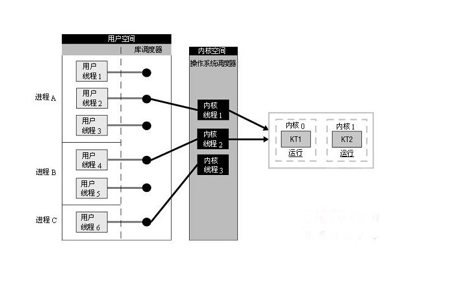
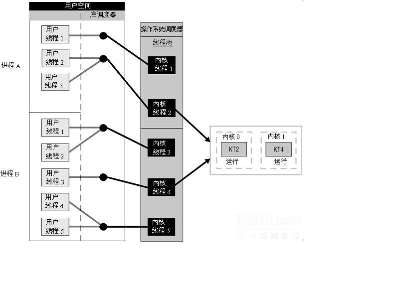
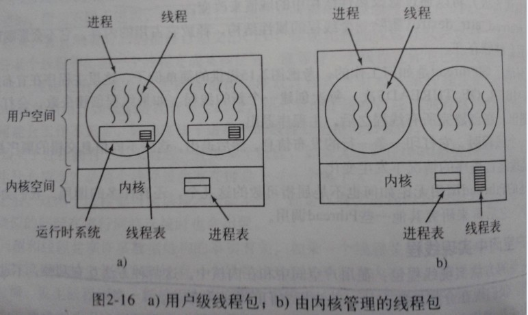

<!-- @import "[TOC]" {cmd="toc" depthFrom=1 depthTo=6 orderedList=false} -->

<!-- code_chunk_output -->

- [1 线程的 3 种实现方式](#1-线程的-3-种实现方式)
- [2 用户级线程(多对一模型)](#2-用户级线程多对一模型)
  - [2.1 线程的用户级线程实现方式](#21-线程的用户级线程实现方式)
  - [2.2 用户级线程的特点](#22-用户级线程的特点)
  - [2.3 用户级线程的优点](#23-用户级线程的优点)
  - [2.4 用户线程的缺点](#24-用户线程的缺点)
- [3 内核级线程](#3-内核级线程)
  - [3.1 线程的内核级线程实现](#31-线程的内核级线程实现)
  - [3.2 内核线程的特点](#32-内核线程的特点)
  - [3.3 内核线程的优点](#33-内核线程的优点)
- [4 组合方式](#4-组合方式)
- [5 用户级线程和内核级线程的区别](#5-用户级线程和内核级线程的区别)

<!-- /code_chunk_output -->

之前讲解过<内核线程、轻量级进程、用户线程三种线程概念解惑(线程≠轻量级进程)>,但是一直对其中提到的线程的实现模型比较迷惑, 这次就花了点时间怎么学习了一下子

# 1 线程的 3 种实现方式

在**传统的操作系统**中, 拥有**资源和独立调度**的**基本单位都是进程**. 在**引入线程的操作系统**中, **线程是独立调度的基本单位**, **进程是资源拥有的基本单位**.

- 在**同一进程**中, **线程的切换不会引起进程切换**.
- 在**不同进程**中进行**线程切换**,如从一个进程内的线程切换到另一个进程中的线程时, 会引起**进程切换**

根据**操作系统内核是否对线程可感知(也就是是否内核调度！！！不是说只有内核有线程或用户空间有线程！！！**), 可以把线程分为内核线程和用户线程

名称 | 描述
---|---
用户级线程(User\-LevelThread, ULT) | 由应用程序所支持的线程实现,内核意识不到用户级线程的实现
内核级线程(Kemel\-LevelThread, KLT) | 内核级线程又称为内核支持的线程

在多线程操作系统中, 各个系统的实现方式并不相同, 在有的系统中实现了用户级线程, 有的系统中实现了内核级线程

有些情况下,也把**内核级线程叫做轻量级进程(LWP**),但是这个是一个**不准确的描述**,其实 LWP 的术语是借自于 SVR4/MP 和 Solaris 2.x 系统中,有些系统将**LWP 称为虚拟处理器**,将之称为轻量级进程的原因可能是,在**内核线程(内核线程！！！**)的支持下, **LWP 是独立的调度单元**, 就像普通的进程一样. 所以**LWP 的最大特点**还是**每个 LWP 都有一个内核线程支持(！！！**)

# 2 用户级线程(多对一模型)

## 2.1 线程的用户级线程实现方式

在**用户级线程**中,

有关**线程管理**的所有工作都**由应用程序完成**, **内核意识不到线程的存在**.**应用程序**可以通过**使用线程库**设计成**多线程程序**.通常, 应用程序从**单线程**起始, 在该线程中开始运行, 在其运行的任何时刻, 可以通过调用线程库中的派生例程创建一个**在相同进程中运行的新线程**.

**用户级线程仅存在于用户空间**中, 此类线程的**创建**、**撤销**、**线程之间的同步与通信**功能, 都**无须利用系统调用来实现**. 用户进程利用**线程库**来**控制用户线程**. 由于线程在进程内切换的规则远比进程调度和切换的规则简单, 不需要用户态/核心态切换, 所以切换速度快. 由于这里的**处理器时间片分配是以进程为基本单位(用户级线程的情况下！！！**), 所以每个线程执行的时间相对减少.为了在操作系统中加入线程支持, 采用了在**用户空间增加运行库来实现线程**, 这些运行库被称为"**线程包**", **用户线程**是**不能被操作系统所感知**的. 用户线程多见于一些历史悠久的操作系统, 例如 Unix 操作系统

**用户级线程驻留在用户空间或模式**. 运行时**应用程序库管理这些线程**, 它也位于**用户空间**. 它们对于**操作系统是不可见**的, 因此**无法被调度到处理器内核**. 每个线程并不具有自身的**线程上下文(！！！**). 因此, 就线程的同时执行而言, 任意给定时刻**每个进程只能够有一个线程在运行**, 而且**只有一个处理器内核**会被分配给该进程. 对于一个进程, 可能有成千上万个用户级线程, 但是它们对系统资源没有影响. 运行时应用程序库调度并分派这些线程.

下图说明了用户级线程的实现方式,



如同在图中看到的那样, **库调度器**从进程的**多个线程中选择一个线程**, 然后**该线程和该进程**允许的**一个内核线程关联(必须有内核线程的支持！！！**)起来. 内核线程将被操作系统调度器指派到处理器内核. 用户级线程是一种"**多对一**"的线程映射

## 2.2 用户级线程的特点

内核对**线程包**一无所知. 从内核角度考虑, 就是按正常的方式管理, 即**单线程进程**(存在运行时系统)

## 2.3 用户级线程的优点

用户线程的优点主要有

1. 可以在**不支持线程的操作系统**中实现.

2. **创建和销毁线程、线程切换**代价等线程管理的**代价比内核线程少得多**,因为保存线程状态的过程和调用程序都**只是本地过程**

3. 允许**每个进程定制自己的调度算法**, 线程管理比较灵活. 这就是**必须自己写管理程序**, 与内核线程的区别

4. 线程能够利用的**表空间和堆栈空间**比内核级线程**多**

5. **不需要陷阱**, **不需要上下文切换**, 也**不需要对内存高速缓存进行刷新**, 使得线程调用非常快捷

6. 线程的**调度不需要内核直接参与(调度不需要！！！**), 控制简单.

## 2.4 用户线程的缺点

用户线程的缺点主要有

1. 线程发生**I/O 或页面故障**引起的**阻塞**时, 如果调用**阻塞系统调用**则内核由于不知道有多线程的存在, 而会**阻塞整个进程(阻塞这个线程的进程！！！**)从而阻塞所有线程,因此**同一进程**中只能**同时有一个线程在运行**

2. 页面失效也会产生类似的问题.

3. 一个单独的**进程内部**, **没有时钟中断**, 所以**不可能用轮转调度的方式调度**线程

4. **资源调度**按照**进程进行(资源调度以进程为单位**), **多个处理机**下, **同一个进程中的线程**只能在**同一个处理机(！！！)下分时复用**

补充:

在**用户级线程**中, **每个进程里的线程表**由**运行时系统管理**. 当**一个线程**转换到就绪状态或阻塞状态时, 在**该线程表中存放重新启动该线程所需的信息**, 与**内核在进程表**中存放的**进程的信息完全一样**

# 3 内核级线程

## 3.1 线程的内核级线程实现

在**内核级线程**中,

内核线程建立和销毁都是由**操作系统负责、通过系统调用完成**的. 在内核的支持下运行, 无论是用户进程的线程, 或者是系统进程的线程, 他们的创建、撤销、切换都是依靠内核实现的.

**线程管理的所有工作由内核完成**, **应用程序**没有进行线程管理的代码, 只有一个到内核级线程的**编程接口**. 内核为**进程及其内部的每个线程维护上下文信息(每个进程和线程都有！！！**), 调度也是在内核基于线程架构的基础上完成. 图 2-2(b)说明了内核级线程的实现方式.

内核线程**驻留在内核空间**, 它们是**内核对象**. 有了内核线程, **每个用户线程**被**映射或绑定到一个内核线程**. **用户线程在其生命期内都会绑定到该内核线程**. 一旦**用户线程终止**, **两个线程都将离开系统**. 这被称作"**一对一**"线程映射,

1. **线程的创建、撤销和切换**等, 都需要**内核直接实现**, 即**内核了解每一个作为可调度实体的线程**

2. 这些**线程**可以在**全系统内进行资源的竞争**

3. 内核空间内为每一个内核支持**线程**设置了一个**线程控制块(TCB**), 内核根据该控制块, 感知线程的存在, 并进行控制

如图所示,即内核级线程的实现方式, **每个用户线程**都直接与**一个内核线程相关联**.


**操作系统调度器**管理、调度并分派这些线程. 运行时**库**为每个**用户级线程**请求一个**内核级线程**. 操作系统的**内存管理**和**调度子系统**必须要考虑到**数量巨大的用户级线程**. 您必须了解**每个进程允许的线程的最大数目是多少**. 操作系统为**每个线程创建上下文**. 进程的每个线程在资源可用时都可以被指派到处理器内核.

## 3.2 内核线程的特点

当某个线程希望**创建一个新线程**或**撤销一个已有线程**时, 它进行一个**系统调用**

## 3.3 内核线程的优点

内核线程的优点:

1. **多处理器系统**中, 内核能够并行执行**同一进程内的多个线程**

2. 如果**进程中的一个线程被阻塞**, 能够切换**同一进程内的其他线程**继续执行(用户级线程的一个缺点)

3. 所有能够阻塞线程的调用都以**系统调用**的形式实现, **代价可观**

4. 当**一个线程阻塞**时, 内核根据选择可以运行**另一个进程的线程**, 而**用户空间实现的线程中, 运行时系统始终运行自己进程中的线程**

5. 信号是**发给进程而不是线程**的, 当一个**信号到达**时, 应该由**哪一个线程**处理它?**线程可以"注册"它们感兴趣的信号**

# 4 组合方式

在一些系统中, 使用**组合方式**的多线程实现,**线程创建**完全在**用户空间**中完成, **线程的调度和同步**也在**应用程序**中进行.**一个应用程序**中的**多个用户级线程**被映射到**一些**(**小于或等于**用户级线程的数目)**内核级线程**上.

下图说明了用户级与内核级的组合实现方式,在这种模型中, **每个内核级线程**有一个可以轮流使用的**用户级线程集合**



**posix 线程调度是一个混合模型**, 很灵活, 足以在标准的特定实现中支持用户级和内核级的线程. 模型中包括**两级调度**–**线程级和内核实体级**. **线程级与用户级线程类似**, **内核实体由内核调度**. 由**线程库**来决定它需要**多少内核实体**, 以及他们是**如何映射**的.

POSIX 引入了一个**线程调度竞争范围**(thread-scheduling contention scope)的概念, 这个概念赋予了**程序员一些控制权**, 使它们可以控制怎样**将内核实体映射为线程**. **线程**的**contentionscope**属性可以是**PTHREAD\_SCOPE\_PROCESS**,也可以是**PTHREAD\_SCOPE\_SYSTEM**. 带有 PTHREAD\_SCOPE\_PROCESS 属性的**线程**与它**所在的进程中的其他线程竞争处理器资源**. 带有 PTHREAD\_SCOPE\_SYSTEM 属性的线程很像内核级线程, 他们在**全系统的范围内竞争处理器资源**. POSIX 的一种映射方式将**PTHREAD\_SCOPE\_SYSTEM 线程和内核实体**之间**绑定起来**.

内核级线程创建时先设置线程属性 PTHREAD\_SCOPE\_SYSTEM, 代码如下, :

```cpp
pthread_attr_t attr;

pthread_attr_init(&attr);
//设置内核级的线程,以获取较高的响应速度
pthread_attr_setscope(&attr, PTHREAD_SCOPE_SYSTEM);
//创建线程
ret = pthread_create(&iAcceptThreadId, &attr, AcceptThread, NULL);
```

POSIX 的标准中定义了两个值:

PTHREAD\_SCOPE\_SYSTEM 和 PTHREAD\_SCOPE\_PROCESS, 前者表示**与系统中所有线程一起竞争 CPU 时间**, 后者表示**仅与同进程中的线程竞争 CPU**

**默认为 PTHREAD\_SCOPE\_PROCESS**. 目前**LinuxThreads 仅实现了 PTHREAD\_SCOPE\_SYSTEM 一值**.

关于**线程的绑定**, 牵涉到另外一个概念: **轻进程(LWP: Light Weight Process**). 轻进程可以理解为**内核线程**, 它位于**用户层和系统层之间**. **系统**对**线程资源的分配**、**对线程的控制**是通过**轻进程**来实现的, **一个轻进程**可以控制**一个或多个线程**. 默认状况下, 启动**多少轻进程**、**哪些轻进程**来**控制哪些线程**是由**系统来控制**的, 这种状况即称为**非绑定**的. 绑定状况下, 则顾名思义, 即**某个线程固定的"绑"在一个轻进程**之上. 被绑定的线程具有**较高的响应速度**, 这是因为**CPU 时间片的调度是面向轻进程(！！！**)的, 绑定的线程可以保证在需要的时候它**总有一个轻进程可用**. 通过设置**被绑定的轻进程的优先级**和**调度级**可以使得绑定的线程满足诸如实时反应之类的要求.

设置线程**绑定状态**的函数为**pthread\_attr\_setscope**, 它有两个参数, 第一个是指向**属性结构的指针**, 第二个是**绑定类型**, 它有两个取值: PTHREAD\_SCOPE\_SYSTEM(绑定的)和 PTHREAD\_SCOPE\_PROCESS(非绑定的).

# 5 用户级线程和内核级线程的区别

1. **内核级线程**是**OS 内核可感知**的, 而用户级线程是 OS 内核不可感知的.

2. 用户级线程的创建、撤消和调度不需要 OS 内核的支持, 是在语言(如 Java)这一级处理的; 而**内核支持线程**的**创建、撤消和调度**都需**OS 内核提供支持**, 而且**与进程的创建、撤消和调度大体是相同**的.

3. **用户级线程**执行**系统调用指令**时将导致其**所属进程被中断**, 而内核支持线程执行系统调用指令时, 只导致该线程被中断.

4. 在**只有**用户级线程的系统内, **CPU 调度还是以进程为单位**, 处于运行状态的进程中的多个线程, 由**用户程序控制同一个进程中的线程的轮换运行**; 在有**内核支持线程的系统**内, **CPU 调度则以线程为单位**, 由 OS 的线程调度程序负责线程的调度.

5. 用户级线程的**程序实体**是运行在**用户态下的程序**, 而内核支持线程的**程序实体**则是可以运行在**任何状态**下的程序.

