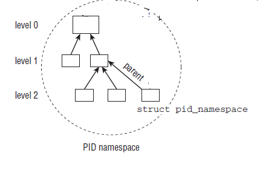
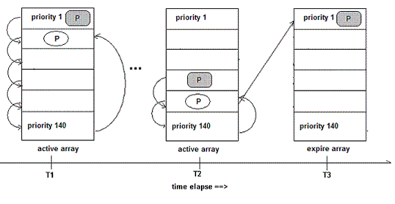

<!-- @import "[TOC]" {cmd="toc" depthFrom=1 depthTo=6 orderedList=false} -->

<!-- code_chunk_output -->

- [程描述符 struct task_struct](#程描述符-struct-task_struct)
  - [进程状态](#进程状态)
    - [1.1.1 5 个互斥状态](#111-5-个互斥状态)
    - [1.1.2 2 个终止状态](#112-2-个终止状态)
    - [1.1.3 睡眠状态](#113-睡眠状态)
      - [1.1.3.1 内核将进程置为睡眠状态的方法](#1131-内核将进程置为睡眠状态的方法)
    - [1.1.4 状态切换](#114-状态切换)
  - [1.2 进程标识符(PID)](#12-进程标识符pid)
  - [1.3 进程内核栈与 thread\_info 结构](#13-进程内核栈与-thread_info-结构)
    - [1.3.1 为什么需要内核栈](#131-为什么需要内核栈)
    - [1.3.2 为什么需要 thread\_info](#132-为什么需要-thread_info)
    - [1.3.3 内核栈和线程描述符](#133-内核栈和线程描述符)
    - [1.3.4 内核栈数据结构描述 thread\_info 和 thread\_union](#134-内核栈数据结构描述-thread_info-和-thread_union)
    - [1.3.5 获取当前在 CPU 上正在运行进程的 thread\_info](#135-获取当前在-cpu-上正在运行进程的-thread_info)
    - [1.3.6 分配和销毁 thread\_info](#136-分配和销毁-thread_info)
  - [1.4 进程标记](#14-进程标记)
  - [1.5 表示进程亲属关系的成员](#15-表示进程亲属关系的成员)
  - [1.6 ptrace 系统调用](#16-ptrace-系统调用)
  - [1.7 Performance Event](#17-performance-event)
  - [1.8 进程调度](#18-进程调度)
    - [1.8.1 优先级](#181-优先级)
    - [1.8.2 调度策略相关字段](#182-调度策略相关字段)
  - [1.9 进程地址空间](#19-进程地址空间)
  - [1.10 判断标志](#110-判断标志)
  - [1.11 时间](#111-时间)
  - [1.12 信号处理](#112-信号处理)
  - [1.13 其他](#113-其他)
- [2 命名空间](#2-命名空间)
  - [2.1 Linux 内核命名空间描述](#21-linux-内核命名空间描述)
  - [2.2 命名空间的创建](#22-命名空间的创建)
  - [2.3 PID Namespace](#23-pid-namespace)
- [3 进程 ID 类型](#3-进程-id-类型)
- [4 PID 命名空间](#4-pid-命名空间)
  - [4.1 pid 命名空间概述](#41-pid-命名空间概述)
  - [4.2 局部 ID 和全局 ID](#42-局部-id-和全局-id)
    - [4.2.1 全局 ID](#421-全局-id)
    - [4.2.2 局部 ID](#422-局部-id)
  - [4.3 PID 命名空间数据结构 pid\_namespace](#43-pid-命名空间数据结构-pid_namespace)
- [5 pid 结构描述](#5-pid-结构描述)
  - [5.1 pid 与 upid](#51-pid-与-upid)
    - [5.1.1 特定命名空间信息 struct upid](#511-特定命名空间信息-struct-upid)
    - [5.1.2 局部 ID 类 struct pid](#512-局部-id-类-struct-pid)
  - [5.2 用于分配 pid 的位图 struct pidmap](#52-用于分配-pid-的位图-struct-pidmap)
  - [5.3 pid 的哈希表存储结构 struct pid\_link](#53-pid-的哈希表存储结构-struct-pid_link)
  - [5.4 task\_struct 中的进程 ID 相关描述符信息](#54-task_struct-中的进程-id-相关描述符信息)
  - [5.5 进程 ID 管理函数](#55-进程-id-管理函数)
    - [5.5.1 进程 pid 号找到 struct pid 实体](#551-进程-pid-号找到-struct-pid-实体)
    - [5.5.2 获取局部 ID](#552-获取局部-id)
    - [5.5.3 根据 PID 查找进程 task\_struct](#553-根据-pid-查找进程-task_struct)
    - [5.5.4 生成唯一的 PID](#554-生成唯一的-pid)
- [6 Liux 进程类别](#6-liux-进程类别)
  - [6.1 内核线程](#61-内核线程)
- [7 linux 进程的创建流程](#7-linux-进程的创建流程)
  - [7.1 进程的复制 fork 和加载 execve](#71-进程的复制-fork-和加载-execve)
  - [7.2 写时复制技术](#72-写时复制技术)
  - [7.3 内核线程创建接口](#73-内核线程创建接口)
    - [7.3.1 kernel\_thread](#731-kernel_thread)
    - [7.3.2 kthread\_create](#732-kthread_create)
    - [7.3.3 kthread\_run](#733-kthread_run)
  - [7.4 内核线程的退出接口](#74-内核线程的退出接口)
- [8 Linux 中 3 个特殊的进程](#8-linux-中-3-个特殊的进程)
  - [8.1 0 号 idle 进程](#81-0-号-idle-进程)
    - [8.1.1 0 号进程上下文信息--init\_task 描述符](#811-0-号进程上下文信息-init_task-描述符)
    - [8.1.2 进程堆栈 init\_thread\_union](#812-进程堆栈-init_thread_union)
    - [8.1.3 进程内存空间](#813-进程内存空间)
    - [8.1.4 0 号进程的演化](#814-0-号进程的演化)
      - [8.1.4.1 rest\_init 创建 init 进程(PID=1)和 kthread 进程(PID=2)](#8141-rest_init-创建-init-进程pid1和-kthread-进程pid2)
        - [8.1.4.1.1 创建 kernel\_init](#81411-创建-kernel_init)
        - [8.1.4.1.2 创建 kthreadd](#81412-创建-kthreadd)
      - [8.1.4.2 0 号进程演变为 idle](#8142-0-号进程演变为-idle)
    - [8.1.5 idle 的运行与调度](#815-idle-的运行与调度)
      - [8.1.5.1 idle 的 workload--cpu\_idle\_loop](#8151-idle-的-workload-cpu_idle_loop)
      - [8.1.5.2 idle 的运行时机](#8152-idle-的运行时机)
  - [8.2 1 号 init 进程](#82-1-号-init-进程)
    - [8.2.1 执行函数 kernel\_init()](#821-执行函数-kernel_init)
    - [8.2.2 关于 init 程序](#822-关于-init-程序)
  - [8.3 2 号 kthreadd 进程](#83-2-号-kthreadd-进程)
    - [8.3.1 执行函数 kthreadd()](#831-执行函数-kthreadd)
      - [8.3.1.1 create\_kthread(struct kthread\_create\_info)完成内核线程创建](#8311-create_kthreadstruct-kthread_create_info完成内核线程创建)
    - [8.3.2 新创建的内核线程执行函数 kthread()](#832-新创建的内核线程执行函数-kthread)
    - [8.3.3 小结](#833-小结)
- [9 用户空间创建进程/线程的三种方法](#9-用户空间创建进程线程的三种方法)
  - [9.1 系统调用的参数传递](#91-系统调用的参数传递)
  - [9.2 sys\_fork 的实现](#92-sys_fork-的实现)
  - [9.3 sys\_vfork 的实现](#93-sys_vfork-的实现)
  - [9.4 sys\_clone 的实现](#94-sys_clone-的实现)
- [10 创建子进程流程](#10-创建子进程流程)
  - [10.1 \_do\_fork 的流程](#101-_do_fork-的流程)
  - [10.2 copy\_process 流程](#102-copy_process-流程)
    - [10.2.1 dup\_task\_struct()产生新的 task\_struct](#1021-dup_task_struct产生新的-task_struct)
    - [10.2.2 sched\_fork()流程](#1022-sched_fork流程)
    - [10.2.3 copy\_thread 和 copy\_thread\_tls 流程](#1023-copy_thread-和-copy_thread_tls-流程)
- [11 用户程序结束进程](#11-用户程序结束进程)
- [12 进程状态变化过程](#12-进程状态变化过程)
- [13 内核线程](#13-内核线程)
  - [13.1 概述](#131-概述)
  - [13.2 内核线程的创建](#132-内核线程的创建)
    - [13.2.1 创建内核线程接口](#1321-创建内核线程接口)
    - [13.2.2 2 号进程 kthreadd](#1322-2-号进程-kthreadd)
    - [13.2.3 kernel\_thread()创建内核线程](#1323-kernel_thread创建内核线程)
- [14 可执行程序的加载和运行](#14-可执行程序的加载和运行)
  - [14.1 exec()函数族](#141-exec函数族)
  - [14.2 可执行程序相关数据结构](#142-可执行程序相关数据结构)
    - [14.2.1 struct linux\_binprm 结构描述一个可执行程序的信息](#1421-struct-linux_binprm-结构描述一个可执行程序的信息)
    - [14.2.2 struct linux\_binfmt 可执行格式的结构](#1422-struct-linux_binfmt-可执行格式的结构)
  - [14.3 execve 加载可执行程序的过程](#143-execve-加载可执行程序的过程)
  - [14.4 execve 的入口函数 sys\_execve](#144-execve-的入口函数-sys_execve)
  - [14.5 do\_execve 函数](#145-do_execve-函数)
  - [14.6 exec\_binprm()识别并加载二进程程序](#146-exec_binprm识别并加载二进程程序)
  - [14.7 search\_binary\_handler()识别二进程程序](#147-search_binary_handler识别二进程程序)
- [15 对象文件格式](#15-对象文件格式)
  - [15.1 对象文件](#151-对象文件)
    - [15.1.1 可重定位的对象文件(Relocatable file)](#1511-可重定位的对象文件relocatable-file)
    - [15.1.2 可执行的对象文件(Executable file)](#1512-可执行的对象文件executable-file)
    - [15.1.3 可被共享的对象文件(Shared object file)](#1513-可被共享的对象文件shared-object-file)
  - [15.2 文件格式](#152-文件格式)
  - [15.3 ELF 对象文件格式](#153-elf-对象文件格式)
  - [15.4 示例](#154-示例)
    - [15.4.1 add.c](#1541-addc)
    - [15.4.2 sub.c](#1542-subc)
    - [15.4.3 testelf.c](#1543-testelfc)
    - [15.4.4 Makefile](#1544-makefile)
- [16 ELF 可执行与链接文件格式详解](#16-elf-可执行与链接文件格式详解)
  - [16.1 布局和结构](#161-布局和结构)
    - [16.1.1 链接视图](#1611-链接视图)
    - [16.1.2 执行视图](#1612-执行视图)
  - [16.2 ELF 基本数据类型定义](#162-elf-基本数据类型定义)
  - [16.3 ELF 头部 elfxx\_hdr](#163-elf-头部-elfxx_hdr)
    - [16.3.1 ELF 魔数 e\_ident](#1631-elf-魔数-e_ident)
    - [16.3.2 目标文件类型 e\_type](#1632-目标文件类型-e_type)
    - [16.3.3 目标体系结构类型 e\_machine](#1633-目标体系结构类型-e_machine)
    - [16.3.4 ELF 版本 e\_version](#1634-elf-版本-e_version)
    - [16.3.5 readelf \-h 查看 elf 头部](#1635-readelf--h-查看-elf-头部)
      - [16.3.5.1 可重定位的对象文件(Relocatable file)](#16351-可重定位的对象文件relocatable-file)
      - [16.3.5.2 可执行的对象文件(Executable file)](#16352-可执行的对象文件executable-file)
      - [16.3.5.3 可被共享的对象文件(Shared object file)](#16353-可被共享的对象文件shared-object-file)
  - [16.4 程序头部 elf32\_phdr](#164-程序头部-elf32_phdr)
    - [16.4.1 段类型 p\_type](#1641-段类型-p_type)
    - [16.4.2 readelf \-l 查看程序头表](#1642-readelf--l-查看程序头表)
      - [16.4.2.1 可重定位的对象文件(Relocatable file)](#16421-可重定位的对象文件relocatable-file)
      - [16.4.2.2 可被共享的对象文件(Shared object file)](#16422-可被共享的对象文件shared-object-file)
      - [16.4.2.3 可执行的对象文件(Executable file)](#16423-可执行的对象文件executable-file)
  - [16.5 节区(Sections)](#165-节区sections)
    - [16.5.1 节区头部表格](#1651-节区头部表格)
    - [16.5.2 特殊节区](#1652-特殊节区)
    - [16.5.3 readelf -S 查看节区头表](#1653-readelf--s-查看节区头表)
      - [16.5.3.1 可重定位的对象文件(Relocatable file)](#16531-可重定位的对象文件relocatable-file)
      - [16.5.3.2 可执行的对象文件(Executable file)](#16532-可执行的对象文件executable-file)
      - [16.5.3.3 可被共享的对象文件(Shared object file)](#16533-可被共享的对象文件shared-object-file)
  - [16.6 字符串表](#166-字符串表)
  - [16.7 符号表(Symbol Table)](#167-符号表symbol-table)
    - [16.7.1 数据结构 elfxx\_sym](#1671-数据结构-elfxx_sym)
  - [17 加载和动态链接](#17-加载和动态链接)
- [18 elf 文件格式的注册](#18-elf-文件格式的注册)
- [19 内核空间的加载过程 load\_elf\_binary](#19-内核空间的加载过程-load_elf_binary)
  - [19.1 填充并且检查目标程序 ELF 头部](#191-填充并且检查目标程序-elf-头部)
  - [19.2 load\_elf\_phdrs 加载目标程序的程序头表](#192-load_elf_phdrs-加载目标程序的程序头表)
  - [19.3 如果需要动态链接, 则寻找和处理解释器段, 得到解释器映像的 elf 头部](#193-如果需要动态链接-则寻找和处理解释器段-得到解释器映像的-elf-头部)
  - [19.4 检查并读取解释器的程序表头](#194-检查并读取解释器的程序表头)
  - [19.5 装入目标程序的段 segment](#195-装入目标程序的段-segment)
  - [19.6 填写程序的入口地址](#196-填写程序的入口地址)
  - [19.7 create\_elf\_tables()填写目标文件的参数环境变量等必要信息](#197-create_elf_tables填写目标文件的参数环境变量等必要信息)
  - [19.8 start\_thread 宏准备进入新的程序入口](#198-start_thread-宏准备进入新的程序入口)
  - [19.9 小结](#199-小结)
- [20 ELF 文件中符号的动态解析过程](#20-elf-文件中符号的动态解析过程)
  - [20.1 内核的工作](#201-内核的工作)
  - [20.2 动态链接器的工作](#202-动态链接器的工作)
- [21 Linux 进程退出](#21-linux-进程退出)
  - [21.1 linux 下进程退出的方式](#211-linux-下进程退出的方式)
    - [21.1.1 正常退出](#2111-正常退出)
    - [21.1.2 异常退出](#2112-异常退出)
  - [21.2 \_exit, exit 和\_Exit 的区别和联系](#212-_exit-exit-和_exit-的区别和联系)
  - [21.3 进程退出的系统调用](#213-进程退出的系统调用)
    - [21.3.1 \_exit 和 exit\_group 系统调用](#2131-_exit-和-exit_group-系统调用)
    - [21.3.2 系统调用声明](#2132-系统调用声明)
    - [21.3.3 系统调用号](#2133-系统调用号)
    - [21.3.4 系统调用实现](#2134-系统调用实现)
  - [21.4 do\_group\_exist 流程](#214-do_group_exist-流程)
  - [21.5 do\_exit()流程](#215-do_exit流程)
  - [22 调度器和调度策略](#22-调度器和调度策略)
  - [22.1 进程饥饿](#221-进程饥饿)
  - [23 Linux 进程的分类](#23-linux-进程的分类)
  - [23.1 进程的分类](#231-进程的分类)
  - [23.2 实时进程与普通进程](#232-实时进程与普通进程)
- [24 linux 调度器的演变](#24-linux-调度器的演变)
  - [24.1 O(n)的始调度算法](#241-on的始调度算法)
  - [24.2 O(1)调度器](#242-o1调度器)
  - [24.3 CFS 调度器 Completely Fair Scheduler](#243-cfs-调度器-completely-fair-scheduler)
    - [24.3.1 楼梯调度算法 staircase scheduler(SD)](#2431-楼梯调度算法-staircase-schedulersd)
    - [24.3.2 RSDL(Rotating Staircase Deadline Scheduler)](#2432-rsdlrotating-staircase-deadline-scheduler)
    - [24.3.3 完全公平的调度器 CFS](#2433-完全公平的调度器-cfs)
- [25 Linux 调度器的组成](#25-linux-调度器的组成)
  - [25.1 2 个调度器](#251-2-个调度器)
  - [25.2 6 种调度策略](#252-6-种调度策略)
  - [25.3 5 个调度器类](#253-5-个调度器类)
  - [25.4 3 个调度实体](#254-3-个调度实体)
  - [25.5 调度器类的就绪队列](#255-调度器类的就绪队列)
  - [25.6 调度器整体框架](#256-调度器整体框架)
  - [25.7 5 种调度器类为什么只有 3 种调度实体?](#257-5-种调度器类为什么只有-3-种调度实体)
- [26 进程调度的数据结构](#26-进程调度的数据结构)
  - [26.1 task\_struct 中调度相关的成员](#261-task_struct-中调度相关的成员)
    - [26.1.1 优先级](#2611-优先级)
    - [26.1.2 调度策略](#2612-调度策略)
    - [26.1.3 调度策略相关字段](#2613-调度策略相关字段)
  - [26.2 调度类](#262-调度类)
  - [26.3 就绪队列](#263-就绪队列)
    - [26.3.1 CPU 就绪队列 struct rq](#2631-cpu-就绪队列-struct-rq)
    - [26.3.2 CFS 公平调度器的就绪队列 cfs\_rq](#2632-cfs-公平调度器的就绪队列-cfs_rq)
    - [26.3.3 实时进程就绪队列 rt\_rq](#2633-实时进程就绪队列-rt_rq)
    - [26.3.4 deadline 就绪队列 dl\_rq](#2634-deadline-就绪队列-dl_rq)
  - [26.4 调度实体](#264-调度实体)
    - [26.4.1 普通进程调度实体 sched\_entity](#2641-普通进程调度实体-sched_entity)
    - [26.4.2 实时进程调度实体 sched\_rt\_entity](#2642-实时进程调度实体-sched_rt_entity)
    - [26.4.3 EDF 调度实体 sched\_dl\_entity](#2643-edf-调度实体-sched_dl_entity)
  - [26.5 组调度(struct task\_group)](#265-组调度struct-task_group)
- [27 进程调度小结](#27-进程调度小结)
- [28 周期性调度器 scheduler\_tick](#28-周期性调度器-scheduler_tick)
  - [28.1 周期性调度器主流程](#281-周期性调度器主流程)
  - [28.2 更新统计量](#282-更新统计量)
  - [28.3 激活进程所属调度类的周期性调度器](#283-激活进程所属调度类的周期性调度器)
- [29 周期性调度器的激活](#29-周期性调度器的激活)
  - [29.1 定时器周期性的激活调度器](#291-定时器周期性的激活调度器)
  - [29.2 定时器中断实现](#292-定时器中断实现)
- [主调度器 schedule()](#主调度器-schedule)
  - [调度函数的 __sched 前缀](#调度函数的-__sched-前缀)
  - [schedule()函数](#schedule函数)
    - [schedule 主框架](#schedule-主框架)
    - [sched_submit_work() 避免死锁](#sched_submit_work-避免死锁)
    - [preempt_disable 和 sched_preempt_enable_no_resched 开关内核抢占](#preempt_disable-和-sched_preempt_enable_no_resched-开关内核抢占)
  - [__schedule() 开始进程调度](#__schedule-开始进程调度)
    - [__schedule() 函数主框架](#__schedule-函数主框架)
    - [pick_next_task 选择抢占的进程](#pick_next_task-选择抢占的进程)

<!-- /code_chunk_output -->

# 程描述符 struct task_struct

## 进程状态

```c
struct task_struct{
    volatile long state;    /* -1 unrunnable, 0 runnable, >0 stopped */
}
```

可能取值是

```c
[include/linux/sched.h]
 #define TASK_RUNNING            0
 #define TASK_INTERRUPTIBLE      1
 #define TASK_UNINTERRUPTIBLE    2
 #define __TASK_STOPPED          4
 #define __TASK_TRACED           8

/* in tsk->exit_state */
 #define EXIT_DEAD               16
 #define EXIT_ZOMBIE             32
 #define EXIT_TRACE              (EXIT_ZOMBIE | EXIT_DEAD)

/* in tsk->state again */
 #define TASK_DEAD               64
 #define TASK_WAKEKILL           128	/** wake on signals that are deadly **/
 #define TASK_WAKING             256
 #define TASK_PARKED             512
 #define TASK_NOLOAD             1024
 #define TASK_STATE_MAX          2048

 /* Convenience macros for the sake of set_task_state */
#define TASK_KILLABLE           (TASK_WAKEKILL | TASK_UNINTERRUPTIBLE)
#define TASK_STOPPED            (TASK_WAKEKILL | __TASK_STOPPED)
#define TASK_TRACED             (TASK_WAKEKILL | __TASK_TRACED)
```

### 1.1.1 5 个互斥状态

| 状态| 描述 |
| ---- |:----|
| TASK\_RUNNING | 表示进程要么**正在执行**, 要么正要**准备执行**(已经就绪), 正在等待 cpu 时间片的调度 |
| TASK\_INTERRUPTIBLE | **阻塞态**.进程因为**等待一些条件**而**被挂起(阻塞**)而**所处的状态**. 这些条件主要包括: **硬中断、资源、一些信号**......, **一旦等待的条件成立**, 进程就会从该状态(阻塞)迅速**转化成为就绪状态 TASK\_RUNNING** |
| TASK\_UNINTERRUPTIBLE | 意义与 TASK\_INTERRUPTIBLE 类似, 除了**不能通过接受一个信号来唤醒**以外, 对于处于 TASK\_UNINTERRUPIBLE 状态的进程, 哪怕我们**传递一个信号或者有一个外部中断都不能唤醒他们**. **只有它所等待的资源可用**的时候, 他才会被唤醒. 这个标志很少用, 但是并不代表没有任何用处, 其实他的作用非常大, 特别是对于驱动刺探相关的硬件过程很重要, 这个刺探过程不能被一些其他的东西给中断, 否则就会让进城进入不可预测的状态 |
| TASK\_STOPPED | 进程被**停止执行**, 当进程接收到**SIGSTOP、SIGTTIN、SIGTSTP 或者 SIGTTOU 信号**之后就会进入该状态 |
| TASK\_TRACED | 表示**进程被 debugger 等进程监视**, 进程执行被调试程序所停止, 当一个进程被另外的进程所监视, 每一个信号都会让进城进入该状态 |

### 1.1.2 2 个终止状态

有**两个附加的进程状态**既可以**被添加到 state 域**中, 又可以被添加到**exit\_state 域**中.

只有**当进程终止**的时候, 才会达到这两种状态.

```c
struct task_struct{
    int exit_state;
	int exit_code, exit_signal;
}
```

| 状态| 描述 |
| ----- |:------|
| **EXIT\_ZOMBIE** | 进程的执行被终止, 但是其**父进程还没有使用 wait()等系统调用来获知它的终止信息**, 此时进程成为**僵尸进程** |
| **EXIT\_DEAD** | 进程的**最终状态** |

### 1.1.3 睡眠状态

#### 1.1.3.1 内核将进程置为睡眠状态的方法

两种方法.

普通方法是将进程状态置为**TASK\_INTERRUPTIBLE**或**TASK\_UNINTERRUPTIBLE**, 然后**调用调度程序的 schedule**()函数. 这样会**将进程从 CPU 运行队列中移除**.

- **TASK\_INTERRUPTIBLE**: 可中断模式的睡眠状态, 可通过**显式的唤醒**呼叫(**wakeup\_process**())或者需要处理的**信号**来唤醒
- **TASK\_UNINTERRUPTIBLE**: 不可中断模式的睡眠状态, **只能**通过**显式的唤醒**呼叫, 一般不建议设置

新方法是使用新的进程睡眠状态 TASK\_KILLABLE

TASK\_KILLABLE: 可以终止的新睡眠状态, 原理类似于 TASK\_UNINTERRUPTIBLE, 只不过**可以响应致命信号**

### 1.1.4 状态切换

进程状态的切换过程和原因大致如下图


## 1.2 进程标识符(PID)

```c
typedef int		__kernel_pid_t;
typedef __kernel_pid_t		pid_t;

struct task_struct{
    pid_t pid;
    pid_t tgid;
}
```

**pid 来标识进程**, 一个**线程组所有线程**与**领头线程**具有**相同的 pid**, 存入**tgid**字段, 只有**线程组的领头线程**的**pid**成员才会被设置为**与 tgid 相同**的值.

注意, **getpid()返回当前进程的 tgid 值而不是 pid 的值(！！！**).

在**CONFIG\_BASE\_SMALL 配置为 0**的情况下, **PID 的取值范围是 0 到 32767**, 即系统中的**进程数最大为 32768 个**.

```cpp
#define PID_MAX_DEFAULT (CONFIG_BASE_SMALL ? 0x1000 : 0x8000)
```

## 1.3 进程内核栈与 thread\_info 结构

### 1.3.1 为什么需要内核栈

```cpp
struct task_struct{
    // 指向内核栈的指针
    void *stack;
}
```

**进程**在**内核态运行**时需要自己的**堆栈信息**,因此 linux 内核为**每个进程(！！！每一个！！！**)都提供了一个**内核栈 kernel stack(这里的 stack 就是这个进程在内核态的堆栈信息！！！**)

**内核态的进程**访问处于**内核数据段的栈**, 这个栈**不同于**用户态的进程所用的栈.

**用户态进程**所用的**栈**, 是在进程**线性地址空间**中;

而**内核栈**是当进程**从用户空间进入内核空间**时, **特权级发生变化**, 需要**切换堆栈**, 那么内核空间中使用的就是这个内核栈. 因为内核控制路径使用**很少的栈空间**, 所以**只需要几千个字节的内核态堆栈**.

需要注意的是, **内核态堆栈**仅用于**内核例程**, Linux 内核另外为中断提供了单独的**硬中断栈**和**软中断栈**

### 1.3.2 为什么需要 thread\_info

**内核**还需要存储**每个进程**的**PCB 信息**,linux 内核是**支持不同体系**的,但是**不同的体系结构**可能进程需要存储的**信息不尽相同**,这就需要我们实现一种**通用的方式**,我们将**体系结构相关**的部分和**无关**的部分进行**分离**

用一种**通用的方式**来描述进程, 这就是**struct task\_struct**, 而**thread\_info**就保存了**特定体系结构**的**汇编代码段**需要**访问的那部分进程的数据**, 我们在 thread\_info 中嵌入指向 task\_struct 的指针, 则我们可以很方便的**通过 thread\_info**来**查找 task\_struct**

### 1.3.3 内核栈和线程描述符

对**每个进程**, Linux 内核都把**两个不同的数据结构紧凑**的存放在一个**单独为进程分配的内存区域**中

- 一个是**内核态**的**进程堆栈**,

- 另一个是紧挨着**进程描述符**的小数据结构 thread\_info, 叫做**线程描述符**.

Linux 将这两个存放在一块, 这块区域通常是 8192 Byte(两个页框), 其地址必须是 8192 的整数倍.

```c
[arch/x86/include/asm/page_32_types.h]
#define THREAD_SIZE_ORDER    1
// 2 个页大小
#define THREAD_SIZE        (PAGE_SIZE << THREAD_SIZE_ORDER)
```

```c
[arch/x86/include/asm/page_64_types.h]
#ifdef CONFIG_KASAN
#define KASAN_STACK_ORDER 1
#else
#define KASAN_STACK_ORDER 0
#endif

#define THREAD_SIZE_ORDER	(2 + KASAN_STACK_ORDER)
// 4 个页或 8 个页大小
#define THREAD_SIZE  (PAGE_SIZE << THREAD_SIZE_ORDER)
```

下图中显示了在**物理内存**中存放**两种数据结构**的方式. **线程描述符**驻留与这个**内存区的开始**, 而**栈顶末端向下增长**.


**sp 寄存器是 CPU 栈指针**, 用来存放**栈顶单元的地址**. 在 80x86 系统中, 栈起始于顶端, 并朝着这个内存区开始的方向增长. 从用户态刚切换到内核态以后, 进程的内核栈总是空的. 因此, esp 寄存器指向这个栈的顶端. 一旦数据写入堆栈, esp 的值就递减.

**进程描述符 task\_struct**结构中**没有直接指向 thread\_info 结构的指针**, 而是用一个**void 指针类型**的成员表示, 然后通过**类型转换来访问 thread\_info 结构**.

```cpp
#define task_thread_info(task)  ((struct thread_info *)(task)->stack)
```

### 1.3.4 内核栈数据结构描述 thread\_info 和 thread\_union

**thread\_info 是体系结构相关**的, 结构的定义在 thread\_info.h, 不同体系结构不同文件.

```c
[arch/x86/include/asm/thread_info.h]
struct thread_info {
	struct task_struct	*task;		/* main task structure */
	__u32			flags;		/* low level flags */
	__u32			status;		/* thread synchronous flags */
	__u32			cpu;		/* current CPU */
	mm_segment_t		addr_limit;
	unsigned int		sig_on_uaccess_error:1;
	unsigned int		uaccess_err:1;	/* uaccess failed */
};
```

Linux 内核中使用一个**联合体**来表示一个**进程的线程描述符**和**内核栈**:

```c
[include/linux/sched.h]
union thread_union
{
	struct thread_info thread_info;
	unsigned long stack[THREAD_SIZE/sizeof(long)];
};
```

### 1.3.5 获取当前在 CPU 上正在运行进程的 thread\_info

```cpp
static inline unsigned long current_top_of_stack(void)
{
#ifdef CONFIG_X86_64
    // 内核栈(0)栈顶寄存器 SP0
	return this_cpu_read_stable(cpu_tss.x86_tss.sp0);
#else
	/* sp0 on x86_32 is special in and around vm86 mode. */
	return this_cpu_read_stable(cpu_current_top_of_stack);
#endif
}

static inline struct thread_info *current_thread_info(void)
{
	return (struct thread_info *)(current_top_of_stack() - THREAD_SIZE);
}
```

为了获取**当前 CPU**上运行进程的**task\_struct**结构, 内核提供了**current 宏**, 由于**task\_struct \*task**在**thread\_info 的起始位置**, 该宏本质上等价于**current\_thread\_info()\->task**

```c
[include/asm-generic/current.h]
#define get_current() (current_thread_info()->task)
#define current get_current()
```

### 1.3.6 分配和销毁 thread\_info

进程通过**alloc\_thread\_info\_node**()函数**分配它的内核栈**, 通过**free\_thread\_info**()函数释放所分配的内核栈.

## 1.4 进程标记

```c
struct task_struct{
    unsigned int flags;
}
```

反应**进程状态的信息**, 但**不是运行状态**, 用于**内核识别进程当前的状态**

取值以 PF(ProcessFlag)开头的宏, 定义在 include/linux/sched.h

## 1.5 表示进程亲属关系的成员

```c
struct task_struct{
    struct task_struct __rcu *real_parent; /* real parent process */
    struct task_struct __rcu *parent; /* recipient of SIGCHLD, wait4() reports */

    struct list_head children;      /* list of my children */
    struct list_head sibling;       /* linkage in my parent's children list */
    struct task_struct *group_leader;       /* threadgroup leader */
}
```

| 字段 | 描述 |
| --- |:---|
| real\_parent | 指向其父进程, 如果创建它的**父进程不再存在**, 则指向**PID 为 1 的 init 进程** |
| parent | 指向其父进程, **当它终止时, 必须向它的父进程发送信号**. 它的值通常与 real\_parent 相同 |
| children | 表示**链表的头部**, 链表中的**所有元素**都是它的**子进程** |
| sibling | 用于**把当前进程插入到兄弟链表**中 |
| group\_leader | 指向其所在**进程组的领头进程** |

## 1.6 ptrace 系统调用

ptrace 提供了一种**父进程可以控制子进程运行**, 并可以检查和改变它的核心 image.

主要用于**实现断点调试**. 一个被跟踪的进程运行中, 直到发生一个**信号**,则**进程被中止**, 并且**通知其父进程**. 在**进程中止的状态**下, 进程的**内存空间可以被读写**. 父进程还可以使子进程继续执行, 并选择是否是否忽略引起中止的信号.

```c
struct task_struct{
    unsigned int ptrace;
    struct list_head ptraced;
    struct list_head ptrace_entry;

    unsigned long ptrace_message;
    siginfo_t *last_siginfo;
}
```

成员**ptrace 被设置为 0**时表示**不需要被跟踪**, 取值定义在文件 include/linux/ptrace.h, 以 PT 开头

## 1.7 Performance Event

**性能诊断工具**.分析进程的性能问题.

```c
struct task_struct{
#ifdef CONFIG_PERF_EVENTS
    struct perf_event_context *perf_event_ctxp[perf_nr_task_contexts];
    struct mutex perf_event_mutex;
    struct list_head perf_event_list;
#endif
}
```

## 1.8 进程调度

### 1.8.1 优先级

```c
struct task_struct{
    int prio, static_prio, normal_prio;
    unsigned int rt_priority;
```

| 字段 | 描述 |
| ------------- |:-------------:|
| static\_prio | 用于保存**静态优先级**, 可以通过**nice 系统调用**来进行修改 |
| rt\_priority | 用于保存**实时优先级** |
| normal\_prio | 值取决于**静态优先级和调度策略** |
| prio | 用于保存**动态优先级** |

**实时优先级**范围是 0 到 MAX\_RT\_PRIO\-1(即 99), 而**普通进程**的**静态优先级范围**是从**MAX\_RT\_PRIO 到 MAX\_PRIO-1(即 100 到 139**). **值越大静态优先级越低**.

### 1.8.2 调度策略相关字段

```c
struct task_struct{
    unsigned int policy;
    const struct sched_class *sched_class;
    struct sched_entity se;
    struct sched_rt_entity rt;
    cpumask_t cpus_allowed;
}
```

| 字段 | 描述 |
| ------------- |:-------------:|
| policy | **调度策略** |
| sched\_class | **调度类** |
| se | **普通进程**的调度实体, 每个进程都有其中之一的实体 |
| rt | **实时进程**的调度实体, 每个进程都有其中之一的实体 |
| cpus\_allowed | 用于控制进程可以在**哪些处理器**上运行 |

## 1.9 进程地址空间

```c
struct task_struct{
    struct mm_struct *mm, *active_mm;
    /* per-thread vma caching */
    u32 vmacache_seqnum;
    struct vm_area_struct *vmacache[VMACACHE_SIZE];
    #if defined(SPLIT_RSS_COUNTING)
    struct task_rss_stat    rss_stat;
    #endif

    #ifdef CONFIG_COMPAT_BRK
    unsigned brk_randomized:1;
    #endif
}
```

| 字段 | 描述 |
| ---- |:---|
| mm | 进程**所拥有的用户空间内存描述符(拥有的！！！**), **内核线程**无,mm 为**NULL** |
| active\_mm | active\_mm 指向**进程运行时所使用的内存描述符(使用的！！！内核线程不拥有用户空间内存,但是必须有使用的空间**), 对于**普通进程**而言, 这两个指针变量的值相同. 但是**内核线程 kernel thread 是没有进程地址空间**的, 所以**内核线程的 tsk->mm 域是空(NULL**). 但是**内核必须知道用户空间包含了什么**, 因此它的 active\_mm 成员被初始化为**前一个运行进程的 mm**值. |
| brk\_randomized| 用来确定**对随机堆内存的探测**. 参见[LKML]( http://lkml.indiana.edu/hypermail/linux/kernel/1104.1/00196.html)上的介绍 |
| rss\_stat | 用来**记录缓冲信息** |

如果**当前内核线程**被**调度之前**运行的也是**另外一个内核线程**时候, 那么其**mm 和 avtive\_mm 都是 NULL**

对 Linux 来说, 用户进程和内核线程(kernel thread)都是 task\_struct 的实例, 唯一的区别是**kernel thread**是**没有进程地址空间**的, **内核线程**也**没有 mm 描述符**的, 所以内核线程的 tsk\->mm 域是空(NULL).

内核 scheduler 在进程 context switching 的时候, 会**根据 tsk\->mm**判断即将调度的进程是**用户进程**还是**内核线程**.

但是虽然**thread thread**不用访问**用户进程地址空间**, 但是**仍然需要 page table**来访问**kernel 自己的空间**. 但是幸运的是, 对于**任何用户进程**来说, 他们的**内核空间都是 100%相同**的, 所以内核可以'borrow'上一个被调用的**用户进程的 mm 中的页表**来访问**内核地址**, 这个 mm 就记录在 active\_mm.

简而言之就是, 对于 kernel thread,tsk\->mm == NULL 表示自己内核线程的身份, 而 tsk\->active\_mm 是借用上一个用户进程的 mm, 用 mm 的 page table 来访问内核空间. 对于**用户进程**, tsk\->mm == tsk\->active\_mm.

## 1.10 判断标志

```c
struct task_struct{
    int exit_code, exit_signal;
    int pdeath_signal;  /*  The signal sent when the parent dies  */
    unsigned long jobctl;   /* JOBCTL_*, siglock protected */

    /* Used for emulating ABI behavior of previous Linux versions */
    unsigned int personality;

    /* scheduler bits, serialized by scheduler locks */
    unsigned sched_reset_on_fork:1;
    unsigned sched_contributes_to_load:1;
    unsigned sched_migrated:1;
    unsigned :0; /* force alignment to the next boundary */

    /* unserialized, strictly 'current' */
    unsigned in_execve:1; /* bit to tell LSMs we're in execve */
    unsigned in_iowait:1;
}
```

| 字段 | 描述 |
| ------------- |:-------------|
| exit\_code | 用于设置**进程的终止代号**, 这个值要么**是\_exit()或 exit\_group()系统调用参数**(**正常终止**), 要么是由**内核提供的一个错误代号(异常终止**). |
| exit\_signal | 被置**为-1**时表示是**某个线程组中的一员**. 只有当**线程组**的**最后一个成员终止**时, 才会**产生一个信号**, 以**通知线程组的领头进程的父进程**. |
| pdeath\_signal | 用于**判断父进程终止时发送信号**. |
| personality | 用于处理不同的 ABI |
| in\_execve | 用于通知 LSM 是否被 do\_execve()函数所调用 |
| in\_iowait | 用于判断是否**进行 iowait 计数** |
| sched\_reset\_on\_fork | 用于判断是否**恢复默认的优先级或调度策略** |

## 1.11 时间

| 字段 | 描述 |
| ---- |:---|
| utime/stime | 用于记录进程在**用户态/内核态**下所经过的**节拍数(定时器**)|
| prev\_utime/prev\_stime | **先前的运行时间** |
| utimescaled/stimescaled | 用于记录进程在**用户态/内核态的运行时间**, 但它们**以处理器的频率**为刻度 |
| gtime | 以**节拍计数**的**虚拟机运行时间**(guest time) |
| nvcsw/nivcsw | 是**自愿(voluntary)/非自愿(involuntary)上下文切换计数** |
| last\_switch\_count | nvcsw 和 nivcsw 的总和 |
| start\_time/real\_start\_time | 进程**创建时间**, real\_start\_time 还包含了**进程睡眠时间**, 常用于/proc/pid/stat |
| cputime\_expires | 用来统计**进程或进程组被跟踪的处理器时间**, 其中的三个成员对应着 cpu\_timers\[3\]的三个链表 |

## 1.12 信号处理

```c
struct task_struct{
    struct signal_struct *signal;
    struct sighand_struct *sighand;
    sigset_t blocked, real_blocked;
    sigset_t saved_sigmask; /* restored if set_restore_sigmask() was used */
    struct sigpending pending;
    unsigned long sas_ss_sp;
    size_t sas_ss_size;
}
```

| 字段 | 描述 |
| --- |:---|
| signal | 指向进程的**信号描述符** |
| sighand | 指向进程的**信号处理程序描述符** |
| blocked | 表示**被阻塞信号的掩码**, real\_blocked 表示临时掩码 |
| pending | 存放**私有挂起信号**的数据结构 |
| sas\_ss\_sp | 是**信号处理程序备用堆栈的地址**, sas\_ss\_size 表示**堆栈的大小** |

## 1.13 其他

# 2 命名空间

Linux Namespaces 机制提供一种**资源隔离**方案.

**命名空间**是为**操作系统层面的虚拟化机制**提供支撑, 目前实现的有**六种不同的命名空间**, 分别为**mount 命名空间、UTS 命名空间、IPC 命名空间、用户命名空间、PID 命名空间、网络命名空间**. 命名空间简单来说提供的是对**全局资源的一种抽象**, 将资源放到不同的容器中(不同的命名空间), 各容器彼此隔离.

命名空间**有的**还有**层次关系**, 如**PID 命名空间**

要**创建新的 Namespace**, 只需要在**调用 clone 时指定相应的 flag**.

**LXC(Linux containers**)就是利用这一特性实现了资源的隔离.

虽然**子容器不了解系统中的其他容器**, 但**父容器知道子命名空间的存在**, 也**可以看到其中执行的所有进程**. **子容器的进程映射到父容器**中, PID 为 4 到 9. 尽管系统上有 9 个进程, 但却需要 15 个 PID 来表示, 因为**一个进程可以关联到多个 PID**.

## 2.1 Linux 内核命名空间描述

在 Linux 内核中提供了**多个 namespace！！！**, **一个进程可以属于多个 namesapce**.

在 task\_struct 结构中有一个指向**namespace 结构体的指针 nsproxy**.

```c
struct task_struct
{
    /* namespaces */
    struct nsproxy *nsproxy;
}

struct nsproxy
{
    atomic_t count;
    struct uts_namespace *uts_ns;
    struct ipc_namespace *ipc_ns;
    struct mnt_namespace *mnt_ns;
    struct pid_namespace *pid_ns_for_children;
    struct net           *net_ns;
};
```

struct nsproxy 定义了 5 个指向各个类型 namespace 的指针, 由于**多个进程可以使用同一个 namespace**, 所以 nsproxy 可以共享使用, **count 字段是该结构的引用计数**.

1. UTS 命名空间包含了**运行内核的名称、版本、底层体系结构类型等信息**. UTS 是**UNIX Timesharing System**的简称.

2. 保存在 struct ipc\_namespace 中的所有与**进程间通信(IPC)有关的信息**.

3. 已经装载的**文件系统的视图**, 在 struct mnt\_namespace 中给出.

4. 有关**进程 ID 的信息**, 由 struct pid\_namespace 提供.

5. struct net 包含所有**网络相关**的命名空间参数.

系统中有一个**默认的 nsproxy**, **init\_nsproxy**, 该结构**在 task 初始化是也会被初始化**, 定义在 include/linux/init\_task.h

```c
#define INIT_TASK(tsk)  \
{
    .nsproxy = &init_nsproxy,
}
```

其中 init\_nsproxy 的定义为:

```
struct nsproxy init_nsproxy = {
         .count                         = ATOMIC_INIT(1),
         .uts_ns                       = &init_uts_ns,
#if defined(CONFIG_POSIX_MQUEUE) || defined(CONFIG_SYSVIPC)
         .ipc_ns                        = &init_ipc_ns,
#endif
         .mnt_ns                      = NULL,
         .pid_ns_for_children        = &init_pid_ns,
#ifdef CONFIG_NET
         .net_ns                       = &init_net,
#endif
};
```
对于.**mnt\_ns 没有进行初始化**, 其余的 namespace 都进行了系统默认初始化

## 2.2 命名空间的创建

新的命名空间可以用下面两种方法创建.

1. 在用**fork 或 clone 系统调用创建新进程**时, 有**特定的选项**可以控制是**与父进程共享命名空间**, 还是建立**新的命名空间**.

2. **unshare 系统调用**将进程的某些部分**从父进程分离**, 其中也包括**命名空间**.

**命名空间的实现**需要两个部分:

- **每个子系统的命名空间结构**, 将此前所有的**全局组件包装到命名空间**中;

- 将**给定进程关联到所属各个命名空间的机制**.

使用 fork 或 clone 系统调用创建新进程可使用的选项:

- CLONE\_NEWPID    **进程命名空间**. 空间内的 PID 是独立分配的, 意思就是命名空间内的虚拟 PID 可能会与命名空间外的 PID 相冲突, 于是**命名空间内的 PID 映射到命名空间外时会使用另外一个 PID**. 比如说, 命名空间内第一个 PID 为 1, 而在命名空间外就是该 PID 已被 init 进程所使用.

- CLONE\_NEWIPC    **进程间通信(IPC)的命名空间**, 可以将 SystemV 的 IPC 和 POSIX 的消息队列独立出来.

- CLONE\_NEWNET    网络命名空间, 用于隔离网络资源(/proc/net、IP 地址、网卡、路由等). 后台进程可以运行在不同命名空间内的相同端口上, 用户还可以虚拟出一块网卡.

- CLONE\_NEWNS     **挂载命名空间**, 进程运行时可以将挂载点与系统分离, 使用这个功能时, 我们可以达到 chroot 的功能, 而在安全性方面比 chroot 更高.

- CLONE\_NEWUTS    **UTS 命名空间**, 主要目的是独立出主机名和网络信息服务(NIS).

- CLONE\_NEWUSER   **用户命名空间**, 同进程 ID 一样, **用户 ID**和**组 ID**在命名空间内外是不一样的, 并且在不同命名空间内可以存在相同的 ID.

## 2.3 PID Namespace

**CLONE\_NEWPID**, 会创建一个新的 PID Namespace, clone 出来的**新进程**将成为**Namespace 里的第一个进程**, **PID Namespace 内的 PID 将从 1 开始**, 类似于独立系统中的 init 进程, 该 Namespace 内的**孤儿进程都将以该进程为父进程**, 当该进程被结束时, 该 Namespace 内所有的进程都会被结束.

**PID Namespace 是层次性**, 新创建的 Namespace 将会是创建该 Namespace 的进程属于的 Namespace 的**子 Namespace**. 子 Namespace 中的**进程**对于**父 Namespace 是可见的**, **一个进程**将拥有**不止一个 PID**, 而是在**所在的 Namespace**以及**所有直系祖先 Namespace**中都**将有一个 PID(直系祖先！！！**).

系统启动时, 内核将创建一个**默认的 PID Namespace**, 该 Namespace 是所有以后创建的 Namespace 的祖先, 因此**系统所有的进程在该 Namespace 都是可见**的.

# 3 进程 ID 类型

```c
[include/linux/pid.h]
enum pid_type
{
    PIDTYPE_PID,
    PIDTYPE_PGID,
    PIDTYPE_SID,
    PIDTYPE_MAX
};
```
- **PID**, 其**命名空间**中**唯一标识进程**
- **TGID**, **线程组(轻量级进程组**)的 ID 标识

在一个进程中, 如果以**CLONE\_THREAD 标志**来调用 clone 建立的进程就是**该进程的一个线程**(即**轻量级进程**, Linux 其实**没有严格的线程概念**), 它们处于一个线程组, 所有进程都有相同的 TGID, pid 不同.

**线程组组长(也叫主线程**)的 TGID 与其 PID 相同; 一个**进程没有使用线程**, 则其 TGID 与 PID 也**相同**.

该枚举没有包括线程组 ID, 因为 task\_struct 已经线程组 ID

```c
struct task_struct
{
    pid_t pid;
    pid_t tgid;
}
```

- **PGID**, **进程组**的 ID 标识

**独立的进程可以组成进程组**(使用**setpgrp 系统调用**), 进程组可以简化向所有组内进程发送信号的操作

- **SID**, **会话组**的 ID 标识

**几个进程组**可以合并成**一个会话组**(使用**setsid 系统调用**), SID 保存在**task\_struct 的 session**成员中

# 4 PID 命名空间

## 4.1 pid 命名空间概述

**PID 命名空间**有**层次关系**


上图有四个命名空间, 一个父命名空间衍生了两个子命名空间, 其中的一个子命名空间又衍生了一个子命名空间. 以 PID 命名空间为例, 由于各个命名空间彼此隔离, 所以每个命名空间都可以有 PID 号为 1 的进程; 但又由于命名空间的层次性, 父命名空间是知道子命名空间的存在, 因此子命名空间要映射到父命名空间中去, 因此上图中 level 1 中两个子命名空间的六个进程分别映射到其父命名空间的 PID 号 5\~10.

level 2 的 PID 是 1 的进程在 level 1 和 level 0 都有映射

## 4.2 局部 ID 和全局 ID

**全局 ID**: 在内核本身和**初始命名空间中唯一的 ID(初始命名空间中！！！**), 系统启动期间开始的 init 进程即属于该初始命名空间.

**局部 ID**: 属于**某个特定的命名空间**

### 4.2.1 全局 ID

- **全局 PID 和全局 TGID**直接保存在 task\_struct 中, 分别是 task\_struct 的**pid 和 tgid 成员**:

```c
<sched.h>
struct task_struct
{
    pid_t pid;
    pid_t tgid;
}
```

两项都是**pid\_t 类型**, 该**类型定义为\_\_kernel\_pid\_t**, 后者由**各个体系结构分别定义**. 通常定义为 int, 即可以同时使用 232 个不同的 ID.

- **task\_struct->signal->\_\_session**表示**全局 SID**, **set\_task\_session**用于修改

- **全局 PGID**则保存在**task\_struct->signal->\_\_pgrp**, **set\_task\_pgrp**用于修改

### 4.2.2 局部 ID

## 4.3 PID 命名空间数据结构 pid\_namespace

```c
struct pid_namespace
{
    struct kref kref;
    struct pidmap pidmap[PIDMAP_ENTRIES];
    int last_pid;
    struct task_struct *child_reaper;
    struct kmem_cache *pid_cachep;
    unsigned int level;
    struct pid_namespace *parent;
};
```

| 字段| 描述 |
| ------------- |:-------------|
| kref | 表示**指向 pid\_namespace 的个数** |
| pidmap | pidmap 结构体表示**分配 pid 的位图**. 当需要分配一个新的 pid 时只需查找位图, 找到**bit 为 0 的位置并置 1**, 然后**更新统计数据域**(nr\_free) |
| last\_pid | 用于 pidmap 的分配. 指向最后一个分配的 pid 的位置.  |
| child\_reaper | 指向的是**当前命名空间的 init 进程**, 每个命名空间都有一个作用相当于全局 init 进程的进程 |
| pid\_cachep | 域指向**分配 pid 的 slab 的地址**. |
| level | 代表**当前命名空间的等级**, **初始命名空间的 level 为 0**, 它的子命名空间 level 为 1, 依次递增, 而且子命名空间对父命名空间是可见的. 从**给定的 level**设置, 内核即可推断**进程会关联到多少个 ID**. |
| parent | 指向**父命名空间的指针** |



PID 分配器也需要依靠该结构的某些部分来连续生成唯一 ID

**每个 PID 命名空间都具有一个进程**, 其发挥的作用**相当于全局的 init 进程**. init 的一个目的是**对孤儿进程调用 wait4**, 命名空间**局部的 init 变体**也必须完成该工作.

# 5 pid 结构描述

## 5.1 pid 与 upid

**PID 的管理**围绕两个数据结构展开:

- struct pid 是**内核对 PID 的内部表示**

- struct upid 则表示**特定的命名空间中可见**的信息

### 5.1.1 特定命名空间信息 struct upid

```c
[include/linux/pid.h]
struct upid
{
    int nr;
    struct pid_namespace *ns;
    struct hlist_node pid_chain;
};
```

struct upid 是一个**特定 namespace**里面的进程的信息,包含该 namespace 里面进程具体 ID 号,namespace 指针,哈希列表指针.

| 字段| 描述 |
| ---- |:------|
| nr | 表示**在该命名空间所分配的进程 ID 具体的值** |
| ns | 指向**命名空间的指针** |
| pid\_chain | 指向**PID 哈希列表的指针**, 用于**关联对应的 PID** |

**所有的 upid 实例**都保存在一个**散列表**中

### 5.1.2 局部 ID 类 struct pid

```c
[include/linux/pid.h]
struct pid
{
    atomic_t count;
    /* 使用该 pid 的进程的列表  */
    struct hlist_head tasks[PIDTYPE_MAX];
    int level;
    struct upid numbers[1];
};
```

srtuct pid 是**局部 ID 类**,对应一个

| 字段| 描述 |
| ------------- |:-------------|
| count | 是指**使用该 PID 的 task 的数目**; |
| level | 表示可以看到**该 PID 的命名空间的数目**, 也就是包含该进程的命名空间的深度 |
| tasks[PIDTYPE\_MAX] | 是一个**数组**, 每个**数组项**都是一个**散列表头**,分别对应以下三种类型
| numbers[1] | 一个**upid**的**实例数组**, 每个数组项代表一个**命名空间**, 用来表示**一个 PID**可以属于**不同的命名空间**, 该元素放在末尾, **可以向数组添加附加的项**. |

tasks 是一个数组, **每个数组项**都是一个**散列表头**, 对应于一个 ID 类型, PIDTYPE\_PID,PIDTYPE\_PGID,PIDTYPE\_SID(PIDTYPE\_MAX 表示**ID 类型的数目**)这样做是必要的, 因为**一个 ID 可能用于几个进程(task\_struct)！！！**. 所有**共享同一 ID**的**task\_struct 实例**, 都**通过该列表连接起来(这个列表就是使用这个 pid 的进程<task\_struct>的列表！！！**).

## 5.2 用于分配 pid 的位图 struct pidmap

需要分配一个新的 pid 时查找可使用 pid 的位图

```c
struct pidmap
{
	atomic_t nr_free;
	void *page;
};
```

| 字段| 描述 |
| ------------- |:-------------:|
| nr\_free | 表示**还能分配的 pid 的数量** |
| page | 指向的是**存放 pid 的物理页** |

pidmap[PIDMAP\_ENTRIES]域表示该 pid\_namespace 下 pid 已分配情况

## 5.3 pid 的哈希表存储结构 struct pid\_link

pid\_link 是 pid 的哈希表存储结构

task\_struct 中的 struct pid\_link pids[PIDTYPE\_MAX]指向了**和该 task\_struct 相关的 pid 结构体**.

```c
struct pid_link
{
    struct hlist_node node;
    struct pid *pid;
};
```

## 5.4 task\_struct 中的进程 ID 相关描述符信息

```c
enum pid_type
{
    PIDTYPE_PID,
    PIDTYPE_PGID,
    PIDTYPE_SID,
    PIDTYPE_MAX
};

struct task_struct
{
    pid_t pid;
    pid_t tgid;
    struct task_struct *group_leader;
    struct pid_link pids[PIDTYPE_MAX];
    struct list_head thread_group;
    struct list_head thread_node;
    struct nsproxy *nsproxy;
};

struct pid_link
{
    struct hlist_node node;
    struct pid *pid;
};

struct pid
{
    unsigned int level;
    /* 使用该 pid 的进程的列表,  lists of tasks that use this pid  */
    struct hlist_head tasks[PIDTYPE_MAX];
    struct upid numbers[1];
};

struct upid
{
    int nr;
    struct pid_namespace *ns;
    struct hlist_node pid_chain;
};
```

task\_struct 结构信息

| 字段| 描述 |
| ------------- |:-------------|
| pid | 指该进程的**进程描述符**. 在**fork 函数**中对其进行**赋值**的 |
| tgid | 指该进程的**线程描述符**. 在 linux 内核中对线程并没有做特殊的处理, 还是由 task\_struct 来管理. 所以从内核的角度看,  **用户态的线程本质上还是一个进程**. 对于**同一个进程**(用户态角度)中不同的线程其 tgid 是相同的, 但是 pid 各不相同.  **主线程即 group\_leader**(主线程会创建其他所有的子线程). 如果是单线程进程(用户态角度), 它的 pid 等于 tgid. |
| group\_leader | 除了在**多线程的模式下指向主线程！！！**, 还有一个用处, 当一些**进程组成一个群组**时(**PIDTYPE\_PGID**),  该域指向该**进程群组！！！的 leader** |
| pids | pids[0]是 PIDTYPE\_PID 类型的,指向自己的 PID 结构, 其余指向了**相应群组的 leader 的 PID 结构**,也就是组长的 PID 结构 |
| nsproxy | 指针指向**namespace 相关的域**, 通过 nsproxy 域可以知道**该 task\_struct 属于哪个 pid\_namespace** |

对于用户态程序来说, 调用**getpid**()函数其实返回的是**tgid**, 因此线程组中的进程 id 应该是是一致的, 但是他们 pid 不一致, 这也是内核区分他们的标识

1. **多个 task\_struct**可以共用**一个 PID**

2. **一个 PID**可以属于**不同的命名空间**

3.	当需要**分配一个新的 pid**时候, 只需要查找**pidmap 位图**即可

那么最终, linux 下进程命名空间和进程的关系结构如下:


可以看到, **多个 task\_struct**指向**一个 PID**, 同时 PID 的 hash 数组里安装不同的类型对 task 进行散列, 并且**一个 PID**会属于多个命名空间.

- 进程的结构体是 task\_struct, **一个进程对应一个 task\_struct 结构体(一对一**). **一个进程**会有**PIDTYPE\_MAX 个(3 个)pid\_link 结构体(一对多**), 这**三个结构体中的 pid**分别指向 1)该进程对应的**进程本身(PIDTYPE\_PID**)的真实的 pid 结构体; 2)该进程的**进程组(PIDTYPE\_PGID)的组长本身**的 pid 结构体; 3)该进程的**会话组(PIDTYPE\_SID)的组长**本身的 pid 结构体. 所以**一个真实的进程只会有一个自身真实的 pid 结构体**; **thread\_group**指向的是该线程所在**线程组的链表头**; thread\_node 是**线程组中的结点**.

- 这三个 pid\_link 结构体里面有个**哈希节点 node**, 因为进程组、会话组等的存在, 这个**node 用来链接同一个组的进程 task\_struct**, 指向的是**task\_struct**中的 pid\_link 的 node

- pid 结构体(不是一个 ID 号)代表**一个真实的进程(某个组的组长的 pid 也是这个结构体, 因为组长也是真实的进程, 也就有相应的真实的 pid 结构体, 而组长身份是通过 task\_struct 引的**), 所以里面会有 1)**该进程真实所处命名空间的 level**; 2)**PIDTYPE\_MAX 个(3 个)散列表头**, tasks[PIDTYPE\_PID]指向自身进程(因为 PIDTYPE\_PID 是 PID 类型), 如果该进程是进程组组长, 那么 tasks[PIDTYPE\_PGID]就是这个散列表的表头, 指向下一个进程的相应组变量 pids[PIDTYPE\_PGID]的 node, 如果该进程是会话组组长, 那么 tasks[PIDTYPE\_SID]就是这个散列表的表头, 指向下一个进程的相应组变量 pids[PIDTYPE\_SID]的 node; 3)由于一个进程可能会呈现在多个 pid 命名空间, 所以有该进程在其他命名空间中的信息结构体 upid 的数组, 每个数组项代表一个

- 结构体 upid 的数组 number[1], **数组项个数取决于该进程 pid 的 level 值**, **每个数组项代表一个命名空间**, 这个就是用来一个 PID 可以属于不同的命名空间, nr 值表示该进程在该命名空间的 pid 值, ns 指向该信息所在的命名空间, pid\_chain 属于哈希表的节点. 系统有一个**pid\_hash**[], 通过**pid**在**某个命名空间的 nr 值**哈希到某个表项, 如果**多个 nr 值**哈希到**同一个表项**, 将其**加入链表**, 这个节点就是**upid 的 pid\_chain**

遍历线程所在线程组的所有线程函数 while\_each\_thread(p, t)使用了:

```c
static inline struct task_struct *next_thread(const struct task_struct *p)
{
	return list_entry_rcu(p->thread_group.next,
			      struct task_struct, thread_group);
}

#define while_each_thread(g, t) \
	while ((t = next_thread(t)) != g)
```

扫描同一个**进程组**的可以, 扫描与 current\->pids\[PIDTYPE\_PGID\](这是进程组组长 pid 结构体)对应的 PIDTYPE\_PGID 类型的散列表(因为是进程组组长,所以其真实的 pid 结构体中 tasks[PIDTYPE\_PGID]是这个散列表的表头)中的每个 PID 链表


图中关于**如何分配唯一的 PID 没有画出**

## 5.5 进程 ID 管理函数

### 5.5.1 进程 pid 号找到 struct pid 实体

首先就需要通过**进程的 pid 找到进程的 struct pid**, 然后再**通过 struct pid 找到进程的 task\_struct**

实现函数有三个

```c
//通过 pid 值找到进程的 struct pid 实体
struct pid *find_pid_ns(int nr, struct pid_namespace *ns)
struct pid *find_vpid(int nr)
struct pid *find_get_pid(pid_t nr)
```

find\_pid\_ns 获得 pid 实体的实现原理, **主要使用哈希查找**.

内核使用**哈希表组织 struct pid**, 每创建一个**新进程**, 给进程的 struct pid 都会**插入到哈希表**中, 这时候就需要使用进程的**进程 pid**和 pid 命名空间 ns 在哈希表中将相对应的 struct pid 索引出来

根据**局部 PID**以及**命名空间**计算在**pid\_hash 数组中的索引**, 然后**遍历散列表**找到**所要的 upid**, 再根据内核的 container\_of 机制找到 pid 实例.

```c
struct pid *find_pid_ns(int nr, struct pid_namespace *ns)
{
        struct hlist_node *elem;
        struct upid *pnr;
        //遍历散列表
        hlist_for_each_entry_rcu(pnr, elem,
            &pid_hash[pid_hashfn(nr, ns)], pid_chain) //pid_hashfn() 获得 hash 的索引
                // 比较 nr 与 ns 是否都相同
                if (pnr->nr == nr && pnr->ns == ns)
                    //根据 container_of 机制取得 pid 实体
                    return container_of(pnr, struct pid, numbers[ns->level]);
        return NULL;
}
EXPORT_SYMBOL_GPL(find_pid_ns);
```

### 5.5.2 获取局部 ID

根据进程的 task\_struct、ID 类型、命名空间, 可以很容易获得其在命名空间内的局部 ID

### 5.5.3 根据 PID 查找进程 task\_struct

- 根据 PID 号(nr 值)取得 task\_struct 结构体

- 根据 PID 以及其类型(即为局部 ID 和命名空间)获取 task\_struct 结构体

如果根据的是**进程的 ID 号**, 我们可以先通过 ID 号(nr 值)获取到进程 struct pid 实体(局部 ID), 然后根据局部 ID、以及命名空间, 获得进程的 task\_struct 结构体

### 5.5.4 生成唯一的 PID

内核中使用下面两个函数来实现**分配和回收 PID**的:

```c
static int alloc_pidmap(struct pid_namespace *pid_ns);
static void free_pidmap(struct upid *upid);
```

```c
struct pid *alloc_pid(struct pid_namespace *ns)
{
	struct pid *pid;
	enum pid_type type;
	int i, nr;
	struct pid_namespace *tmp;
	struct upid *upid;
	tmp = ns;
	pid->level = ns->level;
	// 初始化 pid->numbers[] 结构体
	for (i = ns->level; i >= 0; i--)
    {
		nr = alloc_pidmap(tmp); //分配一个局部 ID
		pid->numbers[i].nr = nr;
		pid->numbers[i].ns = tmp;
		tmp = tmp->parent;
	}
	// 初始化 pid->task[] 结构体
	for (type = 0; type < PIDTYPE_MAX; ++type)
		INIT_HLIST_HEAD(&pid->tasks[type]);

    // 将每个命名空间经过哈希之后加入到散列表中
	upid = pid->numbers + ns->level;
	for ( ; upid >= pid->numbers; --upid)
    {
		hlist_add_head_rcu(&upid->pid_chain, &pid_hash[pid_hashfn(upid->nr, upid->ns)]);
    	upid->ns->nr_hashed++;
	}
    return pid;
}
```

# 6 Liux 进程类别

Linux 下**只有一种类型**的进程, 那就是**task\_struct**, 当然我也想说**linux 其实也没有线程的概念**, 只是将那些**与其他进程共享资源的进程称之为线程**.

通常在**一个进程**中可以包含**若干个线程**, 它们可以**利用进程所拥有的资源**. 通常把**进程作为分配资源的基本单位**, 而把**线程作为独立运行和独立调度的基本单位**.

线程和进程的区别在于, **子进程和父进程有不同的代码和数据空间**, 而**多个线程则共享数据空间**, **每个线程有自己的执行堆栈和程序计数器为其执行上下文(！！！这些是线程独享的！！！**).

1.	一个进程**由于其运行空间的不同**, 从而有**内核线程**和**用户进程**的区分, **内核线程运行在内核空间**, 之所以称之为**线程**是**因为它没有虚拟地址空间(唯一使用的资源是内核栈和上下文切换时保持寄存器的空间**), 只能访问**内核的代码和数据**, 而用户进程则运行在**用户空间**, 但是可以通过**中断,系统调用等方式从用户态陷入内核态**.

2.	**用户进程**运行在用户空间上,而一些通过**共享资源实现的一组进程**我们称之为**线程组**, Linux 下内核其实本质上没有线程的概念,**Linux**下**线程**其实上是**与其他进程共享某些资源的进程**而已. 但是我们习惯上还是称他们为**线程**或者**轻量级进程**

因此, **Linux 上进程**分 3 种, **内核线程**(或者叫**内核进程**)、**用户进程**、**用户线程(！！！因为内核里面的进程没有虚拟地址空间！！！**), 当然如果更严谨的, 你也可以认为**用户进程和用户线程都是用户进程**.

- **内核线程拥有进程描述符、PID、进程正文段、内核堆栈**

- **用户进程拥有进程描述符、PID、进程正文段、内核堆栈、用户空间的数据段和堆栈**

- **用户线程拥有进程描述符、PID、进程正文段、内核堆栈, 同父进程共享用户空间的数据段和堆栈**

**用户线程**也可以通过**exec 函数族**拥有自己的**用户空间的数据段和堆栈**, 成为**用户进程**.

进程 task\_struct 中**pid 存储的是内核对该进程的唯一标示**, 即对**进程**则标示**进程号**, 对**线程**来说就是其**线程号**, 那么对于**线程**来说**一个线程组所有线程与领头线程具有相同的进程号, 存入 tgid 字段**

每个线程除了共享进程的资源外还拥有各自的私有资源: 一个寄存器组(或者说是线程上下文); 一个专属的堆栈; 一个专属的消息队列; 一个专属的 Thread Local Storage(TLS); 一个专属的结构化异常处理串链.

## 6.1 内核线程

**只运行在内核态**, 不受**用户态上下文**的拖累.

从**内核的角度**来说, Linux 并**没有线程这个概念**. Linux 把**所有的线程都当做进程**来实现.

跟普通进程一样, **内核线程也有优先级和被调度**. 当和**用户进程**拥有**相同的 static\_prio**时, 内核线程有机会得到更多的 cpu 资源

**内核线程没有自己的地址空间**, 所以它们的"**current\->mm**"都是**空的**, **唯一使用的资源**就是**内核栈**和**上下文切换时保存寄存器的空间**.

**内核线程还有核心堆栈**, 没有 mm 怎么访问它的核心堆栈呢?这个**核心堆栈跟 task\_struct 的 thread\_info 共享 8k 的空间**, 所以不用 mm 描述.

但是**内核线程**总要**访问内核空间的其他内核**啊, 没有 mm 域毕竟是不行的. 所以内核线程被调用时,内核会将其 task\_strcut 的**active\_mm**指向**前一个被调度出的进程的 mm 域**,在需要的时候, 内核线程可以使用前一个进程的内存描述符.

因为**内核线程不访问用户空间**, **只操作内核空间内存**, 而**所有进程的内核空间都是一样的**. 这样就省下了一个 mm 域的内存.

# 7 linux 进程的创建流程

## 7.1 进程的复制 fork 和加载 execve

Linux 下进行进行编程, 往往都是通过 fork 出来一个新的程序.

**一个进程**, 包括**代码、数据和分配给进程的资源**, 它其实是从**现有的进程(父进程**)复制出的一个副本(子进程), **fork**()函数通过**系统调用**创建一个与原来进程几乎完全相同的进程, 也就是两个进程可以做完全相同的事, 然后如果我们通过**execve 为子进程加载新的应用程序**后, 那么新的进程将开始执行新的应用

- fork 生成当前进程的的一个相同副本, 该副本成为子进程

原进程(父进程)的所有资源都以适当的方法复制给新的进程(子进程). 因此该系统调用之后, 原来的进程就有了**两个独立的实例**, 这两个实例的联系包括: **同一组打开文件**,**同样的工作目录**,**进程虚拟空间(内存)中同样的数据**(当然两个进程各有一份副本,也就是说他们的**虚拟地址相同**,但是所对应的**物理地址不同**)等等.

- execve 从一个可执行的二进制程序镜像加载应用程序, 来代替当前运行的进程

换句话说, 加载了一个**新的应用程序**. 因此 execv 并不是创建新进程

所以我们在 linux 要创建一个进程的时候, 其实执行的操作就是

1. 首先使用 fork 复制一个旧的进程

2. 然后调用 execve 在为新的进程加载一个新的应用程序

## 7.2 写时复制技术

大批量的复制会导致执行效率过低.

现在的 Linux 内核采用一种更为有效的方法, 称之为写时复制(Copy On Write, COW). 这种思想相当简单: **父进程和子进程共享页帧而不是复制页帧**. 然而, **只要页帧被共享**, 它们就不能被修改, 即**页帧被保护**. 无论父进程还是子进程何时试图**写一个共享的页帧**, 就**产生一个异常**, 这时**内核就把这个页复制到一个新的页帧中并标记为可写(标志位设置只是对用户特权级即 3 特权级有效**). 原来的页帧仍然是写保护的: 当其他进程试图写入时, 内核检查写进程是否是这个页帧的唯一属主, 如果是, 就把**这个页帧**标记为**对这个进程**是**可写的**.

当父进程 A 或子进程 B 任何一方对这些已共享的物理页面执行写操作时,都会产生**页面出错异常(page\_fault int14)中断**,此时 CPU 会执行系统提供的**异常处理函数 do\_wp\_page**()来解决这个异常.

**do\_wp\_page**()会对这块导致写入异常中断的**物理页面**进行**取消共享**操作,**为写进程复制一新的物理页面**,使父进程 A 和子进程 B 各自拥有一块**内容相同的物理页面**.最后,从**异常处理函数中返回**时,CPU 就会**重新执行刚才导致异常的写入操作指令**,使进程继续执行下去.

一个进程调用 fork()函数后, 系统先给**新的进程分配资源**, 例如存储数据和代码的空间. 然后把原来的进程的所有值都复制到新的新进程中, 只有**少数值**与原来的进程的值(比如**PID**)不同. 相当于克隆了一个自己.

## 7.3 内核线程创建接口

在**内核**中, 有两种方法可以**生成内核线程**, 一种是使用**kernel\_thread**()接口, 另一种是用**kthread\_create**()接口

### 7.3.1 kernel\_thread

先说 kernel\_thread 接口, 使用该接口创建的线程, 必须在该线程中**调用 daemonize**()函数, 这是因为只有**当线程的父进程指向"Kthreadd**"时, 该线程**才算是内核线程(！！！**), 而恰好**daemonize**()函数主要工作便是**将该线程的父进程改成"kthreadd**"内核线程;

默认情况下, **调用 deamonize**()后, 会**阻塞所有信号**, 如果想操作某个信号可以调用**allow\_signal**()函数.

```c
// fn 为线程函数, arg 为线程函数参数, flags 为标记
int kernel_thread(int (*fn)(void *), void *arg, unsigned long flags);
// name 为内核线程的名称
void daemonize(const char * name,...);
```

### 7.3.2 kthread\_create

而 kthread\_create 接口, 则是**标准**的内核线程创建接口, 只须调用该接口便可创建内核线程;

**默认创建的线程**是存于**不可运行的状态**, 所以需要**在父进程中**通过**调用 wake\_up\_process**()函数来启动该线程.

```c
//threadfn 为线程函数;data 为线程函数参数;namefmt 为线程名称, 可被格式化的, 类似 printk 一样传入某种格式的线程名
struct task_struct *kthread_create(int (*threadfn)(void *data),void *data,
                                  const char namefmt[], ...);

```

线程创建后, 不会马上运行, 而是需要将**kthread\_create**()返回的**task\_struct 指针**传**给 wake\_up\_process**(), 然后通过此函数运行线程.

### 7.3.3 kthread\_run

当然, 还有一个创建并启动线程的函数: kthread\_run

```c
struct task_struct *kthread_run(int (*threadfn)(void *data),
                                    void *data,
                                    const char *namefmt, ...);
```

线程一旦启动起来后, 会**一直运行**, 除非该线程主动调用**do\_exit 函数**, 或者**其他的进程**调用**kthread\_stop 函数**, 结束线程的运行.

```c
int kthread_stop(struct task_struct *thread);
```

kthread\_stop() 通过**发送信号**给线程.

如果线程函数正在处理一个非常重要的任务, 它不会被中断的. 当然如果线程函数永远不返回并且不检查信号, 它将永远都不会停止.

```c
//唤醒线程
int wake_up_process(struct task_struct *p);
//是以上两个函数的功能的总和
struct task_struct *kthread_run(int (*threadfn)(void *data),void *data,
                                const char namefmt[], ...);
```

因为**线程也是进程**, 所以其结构体也是使用进程的结构体"struct task\_struct".

## 7.4 内核线程的退出接口

当**内核线程执行到函数末尾**时会**自动调用内核中 do\_exit**()函数来退出或其他线程调用**kthread\_stop**()来指定线程退出.

怎么调用 do\_exit()可以看 kthreadd 线程

```c
    int kthread_stop(struct task_struct *thread);
```

kthread\_stop()通过**发送信号给线程**.

如果**线程函数**正在处理一个非常重要的任务, 它**不会被中断**的. 当然如果**线程函数永远不返回并且不检查信号**, 它将**永远都不会停止**.

在**执行 kthread\_stop 的时候**, 目标线程**必须没有退出**, 否则**会 Oops**. 原因很容易理解, 当**目标线程退出**的时候, 其对应的**task 结构也变得无效**, kthread\_stop**引用该无效 task 结构就会出错**.

为了避免这种情况, **需要确保线程没有退出**, 其方法如代码中所示:

```c
thread_func()
{
    // do your work here
    // wait to exit
    while(!thread_could_stop())
    {
           wait();
    }
}

exit_code()
{
     kthread_stop(_task);   //发信号给 task, 通知其可以退出了
}
```
这种退出机制很温和, 一切尽在 thread\_func()的掌控之中, **线程在退出**时可以从容地**释放资源**, 而不是莫名其妙地被人"暗杀".

# 8 Linux 中 3 个特殊的进程

Linux 下有**3 个特殊的进程**, **idle**进程($**PID = 0**$), **init**进程($**PID = 1**$)和**kthreadd**($**PID = 2**$)

- idle 进程由**系统自动创建**, 运行在**内核态**

idle 进程其 pid=0, 其前身是**系统创建的第一个进程**, 也是**唯一一个没有通过 fork 或者 kernel\_thread 产生的进程**. 完成加载系统后, 演变为**进程调度、交换**

- **init**进程由**idle**通过**kernel\_thread 创建**, 在**内核空间(！！！)完成初始化后**, 最终**执行/sbin/init 进程**, 变为**所有用户态程序的根进程(pstree 命令显示**),即**用户空间的 init 进程**

由**0 进程创建**, 完成**系统的初始化**.是系统中**所有其它用户进程(！！！用户进程！！！)的祖先进程**.Linux 中的**所有进程**都是有**init 进程创建并运行**的. 首先 Linux 内核启动, 然后**在用户空间中启动 init 进程**, 再**启动其他系统程**. 在**系统启动完成后**, **init**将变为**守护进程监视系统其他进程**

- kthreadd 进程由**idle**通过**kernel\_thread**创建,并始终运行在**内核空间**,负责所有**内核线程(内核线程！！！)的调度和管理**, 变为**所有内核态其他守护线程的父线程**.

它的任务就是**管理和调度其他内核线程**kernel\_thread,会**循环执行**一个**kthread 的函数**, 该函数的作用就是运行**kthread\_create\_list 全局链表**中维护 kthread, 当我们调用**kernel\_thread 创建的内核线程**会被**加入到此链表中**, 因此**所有的内核线程**都是直接或者间接的以**kthreadd 为父进程**

## 8.1 0 号 idle 进程

在**smp 系统**中, **每个处理器单元**有**独立的一个运行队列**, 而**每个运行队列**上又**有一个 idle 进程**, 即**有多少处理器单元**, 就**有多少 idle 进程**.

**系统的空闲时间**, 其实就是**指 idle 进程的"运行时间**".

### 8.1.1 0 号进程上下文信息--init\_task 描述符

在内核初始化过程中, 通过**静态定义**构造出了一个 task\_struct 接口, 取名为**init\_task**变量, 然后在**内核初始化的后期**, 通过**rest\_init**()函数新建了**内核 init 线程, kthreadd 内核线程**

所以**init\_task 决定了系统所有进程、线程的基因, 它完成初始化后, 最终演变为 0 号进程 idle, 并且运行在内核态**

在**init\_task 进程执行后期**, 它会**调用 kernel\_thread**()函数创建**第一个核心进程 kernel\_init**, 同时 init\_task 进程**继续对 Linux 系统初始化**. 在**完成初始化后**, **init\_task**会**退化为 cpu\_idle 进程**, 当**Core 0**的**就绪队列**中**没有其它进程**时, 该进程将会**获得 CPU 运行**. **新创建的 1 号进程 kernel\_init 将会逐个启动次 CPU**,并**最终创建用户进程**！

备注: **core 0**上的**idle 进程**由**init\_task 进程退化**而来, 而**AP 的 idle 进程**则是**BSP 在后面调用 fork()函数逐个创建**的

内核在初始化过程中, 当创建完 init 和 kthreadd 内核线程后, 内核会发生**调度执行**, 此时内核将使用该 init\_task 作为其 task\_struct 结构体描述符, 当**系统无事可做**时, 会**调度其执行**, 此时**该内核会变为 idle 进程, 让出 CPU, 自己进入睡眠, 不停的循环**, 查看**init\_task 结构体**, 其**comm 字段为 swapper**, 作为 idle 进程的**描述符**.

init\_task 描述符在 init/init\_task.c 中定义

```c
[init/init_task.c]
struct task_struct init_task = INIT_TASK(init_task);
EXPORT_SYMBOL(init_task);
```

### 8.1.2 进程堆栈 init\_thread\_union

init\_task 进程使用**init\_thread\_union**数据结构**描述的内存区域**作为**该进程的堆栈空间**, 并且**和自身的 thread\_info**参数**共用这一内存空间空间**

```c
#define INIT_TASK(tsk)	\
{									\
	.stack		= &init_thread_info,
}
```

**init\_thread\_info**则是一段**体系结构相关的定义**

```c
[arch/x86/include/asm/thread_info.h]
#define init_thread_info	(init_thread_union.thread_info)
#define init_stack		(init_thread_union.stack)
```

其中**init\_thread\_union**被定义在 init/init\_task.c

```c
union thread_union init_thread_union __init_task_data =
        { INIT_THREAD_INFO(init_task) };
```

init\_task 是用 INIT\_THREAD\_INFO 宏进行初始化的, 这个才是我们**真正体系结构相关的部分**

```c
[arch/x86/include/asm/thread_info.h]
#define INIT_THREAD_INFO(tsk)                   \
{                                               \
    .task           = &tsk,                 \
    .flags          = 0,                    \
    .cpu            = 0,                    \
    .addr_limit     = KERNEL_DS,            \
}
```

init\_thread\_info 定义中**的\_\_init\_task\_data**表明该内核栈所在的区域**位于内核映像的 init data 区**, 我们可以通过**编译完内核后**所产生的**System.map**来看到该变量及其对应的逻辑地址

### 8.1.3 进程内存空间

由于 init\_task 是一个**运行在内核空间的内核线程**,因此**其虚地址段 mm 为 NULL**,但是必要时他还是**需要使用虚拟地址**的, 因此**avtive\_mm 被设置为 init\_mm**

```c
.mm             = NULL,                                         \
.active_mm      = &init_mm,                                     \
```

```c
[mm/init-mm.c]
struct mm_struct init_mm = {
    .mm_rb          = RB_ROOT,
    .pgd            = swapper_pg_dir,
    .mm_users       = ATOMIC_INIT(2),
    .mm_count       = ATOMIC_INIT(1),
    .mmap_sem       = __RWSEM_INITIALIZER(init_mm.mmap_sem),
    .page_table_lock =  __SPIN_LOCK_UNLOCKED(init_mm.page_table_lock),
    .mmlist         = LIST_HEAD_INIT(init_mm.mmlist),
    INIT_MM_CONTEXT(init_mm)
};
```

### 8.1.4 0 号进程的演化

#### 8.1.4.1 rest\_init 创建 init 进程(PID=1)和 kthread 进程(PID=2)

在 vmlinux 的入口**startup\_32(head.S**)中为 pid 号为 0 的原始进程**设置了执行环境**, 然后**原始进程开始执行 start\_kernel**()完成 Linux 内核的初始化工作. 包括初始化页表, 初始化中断向量表, 初始化系统时间等.

从**rest\_init**开始, Linux 开始**产生进程**, 因为 init\_task 是静态制造出来的, pid=0, 它试图将**从最早的汇编代码**一直到**start\_kernel 的执行**都纳入到**init\_task 进程上下文**中.

这个**函数**其实是由**0 号进程执行**的, 就是在这个函数中, 创建了**init 进程**和**kthreadd**进程

start\_kernel**最后一个函数调用 rest\_init**

```c
[init/main.c]
static noinline void __init_refok rest_init(void)
{
	int pid;

	rcu_scheduler_starting();
	smpboot_thread_init();

	kernel_thread(kernel_init, NULL, CLONE_FS);
	numa_default_policy();
	pid = kernel_thread(kthreadd, NULL, CLONE_FS | CLONE_FILES);
	rcu_read_lock();
	kthreadd_task = find_task_by_pid_ns(pid, &init_pid_ns);
	rcu_read_unlock();
	complete(&kthreadd_done);

	init_idle_bootup_task(current);
	schedule_preempt_disabled();
	/* Call into cpu_idle with preempt disabled */
	cpu_startup_entry(CPUHP_ONLINE);
}
```

1. 调用**kernel\_thread**()创建**1 号内核线程**, 该线程**随后转向用户空间**, 演变为**init 进程**

2. 调用**kernel\_thread**()创建**kthreadd 内核线程**, pid=2.

3. init\_idle\_bootup\_task(): **当前 0 号进程**init\_task 最终会**退化成 idle 进程**, 所以这里调用**init\_idle\_bootup\_task**()函数, 让**init\_task 进程隶属到 idle 调度类**中. 即选择 idle 的调度相关函数.

4. **调用 schedule**()函数**切换当前进程**, 在**调用该函数之前**, Linux 系统中**只有两个进程**, 即**0 号进程 init\_task**和**1 号进程 kernel\_init**, 其中 kernel\_init 进程也是刚刚被创建的. **调用该函数后, 1 号进程 kernel_init 将会运行！！！**, 后续初始化都是使用该进程

5. 调用 cpu\_idle(), 0 号线程进入 idle 函数的循环, 在该循环中会周期性地检查.

##### 8.1.4.1.1 创建 kernel\_init

产生第一个真正的进程(pid=1)

```c
kernel_thread(kernel_init, NULL, CLONE_FS);
```

##### 8.1.4.1.2 创建 kthreadd

在 rest\_init 函数中, 内核将通过下面的代码产生**第一个 kthreadd(pid=2**)

```c
pid = kernel_thread(kthreadd, NULL, CLONE_FS | CLONE_FILES);
```

#### 8.1.4.2 0 号进程演变为 idle


```c
	init_idle_bootup_task(current);
	schedule_preempt_disabled();
	/* Call into cpu_idle with preempt disabled */
	cpu_startup_entry(CPUHP_ONLINE);
```

因此我们回过头来看 pid=0 的进程, 在**创建了 init 进程后**, pid=0 的进程**调用 cpu\_idle**()演变成了**idle 进程**.

0 号进程首先执行**init\_idle\_bootup\_task**, **让 init\_task 进程隶属到 idle 调度类中**. 即选择 idle 的调度相关函数.

```c
void init_idle_bootup_task(struct task_struct *idle)
{
	idle->sched_class = &idle_sched_class;
}
```

接着通过 schedule\_preempt\_disabled 来**执行调用 schedule()函数切换当前进程**, 在调用该函数之前, Linux 系统中只有两个进程, 即**0 号进程 init\_task**和**1 号进程 kernel\_init**, 其中 kernel\_init 进程也是刚刚被创建的. **调用该函数**后, **1 号进程 kernel\_init 将会运行**

```c
void __sched schedule_preempt_disabled(void)
{
	sched_preempt_enable_no_resched();
	schedule();
	preempt_disable();
}
```

最后 cpu\_startup\_entry**调用 cpu\_idle\_loop(), 0 号线程进入 idle 函数的循环, 在该循环中会周期性地检查**

```c
 void cpu_startup_entry(enum cpuhp_state state)
{
#ifdef CONFIG_X86
    boot_init_stack_canary();
#endif
    arch_cpu_idle_prepare();
    cpu_idle_loop();
}
```

其中 cpu\_idle\_loop 就是**idle 进程的事件循环**, 定义在 kernel/sched/idle.c

整个过程简单的说就是, **原始进程(pid=0**)创建**init 进程(pid=1**),然后演化成**idle 进程(pid=0**). **init 进程**为**每个从处理器(运行队列**)创建出一个**idle 进程(pid=0**), 然后**演化成/sbin/init**.

### 8.1.5 idle 的运行与调度

#### 8.1.5.1 idle 的 workload--cpu\_idle\_loop

**idle**在系统**没有其他就绪的进程可执行**的时候才会**被调度**. 不管是**主处理器**, 还是**从处理器**, 最后都是执行的**cpu\_idle\_loop**()函数

**idle 进程**中并不执行什么有意义的任务, 所以通常考虑的是两点

1. **节能**

2. **低退出延迟**.

```c
[kernel/sched/idle.c]
static void cpu_idle_loop(void)
{
	while (1) {
		__current_set_polling();
		quiet_vmstat();
		tick_nohz_idle_enter();

		while (!need_resched()) {
			check_pgt_cache();
			rmb();

			if (cpu_is_offline(smp_processor_id())) {
				rcu_cpu_notify(NULL, CPU_DYING_IDLE,
					       (void *)(long)smp_processor_id());
				smp_mb(); /* all activity before dead. */
				this_cpu_write(cpu_dead_idle, true);
				arch_cpu_idle_dead();
			}

			local_irq_disable();
			arch_cpu_idle_enter();

			if (cpu_idle_force_poll || tick_check_broadcast_expired())
				cpu_idle_poll();
			else
				cpuidle_idle_call();

			arch_cpu_idle_exit();
		}

		preempt_set_need_resched();
		tick_nohz_idle_exit();
		__current_clr_polling();

		smp_mb__after_atomic();

		sched_ttwu_pending();
		schedule_preempt_disabled();
	}
}
```

**循环判断 need\_resched 以降低退出延迟**, 用**idle()来节能**.

**默认的 idle 实现是 hlt 指令**, hlt 指令**使 CPU 处于暂停状态**, 等待**硬件中断发生的时候恢复**, 从而达到节能的目的. 即**从处理器 C0 态变到 C1 态**(见**ACPI 标准**). 这也是早些年 windows 平台上各种"处理器降温"工具的主要手段. 当然 idle 也可以是在别的 ACPI 或者 APM 模块中定义的, 甚至是自定义的一个 idle(比如说 nop).

1. idle 是一个进程, 其 pid 为 0.

2. **主处理器上的 idle 由原始进程(pid=0)演变**而来. **从处理器**上的 idle 由**init 进程 fork 得到**, 但是它们的**pid 都为 0**.

3. idle 进程为**最低优先级**, 且**不参与调度**, 只是在**运行队列为空**的时候才被调度.

4. idle**循环等待 need\_resched 置位**. **默认使用 hlt 节能**.

#### 8.1.5.2 idle 的运行时机

**idle 进程优先级为 MAX\_PRIO \- 20**. **早先版本**中, **idle 是参与调度**的, 所以**将其优先级设低点**, 当**没有其他进程可以运行**时, 才会调度执行 idle. 而**目前的版本**中 idle 并**不在运行队列中参与调度**, 而是在**运行队列结构中含 idle 指针**, 指向**idle 进程**, 在调度器发现**运行队列为空的时候运行**, 调入运行

inux 进程的**调度顺序**是按照**rt 实时进程(rt 调度器),normal 普通进程(cfs 调度器), 和 idle**的顺序来调度的

那么可以试想**如果 rt 和 cfs 都没有可以运行**的任务, 那么**idle 才可以被调度**, 那么他是通过**怎样的方式实现**的呢?

在**normal 的调度类,cfs 公平调度器**sched\_fair.c 中

```c
static const struct sched_class fair_sched_class = {
    .next = &idle_sched_class,
```

也就是说, 如果**系统中没有普通进程**, 那么会**选择下个调度类优先级的进程**, 即**使用 idle\_sched\_class 调度类进行调度的进程**

当**系统空闲**的时候, 最后就是**调用 idle 的 pick\_next\_task 函数**, 被定义在/kernel/sched/idle\_task.c 中

```c
static struct task_struct *pick_next_task_idle(struct rq *rq)
{
        schedstat_inc(rq, sched_goidle);
        calc_load_account_idle(rq);
        return rq->idle;    //可以看到就是返回 rq 中 idle 进程.
}
```

这**idle 进程**在**启动 start\_kernel 函数**的时候**调用 init\_idle 函数**的时候, 把**当前进程(0 号进程**)置为**每个 rq 运行队列的的 idle**上.

```
rq->curr = rq->idle = idle;
```

这里 idle 就是调用 start\_kernel 函数的进程, 就是**0 号进程**.

## 8.2 1 号 init 进程

### 8.2.1 执行函数 kernel\_init()

0 号进程创建 1 号进程的方式如下

```c
kernel_thread(kernel_init, NULL, CLONE_FS);
```

1 号进程的**执行函数就是 kernel\_init**, kernel\_init 函数将完成**设备驱动程序的初始化**, 并调用**init\_post**函数启动**用户空间的 init 进程**.

```c
[init/main.c]
static int __ref kernel_init(void *unused)
{
	int ret;
    // 完成初始化工作, 准备文件系统, 准备模块信息
	kernel_init_freeable();
	/* need to finish all async __init code before freeing the memory */
	// 用以同步所有非同步函式呼叫的执行, 加速 Linux Kernel 开机的效率
	async_synchronize_full();
	free_initmem();
	mark_rodata_ro();
	// 设置运行状态 SYSTEM_RUNNING
	system_state = SYSTEM_RUNNING;
	numa_default_policy();

	flush_delayed_fput();

	rcu_end_inkernel_boot();

	if (ramdisk_execute_command) {
		ret = run_init_process(ramdisk_execute_command);
		if (!ret)
			return 0;
		pr_err("Failed to execute %s (error %d)\n",
		       ramdisk_execute_command, ret);
	}

	if (execute_command) {
		ret = run_init_process(execute_command);
		if (!ret)
			return 0;
		panic("Requested init %s failed (error %d).",
		      execute_command, ret);
	}
	if (!try_to_run_init_process("/sbin/init") ||
	    !try_to_run_init_process("/etc/init") ||
	    !try_to_run_init_process("/bin/init") ||
	    !try_to_run_init_process("/bin/sh"))
		return 0;

	panic("No working init found.  Try passing init= option to kernel. "
	      "See Linux Documentation/init.txt for guidance.");
}
```

| 执行流程 | 说明 |
| ------ |:-----|
| **kernel\_init\_freeable** | 调用 kernel\_init\_freeable 完成**初始化工作**, 准备**文件系统**, 准备**模块信息** |
| **async\_synchronize\_full** | 用以**同步所有非同步函式呼叫的执行**, 主要设计用来**加速 Linux Kernel 开机的效率**,避免在开机流程中等待硬体反应延迟,影响到开机完成的时间 |
| free\_initmem| 释放 Linux Kernel 介于\_\_init\_begin 到 \_\_init\_end 属于 init Section 的函数的所有内存.并会把 Page 个数加到变量 totalram\_pages 中 |
| system\_state | **设置运行状态 SYSTEM_RUNNING** |
| 加载 init 进程, 进入用户空间 | a,如果 ramdisk\_execute\_command 不为 0,就执行该命令成为 init User Process.<br>b,如果 execute\_command 不为 0,就执行该命令成为 init User Process.<br>c,如果上述都不成立,就依序执行如下指令<br>run\_init\_process("/sbin/init");<br>run\_init\_process("/etc/init");<br>run\_init\_process("/bin/init");<br>run\_init\_process("/bin/sh");<br>也就是说会按照顺序从/sbin/init, /etc/init, /bin/init 与 /bin/sh 依序执行第一个 init User Process.<br> 如果都找不到可以执行的 init Process,就会进入 Kernel Panic.如下所示 panic("No init found.  Try passing init= option to kernel. ""See Linux Documentation/init.txt for guidance."); |

由 0 号进程创建**1 号进程(内核态**), **1 号内核线程**负责执行**内核的部分初始化**工作及进行**系统配置(包括启动 AP**), 并创建**若干**个用于**高速缓存**和**虚拟主存管理**的**内核线程**.

随后, **内核 1 号进程**就会**在/sbin, /etc, /bin 寻找 init 程序**, 调用**do\_execve**()运行**可执行程序 init**, 并**演变成用户态 1 号进程**, 即**init 进程**. 这个过程**并没有使用调用 do\_fork**(), 因此**两个进程都是 1 号进程**.

**该 init 程序会替换 kernel\_init 进程**(注意: 并**不是创建一个新的进程来运行 init 程序**, 而是一次变身, **使用 sys\_execve 函数**改变**核心进程的正文段**, 将核心进程 kernel\_init**转换成用户进程 init**), 此时处于内核态的**1 号 kernel\_init 进程**将会转换为**用户空间内的 1 号进程 init**.

init 进程是**linux 内核启动的第一个用户级进程**. init 有许多很重要的任务, 比如像**启动 getty(用于用户登录)、实现运行级别、以及处理孤立进程**.

它**按照配置文件/etc/initab**的要求, 完成**系统启动工作**, **创建编号为 1 号、2 号...的若干终端注册进程 getty**.

**每个 getty 进程**设置**其进程组标识号**, 并**监视配置到系统终端的接口线路**. 当检测到**来自终端的连接信号**时, **getty 进程**将通过函数**do\_execve()执行注册程序 login**, 此时用户就可输入注册名和密码进入登录过程, 如果成功, 由**login 程序**再通过函数**execv()执行/bin/shell**, 该**shell 进程**接收**getty 进程的 pid**, **取代原来的 getty 进程**. 再由**shell 直接或间接地产生其他进程**.

**用户进程 init**将**根据/etc/inittab**中提供的信息**完成应用程序的初始化调用**. 然后**init 进程会执行/bin/sh 产生 shell 界面**提供给用户来**与 Linux 系统进行交互**.

上述过程可描述为: **0 号进程->1 号内核进程->1 号用户进程(init 进程)->getty 进程->shell 进程**

在**系统完全起来之后**, init 为**每个用户已退出的终端重启 getty(这样下一个用户就可以登录**). **init**同样也**收集孤立的进程**: 当一个进程启动了一个子进程并且在子进程之前终止了, 这个子进程立刻成为 init 的子进程.

### 8.2.2 关于 init 程序

init 的最适当的位置(在 Linux 系统上)**是/sbin/init**. 如果内核没有找到 init, 它就会**试着运行/bin/sh**, 如果还是失败了, 那么系统的启动就宣告失败了.

通过 rpm \-qf 查看系统程序所在的包, 目前系统的包是 systemd.

## 8.3 2 号 kthreadd 进程

```c
pid = kernel_thread(kthreadd, NULL, CLONE_FS | CLONE_FILES);
```

**所有其它的内核线程的 ppid 都是 2**, 也就是说它们都是**由 kthreadd thread 创建**的

**所有的内核线程**在**大部分时间**里都**处于阻塞状态(TASK\_INTERRUPTIBLE**)只有在系统满足进程需要的某种资源的情况下才会运行

它的任务就是**管理和调度其他内核线程**kernel\_thread,会循环执行一个 kthread 的函数, 该函数的作用就是运行 kthread\_create\_list 全局链表中维护的 kthread,当我们调用 kernel\_thread 创建的内核线程会被加入到此链表中, 因此所有的内核线程都是直接或者间接的以 kthreadd 为父进程

### 8.3.1 执行函数 kthreadd()

```c
[kernel/kthread.c]
int kthreadd(void *unused)
{
    struct task_struct *tsk = current;

    /* Setup a clean context for our children to inherit. */
    set_task_comm(tsk, "kthreadd");
    ignore_signals(tsk);
    // 允许 kthreadd 在任意 CPU 上运行
    set_cpus_allowed_ptr(tsk, cpu_all_mask);
    set_mems_allowed(node_states[N_MEMORY]);

    current->flags |= PF_NOFREEZE;

    for (;;) {
 		// 首先将线程状态设置为 TASK_INTERRUPTIBLE,
 		// 如果当前没有要创建的线程则主动放弃 CPU 完成调度.此进程变为阻塞态
        set_current_state(TASK_INTERRUPTIBLE);
        // 没有需要创建的内核线程
        if (list_empty(&kthread_create_list))
            // 什么也不做, 执行一次调度, 让出 CPU
            schedule();

        // 运行到此表示 kthreadd 线程被唤醒(就是我们当前)
        // 设置进程运行状态为 TASK_RUNNING
        __set_current_state(TASK_RUNNING);
        //  加锁,
        spin_lock(&kthread_create_lock);
        while (!list_empty(&kthread_create_list)) {
            struct kthread_create_info *create;

			// 从链表中取得 kthread_create_info
			// 结构的地址, 在上文中已经完成插入操作(将
            // kthread_create_info 结构中的 list
            // 成员加到链表中, 此时根据成员 list 的偏移获得 create)
            create = list_entry(kthread_create_list.next,
                                struct kthread_create_info, list);

            /* 完成穿件后将其从链表中删除 */
            list_del_init(&create->list);

            /* 完成真正线程的创建 */
            spin_unlock(&kthread_create_lock);
            create_kthread(create);
            spin_lock(&kthread_create_lock);
        }
        spin_unlock(&kthread_create_lock);
    }
    return 0;
}
```

kthreadd 的核心是**for 和 while 循环体**.

在**for 循环**中, 如果发现**kthread\_create\_list 是一空链表(！！！**), 则**调用 schedule 调度函数**, 因为此前已经将**该进程的状态设置为 TASK\_INTERRUPTIBLE**, 所以 schedule 的调用将会**使当前进程进入睡眠(会将进程从 CPU 运行队列中移除,可以通过显式的唤醒呼叫 wakeup\_process()或需要处理的信号来唤醒它**).

如果**kthread\_create\_list 不为空**, 则进入**while 循环**, 在该循环体中会**遍历该 kthread\_create\_list 列表**, 对于该列表上的每一个 entry, 都会得到**对应的类型为 struct kthread\_create\_info 的节点的指针 create**.

然后函数在 kthread\_create\_list 中**删除 create 对应的列表 entry**, 接下来**以 create 指针为参数调用 create\_kthread(create**).

完成了**进程的创建**后**继续循环**, 检查**kthread\_create\_list 链表**, 如果为空, 则 **kthreadd 内核线程昏睡过去**

我们在内核中**通过 kernel\_create 或者其他方式创建一个内核线程**, 然后**kthreadd 内核线程被唤醒**, 来**执行内核线程创建的真正工作**, 于是这里有**三个线程**

1. **kthreadd 进程**已经光荣完成使命(接手**执行真正的创建工作**), **睡眠**

2. **唤醒 kthreadd 的线程(！！！不是 kthreadd 线程本身！！！**)由于**新创建的线程**还**没有创建完毕而继续睡眠**(在**kthread\_create 函数**中)

3. **新创建的线程**已经**正在运行 kthread**()函数, 但是由于还有其它工作没有做所以还没有最终创建完成.

#### 8.3.1.1 create\_kthread(struct kthread\_create\_info)完成内核线程创建

```c
[kernel/kthread.c]
static void create_kthread(struct kthread_create_info *create)
{
	int pid;

#ifdef CONFIG_NUMA
	current->pref_node_fork = create->node;
#endif
	/* We want our own signal handler (we take no signals by default). */
	// 其实就是调用首先构造一个假的上下文执行环境,
	// 最后调用 do_fork()返回进程 id, 创建后的线程执行 kthread 函数
	pid = kernel_thread(kthread, create, CLONE_FS | CLONE_FILES | SIGCHLD);
	if (pid < 0) {
		/* If user was SIGKILLed, I release the structure. */
		struct completion *done = xchg(&create->done, NULL);

		if (!done) {
			kfree(create);
			return;
		}
		create->result = ERR_PTR(pid);
		complete(done);
	}
}
```

里面会调用**kernel\_thread 来生成一个新的进程**, **该进程的内核函数为 kthread**, 调用参数为

```
pid = kernel_thread(kthread, create, CLONE_FS | CLONE_FILES | SIGCHLD);
```

创建的内核线程执行的函数是**kthread**()

### 8.3.2 新创建的内核线程执行函数 kthread()

```c
static int kthread(void *_create)
{
    /* Copy data: it's on kthread's stack
     create 指向 kthread_create_info 中的 kthread_create_info */
    struct kthread_create_info *create = _create;

     /* 新的线程创建完毕后执行的函数 */
    int (*threadfn)(void *data) = create->threadfn;
    /* 新的线程执行的参数  */
    void *data = create->data;
    struct completion *done;
    struct kthread self;
    int ret;

    self.flags = 0;
    self.data = data;
    init_completion(&self.exited);
    init_completion(&self.parked);
    current->vfork_done = &self.exited;

    /* If user was SIGKILLed, I release the structure. */
    done = xchg(&create->done, NULL);
    if (!done) {
            kfree(create);
            do_exit(-EINTR);
    }
    /* OK, tell user we're spawned, wait for stop or wakeup
     设置运行状态为 TASK_UNINTERRUPTIBLE  */
    __set_current_state(TASK_UNINTERRUPTIBLE);

     /*  current 表示当前新创建的 thread 的 task_struct 结构  */
    create->result = current;
    complete(done);
    /*  至此线程创建完毕, 执行任务切换, 让出 CPU  */
    schedule();

    ret = -EINTR;

    if (!test_bit(KTHREAD_SHOULD_STOP, &self.flags)) {
            __kthread_parkme(&self);
            ret = threadfn(data);
    }
    /* we can't just return, we must preserve "self" on stack */
    do_exit(ret);
}
```

线程创建完毕:

1. **创建新 thread 的进程(原进程)恢复运行 kthread\_create**()并且**返回新创建线程的任务描述符**

2. **新创建的线程**由于执行了**schedule**()调度, 此时**并没有执行(！！！**).

直到我们手动使用**wake\_up\_process(p)唤醒新创建的线程**

3. **线程被唤醒**后, 会接着执行**threadfn(data)**

4. 得到**执行结果**, 将结果(整型类型)作为**参数**调用**do\_exit()函数**

### 8.3.3 小结

- **任何一个内核线程入口都是 kthread**()

- 通过 kthread\_create()创建的内核线程**不会立刻运行**. 需要**手工 wake up**

- 通过 kthread\_create()创建的**内核线程**有**可能不会执行相应线程函数 threadfn 而直接退出(！！！**)

# 9 用户空间创建进程/线程的三种方法

| 系统调用 | 描述 |
|:-------------:|:-------------|
| fork | fork 创造的**子进程是父进程的完整副本**, **复制了父亲进程的资源**, 包括内存的 task\_struct 内容 |
| vfork | vfork 创建的**子进程与父进程共享数据段(数据段！！！**),而且由 vfork()创建的**子进程将先于父进程运行** |
| clone | Linux 上**创建线程**一般使用的是**pthread 库**.实际上 linux 也给我们提供了**创建线程的系统调用, 就是 clone** |

**fork, vfork 和 clone**的**系统调用**的**入口地址**分别是**sys\_fork(),sys\_vfork()和 sys\_clone**(), 而他们的**定义是依赖于体系结构**的, 因为在**用户空间和内核空间之间传递参数的方法因体系结构而异**

## 9.1 系统调用的参数传递

由于**系统调用**是**通过中断进程从用户态到内核态**的一种特殊的函数调用, **没有用户态或者内核态的堆栈(！！！**)可以被用来在调用函数和被调函数之间进行**参数传递**.

**系统调用通过 CPU 的寄存器来进行参数传递**. 在进行**系统调用之前**, 系统调用的**参数被写入 CPU 的寄存器**, 而在**实际调用系统服务例程之前**, 内核**将 CPU 寄存器的内容拷贝到内核堆栈**中, 实现参数的传递.

上面**函数的任务**就是**从处理器的寄存器**中**提取用户空间提供的信息**,并调用**体系结构无关的\_do\_fork(或者早期的 do\_fork)函数**,负责**进程的复制**

Linux 有一个**TLS(Thread Local Storage)机制**,**clone**的标识**CLONE\_SETTLS**接受一个参数来**设置线程的本地存储区**.

sys\_clone 也因此**增加了一个 int 参数**来传入相应的 tls\_val. **sys\_clone 通过 do\_fork**来调用 copy\_process 完成进程的复制, 它调用特定的 copy\_thread 和 copy\_thread 把相应的系统调用参数从**pt\_regs 寄存器列表中提取出来**, 这个参数仍然是体系结构相关的.

所以 Linux 引入一个新的**CONFIG\_HAVE\_COPY\_THREAD\_TLS**, 和一个新的**COPY\_THREAD\_TLS**接受 TLS 参数为额外的长整型(系统调用参数大小)的争论. 改变 sys\_clone 的 TLS 参数 unsigned long, 并传递到**copy\_thread\_tls**.

```c
[include/linux/sched.h]
extern long _do_fork(unsigned long, unsigned long, unsigned long, int __user *, int __user *, unsigned long);
extern long do_fork(unsigned long, unsigned long, unsigned long, int __user *, int __user *);

#ifndef CONFIG_HAVE_COPY_THREAD_TLS
long do_fork(unsigned long clone_flags,
              unsigned long stack_start,
              unsigned long stack_size,
              int __user *parent_tidptr,
              int __user *child_tidptr)
{
    return _do_fork(clone_flags, stack_start, stack_size,
                        parent_tidptr, child_tidptr, 0);
}
#endif
```

**新版本**的系统中**clone 的 TLS 设置标识**会通过**TLS 参数传递**,**因此\_do\_fork 替代了老版本的 do\_fork**.

**老版本的 do\_fork**只有在如下情况才会定义

- 只有当系统**不支持通过 TLS 参数**传递而是**使用 pt\_regs 寄存器列表**传递时

- **未定义 CONFIG\_HAVE\_COPY\_THREAD\_TLS 宏**

| 参数 | 描述 |
| ------------- |:-------------|
| clone\_flags | 与 clone()参数 flags 相同,用来控制进程复制过的一些属性信息,描述你需要**从父进程继承哪些资源**. 该**标志位的 4 个字节**分为**两部分**. **最低的一个字节**为**子进程结束**时**发送给父进程的信号代码**, 通常为**SIGCHLD**; **剩余的三个字节**则是**各种 clone 标志的组合**(本文所涉及的标志含义详见下表), 也就是若干个标志之间的或运算. 通过 clone 标志可以有选择的对父进程的资源进行复制;  |
| stack\_start | 与 clone()参数 stack\_start 相同, **子进程用户态(！！！)堆栈的地址** |
| regs | 是一个指向了**寄存器集合的指针**,其中以原始形式,**保存了调用的参数**,该**参数使用的数据类型**是**特定体系结构的 struct pt\_regs**, 其中**按照系统调用执行时寄存器在内核栈上的存储顺序**,保存了**所有的寄存器**,即**指向内核态堆栈通用寄存器值的指针**, **通用寄存器的值**是在从**用户态切换到内核态时被保存到内核态堆栈中的**(指向**pt\_regs**结构体的指针. 当系统发生**系统调用**, 即**用户进程从用户态切换到内核态**时, 该结构体**保存通用寄存器中的值**, 并**被存放于内核态的堆栈**中) |
| stack\_size | **用户状态下栈的大小**, 该参数通常是不必要的, **总被设置为 0** |
| parent\_tidptr | 与 clone 的 ptid 参数相同,**父进程在用户态下 pid 的地址**, 该参数在**CLONE\_PARENT\_SETTID 标志被设定时有意义** |
| child\_tidptr | 与 clone 的 ctid 参数相同,**子进程在用户态下 pid 的地址**, 该参数在**CLONE\_CHILD\_SETTID 标志被设定时有意义** |

clone\_flags 如下表所示


## 9.2 sys\_fork 的实现

```c
早期实现
asmlinkage long sys_fork(struct pt_regs regs)
{
    return do_fork(SIGCHLD, regs.rsp, &regs, 0);
}

新版本实现
#ifdef __ARCH_WANT_SYS_FORK
SYSCALL_DEFINE0(fork)
{
#ifdef CONFIG_MMU
        return _do_fork(SIGCHLD, 0, 0, NULL, NULL, 0);
#else
        return -EINVAL;
#endif
}
#endif
```

- **唯一使用的标志是 SIGCHLD**. 这意味着在**子进程终止**后将**发送信号 SIGCHLD**信号**通知父进程**

- 写时复制(COW)技术, **最初父子进程的栈地址相同**, 但是如果**操作栈地址并写入数据**, 则 COW 机制会为**每个进程**分别创建一个**新的栈副本**

- 如果**do\_fork 成功**, 则**新建进程的 pid 作为系统调用的结果返回**, 否则**返回错误码**

## 9.3 sys\_vfork 的实现

```c
早期实现
asmlinkage long sys_vfork(struct pt_regs regs)
{
    return do_fork(CLONE_VFORK | CLONE_VM | SIGCHLD, regs.rsp, &regs, 0);
}

新实现
#ifdef __ARCH_WANT_SYS_VFORK
SYSCALL_DEFINE0(vfork)
{
        return _do_fork(CLONE_VFORK | CLONE_VM | SIGCHLD, 0,
                        0, NULL, NULL, 0);
}
#endif
```

相较于 sys\_vfork, 多使用了**额外的标志 CLONE\_VFORK | CLONE\_VM**

## 9.4 sys\_clone 的实现

```c
早期实现
casmlinkage int sys_clone(struct pt_regs regs)
{
    /* 注释中是 i385 下增加的代码, 其他体系结构无此定义
    unsigned long clone_flags;
    unsigned long newsp;

    clone_flags = regs.ebx;
    newsp = regs.ecx;*/
    if (!newsp)
        newsp = regs.esp;
    return do_fork(clone_flags, newsp, &regs, 0);
}

新版本
#ifdef __ARCH_WANT_SYS_CLONE
#ifdef CONFIG_CLONE_BACKWARDS
SYSCALL_DEFINE5(clone, unsigned long, clone_flags, unsigned long, newsp,
                 int __user *, parent_tidptr,
                 unsigned long, tls,
                 int __user *, child_tidptr)
#elif defined(CONFIG_CLONE_BACKWARDS2)
SYSCALL_DEFINE5(clone, unsigned long, newsp, unsigned long, clone_flags,
                 int __user *, parent_tidptr,
                 int __user *, child_tidptr,
                 unsigned long, tls)
#elif defined(CONFIG_CLONE_BACKWARDS3)
SYSCALL_DEFINE6(clone, unsigned long, clone_flags, unsigned long, newsp,
                int, stack_size,
                int __user *, parent_tidptr,
                int __user *, child_tidptr,
                unsigned long, tls)
#else
SYSCALL_DEFINE5(clone, unsigned long, clone_flags, unsigned long, newsp,
                 int __user *, parent_tidptr,
                 int __user *, child_tidptr,
                 unsigned long, tls)
#endif
{
        return _do_fork(clone_flags, newsp, 0, parent_tidptr, child_tidptr, tls);
}
#endif
```

**sys\_clone 的标识不再是硬编码**的,而是通过**各个寄存器参数传递到系统调用**, **clone 也不再复制进程的栈**,而是**可以指定新的栈地址**,在**生成线程时,可能需要这样做**,线程可能与父进程共享地址空间, 但是**线程自身的栈可能在另外一个地址空间**

另外还指令了用户空间的两个指针(parent\_tidptr 和 child\_tidptr), 用于**与线程库通信**

# 10 创建子进程流程

\_**do\_fork**和**do\_fork**在**进程的复制**的时候并没有太大的区别,他们就只是在**进程 tls 复制**的过程中实现有**细微差别**

## 10.1 \_do\_fork 的流程

**所有进程复制(创建)的 fork 机制**最终都调用了**kernel/fork.c 中的\_do\_fork**(一个体系结构无关的函数)

```c
long _do_fork(unsigned long clone_flags,
      unsigned long stack_start,
      unsigned long stack_size,
      int __user *parent_tidptr,
      int __user *child_tidptr,
      unsigned long tls)
{
    struct task_struct *p;
    int trace = 0;
    long nr;

    if (!(clone_flags & CLONE_UNTRACED)) {
    if (clone_flags & CLONE_VFORK)
        trace = PTRACE_EVENT_VFORK;
    else if ((clone_flags & CSIGNAL) != SIGCHLD)
        trace = PTRACE_EVENT_CLONE;
    else
        trace = PTRACE_EVENT_FORK;

    if (likely(!ptrace_event_enabled(current, trace)))
        trace = 0;
    }
  	/* 复制进程描述符, copy_process()的返回值是一个 task_struct 指针 */
    p = copy_process(clone_flags, stack_start, stack_size,
         child_tidptr, NULL, trace, tls);

    if (!IS_ERR(p)) {
    struct completion vfork;
    struct pid *pid;

    trace_sched_process_fork(current, p);
  	/*  得到新创建的进程的 pid 信息  */
    pid = get_task_pid(p, PIDTYPE_PID);
    nr = pid_vnr(pid);

    if (clone_flags & CLONE_PARENT_SETTID)
        put_user(nr, parent_tidptr);

    /* 如果调用的 vfork()方法, 初始化 vfork 完成处理信息 */
    if (clone_flags & CLONE_VFORK) {
        p->vfork_done = &vfork;
        init_completion(&vfork);
        get_task_struct(p);
    }
	/*  将子进程加入到调度器中, 为其分配 CPU, 准备执行  */
    wake_up_new_task(p);

    /* forking complete and child started to run, tell ptracer */
    if (unlikely(trace))
        ptrace_event_pid(trace, pid);

  	/* 如果设置了 CLONE_VFORK 则将父进程插入等待队列,
  	并挂起父进程直到子进程释放自己的内存空间
  	*/
    /*  如果是 vfork, 将父进程加入至等待队列, 等待子进程完成  */
    if (clone_flags & CLONE_VFORK) {
        if (!wait_for_vfork_done(p, &vfork))
        ptrace_event_pid(PTRACE_EVENT_VFORK_DONE, pid);
    }

    put_pid(pid);
    } else {
    nr = PTR_ERR(p);
    }
    return nr;
}
```

1. 调用**copy\_process**为子进程**复制出一份进程信息**

2. 如果是**vfork**(设置了**CLONE\_VFORK 和 ptrace 标志**)初始化完成处理信息

3. 调用**wake\_up\_new\_task**()将**子进程加入调度器**, 为之分配 CPU. 计算此进程的**优先级和其他调度参数**, 将**新的进程加入到进程调度队列并设此进程为可被调度的**, 以后**这个进程**可以被**进程调度模块**调度执行.

4. 如果是**vfork**, **父进程等待子进程完成 exec 替换自己的地址空间**

## 10.2 copy\_process 流程

fork 的大部分事情, 它主要完成讲**父进程的运行环境复制到新的子进程**, 比如信号处理、文件描述符和进程的代码数据等.

1. **dup\_task\_struct**()复制当前的 task\_struct, 并为其分配了**新的堆栈**.分配一个**新的进程控制块**, 包括**新进程在 kernel 中的堆栈**. 新的进程控制块会复制父进程的进程控制块, 但是**因为每个进程都有一个 kernel 堆栈**, 新进程的堆栈将被设置成**新分配的堆栈**

2. 检查**进程数是否超过限制**,两个因素:操作系统和内存大小

3. 初始化**自旋锁**、**挂起信号**、**CPU 定时器**等

4. 调用**sched\_fork**()初始化**进程数据结构**, 并把进程状态设置为**TASK\_RUNNING**. 设置子进程调度相关的参数, 即子进程的运行 CPU、初始时间片长度和静态优先级等

5. copy\_semundo()复制父进程的**semaphore undo\_list**到子进程

6. copy\_files()、copy\_fs()复制父进程**文件系统相关**的环境到子进程

7. copy\_sighand()、copy\_signal()复制父进程**信号处理相关**的环境到子进程

8. copy\_mm()复制父进程**内存管理相关**的环境到子进程, 包括**页表、地址空间和代码数据**

9. copy\_thread\_tls()中将**父进程的寄存器上下文复制给子进程**, 保证了**父子进程的堆栈信息是一致**的. 设置子进程的执行环境, 如子进程运行时各 CPU 寄存器的值、子进程的**kernel 栈**的起始地址

10. 将**ret\_from\_fork 的地址**设置为**eip 寄存器的值**

11. 为**新进程分配并设置新的 pid**

12. 将子进程加入到全局的进程队列中

13. 设置子进程的进程组 ID 和对话期 ID 等

14. 最终**子进程**从**ret\_from\_fork！！！**开始执行

简单的说, copy\_process()就是将父进程的运行环境复制到子进程并对某些子进程特定的环境做相应的调整.

### 10.2.1 dup\_task\_struct()产生新的 task\_struct

1. 调用**alloc\_task\_struct\_node**分配一个**task\_struct 节点**

2. 调用**alloc\_thread\_info\_node**分配一个**thread\_info 节点**, 其实是**分配了一个 thread\_union 联合体**,将**栈底返回给 ti**

```c
union thread_union {
   struct thread_info thread_info;
  unsigned long stack[THREAD_SIZE/sizeof(long)];
};
```

- 最后将**栈底的值 ti**赋值给**新节点的栈**

- 最终执行完**dup\_task\_struct**之后, **子进程除了 tsk->stack 指针不同**之外, **全部都一样**！

### 10.2.2 sched\_fork()流程

```c
int sched_fork(unsigned long clone_flags, struct task_struct *p)
{
	unsigned long flags;
	int cpu = get_cpu();

	__sched_fork(clone_flags, p);

	//  将子进程状态设置为 TASK_RUNNING
	p->state = TASK_RUNNING;

	p->prio = current->normal_prio;

    if (unlikely(p->sched_reset_on_fork)) {
		if (task_has_dl_policy(p) || task_has_rt_policy(p)) {
			p->policy = SCHED_NORMAL;
			p->static_prio = NICE_TO_PRIO(0);
			p->rt_priority = 0;
		} else if (PRIO_TO_NICE(p->static_prio) < 0)
			p->static_prio = NICE_TO_PRIO(0);

		p->prio = p->normal_prio = __normal_prio(p);
		set_load_weight(p);

		p->sched_reset_on_fork = 0;
	}

	if (dl_prio(p->prio)) {
		put_cpu();
		return -EAGAIN;
	} else if (rt_prio(p->prio)) {
		p->sched_class = &rt_sched_class;
	} else {
		p->sched_class = &fair_sched_class;
	}

	if (p->sched_class->task_fork)
		p->sched_class->task_fork(p);
	//  为子进程分配 CPU
	set_task_cpu(p, cpu);

	put_cpu();
	return 0;
}
```

我们可以看到 sched\_fork 大致完成了两项重要工作, 后续会详细说明

- 一是将子进程状态设置为 TASK\_RUNNING, 并设置**调度相关字段**

- 二是**为其分配 CPU**

### 10.2.3 copy\_thread 和 copy\_thread\_tls 流程

如果**未定义 CONFIG\_HAVE\_COPY\_THREAD\_TLS 宏**默认则使用 copy\_thread 同时将定义 copy\_thread\_tls 为 copy\_thread

**单独这个函数**是因为**这个复制操作与其他操作都不相同**,这是一个**特定于体系结构的函数**, 用于**复制进程中特定于线程(thread\-special)的数据**,重要的就是填充**task\_struct->thread 的各个成员**, 这是一个 thread\_struct 类型的结构, 其**定义是依赖于体系结构**的. 它包含了**所有寄存器(和其他信息！！！所有寄存器信息在 thread 里面！！！**), 内核在进程之间**切换时需要保存和恢复的进程的信息**.

该函数用于**设置子进程的执行环境**, 如子进程运行时**各 CPU 寄存器的值**、子进程的**内核栈的起始地址**(**指向内核栈的指针通常也是保存在一个特别保留的寄存器**中)

32 位架构的 copy\_thread\_tls 函数

```c
[arch/x86/kernel/process_32.c]
int copy_thread_tls(unsigned long clone_flags, unsigned long sp,
    unsigned long arg, struct task_struct *p, unsigned long tls)
{
    struct pt_regs *childregs = task_pt_regs(p);
    struct task_struct *tsk;
    int err;
	/* 获取寄存器的信息 */
    p->thread.sp = (unsigned long) childregs;
    p->thread.sp0 = (unsigned long) (childregs+1);
    memset(p->thread.ptrace_bps, 0, sizeof(p->thread.ptrace_bps));

    if (unlikely(p->flags & PF_KTHREAD)) {
        /* kernel thread 内核线程的设置  */
        memset(childregs, 0, sizeof(struct pt_regs));
        p->thread.ip = (unsigned long) ret_from_kernel_thread;
        task_user_gs(p) = __KERNEL_STACK_CANARY;
        childregs->ds = __USER_DS;
        childregs->es = __USER_DS;
        childregs->fs = __KERNEL_PERCPU;
        childregs->bx = sp;     /* function */
        childregs->bp = arg;
        childregs->orig_ax = -1;
        childregs->cs = __KERNEL_CS | get_kernel_rpl();
        childregs->flags = X86_EFLAGS_IF | X86_EFLAGS_FIXED;
        p->thread.io_bitmap_ptr = NULL;
        return 0;
    }
    /* 将当前寄存器信息复制给子进程 */
    *childregs = *current_pt_regs();
    /* 子进程 eax 置 0, 因此 fork 在子进程返回 0 */
    childregs->ax = 0;
    if (sp)
        childregs->sp = sp;
	/* 子进程 ip 设置为 ret_from_fork, 因此子进程从 ret_from_fork 开始执行  */
    p->thread.ip = (unsigned long) ret_from_fork;
    task_user_gs(p) = get_user_gs(current_pt_regs());

    p->thread.io_bitmap_ptr = NULL;
    tsk = current;
    err = -ENOMEM;

    if (unlikely(test_tsk_thread_flag(tsk, TIF_IO_BITMAP))) {
        p->thread.io_bitmap_ptr = kmemdup(tsk->thread.io_bitmap_ptr,
                        IO_BITMAP_BYTES, GFP_KERNEL);
        if (!p->thread.io_bitmap_ptr) {
            p->thread.io_bitmap_max = 0;
            return -ENOMEM;
        }
        set_tsk_thread_flag(p, TIF_IO_BITMAP);
    }

    err = 0;

    /* 为进程设置一个新的 TLS */
    if (clone_flags & CLONE_SETTLS)
        err = do_set_thread_area(p, -1,
            (struct user_desc __user *)tls, 0);

    if (err && p->thread.io_bitmap_ptr) {
        kfree(p->thread.io_bitmap_ptr);
        p->thread.io_bitmap_max = 0;
    }
    return err;
}
```

这里解释了两个相当重要的问题！

一是, **为什么 fork 在子进程中返回 0！！！**, 原因是 childregs\-\>ax = 0;这段代码**将子进程的 eax 赋值为 0！！！**

二是, **p->thread.ip = (unsigned long) ret\_from\_fork**;将子进程的 ip 设置为 ret\_form\_fork 的**首地址**, 因此**子进程是从 ret\_from\_fork 开始执行的！！！**

# 11 用户程序结束进程

**应用程序**使用**系统调用 exit**()来结束一个进程, 此**系统调用接受一个退出原因代码**, **父进程**可以**使用 wait()系统调用**来**获取此退出代码**, 从而**知道子进程退出的原因**.

对应到 kernel, 此系统调用**sys\_exit\_group**(), 它的基本流程如下:

1. 将**信号 SIGKILL**加入到其他线程的**信号队列**中, 并唤醒这些线程.

2. 此线程执行 do\_exit()来退出.

do\_exit()完成线程退出的任务, 其主要功能是将线程占用的系统资源释放, do\_exit()的基本流程如下:

1. 将进程内存管理相关的资源释放

2. 将进程 ICP semaphore 相关资源释放

3. \_\_exit\_files()、\_\_exit\_fs()将进程文件管理相关的资源释放.

4. exit\_thread()只要目的是释放平台相关的一些资源.

5. exit\_notify()在 Linux 中进程退出时要将其退出的原因告诉父进程, 父进程调用 wait()系统调用后会在一个等待队列上睡眠.

6. schedule()调用进程调度器, 因为此进程已经退出, 切换到其他进程.

# 12 进程状态变化过程

进程的创建到执行过程如下图所示


# 13 内核线程

**内核线程**就是**内核的分身**, 一个分身可以处理一件特定事情. **内核线程的调度由内核负责**, 一个**内核线程**处于**阻塞状态**时**不影响其他的内核线程**, 因为其是调度的基本单位.

**内核线程只运行在内核态**

因此, 它**只能使用大于 PAGE\_OFFSET**(**传统的 x86\_32 上是 3G**)的**地址空间(！！！**).

## 13.1 概述

**内核线程**是直接由**内核本身启动的进程**. **内核线程**实际上是将**内核函数**委托给**独立的进程**, 它与内核中的其他进程"并行"执行. 内核线程经常被称之为**内核守护进程**.

他们执行下列**任务**

- **周期性**地将**修改的内存页与页来源块设备同步**

- 如果**内存页很少使用**, 则**写入交换区**

- 管理**延时动作**,　如**２号进程接手内核进程的创建**

- 实现**文件系统的事务日志**

**内核线程**主要有**两种类型**

1. 线程启动后一直**等待**, 直至**内核请求线程执行某一特定操作**.

2. 线程启动后按**周期性间隔运行**, 检测特定资源的使用, 在用量超出或低于预置的限制时采取行动.

**内核线程**由**内核自身生成**, 其**特点**在于

1. 它们在**CPU 的管态执行**, 而**不是用户态**.

2. 它们只可以访问**虚拟地址空间的内核部分**(**高于 TASK\_SIZE 的所有地址**), 但**不能访问用户空间**

**内核线程**和**普通的进程**间的区别在于**内核线程没有独立的地址空间**, **mm 指针被设置为 NULL**; 它**只在内核空间运行**, 从来**不切换到用户空间**去; 并且和普通进程一样, 可以**被调度**, 也可以**被抢占**.

## 13.2 内核线程的创建

### 13.2.1 创建内核线程接口

内核线程可以通过两种方式实现:

- **kernel\_thread 和 daemonize**

将**一个函数**传递给**kernel\_thread**创建并初始化一个 task, **该函数**接下来负责帮助内核**调用 daemonize**已转换为**内核守护进程**

- **kthead\_create 和 kthread\_run**

创建内核更常用的方法是辅助函数 kthread\_create, 该函数创建一个新的内核线程. **最初线程是停止的**, 需要使用**wake\_up\_process**启动它.

使用**kthread\_run**, 与 kthread\_create 不同的是, 其创建新线程后**立即唤醒它**, 其本质就是先用**kthread\_create**创建一个内核线程, 然后通过 wake\_up\_process 唤醒它

### 13.2.2 2 号进程 kthreadd

见前面 2 号进程的创建.

参见 kthreadd 函数, 它会**循环的是查询工作链表**static LIST\_HEAD(kthread\_create\_list)中是否有需要被创建的内核线程

我们的通过**kthread\_create**执行的操作, 只是在内核线程任务队列**kthread\_create\_list**中增加了一个**create 任务**, 然后会**唤醒 kthreadd 进程来执行真正的创建操作**

**内核线程**会出现在**系统进程列表中**,但是在**ps 的输出**中**进程名 command 由方括号包围**, 以便**与普通进程区分**.

如下图所示, 我们可以看到系统中,**所有内核线程都用[]标识**,而且这些进程**父进程 id 均是 2**, 而**2 号进程 kthreadd**的**父进程是 0 号进程**


### 13.2.3 kernel\_thread()创建内核线程

kernel\_thread()的实现**经历过很多变革**

**早期**的 kernel\_thread()执行**更底层的操作**, 直接创建了**task\_struct**并进行**初始化**,

引入了 kthread\_create 和 kthreadd 2 号进程后, **kernel\_thread**()的实现也由**统一的\_do\_fork**(或者早期的 do\_fork)托管实现

# 14 可执行程序的加载和运行

**fork, vfork**等复制出来的进程是**父进程的一个副本**, 那么如何我们想**加载新的程序**, 可以通过**execve 系统调用**来加载和启动新的程序.

在 Linux 中提供了一系列的**函数**, 这些函数能用**可执行文件**所描述的**新上下文代替进程的上下文**. 这样的函数名以**前缀 exec 开始**. **所有的 exec 函数**都是调用了**execve()系统调用**.

## 14.1 exec()函数族

exec 函数一共有六个, 其中**execve**为**内核级系统调用**, 其他(**execl**, **execle**, **execlp**, **execv**, **execvp**)都是调用**execve**的库函数.

```c
int execl(const char *path, const char *arg, ...);
int execlp(const char *file, const char *arg, ...);
int execle(const char *path, const char *arg,
                  ..., char * const envp[]);
int execv(const char *path, char *const argv[]);
int execvp(const char *file, char *const argv[]);
```

## 14.2 可执行程序相关数据结构

Linux 下标准的可执行文件格式是 ELF. ELF(**Executable and Linking Format**)是一种**对象文件的格式**, 作为**缺省的二进制文件格式**来使用.

linux 也支持**其他不同的可执行程序格式**, 各个**可执行程序的执行方式不尽相同**, 因此 linux 内核**每种被注册的可执行程序格式**都用**linux\_bin\_fmt**来存储, 其中记录了**可执行程序的加载和执行函数**

同时我们需要一种方法来**保存可执行程序的信息**,比如可执行文件的路径,运行的参数和环境变量等信息, 即**linux\_binprm 结构**

### 14.2.1 struct linux\_binprm 结构描述一个可执行程序的信息

struct linux\_binprm 保存**要执行的文件相关的信息**, 包括可执行程序的路径, 参数和环境变量的信息

```c
[include/linux/binfmts.h]
struct linux_binprm {
    char buf[BINPRM_BUF_SIZE];	// 保存可执行文件的头 128 字节
#ifdef CONFIG_MMU
    struct vm_area_struct *vma;
    unsigned long vma_pages;
#else
# define MAX_ARG_PAGES  32
    struct page *page[MAX_ARG_PAGES];
#endif
    struct mm_struct *mm;
    /* current top of mem , 当前内存页最高地址*/
    unsigned long p;
    unsigned int
            cred_prepared:1,
            cap_effective:1;
#ifdef __alpha__
    unsigned int taso:1;
#endif
    unsigned int recursion_depth;
    /* 要执行的文件 */
    struct file * file;
    struct cred *cred;      /* new credentials */
    int unsafe;
    unsigned int per_clear;
    /* 命令行参数和环境变量数目 */
    int argc, envc;
    // 要执行的文件的名称
    const char * filename;
    //  要执行的文件的真实名称, 通常和 filename 相同
    const char * interp;
    unsigned interp_flags;
    unsigned interp_data;
    unsigned long loader, exec;
};
```

### 14.2.2 struct linux\_binfmt 可执行格式的结构

linux 内核对所支持的**每种可执行的程序类型(！！！**)都有个**struct linux\_binfmt 的数据结构**, 定义如下

```c
[include/linux/binfmts.h]
struct linux_binfmt {
    struct list_head lh;
    struct module *module;
    int (*load_binary)(struct linux_binprm *);
    int (*load_shlib)(struct file *);
    int (*core_dump)(struct coredump_params *cprm);
    unsigned long min_coredump;     /* minimal dump size */
 };
```

其提供了**3 种方法来加载和执行可执行程序**

- **load\_binary**

通过读**存放在可执行文件中的信息**为当前进程**建立一个新的执行环境**

- **load\_shlib**

用于**动态的把一个共享库捆绑到一个已经在运行的进程**, 这是由**uselib()系统调用激活**的

- **core\_dump**

在名为 core 的文件中, 存放**当前进程的执行上下文**.这个文件通常是在**进程**接收到一个缺省操作为"**dump**"的**信号**时被创建的, 其**格式**取决于**被执行程序的可执行类型**

**所有的 linux\_binfmt 对象**都处于**一个链表**中,第一个元素的地址存放在**formats 变量！！！**中,可以通过**调用 register\_binfmt()和 unregister\_binfmt()函数**在链表中**插入和删除元素**,在**系统启动期间**,为**每个编译进内核的可执行格式**都执行**registre\_fmt()函数**.当实现了一个新的可执行格式的模块正被装载时,也执行这个函数,当**模块被卸载**时, 执行**unregister\_binfmt()函数**.

当我们**执行一个可执行程序**的时候,内核会 list\_for\_each\_entry**遍历所有注册的 linux\_binfmt 对象**,对其**调用 load\_binrary 方法来尝试加载**, 直到加载成功为止.

## 14.3 execve 加载可执行程序的过程

内核中实际执行**execv()或 execve()系统调用**的程序是**do\_execve**()

这个函数**先打开目标映像文件**,

并**从目标文件的头部**(**第一个字节**开始)读入若干(当前 Linux 内核中是**128)字节**(实际上就是**填充 ELF 文件头**, 下面的分析可以看到),

然后**调用另一个函数 search\_binary\_handler**(), 在此函数里面, 它会**搜索我们上面提到的 Linux 支持的可执行文件类型队列**, 让各种可执行程序的处理程序前来认领和处理.

在每种可执行文件类型中, **调用 load\_binary 函数**指针所指向的处理函数来**处理目标映像文件**. 在**ELF 文件格式**中, 处理函数是**load\_elf\_binary 函数**:

**sys\_execve**() > **do\_execve**() > **do\_execveat\_common**() > search\_binary\_handler() > load\_elf\_binary()

## 14.4 execve 的入口函数 sys\_execve

| 描述 | 定义 | 链接 |
| ------- |:--------|:------|
| **系统调用号(体系结构相关**) | 类似与如下的形式<br>#define \_\_NR\_execve                             117<br>\_\_SYSCALL(117, sys\_execve, 3) | arch/对应体系结构/include/uapi/asm/unistd.h |
| **入口函数声明** |asmlinkage long sys\_execve(const char \_\_user *filename, const char \_\_user *const \_\_user *argv, const char \_\_user *const \_\_user *envp); | include/linux/syscalls.h |
| **系统调用实现** | SYSCALL\_DEFINE3(execve, const char \_\_user *, filename, const char \_\_user *const \_\_user *, argv, const char \_\_user *const \_\_user *, envp){<br>return do\_execve(getname(filename), argv, envp);<br>} | fs/exec.c |

**execve 系统调用**的的入口点是**体系结构相关的 sys\_execve**,该函数很快将工作委托给系统无关的**do\_execve()函数**

```c
[fs/exec.c]
SYSCALL_DEFINE3(execve,
                const char __user *, filename,
                const char __user *const __user *, argv,
                const char __user *const __user *, envp)
{
    return do_execve(getname(filename), argv, envp);
}
```

| 参数 | 描述 |
| ------- |:----|
| filename | 可执行程序的名称 |
| argv | 程序的参数字符串 |
| envp | 环境变量字符串 |

指向**程序参数 argv**和**环境变量 envp**两个**数组的指针**以及**数组中所有的指针**都位于**虚拟地址空间**的**用户空间部分**. 因此**内核在访问用户空间内存**时,需要多加小心,而\_\_user 注释则允许自动化工具来检测时候所有相关事宜都处理得当

## 14.5 do\_execve 函数

- 早期 linux\-2.4 中直接由 do\_execve 实现程序的加载和运行

- linux\-3.18**do\_execve 调用 do\_execve\_common**来完成程序的加载和运行

- linux\-3.19\~至今引入 execveat 之后 do\_execve 调用**do\_execveat\_common**来完成程序的加载和运行

在 Linux 中提供了一系列的**函数**, 这些函数能用**可执行文件**所描述的**新上下文代替进程的上下文**. 这样的函数名以**前缀 exec 开始**. **所有的 exec 函数**都是调用了**execve()系统调用**.

sys\_execve 是调用**do\_execve 实现**的. do\_execve()则是调用**do\_execveat\_common**()实现的, 在文件[**fs/exec.c**]中

依次执行以下操作:

1. 调用**unshare\_files**()为进程**复制一份文件表**

2. 调用**kzalloc**()在**堆上**分配一份**struct linux\_binprm 结构体**

3. 调用**open\_exec**()查找并打开二进制文件

4. 调用**sched\_exec**()找到**最小负载的 CPU**, 用来执行该二进制文件

5. 根据获取的信息, **填充 struct linux\_binprm 结构体**中的**file**、**filename**、**interp**成员

6. 调用**bprm\_mm\_init**()创建进程的**内存地址空间**, 为**新程序初始化内存管理**.并调用**init\_new\_context**()检查当前进程是否使用**自定义的局部描述符表**; 如果是, 那么**分配和准备一个新的 LDT(！！！**)

7. 填充 struct linux\_binprm 结构体中的**argc**、**envc**成员

8. 调用**prepare\_binprm**()检查该二进制文件的**可执行权限**; 最后, **kernel\_read**()读取二进制文件的**头 128 字节**(这些字节用于**识别二进制文件的格式及其他信息**, 后续会使用到)

9. 调用**copy\_strings\_kernel**()从**内核空间**获取二进制文件的**路径名称**

10. 调用**copy\_string**()从**用户空间**拷贝**环境变量和命令行参数**

11. 至此, 二进制文件已经被打开, **struct linux\_binprm**结构体中也记录了**重要信息**

12. 内核开始**调用 exec\_binprm()识别该二进制文件的格式并执行可执行程序**, 得到执行的返回结果 retval

12. 释放 linux\_binprm 数据结构, 返回从该文件可执行格式的 load\_binary 中获得的代码

13. 将执行结果 retval 返回

## 14.6 exec\_binprm()识别并加载二进程程序

**每种格式的二进制文件**对应一个 struct **linux\_binprm 结构体**, 每种可执行的程序类型都对应一个数据结构 struct linux\_binfmt, 其中的**load\_binary 成员**负责**识别该二进制文件的格式**;

内核使用**链表组织这些 struct linux\_binfmt 结构体**, **链表头是 formats**.

接着 do\_execveat\_common()中的 exec\_binprm()继续往下看:

```c
[fs/exec.c]
static int exec_binprm(struct linux_binprm *bprm)
{
    pid_t old_pid, old_vpid;
    int ret;

    /* Need to fetch pid before load_binary changes it */
    old_pid = current->pid;
    rcu_read_lock();
    old_vpid = task_pid_nr_ns(current, task_active_pid_ns(current->parent));
    rcu_read_unlock();

    ret = search_binary_handler(bprm);
    if (ret >= 0) {
            audit_bprm(bprm);
            trace_sched_process_exec(current, old_pid, bprm);
            ptrace_event(PTRACE_EVENT_EXEC, old_vpid);
            proc_exec_connector(current);
    }
    return ret;
}
```

调用**search\_binary\_handler**()函数对 linux\_binprm 的**formats 链表进行扫描**, 并**尝试每个 load\_binary()函数**, 如果成功加载了文件的执行格式, 对 formats 的扫描终止.

## 14.7 search\_binary\_handler()识别二进程程序

```c
[include/linux/platform_data/simplefb.h]
#define SIMPLEFB_FORMATS \
{ \
	{ "r5g6b5", 16, {11, 5}, {5, 6}, {0, 5}, {0, 0}, DRM_FORMAT_RGB565 }, \
	{ "x1r5g5b5", 16, {10, 5}, {5, 5}, {0, 5}, {0, 0}, DRM_FORMAT_XRGB1555 }, \
	{ "a1r5g5b5", 16, {10, 5}, {5, 5}, {0, 5}, {15, 1}, DRM_FORMAT_ARGB1555 }, \
	{ "r8g8b8", 24, {16, 8}, {8, 8}, {0, 8}, {0, 0}, DRM_FORMAT_RGB888 }, \
	{ "x8r8g8b8", 32, {16, 8}, {8, 8}, {0, 8}, {0, 0}, DRM_FORMAT_XRGB8888 }, \
	{ "a8r8g8b8", 32, {16, 8}, {8, 8}, {0, 8}, {24, 8}, DRM_FORMAT_ARGB8888 }, \
	{ "a8b8g8r8", 32, {0, 8}, {8, 8}, {16, 8}, {24, 8}, DRM_FORMAT_ABGR8888 }, \
	{ "x2r10g10b10", 32, {20, 10}, {10, 10}, {0, 10}, {0, 0}, DRM_FORMAT_XRGB2101010 }, \
	{ "a2r10g10b10", 32, {20, 10}, {10, 10}, {0, 10}, {30, 2}, DRM_FORMAT_ARGB2101010 }, \
}

[arch/x86/kernel/sysfb_simplefb.c]
static const struct simplefb_format formats[] = SIMPLEFB_FORMATS;

[fs/exec.c]
int search_binary_handler(struct linux_binprm *bprm)
{
    bool need_retry = IS_ENABLED(CONFIG_MODULES);
    struct linux_binfmt *fmt;
    int retval;

    /* This allows 4 levels of binfmt rewrites before failing hard. */
    if (bprm->recursion_depth > 5)
            return -ELOOP;

    retval = security_bprm_check(bprm);
    if (retval)
            return retval;

    retval = -ENOENT;
 retry:
    read_lock(&binfmt_lock);

    //	遍历 formats 链表
    list_for_each_entry(fmt, &formats, lh) {
            if (!try_module_get(fmt->module))
                    continue;
            read_unlock(&binfmt_lock);
            bprm->recursion_depth++;

            // 每个尝试 load_binary()函数
            retval = fmt->load_binary(bprm);
            read_lock(&binfmt_lock);
            put_binfmt(fmt);
            bprm->recursion_depth--;
            if (retval < 0 && !bprm->mm) {
                    /* we got to flush_old_exec() and failed after it */
                    read_unlock(&binfmt_lock);
                    force_sigsegv(SIGSEGV, current);
                    return retval;
            }
            if (retval != -ENOEXEC || !bprm->file) {
                    read_unlock(&binfmt_lock);
                    return retval;
            }
    }
    read_unlock(&binfmt_lock);

    if (need_retry) {
            if (printable(bprm->buf[0]) && printable(bprm->buf[1]) &&
                printable(bprm->buf[2]) && printable(bprm->buf[3]))
                    return retval;
            if (request_module("binfmt-%04x", *(ushort *)(bprm->buf + 2)) < 0)
                    return retval;
            need_retry = false;
            goto retry;
    }

    return retval;
}
```

linux 内核支持多种可执行程序格式, **每种格式**都被注册为一个**linux\_binfmt 结构**, 其中存储了**对应可执行程序格式加载函数**等

# 15 对象文件格式

## 15.1 对象文件

**对象文件(Object files)有三个种类**:

### 15.1.1 可重定位的对象文件(Relocatable file)

适于**链接**的可重定位文件(relocatable file), 包含**二进制代码和数据**, 能与其他**可重定位对象文件**在**编译**时**合并创建出一个可执行文件**.

这是由**汇编器汇编**生成**的 .o 文件**. 后面的**链接器(link editor**)拿一个或一些**可重定位的对象文件**(Relocatable object files)作为输入, 经**链接处理**后, 生成一个**可执行的对象文件** (Executable file)或者一个**可被共享(！！！)的对象文件**(Shared object file).

可以**使用 ar 工具**将众多的 .o Relocatable object files 归档(archive)**成 .a 静态库文件**.

内核可加载**模块 .ko 文件**也是 **Relocatable object file**.

### 15.1.2 可执行的对象文件(Executable file)

适于**执行**的可执行文件(executable file), 包含**可以直接拷贝进行内存执行的二进制代码和数据**. 用于提供**程序的进程映像**, 加载的内存执行.

各种软件都是**Executable object file**.

Linux 系统里面, 存在**两种可执行的东西(！！！**).

一个是 Executable object file,

另外一种就是**可执行的脚本(如 shell 脚本**). 注意**这些脚本不是 Executable object file**, 它们**只是文本文件**, 但是执行这些脚本所用的**解释器就是 Executable object file**, 比如 bash shell 程序.

### 15.1.3 可被共享的对象文件(Shared object file)

**共享目标文件**(shared object file), 一种**特殊的可重定位对象文件！！！**, 能在**加载时或运行**时, **装载进内存**进行**动态链接**.

**链接器**可将**它**与**其它可重定位文件**和**共享目标文件**连接成**其它的目标文件**, **动态连接器**又可将**它与可执行文件**和**其它共享目标文件**结合起来创建一个**进程映像**.

这些就是所谓的**动态库文件**, 也**即 .so 文件**. 如果拿前面的**静态库**来生成**可执行程序**, 那**每个生成的可执行程序**中都会有一份**库代码的拷贝**. 如果**在磁盘中存储**这些可执行程序, 那就会**占用额外的磁盘空间**; 另外如果拿它们**放到 Linux 系统上一起运行**, 也会浪费掉宝贵的**物理内存**. 如果将静态库换成**动态库**, 那么这些问题都不会出现.

**动态库在发挥作用**的过程中, 必须经过**两个步骤**:

1. **链接编辑器(link editor**)拿它和其他**可重定位的对象文件 Relocatable object file**以及其他**可被共享的对象文件 shared object file**作为输入, 经链接处理后, 生成另外的 **可被共享的对象文件 shared object file** 或者 **可执行的对象文件 executable file**.

2. 在**运行**时, **动态链接器(dynamic linker**)拿它和一个**可执行的对象文件 Executable file**以及另外一些 **可被共享的对象文件 Shared object file** 来一起处理, 在 Linux 系统里面创建一个**进程映像**.

## 15.2 文件格式

本质上, **对象文件**只是保存在磁盘文件中的**一串字节**, 每个系统的**文件格式**都不尽相同:

- Bell 实验室的第一个 Unix 系统使用 **a.out 格式**.

- System V Unix 的早期版本使用 Common Object File Format(COFF).

- Windows NT 使用 COFF 的变种, 叫做 Portable Executable(PE).

- 现代 Unix 系统, 包括 Linux、新版 System V、BSD 变种、Solaris 都使用 Executable and Linkable Format(ELF).

## 15.3 ELF 对象文件格式

ELF 代表 Executable and Linkable Format. 它是一种对**可执行文件**、**目标文件**和**库**使用的**文件格式**.

**ELF**一个特别的优点在于, **同一文件格式**可以用于内核支持的**几乎所有体系结构上**

但是**文件格式相同**并**不意味**着**不同系统上的程序之间存在二进制兼容性**, 例如,FreeBSD 和 Linux 都使用 ELF 作为二进制格式. 尽管两种系统在文件中**组织数据的方式相同**. 但在**系统调用机制**以及**系统调用的语义**方面, 仍然**有差别**. 所以在**没有中间仿真层**的情况下, FreeBSD 程序不能在 linux 下运行的原因(反过来同样是如此).

**二进制程序不能在不同体系结构交换**, 因为**底层的体系结构是完全不同**的. 但是由于**ELF 的存在**, 对所有体系结构而言, **程序本身的相关信息以及程序的各个部分(！！！**)在**二进制文件中编码的方式都是相同的**.

Linux 不仅将 ELF 用于**用户空间程序**和**库**, 还用于**构建模块**. **内核本身也是 ELF 格式**.

1995 年, 发布了 ELF 1.2 标准, 然后委员会解散了. 所以 ELF 文件格式标准最新版本是 1.2.

文件类型 **e\_type**成员表示**ELF 文件类型**, 即前面提到过的**3 种 ELF 文件类型**, **每个文件类型**对应**一个常量**. 系统通过**这个常量**来**判断 ELF 的真正文件类型**, 而**不是通过文件的扩展名**. 相关常量以"**ET\_"开头**.

## 15.4 示例

### 15.4.1 add.c

```c
#include <stdio.h>
#include <stdlib.h>

// 不指定寄存器实现两个整数相加
int Add(int a, int b)
{
    __asm__ __volatile__
    (
        //"lock;\n"
        "addl %1,%0;\n"
        : "=m"(a)
        : "r"(b), "m"(a)
      //  :
    );

    return a;
}
```

### 15.4.2 sub.c

```c
#include <stdio.h>
#include <stdlib.h>

// 不指定寄存器实现两个参数相减
int Sub(int a, int b)
{
    __asm__ __volatile__
    (
        "subl %1, %0;"
        : "=m"(a)
        : "r"(b), "m"(a)
 //       :
    );
    return a;
}
```

### 15.4.3 testelf.c

```c
#include <stdio.h>
#include <stdlib.h>

int main(void)
{
    int a = 3, b = 5;

    printf("%d + %d = %d\n", a, b, Add(a, b));
    printf("%d - %d = %d\n", a, b, Sub(a, b));

    return EXIT_SUCCESS;
}
```

### 15.4.4 Makefile

```c
target=testelf_normal testelf_dynamic testelf_static

MAIN_OBJS=testelf.o
SUBS_OBJS=add.o sub.o

DYNA_FILE=libtestelf.so
STAT_FILE=libtestelf.a

all:$(target)

%.o : %.c
	$(CC) -c $^ -o $@

clean :
	rm -rf $(MAIN_OBJS) $(SUBS_OBJS)
	rm -rf $(DYNA_FILE) $(STAT_FILE)
	rm -rf $(target)


# Complie the execute
testelf_normal:$(MAIN_OBJS) $(SUBS_OBJS)
	gcc $^ -o $@

testelf_dynamic:$(MAIN_OBJS) $(DYNA_FILE)
	gcc  $^ -o $@ -L./ -ltestelf

testelf_static:$(MAIN_OBJS) $(STAT_FILE)
	gcc  testelf.o -o $@ -static -L./ -ltestelf

# Complie the Dynamic Link Library libtestelf.so
libtestelf.so:$(SUBS_OBJS)
	gcc -fPCI -shared $^ -o $@

# Complie the Static Link Library libtestelf.so
libtestelf.a:$(SUBS_OBJS)
	ar -r $@ $^
```

我们编写了两个库函数分别实现 add 和 sub 的功能, 然后编写了一个测试代码 testelf.c 调用了 Add 和 Sub.

然后我们的**Makefile**为测试程序编写了 3 分程序

1. **普通的程序 testelf\_normal**, 由**add.o** **sub.o** 和**testelf.o**直接**链接生成**

2. **动态链接程序 testelf\_dynamic**, 将**add.o**和**sub.o**先链接成**动态链接库 libtestelf.so**, 然后再动态链接生成 testelf\_dynamic

3. **静态链接程序 testelf\_static**, 将 add.o 和 sub.o 先静态链接成静态库 libtestelf.a, 然后再静态链接生成可执行程序 testelf\_staticke

我们在源代码目录执行 make 后会完成编译, 编译完成后

- add.o, sub.o 和 testelf.o 是**可重定位的对象文件**(Relocatable file)

- libtestelf.so 是**可被共享的对象文件**(Shared object file)

- testelf\_normal, testelf\_dynamic 和 testelf\_static 是**可执行的对象文件**(Executable file)

如下图所示


# 16 ELF 可执行与链接文件格式详解

## 16.1 布局和结构

ELF 文件内容有**两个平行的视角**: 一个是**程序连接角度**, 另一个是**程序运行角度**


### 16.1.1 链接视图

首先**图的左边部分, 它是以链接视图来看待 elf 文件的**, 从左边可以看出, 包含了一个**ELF 头部**, 它描绘了**整个文件的组织结构**.

它还包括很多**节区(section**). 这些节有的是**系统定义好**的, 有些是**用户**在文件在**通过.section 命令自定义**的, **链接器**会将**多个输入目标文件**中的**相同的节合并**. **节区部分**包含**链接视图**的**大量信息**: **指令、数据、符号表、重定位信息等**等.

除此之外, 还包含**程序头部表(可选**)和**节区头部表**.

**程序头部表**, 告诉系统**如何创建进程映像**. 用来**构造进程映像的目标文件！！！**必须具有**程序头部表**, **可重定位文件！！！**不需要这个表.

而**节区头部表**(Section Header Table)包含了**描述文件节区的信息**, **每个节区**在表中都有**一项(！！！**), **每一项**给出诸如**节区名称**、**节区大小**这类信息. **用于链接的目标文件**必须包含**节区头部表**, 其他目标文件可以有, 也可以没有这个表.

需要注意地是: 尽管图中显示的各个组成部分是有顺序的, 实际上**除了 ELF 头部表**以外, **其他节区和段**都**没有规定的顺序**.

### 16.1.2 执行视图

**右半图是以程序执行视图来看待的**, 与左边对应, 多了一个段(segment)的概念

**编译器**在**生成目标文件**时, 通常使用**从零开始的相对地址**, 而在**链接过程**中, **链接器**从一个**指定的地址**开始, 根据**输入目标文件的顺序**, 以**段(segment)为单位**将它们**拼装起来**. 其中**每个段**可以包括很**多个节(section**).

- elf 头部

除了用于**标识 ELF 文件**的几个字节外,ELF 头还包含了有关**文件类型**和**大小**的有关信息,以及**文件加载后程序执行的入口点信息**

- 程序头表(program header table)

程序头表向系统提供了**可执行文件的数据**在进程**虚拟地址空间**中**组织文件**的相关信息. 他还表示了文件可能包含的**段数据、段的位置和用途**

- 段 segment

各个段保存了**与文件相关的各种形式的数据**,例如, **符号表**、**实际的二进制码**、**固定值(如字符串**)或程序使用的数值常数

- 节头表 section

包含了与各段相关的附加信息.

## 16.2 ELF 基本数据类型定义

**ELF 数据编码顺序与机器相关**, 为了使数据结构更加通用, linux 内核自定义了几种通用的数据, 使得**数据的表示**与**具体体系结构分离**

但是由于**32 位程序**和**64 位程序**所使用的**数据宽度不同**, 同时**64 位**机**必须兼容**的执行**32 位**程序, 因此我们**所有的数据**都被定义为**32bit 和 64bit 两个不同类型的数据**

```
[include/uapi/linux/elf.h]
/* 32-bit ELF base types. */
typedef __u32	Elf32_Addr;
typedef __u16	Elf32_Half;
typedef __u32	Elf32_Off;
typedef __s32	Elf32_Sword;
typedef __u32	Elf32_Word;

/* 64-bit ELF base types. */
typedef __u64	Elf64_Addr; // 无符号程序地址
typedef __u16	Elf64_Half; // 无符号小整数
typedef __s16	Elf64_SHalf; // 无符号小整数
typedef __u64	Elf64_Off; // 无符号文件偏移
typedef __s32	Elf64_Sword; // 有符号中等整数
typedef __u32	Elf64_Word; // 无符号中等整数
typedef __u64	Elf64_Xword; // 无符号大整数
typedef __s64	Elf64_Sxword; // 有符号大整数
```

## 16.3 ELF 头部 elfxx\_hdr

**elf 头部**用**elfxx\_hdr 结构**(被定义在 linux/uapi/linux/elf.h)来表示, elf32\_hdr(32bit)和 elf64\_hdr(64bit)

| 成员 | 类型 | 描述 |
| ------------- |:-------------:|:-------------:|
| e\_ident[EI\_NIDENT] | unsigned char |**目标文件标识信息**, EI\_NIDENT=16, 因此**共占用 128 位** |
| e\_type | Elf32\_Half/Elf64\_Half | 目标文件**类型** |
| e\_machine | Elf32\_Half/Elf64\_Half | 目标**体系结构类型** |
| e\_version | Elf32\_Word/Elf64\_Word | 目标文件**版本** |
| e\_entry | Elf32\_Addr/Elf64\_Addr | **程序入口的虚拟地址**,若没有, 可为 0 |
| e\_phoff | Elf32\_Off/Elf64\_Off | **程序头部表格**(Program Header Table)的**偏移量**(按字节计算),若没有, 可为 0 |
| e\_shoff | Elf32\_Off/Elf64\_Off | **节区头部表格**(Section Header Table)的**偏移量**(按字节计算),若没有, 可为 0 |
| e\_flags | Elf32\_Word/Elf64\_Word | 保存与文件相关的, **特定于处理器的标志**. 标志名称采用 **EF\_machine\_flag 的格式** |
| e\_ehsize | Elf32\_Half/Elf64\_Half | ELF 头部的大小(以字节计算) |
| e\_phentsize | Elf32\_Half/Elf64\_Half | **程序头部表格**的**表项大小**(按字节计算) |
| e\_phnum | Elf32\_Half/Elf64\_Half | **程序头部表格**的**表项数目**. 可以为 0 |
| e\_shentsize | Elf32\_Half/Elf64\_Half | **节区头部表格的表项大小**(按字节计算) |
| e\_shnum | Elf32\_Half/Elf64\_Half | **节区头部表格**的**表项数目**. 可以为 0 |
| e\_shstrndx | Elf32\_Half/Elf64\_Half | **节区头部表格**中与节区名称**字符串表**相关的**表项的索引**. 如果文件没有节区名称字符串表, 此参数可以为 SHN\_UNDEF |

### 16.3.1 ELF 魔数 e\_ident

**很多类型的文件**, 其**起始的几个字节**的内容是**固定的(固定不变！！！**). 根据这几个字节的内容就**可以确定文件类型**, 因此这几个字节的内容被称为**魔数 (magic number**).

**a.out 格式**的魔数为**0x01、0x07**

**PE/COFF 文件**最开始**两个字节**为**0x4d、0x5a**, 即**ASCII 字符 MZ**.

ELF 文件**最前面的"Magic"的 16 个字节**刚好对应"**Elf32\_Ehdr**"的**e\_ident 这个成员**. 这**16 个字节**被**ELF 标准**规定用来**标识 ELF 文件的平台属性**

**最开始的 4 个字节**是**所有 ELF 文件**都**必须相同的标识码**, 分别为**0x7F、0x45、0x4c、0x46**, 这四个被称为**魔数**

- **第 1 个字节**对应 ASCII 字符里面的**DEL 控制符**,

- **后面第 2 到第 4 的 3 个字节**刚好是**ELF 这 3 个字母的 ASCII 码**. 这**4 个字节又被称为 ELF 文件的魔数**

- **第 5 个字节**是用来**标识 ELF 的文件类**的, **0x01 表示是 32 位**的, **0x02 表示是 64 位**的;

- **第 6 个字节**是**字节序**, 规定**该 ELF 文件是大端的还是小端的**.

- **第 7 个字节**规定 ELF 文件的**主版本号**, 一般是 1, 因为 ELF 标准自 1.2 版以后就再也没有更新了.

- **后面第 8 到第 16 的 9 个字节**ELF 标准**没有定义**, 一般填 0, **有些平台**会使用这 9 个字节作为**扩展标志**.

**e\_ident**是一个**16 字节的数组**, 这个数组按位置**从左到右**都是有**特定含义**, 每个数组元素的**下标在标准中还存在别称**, 如**byte0 的下标 0 别名为 EI\_MAG0**

### 16.3.2 目标文件类型 e\_type

**每个文件类型**对应**一个常量**. 系统通过这个常量来判断 ELF 的真正文件类型, 而不是通过文件的扩展名. 相关常量以"ET\_"开头

如下定义:

| 名称 | 取值 | 含义 |
| ------------- |:-------------:|:-------------:|
| ET\_NONE | 0 | 未知目标文件格式 |
| ET\_REL | 1 | 可重定位文件 | |
| ET\_EXEC | 2 | 可执行文件 |
| ET\_DYN | 3 | 共享目标文件 |
| ET\_CORE | 4 | Core 文件(转储格式) |
| ET\_LOPROC | 0xff00 | 特定处理器文件 |
| ET\_HIPROC | 0xffff | 特定处理器文件 |
| ET\_LOPROC\~ET\_HIPROC | 0xff00\~0xffff | 特定处理器文件 |

### 16.3.3 目标体系结构类型 e\_machine

e\_machine 表示目标体系结构类型

| 名称 | 取值 | 含义 |
| ------------- |:-------------:|:-------------:|
| EM\_NONE | 0 | 未指定 |
| EM\_M32 | 1 | AT&T WE 32100 |
| EM\_SPARC | 2 | SPARC |
| EM\_386 | 3 | Intel 80386 |
| EM\_68K | 4 | Motorola 68000 |
| EM\_88K | 5 | Motorola 88000
| EM\_860 | 7 | Intel 80860 |
| EM\_MIPS | 8 | MIPS RS3000 |
| others | 9\~ | 预留 |

### 16.3.4 ELF 版本 e\_version

**ELF 最新版本就是 1(1.2**),仍然是最新版,因此目前不需要这个特性

### 16.3.5 readelf \-h 查看 elf 头部

#### 16.3.5.1 可重定位的对象文件(Relocatable file)

```c
readelf -h add.o
```


文件类型是 REL, 说明是**可重定位文件**, 其**代码可以移动至任何位置**.

该文件**没有程序头表**, 对**需要进行链接的对象**而言, **程序头表是不必要**的, 为此所有长度都设置为 0

#### 16.3.5.2 可执行的对象文件(Executable file)

```c
readelf -h testelf_dynamic
```


#### 16.3.5.3 可被共享的对象文件(Shared object file)

```c
readelf -h libtestelf.so
```


## 16.4 程序头部 elf32\_phdr

以**程序运行的角度**看 ELF 文件,就需要**程序头表**,即**要运行这个 elf 文件**, 需要将**哪些东西载入到内存镜像(！！！**).

而**节区头部表**是以**elf 资源**的角度来看待 elf 文件的, 即**这个 elf 文件到底存在哪些资源**, 以及这些**资源之间的关联关系**

**程序头部**是一个**表！！！**, 它的**起始地址**在**elf 头部**结构中的**e\_phoff 成员**指定, **数量由 e\_phnum 表示**, 每个程序头部**表项的大小**由**e\_phentsize**指出. 因此可知, 这个程序头部表格为**一段连续的空间！！！**, **每一项元素**为一**结构体**

**可执行文件**或者**共享目标文件**的**程序头部**是一个**结构数组**, **每个结构**描述了**一个段**或者**系统准备程序执行**所必需的其它信息. 目标文件的"**段**"包含**一个或者多个"节区(！！！**)", 也就是"段内容(Segment Contents)".

**程序头部**仅对于**可执行文件**和**共享目标文件**有意义.

elf 头部用**elfxx\_phdr**结构(被定义在 linux/uapi/linux/elf.h 来表示, elf32\_phdr(32bit)和 elf64\_phdr(64bit)

下面来看**程序头号部表项(表项！！！**)的数据结构

| 成员 | 类型 | 描述 |
| ------------- |:-------------:|:-------------|
| p\_type | Elf32\_Word/Elf64\_Word | **段类型** |
| **p\_offset** | Elf32\_Off/Elf64\_Off | 段在**文件映像**中的偏移位置 |
| p\_vaddr | Elf32\_Addr/Elf64\_Addr | 给出**段的第一个字节**将被放到**内存中的虚拟地址** |
| p\_paddr | Elf32\_Addr/Elf64\_Addr | 仅用于与物理地址相关的系统中 |
| p\_filesz | Elf32\_Word/Elf64\_Word | 给出段在**文件映像**中所占的**字节数** |
| p\_memsz | Elf32\_Word/Elf64\_Word | 给出段在**内存映像**中占用的**字节数** |
| p\_flags | Elf32\_Word/Elf64\_Word | 与段相关的标志 |
| p\_align | Elf32\_Word/Elf64\_Word | 对齐 |

### 16.4.1 段类型 p\_type

| 名称 | 取值 | 说明 |
| ------------- |:-------------:|:-------------|
| PT\_NULL | 0 | 此**数组元素未用**. 结构中其他成员都是未定义的 |
| PT\_LOAD | 1 | 表示一个需要**从二进制文件映射到虚拟地址的段**.其中保存了**常量数据**(如字符串),程序的**目标代码**等 |
| PT\_DYNAMIC | 2 | 数组元素给出**动态链接信息** |
| PT\_INTERP | 3 | 数组元素给出一个**NULL 结尾的字符串的位置和长度**, 该**字符串将被当作解释器调用**. 这种段类型仅对与**可执行文件有意义**(尽管也可能在共享目标文件上发生). 在一个文件中**不能出现一次以上(！！！**). 如果存在这种类型的段, 它必须在**所有可加载段项目的前面** |
| PT\_NOTE | 4 | 此数组元素给出**附加信息的位置和大小** |
| PT\_SHLIB | 5 | 此段类型**被保留**, 不过语义未指定. 包含这种类型的段的程序与 ABI 不符 |
| PT\_PHDR | 6 | **此类型的数组元素如果存在**, 则给出了**程序头部表自身的大小和位置**, 既包括在**文件中**也包括在**内存中**的信息. 此类型的段在文件中**不能出现一次以上**. 并且**只有程序头部表**是程序的**内存映像的一部分**时才起作用. 如果存在此类型段, 则必须在**所有可加载段项目的前面** |
|PT\_LOPROC\~PT\_HIPROC | 0x70000000\~0x7fffffff | 此范围的类型保留给处理器专用语义 |

### 16.4.2 readelf \-l 查看程序头表

#### 16.4.2.1 可重定位的对象文件(Relocatable file)

```c
readelf -l add.o
```


**可重定向文件**,是一个**需要链接的对象**,**程序头表**对其而言不是必要的,　因此这类文件一般没有程序头表

#### 16.4.2.2 可被共享的对象文件(Shared object file)

```c
readelf -l libtestelf.so
```


#### 16.4.2.3 可执行的对象文件(Executable file)

```c
readelf -l testelf_dynamic
```


**虚拟地址空间**中的**各个段**,填充了来自**ELF 文件中特定的段的数据**.因而**readelf**输出的**第二部分(Section to Segment mapping！！！**)指定了**哪些节载入到哪些段(节段映射**).

**物理地址信息将被忽略**,因为该信息是由内核根据物理页帧到虚拟地址空间中相应位置的映射情况动态分配的.**只有在没有 MMU(因而没有虚拟内存)的系统上**该信息才是**有意义**的

在**程序头表**之后, 列出了**6 个段**, 这些**组成了最终在内存中执行的程序(！！！**)

其还提供了**各段在虚拟地址空间和物理空间的大小**,**位置**,**标志**,**访问权限**和**对齐**方面的信息.还指定了多个类型来**更精确的描述段**.

| 段 | 描述 |
| ----- |:-----|
| PHDR | 保存了**程序头表** |
| INTERP | 指定在程序已经从**可执行文件映射到内存之后**,必须**调用的解释器**.在这里解释器并**不意味**着二进制文件的内容**必须解释执行**(比如 Java 的字节码需要 Java 虚拟机解释).它指的是这样**一个程序**:通过**链接其他库**, 来**满足未解决的引用**.<br>通常/lib/ld-linux.so.2,/lib/ld-linux-ia-64.so.2 等库, 用于**在虚拟地址空间中插入程序运行所需的动态库**.对几乎所有的程序来说,可能 C 标准库都是必须映射的.还需要添加的各种库, 如 GTK, QT, 数学库 math, 线程库 pthread 等等 |
| LOAD | 表示一个需要**从二进制文件映射到虚拟地址的段**.其中保存了**常量数据**(如字符串),程序的**目标代码**等 |
| DYNAMIC | 该段保存了由**动态链接器**(即, **INTERP 中指定的解释器)使用的信息** |
| NOTE | 保存了专有信息 |

## 16.5 节区(Sections)

节区中包含目标文件中的**所有信息**

除了: **ELF 头部、程序头部表格、节区头部表格**.

节区满足以下条件:

1. 目标文件中的**每个节区**都有**对应的节区头部**描述它, 反过来, 有**节区头部不意味着有节区**.

2. **每个节区**占用文件中一个**连续字节区域**(这个区域**可能长度为 0**).

3. 文件中的**节区不能重叠**, 不允许**一个字节**存在于**两个节区**中的情况发生.

4. 目标文件中可能包含**非活动空间(INACTIVE SPACE**). 这些区域**不属于任何头部和节区**, 其内容未指定.

### 16.5.1 节区头部表格

ELF 文件在**描述各段的内容(程序头！！！**)时,是**指定了哪些节的数据映射到段(！！！段的指定是通过 base 和 size 确定的！！！**)中. 因此需要一个结构来管理**各个节的内容, 即节头表**

**节区头部表**是以**elf 资源的角度**来看待 elf 文件的, 即这个 elf 文件到底**存在哪些资源**, 以及这些**资源之间的关联关系**, 而前面提到的**程序头部表**, 则以**程序运行**来看 elf 文件的, 即要运行这个 elf 文件, 需要**将哪些东西载入到内存镜像**.

ELF 头部中,

e\_shoff 成员给出**从文件头到节区头部表格的偏移字节数**;

e\_shnum 给出表格中**条目数目**;

e\_shentsize 给出**每个项目的字节数**.

从这些信息中可以确切地定位节区的具体位置、长度.

**每一项节区**在节区头部表格中都**存在着一项元素与它对应**, 因此可知, 这个节区头部表格为一段连续的空间, **每一项元素**为一**结构体**

这个节区头部表项由 elfxx\_shdr(定义在[include/uapi/linux/elf.h]),32 位 elf32\_shdr, 64 位 elf64\_shdr

| 成员 | 类型 | 描述 |
| ------------- |:-------------:|:-------------:|
| sh\_name | Elf32\_Word/Elf64\_Word | 节区名, 是节区头部字符串表节区(Section Header String Table Section)的索引. 名字是一个**NULL 结尾的字符串** |
| sh\_type | Elf32\_Word/Elf64\_Word | 节区类型 |
| sh\_flags |  Elf32\_Word/Elf64\_Word | 节区标志 |
| sh\_addr | Elf32\_Addr/Elf64\_Addr | 如果**节区将出现在进程的内存映像**中, 此成员给出**节区的第一个字节应处的位置**. 否则, 此字段为 0 |
| sh\_offset | Elf32\_Off/Elf64\_Off | 此成员的取值给出**节区的第一个字节与文件头之间的偏移** |
| sh\_size | Elf32\_Word/Elf64\_Word | 此成员给出**节区的长度(字节数**) |
| sh\_link | Elf32\_Word/Elf64\_Word | 此成员给出节区头部表索引链接. 其具体的解释依赖于节区类型 |
| sh\_info | Elf32\_Word/Elf64\_Word | 此成员给出附加信息, 其解释依赖于节区类型 |
| sh\_addralign | Elf32\_Word/Elf64\_Word | 某些节区带有**地址对齐约束** |
| sh\_entsize | Elf32\_Word/Elf64\_Word | 某些节区中包含**固定大小的项目, 如符号表**. 对于这类节区, 此成员给出**每个表项的长度字节数** |

### 16.5.2 特殊节区

有些节区是**系统预订**的, 一般**以点开头号**

| 名称 | 类型 | 属性 | 含义 |
| ------------- |:-------------:|:-------------:|:-------------:|
|.bss | SHT\_NOBITS | SHF\_ALLOC +SHF\_WRITE | 包含将出现在程序的内存映像中的为初始化数据. 根据定义, 当程序开始执行, 系统将把这些**数据初始化为 0**. 此**节区不占用文件空间** |
| .comment | SHT\_PROGBITS | (无) | 包含**版本控制信息** |
| .data | SHT\_PROGBITS | SHF\_ALLOC + SHF\_WRITE | 这些节区包含初始化了的数据, 将出现在程序的**内存映像**中 |
| .data1 | SHT\_PROGBITS | SHF\_ALLOC + SHF\_WRITE | 这些节区包含初始化了的数据, 将出现在程序的内存映像中 |
| .debug | SHT\_PROGBITS | (无) | 此节区包含用于**符号调试的信息** |
| .dynamic | SHT\_DYNAMIC |   | 此节区包含动态链接信息. 节区的属性将包含 SHF\_ALLOC 位. 是否 SHF_WRITE 位被设置取决于处理器 |
| .dynstr | SHT\_STRTAB | SHF\_ALLOC | 此节区包含用于动态链接的字符串, 大多数情况下这些字符串代表了与符号表项相关的名称 |
| .dynsym | SHT\_DYNSYM | SHF\_ALLOC | 此节区包含了动态链接符号表 |
| .fini | SHT\_PROGBITS | SHF\_ALLOC + SHF\_EXECINSTR | 此节区包含了可执行的指令, 是进程终止代码的一部分. 程序正常退出时, 系统将安排执行这里的代码 |
| .got | SHT\_PROGBITS |   | 此节区包含全局偏移表 |
| .hash | SHT\_HASH | SHF\_ALLOC | 此节区包含了一个符号哈希表 |
| .init | SHT\_PROGBITS | SHF\_ALLOC +SHF\_EXECINSTR | 此节区包含了可执行指令, 是进程初始化代码的一部分. 当程序开始执行时, 系统要在开始调用主程序入口之前(通常指 C 语言的 main 函数)执行这些代码 |
| .interp | SHT\_PROGBITS |  | 此节区包含程序解释器的路径名. 如果程序包含一个可加载的段, 段中包含此节区, 那么节区的属性将包含 SHF_ALLOC 位, 否则该位为 0 |
| .line | SHT\_PROGBITS | (无) | 此节区包含符号调试的行号信息, 其中描述了源程序与机器指令之间的对应关系. 其内容是未定义的 |
| .note | SHT\_NOTE | (无) | 此节区中包含注释信息, 有独立的格式.
| .plt | SHT_PROGBITS | |此节区包含过程链接表(procedure linkage table)|
| .relname<br>.relaname	| SHT\_REL<br>SHT\_RELA | |这些节区中包含了重定位信息. 如果文件中包含可加载的段, 段中有重定位内容, 节区的属性将包含 SHF\_ALLOC 位, 否则该位置 0. 传统上 name 根据重定位所适用的节区给定. 例如 .text 节区的重定位节区名字将是: .rel.text 或者 .rela.text |
| .rodata<br>.rodata1|	SHT\_PROGBITS | SHF\_ALLOC | 这些节区包含只读数据, 这些数据通常参与进程映像的不可写段 |
| .shstrtab | SHT\_STRTAB | | 此节区包含节区名称 |
| .strtab | SHT\_STRTAB | |此节区包含字符串, 通常是代表与符号表项相关的名称. 如果文件拥有一个可加载的段, 段中包含符号串表, 节区的属性将包含 SHF\_ALLOC 位, 否则该位为 0 |
| .symtab | SHT\_SYMTAB | |此节区包含一个符号表. 如果文件中包含一个可加载的段, 并且该段中包含符号表, 那么节区的属性中包含 SHF\_ALLOC 位, 否则该位置为 0 |
| .text | SHT\_PROGBITS | SHF\_ALLOC + SHF\_EXECINSTR | 此节区包含程序的可执行指令 |

### 16.5.3 readelf -S 查看节区头表

#### 16.5.3.1 可重定位的对象文件(Relocatable file)

```c
readelf -S add.o
```


**可重定向文件**, 是一个**需要链接的对象**, 程序头表对其而言不是必要的,　因此这类文件一般没有程序头表

#### 16.5.3.2 可执行的对象文件(Executable file)

```c
readelf -S testelf_dynamic
```


#### 16.5.3.3 可被共享的对象文件(Shared object file)

```c
readelf -S libtestelf.so
```


## 16.6 字符串表

首先要知道, **字符串表**它本身就是**一个节区**, **每一个节区**都存在**一个节区头部表项与之对应**, 所以字符串表这个节区也存在一个**节区头部表项**对应, 而在 elf 文件**头部结构**中存在一个成员**e\_shstrndx**给出这个**节区头部表项的索引位置**. 因此可以通过

```c
shstrab  = (rt_uint8_t *)module_ptr +shdr[elf_module->e_shstrndx].sh_offset;
```

来得到**字符串表的起始位置**.

字符串表节区包含**以 NULL(ASCII 码 0)结尾**的字符序列, 通常称为字符串. ELF 目标文件通常使用字符串来表示符号和节区名称. **对字符串的引用**通常以**字符串在字符串表中的下标给出**.

一般, **第一个字节(索引为 0**)定义为一个**空字符串**. 类似的, **字符串表**的**最后一个字节**也定义为**NULL**, 以确保**所有的字符串都以 NULL 结尾**. 索引为 0 的字符串在不同的上下文中可以表示无名或者名字为 NULL 的字符串.

**允许存在空的字符串表节区**, 其节区头部的 sh\_size 成员应该为 0. 对空的字符串表而言, 非 0 的索引值是非法的.

例如: 对于各个节区而言, **节区头部的 sh\_name**成员包含其**对应的节区头部字符串表节区的索引**, 此节区由 ELF 头的 e\_shstrndx 成员给出. 下图给出了**包含 25 个字节的一个字符串表**, 以及与**不同索引相关的字符串**.


那么上面**字符串表**包含以下字符串:

| 索引 | 字符串 |
| ---- |:------:|
| 0 | (无) |
| 1 | "name." |
| 7 | "Variable" |
| 11 | "able" |
| 16 | "able" |
| 24 | (空字符串) |

## 16.7 符号表(Symbol Table)

**符号表**同样本身是**一节区**, 也存在一**对应节区头部表项**.

目标文件的**符号表**中包含用来**定位**、**重定位**程序中**符号定义**和**引用的信息**.

**符号表索引**是**对此数组的索引**. 索引 0 表示表中的第一表项, 同时也作为**未定义符号的索引**.

### 16.7.1 数据结构 elfxx\_sym

**符号表**是**由一个个符号元素组成**, 用 elfxx\_sym 来结构来表示,定义在[include/uapi/linux/elf.h], 同样 32 位为 elf32\_sym, 64 位对应 elf64\_sym

**每个元素**的数据结构如下定义:

| 成员 | 类型 | 描述 |
| ------------- |:-------------:|:-------------:|
| st\_name | Elf32\_Word/Elf64\_Word | 名称, **索引到字符串表** |
| st\_value | Elf32\_AddrElf64\_Addr | 给出**相关联的符号的取值**. 依赖于具体的上下文 |
| st\_size | Elf32\_Word/Elf64\_Word | 相关的尺寸大小 |
| st\_info | unsigned char | 给出符号的类型和绑定属性 |
| st\_other | unsigned char | 该成员当前包含 0, 其含义没有定义 |
| st\_shndx | Elf32\_Half/Elf64\_Half | 给出相关的节区头部表索引. 某些索引具有特殊含义 |

## 17 加载和动态链接

从**编译/链接和运行的角度**看, **应用程序**和**库程序**的**连接**有两种方式.

- 一种是**固定的、静态的连接**, 就是把需要用到的**库函数的目标代码**(**二进制**)代码从**程序库**中**抽取出来**, **链接**进应用软件的**目标映像**中;

- 另一种是**动态链接**, 是指**库函数的代码**并**不进入应用软件**的**目标映像**, 应用软件在**编译/链接阶段(！！！**)并**不完成跟库函数的链接**, 而是把**函数库的映像**也交给用户, 到启动应用软件目标映像**运行时**才把**程序库的映像**也**装入用户空间(并加以定位**), 再完成**应用软件与库函数的连接**.

这样, 就有了两种**不同的 ELF 格式映像**.

- 一种是**静态链接**的, 在**装入/启动其运行**时**无需装入函数库映像**、也**无需进行动态连接**.

- 另一种是**动态连接**, 需要在**装入/启动其运行**时**同时装入函数库映像**并进行**动态链接**.

Linux 内核既**支持静态链接的 ELF 映像**, 也**支持动态链接的 ELF 映像**, 而且**装入/启动 ELF 映像必须由内核完成(内核部分！！！**), 而**动态连接的实现**则既可以在**内核**中完成, 也可在**用户空间**完成.

因此, **GNU！！！**把对于**动态链接 ELF 映像**的支持作了**分工**:

- 把**ELF 映像**的**装入/启动**入在**Linux 内核**中;

- 而把**动态链接的实现**放在**用户空间(glibc**), 并为此提供一个称为"**解释器**"(**ld-linux.so.2**)的工具软件, 而**解释器的装入/启动**也由**内核负责**, 这在后面我们分析 ELF 文件的加载时就可以看到

这部分主要说明**ELF 文件**在**内核空间的加载**过程, 下一部分对用户空间符号的动态解析过程进行说明.

# 18 elf 文件格式的注册

ELF 文件格式的 linux\_binfmt 结构对象 elf\_format, 定义如下, 在[fs/binfmt.c]

```c
[fs/binfmt.c]
static struct linux_binfmt elf_format = {
	.module      = THIS_MODULE,
	.load_binary = load_elf_binary,
	.load_shlib      = load_elf_library,
	.core_dump       = elf_core_dump,
	.min_coredump    = ELF_EXEC_PAGESIZE,
	.hasvdso     = 1
};
```

要支持 ELF 文件的运行, 则必须向内核登记注册 elf\_format 这个 linux\_binfmt 类型的数据结构, 加入到内核支持的可执行程序的队列中. 内核提供两个函数来完成这个功能, 一个注册, 一个注销, 即:

```c
int register_binfmt(struct linux_binfmt * fmt)
int unregister_binfmt(struct linux_binfmt * fmt)
```

当需要**运行一个程序**时, 则**扫描这个队列**, 依次调用各个数据结构所提供的 load 处理程序来进行加载工作, ELF 中加载程序即为**load\_elf\_binary**, 内核中已经注册的可运行文件结构 linux\_binfmt 会让其所属的加载程序 load\_binary 逐一前来认领需要运行的程序 binary, 如果**某个格式的处理程序发现相符**后, 便**执行该格式映像的装入和启动**

# 19 内核空间的加载过程 load\_elf\_binary

在 ELF 文件格式中, **load\_binary**对应的处理函数是**load\_elf\_binary**

其流程如下

1. **填充**并且**检查目标程序 ELF 头部**

2. **load\_elf\_phdrs**加载**目标程序**的**程序头表**

3. 如果**需要动态链接**, 则**寻找和处理解释器段**

4. 检查并读取**解释器的程序表头**

5. **装入目标程序的段 segment**

6. 填写**程序的入口地址**

7. **create\_elf\_tables**填写目标文件的**参数环境变量**等必要信息

8. **start\_kernel**宏准备进入新的程序入口

## 19.1 填充并且检查目标程序 ELF 头部

```c
struct pt_regs *regs = current_pt_regs();
struct {
    // 可执行文件的 elf 头部
    struct elfhdr elf_ex;
    // 解释器的 elf 头部
    struct elfhdr interp_elf_ex;
} *loc;

struct arch_elf_state arch_state = INIT_ARCH_ELF_STATE;

loc = kmalloc(sizeof(*loc), GFP_KERNEL);
if (!loc) {
    retval = -ENOMEM;
    goto out_ret;
}

/* Get the exec-header
	使用映像文件的前 128 个字节对 bprm->buf 进行了填充  */
loc->elf_ex = *((struct elfhdr *)bprm->buf);

retval = -ENOEXEC;
/* 比较文件头的前四个字节
    . */
if (memcmp(loc->elf_ex.e_ident, ELFMAG, SELFMAG) != 0)
    goto out;
/*	还要看映像的类型是否 ET_EXEC 和 ET_DYN 之一; 前者表示可执行映像, 后者表示共享库  */
if (loc->elf_ex.e_type != ET_EXEC && loc->elf_ex.e_type != ET_DYN)
	goto out;
```

在**load\_elf\_binary 之前**, 内核已经使用映像文件的**前 128 个字节**对**bprm->buf**进行了填充, 563 行就是使用这此信息**填充映像的文件头**(具体数据结构定义见第一部分, ELF 文件头节), 然后 567 行就是**比较文件头的前四个字节**, 查看是否是**ELF 文件类型定义**的"\177ELF". 除这 4 个字符以外, 还要看**映像的类型是否 ET\_EXEC 和 ET\_DYN 之一**; 前者表示**可执行映像**, 后者表示**共享库**.

## 19.2 load\_elf\_phdrs 加载目标程序的程序头表

```c
    elf_phdata = load_elf_phdrs(&loc->elf_ex, bprm->file);
    if (!elf_phdata)
            goto out;
```

而这个 load\_elf\_phdrs 函数就是通过 kernel\_read 读入整个**program header table**. 从函数代码中可以看到, **一个可执行程序**必须**至少有一个段(segment**), 而**所有段的大小之和不能超过 64K(65536u**)

## 19.3 如果需要动态链接, 则寻找和处理解释器段, 得到解释器映像的 elf 头部

这个 for 循环的目的在于寻找和处理目标映像的"解释器"段.

"**解释器"段的类型为 PT\_INTERP**, 找到后就根据**其位置的 p\_offset**和**大小 p\_filesz**把**整个"解释器"段的内容读入缓冲区**.

"**解释器"段实际上只是一个字符串(！！！**), 即解释器的文件名, 如"/lib/ld-linux.so.2", 或者 64 位机器上对应的叫做"/**lib64/ld-linux-x86-64.so.2**"

有了**解释器的文件名**以后, 就通过**open\_exec**()**打开这个文件**, 再**通过 kernel\_read**()读入其**开头 128 个字节**, 即**解释器映像的头部**. *

```c
for (i = 0; i < loc->elf_ex.e_phnum; i++) {
	/* 3.1  检查是否有需要加载的解释器 */
    if (elf_ppnt->p_type == PT_INTERP) {
        elf_interpreter = kmalloc(elf_ppnt->p_filesz,
					  GFP_KERNEL);
		if (!elf_interpreter)
			goto out_free_ph;

        /* 3.2 根据其位置的 p_offset 和大小 p_filesz 把整个"解释器"段的内容读入缓冲区 */
        retval = kernel_read(bprm->file, elf_ppnt->p_offset,
                     elf_interpreter,
                     elf_ppnt->p_filesz);

        if (elf_interpreter[elf_ppnt->p_filesz - 1] != '\0')
            goto out_free_interp;
        /*  3.3 通过 open_exec()打开解释器文件 */
        interpreter = open_exec(elf_interpreter);

        /* 3.4  通过 kernel_read()读入解释器的前 128 个字节, 即解释器映像的头部. */
        retval = kernel_read(interpreter, 0,
                     (void *)&loc->interp_elf_ex,
                     sizeof(loc->interp_elf_ex));
        break;
    }
    elf_ppnt++;
}
```

可以**使用 readelf -l**查看 program headers,其中的 INTERP 段标识了我们程序所需要的解释器

```c
readelf -l testelf_normal
```


```c
readelf -l testelf_dynamic
```


```c
readelf -l test_static
```


我们可以看到 testelf\_normal 和 testelf\_dynamic 都**是动态链接**的, 需要**解释器**

而 testelf\_static 则是**静态链接的**, **不需要解释器**

## 19.4 检查并读取解释器的程序表头

如果**需要加载解释器**,前面经过一趟**for 循环**已经找到了需要的**解释器信息 elf\_interpreter**,他也是**当作一个 ELF 文件**,因此**跟目标可执行程序一样**, 我们需要**load\_elf\_phdrs**加载**解释器！！！**的**程序头表 program header table**

```c
    /* 4. 检查并读取解释器的程序表头 */

    /* 4.1 检查解释器头的信息 */
    if (elf_interpreter) {
        retval = -ELIBBAD;
        /* Not an ELF interpreter */

        /* 4.2 读入解释器的程序头 */
        interp_elf_phdata = load_elf_phdrs(&loc->interp_elf_ex,
                           interpreter);
        if (!interp_elf_phdata)
            goto out_free_dentry;
```


至此我们已经把**目标执行程序**和其**所需要的解释器**都**加载初始化**,并且完成**检查工作**, 也**加载了程序头表 program header table**, 下面开始加载程序的段信息

## 19.5 装入目标程序的段 segment

从目标映像的**程序头中搜索类型为 PT\_LOAD 的段(Segment**).

在**二进制映像**中, **只有类型为 PT\_LOAD 的段**才是**需要装入**的. 当然在**装入之前**, 需要**确定装入的地址**, 只要考虑的就是**页面对齐**, 还有该段的 p\_vaddr 域的值(上面省略这部分内容).

**确定了装入地址**后, 就通过**elf\_map**()建立**用户空间虚拟地址空间**与目标映像文件中**某个连续区间之间的映射**, 其返回值就是**实际映射的起始地址**.

```c
    for(i = 0, elf_ppnt = elf_phdata;
        i < loc->elf_ex.e_phnum; i++, elf_ppnt++) {

		/* 5.1 搜索 PT_LOAD 的段, 这个是需要装入的 */
        if (elf_ppnt->p_type != PT_LOAD)
            continue;

        /* 5.2 检查地址和页面的信息  */

         /*  5.3  虚拟地址空间与目标映像文件的映射
         确定了装入地址后,
         就通过 elf_map()建立用户空间虚拟地址空间
         与目标映像文件中某个连续区间之间的映射,
         其返回值就是实际映射的起始地址 */
        error = elf_map(bprm->file, load_bias + vaddr, elf_ppnt,
                elf_prot, elf_flags, total_size);
        }
```

## 19.6 填写程序的入口地址

完成了**目标程序和解释器的加载**, 同时**目标程序**的**各个段**也已经**加载到内存**了, 我们的目标程序**已经准备好了要执行**了, 但是还缺少一样东西, 就是我们**程序的入口地址**, 没有入口地址, 操作系统就不知道从哪里开始执行内存中加载好的可执行映像

- 如果**需要装入解释器**, 就通过**load\_elf\_interp 装入其映像(！！！这是动态链接, 所以是现在运行时候加载解释器的映像！！！**), 并把将来**进入用户空间**的**入口地址**设置成**load\_elf\_interp()的返回值**, 即**解释器映像的入口地址**.

- 而若不装入解释器, 那么这个**入口地址**就是**目标映像本身**的**入口地址**.

```c
    if (elf_interpreter) {
        unsigned long interp_map_addr = 0;

		/* 入口地址是解释器映像的入口地址 */
        elf_entry = load_elf_interp(&loc->interp_elf_ex,
                        interpreter,
                        &interp_map_addr,
                        load_bias, interp_elf_phdata);
    } else {
    	/*  入口地址是目标程序的入口地址  */
        elf_entry = loc->elf_ex.e_entry;
        }
    }
```

## 19.7 create\_elf\_tables()填写目标文件的参数环境变量等必要信息

在完成装入, **启动用户空间的映像运行之前**, 还需要为目标映像和解释器准备好一些有关的信息, 这些信息包括**常规的 argc、envc 等等**, 还有一些"辅助向量(Auxiliary Vector)".

这些信息需要**复制到用户空间**, 使它们在**CPU 进入解释器**或**目标映像的程序入口**时出现在**用户空间堆栈**上. 这里的 create\_elf\_tables()就起着这个作用.

```c
	install_exec_creds(bprm);
    retval = create_elf_tables(bprm, &loc->elf_ex,
              load_addr, interp_load_addr);
    if (retval < 0)
        goto out;
    /* N.B. passed_fileno might not be initialized? */
    current->mm->end_code = end_code;
    current->mm->start_code = start_code;
    current->mm->start_data = start_data;
    current->mm->end_data = end_data;
    current->mm->start_stack = bprm->p;
```

## 19.8 start\_thread 宏准备进入新的程序入口

```c
start_thread(regs, elf_entry, bprm->p);
```

最后, **start\_thread**()这个宏操作会**将 eip 和 esp 改成新的地址**, 就使得**CPU 在返回用户空间时就进入新的程序入口**. 如果**存在解释器映像**, 那么这就是解释器映像的程序入口, 否则就是目标映像的程序入口.

那么什么情况下有**解释器映像存在**, 什么情况下没有呢?如果**目标映像与各种库的链接是静态链接**, 因而**无需依靠共享库、即动态链接库**, 那就**不需要解释器映像**; 否则就一定要有解释器映像存在.

start\_thread 宏是一个**体系结构相关**的

## 19.9 小结

简单来说可以分成这几步

1. **读取并检查**目标可执行程序的**头信息**,检查完成后**加载**目标程序的**程序头表**

2. 如果**需要解释器**则**读取并检查解释器的头信息**,检查完成后**加载解释器的程序头表**

3. **装入**目标程序的**段 segment**,这些才是目标程序二进制代码中的**真正可执行映像**

4. 填写**程序的入口地址**(如果**有解释器则填入解释器的入口地址**,否则直接填入可执行程序的入口地址)

5. **create\_elf\_tables**填写目标文件的**参数环境变量**等必要信息

6. start\_kernel 宏准备进入**新的程序入口**

**gcc 在编译**时, 除非**显示的使用 static 标签**, 否则所有程序的链接都是**动态链接的**, 也就是说需要解释器.

由此可见, 我们的**程序在被内核加载到内存**, **内核跳到用户空间**后并**不是执行目标程序的**, 而是先**把控制权交到用户空间的解释器**, 由**解释器加载运行用户程序所需要的动态库！！！**(比如 libc 等等), 然后**控制权才会转移到用户程序**.

# 20 ELF 文件中符号的动态解析过程

前面我们提到了**内核空间**中 ELF 文件的加载工作

## 20.1 内核的工作

1. 内核首先**读取 ELF 文件头部**, 再**读入各种数据结构**, 从这些数据结构中可知**各段或节的地址及标识**, 然后调用**mmap**()把找到的**可加载段的内容加载到内存**中. 同时**读取段标记**, 以标识该段**在内存中是否可读、可写、可执行**. 其中, **文本段是程序代码**, 只读且可执行, 而数据段是可读且可写.

2. 从 PT\_INTERP 的段中找到所对应的**动态链接器名称**, 并**加载动态链接器**. **通常是/lib/ld-linux.so.2**.

3. 内核把**新进程的堆栈**中设置一些**标记对**, 以**指示动态链接器的相关操作**.

4. 内核把**控制权传递给动态链接器**.

**动态链接器的工作**并**不是在内核空间完成**的,而是在**用户空间完成！！！**的,比如 C 语言程序则交给 C 运行时库来完成,这个并不是我们今天内核学习的重点,而是由**glic 完成**的,但是其一般过程如下

## 20.2 动态链接器的工作

1. **动态链接器**检查程序对**共享库**的依赖性(前面已经读取了解释器和当前程序的程序头, 程序头有一个类型是**PT\_DYNAMIC,提供了动态链接信息！！！**), 并在**需要时对其进行加载**.

2. 动态链接器对**程序的外部引用进行重定位**, 并告诉程序其引用的**外部变量/函数的地址**, 此地址**位于共享库被加载在内存的区间内**. 动态链接还有一个**延迟定位的特性**, 即**只有在"真正"需要引用符号时才重定位**, 这对提高程序运行效率有极大帮助.

3. 动态链接器**执行**在**ELF 文件**中**标记为.init 的节的代码**, 进行**程序运行的初始化**. 动态链接器**把控制传递给程序**, 从**ELF 文件头部中定义的程序进入点开始执行**. 在 a.out 格式和 ELF 格式中, **程序进入点**的值是**显式存在**的, 而在 COFF 格式中则是由规范隐含定义.

4. 程序**开始执行**

# 21 Linux 进程退出

## 21.1 linux 下进程退出的方式

### 21.1.1 正常退出

- 从 main 函数返回 return

- 调用 exit

- 调用\_exit

### 21.1.2 异常退出

- 调用 abort

- 由信号终止

## 21.2 \_exit, exit 和\_Exit 的区别和联系

\_exit 是 linux**系统调用**, **关闭所有文件描述符**, 然后**退出进程**.

**exit**是**c 语言的库函数**, 他**最终调用\_exit**. 在此**之前**, 先**清洗标准输出的缓存**, 调用**atexit 注册的函数**等,在 c 语言的**main 函数**中**调用 return**就**等价于调用 exit**.

\_Exit 是**c 语言的库函数**, 自 c99 后加入, **等价于\_exit**, 即可以认为它直接调用\_exit.

基本来说, \_Exit(或\_exit, **建议使用大写版本**)是为 fork 之后的**子进程**准备的**特殊 API**.

由 fork()函数创建的**子进程分支**里, **正常情况**下使用**函数 exit**()是**不正确的**, 这是因为使用它会**导致标准输入输出的缓冲区被清空两次**, 而且**临时文件可能被意外删除**.

因为在**fork 之后**, **exec 之前**, **很多资源还是共享**的(如某些文件描述符), 如果**使用 exit 会关闭这些资源**, 导致某些非预期的副作用(如删除临时文件等).

「**刷新**」是对应 flush, 意思是把内容从**内存缓存写出到文件**里, 而**不仅仅是清空**(所以常见的**对 stdin 调用 flush 的方法是耍流氓**而已). 如果在**fork**的时候**父进程内存有缓冲内容**, 则这个**缓冲会带到子进程**, 并且**两个进程会分别 flush (写出)一次, 造成数据重复**.

## 21.3 进程退出的系统调用

### 21.3.1 \_exit 和 exit\_group 系统调用

\_**exit 系统调用**

**进程退出**由\_exit**系统调用**来完成,这使得**内核**有机会将**该进程所使用的资源释放回系统**中

进程终止时, 一般是调用**exit 库函数**(无论是程序员**显式调用**还是**编译器自动地把 exit 库函数插入到 main 函数的最后一条语句之后！！！**)来**释放进程所拥有的资源**.

\_exit 系统调用的**入口点是 sys\_exit()函数**,需要一个**错误码作为参数**,以便退出进程.

其**定义是体系结构无关**的, 见**kernel/exit.c**

**exit\_group 系统调用**

**不管是多线程**, 还是**进程组**起本质都是**多个进程组成的一个集合**, 那么我们的应用程序在退出的时候, 自然希望**一次性的退出组内所有的进程**.

**exit\_group 函数**会杀死属于**当前进程**所在**线程组**的**所有进程**. 它接受**进程终止代号作为参数**, 进程终止代号可能是**系统调用 exit\_group**(**正常结束**)指定的一个值, 也可能是内核提供的一个错误码(**异常结束**).

因此**C 语言**的**库函数 exit**使用**系统调用 exit\_group**来**终止整个线程组**, 库函数**pthread\_exit**使用系统调用\_exit 来**终止某一个线程**

\_**exit**和**exit\_group**这**两个系统调用**在 Linux 内核中的入口点函数分别为**sys\_exit**和**sys\_exit\_group**.

### 21.3.2 系统调用声明

```c
[include/linux/syscalls.h]
asmlinkage long sys_exit(int error_code);
asmlinkage long sys_exit_group(int error_code);

asmlinkage long sys_wait4(pid_t pid, int __user *stat_addr,
                                int options, struct rusage __user *ru);
asmlinkage long sys_waitid(int which, pid_t pid,
                           struct siginfo __user *infop,
                           int options, struct rusage __user *ru);
asmlinkage long sys_waitpid(pid_t pid, int __user *stat_addr, int options);
```

### 21.3.3 系统调用号

其**系统调用号**是一个**体系结构相关的定义**, 但是多数体系结构的定义如下,
```c
[include/uapi/asm-generic/unistd.h]
/* kernel/exit.c */
#define __NR_exit 93
__SYSCALL(__NR_exit, sys_exit)
#define __NR_exit_group 94
__SYSCALL(__NR_exit_group, sys_exit_group)
#define __NR_waitid 95
__SC_COMP(__NR_waitid, sys_waitid, compat_sys_waitid)
```

只有**少数体系结构, 重新定义了系统调用号**

### 21.3.4 系统调用实现

```c
[kernel/exit.c]
SYSCALL_DEFINE1(exit, int, error_code)
{
        do_exit((error_code&0xff)<<8);
}

SYSCALL_DEFINE1(exit_group, int, error_code)
{
        do_group_exit((error_code & 0xff) << 8);
        /* NOTREACHED */
        return 0;
}
```

## 21.4 do\_group\_exist 流程

do\_group\_exit()函数杀死**属于 current 线程组**的**所有进程**. 它接受**进程终止代码**作为参数, 进程终止代号可能是系统调用 exit\_group()**指定的一个值**, 也可能是内核提供的一个**错误代号**.

```c
[kernel/exit.c]
void do_group_exit(int exit_code)
{
    struct signal_struct *sig = current->signal;

    BUG_ON(exit_code & 0x80); /* core dumps don't get here */
    /*
    检查 current->sig->flags 的 SIGNAL_GROUP_EXIT 标志是否置位
    或者 current->sig->group_exit_task 是否不为 NULL
    */
    if (signal_group_exit(sig))
        /* 说明已经开始执行线程组的退出 */
        /* group_exit_code 存放的是线程组终止代码 */
        exit_code = sig->group_exit_code;
    /* 检查线程组链表是否不为空 */
    else if (!thread_group_empty(current)) {
        struct sighand_struct *const sighand = current->sighand;

        spin_lock_irq(&sighand->siglock);
        if (signal_group_exit(sig))
            /* Another thread got here before we took the lock.  */
            exit_code = sig->group_exit_code;
        else {
            sig->group_exit_code = exit_code;
            sig->flags = SIGNAL_GROUP_EXIT;
            /* 遍历整个线程组链表, 并杀死其中的每个线程 */
            zap_other_threads(current);
        }
        spin_unlock_irq(&sighand->siglock);
    }

    do_exit(exit_code);
    /* NOTREACHED */
}
```

该函数执行下述操作

1. 检查退出进程的 SIGNAL\_GROUP\_EXIT 标志是否不为 0, 如果**不为 0**, 说明内核**已经开始线程组执行退出的过程**. 在这种情况下, 就把存放在**current\->signal\->group\_exit\_code**的值当作**退出码**, 然后跳转到第 4 步.

2. 否则, 设置**进程的 SIGNAL\_GROUP\_EXIT 标志**并把**终止代号**放到 current\->signal\->group\_exit\_code 字段.

3. 调用**zap\_other\_threads**()函数**杀死 current 线程组中的其它进程**. 为了完成这个步骤, 函数扫描当前线程所在线程组的链表, 向表中所有**不同于 current 的进程发送 SIGKILL 信号**, 结果, **所有这样的进程都将执行 do\_exit()函数, 从而被杀死**.

遍历线程所在线程组的所有线程函数 while\_each\_thread(p, t)使用了:

```c
static inline struct task_struct *next_thread(const struct task_struct *p)
{
	return list_entry_rcu(p->thread_group.next,
			      struct task_struct, thread_group);
}

#define while_each_thread(g, t) \
	while ((t = next_thread(t)) != g)
```

4. 调用**do\_exit**()函数, 把进程的终止代码传递给它. 正如我们将在下面看到的, **do\_exit()杀死进程而且不再返回**.

## 21.5 do\_exit()流程

```c
[kernel/exit.c]
void __noreturn do_exit(long code)
{
    ......
}
EXPORT_SYMBOL_GPL(do_exit);
```

1. 触发 task\_exit\_nb 通知链实例的处理函数
2. **保证**task\_struct 中的**plug 字段**是空的, 或者**plug 字段指向的队列是空的**. **plug 字段的意义是 stack plugging**
3. **中断上下文不能执行 do\_exit 函数**, 也**不能终止 PID 为 0 的进程**.
4. 设定进程可以使用的虚拟地址的上限(用户空间)
5. 首先是**检查 PF\_EXITING 标识**, 此标识表示**进程正在退出**. 如果**此标识已被设置**,则**进一步设置 PF\_EXITPIDONE 标识**,并将进程的状态设置为**不可中断状态 TASK\_UNINTERRUPTIBLE**,　并**进行一次进程调度**schedule(); 如果**此标识未被设置**, 设置 PF\_EXITING 标志
6. 内存屏障, 用于确保在它之后的操作开始执行之前, 它之前的操作已经完成
7. 同步进程的 mm 的 rss\_stat
8. 清除定时器, 收集进程会计信息, 审计
9. 释放进程占用的资源: 释放线性区描述符和页表, 释放用户空间的"信号量", 释放锁, 释放文件对象相关资源, 释放 struct fs\_struct 结构体, 脱离控制终端, 释放命名空间, 释放 task\_struct 中的 thread\_struct 结构, Performance Event 功能相关资源的释放, 注销断点, 更新所有子进程的父进程等
10. 调度其它进程 schedule(), 在设置了**进程状态为 TASK\_DEAD**后,进程进入**僵死状态**,进程已经**无法被再次调度**, 因为**对应用程序或者用户空间**来说此**进程已经死了**,但是尽管进程已经不能再被调度, 但系统还是**保留了它的进程描述符**, 这样做是为了让系统有办法在**进程终止后**仍能**获得它的信息**. 在**父进程**获得**已终止子进程的信息**后, **子进程的 task\_struct 结构体**才被释放(包括**此进程的内核栈**).

## 22 调度器和调度策略

**调度器**, 其任务是在**程序之间共享 CPU 时间**, 创造并行执行的错觉, 该任务分为两个不同的部分, 其中一个涉及**调度策略**, 另外一个涉及**上下文切换**.

调度器的**一般原理**是, 按所需分配的计算能力,向系统中每个进程提供最大的公正性,或者从另外一个角度上说, 他**试图确保没有进程被亏待**.

调度策略(scheduling policy)的任务就是决定什么时候以怎么样的方式选择一个新进程占用 CPU 运行.

**传统操作系统**的调度基于**分时(time sharing**)技术: **多个进程**以"**时间多路复用**"方式运行,因为**CPU 的时间被分成"片(slice**)",给每个可运行进程分配一片 CPU 时间片,当然**单处理器**在**任何给定的时刻**只能运行**一个进程**.

如果当前可运行进程的时限(quantum)到期时(即**时间片用尽**), 而该进程还没有运行完毕, **进程切换**就可以发生.

**分时**依赖于**定时中断**, 因此**对进程是透明的**, **不需要**在承租中插入额外的代码来保证 CPU 分时.

**调度策略**也是根据进程的**优先级**对他们进行分类.有时用复杂的算法求出进程当前的优先级,但最后的结果是相同的: **每个进程**都与一个值(**优先级)相关联**, 这个值表示把进程如何适当地分配给 CPU.

**在 linux 中, 进程的优先级是动态的**.调度程序**跟踪进程正在做什么**,并**周期性的调整他们的优先级**. 在这种方式下, 在较长的时间间隔内没有任何使用 CPU 的进程, 通过动态地增加他们的优先级来提升他们. 相应地, 对于已经在 CPU 上运行了较长时间的进程, 通过减少他们的优先级来处罚他们.

## 22.1 进程饥饿

进程饥饿, 即为**Starvation**, 指当**等待时间**给**进程推进和响应**带来**明显影响**称为**进程饥饿**. 当**饥饿到一定程度**的进程在等待到即使完成也无实际意义的时候称为**饥饿死亡**.

**产生饥饿的主要原因是**

在一个**动态系统**中, 对于**每类系统资源**, 操作系统需要**确定一个分配策略**, 当**多个进程同时申请某类资源**时, 由**分配策略**确定**资源分配给进程的次序**.

有时**资源分配策略可能是不公平**的, 即**不能保证等待时间上界的存在**. 在这种情况下, 即使**系统没有发生死锁**, 某些进程也可能会长时间等待. 当等待时间给进程推进和响应带来明显影响时, 称发生了进程饥饿, 当饥饿到一定程度的进程所赋予的任务即使完成也不再具有实际意义时称该**进程被饿死**.

## 23 Linux 进程的分类

## 23.1 进程的分类

当涉及**有关调度**的问题时, 传统上把进程分类为"**I/O 受限(I/O-dound**)"或"**CPU 受限(CPU-bound**)".

| 类型 | 别称 | 描述 | 示例 |
| ------- |:-------|:-------|:-------|
| I/O 受限型 | I/O 密集型 | **频繁的使用 I/O 设备**, 并花费很多时间**等待 I/O 操作的完成** | 数据库服务器, 文本编辑器 |
| CPU 受限型 | 计算密集型 | 花费大量 CPU 时间进行数值计算 | 图形绘制程序 |

**另外一种分类法**把进程区分为三类:

| 类型 | 描述 | 示例 |
| ------- |:-------|:-------|
| **交互式进程**(interactive process) | 此类进程经常与用户进行交互,因此需要花费**很多时间等待键盘和鼠标操作**. 当**接受了用户的输入**后, 进程**必须很快被唤醒**, 否则用户会感觉系统反应迟钝 | **shell**, **文本编辑程序**和**图形应用程序** |
| **批处理进程**(batch process) | 此类进程不必与用户交互, 因此经常**在后台运行**. 因为这样的进程**不必很快响应**, 因此常受到调度程序的怠慢 | 程序语言的**编译程序**, **数据库搜索引擎**以及科学计算 |
| **实时进程**(real\-time process) | 这些进程有**很强的调度需要**,这样的进程绝不会被低优先级的进程阻塞.并且他们的**响应时间要尽可能的短** | **视频音频**应用程序,机器人控制程序以及从物理传感器上收集数据的程序|

一个**批处理进程**很有可能是**I/O 受限**的(如数据库服务器),也可能是**CPU 受限**的(比如图形绘制程序)

## 23.2 实时进程与普通进程

在 linux 中, 调度算法可以明确的**确认**所有**实时进程**的身份,但是**没办法**区分**交互式程序**和**批处理程序(统称为普通进程**)

对于**实时进程**, 采用**FIFO**或者**Round Robin**的**调度策略**.

对于**普通进程**, 则需要区分**交互式**和**批处理式**的不同. **传统 Linux**调度器**提高交互式应用的优先级**, 使得它们能**更快地被调度**. 而**CFS 和 RSDL 等新的调度器**的核心思想是"**完全公平**".

注意**Linux**通过**将进程和线程调度视为一个**, 进程调度也包含了线程调度的功能.

**linux 进程的调度算法**其实经过了**很多次的演变**,但是其演变**主要是针对与普通进程**的. **实时进程**和**普通进程**采用了**不同的调度策略**,更一般的**普通进程**还需要**启发式的识别批处理进程和交互式进程**.

目前**实时进程**的**调度策略比较简单**,因为实时进程**只要求尽可能快的被响应**, 基于优先级, 每个进程根据它重要程度的不同被赋予不同的优先级, **调度器**在每次调度时, 总选择**优先级最高的进程开始执行**.**低优先级不可能抢占高优先级**, 因此**FIFO**或者**Round Robin**的**调度策略**即可满足实时进程调度的需求.

但是**普通进程的调度策略**就比较麻烦了,因为普通进程**不能简单的只看优先级**,必须**公平的占有 CPU**,否则**很容易出现进程饥饿**.

此外系统中进程**如果存在实时进程**, 则**实时进程总是在普通进程之前被调度**

# 24 linux 调度器的演变

| 字段 | 版本 |
| ------------- |:-------------:|
| O(n)的始调度算法 | linux-0.11~2.4 |
| O(1)调度器 | linux-2.5 |
| CFS 调度器 | linux-2.6~至今 |

## 24.1 O(n)的始调度算法

一开始的调度器是复杂度为**O(n)的始调度算法**(实际上每次会**遍历所有任务**, 所以复杂度为 O(n)), 活动的任务越多, 调度任务所花费的时间越长. 在**任务负载非常重**时, 处理器会因**调度消耗掉大量的时间**, 用于任务本身的时间就非常少了. 因此, 这个**算法缺乏可伸缩性**

调度器采用基于**优先级**的设计. 该**调度器的 pick next 算法**非常简单: 对**runqueue 中所有进程**的**优先级**进行依次进行比较, 选择**最高优先级的进程**作为下一个被调度的进程. (Runqueue 是 Linux 内核中保存所有就绪进程的队列). pick next 用来指从所有候选进程中挑选下一个要被调度的进程的过程.

在**每次进程切换**时,内核扫描**可运行进程的链表**,计算**优先级**,然后选择"**最佳"进程**来运行.

每个进程被创建时都被**赋予一个时间片**. **时钟中断递减当前运行进程的时间片**, 当进程的**时间片被用完**时, 它必须等待**重新赋予时间片**才能有机会运行. Linux2.4 调度器保证只有当**所有 RUNNING 进程的时间片都被用完**之后, 才**对所有进程重新分配时间片**. 这段时间被称为一个**epoch**. 这种设计**保证了每个进程都有机会得到执行**. **每个 epoch**中, **每个进程**允许执行到其**时间切片用完**. 如果**某个进程**没有使用其所有的时间切片, 那么**剩余时间切片的一半**将被添加到**新时间切片**使其在**下个 epoch**中可以**执行更长时间**. 调度器只是迭代进程, 应用 goodness 函数(指标)决定下面执行哪个进程. 当然, 各种进程对调度的需求并不相同, **Linux 2.4 调度器**主要依靠**改变进程的优先级**, 来**满足不同进程的调度需求**. 事实上, 所有后来的调度器都主要依赖修改进程优先级来满足不同的调度需求.

**实时进程**: 实时进程的**优先级是静态设定**的, 而且**始终大于普通进程**的优先级. 因此只有当 runqueue 中**没有实时进程**的情况下, **普通进程才能够获得调度**.

实时进程采用两种调度策略, **SCHED\_FIFO** 和 **SCHED\_RR**

**FIFO** 采用**先进先出**的策略, 对于**所有相同优先级**的进程, **最先进入** runqueue 的进程总能**优先获得调度**; **Round Robin**采用更加公平的**轮转策略**, 使得**相同优先级的实时进程能够轮流获得调度**.

**普通进程**: 对于普通进程, 调度器**倾向于提高交互式进程的优先级**, 因为它们需要快速的用户响应. **普通进程的优先级**主要由**进程描述符**中的**Counter 字段决定** (还要**加上 nice 设定的静态优先级**) . 进程被创建时**子进程的 counter 值**为**父进程 counter 值的一半**, 这样保证了**任何进程不能依靠不断地 fork() 子进程从而获得更多的执行机会**.

Linux2.4**内核是非抢占**的, 当**进程处于内核态时不会发生抢占**, 这对于真正的实时应用是不能接受的.

## 24.2 O(1)调度器

linux2.5 开始引入赫赫有名的**O(1)调度器**

进程**优先级的最大值为 139**, 因此 MAX\_PRIO 的最大值取 140(具体的是, **普通进程使用 100 到 139 的优先级**, **实时进程使用 0 到 99 的优先级**).

因此, 该调度算法为**每个优先级**都设置**一个可运行队列**,即**包含 140 个可运行状态的进程链表**.

除此之外, 还包括一个**优先级位图 bitmap**. 该位图使用**一个位(bit)来代表一个优先级**, 而**140 个优先级最少需要 5 个 32 位**来表示, 因此**只需要一个 int[5]就可以表示位图**, 该位图中的**所有位都被置 0**, 当**某个优先级的进程**处于**可运行状态**时, 该**优先级所对应的位就被置 1**.

如果确定了优先级, 那么选取下一个进程就简单了, 只需在 queue 数组中对应的链表上选取一个进程即可.

## 24.3 CFS 调度器 Completely Fair Scheduler

### 24.3.1 楼梯调度算法 staircase scheduler(SD)

**楼梯算法(SD**)在思路上和 O(1)算法有很大不同, 它**抛弃了动态优先级的概念**. 而采用了一种**完全公平的思路**. 前任算法的主要**复杂性**来自**动态优先级的计算**, 调度器根据平均睡眠时间和一些很难理解的经验公式来修正进程的优先级以及区分交互式进程. 这样的代码很难阅读和维护. 楼梯算法思路简单, 但是实验证明它对**应交互式进程**的响应比其前任更好, 而且极大地简化了代码.

和 O(1)算法一样, **楼梯算法**也同样为**每一个优先级**维护一个**进程列表**, 并**将这些列表组织在 active 数组**中. 当选取下一个被调度进程时, SD 算法也同样**从 active 数组中直接读取**.

与 O(1)算法不同在于, 当进程**用完了自己的时间片**后, 并**不是被移到 expire 数组**中. 而是**被加入 active 数组的低一优先级列表**中, 即将其降低一个级别. 不过请注意这里只是将该任务插入低一级优先级任务列表中, **任务本身的优先级并没有改变(！！！**). 当时间片再次用完, 任务被再次放入更低一级优先级任务队列中. 就象一部楼梯, 任务**每次用完了自己的时间片**之后就**下一级楼梯**. 任务下到**最低一级楼梯**时, 如果**时间片再次用完**, 它会回到**初始优先级的下一级任务队列！！！**中. 比如某进程的优先级为 1, 当它到达最后一级台阶 140 后, 再次用完时间片时将回到优先级为 2 的任务队列中, 即第二级台阶. 不过**此时分配给该任务的 time\_slice 将变成原来的 2 倍！！！**. 比如原来该任务的时间片 time\_slice 为 10ms, 则现在变成了 20ms.

基本的原则是, 当任务下到楼梯底部时, 再次用完时间片就回到上次下楼梯的起点的下一级台阶. 并给予该任务相同于其最初分配的时间片.

总结如下: 设**任务本身优先级为 P**, 当它从**第 N 级台阶**开始下楼梯并**到达底部后**, 将回到**第 N+1 级台阶**. 并且赋予该任务**N+1 倍的时间片**.

以上描述的是**普通进程**的调度算法, **实时进程**还是采用**原来的调度策略**, 即**FIFO 或者 Round Robin**.

楼梯算法能**避免进程饥饿**现象, **高优先级**的进程会**最终**和**低优先级**的进程**竞争**, 使得**低优先级**进程**最终获得执行机会**. 对于**交互式应用**, 当**进入睡眠状态**时, 与它**同等优先级的其他进程**将一步一步地走下楼梯, 进入**低优先级进程队列**. 当该**交互式进程再次唤醒**后, 它还留在**高处的楼梯台阶**上, 从而能**更快地被调度器选中**, 加速了响应时间.

**楼梯算法的优点**: 从实现角度看, SD 基本上还是沿用**了 O(1)的整体框架**, 只是删除了 O(1)调度器中动态修改优先级的复杂代码; 还淘汰了 expire 数组, 从而简化了代码. 它最重要的意义在于证明了**完全公平**这个思想的可行性.

### 24.3.2 RSDL(Rotating Staircase Deadline Scheduler)

RSDL 也是由[Con Kolivas](https://en.wikipedia.org/wiki/Con_Kolivas)开发的, 它是**对 SD 算法的改进**. 核心的思想还是"**完全公平**". 没有复杂的**动态优先级调整策略**.

RSDL 重新引入了**expire 数组**. 它为**每一个优先级**都分配了一个"**组时间配额**", 记为**Tg(整个一个组的！！！**); **同一优先级**的**每个进程**都拥有**同样的"优先级时间配额(！！！**)", 用**Tp**表示. 当**进程用完了自身的 Tp**时, 就下降到**下一优先级进程组**中. 这个过程和 SD 相同, 在 RSDL 中这个过程叫做**minor rotation(次轮询**). 请注意**Tp 不等于进程的时间片**, 而是**小于进程的时间片**.

下图表示了 minor rotation. 进程从 priority1 的队列中一步一步下到 priority140 之后回到 priority2 的队列中, 这个过程如下图左边所示, 然后从**priority 2**开始再次一步一步下楼, 到底后再次**反弹到 priority3 队列(！！！**)中, 如下图所示.


在**SD 算法**中, 处于**楼梯底部**的**低优先级进程**必须等待所有的高优先级进程执行完才能获得 CPU. 因此**低优先级进程的等待时间无法确定**.

在**RSDL**中, 当高优先级进程组**用完**了它们的**Tg(即组时间配额**)时, 无论该组中是否还有**进程 Tp 尚未用完**, **所有属于该组的进程(！！！**)都被强制**降低到下一优先级进程组**中. 这样**低优先级任务**就可以在一个**可以预计的未来得到调度**. 从而改善了调度的公平性. 这就是**RSDL**中**Deadline 代表的含义**.

进程用完了自己的**时间片 time\_slice**时(下图中 T2), 将放入**expire 数组**指向的对应初始优先级队列中(priority 1).



当**active 数组为空**, 或者**所有的进程**都降低到**最低优先级**时就会触发**主轮询 major rotation**. Major rotation**交换 active 数组**和**expire 数组**, 所有进程都恢复到初始状态, 再一次**重新开始 minor rotation**的过程.

RSDL 对**交互式进程**的支持: 和 SD 同样的道理, **交互式进程**在**睡眠时间**时, 它**所有的竞争者**都因为**minor rotation**而降到了**低优先级进程队列**中. 当它重新进入 RUNNING 状态时, 就获得了**相对较高的优先级**, 从而能被迅速响应.

### 24.3.3 完全公平的调度器 CFS

CFS 是最终被内核采纳的调度器. 它从 RSDL/SD 中吸取了完全公平的思想, **不再跟踪进程的睡眠时间(！！！**), 也**不再企图区分交互式进程(！！！**). 它将**所有的进程都统一对待**, 这就是公平的含义.

**CFS 百分之八十的工作**可以用一句话概括: **CFS 在真实的硬件上模拟了完全理想的多任务处理器(！！！**).

在**真实的硬件**上, **同一时刻**我们**只能运行单个进程**, 因此当**一个进程占用 CPU**时, 其它进程就必须等待, 这就产生了**不公平**. 但是在"**完全理想的多任务处理器**"下, **每个进程**都能**同时！！！获得 CPU 的执行时间**, 即并行地**每个进程占 1/nr\_running 的时间**. 例如当系统中有两个进程时, CPU 的计算时间被分成两份, 每个进程获得 50%. 假设**runqueue 中有 n 个进程**, 当前进程运行了 10ms. 在"**完全理想的多任务处理器**"中, 10ms 应该平分给 n 个进程(不考虑各个进程的 nice 值), 因此当前进程应得的时间是(10/n)ms, 但是它却运行了 10ms. 所以**CFS 将惩罚当前进程**, 使其它进程能够在下次调度时尽可能取代当前进程. 最终实现所有进程的公平调度.

CFS 没有将任务维护在**链表式**的运行队列中, 它抛弃了 active/expire 数组, 而是**对每个 CPU 维护一个以时间为顺序的红黑树**.

该树方法能够良好运行的原因在于:

- **红黑树**可以**始终保持平衡**, 这意味着树上**没有路径**比**任何其他路径**长**两倍以上**.

- 由于红黑树是**二叉树**, **查找操作**的**时间复杂度为 O(logn**). 但是除了**最左侧查找**以外, 很难执行其他查找, 并且**最左侧的节点指针始终被缓存**.

- 对于**大多数操作(插入、删除、查找**等), 红黑树的执行时间为**O(logn**), 而**以前的调度程序**通过具有**固定优先级的优先级数组使用 O(1)**. O(logn)行为具有可测量的延迟, 但是对于较大的任务数无关紧要.

- 红黑树可通过**内部存储实现**, 即**不需要使用外部分配**即可对数据结构进行维护.

要**实现平衡**, CFS 使用"**虚拟运行时间**"表示**某个任务的时间量**. 任务的**虚拟运行时越小**, 意味着任务**被允许访问服务器的时间越短**, 其对处理器的**需求越高**. CFS 还包含**睡眠公平概念**以便确保那些**目前没有运行的任务**(例如, 等待 I/O)在其**最终需要时获得相当份额的处理器**.

# 25 Linux 调度器的组成

## 25.1 2 个调度器

可以用**两种方法来激活调度**

- 一种是**直接的**, 比如**进程打算睡眠**或出于**其他原因放弃 CPU**

- 另一种是通过**周期性的机制**, 以**固定的频率运行**, 不时的检测是否有必要

因此当前**linux 的调度程序**由**两个调度器组成**:

- **主调度器**

- **周期性调度器**

两者又统称为**通用调度器(generic scheduler)**或**核心调度器(core scheduler)**

并且**每个调度器**包括两个内容: **调度框架**(其实质就是**两个函数框架**)及**调度器类**

## 25.2 6 种调度策略

linux 内核目前实现了**6 种调度策略**(即**调度算法**),用于**对不同类型的进程**进行调度,或者**支持某些特殊的功能**

比如**SCHED\_NORMAL**和**SCHED\_BATCH**调度普通的**非实时进程**,**SCHED\_FIFO**和**SCHED\_RR**和**SCHED\_DEADLINE**则采用不同的调度策略调度**实时进程**,**SCHED\_IDLE**则在系统**空闲时调用 idle 进程**.

>idle 的运行时机
>
>idle 进程优先级为**MAX\_PRIO**, 即**最低优先级**.
>
>**早先版本**中, **idle 是参与调度**的, 所以将其**优先级设为最低**, 当**没有其他进程可以运行**时, 才会**调度执行 idle**
>
>而目前的版本中**idle 并不在运行队列中参与调度**, 而是在**cpu 全局运行队列 rq 中含 idle 指针**, 指向 idle 进程, 在调度器发现**运行队列为空**的时候运行, 调入运行

| 字段 | 描述 | 所在调度器类 |
| ------------- |:-------------|:-------------|
| SCHED\_NORMAL | (也叫**SCHED\_OTHER**)用于**普通进程**, 通过**CFS 调度器**实现. **SCHED\_BATCH**用于**非交互的处理器消耗型进程**. **SCHED\_IDLE**是在**系统负载很低**时使用 | CFS |
| **SCHED\_BATCH** |  SCHED\_NORMAL 普通进程策略的分化版本. 采用分时策略, 根据动态优先级(可用 nice()API 设置), 分配 CPU 运算资源. 注意: 这类进程比上述两类实时进程优先级低, 换言之, 在有实时进程存在时, 实时进程优先调度. 但针对吞吐量优化,**除了不能抢占外与常规任务一样**, 允许任务运行更长时间, 更好地使用高速缓存, 适合于成**批处理**的工作 | CFS |
| **SCHED\_IDLE** | **优先级最低**, 在系统空闲时才跑这类进程(如利用闲散计算机资源跑地外文明搜索, 蛋白质结构分析等任务, 是此调度策略的适用者)| **CFS\-IDLE** |
| **SCHED\_FIFO** | **先入先出**调度算法(**实时调度策略**), **相同优先级**的任务**先到先服务**, **高优先级**的任务可以**抢占低优先级**的任务 | RT |
| **SCHED\_RR** | **轮流调度**算法(实时调度策略), 后者提供 Round\-Robin 语义, 采用**时间片**, **相同优先级**的任务当**用完时间片**会被放到**队列尾部**, 以保证公平性, 同样, **高优先级**的任务可以**抢占低优先级**的任务. 不同要求的实时任务可以根据需要用 sched\_setscheduler() API 设置策略 | RT |
| **SCHED\_DEADLINE** | 新支持的**实时进程调度策略**, 针对**突发型计算**, 且**对延迟和完成时间高度敏感**的任务适用. 基于**Earliest Deadline First (EDF**) 调度算法| **DL** |

**SCHED\_BATCH**用于**非交互**的处理器**消耗型进程**

**SCHED\_IDLE**是在**系统负载很低**时使用 CFS

SCHED\_BATCH 用于**非交互**, **CPU 使用密集型**的**批处理进程**. **调度决策**对此类进程给予"冷处理": 他们**绝不会抢占 CFS 调度器处理的另一个进程**, 因此**不会干扰交互式进程**. 如果**打算使用 nice 值**降低进程的**静态优先级**, 同时又**不希望**该进程**影响系统的交互性**, 此时**最适合使用该调度类**.

而 SCHED\_LDLE 进程的重要性则会进一步降低, 因此**其权重总是最小**的

>**注意**
>
>尽管名称是 SCHED\_IDLE 但是 SCHED\_IDLE 不负责调度空闲进程. 空闲进程由内核提供单独的机制来处理

SCHED\_RR 和 SCHED\_FIFO 用于实现软实时进程. SCHED\_RR 实现了轮流调度算法, 一种循环时间片的方法, 而 SCHED\_FIFO 实现了先进先出的机制, 这些并不是由完全贡品调度器类 CFS 处理的, 而是由实时调度类处理.

linux 内核实现的**6 种调度策略**,前面**三种策略**使用的是**cfs 调度器类**, 后面**两种**使用**rt 调度器类**,最后**一个**使用**DL 调度器类**

## 25.3 5 个调度器类

而依据其**调度策略的不同**实现了**5 个调度器类**,**一个调度器类**可以用**一种**或者**多种调度策略**调度某一类进程, 也可以用于**特殊情况**或者**调度特殊功能**的进程.

| 调度器类 | 描述 | 对应调度策略 |
| ------- |:-------|:-------|
| **stop\_sched\_class** | **优先级最高**的线程, 会**中断所有**其他线程, 且**不会被其他任务打断**<br>作用:<br>1.发生在**cpu\_stop\_cpu\_callback** 进行**cpu 之间任务 migration**<br>2.**HOTPLUG\_CPU**的情况下关闭任务 | 无, 不需要调度普通进程 |
| dl\_sched\_class | 采用 EDF**最早截至时间优先算法**调度实时进程 | SCHED\_DEADLINE |
| rt\_sched\_class | 采用提供**Roound\-Robin 算法**或者**FIFO 算法**调度实时进程<br>具体**调度策略**由进程的**task\_struct\->policy 指定** | SCHED\_FIFO, SCHED\_RR |
| fair\_sched\_clas  | 采用**CFS 算法调度普通的非实时进程** | SCHED\_NORMAL, SCHED\_BATCH |
| idle\_sched\_class | 采用**CFS 算法调度 idle 进程**,每个 cup 的第一个 pid=0 线程: swapper, 是一个静态线程. 调度类属于: idel\_sched\_class, 所以在**ps 里面是看不到**的. 一般运行在开机过程和 cpu 异常的时候做 dump | SCHED\_IDLE |

这**5 种调度类**通过**next 指针**串联在一起, 其所属进程的优先级顺序为

```c
stop_sched_class -> dl_sched_class -> rt_sched_class -> fair_sched_class -> idle_sched_class
```

## 25.4 3 个调度实体

**调度器不限于调度进程**,还可以**调度更大的实体**,比如实现**组调度**:可用的 CPU 时间首先在一半的进程组(比如, 所有进程按照所有者分组)之间分配, 接下来分配的时间再在组内进行二次分配.

这种一般性要求**调度器不直接操作进程**,而是**处理可调度实体**,因此需要一个通用的数据结构描述这个调度实体,即**seched\_entity 结构**,其实际上就**代表了一个调度对象**, 可以为**一个进程**, 也可以为**一个进程组**.

linux 中针对当前**可调度的实时和非实时进程**, 定义了类型为 seched\_entity 的 3 个调度实体

| 调度实体 | 名称 | 描述 | 对应调度器类 |
| ------- |:-------|:-------|:-------|
| sched\_dl\_entity | **DEADLINE 调度实体** | 采用**EDF 算法**调度的**实时调度实体** | dl\_sched\_class |
| sched\_rt\_entity |  **RT 调度实体** | 采用**Roound-Robin 或者 FIFO 算法**调度的**实时调度实体** | rt\_sched\_class |
| sched\_entity | **CFS 调度实体** | 采用**CFS**算法调度的**普通非实时进程的调度实体** | fair\_sched\_class |

内核中调度器相关数据结构的关系如图所示, 看起来很复杂, 其实它们是有关联的.


## 25.5 调度器类的就绪队列

另外, 对于**调度框架**及**调度器类**, 它们都有自己管理的**运行队列**, **调度框架只识别 rq**(其实它也**不能算是运行队列**), 而对于**cfs 调度器类**它的运行队列则是**cfs\_rq**(内部使用**红黑树组织调度实体**), **实时 rt**的运行队列则为 rt\_rq(内部使用**优先级 bitmap\+双向链表组织调度实体**), 此外内核对**新增的 dl 实时调度策略**也提供了运行队列 dl\_rq

## 25.6 调度器整体框架

本质上, **通用调度器(核心调度器**)是一个**分配器**,与其他**两个组件**交互.

- 调度器用于判断**接下来运行哪个进程**.

内核支持不同的调度策略(完全公平调度,实时调度,在无事可做的时候调度空闲进程<即 0 号进程也叫 swapper 进程>,idle 进程), **调度类**使得能够以**模块化**的方法**实现这些策略**,即**一个类的代码不需要与其他类的代码交互**

当**调度器被调用**时, 他会**查询调度器类**, 得知接下来运行哪个进程

- 在选中将要运行的进程之后, 必须执行**底层的任务切换**.

**每个进程**都属于**某个调度器类**(由字段**task\_struct->sched\_class 标识**), 由调度器类采用进程对应的**调度策略调度**(由**task\_struct->policy**)进行调度, **task\_struct**也存储了其**对应的调度实体标识**

linux 实现了 6 种调度策略, 依据其调度策略的不同实现了 5 个调度器类, 一个调度器类可以用一种或者多种调度策略调度某一类进程, 也可以用于特殊情况或者调度特殊功能的进程.

| 调度器类 | 调度策略 |  调度策略对应的调度算法 | **调度实体** | **调度实体对应的调度对象** |
| ------- |:-------|:-------|:-------|:-------|
| stop\_sched\_class | 无 | 无 | 无 | 特殊情况,发生在 cpu\_stop\_cpu\_callback 进行 cpu 之间任务迁移 migration 或者 HOTPLUG\_CPU 的情况下关闭任务 |
| dl\_sched\_class | SCHED\_DEADLINE | Earliest\-Deadline\-First 最早截至时间有限算法 | sched\_dl\_entity | 采用 DEF 最早截至时间有限算法调度实时进程 |
| rt\_sched\_class | SCHED\_RR<br><br>SCHED\_FIFO | Roound\-Robin 时间片轮转算法<br><br>FIFO 先进先出算法 | sched\_rt\_entity | 采用 Roound\-Robin 或者 FIFO 算法调度的实时调度实体 |
| fair\_sched\_class | SCHED\_NORMAL<br><br>SCHED\_BATCH | CFS 完全公平懂调度算法 |sched\_entity | 采用 CFS 算法普通非实时进程 |
| idle\_sched\_class | SCHED\_IDLE | **无** | **无** | **特殊进程**, 用于 cpu 空闲时调度空闲进程 idle |

**调度器组成**的关系如下图


## 25.7 5 种调度器类为什么只有 3 种调度实体?

正常来说**一个调度器类**应该对应一类调度实体, 但是 5 种调度器类却只有了 3 种调度实体?

这是因为**调度实体**本质是一个**可以被调度的对象**, 要么是一个**进程**(linux 中线程本质上也是进程), 要么是一个**进程组**, 只有**dl\_sched\_class**,**rt\_sched\_class**调度的**实时进程(组**)以及**fair\_sched\_class**调度的**非实时进程(组**)是**可以被调度的实体对象**,而 stop\_sched\_class 和 idle\_sched\_class 没有调度实体

**为什么采用 EDF 实时调度需要单独的调度器类, 调度策略和调度实体**

linux 针对**实时进程**实现了**Roound\-Robin**, **FIFO**和**Earliest-Deadline\-First(EDF)算法**, 但是为什么**SCHED\_RR**和**SCHED\_FIFO**两种调度算法都用**rt\_sched\_class 调度类**和**sched\_rt\_entity 调度实体**描述, 而**EDF 算法**却需要单独用**rt\_sched\_class 调度类**和**sched\_dl\_entity 调度实体**描述

为什么采用 EDF 实时调度不用 rt\_sched\_class 调度类调度, 而是单独实现调度类和调度实体?

# 26 进程调度的数据结构

## 26.1 task\_struct 中调度相关的成员

```c
struct task_struct
{
    /* 表示是否在运行队列 */
    int on_rq;
    /* 进程优先级
     * prio: 动态优先级, 范围为 100~139, 与静态优先级和补偿(bonus)有关
     * static_prio: 静态优先级, static_prio = 100 + nice + 20 (nice 值为-20~19,所以 static_prio 值为 100~139)
     * normal_prio: 没有受优先级继承影响的常规优先级, 具体见 normal_prio 函数, 跟属于什么类型的进程有关
     */
    int prio, static_prio, normal_prio;
    /* 实时进程优先级 */
    unsigned int rt_priority;

    /* 调度类, 调度处理函数类 */
    const struct sched_class *sched_class;

	/* 调度实体(红黑树的一个结点) */
    struct sched_entity se;
    /* 调度实体(实时调度使用) */
    struct sched_rt_entity rt;
	struct sched_dl_entity dl;

#ifdef CONFIG_CGROUP_SCHED
    /* 指向其所在进程组 */
    struct task_group *sched_task_group;
#endif
}
```

### 26.1.1 优先级

```c
int prio, static_prio, normal_prio;
unsigned int rt_priority;
```

**动态优先级 静态优先级 实时优先级**

其中**task\_struct**采用了三个成员表示**进程的优先级**: **prio 和 normal\_prio 表示动态优先级**, **static\_prio 表示进程的静态优先级**.

>为什么表示**动态优先级**需要两个值**prio 和 normal\_prio**
>
>**调度器会考虑的优先级则保存在 prio**. 由于在某些情况下内核需要**暂时提高进程的优先级**, 因此需要用**prio**表示. 由于这些改变不是持久的, 因此**静态优先级 static\_prio 和普通优先级 normal\_prio**不受影响.

此外还用了一个字段**rt\_priority**保存了实时进程的优先级

|字段 | 描述 |
|:-------|:-------|
| **static\_prio** | 用于保存**静态优先级**, 是**进程启动时分配的优先级**, , 可以通过**nice**和**sched\_setscheduler 系统调用**来进行修改, 否则在进程运行期间会一直保持恒定 |
| **prio** | 保存进程的**动态优先级** |
| normal\_prio | 表示**基于进程的静态优先级 static\_prio 和调度策略**计算出的优先级. 因此即使**普通进程**和**实时进程**具有**相同的静态优先级**, 其**普通优先级也是不同**的, **进程分叉(fork**)时, **子进程会继承父进程的普通优先级** |
| rt\_priority | 用于保存实时优先级, **实时进程的优先级**用实时优先级 rt\_priority 来表示 |

linux2.**6 内核将任务优先级进行了一个划分**,实时进程优先级范围是 0 到 MAX\_RT\_PRIO-1(即 99), 而普通进程的静态优先级范围是从 MAX\_RT\_PRIO 到 MAX\_PRIO-1(即 100 到 139).
```c
[include/linux/sched/prio.h]
#define MAX_USER_RT_PRIO    100
#define MAX_RT_PRIO     MAX_USER_RT_PRIO

[include/linux/sched/prio.h]
#define MAX_PRIO        (MAX_RT_PRIO + 40)
#define DEFAULT_PRIO        (MAX_RT_PRIO + 20)
```

| 优先级范围 | 描述 |
| ------------- |:-------------|
| 0 - 99 | 实时进程 |
| 100 - 139 | 非实时进程 |

- prio: 动态优先级, 范围为 100~139, 与静态优先级和补偿(bonus)有关
- static\_prio: 静态优先级, static\_prio = 100 + nice + 20 (nice 值为\-20\~19, 所以 static\_prio 值为 100\~139)
- normal\_prio: 没有受优先级继承影响的常规优先级, 具体见 normal_prio 函数, 跟属于什么类型的进程有关

### 26.1.2 调度策略

```c
unsigned int policy;
```

policy 保存了进程的调度策略, 目前主要有以下五种:

```c
[include/uapi/linux/sched.h]
#define SCHED_NORMAL            0
#define SCHED_FIFO              1
#define SCHED_RR                2
#define SCHED_BATCH             3
/* SCHED_ISO: reserved but not implemented yet */
#define SCHED_IDLE              5
#define SCHED_DEADLINE          6
```

### 26.1.3 调度策略相关字段

```c
[include/linux/sched.h]
unsigned int policy;
const struct sched_class *sched_class;
struct sched_entity se;
struct sched_rt_entity rt;
struct sched_dl_entity dl;

cpumask_t cpus_allowed;
```

| 字段 | 描述 |
| ------------- |:-------------:|
| sched\_class | 调度类, 调度类, 调度处理函数类 |
| se | **普通进程的调用实体**, 每个进程都有其中之一的实体 |
| rt | **实时进程的调用实体**, 每个进程都有其中之一的实体 |
| dl | deadline 的调度实体 |
| cpus\_allowed | 用于控制进程可以**在哪里处理器上运行** |

调度器不限于调度进程, 还可以调度更大的实体, 比如实现组调度: 可用的 CPU 时间首先在一半的进程组(比如, 所有进程按照所有者分组)之间分配, 接下来分配的时间再在组内进行二次分配

cpus\_allows 是一个位域, 在多处理器系统上使用, 用来限制进程可以在哪些 CPU 上运行

## 26.2 调度类

**sched\_class 结构体表示调度类**, 类提供了**通用调度器和各个调度器之间的关联**, 调度器类和特定数据结构中汇集地几个函数指针表示, **全局调度器**请求的**各个操作**都可以用一个指针表示, 这使得**无需了解调度器类的内部工作原理**即可**创建通用调度器**, 定义在[kernel/sched/sched.h]

对于各个调度器类, 都必须提供 struct sched\_class 的一个实例, 目前内核中有实现以下五种:

```c
[kernel/sched/sched.h]
extern const struct sched_class stop_sched_class;
extern const struct sched_class dl_sched_class;
extern const struct sched_class rt_sched_class;
extern const struct sched_class fair_sched_class;
extern const struct sched_class idle_sched_class;
```

**开发者**可以根据己的设计需求,來把**所属的 Task**配置到**不同的 Scheduling Class**中.

**用户层应用程序无法直接与调度类交互(！！！**),他们只知道上下文定义的常量 SCHED\_XXX(用 task_struct->policy 表示), 这些常量提供了**调度类之间的映射**.

## 26.3 就绪队列

**就绪队列**是核心调度器用于**管理活动进程**的主要数据结构.

**各个 CPU 都有自身的就绪队列**, 各个**活动进程只出现在一个就绪队列**中,在**多个 CPU 上同时运行一个进程是不可能(！！！**)的.

**早期的内核**中**就绪队列是全局**的,即有**全局唯一的 rq**,但是在 Linux-2.6 内核时代, 为了**更好的支持多核**, Linux 调度器普遍采用了**per\-cpu 的 run queue**, 从而克服了多 CPU 系统中, 全局唯一的 run queue 由于资源的竞争而成为了系统瓶颈的问题, 因为在同一时刻, 一个 CPU 访问 run queue 时, 其他的 CPU 即使空闲也必须等待, 大大降低了整体的 CPU 利用率和系统性能. 当使用 per\-CPU 的 run queue 之后, 每个 CPU 不再使用大内核锁, 从而大大提高了并行处理的调度能力.

**就绪队列**是**全局调度器许多操作的起点**, 但是**进程**并**不是由就绪队列直接管理**的, **调度管理**是各个**调度器的职责**, 因此在各个**就绪队列**中嵌入了**特定调度类的子就绪队列**(**cfs**的就绪队列**struct cfs\_rq**, **实时调度类**的就绪队列 struct rt\_rq 和**deadline 调度类**的就绪队列 struct dl\_rq

**每个 CPU(！！！**)都有自己的**struct rq 结构**, 其用于描述**在此 CPU 上所运行的所有进程**, 其包括一个**实时进程队列！！！**和一个**根 CFS 运行队列！！！**, 在**调度时**, 调度器首先会先去**实时进程队列**找是否有实时进程需要运行, 如果没有才会去**CFS 运行队列**找是否有进行需要运行, 这就是为什么常说的**实时进程优先级比普通进程高**, 不仅仅体现在**prio 优先级**上, 还体现在**调度器的设计**上, 至于**dl 运行队列**, 我暂时还不知道有什么用处, 其**优先级比实时进程还高**, 但是创建进程时如果**创建的是 dl 进程创建会错误**(具体见 sys\_fork).

### 26.3.1 CPU 就绪队列 struct rq

就绪队列用 struct rq 来表示, 每个处理器都会配置一个 rq, 其定义在[kernel/sched/sched.h]

| 字段 | 描述 |
| ------------- |:-------------|
| nr\_running | 队列上**可运行进程的数目**, **不考虑优先级和调度类** |
| load | 提供了**就绪队列当前负荷的度量**, 队列的负荷本质上**与队列上当前活动进程的数目成正比**, 其中的各个进程又有优先级作为权重. 每个就绪队列的**虚拟时钟的速度等于该信息** |
| cpu\_load | 用于跟踪**此前的负荷状态** |
| cfs,rt 和 dl | 嵌入的子就绪队列, 分别用于**完全公平调度器, 实时调度器和 deadline 调度器** |
| curr | **当前运行的进程的 task**\_struct 实例  |
| idle | 指向**空闲进程的 task\_struct 实例** |
| clock | **就绪队列自身的时钟** |

系统中**所有的就绪队列**都在**runqueues 数组(！！！**)中,该数组的**每个元素分别对应于系统中的一个 CPU**,如果是单处理器系统只有一个就绪队列, 则数组就只有一个元素

内核中也提供了一些宏, 用来**获取 cpu 上的就绪队列的信息**

```
[kernel/sched/sched.h]
DECLARE_PER_CPU_SHARED_ALIGNED(struct rq, runqueues);

#define cpu_rq(cpu)             (&per_cpu(runqueues, (cpu)))
#define this_rq()               this_cpu_ptr(&runqueues)
#define task_rq(p)              cpu_rq(task_cpu(p))
#define cpu_curr(cpu)           (cpu_rq(cpu)->curr)
#define raw_rq()                raw_cpu_ptr(&runqueues)
```

### 26.3.2 CFS 公平调度器的就绪队列 cfs\_rq

在系统中**至少有一个 CFS 运行队列**, 其就是**根 CFS 运行队列**, 而其他的**进程组和进程**都**包含在此运行队列中(！！！**), 不同的是**进程组又有它自己的 CFS 运行队列**, 其运行队列中包含的是此**进程组中的所有进程**. 当调度器**从根 CFS 运行队列**中选择了一个**进程组**进行调度时, **进程组**会从**自己的 CFS 运行队列**中选择一个**调度实体进行调度**(这个调度实体**可能为进程, 也可能又是一个子进程组！！！**), 就这样一直深入, 直到**最后选出一个进程进行运行**为止

**struct cfs\_rq**其**代表着一个 CFS 运行队列**, 并且**包含有一个红黑树进行选择调度进程**即可. 其定义在[kernel/sched/sched.h]

每个 CPU 的 rq 会包含一个 cfs\_rq, 而每个组调度的 sched\_entity 也会有自己的一个 cfs\_rq 队列

```cpp
/* CFS-related fields in a runqueue */
/* CFS 调度的运行队列, 每个 CPU 的 rq 会包含一个 cfs_rq, 而每个组调度的 sched_entity 也会有自己的一个 cfs_rq 队列 */
struct cfs_rq {
	/* CFS 运行队列中所有进程的总负载 */
    struct load_weight load;
	/*
     *  nr_running: cfs_rq 中调度实体数量
     *  h_nr_running: 只对进程组有效, 其下所有进程组中 cfs_rq 的 nr_running 之和
	*/
    unsigned int nr_running, h_nr_running;

    u64 exec_clock;

	/*
     * 当前 CFS 队列上最小运行时间, 单调递增
     * 两种情况下更新该值:
     * 1、更新当前运行任务的累计运行时间时
     * 2、当任务从队列删除去, 如任务睡眠或退出, 这时候会查看剩下的任务的 vruntime 是否大于 min_vruntime, 如果是则更新该值.
     */

    u64 min_vruntime;
#ifndef CONFIG_64BIT
    u64 min_vruntime_copy;
#endif
	/* 该红黑树的 root */
    struct rb_root tasks_timeline;
     /* 下一个调度结点(红黑树最左边结点, 最左边结点就是下个调度实体) */
    struct rb_node *rb_leftmost;

    /*
	 * curr: 当前正在运行的 sched_entity(对于组虽然它不会在 cpu 上运行, 但是当它的下层有一个 task 在 cpu 上运行, 那么它所在的 cfs_rq 就把它当做是该 cfs_rq 上当前正在运行的 sched_entity)
     * next: 表示有些进程急需运行, 即使不遵从 CFS 调度也必须运行它, 调度时会检查是否 next 需要调度, 有就调度 next
     *
     * skip: 略过进程(不会选择 skip 指定的进程调度)
     */
    struct sched_entity *curr, *next, *last, *skip;

#ifdef  CONFIG_SCHED_DEBUG
    unsigned int nr_spread_over;
#endif

#ifdef CONFIG_SMP
    /*
     * CFS load tracking
     */
    struct sched_avg avg;
    u64 runnable_load_sum;
    unsigned long runnable_load_avg;
#ifdef CONFIG_FAIR_GROUP_SCHED
    unsigned long tg_load_avg_contrib;
#endif
    atomic_long_t removed_load_avg, removed_util_avg;
#ifndef CONFIG_64BIT
    u64 load_last_update_time_copy;
#endif

#ifdef CONFIG_FAIR_GROUP_SCHED
    /*
     *   h_load = weight * f(tg)
     *
     * Where f(tg) is the recursive weight fraction assigned to
     * this group.
     */
    unsigned long h_load;
    u64 last_h_load_update;
    struct sched_entity *h_load_next;
#endif /* CONFIG_FAIR_GROUP_SCHED */
#endif /* CONFIG_SMP */

#ifdef CONFIG_FAIR_GROUP_SCHED
    /* 所属于的 CPU rq */
    struct rq *rq;  /* cpu runqueue to which this cfs_rq is attached */

    int on_list;
    struct list_head leaf_cfs_rq_list;
    /* 拥有该 CFS 运行队列的进程组 */
    struct task_group *tg;  /* group that "owns" this runqueue */

#ifdef CONFIG_CFS_BANDWIDTH
    int runtime_enabled;
    u64 runtime_expires;
    s64 runtime_remaining;

    u64 throttled_clock, throttled_clock_task;
    u64 throttled_clock_task_time;
    int throttled, throttle_count;
    struct list_head throttled_list;
#endif /* CONFIG_CFS_BANDWIDTH */
#endif /* CONFIG_FAIR_GROUP_SCHED */
};
```

| 成员 | 描述 |
| ------------- |:-------------:|
| nr\_running | 队列上**可运行进程的数目**
| load | **就绪队列**上可运行进程的**累计负荷权重** |
| min\_vruntime | 跟踪记录队列上所有进程的**最小虚拟运行时间**. 这个值是实现与就绪队列相关的虚拟时钟的基础 |
| tasks\_timeline | 用于在**按时间排序**的**红黑树**中管理所有进程 |
| rb\_leftmost | 总是设置为指向红黑树最左边的节点, 即需要被调度的进程. 该值其实可以可以通过病例红黑树获得, 但是将这个值存储下来可以减少搜索红黑树花费的平均时间 |
| curr | 当前正在运行的 sched\_entity(对于组虽然它不会在 cpu 上运行, 但是当它的下层有一个 task 在 cpu 上运行, 那么它所在的 cfs\_rq 就把它当做是该 cfs\_rq 上当前正在运行的 sched\_entity |
| next | 表示有些进程急需运行, 即使不遵从 CFS 调度也必须运行它, 调度时会检查是否 next 需要调度, 有就调度 next |
| skip | 略过进程(不会选择 skip 指定的进程调度) |

### 26.3.3 实时进程就绪队列 rt\_rq

其定义在[kernel/sched/sched.h]

### 26.3.4 deadline 就绪队列 dl\_rq

其定义在[kernel/sched/sched.h]

## 26.4 调度实体

**调度器不限于调度进程**, 还可以调度更大的实体, 比如实现**组调度**: **可用的 CPU 时间**首先在一半的**进程组(比如,所有进程按照所有者分组)之间分配**, 接下来分配的时间再在**组内进行二次分配**.

这种一般性要求调度器**不直接操作进程！！！**, 而是**处理可调度实体！！！**, 因此需要一个通用的数据结构描述这个调度实体,即 seched\_entity 结构, 其实际上就代表了一个调度对象, 可以为一个进程, 也可以为一个进程组. 对于**根的红黑树**而言, 一个**进程组**就相当于一个**调度实体**, 一个**进程**也相当于一个**调度实体**.

### 26.4.1 普通进程调度实体 sched\_entity

定义在[include/linux/sched.h]

在 struct sched\_entity 结构中, 值得我们注意的成员是

| 字段 | 描述 |
| ------------- |:-------------|
| load | 指定了**权重**, 决定了各个**实体占队列总负荷的比重**, **计算负荷权重是调度器的一项重任**, 因为 CFS 所需的**虚拟时钟的速度最终依赖于负荷**, 权重通过**优先级转换而成**, 是 vruntime 计算的关键 |
| run\_node | 调度实体**在红黑树对应的结点信息**, 使得调度实体**可以在红黑树上排序** |
| sum\_exec\_runtime |  记录程序**运行所消耗的 CPU 时间**, 以用于完全公平调度器 CFS |
| on\_rq | 调度实体**是否在就绪队列上接受检查**,表明**是否处于 CFS 红黑树运行队列**中, 需要明确一个观点就是, **CFS 运行队列**里面包含有一个**红黑树**, 但这个**红黑树并不是 CFS 运行队列的全部**, 因为**红黑树仅仅是用于选择出下一个调度程序的算法**. 很简单的一个例子, **普通程序运行时**, 其**并不在红黑树中！！！**, 但是还是**处于 CFS 运行队列中**, 其 on\_rq 为真. 只有**准备退出**、**即将睡眠等待**和**转为实时进程**的进程其 CFS 运行队列的 on\_rq 为假 |
| vruntime | **虚拟运行时间**, 调度的关键, 其计算公式: **一次调度间隔的虚拟运行时间 = 实际运行时间 * (NICE\_0\_LOAD / 权重)**. 可以看出跟**实际运行时间和权重有关**, 红黑树就是以此作为**排序的标准**, **优先级越高**的进程在运行时**其 vruntime 增长的越慢**, 其可**运行时间相对就长**, 而且也**越有可能处于红黑树的最左结点**, **调度器**每次都选择**最左边的结点**为下一个调度进程. 注意其值为**单调递增**, 在**每个调度器的时钟中断时**当前进程的**虚拟运行时间都会累加**. 单纯的说就是进程们都在比**谁的 vruntime 最小, 最小的将被调度** |
| cfs\_rq | 此调度实体所处于的**CFS 运行队列** |
| my\_q | 如果此调度实体代表的是一个**进程组**, 那么此调度实体就包含有一个自己的 CFS 运行队列, 其**CFS 运行队列中存放的是此进程组中的进程**, 这些进程就不会在其他 CFS 运行队列的红黑树中被包含(包括顶层红黑树也不会包含他们, 他们**只属于这个进程组的红黑树**) |

- 在**进程运行**时,我们需要记录**消耗的 CPU 时间**,以用于**完全公平调度器**.**sum\_exec\_runtime**就用于该目的.

- 跟踪**运行时间**是由**update\_curr**不断**累积完成**的.内核中**许多地方**都会调用该函数,例如,新进程**加入就绪队列**时,或者**周期性调度器**中.每次调用时,会计算**当前时间**和**exec\_start 之间的差值**,**exec\_start 则更新到当前时间**.差值则被**加到 sum\_exec\_runtime**.

- 在进程**执行**期间**虚拟时钟上流逝的时间**数量由**vruntime**统计

- 在进程被**撤销**时,其**当前 sum\_exec\_runtime 值**保存到**prev\_sum\_exec\_runtime**, 此后,**进程抢占**的时候需要**用到该数据**,但是注意,在 prev\_sum\_exec\_runtime 中保存了 sum\_exec\_runtime 的值,而**sum\_exec\_runtime**并**不会被重置**,而是持续单调增长

每个进程的**task\_struct**中都嵌入了**sched\_entity 对象**,所以进程是可调度的实体,但是请注意,其逆命一般是不正确的,即**可调度的实体不一定是进程**.

对于**怎么理解一个进程组有它自己的 CFS 运行队列**, 其实很好理解, 比如在**根 CFS 运行队列**的**红黑树**上有**一个进程 A 一个进程组 B**, 各占 50%的 CPU, 对于根的红黑树而言, 他们就是**两个调度实体**. 调度器调度的不是进程 A 就是进程组 B, 而如果**调度到进程组 B**, 进程组 B 自己**选择一个程序交给 CPU 运行就可以**了, 而**进程组 B 怎么选择一个程序给 CPU**, 就是通过**自己的 CFS 运行队列的红黑树选择**, 如果进程组 B 还有个子进程组 C, 原理都一样, 就是一个层次结构.

### 26.4.2 实时进程调度实体 sched\_rt\_entity

### 26.4.3 EDF 调度实体 sched\_dl\_entity

## 26.5 组调度(struct task\_group)

我们知道, linux 是一个**多用户系统**, 如果有**两个进程分别属于两个用户**, 而进程的**优先级不同**, 会导致**两个用户所占用的 CPU 时间不同**, 这样显然是**不公平！！！**的(如果优先级差距很大, 低优先级进程所属用户使用 CPU 的时间就很小), 所以内核引入组调度. 如果**基于用户分组**, 即使进程优先级不同, 这两个用户使用的 CPU 时间都为 50%.

如果**task\_group**中的**运行时间还没有使用完**, 而**当前进程运行时间使用完**后, 会**调度 task\_group 中的下一个被调度进程**; 相反, 如果 task\_group 的运行时间使用结束, 则调用上一层的下一个被调度进程. 需要注意的是, **一个组调度**中可能会有**一部分是实时进程**, **一部分是普通进程**, 这也导致这种组要能够满足即能在实时调度中进行调度, 又可以在 CFS 调度中进行调度.

linux 可以以以下**两种方式进行进程的分组**:

- **用户 ID**: 按照进程的 USER ID 进行分组, 在**对应的/sys/kernel/uid/目录下会生成一个 cpu.share 的文件**, 可以通过**配置该文件**来**配置用户所占 CPU 时间比例**.

- **cgourp(control group**): 生成组用于限制其所有进程, 比如我生成一个组(生成后此组为空, 里面没有进程), 设置其 CPU 使用率为 10%, 并把一个进程丢进这个组中, 那么这个进程最多只能使用 CPU 的 10%, 如果我们将多个进程丢进这个组, 这个组的所有进程平分这个 10%.

注意的是, 这里的**进程组概念**和**fork 调用所产生的父子进程组概念不一样**, **文章所使用的进程组概念**全为**组调度中进程组的概念**. 为了管理组调度, 内核引进了 struct task\_group 结构

其定义在[kernel/sched/sched.h]

在 struct task\_group 结构中, 最重要的成员为 **struct sched\_entity** \*\* se 和 struct cfs\_rq \*\* cfs\_rq.

在**多核多 CPU**的情况下, **同一进程组的进程**有可能在**不同 CPU 上同时运行**, 所以**每个进程组**都必须**对每个 CPU 分配它的调度实体**(struct sched\_entity 和 struct sched\_rt\_entity)和**运行队列**(struct cfs\_rq 和 struct rt\_rq).

# 27 进程调度小结

进程调度器的框架如下图所示


从图中可以看出来, **每个 CPU**对应包含一个**运行队列结构**(**struct rq**), 而**每个运行队列**又包含有其自己的**实时进程运行队列(struct rt\_rq**)、**普通进程运行队列(struct cfs\_rq**)、和**deadline 实时调度的运行队列(struct dl\_rq**), 也就是说**每个 CPU**都有他们**自己**的**实时进程运行队列**及**普通进程运行队列**

为了方便, 我们在**图中只描述普通进程的组织结构**(最复杂的也是普通进程的组织结构), 而**红色 se 则为当前 CPU 上正在执行的程序**, **蓝色**为**下个将要执行的程序**, 其实图中并不规范, **实际上当进程运行**时, 会**从红黑树中剥离出来！！！**, 然后**设定下一个调度进程**, 当进程**运行时间结束**时, **再重新放入红黑树！！！**中. 而**为什么 CPU0 上有两个蓝色将被调度进程**, 将在**组调度中解释**. 而**为什么红黑树中又有一个子红黑树**, 我们将在**调度实体中解释**.

**通过的调度策略对象--调度类**

linux 下**每个进程**都有**自身所属的调度类**进行管理, **sched\_class**结构体表示**调度类**, 调度类提供了**通用调度器和各个调度器之间的关联**,调度器类和特定数据结构中汇集地几个函数指针表示,全局调度器请求的各个操作都可以用一个指针表示, 这使得无需了解调度器类的内部工作原理即可创建通用调度器, 定义在[kernel/sched/sched.h](http://lxr.free-electrons.com/source/kernel/sched/sched.h?v=4.6#L1184)

**开发者**可以根据己的设计需求, 来把**所属的 Task 配置到不同的 Scheduling Class**中.

**用户层应用程序**无法直接与调度类交互,他们只知道上下文定义的常量 SCHED\_XXX(用 task\_struct\->policy 表示), 这些常量提供了调度类之间的映射.

目前系統中,Scheduling Class 的优先级顺序为

```c
stop_sched_class -> dl_sched_class -> rt_sched_class -> fair_sched_class -> idle_sched_class
```

**被调度的实体--进程或者进程组**

linux 下被调度的**不只是进程**,还可以是**进程组**.因此需要一种更加通用的形式组织被调度数据结构, 即调度实体, 同样不同的进程用不同的调度实体表示

| 普通进程 | 实时进程 |
| ------------- |:-------------:|
| sched\_entity | rt\_entity, sched\_dl\_entity |

**用就绪队列保存和组织调度进程**

**所有的就绪进程(TASK\_RUNNING**)都被组织在**就绪队列(！！！**),也叫运行队列中,**每个 CPU 对应包含一个运行队列结构(struct rq)(！！！**), 而**每个运行队列**又嵌入了有其自己的**实时进程运行队列(struct rt\_rq**)、**普通进程运行队列(struct cfs\_rq**)、和**EDF 实时调度的运行队列(struct dl\_rq**), 也就是说**每个 CPU 都有他们自己的实时进程运行队列及普通进程运行队列**

| 全局 | 普通进程 | 实时进程 |
| -------|------ |:-------------|
| rq |cfs\_rq | rt\_rq, dl\_rq |

# 28 周期性调度器 scheduler\_tick

周期性调度器在**scheduler\_tick**()中实现. 如果系统正在活动中,内核会**按照频率 HZ 自动调用该函数**. 如果**没有进程在等待调度**, 那么在计算机**电力供应不足**的情况下, 内核**将关闭该调度器以减少能耗(！！！**). 这对于我们的嵌入式设备或者手机终端设备的电源管理是很重要的.

## 28.1 周期性调度器主流程

scheduler\_tick()函数定义在[kernel/sched/core.c]

它有两个主要任务

1. **更新相关统计量**

管理内核中的与整个系统和各个进程的调度相关的**统计量**. 其间执行的**主要操作是对各种计数器+1**

2. 激活负责**当前进程调度类！！！的周期性调度方法！！！**

**检查进程执行的时间**是否超过了它**对应的 ideal\_runtime**, 如果超过了, 则告诉系统, 需要**启动主调度器(schedule)进行进程切换**. (注意 thread\_info:preempt\_count、thread\_info:flags (TIF\_NEED\_RESCHED))

```c
[kernel/sched/core.c]
void scheduler_tick(void)
{
    /* 1. 获取当前 cpu 上的全局就绪队列 rq 和当前运行的进程 curr */

    /* 1.1 在于 SMP 的情况下, 获得当前 CPU 的 ID. 如果不是 SMP, 那么就返回 0 */
    int cpu = smp_processor_id();

    /* 1.2 获取 cpu 的全局就绪队列 rq, 每个 CPU 都有一个就绪队列 rq */
    struct rq *rq = cpu_rq(cpu);

    /* 1.3 获取就绪队列上正在运行的进程 curr */
    struct task_struct *curr = rq->curr;

    sched_clock_tick();

	/* 2 更新 rq 上的统计信息, 并执行进程对应调度类的周期性的调度 */

    /*  加锁 */
    raw_spin_lock(&rq->lock);

    /* 2.1 更新 rq 的当前时间戳.即使 rq->clock 变为当前时间戳 */
    update_rq_clock(rq);

    /* 2.2 执行当前运行进程所在调度类的 task_tick 函数进行周期性调度 */
    curr->sched_class->task_tick(rq, curr, 0);

    /* 2.3 更新 rq 的负载信息,  即就绪队列的 cpu_load[]数据
     *  本质是讲数组中先前存储的负荷值向后移动一个位置,
     *  将当前负荷记入数组的第一个位置 */
    update_cpu_load_active(rq);

    /* 2.4 更新 cpu 的 active count 活动计数
     * 主要是更新全局 cpu 就绪队列的 calc_load_update */
    calc_global_load_tick(rq);

    /* 解锁 */
    raw_spin_unlock(&rq->lock);

    /* 与 perf 计数事件相关 */
    perf_event_task_tick();

#ifdef CONFIG_SMP

     /* 当前 CPU 是否空闲 */
    rq->idle_balance = idle_cpu(cpu);

    /* 如果到是时候进行周期性负载平衡则触发 SCHED_SOFTIRQ */
    trigger_load_balance(rq);
#endif
    rq_last_tick_reset(rq);
}
```

## 28.2 更新统计量

| 函数 | 描述 | 定义 |
| ------------- |:-------------:|:-------------:|
| update\_rq\_clock | 处理**就绪队列时钟**的更新, 本质上就是**增加 struct rq 当前实例的时钟时间戳** | [sched/core.c, L98](http://lxr.free-electrons.com/source/kernel/sched/core.c?v=4.6#L98)
| update\_cpu\_load\_active | 负责**更新就绪队列的 cpu\_load 数组**,其本质上相当于**将数组中先前存储的负荷值向后移动一个位置**,将**当前就绪队列的负荷记入数组的第一个位置**. 另外该函数还引入一些取平均值的技巧, 以确保符合数组的内容不会呈现太多的不联系跳读. | [kernel/sched/fair.c, L4641](http://lxr.free-electrons.com/source/kernel/sched/fair.c?v=4.6#L4641) |
| calc\_global\_load\_tick | **更新 cpu 的活动计数**, 主要是更新**全局 cpu 就绪队列的 calc\_load\_update** |  [kernel/sched/loadavg.c, L382](http://lxr.free-electrons.com/source/kernel/sched/loadavg.c?v=4.6#L378) |

## 28.3 激活进程所属调度类的周期性调度器

由于**调度器的模块化结构, 主体工程其实很简单**, 在**更新统计信息的同时**, 内核**将真正的调度工作委托给了特定的调度类方法**

内核先找到了**就绪队列上当前运行的进程 curr**, 然后**调用 curr 所属调度类 sched\_class 的周期性调度方法 task\_tick**

即

```c
curr->sched_class->task_tick(rq, curr, 0);
```

**task\_tick**()的实现方法**取决于底层的调度器类**, 例如**完全公平调度器**会在该方法中检测**是否进程已经运行了太长的时间**, 以避免过长的延迟, 注意此处的做法与之前就的**基于时间片的调度方法**有本质区别, 旧的方法我们称之为到期的时间片, 而**完全公平调度器 CFS 中则不存在所谓的时间片概念**.

内核中有 5 个调度器类

针对当前内核中实现的调度器类分别列出其周期性调度函数 task\_tick()

| 调度器类 | task\_tick 操作 | task\_tick 函数定义 |
| ------- |:-------|:-------|
| stop\_sched\_class | | [kernel/sched/stop\_task.c, line 77, task\_tick\_stop](http://lxr.free-electrons.com/source/kernel/sched/stop_task.c?v=4.6#L77) |
| dl\_sched\_class | | [kernel/sched/deadline.c, line 1192, task\_tick\_dl](http://lxr.free-electrons.com/source/kernel/sched/deadline.c?v=4.6#L1192)|
| rt\_sched\_class | | [/kernel/sched/rt.c, line 2227, task\_tick\_rt](http://lxr.free-electrons.com/source/kernel/sched/rt.c?v=4.6#L2227)|
| fail\_sched\_class | | [kernel/sched/fair.c, line 8116, task\_tick\_fail](http://lxr.free-electrons.com/source/kernel/sched/fair.c?v=4.6#L8116) |
| idle\_sched\_class | | [kernel/sched/idle_task.c, line 53, task\_tick\_idle](http://lxr.free-electrons.com/source/kernel/sched/idle_task.c?v=4.6#L53) |

- 如果当前进程是**完全公平队列**中的进程, 则首先根据**当前就绪队列中的进程数**算出一个**延迟时间间隔**, 大概**每个进程分配 2ms 时间**, 然后按照该进程在队列中的**总权重中占的比例**, 算出它**该执行的时间 X**, 如果**该进程执行物理时间超过了 X**, 则**激发延迟调度**; 如果没有超过 X, 但是**红黑树就绪队列中下一个进程优先级更高**, 即 curr\-\>vruntime \- leftmost\->vruntime \> X, 也**将延迟调度**

**延迟调度**的**真正调度过程**在: **schedule()中实现**, 会**按照调度类顺序和优先级挑选出一个最高优先级的进程执行**

- 如果当前进程是**实时调度类**中的进程: 则如果**该进程是 SCHED\_RR**, 则**递减时间片为[HZ/10**], **到期, 插入到队列尾部**, 并**激发延迟调度**, 如果是**SCHED\_FIFO**, 则什么也不做, **直到该进程执行完成**

如果**当前进程希望被重新调度**,那么**调度类方法**会在**task\_struct**中设置**TIF\_NEED\_RESCHED 标志**,以表示该请求, 而内核将会在**接下来的适当实际完成此请求**.

# 29 周期性调度器的激活

## 29.1 定时器周期性的激活调度器

定时器是 Linux 提供的一种**定时服务的机制**. 它在**某个特定的时间唤醒某个进程**, 来做一些工作.

在**低分辨率定时器**的**每次时钟中断**完成**全局统计量更新**后, **每个 cpu(！！！**)在**软中断中**执行以下操作

- 更新**该 cpu 上当前进程内核态**、**用户态**使用时间**xtime\_update**
- 调用**该 cpu 上的定时器函数**
- 启动**周期性定时器**(**scheduler\_tick**())完成**该 cpu**上任务的**周期性调度工作**;

在**支持动态定时器(！！！**)的系统中, **可以关闭该调度器(没有进程在等待调度时候！！！**), 从而**进入深度睡眠过程**; scheduler\_tick()查看**当前进程是否运行太长时间**, 如果是, 将**进程的 TIF\_NEED\_RESCHED 置位**, 然后**在中断返回**时, 调用**schedule**(), 进行**进程切换**操作

```c
[arch/arm/kernel/time.c]
void timer_tick(void)
{
    profile_tick(CPU_PROFILING);
    xtime_update(1);
#ifndef CONFIG_SMP
    update_process_times(user_mode(get_irq_regs()));
#endif
}

[kernel/time/timer.c]
void update_process_times(int user_tick)
{
    struct task_struct *p = current;

    /* Note: this timer irq context must be accounted for as well. */
    account_process_tick(p, user_tick);
    run_local_timers();
    rcu_check_callbacks(user_tick);
#ifdef CONFIG_IRQ_WORK
    if (in_irq())
        irq_work_tick();
#endif
    // 周期性调度器
    scheduler_tick();
    run_posix_cpu_timers(p);
}
```

## 29.2 定时器中断实现

在**内核 2.6 版本**以后, **定时器中断处理**采用了**软中断机制**而**不是下半部机制**.

```
# ps -eLo ruser,pid,ppid,lwp,psr,args | awk '{if($5==6) print $0}'
root         40      2     40   6 [cpuhp/6]
root         41      2     41   6 [migration/6]
root         42      2     42   6 [ksoftirqd/6]
root         43      2     43   6 [kworker/6:0-mm_]
root         44      2     44   6 [kworker/6:0H]
root        989      2    989   6 [kworker/6:1-mm_]
```

**时钟中断处理函数**仍然为**timer\_interrupt**()\-> do\_timer\_interrupt()\-> do\_timer\_interrupt\_hook()\-> do\_timer().

不过 do\_timer()函数的实现有所不同

```c
void do_timer(struct pt_regs *regs)
{
       jiffies_64++;
       update_process_times(user_mode(regs));
       update_times();
}
```

# 主调度器 schedule()

在内核中的许多地方, 如果要**将 CPU 分配**给与**当前活动进程不同的另一个进程**,都会**直接调用主调度器函数 schedule**();

从**系统调用返回**后, 内核也会检查当前进程是否设置了**重调度标志 TLF\_NEDD\_RESCHED**

例如, 前述的**周期性调度器的 scheduler\_tick()就会设置该标志**,如果是这样则**内核会调用 schedule**(), 该函数假定当前活动进程一定会被另一个进程取代.

## 调度函数的 __sched 前缀

该前缀用于**可能调用 schedule()的函数**, 包括 **schedule() 本身**.

`__sched` 前缀的声明, 在 `[include/linux/sched.h]`

``` cpp
#define __sched __attribute__((__section__(".sched.text")))
```

`__attribute__((__section_("...")))` 是一个 **gcc 的编译属性**, 其目的在于将**相关的函数的代码编译之后**, 放到**目标文件的特定的段内**, **即 .sched.text** 中. 该信息使得内核在**显示栈转储活类似信息**时, 忽略所有与调度相关的调用. 由于调度函数调用不是普通代码流程的一部分, 因此在这种情况下是没有意义的.

用它修饰函数的方式如下

```cpp
void __sched some_function(args, ...)
{
	......
	schedule();
    ......
}
```

## schedule()函数

### schedule 主框架

schedule()就是**主调度器的函数**, 在内核中的许多地方,如果要将 CPU 分配给与当前活动进程不同的另一个进程, 都会直接调用主调度器函数 schedule().

该函数完成**如下工作**

1. 确定**当前就绪队列**, 并在保存一个指向**当前(仍然)活动进程的 task_struct 指针**

2. **检查死锁**, **关闭内核抢占**后**调用 __schedule 完成内核调度**

3. **恢复内核抢占**, 然后检查**当前进程是否设置了重调度标志 TLF_NEDD_RESCHED**, 如果该进程被其他进程设置了**TIF_NEED_RESCHED 标志**, 则**函数重新执行进行调度**

该函数定义在 `[kernel/sched/core.c]`, 如下所示

```c
asmlinkage __visible void __sched schedule(void)
{

	/*  获取当前的进程  */
    struct task_struct *tsk = current;

    /*  避免死锁 */
    sched_submit_work(tsk);
    do {
        /* 关闭内核抢占 */
        preempt_disable();
        /* 完成调度 */
        __schedule(false);
        /* 开启内核抢占 */
        sched_preempt_enable_no_resched();
    /* 如果该进程被其他进程设置了 TIF_NEED_RESCHED 标志, 则函数重新执行进行调度 */
    } while (need_resched());
}
EXPORT_SYMBOL(schedule);
```

### sched_submit_work() 避免死锁

该函数定义在 `[kernel/sched/core.c]`

### preempt_disable 和 sched_preempt_enable_no_resched 开关内核抢占

如果**进程正执行内核函数**时, 即它**在内核态运行**时, 允许发生**内核切换(被替换的进程是正执行内核函数的进程**), 这个内核就是**抢占**的.

抢占内核的主要特点是: 一个在**内核态运行的进程**, 当且仅当在**执行内核函数期间被另外一个进程取代**.

这与用户态的抢占有本质区别.

定义在[include/linux/preempt.h]

```c
#define preempt_disable() \
do { \
    preempt_count_inc(); \
    barrier(); \
} while (0)

#define sched_preempt_enable_no_resched() \
do { \
    barrier(); \
    preempt_count_dec(); \
} while (0)
```

## __schedule() 开始进程调度

`__schedule()` 完成了真正的调度工作, 其定义在 `[kernel/sched/core.c]`

### __schedule() 函数主框架

```c
static void __sched notrace __schedule(bool preempt)
{
    struct task_struct *prev, *next;
    unsigned long *switch_count;
    struct rq *rq;
    int cpu;

    /*  ==1==
        找到当前 cpu 上的就绪队列 rq
        并将正在运行的进程 curr 保存到 prev 中  */
    cpu = smp_processor_id();
    rq = cpu_rq(cpu);
    prev = rq->curr;

    if (unlikely(prev->state == TASK_DEAD))
        preempt_enable_no_resched_notrace();

    /*  如果禁止内核抢占, 而又调用了 cond_resched 就会出错
     *  这里就是用来捕获该错误的  */
    schedule_debug(prev);

    if (sched_feat(HRTICK))
        hrtick_clear(rq);

    /*  关闭本地中断  */
    local_irq_disable();

    /*  更新全局状态,
     *  标识当前 CPU 发生上下文的切换  */
    rcu_note_context_switch();

    smp_mb__before_spinlock();
    /*  锁住该队列  */
    raw_spin_lock(&rq->lock);
    lockdep_pin_lock(&rq->lock);

    rq->clock_skip_update <<= 1; /* promote REQ to ACT */

    /*  切换次数记录, 默认认为非主动调度计数(抢占)  */
    switch_count = &prev->nivcsw;

    /*
     *  scheduler 检查 prev 的状态 state 和内核抢占表示
     *  如果 prev 是不可运行的, 并且在内核态没有被抢占
     *
     *  此时当前进程不是处于运行态, 并且不是被抢占
     *  此时不能只检查抢占计数
     *  因为可能某个进程(如网卡轮询)直接调用了 schedule
     *  如果不判断 prev->stat 就可能误认为 task 进程为 RUNNING 状态
     *  到达这里, 有两种可能, 一种是主动 schedule, 另外一种是被抢占
     *  被抢占有两种情况, 一种是时间片到点, 一种是时间片没到点
     *  时间片到点后, 主要是置当前进程的 need_resched 标志
     *  接下来在时钟中断结束后, 会 preempt_schedule_irq 抢占调度
     *
     *  那么我们正常应该做的是应该将进程 prev 从就绪队列 rq 中删除,
     *  但是如果当前进程 prev 有非阻塞等待信号,
     *  并且它的状态是 TASK_INTERRUPTIBLE
     *  我们就不应该从就绪队列总删除它
     *  而是配置其状态为 TASK_RUNNING, 并且把他留在 rq 中

    /*  如果内核态没有被抢占, 并且内核抢占有效
        即是否同时满足以下条件:
        1  该进程处于停止状态
        2  该进程没有在内核态被抢占 */
    if (!preempt && prev->state)
    {

        /*  如果当前进程有非阻塞等待信号, 并且它的状态是 TASK_INTERRUPTIBLE  */
        if (unlikely(signal_pending_state(prev->state, prev)))
        {
            /*  将当前进程的状态设为: TASK_RUNNING  */
            prev->state = TASK_RUNNING;
        }
        else   /*  否则需要将 prev 进程从就绪队列中删除*/
        {
            /*  将当前进程从 runqueue(运行队列)中删除  */
            deactivate_task(rq, prev, DEQUEUE_SLEEP);

            /*  标识当前进程不在 runqueue 中  */
            prev->on_rq = 0;

            if (prev->flags & PF_WQ_WORKER) {
                struct task_struct *to_wakeup;

                to_wakeup = wq_worker_sleeping(prev);
                if (to_wakeup)
                    try_to_wake_up_local(to_wakeup);
            }
        }
        /*  如果不是被抢占的, 就累加主动切换次数  */
        switch_count = &prev->nvcsw;
    }

    /*  如果 prev 进程仍然在就绪队列上没有被删除  */
    if (task_on_rq_queued(prev))
        update_rq_clock(rq);  /*  跟新就绪队列的时钟  */

    /*  挑选一个优先级最高的任务将其排进队列  */
    next = pick_next_task(rq, prev);
    /*  清除 pre 的 TIF_NEED_RESCHED 标志  */
    clear_tsk_need_resched(prev);
    /*  清楚内核抢占标识  */
    clear_preempt_need_resched();

    rq->clock_skip_update = 0;

    /*  如果 prev 和 next 非同一个进程  */
    if (likely(prev != next))
    {
        rq->nr_switches++;  /*  队列切换次数更新  */
        rq->curr = next;    /*  将 next 标记为队列的 curr 进程  */
        ++*switch_count;    /* 进程切换次数更新  */

        trace_sched_switch(preempt, prev, next);
        /*  进程之间上下文切换    */
        rq = context_switch(rq, prev, next); /* unlocks the rq */
    }
    else    /*  如果 prev 和 next 为同一进程, 则不进行进程切换  */
    {
        lockdep_unpin_lock(&rq->lock);
        raw_spin_unlock_irq(&rq->lock);
    }

    balance_callback(rq);
}
STACK_FRAME_NON_STANDARD(__schedule); /* switch_to() */
```

### pick_next_task 选择抢占的进程

内核从**cpu 的就绪队列**中选择一个**最合适的进程来抢占 CPU**

```c
next = pick_next_task(rq);
```

**全局的 pick\_next\_task 函数**会从按照**优先级遍历所有调度器类**的**pick\_next\_task 函数**,去查找**最优的那个进程**, 当然因为**大多数情况**下,系统中全是**CFS 调度的非实时进程**,因而 linux 内核也有一些优化的策略

其执行流程如下

- 如果**当前 cpu 上所有的进程**都是**cfs 调度的普通非实时进程**,则直接用 cfs 调度,如果**无程序可调度则调度 idle 进程**

- 否则从**优先级最高的调度器类 sched\_class\_highest**(目前是 stop\_sched\_class)开始**依次遍历所有调度器类的 pick\_next\_task 函数**, 选择最优的那个进程执行

其定义在[kernel/sched/core.c]

```c
static inline struct task_struct *
pick_next_task(struct rq *rq, struct task_struct *prev)
{
    const struct sched_class *class = &fair_sched_class;
    struct task_struct *p;

    /*
     * 如果待被调度的进程 prev 是隶属于 CFS 的普通非实时进程
     * 而当前 cpu 的全局就绪队列 rq 中的进程数与 cfs_rq 的进程数相等
     * 则说明当前 cpu 上的所有进程都是由 cfs 调度的普通非实时进程
     *
     * 那么我们选择最优进程的时候
     * 就只需要调用 cfs 调度器类 fair_sched_class 的选择函数 pick_next_task
     * 就可以找到最优的那个进程 p
     */
    /*  如果当前所有的进程都被 cfs 调度, 没有实时进程  */
    if (likely(prev->sched_class == class &&
           rq->nr_running == rq->cfs.h_nr_running))
    {
        /*  调用 cfs 的选择函数 pick_next_task 找到最优的那个进程 p*/
        p = fair_sched_class.pick_next_task(rq, prev);
        /*  #define RETRY_TASK ((void *)-1UL)有被其他调度气找到合适的进程  */
        if (unlikely(p == RETRY_TASK))
            goto again; /*  则遍历所有的调度器类找到最优的进程 */

        /* assumes fair_sched_class->next == idle_sched_class */
        if (unlikely(!p))   /*  如果没有进程可被调度  */
            p = idle_sched_class.pick_next_task(rq, prev); /*  则调度 idle 进程  */
        return p;
    }
/*  进程中所有的调度器类, 是通过 next 域链接域链接在一起的
 *  调度的顺序为 stop -> dl -> rt -> fair -> idle
 *  again 出的循环代码会遍历他们找到一个最优的进程  */
again:
    for_each_class(class)
    {
        p = class->pick_next_task(rq, prev);
        if (p)
        {
            if (unlikely(p == RETRY_TASK))
                goto again;
            return p;
        }
    }

    BUG(); /* the idle class will always have a runnable task */
}
````

进程中所有的**调度器类**, 是通过**next 域链接域链接**在一起的, 调度的顺序为

```c
stop -> dl -> rt -> fair -> idle
```

其中**for\_each\_class**遍历所有的调度器类,依次执行 pick\_next\_task 操作选择最优的进程

它会从优先级最高的 sched\_class\_highest(目前是 stop\_sched\_class)查起,依次按照调度器类的优先级从高到低的顺序调用调度器类对应的 pick\_next\_task\_fair 函数直到查找到一个能够被调度的进程

for\_each\_class 定义在[kernel/sched/sched.h]

```c
#define sched_class_highest (&stop_sched_class)
#define for_each_class(class) \
   for (class = sched_class_highest; class; class = class->next)

extern const struct sched_class stop_sched_class;
extern const struct sched_class dl_sched_class;
extern const struct sched_class rt_sched_class;
extern const struct sched_class fair_sched_class;
extern const struct sched_class idle_sched_class;
```

除了**全局的 pick\_next\_task 函数**,每个调度器类都提供了 pick\_next\_task 函数用以查找对应调度器下的最优进程

对于 FIFO 和 RR 的区别, 在 scheduler\_tick 中通过 curr->sched\_class->task\_tick 进入到 task\_tick\_rt 的处理, 如果是**非 RR 的进程则直接返回**, 否则**递减时间片, 如果时间片耗完, 则需要将当前进程放到运行队列的末尾**, 这个时候才**操作运行队列**(**FIFO 和 RR 进程, 是否位于同一个 plist 队列**?), 时间片到点, 会**重新移动当前进程 requeue\_task\_rt**, 进程会被**加到队列尾**, 接下来**set\_tsk\_need\_resched 触发调度**, 进程被抢占进入 schedule()

### context_switch 进程上下文切换

#### 进程上下文切换

**上下文切换**(有时也称做**进程切换**或**任务切换**)是指 CPU 从一个进程或线程切换到另一个进程或线程

上下文切换可以认为是内核(操作系统的核心)在 CPU 上对于进程(包括线程)进行以下的活动:

1. 挂起一个进程, 将这个**进程在 CPU 中的状态(上下文**)存储于**内存中的某处**,

2. 在内存中检索**下一个进程的上下文**并将其**在 CPU 的寄存器中恢复**

3. 跳转到**程序计数器所指向的位置**(即跳转到进程被中断时的代码行), 以恢复该进程

因此上下文是指某一时间点**CPU 寄存器**和**程序计数器**的内容,广义上还包括**内存中进程的虚拟地址映射信息**.

**上下文切换只能发生在内核态(！！！**)中, 上下文切换通常是**计算密集型**的. 也就是说, 它需要相当可观的处理器时间, 在每秒几十上百次的切换中, 每次切换都需要纳秒量级的时间. 所以, **上下文切换**对系统来说意味着**消耗大量的 CPU 时间**, 事实上, 可能是操作系统中**时间消耗最大的操作**.

#### context_switch()流程

context\_switch()函数完成了进程上下文的切换, 其定义在[kernel/sched/core.c]

context\_switch()函数**建立 next 进程的地址空间**. 进程描述符的**active\_mm**字段指向进程所使用的**内存描述符**, 而**mm 字段**指向进程所拥有的**用户空间内存描述符**. 对于**一般的进程**, 这**两个字段有相同的地址**, 但是, **内核线程**没有它自己的**地址空间**而且它的**mm 字段总是被设置为 NULL;active\_mm 成员被初始化为前一个运行进程的 active\_mm 值,如果当前内核线程被调度之前运行的也是另外一个内核线程时候, 那么其 mm 和 avtive\_mm 都是 NULL**.

context\_switch()函数保证: **如果 next 是一个内核线程**, 它**使用 prev 所使用的地址空间(！！！**)

它主要执行如下操作

- 调用**switch\_mm**(), 把**虚拟内存**从**一个进程**映射切换到**新进程**中

- 调用**switch\_to**(), 从上一个进程的**处理器状态**切换到新进程的处理器状态. 这包括保存、恢复栈信息和寄存器信息

由于不同架构下地址映射的机制有所区别,而寄存器等信息弊病也是依赖于架构的,因此**switch\_mm**和**switch\_to**两个函数均是**体系结构相关**的

#### 30.3.3.3 switch\_mm 切换进程虚拟地址空间

switch\_mm 主要完成了进程 prev 到 next 虚拟地址空间的映射, 由于**内核虚拟地址空间**是**不许切换！！！**的, 因此切换的主要是**用户态的虚拟地址空间**

switch\_mm 更换**通过 task\_struct->mm 描述的内存管理上下文**,该工作的细节取决于处理器,要包括加载页表, 刷出地址转换后备缓冲器(部分或者全部), 向内存管理单元(MMU)提供新的信息

这个是一个****体系结构相关的函数****,其实现在对应体系结构下的[arch/对应体系结构/include/asm/mmu_context.h]

其主要工作就是**切换了进程的 CR3**

>控制寄存器(CR0~CR3)用于控制和确定处理器的操作模式以及当前执行任务的特性
>
>CR0 中含有控制**处理器操作模式**和**状态的系统控制标志**;
>
>CR1 保留不用;
>
>CR2 含有导致**页错误的线性地址**;
>
>CR3 中含有**页目录表物理内存基地址**, 因此该寄存器也被称为页目录基地址寄存器 PDBR(Page-Directory Base address Register).

#### 30.3.3.4 switch\_to 切换进程堆栈和寄存器

执行**环境的切换**是在**switch\_to**()中完成的,switch\_to**完成最终的进程切换**, 它保存原进程的所有寄存器信息, 恢复新进程的所有寄存器信息, 这包括保存、恢复栈信息和寄存器信息, 并执行新的进程

switch\_to 切换**处理器寄存器的内容**和**内核栈**(虚拟地址空间的**用户部分**已经通过**switch\_mm 变更**, 其中**也包括了用户状态下的栈**, 因此**switch\_to 不需要变更用户栈**, 只需**变更内核栈**), 此段代码**严重依赖于体系结构**, 且代码通常都是用**汇编语言编写**.

**调度过程**可能**选择了一个新的进程**, 而**清理工作**则是针对**此前的活动进程**, 请注意, 这**不是发起上下文切换的那个进程(！！！**), 而是系统中随机的**某个其他进程**, 内核必须想办法使得**进程**能够与**context\_switch 例程(！！！**)通信, 这就可以通过 switch\_to 宏实现. 因此 switch\_to 函数通过 3 个参数提供 2 个变量,

我们考虑这个样一个例子,假定多个进程 A,B,C...在系统上运行,在某个时间点,内核决定从**进程 A 切换到进程 B**, 此时**prev = A, next = B**,即执行了**switch\_to(A, B**),而后当**被抢占的进程 A**再次**被选择执行**的时候,系统可能**进行了多次进程切换/抢占(！！！**)(至少会经历一次即再次从 B 到 A),假设**A 再次被选择执行时**时**当前活动进程是 C**, 即此时**prev = C. next = A**.

在**每个 switch\_to 被调用**的时候,**prev**和**next 指针**位于**各个进程的内核栈**中, prev 指向了**当前运行的进程**, 而**next 指向了将要运行的下一个进程**, 那么为了执行**从 prev 到 next 的切换**, switcth\_to 使用前**两个参数 prev 和 next 就够**了.

在**进程 A 被选中再次执行**的时候,会出现一个问题, **此时控制权即将回到 A**, switch\_to**函数返回**,**内核开始执行 switch\_to 之后的点(！！！**),此时**内核栈准确的恢复到切换之前的状态**,即**进程 A 上次被切换出去时**的状态, **prev = A, next = B**. 此时,内核**无法知道实际上在进程 A 之前运行的是进程 C(！！！**).

因此, 在**新进程被选中执行时**, 内核恢复到进程**被切换出去的点**继续执行, 此时内核**只知道谁之前将新进程抢占了(上面例子就是知道了 B 抢占的是 A**), 但是却不知道**新进程再次执行是抢占了谁(A 的再次执行是抢占了 C,但是因为是状态恢复到原有的点,所以不会知道 A 这里抢占的是 C**),因此**底层的进程切换机制**必须将**此前执行的进程**(即**新进程抢占的那个进程！！！**)提供给 context\_switch. 由于**控制流会回到函数的该中间**, 因此无法通过普通函数的返回值来完成. 因此使用了一个 3 个参数,但是逻辑效果是相同的,仿佛是 switch\_to 是带有两个参数的函数, 而且返回了一个指向**此前运行的进程的指针**.

```c
switch_to(prev, next, last);

即

prev = last = switch_to(prev, next);
```

其中**返回的 prev 值并不是做参数的 prev 值**,而是 prev 被再次调度的时候**抢占掉的那个进程 last(进程 C！！！**).

在上个例子中, 进程 A 提供给 switch\_to 的参数是 prev = A, next = B, 然后控制权从 A 交给了 B, 但是恢复执行的时候是通过 prev = C, next = A 完成了再次调度, 而后内核恢复了进程 A 被切换之前的内核栈信息, 即 prev = A, next = B. 内核为了通知调度机制 A 抢占了 C 的处理器, 就**通过 last 参数传递回来**, prev = last = C.

内核在 switch\_to 中执行如下操作

1. 进程切换, 即**esp 的切换**, 由于**从 esp 可以找到进程的描述符**

2. **硬件上下文切换**, 设置 ip 寄存器的值, 并**jmp 到\_\_switch\_to 函数**

3. **堆栈的切换**, 即 ebp 的切换, ebp 是栈底指针, 它确定了**当前用户空间**属于哪个进程

### 30.3.4 need\_resched()判断是否用户抢占

| 抢占类型 | 描述 | 抢占发生时机 |
| ------- |:-------|:-------|
| **用户抢占** | 内核在即将**返回用户空间时**检查**进程是否设置了 TIF\_NEED\_RESCHED 标志**, 如果设置了, 就会发生用户抢占.  |  从**系统调用**或**中断**处理程序**返回用户空间**的时候 |
| **内核抢占** | 在**不支持内核抢占**的内核中, **内核进程**如果自己**不主动停止**, 就会**一直的运行**下去. **无法响应实时进程**. 抢占内核虽然牺牲了上下文切换的开销, 但获得 了更大的吞吐量和响应时间<br><br>2.6 的内核添加了**内核抢占**, 同时为了**某些地方不被抢占**, 又**添加了自旋锁**. 在**进程的 thread\_info**结构中添加了**preempt\_count**该数值为 0, 当进程使用一个**自旋锁**时就**加 1**, 释放一个自旋锁时就减 1. **为 0**时表示**内核可以抢占**. | 1. 从**中断**处理程序**返回内核空间**时, 内核会检查**preempt\_count**和**TIF\_NEED\_RESCHED 标志**, 如果**进程设置了 TIF\_NEED\_RESCHED**标志, 并且**preempt\_count 为 0**, 发生**内核抢占**<br><br>2. 当**内核再次用于可抢占性**的时候, 当进程**所有的自旋锁都释 放**了, **释放程序**会**检查 TIF\_NEED\_RESCHED 标志**, 如果设置了就会**调用 schedule**()<br><br>3. **显示调用 schedule**()时<br><br>4. **内核中的进程被堵塞**的时候 |

# 31 用户抢占和内核抢占

**非抢占式内核**是**由任务主动放弃 CPU 的使用权**

抢占式内核可以**保证系统响应时间**.

根据**抢占发生的时机**分为**用户抢占**和**内核抢占**.

- **用户抢占**发生在**内核即将返回到用户空间**的时候.

- **内核抢占**发生在**返回内核空间**的时候.

## 31.1 Linux 用户抢占

内核在即将**返回用户空间时**检查**进程是否设置了 TIF\_NEED\_RESCHED 标志**, 如果设置了, 就会发生用户抢占.

### 31.1.1 need\_resched 标识 TIF\_NEED\_RESCHED

抢占时伴随着 schedule()的执行

内核在**即将返回用户空间**时**检查进程是否需要重新调度**, 如果设置了, 就会**发生调度(需要主动调用 schedule()！！！**), 这被称为**用户抢占**, 因此**内核在 thread\_info**的**flag**中设置了**一个标识来标志**进程是否需要**重新调度**, 即重新调度 need\_resched 标识**TIF\_NEED\_RESCHED**

- set\_tsk\_need\_resched(struct task\_struct): 设置指定进程中的 need\_resched 标志
- clear\_tsk\_need\_resched(): 清除指定进程中的 need\_resched 标志
- test\_tsk\_need\_resched(): 检查指定进程 need\_resched 标志

```c
[include/linux/sched.h]
static inline void set_tsk_need_resched(struct task_struct *tsk)
{
	set_tsk_thread_flag(tsk,TIF_NEED_RESCHED);
}

static inline void clear_tsk_need_resched(struct task_struct *tsk)
{
	clear_tsk_thread_flag(tsk,TIF_NEED_RESCHED);
}

static inline int test_tsk_need_resched(struct task_struct *tsk)
{
	return unlikely(test_tsk_thread_flag(tsk,TIF_NEED_RESCHED));
}
```

内核中调度时常用的**need\_resched**()函数**检查进程是否需要被重新调度**其实就是通过**test\_tsk\_need\_resched**实现的

```c
[include/linux/sched.h]
static __always_inline bool need_resched(void)
{
	return unlikely(tif_need_resched());
}

[include/linux/thread_info.h]
#define tif_need_resched() test_thread_flag(TIF_NEED_RESCHED)
```

### 31.1.2 用户抢占的发生时机(什么时候需要重新调度 need\_resched)

一般来说, 用户抢占发生几下情况:

- 从**系统调用返回用户空间**;

- 从**中断(异常)处理程序返回用户空间**

当 kernel(**系统调用或者中断都在 kernel 中！！！**)返回**用户态**时, 系统可以安全的执行当前的任务, 或者切换到另外一个任务.

当中断处理例程或者系统调用完成后, kernel 返回用户态时, need\_resched 标志的值会被检查, 假如它为 1, **调度器**会选择一个**新的任务并执行**. **中断和系统调用的返回路径**(return path)的实现在**entry.S**中(entry.S 不仅包括**kernel entry code**, 也包括**kernel exit code**).

从这里我们可以看到, **用户抢占**是发生在**用户空间的抢占现象**.

**更详细的触发条件如下所示**, 其实不外乎就是前面所说的两种情况: **从系统调用或者中断返回用户空间**

1. **时钟中断处理例程**检查**当前任务的时间片**, 当任务的**时间片消耗完**时, scheduler\_tick()函数就会设置 need\_resched 标志;

2. **信号量**、**等待队列**、**completion 等机制唤醒**时都是**基于 waitqueue**的, 而**waitqueue 的唤醒**函数为**default\_wake\_function**, 其调用**try\_to\_wake\_up**将**被唤醒的任务更改为就绪状态**并设置 need\_resched 标志.

3. **设置用户进程的 nice 值**时, 可能会使高优先级的任务进入就绪状态;

4. **改变任务的优先级**时, 可能会使高优先级的任务进入就绪状态;

5. **新建一个任务**时, 可能会使高优先级的任务进入就绪状态;

6. **对 CPU(SMP)进行负载均衡**时, 当前任务可能需要放到另外一个 CPU 上运行

## 31.2 Linux 内核抢占

对比用户抢占, 顾名思义, 内核抢占就是指一个在**内核态运行的进程**, 可能在执行内核函数期间被另一个进程取代.

**内核抢占**主要是**从实时系统中引入**的

### 31.2.1 内核抢占的发生时机

要满足什么条件, kernel 才可以抢占**一个任务的内核态**呢?

- **没持有锁**. 锁是用于保护临界区的, 不能被抢占.

- **Kernel code 可重入(reentrant**). 因为 kernel 是 SMP-safe 的, 所以满足可重入性.

**内核抢占发生的时机**, 一般发生在:

1. 当从**中断处理程序正在执行**, 且**返回内核空间之前**. 当**一个中断处理例程退出**, 在返回到内核态时(kernel\-space). 这是**隐式的调用 schedule**()函数, 当前任务没有主动放弃 CPU 使用权, 而是**被剥夺了 CPU 使用权**.

2. 当**内核代码再一次具有可抢占性**的时候, 如**解锁(spin\_unlock\_bh)及使能软中断(local\_bh\_enable)等**, 此时当 kernel code 从不可抢占状态变为可抢占状态时(preemptible again). 也就是 preempt\_count 从正整数变为 0 时. 这也是隐式的调用 schedule()函数

3. 如果**内核中的任务显式的调用 schedule**(), 任务主动放弃 CPU 使用权

4. 如果**内核中的任务阻塞**(这同样也会导致调用 schedule()),导致需要调用 schedule()函数. 任务**主动放弃 CPU 使用权**

内核抢占, 并不是在任何一个地方都可以发生, **以下情况不能发生**

1. **内核正进行中断处理**. 在 Linux 内核中**进程不能抢占中断(中断只能被其他中断中止、抢占, 进程不能中止、抢占中断！！！**), 在中断例程中不允许进行**进程调度**. **进程调度函数 schedule()会对此作出判断**, 如果是在中断中调用, 会打印出错信息.

2. 内核正在进行**中断上下文的 Bottom Half(中断下半部, 即软中断)处理**. **硬件中断返回前会执行软中断(！！！**), 此时仍然处于中断上下文中. 如果此时正在执行其它软中断, 则不再执行该软中断.

3. **内核的代码段**正持有**spinlock 自旋锁、writelock/readlock 读写锁等锁**, 处干这些锁的保护状态中. 内核中的这些锁是为了在 SMP 系统中短时间内保证不同 CPU 上运行的进程并发执行的正确性. 当持有这些锁时, 内核不应该被抢占.

4. 内核**正在执行调度程序 Scheduler**. 抢占的原因就是为了进行新的调度, 没有理由将调度程序抢占掉再运行调度程序.

5. 内核**正在对每个 CPU"私有"的数据结构操作(Per-CPU date structures**). 在 SMP 中, 对于**per-CPU 数据结构未用 spinlocks 保护**, 因为这些数据结构隐含地被保护了(不同的 CPU 有不一样的 per-CPU 数据, **其他 CPU 上运行的进程不会用到另一个 CPU 的 per-CPU 数据**). 但是如果**允许抢占**, 但**一个进程被抢占后重新调度**, 有**可能调度到其他的 CPU 上去(！！！**), 这时定义的 Per-CPU 变量就会有问题, 这时应禁抢占.

### 31.2.2 内核抢占的实现

#### 31.2.2.1 内核如何跟踪它能否被抢占?

前面用户抢占, 系统中每个进程都有一个特定于体系结构的 struct thread\_info 结构, **用户层程序被调度**的时候会检查 struct thread\_info 中的**need\_resched 标识 TLF\_NEED\_RESCHED**标识来**检查自己是否需要被重新调度**.

**内核抢占**也可以应用同样的方法被实现, linux 内核在**thread\_info**结构中添加了一个**自旋锁标识 preempt\_count**, 称为**抢占计数器(preemption counter)**.

```c
struct thread_info
{
	int preempt_count;	 /* 0 => preemptable, <0 => BUG */
}
```

| preempt\_count 值 | 描述 |
| ------- |:-------|
| 大于 0 | **禁止内核抢占**, 其值标记了**使用 preempt\_count 的临界区的数目** |
| 0 | **开启内核抢占** |
| 小于 0 | 锁为负值, 内核出现错误 |

内核提供了一些函数或者宏, 用来**开启, 关闭以及检测抢占计数器 preempt\_count 的值**, 这些通用的函数定义在[**include/asm\-generic/preempt.h**]

而**某些架构也定义了自己的接口**,  比如 x86 架构[/arch/x86/include/asm/preempt.h]

#### 31.2.2.2 内核如何知道是否需要抢占?

**首先**必须**设置了 TLF\_NEED\_RESCHED 标识**来通知内核**有进程在等待得到 CPU 时间**, 然后会**判断抢占计数器 preempt\_count 是否为 0**, 这个工作往往通过**preempt\_check\_resched**或者其相关来实现

##### 31.2.2.2.1 重新启用内核抢占时使用 preempt\_schedule()检查抢占

在**内核停用抢占后重新启用时**, **检测是否有进程打算抢占当前执行的内核代码**, 是一个比较好的时机, 如果是这样, 应该尽快完成, 则无需等待下一次对调度器的例行调用.

**抢占机制**中主要的函数是**preempt\_schedule**(), 设置了 TIF\_NEED\_RESCHED 标志并**不能保证可以抢占内核**, 内核**可能处于临界区**, 不能被干扰

```c
[kernel/sched/core.c]
asmlinkage __visible void __sched notrace preempt_schedule(void)
{
     /* !preemptible() => preempt_count() != 0 || irqs_disabled()
      *	如果抢占计数器大于 0, 那么抢占被停用, 该函数立即返回
      * 如果
     */
    if (likely(!preemptible()))
        return;

    preempt_schedule_common();
}
NOKPROBE_SYMBOL(preempt\_schedule);
EXPORT_SYMBOL(preempt\_schedule);

[include/linux/preempt.h]
 #define preemptible()   (preempt_count() == 0 && !irqs_disabled())
```

\!preemptible() \=\> preempt\_count() \!\= 0 \|\| irqs\_disabled()表明

- 如果**抢占计数器大于 0**, 那么**抢占仍然是被停用**的, 因此内核不能被打断, 该**函数立即结束**.

- 如果**在某些重要的点上内核停用了硬件中断**,以保证一次性完成相关的处理,那么抢占也是不可能的.**irqs\_disabled 会检测是否停用了中断**. 如果**已经停用, 则内核不能被抢占**

接着如果**可以被抢占**, 则执行如下步骤

```c
static void __sched notrace preempt_schedule_common(void)
{
    do {
    	/* 等待于__preempt_count_inc();增加抢占计数器 */
        preempt_disable_notrace();
        /*  完成一次调度  */
        __schedule(true);

        /* 等价于__preempt_count_dec;减少抢占计数器 */
        preempt_enable_no_resched_notrace();

        /*
         * 再次检查, 以免在__scheudle 和当前点之间错过了抢占的时机
         */
    } while (need_resched());
}
```

我们可以看到, 内核在**增加了抢占计数器的计数**后, 用\_\_schedule 进行了一次调度, 参数传入**preempt = true**, 表明**调度不是以普通的方式引发的, 而是由于内核抢占**. 在内核重调度之后, 代码**流程回到当前进程**, 那么就将**抢占计数器减少 1**.

##### 31.2.2.2.2 中断之后返回内核态时通过 preempt\_schedule\_irq()触发

上面**preempt\_schedule**()只是**触发内核抢占的一种方法**, 另一种**激活抢占**的方式是在**处理了一个硬件中断请求之后**. 如果处理器在**处理中断请求后返回内核态(返回用户态则没有影响**), 特定体系结构的汇编例程会**检查抢占计数器是否为 0**, 即**是否允许抢占**, 以及**是否设置了重调度标识**, **类似于 preempt\_schedule**()的处理. 如果**两个条件都满足(！！！**)则通过**preempt\_schedule\_irq 调用调度器**,此时**表明抢占请求发自中断上下文**

该函数**与 preempt\_schedule 的本质区别**在于: preempt\_schedule\_irq 调用时**停用了中断**,**防止终端造成的递归调用**, 其定义在[kernel/sched/core.c]

```c
[kernel/sched/core.c]
asmlinkage __visible void __sched preempt_schedule_irq(void)
{
    enum ctx_state prev_state;

    /* Catch callers which need to be fixed */
    BUG_ON(preempt_count() || !irqs_disabled());

    prev_state = exception_enter();

    do {
        preempt_disable();
        local_irq_enable();
        __schedule(true);
        local_irq_disable();
        sched_preempt_enable_no_resched();
    } while (need_resched());

    exception_exit(prev_state);
}
```

##### 31.2.2.2.3 PREEMPT\_ACTIVE 标识位和 PREEMPT\_DISABLE\_OFFSET

**之前的内核**版本中, **抢占计数器**中于一个**标识位 PREEMPT\_ACTIVE**, **这个位设置后即标识了可以进行内核抢占**, 使得 preempt\_count 有一个**很大的值**, 这样就不受普通的抢占计数器加 1 操作的影响了

但是在 linux-4.4 版本之后移除了这个标志, 取而代之的是在 linux-4.2 时引入的**PREEMPT\_DISABLE\_OFFSET**

## 31.3 小结

一般来说, **CPU 在任何时刻都处于以下三种情况之一(！！！**):

1. 运行于**用户空间**, 执行**用户进程**

2. 运行于**内核空间**, 处于**进程上下文**

3. 运行于**内核空间**, 处于**中断上下文**

### 31.3.1 用户抢占

一般来说, 当**进程**从**系统调用**或者从**中断(异常)处理程序**返回**用户空间时会触发主调度器**进行用户抢占

- 从系统调用返回用户空间

- 从中断(异常)处理程序返回用户空间

为了对一个进程需要被调度进行标记,内核在 thread\_info 的 flag 中设置了一个标识来标志进程是否需要重新调度, 即重新调度 need\_resched 标识 TIF\_NEED\_RESCHED, 内核在即将返回用户空间时会检查标识 TIF\_NEED\_RESCHED 标志进程是否需要重新调度, 如果设置了, 就会发生调度, 这被称为**用户抢占**

### 31.3.2 内核抢占

linux 内核通过在 thread\_info 结构中添加了一个**自旋锁标识 preempt\_count**,称为**抢占计数器(preemption counter**)来作为内核抢占的标记,

**内核抢占的触发大致也是两类**, 内核抢占关闭后重新开启时, 中断返回内核态时

- 内核**重新开启内核抢占**时使用**preempt\_schedule**检查内核抢占

- **中断之后返回内核态**时通过**preempt\_schedule\_irq**触发内核抢占

而内核抢占时, 通过调用\_\_schedule(true)传入的 preempt=true 来通知内核, 这是一个内核抢占

# 32 Linux 优先级

在**用户空间**通过**nice 命令**设置进程的**静态优先级**,这在内部会调用**nice 系统调用**,进程的**nice 值在\-20\~\+19 之间(用户空间！！！**. ).值越低优先级越高.

**setpriority 系统调**用也可以用来**设置进程的优先级**.它不仅能够**修改单个线程的优先级**, 还能**修改进程组中所有进程的优先级**,或者通过**制定 UID 来修改特定用户的所有进程的优先级(特定用户！！！**)

**内核**使用一些简单的数值范围**0\~139 表示内部优先级(内核里面使用！！！**), 数值越低, 优先级越高.

- **0\~99**的范围专供**实时进程**使用

- nice 的值[**\-20,19**]则映射到范围**100\~139**, 用于**普通进程！！！**

>linux2.6 内核将任务优先级进行了一个划分, **实时进程**优先级范围是 0 到 MAX\_RT\_PRIO\-1(即 99), 而**普通进程的静态优先级**范围是从 MAX\_RT\_PRIO 到 MAX\_PRIO-1(即 100 到 139).

内核里面**priority 的范围**:

| 优先级范围 | 内核宏 | 描述 |
| -----------| ------ |:-----|
| 0 —— 99 | 0 —— (MAX\_RT\_PRIO \- 1) | 实时进程 |
| 100 —— 139 | MAX\_RT\_PRIO —— (MAX\_PRIO \- 1) | 非实时进程 |


## 32.1 内核的优先级表示

内核表示优先级的所有信息基本都放在[include/linux/sched/prio.h], 其中定义了一些表示**优先级的宏和函数**.

优先级数值通过宏来定义, 如下所示,

其中 MAX\_NICE 和 MIN\_NICE 定义了**nice 的最大最小值**

而 MAX\_RT\_PRIO 指定了实时进程的最大优先级, 而 MAX\_PRIO 则是普通进程的最大优先级数值

```c
[include/linux/sched/prio.h]
#define MAX_NICE        19
#define MIN_NICE        -20
#define NICE_WIDTH      (MAX_NICE - MIN_NICE + 1)

[include/linux/sched/prio.h]
#define MAX_USER_RT_PRIO	100
#define MAX_RT_PRIO		MAX_USER_RT_PRIO
#define MAX_PRIO        (MAX_RT_PRIO + 40)
#define DEFAULT_PRIO        (MAX_RT_PRIO + 20)
```

| 宏 | 值 | 描述 |
| --------- |:-------|:---------|
| MIN\_NICE | \-20 | 对应于**优先级 100**,可以使用 NICE\_TO\_PRIO 和 PRIO\_TO\_NICE 转换 |
| MAX\_NICE |  19 | 对应于优先级 139,可以使用 NICE\_TO\_PRIO 和 PRIO\_TO\_NICE 转换 |
| NICE\_WIDTH | 40 | nice 值得范围宽度, 即[\-20, 19]共 40 个数字的宽度 |
| MAX\_RT\_PRIO, MAX\_USER\_RT\_PRIO | 100 | **实时进程的最大优先级** |
| MAX\_PRIO | 140 | **普通进程的最大优先级** |
| DEFAULT\_PRIO | **120** | **进程的默认优先级**, 对应于 nice=0 |
| MAX\_DL\_PRIO | **0** | 使用**EDF 最早截止时间优先**调度算法的**实时进程最大的优先级** |

而内核提供了一组宏将优先级在各种不同的表示形之间转移

```c
[include/linux/sched/prio.h]
#define NICE_TO_PRIO(nice)      ((nice) + DEFAULT_PRIO)
#define PRIO_TO_NICE(prio)      ((prio) - DEFAULT_PRIO)

#define USER_PRIO(p)            ((p)-MAX_RT_PRIO)
#define TASK_USER_PRIO(p)       USER_PRIO((p)->static_prio)
#define MAX_USER_PRIO           (USER_PRIO(MAX_PRIO))
```

还有一些**nice 值和 rlimit 值之间相互转换**的函数 nice\_to\_rlimit 和 rlimit\_to\_nice, 这在 nice 系统调用进行检查的时候很有用

```c
static inline long nice_to_rlimit(long nice)
{
    return (MAX_NICE - nice + 1);
}

static inline long rlimit_to_nice(long prio)
{
    return (MAX_NICE - prio + 1);
}
```

## 32.2 DEF 最早截至时间优先实时调度算法的优先级描述

**EDF 实时调度算法**, 它的**优先级**比**RT 进程**和**NORMAL/BATCH 进程的优先级**都要**高**, 关于**EDF 的优先级的设置信息都在内核头文件**[include/linux/sched/deadline.h]

因此内核将 MAX\_DL\_PRIO 设置为 0

```c
#define  MAX_DL_PRIO  0
```

## 32.3 进程优先级的计算

前面说了 task\_struct 中的几个优先级的字段

| 静态优先级 | 普通优先级 | 动态优先级 | 实时优先级 |
| ------- |:----------|:----------|:-----------|
| static\_prio | normal\_prio | prio | rt\_priority |

但是这些**优先级是如何关联的呢**, **动态优先级 prio 又是如何计算**的呢?

### 32.3.1 normal\_prio()设置普通优先级 normal\_prio

**静态优先级 static\_prio(普通进程**)和**实时优先级 rt_priority(实时进程**)是**计算的起点(！！！**)

因此他们也是进程创建的时候设定好的, 我们通过**nice 修改**的就是**普通进程的静态优先级 static\_prio(！！！**. )

首先通过**静态优先级 static\_prio**计算出**普通优先级 normal\_prio**, 该工作可以由**normal\_prio**()来完成, 该函数定义在 [kernel/sched/core.c]

```c
/*
 * 普通进程(非实时进程)的普通优先级 normal_prio 就是静态优先级 static_prio
 */
static inline int __normal_prio(struct task_struct *p)
{
    return p->static_prio;
}

static inline int normal_prio(struct task_struct *p)
{
    int prio;

    if (task_has_dl_policy(p))		/* EDF 调度的实时进程 */
            prio = MAX_DL_PRIO-1;
    else if (task_has_rt_policy(p))	/* 普通实时进程的优先级 */
            prio = MAX_RT_PRIO-1 - p->rt_priority;
    else							/* 普通进程的优先级 */
            prio = __normal_prio(p);
    return prio;
}
```

| 进程类型  | 调度器 | **普通优先级 normal\_prio** |
| ---------- |:---------|:-------------|
| **EDF 实时进程** | **EDF** |  MAX\_DL_PRIO \- 1 = \-1 |
| **实时进程** | **RT** | MAX\_RT\_PRIO \- 1 \- p\->rt\_priority = 99 \- rt\_priority |
| **普通进程** | **CFS** | \_\_normal\_prio(p) = static\_prio |

#### 32.3.1.1 辅助函数 task\_has\_dl\_policy 和 task\_has\_rt\_policy

其本质其实就是传入**task\-\>policy 调度策略字段**看其值**等于 SCHED\_NORMAL**, **SCHED\_BATCH, SCHED\_IDLE, SCHED\_FIFO, SCHED\_RR, SCHED\_DEADLINE 中的哪个**, 从而**确定其所属的调度类**, 进一步就**确定了其进程类型**

```c
[kernel/sched/sched.h]
static inline int idle_policy(int policy)
{
    return policy == SCHED_IDLE;
}
static inline int fair_policy(int policy)
{
    return policy == SCHED_NORMAL || policy == SCHED_BATCH;
}

static inline int rt_policy(int policy)
{
    return policy == SCHED_FIFO || policy == SCHED_RR;
}

static inline int dl_policy(int policy)
{
        return policy == SCHED_DEADLINE;
}
static inline bool valid_policy(int policy)
{
        return idle_policy(policy) || fair_policy(policy) ||
                rt_policy(policy) || dl_policy(policy);
}

static inline int task_has_rt_policy(struct task_struct *p)
{
        return rt_policy(p->policy);
}

static inline int task_has_dl_policy(struct task_struct *p)
{
        return dl_policy(p->policy);
}
```

#### 32.3.1.2 关于 rt\_priority 数值越大, 实时进程优先级越高的问题

前面提到了**数值越小**,**优先级越高**, 但是此处我们会发现**rt\_priority 的值越大**,其**普通优先级越小**,从而**优先级越高**.

对于一个**实时进程(！！！**), 他有**两个参数来表明优先级(！！！**)——**prio** 和 **rt\_priority**,

**prio 才是调度所用的最终优先级数值(！！！**), 这个**值越小**, **优先级越高**;

而**rt\_priority**被称作**实时进程优先级**, prio 要经过转化——**prio=MAX\_RT\_PRIO \- 1 \- p\->rt\_priority** = 99 \- p\->rt\_priority;

**MAX\_RT\_PRIO = 100**;这样意味着**rt\_priority 值越大, 优先级越高**;

而**内核提供的修改优先级的函数**, 是**修改 rt\_priority 的值**, 所以**越大**, 优先级**越高**.

所以**用户在使用实时进程或线程**, 在修改优先级时, 就会有"**优先级值越大, 优先级越高的说法**", 也是对的.

#### 32.3.1.3 为什么需要\_\_normal\_prio 函数

历史原因

### 32.3.2 effective\_prio()设置动态优先级 prio

可以通过**函数 effective\_prio**()用**静态优先级 static\_prio**计算**动态优先级 prio**, 即·

```c
p->prio = effective_prio(p);
```

```c
[kernel/sched/core.c]
static int effective_prio(struct task_struct *p)
{
    p->normal_prio = normal_prio(p);

    if (!rt_prio(p->prio))
            return p->normal_prio;
    return p->prio;
}
```

- 设置进程的**普通优先级(实时进程 99 \- rt\_priority, 普通进程为 static\_priority**)

- 计算进程的**动态优先级**(**实时进程**则维持**动态优先级的 prio 不变**, **普通进程**的**动态优先级即为其普通优先级**)

| 进程类型  | 实时优先级 rt\_priority | 静态优先级 static\_prio | 普通优先级 normal\_prio | 动态优先级 prio |
| ------- |:-------:|:-------:|:-------:|:-------:|
| EDF 调度的实时进程 | rt\_priority | 不使用 | MAX\_DL\_PRIO\-1 | 维持原 prio 不变 |
| RT 算法调度的实时进程 | rt\_priority | 不使用 | MAX\_RT\_PRIO\-1\-rt\_priority | 维持原 prio 不变 |
| 普通进程 | 不使用 | static\_prio | static\_prio | static\_prio |
| **优先级提高的普通进程** | 不使用 | static\_prio(改变) | static\_prio | 维持原 prio 不变 |

#### 32.3.2.1 使用优先级数值检测实时进程 rt\_prio()

**rt\_prio**()会检测**普通优先级是否在实时范围内**,即是否小于 MAX\_RT\_PRIO.

```c
static inline int rt_prio(int prio)
{
	if (unlikely(prio < MAX_RT_PRIO))
    	return 1;
	return 0;
}
```

### 32.3.3 设置 prio 的时机

- 在**新进程**用**wake\_up\_new\_task 唤醒**时, 或者使用**nice 系统调用**改变其**静态优先级**时, 则会**通过 effective\_prio 的方法设置 p\->prio**

>wake\_up\_new\_task(),计算此进程的优先级和其他调度参数, 将新的进程加入到进程调度队列并设此进程为可被调度的, 以后这个进程可以被进程调度模块调度执行.

- 进程创建时**copy\_process**()通过调用**sched\_fork**()来初始化和设置调度器的过程中会设置**子进程的优先级**

#### 32.3.3.1 nice 系统调用的实现

**nice 系统调用**是的内核实现是**sys\_nice**(), 通过一系列检测后, 通过 set\_user\_nice()函数

#### 32.3.3.2 fork 时优先级的继承

在进程分叉处子进程时, **子进程**的**静态优先级继承自父进程**.

子进程的**动态优先级 p\->prio**则被设置为**父进程的普通优先级(！！！**), 这确保了**实时互斥量(RT-Mutex)**引起的**优先级提高不会传递到子进程**.

```c
int sched_fork(unsigned long clone_flags, struct task_struct *p)
{
	/*	......	*/
    /*
     * Make sure we do not leak PI boosting priority to the child.
     * 子进程的动态优先级被设置为父进程普通优先级
     */
    p->prio = current->normal_prio;

    /*
     * sched_reset_on_fork 标识用于判断是否恢复默认的优先级或调度策略
     */
    if (unlikely(p->sched_reset_on_fork))  /*  如果要恢复默认的调度策略, 即 SCHED_NORMAL  */
    {
    	/*   首先是设置静态优先级 static_prio
         *	 由于要恢复默认的调度策略
         *	 对于父进程是实时进程的情况, 静态优先级就设置为 DEFAULT_PRIO
         *
         *	 对于父进程是非实时进程的情况, 要保证子进程优先级不小于 DEFAULT_PRIO
         *	 父进程 nice < 0 即 static_prio < 的重新设置为 DEFAULT_PRIO 的重新设置为 DEFAULT_PRIO
         *	 父进程 nice > 0 的时候, 则什么也没做
         *	 */
        if (task_has_dl_policy(p) || task_has_rt_policy(p))
        {
            p->policy = SCHED_NORMAL;			/*  普通进程调度策略  */
            p->static_prio = NICE_TO_PRIO(0);	/*  静态优先级为 nice = 0 即 DEFAULT_PRIO*/
            p->rt_priority = 0;								/*  实时优先级为 0  */
        }
        else if (PRIO_TO_NICE(p->static_prio) < 0)  /*  */
            p->static_prio = NICE_TO_PRIO(0);	/*  */

        /*  接着就通过__normal_prio 设置其普通优先级和动态优先级
          *  这里做了一个优化, 因为用 sched_reset_on_fork 标识设置恢复默认调度策略后
          *  创建的子进程是是 SCHED_NORMAL 的非实时进程
          *  因此就不需要绕一大圈用 effective_prio 设置 normal_prio 和 prio 了
          *  直接用__normal_prio 设置就可  */
        p->prio = p->normal_prio = __normal_prio(p); /*  设置*/

        /*  设置负荷权重  */
        set_load_weight(p);

        /*
         * We don't need the reset flag anymore after the fork. It has
         * fulfilled its duty:
         */
        p->sched_reset_on_fork = 0;
    }
	/*	......	*/
}
```

# 33 Linux 睡眠唤醒抢占

**每个调度器类**都应该实现一个**check\_preempt\_curr 函数**, 在**全局 check\_preempt\_curr**中会调用**进程其所属调度器类**check\_preempt\_curr 进行**抢占检查**, 对于**完全公平调度器 CFS**处理的进程,则对应由**check\_preempt\_wakeup 函数**执行该策略.

**新唤醒的进程**不必一定由**完全公平调度器**处理, 如果新进程是一个**实时进程**, 则会**立即请求调度**, 因为实时进程优先极高,实时进程总会抢占 CFS 进程.

## 33.1 Linux 进程的睡眠

在 Linux 中, 仅**等待 CPU 时间的进程**称为**就绪进程**, 它们被放置在一个**运行队列**中, 一个就绪进程的状态标志位为**TASK\_RUNNING**.一旦一个运行中的进程**时间片用完**,Linux 内核的调度器会**剥夺这个进程对 CPU 的控制权**,并且从运行队列中**选择一个合适的进程**投入运行.

当然, **一个进程**也可以**主动释放 CPU 的控制权**.函数**schedule**()是一个调度函数, 它可以**被一个进程主动调用**,从而调度其它进程占用 CPU.一旦这个主动放弃 CPU 的进程被重新调度占用 CPU,那么它将**从上次停止执行的位置开始执行**,也就是说它将从**调用 schedule()的下一行代码处开始执行(！！！**).

在现代的 Linux 操作系统中,进程一般都是用**调用 schedule**()的方法**进入睡眠状态**的, 下面的代码演示了如何让**正在运行的进程进入睡眠状态**.

```c
sleeping_task = current;
set_current_state(TASK_INTERRUPTIBLE);
schedule();
func1();
```

在第一个语句中, 程序存储了一份进程结构指针 sleeping\_task, current 是一个宏, 它指向正在执行的进程结构. set\_current\_state()将该进程的状态从执行状态 TASK\_RUNNING 变成睡眠状态 TASK\_INTERRUPTIBLE.

- 如果 schedule 是被一个状态为 TASK\_RUNNING 的进程调度, 那么 schedule 将调度另外一个进程占用 CPU;

- 如果**schedule**是被一个状态为**TASK\_INTERRUPTIBLE 或 TASK\_UNINTERRUPTIBLE 的进程调度**, 那么还有一个**附加的步骤(！！！**)将被执行: **当前执行的进程**在另外一个进程被调度之前会被**从运行队列中移出(！！！**), 这将导致**正在运行的那个进程进入睡眠**, 因为它已经不在运行队列中了.

## 33.2 Linux 进程的唤醒

当在**try\_to\_wake\_up**/**wake\_up\_process**和**wake\_up\_new\_task**中唤醒进程时, 内核使用**全局 check\_preempt\_curr**看看是否进程**可以抢占**当前进程可以抢占当前运行的进程. 请注意**该过程不涉及核心调度器(！！！**).

### 33.2.1 wake\_up\_process()

使用**wake\_up\_process**将刚才那个**进入睡眠的进程唤醒**,该函数定义在[kernel/sched/core.c]

```c
int wake_up_process(struct task_struct *p)
{
	return try_to_wake_up(p, TASK_NORMAL, 0);
}
```

在调用了 wake\_up\_process 以后, 这个睡眠进程的状态会被设置为**TASK\_RUNNING**, 而且调度器会把它**加入到运行队列**中去. 当然, 这个进程只有在**下次被调度器调度(！！！**)到的时候才能真正地**投入运行**.

### 33.2.2 try\_to\_wake\_up()

try\_to\_wake\_up 函数通过**把进程状态设置为 TASK\_RUNNING**,并把该进程插入**本地 CPU 运行队列 rq！！！**来达到唤醒睡眠和停止的进程的目的.

```c
static int
try_to_wake_up(struct task_struct *p, unsigned int state, int wake_flags)
```

该函数接受的参数有:**被唤醒进程的描述符指针**(p),可以被唤醒的进程状态掩码(state),一个标志 wake\_flags, 用来**禁止被唤醒的进程抢占本地 CPU**上正在运行的进程.

### 33.2.3 wake\_up\_new\_task()

```c
[kernel/sched/core.c]
void wake_up_new_task(struct task_struct *p)
```

之前**进入睡眠状态**的可以通过 try\_to\_wake\_up 和 wake\_up\_process 完成唤醒

而我们**fork 新创建**的进程在完成自己的创建工作后, 可以通过**wake\_up\_new\_task 完成唤醒**并**添加到就绪队列中等待调度**, 详情见上面

```c
void wake_up_new_task(struct task_struct *p)
{
	struct rq_flags rf;
	struct rq *rq;

	/* Initialize new task's runnable average */
	init_entity_runnable_average(&p->se);
	raw_spin_lock_irqsave(&p->pi_lock, rf.flags);
#ifdef CONFIG_SMP

	set_task_cpu(p, select_task_rq(p, task_cpu(p), SD_BALANCE_FORK, 0));
#endif
	rq = __task_rq_lock(p, &rf);
	post_init_entity_util_avg(&p->se);

	activate_task(rq, p, 0);
	p->on_rq = TASK_ON_RQ_QUEUED;
	trace_sched_wakeup_new(p);
	check_preempt_curr(rq, p, WF_FORK);
#ifdef CONFIG_SMP
	if (p->sched_class->task_woken) {

		lockdep_unpin_lock(&rq->lock, rf.cookie);
		p->sched_class->task_woken(rq, p);
		lockdep_repin_lock(&rq->lock, rf.cookie);
	}
#endif
	task_rq_unlock(rq, p, &rf);
}
```

#### 33.2.3.1 check\_preempt\_curr

**wake\_up\_new\_task 中唤醒进程**时,内核使用**全局 check\_preempt\_curr**看看**是否进程**可以抢占**当前运行的进程**.

```c
[kernel/sched/core.c]
void check_preempt_curr(struct rq *rq, struct task_struct *p, int flags)
{
    const struct sched_class *class;

    if (p->sched_class == rq->curr->sched_class)
    {
        rq->curr->sched_class->check_preempt_curr(rq, p, flags);
    }
    else
    {
        for_each_class(class) {
            if (class == rq->curr->sched_class)
                break;
            if (class == p->sched_class) {
                resched_curr(rq);
                break;
            }
        }
    }

    if (task_on_rq_queued(rq->curr) && test_tsk_need_resched(rq->curr))
        rq_clock_skip_update(rq, true);
}
```

## 33.3 无效唤醒

几乎在所有的情况下,进程都会在检查了某些条件之后,发现**条件不满足才进入睡眠**. 可是有的时候进程却会在**判定条件为真后开始睡眠**,如果这样的话进程就会无限期地休眠下去, 这就是所谓的无效唤醒问题.

当**多个进程都企图对共享数据进行某种处理**,而最后的结果又取决于进程运行的顺序时,就会发生竞争条件,这是操作系统中一个典型的问题,**无效唤醒**恰恰就是由于**竞争条件**导致的.

设想有**两个进程 A 和 B**,A 进程正在处理一个链表,它需要检查这个链表是否为空,如果不空就对链表里面的数据进行一些操作,同时 B 进程也在往这个链表添加节点.当这个**链表是空**的时候,由于**无数据可操作**,这时**A 进程就进入睡眠**,当 B 进程向链表里面添加了节点之后它就唤醒 A 进程

A 进程:

```c
spin_lock(&list_lock);
if(list_empty(&list_head))
{
	spin_unlock(&list_lock);
	set_current_state(TASK_INTERRUPTIBLE);
	schedule();
	spin_lock(&list_lock);
}
/* Rest of the code ... */
spin_unlock(&list_lock);
}
```

B 进程:

```c
spin_lock(&list_lock);
list_add_tail(&list_head, new_node);
spin_unlock(&list_lock);
wake_up_process(A);
```

这里会出现一个问题, 假如当 A 进程执行到**第 4 行后(spin\_unlock(&list\_lock);)第 5 行前(set\_current\_state(TASK\_INTERRUPTIBLE);)**的时候,B 进程被另外一个处理器调度投入运行.在这个时间片内,**B 进程执行完了它所有的指令**,因此它试图**唤醒 A 进程**,而此时的 A 进程还**没有进入睡眠**, 所以**唤醒操作无效**.

在这之后, **A 进程**继续执行, 它会错误地认为这个时候**链表仍然是空**的,于是将自己的状态设置为 TASK\_INTERRUPTIBLE 然后调用 schedule()进入睡眠. 由于**错过了 B 进程唤醒**, 它将会**无限期的睡眠**下去, 这就是**无效唤醒问题**, 因为即使链表中有数据需要处理, A 进程也还是睡眠了.

### 33.3.1 无效唤醒的原因

**无效唤醒**主要发生在**检查条件之后(链表为空)**和**进程状态被设置为睡眠状态之前**,本来 B 进程的 wake\_up\_process 提供了一次将 A 进程状态置为 TASK\_RUNNING 的机会, 可惜这个时候 A 进程的状态仍然是 TASK\_RUNNING, 所以 wake\_up\_process 将 A 进程状态从睡眠状态转变为运行状态的努力没有起到预期的作用.

### 33.3.2 避免无效抢占

Linux 中**避免进程的无效唤醒的关键**是

- 在**进程检查条件之前**就将**进程的状态**置为**TASK\_INTERRUPTIBLE 或 TASK\_UNINTERRUPTIBLE**

- 并且如果**检查的条件满足**的话就应该将其状态重新设置为**TASK\_RUNNING**.

这样无论进程**等待的条件是否满足**,进程都不会因为被移出就绪队列而错误地进入睡眠状态,从而避免了无效唤醒问题.

以上面为例, 必须使用一种保障机制使得**判断链表为空**和**设置进程状态为睡眠状态**成为**一个不可分割的步骤**才行, 也就是必须消除竞争条件产生的根源, 这样在这之后出现的 wake\_up\_process 就可以起到唤醒状态是睡眠状态的进程的作用了.

A 进程

```C
set_current_state(TASK_INTERRUPTIBLE);
spin_lock(&list_lock);
if(list_empty(&list_head))
{
	spin_unlock(&list_lock);
	schedule();
	spin_lock(&list_lock);
}
set_current_state(TASK_RUNNING);
/* Rest of the code ... */
spin_unlock(&list_lock);
```

可以看到, 这段代码在**测试条件之前(链表为空)**就将当前执行进程状态转设置成**TASK\_INTERRUPTIBLE**了,并且在**链表不为空**的情况下又将自己置为**TASK\_RUNNING 状态**.

# 34 stop\_sched\_class 调度器类与 stop\_machine 机制

所属**调度器类为 stop\_sched\_class**的进程是系统中**优先级最高**的进程, 其次才是 dl\_shced\_class 和 rt\_sched\_class

stop\_sched\_class 用于停止 CPU, 一般在**SMP 系统**上使用, 用以实现**负载平衡**和**CPU 热插拔**.这个类有最高的调度优先级, 如果你的系统**没有定义 CONFIG\_SMP**. 你可以试着**将此类移除**.

**stop\_machine**是一个**通信信号**: 在 SMP 的情况下相当于**暂时停止其他的 CPU 的运行**, 它让**一个 CPU 继续运行**, 而让所有其他 CPU 空闲. 在单 CPU 的情况下这个东西就相当于关中断

我的理解是如果 Mulit CPU 共享的东西需要修改, 且无法借助 OS 的 lock, 关中断等策略来实现这一功能, 则需要 stop\_machine

# 35 dl\_sched\_class 调度器类

对于**实时进程**, 采用**FIFO**, **Round Robin**或者**Earliest Deadline First (EDF)最早截止期限优先**调度算法的调度策略.

# 36 rt\_sched\_class 调度器类

对于实时进程, 采用 FIFO, Round Robin 或者 Earliest Deadline First (EDF)最早截止期限优先调度算法的调度策略.

实时进程与普通进程有一个根本的不同之处: 如果系统中有一个实时进程且可运行, 那么调度器总是会选中它运行, 除非有另外一个优先级更高的实时进程.

现有的两种实时调度策略, 不同之处如下所示:

| 名称 | 调度策略 | 描述 |
|:-------:|:-------:|:-------:|
| **循环进程** | SCHED\_RR | 有**时间片**, 其值在进程运行时会减少, 就像是普通进程. 在**所有的时间段到期**后, 则该值**重置为初始值**, 而**进程**则置与**队列的末尾**, 这保证了在有**几个优先级相同的 SCHED\_RR 进程**的情况下, 他们总是**依次执行** |
| **先进先出进程** | SCHED\_FIFO | **没有时间片**, 在被调度器选择执行后, 可以运行任意长时间. |

很明显, 如果实时进程编写的比较差, 系统可能长时间无法使用. 最简单的例子, 只要写一个无限循环, 循环体内不进入休眠即可. 因而我们在编写实时应用程序时, 应该格外小心.

# 37 fair\_sched\_clas 调度器类

简单说一下 CFS 调度算法的思想: **理想状态**下**每个进程**都能获得**相同的时间片**, 并且同时运行在 CPU 上, 但实际上一个 CPU 同一时刻运行的进程只能有一个.  也就是说, 当一个进程占用 CPU 时, 其他进程就必须等待.

## 37.1 CFS 调度器类 fair\_sched\_class

```c
[kernel/sched/sched.h]
struct sched_class {
	/*	系统中多个调度类, 按照其调度的优先级排成一个链表
    下一优先级的调度类
     * 调度类优先级顺序: stop_sched_class -> dl_sched_class -> rt_sched_class -> fair_sched_class -> idle_sched_class
     */
    const struct sched_class *next;

    /*  将进程加入到运行队列中, 即将调度实体(进程)放入红黑树中, 并对 nr_running 变量加 1   */
    void (*enqueue_task) (struct rq *rq, struct task_struct *p, int flags);
    /*  从运行队列中删除进程, 并对 nr_running 变量中减 1  */
    void (*dequeue_task) (struct rq *rq, struct task_struct *p, int flags);
    /*  放弃 CPU, 在 compat_yield sysctl 关闭的情况下, 该函数实际上执行先出队后入队; 在这种情况下, 它将调度实体放在红黑树的最右端  */
    void (*yield_task) (struct rq *rq);
    bool (*yield_to_task) (struct rq *rq, struct task_struct *p, bool preempt);
	/*   检查当前进程是否可被新进程抢占 */
    void (*check_preempt_curr) (struct rq *rq, struct task_struct *p, int flags);

     /*  选择下一个应该要运行的进程运行  */
    struct task_struct * (*pick_next_task) (struct rq *rq,
                        struct task_struct *prev);
	/* 将进程放回运行队列 */
    void (*put_prev_task) (struct rq *rq, struct task_struct *p);

#ifdef CONFIG_SMP
	/* 为进程选择一个合适的 CPU */
    int  (*select_task_rq)(struct task_struct *p, int task_cpu, int sd_flag, int flags);
	/* 迁移任务到另一个 CPU */
	void (*migrate_task_rq)(struct task_struct *p);
	/* 用于进程唤醒 */
    void (*task_waking) (struct task_struct *task);
    void (*task_woken) (struct rq *this_rq, struct task_struct *task);
	/* 修改进程的 CPU 亲和力(affinity) */
    void (*set_cpus_allowed)(struct task_struct *p,
                 const struct cpumask *newmask);
	/* 启动运行队列 */
    void (*rq_online)(struct rq *rq);
     /* 禁止运行队列 */
    void (*rq_offline)(struct rq *rq);
#endif
	/* 当进程改变它的调度类或进程组时被调用 */
    void (*set_curr_task) (struct rq *rq);
	/* 该函数通常调用自 time tick 函数; 它可能引起进程切换. 这将驱动运行时(running)抢占 */
    void (*task_tick) (struct rq *rq, struct task_struct *p, int queued);
	/* 在进程创建时调用, 不同调度策略的进程初始化不一样 */
    void (*task_fork) (struct task_struct *p);
	/* 在进程退出时会使用 */
    void (*task_dead) (struct task_struct *p);

	/* 用于进程切换 */
    void (*switched_from) (struct rq *this_rq, struct task_struct *task);
    void (*switched_to) (struct rq *this_rq, struct task_struct *task);
	/* 改变优先级 */
    void (*prio_changed) (struct rq *this_rq, struct task_struct *task,
                 int oldprio);

    unsigned int (*get_rr_interval) (struct rq *rq,
                     struct task_struct *task);

    void (*update_curr) (struct rq *rq);

#ifdef CONFIG_FAIR_GROUP_SCHED
    void (*task_move_group) (struct task_struct *p);
#endif
};
```

| 成员 | 描述 |
| ------------- |:-------------:|
| enqueue\_task | 向**就绪队列**中**添加一个进程**,某个任务**进入可运行状态时**, 该函数将得到**调用**. 它将调度实体(进程)**放入红黑树**中, 并对**nr\_running**变量加 1 |
| dequeue\_task | 将一个进程从**就就绪队列**中**删除**,当某个任务**退出可运行状态**时调用该函数, 它将**从红黑树中去掉对应的调度实体**, 并从 **nr\_running** 变量中减 1 |
| yield\_task | 在进程想要资源**放弃对处理器的控制权**的时, 可使用在**sched\_yield 系统调用**, 会调用内核 API yield\_task 完成此工作. **compat\_yield sysctl 关闭**的情况下, 该函数实际上执行**先出队后入队**; 在这种情况下, 它将调度实体放在**红黑树的最右端** |
| check\_preempt\_curr | 该函数将**检查当前运行的任务是否被抢占**. 在**实际抢占正在运行的任务之前**, CFS 调度程序模块将**执行公平性测试**. 这**将驱动唤醒式(wakeup)抢占** |
| pick\_next\_task | 该函数**选择**接下来要运行的最合适的进程 |
| put\_prev\_task | 用另一个进程**代替当前运行的进程** |
| set\_curr\_task | 当任务**修改其调度类或修改其任务组**时, 将调用这个函数 |
| task\_tick | 在**每次激活周期调度器**时, 由**周期性调度器调用**, 该函数通常调用自 time tick 函数; 它**可能引起进程切换**. 这将驱动运行时(running)抢占 |
| task\_new | 内核调度程序为调度模块提供了管理新任务启动的机会,用于建立 fork 系统调用和调度器之间的关联, 每次**新进程建立**后,则用**new\_task 通知调度器**,CFS 调度模块使用它进行组调度, 而用于**实时任务的调度模块则不会使用**这个函数 |

## 37.2 cfs 的就绪队列

**就绪队列**是**全局调度器**许多**操作的起点**, 但是**进程并不是由就绪队列直接管理**的, **调度管理**是**各个调度器**的职责, 因此在**各个就绪队列**中嵌入了**特定调度类的子就绪队列**(cfs 的顶级调度就队列 struct cfs\_rq, 实时调度类的就绪队列 struct rt\_rq 和 deadline 调度类的就绪队列 struct dl\_rq

见上面

## 37.3 进程优先级

```c
struct task_struct
{
    /* 进程优先级
     * prio: 动态优先级, 范围为 100~139, 与静态优先级和补偿(bonus)有关
     * static_prio: 静态优先级, static_prio = 100 + nice + 20 (nice 值为-20~19,所以 static_prio 值为 100~139)
     * normal_prio: 没有受优先级继承影响的常规优先级, 具体见 normal_prio 函数, 跟属于什么类型的进程有关
     */
    int prio, static_prio, normal_prio;
    /* 实时进程优先级 */
    unsigned int rt_priority;
}
```

## 37.4 负荷权重

### 37.4.1 调度实体的负荷权重结构 struct load\_weight

**调度实体的数据结构**中己经内嵌了**struct load\_weight**结构体, 用于描述**当前调度实体的权重**

```c
[include/linux/sched.h]
struct sched_entity {
	struct load_weight	load;		/* for load-balancing */
}

struct load_weight {
	unsigned long weight;	/* 存储了权重的信息 */
	u32 inv_weight;		/* 存储了权重值用于重除的结果 weight * inv_weight = 2^32 */
};
```

inv\_weight 是 inverse weight 的缩写

### 37.4.2 进程的负荷权重

而**进程**可以被作为**一个调度的实体**时, 其内部通过存储 struct sched\_entity se 而间接存储了其 load\_weight 信息

```c
struct task_struct
{
	/*  ......  */
	struct sched_entity se;
    /*  ......  */
}
```

因此代码中经常通过**p\->se.load**来获取**进程 p 的权重信息**, 而 set\_load\_weight()负责根据**进程类型**及其**静态优先级**计算负荷权重.

## 37.5 优先级和权重的转换

### 37.5.1 优先级\-\>权重转换表

**nice 值**的范围是**从\-20〜19(nice 值转 priority 是 120, 也可见 nice 值对应的是普通进程的, 不是实时进程或 deadline 进程或 idle 进程！！！**), 进程**默认的 nice 值为 0**. 这些值含义类似级别, 可以理解成有**40 个等级**, nice 值**越高**, 则优先级**越低(优先级数值越大,nice 值和优先级值线性关系**)

一般这个概念是这样的, 进程每降低一个 nice 值(优先级提升), 则多获得 10%的 CPU 时间, 没升高一个 nice 值(优先级降低), 则放弃 10%的 CPU 时间.

为执行该策略, 内核需要将优先级转换为权重值, 内核约定**nice 值为 0 的权重值为 1024**, 并提供了一张**优先级\-\>权重转换表 sched\_prio\_to\_weight**, **表下标对应 nice 值**[\-20〜19].

```cpp
[kernel/sched/sched.h]
extern const int sched_prio_to_weight[40];

static const int prio_to_weight[40] = {
 /* -20 */     88761,     71755,     56483,     46273,     36291,
 /* -15 */     29154,     23254,     18705,     14949,     11916,
 /* -10 */      9548,      7620,      6100,      4904,      3906,
 /*  -5 */      3121,      2501,      1991,      1586,      1277,
 /*   0 */      1024,       820,       655,       526,       423,
 /*   5 */       335,       272,       215,       172,       137,
 /*  10 */       110,        87,        70,        56,        45,
 /*  15 */        36,        29,        23,        18,        15,
};
```

**10%**的影响是**相对及累加**的

举个例子, **进程 A 和进程 B**的**nice 值都为 0**,那么**权重值都是 1024**,它们获得**CPU 的时间都是 50%**, 计算公式为 1024/(1024+1024)=50%.

假设进程 A 增加一个 nice 值, 即 nice=1, 进程 B 的 nice 值不变, 那么**进程 B**应该获得 55%的 CPU 时间, 进程 A 应该是 45%. 我们利用 prio\_to\_weight[]表来计算, 进程 A=820/(1024+820)=45%,而进程 B=1024/(1024+820)=55%, 注意是近似等于.

内核不仅维护了**负荷权重自身**, 还保存另外一个数值, 用于**负荷重除的结果**, 即**sched\_prio\_to\_wmult 数组**, 这两个数组中的数据是一一对应的.

```cpp
[kernel/sched/sched.h]
extern const u32 sched_prio_to_wmult[40];

static const u32 prio_to_wmult[40] = {
 /* -20 */     48388,     59856,     76040,     92818,    118348,
 /* -15 */    147320,    184698,    229616,    287308,    360437,
 /* -10 */    449829,    563644,    704093,    875809,   1099582,
 /*  -5 */   1376151,   1717300,   2157191,   2708050,   3363326,
 /*   0 */   4194304,   5237765,   6557202,   8165337,  10153587,
 /*   5 */  12820798,  15790321,  19976592,  24970740,  31350126,
 /*  10 */  39045157,  49367440,  61356676,  76695844,  95443717,
 /*  15 */ 119304647, 148102320, 186737708, 238609294, 286331153,
};
```

prio\_to\_wmult[]表的计算公式如下:


其中, inv\_weight 是 inverse weight 的缩写, 指**权重被倒转**了, 作用是为后面计算方便.

```
nice [-20, 19] -=> 下标 [0, 39]
```

### 37.5.2 set\_load\_weight()依据静态优先级设置进程的负荷权重

定义了两个宏**WEIGHT\_IDLEPRIO**和**WMULT\_IDLEPRIO**这两个宏对应的就是**SCHED\_IDLE**调度的**进程的负荷权重信息**, 因为要保证**SCHED\_IDLE 进程**的**最低优先级**和**最低的负荷权重**.

内核提供**一个函数**来查询这两个表, 然后把值存放在 p\-\>se.load 数据结构中, 即 struct load\_weight 结构中.

```cpp
#define WEIGHT_IDLEPRIO                3
#define WMULT_IDLEPRIO         1431655765

[kernel/sched/core.c]
static void set_load_weight(struct task_struct *p)
{
    /*
     * 由于数组中的下标是 0~39, 普通进程的优先级是[100~139]
     * 因此通过 static_prio - MAX_RT_PRIO 将静态优先级转换成为数组下标
    */
	int prio = p->static_prio - MAX_RT_PRIO;
	/* 取得指向进程 task 负荷权重的指针 load,
     * 下面修改 load 就是修改进程的负荷权重
    */
	struct load_weight *load = &p->se.load;

	/*
	 * 必须保证 SCHED_IDLE 进程的负荷权重最小
     * 其权重 weight 就是 WEIGHT_IDLEPRIO
     * 而权重的重除结果就是 WMULT_IDLEPRIO
	*/
	if (p->policy == SCHED_IDLE) {
		load->weight = scale_load(WEIGHT_IDLEPRIO);
		load->inv_weight = WMULT_IDLEPRIO;
		return;
	}
    /* 设置进程的负荷权重 weight 和权重的重除值 inv_weight */
	load->weight = scale_load(prio_to_weight[prio]);
	load->inv_weight = prio_to_wmult[prio];
}
```

## 37.6 就绪队列的负荷权重

不仅进程, 就绪队列也关联到一个负荷权重.

这样不仅确保**就绪队列**能够跟踪记录有**多少进程在运行**, 而且还能将**进程的权重添加到就绪队列**中.

```c
[kernel/sched/sched.h]
struct rq
{
    struct load_weight load;
};

struct cfs_rq
{
	struct load_weight load;
	unsigned int nr_running, h_nr_running;
	/*  ......  */
};

struct rt_rq 中不需要负荷权重

struct dl_rq 中不需要负荷权重
```

由于**负荷权重仅用于调度普通进程(非实时进程！！！**), 因此**只在 cpu 的就绪队列队列 rq**和**cfs 调度器的就绪队列 cfs\_rq**上需要保存其就绪队列的信息, 而**实时进程的就绪队列 rt\_rq**和**dl\_rq**是**不需要保存负荷权重**的.

### 37.6.1 就绪队列的负荷权重计算

**就绪队列的负荷权重**存储的其实就是**队列上所有进程**的**负荷权重的总和**, 因此**每次进程**被**加到就绪队列**的时候, 就需要在**就绪队列的负荷权重**中**加上进程的负荷权重**, 同时由于**就绪队列不是一个单独被调度的实体**, 也就**不需要优先级到负荷权重的转换**, 因而其**不需要负荷权重的重除字段**, 即**inv\_weight = 0**;

```c
//struct load_weight {
	/* 就绪队列的负荷权重 +/- 入队/出队进程的负荷权重  */
	unsigned long weight +/- task_struct->se->load->weight;
    /* 就绪队列负荷权重的重除字段无用途, 所以始终置 0  */
	u32 inv_weight = 0;
//};
```

因此进程从就绪队列上入队或者出队的时候, 就绪队列的负荷权重就加上或者减去进程的负荷权重, 内核为我们提供了增加/减少/重置就绪队列负荷权重的的函数, 分别是 update\_load\_add, update\_load\_sub, update\_load\_set

```c
[kernel/sched/fair.c]
/* 使得 lw 指向的负荷权重的值增加 inc, 用于进程进入就绪队列时调用
 *  进程入队 account_entity_enqueue
 */
static inline void update_load_add(struct load_weight *lw, unsigned long inc)
{
    lw->weight += inc;
    lw->inv_weight = 0;
}

/* 使得 lw 指向的负荷权重的值减少 inc, 用于进程调出就绪队列时调用
 * 进程出队 account_entity_dequeue
 */
static inline void update_load_sub(struct load_weight *lw, unsigned long dec)
{
    lw->weight -= dec;
    lw->inv_weight = 0;
}

static inline void update_load_set(struct load_weight *lw, unsigned long w)
{
    lw->weight = w;
    lw->inv_weight = 0;
}
```

| 函数 | 描述 | 调用时机 | 定义位置 | 调用位置 |
| ---- |:-----|:----|:----|:----|
| update\_load\_add | 使得 lw 指向的负荷权重的值增加 inc | 用于进程进入就绪队列时调用 | [kernel/sched/fair.c] | [account\_entity\_enqueue 两处], [sched\_slice] |
| update\_load\_sub | 使得 lw 指向的负荷权重的值减少 inc | 用于进程调出就绪队列时调用 |  [update\_load\_sub] | [account\_entity\_dequeue 两处] |
| update\_load\_set |

其中**sched\_slice**()函数计算**当前进程**在调度延迟内期望的**运行时间**, 它根据 cfs 就绪队列中进程数确定一个最长时间间隔, 然后看在该时间间隔内当前进程按照权重比例执行

## 37.7 虚拟运行时间

CFS 调度算法的思想: 理想状态下**每个进程**都能获得**相同的时间片**, 并且同时运行在 CPU 上, 但实际上一个 CPU 同一时刻运行的进程只能有一个.  也就是说, 当一个进程占用 CPU 时, 其他进程就必须等待.

假设现在系统有**A, B, C 三个进程**, **A.weight=1**, **B.weight=2**, **C.weight=3**.那么我们可以计算出**整个公平调度队列的总权重**是 cfs\_rq.weight = 6, 很自然的想法就是, **公平**就是你在重量中**占的比重的多少**来排你的重要性, 那么, A 的重要性就是 1/6,同理, B 和 C 的重要性分别是 2/6,3/6. 很显然 C 最重要就应改被先调度, 而且占用的资源也应该最多, 即假设 A, B,C 运行一遍的总时间假设是 6 个时间单位的话, A 占 1 个单位, B 占 2 个单位, C 占三个单位. 这就是 CFS 的公平策略.

CFS 为了**实现公平**, **必须惩罚**当前**正在运行的进程**, 以使那些正在等待的进程下次被调度.

**具体实现**时, **CFS**通过**每个进程的虚拟运行时间(vruntime**)来**衡量哪个进程最值得被调度**.

CFS 中的**就绪队列**是**一棵以 vruntime 为键值的红黑树**, **虚拟时间越小**的进程**越靠近整个红黑树的最左端**. 因此, **调度器**每次选择位于**红黑树最左端的那个进程**, 该进程的 vruntime 最小

**虚拟运行时间**是通过**进程的实际运行时间**和**进程的权重(weight**)计算出来的.

在**CFS 调度器**中, 将**进程优先级**这个概念**弱化**, 而是强调**进程的权重**. 一个进程的**权重越大**, 则说明**这个进程更需要运行**, 因此它的**虚拟运行时间就越小**, 这样**被调度的机会就越大**.

那么, 在**用户态进程**的**优先级 nice 值**与**CFS 调度器中的权重**又有什么关系?在内核中通过**prio\_to\_weight 数组**进行**nice 值**和**权重的转换**.

### 37.7.1 虚拟时钟相关的数据结构

#### 37.7.1.1 调度实体的虚拟时钟信息

这个虚拟时钟为什叫虚拟的, 是因为这个时钟与具体的时钟晶振没有关系, 它与进程的权重有关, 权重越高, 说明进程的优先级比较高, 进而该进程虚拟时钟增长的就慢

既然**虚拟时钟**是**调度实体(一个或者多个进程**)的一种**时间度量**, 因此必须在**调度实体**中**存储其虚拟时钟的信息**

```c
struct sched_entity
{
    /* 负荷权重, 这个决定了进程在 CPU 上的运行时间和被调度次数 */
	struct load_weight load;
    struct rb_node run_node;
    /* 是否在就绪队列上 */
    unsigned int on_rq;
    /* 上次启动的时间 */
    u64 exec_start;

    u64 sum_exec_runtime;
    u64 vruntime;
    u64 prev_sum_exec_runtime;
    /* rq on which this entity is (to be) queued: */
    struct cfs_rq *cfs_rq;
};
```

**sum_exec_runtime**是用于记录**该进程的 CPU 消耗时间**, 这个是**真实的 CPU 消耗时间**. 在**进程撤销**时会将 sum\_exec\_runtime 保存到**prev\_sum\_exec\_runtime**中

**vruntime**是**本进程生命周期**中在 CPU 上运行的虚拟时钟. 那么何时应该更新这些时间呢? 这是通过调用**update\_curr**实现的, 该函数在**多处调用**.

#### 37.7.1.2 就绪队列上的虚拟时钟信息

**完全公平调度器类 sched\_fair\_class**主要负责**管理普通进程**, 在**全局的 CPU 就绪队列**上存储了在 CFS 的就绪队列 struct cfs\_rq

**进程的就绪队列**中就存储了**CFS 相关的虚拟运行时钟的信息**, struct cfs\_rq 定义如下:

```c
struct cfs_rq
{
    struct load_weight load;   /*所有进程的累计负荷值*/
    unsigned long nr_running;  /*当前就绪队列的进程数*/

    u64 min_vruntime;  //  队列的虚拟时钟,
    struct rb_root tasks_timeline;  /*红黑树的头结点*/
    struct rb_node *rb_leftmost;    /*红黑树的最左面节点*/

    struct sched_entity *curr;      /*当前执行进程的可调度实体*/
        ...
};
```

### 37.7.2 update\_curr()函数计算进程虚拟时间

**所有与虚拟时钟有关的计算**都在**update\_curr()中执行**, 该函数在系统中**各个不同地方调用**, 包括**周期性调度器**在内.

```c
static void update_curr(struct cfs_rq *cfs_rq)
{
	struct sched_entity *curr = cfs_rq->curr;
	// 获取当前 CPU 的通用就绪队列保存的 clock_task 值,
	// 该变量在每次时钟滴答(tick)到来时更新.
	u64 now = rq_clock_task(rq_of(cfs_rq));
	u64 delta_exec;

	if (unlikely(!curr))
		return;
    // 上一次调用 update_curr()函数到现在的时间差,即实际运行的时间.
    // 权重大的
    // 权重值大的后期该值会变大
	delta_exec = now - curr->exec_start;
	if (unlikely((s64)delta_exec <= 0))
		return;
    // 开始执行时间设为现在
	curr->exec_start = now;
	/* 将时间差加到先前统计的时间即可 */
	curr->sum_exec_runtime += delta_exec;
	schedstat_add(cfs_rq, exec_clock, delta_exec);
    // 虚拟运行时间不断增加
	curr->vruntime += calc_delta_fair(delta_exec, curr);
	update_min_vruntime(cfs_rq);

	if (entity_is_task(curr)) {
		struct task_struct *curtask = task_of(curr);

		trace_sched_stat_runtime(curtask, delta_exec, curr->vruntime);
		cpuacct_charge(curtask, delta_exec);
		account_group_exec_runtime(curtask, delta_exec);
	}

	account_cfs_rq_runtime(cfs_rq, delta_exec);
}
```

update\_curr 的流程如下

- 首先计算进程**当前时间与上次启动时间的差值**
- 通过**负荷权重**和**当前时间**模拟出进程的**虚拟运行时钟**
- 重新设置 cfs 的 min\_vruntime 保持其单调性

#### 37.7.2.1 计算时间差

```c
/*  确定就绪队列的当前执行进程 curr  */
struct sched_entity *curr = cfs_rq->curr;
```

首先, 该函数确定**就绪队列**的**当前执行进程**, 并获取**主调度器就绪队列的实际时钟值**, 该值在**每个调度周期都会更新**

```c
/*  rq_of -=> return cfs_rq->rq 返回 cfs 队列所在的全局就绪队列
*  rq_clock_task 返回了 rq 的 clock_task  */
u64 now = rq_clock_task(rq_of(cfs_rq));
u64 delta_exec;
```

辅助函数 rq\_of()用于确定与**CFS 就绪队列**相关的**struct rq 实例**, cfs\_rq 就绪队列中存储了指向就绪队列的实例, 而 rq\_of 就返回了这个指向 rq 的指针, 即**CPU 就绪队列 struct rq**

rq\_clock\_task()函数获取**当前就绪队列(每个 CPU 对应的通用就绪队列**)保存的 clock\_task 值, 该变量在**每次时钟滴答(tick)到来时更新**.

```c
/* 如果就队列上没有进程在执行, 则显然无事可做 */
if (unlikely(!curr))
    return;

/* 内核计算当前和上一次更新负荷权重时两次的时间的差值 */
delta_exec = now - curr->exec_start;
if (unlikely((s64)delta_exec <= 0))
    return;
```

如果就绪队列上没有进程在执行, 则显然无事可做, 否则内核计算**当前**和**上一次更新负荷权重时两次的时间的差值**

**delta\_exec**计算该进程从**上次调用 update\_curr()函数到现在的时间差(实际运行的时间！！！**).

```c
/*  重新更新启动时间 exec_start 为 now  */
curr->exec_start = now;

schedstat_set(curr->statistics.exec_max,
          max(delta_exec, curr->statistics.exec_max));

/* 将时间差加到先前统计的时间即可 */
curr->sum_exec_runtime += delta_exec;
schedstat_add(cfs_rq, exec_clock, delta_exec);
```

然后重新更新更新启动时间**exec\_start 为 now**, 以备下次计算时使用

最后将计算出的**时间差 delta\_exec**, 加到了**先前的统计时间**上

#### 37.7.2.2 模拟虚拟时钟

如何使用给出的信息来**模拟不存在的虚拟时钟**.

对于运行在**nice 级别 0！！！**的进程来说, 根据定义**虚拟时钟**和**物理时间相等！！！**.

在使用**不同的优先级**时, 必须根据**进程的负荷权重重新衡定时间**

```c
    curr->vruntime += calc_delta_fair(delta_exec, curr);
    update_min_vruntime(cfs_rq);
```

其中 calc\_delta\_fair 函数是计算的关键

```c
static inline u64 calc_delta_fair(u64 delta, struct sched_entity *se)
{
    if (unlikely(se->load.weight != NICE_0_LOAD))
        delta = __calc_delta(delta, NICE_0_LOAD, &se->load);
    return delta;
}
```

calc\_delta\_fair()使用**delta\_exec 时间差**来计算**该进程的虚拟时间 vruntime**.

calc\_delta\_fair 函数所做的就是根据下列公式计算:


调度实体 struct sched\_entity 数据结构中有一个成员 weight, 用于记录该进程的权重.

calc\_delta\_fair()首先判断**该调度实体的权重**是否为**NICE\_0\_LOAD**,如果是, 则**直接使用该 delta 时间**.

NICE\_0\_LOAD 类似参考权重, \_\_calc\_delta()利用参考权重来计算虚拟时间. 把**nice 值为 0 的进程**作为一个**参考进程**, 系统上所有的进程都以此为参照物, 根据参考进程权重和权重的比值作为速率向前奔跑.

nice 值范围是\-20〜19,**nice 值越大, 优先级越低. 优先级越低的进程, 其权重也越低**.

因此按照 vruntime 的计算公式, **进程权重小**, 那么**vruntime 值反而越大**; 反之, 进程优先级高, **权重也大, vruntime 值反而越小**.

每一个进程拥有一个 vruntime, 每次需要调度的时候就选运行队列中拥有最小 vruntime 的那个进程来运行, vruntime 在时钟中断里面被维护, 每次时钟中断都要更新当前进程的 vruntime, 即 vruntime 以如下公式逐渐增长

那么`curr->vruntime += calc_delta_fair(delta_exec, curr);`即相当于如下操作

| 条件 | 公式 |
|:-------:|:-------:|
| curr.nice != NICE\_0\_LOAD | $curr->vruntime += delta\_exec \times \dfrac{NICE\_0\_LOAD}{curr->se->load.weight}$|
| curr.nice == NICE\_0\_LOAD | $ curr->vruntime += delta $ |

根据公式可知, **nice = 0 的进程(优先级 120**), 则**虚拟时间**和**物理时间是相等**的, 即 current\-\>se\-\>load.weight 等于 NICE\_0\_LAD 的情况.

**CFS**总是在**红黑树中选择 vruntime 最小的进程进行调度**, 优先级高的进程总会被优先选择, 随着**vruntime 增长(权限级高的后期 vruntime 值会变大), 优先级低的进程也会有机会运行**.

#### 37.7.2.3 重新设置 cfs\_rq\-\>min\_vruntime

接着内核需要重新设置`min_vruntime`. 必须小心保证该值是单调递增的, 通过 update\_min\_vruntime()函数来设置

我们通过分析 update\_min\_vruntime 函数设置 cfs\_rq\->min\_vruntime 的流程如下

- 首先检测 cfs 就绪队列上是否有活动进程 curr, 以此设置 vruntime 的值

如果 cfs 就绪队列上没有活动进程 curr, 就设置 vruntime 为 curr->vruntime; 否则又活动进程就设置为 vruntime 为 cfs\_rq 的原 min\_vruntime;

- 接着检测**cfs 的红黑树**上**是否有最左节点**, 即等待被调度的节点, 重新设置 vruntime 的值为 curr 进程和最左进程 rb\_leftmost 的 vruntime 较小者的值

- 为了保证 min\_vruntime 单调不减, 只有在 vruntime 超出的 cfs\_rq->min\_vruntime 的时候才更新

## 37.8 红黑树的键值 entity\_key 和 entity\_before


## 37.x 进程调度相关的初始化 sched\_fork()

\_\_sched\_fork()函数会把**新创建进程**的**调度实体**se 相关成员**初始化为 0**, 因为这些值**不能复用父进程**, 子进程将来要加入调度器中参与调度, 和父进程"分道扬镳".

```cpp
[do_fork()->sched_fork()->_sched_fork()]
[kernel/sched/core.c]
static void __sched_fork(unsigned long clone_flags, struct task_struct *p)
{
	p->on_rq			= 0;

	p->se.on_rq			= 0;
	p->se.exec_start		= 0;
	p->se.sum_exec_runtime		= 0;
	p->se.prev_sum_exec_runtime	= 0;
	p->se.nr_migrations		= 0;
	p->se.vruntime			= 0;
#ifdef CONFIG_SMP
	p->se.avg.decay_count		= 0;
#endif
	INIT_LIST_HEAD(&p->se.group_node);
}
```

继续看 sched\_fork()函数, 设置子进程运行状态为 TASK\_RUNNING, 这里不是真正开始运行, 因为还没添加到调度器里.

```cpp
[do_fork() ->sched_fork()]

[kernel/sched/core.c]
int sched_fork(unsigned long clone_flags, struct task_struct *p)
{
	unsigned long flags;
	int cpu = get_cpu();
	__sched_fork(clone_flags, p);
	p->state = TASK_RUNNING;
	p->prio = current->normal_prio;

	if (dl_prio(p->prio)) {
		put_cpu();
		return -EAGAIN;
	} else if (rt_prio(p->prio)) {
		p->sched_class = &rt_sched_class;
	} else {
		p->sched_class = &fair_sched_class;
	}

	if (p->sched_class->task_fork)
		p->sched_class->task_fork(p);
	set_task_cpu(p, cpu);
	put_cpu();
	return 0;
}
```

根据新进程的优先级确定相应的调度类.**每个调度类**都定义了一套操作方法集, 调用**CFS 调度器**的**task\_fork**()方法做一些**fork 相关的初始化**.

**CFS 调度器调度类**定义的操作方法是 task\_fork\_fair()

task\_fork 方法实现在 kernel/fair.c 文件中.

```cpp
[do_fork()->sched_fork()->task_fork_fair()]
[kernel/sched/fair.c]
static void task_fork_fair(struct task_struct *p)
{
	struct cfs_rq *cfs_rq;
	struct sched_entity *se = &p->se, *curr;
	int this_cpu = smp_processor_id();
	struct rq *rq = this_rq();
	unsigned long flags;

	raw_spin_lock_irqsave(&rq->lock, flags);

	update_rq_clock(rq);

	cfs_rq = task_cfs_rq(current);
	curr = cfs_rq->curr;

	rcu_read_lock();
	// 重点
	__set_task_cpu(p, this_cpu);
	rcu_read_unlock();

    // 重点
	update_curr(cfs_rq);

	if (curr)
		se->vruntime = curr->vruntime;
	place_entity(cfs_rq, se, 1);

	if (sysctl_sched_child_runs_first && curr && entity_before(curr, se)) {
		swap(curr->vruntime, se->vruntime);
		resched_curr(rq);
	}

	se->vruntime -= cfs_rq->min_vruntime;

	raw_spin_unlock_irqrestore(&rq->lock, flags);
}
```

se 表示新进程的调度实体, 由**current 变量(当前进程 task\_struct 数据结构！！！**)通过函数**task\_cfs\_rp**()取得**当前进程对应的 CFS 调度器就绪队列的数据结构(cfs\_rq** ). 调度器代码中经常有类似的转换, 例如取出当前 CPU 的通用就绪队列 struct rq 数据结构, 取出当前进程对应的通用就绪队列, 取出当前进程对应的 CFS 调度器就绪队列等.

task\_cfs\_rq()函数可以取出**当前进程对应的 CFS 就绪队列**:

```cpp
#define task_thread_info(task)  ((struct thread_info *)(task)->stack)

static inline unsigned int task_cpu(const struct task_struct *p)
{
    return task_thread_info(p)->cpu;
}

#define cpu_rq(cpu)  (&per_cpu(runqueues, (cpu)))
#define task_rq(p)  cpu_rq(task_cpu(p))

static inline struct cfs_rq *task_cfs_rq(struct task_struct *p)
{
    return &task_rq(p)->cfs;
}
```

task\_fork\_fair()函数**中\_\_set\_task\_cpu**()把**当前 CPU**绑定到**该进程中(struct task\_struct 中的 stack<struct ehread\_info>的成员 cpu！！！**), p\->wake\_cpu 在后续唤醒该进程时会用到这个成员.

```cpp
[kernel/sched/sched.h]
static inline void __set_task_cpu(struct task_struct *p, unsigned int cpu)
{
	set_task_rq(p, cpu);
#ifdef CONFIG_SMP
	smp_wmb();
	// 当前 CPU 绑定到该进程中
	task_thread_info(p)->cpu = cpu;
	p->wake_cpu = cpu;
#endif
}
```


# 38 idle\_sched\_class 调度器类