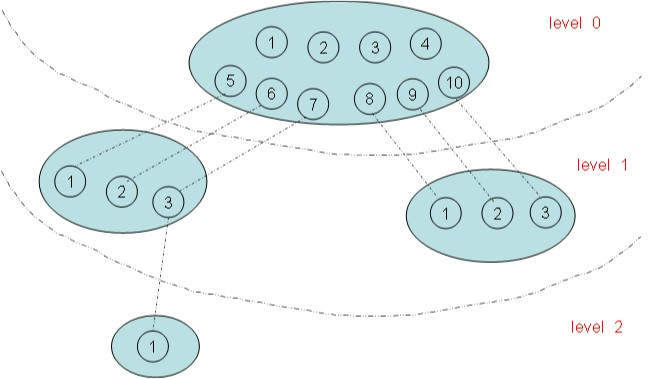
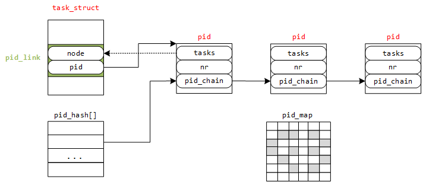
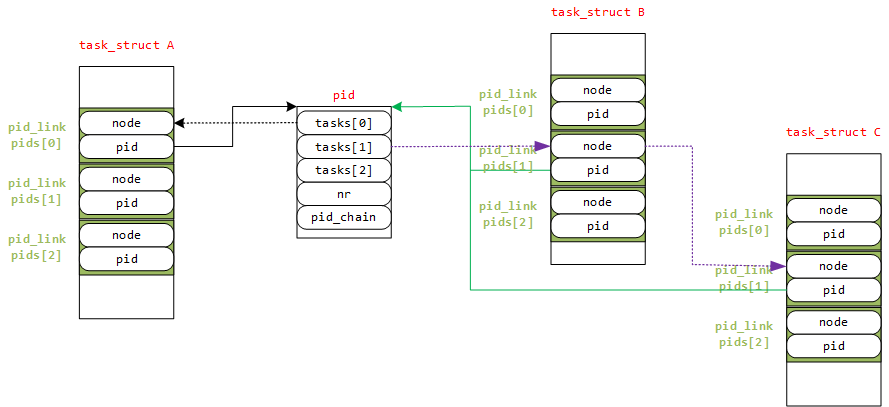

<!-- @import "[TOC]" {cmd="toc" depthFrom=1 depthTo=6 orderedList=false} -->

<!-- code_chunk_output -->

- [进程 ID 概述](#进程-id-概述)
  - [进程 ID 类型](#进程-id-类型)
  - [1.2 PID 命名空间](#12-pid-命名空间)
    - [1.2.1 pid 命名空间概述](#121-pid-命名空间概述)
    - [1.2.2 局部 ID 和全局 ID](#122-局部-id-和全局-id)
    - [1.2.3 PID 命名空间数据结构 pid\_namespace](#123-pid-命名空间数据结构-pid_namespace)
- [2 pid 结构描述](#2-pid-结构描述)
  - [2.1 pid 与 upid](#21-pid-与-upid)
  - [2.2 pidmap 用于分配 pid 的位图](#22-pidmap-用于分配-pid-的位图)
  - [2.3 pid\_link 哈希表存储](#23-pid_link-哈希表存储)
  - [2.4 task\_struct 中的进程 ID 相关描述符信息](#24-task_struct-中的进程-id-相关描述符信息)
- [3 内核是如何设计 task\_struct 中进程 ID 相关数据结构的](#3-内核是如何设计-task_struct-中进程-id-相关数据结构的)
  - [3.1 一个 PID 对应一个 task 时的 task\_struct 设计](#31-一个-pid-对应一个-task-时的-task_struct-设计)
  - [3.2 如何快速地根据局部 ID、命名空间、ID 类型找到对应进程的 task\_struct](#32-如何快速地根据局部-id-命名空间-id-类型找到对应进程的-task_struct)
  - [3.3 如何快速地给新进程在可见的命名空间内分配一个唯一的 PID](#33-如何快速地给新进程在可见的命名空间内分配一个唯一的-pid)
  - [3.4 带进程 ID 类型的 task\_struct 设计](#34-带进程-id-类型的-task_struct-设计)
  - [3.5 进一步增加进程 PID 命名空间的 task\_struct 设计](#35-进一步增加进程-pid-命名空间的-task_struct-设计)
- [4 进程 ID 管理函数](#4-进程-id-管理函数)
  - [4.1 pid 号到 struct pid 实体](#41-pid-号到-struct-pid-实体)
  - [4.2 获得局部 ID](#42-获得局部-id)
  - [4.3 根据 PID 查找进程 task\_struct](#43-根据-pid-查找进程-task_struct)
  - [4.4 生成唯一的 PID](#44-生成唯一的-pid)

<!-- /code_chunk_output -->

Linux 内核使用 task\_struct 数据结构来关联所有与进程有关的数据和结构, Linux 内核所有涉及到进程和程序的所有算法都是围绕该数据结构建立的, 是内核中最重要的数据结构之一.

该数据结构在内核文件[include/linux/sched.h](http://lxr.free-electrons.com/source/include/linux/sched.h#L1389)中定义, 在目前最新的 Linux-4.5(截至目前的日期为 2016-05-11)的内核中, 该数据结构足足有 380 行之多, 在这里我不可能逐项去描述其表示的含义, 本篇文章只关注该数据结构如何来组织和管理进程 ID 的.

# 进程 ID 概述

## 进程 ID 类型

要想了解内核如何来组织和管理进程 ID, 先要知道**进程 ID 的类型**:

内核中进程 ID 的类型用[pid\_type](http://lxr.free-electrons.com/source/include/linux/pid.h#L6)来描述,它被定义在[include/linux/pid.h](http://lxr.free-electrons.com/source/include/linux/pid.h)中

```c
[include/linux/pid.h]
enum pid_type
{
    PIDTYPE_PID,
    PIDTYPE_PGID,
    PIDTYPE_SID,
    PIDTYPE_MAX
};
```

之所以**不包括线程组 ID**, 是因为内核中已经有指向到**线程组**的**task\_struct**指针**group\_leader**, 线程组 ID 无非就是**group\_leader 的 PID**.

- **PID**   内核唯一区分**每个进程的标识**

pid 是 Linux 中在其**命名空间**中**唯一标识进程**而分配给它的一个号码, 称做**进程 ID 号, 简称 PID**. 在使用 fork 或 clone 系统调用时产生的进程均会由内核分配一个新的唯一的 PID 值

这个 pid 用于内核唯一的区分每个进程

>注意它并不是我们用户空间通过 getpid()所获取到的那个进程号, 至于原因么, 接着往下看

- **TGID**  **线程组(轻量级进程组**)的 ID 标识

在一个进程中, 如果以**CLONE\_THREAD 标志**来调用 clone 建立的进程就是**该进程的一个线程**(即**轻量级进程**, Linux 其实**没有严格的线程概念**), 它们处于一个线程组,

该**线程组的所有线程的 ID 叫做 TGID**. 处于相同的线程组中的所有进程都有相同的 TGID, 但是由于他们是不同的进程, 因此其 pid 各不相同; **线程组组长(也叫主线程**)的 TGID 与其 PID 相同; 一个**进程没有使用线程**, 则其 TGID 与 PID 也**相同**.

- **PGID**    **进程组**的 ID 标识

另外, **独立的进程可以组成进程组**(使用**setpgrp 系统调用**), 进程组可以简化向所有组内进程发送信号的操作

例如**用管道连接的进程处在同一进程组内**. 进程组 ID 叫做 PGID, 进程组内的所有进程都有相同的 PGID, 等于**该组组长的 PID**.

- **SID**     **会话组**的 ID 标识

**几个进程组**可以合并成**一个会话组**(使用**setsid 系统调用**), 可以用于终端程序设计. 会话组中所有进程都有相同的 SID,保存在**task\_struct 的 session**成员中

## 1.2 PID 命名空间

### 1.2.1 pid 命名空间概述

**命名空间**是为**操作系统层面的虚拟化机制**提供支撑, 目前实现的有**六种不同的命名空间**, 分别为**mount 命名空间、UTS 命名空间、IPC 命名空间、用户命名空间、PID 命名空间、网络命名空间**. 命名空间简单来说提供的是对**全局资源的一种抽象**, 将资源放到不同的容器中(不同的命名空间), 各容器彼此隔离.

命名空间**有的**还有**层次关系**, 如**PID 命名空间**

PID 命名空间的层次关系图:



在上图有四个命名空间, 一个父命名空间衍生了两个子命名空间, 其中的一个子命名空间又衍生了一个子命名空间. 以 PID 命名空间为例, 由于各个命名空间彼此隔离, 所以每个命名空间都可以有 PID 号为 1 的进程; 但又由于命名空间的层次性, 父命名空间是知道子命名空间的存在, 因此子命名空间要映射到父命名空间中去, 因此上图中 level 1 中两个子命名空间的六个进程分别映射到其父命名空间的 PID 号 5\~10.

### 1.2.2 局部 ID 和全局 ID

命名空间增加了**PID 管理的复杂性**.

回想一下, PID 命名空间按**层次组织**. 在建立一个新的命名空间时, **子命名空间中的所有 PID**对**父命名空间都是可见**的, 但子命名空间无法看到父命名空间的 PID. 但这意味着某些进程具有多个 PID, 凡可以看到该进程的命名空间, 都会为其分配一个 PID. 这必须反映在数据结构中. 我们必须区分**局部 ID**和**全局 ID**

- **全局 ID**    在内核本身和**初始命名空间中唯一的 ID(初始命名空间中！！！**), 在系统启动期间开始的 init 进程即属于该初始命名空间. 系统中**每个进程**都对应了该命名空间的一个**PID**, 叫**全局 ID**, 保证在整个系统中唯一.

- **局部 ID**    对于属于**某个特定的命名空间**, 它在其命名空间内分配的 ID 为局部 ID, 该 ID 也可以出现在其他的命名空间中.

**全局 PID 和全局 TGID**直接保存在 task\_struct 中, 分别是 task\_struct 的**pid 和 tgid 成员**:

```c
<sched.h>
struct task_struct
{
    pid_t pid;
    pid_t tgid;
}
```

两项都是**pid\_t 类型**, 该**类型定义为\_\_kernel\_pid\_t**, 后者由**各个体系结构分别定义**. 通常定义为 int, 即可以同时使用 232 个不同的 ID.

**会话 session 和进程 group 组 ID**不是直接包含在 task\_struct 本身中, 但保存在**用于信号处理的结构**中.

- **task\_struct->signal->\_\_session**表示**全局 SID**,

- 而**全局 PGID**则保存在**task\_struct->signal->\_\_pgrp**.

辅助函数**set\_task\_session**和**set\_task\_pgrp**可用于修改这些值.

除了这两个字段之外, 内核还需要找一个办法来管理所有**命名空间内部的局部量**, 以及其他 ID(如 TID 和 SID). 这需要几个相互连接的数据结构, 以及许多辅助函数, 并将在下文讨论.

下文我将使用 ID 指代提到的任何进程 ID. 在必要的情况下, 我会明确地说明 ID 类型(例如, TGID, 即线程组 ID).

一个**小型的子系统**称之为**PID 分配器(pid allocator**)用于加速新 ID 的分配. 此外, 内核需要提供辅助函数, 以实现通过 ID 及其类型查找进程的 task\_struct 的功能, 以及将 ID 的内核表示形式和用户空间可见的数值进行转换的功能.

### 1.2.3 PID 命名空间数据结构 pid\_namespace

在介绍表示 ID 本身所需的数据结构之前, 我需要讨论**PID 命名空间的表示方式**. 我们所需查看的代码如下所示:

[pid\_namespace](http://lxr.free-electrons.com/source/include/linux/pid_namespace.h#L24)的定义在[include/linux/pid\_namespace.h](http://lxr.free-electrons.com/source/include/linux/pid_namespace.h#L24)中

命名空间的结构如下

```c
struct pid_namespace
{
    struct kref kref;
    struct pidmap pidmap[PIDMAP_ENTRIES];
    int last_pid;
    struct task_struct *child_reaper;
    struct kmem_cache *pid_cachep;
    unsigned int level;
    struct pid_namespace *parent;
};
```

>我们这里只关心其中的 child\_reaper, level 和 parent 这三个字段

| 字段| 描述 |
| ------------- |:-------------|
| kref | 表示**指向 pid\_namespace 的个数** |
| pidmap | pidmap 结构体表示**分配 pid 的位图**. 当需要分配一个新的 pid 时只需查找位图, 找到**bit 为 0 的位置并置 1**, 然后**更新统计数据域**(nr\_free) |
| last\_pid | 用于 pidmap 的分配. 指向最后一个分配的 pid 的位置. (不是特别确定)|
| child\_reaper | 指向的是**当前命名空间的 init 进程**, 每个命名空间都有一个作用相当于全局 init 进程的进程 |
| pid\_cachep | 域指向**分配 pid 的 slab 的地址**. |
| level | 代表**当前命名空间的等级**, **初始命名空间的 level 为 0**, 它的子命名空间 level 为 1, 依次递增, 而且子命名空间对父命名空间是可见的. 从**给定的 level**设置, 内核即可推断**进程会关联到多少个 ID**. |
| parent | 指向**父命名空间的指针** |


实际上 PID 分配器也需要依靠该结构的某些部分来连续生成唯一 ID, 但我们目前对此无需关注. 我们上述代码中给出的下列成员更感兴趣.

**每个 PID 命名空间都具有一个进程**, 其发挥的作用**相当于全局的 init 进程**. init 的一个目的是**对孤儿进程调用 wait4**, 命名空间**局部的 init 变体**也必须完成该工作.

# 2 pid 结构描述

## 2.1 pid 与 upid

**PID 的管理**围绕两个数据结构展开:

- struct pid 是**内核对 PID 的内部表示**

- struct upid 则表示**特定的命名空间中可见**的信息.

两个结构的定义在[include/linux/pid.h](include/linux/pid.h)中

```c
struct upid
{
    /* Try to keep pid_chain in the same cacheline as nr for find_vpid */
    int nr;
    struct pid_namespace *ns;
    struct hlist_node pid_chain;
};
```

struct upid 是一个**特定 namespace**里面的进程的信息,包含该 namespace 里面进程具体 ID 号,namespace 指针,哈希列表指针.

| 字段| 描述 |
| ------------- |:-------------|
| nr | 表示**在该命名空间所分配的进程 ID 具体的值** |
| ns | 指向**命名空间的指针** |
| pid\_chain | 指向**PID 哈希列表的指针**, 用于**关联对应的 PID** |

**所有的 upid 实例**都保存在一个**散列表**中, 稍后我们会看到该结构.

```c
[include/linux/pid.h]
struct pid
{
    atomic_t count;
    /* 使用该 pid 的进程的列表  */
    struct hlist_head tasks[PIDTYPE_MAX];
    int level;
    struct upid numbers[1];
};
```

srtuct pid 是**局部 ID 类**,对应一个

| 字段| 描述 |
| ------------- |:-------------|
| count | 是指**使用该 PID 的 task 的数目**; |
| level | 表示可以看到**该 PID 的命名空间的数目**, 也就是包含该进程的命名空间的深度 |
| tasks[PIDTYPE\_MAX] | 是一个**数组**, 每个**数组项**都是一个**散列表头**,分别对应以下三种类型
| numbers[1] | 一个**upid**的**实例数组**, 每个数组项代表一个**命名空间**, 用来表示**一个 PID**可以属于**不同的命名空间**, 该元素放在末尾, **可以向数组添加附加的项**. |

tasks 是一个数组, **每个数组项**都是一个**散列表头**, 对应于一个 ID 类型, PIDTYPE\_PID,PIDTYPE\_PGID,PIDTYPE\_SID(PIDTYPE\_MAX 表示**ID 类型的数目**)这样做是必要的, 因为**一个 ID 可能用于几个进程(task\_struct)！！！**. 所有**共享同一 ID**的**task\_struct 实例**, 都**通过该列表连接起来(这个列表就是使用这个 pid 的进程<task\_struct>的列表！！！**). 这个枚举常量 PIDTYPE\_MAX, 正好是 pid\_type 类型的数目, 这里 linux 内核使用了一个小技巧来由编译器来自动生成 id 类型的数目

此外, 还有两个结构我们需要说明, 就是 pidmap 和 pid\_link

- pidmap 当需要分配一个新的 pid 时查找可使用 pid 的位图

- 而 pid\_link 则是 pid 的哈希表存储结构

## 2.2 pidmap 用于分配 pid 的位图

```c
struct pidmap
{
 atomic_t nr_free;
 void *page;
};
```

| 字段| 描述 |
| ------------- |:-------------:|
| nr\_free | 表示**还能分配的 pid 的数量** |
| page | 指向的是**存放 pid 的物理页** |

pidmap[PIDMAP\_ENTRIES]域表示该 pid\_namespace 下 pid 已分配情况

## 2.3 pid\_link 哈希表存储

task\_struct 中的 pids[PIDTYPE\_MAX]指向了**和该 task\_struct 相关的 pid 结构体**.

pid\_link 的定义如下

```c
struct pid_link
{
    struct hlist_node node;
    struct pid *pid;
};
```

## 2.4 task\_struct 中的进程 ID 相关描述符信息

```c
struct task_struct
{
    //...
    pid_t pid;
    pid_t tgid;
    struct task_struct *group_leader;
    struct pid_link pids[PIDTYPE_MAX];
    struct nsproxy *nsproxy;
    //...
};
```
| 字段| 描述 |
| ------------- |:-------------|
| pid | 指该进程的**进程描述符**. 在**fork 函数**中对其进行**赋值**的 |
| tgid | 指该进程的**线程描述符**. 在 linux 内核中对线程并没有做特殊的处理, 还是由 task\_struct 来管理. 所以从内核的角度看,  **用户态的线程本质上还是一个进程**. 对于**同一个进程**(用户态角度)中不同的线程其 tgid 是相同的, 但是 pid 各不相同.  **主线程即 group\_leader**(主线程会创建其他所有的子线程). 如果是单线程进程(用户态角度), 它的 pid 等于 tgid. |
| group\_leader | 除了在**多线程的模式下指向主线程**, 还有一个用处, 当一些**进程组成一个群组**时(**PIDTYPE\_PGID**),  该域指向该**群组的 leader** |
| pids | pids[0]是 PIDTYPE\_PID 类型的,指向自己的 PID 结构, 其余指向了**相应群组的 leader 的 PID 结构**,也就是组长的 PID 结构 |
| nsproxy | 指针指向**namespace 相关的域**, 通过 nsproxy 域可以知道**该 task\_struct 属于哪个 pid\_namespace** |

对于用户态程序来说, 调用**getpid**()函数其实返回的是**tgid**, 因此线程组中的进程 id 应该是是一致的, 但是他们 pid 不一致, 这也是内核区分他们的标识

1. **多个 task\_struct**可以共用**一个 PID**

2. **一个 PID**可以属于**不同的命名空间**

3. 当需要**分配一个新的 pid**时候, 只需要查找**pidmap 位图**即可

那么最终, linux 下进程命名空间和进程的关系结构如下:


可以看到, **多个 task\_struct**指向**一个 PID**, 同时 PID 的 hash 数组里安装不同的类型对 task 进行散列, 并且一个 PID 会属于多个命名空间.

# 3 内核是如何设计 task\_struct 中进程 ID 相关数据结构的

>本部内容较多的采用了[Linux 内核进程管理之进程 ID](http://www.cnblogs.com/hazir/p/linux_kernel_pid.html)

Linux 内核在设计管理 ID 的数据结构时, 要充分考虑以下因素:

1. 如何快速地根据**进程的 task\_struct**、**ID 类型**、**命名空间**找到**局部 ID**

2. 如何快速地根据**局部 ID**、**命名空间**、**ID 类型**找到对应**进程的 task\_struct**

3. 如何快速地给**新进程**在可见的**命名空间内**分配一个**唯一的 PID**

如果将所有因素(主要是**进程的 task\_struct,ID 类型,命名空间,局部 ID,唯一 ID**这 5 个因素)考虑到一起, 将会很复杂, 下面将会**由简到繁设计该结构**.

## 3.1 一个 PID 对应一个 task 时的 task\_struct 设计

一个 PID 对应一个 task\_struct 如果先**不考虑进程之间的关系**, **不考虑命名空间**, 仅仅是**一个 PID 号对应一个 task\_struct(一对一情况)**, 那么我们可以设计这样的数据结构

```c
struct task_struct
{
    //...
    struct pid_link pids;
    //...
};

struct pid_link
{
    struct hlist_node node;
    struct pid *pid;
};

struct pid
{
    struct hlist_head tasks;     //指回 pid_link 的 node
    int nr;                      //PID
    struct hlist_node pid_chain; //pid hash 散列表结点
};
```
每个进程的 task\_struct 结构体中有**一个指向 pid 结构体的指针(一对一情况下 1 个就够了！！！**), pid 结构体包含了 PID 号.

结构示意图如图



## 3.2 如何快速地根据局部 ID、命名空间、ID 类型找到对应进程的 task\_struct

图中还有两个结构上面未提及:

- pid\_hash[]

这是一个**hash 表**的结构, **根据 pid 的 nr 值哈希到其某个表项**, 若有**多个 pid**结构对应到**同一个表项**, 这里**解决冲突**使用的是**散列表法**.

这样, 就能解决开始提出的第 2 个问题了, 根据**PID 值**怎样快速地找到**task\_struct**结构体:

1. 首先通过 PID 计算 pid 挂接到**哈希表 pid\_hash[]的表项**

2. **遍历该表项**,找到**pid 结构体(实际是 upid 结构体**)中**nr 值**与**PID 值相同**的那个 pid

3. 再通过该 pid 结构体的**tasks 指针**找到**node**(一对一情况下,直接将 task 指回 pid\_link 的 node 就行)

4. 最后根据内核的 container\_of 机制就能找到 task\_struct 结构体

## 3.3 如何快速地给新进程在可见的命名空间内分配一个唯一的 PID

- pid\_map

这是一个位图, 用来**唯一分配 PID 值的结构**, 图中灰色表示已经分配过的值, 在新建一个进程时, 只需在其中找到一个为分配过的值赋给 pid 结构体的 nr, 再将 pid\_map 中该值设为已分配标志. 这也就解决了上面的**第 3 个问题——如何快速地分配一个全局的 PID**

至于上面的**第 1 个问题*就更加简单, 已知 task\_struct 结构体, 根据其 pid\_link 的 pid 指针找到 pid 结构体, 取出其 nr 即为 PID 号.

## 3.4 带进程 ID 类型的 task\_struct 设计

如果考虑进程之间有复杂的关系, 如**线程组、进程组、会话组, 这些组均有组 ID**, 分别为 TGID、PGID、SID, 所以原来的 task\_struct 中**pid\_link 指向一个 pid 结构体需要增加几项**, 用来指向到**其组长的 pid 结构体**, 相应的**struct pid**原本只需要指回其 PID 所属进程的 task\_struct, 现在要增加几项, 用来链接那些以**该 pid 为组长的所有进程组内进程**. 数据结构如下:

>定义在 http://lxr.free-electrons.com/source/include/linux/sched.h#L1389

```c
enum pid_type
{
    PIDTYPE_PID,
    PIDTYPE_PGID,
    PIDTYPE_SID,
    PIDTYPE_MAX
};

struct task_struct
{
    pid_t pid; //PID
    pid_t tgid; //thread group id
    struct task_struct *group_leader; // threadgroup leader
    struct pid_link pids[PIDTYPE_MAX];
    struct nsproxy *nsproxy;
};

struct pid_link
{
    struct hlist_node node;
    struct pid *pid;
};

struct pid
{
    struct hlist_head tasks[PIDTYPE_MAX];
    int nr; //PID
    struct hlist_node pid_chain; // pid hash 散列表结点
};

struct pid_link
{
    struct hlist_node node;
    struct pid *pid;
};
```

上面 ID 的类型 PIDTYPE\_MAX 表示**ID 类型数目**. 之所以**不包括线程组 ID**, 是因为内核中已经有指向到**线程组**的**task\_struct**指针**group\_leader**, 线程组 ID 无非就是**group\_leader 的 PID**.

假如现在有三个进程 A、B、C 为同一个**进程组**, 进程**组长为 A**, 这样的结构示意图如图

增加 ID 类型的结构:



关于上图有几点需要说明:

- 图中省去了 pid\_hash 以及 pid\_map 结构, 因为第一种情况类似;

- 三个进程 A,B,C.所以有三个 task\_struct 结构体. **task\_struct A 的 pids[0]指向 pid**,因为**pids[0]就是 PID 的类型 0 对应的是 PIDTYPE\_PID,表明 pids[0]指向的 pid 就是 task\_struct A 的 PID,而不是进程组或者会话组的组长的 pid 结构！！！**所以图中的结构体 pid 是进程 A 的 pid

- 进程 B 和 C 的**进程组组长为 A(进程组组长！！！**), 那么**进程 B 和进程 C 结构 task\_struct**中的 pids[**PIDTYPE\_PGID(进程组)**]的 pid 指针指向**进程 A 的 pid 结构体**,如图; 进程 B 和进程 C 的 pids[PIDTYPE\_PID]会指向自己的 pid 结构体,图中没有体现而已

- 进程 A 是进程 B 和 C 的组长, **进程 A 的 pid 结构体**的**tasks[PIDTYPE\_PGID(进程组**)](tasks[1])是一个**散列表的头**, 它将所有**以该 pid 为组长的进程链接起来**,图中的结构体 pid 是进程 A 的 PID,而**A 是组长**,B 和 C 是**进程组**的组员,所以将 A 的 pid 中 tasks[PIDTYPE\_PGID]指向进程 B 的 task\_struct 中的 pid\_link[PIDTYPE\_PGID]中的 node.

再次回顾本节的三个基本问题, 在此结构上也很好去实现.

## 3.5 进一步增加进程 PID 命名空间的 task\_struct 设计

若在第二种情形下再**增加 PID 命名空间**

**一个进程**就可能有**多个 PID**(**意味着一个 task\_struct 会对应多个 upid???**)值了, 因为在**每一个可见的命名空间**内都会**分配一个 PID**, 这样就需要改变 pid 的结构了, 如下:

```c
enum pid_type
{
    PIDTYPE_PID,
    PIDTYPE_PGID,
    PIDTYPE_SID,
    PIDTYPE_MAX
};

struct task_struct
{
    pid_t pid; //PID
    pid_t tgid; //thread group id
    struct task_struct *group_leader; // threadgroup leader
    struct pid_link pids[PIDTYPE_MAX];
    struct list_head thread_group;
    struct list_head thread_node;
    struct nsproxy *nsproxy;
};

struct pid_link
{
    struct hlist_node node;
    struct pid *pid;
};

struct pid
{
    unsigned int level;
    /* 使用该 pid 的进程的列表,  lists of tasks that use this pid  */
    struct hlist_head tasks[PIDTYPE_MAX];
    struct upid numbers[1];
};

struct upid
{
    int nr;
    struct pid_namespace *ns;
    struct hlist_node pid_chain;
};
```

在 pid 结构体中增加了一个表示该**进程所处的命名空间的层次 level**, 以及一个**可扩展的 upid 结构体**.

对于 struct upid, nr 表示在**该命名空间**所分配的**进程的 ID**, ns 指向是该 ID 所属的命名空间, **pid\_chain 表示在该命名空间的散列表**.

- 进程的结构体是 task\_struct,**一个进程对应一个 task\_struct 结构体(一对一**).**一个进程**会有**PIDTYPE\_MAX 个(3 个)pid\_link 结构体(一对多**),这**三个结构体中的 pid**分别指向1)该进程对应的**进程本身(PIDTYPE\_PID**)的真实的 pid 结构体();2)该进程的**进程组(PIDTYPE\_PGID)的组长本身**的 pid 结构体;3)该进程的**会话组(PIDTYPE\_SID)的组长**本身的 pid 结构体,所以**一个真实的进程只会有一个自身真实的 pid 结构体**; **thread\_group**指向的是该线程所在**线程组的链表头**; thread\_node 是**线程组中的结点**.
- 这三个 pid\_link 结构体里面有个哈希节点 node,因为进程组、会话组等的存在,这个**node 用来链接同一个组的进程 task\_struct**,指向的是 task\_struct 中的 pid\_link 的 node
- pid 结构体(不是一个 ID 号)代表**一个真实的进程(某个组的组长的 pid 也是这个结构体,因为组长也是真实的进程,也就有相应的真实的 pid 结构体,而组长身份是通过 task\_struct 引的**),所以里面会有1)**该进程真实所处命名空间的 level**;2)**PIDTYPE\_MAX 个(3 个)散列表头**,tasks[PIDTYPE\_PID]指向自身进程(因为 PIDTYPE\_PID 是 PID 类型),如果该进程是进程组组长,那么 tasks[PIDTYPE\_PGID]就是这个散列表的表头,指向下一个进程的相应组变量 pids[PIDTYPE\_PGID]的 node,如果该进程是会话组组长,那么 tasks[PIDTYPE\_SID]就是这个散列表的表头,指向下一个进程的相应组变量 pids[PIDTYPE\_SID]的 node;3)由于一个进程可能会呈现在多个 pid 命名空间,所以有该进程在其他命名空间中的信息结构体 upid 的数组,每个数组项代表一个
- 结构体 upid 的数组 number[1],**数组项个数取决于该进程 pid 的 level 值**,**每个数组项代表一个命名空间**,这个就是用来一个 PID 可以属于不同的命名空间,nr 值表示该进程在该命名空间的 pid 值,ns 指向该信息所在的命名空间,pid\_chain 属于哈希表的节点.系统有一个 pid\_hash[],通过 pid 在某个命名空间的 nr 值哈希到某个表项,如果多个 nr 值哈希到同一个表项,将其加入链表,这个节点就是 upid 的 pid\_chain

遍历线程所在线程组的所有线程函数 while\_each\_thread(p, t)使用了:

```c
static inline struct task_struct *next_thread(const struct task_struct *p)
{
 return list_entry_rcu(p->thread_group.next,
         struct task_struct, thread_group);
}

#define while_each_thread(g, t) \
 while ((t = next_thread(t)) != g)
```

扫描同一个**进程组**的可以, 扫描与 current\->pids\[PIDTYPE\_PGID\](这是进程组组长 pid 结构体)对应的 PIDTYPE\_PGID 类型的散列表(因为是进程组组长,所以其真实的 pid 结构体中 tasks[PIDTYPE\_PGID]是这个散列表的表头)中的每个 PID 链表

举例来说, 在**level 2**的**某个命名空间**上新建了一个进程, 分配给它的**pid 为 45**, 映射到**level 1 的命名空间**, 分配给它的**pid 为 134**; 再映射到**level 0 的命名空间**, 分配给它的**pid 为 289**, 对于这样的例子, 如图所示为其表示:

增加 PID 命名空间之后的结构图:


图中关于**如何分配唯一的 PID 没有画出**, 但也是比较简单, 与前面两种情形不同的是, 这里分配唯一的 PID 是有命名空间的容器的, 在**PID 命名空间内必须唯一**, 但各个命名空间之间不需要唯一.

至此, 已经与 Linux 内核中数据结构相差不多了.

# 4 进程 ID 管理函数

有了上面的复杂的数据结构, 再加上散列表等数据结构的操作, 就可以写出我们前面所提到的三个问题的函数了

## 4.1 pid 号到 struct pid 实体

很多时候在写内核模块的时候, 需要通过**进程的 pid 找到对应进程的 task\_struct**, 其中首先就需要通过**进程的 pid 找到进程的 struct pid**, 然后再**通过 struct pid 找到进程的 task\_struct**

我知道的实现函数有三个.

```c
//通过 pid 值找到进程的 struct pid 实体
struct pid *find_pid_ns(int nr, struct pid_namespace *ns)
struct pid *find_vpid(int nr)
struct pid *find_get_pid(pid_t nr)
```

find\_pid\_ns 获得 pid 实体的实现原理, **主要使用哈希查找**. 内核使用**哈希表组织 struct pid**, 每创建一个**新进程**, 给进程的 struct pid 都会**插入到哈希表**中, 这时候就需要使用进程的**进程 pid**和 pid 命名空间 ns 在哈希表中将相对应的 struct pid 索引出来, 现在可以看下 find\_pid\_ns 的传入参数, 也是通过 nr 和 ns 找到 struct pid.

根据**局部 PID**以及**命名空间**计算在**pid\_hash 数组中的索引**, 然后**遍历散列表**找到**所要的 upid**, 再根据内核的 container\_of 机制找到 pid 实例.

代码如下:

```c
struct pid *find_pid_ns(int nr, struct pid_namespace *ns)
{
        struct hlist_node *elem;
        struct upid *pnr;
        //遍历散列表
        hlist_for_each_entry_rcu(pnr, elem,
                        &pid_hash[pid_hashfn(nr, ns)], pid_chain)  //pid_hashfn() 获得 hash 的索引
                if (pnr->nr == nr && pnr->ns == ns) ////比较 nr 与 ns 是否都相同
                        return container_of(pnr, struct pid,  //根据 container_of 机制取得 pid 实体
                                        numbers[ns->level]);

        return NULL;
}
```

而另外两个函数则是对其进行进一步的封装, 如下

```c
struct pid *find_vpid(int nr)
{
        return find_pid_ns(nr, current->nsproxy->pid_ns);
}
struct pid *find_get_pid(pid_t nr)
{
        struct pid *pid;

        rcu_read_lock();
        pid = get_pid(find_vpid(nr));
        rcu_read_unlock();

        return pid;
}
```

三者之间的调用关系如下


由图可以看出, find_pid_ns 是最终的实现, find_vpid 是使用 find_pid_ns
实现的, find_get_pid 又是由 find_vpid 实现的.

由原代码可以看出 find_vpid 和 find_pid_ns 是一样的, 而 find_get_pid 和 find_vpid 有一点差异, 就是使用 find_get_pid 将返回的 struct pid 中的字段 count 加 1, 而 find_vpid 没有加 1.

## 4.2 获得局部 ID

根据进程的 task\_struct、ID 类型、命名空间, 可以很容易获得其在命名空间内的局部 ID

获得与 task\_struct 关联的 pid 结构体. 辅助函数有 task\_pid、task\_tgid、task\_pgrp 和 task\_session, 分别用来获取不同类型的 ID 的 pid 实例, 如获取 PID 的实例:

```c
static inline struct pid *task_pid(struct task_struct *task)
{
 return task->pids[PIDTYPE_PID].pid;
}
```

获取线程组的 ID, 前面也说过, TGID 不过是线程组组长的 PID 而已, 所以:
```c
static inline struct pid *task_tgid(struct task_struct *task)
{
 return task->group_leader->pids[PIDTYPE_PID].pid;
}
```

而获得 PGID 和 SID, 首先需要找到该线程组组长的 task\_struct, 再获得其相应的 pid:

```c
static inline struct pid *task_pgrp(struct task_struct *task)
{
 return task->group_leader->pids[PIDTYPE_PGID].pid;
}

static inline struct pid *task_session(struct task_struct *task)
{
 return task->group_leader->pids[PIDTYPE_SID].pid;
}
```

获得 pid 实例之后, 再根据 pid 中的 numbers 数组中 uid 信息, 获得局部 PID.

```c
pid_t pid_nr_ns(struct pid *pid, struct pid_namespace *ns)
{
 struct upid *upid;
 pid_t nr = 0;
 if (pid && ns->level <= pid->level)
    {
  upid = &pid->numbers[ns->level];
  if (upid->ns == ns)
   nr = upid->nr;
 }
 return nr;
}
```

这里值得注意的是, 由于 PID 命名空间的层次性, 父命名空间能看到子命名空间的内容, 反之则不能, 因此, 函数中需要确保当前命名空间的 level 小于等于产生局部 PID 的命名空间的 level.

除了这个函数之外, 内核还封装了其他函数用来从 pid 实例获得 PID 值, 如 pid\_nr、pid\_vnr 等. 在此不介绍了.

结合这两步, 内核提供了更进一步的封装, 提供以下函数:

```c
pid_t task_pid_nr_ns(struct task_struct *tsk, struct pid_namespace *ns);
pid_t task_tgid_nr_ns(struct task_struct *tsk, struct pid_namespace *ns);
pid_t task_pigd_nr_ns(struct task_struct *tsk, struct pid_namespace *ns);
pid_t task_session_nr_ns(struct task_struct *tsk, struct pid_namespace *ns);
```
从函数名上就能推断函数的功能, 其实不外于封装了上面的两步.

## 4.3 根据 PID 查找进程 task\_struct

- 根据 PID 号(nr 值)取得 task\_struct 结构体

- 根据 PID 以及其类型(即为局部 ID 和命名空间)获取 task\_struct 结构体

如果根据的是**进程的 ID 号**, 我们可以先通过 ID 号(nr 值)获取到进程 struct pid 实体(局部 ID), 然后根据局部 ID、以及命名空间, 获得进程的 task\_struct 结构体

可以使用 pid\_task()根据 pid 和 pid\_type 获取到进程的 task\_struct

```c
struct task_struct *pid_task(struct pid *pid, enum pid_type type)
{
 struct task_struct *result = NULL;
 if (pid) {
  struct hlist_node *first;
  first = rcu_dereference_check(hlist_first_rcu(&pid->tasks[type]),
  lockdep_tasklist_lock_is_held());
  if (first)
   result = hlist_entry(first, struct task_struct, pids[(type)].node);
 }

 return result;
}
```

那么我们根据 pid 号查找进程 task 的过程就成为
```c
pTask = pid_task(find_vpid(pid), PIDTYPE_PID);
```

内核还提供其它函数用来实现上面两步:

```c
struct task_struct *find_task_by_pid_ns(pid_t nr, struct pid_namespace *ns);
struct task_struct *find_task_by_vpid(pid_t vnr);
struct task_struct *find_task_by_pid(pid_t vnr);
```

>由于 linux 进程是组织在双向链表和红黑树中的, 因此我们通过遍历链表或者树也可以找到当前进程, 但是这个并不是我们今天的重点

## 4.4 生成唯一的 PID

内核中使用下面两个函数来实现**分配和回收 PID**的:

```c
static int alloc_pidmap(struct pid_namespace *pid_ns);
static void free_pidmap(struct upid *upid);
```

在这里我们不关注这两个函数的实现, 反而应该关注分配的 PID 如何在多个命名空间中可见, 这样需要在每个命名空间生成一个局部 ID, 函数 alloc\_pid 为新建的进程分配 PID, 简化版如下:

```c
struct pid *alloc_pid(struct pid_namespace *ns)
{
 struct pid *pid;
 enum pid_type type;
 int i, nr;
 struct pid_namespace *tmp;
 struct upid *upid;
 tmp = ns;
 pid->level = ns->level;
 // 初始化 pid->numbers[] 结构体
 for (i = ns->level; i >= 0; i--)
    {
  nr = alloc_pidmap(tmp); //分配一个局部 ID
  pid->numbers[i].nr = nr;
  pid->numbers[i].ns = tmp;
  tmp = tmp->parent;
 }
 // 初始化 pid->task[] 结构体
 for (type = 0; type < PIDTYPE_MAX; ++type)
  INIT_HLIST_HEAD(&pid->tasks[type]);

    // 将每个命名空间经过哈希之后加入到散列表中
 upid = pid->numbers + ns->level;
 for ( ; upid >= pid->numbers; --upid)
    {
  hlist_add_head_rcu(&upid->pid_chain, &pid_hash[pid_hashfn(upid->nr, upid->ns)]);
     upid->ns->nr_hashed++;
 }
    return pid;
}
```