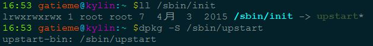
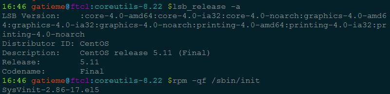
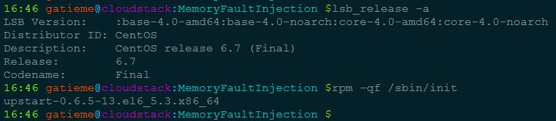
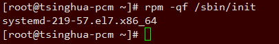

<!-- @import "[TOC]" {cmd="toc" depthFrom=1 depthTo=6 orderedList=false} -->

<!-- code_chunk_output -->

- [1 号进程](#1-号进程)
  - [kernel_init](#kernel_init)
  - [init 进程](#init-进程)
  - [关于 init 程序](#关于-init-程序)
- [附录](#附录)
  - [kernel_init_freeable 流程分析](#kernel_init_freeable-流程分析)
  - [kernel_init 分析](#kernel_init-分析)

<!-- /code_chunk_output -->

我们下面就详解分析 1 号进程的前世(kernel\_init)今生(init 进程)

Linux 系统中的 init 进程(pid=1)是除了 idle 进程(pid=0, 也就是 init\_task)之外另一个比较特殊的进程, 它是 Linux 内核开始建立起进程概念时第一个通过 kernel\_thread 产生的进程, 其开始在内核态执行, 然后通过一个系统调用, 开始执行用户空间的/sbin/init 程序, 期间 Linux 内核也经历了从内核态到用户态的特权级转变, /sbin/init 极有可能产生出了 shell, 然后所有的用户进程都有该进程派生出来

# 1 号进程

前面我们了解到了 0 号进程是系统所有进程的先祖,它的进程描述符 init\_task 是内核静态创建的,而它在进行初始化的时候,通过 kernel\_thread 的方式创建了两个内核线程, 分别是 kernel\_init 和 kthreadd, 其中 kernel\_init 进程号为 1

start\_kernel 在其最后一个函数 rest\_init 的调用中, 会通过**kernel\_thread 来生成一个内核进程**, 后者则会在新进程环境下**调用 kernel\_init**函数, kernel\_init 一个让人感兴趣的地方在于它会调用**run\_init\_process**来**执行根文件系统下的/sbin/init 等程序**:

## kernel_init

0 号进程创建 1 号进程的方式如下

```c
kernel_thread(kernel_init, NULL, CLONE_FS);
```

我们发现 1 号进程的**执行函数就是 kernel\_init**,这个函数被定义[init/main.c](http://lxr.free-electrons.com/source/init/main.c?v=4.5#L932)中, 如下所示

kernel\_init 函数将完成**设备驱动程序的初始化**, 并调用**init\_post**函数启动**用户空间的 init 进程**.

由 0 号进程创建**1 号进程(内核态**), **1 号内核线程**负责执行**内核的部分初始化**工作及进行**系统配置**, 并创建**若干**个用于**高速缓存**和**虚拟主存管理**的**内核线程**.

## init 进程

随后, **1 号进程**调用**do\_execve**运行**可执行程序 init**, 并**演变成用户态 1 号进程**, 即**init 进程**.

init 进程是**linux 内核启动的第一个用户级进程**. init 有许多很重要的任务, 比如像**启动 getty(用于用户登录)、实现运行级别、以及处理孤立进程**.

它**按照配置文件/etc/initab**的要求, 完成**系统启动工作**, **创建编号为 1 号、2 号...的若干终端注册进程 getty**.

**每个 getty 进程**设置**其进程组标识号**, 并**监视配置到系统终端的接口线路**. 当检测到**来自终端的连接信号**时, **getty 进程**将通过函数**do\_execve()执行注册程序 login**, 此时用户就可输入注册名和密码进入登录过程, 如果成功, 由**login 程序**再通过函数**execv()执行 shell**, 该**shell 进程**接收**getty 进程的 pid**, **取代原来的 getty 进程**. 再由**shell 直接或间接地产生其他进程**.

上述过程可描述为: **0 号进程->1 号内核进程->1 号用户进程(init 进程)->getty 进程->shell 进程**

注意, 上述过程描述中提到: 1 号内核进程调用执行**init 函数**并演变成 1 号用户态进程(**init 进程**), 这里前者是 init 是函数, 后者是进程. 两者容易混淆, 区别如下:

1. **kernel\_init 函数在内核态运行**, 是**内核代码**

2. init 进程是内核启动并运行的**第一个用户进程**, 运行在**用户态**下.

3. **一号内核进程**调用 execve()从文件/etc/inittab 中加载**可执行程序 init**并执行, 这个过程**并没有使用调用 do\_fork**(), 因此**两个进程都是 1 号进程**.

当**内核启动了自己**之后(已被装入内存、已经开始运行、已经初始化了所有的设备驱动程序和数据结构等等), 通过**启动用户级程序 init**来**完成引导进程的内核部分**. 因此, init 总是第一个进程(它的进程号总是 1).

当 init 开始运行, 它通过执行一些**管理任务来结束引导进程**, 例如检查文件系统、清理/tmp、启动各种服务以及**为每个终端和虚拟控制台启动 getty**, 在这些地方用户将登录系统.

在**系统完全起来之后**, init 为**每个用户已退出的终端重启 getty(这样下一个用户就可以登录**). **init**同样也**收集孤立的进程**: 当一个进程启动了一个子进程并且在子进程之前终止了, 这个子进程立刻成为 init 的子进程. 对于各种技术方面的原因来说这是很重要的, 知道这些也是有好处的, 因为这便于理解进程列表和进程树图. **init 的变种**很少. 绝大多数 Linux 发行版本使用**sysinit**(由 Miguel van Smoorenburg 著), 它是**基于 System V 的 init 设计**. UNIX 的 BSD 版本有一个不同的 init. **最主要的不同在于运行级别**: System V 有而 BSD 没有(至少是传统上说). 这种区别并不是主要的. 在此我们仅讨论**sysvinit**.  配置 init 以启动 getty: /etc/inittab 文件

## 关于 init 程序

**1 号进程**通过**execve 执行 init 程序**来进入**用户空间**, 成为**init 进程**, 那么**这个 init 在哪里**呢

内核在几个位置上来查寻 init, 这几个位置以前常用来放置 init, 但是 init 的最适当的位置(在 Linux 系统上)**是/sbin/init**. 如果内核没有找到 init, 它就会**试着运行/bin/sh**, 如果还是失败了, 那么系统的启动就宣告失败了.

因此**init 程序**是一个**可以由用户编写的进程(！！！**), 如果希望看 init 程序源码的朋友, 可以参见

| init 包 | 说明 | 学习链接 |
| ------------- |:-------------|:-------------|
| sysvinit | 早期一些版本使用的初始化进程工具, 目前在逐渐淡出 linux 历史舞台, sysvinit 就是 system V 风格的 init 系统, 顾名思义, 它源于 System V 系列 UNIX. 它提供了比 BSD 风格 init 系统更高的灵活性. 是已经风行了几十年的 UNIX init 系统, 一直被各类 Linux 发行版所采用. | [浅析 Linux 初始化 init 系统(1): sysvinit](http://blog.jobbole.com/85076)
| [upstart](http://upstart.ubuntu.com/index.html) | debian, Ubuntu 等系统使用的 initdaemon | [浅析 Linux 初始化 init 系统(2):  UpStart](http://blog.jobbole.com/85107/) |
| systemd | Systemd 是 Linux 系统中**最新的初始化系统(init**), 它主要的设计目标是克服 sysvinit 固有的缺点, 提高系统的启动速度 | [浅析 Linux 初始化 init 系统(3) Systemd](http://blog.jobbole.com/85070/)

Ubuntu 等使用 deb 包的系统可以通过 dpkg -S 查看程序所在的包



CentOS 等使用 rpm 包的系统可以通过 rpm -qf 查看系统程序所在的包







>参见
>
>[ Linux 下查看并下载命令源码包(根据命令/应用程序逆向获取并且安装其所属源码包)](http://blog.csdn.net/gatieme/article/details/51353648)

# 附录

## kernel_init_freeable 流程分析

```c
static noinline void __init kernel_init_freeable(void)
{
    /*
     * Wait until kthreadd is all set-up.
     */
    wait_for_completion(&kthreadd_done);

    /* Now the scheduler is fully set up and can do blocking allocations */
    gfp_allowed_mask = __GFP_BITS_MASK;

    /*
     * init can allocate pages on any node
     */
    set_mems_allowed(node_states[N_MEMORY]);
    /*
     * init can run on any cpu.
     */
    set_cpus_allowed_ptr(current, cpu_all_mask);

    cad_pid = task_pid(current);

    smp_prepare_cpus(setup_max_cpus);

    do_pre_smp_initcalls();
    lockup_detector_init();

    smp_init();
    sched_init_smp();

    page_alloc_init_late();

    do_basic_setup();

    /* Open the /dev/console on the rootfs, this should never fail */
    if (sys_open((const char __user *) "/dev/console", O_RDWR, 0) < 0)
            pr_err("Warning: unable to open an initial console.\n");

    (void) sys_dup(0);
    (void) sys_dup(0);
    /*
     * check if there is an early userspace init.  If yes, let it do all
     * the work
     */

    if (!ramdisk_execute_command)
            ramdisk_execute_command = "/init";

    if (sys_access((const char __user *) ramdisk_execute_command, 0) != 0) {
            ramdisk_execute_command = NULL;
            prepare_namespace();
    }

    /*
     * Ok, we have completed the initial bootup, and
     * we're essentially up and running. Get rid of the
     * initmem segments and start the user-mode stuff..
     *
     * rootfs is available now, try loading the public keys
     * and default modules
     */

    integrity_load_keys();
    load_default_modules();
 }
```

| 执行流程 | 说明 |
| ------------- |:-------------|
| wait\_for\_completion | 实例在 kernel/sched/completion.c 中, **等待 Kernel Thread kthreadd (PID=2)创建完毕** |
| gfp\_allowed\_mask| \_\_GFP\_BITS\_MASK;设置 bitmask, 使得 init 进程可以使用 PM 并且允许 I/O 阻塞操作 |
| set\_mems\_allowed(node\_states[N\_MEMORY]); | **init 进程可以分配物理页面** |
| set\_cpus\_allowed\_ptr | 通过设置 cpu\_bit\_mask, 可以限定 task 只能在特定的处理器上运行, 而 initcurrent 进程此时必然是 init 进程, 设置其 cpu\_all\_mask 即使得 init 进程可以在任意的 cpu 上运行 |
| task\_pid | 设置到目前运行进程 init 的 pid 号给[cad\_pid](http://lxr.free-electrons.com/source/kernel/reboot.c?v=4.5#L24)(cad\_pid 是用来接收`ctrl-alt-del` reboot signal 的进程, 如果设置[C\_A\_D=1](http://lxr.free-electrons.com/source/kernel/reboot.c?v=4.5#L24)就表示可以处理来自`ctl-alt-del`的动作), 最后会调用[ctrl\_alt\_del(void)](http://lxr.free-electrons.com/source/kernel/reboot.c?v=4.5#L379)并确认 C\_A\_D 是否为 1,确认完成后将执行 cad\_work=[deferred\_cad](http://lxr.free-electrons.com/source/kernel/reboot.c?v=4.5#L369),执行[kernel\_restart](http://lxr.free-electrons.com/source/kernel/reboot.c?v=4.5#L214) |
| smp\_prepare\_cpus |体系结构相关的函数, 实例在 arch/arm/kernel/smp.c 中,调用 smp\_prepare\_cpus 时,会以全局变量 setup\_max\_cpus 为函式参数 max\_cpus,以表示在编译核心时,设定支援的最大 CPU 数量 |
| do\_pre\_smp\_initcalls| 实例在[init/main.c](http://lxr.free-electrons.com/source/init/main.c?v=4.5#L889)中,会透过函式 do\_one\_initcall,执行 Symbol 中 \_\_initcall\_start 与\_\_early\_initcall\_end 之间的函数 |
| smp\_init | 实例在 kernel/smp.c 中, 函数主要是由 Bootstrap 处理器,进行 Active 多核心架构下其它的处理器. 如果发生 Online 的处理器个数(from num\_online\_cpus)超过在核心编译时,所设定的最大处理器个数 setup\_max\_cpus (from NR\_CPUS),就会终止流程.如果该处理器目前属於 Present (也就是存在系统中),但尚未是 Online 的状态,就会呼叫函式 cpu\_up(in kernel/cpu.c)来啟动该处理器.|
| sched\_init\_smp | 实例在 kernel/sched.c 中, (1), 呼叫 get\_online\_cpus,如果目前 CPU Hotplug Active Write 行程是自己,就直接返回.反之就把 cpu\_hotplug.refcount 加 1 (表示多一个 Reader)<br> (2),取得 Mutex Lock "sched\_domains\_mutex"<br>(3),呼叫 arch\_init\_sched\_domains,设定 scheduler domains 与 groups,参考 Linux Documentation/scheduler/sched-domains.txt 文件,一个 Scheduling Domain 会包含一个或多个 CPU Groups,排程的 Load-Balance 就会根据 Domain 中的 Groups 来做调整.<br>(4),释放 Mutex Lock "sched\_domains\_mutex"<br>(5),呼叫 put\_online\_cpus,如果目前 CPU Hotplug Active Writer 行程是自己,就直接返回.反之就把 cpu\_hotplug.refcount 减 1,如果 cpu\_hotplug.refcount 减到為 0,表示没有其他 Reader,此时如果有 CPU Hotplug Active Writer 行程在等待,就会透过 wake\_up\_process 唤醒该行程,以便让等待中的 Writer 可以被执行下去.(也可以参考\_cpu\_up 中对於函式 cpu\_hotplug\_begin 的说明).<br>(6)注册 CPU Notifier cpuset\_cpu\_active/cpuset\_cpu\_inactive/update\_runtime <br>(7),呼叫 set\_cpus\_allowed\_ptr,透过这函式可以设定 CPU bitmask,限定 Task 只能在特定的处理器上运作.在这会用参数"non\_isolated\_cpus",也就是会把 init 指定给 non\-isolated CPU. Linux Kernel 可以在啟动时,透过 Boot Parameters "isolcpus="指定 CPU 编号或是范围,让这些处理器不被包含在 Linux Kernel SMP balancing/scheduling 算法内,可以在啟动后指派给特定的 Task 运作.而不在 "isolcpus=" 指定范围内的处理器就算是 non-isolated CPU.<br>(8),呼叫 sched\_init\_granularity,透过函式 update\_sysctl,让 sysctl\_sched\_min\_granularity=normalized\_sysctl\_sched\_min\_granularity,sysctl\_sched\_latency=normalized\_sysctl\_sched\_latency,sysctl\_sched\_wakeup\_granularity=normalized\_sysctl\_sched\_wakeup\_granularit|
| do\_basic\_setup | 实例在 init/main.c 中,<br>1,diaousermodehelper\_init (in kernel/kmod.c),产生 khelper workqueue.<br>2,调用 init\_tmpfs (in mm/shmem.c),对 VFS 注册 Temp FileSystem.<br>3,呼叫 driver\_init (in drivers/base/init.c),初始化 Linux Kernel Driver System Model.<br>4,呼叫 init\_irq\_proc(in kernel/irq/proc.c),初始化 "/proc/irq"与其下的 File Nodes.<br>5,呼叫 do\_ctors (in init/main.c),执行位於 Symbol \_\_ctors\_start 到 \_\_ctors\_end 间属於 Section  ".ctors" 的 Constructor 函式.<br>6,透过函式 do\_initcalls,执行介於 Symbol  \_\_early\_initcall\_end 与\_\_initcall\_end 之间的函式呼叫,<br> |
| sys\_open| 实例在 fs/fcntl.c 中,"SYSCALL\_DEFINE1(dup, unsigned int, fildes)",在这会连续执行两次 sys\_dup,复制两个 sys\_open 开啟/dev/console 所產生的档案描述 0 (也就是会多生出两个 1 与 2),只是都对应到"/dev/console",我们在 System V streams 下的 Standard Stream 一般而言会有如下的对应<br>0:Standard input (stdin)<br>1:Standard output (stdout)<br>2:Standard error (stderr)<br>(為方便大家参考,附上 Wiki URL http://en.wikipedia.org/wiki/Standard_streams ) |
|ramdisk\_execute\_command 与 prepare\_namespace | 1,如果 ramdisk\_execute\_command 為 0,就设定 ramdisk\_execute\_command = "/init"<br>2,如果 sys\_access 确认档案 ramdisk\_execute\_command 失败,就把 ramdisk\_execute\_command 设定為 0,然后呼叫 prepare_namespace 去 mount root FileSystem. |
| integrity\_load\_keys | 至此我们初始化工作完成, 文件系统也已经准备好了, 那么接下来加载 load integrity keys hook |
| load\_default\_modules | 加载基本的模块 |

## kernel_init 分析

```c
static int __ref kernel_init(void *unused)
{
    int ret;

    kernel_init_freeable();
    /* need to finish all async __init code before freeing the memory */
    async_synchronize_full();
    free_initmem();
    mark_rodata_ro();
    system_state = SYSTEM_RUNNING;
    numa_default_policy();

    flush_delayed_fput();

    rcu_end_inkernel_boot();

    if (ramdisk_execute_command) {
            ret = run_init_process(ramdisk_execute_command);
            if (!ret)
                    return 0;
            pr_err("Failed to execute %s (error %d)\n",
                   ramdisk_execute_command, ret);
    }

    /*
     * We try each of these until one succeeds.
     *
     * The Bourne shell can be used instead of init if we are
     * trying to recover a really broken machine.
     */
    if (execute_command) {
            ret = run_init_process(execute_command);
            if (!ret)
                    return 0;
            panic("Requested init %s failed (error %d).",
                  execute_command, ret);
    }
    if (!try_to_run_init_process("/sbin/init") ||
        !try_to_run_init_process("/etc/init") ||
        !try_to_run_init_process("/bin/init") ||
        !try_to_run_init_process("/bin/sh"))
            return 0;

    panic("No working init found.  Try passing init= option to kernel. "
          "See Linux Documentation/init.txt for guidance.");
}
```

| 执行流程 | 说明 |
| ------ |:-----|
| **kernel\_init\_freeable** | 调用 kernel\_init\_freeable 完成**初始化工作**, 准备**文件系统**, 准备**模块信息** |
| **async\_synchronize\_full** | 用以同步所有非同步函式呼叫的执行,在这函数中会等待 List async\_running 与 async_pending 都清空后,才会返回. Asynchronously called functions 主要设计用来**加速 Linux Kernel 开机的效率**,避免在开机流程中等待硬体反应延迟,影响到开机完成的时间 |
| free\_initmem| free\_initmem(in arch/arm/mm/init.c),释放 Linux Kernel 介于\_\_init\_begin 到 \_\_init\_end 属于 init Section 的函数的所有内存.并会把 Page 个数加到变量 totalram\_pages 中,作为后续 Linux Kernel 在配置记忆体时可以使用的 Pages. (在这也可把 TCM 范围(\_\_tcm\_start 到\_\_tcm\_end)释放加入到总 Page 中,但 TCM 比外部记忆体有效率,适合多媒体,中断,...etc 等对效能要求高的执行需求,放到总 Page 中,成为可供一般目的配置的存储范围 |
| system\_state | **设置运行状态 SYSTEM_RUNNING** |
| 加载 init 进程, 进入用户空间 | a,如果 ramdisk\_execute\_command 不為 0,就执行该命令成為 init User Process.<br>b,如果 execute\_command 不為 0,就执行该命令成為 init User Process.<br>c,如果上述都不成立,就依序執行如下指令<br>run\_init\_process("/sbin/init");<br>run\_init\_process("/etc/init");<br>run\_init\_process("/bin/init");<br>run\_init\_process("/bin/sh");<br>也就是说会按照顺序从/sbin/init, /etc/init, /bin/init 與 /bin/sh 依序执行第一个 init User Process.<br> 如果都找不到可以執行的 init Process,就會進入 Kernel Panic.如下所示 panic("No init found.  Try passing init= option to kernel. ""See Linux Documentation/init.txt for guidance."); |