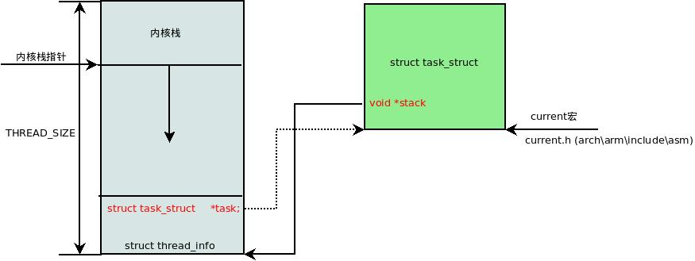

<!-- @import "[TOC]" {cmd="toc" depthFrom=1 depthTo=6 orderedList=false} -->

<!-- code_chunk_output -->

* [1 前言](#1-前言)
 * [1.1 为什么需要内核栈](#11-为什么需要内核栈)
 * [1.2 为什么需要thread\_info](#12-为什么需要thread_info)
 * [1.3 将两种结构融合在一起](#13-将两种结构融合在一起)
* [2 内核数据结构描述](#2-内核数据结构描述)
 * [2.1 thread\_union](#21-thread_union)
 * [2.2 task\_struct中的内核栈stack](#22-task_struct中的内核栈stack)
 * [2.3 内核栈数据结构描述thread\_info](#23-内核栈数据结构描述thread_info)
* [3 函数接口](#3-函数接口)
 * [3.1 内核栈与thread\_info的通用操作](#31-内核栈与thread_info的通用操作)
 * [3.2 获取当前在CPU上正在运行进程的thread\_info](#32-获取当前在cpu上正在运行进程的thread_info)
 * [3.3 分配和销毁thread\_info](#33-分配和销毁thread_info)

<!-- /code_chunk_output -->

# 1 前言

## 1.1 为什么需要内核栈

- **进程**在**内核态运行**时需要自己的**堆栈信息**,因此linux内核为**每个进程(！！！**)都提供了一个**内核栈kernel stack(这里的stack就是这个进程在内核态的堆栈信息！！！**),

```c
struct task_struct
{
    // ...
    void *stack;    // 指向内核栈的指针
    // ...
};
```

**内核态的进程**访问处于**内核数据段的栈**, 这个栈不同于**用户态的进程所用的栈**.

**用户态进程**所用的栈, 是在**进程线性地址空间**中;

而**内核栈**是当**进程**从**用户空间**进入**内核空间**时, **特权级发生变化**, 需要**切换堆栈**, 那么内核空间中使用的就是这个内核栈. 因为**内核控制路径**使用**很少的栈空间**, 所以只需要**几千个字节的内核态堆栈**.

>需要注意的是, **内核态堆栈**仅用于**内核例程(用户进程或线程也是需要的吧??**), Linux内核另外为中断提供了单独的**硬中断栈**和**软中断栈**

## 1.2 为什么需要thread\_info

**内核**还需要存储**每个进程**的**PCB信息**,linux内核是**支持不同体系**的,但是**不同的体系结构**可能进程需要存储的**信息不尽相同**,这就需要我们实现一种**通用的方式**,我们将**体系结构相关**的部分和**无关**的部分进行**分离**

用一种**通用的方式**来描述进程, 这就是**struct task\_struct**, 而**thread\_info**就保存了**特定体系结构**的**汇编代码段**需要**访问的那部分进程的数据**, 我们在thread\_info中嵌入指向task\_struct的指针, 则我们可以很方便的**通过thread\_info**来**查找task\_struct**

## 1.3 将两种结构融合在一起

linux将**内核栈**和**进程控制块thread\_info(PCB信息！！！**)融合在一起,组成一个**联合体thread\_union**

通常内核栈和thread\_info一同保存在一个联合体中,thread\_info保存了线程所需的所有特定处理器的信息, 以及通用的task\_struct的指针

# 2 内核数据结构描述

## 2.1 thread\_union

对**每个进程**, Linux内核都把两个不同的数据结构紧凑的存放在一个**单独为进程分配的内存区域**中:

- 一个是**内核态**的**进程堆栈stack**

- 另一个是紧挨着进程描述符的**小数据结构thread\_info**, 叫做**线程描述符**

这两个结构被紧凑的放在一个联合体中thread\_union中,
```c
union thread_union
{
 struct thread_info thread_info;
 unsigned long stack[THREAD_SIZE/sizeof(long)];
};
```

这块区域**32位**上通常是**8K=8192(占两个页框**), **64位上通常是16K**,其实**地址必须是8192的整数倍**.

| 架构 | THREAD_SIZE |
| ------------- |:-------------:|
| x86 | [arch/x86/include/asm/page_32_types.h, line 21](http://lxr.free-electrons.com/source/arch/x86/include/asm/page_32_types.h?v=4.5#L21) |
| x86\_64 | [arch/x86/include/asm/page_64_types.h, line 11](http://lxr.free-electrons.com/source/arch/x86/include/asm/page_64_types.h?v=4.5#L11) |
| arm | [arch/arm/include/asm/thread_info.h, line 20](http://lxr.free-electrons.com/source/arch/arm/include/asm/thread_info.h?v=4.5#L20) |
| arm64 | [arch/arm64/include/asm/thread_info.h, line 32](http://lxr.free-electrons.com/source/arch/arm64/include/asm/thread_info.h?v=4.5#L32) |

出于**效率考虑**, 内核让**这8K(或者16K)空间**占据**连续的两个页框**并让**第一个页框的起始地址是213的倍数**.

下图中显示了在**物理内存**中**存放两种数据结构的方式**. **线程描述符(thread\_info**)驻留与这个内存区的开始, 而栈顶末端向下增长. 下图摘自ULK3,进程内核栈与进程描述符的关系如下图:





在这个图中,

- esp寄存器是**CPU栈指针**, 用来存放**栈顶单元的地址**. 在80x86系统中, 栈起始于顶端, 并**朝着这个内存区开始的方向增长**. 从用户态刚切换到内核态以后, 进程的内核栈总是空的. 因此, esp寄存器指向这个栈的顶端. 一旦数据**写入堆栈**, **esp的值就递减**.

同时我们可以看到,

- thread\_info和内核栈虽然共用了thread\_union结构,但是**thread\_info大小固定**,存储在联合体的开始部分,而**内核栈由高地址向低地址扩展**,当**内核栈的栈顶**到达thread\_info的存储空间时,则会发生**栈溢出**

- 系统的**current指针**指向了**当前运行进程的thread\_union(或者thread\_info)的地址**

- 进程**task\_struct**中的**stack指针**指向了**进程的thread\_union(或者thread\_info)的地址**,在早期的内核中这个指针用struct thread\_info *thread\_info来表示, 但是新的内核中用了一个更浅显的名字void *stack,即内核栈

即, 进程的**thread\_info**存储在**进程内核栈的最低端**

## 2.2 task\_struct中的内核栈stack

我们之前在描述task\_struct时就提到了其stack指针指向的是内核栈的地址.

>参见 [ Linux进程描述符task_struct结构体详解--Linux进程的管理与调度(一)](http://blog.csdn.net/gatieme/article/details/51383272#t6)

其被定义在include/linux/sched.h中

>http://lxr.free-electrons.com/source/include/linux/sched.h?v=4.5#L1391

形式如下

```c
struct task_struct
{
    // ...
    void *stack;    //  指向内核栈的指针
    // ...
};
```

在**早期的linux内核**中**进程描述符**中是**不包含内核栈**的,相反包含着指向**thread\_info的指针**

但是在2007年的一次更新(since 2.6.22)中加入了`stack`内核栈指针,替代了原来的`thread_info`的指针

**进程描述符task\_struct**结构中**没有直接指向thread\_info结构的指针**, 而是用一个**void指针类型的成员**表示, 然后通过**类型转换来访问thread\_info结构**.

stack指向了内核栈的地址(其实也就是thread\_info和thread\_union的地址),因为**联合体中stack和thread\_info都在起始地址**, 因此可以很方便的转型

相关代码在[include/linux/sched.h](http://lxr.free-electrons.com/source/include/linux/sched.h?v=4.5#L2812)中

**task\_thread\_info**用于**通过task\_struct**来查找其**thread\_info**的信息,只需要一次指针类型转换即可

```c
#define task_thread_info(task)  ((struct thread_info *)(task)->stack)
```

## 2.3 内核栈数据结构描述thread\_info

**thread\_info**是**体系结构相关**的, 结构的定义在[thread_info.h](http://lxr.free-electrons.com/ident?v=4.5;i=thread_info)中

| 架构 | 定义链接 |
| ------------- |:-------------|
| x86 | [linux-4.5/arch/x86/include/asm/thread_info.h, line 55](http://lxr.free-electrons.com/source/arch/x86/include/asm/thread_info.h?v=4.5#L55) |
| arm | [linux-4.5arch/arm/include/asm/thread_info.h, line 49](http://lxr.free-electrons.com/source/arch/arm/include/asm/thread_info.h#L49)
| arm64 | [linux/4.5/arch/arm64/include/asm/thread_info.h, line 47](http://lxr.free-electrons.com/source/arch/arm64/include/asm/thread_info.h#L47) |

# 3 函数接口

## 3.1 内核栈与thread\_info的通用操作

原则上, 只要设置了**预处理器常数\_\_HAVE\_THREAD\_FUNCTIONS通知内核**,那么**各个体系结构**就可以随意**在stack数组中存储数据**.

在这种情况下, 他们必须自行实现**task\_thread\_info**和**task\_stack\_page**, 这两个函数用于**获取给定task\_struct实例**的**线程信息和内核栈**.

另外, 他们必须实现dup\_task\_struct中调用的函数**setup\_thread\_stack**,以便**确定stack成员的具体内存布局**,当前**只有ia64等**少数架构**不依赖于内核的默认方法**

下标给出了不同架构的task\_thread\_info和task\_stack\_page的实现

| 架构 | 定义链接 |
| ------------- |:-------------:|
| ia64 | [arch/ia64/include/asm/thread_info.h, line 53](http://lxr.free-electrons.com/source/arch/ia64/include/asm/thread_info.h?v=4.5#L53) |
| 通用 | [include/linux/sched.h, line 2812](http://lxr.free-electrons.com/source/include/linux/sched.h?v=4.5#L2812) |

```c
// 未定义__HAVE_THREAD_FUNCTIONS的时候使用内核的默认操作
#ifndef __HAVE_THREAD_FUNCTIONS

//  通过进程的task_struct来获取进程的thread_info
#define task_thread_info(task)  ((struct thread_info *)(task)->stack)
//  通过进程的task_struct来获取进程的内核栈
#define task_stack_page(task)   ((task)->stack)

//  初始化thread_info, 指定其存储结构的内存布局
static inline void setup_thread_stack(struct task_struct *p, struct task_struct *org)
{
    *task_thread_info(p) = *task_thread_info(org);
    task_thread_info(p)->task = p;
}

/*
 * Return the address of the last usable long on the stack.
 *
 * When the stack grows down, this is just above the thread
 * info struct. Going any lower will corrupt the threadinfo.
 *
 * When the stack grows up, this is the highest address.
 * Beyond that position, we corrupt data on the next page.
 */
static inline unsigned long *end_of_stack(struct task_struct *p)
{
#ifdef CONFIG_STACK_GROWSUP
    return (unsigned long *)((unsigned long)task_thread_info(p) + THREAD_SIZE) - 1;
#else
    return (unsigned long *)(task_thread_info(p) + 1);
#endif
}

#endif
```

在内核的某个特定组建使用了**较多的栈空间**时,内核栈会溢出到thread\_info部分,因此内核提供了**kstack\_end**函数来判断给出的**地址**是否位于**栈的有效部分**

```c
#ifndef __HAVE_ARCH_KSTACK_END
static inline int kstack_end(void *addr)
{
    /* Reliable end of stack detection:
     * Some APM bios versions misalign the stack
     */
    return !(((unsigned long)addr+sizeof(void*)-1) & (THREAD_SIZE-sizeof(void*)));
}
#endif
```

>前面我们在讲[_do_fork创建进程](http://blog.csdn.net/gatieme/article/details/51569932)的时候,提到dup\_task\_struct会**复制父进程**的**task\_struct**和**thread\_info**实例的**内容**,但是**stack**则与新的thread\_info实例位于**同一个内存**,这意味着父子进程的task\_struct此时**除了栈指针**之外**完全相同(！！！所有内容相同,栈不是同一个地址,所以该指针值不同,但是thread\_info内容完全相同**).

## 3.2 获取当前在CPU上正在运行进程的thread\_info

**所有的体系结构**都必须实现两个**current**和**current\_thread\_info**的符号定义宏或者函数,

- **current\_thread\_info**可获得**当前执行进程的thread\_info实例指针**,其地址可以根据内核指针来确定, 因为thread\_info总是位于起始位置,

因为**每个进程**都有**自己的内核栈**,因此**进程**到**内核栈**的**映射是唯一的**,那么**指向内核栈的指针**通常保存在一个特别保留的**寄存器**中(多数情况下是**esp**)

- current给出了当前进程进程描述符**task\_struct的地址**, 该地址往往通过current\_thread\_info来确定

```c
current = current_thread_info()->task
```

因此我们的关键就是current\_thread\_info的实现了, 即**如何通过esp栈指针**来获取**当前在CPU上正在运行进程**的**thread\_info**结构.

**早期**的版本中, **不需要对64位处理器**的支持, 所以, 内核通过简单的**屏蔽掉esp的低13位有效位**就可以获得thread\_info结构的基地址了.

我们在下面对比了, 获取**正在运行的进程的thread\_info**的实现方式

| 架构 | 版本 | 定义链接 | 实现方式 | 思路解析 |
| ------------- |:-------------:|:-------------:|:-------------:|:-------------:|
| x86 | [3.14](http://lxr.free-electrons.com/ident?v=3.14;i=current_thread_info)   | [current\_thread\_info(void)](http://lxr.free-electrons.com/source/arch/x86/include/asm/thread_info.h#L164) |return (struct thread_info *)(sp & ~(THREAD_SIZE - 1)); | 屏蔽了esp的低十三位, 最终得到的是thread_info的地址 |
| x86 | [3.15](http://lxr.free-electrons.com/ident?v=3.15;i=current_thread_info) | [current\_thread\_info(void)](http://lxr.free-electrons.com/source/arch/x86/include/asm/thread_info.h?v=3.15#L163) | ti = (void *)(this\_cpu\_read\_stable(kernel\_stack) + KERNEL\_STACK\_OFFSET - THREAD\_SIZE); |
| x86 | [4.1](http://lxr.free-electrons.com/ident?v=4.1&i=current_thread_info) | [current\_thread\_info(void)](http://lxr.free-electrons.com/source/arch/x86/include/asm/thread_info.h?v=4.1#L182) |  (struct thread\_info *)(current\_top\_of\_stack() - THREAD\_SIZE);

>**早期版本**
>
>当前的栈指针(current\_stack\_pointer  == sp)就是esp,
>
>THREAD\_SIZE为8K, 二进制的表示为0000 0000 0000 0000 0010 0000 0000 0000.
>
>\~(THREAD\_SIZE\-1)的结果刚好为1111 1111 1111 1111 1110 0000 0000 0000, 低十三位是全为零, 也就是刚好屏蔽了esp的低十三位, 最终得到的是thread\_info的地址.

进程最常用的是进程描述符结构task\_struct而不是thread\_info结构的地址. 为了获取当前CPU上运行进程的task\_struct结构, 内核提供了current宏, 由于task\_struct *task在thread\_info的起始位置, 该宏本质上等价于current\_thread\_info()->task, 在[include/asm-generic/current.h](http://lxr.free-electrons.com/source/include/asm-generic/current.h?v=4.5#L6)中定义:
```c
#define get_current() (current_thread_info()->task)
#define current get_current()
```

这个定义是体系结构无关的, 当然linux也为各个体系结构定义了更加方便或者快速的current

>>请参见: http://lxr.free-electrons.com/ident?v=4.5;i=current

## 3.3 分配和销毁thread\_info

进程通过[alloc\_thread\_info\_node](http://lxr.free-electrons.com/source/kernel/fork.c?v=4.5;#L161)函数分配它的内核栈, 通过[free_thread_info](http://lxr.free-electrons.com/source/kernel/fork.c?v=4.5#L170)函数释放所分配的内核栈.

```c
# if THREAD_SIZE >= PAGE_SIZE
static struct thread_info *alloc_thread_info_node(struct task_struct *tsk,
                          int node)
{
    struct page *page = alloc_kmem_pages_node(node, THREADINFO_GFP,
                          THREAD_SIZE_ORDER);

    return page ? page_address(page) : NULL;
}

static inline void free_thread_info(struct thread_info *ti)
{
    free_kmem_pages((unsigned long)ti, THREAD_SIZE_ORDER);
}
# else
static struct kmem_cache *thread_info_cache;

static struct thread_info *alloc_thread_info_node(struct task_struct *tsk,
                          int node)
{
    return kmem_cache_alloc_node(thread_info_cache, THREADINFO_GFP, node);
}

static void free_thread_info(struct thread_info *ti)
{
    kmem_cache_free(thread_info_cache, ti);
}
```

其中, [THREAD\_SIZE\_ORDER](http://lxr.free-electrons.com/ident?v=4.5;i=THREAD_SIZE_ORDER)宏的定义请查看

| 架构 | 版本 | 定义链接 | 实现方式 | 思路解析 |
| ------------- |:-------------:|:-------------:|:-------------:|:-------------:|
| x86 | 4.5 | [arch/x86/include/asm/page_32_types.h, line 20](http://lxr.free-electrons.com/source/arch/x86/include/asm/page_32_types.h?v=4.5#L20) | #define THREAD\_SIZE\_ORDER       1 | \_\_get\_free\_pages函数分配2个页的内存(它的首地址是8192字节对齐的)|
| x86\_64 | 4.5 | [arch/x86/include/asm/page_64_types.h, line 10](http://lxr.free-electrons.com/source/arch/x86/include/asm/page_64_types.h?v=4.5#L10)|#define THREAD\_SIZE\_ORDER       (2 + KASAN\_STACK\_ORDER)| |