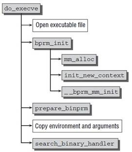

<!-- @import "[TOC]" {cmd="toc" depthFrom=1 depthTo=6 orderedList=false} -->

<!-- code_chunk_output -->

- [1 execve系统调用](#1-execve系统调用)
  - [1.1 execve系统调用](#11-execve系统调用)
  - [1.2 exec()函数族](#12-exec函数族)
- [2 ELF文件格式以及可执行程序的表示](#2-elf文件格式以及可执行程序的表示)
  - [2.1 ELF可执行文件格式](#21-elf可执行文件格式)
  - [2.2 struct linux_binprm结构描述一个可执行程序](#22-struct-linux_binprm结构描述一个可执行程序)
  - [2.3 struct linux\_binfmt可执行格式的结构](#23-struct-linux_binfmt可执行格式的结构)
- [3 execve加载可执行程序的过程](#3-execve加载可执行程序的过程)
  - [3.1 execve的入口函数sys\_execve](#31-execve的入口函数sys_execve)
  - [3.2 do\_execve函数](#32-do_execve函数)
  - [3.3 程序的加载do\_execve\_common和do\_execveat\_common](#33-程序的加载do_execve_common和do_execveat_common)
  - [3.4 exec\_binprm()识别并加载二进程程序](#34-exec_binprm识别并加载二进程程序)
  - [3.5 search\_binary\_handler识别二进程程序](#35-search_binary_handler识别二进程程序)
  - [3.6 load\_binary()加载可执行程序](#36-load_binary加载可执行程序)
- [4 参考](#4-参考)

<!-- /code_chunk_output -->

# 1 execve系统调用

## 1.1 execve系统调用

我们前面提到了, **fork, vfork**等复制出来的进程是**父进程的一个副本**,那么如何我们想**加载新的程序**,可以通过execve来加载和启动新的程序.

>x86架构下, 其实还实现了一个**新的exec的系统调用**叫做**execveat**(自linux-3.19后进入内核)
>
>[syscalls,x86: Add execveat() system call](http://lwn.net/Articles/600344)

## 1.2 exec()函数族

exec函数一共有六个, 其中**execve**为**内核级系统调用**, 其他(**execl**, **execle**, **execlp**, **execv**, **execvp**)都是调用**execve**的库函数.


```c
int execl(const char *path, const char *arg, ...);
int execlp(const char *file, const char *arg, ...);
int execle(const char *path, const char *arg,
                  ..., char * const envp[]);
int execv(const char *path, char *const argv[]);
int execvp(const char *file, char *const argv[]);
```

# 2 ELF文件格式以及可执行程序的表示

## 2.1 ELF可执行文件格式

Linux下标准的可执行文件格式是ELF. ELF(**Executable and Linking Format**)是一种**对象文件的格式**, 用于定义不同类型的对象文件(Object files)中都放了什么东西、以及都以什么样的格式去放这些东西. 它自最早在 System V 系统上出现后, 被xNIX世界所广泛接受, 作为**缺省的二进制文件格式**来使用.

但是linux也支持**其他不同的可执行程序格式**,各个**可执行程序的执行方式不尽相同**,因此linux内核每种被注册的可执行程序格式都用**linux\_binfmt**来存储, 其中记录了**可执行程序的加载和执行函数**

同时我们需要一种方法来**保存可执行程序的信息**,比如可执行文件的路径,运行的参数和环境变量等信息, 即linux\_binprm结构

## 2.2 struct linux_binprm结构描述一个可执行程序

linux\_binprm是定义在[include/linux/binfmts.h](http://lxr.free-electrons.com/source/include/linux/binfmts.h#L14)中, 用来保存**要执行的文件相关的信息**, 包括可执行程序的路径, 参数和环境变量的信息

```c
/*
* This structure is used to hold the arguments that are used when loading binaries.
*/
struct linux_binprm {
    char buf[BINPRM_BUF_SIZE]; // 保存可执行文件的头128字节
#ifdef CONFIG_MMU
    struct vm_area_struct *vma;
    unsigned long vma_pages;
#else
# define MAX_ARG_PAGES  32
    struct page *page[MAX_ARG_PAGES];
#endif
    struct mm_struct *mm;
    unsigned long p; /* current top of mem , 当前内存页最高地址*/
    unsigned int
            cred_prepared:1,/* true if creds already prepared (multiple
                             * preps happen for interpreters) */
            cap_effective:1;/* true if has elevated effective capabilities,
                             * false if not; except for init which inherits
                             * its parent's caps anyway */
#ifdef __alpha__
    unsigned int taso:1;
#endif
    unsigned int recursion_depth; /* only for search_binary_handler() */
    struct file * file;   /*  要执行的文件  */
    struct cred *cred;      /* new credentials */
    int unsafe;             /* how unsafe this exec is (mask of LSM_UNSAFE_*) */
    unsigned int per_clear; /* bits to clear in current->personality */
    int argc, envc;  /*  命令行参数和环境变量数目  */
    // 要执行的文件的名称
    const char * filename;  /* Name of binary as seen by procps */
    //  要执行的文件的真实名称, 通常和filename相同
    const char * interp;    /* Name of the binary really executed. Most
                               of the time same as filename, but could be
                               different for binfmt_{misc,script} */
    unsigned interp_flags;
    unsigned interp_data;
    unsigned long loader, exec;
};
```

## 2.3 struct linux\_binfmt可执行格式的结构

linux支持其他不同格式的可执行程序, 在这种方式下, linux能运行其他操作系统所编译的程序, 如MS-DOS程序, 或BSD Unix的COFF可执行格式, 因此linux内核用**struct linux\_binfmt**来描述**各种可执行程序**.

linux内核对所支持的**每种可执行的程序类型(！！！**)都有个**struct linux\_binfmt的数据结构**, 定义如下

>linux\_binfmt定义在[include/linux/binfmts.h](http://lxr.free-electrons.com/source/include/linux/binfmts.h#L74)中

```c
/*
  * This structure defines the functions that are used to load the binary formats that
  * linux accepts.
  */
struct linux_binfmt {
    struct list_head lh;
    struct module *module;
    int (*load_binary)(struct linux_binprm *);
    int (*load_shlib)(struct file *);
    int (*core_dump)(struct coredump_params *cprm);
    unsigned long min_coredump;     /* minimal dump size */
 };
```

其提供了**3种方法来加载和执行可执行程序**

- **load\_binary**

通过读**存放在可执行文件中的信息**为当前进程**建立一个新的执行环境**

- **load\_shlib**

用于**动态的把一个共享库捆绑到一个已经在运行的进程**, 这是由**uselib()系统调用激活**的

- **core\_dump**

在名为core的文件中, 存放**当前进程的执行上下文**.这个文件通常是在**进程**接收到一个缺省操作为"**dump**"的**信号**时被创建的, 其**格式**取决于**被执行程序的可执行类型**

**所有的linux\_binfmt对象**都处于**一个链表**中,第一个元素的地址存放在**formats变量**中,可以通过**调用register\_binfmt()和unregister\_binfmt()函数**在链表中**插入和删除元素**,在**系统启动期间**,为**每个编译进内核的可执行格式**都执行**registre\_fmt()函数**.当实现了一个新的可执行格式的模块正被装载时,也执行这个函数,当**模块被卸载**时, 执行**unregister\_binfmt()函数**.

>当我们**执行一个可执行程序**的时候,内核会list\_for\_each\_entry**遍历所有注册的linux\_binfmt对象**,对其**调用load\_binrary方法来尝试加载**, 直到加载成功为止.

# 3 execve加载可执行程序的过程

内核中实际执行**execv()或execve()系统调用**的程序是**do\_execve**(), 这个函数**先打开目标映像文件**, 并**从目标文件的头部**(**第一个字节**开始)读入若干(当前Linux内核中是**128)字节**(实际上就是**填充ELF文件头**, 下面的分析可以看到), 然后**调用另一个函数search\_binary\_handler**(), 在此函数里面, 它会**搜索我们上面提到的Linux支持的可执行文件类型队列**, 让各种可执行程序的处理程序前来认领和处理. 如果**类型匹配**, 则**调用load\_binary函数**指针所指向的处理函数来**处理目标映像文件**. 在**ELF文件格式**中, 处理函数是**load\_elf\_binary函数**, 下面主要就是分析load\_elf\_binary函数的执行过程(说明: 因为内核中实际的加载需要涉及到很多东西, 这里**只关注跟ELF文件的处理相关的代码**):

sys\_execve() > do\_execve() > do\_execveat\_common > search\_binary\_handler() > load\_elf\_binary()

## 3.1 execve的入口函数sys\_execve

| 描述 | 定义 | 链接 |
| ------- |:--------|:------|
| **系统调用号(体系结构相关**) | 类似与如下的形式<br>#define \_\_NR\_execve                             117<br>\_\_SYSCALL(117, sys\_execve, 3) | arch/对应体系结构/include/uapi/asm/unistd.h |
| 入口函数声明 |asmlinkage long sys\_execve(const char \_\_user *filename,<br>const char \_\_user *const \_\_user *argv,<br>const char \_\_user *const \_\_user *envp); | include/linux/syscalls.h |
| 系统调用实现 | SYSCALL\_DEFINE3(execve,<br>const char \_\_user *, filename,<br>const char \_\_user *const \_\_user *, argv,<br>const char \_\_user *const \_\_user *, envp)<br>{<br>return do\_execve(getname(filename), argv, envp);<br>} | fs/exec.c |

execve系统调用的的入口点是**体系结构相关的sys\_execve**,该函数很快将工作委托给系统无关的**do\_execve函数**

```c
SYSCALL_DEFINE3(execve,
                const char __user *, filename,
                const char __user *const __user *, argv,
                const char __user *const __user *, envp)
{
    return do_execve(getname(filename), argv, envp);
}
```

通过**参数传递**了**寄存器集合**和**可执行文件的名称(filename**),而且还传递了指向了**程序的参数argv**和**环境变量envp的指针**

| 参数 | 描述 |
| ------------- |:-------------|
| filename | 可执行程序的名称 |
| argv | 程序的参数 |
| envp | 环境变量 |

指向**程序参数argv**和**环境变量envp**两个**数组的指针**以及**数组中所有的指针**都位于**虚拟地址空间**的**用户空间部分**. 因此**内核在访问用户空间内存**时,需要多加小心,而\_\_user注释则允许自动化工具来检测时候所有相关事宜都处理得当

## 3.2 do\_execve函数

do\_execve的定义在**fs/exec.c**中, 参见 http://lxr.free-electrons.com/source/fs/exec.c?v=4.5#L1628

| [更早期实现linux-2.4](http://lxr.free-electrons.com/source/fs/exec.c?v=2.4.37#L936) | [linux\-3.18引入execveat之前do\_execve实现](http://lxr.free-electrons.com/source/fs/exec.c?v=3.18#L1549) | [linux\-3.19\~至今引入execveat之后do\_execve实现](http://lxr.free-electrons.com/source/fs/exec.c?v=4.5#L1628) | [do\_execveat的实现](http://lxr.free-electrons.com/source/fs/exec.c?v=4.5#L1637) |
| ------------- |:-------------|:-------------|:-------------|
| 代码过长, **没有经过do\_execve\_common的封装**| int do\_execve(struct filename *filename,<br>const char \_\_user *const \_\_user *\_\_argv,<br>const char \_\_user *const \_\_user *\_\_envp)<br>{<br>    struct user\_arg\_ptr argv = { .ptr.native = \_\_argv };<br>struct user\_arg\_ptr envp = { .ptr.native = \_\_envp };<br>    return do\_execve\_common(filename, argv, envp, 0);<br>} | int do\_execve(struct filename *filename,<br>    const char \_\_user *const \_\_user *\_\_argv,<br>const char \_\_user *const \_\_user *\_\_envp)<br>{<br>struct user\_arg\_ptr argv = { .ptr.native = \_\_argv };<br>struct user\_arg\_ptr envp = { .ptr.native = \_\_envp };<br>return do\_execveat\_common(AT\_FDCWD, filename, argv, envp, 0);<br>} | int do\_execveat(int fd, struct filename *filename,<br>const char \_\_user *const \_\_user *\_\_argv,<br>const char \_\_user *const \_\_user *\_\_envp,<br>int flags)<br>{<br>struct user\_arg\_ptr argv = { .ptr.native = \_\_argv };<br>struct user\_arg\_ptr envp = { .ptr.native = \_\_envp };<br>return do\_execveat\_common(fd, filename, argv, envp, flags);<br>}<br> |

我们可以看到不同时期的演变,早期的代码**do\_execve**就**直接完成了自己的所有工作**,后来do\_execve会调用更加底层的do\_execve\_common函数,后来**x86架构下引入了新的系统调用execveat**,为了使代码更加通用, do\_execveat\_common替代了原来的do\_execve\_common函数

早期的do\_execve流程如下, 基本无差别, 可以作为参考



## 3.3 程序的加载do\_execve\_common和do\_execveat\_common

>[早期linux-2.4中直接由do\_execve实现程序的加载和运行](http://lxr.free-electrons.com/source/fs/exec.c?v=2.4.37#L936)
>
>[linux-3.18引入execveat之前do\_execve调用**do\_execve\_common**来完成程序的加载和运行](http://lxr.free-electrons.com/source/fs/exec.c?v=3.18#L1427)
>
>[linux-3.19~至今引入execveat之后do\_execve调用**do\_execveat\_common**来完成程序的加载和运行](http://lxr.free-electrons.com/source/fs/exec.c?v=4.5#L1481)

在Linux中提供了一系列的**函数**, 这些函数能用**可执行文件**所描述的**新上下文代替进程的上下文**. 这样的函数名以**前缀exec开始**. **所有的exec函数**都是调用了**execve()系统调用**.

sys\_execve接受参数: 1.**可执行文件的路径**  2.**命令行参数字符串** 3.**环境变量字符串**

sys\_execve是调用**do\_execve实现**的. do\_execve则是调用do\_execveat\_common实现的, 依次执行以下操作:

1. 调用**unshare\_files**()为进程**复制一份文件表**

2. 调用**kzalloc**()在堆上分配一份**struct linux\_binprm结构体**

3. 调用**open\_exec**()查找并打开二进制文件

4. 调用**sched\_exec**()找到**最小负载的CPU**, 用来执行该二进制文件

5. 根据获取的信息, **填充struct linux\_binprm结构体**中的**file**、**filename**、**interp**成员

6. 调用**bprm\_mm\_init**()创建进程的**内存地址空间**, 为**新程序初始化内存管理**.并调用**init\_new\_context**()检查当前进程是否使用**自定义的局部描述符表**; 如果是, 那么**分配和准备一个新的LDT(！！！**)

7. 填充struct linux\_binprm结构体中的**argc**、**envc**成员

8. 调用**prepare\_binprm**()检查该二进制文件的**可执行权限**; 最后, **kernel\_read**()读取二进制文件的**头128字节**(这些字节用于**识别二进制文件的格式及其他信息**, 后续会使用到)

9. 调用**copy\_strings\_kernel**()从**内核空间**获取二进制文件的**路径名称**

10. 调用**copy\_string**()从**用户空间**拷贝**环境变量和命令行参数**

11. 至此, 二进制文件已经被打开, struct linux\_binprm结构体中也记录了重要信息,内核开始**调用exec\_binprm识别该二进制文件的格式并执行可执行程序**

12. 释放linux\_binprm数据结构, 返回从该文件可执行格式的load\_binary中获得的代码

定义在[fs/exec.c](http://lxr.free-electrons.com/source/fs/exec.c#L1481)

```c
/*
 * sys_execve() executes a new program.
 */
static int do_execveat_common(int fd, struct filename *filename,
                          struct user_arg_ptr argv,
                          struct user_arg_ptr envp,
                          int flags)
{
    char *pathbuf = NULL;
    /* 这个结构当然是非常重要的, 下文列出了这个结构体以便查询各个成员变量的意义 */
    struct linux_binprm *bprm;
    struct file *file;
    struct files_struct *displaced;
    int retval;

    if (IS_ERR(filename))
            return PTR_ERR(filename);

    /*
     * We move the actual failure in case of RLIMIT_NPROC excess from
     * set*uid() to execve() because too many poorly written programs
     * don't check setuid() return code.  Here we additionally recheck
     * whether NPROC limit is still exceeded.
     */
    if ((current->flags & PF_NPROC_EXCEEDED) &&
        atomic_read(&current_user()->processes) > rlimit(RLIMIT_NPROC)) {
            retval = -EAGAIN;
            goto out_ret;
    }

    /* We're below the limit (still or again), so we don't want to make
     * further execve() calls fail. */
    current->flags &= ~PF_NPROC_EXCEEDED;

    //  1. 调用unshare_files()为进程复制一份文件表;
    retval = unshare_files(&displaced);
    if (retval)
            goto out_ret;

    retval = -ENOMEM;

    // 2、调用kzalloc()在堆上分配一份structlinux_binprm结构体;
    bprm = kzalloc(sizeof(*bprm), GFP_KERNEL);
    if (!bprm)
            goto out_files;

    retval = prepare_bprm_creds(bprm);
    if (retval)
            goto out_free;

    check_unsafe_exec(bprm);
    current->in_execve = 1;

    // 3、调用open_exec()查找并打开二进制文件;
    file = do_open_execat(fd, filename, flags);
    retval = PTR_ERR(file);
    if (IS_ERR(file))
            goto out_unmark;

 // 4、调用sched_exec()找到最小负载的CPU, 用来执行该二进制文件;
    sched_exec();

    // 5、根据获取的信息, 填充struct linux_binprm结构体中的file、filename、interp成员;
    bprm->file = file;
    if (fd == AT_FDCWD || filename->name[0] == '/') {
            bprm->filename = filename->name;
    } else {
            if (filename->name[0] == '\0')
                    pathbuf = kasprintf(GFP_TEMPORARY, "/dev/fd/%d", fd);
            else
                    pathbuf = kasprintf(GFP_TEMPORARY, "/dev/fd/%d/%s",
                                        fd, filename->name);
            if (!pathbuf) {
                    retval = -ENOMEM;
                    goto out_unmark;
            }
            /*
             * Record that a name derived from an O_CLOEXEC fd will be
             * inaccessible after exec. Relies on having exclusive access to
             * current->files (due to unshare_files above).
             */
            if (close_on_exec(fd, rcu_dereference_raw(current->files->fdt)))
                    bprm->interp_flags |= BINPRM_FLAGS_PATH_INACCESSIBLE;
            bprm->filename = pathbuf;
    }
    bprm->interp = bprm->filename;

    // 6、调用bprm_mm_init()创建进程的内存地址空间,
    // 并调用init_new_context()检查当前进程是否使用自定义的局部描述符表;
    // 如果是, 那么分配和准备一个新的LDT;
    retval = bprm_mm_init(bprm);
    if (retval)
            goto out_unmark;

    // 7、填充structlinux_binprm结构体中的命令行参数argv,环境变量envp
    bprm->argc = count(argv, MAX_ARG_STRINGS);
    if ((retval = bprm->argc) < 0)
            goto out;

    bprm->envc = count(envp, MAX_ARG_STRINGS);
    if ((retval = bprm->envc) < 0)
            goto out;

    // 8、调用prepare_binprm()检查该二进制文件的可执行权限;
    // 最后, kernel_read()读取二进制文件的头128字节(这些字节用于识别二进制文件的格式及其他信息, 后续会使用到);
    retval = prepare_binprm(bprm);
    if (retval < 0)
            goto out;

 // 9、调用copy_strings_kernel()从内核空间获取二进制文件的路径名称;
    retval = copy_strings_kernel(1, &bprm->filename, bprm);
    if (retval < 0)
            goto out;

    bprm->exec = bprm->p;

    // 10.1、调用copy_string()从用户空间拷贝环境变量
    retval = copy_strings(bprm->envc, envp, bprm);
    if (retval < 0)
            goto out;

    // 10.2、调用copy_string()从用户空间拷贝命令行参数;
    retval = copy_strings(bprm->argc, argv, bprm);
    if (retval < 0)
            goto out;
 /*
     至此, 二进制文件已经被打开, struct linux_binprm结构体中也记录了重要信息;

        下面需要识别该二进制文件的格式并最终运行该文件
    */
    retval = exec_binprm(bprm);
    if (retval < 0)
            goto out;

    /* execve succeeded */
    current->fs->in_exec = 0;
    current->in_execve = 0;
    acct_update_integrals(current);
    task_numa_free(current);
    free_bprm(bprm);
    kfree(pathbuf);
    putname(filename);
    if (displaced)
            put_files_struct(displaced);
    return retval;

out:
    if (bprm->mm) {
            acct_arg_size(bprm, 0);
            mmput(bprm->mm);
    }

out_unmark:
    current->fs->in_exec = 0;
    current->in_execve = 0;

out_free:
    free_bprm(bprm);
    kfree(pathbuf);

out_files:
    if (displaced)
            reset_files_struct(displaced);
out_ret:
    putname(filename);
    return retval;
}
```

## 3.4 exec\_binprm()识别并加载二进程程序

**每种格式的二进制文件**对应一个struct **linux\_binprm结构体**, 每种可执行的程序类型都对应一个数据结构struct linux\_binfmt,**load\_binary成员**负责**识别该二进制文件的格式**;

内核使用**链表组织这些struct linux\_binfmt结构体**, **链表头是formats**.

接着do\_execveat\_common()中的exec\_binprm()继续往下看:

调用**search\_binary\_handler**()函数对linux\_binprm的**formats链表进行扫描**, 并**尝试每个load\_binary函数**, 如果成功加载了文件的执行格式, 对formats的扫描终止.


```c
static int exec_binprm(struct linux_binprm *bprm)
{
    pid_t old_pid, old_vpid;
    int ret;

    /* Need to fetch pid before load_binary changes it */
    old_pid = current->pid;
    rcu_read_lock();
    old_vpid = task_pid_nr_ns(current, task_active_pid_ns(current->parent));
    rcu_read_unlock();

    ret = search_binary_handler(bprm);
    if (ret >= 0) {
            audit_bprm(bprm);
            trace_sched_process_exec(current, old_pid, bprm);
            ptrace_event(PTRACE_EVENT_EXEC, old_vpid);
            proc_exec_connector(current);
    }

    return ret;
}
```

## 3.5 search\_binary\_handler识别二进程程序

这里需要说明的是, 这里的fmt变量的类型是struct linux\_binfmt *,但是这一个类型与之前在do\_execveat\_common()中的bprm是**不一样**的,

>定义在[fs/exec.c](http://lxr.free-electrons.com/source/fs/exec.c#L1502)

```c
// include/linux/platform_data/simplefb.h
/* format array, use it to initialize a "struct simplefb_format" array */
#define SIMPLEFB_FORMATS \
{ \
 { "r5g6b5", 16, {11, 5}, {5, 6}, {0, 5}, {0, 0}, DRM_FORMAT_RGB565 }, \
 { "x1r5g5b5", 16, {10, 5}, {5, 5}, {0, 5}, {0, 0}, DRM_FORMAT_XRGB1555 }, \
 { "a1r5g5b5", 16, {10, 5}, {5, 5}, {0, 5}, {15, 1}, DRM_FORMAT_ARGB1555 }, \
 { "r8g8b8", 24, {16, 8}, {8, 8}, {0, 8}, {0, 0}, DRM_FORMAT_RGB888 }, \
 { "x8r8g8b8", 32, {16, 8}, {8, 8}, {0, 8}, {0, 0}, DRM_FORMAT_XRGB8888 }, \
 { "a8r8g8b8", 32, {16, 8}, {8, 8}, {0, 8}, {24, 8}, DRM_FORMAT_ARGB8888 }, \
 { "a8b8g8r8", 32, {0, 8}, {8, 8}, {16, 8}, {24, 8}, DRM_FORMAT_ABGR8888 }, \
 { "x2r10g10b10", 32, {20, 10}, {10, 10}, {0, 10}, {0, 0}, DRM_FORMAT_XRGB2101010 }, \
 { "a2r10g10b10", 32, {20, 10}, {10, 10}, {0, 10}, {30, 2}, DRM_FORMAT_ARGB2101010 }, \
}

// arch/x86/kernel/sysfb_simplefb.c
static const struct simplefb_format formats[] = SIMPLEFB_FORMATS;

// fs/exec.c
/*
 * cycle the list of binary formats handler, until one recognizes the image
 */
int search_binary_handler(struct linux_binprm *bprm)
{
    bool need_retry = IS_ENABLED(CONFIG_MODULES);
    struct linux_binfmt *fmt;
    int retval;

    /* This allows 4 levels of binfmt rewrites before failing hard. */
    if (bprm->recursion_depth > 5)
            return -ELOOP;

    retval = security_bprm_check(bprm);
    if (retval)
            return retval;

    retval = -ENOENT;
 retry:
    read_lock(&binfmt_lock);

    // 遍历formats链表
    list_for_each_entry(fmt, &formats, lh) {
            if (!try_module_get(fmt->module))
                    continue;
            read_unlock(&binfmt_lock);
            bprm->recursion_depth++;

            // 每个尝试load_binary()函数
            retval = fmt->load_binary(bprm);
            read_lock(&binfmt_lock);
            put_binfmt(fmt);
            bprm->recursion_depth--;
            if (retval < 0 && !bprm->mm) {
                    /* we got to flush_old_exec() and failed after it */
                    read_unlock(&binfmt_lock);
                    force_sigsegv(SIGSEGV, current);
                    return retval;
            }
            if (retval != -ENOEXEC || !bprm->file) {
                    read_unlock(&binfmt_lock);
                    return retval;
            }
    }
    read_unlock(&binfmt_lock);

    if (need_retry) {
            if (printable(bprm->buf[0]) && printable(bprm->buf[1]) &&
                printable(bprm->buf[2]) && printable(bprm->buf[3]))
                    return retval;
            if (request_module("binfmt-%04x", *(ushort *)(bprm->buf + 2)) < 0)
                    return retval;
            need_retry = false;
            goto retry;
    }

    return retval;
}
```

## 3.6 load\_binary()加载可执行程序

我们前面提到了,linux内核支持多种可执行程序格式, **每种格式**都被注册为一个**linux\_binfmt结构**, 其中存储了对应可执行程序格式加载函数等

| 格式 | linux\_binfmt定义 | load\_binary  | load\_shlib | core\_dump  |
| ------------- |:-------------|:-------------|:-------------|:-------------|
| a.out | [aout\_format](http://lxr.free-electrons.com/source/fs/binfmt_aout.c#L116) | [load\_aout\_binary](http://lxr.free-electrons.com/source/fs/binfmt_aout.c#L197)|  [load\_aout\_library](http://lxr.free-electrons.com/source/fs/binfmt_aout.c#L197) | [aout\_core\_dump](http://lxr.free-electrons.com/source/fs/binfmt_aout.c#L36) |
| flat style executables | [flat\_format](http://lxr.free-electrons.com/source/fs/binfmt_flat.c#L94)  |[load\_flat\_binary](http://lxr.free-electrons.com/source/fs/binfmt_flat.c#L855) |  [load\_flat\_shared\_library](http://lxr.free-electrons.com/source/fs/binfmt_flat.c#L801) | [flat\_core\_dump](http://lxr.free-electrons.com/source/fs/binfmt_flat.c#L107) |
| script脚本 | [script\_format](http://lxr.free-electrons.com/source/fs/binfmt_script.c#L111) | [load\_script](http://lxr.free-electrons.com/source/fs/binfmt_script.c#L116) | 无 | 无 |
|misc\_format | [misc\_format](http://lxr.free-electrons.com/source/fs/binfmt_misc.c#L806) | [load\_misc\_binary](http://lxr.free-electrons.com/source/fs/binfmt_misc.c#L123) | 无 | 无 |
| em86 | [em86\_format](http://lxr.free-electrons.com/source/fs/binfmt_em86.c#L99) | [load\_format](http://lxr.free-electrons.com/source/fs/binfmt_em86.c#L25) | 无 | 无 |
| elf\_fdpic | [elf\_fdpic\_format](http://lxr.free-electrons.com/source/fs/binfmt_elf_fdpic.c#L84) | [load\_elf\_fdpic\_binary](http://lxr.free-electrons.com/source/fs/binfmt_elf_fdpic.c#L181) | 无 | [elf\_fdpic\_core\_dump](http://lxr.free-electrons.com/source/fs/binfmt_elf_fdpic.c#L1564) |
| elf | [elf\_format](http://lxr.free-electrons.com/source/fs/binfmt_elf.c#L84) | [load\_elf\_binary](http://lxr.free-electrons.com/source/fs/binfmt_elf.c#L667) | [load\_elf\_binary](http://lxr.free-electrons.com/source/fs/binfmt_elf.c#L667) | [elf\_core\_dump](http://lxr.free-electrons.com/source/fs/binfmt_elf.c#L2121)

# 4 参考

[linux可执行文件的加载和运行(转) ](http://blog.chinaunix.net/uid-12127321-id-2957869.html)

[linux上应用程序的执行机制](http://www.cnblogs.com/li-hao/archive/2011/09/24/2189504.html)

[linux可执行文件创建学习笔记](http://blog.csdn.net/titer1/article/details/45008793)