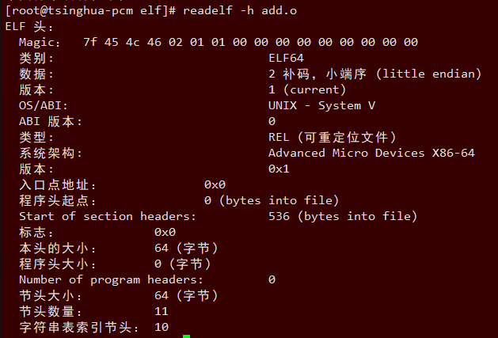
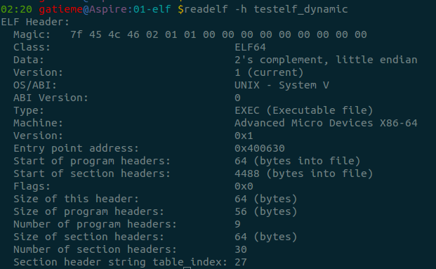
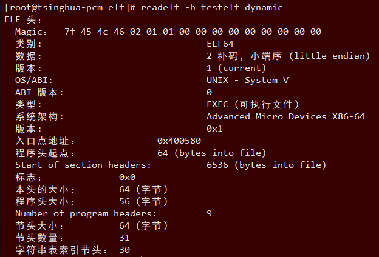
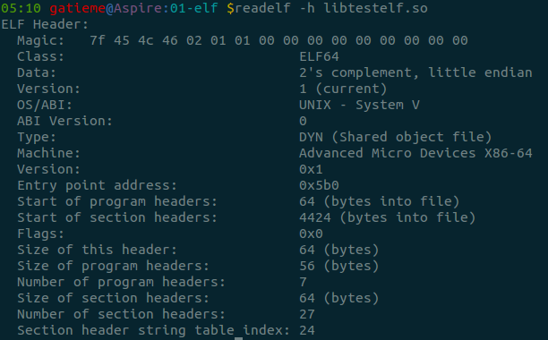
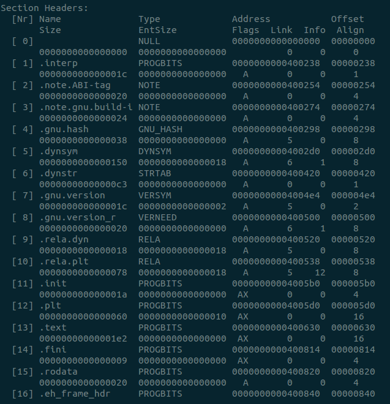
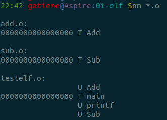
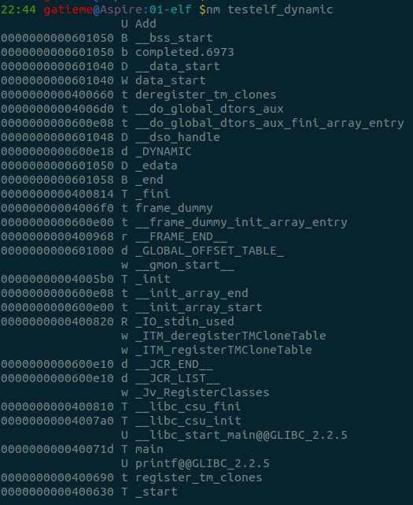
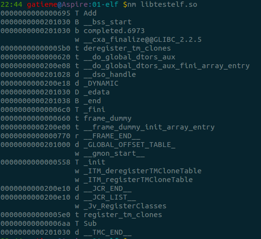

<!-- @import "[TOC]" {cmd="toc" depthFrom=1 depthTo=6 orderedList=false} -->

<!-- code_chunk_output -->

- [1 对象文件格式](#1-对象文件格式)
  - [1.1 对象文件](#11-对象文件)
  - [1.2 文件格式](#12-文件格式)
  - [1.3 ELF对象文件格式](#13-elf对象文件格式)
  - [1.4 ELF文件标准历史](#14-elf文件标准历史)
- [2 本文所使用的测试程序结构](#2-本文所使用的测试程序结构)
  - [2.1 add.c](#21-addc)
  - [2.2 sub.c](#22-subc)
  - [2.3 testelf.c](#23-testelfc)
  - [2.4 Makefile](#24-makefile)
- [3 ELF可执行与链接文件格式详解](#3-elf可执行与链接文件格式详解)
  - [3.1 布局和结构](#31-布局和结构)
  - [3.2 ELF基本数据类型定义](#32-elf基本数据类型定义)
- [4 ELF头部Elfxx\_Ehdr](#4-elf头部elfxx_ehdr)
  - [4.1 数据成员](#41-数据成员)
  - [4.2 ELF魔数e\_ident](#42-elf魔数e_ident)
    - [4.2.1 魔数](#421-魔数)
    - [4.2.2 ELF魔数](#422-elf魔数)
  - [4.3 目标文件类型e\_type](#43-目标文件类型e_type)
  - [4.4 目标体系结构类型e\_machine](#44-目标体系结构类型e_machine)
  - [4.5 ELF版本e\_version](#45-elf版本e_version)
  - [4.6 readelf \-h查看elf头部](#46-readelf--h查看elf头部)
    - [4.6.1 可重定位的对象文件(Relocatable file)](#461-可重定位的对象文件relocatable-file)
    - [4.6.2 可执行的对象文件(Executable file)](#462-可执行的对象文件executable-file)
    - [4.6.3 可被共享的对象文件(Shared object file)](#463-可被共享的对象文件shared-object-file)
- [5 程序头部Elf32\_phdr](#5-程序头部elf32_phdr)
  - [5.1 数据结构](#51-数据结构)
  - [5.2 段类型p\_type](#52-段类型p_type)
  - [5.3 readelf \-l查看程序头表](#53-readelf--l查看程序头表)
    - [5.3.1 可重定位的对象文件(Relocatable file)](#531-可重定位的对象文件relocatable-file)
    - [5.3.2 可执行的对象文件(Executable file)](#532-可执行的对象文件executable-file)
    - [5.3.3 可被共享的对象文件(Shared object file)](#533-可被共享的对象文件shared-object-file)
- [6 节区(Sections)](#6-节区sections)
  - [6.1 节区头部表格](#61-节区头部表格)
    - [6.1.1 数据结构](#611-数据结构)
    - [6.1.2 节区类型sh\_type](#612-节区类型sh_type)
    - [6.1.3 节区标志sh\_flags](#613-节区标志sh_flags)
    - [6.1.4 sh\_link 和 sh\_info 字段](#614-sh_link-和-sh_info-字段)
  - [6.2 特殊节区](#62-特殊节区)
  - [6.3 readelf -S查看节区头表](#63-readelf--s查看节区头表)
    - [6.3.1 可重定位的对象文件(Relocatable file)](#631-可重定位的对象文件relocatable-file)
    - [6.3.2 可执行的对象文件(Executable file)](#632-可执行的对象文件executable-file)
    - [6.3.3 可被共享的对象文件(Shared object file)](#633-可被共享的对象文件shared-object-file)
- [7 字符串表](#7-字符串表)
  - [7.1 字符串表](#71-字符串表)
- [8 符号表(Symbol Table)](#8-符号表symbol-table)
  - [8.1 数据结构](#81-数据结构)
  - [8.2 st\_info给出符号的类型和绑定属性](#82-st_info给出符号的类型和绑定属性)
  - [8.3 st\_shndx](#83-st_shndx)
  - [8.4 st\_value](#84-st_value)
  - [8.5 nm查看符号表](#85-nm查看符号表)
    - [8.5.1 可执行的对象文件(Executable file)](#851-可执行的对象文件executable-file)
    - [8.5.2 可被共享的对象文件(Shared object file)](#852-可被共享的对象文件shared-object-file)
  - [8.6 重定位信息](#86-重定位信息)
    - [8.6.1 重定位表项](#861-重定位表项)
    - [8.6.2 ELF32\_R\_TYPE(i)](#862-elf32_r_typei)
- [9 参考](#9-参考)

<!-- /code_chunk_output -->

# 1 对象文件格式

## 1.1 对象文件

首先, 你需要知道的是所谓**对象文件(Object files)有三个种类**:

- **可重定位**的对象文件(Relocatable file)
- **可执行**的对象文件(Executable file)
- **可被共享**的对象文件(Shared object file)

逐一来看

- 可重定位的对象文件(Relocatable file)

适于**链接**的可重定位文件(relocatable file), 包含**二进制代码和数据**, 能**与其他可重定位对象文件**在**编译**时**合并创建出一个可执行文件**.

这是由**汇编器汇编**生成**的 .o 文件**. 后面的**链接器(link editor**)拿一个或一些可重定位的对象文件(Relocatable object files)作为输入, 经**链接处理**后, 生成一个**可执行的对象文件** (Executable file)或者一个**可被共享(！！！)的对象文件**(Shared object file). 我们可以**使用 ar 工具**将众多的 .o Relocatable object files 归档(archive)**成 .a 静态库文件**. 如何产生 Relocatable file, 你应该很熟悉了, 请参见我们相关的基本概念文章和JulWiki. 另外, 可以预先告诉大家的是我们的内核可加载**模块 .ko 文件**也是 **Relocatable object file**.

- 可执行的对象文件(Executable file)

适于**执行**的可执行文件(executable file), 包含**可以直接拷贝进行内存执行的二进制代码和数据**. 用于提供程序的进程映像, 加载的内存执行.

这我们见的多了. **文本编辑器vi**、调式用的工具**gdb**、播放mp3歌曲的软件mplayer等等都是**Executable object file**. 你应该已经知道, 在我们的**Linux系统**里面, 存在**两种可执行的东西(！！！**). 除了这里说的Executable object file, 另外一种就是**可执行的脚本(如shell脚本**). 注意**这些脚本不是 Executable object file**, 它们**只是文本文件**, 但是执行这些脚本所用的**解释器就是 Executable object file**, 比如 bash shell 程序.

- 可被共享的对象文件(Shared object file)

**共享目标文件**(shared object file), 一种**特殊的可重定位对象文件**, 能在**加载时或运行**时, **装载进内存**进行**动态链接**. **连接器**可将它与**其它可重定位文件**和**共享目标文件**连接成**其它的目标文件**, **动态连接器**又可将**它与可执行文件**和**其它共享目标文件**结合起来创建一个**进程映像**.

这些就是所谓的**动态库文件**, 也**即 .so 文件**. 如果拿前面的**静态库**来生成**可执行程序**, 那**每个生成的可执行程序**中都会有一份**库代码的拷贝**. 如果**在磁盘中存储**这些可执行程序, 那就会**占用额外的磁盘空间**; 另外如果拿它们**放到Linux系统上一起运行**, 也会浪费掉宝贵的**物理内存**. 如果将静态库换成**动态库**, 那么这些问题都不会出现. **动态库在发挥作用**的过程中, 必须经过两个步骤:

1. **链接编辑器(link editor**)拿它和其他**Relocatable object file**以及其他**shared object file**作为输入, 经链接处理后, 生成另外的 **shared object file** 或者 **executable file**.

2. 在**运行**时, **动态链接器(dynamic linker**)拿它和一个**Executable file**以及另外一些 **Shared object file** 来一起处理, 在Linux系统里面创建一个**进程映像**.

## 1.2 文件格式

本质上, 对象文件只是保存在磁盘文件中的一串字节, 每个系统的文件格式都不尽相同:

- Bell实验室的第一个Unix系统使用 a.out格式.

- System V Unix的早期版本使用 Common Object File Format(COFF).

- Windows NT使用COFF的变种, 叫做 Portable Executable(PE).

- 现代Unix系统, 包括Linux、新版System V、BSD变种、Solaris都使用 Executable and Linkable Format(ELF).

## 1.3 ELF对象文件格式

ELF(Executable and Linking Format)是一种对象文件的格式, 用于定义不同类型的对象文件(Object files)中都放了什么东西、以及都以什么样的格式去放这些东西. 它自最早在 System V 系统上出现后, 被 xNIX 世界所广泛接受, 作为缺省的二进制文件格式来使用. 可以说, ELF是构成众多xNIX系统的基础之一.

ELF代表Executable and Linkable Format. 他是一种对**可执行文件**、**目标文件**和**库**使用的文件格式.

他在Linux下成为标准格式已经很长时间, 代替了早年的a.out格式. **ELF**一个特别的优点在于, **同一文件格式**可以用于内核支持的**几乎所有体系结构上**, 这不仅简化了用户空间工具程序的创建, 也简化了内核自身的程序设计. 例如, 在必须为可执行文件生成装载程序例程时.

但是**文件格式相同**并**不意味**着**不同系统上的程序之间存在二进制兼容性**,例如,FreeBSD和Linux都使用ELF作为二进制格式. 尽管二者在文件中**组织数据的方式相同**. 但在**系统调用机制**以及**系统调用的语义**方面, 仍然**有差别**. 这也是在**没有中间仿真层**的情况下,FreeBSD程序不能在linux下运行的原因(反过来同样是如此).

有一点是可以理解的, **二进制程序不能在不同体系结构交换**(例如, 为Alpha CPU编译的Linux二进制程序不能在Sparc Linux上执行), 因为**底层的体系结构是完全不同**的. 但是由于ELF的存在, 对所有体系结构而言, 程序本身的相关信息以及程序的各个部分在**二进制文件中编码的方式都是相同的**.

Linux不仅将ELF用于**用户空间程序**和**库**, 还用于**构建模块**. **内核本身也是ELF格式**.

## 1.4 ELF文件标准历史

ELF是一种开放格式, 其规范可以自由获取.

>在ELF格式出来之后, TISC(Tool Interface Standard Committee)委员会定义了一套ELF标准. 你可以从这里(http://refspecs.freestandards.org/elf/)找到[详细的标准文档](http://refspecs.freestandards.org/elf)

20世纪90年代, 一些厂商联合成立了一个委员会(TISC委员会), 起草并发布了一个ELF文件格式标准供公开使用, 并且希望所有人能够遵循这项标准并且从中获益. 1993年, 委员会发布了ELF文件标准. 当时参与该委员会的有来自于编译器的厂商, 如Watcom和Borland;来自CPU的厂商如IBM和Intel;来自操作系统的厂商如IBM和Microsoft. 1995年, 委员会发布了ELF 1.2标准, 自此委员会完成了自己的使命, 不久就解散了. 所以ELF文件格式标准的最新版本为1.2.

文件类型 **e\_type**成员表示**ELF文件类型**, 即前面提到过的**3种ELF文件类型**, **每个文件类型**对应**一个常量**. 系统通过**这个常量**来**判断ELF的真正文件类型**, 而**不是通过文件的扩展名**. 相关常量以"**ET_"开头**,

TISC委员会前后出了两个版本, v1.1和v1.2. 两个版本内容上差不多, 但就可读性上来讲, 我还是推荐你读 v1.2的. 因为在v1.2版本中, TISC重新组织原本在v1.1版本中的内容, 将它们分成为**三个部分**(books):

a) Book I

介绍了通用的适用于所有32位架构处理器的ELF相关内容

b) Book II

介绍了处理器特定的ELF相关内容, 这里是以Intel x86 架构处理器作为例子介绍

c) Book III

介绍了操作系统特定的ELF相关内容, 这里是以运行在x86上面的 UNIX System V.4 作为例子介绍

值得一说的是, 虽然TISC是以x86为例子介绍ELF规范的, 但是如果你是想知道非x86下面的ELF实现情况, 那也可以在http://refspecs.freestandards.org/elf/中找到[特定处理器相关的Supplment文档](http://refspecs.freestandards.org/elf). 比方ARM相关的, 或者MIPS相关的等等. 另外, 相比较UNIX系统的另外一个分支BSD Unix, Linux系统更靠近 System V 系统. 所以关于操作系统特定的ELF内容, 你可以直接参考v1.2标准中的内容.

# 2 本文所使用的测试程序结构

## 2.1 add.c

```c
#include <stdio.h>
#include <stdlib.h>

// 不指定寄存器实现两个整数相加
int Add(int a, int b)
{
    __asm__ __volatile__
    (
        //"lock;\n"
        "addl %1,%0;\n"
        : "=m"(a)
        : "r"(b), "m"(a)
      //  :
    );

    return a;
}
```

## 2.2 sub.c

```c
#include <stdio.h>
#include <stdlib.h>

// 不指定寄存器实现两个参数相减
int Sub(int a, int b)
{
    __asm__ __volatile__
    (
        "subl %1, %0;"
        : "=m"(a)
        : "r"(b), "m"(a)
 //       :
    );
    return a;
}
```

## 2.3 testelf.c

```c
#include <stdio.h>
#include <stdlib.h>

int main(void)
{
    int a = 3, b = 5;

    printf("%d + %d = %d\n", a, b, Add(a, b));
    printf("%d - %d = %d\n", a, b, Sub(a, b));

    return EXIT_SUCCESS;
}
```

## 2.4 Makefile

```c
target=testelf_normal testelf_dynamic testelf_static

MAIN_OBJS=testelf.o
SUBS_OBJS=add.o sub.o

DYNA_FILE=libtestelf.so
STAT_FILE=libtestelf.a

all:$(target)

%.o : %.c
 $(CC) -c $^ -o $@

clean :
 rm -rf $(MAIN_OBJS) $(SUBS_OBJS)
 rm -rf $(DYNA_FILE) $(STAT_FILE)
 rm -rf $(target)


# Complie the execute
testelf_normal:$(MAIN_OBJS) $(SUBS_OBJS)
 gcc $^ -o $@

testelf_dynamic:$(MAIN_OBJS) $(DYNA_FILE)
 gcc  $^ -o $@ -L./ -ltestelf

testelf_static:$(MAIN_OBJS) $(STAT_FILE)
 gcc  testelf.o -o $@ -static -L./ -ltestelf

# Complie the Dynamic Link Library libtestelf.so
libtestelf.so:$(SUBS_OBJS)
 gcc -fPCI -shared $^ -o $@

# Complie the Static Link Library libtestelf.so
libtestelf.a:$(SUBS_OBJS)
 ar -r $@ $^
```

我们编写了两个库函数分别实现add和sub的功能, 然后编写了一个测试代码testelf.c调用了Add和Sub.

然后我们的Mmakefile为测试程序编写了3分程序

1. **普通的程序testelf\_normal**, 由add.o sub.o 和testelf.o直接链接生成

2. **动态链接程序testelf\_dynamic**,将add.o和sub.o先链接成动态链接库libtestelf.so,然后再动态链接生成testelf\_dynamic

3. **静态链接程序testelf\_static**,将add.o和sub.o先静态链接成静态库libtestelf.a,然后再静态链接生成可执行程序testelf\_staticke

我们在源代码目录执行make后会完成编译, 编译完成后

- add.o, sub.o和testelf.o是**可重定位的对象文件**(Relocatable file)

- libtestelf.so是**可被共享的对象文件**(Shared object file)

- testelf\_normal, testelf\_dynamic和testelf\_static是**可执行的对象文件**(Executable file)

如下图所示


# 3 ELF可执行与链接文件格式详解

## 3.1 布局和结构

ELF文件由各个部分组成.

为了方便和高效, ELF文件内容有**两个平行的视角**: 一个是**程序连接角度**, 另一个是**程序运行角度**


首先**图的左边部分, 它是以链接视图来看待elf文件的**,从左边可以看出, 包含了一个**ELF头部**, 它描绘了**整个文件的组织结构**. 它还包括很多**节区(section**). 这些节有的是**系统定义好**的, 有些是**用户**在文件在**通过.section命令自定义**的, **链接器**会将**多个输入目标文件**中的**相同的节合并**. **节区部分**包含**链接视图**的**大量信息**: **指令、数据、符号表、重定位信息等**等. 除此之外, 还包含**程序头部表(可选**)和**节区头部表**.

程序头部表, 告诉系统**如何创建进程映像**. 用来**构造进程映像的目标文件**必须具有**程序头部表**, **可重定位文件**不需要这个表.

而节区头部表(Section Heade Table)包含了**描述文件节区的信息**, **每个节区**在表中都有**一项**, **每一项**给出诸如**节区名称**、**节区大小**这类信息. **用于链接的目标文件**必须包含**节区头部表**, 其他目标文件可以有, 也可以没有这个表.

需要注意地是: 尽管图中显示的各个组成部分是有顺序的, 实际上**除了ELF头部表**以外, **其他节区和段**都**没有规定的顺序**.

**右半图是以程序执行视图来看待的**, 与左边对应, 多了一个段(segment)的概念, **编译器**在**生成目标文件**时, 通常使用**从零开始的相对地址**, 而在**链接过程**中, **链接器**从一个**指定的地址**开始, 根据**输入目标文件的顺序**, 以**段(segment)为单位**将它们**拼装起来**. 其中**每个段**可以包括很多个节(section).

- elf头部

除了用于**标识ELF文件**的几个字节外,ELF头还包含了有关**文件类型**和**大小**的有关信息,以及**文件加载后程序执行的入口点信息**

- 程序头表(program header table)

程序头表向系统提供了**可执行文件的数据**在进程**虚拟地址空间**中**组织文件**的相关信息. 他还表示了文件可能包含的**段数据、段的位置和用途**

- 段segment

各个段保存了与文件相关的各种形式的数据,例如, 符号表、实际的二进制码、固定值(如字符串)或程序使用的数值常数

- 节头表section

包含了与各段相关的附加信息.

## 3.2 ELF基本数据类型定义

在具体介绍ELF的格式之前, 我们先来了解在ELF文件中都有哪些数据类型的定义:

**ELF数据编码顺序与机器相关**, 为了使数据结构更加通用,linux内核自定义了几种通用的数据,使得**数据的表示**与**具体体系结构分离**

但是由于**32位程序**和**64位程序**所使用的**数据宽度不同**,同时**64位**机**必须兼容**的执行**32位**程序,因此我们**所有的数据**都被定义为**32bit和64bit两个不同类型的数据**

常规定义在[include/uapi/linux](http://lxr.free-electrons.com/source/include/uapi/linux/elf.h?v=4.5#L7)中, 　各个结构也可以按照需求重新定义

```
/* 32-bit ELF base types. */
typedef __u32 Elf32_Addr;
typedef __u16 Elf32_Half;
typedef __u32 Elf32_Off;
typedef __s32 Elf32_Sword;
typedef __u32 Elf32_Word;

/* 64-bit ELF base types. */
typedef __u64 Elf64_Addr;
typedef __u16 Elf64_Half;
typedef __s16 Elf64_SHalf;
typedef __u64 Elf64_Off;
typedef __s32 Elf64_Sword;
typedef __u32 Elf64_Word;
typedef __u64 Elf64_Xword;
typedef __s64 Elf64_Sxword;
```

**32位机器上的定义**

| 名称 | 常规定义 |大小 | 对齐 | 目的 |
| ------------- |:-------------:|:-------------:|:-------------:|:-------------:|
| Elf32\_Addr | \_\_u32 | 4 | 4 | 无符号程序地址 |
| Elf32\_Half | \_\_u16 | 2 | 2 | 无符号中等整数 |
| Elf32\_Off | \_\_u32 | 4 | 4 | 无符号文件偏移 |
| Elf32\_SWord | \_\_u32 | 4 | 4 | 有符号大整数 |
| Elf32\_Word | \_\_u32 | 4 | 4 | 无符号大整数 |
| unsigned char | 无 | 1 | 1 | 无符号小整数 |

**64位机器上的定义**

| 名称 | 常规定义 |大小 | 对齐 | 目的 |
| ------------- |:-------------:|:-------------:|:-------------:|:-------------:|
| Elf64\_Addr | \_\_u64 | 8 | 8 | 无符号程序地址 |
| Elf64\_Half | \_\_u16 | 2 | 2 | 无符号小整数 |
| Elf64\_SHalf | \_\_s16 | 2 | 2 | 无符号小整数
| Elf64\_Off | \_\_u64 | 8 | 8 | 无符号文件偏移 |
| Elf64\_Sword | \_\_s32 | 4 |4 | 有符号中等整数 |
| Elf64\_Word | \_\_u32 | 4 | 4 | 无符号中等整数 |
| Elf64\_Xword | \_\_u64 | 8 | 8 | 无符号大整数 |
| Elf64\_Sxword | \_\_s64 | 8 | 8 | 有符号大整数 |
| unsigned char | 无 | 1 | 1 | 无符号小整数 |

# 4 ELF头部Elfxx\_Ehdr

**elf头部**用**Elfxx\_Ehdr结构**(被定义在linux/uapi/linux/elf.h)来表示, Elf32\_Ehdr(32bit)和 Elf64\_Ehdr(64bit)

```c
#define EI_NIDENT 16

typedef struct elf32_hdr{
  unsigned char e_ident[EI_NIDENT];
  Elf32_Half e_type;
  Elf32_Half e_machine;
  Elf32_Word e_version;
  Elf32_Addr e_entry;  /* Entry point */
  Elf32_Off e_phoff;
  Elf32_Off e_shoff;
  Elf32_Word e_flags;
  Elf32_Half e_ehsize;
  Elf32_Half e_phentsize;
  Elf32_Half e_phnum;
  Elf32_Half e_shentsize;
  Elf32_Half e_shnum;
  Elf32_Half e_shstrndx;
} Elf32_Ehdr;

typedef struct elf64_hdr {
  unsigned char e_ident[EI_NIDENT]; /* ELF "magic number" */
  Elf64_Half e_type;
  Elf64_Half e_machine;
  Elf64_Word e_version;
  Elf64_Addr e_entry;  /* Entry point virtual address */
  Elf64_Off e_phoff;  /* Program header table file offset */
  Elf64_Off e_shoff;  /* Section header table file offset */
  Elf64_Word e_flags;
  Elf64_Half e_ehsize;
  Elf64_Half e_phentsize;
  Elf64_Half e_phnum;
  Elf64_Half e_shentsize;
  Elf64_Half e_shnum;
  Elf64_Half e_shstrndx;
} Elf64_Ehdr;
```
## 4.1 数据成员

内部成员, 如下

| 成员 | 类型 | 描述 |
| ------------- |:-------------:|:-------------:|
| e\_ident[EI\_NIDENT] | unsigned char |**目标文件标识信息**, EI\_NIDENT=16, 因此**共占用128位** |
| e\_type | Elf32\_Half/Elf64\_Half | 目标文件**类型** |
| e\_machine | Elf32\_Half/Elf64\_Half | 目标**体系结构类型** |
| e\_version | Elf32\_Word/Elf64\_Word | 目标文件**版本** |
| e\_entry | Elf32\_Addr/Elf64\_Addr | **程序入口的虚拟地址**,若没有, 可为0 |
| e\_phoff | Elf32\_Off/Elf64\_Off | **程序头部表格**(Program Header Table)的**偏移量**(按字节计算),若没有, 可为0 |
| e\_shoff | Elf32\_Off/Elf64\_Off | **节区头部表格**(Section Header Table)的**偏移量**(按字节计算),若没有, 可为0 |
| e\_flags | Elf32\_Word/Elf64\_Word | 保存与文件相关的, **特定于处理器的标志**. 标志名称采用 **EF\_machine\_flag的格式** |
| e\_ehsize | Elf32\_Half/Elf64\_Half | ELF 头部的大小(以字节计算) |
| e\_phentsize | Elf32\_Half/Elf64\_Half | **程序头部表格**的**表项大小**(按字节计算) |
| e\_phnum | Elf32\_Half/Elf64\_Half | 程序头部表格的**表项数目**. 可以为 0 |
| e\_shentsize | Elf32\_Half/Elf64\_Half | 节区头部表格的表项大小(按字节计算) |
| e\_shnum | Elf32\_Half/Elf64\_Half | 节区头部表格的表项数目. 可以为 0 |
| e\_shstrndx | Elf32\_Half/Elf64\_Half | **节区头部表格**中与节区名称**字符串表**相关的**表项的索引**. 如果文件没有节区名称字符串表, 此参数可以为 SHN\_UNDEF |

## 4.2 ELF魔数e\_ident

### 4.2.1 魔数

**很多类型的文件**, 其**起始的几个字节**的内容是**固定的(固定不变！！！**)(或是有意填充, 或是本就如此). 根据这几个字节的内容就**可以确定文件类型**, 因此这几个字节的内容被称为**魔数 (magic number**). 此外在一些程序代码中, 程序员常常将在代码中出现但没有解释的数字常量或字符串称为魔数 (magic number)或魔字符串.

**a.out格式**的魔数为**0x01、0x07**, 为什么会规定这个魔数呢?

UNIX早年是在PDP小型机上诞生的, 当时的系统在加载一个可执行文件后直接从文件的第一个字节开始执行, 人们一般在文件的最开始放置一条跳转(jump)指令, 这条指令负责跳过接下来的7个机器字的文件头到可执行文件的真正入口. 而0x01 0x07这两个字节刚好是当时PDP-11的机器的跳转7个机器字的指令. 为了跟以前的系统保持兼容性, 这条跳转指令被当作魔数一直被保留到了几十年后的今天.

计算机系统中有很多怪异的设计背后有着很有趣的历史和传统, 了解它们的由来可以让我们了解到很多很有意思的事情. 这让我想起了经济学里面所谓的"路径依赖", 其中一个很有意思的叫"马屁股决定航天飞机"的故事在网上流传很广泛, 有兴趣的话你可以在google以"马屁股"和"航天飞机"作为关键字搜索一下.

### 4.2.2 ELF魔数

我们可以从前面**readelf**的输出看到, **最前面的"Magic"的16个字节**刚好对应"**Elf32\_Ehdr**"的**e\_ident这个成员**. 这**16个字节**被**ELF标准**规定用来**标识ELF文件的平台属性**, 比如这个**ELF字长(32位/64位**)、**字节序**、**ELF文件版本**

**最开始的4个字节**是**所有ELF文件**都**必须相同的标识码**, 分别为**0x7F、0x45、0x4c、0x46**

- **第一个字节**对应ASCII字符里面的**DEL控制符**,

- **后面3个字节**刚好是**ELF这3个字母的ASCII码**. 这**4个字节又被称为ELF文件的魔数**.

**几乎所有的可执行文件格式**的**最开始的几个字节**都是**魔数**.

比如**a.out格式**最**开始两个字节**为 **0x01、0x07**;

**PE/COFF文件**最开始**两个字节**为**0x4d、0x5a**, 即**ASCII字符MZ**.

**这种魔数**用来**确认文件的类型**, 操作系统在**加载可执行文件**的时候会**确认魔数是否正确**, 如果不正确会拒绝加载.

**第5个字节**是用来**标识ELF的文件类**的, **0x01表示是32位**的, **0x02表示是64位**的;

**第6个字节**是**字节序**, 规定**该ELF文件是大端的还是小端的**(见附录: 字节序).

**第7个字节**规定ELF文件的**主版本号**, 一般是1, 因为ELF标准自1.2版以后就再也没有更新了.

**后面的9个字节**ELF标准**没有定义**, 一般填0, **有些平台**会使用这9个字节作为**扩展标志**.

其中需要注意的是**e\_ident**是一个**16字节的数组**, 这个数组按位置**从左到右**都是有**特定含义**, 每个数组元素的**下标在标准中还存在别称**, 如**byte0的下标0别名为EI\_MAG0**, 具体如下:

| 名称 | 元素下标值 | 含义 |
| ------------- |:-------------:|:-------------:|
| EI\_MAG0 | 0 | 文件标识 |
| EI\_MAG1 | 1 | 文件标识 |
| EI\_MAG2 | 2 | 文件标识 |
| EI\_MAG3 | 3 | 文件标识 |
| EI\_CLASS | 4 | 文件类 |
| EI\_DATA | 5 | 数据编码 |
| EI\_VERSION | 6 | 文件版本 |
| EI\_PAD | 7 | 补齐字节开始处 |
| EI\_NIDENT | 16 | e\_ident[]大小 |

e\_ident[EI\_MAG0] \~ e\_ident[EI\_MAG3]即e\_ident[0] \~ e\_ident[3]被称为**魔数**(Magic Number),其值一般为0x7f,'E','L','F'

e\_ident[EI\_CLASS](即e\_ident[4])识别目标文件**运行在目标机器的类别**, 取值可为三种值:

| 名称 | 元素下标值 | 含义 |
| ------------- |:-------------:|:-------------:|
| ELFCLASSNONE | 0 | 非法类别 |
| ELFCLASS32 | 1 | 32位目标 |
| ELFCLASS64 | 2 | 64位目标 |

e\_ident[EI\_DATA](即e\_ident[5]): 给出**处理器特定数据的数据编码方式**. 即**大端还是小端方式**. 取值可为3种:

| 名称 | 元素下标值 | 含义 |
| ------------- |:-------------:|:-------------:|
| ELFDATANONE | 0 | 非法数据编码 |
| ELFDATA2LSB | 1 | 高位在前 |
| ELFDATA2MSB | 2 | 低位在前 |

## 4.3 目标文件类型e\_type

e\_type表示**elf文件的类型**

文件类型 e\_type成员表示ELF文件类型, 即前面提到过的**3种ELF文件类型**, **每个文件类型**对应**一个常量**. 系统通过这个常量来判断ELF的真正文件类型, 而不是通过文件的扩展名. 相关常量以"ET\_"开头

如下定义:

| 名称 | 取值 | 含义 |
| ------------- |:-------------:|:-------------:|
| ET\_NONE | 0 | 未知目标文件格式 |
| ET\_REL | 1 | 可重定位文件 | |
| ET\_EXEC | 2 | 可执行文件 |
| ET\_DYN | 3 | 共享目标文件 |
| ET\_CORE | 4 | Core 文件(转储格式) |
| ET\_LOPROC | 0xff00 | 特定处理器文件 |
| ET\_HIPROC | 0xffff | 特定处理器文件 |
| ET\_LOPROC\~ET\_HIPROC | 0xff00\~0xffff | 特定处理器文件 |

## 4.4 目标体系结构类型e\_machine

e\_machine表示目标体系结构类型

| 名称 | 取值 | 含义 |
| ------------- |:-------------:|:-------------:|
| EM\_NONE | 0 | 未指定 |
| EM\_M32 | 1 | AT&T WE 32100 |
| EM\_SPARC | 2 | SPARC |
| EM\_386 | 3 | Intel 80386 |
| EM\_68K | 4 | Motorola 68000 |
| EM\_88K | 5 | Motorola 88000
| EM\_860 | 7 | Intel 80860 |
| EM\_MIPS | 8 | MIPS RS3000 |
| others | 9\~ | 预留 |

## 4.5 ELF版本e\_version

这个用来区分ELF标准的各个修订版本,但是前面提到**ELF最新版本就是1(1.2**),仍然是最新版,因此目前不需要这个特性

另外**ELF头**还包括了ELF文件的各个**其他部分的长度和索引位置信息**. 因为这些部分的长度可能依程序而不同. 所以在文件头部必须提供相应的数据.

## 4.6 readelf \-h查看elf头部

### 4.6.1 可重定位的对象文件(Relocatable file)

```c
readelf -h add.o
```




文件类型是REL, 说明是**可重定位文件**, 其**代码可以移动至任何位置**.

该文件**没有程序头表**, 对**需要进行链接的对象**而言, **程序头表是不必要**的, 为此所有长度都设置为0

### 4.6.2 可执行的对象文件(Executable file)

```c
readelf -h testelf_dynamic
```





### 4.6.3 可被共享的对象文件(Shared object file)

```c
readelf -h libtestelf.so
```




# 5 程序头部Elf32\_phdr

以**程序运行的角度**看ELF文件,就需要**程序头表**,即**要运行这个elf文件**, 需要将**哪些东西载入到内存镜像(！！！**). 而**节区头部表**是以**elf资源**的角度来看待elf文件的, 即**这个elf文件到底存在哪些资源**, 以及这些**资源之间的关联关系**

**程序头部**是一个**表**, 它的**起始地址**在**elf头部**结构中的**e\_phoff成员**指定, **数量由e\_phnum表示**, 每个程序头部**表项的大小**由**e\_phentsize**指出.

**可执行文件**或者**共享目标文件**的**程序头部**是一个**结构数组**, **每个结构**描述了**一个段**或者**系统准备程序执行**所必需的其它信息. 目标文件的"**段**"包含**一个或者多个"节区(！！！**)", 也就是"段内容(Segment Contents)".

**程序头部**仅对于**可执行文件**和**共享目标文件**有意义.

elf头部用Elfxx\_phdr结构(被定义在linux/uapi/linux/elf.h来表示,Elf32\_phdr(32bit)和Elf64\_phdr(64bit)

```c
typedef struct elf32_phdr{
  Elf32_Word p_type;
  Elf32_Off p_offset;
  Elf32_Addr p_vaddr;
  Elf32_Addr p_paddr;
  Elf32_Word p_filesz;
  Elf32_Word p_memsz;
  Elf32_Word p_flags;
  Elf32_Word p_align;
} Elf32_Phdr;

typedef struct elf64_phdr {
  Elf64_Word p_type;
  Elf64_Word p_flags;
  Elf64_Off p_offset;  /* Segment file offset */
  Elf64_Addr p_vaddr;  /* Segment virtual address */
  Elf64_Addr p_paddr;  /* Segment physical address */
  Elf64_Xword p_filesz;  /* Segment size in file */
  Elf64_Xword p_memsz;  /* Segment size in memory */
  Elf64_Xword p_align;  /* Segment alignment, file & memory */
} Elf64_Phdr;
```

## 5.1 数据结构

下面来看**程序头号部表项(表项！！！**)的数据结构

| 成员 | 类型 | 描述 |
| ------------- |:-------------:|:-------------|
| p\_type | Elf32\_Word/Elf64\_Word | **段类型** |
| p\_offset | Elf32\_Off/Elf64\_Off | **段位置** |
| p\_vaddr | Elf32\_Addr/Elf64\_Addr | 给出**段的第一个字节**将被放到**内存中的虚拟地址** |
| p\_paddr | Elf32\_Addr/Elf64\_Addr | 仅用于与物理地址相关的系统中 |
| p\_filesz | Elf32\_Word/Elf64\_Word | 给出段在**文件映像**中所占的**字节数** |
| p\_memsz | Elf32\_Word/Elf64\_Word | 给出段在**内存映像**中占用的**字节数** |
| p\_flags | Elf32\_Word/Elf64\_Word | 与段相关的标志 |
| p\_align | Elf32\_Word/Elf64\_Word | 对齐 |

## 5.2 段类型p\_type

| 名称 | 取值 | 说明 |
| ------------- |:-------------:|:-------------|
| PT\_NULL | 0 | 此**数组元素未用**. 结构中其他成员都是未定义的 |
| PT\_LOAD | 1 |  |
| PT\_DYNAMIC | 2 | 数组元素给出**动态链接信息** |
| PT\_INTERP | 3 | 数组元素给出一个**NULL结尾的字符串的位置和长度**, 该**字符串将被当作解释器调用**. 这种段类型仅对与**可执行文件有意义**(尽管也可能在共享目标文件上发生). 在一个文件中**不能出现一次以上(！！！**). 如果存在这种类型的段, 它必须在**所有可加载段项目的前面** |
| PT\_NOTE | 4 | 此数组元素给出**附加信息的位置和大小** |
| PT\_SHLIB | 5 | 此段类型**被保留**, 不过语义未指定. 包含这种类型的段的程序与ABI不符 |
| PT\_PHDR | 6 | **此类型的数组元素如果存在**, 则给出了**程序头部表自身的大小和位置**, 既包括在**文件中**也包括在**内存中**的信息. 此类型的段在文件中**不能出现一次以上**. 并且**只有程序头部表**是程序的**内存映像的一部分**时才起作用. 如果存在此类型段, 则必须在**所有可加载段项目的前面** |
|PT\_LOPROC\~PT\_HIPROC | 0x70000000\~0x7fffffff | 此范围的类型保留给处理器专用语义 |

## 5.3 readelf \-l查看程序头表

在**程序头表**之后, 列出了**6个段**, 这些**组成了最终在内存中执行的程序(！！！**).

其还提供了**各段在虚拟地址空间和物理空间的大小**,**位置**,**标志**,**访问权限**和**对齐**方面的信息.还指定了多个类型来**更精确的描述段**.

**各段**的语义如下

| 段 | 描述 |
| ------------- |:-------------|
| PHDR | 保存了**程序头表** |
| INTERP | 指定在程序已经从**可执行文件映射到内存之后**,必须**调用的解释器**.在这里解释器并**不意味**着二进制文件的内容**必须解释执行**(比如Java的字节码需要Java虚拟机解释).它指的是这样**一个程序**:通过**链接其他库**, 来**满足未解决的引用**.<br>通常/lib/ld-linux.so.2,/lib/ld-linux-ia-64.so.2等库, 用于**在虚拟地址空间中插入程序运行所需的动态库**.对几乎所有的程序来说,可能C标准库都是必须映射的.还需要添加的各种库, 如GTK, QT, 数学库math, 线程库pthread等等 |
| LOAD | 表示一个需要**从二进制文件映射到虚拟地址的段**.其中保存了**常量数据**(如字符串),程序的**目标代码**等 |
| DYNAMIC | 该段保存了由**动态链接器**(即, **INTERP中指定的解释器)使用的信息** |
| NOTE | 保存了专有信息 |

### 5.3.1 可重定位的对象文件(Relocatable file)

```c
readelf -l add.o
```


**可重定向文件**,是一个**需要链接的对象**,**程序头表**对其而言不是必要的,　因此这类文件一般没有程序头表

### 5.3.2 可执行的对象文件(Executable file)

```c
readelf -l testelf_dynamic
```


### 5.3.3 可被共享的对象文件(Shared object file)

```c
readelf -l libtestelf.so
```


**虚拟地址空间**中的**各个段**,填充了来自**ELF文件中特定的段的数据**.因而**readelf**输出的**第二部分(Section to Segment mapping！！！**)指定了**哪些节载入到哪些段(节段映射**).

**物理地址信息将被忽略**,因为该信息是由内核根据物理页帧到虚拟地址空间中相应位置的映射情况动态分配的.**只有在没有MMU(因而没有虚拟内存)的系统上**该信息才是**有意义**的

# 6 节区(Sections)

节区中包含目标文件中的**所有信息**

除了: **ELF 头部、程序头部表格、节区头部表格**.

节区满足以下条件:

1. 目标文件中的**每个节区**都有**对应的节区头部**描述它, 反过来, 有**节区头部不意味着有节区**.

2. **每个节区**占用文件中一个**连续字节区域**(这个区域**可能长度为 0**).

3. 文件中的**节区不能重叠**, 不允许一个字节存在于两个节区中的情况发生.

4. 目标文件中可能包含**非活动空间(INACTIVE SPACE**). 这些区域**不属于任何头部和节区**, 其内容未指定.

## 6.1 节区头部表格

ELF文件在**描述各段的内容(程序头！！！**)时,是**指定了哪些节的数据映射到段(！！！**)中.因此需要一个结构来管理**各个节的内容, 即节头表**

**节区头部表**是以**elf资源的角度**来看待elf文件的, 即这个elf文件到底**存在哪些资源**, 以及这些**资源之间的关联关系**, 而前面提到的**程序头部表**, 则以**程序运行**来看elf文件的, 即要运行这个elf文件, 需要**将哪些东西载入到内存镜像**.

ELF头部中,

e\_shoff 成员给出**从文件头到节区头部表格的偏移字节数**;

e\_shnum给出表格中**条目数目**;

e\_shentsize 给出**每个项目的字节数**.

从这些信息中可以确切地定位节区的具体位置、长度.

从之前的描述中可知, **每一项节区**在节区头部表格中都**存在着一项元素与它对应**, 因此可知, 这个节区头部表格为一段连续的空间, **每一项元素**为一**结构体**

那么这个节区头部由elfxx\_shdr(定义在[include/uapi/linux/elf.h]),32位elf32\_shdr, 64位elf64\_shdr

### 6.1.1 数据结构

```c
typedef struct elf32_shdr {
  Elf32_Word sh_name;
  Elf32_Word sh_type;
  Elf32_Word sh_flags;
  Elf32_Addr sh_addr;
  Elf32_Off sh_offset;
  Elf32_Word sh_size;
  Elf32_Word sh_link;
  Elf32_Word sh_info;
  Elf32_Word sh_addralign;
  Elf32_Word sh_entsize;
} Elf32_Shdr;

typedef struct elf64_shdr {
  Elf64_Word sh_name;  /* Section name, index in string tbl */
  Elf64_Word sh_type;  /* Type of section */
  Elf64_Xword sh_flags;  /* Miscellaneous section attributes */
  Elf64_Addr sh_addr;  /* Section virtual addr at execution */
  Elf64_Off sh_offset;  /* Section file offset */
  Elf64_Xword sh_size;  /* Size of section in bytes */
  Elf64_Word sh_link;  /* Index of another section */
  Elf64_Word sh_info;  /* Additional section information */
  Elf64_Xword sh_addralign; /* Section alignment */
  Elf64_Xword sh_entsize; /* Entry size if section holds table */
} Elf64_Shdr;
```

结构体的成员如下

| 成员 | 类型 | 描述 |
| ------------- |:-------------:|:-------------:|
| sh\_name | Elf32\_Word/Elf64\_Word | 节区名, 是节区头部字符串表节区(Section Header String Table Section)的索引. 名字是一个**NULL结尾的字符串** |
| sh\_type | Elf32\_Word/Elf64\_Word | 节区类型 |
| sh\_flags |  Elf32\_Word/Elf64\_Word | 节区标志 |
| sh\_addr | Elf32\_Addr/Elf64\_Addr | 如果**节区将出现在进程的内存映像**中, 此成员给出**节区的第一个字节应处的位置**. 否则, 此字段为 0 |
| sh\_offset | Elf32\_Off/Elf64\_Off | 此成员的取值给出**节区的第一个字节与文件头之间的偏移** |
| sh\_size | Elf32\_Word/Elf64\_Word | 此成员给出**节区的长度(字节数**) |
| sh\_link | Elf32\_Word/Elf64\_Word | 此成员给出节区头部表索引链接. 其具体的解释依赖于节区类型 |
| sh\_info | Elf32\_Word/Elf64\_Word | 此成员给出附加信息, 其解释依赖于节区类型 |
| sh\_addralign | Elf32\_Word/Elf64\_Word | 某些节区带有**地址对齐约束** |
| sh\_entsize | Elf32\_Word/Elf64\_Word | 某些节区中包含**固定大小的项目, 如符号表**. 对于这类节区, 此成员给出**每个表项的长度字节数** |

### 6.1.2 节区类型sh\_type

sh\_type的取值如下:

| 名称 | 取值 | 说明 |
| ------------- |:-------------:|:-------------:|
| SHT\_NULL | 0 | 此值标志节区头部是非活动的, 没有对应的节区. 此节区头部中的其他成员取值无意义 |
| SHT\_PROGBITS | 1 | 此节区包含程序定义的信息, 其格式和含义都由程序来解释 |
| SHT\_SYMTAB | 2 | 此节区包含一个符号表. 目前目标文件对每种类型的节区都只能包含一个, 不过这个限制将来可能发生变化<br>一般, SHT\_SYMTAB 节区提供用于链接编辑(指 ld 而言)的符号, 尽管也可用来实现动态链接 |
| SHT\_STRTAB | 3 | 此节区包含字符串表. 目标文件可能包含多个字符串表节区 |
| SHT\_RELA | 4 | 此节区包含重定位表项, 其中可能会有补齐内容(addend), 例如 32 位目标文件中的 Elf32\_Rela 类型. 目标文件可能拥有多个重定位节区 |
| SHT\_HASH | 5 | 此节区包含符号哈希表. 所有参与动态链接的目标都必须包含一个符号哈希表. 目前, 一个目标文件只能包含一个哈希表, 不过此限制将来可能会解除 |
| SHT\_DYNAMIC | 6 | 此节区包含动态链接的信息. 目前一个目标文件中只能包含一个动态节区, 将来可能会取消这一限制 |
| SHT\_NOTE | 7 | 此节区包含以某种方式来标记文件的信息 |
| SHT\_NOBITS | 8 | 这种类型的节区不占用文件中的空间 ,  其他方面和SHT\_PROGBITS相似. 尽管此节区不包含任何字节, 成员sh\_offset 中还是会包含概念性的文件偏移 |
| SHT\_REL | 9 | 此节区包含重定位表项, 其中没有补齐(addends), 例如 32 位目标文件中的 Elf32\_rel 类型. 目标文件中可以拥有多个重定位节区 |
| SHT\_SHLIB | 10 | 此节区被保留, 不过其语义是未规定的. 包含此类型节区的程序与 ABI 不兼容 |
| SHT\_DYNSYM | 11 | 作为一个完整的符号表, 它可能包含很多对动态链接而言不必要的符号. 因此, 目标文件也可以包含一个 SHT_DYNSYM 节区, 其中保存动态链接符号的一个最小集合, 以节省空间 |
| SHT\_LOPROC | X70000000 | 这一段(包括两个边界), 是保留给处理器专用语义的 |
| SHT\_HIPROC | OX7FFFFFFF | 这一段(包括两个边界), 是保留给处理器专用语义的 |
| SHT\_LOUSER | 0X80000000 | 此值给出保留给应用程序的索引下界 |
| SHT\_HIUSER | 0X8FFFFFFF | 此值给出保留给应用程序的索引上界 |

### 6.1.3 节区标志sh\_flags

sh\_flag标志着**此节区是否可以修改, 是否可以执行**, 如下定义:

| 名称 | 取值 | 含义 |
| ------------- |:-------------:|:-------------:|
| SHF\_WRITE | 0x1 | 节区包含进程执行过程中将可写的数据 |
| SHF\_ALLOC | 0x2|  此节区在进程执行过程中占用内存. 某些控制节区并不出现于目标文件的内存映像中, 对于那些节区, 此位应设置为 0 |
| SHF\_EXECINSTR | 0x4 | 节区包含可执行的机器指令 |
| SHF\_MASKPROC | 0xF0000000 | 所有包含于此掩码中的四位都用于处理器专用的语义 |

### 6.1.4 sh\_link 和 sh\_info 字段

sh\_link和sh\_info字段的具体含义依赖于sh\_type的值

| sh\_type | sh\_link | sh\_info |
| ------------- |:-------------:|:-------------:|
| SHT\_DYNAMIC | 此节区中条目所用到的字符串表格的节区头部索引 | 0 |
| SHT\_HASH | 此哈希表所适用的符号表的节区头部索引 | 0 |
| SHT\_REL<br>SHT\_RELA | 相关符号表的节区头部索引 | 重定位所适用的节区的节区头部索引 |
| SHT\_SYMTAB<br>SHT\_DYNSYM | 相关联的字符串表的节区头部索引 | 最后一个局部符号(绑定 STB\_LOCAL)的符号表索引值加一 |
| 其它 | SHN\_UNDEF | 0 |

## 6.2 特殊节区

有些节区是**系统预订**的, 一般**以点开头号**, 因此, 我们有必要了解一些**常用到的系统节区**.

| 名称 | 类型 | 属性 | 含义 |
| ------------- |:-------------:|:-------------:|:-------------:|
|.bss | SHT\_NOBITS | SHF\_ALLOC +SHF\_WRITE | 包含将出现在程序的内存映像中的为初始化数据. 根据定义, 当程序开始执行, 系统将把这些**数据初始化为 0**. 此**节区不占用文件空间** |
| .comment | SHT\_PROGBITS | (无) | 包含**版本控制信息** |
| .data | SHT\_PROGBITS | SHF\_ALLOC + SHF\_WRITE | 这些节区包含初始化了的数据, 将出现在程序的**内存映像**中 |
| .data1 | SHT\_PROGBITS | SHF\_ALLOC + SHF\_WRITE | 这些节区包含初始化了的数据, 将出现在程序的内存映像中 |
| .debug | SHT\_PROGBITS | (无) | 此节区包含用于**符号调试的信息** |
| .dynamic | SHT\_DYNAMIC |   | 此节区包含动态链接信息. 节区的属性将包含 SHF\_ALLOC 位. 是否 SHF_WRITE 位被设置取决于处理器 |
| .dynstr | SHT\_STRTAB | SHF\_ALLOC | 此节区包含用于动态链接的字符串, 大多数情况下这些字符串代表了与符号表项相关的名称 |
| .dynsym | SHT\_DYNSYM | SHF\_ALLOC | 此节区包含了动态链接符号表 |
| .fini | SHT\_PROGBITS | SHF\_ALLOC + SHF\_EXECINSTR | 此节区包含了可执行的指令, 是进程终止代码的一部分. 程序正常退出时, 系统将安排执行这里的代码 |
| .got | SHT\_PROGBITS |   | 此节区包含全局偏移表 |
| .hash | SHT\_HASH | SHF\_ALLOC | 此节区包含了一个符号哈希表 |
| .init | SHT\_PROGBITS | SHF\_ALLOC +SHF\_EXECINSTR | 此节区包含了可执行指令, 是进程初始化代码的一部分. 当程序开始执行时, 系统要在开始调用主程序入口之前(通常指 C 语言的 main 函数)执行这些代码 |
| .interp | SHT\_PROGBITS |  | 此节区包含程序解释器的路径名. 如果程序包含一个可加载的段, 段中包含此节区, 那么节区的属性将包含 SHF_ALLOC 位, 否则该位为 0 |
| .line | SHT\_PROGBITS | (无) | 此节区包含符号调试的行号信息, 其中描述了源程序与机器指令之间的对应关系. 其内容是未定义的 |
| .note | SHT\_NOTE | (无) | 此节区中包含注释信息, 有独立的格式.
| .plt | SHT_PROGBITS | |此节区包含过程链接表(procedure linkage table)|
| .relname<br>.relaname | SHT\_REL<br>SHT\_RELA | |这些节区中包含了重定位信息. 如果文件中包含可加载的段, 段中有重定位内容, 节区的属性将包含 SHF\_ALLOC 位, 否则该位置 0. 传统上 name 根据重定位所适用的节区给定. 例如 .text 节区的重定位节区名字将是: .rel.text 或者 .rela.text |
| .rodata<br>.rodata1| SHT\_PROGBITS | SHF\_ALLOC | 这些节区包含只读数据, 这些数据通常参与进程映像的不可写段 |
| .shstrtab | SHT\_STRTAB | | 此节区包含节区名称 |
| .strtab | SHT\_STRTAB | |此节区包含字符串, 通常是代表与符号表项相关的名称. 如果文件拥有一个可加载的段, 段中包含符号串表, 节区的属性将包含SHF\_ALLOC 位, 否则该位为 0 |
| .symtab | SHT\_SYMTAB | |此节区包含一个符号表. 如果文件中包含一个可加载的段, 并且该段中包含符号表, 那么节区的属性中包含SHF\_ALLOC 位, 否则该位置为 0 |
| .text | SHT\_PROGBITS | SHF\_ALLOC + SHF\_EXECINSTR | 此节区包含程序的可执行指令 |

## 6.3 readelf -S查看节区头表

### 6.3.1 可重定位的对象文件(Relocatable file)

```c
readelf -S add.o
```


**可重定向文件**, 是一个**需要链接的对象**,程序头表对其而言不是必要的,　因此这类文件一般没有程序头表

### 6.3.2 可执行的对象文件(Executable file)

```c
readelf -S testelf_dynamic
```




### 6.3.3 可被共享的对象文件(Shared object file)

```c
readelf -S libtestelf.so
```


# 7 字符串表

## 7.1 字符串表

首先要知道, **字符串表**它本身就是**一个节区**, 从第二章描述中可知, **每一个节区**都存在**一个节区头部表项与之对应**, 所以字符串表这个节区也存在一个**节区头部表项**对应, 而在elf文件**头部结构**中存在一个成员**e\_shstrndx**给出这个**节区头部表项的索引位置**. 因此可以通过
```c
shstrab  = (rt_uint8_t *)module_ptr +shdr[elf_module->e_shstrndx].sh_offset;
```
来得到**字符串表的起始位置**.

字符串表节区包含以NULL(ASCII码0)结尾的字符序列, 通常称为字符串. ELF目标文件通常使用字符串来表示符号和节区名称. **对字符串的引用**通常以**字符串在字符串表中的下标给出**.

一般, **第一个字节(索引为0**)定义为一个**空字符串**. 类似的, **字符串表**的**最后一个字节**也定义为**NULL**, 以确保所有的字符串都以NULL结尾. 索引为0的字符串在不同的上下文中可以表示无名或者名字为NULL的字符串.

**允许存在空的字符串表节区**, 其节区头部的sh\_size成员应该为0. 对空的字符串表而言, 非0的索引值是非法的.

例如: 对于各个节区而言, **节区头部的sh\_name**成员包含其**对应的节区头部字符串表节区的索引**, 此节区由ELF头的e\_shstrndx成员给出. 下图给出了**包含25个字节的一个字符串表**, 以及与**不同索引相关的字符串**.


那么上面**字符串表**包含以下字符串:

| 索引 | 字符串 |
| ---- |:------:|
| 0 | (无) |
| 1 | name. |
| 7 | Variable |
| 11 | able |
| 16 | able |
| 24 | (空字符串) |

# 8 符号表(Symbol Table)

首先, **符号表**同样本身是**一节区**, 也存在一**对应节区头部表项**.

目标文件的**符号表**中包含用来**定位**、**重定位**程序中**符号定义**和**引用的信息**.

**符号表索引**是**对此数组的索引**. 索引0表示表中的第一表项, 同时也作为**未定义符号的索引**.

## 8.1 数据结构

**符号表**是**由一个个符号元素组成**, 用elfxx\_sym来结构来表示,定义在[include/uapi/linux/elf.h],同样32位为elf32\_sym,64位对应elf64\_sym

```c
typedef struct elf32_sym{
  Elf32_Word st_name;
  Elf32_Addr st_value;
  Elf32_Word st_size;
  unsigned char st_info;
  unsigned char st_other;
  Elf32_Half st_shndx;
} Elf32_Sym;

typedef struct elf64_sym {
  Elf64_Word st_name;  /* Symbol name, index in string tbl */
  unsigned char st_info; /* Type and binding attributes */
  unsigned char st_other; /* No defined meaning, 0 */
  Elf64_Half st_shndx;  /* Associated section index */
  Elf64_Addr st_value;  /* Value of the symbol */
  Elf64_Xword st_size;  /* Associated symbol size */
} Elf64_Sym;
```

**每个元素**的数据结构如下定义:

| 成员 | 类型 | 描述 |
| ------------- |:-------------:|:-------------:|
| st\_name | Elf32\_Word/Elf64\_Word | 名称, **索引到字符串表** |
| st\_value | Elf32\_AddrElf64\_Addr | 给出**相关联的符号的取值**. 依赖于具体的上下文 |
| st\_size | Elf32\_Word/Elf64\_Word | 相关的尺寸大小 |
| st\_info | unsigned char | 给出符号的类型和绑定属性 |
| st\_other | unsigned char | 该成员当前包含 0, 其含义没有定义 |
| st\_shndx | Elf32\_Half/Elf64\_Half | 给出相关的节区头部表索引. 某些索引具有特殊含义 |

## 8.2 st\_info给出符号的类型和绑定属性

**st\_info**中包含**符号类型和绑定信息**, 操纵方式如:

```c
#define ELF32_ST_BIND(i) ((i)>>4)
#define ELF32_ST_TYPE(i) ((i)&0xf)
#define ELF32_ST_INFO(b, t) (((b)<<4) + ((t)&0xf))
```

**st\_info 的高四位(ELF32\_ST\_BIND(i))**

表示符号绑定, 用于确定**链接可见性**和**行为**. 具体的绑定类型如:

| 名称 | 取值 | 说明 |
| ------------- |:-------------:|:-------------:|
| STB\_LOCAL | 0 | **局部符号**在包含该符号定义的目标文件以外不可见. 相同名称的局部符号可以存在于多个文件中, 互不影响 |
| STB\_GLOBAL | 1 | **全局符号**对所有将组合的目标文件都是可见的. 一个文件中对某个全局符号的定义将满足另一个文件对相同全局符号的未定义引用 |
| STB\_WEAK | 2 | 弱符号与全局符号类似, 不过他们的定义优先级比较低 |
| STB\_LOPROC | 13 | 处于这个范围的取值是保留给处理器专用语义的 |
| STB\_HIPROC | 15 | 处于这个范围的取值是保留给处理器专用语义的 |

全局符号与弱符号之间的区别主要有两点:

1. 当链接编辑器组合若干可重定位的目标文件时, 不允许对同名的STB\_GLOBAL 符号给出多个定义. 另一方面如果一个已定义的全局符号已经存在, 出现一个同名的弱符号并不会产生错误. 链接编辑器尽关心全局符号, 忽略弱符号. 类似地, 如果一个公共符号(符号的st\_shndx中包含SHN\_COMMON), 那么具有相同名称的弱符号出现也不会导致错误. 链接编辑器会采纳公共定义, 而忽略弱定义.

2. 当链接编辑器搜索归档库(archive libraries)时, 会提取那些包含未定义全局符号的档案成员. 成员的定义可以是全局符号, 也可以是弱符号. 连接编辑器不会提取档案成员来满足未定义的弱符号. 未能解析的弱符号取值为 0.

在每个符号表中, 所有具有STB\_LOCAL绑定的符号都优先于弱符号和全局符号. 符号表节区中的sh\_info头部成员包含第一个非局部符号的符号表索引.

**st\_info的低四位ELF32\_ST\_TYPE(i)**

定义如下

| 名称 | 取值 | 说明 |
| ------------- |:-------------:|:-------------:|
| STT\_NOTYPE | 0 | 符号的类型没有指定 |
| STT\_OBJECT | 1 | 符号与某个数据对象相关, 比如一个变量、数组等等 |
| STT\_FUNC | 2 | 符号与某个函数或者其他可执行代码相关 |
| STT\_SECTION|  3 | 符号与某个节区相关. 这种类型的符号表项主要用于重定位, 通常具有 STB_LOCAL 绑定 |
| STT\_FILE | 4 | 传统上, 符号的名称给出了与目标文件相关的源文件的名称. 文件符号具有 STB\_LOCAL绑定, 其节区索引是SHN\_ABS, 并且它优先于文件的其他 STB\_LOCAL 符号(如果有的话) |
| STT\_LOPROC\~STT\_HIPROC | 13\~15 | 此范围的符号类型值保留给处理器专用语义用途 |

在共享目标文件中的函数符号(类型为 STT_FUNC)具有特别的重要性. 当其他目标文件引用了来自某个共享目标中的函数时, 链接编辑器自动为所引用的符号创建过
程链接表项. 类型不是 STT\_FUNC 的共享目标符号不会自动通过过程链接表进行引用.

如果一个符号的取值引用了某个节区中的特定位置, 那么它的节区索引成员(st_shndx)包含了其在节区头部表中的索引. 当节区在重定位过程中被移动时, 符号的取值也会随之变化, 对符号的引用始终会"指向"程序中的相同位置.

## 8.3 st\_shndx

如前面所述, st_shndx给出相关的节区头部表索引. 但其值也存在一些特殊值, 具有某些特殊的含义:

| 名称 | 取值 | 说明 |
| ------------- |:-------------:|:-------------:|
| SHN\_ABS |  | 符号具有绝对取值, 不会因为重定位而发生变化 |
| SHN_COMMON |  | 符号标注了一个尚未分配的公共块. 符号的取值给出了对齐约束, 与节区的 sh_addralign成员类似. 就是说, 链接编辑器将为符号分配存储空间, 地址位于 st_value 的倍数处. 符号的大小给出了所需要的字节数 |
| SHN_UNDEF |  |  此节区表索引值意味着符号没有定义. 当链接编辑器将此目标文件与其他定义了该符号的目标文件进行组合时, 此文件中对该符号的引用将被链接到实际定义的位置 |

## 8.4 st\_value

不同的目标文件类型中符号表项对 st\_value 成员具有不同的解释:

1. 在可重定位文件中, st\_value 中遵从了节区索引为 SHN_COMMON 的符号的对齐约束.

2. 在可重定位的文件中, st\_value 中包含已定义符号的节区偏移. 就是说, st\_value 是从 st\_shndx 所标识的节区头部开始计算, 到符号位置的偏移.

3. 在可执行和共享目标文件中, st\_value 包含一个虚地址. 为了使得这些文件的符号对动态链接器更有用, 节区偏移(针对文 件的解释)让位于虚拟地址(针对内存的解释), 因为这时与节区号无关.

尽管符号表取值在不同的目标文件中具有相似的含义, 适当的程序可以采取高效的数据访问方式.

## 8.5 nm查看符号表

```c
nm *.o
```



可重定向文件, 是一个需要链接的对象, 程序头表对其而言不是必要的,　因此这类文件一般没有程序头表


### 8.5.1 可执行的对象文件(Executable file)

```c
nm testelf_dynamic
```



### 8.5.2 可被共享的对象文件(Shared object file)

```c
nm libtestelf.so
```



## 8.6 重定位信息

重定位是将符号引用与符号定义进行连接的过程. 例如, 当程序调用了一个函数时, 相关的调用指令必须把控制传输到适当的目标执行地址.

### 8.6.1 重定位表项

可重定位文件必须包含如何修改其节区内容的信息, 从而允许可执行文件和共享目标文件保存进程的程序映像的正确信息. 重定位表项就是这样一些数据.

可重定位表项的数据结构如下定义:

**Elf32\_Rel**

| 成员 | 类型 | 描述 |
| ------------- |:-------------:|:-------------:|
| r\_offset | Elf32\_Addr/Elf64\_Addr | 给出了重定位动作所适用的位置 |
| r\_info | Elf32\_Word/Elf64\_Word | 给出要进行重定位的符号表索引, 以及将实施的重定位类型 |

**Elf32\_Rela**

| 成员 | 类型 | 描述 |
| ------------- |:-------------:|:-------------:|
| r\_offset | Elf32\_Addr/Elf64\_Addr | 给出了重定位动作所适用的位置 |
| r\_info | Elf32\_Word/Elf64\_Word | 给出要进行重定位的符号表索引, 以及将实施的重定位类型 |
| r\_addend | Elf32\_Word | 给出一个常量补齐, 用来计算将被填充到可重定位字段的数值 |

重定位节区会引用两个其它节区: 符号表、要修改的节区. 节区头部的 sh\_info 和sh\_link 成员给出这些关系. 不同目标文件的重定位表项对 r\_offset 成员具有略微不同的解释.
r\_info通常分为高8位和低8位, 分别表示不同的含义:

```c
#define ELF32_R_SYM(i) ((i)>>8)
#define ELF32_R_TYPE(i) ((unsigned char)(i))
#define ELF32_R_INFO(s, t) (((s)<<8) + (unsigned char)(t))
```
高8位用作要进行重定位的符号表索引, 通过它可以得出一个符号表项, 而低8位表示将实施的重定位类型, 它是和处理器相关的.

### 8.6.2 ELF32\_R\_TYPE(i)

重定位表项描述如何修改后面的指令和数据字段. 一般, 共享目标文件在创建时, 其基本虚拟地址是 0, 不过执行地址将随着动态加载而发生变化.

# 9 参考

[六星经典CSAPP-笔记(7)加载与链接(上)](http://blog.csdn.net/dc_726/article/details/45921979)

[ELF文件结构 ](http://blog.chinaunix.net/uid-26430381-id-3408417.html)

[ELF文件格式](http://www.cnblogs.com/brianhxh/archive/2009/07/04/1517020.html)

[elf文件格式分析](http://blog.csdn.net/wu5795175/article/details/7657580)

[ELF (文件格式)](http://baike.baidu.com/link?url=WF2n6700ckIT8r3YByfvz3_hnDa5uuXvnBOLrruyQXrWEvtNCfyE6h2MubPDZ7JXxkmgz1R07v_5P4jOtatNlkSbyYtExonbBCsSnwfwVb7)

[浅谈Linux的可执行文件格式ELF(转帖) ](http://blog.chinaunix.net/uid-9068997-id-2010376.html)

[ELF文件的加载和动态链接过程](http://jzhihui.iteye.com/blog/1447570)

[可执行文件(ELF)格式的理解](http://www.cnblogs.com/xmphoenix/archive/2011/10/23/2221879.html)

[elf文件格式](http://www.360doc.com/content/13/0821/12/7377734_308735271.shtml)

[elf文件格式总结](http://www.lxway.com/805909004.htm)

[elf文件格式与动态链接库(非常之好)-----不可不看](http://blog.chinaunix.net/uid-26404697-id-3181837.html)

Executable and Linkable Format (ELF) (这专门介绍ELF文件格式的ABI的好文章, 网络版在 [www.skyfree.org/linux/references/ELF_Format.pdf](http://www.skyfree.org/linux/references/ELF_Format.pdf)可以得到)