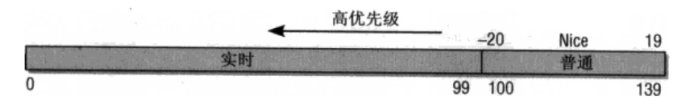

<!-- @import "[TOC]" {cmd="toc" depthFrom=1 depthTo=6 orderedList=false} -->

<!-- code_chunk_output -->

- [1 前景回顾](#1-前景回顾)
  - [1.1 linux 调度器的演变](#11-linux-调度器的演变)
  - [1.2 Linux 的调度器组成](#12-linux-的调度器组成)
  - [1.3 优先级的内核表示](#13-优先级的内核表示)
  - [1.4 进程的优先级表示](#14-进程的优先级表示)
- [2 负荷权重](#2-负荷权重)
  - [2.1 负荷权重结构 struct load_weight](#21-负荷权重结构-struct-load_weight)
  - [2.2 调度实体的负荷权重 load](#22-调度实体的负荷权重-load)
  - [2.3 进程的负荷权重](#23-进程的负荷权重)
- [3 优先级和权重的转换](#3-优先级和权重的转换)
  - [3.1 优先级->权重转换表](#31-优先级-权重转换表)
  - [3.2 linux-4.4 之前的 shced_prio_to_weight 和 sched_prio_to_wmult](#32-linux-44-之前的-shced_prio_to_weight-和-sched_prio_to_wmult)
  - [3.3 1.25 的乘积因子](#33-125-的乘积因子)
- [4 进程负荷权重的计算](#4-进程负荷权重的计算)
  - [4.1 set_load_weight 依据静态优先级设置进程的负荷权重](#41-set_load_weight-依据静态优先级设置进程的负荷权重)
  - [4.2 scale_load 取得负荷权重的值](#42-scale_load-取得负荷权重的值)
  - [4.3 set_load_weight 的演变](#43-set_load_weight-的演变)
- [5 就绪队列的负荷权重](#5-就绪队列的负荷权重)
  - [5.1 cfs 就绪队列的负荷权重](#51-cfs-就绪队列的负荷权重)
  - [5.2 就绪队列的负荷权重计算](#52-就绪队列的负荷权重计算)
- [6 总结](#6-总结)

<!-- /code_chunk_output -->

Linux CFS 调度器之负荷权重 load_weight
=======


| 日期 | 内核版本 | 架构| 作者 | GitHub| CSDN |
| ------- |:-------:|:-------:|:-------:|:-------:|:-------:|
| 2016-07-29 | [Linux-4.6](http://lxr.free-electrons.com/source/?v=4.6) | X86 & arm | [gatieme](http://blog.csdn.net/gatieme) | [LinuxDeviceDrivers](https://github.com/gatieme/LDD-LinuxDeviceDrivers) | [Linux 进程管理与调度](http://blog.csdn.net/gatieme/article/details/51456569) |


Linux 内核使用 CFS 是来调度我们最常见的普通进程, 其所属调度器类为 fair_sched_class, 使用的调度策略包括 SCHED_NORMAL 和 SCHED_BATCH, 进程 task_struct 中 struct sched_entity se;字段标识的就是 CFS 调度器类的调度实体.


前面我们详细的了解了 linux 下进程优先级的表示以及其计算的方法, 我们了解到 linux 针对普通进程和实时进程分别使用静态优先级 static_prio 和实时优先级 rt_priority 来指定其默认的优先级别, 然后通过 normal_prio 函数将他们分别转换为普通优先级 normal_prio, 最终换算出动态优先级 prio, 动态优先级 prio 才是内核调度时候有限考虑的优先级字段

但是 CFS 完全公平调度器在调度进程的时候, 进程的重要性不仅是由优先级指定的, 而且还需要考虑保存在 task_struct->se.load 的负荷权重.


#1 前景回顾
-------

##1.1 linux 调度器的演变
-------


一开始的调度器是复杂度为**$O(n)$的始调度算法**(实际上每次会遍历所有任务, 所以复杂度为 O(n)), 这个算法的缺点是当内核中有很多任务时, 调度器本身就会耗费不少时间, 所以, 从 linux2.5 开始引入赫赫有名的**$O(1)$调度器**

然而, linux 是集全球很多程序员的聪明才智而发展起来的超级内核, 没有最好, 只有更好, 在$O(1)$调度器风光了没几天就又被另一个更优秀的调度器取代了, 它就是**CFS 调度器 Completely Fair Scheduler**. 这个也是在 2.6 内核中引入的, 具体为 2.6.23, 即从此版本开始, 内核使用 CFS 作为它的默认调度器, $O(1)$调度器被抛弃了, 其实 CFS 的发展也是经历了很多阶段, 最早期的楼梯算法(SD), 后来逐步对 SD 算法进行改进出 RSDL(Rotating Staircase Deadline Scheduler), 这个算法已经是"完全公平"的雏形了,  直至 CFS 是最终被内核采纳的调度器, 它从 RSDL/SD 中吸取了完全公平的思想, 不再跟踪进程的睡眠时间, 也不再企图区分交互式进程. 它将所有的进程都统一对待, 这就是公平的含义. CFS 的算法和实现都相当简单, 众多的测试表明其性能也非常优越


| 字段 | 版本 |
| --- |:----:|
| O(n)的始调度算法 | linux-0.11~2.4 |
| O(1)调度器 | linux-2.5 |
| CFS 调度器 | linux-2.6~至今 |


##1.2 Linux 的调度器组成
-------


**2 个调度器**

可以用两种方法来激活调度

* 一种是直接的, 比如进程打算睡眠或出于其他原因放弃 CPU

* 另一种是通过周期性的机制, 以固定的频率运行, 不时的检测是否有必要

因此当前 linux 的调度程序由两个调度器组成: **主调度器**, **周期性调度器**(两者又统称为**通用调度器(generic scheduler)**或**核心调度器(core scheduler)**)

并且每个调度器包括两个内容: **调度框架**(其实质就是两个函数框架)及**调度器类**


**6 种调度策略**

linux 内核目前实现了 6 中调度策略(即调度算法), 用于对不同类型的进程进行调度, 或者支持某些特殊的功能

* SCHED_NORMAL 和 SCHED_BATCH 调度普通的非实时进程

* SCHED_FIFO 和 SCHED_RR 和 SCHED_DEADLINE 则采用不同的调度策略调度实时进程

* SCHED_IDLE 则在系统空闲时调用 idle 进程.


**5 个调度器类**

而依据其调度策略的不同实现了 5 个调度器类, 一个调度器类可以用一种种或者多种调度策略调度某一类进程, 也可以用于特殊情况或者调度特殊功能的进程.


其所属进程的优先级顺序为
```c
stop_sched_class -> dl_sched_class -> rt_sched_class -> fair_sched_class -> idle_sched_class
```

**3 个调度实体**

调度器不限于调度进程, 还可以调度更大的实体, 比如实现组调度.

这种一般性要求调度器不直接操作进程, 而是处理可调度实体, 因此需要一个通用的数据结构描述这个调度实体,即 seched_entity 结构, 其实际上就代表了一个调度对象, 可以为一个进程, 也可以为一个进程组.

linux 中针对当前可调度的实时和非实时进程, 定义了类型为 seched_entity 的 3 个调度实体

* sched_dl_entity 采用 EDF 算法调度的实时调度实体

* sched_rt_entity 采用 Roound-Robin 或者 FIFO 算法调度的实时调度实体

* sched_entity 采用 CFS 算法调度的普通非实时进程的调度实体


**调度器整体框架**

每个进程都属于某个调度器类(由字段 task_struct->sched_class 标识), 由调度器类采用进程对应的调度策略调度(由 task_struct->policy )进行调度, task_struct 也存储了其对应的调度实体标识

linux 实现了 6 种调度策略, 依据其调度策略的不同实现了 5 个调度器类, 一个调度器类可以用一种或者多种调度策略调度某一类进程, 也可以用于特殊情况或者调度特殊功能的进程.


| 调度器类 | 调度策略 |  调度策略对应的调度算法 | 调度实体 | 调度实体对应的调度对象 |
| ------- |:-------:|:-------:|:-------:||:-------:|
| stop_sched_class | 无 | 无 | 无 | 特殊情况, 发生在 cpu_stop_cpu_callback 进行 cpu 之间任务迁移 migration 或者 HOTPLUG_CPU 的情况下关闭任务 |
| dl_sched_class | SCHED_DEADLINE | Earliest-Deadline-First 最早截至时间有限算法 | sched_dl_entity | 采用 DEF 最早截至时间有限算法调度实时进程 |
| rt_sched_class | SCHED_RR<br><br>SCHED_FIFO | Roound-Robin 时间片轮转算法<br><br>FIFO 先进先出算法 | sched_rt_entity | 采用 Roound-Robin 或者 FIFO 算法调度的实时调度实体 |
| fair_sched_class | SCHED_NORMAL<br><br>SCHED_BATCH | CFS 完全公平懂调度算法 |sched_entity | 采用 CFS 算法普通非实时进程 |
| idle_sched_class | SCHED_IDLE | 无 | 无 |特殊进程, 用于 cpu 空闲时调度空闲进程 idle |

它们的关系如下图


##1.3 优先级的内核表示
-------


内核使用一些简单的数值范围 0~139 表示内部优先级, 数值越低, 优先级越高.

从 0~99 的范围专供实时进程使用, nice 的值[-20,19]则映射到范围 100~139


>实时优先级范围是 0 到 MAX_RT_PRIO-1(即 99), 而普通进程的静态优先级范围是从 MAX_RT_PRIO 到 MAX_PRIO-1(即 100 到 139).

| 优先级范围 | 描述 |
| ------------- |:-------------:|
| 0——99 | 实时进程 |
| 100——139 | 非实时进程 |



##1.4 进程的优先级表示
-------


```c
struct task_struct
{
    /* 进程优先级
     * prio: 动态优先级, 范围为 100~139, 与静态优先级和补偿(bonus)有关
     * static_prio: 静态优先级, static_prio = 100 + nice + 20 (nice 值为-20~19,所以 static_prio 值为 100~139)
     * normal_prio: 没有受优先级继承影响的常规优先级, 具体见 normal_prio 函数, 跟属于什么类型的进程有关
     */
    int prio, static_prio, normal_prio;
    /* 实时进程优先级 */
    unsigned int rt_priority;
}
```

**动态优先级 静态优先级 实时优先级**


其中 task_struct 采用了三个成员表示进程的优先级:prio 和 normal_prio 表示动态优先级, static_prio 表示进程的静态优先级.

此外还用了一个字段 rt_priority 保存了实时进程的优先级


| 字段 | 描述 |
| ------------- |:-------------:|
| static_prio | 用于保存静态优先级, 是进程启动时分配的优先级, , 可以通过 nice 和 sched_setscheduler 系统调用来进行修改, 否则在进程运行期间会一直保持恒定 |
| prio | 保存进程的动态优先级 |
| normal_prio | 表示基于进程的静态优先级 static_prio 和调度策略计算出的优先级. 因此即使普通进程和实时进程具有相同的静态优先级, 其普通优先级也是不同的, 进程分叉(fork)时, 子进程会继承父进程的普通优先级 |
| rt_priority | 用于保存实时优先级 |


实时进程的优先级用实时优先级 rt_priority 来表示


#2 负荷权重
-------


##2.1 负荷权重结构 struct load_weight
-------

负荷权重用 struct load_weight 数据结构来表示, 保存着进程权重值 weight. 其定义在[/include/linux/sched.h, v=4.6, L1195](http://lxr.free-electrons.com/source/include/linux/sched.h?v=4.6#L1195), 如下所示

```c
struct load_weight {
 unsigned long weight;  /*  存储了权重的信息  */
 u32 inv_weight;     /*   存储了权重值用于重除的结果 weight * inv_weight = 2^32  */
};
```


##2.2 调度实体的负荷权重 load
-------

既然 struct load_weight 保存着进程的权重信息, 那么作为进程调度的实体, 必须将这个权重值与特定的进程 task_struct, 更一般的与通用的调度实体 sched_entity 相关联

struct sched_entity 作为进程调度的实体信息, 其内置了 load_weight 结构用于保存当前调度实体的权重, 参照 http://lxr.free-electrons.com/source/include/linux/sched.h?v=4.6#L1195

```c
struct sched_entity {
 struct load_weight      load;           /* for load-balancing */
 /*  ......  */
};
```

##2.3 进程的负荷权重

而进程可以被作为一个调度的实时, 其内部通过存储 struct sched_entity se 而间接存储了其 load_weight 信息, 参照 http://lxr.free-electrons.com/source/include/linux/sched.h?v=4.6#L1415

```c
struct task_struct
{
 /*  ......  */
 struct sched_entity se;
    /*  ......  */
}
```

因此我们就可以通过 task_statuct->se.load 获取负荷权重的信息, 而 set_load_weight 负责根据进程类型及其静态优先级计算符合权重.


#3 优先级和权重的转换
-------


##3.1 优先级->权重转换表
-------


一般这个概念是这样的, 进程每降低一个 nice 值(优先级提升), 则多获得 10%的 CPU 时间, 没升高一个 nice 值(优先级降低), 则放弃 10%的 CPU 时间.

为执行该策略, 内核需要将优先级转换为权重值, 并提供了一张优先级->权重转换表 sched_prio_to_weight, 内核不仅维护了负荷权重自身, 还保存另外一个数值, 用于负荷重除的结果, 即 sched_prio_to_wmult 数组, 这两个数组中的数据是一一对应的.


其中相关的数据结构定义在[kernel/sched/sched.h?v=4.6, L1132](http://lxr.free-electrons.com/source/kernel/sched/sched.h?v=4.6#L1132)

```c
//   http://lxr.free-electrons.com/source/kernel/sched/sched.h?v=4.6#L1132
/*
 * To aid in avoiding the subversion of "niceness" due to uneven distribution
 * of tasks with abnormal "nice" values across CPUs the contribution that
 * each task makes to its run queue's load is weighted according to its
 * scheduling class and "nice" value. For SCHED_NORMAL tasks this is just a
 * scaled version of the new time slice allocation that they receive on time
 * slice expiry etc.
 */


#define WEIGHT_IDLEPRIO                3     /*  SCHED_IDLE 进程的负荷权重  */
#define WMULT_IDLEPRIO         1431655765 /*  SCHED_IDLE 进程负荷权重的重除值  */


extern const int sched_prio_to_weight[40];
extern const u32 sched_prio_to_wmult[40];


// http://lxr.free-electrons.com/source/kernel/sched/core.c?v=4.6#L8484
/*
* Nice levels are multiplicative, with a gentle 10% change for every
* nice level changed. I.e. when a CPU-bound task goes from nice 0 to
* nice 1, it will get ~10% less CPU time than another CPU-bound task
* that remained on nice 0.
*
* The "10% effect" is relative and cumulative: from _any_ nice level,
* if you go up 1 level, it's -10% CPU usage, if you go down 1 level
* it's +10% CPU usage. (to achieve that we use a multiplier of 1.25.
* If a task goes up by ~10% and another task goes down by ~10% then
* the relative distance between them is ~25%.)
*/
const int sched_prio_to_weight[40] = {
/* -20 */     88761,     71755,     56483,     46273,     36291,
/* -15 */     29154,     23254,     18705,     14949,     11916,
/* -10 */      9548,      7620,      6100,      4904,      3906,
/*  -5 */      3121,      2501,      1991,      1586,      1277,
/*   0 */      1024,       820,       655,       526,       423,
/*   5 */       335,       272,       215,       172,       137,
/*  10 */       110,        87,        70,        56,        45,
/*  15 */        36,        29,        23,        18,        15,
};


/*
* Inverse (2^32/x) values of the sched_prio_to_weight[] array, precalculated.
*
* In cases where the weight does not change often, we can use the
* precalculated inverse to speed up arithmetics by turning divisions
* into multiplications:
*/
const u32 sched_prio_to_wmult[40] = {
/* -20 */     48388,     59856,     76040,     92818,    118348,
/* -15 */    147320,    184698,    229616,    287308,    360437,
/* -10 */    449829,    563644,    704093,    875809,   1099582,
/*  -5 */   1376151,   1717300,   2157191,   2708050,   3363326,
/*   0 */   4194304,   5237765,   6557202,   8165337,  10153587,
/*   5 */  12820798,  15790321,  19976592,  24970740,  31350126,
/*  10 */  39045157,  49367440,  61356676,  76695844,  95443717,
/*  15 */ 119304647, 148102320, 186737708, 238609294, 286331153,
};
```

对内核使用的范围[-20, 19]中的每个 nice 级别, sched_prio_to_weight 数组都有一个对应项

nice [-20, 19] -=> 下标 [0, 39]

而由于权重`weight` 用`unsigned long` 表示, 因此内核无法直接存储 1/weight, 而必须借助于乘法和位移来执行除法的技术. sched_prio_to_wmult 数组就存储了这些值, 即 sched_prio_to_wmult 每个元素的值是 2^32/prio_to_weight$每个元素的值.

可以验证

$$sched\_prio\_to\_wmult[i] = \frac{2^{32}}{sched\_prio\_to\_weight[i]}$$

同时我们可以看到其定义了两个宏 WEIGHT_IDLEPRIO 和 WMULT_IDLEPRIO 这两个宏对应的就是 SCHED_IDLE 调度的进程的负荷权重信息, 因为要保证 SCHED_IDLE 进程的最低优先级和最低的负荷权重. 这点信息我们可以在后面分析 set_load_weight 函数的时候可以看到

可以验证

$$\frac{2^{32}}{WEIGHT_IDLEPRIO} = WMULT_IDLEPRIO$$


##3.2 linux-4.4 之前的 shced_prio_to_weight 和 sched_prio_to_wmult
-------

关于优先级->权重转换表 sched_prio_to_weight

在 linux-4.4 之前的内核中, 优先级权重转换表用 prio_to_weight 表示, 定义在[kernel/sched/sched.h, line 1116](http://lxr.free-electrons.com/source/kernel/sched/sched.h?v=4.4#L1116), 与它一同定义的还有 prio_to_wmult, 在[kernel/sched/sched.h, line 1139](http://lxr.free-electrons.com/source/kernel/sched/sched.h?v=4.4#L1139)
均被定义为 static const

但是其实这种能够方式不太符合规范的编码风格, 因此常规来说, 我们的头文件中不应该存储结构的定义, 即为了是程序的模块结构更加清晰, 头文件中尽量只包含宏或者声明, 而将具体的定义,  需要分配存储空间的代码放在源文件中.

否则如果在头文件中定义全局变量, 并且将此全局变量赋初值, 那么在多个引用此头文件的 C 文件中同样存在相同变量名的拷贝, 关键是此变量被赋了初值, 所以编译器就会将此变量放入 DATA 段, 最终在连接阶段, 会在 DATA 段中存在多个相同的变量, 它无法将这些变量统一成一个变量, 也就是仅为此变量分配一个空间, 而不是多份空间, 假定这个变量在头文件没有赋初值, 编译器就会将之放入 BSS 段, 连接器会对 BSS 段的多个同名变量仅分配一个存储空间

因此在新的内核中, 内核黑客们将这两个变量存放在了[kernel/sched/core.c](http://lxr.free-electrons.com/source/kernel/sched/core.c?v=4.6#L8472), 并加上了 sched_前缀, 以表明这些变量是在进程调度的过程中使用的, 而在[kernel/sched/sched.h, line 1144](http://lxr.free-electrons.com/source/kernel/sched/sched.h?v=4.6#L1144)中则只包含了他们的声明.


下面我们列出优先级权重转换表定义更新后对比项


| 内核版本 | 实现 | 地址 |
| ------------- |:-------------:|:-------------:|
| <= linux-4.4 | static const int prio_to_weight[40] |  [kernel/sched/sched.h, line 1116](http://lxr.free-electrons.com/source/kernel/sched/sched.h?v=4.4#L1116) |
| >=linux-4.5 | const int sched_prio_to_weight[40] | 声明在[kernel/sched/sched.h, line 1144](http://lxr.free-electrons.com/source/kernel/sched/sched.h?v=4.6#L1144), 定义在[kernel/sched/core.c](http://lxr.free-electrons.com/source/kernel/sched/core.c?v=4.6#L8472)

其定义并没有发生变化, 依然是一个一对一 NICE to WEIGHT 的转换表


##3.3 1.25 的乘积因子
-------


各数组之间的乘积因子是 1.25. 要知道为何使用该因子, 可考虑下面的例子

两个进程 A 和 B 在 nice 级别 0, 即静态优先级 120 运行, 因此两个进程的 CPU 份额相同, 都是 50%, nice 级别为 0 的进程, 查其权重表可知是 1024. 每个进程的份额是 1024/(1024+1024)=0.5, 即 50%

如果进程 B 的优先级+1(优先级降低), 成为 nice=1, 那么其 CPU 份额应该减少 10%, 换句话说进程 A 得到的总的 CPU 应该是 55%, 而进程 B 应该是 45%. 优先级增加 1 导致权重减少, 即 1024/1.25=820, 而进程 A 仍旧是 1024, 则进程 A 现在将得到的 CPU 份额是 1024/(1024+820=0.55, 而进程 B 的 CPU 份额则是 820/(1024+820)=0.45. 这样就正好产生了 10%的差值.


#4 进程负荷权重的计算
-------


set_load_weight 负责根据非实时进程类型极其静态优先级计算符合权重
而实时进程不需要 CFS 调度, 因此无需计算其负荷权重值


>早期的代码中实时进程也是计算其负荷权重的, 但是只是采用一些方法保持其权重值较大
>
>在早期有些版本中, set_load_weight 中实时进程的权重是普通进程的两倍, 后来又设置成 0, 直到后来 linux-2.6.37 开始不再设置实时进程的优先级, 因此这本身就是一个无用的工作
>
>而另一方面, SCHED_IDLE 进程的权值总是非常小, 普通非实时进程则根据其静态优先级设置对应的负荷权重


##4.1 set_load_weight 依据静态优先级设置进程的负荷权重
-------


```c
static void set_load_weight(struct task_struct *p)
{
 /*  由于数组中的下标是 0~39, 普通进程的优先级是[100~139]
         因此通过 static_prio - MAX_RT_PRIO 将静态优先级转换成为数组下标
    */
    int prio = p->static_prio - MAX_RT_PRIO;
    /*  取得指向进程 task 负荷权重的指针 load,
         下面修改 load 就是修改进程的负荷权重  */
    struct load_weight *load = &p->se.load;

    /*
     * SCHED_IDLE tasks get minimal weight:
     * 必须保证 SCHED_IDLE 进程的负荷权重最小
     * 其权重 weight 就是 WEIGHT_IDLEPRIO
     * 而权重的重除结果就是 WMULT_IDLEPRIO
     */
    if (p->policy == SCHED_IDLE) {
        load->weight = scale_load(WEIGHT_IDLEPRIO);
        load->inv_weight = WMULT_IDLEPRIO;
        return;
    }

    /*  设置进程的负荷权重 weight 和权重的重除值 inv_weight  */
    load->weight = scale_load(prio_to_weight[prio]);
    load->inv_weight = prio_to_wmult[prio];
}
```

##4.2 scale_load 取得负荷权重的值
-------

其中 scale_load 是一个宏, 定义在[include/linux/sched.h, line 785](http://lxr.free-electrons.com/source/include/linux/sched.h?v=3.9?v=4.6#L785)


```c
#if 0 /* BITS_PER_LONG > 32 -- currently broken: it increases power usage under light load  */
# define SCHED_LOAD_RESOLUTION  10
# define scale_load(w)          ((w) << SCHED_LOAD_RESOLUTION)
# define scale_load_down(w)     ((w) >> SCHED_LOAD_RESOLUTION)
#else
# define SCHED_LOAD_RESOLUTION  0
# define scale_load(w)          (w)
# define scale_load_down(w)     (w)
#endif
```

我们可以看到目前版本的 scale_load 其实什么也没做就是简单取了个值, 但是我们注意到负荷权重仍然保留了 SCHED_LOAD_RESOLUTION 不为 0 的情形, 只不过目前因为效率原因和功耗问题没有启用而已


##4.3 set_load_weight 的演变
-------

linux 内核的调度器经过了不同阶段的发展, 但是即使是同一个调度器其算法也不是一成不变的, 也在不停的改进和优化

| 内核版本 | 实现 | 地址 |
| ------------- |:-------------:|:-------------:|
| 2.6.18~2.6.22 | 实时进程的权重用 RTPRIO_TO_LOAD_WEIGHT(p->rt_priority);转换 | [kernel/sched.c#L746](http://lxr.linux.no/linux+v2.6.18/kernel/sched.c#L746) |
| 2.6.23~2.6.34 |  实时进程的权重为非实时权重的二倍 | [kernel/sched.c#L1836](http://lxr.linux.no/linux+v2.6.32/kernel/sched.c#1836) |
| 2.6.35~2.6.36| 实时进程的权重设置为 0, 重除值设置为 WMULT_CONST | [kernel/sched.c, L1859](http://lxr.linux.no/linux+v2.6.36/kernel/sched.c#L1859) |
| 2.6.37~至今 4.6 | 实时进程不再设置权重 | 其中<= linux-3.2 时, 代码在 sched.c 中<br>3.3~4.4 之后, 增加了[sched/core.c](http://lxr.linux.no/linux+v4.4/kernel/sched/core.c#L812)文件调度的核心代码在此存放<br>4.5~至今, [修改 prio_to_weight 为 sched_prio_to_weight](http://lxr.linux.no/linux+v4.5/kernel/sched/core.c#L813), 并将声明存放头文件中 |


#5 就绪队列的负荷权重
-------

不仅进程, 就绪队列也关联到一个负荷权重. 这个我们在前面讲[Linux 进程调度器的设计--Linux 进程的管理与调度(十七)](http://blog.csdn.net/gatieme/article/details/51702662)的时候提到过了在 cpu 的就绪队列 rq 和 cfs 调度器的就绪队列 cfs_rq 中都保存了其 load_weight.

这样不仅确保就绪队列能够跟踪记录有多少进程在运行, 而且还能将进程的权重添加到就绪队列中.


##5.1 cfs 就绪队列的负荷权重
-------

```c
//  http://lxr.free-electrons.com/source/kernel/sched/sched.h?v=4.6#L596
struct rq
{
 /*  ......  */
    /* capture load from *all* tasks on this cpu: */
    struct load_weight load;
 /*  ......  */
};

//  http://lxr.free-electrons.com/source/kernel/sched/sched.h?v=4.6#L361
/* CFS-related fields in a runqueue */
struct cfs_rq
{
 struct load_weight load;
 unsigned int nr_running, h_nr_running;
 /*  ......  */
};

//  http://lxr.free-electrons.com/source/kernel/sched/sched.h?v=4.6#L596
struct rt_rq 中不需要负荷权重

//  http://lxr.free-electrons.com/source/kernel/sched/sched.h?v=4.6#L490
struct dl_rq 中不需要负荷权重
```

由于负荷权重仅用于调度普通进程(非实时进程), 因此只在 cpu 的就绪队列队列 rq 和 cfs 调度器的就绪队列 cfs_rq 上需要保存其就绪队列的信息, 而实时进程的就绪队列 rt_rq 和 dl_rq
是不需要保存负荷权重的.


##5.2 就绪队列的负荷权重计算
-------


就绪队列的负荷权重存储的其实就是队列上所有进程的负荷权重的总和, 因此每次进程被加到就绪队列的时候,  就需要在就绪队列的负荷权重中加上进程的负荷权重, 同时由于就绪队列的不是一个单独被调度的实体, 也就不需要优先级到负荷权重的转换, 因而其不需要负荷权重的重除字段, 即 inv_weight = 0;

因此进程从就绪队列上入队或者出队的时候, 就绪队列的负荷权重就加上或者减去进程的负荷权重, 但是


```c
//struct load_weight {
 /*  就绪队列的负荷权重 +/-   入队/出队进程的负荷权重  */
 unsigned long weight +/- task_struct->se->load->weight;
    /*  就绪队列负荷权重的重除字段无用途, 所以始终置 0  */
 u32 inv_weight = 0;
//};
```

因此内核为我们提供了增加/减少/重置就绪队列负荷权重的的函数, 分别是 update_load_add, update_load_sub, update_load_set

```c
/* 使得 lw 指向的负荷权重的值增加 inc, 用于进程进入就绪队列时调用
 *  进程入队 account_entity_enqueue    kernel/sched/fair.c#L2422
 */

static inline void update_load_add(struct load_weight *lw, unsigned long inc)
{
    lw->weight += inc;
    lw->inv_weight = 0;
}

/*  使得 lw 指向的负荷权重的值减少 inc, 用于进程调出就绪队列时调用
 *  进程出队 account_entity_dequeue    kernel/sched/fair.c#L2422*/
static inline void update_load_sub(struct load_weight *lw, unsigned long dec)
{
    lw->weight -= dec;
    lw->inv_weight = 0;
}

static inline void update_load_set(struct load_weight *lw, unsigned long w)
{
    lw->weight = w;
    lw->inv_weight = 0;
}
````


| 函数 | 描述 | 调用时机 | 定义位置 | 调用位置 |
| ---- |:-----|:----|:----|:----|
| update\_load\_add | 使得 lw 指向的负荷权重的值增加 inc | 用于进程进入就绪队列时调用 | [kernel/sched/fair.c, L117](http://lxr.free-electrons.com/source/kernel/sched/fair.c?v=4.6#L117) | [account\_entity\_enqueue 两处](http://lxr.free-electrons.com/source/kernel/sched/fair.c?v=4.6#L2420), [sched\_slice](http://lxr.free-electrons.com/source/kernel/sched/fair.c?v=4.6#L640) |
| update\_load\_sub | 使得 lw 指向的负荷权重的值减少 inc | 用于进程调出就绪队列时调用 |  [update\_load\_sub, L123](http://lxr.free-electrons.com/source/kernel/sched/fair.c?v=4.6#L123) | [account\_entity\_dequeue 两处](http://lxr.free-electrons.com/source/kernel/sched/fair.c?v=4.6#L2437) |
| update\_load\_set |


>其中 sched_slice 函数计算当前进程在调度延迟内期望的运行时间, 它根据 cfs 就绪队列中进程数确定一个最长时间间隔, 然后看在该时间间隔内当前进程按照权重比例执行


#6 总结
-------


**负荷权重 load_weight**
CFS 完全公平调度器在调度非实时进程的时候, 进程的重要性不仅是由优先级指定的, 还需要考虑保存在 task_struct->se.load 的负荷权重.


**转换表 prio_to_weight 和重除表 ched_prio_to_wmult**
这个负荷权重用 struct load_weight, 其包含了名为 weight 的负荷权重信息, 为了方便快速的将静态优先级转换成权重值, 内核提供了一个长为 40 的 prio_to_weight 数组方便转换, 静态优先级[100~139], 对应 nice 值[-20, 19], 对应数组中的下标[0, 39]

由于权重`weight` 用`unsigned long` 表示, 因此内核无法直接存储 1/weight, 而必须借助于乘法和位移来执行除法的技术. sched_prio_to_wmult 数组就存储了这些值, 即 sched_prio_to_wmult 每个元素的值是 2^32/prio_to_weight$每个元素的值.


对于 SCHED_IDLE 进程其优先级最低, 因此其负荷权重也要尽可能的小, 因此内核用 WEIGHT_IDLEPRIO( = 3)和 WMULT_IDLEPRIO 分别表示了 SCHED_IDLE 进程的负荷权重和重除值.


**调度实体负荷权重的计算**

>既然 CFS 把负荷权重作为进程调度的一个重要依据, 那么我们就需要了解调度器是如何计算进程或者调度实体的负荷权重的.


有了 prio_to_weight 和 ched_prio_to_wmult 这两个转换表, 我们就可以很方便的将非实时进程的静态优先级转换成负荷权重, 这个其实就是一个很简单的查表得过程, 内核用 set_load_weight 完成这个工作, 同时也保证了 SCHED_LDLE 进程的负荷权重最小


* 将进程的静态优先级[100, 139]转换成数组下标[0, 39]

* 如果进程是 SCHED_IDLE 调度, 则负荷权重直赋值为 WEIGHT_IDLEPRIO( = 3)和 WMULT_IDLEPRIO

* 对于普通进程, 从 prio_to_weight 和 sched_prio_to_wmult 中查找出对应优先级的负荷权重值和重除值


现在的内核中是实时进程是不依靠负荷权重的, 因此也就不需要计算实时进程的负荷权重, 但是早期的内核中实时进程的负荷权重设置为普通进程的两倍, 以保证权重比非实时进程大

**调度实体的负荷权重**

既然 load_weight 保存着进程的权重信息, 那么作为进程调度的实体, 必须将这个权重值与特定的进程 task_struct, 更一般的与通用的调度实体 sched_entity 相关联

sched_entity 作为进程调度的实体信息, 其内置了 load_weight 结构用于保存当前调度实体的权重, [参照](http://lxr.free-electrons.com/source/include/linux/sched.h?v=4.6#L1195)


同时进程作为调度实体的最一般单位, 其 load_weight 就存储在其 struct sched_entity *se 成员中, 可以通过 task_struct->se.load 访问进程的负荷权重.


**就绪队列的负荷权重**

然后内核也在全局 cpu 就绪队列 rq 中 cfs 的就绪队列 cfs_rq 中保存了 load_weight, 这就可以很方便的统计出整个就绪队列的负荷权重总和, 为进程调度提供参考, 因此在每次进程入队或者出队的时候就需要通过修改就绪队列的负荷权重, 内核为我们提供了增加/减少/重置就绪队列负荷权重的的函数, 分别是 update_load_add, update_load_sub, update_load_set, 而由于就绪队列的负荷权重只关心权重值, 因此其重除字段 inv_weight 恒为 0

同时需要**注意**的是, 由于实时进程不依赖于负荷权重的, 因此实时进程的就绪队列 rt_qt 和 dl_rq 中不需要存储 load_weight.


