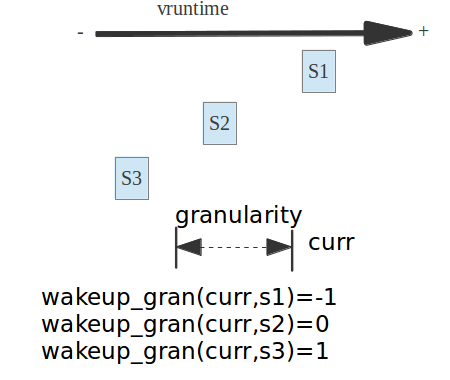

<!-- @import "[TOC]" {cmd="toc" depthFrom=1 depthTo=6 orderedList=false} -->

<!-- code_chunk_output -->

- [1 前景回顾](#1-前景回顾)
  - [1.1 CFS 调度算法](#11-cfs-调度算法)
  - [1.2  负荷权重和虚拟时钟](#12--负荷权重和虚拟时钟)
  - [1.3 CFS 进程入队和出队](#13-cfs-进程入队和出队)
  - [1.4 今日看点(CFS 如何选择最合适的进程)](#14-今日看点 cfs-如何选择最合适的进程)
- [2 simple 无组调度最简单的 pick_next_task_fair](#2-simple-无组调度最简单的-pick_next_task_fair)
  - [2.1 simple 的基本流程](#21-simple-的基本流程)
  - [2.2  put_prev_task](#22--put_prev_task)
    - [2.2.1 **全局 put_prev_task 函数**](#221-全局-put_prev_task-函数)
    - [2.2.2 **CFS 的 put_prev_task_fair 函数**](#222-cfs-的-put_prev_task_fair-函数)
    - [2.2.3 **put_prev_entity 函数**](#223-put_prev_entity-函数)
  - [2.3  pick_next_entity](#23--pick_next_entity)
    - [2.3.1 **pick_next_entity 函数完全注释**](#231-pick_next_entity-函数完全注释)
    - [2.3.2 **从 left, second 和 curr 进程中选择最优的进程**](#232-从-left-second-和-curr-进程中选择最优的进程)
    - [2.3.3 **cfs_rq 的 last 和 next 指针域**](#233-cfs_rq-的-last-和-next-指针域)
    - [2.3.4 **wakeup_preempt_entity 检查是否可以被抢占**](#234-wakeup_preempt_entity-检查是否可以被抢占)
  - [2.4  set_next_entity](#24--set_next_entity)
- [3 idle 进程的调度](#3-idle-进程的调度)
- [4 组调度策略的支持](#4-组调度策略的支持)
- [5 与主调度器 schedule 进行通信](#5-与主调度器-schedule-进行通信)
- [6 总结](#6-总结)

<!-- /code_chunk_output -->

Linux CFS 调度器之 pick_next_task_fair 选择下一个被调度的进程
=======


| 日期 | 内核版本 | 架构| 作者 | GitHub| CSDN |
| ------- |:-------:|:-------:|:-------:|:-------:|:-------:|
| 2016-06-29 | [Linux-4.6](http://lxr.free-electrons.com/source/?v=4.6) | X86 & arm | [gatieme](http://blog.csdn.net/gatieme) | [LinuxDeviceDrivers](https://github.com/gatieme/LDD-LinuxDeviceDrivers) | [Linux 进程管理与调度](http://blog.csdn.net/gatieme/article/details/51456569) |


CFS 负责处理普通非实时进程, 这类进程是我们 linux 中最普遍的进程


#1 前景回顾
-------

##1.1 CFS 调度算法
-------

**CFS 调度算法的思想**

理想状态下每个进程都能获得相同的时间片, 并且同时运行在 CPU 上, 但实际上一个 CPU 同一时刻运行的进程只能有一个. 也就是说, 当一个进程占用 CPU 时, 其他进程就必须等待. CFS 为了实现公平, 必须惩罚当前正在运行的进程, 以使那些正在等待的进程下次被调度.

##1.2  负荷权重和虚拟时钟

**虚拟时钟是红黑树排序的依据**

具体实现时, CFS 通过每个进程的**虚拟运行时间(vruntime)**来衡量哪个进程最值得被调度. CFS 中的就绪队列是一棵以 vruntime 为键值的红黑树, 虚拟时间越小的进程越靠近整个红黑树的最左端. 因此, 调度器每次选择位于红黑树最左端的那个进程, 该进程的 vruntime 最小.

**优先级计算负荷权重, 负荷权重和当前时间计算出虚拟运行时间**

虚拟运行时间是通过进程的实际运行时间和进程的权重(weight)计算出来的. 在 CFS 调度器中, 将进程优先级这个概念弱化, 而是强调进程的权重. 一个进程的权重越大, 则说明这个进程更需要运行, 因此它的虚拟运行时间就越小, 这样被调度的机会就越大. 而, CFS 调度器中的权重在内核是对用户态进程的优先级 nice 值, 通过 prio_to_weight 数组进行 nice 值和权重的转换而计算出来的


**虚拟时钟相关公式**

 linux 内核采用了计算公式:

| 属性 | 公式 | 描述 |
|:-------:|:-------:|
| ideal_time | sum_runtime *se.weight/cfs_rq.weight | 每个进程应该运行的时间 |
| sum_exec_runtime |  | 运行队列中所有任务运行完一遍的时间 |
| se.weight |  | 当前进程的权重 |
| cfs.weight |  | 整个 cfs_rq 的总权重 |

这里 se.weight 和 cfs.weight 根据上面讲解我们可以算出, sum_runtime 是怎们计算的呢, linux 内核中这是个经验值, 其经验公式是

| 条件 | 公式 |
|:-------:|:-------:|
| 进程数 > sched_nr_latency | sum_runtime=sysctl_sched_min_granularity *nr_running |
| 进程数 <=sched_nr_latency | sum_runtime=sysctl_sched_latency = 20ms |

>注: sysctl_sched_min_granularity =4ms
>
>sched_nr_latency 是内核在一个延迟周期中处理的最大活动进程数目

linux 内核代码中是通过一个叫 vruntime 的变量来实现上面的原理的, 即:

每一个进程拥有一个 vruntime,每次需要调度的时候就选运行队列中拥有最小 vruntime 的那个进程来运行, vruntime 在时钟中断里面被维护, 每次时钟中断都要更新当前进程的 vruntime,即 vruntime 以如下公式逐渐增长:


| 条件 | 公式 |
|:-------:|:-------:|
| curr.nice!=NICE_0_LOAD | vruntime +=  delta* NICE_0_LOAD/se.weight; |
| curr.nice=NICE_0_LOAD | vruntime += delta; |


##1.3 CFS 进程入队和出队
-------

enqueue_task_fair 和 dequeue_task_fair 分别用来向 CFS 就绪队列中添加或者删除进程

完全公平调度器 CFS 中有两个函数可用来增删队列的成员:enqueue_task_fair 和 dequeue_task_fair 分别用来向 CFS 就绪队列中添加或者删除进程


**enqueue_task_fair 进程入队**

向就绪队列中放置新进程的工作由函数 enqueue_task_fair 函数完成, 该函数定义在[kernel/sched/fair.c, line 5442](http://lxr.free-electrons.com/source/kernel/sched/fair.c?v=4.6#L5442), 其函数原型如下

该函数将 task_struct *p 所指向的进程插入到 rq 所在的就绪队列中, 除了指向所述的就绪队列 rq 和 task_struct 的指针外, 该函数还有另外一个参数 wakeup. 这使得可以指定入队的进程是否最近才被唤醒并转换为运行状态(此时需指定 wakeup = 1), 还是此前就是可运行的(那么 wakeup = 0).

```c
static void
enqueue_task_fair(struct rq *rq, struct task_struct *p, int flags)
```
enqueue_task_fair 的执行流程如下

* 如果通过 struct sched_entity 的 on_rq 成员判断进程已经在就绪队列上, 则无事可做.

* 否则, 具体的工作委托给 enqueue_entity 完成, 其中内核会借机用 update_curr 更新统计量
 在 enqueue_entity 内部如果需要会调用__enqueue_entity 将进程插入到 CFS 红黑树中合适的结点


**dequeue_task_fair 进程出队操作**

dequeue_task_fair 函数在完成睡眠等情况下调度, 将任务从就绪队列中移除

其执行的过程正好跟 enqueue_task_fair 的思路相同, 只是操作刚好相反


enqueue_task_fair 的执行流程如下

* 如果通过 struct sched_entity 的 on_rq 成员判断进程已经在就绪队列上, 则无事可做.

* 否则, 具体的工作委托给 dequeue_entity 完成, 其中内核会借机用 update_curr 更新统计量
 在 enqueue_entity 内部如果需要会调用__dequeue_entity 将进程插入到 CFS 红黑树中合适的结点


##1.4 今日看点(CFS 如何选择最合适的进程)
-------


每个调度器类 sched_class 都必须提供一个 pick_next_task 函数用以在就绪队列中选择一个最优的进程来等待调度, 而我们的 CFS 调度器类中, 选择下一个将要运行的进程由 pick_next_task_fair 函数来完成


之前我们在将主调度器的时候, 主调度器 schedule 函数在进程调度抢占时, 会通过__schedule 函数调用全局 pick_next_task 选择一个最优的进程, 在 pick_next_task 中我们就按照优先级依次调用不同调度器类提供的 pick_next_task 方法

今天就让我们窥探一下完全公平调度器类 CFS 的 pick_next_task 方法 pick_next_fair


**pick_next_task_fair**

选择下一个将要运行的进程 pick_next_task_fair 执行. 其代码执行流程如下

对于 pick_next_task_fair 函数的讲解, 我们从 simple 标签开始, 这个是常规状态下 pick_next 的思路, 简单的来说 pick_next_task_fair 的函数框架如下

```c
again:
 控制循环来读取最优进程

#ifdef CONFIG_FAIR_GROUP_SCHED
 完成组调度下的 pick_next 选择
    返回被选择的调度时实体的指针
#endif

simple:
 最基础的 pick_next 函数
   返回被选择的调度时实体的指针

idle :
 如果系统中没有可运行的进行, 则需要调度 idle 进程
```

可见我们会发现,

* simple 标签是 CFS 中最基础的 pick_next 操作

* idle 则使得在没有进程被调度时, 调度 idle 进程

* again 标签用于循环的进行 pick_next 操作

* CONFIG_FAIR_GROUP_SCHED 宏指定了组调度情况下的 pick_next 操作, 如果不支持组调度, 则 pick_next_task_fair 将直接从 simple 开始执行


#2 simple 无组调度最简单的 pick_next_task_fair
-------

在不支持组调度情况下(选项 CONFIG_FAIR_GROUP_SCHED), CFS 的 pick_next_task_fair 函数会直接执行 simple 标签, 优选下一个函数, 这个流程清晰而且简单, 但是已经足够我们理解 cfs 的 pick_next 了

##2.1 simple 的基本流程
-------

pick_next_task_fair 函数的 simple 标签定义在[kernel/sched/fair.c, line 5526)](http://lxr.free-electrons.com/source/kernel/sched/fair.c?v=4.6#L5526), 代码如下所示


```c
simple:
    cfs_rq = &rq->cfs;
#endif
    /*  如果 nr_running 计数器为 0,
     *  当前队列上没有可运行进程,
     *  则需要调度 idle 进程  */
    if (!cfs_rq->nr_running)
        goto idle;
    /*  将当前进程放入运行队列的合适位置  */
    put_prev_task(rq, prev);

    do
    {
        /*  选出下一个可执行调度实体(进程)  */
        se = pick_next_entity(cfs_rq, NULL);
        /*  把选中的进程从红黑树移除, 更新红黑树
         *  set_next_entity 会调用__dequeue_entity 完成此工作  */
        set_next_entity(cfs_rq, se);
        /*  group_cfs_rq return NULL when !CONFIG_FAIR_GROUP_SCHED
         *  在非组调度情况下, group_cfs_rq 返回了 NULL  */
        cfs_rq = group_cfs_rq(se);
    } while (cfs_rq);  /*  在没有配置组调度选项(CONFIG_FAIR_GROUP_SCHED)的情况下.group_cfs_rq()返回 NULL.因此,上函数中的循环只会循环一次  */


    /*  获取到调度实体指代的进程信息  */
    p = task_of(se);

    if (hrtick_enabled(rq))
        hrtick_start_fair(rq, p);

    return p;
```

其基本流程如下

| 流程 | 描述 |
|:-------:|:-------:|
| !cfs_rq->nr_running -=>  goto idle; | 如果 nr_running 计数器为 0, 当前队列上没有可运行进程, 则需要调度 idle 进程 |
| put_prev_task(rq, prev); | 将当前进程放入运行队列的合适位置, 每次当进程被调度后都会使用 set_next_entity 从红黑树中移除, 因此被抢占时需要重新加如红黑树中等待被调度 |
| se = pick_next_entity(cfs_rq, NULL); | 选出下一个可执行调度实体 |
| set_next_entity(cfs_rq, se); | set_next_entity 会调用__dequeue_entity 把选中的进程从红黑树移除, 并更新红黑树 |


##2.2  put_prev_task
-------


###2.2.1 **全局 put_prev_task 函数**


put_prev_task 用来将前一个进程 prev 放回到就绪队列中, 这是一个全局的函数, 而每个调度器类也必须实现一个自己的 put_prev_task 函数(比如 CFS 的 put_prev_task_fair),

由于 CFS 调度的时候, prev 进程不一定是一个 CFS 调度的进程, 因此必须调用全局的 put_prev_task 来调用 prev 进程所属调度器类 sched_class 的对应 put_prev_task 方法, 完成将进程放回到就绪队列中


全局的 put_prev_task 函数定义在[kernel/sched/sched.h, line 1245](http://lxr.free-electrons.com/source/kernel/sched/sched.h?v=4.6#L1245), 代码如下所示
```c
static inline void put_prev_task(struct rq *rq, struct task_struct *prev)
{
 prev->sched_class->put_prev_task(rq, prev);
}
```

###2.2.2 **CFS 的 put_prev_task_fair 函数**


然后我们来分析一下 CFS 的 put_prev_task_fair 函数, 其定义在[kernel/sched/fair.c, line 5572](http://lxr.free-electrons.com/source/kernel/sched/fair.c?v=4.6#L5572)

在选中了下一个将被调度执行的进程之后, 回到 pick_next_task_fair 中, 执行 set_next_entity

```c
/*
 * Account for a descheduled task:
 */
static void put_prev_task_fair(struct rq *rq, struct task_struct *prev)
{
    struct sched_entity *se = &prev->se;
    struct cfs_rq *cfs_rq;

    for_each_sched_entity(se) {
        cfs_rq = cfs_rq_of(se);
        put_prev_entity(cfs_rq, se);
    }
}
```

前面我们说到过函数在组策略情况下, 调度实体之间存在父子的层次, for_each_sched_entity 会从当前调度实体开始,　然后循环向其父调度实体进行更新, 非组调度情况下则只执行一次

而 put_prev_task_fair 函数最终会调用 put_prev_entity 函数将 prev 的调度时提 se 放回到就绪队列中等待下次调度


###2.2.3 **put_prev_entity 函数**

[put_prev_entity](http://lxr.free-electrons.com/source/kernel/sched/fair.c?v=4.6#L3443)函数定义在[kernel/sched/fair.c, line 3443](http://lxr.free-electrons.com/source/kernel/sched/fair.c?v=4.6#L3443), 他在更新了虚拟运行时间等信息后, 最终通过__enqueue_entity 函数将 prev 进程(即 current 进程)放回就绪队列 rq 上


##2.3  pick_next_entity
-------

###2.3.1 **pick_next_entity 函数完全注释**
-------

```c
/*
 * Pick the next process, keeping these things in mind, in this order:
 * 1) keep things fair between processes/task groups
 * 2) pick the "next" process, since someone really wants that to run
 * 3) pick the "last" process, for cache locality
 * 4) do not run the "skip" process, if something else is available
 *
 *  1. 首先要确保任务组之间的公平, 这也是设置组的原因之一
 *  2. 其次, 挑选下一个合适的(优先级比较高的)进程
 *     因为它确实需要马上运行
 *  3. 如果没有找到条件 2 中的进程
 *     那么为了保持良好的局部性
 *     则选中上一次执行的进程
 *  4. 只要有任务存在, 就不要让 CPU 空转,
 *     只有在没有进程的情况下才会让 CPU 运行 idle 进程
 */
static struct sched_entity *
pick_next_entity(struct cfs_rq *cfs_rq, struct sched_entity *curr)
{
    /*  摘取红黑树最左边的进程  */
    struct sched_entity *left = __pick_first_entity(cfs_rq);
    struct sched_entity *se;

    /*
     * If curr is set we have to see if its left of the leftmost entity
     * still in the tree, provided there was anything in the tree at all.
     *
     * 如果
     * left == NULL  或者
     * curr != NULL curr 进程比 left 进程更优(即 curr 的虚拟运行时间更小)
     * 说明 curr 进程是自动放弃运行权利, 且其比最左进程更优
     * 因此将 left 指向了 curr, 即 curr 是最优的进程
     */
    if (!left || (curr && entity_before(curr, left)))
    {
        left = curr;
    }

    /* se = left 存储了 cfs_rq 队列中最优的那个进程
     * 如果进程 curr 是一个自愿放弃 CPU 的进程(其比最左进程更优), 则取 se = curr
     * 否则进程 se 就取红黑树中最左的进程 left, 它必然是当前就绪队列上最优的
     */
    se = left; /* ideally we run the leftmost entity */

    /*
     * Avoid running the skip buddy, if running something else can
     * be done without getting too unfair.
     *
     * cfs_rq->skip 存储了需要调过不参与调度的进程调度实体
     * 如果我们挑选出来的最优调度实体 se 正好是 skip
     * 那么我们需要选择次优的调度实体 se 来进行调度
     * 由于之前的 se = left = (curr before left) curr left
     * 则如果 se == curr == skip, 则选择 left = __pick_first_entity 进行即可
     * 否则则 se == left == skip, 则选择次优的那个调度实体 second
     */
    if (cfs_rq->skip == se)
    {
        struct sched_entity *second;

        if (se == curr) /* se == curr == skip 选择最左的那个调度实体 left  */
        {
            second = __pick_first_entity(cfs_rq);
        }
        else    /*  否则 se == left == skip, 选择次优的调度实体 second  */
        {
            /*  摘取红黑树上第二左的进程节点  */
            second = __pick_next_entity(se);
            /*  同时与 left 进程一样,
             * 如果
             * second == NULL 没有次优的进程  或者
             * curr != NULL curr 进程比 left 进程更优(即 curr 的虚拟运行时间更小)
             * 说明 curr 进程比最 second 进程更优
             * 因此将 second 指向了 curr, 即 curr 是最优的进程*/
            if (!second || (curr && entity_before(curr, second)))
                second = curr;
        }

        /* 判断 left 和 second 的 vruntime 的差距是否小于 sysctl_sched_wakeup_granularity
         * 即如果 second 能抢占 left */
        if (second && wakeup_preempt_entity(second, left) < 1)
            se = second;
    }

    /*
     * Prefer last buddy, try to return the CPU to a preempted task.
     *
     *
     */
    if (cfs_rq->last && wakeup_preempt_entity(cfs_rq->last, left) < 1)
        se = cfs_rq->last;

    /*
     * Someone really wants this to run. If it's not unfair, run it.
     */
    if (cfs_rq->next && wakeup_preempt_entity(cfs_rq->next, left) < 1)
        se = cfs_rq->next;

    /* 用过一次任何一个 next 或者 last
     * 都需要清除掉这个指针
     * 以免影响到下次 pick next sched_entity  */
    clear_buddies(cfs_rq, se);

    return se;
}
```

###2.3.2 **从 left, second 和 curr 进程中选择最优的进程**
-------


pick_next_entity 则从 CFS 的红黑树中摘取一个最优的进程, 这个进程往往在红黑树的最左端, 即 vruntime 最小, 但是也有例外, 但是不外乎这几个进程

| 调度实体 | 描述 |
|:-------:|:-------:|
| left = __pick_first_entity(cfs_rq) | **红黑树的最左节点**, 这个节点拥有当前队列中 vruntime 最小的特性, 即应该优先被调度 |
| second = __pick_first_entity(left) | **红黑树的次左节点**, 为什么这个节点也可能呢, 因为内核支持 skip 跳过某个进程的抢占权力的, 如果 left 被标记为 skip(由 cfs_rq->skip 域指定), 那么可能就需要找到次优的那个进程 |
| curr 结点 | curr 节点的 vruntime 可能比 left 和 second 更小, 但是由于它正在运行, 因此它不在红黑树中(进程抢占物理机的时候对应节点同时会从红黑树中删除), 但是如果其 vruntime 足够小, 意味着 cfs 调度器应该尽可能的补偿 curr 进程, 让它再次被调度 |

其中__pick_first_entity 会返回 cfs_rq 红黑树中的最左节点 rb_leftmost 所属的调度实体信息, 该函数定义在[kernel/sched/fair.c, line 543](http://lxr.free-electrons.com/source/kernel/sched/fair.c?v=4.6#L3443)

而__pick_next_entity(se)函数则返回 se 在红黑树中中序遍历的下一个节点信息, 该函数定义在[kernel/sched/fair.c, line 544](http://lxr.free-electrons.com/source/kernel/sched/fair.c?v=4.6#L3443), 获取下一个节点的工作可以通过内核红黑树的标准操作 rb_next 完成


###2.3.3 **cfs_rq 的 last 和 next 指针域**
-------

在 pick_next_entity 的最后, 要把红黑树最左下角的进程和另外两个进程(即 next 和 last)做比较, next 是抢占失败的进程, 而 last 则是抢占成功后被抢占的进程, 这三个进程到底哪一个是最优的 next 进程呢?

Linux CFS 实现的判决条件是:

1. 尽可能满足需要刚被唤醒的进程抢占其它进程的需求

2. 尽可能减少以上这种抢占带来的缓存刷新的影响


**cfs_rq 的 last 和 next 指针, last 表示最后一个执行 wakeup 的 sched_entity,next 表示最后一个被 wakeup 的 sched_entity. 他们在进程 wakeup 的时候会赋值, 在 pick 新 sched_entity 的时候, 会优先选择这些 last 或者 next 指针的 sched_entity,有利于提高缓存的命中率** **

因此我们优选出来的进程必须同 last 和 next 指针域进行对比, 其实就是检查就绪队列中的最优进程, 即红黑树中最左节点 last 是否可以抢占 last 和 next 指针域, 检查是否可以抢占是通过 wakeup_preempt_entity 函数来完成的.


###2.3.4 **wakeup_preempt_entity 检查是否可以被抢占**
-------


```c
//  http://lxr.free-electrons.com/source/kernel/sched/fair.c?v=4.6#L5317
/*
 * Should 'se' preempt 'curr'.
 *
 *         |s1
 *    |s2
 *   |s3
 *     g
 *      |<--->|c
 *
 *  w(c, s1) = -1
 *  w(c, s2) =  0
 *  w(c, s3) =  1
 *
 */
static int
wakeup_preempt_entity(struct sched_entity *curr, struct sched_entity *se)
{
    /*  vdiff 为 curr 和 se vruntime 的差值*/
    s64 gran, vdiff = curr->vruntime - se->vruntime;

    /*  cfs_rq 的 vruntime 是单调递增的, 也就是一个基准
     *  各个进程的 vruntime 追赶竞争 cfsq 的 vruntime
     *  如果 curr 的 vruntime 比较小, 说明 curr 更加需要补偿,
     *  即 se 无法抢占 curr */
    if (vdiff <= 0)
        return -1;

    /*  计算 curr 的最小抢占期限粒度   */
    gran = wakeup_gran(curr, se);
    /*  当差值大于这个最小粒度的时候才抢占, 这可以避免频繁抢占  */
    if (vdiff > gran)
        return 1;

    return 0;
}


//  http://lxr.free-electrons.com/source/kernel/sched/fair.c?v=4.6#L5282
static unsigned long
wakeup_gran(struct sched_entity *curr, struct sched_entity *se)
{
    /*  NICE_0_LOAD 的基准最小运行期限  */
    unsigned long gran = sysctl_sched_wakeup_granularity;

    /*
     * Since its curr running now, convert the gran from real-time
     * to virtual-time in his units.
     *
     * By using 'se' instead of 'curr' we penalize light tasks, so
     * they get preempted easier. That is, if 'se' < 'curr' then
     * the resulting gran will be larger, therefore penalizing the
     * lighter, if otoh 'se' > 'curr' then the resulting gran will
     * be smaller, again penalizing the lighter task.
     *
     * This is especially important for buddies when the leftmost
     * task is higher priority than the buddy.
     *
     * 计算进程运行的期限, 即抢占的粒度
     */
    return calc_delta_fair(gran, se);
}
```

到底能不能选择 last 和 next 两个进程, 则是 wakeup_preempt_entity 函数来决定的, 看下面的图解即可:



* 如果 S3 是 left, curr 是 next 或者 last, left 的 vruntime 值小于 curr 和 next, 函数 wakeup_preempt_entity 肯定返回 1, 那么就说明 next 和 last 指针的 vruntime 和 left 差距过大, 这个时候没有必要选择这个 last 或者 next 指针, 而是应该优先补偿 left

* 如果 next 或者 last 是 S2, S1, 那么 vruntime 和 left 差距并不大, 并没有超过 sysctl_sched_wakeup_granularity , 那么这个 next 或者 last 就可以被优先选择, 而代替了 left

而清除 last 和 next 这两个指针的时机有这么几个:

* sched_tick 的时候, 如果一个进程的运行时间超过理论时间(这个时间是根据 load 和 cfs_rq 的 load, 平均分割 sysctl_sched_latency 的时间), 那么如果 next 或者 last 指针指向这个正在运行的进程, 需要清除这个指针, 使得 pick sched_entity 不会因为 next 或者 last 指针再次选择到这个 sched_entity

* 当一个 sched_entity 调度实体 dequeue 出运行队列, 那么如果有 next 或者 last 指针指向这个 sched_entity, 那么需要删除这个 next 或者 last 指针.

* 刚才说的那种 case, 如果 next, last 指针在 pick 的时候被使用了一次, 那么这次用完了指针, 需要清除相应的指针, 避免使用过的 next, last 指针影响到下次 pick

* 当进程 yield 操作的时候, 进程主动放弃了调度机会, 那么如果 next, last 指针指向了这个 sched_entity, 那么需要清除相应指针.


##2.4  set_next_entity
-------


现在我们已经通过 pick_next_task_fair 选择了进程, 但是还需要完成一些工作, 才能将其标记为运行进程. 这是通过 set_next_entity 来处理的. 该函数定义在[kernel/sched/fair.c, line 3348](http://lxr.free-electrons.com/source/kernel/sched/fair.c?v=4.6#L3348)


当前执行进程(我们选择出来的进程马上要抢占处理器开始执行)不应该再保存在就绪队列上, 因此 set_next_entity()函数会调用__dequeue_entity(cfs_rq, se)把选中的下一个进程移出红黑树. 如果当前进程是最左节点, __dequeue_entity 会将 leftmost 指针设置到次左进程

```c
    /* 'current' is not kept within the tree. */
    if (se->on_rq)  /*  如果 se 尚在 rq 队列上  */
    {
        /*  ......  */
        /*  将 se 从 cfs_rq 的红黑树中删除  */
        __dequeue_entity(cfs_rq, se);
  /*  ......  */
    }
```

尽管该进程不再包含在红黑树中, 但是进程和就绪队列之间的关联并没有丢失, 因为 curr 标记了当前进程 cfs_rq->curr = se;

```c
    cfs_rq->curr = se;
```

然后接下来是一些统计信息的处理, 如果内核开启了调度统计 CONFIG_SCHEDSTATS 标识, 则会完成调度统计的计算和更新


```c
#ifdef CONFIG_SCHEDSTATS
    /*
     * Track our maximum slice length, if the CPU's load is at
     * least twice that of our own weight (i.e. dont track it
     * when there are only lesser-weight tasks around):
     */
    if (schedstat_enabled() && rq_of(cfs_rq)->load.weight >= 2*se->load.weight) {
        se->statistics.slice_max = max(se->statistics.slice_max,
            se->sum_exec_runtime - se->prev_sum_exec_runtime);
    }
#endif
```

在 set_next_entity 的最后, 将选择出的调度实体 se 的 sum_exec_runtime 保存在了 prev_sum_exec_runtime 中, 因为该调度实体指向的进程, 马上将抢占处理器成为当前活动进程, 在 CPU 上花费的实际时间将记入 sum_exec_runtime, 因此内核会在 prev_sum_exec_runtime 保存此前的设置. 要注意进程中的 sum_exec_runtime 没有重置. 因此差值 sum_exec_runtime - prev_sum_runtime 确实标识了在 CPU 上执行花费的实际时间.

最后我们附上 set_next_entity 函数的完整注释信息


```c
static void
set_next_entity(struct cfs_rq *cfs_rq, struct sched_entity *se)
{
    /* 'current' is not kept within the tree. */
    if (se->on_rq)  /*  如果 se 尚在 rq 队列上  */
    {
        /*
         * Any task has to be enqueued before it get to execute on
         * a CPU. So account for the time it spent waiting on the
         * runqueue.
         */
        if (schedstat_enabled())
            update_stats_wait_end(cfs_rq, se);
        /*  将 se 从 cfs_rq 的红黑树中删除  */
        __dequeue_entity(cfs_rq, se);
        update_load_avg(se, 1);
    }
    /*  新 sched_entity 中的 exec_start 字段为当前 clock_task  */
    update_stats_curr_start(cfs_rq, se);
    /*  将 se 设置为 curr 进程  */
    cfs_rq->curr = se;
#ifdef CONFIG_SCHEDSTATS
    /*
     * Track our maximum slice length, if the CPU's load is at
     * least twice that of our own weight (i.e. dont track it
     * when there are only lesser-weight tasks around):
     */
    if (schedstat_enabled() && rq_of(cfs_rq)->load.weight >= 2*se->load.weight) {
        se->statistics.slice_max = max(se->statistics.slice_max,
            se->sum_exec_runtime - se->prev_sum_exec_runtime);
    }
#endif
    /*  更新 task 上一次投入运行的从时间  */
    se->prev_sum_exec_runtime = se->sum_exec_runtime;
}
```


#3 idle 进程的调度
-------

```c
    /*  如果 nr_running 计数器为 0,
     *  当前队列上没有可运行进程,
     *  则需要调度 idle 进程  */
    if (!cfs_rq->nr_running)
        goto idle;
```

如果系统中当前运行队列上没有可调度的进程, 那么会调到 idle 标签去调度 idle 进程.


idle 标签如下所示

```c
idle:
    /*
     * This is OK, because current is on_cpu, which avoids it being picked
     * for load-balance and preemption/IRQs are still disabled avoiding
     * further scheduler activity on it and we're being very careful to
     * re-start the picking loop.
     */
    lockdep_unpin_lock(&rq->lock);
    new_tasks = idle_balance(rq);
    lockdep_pin_lock(&rq->lock);
    /*
     * Because idle_balance() releases (and re-acquires) rq->lock, it is
     * possible for any higher priority task to appear. In that case we
     * must re-start the pick_next_entity() loop.
     */
    if (new_tasks < 0)
        return RETRY_TASK;

    if (new_tasks > 0)
        goto again;

    return NULL;
```

其关键就是调用 idle_balance 进行任务的迁移

 每个 cpu 都有自己的运行队列, 如果当前 cpu 上运行的任务都已经 dequeue 出运行队列, 而且 idle_balance 也没有移动到当前运行队列的任务, 那么 schedule 函数中, 按照 stop > idle > rt  > cfs > idle 这三种调度方式顺序, 寻找各自的运行任务, 那么如果 rt 和 cfs 都未找到运行任务, 那么最后会调用 idle schedule 的 idle 进程, 作为 schedule 函数调度的下一个任务

如果某个 cpu 空闲, 而其他 CPU 不空闲, 即当前 CPU 运行队列为 NULL, 而其他 CPU 运行队列有进程等待调度的时候,  则内核会对 CPU 尝试负载平衡, CPU 负载均衡有两种方式: pull 和 push, 即空闲 CPU 从其他忙的 CPU 队列中 pull 拉一个进程复制到当前空闲 CPU 上, 或者忙的 CPU 队列将一个进程 push 推送到空闲的 CPU 队列中.

idle_balance 其实就是 pull 的工作.


#4 组调度策略的支持
-------

组调度的情形下, 调度实体之间存在明显的层次关系, 因此在跟新子调度实体的时候, 需要更新父调度实体的信息, 同时我们为了保证同一组内的进程不能长时间占用处理机, 必须补偿其他组内的进程, 保证公平性


```c
#ifdef CONFIG_FAIR_GROUP_SCHED
    /*  如果 nr_running 计数器为 0, 即当前队列上没有可运行进程,
     *  则需要调度 idle 进程 */
    if (!cfs_rq->nr_running)
        goto idle;
    /*  如果当前运行进程 prev 不是被 fair 调度的普通非实时进程  */
    if (prev->sched_class != &fair_sched_class)
        goto simple;

    /*
     * Because of the set_next_buddy() in dequeue_task_fair() it is rather
     * likely that a next task is from the same cgroup as the current.
     *
     * Therefore attempt to avoid putting and setting the entire cgroup
     * hierarchy, only change the part that actually changes.
     */

    do {
        struct sched_entity *curr = cfs_rq->curr;

        /*
         * Since we got here without doing put_prev_entity() we also
         * have to consider cfs_rq->curr. If it is still a runnable
         * entity, update_curr() will update its vruntime, otherwise
         * forget we've ever seen it.
         */
        if (curr)
        {
            /*  如果当前进程 curr 在队列上,
             *  则需要更新起统计量和虚拟运行时间
             *  否则设置 curr 为空  */
            if (curr->on_rq)
                update_curr(cfs_rq);
            else
                curr = NULL;

            /*
             * This call to check_cfs_rq_runtime() will do the
             * throttle and dequeue its entity in the parent(s).
             * Therefore the 'simple' nr_running test will indeed
             * be correct.
             */
            if (unlikely(check_cfs_rq_runtime(cfs_rq)))
                goto simple;
        }
        /*  选择一个最优的调度实体  */
        se = pick_next_entity(cfs_rq, curr);
        cfs_rq = group_cfs_rq(se);
    } while (cfs_rq);  /*  如果被调度的进程仍属于当前组, 那么选取下一个可能被调度的任务, 以保证组间调度的公平性  */
    /*  获取调度实体 se 的进程实体信息  */
    p = task_of(se);

    /*
     * Since we haven't yet done put_prev_entity and if the selected task
     * is a different task than we started out with, try and touch the
     * least amount of cfs_rqs.
     */
    if (prev != p)
    {
        struct sched_entity *pse = &prev->se;

        while (!(cfs_rq = is_same_group(se, pse)))
        {
            int se_depth = se->depth;
            int pse_depth = pse->depth;

            if (se_depth <= pse_depth)
            {
                put_prev_entity(cfs_rq_of(pse), pse);
                pse = parent_entity(pse);
            }
            if (se_depth >= pse_depth)
            {
                set_next_entity(cfs_rq_of(se), se);
                se = parent_entity(se);
            }
        }

        put_prev_entity(cfs_rq, pse);
        set_next_entity(cfs_rq, se);
    }

    if (hrtick_enabled(rq))
        hrtick_start_fair(rq, p);

    return p;
```


#5 与主调度器 schedule 进行通信
-------

我们在之前讲解主调度器的时候就提到过, 主调度器函数 schedule 会调用__schedule 来完成抢占, 而主调度器的主要功能就是选择一个新的进程来抢占到当前的处理器. 因此其中必然不能缺少 pick_next_task 工作

>参见主调度器 schedule)中调用全局的 pick_next_task 选择抢占的进程一节的内容
>
>[CSDN 地址]()
>
>[github 地址](https://github.com/gatieme/LDD-LinuxDeviceDrivers/tree/master/study/kernel/01-process/05-schedule/03-design/03-main_scheduler)


__schedule 调用全局的 pick_next_task 函数选择一个最优的进程, 内核代码参见[kernel/sched/core.c, line 3142](http://lxr.free-electrons.com/source/kernel/sched/core.c?v=4.6#L3142)

```c
static void __sched notrace __schedule(bool preempt)
{
 /*  ......  */
    next = pick_next_task(rq);
 /*  ......  */
}
```

全局的 pick_next_task 函数会从按照优先级遍历所有调度器类的 pick_next_task 函数, 去查找最优的那个进程, 当然因为大多数情况下, 系统中全是 CFS 调度的非实时进程, 因而 linux 内核也有一些优化的策略

其执行流程如下

* 如果当前 cpu 上所有的进程都是 cfs 调度的普通非实时进程, 则直接用 cfs 调度, 如果无程序可调度则调度 idle 进程

* 否则从优先级最高的调度器类 sched_class_highest(目前是 stop_sched_class)开始依次遍历所有调度器类的 pick_next_task 函数, 选择最优的那个进程执行

其定义在[kernel/sched/core.c, line 3068](http://lxr.free-electrons.com/source/kernel/sched/core.c?v=4.6#L3064)


#6 总结
-------

pick_next_task_fair 用于完全公平调度器在 CFS 的运行队列中优选出一个最优的进程, 为了适应组调度策略和基本的策略, pick_next_task_fair 使用的不同的代码标签

* simple 标签是 CFS 中最基础的 pick_next 操作

* idle 则使得在没有进程被调度时, 调度 idle 进程

* again 标签用于循环的进行 pick_next 操作

* CONFIG_FAIR_GROUP_SCHED 宏指定了组调度情况下的 pick_next 操作, 如果不支持组调度, 则 pick_next_task_fair 将直接从 simple 开始执行, 同样组调度情况下, 如果之前运行的进程不是 CFS 调度的进程, 我们也无需保存其组信息, 可以直接执行 simple 标签进行调度


pick_next_task_fair 的基本流程如下


其基本流程如下

| 流程 | 描述 |
|:-------:|:-------:|
| !cfs_rq->nr_running -=>  goto idle; | 如果 nr_running 计数器为 0, 当前队列上没有可运行进程, 则需要调度 idle 进程 |
| put_prev_task(rq, prev); | 将当前进程放入运行队列的合适位置, 每次当进程被调度后都会使用 set_next_entity 从红黑树中移除, 因此被抢占时需要重新加如红黑树中等待被调度 |
| se = pick_next_entity(cfs_rq, NULL); | 选出下一个可执行调度实体 |
| set_next_entity(cfs_rq, se); | set_next_entity 会调用__dequeue_entity 把选中的进程从红黑树移除, 并更新红黑树 |


其中最关键的 pick_next_entity 函数选择出下一个最渴望被公平调度器调度的进程, 函数的执行流程其实很简单

1. 先从最左节点 left 和当前节点 curr 中选择出最渴望被调度(即虚拟运行 vruntime 最小)的那个调度实体色

2. 判断第一步优选出的调度实体 se 是不是 cfs_rq 中被跳过调度的那个进程 skip, 如果是则可能需要继续优选红黑树次左节点

 * 如果 se == curr == skip 则需要跳过 curr 选择最左的那个调度实体 second = left = __pick_first_entity(cfs_rq);

    * 否则 se == left == skip, 则从次优的调度实体 second 和 curr 中选择最优的那个进程

3. 检查 left 是否可以抢占 last 和 next 调度实体, 此项有助于提高缓存的命中率

* cfs_rq 的 last 和 next 指针, last 表示最后一个执行 wakeup 的 sched_entity, next 表示最后一个被 wakeup 的 sched_entity, 在 pick 新 sched_entity 的时候, 会优先选择这些 last 或者 next 指针的 sched_entity,有利于提高缓存的命中率


于是我们会发现, 下一个将要被调度的调度实体或者进程, 总是下列几个调度实体之一

| 调度实体 | 描述 |
|:-------:|:-------:|
| left = __pick_first_entity(cfs_rq) | **红黑树的最左节点**, 这个节点拥有当前队列中 vruntime 最小的特性, 即应该优先被调度 |
| second = __pick_first_entity(left) | **红黑树的次左节点**, 为什么这个节点也可能呢, 因为内核支持 skip 跳过某个进程的抢占权力的, 如果 left 被标记为 skip(由 cfs_rq->skip 域指定), 那么可能就需要找到次优的那个进程 |
| cfs_rq 的 curr 结点 | curr 节点的 vruntime 可能比 left 和 second 更小, 但是由于它正在运行, 因此它不在红黑树中(进程抢占物理机的时候对应节点同时会从红黑树中删除), 但是如果其 vruntime 足够小, 意味着 cfs 调度器应该尽可能的补偿 curr 进程, 让它再次被调度, 同样这种优化也有助于提高缓存的命中率 |
|cfs_rq 的 last 或者 next |  last 表示最后一个执行 wakeup 的 sched_entity, next 表示最后一个被 wakeup 的 sched_entity, 在 pick 新 sched_entity 的时候, 会优先选择这些 last 或者 next 指针的 sched_entity,有利于提高缓存的命中率 |

即红黑树中的最左结点 left 和次左结点 second(检查两个节点是因为 cfs_rq 的 skip 指针域标识了内核需要跳过不调度的实体信息, 如果 left 被跳过, 则需要检查 second)

以及 cfs_rq 的调度实体 curr, last 和 next, curr 是当前正在运行的进程, 它虽然已经运行, 但是可能仍然很饥渴, 那么我们应该继续补偿它, 而 last 表示最后一个执行 wakeup 的 sched_entity, next 表示最后一个被 wakeup 的 sched_entity, 刚被唤醒的进程可能更希望得到 CPU, 因此在 pick 新 sched_entity 的时候, 会优先选择这些 last 或者 next 指针的 sched_entity,有利于提高缓存的命中率
