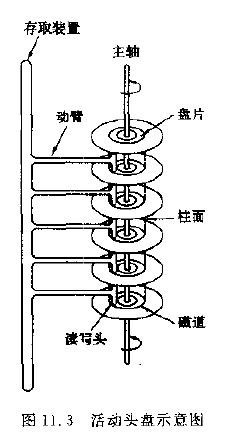

http://blog.chinaunix.net/uid-23069658-id-3413957.html

https://github.com/julycoding/The-Art-Of-Programming-By-July/blob/master/ebook/zh/03.02.md

本来想写个文件系统的专题, 结果发现对硬盘的内部架构和存储原理还是比较模糊, 因为不了解"一点"硬盘的存储原理对文件系统的认识老是感觉镜花水月, 不踏实. 经过搜集整理资料就由了本文的问世. 借用 Bean_lee 兄一句话: 成果和荣耀归于前辈.

首先, 让我们看一下硬盘的发展史:

- 1956 年 9 月 13 日, IBM 的 IBM 350 RAMAC(Random Access Method of Accounting and Control)是现代硬盘的雏形, 整个硬盘需要 50 个直径为 24 英寸表面涂有磁浆的盘片, 它相当于两个冰箱的体积, 不过其存储容量只有 5MB.
- 1971 年, IBM 开始采用一种名叫 Merlin 的技术生产硬盘, 这种技术据称能使硬盘头更好地在盘片上索引.
- 1973 年, IBM 3340 问世, 主流采用采用红色. 这个大家伙每平方英寸存储 1.7MB 的数据, 在当时已经创了一个纪录. 许多公司共享这些系统, 需要时按照时间和存储空间租用它. 租赁价值为 7.81 美元每兆, 这个价格比当时汽油的价格还贵 38%. 它拥有"温彻斯特"这个绰号, 也就是我们现在所熟知的"温氏架构". 来源于它两个 30MB 的存储单元, 恰好是当时出名的"温彻斯特来福枪"的口径和填弹量. 至此, 硬盘的基本架构被确立.
- 1979 年, IBM 发明了 Thin Film 磁头, 使硬盘的数据定位更加准确, 因此使得硬盘的密度大幅提升.
- 1980 年, 两位前 IBM 员工创立的公司开发出 5.25 英寸规格的 5MB 硬盘, 这是首款面向台式机的产品, 而该公司正是希捷公司(Seagate)公司.
- 1982 年, 日立发布了全球首款容量超过 1GB 的硬盘. 这就是容量为 1.2GB 的 H-8598 硬盘. 这块硬盘拥有 10 片 14 英寸盘片, 两个读写磁头.
- 1980 年代末, IBM 推出 MR(Magneto Resistive 磁阻)技术令磁头灵敏度大大提升, 使盘片的存储密度较之前的 20Mbpsi(bit/每平方英寸)提高了数十倍, 该技术为硬盘容量的巨大提升奠定了基础. 1991 年, IBM 应用该技术推出了首款 3.5 英寸的 1GB 硬盘.
- 1970 年到 1991 年, 硬盘碟片的存储密度以每年 25%~30%的速度增长; 从 1991 年开始增长到 60%~80%; 至今, 速度提升到 100%甚至是 200%. 从 1997 年开始的惊人速度提升得益于 IBM 的 GMR(Giant Magneto Resistive, 巨磁阻)技术, 它使磁头灵敏度进一步提升, 进而提高了存储密度.
- 1993 年, 康诺(Conner Peripherals)推出了 CP30344 硬盘容量是 340MB.
- 1995 年, 为了配合 Intel 的 LX 芯片组, 昆腾与 Intel 携手发布 UDMA 33 接口—EIDE 标准将原来接口数据传输率从 16.6MB/s 提升到了 33MB/s. 同年, 希捷开发出液态轴承(FDB, Fluid Dynamic Bearing)马达. 所谓的 FDB 就是指将陀螺仪上的技术引进到硬盘生产中, 用厚度相当于头发直径十分之一的油膜取代金属轴承, 减轻了硬盘噪音与发热量.
- 1996 年, 希捷收购康诺(Conner Peripherals)
- 1998 年 2 月, UDMA 66 规格面世.
- 2000 年 10 月, 迈拓(Maxtor)收购昆腾.
- 2003 年 1 月, 日立宣布完成 20.5 亿美元的收购 IBM 硬盘事业部计划, 并成立日立环球存储科技公司(Hitachi Global StorageTechnologies, Hitachi GST).
- 2005 年日立环储和希捷都宣布了将开始大量采用磁盘垂直写入技术(perpendicular recording), 该原理是将平行于盘片的磁场方向改变为垂直(90 度), 更充分地利用的存储空间.
- 2005 年 12 月 21 日, 希捷宣布收购迈拓(Maxtor).
- 2007 年 1 月, 日立环球存储科技宣布将会发售全球首只 1Terabyte 的硬盘, 比原先的预定时间迟了一年多. 硬盘的售价为 399 美元, 平均每美分可以购得 27.5MB 硬盘空间.
- 2011 年 3 月, 西部数据以 43 亿美元的价格, 收购日立环球存储科技.
- 2011 年 4 月, 希捷宣布与三星强化策略伙伴关系.

从硬盘问世至今已经过了 56 个年头, 不管是容量、体积还是生产工艺都较之前有了重大革新和改进, 但一直都保持了"温氏"的架构(固态硬盘除外, 它不是我们今天的主角). 经过封装后的硬盘, 对我们一般呈现出如下的样子:


背面:


打开后盖:


硬盘主要由**盘体、控制电路板和接口部件**组成. 盘体就是一个密封, 封装了**多个盘片**的腔体; 控制电路包含硬盘 BIOS, 主控芯片和硬盘缓存等单元; 接口部件包含电源、数据接口主从跳线等.

硬盘的盘片一般采用合金材料, 多数为铝合金(IBM 曾经开发过玻璃材质的盘片, 好像现在有些厂家也生产玻璃材质的盘片, 但不多见), 盘面上涂着磁性材料, 厚度一般在 0.5mm 左右. **有些硬盘只装一张盘片, 有些则有多张**. 硬盘盘片安装在主轴电机的转轴上, 在主轴电机的带动下作高速旋转. 每张盘片的容量称为单碟容量, 而一块硬盘的总容量就是所有盘片容量的总和. 早期硬盘由于单碟容量低, 所以盘片较多. **现代的硬盘盘片一般只有少数几片**. 盘片上的记录密度很大, 而且盘片工作时会高速旋转, 为保证其工作的稳定, 数据保存的长久, 所以硬片都是密封在硬盘内部. 不可自行拆卸硬盘, 在普通环境下空气中的灰尘、指纹、头发丝等细小杂质都会对硬盘造成永久损害. 一个被大卸八块的硬盘如下:


接下来我们了解一下硬盘的盘面, 柱面, 磁道和扇区的概念.

## 盘面

硬盘一般会有一个或多个盘片, 每个盘片可以有两个面(Side), 即第 1 个盘片的正面称为 0 面, 反面称为 1 面; 第 2 个盘片的正面称为 2 面, 反面称为 3 面...依次类推. 每个盘面对应一个磁头(head)用于读写数据. 第一个盘面的正面的磁头称为 0 磁头, 背面称为 1 磁头; 第二个盘片正面的磁头称为 2 磁头, 背面称为 3 磁头, 以此类推. **盘面数和磁头数是相等的**.


**一张单面的盘片需要一个磁头, 双面的盘片则需要两个磁头**. 硬盘采用高精度、轻型磁头驱动和定位系统. 这种系统能使磁头在盘面上快速移动, 读写硬盘时, 磁头依靠**磁盘的高速旋转引起的空气动力效应**悬浮在盘面上, 与盘面的距离不到 1 微米(约为头发直径的百分之一), 可以在极短的时间内精确定位到计算机指令指定的磁道上.

早期由于定位系统限制, 磁头传动臂只能在盘片的内外磁道之间移动. 因此, 不管开机还是关机, 磁头总在盘片上. 所不同的是, 关机时磁头停留在盘片启停区, 开机时磁头"飞行"在磁盘片上方.

## 磁道(track)

每个盘片的每个盘面被划分成多个狭窄的同心圆环, 数据就是存储在这样的同心圆环上, 我们将这样的圆环称为磁道(Track), 每个盘面可以划分多个磁道. 关机时磁头停留在硬盘的着陆区(Landing Zone), 这个着陆区以前是位于离盘心最近的区域, 不存放任何数据. 在后期的硬盘工艺中有些硬盘生产厂商将这个区域被移动到了盘片的外面, 如下所示:


在每个盘面的最外圈, 离盘心最远的地方是"0"磁道, 向盘心方向依次增长为 1 磁道, 2 磁道, 等等. 硬盘数据的存放就是从最外圈开始.

## 扇区(sector)

根据硬盘规格的不同, 磁道数可以从几百到成千上万不等. 每个磁道上可以存储数 KB 的数据, 但计算机并不需要一次读写这么多数据. 在这一这基础上, 又把每个磁道划分成若干弧段, 每段称为一个扇区(Sector). **扇区是硬盘上存储与读取的物理单位**, 每个扇区可存储 128×2\^N 次方(N＝0,1,2,3)字节的数据. 从 DOS 时代起, 每扇区是 128×2\^2＝512 字节, 现在已经成了业界不成文的规定, 也没有哪个硬盘厂商试图去改变这种约定. 也就是说**即使计算机只需要硬盘上存储的某个字节, 也须一次把这个字节所在的扇区中的全部 512 字节读入内存, 再选择所需的那个字节**. 另外, **扇区的编号是从 1 开始, 而不是 0**, 这一点需要注意. 另外, 硬盘在划分扇区时, 和软盘是有一定区别的. 软盘的一个磁道中, 扇区号一般依次编排, 如 1 号, 2 号, 3 号...以此类推. 但在**硬盘磁道中, 扇区号是按照某个间隔跳跃着编排**. 比如, 2 号扇区并不是 1 号扇区后的按顺序的第一个而是第八个, 3 号扇区又是 2 号扇区后的按顺序的第八个, 依此类推, 这个"八"称为**交叉因子**.

这个交叉因子的来历有必要详述一下, 我们知道, 数据读取经常需要按顺序读取一系列相邻的扇区(逻辑数据相邻). 如对磁道扇区按物理顺序进行编号, 很有可能出现当磁头读取完第一个扇区后, **由于盘片转速过快来不及读取下一个扇区**, (要知道物理相邻扇区位置距离是极小的), 必须等待转完一圈, 这极大浪费了时间. 所以就用交叉来解决这个问题. 增加了交叉因子后的扇区编号一般是下面这个样子:


## 柱面(cylinder)

柱面其实是我们抽象出来的一个逻辑概念, 前面说过, 离盘心最远的磁道为 0 磁道, 依此往里为 1 磁道, 2 磁道, 3 磁道...., 不同面上相同磁道编号则组成了一个圆柱面, 即所称的柱面(Cylinder). 这里要注意, **硬盘数据的读写是按柱面进行, 即磁头读写数据时首先在同一柱面内从 0 磁头开始进行操作, 依次向下在同一柱面的不同盘面(即磁头上)进行操作, 只有在同一柱面所有的磁头全部读写完毕后磁头才转移到下一柱面, 因为选取磁头只需通过电子切换即可, 而选取柱面则必须通过机械切换**. 电子切换比从在机械上磁头向邻近磁道移动快得多. 因此, 数据的读写按柱面进行, 而不按盘面进行.  读写数据都是按照这种方式进行, 尽可能提高了硬盘读写效率.

## 簇(cluster)

将**物理相邻的若干个扇区称为了一个簇**. **操作系统读写磁盘的基本单位是扇区**, 而**文件系统的基本单位是簇(Cluster)**. 在 Windows 下, 随便找个几字节的文件, 在其上面点击鼠标右键选择属性, 看看实际大小与占用空间两项内容, 如大小: 15 字节 (15 字节),  占用空间: 4.00 KB (4, 096 字节). 这里的占用空间就是你机器分区的簇大小, 因为再小的文件都会占用空间, 逻辑基本单位是 4K, 所以都会占用 4K.  簇一般有这几类大小 4K, 8K, 16K, 32K, 64K 等. 簇越大存储性能越好, 但空间浪费严重. 簇越小性能相对越低, 但空间利用率高. NTFS 格式的文件系统簇的大小为 4K.

## 磁盘构造

磁盘是一个扁平的圆盘(与电唱机的唱片类似). 盘面上有许多称为磁道的圆圈, 数据就记录在这些磁道上. 磁盘可以是单片的, 也可以是由若干盘片组成的盘组, 每一盘片上有两个面. 如下图 11.3 中所示的 6 片盘组为例, 除去最顶端和最底端的外侧面不存储数据之外, 一共有 10 个面可以用来保存信息.



当磁盘驱动器执行读/写功能时. 盘片装在一个主轴上, 并绕主轴高速旋转, 当磁道在读/写头(又叫磁头) 下通过时, 就可以进行数据的读 / 写了.

一般磁盘分为固定头盘(磁头固定)和活动头盘. 固定头盘的每一个磁道上都有独立的磁头, 它是固定不动的, 专门负责这一磁道上数据的读/写.

活动头盘 (如上图)的磁头是可移动的. 每一个盘面上只有一个磁头(磁头是双向的, 因此正反盘面都能读写). 它可以从该面的一个磁道移动到另一个磁道. 所有磁头都装在同一个动臂上, 因此不同盘面上的所有磁头都是同时移动的(行动整齐划一). 当盘片绕主轴旋转的时候, 磁头与旋转的盘片形成一个圆柱体. 各个盘面上半径相同的磁道组成了一个圆柱面, 我们称为柱面 . 因此, 柱面的个数也就是盘面上的磁道数.

## 硬盘读写数据的过程

代硬盘寻道都是采用 CHS(Cylinder Head Sector)的方式.

1. 硬盘读取数据时, 读写磁头沿径向移动, 移到要读取的扇区所在**磁道的上方**, 这段时间称为**寻道时间(seek time)**. 因读写磁头的起始位置与目标位置之间的距离不同, 寻道时间也不同. 目前硬盘一般为 2 到 30 毫秒, 平均约为 9 毫秒.
2. 磁头到达指定磁道后, 然后通过盘片的旋转, 使得要读取的扇区转到读写磁头的下方, 这段时间称为**旋转延迟时间(rotational latencytime)**.

一个 7200(转/每分钟)的硬盘, 每旋转一周所需时间为 60×1000÷7200=8.33 毫秒, 则平均旋转延迟时间为 8.33÷2=4.17 毫秒(平均情况下, 需要旋转半圈). 平均寻道时间和平均选装延迟称为平均存取时间.

在博文"Linux 启动过程分析"中我们提到过 MBR, 它是存在于硬盘的 0 柱面, 0 磁头, 1 扇区里, 占 512 字节的空间. 这 512 字节里包含了主引导程序 Bootloader 和磁盘分区表 DPT. 其中 Bootloader 占 446 字节, 分区表占 64 字节, 一个分区要占用 16 字节, 64 字节的分区表只能被划分 4 个分区, 这也就是目前我们的硬盘最多只能支持 4 个分区记录的原因.


即, 如果你将硬盘分成 4 个主分区的话, 必须确保所有的磁盘空间都被使用了(这不是废话么), 一般情况下我们都是划分一个主分区加一个扩展分区, 然后在扩展分区里再继续划分逻辑分区. 当然, 逻辑分区表也需要分区表, 它是存在于扩展分区的第一个扇区里, 所以逻辑分区的个数最多也只能有 512/16=32 个, 并不是想分多少个逻辑分区都可以.

注意, 我们所说的扩展分区也是要占用分区表项的. 例如, 如果我们的硬盘只划分一个主分区和一个逻辑分区, 此时的分区表的排列如下:

```
Device Boot  Start   End      Blocks   Id   System

/dev/sda1      1      19      152586   83    Linux

/dev/sda2      20    2569    20482875  83   Extended

/dev/sda5     2570   19457    4128705  82    Linux
```

主分区为 1 号分区, 扩展分区占用了 2 号分区, 3 和 4 号扩展分区被预留了下来, 逻辑分区从 5 开始编号依次递增, 这里我们只划分了一个逻辑分区.

-------------

磁盘上数据必须用一个三维地址唯一标示: 柱面号、盘面号、块号(磁道上的盘块, 扇区).

读/写磁盘上某一指定数据需要下面 3 个步骤:

1. 首先移动臂根据柱面号使磁头移动到所需要的**柱面**上, 这一过程被称为定位或查找 .
2. 如上图 11.3 中所示的 6 盘组示意图中, 所有磁头都定位到了 10 个盘面的 10 条磁道上(磁头都是双向的). 这时根据盘面号来确定指定盘面上的磁道.
3. 盘面确定以后, 盘片开始旋转, 将指定块号的磁道段移动至磁头下.

经过上面三个步骤, 指定数据的存储位置就被找到. 这时就可以开始读/写操作了.

访问某一具体信息, 由 3 部分时间组成:

* 查找时间(seek time) Ts: 完成上述步骤(1)所需要的时间. 这部分时间代价最高, 最大可达到 0.1s 左右.
* 等待时间(latency time) Tl: 完成上述步骤(3)所需要的时间. 由于盘片绕主轴旋转速度很快, 一般为 7200 转/分(电脑硬盘的性能指标之一, 家用的普通硬盘的转速一般有 5400rpm(笔记本)、7200rpm 几种). 因此一般旋转一圈大约 0.0083s.
* 传输时间(transmission time) Tt: 数据通过系统总线传送到内存的时间, 一般传输一个字节(byte)大概 0.02us=2\*10^(-8)s

**磁盘读取数据是以盘块**(block)**为基本单位的. **位于同一盘块中的所有数据都能被一次性全部读取出来. 而磁盘 IO 代价主要花费在查找时间 Ts 上. 因此我们应该尽量将相关信息存放在同一盘块, 同一磁道中. 或者至少放在同一柱面或相邻柱面上, 以求在**读/写信息时尽量减少磁头来回移动的次数, 避免过多的查找时间 Ts. **