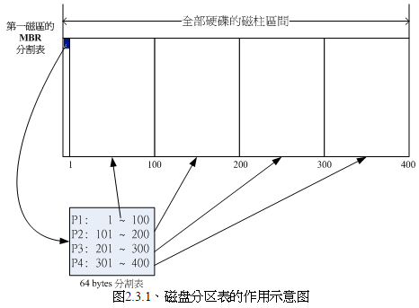
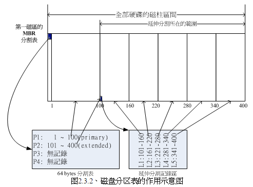
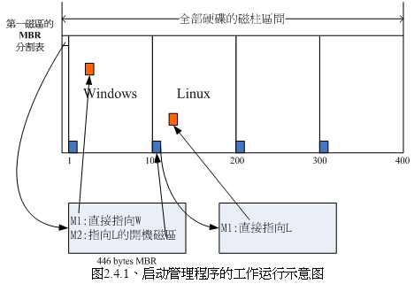

<!-- @import "[TOC]" {cmd="toc" depthFrom=1 depthTo=6 orderedList=false} -->

<!-- code_chunk_output -->

- [磁盘组成](#磁盘组成)
- [磁盘分区表(partition table)](#磁盘分区表partition-table)
- [开机流程](#开机流程)

<!-- /code_chunk_output -->

# 磁盘组成

 - 磁盘的物理组成, 包括许多盘片、机械手臂、(可能多个)磁头(header)与主轴马达等. 盘片上面由圆心以放射状的方式分割出磁盘的最小存储单位, 就是扇区(Sector). 扇区的一个圆就组成了磁道(Track), 如果是在多硬盘上, 在所有盘片上面的同一个磁道组成一个柱面(Cylinder), 柱面就是分割硬盘的最小单位.
 - 计算整个硬盘的存储量时候, 简单的计算公式是: header 数量 × 每个 header 负责的柱面数量 × 每个柱面所包含的扇区数量 × 扇区的容量, 单位换算是: header × cylinder/header × sector/cylinder × 512bytes/sector, 不过一般厂商显示硬盘容量时候, 以十进制编号.
 - 盘片上是数据, 可能有多个盘片, 盘片上面分为扇区和柱面, 柱面由扇区组成, 扇区大小固定, 一般 512 bytes.
 - 整块磁盘的 0 磁头、0 柱面、1 扇区(思考这几个数字在磁盘中作用)特别重要, 记录磁盘的重要信息, 主要记录了
    * 主引导分区(master boot record, MBR): 可以安装引导加载程序的地方, 446bytes.
    * 分区表(partition table): 记录了整块硬盘分区的状态, 64bytes.
 - 硬盘只有进行分区才能进行使用, 分区信息记录在分区表.

# 磁盘分区表(partition table)
 - **柱面是分区、文件系统的最小单位**, 根据柱面号码进行处理的.
 - 分区表的 64bytes, 分为 4 组记录区, 这四组信息成为主(Primary)或扩展(Extended)分区, 每组记录了该区段的启动与结束柱面. 其实所谓的"分区"就是针对这个 64bytes 的分区表进行设置而已. 硬盘默认的分区表仅能写入四组分区信息.



```
假设一块硬盘/dev/hda, 柱面区间是 1-400, 第一扇区的分区表记录的四组记录是: P1(1-100)、P2(101-200)、P3(201-300)、
P4(301-400), 那么:
    * 在 Linux 系统中, 这四个分区对应的设备名称分别是 P1:/dev/hda1,P2:/dev/hda2,P3:/dev/hda3,P4:/dev/hda4
    * 在 Windows 系统中, 四个分区的代号应该是 C、D、E、F, 当数据写入 F 盘, 那么数据就写入了磁盘的 301-400 柱面.
```
 - 分区作用, 可以从数据安全性(分区之间不影响)和性能(数据读取锁定柱面范围)角度考虑.
 - 柱面由扇区组成, 第一扇区可以利用额外的扇区记录分区信息, 从而达到不止四个分区.
 - 扩展分区目的是使用额外的扇区来记录分区信息, 扩展分区本身不能用来初始化. 扩展分区指向的区块继续分区出**逻辑分区**, 逻辑分区使用的范围就是扩展分区指定的范围.



上述分区在 Linux 系统中设备名称如下:
```
 - P1:/dev/hda1
 - P2:/dev/hda2
 - L1:/dev/hda5
 - L2:/dev/hda6
 - L3:/dev/hda7
 - L4:/dev/hda8
 - L5:/dev/hda9

注: 从上面命名可以看出来, 前四个号码都是保留给 primary 或 extended 用的, 所以逻辑分区设备从 5 开始
```
 - primary 和 extended 分区最多有四个(硬盘限制)
 - extended 分区最多一个(操作系统限制)
 - 逻辑分区由扩展分区继续切割出来的分区
 - 能够初始化的分区为主分区和逻辑分区, 扩展分区不可初始化
 - 逻辑分区数量根据操作系统不同而不同. Linux 中, IDE 硬盘最多 59 个逻辑分区(5-63), SATA 有 11 个(5-15)

# 开机流程
简单来讲, 开机流程如下:
```
1.BIOS: 开机主动执行的韧体, 取得能够开机的硬盘, 并且读取该硬盘的第 0 扇区的 MBR 位置

2.MBR: 第一个可开机设备的第一个扇区内的主引导分区块, 里面包含引导加载程序(Boot loader)

3.引导加载程序(Boot loader): 可读取内核文件来执行的软件. 该软件由操作系统在安装在 MBR 上面, 所以会识别硬盘的文件系统格式, 因此可以读取内核文件

4.内核文件: 开始操作系统的功能

注: BIOS 和 MBR 由硬件支持, Boot loader 操作系统提供
```
Boot loader 主要工作:
```
- 提供菜单: 不同开机选项, 也是多重引导的重要功能

- 载入内核文件: 直接指向可开机的程序区段来开始操作系统

- 转交给其他 loader:
```
引导加载分区除了安装在 MBR, 还可以安装在**每个分区**的引导扇区(boot sector). 分区有自己的启动扇区, 这个特点造就"多重引导"功能.

假设计算机有一块硬盘, 分为四个分区, 其中第一第二分区分别安装 Windows 以及 Linux, 如何在开机时候选择 Linux 或 Windows 开机?假设 MBR 内安装的是可同时识别 Windows/Linux 系统的引导加载程序, 整个流程如图:



图中可以看出, MBR 的引导加载程序提供两个菜单, 菜单一(M1)可以直接加载 Windows 的内核文件来开机; 菜单二(M2)则是将引导加载工作交给第二个分区的启动扇区(boot loader, 里面安装了引导加载程序). 当用户在开机的时候选择菜单二, 那么整个引导加载工作就会交给第二分区的引导加载程序(启动扇区内). 当第二个引导加载程序启动后, 该引导加载程序内(上图中)仅有一个开机菜单, 因此就能够使用 Linux 的内核文件来开机.

总结:

- 每个分区都拥有自己的启动扇区(boot sector)
- 图中的系统分区为第一及第二分区,
- 实际可启动的内核文件是放置到各分区的！
- loader 只会认识自己的系统分区的可启动核心文件, 以及其他 loader 而已;
- loader 可直接指向或者是间接将管理权转交给另一个管理程序(引导加载程序).

为什么人家常常说: 『如果要安装多重启动, 最好先安装 Windows 再安装 Linux』呢?这是因为:

```
- Linux 在安装的时候, 你可以选择将引导加载程序安装在 MBR 或个别分区的启动扇区,
而且 Linux 的 loader 可以手动配置菜单(就是上图的 M1, M2...), 所以你可以在 Linux 的 boot loader 里面加入 Windows 启动的选项;

- Windows 在安装的时候, 它的安装程序会主动的覆盖掉 MBR 以及自己所在分区的启动磁区, 你没有选择的机会,  而且它没有让我们自己选择菜单的功能.
```

因此如果先安装 Linux 再安装 Windows, 则 MBR 的引导加载程序就只会有 Windows 的选项, 而不会有 Linux 选项(因为原有在 MBR 中的 Linux 引导加载程序会被覆盖掉). 那需要重新安装 Linux 一次吗?当然不需要, 你只要用尽各种方法来处理 MBR 的内容即可.